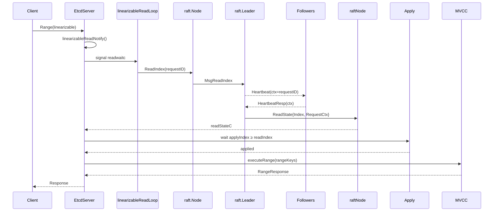

面向 `EtcdServer.Range` 的线性一致读（linearizable read）链路，从 `server → raft/node → readonly → server` 全流程梳理，并补充 MVCC 读取与工程实践要点。表述贴近源码语义。

## 1. 读请求入口：`EtcdServer.Range`

```go
func (s *EtcdServer) Range(ctx context.Context, r *pb.RangeRequest) (*pb.RangeResponse, error)
````

* **一致性策略**

  * `linearizable`（默认）：发起一轮 **ReadIndex**（心跳仲裁）以确保本地读取不落后于集群多数派的提交点。牺牲一点延迟/吞吐换取**线性一致性**。
  * `serializable`：**本地读**，无需跨节点心跳，延迟低但可能读到 **旧值**（如刚发生主从切换）。

开启 `linearizable` 时，请求会先进入线性读通知路径；若是 follower 节点，会返回 leader hint，客户端重试至 leader（或 server 层启用代理转发实现）。

---

## 2. 线性读协程：通知与聚合

### 2.1 通知：`linearizableReadNotify`

```go
func (s *EtcdServer) linearizableReadNotify(ctx context.Context) error
```

* 向 `s.readwaitc` 发送一个空信号，**不携带数据**，仅作为「有线性读待处理」的提示。
* 后台有一个专用协程负责**聚合**这些读请求，**批量**触发一次 ReadIndex，摊薄心跳开销。

### 2.2 主循环：`linearizableReadLoop`

```go
func (s *EtcdServer) linearizableReadLoop()
```

* 周期性从 `readwaitc` 拉取信号并**生成 requestID**（`uint64` → `[]byte`）。
* 调用 `node.ReadIndex(ctx, reqID)`；该调用**不会写入日志**，只进行一次**心跳式仲裁**。
* 同时监听 `leaderChangedNotifier`，若期间发生**领导者变更**，会丢弃本轮并重新发起。

> **聚合**：在一次 ReadIndex 待返回期间，新到的线性读请求会“排队”共享同一个读 index，**减少心跳风暴**。

---

## 3. raft 层：ReadIndex 与心跳仲裁

### 3.1 入栈：`node.ReadIndex`

```go
func (n *node) ReadIndex(ctx context.Context, rctx []byte) error {
	return n.step(ctx, pb.Message{
		Type:    pb.MsgReadIndex,
		Entries: []pb.Entry{{Data: rctx}}, // Data = requestID
	})
}
```

* 该消息是**本地消息**（`term==0`），进入 `recvc` 通道，随后在 `node.run()` 中被消费并转交 raft 状态机。

### 3.2 leader 路径：`stepLeader` → `sendMsgReadIndexResponse`

```go
func stepLeader(r *raft, m pb.Message) error {
	switch m.Type {
	case pb.MsgReadIndex:
		sendMsgReadIndexResponse(r, m)
	}
}

func sendMsgReadIndexResponse(r *raft, m pb.Message) {
	switch r.readOnly.option {
	case ReadOnlySafe:
        // 记录快照点：当前 committed
        r.readOnly.addRequest(r.raftLog.committed, m)
        // 本地自确认（leader 自己算一个 ack）
        r.readOnly.recvAck(r.id, m.Entries[0].Data)
        // 带上 requestID 广播一次心跳
        r.bcastHeartbeatWithCtx(m.Entries[0].Data)
    }
}
```

* **ReadOnlySafe**（默认）策略：以 **当前 `committed`** 作为读的下限（快照点），并附带 `requestID` 广播一次 `MsgHeartbeat(ctx)`。
* follower 收到心跳后会**原样携带 ctx** 回 `MsgHeartbeatResp(ctx)`。

### 3.3 心跳响应与多数派确认

```go
case pb.MsgHeartbeatResp:
	pr.RecentActive = true
	pr.MsgAppFlowPaused = false
	if pr.Match < r.raftLog.lastIndex() || pr.State == tracker.StateProbe {
		r.sendAppend(m.From) // 常规心跳附带推进
	}
	if r.readOnly.option != ReadOnlySafe || len(m.Context) == 0 {
		return nil
	}
	// 统计 ack，未达多数派则继续等待
    if r.trk.Voters.VoteResult(r.readOnly.recvAck(m.From, m.Context)) != quorum.VoteWon {
        return nil
    }
    // 多数派确认：推进、出队、生成应答
    rss := r.readOnly.advance(m)
    for _, rs := range rss {
        if resp := r.responseToReadIndexReq(rs.req, rs.index); resp.To != None {
            r.send(resp) // 给远端发 ReadIndexResp
        }
    }
```

* 当携带同一 `requestID` 的心跳响应**达成多数派确认**，该请求以及其之前排队的请求（队列是**有序**的）一并“完成”，得到一个**读索引 `readIndex`**（即当时 leader 的 `committed`）。
* **本地发起**的读请求不下发 `ReadIndexResp`，而是把 `ReadState{Index, RequestCtx}` 放到 raft 的 `readStates` 中，供 `RawNode.Ready()` 取走。

---

## 4. node/raft-node：将 `ReadState` 往上送

```go
func (rn *RawNode) HasReady() bool {
	// ...省略...
	if len(r.readStates) != 0 {
		return true
	}
	return false
}

func (r *raftNode) start(rh *raftReadyHandler) {
	go func() {
        for {
            select {
            case rd := <-r.Ready():
                if len(rd.ReadStates) != 0 {
                    // 取最新一个送给 server 层
                    r.readStateC <- rd.ReadStates[len(rd.ReadStates)-1]
                }
            }
        }
    }()
}
```

* `server` 侧阻塞等待 `readStateC`，拿到 `ReadState.Index` 与对应的 `requestID`。

---

## 5. server：等待本地 apply 追平后再读

```go
func (s *EtcdServer) requestCurrentIndex(leaderChangedNotifier <-chan struct{}, requestId uint64) (uint64, error) {
	_ = s.sendReadIndex(requestId) // 触发 ReadIndex
	for {
		select {
		case rs := <-s.r.readStateC:
			if bytes.Equal(rs.RequestCtx, uint64ToBigEndianBytes(requestId)) {
				return rs.Index, nil // 确认本次的 readIndex
			}
		}
	}
}
```

拿到 `confirmedIndex` 后，**还不能立即读**，需要确保：

```go
if appliedIndex < confirmedIndex {
	select {
	case <-s.applyWait.Wait(confirmedIndex): // 等待本地 apply ≥ confirmedIndex
	case <-s.stopping:
		return
	}
}
```

**关键保证**：只有当本地 `applyIndex ≥ readIndex（= 当时的 committed）` 时，才开始访问 MVCC，确保线性一致。

---

## 6. MVCC 层：索引与数据

### 6.1 读取事务与快照点

```go
func Range(ctx context.Context, lg *zap.Logger, kv mvcc.KV, r *pb.RangeRequest) (*pb.RangeResponse, *traceutil.Trace, error) {
	txnRead := kv.Read(mvcc.ConcurrentReadTxMode, trace) // 并发读事务
	defer txnRead.End()
	return executeRange(ctx, lg, txnRead, r)
}
```

* `store.Read(ConcurrentReadTxMode)`：复制/共享读缓冲，减少与写事务的互斥冲突。
* `store` 维护 `currentRev`（最新版本）与 `compactMainRev`（压缩点），读请求可指定特定 `revision`（快照读）。

### 6.2 基于索引定位版本集合

```go
func (tr *storeTxnCommon) rangeKeys(ctx context.Context, key, end []byte, curRev int64, ro RangeOptions) (*RangeResult, error) {
	revpairs, total := tr.s.kvindex.Revisions(key, end, rev /*=curRev*/, int(ro.Limit))
	// ...
	for i, revpair := range revpairs[:limit] {
		revBytes := RevToBytes(revpair, revBytes)                     // main/sub rev -> bytes
		_, vs := tr.tx.UnsafeRange(schema.Key, revBytes, nil, 0)      // backend/bolt
		_ = kvs[i].Unmarshal(vs[0])                                   // 解码 mvccpb.KeyValue
	}
	return &RangeResult{KVs: kvs, Count: total, Rev: curRev}, nil
}
```

* `kvindex` 将 **key 前缀** 映射到一组 **(mainRev, subRev)**，这是 MVCC 的多版本索引。
* 再用 `revision bytes` 去 backend（bolt/`schema.Key` 桶）检索**真实值**。
* 支持 `limit/keysOnly/countOnly/revision` 等选项；若请求的 `revision < compactMainRev`，返回 **ErrCompacted**。

---

## 7. 小结（链路回顾）

1. server 收到线性读 → 发通知聚合 → 生成 `requestID` 调用 **ReadIndex**；
2. raft leader 记录当前 `committed`、本地 ack 一次并**携带 ctx 发心跳**；
3. 心跳响应达多数派 → 计算得到 `readIndex`（当时 `committed`）；
4. `ReadState{Index, RequestCtx}` 送回 server；
5. server 等待本地 **applyIndex ≥ readIndex**；
6. 进入 MVCC：`kvindex` 取多版本 → backend 按 revision 取值 → 返回给客户端。

**保证**：读到的数据不早于集群当时多数派的提交点，实现线性一致。

---

## 8. 实战经验与优化建议

### 8.1 一致性与延迟的权衡

* **大量读、对新鲜度要求不高**：可用 `serializable`，读在 follower 本地完成，**延迟最低**。适合**报表/列表页**等弱一致读。
* **强一致读取**（余额、配置开关、分布式锁元数据）：使用 `linearizable`，避免读到旧值。

### 8.2 降低 ReadIndex 开销

* **批量聚合**：服务端已聚合一次 ReadIndex 覆盖多请求；客户端侧也可做**请求合并**，比如把多 key 合并为一个 Range 或 Txn，减少心跳轮次。
* **Leader 读优先**：客户端优先直连 leader，避免无效跳转；etcd/clientv3 的 balancer 支持基于 leader 的优选策略。
* **合适的超时**：`linearizable read timeout` 过短在抖动时易超时，过长又放大 tail 延迟；结合你的 RTT 与负载评估。

### 8.3 避免 apply 落后造成读阻塞

* ReadIndex 通过后还要等本地 `apply` 追平。若 **WAL fsync、backend commit** 或 **应用层 Apply 回调**阻塞，会出现**读抖动**：

  * 监控 `apply duration / backend commit duration / fsync`，必要时**独立磁盘**或**更快存储**；
  * 调整 `snapshot-count`，避免频繁快照阻塞；
  * **按键/业务分桶**，减少热点键导致的 apply 串行瓶颈。

### 8.4 MVCC 与大 key/大范围

* 大范围前缀扫描会拖慢 bolt 游标遍历，建议：

  * 设计**更细前缀**与**分页（limit+continue）**；
  * `keysOnly/countOnly` 用于仅需存在性/计数的请求；
  * 关注 `compact` 与 `defrag`，避免历史版本过多导致后端膨胀、读放大。

### 8.5 故障与边界

* **leader 变更**：`linearizableReadLoop` 监听 leader 变更并重试，客户端要**重试幂等**；
* **慢/失联成员**：心跳仲裁按**多数派**计算，少数派不影响 ReadIndex，但**网络抖动**会放大延迟；
* **learner/非投票成员**：不计入多数派，仅做复制；不要把线性读延迟问题归因于 learner。

### 8.6 读高峰的工程化措施

* **读写隔离**：读多场景可以**多 follower 横向扩容**，配合 `serializable` 降 leader 压力；
* **缓存**：在业务侧对**稳定键**（如服务发现清单）做**短 TTL 缓存**，把线性读留给确需强一致的关键点；
* **分层配置**：将“强一致必读”的小量配置与“可过期读”的批量数据分层，避免一刀切全部走线性读。

---

## 9. 关键点校准

* **ReadIndex 不产生日志条目**，依靠**心跳多数派确认 + 本地 apply 追平**实现强一致读。
* raft `readonly` 模块的队列是**有序**的：当某个 `requestID` 达多数派，**之前**排队的请求也一并完成。
* `ReadOnlySafe` 是 etcd 默认策略；`ReadOnlyLeaseBased` 依赖 leader lease 时间界限，适用性更苛刻，etcd 默认不采用。
* follower 收到 `Range(linearizable)` 通常**引导至 leader**，不要指望 follower 承接线性读负载。


## 10. 小结

* 线性一致读的本质：**一次心跳仲裁拿到“读下限”（committed）**，并保证**本地已应用不落后**，之后再做 MVCC 快照读。
* 一致性与延迟可通过 `linearizable` / `serializable` 切换、请求聚合、直连 leader 等手段平衡。
* 真正的性能瓶颈常在 **apply/后端存储**，辅以**索引设计与分页**可显著改善尾延迟。


## 附录：关键函数卡片与调用链/时序/结构体关系与合并要点

### A1. 关键函数卡片（核心代码+功能说明）

- `EtcdServer.Range(ctx, *pb.RangeRequest) (*pb.RangeResponse, error)`
  - 作用：按一致性策略执行读；`linearizable` 走 ReadIndex 路径，`serializable` 走本地快照读。
  - 核心：当 `linearizable` 时先 `linearizableReadNotify` 并等待 `applyIndex ≥ readIndex` 后进入 MVCC。

- `EtcdServer.linearizableReadNotify(ctx) error`
  - 作用：向 `readwaitc` 投递信号，提示聚合一批线性读。
  - 核心（示意）：
    ```go
    select { case s.readwaitc <- struct{}{}: default: }
    ```

- `EtcdServer.linearizableReadLoop()`
  - 作用：批量生成 `requestID` 并触发 `node.ReadIndex`，监听 leader 变更重试。
  - 核心：聚合窗口内的读共享一次 `ReadIndex` 结果。

- `node.ReadIndex(ctx, rctx []byte) error`
  - 作用：提交 `MsgReadIndex` 本地消息到 raft，附带 `requestID`。

- `stepLeader(...pb.Message)` + `sendMsgReadIndexResponse`
  - 作用：在 `ReadOnlySafe` 下以当前 `committed` 作为读下限，携带 `requestID` 广播心跳并累计多数派 ack。

- `RawNode.Ready()/HasReady()`（含 `readStates`）
  - 作用：当 `readStates` 非空时供上层取回 `ReadState{Index, RequestCtx}`。

- `EtcdServer.requestCurrentIndex(..., requestID)`
  - 作用：等待与本次 `requestID` 匹配的 `ReadState`，得到 `readIndex`。
  - 关键：随后阻塞直到 `applyIndex ≥ readIndex` 再执行读。

- MVCC：`store.Read(ConcurrentReadTxMode)` → `executeRange` → `rangeKeys`
  - 作用：在快照 `curRev` 上按索引定位版本集合并从 backend 取值。

### A2. 关键函数调用链（linearizable）

`EtcdServer.Range` → `linearizableReadNotify` → `linearizableReadLoop` → `node.ReadIndex` → raft `stepLeader/sendMsgReadIndexResponse` → 多数派心跳确认 → `readStates` → `raftNode.readStateC` → `EtcdServer.requestCurrentIndex`（等待 `apply ≥ readIndex`）→ MVCC `Range`/`executeRange`/`rangeKeys`。

### A3. 时序图（Mermaid）



### A4. 关键结构体关系图（Mermaid）

```mermaid
classDiagram
    class EtcdServer {
      - readwaitc chan struct{}
      - applyWait
      - r *raftNode
      + Range()
      + linearizableReadNotify()
      + requestCurrentIndex()
    }
    class raftNode {
      + Ready()
      + readStateC chan ReadState
    }
    class raft_raft {
      - readOnly readonly
      - raftLog
      + Step()
    }
    class readonly {
      + addRequest()
      + recvAck()
      + advance()
    }
    class store {
      - currentRev int64
      - kvindex
      - b backend
      + Read()
    }
    EtcdServer --> raftNode
    raftNode --> raft_raft
    raft_raft --> readonly
    store --> kvindex
    store --> backend
```

### A5. 细节小结

* 一致性边界：ReadIndex 提供读下限（当时 `committed`），读在 `apply ≥ readIndex` 后执行。
* Ready/Apply 环：上层通过 `Ready()` 接收 `ReadStates/CommittedEntries`，应用后对外可见。
* MVCC 一致视图：读在快照 `curRev` 上进行，写通过回写读缓冲实现“立即可读”。
* 失败与重试：leader 变更触发重试；网络抖动影响心跳确认与尾延迟。


* `EtcdServer.sendReadIndex(requestID uint64) error`
  * 作用：封装 `node.ReadIndex` 的触发与上下文管理，附带 `requestID`。

* `readonly.addRequest(committed uint64, m pb.Message)` / `recvAck(id, ctx)` / `advance(m)`
  * 作用：记录当前快照点、累计心跳 ack，并在多数派后推进/出队并形成 `ReadState{Index, RequestCtx}`。

* `applyWait.Wait(index uint64) <-chan struct{}`
  * 作用：返回一个等待通道，用于等待本地 `applyIndex ≥ index`。

* `kvindex.Revisions(key, end, rev, limit)`
  * 作用：基于键前缀与快照点返回多版本 `(mainRev, subRev)` 列表与总数。

* `backend.ReadTx.UnsafeRange(bucket, key, end, limit)`
  * 作用：在只读事务中按编码后的 revision bytes 范围读取底层存储值。


* `readonly`
  * 字段：`option`、请求队列、`acks` 跟踪；与 `raftLog.committed` 配合确定读下限。
* `raftLog`
  * 字段：`committed/lastIndex/term`；提供当前提交水位与日志元信息。
* `ReadState`
  * 字段：`Index`（读下限）、`RequestCtx`（requestID 原样回传）。
* `store`
  * 字段：`currentRev/compactMainRev`、`kvindex`、`backend`；提供快照一致性与索引/数据访问。

