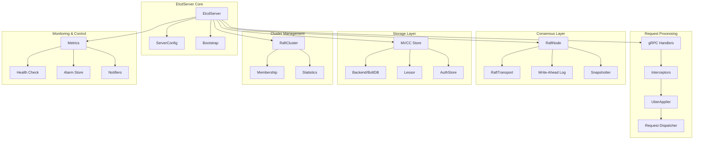
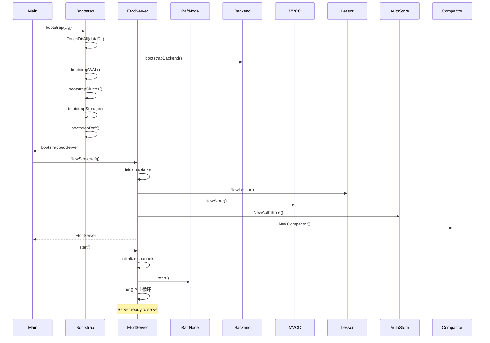
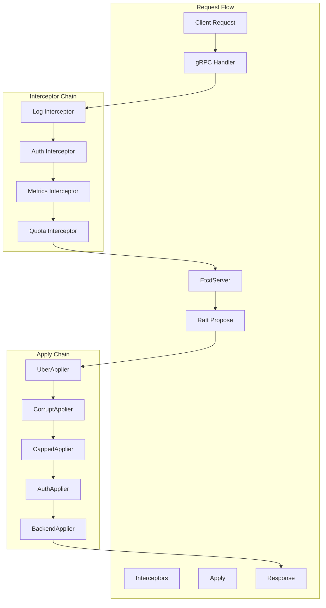
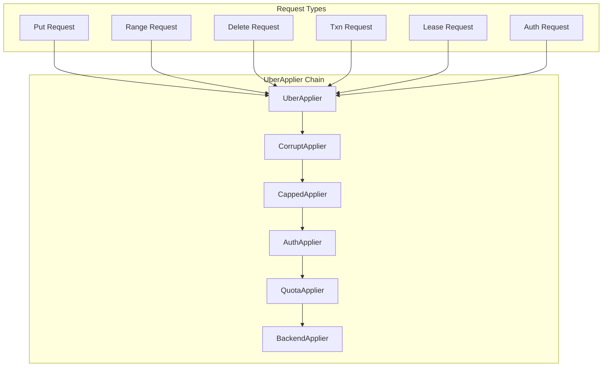

# etcd Server 模块深入分析

EtcdServer 是 etcd 的核心模块，负责协调各个子系统的工作，处理客户端请求，管理集群状态。本文将深入分析 Server 模块的架构设计、启动流程和关键实现。

## 1. Server 模块架构

### 1.1 整体架构图



### 1.2 核心数据结构

```go
// server/etcdserver/server.go
type EtcdServer struct {
    // 原子操作字段 - 保持 64 位对齐
    inflightSnapshots atomic.Int64   // 正在进行的快照数量
    appliedIndex      atomic.Uint64  // 已应用的日志索引
    committedIndex    atomic.Uint64  // 已提交的日志索引
    term              atomic.Uint64  // 当前任期
    lead              atomic.Uint64  // 当前领导者ID

    // 一致性索引管理
    consistIndex cindex.ConsistentIndexer

    // Raft 节点
    r raftNode

    // 通道和同步
    readych       chan struct{}      // 就绪通知
    readwaitc     chan struct{}      // 读等待通知
    readNotifier  *notifier          // 读通知器
    stop          chan struct{}      // 停止信号
    stopping      chan struct{}      // 正在停止
    done          chan struct{}      // 完成信号
    leaderChanged *notify.Notifier   // 领导者变更通知

    // 配置和日志
    Cfg  config.ServerConfig
    lgMu *sync.RWMutex
    lg   *zap.Logger

    // 等待机制
    w         wait.Wait     // 请求等待
    applyWait wait.WaitTime // 应用等待

    // 集群管理
    memberID   types.ID
    attributes membership.Attributes
    cluster    *membership.RaftCluster

    // 存储相关
    v2store     v2store.Store
    snapshotter *snap.Snapshotter
    be          backend.Backend
    lessor      lease.Lessor
    kv          mvcc.ConsistentWatchableKV
    authStore   auth.AuthStore

    // 应用器
    uberApply apply.UberApplier

    // 统计和监控
    stats  *stats.ServerStats
    lstats *stats.LeaderStats

    // 其他组件
    compactor         mvcc.Compactor
    peerRt            http.RoundTripper
    reqIDGen          *idutil.Generator
    AccessController  *AccessController
}
```

## 2. 启动流程分析

### 2.1 启动时序图



### 2.2 Bootstrap 过程

```go
// server/etcdserver/bootstrap.go
func bootstrap(cfg config.ServerConfig) (b *bootstrappedServer, err error) {
    // 1. 检查和创建数据目录
    if terr := fileutil.TouchDirAll(cfg.Logger, cfg.DataDir); terr != nil {
        return nil, fmt.Errorf("cannot access data directory: %w", terr)
    }

    if terr := fileutil.TouchDirAll(cfg.Logger, cfg.MemberDir()); terr != nil {
        return nil, fmt.Errorf("cannot access member directory: %w", terr)
    }

    // 2. 初始化快照管理器
    ss := bootstrapSnapshot(cfg)

    // 3. 初始化 Raft HTTP 传输
    prt, err := rafthttp.NewRoundTripper(cfg.PeerTLSInfo, cfg.PeerDialTimeout())
    if err != nil {
        return nil, err
    }

    // 4. 检查 WAL 是否存在
    haveWAL := wal.Exist(cfg.WALDir())
    st := v2store.New(StoreClusterPrefix, StoreKeysPrefix)

    // 5. 初始化后端存储
    backend, err := bootstrapBackend(cfg, haveWAL, st, ss)
    if err != nil {
        return nil, err
    }

    // 6. 初始化 WAL
    var bwal *bootstrappedWAL
    if haveWAL {
        if err = fileutil.IsDirWriteable(cfg.WALDir()); err != nil {
            return nil, fmt.Errorf("cannot write to WAL directory: %w", err)
        }
        cfg.Logger.Info("Bootstrapping WAL from snapshot")
        bwal = bootstrapWALFromSnapshot(cfg, backend.snapshot, backend.ci)
    }

    // 7. 初始化集群
    cfg.Logger.Info("bootstrapping cluster")
    cluster, err := bootstrapCluster(cfg, bwal, prt)
    if err != nil {
        backend.Close()
        return nil, err
    }

    // 8. 初始化存储
    cfg.Logger.Info("bootstrapping storage")
    s := bootstrapStorage(cfg, st, backend, bwal, cluster)

    if err = cluster.Finalize(cfg, s); err != nil {
        backend.Close()
        return nil, err
    }

    // 9. 初始化 Raft
    cfg.Logger.Info("bootstrapping raft")
    raft := bootstrapRaft(cfg, cluster, s.wal)

    return &bootstrappedServer{
        prt:     prt,
        ss:      ss,
        storage: s,
        cluster: cluster,
        raft:    raft,
    }, nil
}
```

### 2.3 Server 初始化

```go
// server/etcdserver/server.go
func NewServer(cfg config.ServerConfig) (srv *EtcdServer, err error) {
    // 1. 执行 bootstrap
    b, err := bootstrap(cfg)
    if err != nil {
        cfg.Logger.Error("bootstrap failed", zap.Error(err))
        return nil, err
    }
    cfg.Logger.Info("bootstrap successfully")

    defer func() {
        if err != nil {
            b.Close()
        }
    }()

    // 2. 创建统计对象
    sstats := stats.NewServerStats(cfg.Name, b.cluster.cl.String())
    lstats := stats.NewLeaderStats(cfg.Logger, b.cluster.nodeID.String())

    // 3. 初始化 EtcdServer
    heartbeat := time.Duration(cfg.TickMs) * time.Millisecond
    srv = &EtcdServer{
        readych:               make(chan struct{}),
        Cfg:                   cfg,
        lgMu:                  new(sync.RWMutex),
        lg:                    cfg.Logger,
        errorc:                make(chan error, 1),
        v2store:               b.storage.st,
        snapshotter:           b.ss,
        r:                     *b.raft.newRaftNode(b.ss, b.storage.wal.w, b.cluster.cl),
        memberID:              b.cluster.nodeID,
        attributes:            membership.Attributes{Name: cfg.Name, ClientURLs: cfg.ClientURLs.StringSlice()},
        cluster:               b.cluster.cl,
        stats:                 sstats,
        lstats:                lstats,
        peerRt:                b.prt,
        reqIDGen:              idutil.NewGenerator(uint16(b.cluster.nodeID), time.Now()),
        AccessController:      &AccessController{CORS: cfg.CORS, HostWhitelist: cfg.HostWhitelist},
        consistIndex:          b.storage.backend.ci,
        firstCommitInTerm:     notify.NewNotifier(),
        clusterVersionChanged: notify.NewNotifier(),
    }

    // 4. 设置后端存储
    srv.be = b.storage.backend.be
    srv.beHooks = b.storage.backend.beHooks
    minTTL := time.Duration((3*cfg.ElectionTicks)/2) * heartbeat

    // 5. 初始化租约管理器
    srv.lessor = lease.NewLessor(
        srv.Logger(),
        srv.be,
        srv.cluster,
        lease.LessorConfig{
            MinLeaseTTL:                int64(math.Ceil(minTTL.Seconds())),
            CheckpointInterval:         cfg.LeaseCheckpointInterval,
            CheckpointPersist:          cfg.LeaseCheckpointPersist,
            ExpiredLeasesRetryInterval: srv.Cfg.ReqTimeout(),
        })

    // 6. 初始化 MVCC 存储
    srv.kv = mvcc.New(srv.Logger(), srv.be, srv.lessor, mvcc.StoreConfig{
        CompactionBatchLimit: cfg.CompactionBatchLimit,
        CompactionSleepInterval: cfg.CompactionSleepInterval,
    })

    // 7. 初始化认证存储
    srv.authStore = auth.NewAuthStore(srv.Logger(), srv.be, srv.kv, cfg.BcryptCost)

    // 8. 初始化压缩器
    if num := cfg.AutoCompactionRetention; num != 0 {
        srv.compactor, err = v3compactor.New(cfg.Logger(), cfg.AutoCompactionMode, num, srv.kv, srv)
        if err != nil {
            return nil, err
        }
        srv.compactor.Run()
    }

    // 9. 初始化应用器
    srv.uberApply = apply.NewUberApplier(
        apply.ApplierOptions{
            Logger:               srv.Logger(),
            KV:                   srv.kv,
            Lessor:               srv.lessor,
            AuthStore:            srv.authStore,
            AlarmStore:           srv.alarmStore,
            Quota:                srv.Cfg.QuotaBackendBytes,
            WarningApplyDuration: cfg.WarningApplyDuration,
            TxnModeWriteWithSharedBuffer: cfg.ExperimentalTxnModeWriteWithSharedBuffer,
        })

    return srv, nil
}
```

## 3. 请求处理机制

### 3.1 请求处理架构



### 3.2 Raft 请求处理

```go
// server/etcdserver/server.go
func (s *EtcdServer) raftRequest(ctx context.Context, r pb.InternalRaftRequest) (proto.Message, error) {
    return s.raftRequestOnce(ctx, r)
}

func (s *EtcdServer) raftRequestOnce(ctx context.Context, r pb.InternalRaftRequest) (proto.Message, error) {
    result, err := s.processInternalRaftRequestOnce(ctx, r)
    if err != nil {
        return nil, err
    }
    if result.Err != nil {
        return nil, result.Err
    }
    return result.Resp, nil
}

func (s *EtcdServer) processInternalRaftRequestOnce(ctx context.Context, r pb.InternalRaftRequest) (*apply.Result, error) {
    // 1. 背压检查 - 防止 commit 和 apply 差距过大
    ai := s.getAppliedIndex()
    ci := s.getCommittedIndex()
    if ci > ai+maxGapBetweenApplyAndCommitIndex {
        return nil, errors.ErrTooManyRequests
    }

    // 2. 生成请求 ID
    r.Header = &pb.RequestHeader{ID: s.reqIDGen.Next()}

    // 3. 序列化请求
    data, err := r.Marshal()
    if err != nil {
        return nil, err
    }

    // 4. 检查请求大小
    if len(data) > int(s.Cfg.MaxRequestBytes) {
        return nil, errors.ErrRequestTooLarge
    }

    // 5. 注册等待通道
    id := r.ID
    if id == 0 {
        id = r.Header.ID
    }
    ch := s.w.Register(id)

    // 6. 提交 Raft 提案
    cctx, cancel := context.WithTimeout(ctx, s.Cfg.ReqTimeout())
    defer cancel()

    start := time.Now()
    err = s.r.Propose(cctx, data)
    if err != nil {
        proposalsFailed.Inc()
        s.w.Trigger(id, nil) // GC wait
        return nil, err
    }
    proposalsPending.Inc()
    defer proposalsPending.Dec()

    // 7. 等待应用结果
    select {
    case x := <-ch:
        return x.(*apply.Result), nil
    case <-cctx.Done():
        proposalsFailed.Inc()
        s.w.Trigger(id, nil) // GC wait
        return nil, s.parseProposeCtxErr(cctx.Err(), start)
    case <-s.stopping:
        return nil, ErrStopped
    }
}
```

### 3.3 主运行循环

```go
// server/etcdserver/server.go
func (s *EtcdServer) run() {
    lg := s.Logger()

    // 获取快照信息
    sn, err := s.r.raftStorage.Snapshot()
    if err != nil {
        lg.Panic("failed to get snapshot from Raft storage", zap.Error(err))
    }

    // 创建调度器
    sched := schedule.NewFIFOScheduler(lg)

    // Raft 就绪处理器
    rh := &raftReadyHandler{
        getLead:    func() (lead uint64) { return s.getLead() },
        updateLead: func(lead uint64) { s.setLead(lead) },
        updateLeadership: func(newLeader bool) {
            if !s.isLeader() {
                // 降级处理
                if s.lessor != nil {
                    s.lessor.Demote()
                }
                if s.compactor != nil {
                    s.compactor.Pause()
                }
            } else {
                // 升级处理
                if newLeader {
                    t := time.Now()
                    s.leadTimeMu.Lock()
                    s.leadElectedTime = t
                    s.leadTimeMu.Unlock()
                }
                if s.compactor != nil {
                    s.compactor.Resume()
                }
            }
            if newLeader {
                s.leaderChanged.Notify()
            }
            if s.stats != nil {
                s.stats.BecomeLeader()
            }
        },
        updateCommittedIndex: func(ci uint64) {
            cci := s.getCommittedIndex()
            if ci > cci {
                s.setCommittedIndex(ci)
            }
        },
    }

    // 启动 Raft 节点
    s.r.start(rh)

    // 初始化进度状态
    ep := etcdProgress{
        confState:           sn.Metadata.ConfState,
        diskSnapshotIndex:   sn.Metadata.Index,
        memorySnapshotIndex: sn.Metadata.Index,
        appliedt:            sn.Metadata.Term,
        appliedi:            sn.Metadata.Index,
    }

    defer func() {
        s.wgMu.Lock()
        close(s.stopping)
        s.wgMu.Unlock()
        s.cancel()
        sched.Stop()

        s.wg.Wait()
        s.r.stop()
        s.Cleanup()
        close(s.done)
    }()

    // 获取过期租约通道
    var expiredLeaseC <-chan []*lease.Lease
    if s.lessor != nil {
        expiredLeaseC = s.lessor.ExpiredLeasesC()
    }

    // 主事件循环
    for {
        select {
        case ap := <-s.r.apply():
            // 处理 Raft 应用
            f := func(context.Context) { s.applyAll(&ep, &ap) }
            sched.Schedule(schedule.NewJob("server_applyAll", f))

        case leases := <-expiredLeaseC:
            // 处理过期租约
            s.revokeExpiredLeases(leases)

        case err := <-s.errorc:
            // 处理错误
            lg.Warn("server error", zap.Error(err))
            lg.Warn("data-dir used by this member must be removed")
            return

        case <-getSyncC():
            // 同步处理
            if s.v2store.HasTTLKeys() {
                s.sync(s.Cfg.ReqTimeout())
            }

        case <-s.stop:
            return
        }
    }
}
```

## 4. Apply 机制详解

### 4.1 UberApplier 架构



### 4.2 UberApplier 实现

```go
// server/etcdserver/apply/uber_applier.go
type UberApplier interface {
    Apply(r *pb.InternalRaftRequest, shouldApplyV3 membership.ShouldApplyV3) *Result
}

type uberApplier struct {
    lg *zap.Logger

    alarmStore           *v3alarm.AlarmStore
    warningApplyDuration time.Duration

    // 当前生效的应用器（考虑告警状态）
    applyV3 applierV3

    // 基础应用器
    applyV3base applierV3
}

func NewUberApplier(opts ApplierOptions) UberApplier {
    applyV3base := newApplierV3(opts)

    ua := &uberApplier{
        lg:                   opts.Logger,
        alarmStore:           opts.AlarmStore,
        warningApplyDuration: opts.WarningApplyDuration,
        applyV3:              applyV3base,
        applyV3base:          applyV3base,
    }
    ua.restoreAlarms()
    return ua
}

func (a *uberApplier) Apply(r *pb.InternalRaftRequest, shouldApplyV3 membership.ShouldApplyV3) *Result {
    // 执行应用器链：CorruptApplier -> CappedApplier -> Auth -> Quota -> Backend
    // 然后分发到具体的方法：Put, Range, Delete 等
    return a.applyV3.Apply(r, shouldApplyV3, a.dispatch)
}

// dispatch 将请求分发到具体的处理方法
func (a *uberApplier) dispatch(r *pb.InternalRaftRequest, shouldApplyV3 membership.ShouldApplyV3) *Result {
    op := "unknown"
    ar := &Result{}
    defer func(start time.Time) {
        success := ar.Err == nil || errors.Is(ar.Err, mvcc.ErrCompacted)
        txn.ApplySecObserve(v3Version, op, success, time.Since(start))
        txn.WarnOfExpensiveRequest(a.lg, a.warningApplyDuration, start, &pb.InternalRaftStringer{Request: r}, ar.Resp, ar.Err)
        if !success {
            txn.WarnOfFailedRequest(a.lg, start, &pb.InternalRaftStringer{Request: r}, ar.Resp, ar.Err)
        }
    }(time.Now())

    // 处理集群级别的请求
    switch {
    case r.ClusterVersionSet != nil:
        op = "ClusterVersionSet"
        a.applyV3.ClusterVersionSet(r.ClusterVersionSet, shouldApplyV3)
        return ar
    case r.ClusterMemberAttrSet != nil:
        op = "ClusterMemberAttrSet"
        a.applyV3.ClusterMemberAttrSet(r.ClusterMemberAttrSet, shouldApplyV3)
        return ar
    case r.DowngradeInfoSet != nil:
        op = "DowngradeInfoSet"
        a.applyV3.DowngradeInfoSet(r.DowngradeInfoSet, shouldApplyV3)
        return ar
    }

    if !shouldApplyV3 {
        return nil
    }

    // 处理 V3 API 请求
    switch {
    case r.Range != nil:
        op = "Range"
        ar.Resp, ar.Trace, ar.Err = a.applyV3.Range(r.Range)
    case r.Put != nil:
        op = "Put"
        ar.Resp, ar.Trace, ar.Err = a.applyV3.Put(r.Put)
    case r.DeleteRange != nil:
        op = "DeleteRange"
        ar.Resp, ar.Trace, ar.Err = a.applyV3.DeleteRange(r.DeleteRange)
    case r.Txn != nil:
        op = "Txn"
        ar.Resp, ar.Trace, ar.Err = a.applyV3.Txn(r.Txn)
    case r.Compaction != nil:
        op = "Compaction"
        ar.Resp, ar.Physc, ar.Trace, ar.Err = a.applyV3.Compaction(r.Compaction)
    case r.LeaseGrant != nil:
        op = "LeaseGrant"
        ar.Resp, ar.Err = a.applyV3.LeaseGrant(r.LeaseGrant)
    case r.LeaseRevoke != nil:
        op = "LeaseRevoke"
        ar.Resp, ar.Err = a.applyV3.LeaseRevoke(r.LeaseRevoke)
    case r.LeaseCheckpoint != nil:
        op = "LeaseCheckpoint"
        ar.Resp, ar.Err = a.applyV3.LeaseCheckpoint(r.LeaseCheckpoint)
    case r.Alarm != nil:
        op = "Alarm"
        ar.Resp, ar.Err = a.Alarm(r.Alarm)
    case r.Authenticate != nil:
        op = "Authenticate"
        ar.Resp, ar.Err = a.applyV3.Authenticate(r.Authenticate)
    case r.AuthEnable != nil:
        op = "AuthEnable"
        ar.Resp, ar.Err = a.applyV3.AuthEnable()
    case r.AuthDisable != nil:
        op = "AuthDisable"
        ar.Resp, ar.Err = a.applyV3.AuthDisable()
    // ... 其他认证相关请求
    default:
        lg.Panic("not implemented", zap.Stringer("request", r))
    }

    return ar
}
```

### 4.3 应用器链实现

```go
// server/etcdserver/apply/apply.go
type applierV3 interface {
    Apply(r *pb.InternalRaftRequest, shouldApplyV3 membership.ShouldApplyV3, applyFunc applyFunc) *Result

    Put(p *pb.PutRequest) (*pb.PutResponse, *traceutil.Trace, error)
    Range(r *pb.RangeRequest) (*pb.RangeResponse, *traceutil.Trace, error)
    DeleteRange(dr *pb.DeleteRangeRequest) (*pb.DeleteRangeResponse, *traceutil.Trace, error)
    Txn(rt *pb.TxnRequest) (*pb.TxnResponse, *traceutil.Trace, error)
    Compaction(compaction *pb.CompactionRequest) (*pb.CompactionResponse, <-chan struct{}, *traceutil.Trace, error)

    // 租约相关
    LeaseGrant(lc *pb.LeaseGrantRequest) (*pb.LeaseGrantResponse, error)
    LeaseRevoke(lc *pb.LeaseRevokeRequest) (*pb.LeaseRevokeResponse, error)
    LeaseCheckpoint(lc *pb.LeaseCheckpointRequest) (*pb.LeaseCheckpointResponse, error)

    // 认证相关
    Authenticate(r *pb.InternalAuthenticateRequest) (*pb.AuthenticateResponse, error)
    AuthEnable() (*pb.AuthEnableResponse, error)
    AuthDisable() (*pb.AuthDisableResponse, error)
    // ... 其他方法
}

// 后端应用器 - 链的最底层
type applierV3backend struct {
    options ApplierOptions
}

func (a *applierV3backend) Put(p *pb.PutRequest) (resp *pb.PutResponse, trace *traceutil.Trace, err error) {
    return mvcctxn.Put(context.TODO(), a.options.Logger, a.options.Lessor, a.options.KV, p)
}

func (a *applierV3backend) Range(r *pb.RangeRequest) (*pb.RangeResponse, *traceutil.Trace, error) {
    return mvcctxn.Range(context.TODO(), a.options.Logger, a.options.KV, r)
}

func (a *applierV3backend) DeleteRange(dr *pb.DeleteRangeRequest) (*pb.DeleteRangeResponse, *traceutil.Trace, error) {
    return mvcctxn.DeleteRange(context.TODO(), a.options.Logger, a.options.KV, dr)
}

func (a *applierV3backend) Txn(rt *pb.TxnRequest) (*pb.TxnResponse, *traceutil.Trace, error) {
    return mvcctxn.Txn(context.TODO(), a.options.Logger, rt, a.options.TxnModeWriteWithSharedBuffer, a.options.KV, a.options.Lessor)
}
```

## 5. 线性一致性读实现

### 5.1 ReadIndex 机制

```go
// server/etcdserver/v3_server.go
func (s *EtcdServer) linearizableReadNotify(ctx context.Context) error {
    s.readMu.RLock()
    nc := s.readNotifier
    s.readMu.RUnlock()

    // 发送读通知
    select {
    case s.readwaitc <- struct{}{}:
    default:
    }

    // 等待读索引确认
    select {
    case <-nc.c:
        return nc.err
    case <-ctx.Done():
        return ctx.Err()
    case <-s.done:
        return ErrStopped
    }
}

// 线性读循环
func (s *EtcdServer) linearizableReadLoop() {
    for {
        requestId := s.reqIDGen.Next()
        leaderChangedNotifier := s.leaderChanged.Receive()
        select {
        case <-leaderChangedNotifier:
            continue // 领导者变更，重新开始
        case <-s.readwaitc:
        case <-s.stopping:
            return
        }

        // 获取当前读索引
        confirmedIndex, err := s.requestCurrentIndex(leaderChangedNotifier, requestId)
        if err != nil {
            s.readMu.Lock()
            s.readNotifier.notify(err)
            s.readMu.Unlock()
            continue
        }

        // 等待应用索引追上读索引
        appliedIndex := s.getAppliedIndex()
        if appliedIndex < confirmedIndex {
            select {
            case <-s.applyWait.Wait(confirmedIndex):
            case <-s.stopping:
                return
            }
        }

        // 通知读请求可以继续
        s.readMu.Lock()
        s.readNotifier.notify(nil)
        s.readMu.Unlock()
    }
}

func (s *EtcdServer) requestCurrentIndex(leaderChangedNotifier <-chan struct{}, requestId uint64) (uint64, error) {
    err := s.sendReadIndex(requestId)
    if err != nil {
        return 0, err
    }

    for {
        select {
        case rs := <-s.r.readStateC:
            if bytes.Equal(rs.RequestCtx, uint64ToBigEndianBytes(requestId)) {
                return rs.Index, nil
            }
        case <-leaderChangedNotifier:
            return 0, ErrLeaderChanged
        case <-s.stopping:
            return 0, ErrStopped
        }
    }
}
```

## 6. 关键监控指标

### 6.1 性能指标

```go
// server/etcdserver/metrics.go
var (
    // 提案相关指标
    proposalsCommitted = prometheus.NewCounter(prometheus.CounterOpts{
        Namespace: "etcd",
        Subsystem: "server",
        Name:      "proposals_committed_total",
        Help:      "The total number of consensus proposals committed.",
    })

    proposalsApplied = prometheus.NewCounter(prometheus.CounterOpts{
        Namespace: "etcd",
        Subsystem: "server",
        Name:      "proposals_applied_total",
        Help:      "The total number of consensus proposals applied.",
    })

    proposalsPending = prometheus.NewGauge(prometheus.GaugeOpts{
        Namespace: "etcd",
        Subsystem: "server",
        Name:      "proposals_pending",
        Help:      "The current number of pending proposals to commit.",
    })

    proposalsFailed = prometheus.NewCounter(prometheus.CounterOpts{
        Namespace: "etcd",
        Subsystem: "server",
        Name:      "proposals_failed_total",
        Help:      "The total number of failed proposals seen.",
    })

    // 领导者相关指标
    leaderChanges = prometheus.NewCounter(prometheus.CounterOpts{
        Namespace: "etcd",
        Subsystem: "server",
        Name:      "leader_changes_seen_total",
        Help:      "The number of leader changes seen.",
    })

    // 读索引相关指标
    readIndexFailed = prometheus.NewCounter(prometheus.CounterOpts{
        Namespace: "etcd",
        Subsystem: "server",
        Name:      "read_indexes_failed_total",
        Help:      "The total number of failed read indexes seen.",
    })

    // 慢请求指标
    slowApplies = prometheus.NewCounter(prometheus.CounterOpts{
        Namespace: "etcd",
        Subsystem: "server",
        Name:      "slow_apply_total",
        Help:      "The total number of slow apply requests (likely overloaded from slow disk).",
    })
)
```

### 6.2 健康检查

```go
// server/etcdserver/server.go
func (s *EtcdServer) IsHealthy() bool {
    if s.Leader() == raft.None {
        return false
    }
    
    if s.alarmStore.NOSPACE() {
        return false
    }
    
    return true
}

func (s *EtcdServer) CheckHealth(ctx context.Context) error {
    if s.Leader() == raft.None {
        return errors.New("etcd cluster unavailable or unhealthy")
    }
    
    // 执行一个简单的读操作来检查健康状态
    _, err := s.Range(ctx, &pb.RangeRequest{
        Key:          []byte("health"),
        Serializable: true,
    })
    
    return err
}
```

## 7. 错误处理和恢复

### 7.1 错误类型

```go
// server/etcdserver/errors/errors.go
var (
    ErrTimeoutDueToLeaderFail   = errors.New("etcdserver: request timed out, possibly due to previous leader failure")
    ErrTimeoutDueToConnectionLost = errors.New("etcdserver: request timed out, possibly due to connection lost")
    ErrNotEnoughStartedMembers  = errors.New("etcdserver: re-configuration failed due to not enough started members")
    ErrNoLeader                 = errors.New("etcdserver: no leader")
    ErrRequestTooLarge          = errors.New("etcdserver: request is too large")
    ErrTooManyRequests          = errors.New("etcdserver: too many requests")
    ErrUnhealthy                = errors.New("etcdserver: unhealthy cluster")
    ErrKeyNotFound              = errors.New("etcdserver: key not found")
    ErrValueProvided            = errors.New("etcdserver: value is provided")
    ErrLeaseProvided            = errors.New("etcdserver: lease is provided")
    ErrTxnIDMismatch            = errors.New("etcdserver: txn id mismatch")
    ErrPermissionDenied         = errors.New("etcdserver: permission denied")
    ErrRoleNotFound             = errors.New("etcdserver: role not found")
    ErrUserNotFound             = errors.New("etcdserver: user not found")
    ErrAuthFailed               = errors.New("etcdserver: authentication failed")
    ErrAuthNotEnabled           = errors.New("etcdserver: authentication is not enabled")
    ErrInvalidAuthToken         = errors.New("etcdserver: invalid auth token")
    ErrInvalidAuthMgmt          = errors.New("etcdserver: invalid auth management")
)
```

### 7.2 恢复机制

```go
// server/etcdserver/server.go
func (s *EtcdServer) Cleanup() {
    // 关闭后端存储
    if s.be != nil {
        s.be.Close()
    }
    
    // 关闭租约管理器
    if s.lessor != nil {
        s.lessor.Stop()
    }
    
    // 关闭认证存储
    if s.authStore != nil {
        s.authStore.Close()
    }
    
    // 关闭压缩器
    if s.compactor != nil {
        s.compactor.Close()
    }
    
    // 关闭 KV 存储
    if s.kv != nil {
        s.kv.Close()
    }
}

func (s *EtcdServer) Stop() {
    select {
    case s.stop <- struct{}{}:
    case <-s.done:
        return
    }
    <-s.done
}
```

## 8. 总结

EtcdServer 模块是 etcd 的核心，具有以下特点：

1. **分层架构**：清晰的分层设计，从 gRPC 接口到存储层
2. **请求处理**：完整的请求处理链，支持拦截器和应用器链
3. **一致性保证**：通过 ReadIndex 机制保证线性一致性读
4. **错误处理**：完善的错误处理和恢复机制
5. **监控支持**：丰富的监控指标和健康检查
6. **高可用性**：支持领导者选举和故障恢复

这种设计使得 EtcdServer 能够高效、可靠地处理各种客户端请求，同时保证数据的一致性和系统的高可用性。
