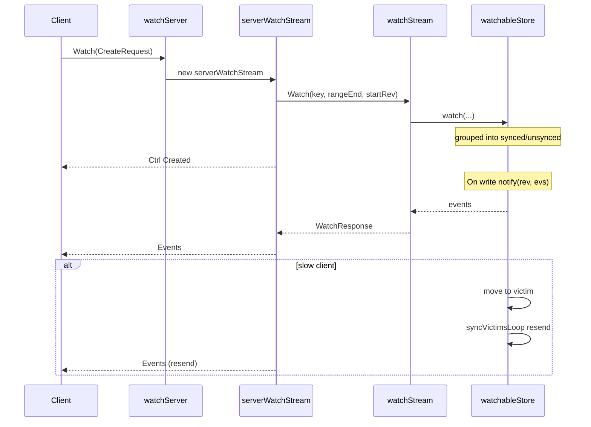
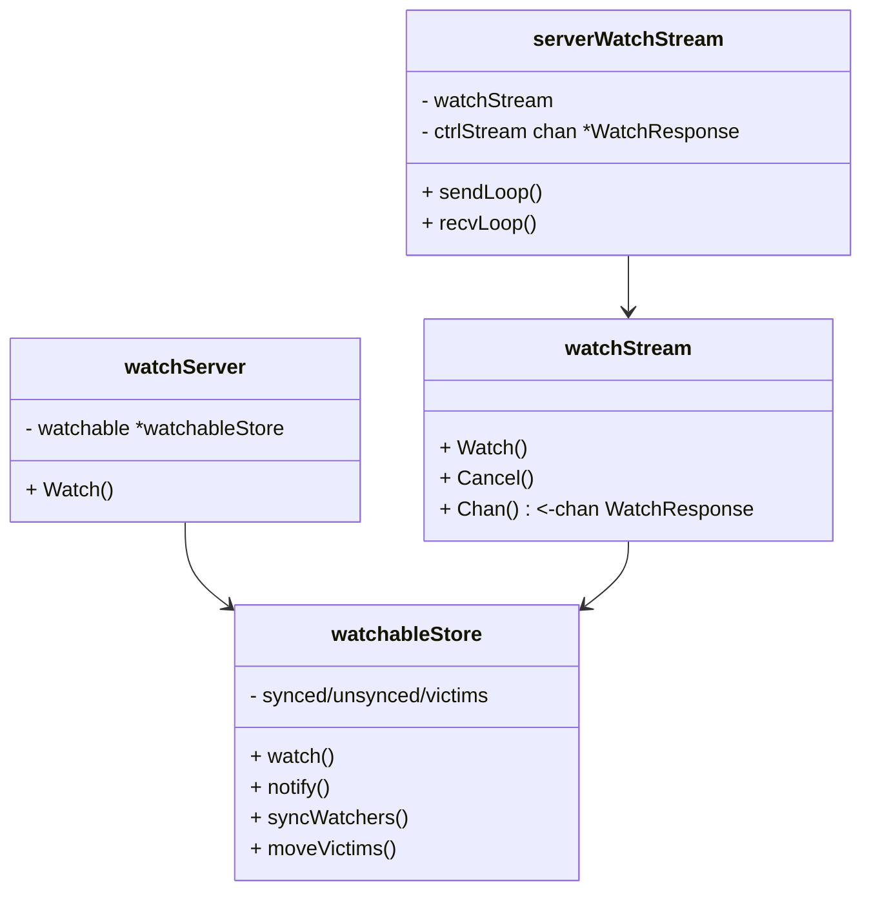

# etcd 源码笔记：Watch 机制（server/watchableStore）与实战要点

面向 `watchServer` → `serverWatchStream` → `watchableStore` 的完整链路，梳理 **创建/取消/进度/事件派发/补偿** 的关键路径与工程实践。

---

## 1）gRPC 入口与双循环

```go
func (ws *watchServer) Watch(stream pb.Watch_WatchServer) error {
    sws := serverWatchStream{
        sg:         ws.sg,
        watchable:  ws.watchable,              // *watchableStore
        gRPCStream: stream,                    // 客户端双向流
        watchStream: ws.watchable.NewWatchStream(), // 该连接上的 watcher 集合
        ctrlStream: make(chan *pb.WatchResponse, ctrlStreamBufLen), // 控制面下行
    }
    go sws.sendLoop() // 负责“下发”：事件/控制回应
    go sws.recvLoop() // 负责“上行”：创建/取消/进度请求
    return nil
}
```

* **一个 gRPC 连接**可承载**多个 Watch**，`serverWatchStream.watchStream` 维护该连接所有 watcher。
* **控制面（ctrlStream）**与**数据面（watchStream.Chan）**分离：创建/取消/进度回应走 `ctrlStream`，变更事件走 `watchStream.Chan()`。

---

## 2）创建/取消/进度：`recvLoop`

```go
func (sws *serverWatchStream) recvLoop() error {
    for {
        req, err := sws.gRPCStream.Recv()
        switch uv := req.RequestUnion.(type) {
        case *pb.WatchRequest_CreateRequest:
            creq := uv.CreateRequest
            wsrev := sws.watchStream.Rev()
            rev := creq.StartRevision
            if rev == 0 { rev = wsrev + 1 } // 默认从当前快照之后开始

            id, err := sws.watchStream.Watch(
                mvcc.WatchID(creq.WatchId), creq.Key, creq.RangeEnd, rev, filters...,
            )
            wr := &pb.WatchResponse{
                Header:   sws.newResponseHeader(wsrev),
                WatchId:  int64(id),
                Created:  true,
                Canceled: err != nil, // 启动失败（如压缩点之前）
                // CompactRevision 由底层上报（ErrCompacted 时携带）
            }
            select {
            case sws.ctrlStream <- wr:
            case <-sws.closec:
                return nil
            }

        case *pb.WatchRequest_CancelRequest:
            if uv.CancelRequest != nil {
                id := uv.CancelRequest.WatchId
                if err := sws.watchStream.Cancel(mvcc.WatchID(id)); err == nil {
                    sws.ctrlStream <- &pb.WatchResponse{
                        Header:   sws.newResponseHeader(sws.watchStream.Rev()),
                        WatchId:  id,
                        Canceled: true,
                    }
                    // 清理该 watcher 的进度/碎片跟踪
                    sws.mu.Lock()
                    delete(sws.progress, mvcc.WatchID(id))
                    delete(sws.prevKV,  mvcc.WatchID(id))
                    delete(sws.fragment, mvcc.WatchID(id))
                    sws.mu.Unlock()
                }
            }

        case *pb.WatchRequest_ProgressRequest:
            // 客户端请求“进度通知”，便于推进 header.revision 以避免长期无事件导致的卡滞/被压实
            sws.enqueueProgressResponse()
        }
    }
}
```

**关键点**

* `StartRevision=0` → 从“当前快照之后”开始（`wsrev+1`）。
* 若 `StartRevision <= compactionRev`，底层会返回 **ErrCompacted**，服务端通过 `Canceled=true + CompactRevision=...` 告知客户端**需以 `compactRev+1` 重新创建**。
* `ProgressRequest` 用于**显式进度回应**（无事件时也下发 header.revision），配合客户端 `WithProgressNotify` 使用。

---

## 3）注册 watcher：`watchStream → watchableStore`

```go
func (ws *watchStream) Watch(id WatchID, key, end []byte, startRev int64, fcs ...FilterFunc) (WatchID, error) {
    w, cancel := ws.watchable.watch(key, end, startRev, id, ws.ch, fcs...)
    ws.cancels[id]  = cancel
    ws.watchers[id] = w
    return id, nil
}

func (s *watchableStore) watch(key, end []byte, startRev int64, id WatchID, ch chan<- WatchResponse, fcs ...FilterFunc) (*watcher, cancelFunc) {
    wa := &watcher{key: key, end: end, minRev: startRev, id: id, ch: ch, fcs: fcs}
    synced := startRev > s.store.currentRev || startRev == 0
    if synced { s.synced.add(wa) } else { s.unsynced.add(wa) }
    return wa, func() { s.cancelWatcher(wa) }
}
```

* `watcher.minRev` 指定**最小需要的 revision**。

  * `synced`：从**当下**开始持续接收新事件；
  * `unsynced`：需先**补历史**（从 `minRev..currentRev` 扫描 backend）。

---

## 4）下发：`sendLoop` 合并控制面与事件面

```go
func (sws *serverWatchStream) sendLoop() {
    for {
        select {
        case wresp, ok := <-sws.watchStream.Chan(): // 事件面
            wr := &pb.WatchResponse{
                Header:          sws.newResponseHeader(wresp.Revision),
                WatchId:         int64(wresp.WatchID),
                Events:          wresp.Events,
                CompactRevision: wresp.CompactRevision, // 压缩提示
                Canceled:        wresp.Canceled,
            }
            _ = sws.gRPCStream.Send(wr)

        case c, ok := <-sws.ctrlStream: // 控制面：创建/取消/进度回应
            _ = sws.gRPCStream.Send(c)
        }
    }
}
```

* 事件发送失败（`Send` 出错）通常意味着客户端断流/网络异常，**连接会被关闭**，底层 watcher 被取消，需客户端重建。
* 大量事件可能触发**碎片化发送**（`fragment` 跟踪），保证单个响应不超过 gRPC/网络限制。

---

## 5）事件产生：写路径触发 `notify`

写事务在 `watchableStore.TxnWrite.End()` 中将变更转换为 `Event`，随后：

```go
func (s *watchableStore) notify(rev int64, evs []mvccpb.Event) {
    victim := make(watcherBatch)
    for w, eb := range newWatcherBatch(&s.synced, evs) {
        if w.send(WatchResponse{WatchID: w.id, Events: eb.evs, Revision: rev}) {
            // ok
        } else {
            // 客户端慢：迁入 victim，主线不阻塞
            w.victim = true
            victim[w] = eb
            s.synced.delete(w)
        }
    }
    s.addVictim(victim)
}
```

* 仅从 **`synced` 组**直接消费最新事件；发送失败则转入 **`victim`**（补偿队列），避免阻塞主线。

---

## 6）补历史与补偿：`unsynced` / `victim`

### 6.1 `syncWatchersLoop`：补历史（unsynced）

```go
func (s *watchableStore) syncWatchersLoop() {
    t := time.NewTicker(100 * time.Millisecond)
    defer t.Stop()
    for {
        _ = s.syncWatchers() // 每轮从 unsynced 拿一批，读后端填充事件
        <-t.C
    }
}

func (s *watchableStore) syncWatchers() int {
    wg, minRev := s.unsynced.choose(maxWatchersPerSync, curRev, compactionRev)

    // 扫描 backend（bolt）：[minRev, curRev]
    minBytes := RevToBytes(Revision{Main: minRev}, nil)
    maxBytes := RevToBytes(Revision{Main: curRev + 1}, nil)
    tx := s.store.b.ReadTx(); tx.RLock()
    revs, vs := tx.UnsafeRange(schema.Key, minBytes, maxBytes, 0)
    tx.RUnlock()

    evs := kvsToEvents(s.store.lg, wg, revs, vs) // 转换为事件
    wb  := newWatcherBatch(wg, evs)

    victims := make(watcherBatch)
    for w := range wg.watchers {
        w.minRev = curRev + 1 // 默认同步至最新
        if eb, ok := wb[w]; ok {
            if eb.moreRev != 0 { w.minRev = eb.moreRev } // 仍有剩余，留在 unsynced
            if !w.send(WatchResponse{WatchID: w.id, Events: eb.evs, Revision: curRev}) {
                w.victim = true
                victims[w] = eb
            }
        }
        if w.victim {
            // 留到 victim 补偿
        } else if w.minRev <= curRev {
            // 仍未追平：继续留在 unsynced
        } else {
            // 追平：迁入 synced
            s.synced.add(w)
            s.unsynced.delete(w)
        }
    }
    s.addVictim(victims)
    return len(wg.watchers)
}
```

* **unsynced** 用于从历史版本**回放**事件，直到与 `currentRev` 对齐。
* 若历史跨度越过 `compactionRev`，将触发 **ErrCompacted**：该 watcher 会被取消（`Canceled=true, CompactRevision=...`），客户端需**从 `compactRev+1` 重新建表**。

### 6.2 `syncVictimsLoop`：补偿（victim）

```go
func (s *watchableStore) syncVictimsLoop() {
    for {
        for s.moveVictims() != 0 { /* 尽量清空 */ }
        select {
        case <-tickc:
        case <-s.victimc: return
        }
    }
}

func (s *watchableStore) moveVictims() (moved int) {
    victims := s.victims; s.victims = nil
    var still watcherBatch

    for _, wb := range victims {
        // 尝试把缓存的事件重新下发（无需再扫 backend）
        for w, eb := range wb {
            rev := w.minRev - 1
            if !w.send(WatchResponse{WatchID: w.id, Events: eb.evs, Revision: rev}) {
                if still == nil { still = make(watcherBatch) }
                still[w] = eb
            }
        }
        // 发送成功者：按 minRev 与 currentRev 决定回到 unsynced 或 synced
        curRev := s.store.currentRev
        for w, eb := range wb {
            if still != nil && still[w] != nil { continue }
            w.victim = false
            if eb.moreRev != 0 { w.minRev = eb.moreRev }
            if w.minRev <= curRev { s.unsynced.add(w) } else { s.synced.add(w) }
        }
    }
    s.victims = append(s.victims, still)
    return moved
}
```

* **victim** 专为**慢客户端**设计，优先重放**已缓存**事件，减少后端压力。
* 多轮仍发送失败，继续留在 victim，避免拖垮整体。

---

## 7）错误与边界行为

* **压缩（compaction）**：`StartRevision <= compactRev` → 创建即 **Canceled** 并携带 `CompactRevision`；
  **处理**：客户端以 `CompactRevision+1` 重新创建。
* **分片/碎片化响应**：事件量过大时，服务端**拆分多个 WatchResponse** 下发；客户端需按顺序合并。
* **连接中断/背压**：gRPC `Send` 失败会**关闭流**并取消所有 watcher。客户端要**重连并按上次已处理的 revision 恢复**。
* **过滤器**：`FilterFunc` 可按需要过滤 PUT/DELETE/某些字段，减小下行体积。
* **进度通知**：长时间无事件可用 `WithProgressNotify` 或显式发 `ProgressRequest`，服务端会下发仅含 header 的响应，用于**推进水位**。

---

## 8）实战经验与优化建议

### 8.1 主题划分与前缀设计

* 将不同业务/租户拆分**前缀**与**独立 Watch 流**，避免单前缀风暴导致 fan-out、victim 泛滥。
* 对需要大范围扫描的消费方，**使用紧凑前缀** + **分页**，减少一次性事件堆积。

### 8.2 慢消费者治理

* 客户端**快速消费**并**异步处理**，不要在回调内做阻塞 I/O。必要时做**本地队列**+幂等处理。
* 关注被迁入 **victim** 的比率；若持续偏高，考虑：

  * 增加客户端并发/处理线程；
  * 拆分 watch 粒度；
  * 降低单事件负载（删除 `PrevKV`、裁剪 value）。
* 服务端层面：合理设置 `ctrlStream`/发送缓冲，避免阻塞 sendLoop。

### 8.3 与压缩共存

* 启用**自动压缩**（按保留窗口/时长），**客户端必须实现重试从 `compactRev+1`** 的逻辑；
* 周期性发送 **进度通知**，帮助消费者**尽快推进水位**，降低被压缩命中的概率。

### 8.4 连接与恢复

* 将 Watch 放在**长连接**上，断线**按最后处理的 revision 恢复**；
* 结合 `WithRequireLeader` 与合理重试策略，避免 leader 变更期间的抖动放大。

### 8.5 监控与排障

* 核心指标建议观测：

  * **发送失败/重试**：victim 队列长度、迁入迁出速率；
  * **延迟**：从写入到 watch 收到的时间分布（端到端时延）；
  * **后台扫描压力**：`syncWatchersLoop` 每轮处理数量、backend 读放大；
  * **压缩命中**：Canceled+CompactRevision 的频度。
* 典型问题定位：

  * 客户端积压 → victim 增长 → sendLoop `Send` 报错；
  * 后端膨胀/历史版本多 → unsynced 扫描耗时长；
  * 事件过大/过多 → 触发碎片化，客户端未正确合并导致乱序/丢失。

---

## 9）流程回顾（时序）

1. 客户端 `CreateRequest(key, startRev)` → `recvLoop` 处理 → 注册到 `watchableStore`（synced/unsynced）。
2. 写事务提交触发 `notify`：从 `synced` 直接推事件；发送失败迁入 `victim`。
3. `syncWatchersLoop` 周期性从 `unsynced` 拉取历史并推送至追平。
4. `syncVictimsLoop` 尝试重发缓存事件，将恢复者回归 `unsynced/synced`。
5. 客户端可随时 `CancelRequest` 或 `ProgressRequest`；服务端通过 `ctrlStream` 回应。


### 小结

* Watch 通过 **synced / unsynced / victim 三组**协同，分别覆盖**实时推送、历史补齐、慢消费者补偿**，在**不阻塞主线**的前提下尽量保证**不丢事件**。
* 工程上把重心放在：**前缀/主题拆分、快消费、进度推进、压缩重试、可观测性**。把这些做好，Watch 才能在高写入/高订阅的场景下长期稳定运行。


## 附录：关键函数卡片与调用链/时序/结构体关系

### A1. 关键函数卡片（核心代码+功能说明）

* `watchServer.Watch(stream pb.Watch_WatchServer) error`
  * 作用：为每个 gRPC 连接创建 `serverWatchStream`，启动 `sendLoop/recvLoop` 并复用一个 `watchStream`。

* `serverWatchStream.recvLoop()`
  * 作用：接收 `Create/Cancel/Progress` 请求，调用 `watchStream.Watch/Cancel` 并通过 `ctrlStream` 回应。

* `serverWatchStream.sendLoop()`
  * 作用：从 `watchStream.Chan()` 取事件，下发 `WatchResponse`；从 `ctrlStream` 下发控制回应。

* `watchStream.Watch(...) (WatchID, error)`
  * 作用：向 `watchableStore` 注册 watcher，依据 `startRev` 决定加入 `synced` 或 `unsynced`。

* `watchableStore.notify(rev, evs)`
  * 作用：将写事务产生的事件投递给 `synced` 组 watcher；发送失败者迁入 `victim`。

* `watchableStore.syncWatchersLoop()/syncWatchers()`
  * 作用：周期性为 `unsynced` 组补历史，直至追平 `currentRev` 或命中压缩边界。

* `watchableStore.syncVictimsLoop()/moveVictims()`
  * 作用：优先重发缓存事件，恢复者回归 `unsynced/synced`，持续失败留在 `victim`。

### A2. 关键函数调用链（创建→事件→补偿）

`Watch(gRPC)` → `recvLoop(Create)` → `watchStream.Watch` → `watchableStore.watch(分组)` → 写事务 `notify(synced)` → `sendLoop` 下发；若失败 → `victim` → `syncVictimsLoop` 重发；历史缺口由 `syncWatchersLoop` 扫描 backend 回放。

### A3. 时序图（Mermaid）



### A4. 关键结构体关系图（Mermaid）



### A5. 细节小结

* 控制/数据分离：创建/取消/进度经 `ctrlStream`，事件经 `watchStream.Chan()`。
* 三组协同：`synced` 实时推送，`unsynced` 历史回放，`victim` 慢客户端补偿。
* 压缩与恢复：命中 `CompactRevision` 需从 `compactRev+1` 重新创建；可用进度通知推进水位。


* `serverWatchStream.newResponseHeader(rev int64) *pb.ResponseHeader`
  * 作用：构造包含集群元信息与当前 revision 的响应头。

* `serverWatchStream.enqueueProgressResponse()`
  * 作用：将进度回应压入 `ctrlStream`，无事件场景用于推进客户端水位。

* `watchStream.Rev() int64`
  * 作用：返回该连接的当前已知 revision 水位。

* `watcher.send(resp WatchResponse) bool`
  * 作用：尝试向 watcher 的 channel 非阻塞发送事件，失败意味着客户端消费慢。

* `newWatcherBatch(group, evs)` / `kvsToEvents(...)`
  * 作用：将一批 key-value 变更聚合为按 watcher 分组的事件集合。

* `cancelWatcher(w *watcher)`
  * 作用：从对应集合移除 watcher 并清理状态。


* `serverWatchStream`
  * 字段：`ctrlStream`、`watchStream`、`progress`（进度请求跟踪）、`prevKV`、`fragment`（分片发送跟踪）。
* `watcher`
  * 字段：`key/end/minRev/id/ch/fcs`、`victim`（慢客户端标记）。
* `watchableStore`
  * 字段：`synced/unsynced/victims` 三组集合与选择/搬运逻辑。

