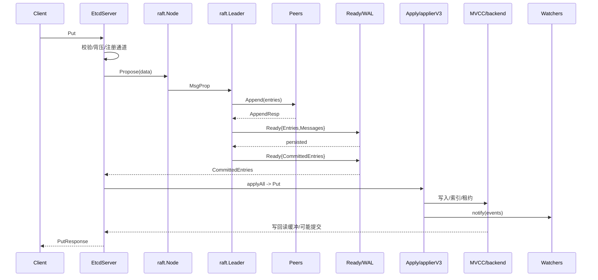
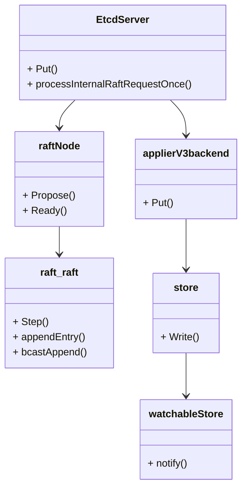

本文按 **server → raft/node → transport → apply/MVCC → watch/lease → backend 提交** 的顺序梳理 `Put` 的完整路径，并结合工程经验给出可落地的调优与排障要点。

## 1）写入入口与入队前置检查

```go
func (s *EtcdServer) Put(ctx context.Context, r *pb.PutRequest) (*pb.PutResponse, error)
````

具体处理落在：

```go
func (s *EtcdServer) processInternalRaftRequestOnce(ctx context.Context, r pb.InternalRaftRequest) (*apply2.Result, error) {
    ai := s.getAppliedIndex()
    ci := s.getCommittedIndex()
    if ci > ai+maxGapBetweenApplyAndCommitIndex {
        return nil, errors.ErrTooManyRequests // 保护性背压：apply 追不动 commit
    }

    r.Header = &pb.RequestHeader{ID: s.reqIDGen.Next()} // 生成 requestID

    data, err := r.Marshal()
    if err != nil { return nil, err }
    if len(data) > int(s.Cfg.MaxRequestBytes) {
        return nil, errors.ErrRequestTooLarge
    }

    id := r.ID
    if id == 0 { id = r.Header.ID }
    ch := s.w.Register(id)             // 用于等待“此提案”的应用结果

    err = s.r.Propose(cctx, data)      // 提案（MsgProp）

    select {
    case x := <-ch:                     // 阻塞等待 apply 结果
        return x.(*apply2.Result), nil
    }
}
```

**要点**

* 入口处做两类防护：

  * **背压**：`commitIndex - appliedIndex` 超限即拒绝（磁盘慢/应用慢时避免内存被 commit 未应用的 Entry 顶爆）。
  * **大小限制**：超过 `MaxRequestBytes` 直接拒绝（避免大 value 拖垮复制、WAL、快照）。
* 为请求注册一个 **完成通知通道**，最终由 apply 侧唤醒。

---

## 2）Raft 提案与 Leader 追加

### 2.1 提案入队

```go
func (n *node) Propose(ctx context.Context, data []byte) error {
    return n.stepWait(ctx, pb.Message{Type: pb.MsgProp, Entries: []pb.Entry{{Data: data}}})
}

// node.run 循环：
case pm := <-propc:
    m := pm.m
    m.From = r.id
    _ = r.Step(m) // 统一进入 r.Step()
```

### 2.2 Leader 处理 MsgProp

```go
func stepLeader(r *raft, m pb.Message) error {
    switch m.Type {
    case pb.MsgProp:
        if r.leadTransferee != None {
            return ErrProposalDropped // 正在移交领导权，丢弃提案
        }
        if !r.appendEntry(m.Entries...) {
            return ErrProposalDropped
        }
        r.bcastAppend() // 广播复制
    }
    return nil
}
```

### 2.3 追加 Entry

```go
func (r *raft) appendEntry(es ...pb.Entry) bool {
    li := r.raftLog.lastIndex()
    for i := range es {
        es[i].Term  = r.Term
        es[i].Index = li + 1 + uint64(i)
    }
    _ = r.raftLog.append(es...) // 仅追加到内存 raftLog
    return true
}
```

---

## 3）复制：Append 流控、补发、快照

```go
func (r *raft) maybeSendAppend(to uint64, sendIfEmpty bool) bool {
    pr := r.trk.Progress[to]
    if pr.IsPaused() { return false }

    lastIndex, nextIndex := pr.Next-1, pr.Next
    lastTerm, _ := r.raftLog.term(lastIndex)

    var ents []pb.Entry
    if pr.State != tracker.StateReplicate || !pr.Inflights.Full() {
        ents, _ = r.raftLog.entries(nextIndex, r.maxMsgSize) // 裁剪到最大消息
    }
    if len(ents) == 0 && !sendIfEmpty { return false }

    _ = pr.UpdateOnEntriesSend(len(ents), uint64(payloadsSize(ents)), nextIndex)

    r.send(pb.Message{
        To: to, Type: pb.MsgApp,
        Index: lastIndex, LogTerm: lastTerm,
        Entries: ents, Commit: r.raftLog.committed,
    })
    return true
}
```

**要点**

* **`Inflights` 限流**：each follower 有独立滑动窗口，满了则仅发心跳/空 `MsgApp` 保活，等 ack 清窗。
* **缺失日志 → 发快照**：若 follower 的 `nextIndex` 早于本地已 compact 的索引，转而发送快照。
* **`Progress` 维护**每个 follower 的 `Match/Next/State`，失败重试走回探测/对齐流程。

---

## 4）Ready 环与 WAL 持久化、网络发送

node 与 raftNode 的主循环会根据 `HasReady()` 取出需要处理的 `Ready{...}`：

* **`rd.Messages`**：待发给 peer 的 raft 消息（Append/Heartbeat 等）。
* **`rd.Entries`**：需要持久化到 WAL 的新增日志。
* **`rd.CommittedEntries`**：已经“多数派提交”，等待 **应用** 的日志。
* **`rd.HardState/Snapshot`**：元状态/快照。

典型处理（伪）：

```go
case rd := <-r.Ready():
    if islead {
        r.transport.Send(r.processMessages(rd.Messages)) // 发送网络消息
    }
    _ = r.storage.Save(rd.HardState, rd.Entries)         // WAL 持久化
    // ...
    r.Advance()
```

> **说明**：etcd 对 “发送与保存” 做了**管线化**，但在对客户端应答前必须**WAL 持久化 + 应用**，Raft 安全性不受影响。

---

## 5）提交与应用：Committed → Apply

当 follower **AppendResp** 达到多数派后，leader 可能推进 `commitIndex`：

```go
case pb.MsgAppResp:
    pr.RecentActive = true
    if r.maybeCommit() {
        releasePendingReadIndexMessages(r)
        r.bcastAppend() // 通知新的 commitIndex
    }
```

随后 `HasReady()` 会携带 `CommittedEntries`，经 `raftNode` 转发给 server 的 `applyAll`：

```go
case ap := <-s.r.apply():
    sched.Schedule(NewJob("server_applyAll", func(context.Context) { s.applyAll(&ep, &ap) }))
```

`applyAll` 里根据 `Entry.Type` 分发到 v3 applier，例如：

```go
func (a *applierV3backend) Put(ctx context.Context, p *pb.PutRequest) (*pb.PutResponse, *traceutil.Trace, error) {
    return mvcctxn.Put(ctx, a.lg, a.lessor, a.kv, p) // 进入 MVCC
}
```

---

## 6）MVCC 与租约：索引更新、值落盘、事件派发

### 6.1 写事务

```go
func (s *store) Write(trace *traceutil.Trace) TxnWrite {
    s.mu.RLock()
    tx := s.b.BatchTx()
    tx.LockInsideApply()
    return newMetricsTxnWrite(&storeTxnWrite{
        storeTxnCommon: storeTxnCommon{s, tx, 0, 0, trace},
        tx:             tx,
        beginRev:       s.currentRev,
        changes:        make([]mvccpb.KeyValue, 0, 4),
    })
}
```

### 6.2 Put 细节（版本与租约）

```go
func (tw *storeTxnWrite) put(key, val []byte, leaseID lease.LeaseID) {
    rev := tw.beginRev + 1
    c := rev // CreateRevision 默认用本次 rev

    _, created, ver, err := tw.s.kvindex.Get(key, rev)
    if err == nil {
        c = created.Main            // 已存在：沿用 created_rev
    }
    idxRev := Revision{Main: rev, Sub: int64(len(tw.changes))}

    kv := mvccpb.KeyValue{
        Key: key, Value: val,
        CreateRevision: c, ModRevision: rev, Version: ver+1,
        Lease: int64(leaseID),
    }
    d, _ := kv.Marshal()

    tw.tx.UnsafeSeqPut(schema.Key, RevToBytes(idxRev, nil), d) // backend/bolt
    tw.s.kvindex.Put(key, idxRev)                              // 索引更新
    tw.changes = append(tw.changes, kv)                        // 用于 watch 事件
    // 处理租约 attach/detach（oldLease → leaseID）
}
```

* `kvindex` 维护 **key → 多版本 revision** 的倒排索引；真正值存于 backend（bolt）**`schema.Key` 桶**，键是 `main/sub` 编码的 revision。
* `Version` 自增；`ModRevision` 设置为 `rev`；首次创建时 `CreateRevision=rev`，覆盖写沿用原 `CreateRevision`。

### 6.3 Watch 通知与缓慢观察者

```go
func (tw *watchableStoreTxnWrite) End() {
    changes := tw.Changes()
    if len(changes) == 0 { tw.TxnWrite.End(); return }

    rev := tw.Rev() + 1
    evs := make([]mvccpb.Event, len(changes))
    for i, ch := range changes {
        evs[i].Kv = &changes[i]
        evs[i].Type = ternary(ch.CreateRevision == 0, mvccpb.DELETE, mvccpb.PUT)
        if ch.CreateRevision == 0 { evs[i].Kv.ModRevision = rev }
    }

    tw.s.mu.Lock()
    tw.s.notify(rev, evs) // 发送给 watchers；慢 watcher 迁入 victims 队列
    tw.TxnWrite.End()     // 释放并进入 batchTx 提交流程
    tw.s.mu.Unlock()
}
```

**慢 watcher** 会被标记为 `victim`，转入独立队列异步补发，避免阻塞主线。

---

## 7）BatchTx 提交与读写缓冲回写

```go
func (t *batchTxBuffered) Unlock() {
    if t.pending != 0 {
        t.backend.readTx.Lock()
        t.buf.writeback(&t.backend.readTx.buf) // 写缓冲回写到读缓冲：读可见
        t.backend.readTx.Unlock()

        if t.pending >= t.backend.batchLimit || t.pendingDeleteOperations > 0 {
            t.commit(false) // 触发 bolt 事务提交（含 fsync）
        }
    }
    t.batchTx.Unlock()
}
```

* 写事务结束时先把**写缓冲**回写到**读缓冲**，从而 **读事务立即可见** 最新数据（无须等到磁盘提交）。
* 达到门限触发 **bolt 事务提交（WAL/fsync）**；门限可控，平衡吞吐与持久化开销。

---

## 8）链路小结（Put 到返回）

1. **入口**：背压/大小校验 → 注册回调通道 → `Propose(MsgProp)`；
2. **Leader**：`appendEntry` 到 raftLog → `bcastAppend` 复制；
3. **复制**：按 follower `Progress` 发送 Append（流控/补发/快照）；
4. **多数派提交**：推进 `commitIndex` → `CommittedEntries` 下发；
5. **Apply**：applierV3 执行 MVCC 写、索引更新、租约处理、watch 通知；
6. **BatchTx**：回写读缓冲、按门限提交 bolt；唤醒入口处等待的请求，返回结果。

---

## 9）实战经验与调优建议

### 9.1 写入大小与事务设计

* **值尽量小**（建议 ≤ 1MB；更大请拆分或外部存储），降低复制/快照/WAL 压力。
* 批量写（Txn）要**控制每次 key 数与总字节**，减少一次性巨型 Entry；合理分页提交。

### 9.2 背压与延迟治理

* 触发 `ErrTooManyRequests` 多见于 **磁盘慢/后端提交慢/应用回调阻塞**：

  * 观察 `etcd_disk_wal_fsync_duration_seconds`, `etcd_disk_backend_commit_duration_seconds`,
    `etcd_debugging_snapshot_save_total_durations_seconds`；
  * **独立磁盘/WAL 盘**、更快存储（NVMe），避免与业务 IO 争用；
  * 检查自定义 `apply` 回调是否阻塞（日志/网络调用/大对象序列化）。

### 9.3 复制稳定性

* 网络抖动或 follower 落后严重会触发**快照下发**，耗时大：

  * 保持 `snapshot-count` 合理，避免频繁快照；
  * 尽量使用 **稳定、带宽充足** 的 peer 专线/网段；
  * 关注 `raft.proposals_committed`、`proposals_applied` 差值与 `send failures`。

### 9.4 backend 膨胀与读放大

* 配置 **自动压缩**（`--auto-compaction-retention`）与 **定期 defrag**，减少历史版本与碎片。
* 热点前缀大量写入导致 cursor 扫描放大：**合理设计 key 前缀与分桶**；对“批量扫描”配合分页。

### 9.5 Watch 流控

* 下游消费慢会被标记为 **victim**：使用**有界缓冲**和**幂等重放**，或将不敏感场景转为**主动拉取**。
* 多租户/多订阅高并发时，**拆分 watch 前缀**，减少单前缀 fan-out 成本。

### 9.6 Leader 变更与提案丢弃

* 领导权移交期间 `MsgProp` 会被丢弃：客户端要**重试幂等**；谨慎在高写压时主动触发 `transfer-leadership`。

### 9.7 配额与保护

* 设置 `--quota-backend-bytes`，避免 backend 过大阻塞提交；
* 关注 `backend size` 接近配额时写入会受限，提前扩容或做数据分层。

---

## 10）排查清单（常用指标）

* **复制/共识**：`etcd_server_proposals_pending`, `etcd_server_proposals_committed`, `..._applied`
* **磁盘**：`etcd_disk_wal_fsync_duration_seconds`, `etcd_disk_backend_commit_duration_seconds`
* **后端**：`etcd_mvcc_db_total_size_in_bytes`, `etcd_debugging_mvcc_db_compaction_keys_total`
* **快照**：`etcd_debugging_snapshot_save_total_durations_seconds`
* **网络**：`etcd_network_peer_round_trip_time_seconds`

### 结语

写入路径的性能瓶颈大多不在 "Raft 算法" 本身，而在 **复制稳定性** 与 **后端 IO**。把握背压阈值、写入大小、快照/压缩策略与磁盘能力，才能既保证线性一致，又拿到稳定的吞吐与尾延迟。

## 附录：关键函数卡片与调用链/时序/结构体关系

### A1. 关键函数卡片（核心代码+功能说明）

* `EtcdServer.Put(ctx, *pb.PutRequest) (*pb.PutResponse, error)`
  * 作用：入口校验与背压、生成请求 ID、注册完成通道、提交提案并等待 apply 结果。

* `EtcdServer.processInternalRaftRequestOnce(ctx, r pb.InternalRaftRequest)`
  * 作用：封送请求、大小校验、注册 `watcher` 通道、调用 `r.Propose` 提案并等待应答。

* `node.Propose(ctx, data)` / raft `stepLeader` → `appendEntry` → `bcastAppend`
  * 作用：Leader 赋予 `Term/Index` 追加日志，按 `Progress/Inflights` 复制，必要时回退/补发或发送快照。

* `raftNode.Ready()` 环
  * 作用：读取 `Ready{Entries, Messages, CommittedEntries...}`，持久化 WAL 后发送网络消息并推进。

* `server.applyAll` → `applierV3backend.Put` → `mvcc txn.Write`
  * 作用：根据条目类型分发到 v3 applier，执行 MVCC 写、索引更新与租约处理，并生成 watch 事件。

* `watchableStoreTxnWrite.End()` → `watchableStore.notify`
  * 作用：把变更转为事件推送至 `synced` watchers，发送失败迁入 `victim`，不阻塞主线。

* `batchTxBuffered.Unlock()`
  * 作用：将写缓冲回写到读缓冲使读立即可见；达阈值触发 backend 提交（含 fsync）。

### A2. 关键函数调用链（提案→复制→提交→应用）

`Put入口/校验` → `processInternalRaftRequestOnce(Propose)` → raft `appendEntry/bcastAppend` → 多数派复制 → `commitIndex` 推进 → `Ready.CommittedEntries` → `applyAll -> applierV3backend.Put` → `MVCC 写/索引/租约` → `notify watchers` → `batchTx 写回与提交` → 唤醒入口等待并返回。

### A3. 时序图（Mermaid）



### A4. 关键结构体关系图（Mermaid）



### A5. 细节小结

* 背压与大小限制：避免 commit−apply 过大与单请求过大导致的不稳定。
* 复制与提交：进度管理、窗口限流与快照回退影响复制尾延迟与稳定性。
* 应用与可见：应用后通过写缓冲→读缓冲写回实现“写后可读”，并通过 watch 派发事件。


* `raft.maybeSendAppend(to, sendIfEmpty)` / `Progress.UpdateOnEntriesSend(...)`
  * 作用：基于 follower 复制状态/窗口决定是否发送 Append 及其批量大小。

* `raft.maybeCommit()`
  * 作用：依据各 follower 的 `Match` 推进 `commitIndex`；推进后触发广播。

* `raftNode.processMessages(rd.Messages)` / `transport.Send(msgs)`
  * 作用：在持久化后异步下发网络消息，维持复制与心跳。

* `storage.Save(hs, entries)` / `r.Advance()`
  * 作用：持久化 HardState/Entries，推进内部游标，允许下一批 Ready。

* `storeTxnWrite.put(...)` / `watchableStoreTxnWrite.End()` / `batchTxBuffered.Unlock()`
  * 作用：构建 `KeyValue`（版本/修订/租约）、派发事件、写回读缓冲并按阈值提交。

* `lessor.Attach/Detach`（租约）
  * 作用：写路径中为键与租约建立/解除关联，影响过期与回收。


* `tracker.Progress`
  * 字段：`Match/Next/State/Inflights`；决定复制阶段与窗口控制。
* `Inflights`
  * 字段：滑动窗口大小与占用；满窗仅心跳。
* `Ready`
  * 字段：`Entries/Messages/CommittedEntries/HardState/Snapshot/ReadStates`。
* `store`
  * 字段：`currentRev`、写读缓冲与提交阈值；直接影响可见性与提交节奏。


* 提案到返回需经历：持久化→复制多数派→提交→应用→可见→应答。
* 复制稳定性受 `Progress/Inflights` 与网络/磁盘共同影响；背压保护 commit-apply 差距。
* 事件派发与存储提交解耦：先写回读缓冲保证“写后可读”，再按阈值提交磁盘。
