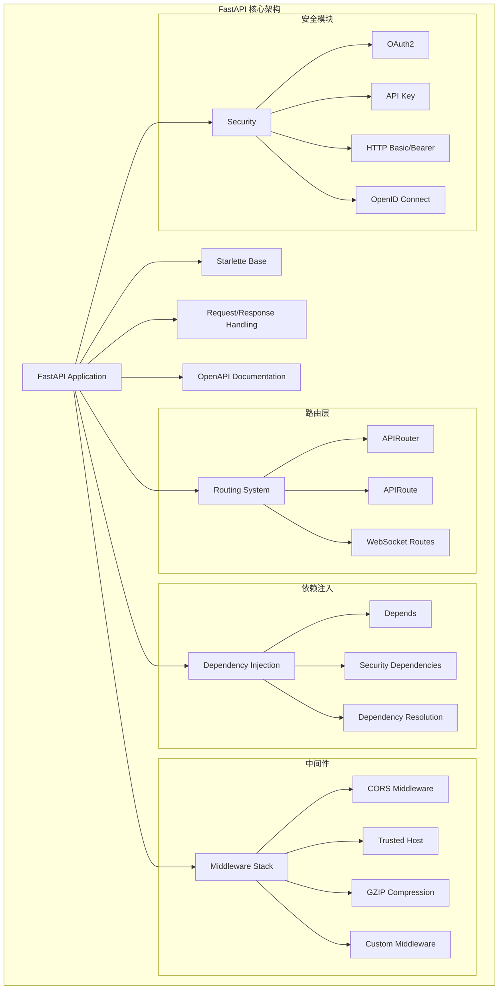
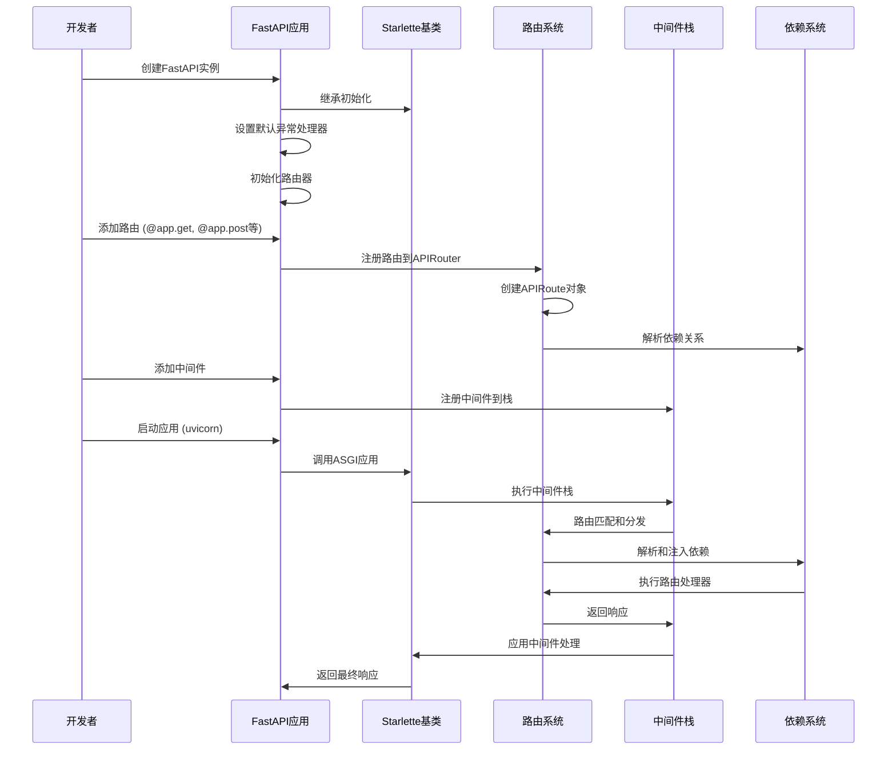

## 1. FastAPI 概述

FastAPI 是一个现代、快速（高性能）的 Web 框架，用于基于标准 Python 类型提示构建 API。它基于 Starlette 构建，具有以下特点：

- **高性能**：与 NodeJS 和 Go 相当的性能
- **快速开发**：功能开发速度提升约 200% 至 300%
- **减少错误**：减少约 40% 人为导致的错误
- **直观设计**：优秀的编辑器支持，代码补全无处不在，调试时间更短
- **简单易用**：设计易于使用和学习，减少阅读文档的时间
- **简短代码**：减少代码重复，每个参数声明的多个功能，更少错误
- **健壮性**：获得生产就绪的代码，具有自动交互式文档
- **标准化**：基于（并完全兼容）API 的开放标准：OpenAPI 和 JSON Schema

## 2. 核心组件架构图



## 3. FastAPI 基本使用示例

### 3.1 最简单的 FastAPI 应用

```python
from fastapi import FastAPI

# 创建 FastAPI 应用实例
app = FastAPI()

@app.get("/")
async def read_root():
    """根路径处理器，返回欢迎消息
    
    Returns:
        dict: 包含欢迎消息的字典
    """
    return {"Hello": "World"}

@app.get("/items/{item_id}")
async def read_item(item_id: int, q: str = None):
    """获取单个项目的详细信息
    
    Args:
        item_id (int): 项目的唯一标识符
        q (str, optional): 查询字符串参数
        
    Returns:
        dict: 包含项目ID和查询参数的字典
    """
    return {"item_id": item_id, "q": q}
```

### 3.2 使用 Pydantic 模型的示例

```python
from fastapi import FastAPI, HTTPException
from pydantic import BaseModel
from typing import Optional, List
import datetime

app = FastAPI(
    title="用户管理API",
    description="一个完整的用户管理系统API示例",
    version="1.0.0"
)

# Pydantic 数据模型定义
class User(BaseModel):
    """用户数据模型
    
    Attributes:
        id: 用户唯一标识符
        username: 用户名
        email: 邮箱地址
        full_name: 全名，可选
        disabled: 是否禁用账户
        created_at: 创建时间
    """
    id: Optional[int] = None
    username: str
    email: str
    full_name: Optional[str] = None
    disabled: bool = False
    created_at: Optional[datetime.datetime] = None

class UserCreate(BaseModel):
    """创建用户请求模型
    
    Attributes:
        username: 用户名，必填
        email: 邮箱地址，必填
        full_name: 全名，可选
        password: 密码，必填
    """
    username: str
    email: str
    full_name: Optional[str] = None
    password: str

class UserResponse(BaseModel):
    """用户响应模型，不包含敏感信息
    
    Attributes:
        id: 用户ID
        username: 用户名
        email: 邮箱
        full_name: 全名
        disabled: 是否禁用
        created_at: 创建时间
    """
    id: int
    username: str
    email: str
    full_name: Optional[str] = None
    disabled: bool = False
    created_at: datetime.datetime

# 模拟数据库
fake_users_db = []

@app.post("/users/", response_model=UserResponse)
async def create_user(user: UserCreate):
    """创建新用户
    
    Args:
        user (UserCreate): 包含用户信息的请求体
        
    Returns:
        UserResponse: 创建成功的用户信息（不含密码）
        
    Raises:
        HTTPException: 当用户名已存在时抛出409错误
    """
    # 检查用户名是否已存在
    for existing_user in fake_users_db:
        if existing_user["username"] == user.username:
            raise HTTPException(status_code=409, detail="用户名已存在")
    
    # 创建新用户
    new_user = {
        "id": len(fake_users_db) + 1,
        "username": user.username,
        "email": user.email,
        "full_name": user.full_name,
        "disabled": False,
        "created_at": datetime.datetime.now()
    }
    fake_users_db.append(new_user)
    
    return UserResponse(**new_user)

@app.get("/users/{user_id}", response_model=UserResponse)
async def get_user(user_id: int):
    """根据用户ID获取用户信息
    
    Args:
        user_id (int): 用户ID
        
    Returns:
        UserResponse: 用户信息
        
    Raises:
        HTTPException: 当用户不存在时抛出404错误
    """
    for user in fake_users_db:
        if user["id"] == user_id:
            return UserResponse(**user)
    raise HTTPException(status_code=404, detail="用户未找到")

@app.get("/users/", response_model=List[UserResponse])
async def list_users(skip: int = 0, limit: int = 100):
    """获取用户列表，支持分页
    
    Args:
        skip (int): 跳过的用户数量，默认为0
        limit (int): 返回的最大用户数量，默认为100
        
    Returns:
        List[UserResponse]: 用户列表
    """
    return [UserResponse(**user) for user in fake_users_db[skip : skip + limit]]
```

### 3.3 依赖注入示例

```python
from fastapi import FastAPI, Depends, HTTPException, status
from fastapi.security import HTTPBearer, HTTPAuthorizationCredentials
from typing import Optional

app = FastAPI()

# 安全依赖
security = HTTPBearer()

# 模拟token验证
fake_tokens = {
    "super_secret_token": {"username": "admin", "permissions": ["read", "write"]},
    "user_token": {"username": "user", "permissions": ["read"]}
}

def verify_token(credentials: HTTPAuthorizationCredentials = Depends(security)):
    """验证访问令牌
    
    Args:
        credentials: HTTP Bearer 凭证
        
    Returns:
        dict: 用户信息和权限
        
    Raises:
        HTTPException: 当token无效时抛出401错误
    """
    token = credentials.credentials
    if token not in fake_tokens:
        raise HTTPException(
            status_code=status.HTTP_401_UNAUTHORIZED,
            detail="无效的访问令牌",
            headers={"WWW-Authenticate": "Bearer"},
        )
    return fake_tokens[token]

def get_current_user(user_data: dict = Depends(verify_token)):
    """获取当前用户信息
    
    Args:
        user_data: 从token验证中获取的用户数据
        
    Returns:
        dict: 当前用户信息
    """
    return user_data

def require_permission(required_permission: str):
    """创建权限检查依赖
    
    Args:
        required_permission: 所需权限
        
    Returns:
        callable: 权限检查函数
    """
    def permission_checker(user_data: dict = Depends(get_current_user)):
        """检查用户是否具有所需权限
        
        Args:
            user_data: 当前用户数据
            
        Raises:
            HTTPException: 当权限不足时抛出403错误
        """
        if required_permission not in user_data["permissions"]:
            raise HTTPException(
                status_code=status.HTTP_403_FORBIDDEN,
                detail=f"缺少权限: {required_permission}"
            )
        return user_data
    return permission_checker

@app.get("/protected")
async def protected_route(current_user: dict = Depends(get_current_user)):
    """受保护的路由，需要身份验证
    
    Args:
        current_user: 当前登录用户
        
    Returns:
        dict: 包含用户信息的响应
    """
    return {"message": f"Hello, {current_user['username']}!", "data": "受保护的数据"}

@app.post("/admin-only")
async def admin_only_route(
    current_user: dict = Depends(require_permission("write"))
):
    """仅管理员可访问的路由
    
    Args:
        current_user: 具有写权限的用户
        
    Returns:
        dict: 管理员专用响应
    """
    return {"message": "这是管理员专用功能", "admin": current_user['username']}
```

### 3.4 中间件使用示例

```python
from fastapi import FastAPI, Request
from fastapi.middleware.cors import CORSMiddleware
from fastapi.middleware.gzip import GZipMiddleware
from starlette.middleware.base import BaseHTTPMiddleware
import time
import logging

app = FastAPI()

# 配置日志
logging.basicConfig(level=logging.INFO)
logger = logging.getLogger(__name__)

class RequestLoggingMiddleware(BaseHTTPMiddleware):
    """请求日志中间件，记录每个请求的详细信息"""
    
    async def dispatch(self, request: Request, call_next):
        """处理请求并记录日志
        
        Args:
            request: HTTP请求对象
            call_next: 下一个中间件或路由处理器
            
        Returns:
            Response: HTTP响应对象
        """
        start_time = time.time()
        
        # 记录请求信息
        logger.info(f"请求开始: {request.method} {request.url}")
        
        # 调用下一个中间件或路由处理器
        response = await call_next(request)
        
        # 计算处理时间
        process_time = time.time() - start_time
        
        # 记录响应信息
        logger.info(
            f"请求完成: {request.method} {request.url} "
            f"状态码: {response.status_code} "
            f"处理时间: {process_time:.4f}秒"
        )
        
        # 在响应头中添加处理时间
        response.headers["X-Process-Time"] = str(process_time)
        
        return response

# 添加中间件（顺序很重要）
app.add_middleware(GZipMiddleware, minimum_size=1000)  # GZIP压缩
app.add_middleware(RequestLoggingMiddleware)  # 请求日志

# 添加CORS中间件
app.add_middleware(
    CORSMiddleware,
    allow_origins=["http://localhost:3000", "https://myapp.com"],
    allow_credentials=True,
    allow_methods=["GET", "POST", "PUT", "DELETE"],
    allow_headers=["*"],
)

@app.get("/")
async def root():
    """根路径处理器
    
    Returns:
        dict: 简单的欢迎消息
    """
    return {"message": "Hello World with middleware!"}

@app.get("/slow")
async def slow_endpoint():
    """模拟慢速端点，用于测试中间件
    
    Returns:
        dict: 延迟响应
    """
    import asyncio
    await asyncio.sleep(2)  # 模拟2秒延迟
    return {"message": "This was a slow operation"}
```

## 4. FastAPI 应用启动流程

### 4.1 启动流程时序图



## 5. 核心API概览

### 5.1 主要导出的类和函数

从 `fastapi/__init__.py` 可以看到 FastAPI 对外提供的核心API：

```python
# 核心应用类
from .applications import FastAPI

# 参数处理函数
from .param_functions import (
    Body,      # 请求体参数
    Cookie,    # Cookie 参数
    Depends,   # 依赖注入
    File,      # 文件上传
    Form,      # 表单数据
    Header,    # 请求头参数
    Path,      # 路径参数
    Query,     # 查询参数
    Security,  # 安全依赖
)

# 请求和响应对象
from .requests import Request
from .responses import Response

# 路由系统
from .routing import APIRouter

# WebSocket 支持
from .websockets import WebSocket, WebSocketDisconnect

# 异常处理
from .exceptions import HTTPException, WebSocketException

# 其他核心功能
from .background import BackgroundTasks      # 后台任务
from .datastructures import UploadFile      # 文件上传
```

### 5.2 FastAPI 类的核心方法

```python
class FastAPI(Starlette):
    """FastAPI 主应用类，继承自 Starlette
    
    主要功能：
    1. HTTP路由注册 (get, post, put, delete, etc.)
    2. WebSocket路由注册
    3. 中间件管理
    4. 异常处理
    5. OpenAPI文档生成
    6. 依赖注入系统
    """
    
    # HTTP方法装饰器
    def get(self, path: str, **kwargs) -> Callable
    def post(self, path: str, **kwargs) -> Callable  
    def put(self, path: str, **kwargs) -> Callable
    def delete(self, path: str, **kwargs) -> Callable
    def patch(self, path: str, **kwargs) -> Callable
    def head(self, path: str, **kwargs) -> Callable
    def options(self, path: str, **kwargs) -> Callable
    def trace(self, path: str, **kwargs) -> Callable
    
    # WebSocket装饰器
    def websocket(self, path: str, **kwargs) -> Callable
    
    # 路由管理
    def include_router(self, router: APIRouter, **kwargs) -> None
    
    # 中间件管理
    def add_middleware(self, middleware_class, **kwargs) -> None
    
    # 异常处理
    def exception_handler(self, exc_class_or_status_code) -> Callable
    def add_exception_handler(self, exc_class, handler) -> None
    
    # 生命周期事件（已弃用，使用lifespan替代）
    def on_event(self, event_type: str) -> Callable
    
    # OpenAPI相关
    def openapi(self) -> Dict[str, Any]
```

## 6. 下一步深入分析计划

接下来的文档将深入分析每个核心模块：

1. **整体架构设计** - 详细分析 FastAPI 的分层架构和设计模式
2. **路由系统深度分析** - 探讨路由匹配、参数解析、响应处理机制
3. **依赖注入系统** - 分析依赖解析算法和注入机制
4. **安全认证系统** - 研究各种认证方式的实现
5. **中间件系统** - 分析中间件栈的执行顺序和处理流程
6. **OpenAPI文档生成** - 探讨自动文档生成的原理
7. **关键数据结构** - 分析核心数据模型和类型系统
8. **实战经验和最佳实践** - 总结实际开发中的技巧和注意事项

每个模块都将包含：
- 详细的源码分析和注释
- 架构图和时序图
- 调用链路分析
- 具体的代码示例
- 最佳实践建议

这样的分析将帮助您从浅入深地精通 FastAPI 的设计理念和实现细节。
