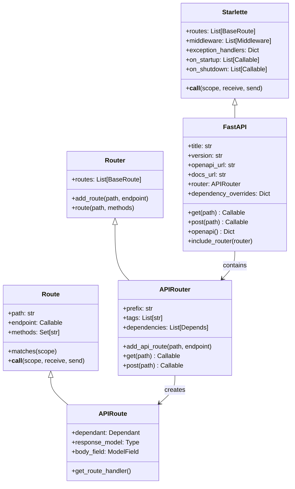
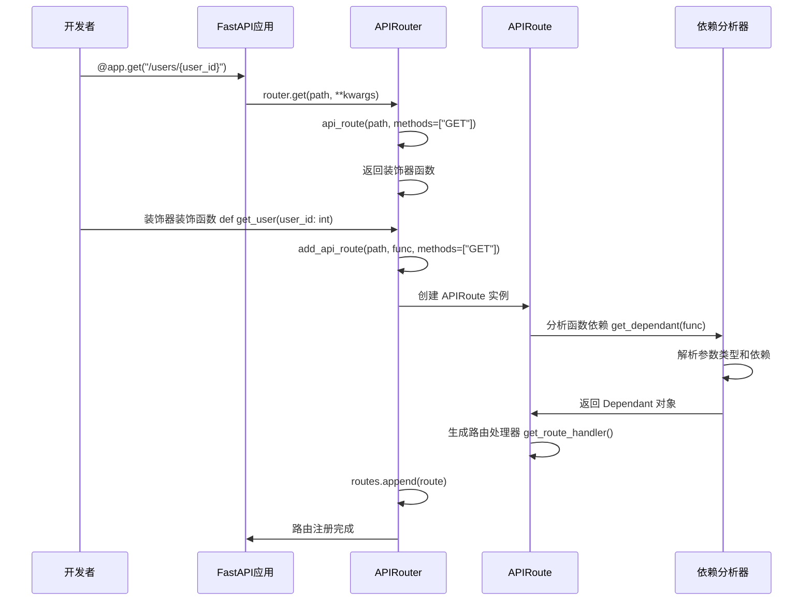
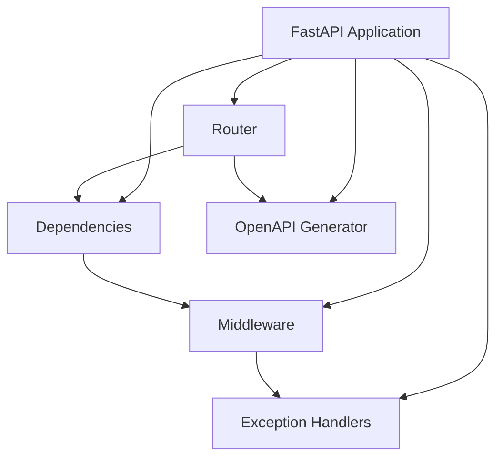

## 1. 架构概览

FastAPI 采用分层架构设计，基于 Starlette ASGI 框架构建，通过继承和组合的方式实现了丰富的功能。其核心设计理念是：**高性能、易用性和类型安全**。

### 1.1 整体架构图

```mermaid
graph TB
    subgraph "应用层 (Application Layer)"
        A[FastAPI Application] --> A1[路径操作装饰器]
        A1 --> A2[@app.get/@app.post等]
        A --> A3[全局配置]
        A3 --> A4[中间件配置]
        A3 --> A5[异常处理配置]
        A3 --> A6[依赖注入配置]
    end
    
    subgraph "路由层 (Routing Layer)"
        B[APIRouter] --> B1[APIRoute]
        B1 --> B2[路径匹配]
        B1 --> B3[参数解析]
        B1 --> B4[请求验证]
        B --> B5[WebSocket路由]
        B5 --> B6[APIWebSocketRoute]
    end
    
    subgraph "依赖注入层 (Dependency Injection)"
        C[Dependencies System] --> C1[Dependant 分析]
        C1 --> C2[依赖解析器]
        C2 --> C3[参数注入]
        C --> C4[安全依赖]
        C4 --> C5[OAuth2/API Key等]
    end
    
    subgraph "请求/响应层 (Request/Response)"
        D[Request Handler] --> D1[请求体解析]
        D1 --> D2[Pydantic验证]
        D --> D3[响应序列化]
        D3 --> D4[JSON/HTML/其他响应]
    end
    
    subgraph "文档生成层 (Documentation)"
        E[OpenAPI Generator] --> E1[Schema 生成]
        E1 --> E2[Swagger UI]
        E1 --> E3[ReDoc]
        E --> E4[类型信息提取]
    end
    
    subgraph "基础设施层 (Infrastructure)"
        F[Starlette Base] --> F1[ASGI 应用]
        F1 --> F2[中间件栈]
        F2 --> F3[异常处理]
        F --> F4[事件系统]
        F4 --> F5[启动/关闭事件]
    end
    
    A --> B
    B --> C
    C --> D
    A --> E
    B --> E
    A --> F
    B --> F
```

### 1.2 核心类继承关系



## 2. FastAPI 类深度分析

### 2.1 FastAPI 类的核心实现

```python
class FastAPI(Starlette):
    """
    FastAPI 主应用类，继承自 Starlette
    
    主要职责：
    1. 管理路由系统 (通过 APIRouter)
    2. 处理依赖注入
    3. 生成 OpenAPI 文档
    4. 管理中间件和异常处理
    5. 提供便捷的装饰器方法
    """
    
    def __init__(
        self,
        *,
        debug: bool = False,                           # 调试模式
        routes: Optional[List[BaseRoute]] = None,      # 路由列表
        title: str = "FastAPI",                       # API 标题
        version: str = "0.1.0",                       # API 版本
        openapi_url: Optional[str] = "/openapi.json", # OpenAPI schema 地址
        docs_url: Optional[str] = "/docs",             # Swagger UI 地址
        redoc_url: Optional[str] = "/redoc",           # ReDoc 地址
        dependencies: Optional[Sequence[Depends]] = None, # 全局依赖
        default_response_class: Type[Response] = JSONResponse, # 默认响应类
        # ... 更多参数
    ):
        # 保存配置参数
        self.title = title
        self.version = version
        self.openapi_url = openapi_url
        # ... 其他配置
        
        # 创建核心路由器
        self.router = APIRouter(
            routes=routes,
            dependencies=dependencies,
            default_response_class=default_response_class,
            dependency_overrides_provider=self,  # 依赖覆盖提供者
        )
        
        # 初始化异常处理器
        self.exception_handlers = {}
        self.exception_handlers[HTTPException] = http_exception_handler
        self.exception_handlers[RequestValidationError] = request_validation_exception_handler
        
        # 依赖覆盖机制（用于测试）
        self.dependency_overrides = {}
        
        # 调用 Starlette 父类初始化
        super().__init__(
            debug=debug,
            routes=self.router.routes,  # 将路由传递给 Starlette
            middleware=middleware,
            exception_handlers=self.exception_handlers,
        )
        
        # 设置内置路由（OpenAPI、Docs等）
        self.setup()
```

### 2.2 路径操作装饰器的实现机制

FastAPI 的核心特性之一是便捷的装饰器方法（如 `@app.get`、`@app.post` 等）。让我们深入分析其实现：

```python
# FastAPI 类中的装饰器方法实现
def get(
    self,
    path: str,
    *,
    response_model: Any = Default(None),
    status_code: Optional[int] = None,
    tags: Optional[List[Union[str, Enum]]] = None,
    dependencies: Optional[Sequence[Depends]] = None,
    summary: Optional[str] = None,
    description: Optional[str] = None,
    # ... 更多参数
) -> Callable[[DecoratedCallable], DecoratedCallable]:
    """
    GET 请求装饰器
    
    实现原理：
    1. 接收路径和配置参数
    2. 返回一个装饰器函数
    3. 装饰器函数将被装饰的函数注册到路由器
    
    Args:
        path: URL 路径模式
        response_model: 响应数据模型
        status_code: 默认状态码
        tags: OpenAPI 标签
        dependencies: 路径操作依赖
        summary: 操作摘要
        description: 操作描述
        
    Returns:
        装饰器函数
    """
    # 委托给路由器的 get 方法
    return self.router.get(
        path,
        response_model=response_model,
        status_code=status_code,
        tags=tags,
        dependencies=dependencies,
        summary=summary,
        description=description,
        # ... 传递所有参数
    )

# APIRouter 中的实现
def get(
    self,
    path: str,
    **kwargs
) -> Callable[[DecoratedCallable], DecoratedCallable]:
    """
    APIRouter 的 GET 装饰器实现
    """
    return self.api_route(path, methods=["GET"], **kwargs)

def api_route(
    self,
    path: str,
    *,
    methods: Optional[List[str]] = None,
    **kwargs
) -> Callable[[DecoratedCallable], DecoratedCallable]:
    """
    通用路由装饰器，所有 HTTP 方法装饰器的底层实现
    
    Returns:
        装饰器函数，用于装饰路径操作函数
    """
    def decorator(func: DecoratedCallable) -> DecoratedCallable:
        # 将函数注册为 API 路由
        self.add_api_route(
            path,
            func,
            methods=methods,
            **kwargs
        )
        # 返回原始函数（不修改）
        return func
    
    return decorator
```

### 2.3 路由注册流程时序图



## 3. APIRouter 深度分析

### 3.1 APIRouter 的核心职责

APIRouter 是 FastAPI 路由系统的核心，负责：
1. **路由组织**：将相关的路径操作分组
2. **参数传播**：将通用配置传播到所有路径操作
3. **依赖管理**：管理路由级别的依赖
4. **前缀处理**：为路径添加公共前缀

```python
class APIRouter(routing.Router):
    """
    API 路由器，用于组织和管理路径操作
    
    继承自 Starlette 的 Router，增加了 FastAPI 特有功能：
    1. 自动 OpenAPI 文档生成
    2. 依赖注入支持
    3. 响应模型验证
    4. 路径参数和查询参数的自动解析
    """
    
    def __init__(
        self,
        *,
        prefix: str = "",                              # 路径前缀
        tags: Optional[List[str]] = None,              # OpenAPI 标签
        dependencies: Optional[Sequence[Depends]] = None, # 路由依赖
        default_response_class: Type[Response] = JSONResponse, # 默认响应类
        responses: Optional[Dict] = None,              # 额外响应定义
        callbacks: Optional[List[BaseRoute]] = None,   # OpenAPI 回调
        route_class: Type[APIRoute] = APIRoute,        # 路由类
        # ... 更多参数
    ):
        # 保存配置
        self.prefix = prefix
        self.tags = tags or []
        self.dependencies = list(dependencies or [])
        self.default_response_class = default_response_class
        self.responses = responses or {}
        self.route_class = route_class
        
        # 调用父类初始化
        super().__init__(routes=routes or [])
    
    def add_api_route(
        self,
        path: str,
        endpoint: Callable,
        **kwargs
    ) -> None:
        """
        添加 API 路由
        
        这是所有路径操作装饰器的最终实现
        """
        # 合并路由器级别和路径操作级别的配置
        combined_tags = (self.tags or []) + (kwargs.get("tags") or [])
        combined_dependencies = list(self.dependencies) + list(kwargs.get("dependencies") or [])
        combined_responses = {**self.responses, **(kwargs.get("responses") or {})}
        
        # 处理路径前缀
        if self.prefix:
            path = self.prefix.rstrip("/") + "/" + path.lstrip("/")
        
        # 创建 APIRoute 实例
        route = self.route_class(
            path,
            endpoint,
            tags=combined_tags,
            dependencies=combined_dependencies,
            responses=combined_responses,
            **kwargs
        )
        
        # 添加到路由列表
        self.routes.append(route)
```

### 3.2 路由匹配和分发机制

```mermaid
flowchart TD
    A[HTTP 请求到达] --> B[Starlette 应用]
    B --> C[遍历路由列表]
    C --> D{路径匹配?}
    D -->|否| E[下一个路由]
    E --> C
    D -->|是| F{HTTP 方法匹配?}
    F -->|否| G[返回 405 Method Not Allowed]
    F -->|是| H[APIRoute.matches()]
    H --> I[提取路径参数]
    I --> J[调用 APIRoute.__call__()]
    J --> K[依赖解析和注入]
    K --> L[参数验证]
    L --> M[调用路径操作函数]
    M --> N[响应序列化]
    N --> O[返回 HTTP 响应]
```

## 4. APIRoute 详细分析

### 4.1 APIRoute 的生命周期

```python
class APIRoute(routing.Route):
    """
    API 路由，FastAPI 路由系统的核心类
    
    主要功能：
    1. 解析函数签名和类型提示
    2. 生成依赖图 (Dependant)
    3. 创建请求处理器
    4. 处理响应模型验证
    5. 生成 OpenAPI 文档信息
    """
    
    def __init__(
        self,
        path: str,
        endpoint: Callable,
        *,
        response_model: Any = Default(None),
        status_code: Optional[int] = None,
        methods: Optional[Set[str]] = None,
        dependencies: Optional[Sequence[params.Depends]] = None,
        # ... 更多参数
    ):
        """
        APIRoute 初始化过程：
        
        1. 分析函数签名
        2. 解析依赖关系
        3. 创建响应模型
        4. 生成处理器
        """
        self.path = path
        self.endpoint = endpoint
        
        # 1. 处理响应模型
        if isinstance(response_model, DefaultPlaceholder):
            # 从函数返回类型注解推断响应模型
            return_annotation = get_typed_return_annotation(endpoint)
            if lenient_issubclass(return_annotation, Response):
                response_model = None
            else:
                response_model = return_annotation
        self.response_model = response_model
        
        # 2. 分析函数依赖关系
        self.dependant = get_dependant(
            path=path,
            call=endpoint,
            dependencies=dependencies,
        )
        
        # 3. 处理请求体字段
        self.body_field = get_body_field(
            dependant=self.dependant, 
            name=endpoint.__name__
        )
        
        # 4. 生成唯一ID（用于 OpenAPI）
        if isinstance(generate_unique_id_function, DefaultPlaceholder):
            current_generate_unique_id = generate_unique_id
        else:
            current_generate_unique_id = generate_unique_id_function
        self.unique_id = current_generate_unique_id(self)
        
        # 5. 调用父类初始化
        super().__init__(
            path,
            endpoint=endpoint,
            methods=methods,
        )
        
        # 6. 生成 ASGI 应用（请求处理器）
        self.app = request_response(self.get_route_handler())
    
    def get_route_handler(self) -> Callable[[Request], Coroutine[Any, Any, Response]]:
        """
        生成路由处理器
        
        这是 FastAPI 的核心：将用户的简单函数转换为完整的 ASGI 应用
        """
        return get_request_handler(
            dependant=self.dependant,                    # 依赖图
            body_field=self.body_field,                  # 请求体字段
            status_code=self.status_code,                # 状态码
            response_class=self.response_class,          # 响应类
            response_field=self.secure_cloned_response_field, # 响应字段
            response_model_include=self.response_model_include,
            response_model_exclude=self.response_model_exclude,
            response_model_by_alias=self.response_model_by_alias,
            response_model_exclude_unset=self.response_model_exclude_unset,
            response_model_exclude_defaults=self.response_model_exclude_defaults,
            response_model_exclude_none=self.response_model_exclude_none,
            dependency_overrides_provider=self.dependency_overrides_provider,
            embed_body_fields=self._embed_body_fields,
        )
```

### 4.2 请求处理器的实现

```python
def get_request_handler(
    dependant: Dependant,
    body_field: Optional[ModelField] = None,
    status_code: Optional[int] = None,
    response_class: Union[Type[Response], DefaultPlaceholder] = Default(JSONResponse),
    response_field: Optional[ModelField] = None,
    # ... 更多参数
) -> Callable[[Request], Coroutine[Any, Any, Response]]:
    """
    生成请求处理器函数
    
    这个函数返回一个异步函数，该函数：
    1. 解析 HTTP 请求
    2. 解决依赖注入
    3. 调用用户函数
    4. 处理响应
    
    Args:
        dependant: 依赖图，包含所有需要解析的依赖
        body_field: 请求体字段定义
        status_code: 默认状态码
        response_class: 响应类
        response_field: 响应模型字段
        
    Returns:
        异步请求处理器函数
    """
    
    # 解析响应类
    if isinstance(response_class, DefaultPlaceholder):
        actual_response_class = JSONResponse
    else:
        actual_response_class = response_class
    
    async def app(request: Request) -> Response:
        """
        实际的请求处理器
        
        这是每个 HTTP 请求都会执行的函数
        """
        try:
            # 1. 创建异步退出栈（用于管理依赖的生命周期）
            async with AsyncExitStack() as async_exit_stack:
                # 2. 解决所有依赖
                solved_result = await solve_dependencies(
                    request=request,
                    dependant=dependant,
                    dependency_overrides_provider=dependency_overrides_provider,
                    async_exit_stack=async_exit_stack,
                    embed_body_fields=embed_body_fields,
                )
                
                # 3. 检查依赖解析错误
                if solved_result.errors:
                    raise RequestValidationError(
                        _normalize_errors(solved_result.errors)
                    )
                
                # 4. 调用用户的路径操作函数
                assert dependant.call is not None
                if iscoroutinefunction(dependant.call):
                    # 异步函数
                    raw_response = await dependant.call(**solved_result.values)
                else:
                    # 同步函数，在线程池中运行
                    raw_response = await run_in_threadpool(
                        dependant.call, **solved_result.values
                    )
                
                # 5. 处理响应
                if isinstance(raw_response, Response):
                    # 用户返回了 Response 对象，直接使用
                    if raw_response.background is None:
                        raw_response.background = solved_result.background_tasks
                    return raw_response
                else:
                    # 用户返回了数据，需要序列化
                    response_data = raw_response
                    
                    # 应用响应模型（如果有）
                    if response_field:
                        response_data = _prepare_response_content(
                            response_data,
                            exclude_unset=response_model_exclude_unset,
                            exclude_defaults=response_model_exclude_defaults,
                            exclude_none=response_model_exclude_none,
                        )
                        
                        # Pydantic 模型序列化
                        response_data = jsonable_encoder(
                            response_data,
                            include=response_model_include,
                            exclude=response_model_exclude,
                            by_alias=response_model_by_alias,
                            exclude_unset=response_model_exclude_unset,
                            exclude_defaults=response_model_exclude_defaults,
                            exclude_none=response_model_exclude_none,
                        )
                    
                    # 创建响应对象
                    response = actual_response_class(
                        content=response_data,
                        status_code=status_code or 200,
                        background=solved_result.background_tasks,
                    )
                    
                    return response
                    
        except Exception as e:
            # 异常会被 FastAPI 的异常处理器捕获
            raise
    
    return app
```

## 5. 架构设计模式分析

### 5.1 装饰器模式

FastAPI 大量使用装饰器模式来简化 API 开发：

```python
# 用户代码（简洁）
@app.get("/users/{user_id}")
async def get_user(user_id: int) -> User:
    return User(id=user_id, name="John")

# FastAPI 内部转换为复杂的路由配置
# 等价于：
app.add_api_route(
    "/users/{user_id}",
    get_user,
    methods=["GET"],
    response_model=User,
    # ... 大量其他配置
)
```

### 5.2 依赖注入模式

FastAPI 实现了强大的依赖注入系统：

```python
# 依赖定义
def get_db() -> Database:
    return Database()

def get_current_user(token: str = Depends(get_token)) -> User:
    return verify_token(token)

# 自动注入
@app.get("/users/me")
async def get_me(
    user: User = Depends(get_current_user),  # 自动注入当前用户
    db: Database = Depends(get_db)           # 自动注入数据库
) -> User:
    return user
```

### 5.3 中介者模式

FastAPI 应用作为中介者，协调各个组件：



### 5.4 建造者模式

FastAPI 使用建造者模式构建复杂的路由对象：

```python
# APIRoute 的构建过程
class APIRoute:
    def __init__(self, ...):
        # 1. 分析函数签名
        self.dependant = get_dependant(call=endpoint, ...)
        
        # 2. 处理请求体
        self.body_field = get_body_field(dependant=self.dependant, ...)
        
        # 3. 生成处理器
        self.app = request_response(self.get_route_handler())
        
        # 4. 设置 OpenAPI 信息
        self.openapi_extra = openapi_extra
        # ...
```

## 6. 性能优化设计

### 6.1 异步优化

FastAPI 原生支持异步，充分利用 Python 的异步特性：

1. **异步路径操作**：支持 `async def` 函数
2. **异步依赖**：依赖解析过程是异步的
3. **异步中间件**：中间件栈是异步的
4. **线程池集成**：同步函数自动在线程池中运行

### 6.2 类型系统优化

FastAPI 通过类型系统实现：

1. **编译时优化**：类型检查在应用启动时完成
2. **序列化优化**：预编译序列化逻辑
3. **验证优化**：Pydantic 提供高性能验证

### 6.3 缓存策略

FastAPI 使用多层缓存：

```python
class FastAPI:
    def openapi(self) -> Dict[str, Any]:
        # OpenAPI schema 缓存
        if not self.openapi_schema:
            self.openapi_schema = get_openapi(...)  # 只生成一次
        return self.openapi_schema
```

## 7. 可扩展性设计

### 7.1 插件架构

FastAPI 通过以下方式支持扩展：

1. **自定义路由类**：可以继承 `APIRoute` 实现自定义逻辑
2. **自定义中间件**：标准的 ASGI 中间件接口
3. **自定义异常处理器**：灵活的异常处理机制
4. **依赖覆盖**：支持依赖替换（主要用于测试）

### 7.2 模块化设计

```python
# 主应用
app = FastAPI()

# 用户模块路由器
users_router = APIRouter(prefix="/users", tags=["users"])

# 产品模块路由器  
products_router = APIRouter(prefix="/products", tags=["products"])

# 组合到主应用
app.include_router(users_router)
app.include_router(products_router)
```

这种设计使大型应用可以按功能模块组织，保持代码的清晰和可维护性。

## 8. 总结

FastAPI 的架构设计体现了现代 Python Web 框架的最佳实践：

1. **基于标准**：完全兼容 ASGI 标准，与 Python 类型系统深度集成
2. **高性能**：异步优先，充分利用现代 Python 的性能特性
3. **易用性**：通过装饰器和依赖注入简化开发体验
4. **类型安全**：静态类型检查和运行时验证相结合
5. **自动化**：自动生成 API 文档和客户端代码
6. **可扩展**：模块化设计支持大型应用开发

下一章我们将深入分析 FastAPI 的路由系统实现细节。
