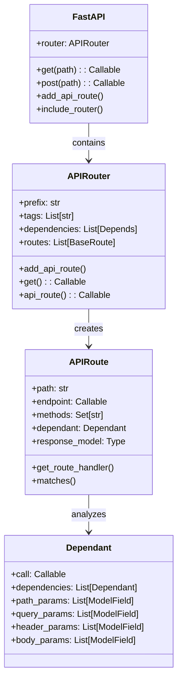
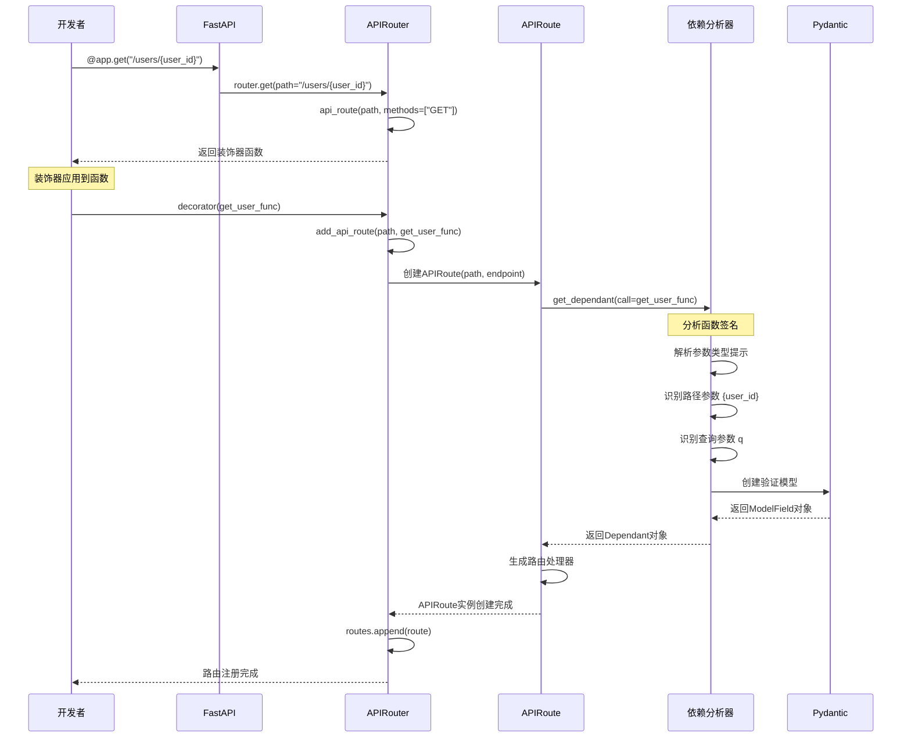
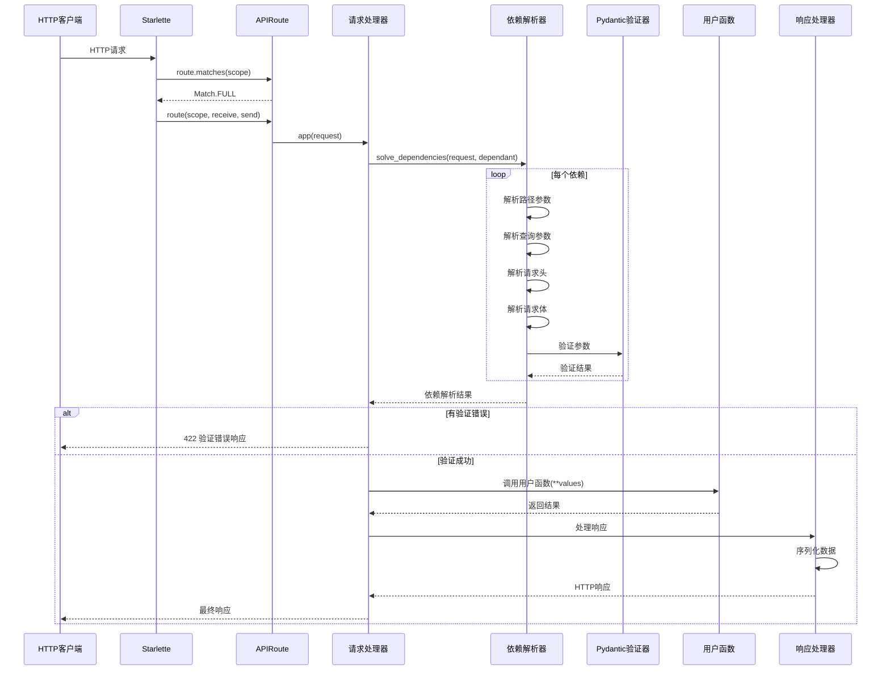

## 1. 路由系统概览

FastAPI 的路由系统是整个框架的核心，负责将 HTTP 请求分发到对应的处理器函数。它在 Starlette 路由系统的基础上，增加了强大的类型验证、依赖注入、自动文档生成等功能。

### 1.1 路由系统架构图

```mermaid
graph TB
    subgraph "路由注册阶段"
        A[开发者定义路径操作] --> B[@app.get装饰器]
        B --> C[APIRouter.get()]
        C --> D[APIRouter.api_route()]
        D --> E[APIRouter.add_api_route()]
        E --> F[创建APIRoute实例]
        F --> G[分析函数依赖get_dependant()]
        G --> H[添加到routes列表]
    end
    
    subgraph "请求处理阶段"
        I[HTTP请求] --> J[Starlette应用]
        J --> K[遍历路由列表]
        K --> L[APIRoute.matches()]
        L --> M{匹配成功?}
        M -->|否| N[继续下个路由]
        N --> K
        M -->|是| O[APIRoute.__call__()]
        O --> P[get_request_handler()]
        P --> Q[solve_dependencies()]
        Q --> R[调用路径操作函数]
        R --> S[处理响应]
        S --> T[返回HTTP响应]
    end
```

### 1.2 核心组件关系图



## 2. 路由注册过程详细分析

### 2.1 装饰器调用链

让我们通过一个具体示例来分析路由注册的完整过程：

```python
# 用户代码
@app.get("/users/{user_id}")
async def get_user(user_id: int, q: Optional[str] = None) -> User:
    return User(id=user_id, name="John", query=q)
```

这个简单的装饰器背后，FastAPI 执行了复杂的分析和处理过程：

```python
# 1. FastAPI.get() 方法
def get(
    self,
    path: str,
    *,
    response_model: Any = Default(None),
    status_code: Optional[int] = None,
    tags: Optional[List[Union[str, Enum]]] = None,
    dependencies: Optional[Sequence[Depends]] = None,
    # ... 更多参数
) -> Callable[[DecoratedCallable], DecoratedCallable]:
    """
    GET 请求装饰器实现
    
    功能：
    1. 接收路径和配置参数
    2. 委托给 APIRouter 处理
    3. 返回装饰器函数
    
    Args:
        path: URL路径，支持路径参数如 /users/{user_id}
        response_model: 响应数据模型，用于序列化和文档生成
        status_code: 默认HTTP状态码
        tags: OpenAPI文档标签
        dependencies: 路径级别的依赖注入
        
    Returns:
        装饰器函数，用于装饰路径操作函数
    """
    return self.router.get(
        path,
        response_model=response_model,
        status_code=status_code,
        tags=tags,
        dependencies=dependencies,
        # ... 传递所有参数给路由器
    )

# 2. APIRouter.get() 方法
def get(
    self,
    path: str,
    **kwargs
) -> Callable[[DecoratedCallable], DecoratedCallable]:
    """
    APIRouter 的 GET 装饰器
    
    所有 HTTP 方法装饰器(get, post, put, delete等)的统一实现
    最终都调用 api_route 方法
    """
    return self.api_route(path, methods=["GET"], **kwargs)

# 3. APIRouter.api_route() 方法
def api_route(
    self,
    path: str,
    *,
    methods: Optional[List[str]] = None,
    **kwargs
) -> Callable[[DecoratedCallable], DecoratedCallable]:
    """
    通用API路由装饰器，所有HTTP方法装饰器的底层实现
    
    这是装饰器模式的核心：返回一个装饰器函数
    """
    def decorator(func: DecoratedCallable) -> DecoratedCallable:
        """
        实际的装饰器函数
        
        当用户函数被装饰时，这个函数会被调用
        它将用户函数注册为API路由
        """
        self.add_api_route(
            path,
            func,  # 用户的路径操作函数
            methods=methods,
            **kwargs
        )
        return func  # 返回原始函数（不修改）
    
    return decorator

# 4. APIRouter.add_api_route() 方法 - 核心实现
def add_api_route(
    self,
    path: str,
    endpoint: Callable,
    *,
    response_model: Any = Default(None),
    status_code: Optional[int] = None,
    tags: Optional[List[Union[str, Enum]]] = None,
    dependencies: Optional[Sequence[params.Depends]] = None,
    # ... 更多参数
) -> None:
    """
    添加API路由的核心实现
    
    功能：
    1. 合并路由器级别和路径级别的配置
    2. 处理路径前缀
    3. 创建APIRoute实例
    4. 添加到路由列表
    
    这是整个路由注册过程的最终实现
    """
    # 1. 合并标签（路由器级别 + 路径级别）
    if self.tags:
        tags = list(self.tags) + list(tags or [])
    
    # 2. 合并依赖（路由器级别 + 路径级别）
    if self.dependencies:
        dependencies = list(self.dependencies) + list(dependencies or [])
    
    # 3. 合并响应配置
    if self.responses:
        responses = {**self.responses, **(responses or {})}
    
    # 4. 处理路径前缀
    if self.prefix:
        # 确保路径格式正确
        if path.startswith("/"):
            path = self.prefix.rstrip("/") + path
        else:
            path = self.prefix.rstrip("/") + "/" + path
    
    # 5. 选择路由类（通常是APIRoute，也可以自定义）
    route_class = route_class_override or self.route_class
    
    # 6. 创建APIRoute实例
    route = route_class(
        path,
        endpoint,
        response_model=response_model,
        status_code=status_code,
        tags=tags,
        dependencies=dependencies,
        responses=responses,
        # ... 传递所有配置参数
        dependency_overrides_provider=self.dependency_overrides_provider,
        generate_unique_id_function=generate_unique_id_function,
    )
    
    # 7. 添加到路由列表
    self.routes.append(route)
```

### 2.2 路由注册时序图



## 3. APIRoute 深度分析

### 3.1 APIRoute 初始化过程

APIRoute 是 FastAPI 路由系统的核心类，它的初始化过程包含了大量的分析和预处理工作：

```python
class APIRoute(routing.Route):
    """
    FastAPI API路由类
    
    继承自Starlette Route，增加了：
    1. 自动参数解析和验证
    2. 响应模型处理
    3. 依赖注入支持
    4. OpenAPI文档生成
    """
    
    def __init__(
        self,
        path: str,                                    # URL路径
        endpoint: Callable[..., Any],                 # 路径操作函数
        *,
        response_model: Any = Default(None),          # 响应模型
        status_code: Optional[int] = None,            # 默认状态码
        tags: Optional[List[Union[str, Enum]]] = None, # 标签
        dependencies: Optional[Sequence[params.Depends]] = None, # 依赖
        summary: Optional[str] = None,                # 摘要
        description: Optional[str] = None,            # 描述
        response_description: str = "Successful Response", # 响应描述
        responses: Optional[Dict[Union[int, str], Dict[str, Any]]] = None, # 额外响应
        deprecated: Optional[bool] = None,            # 是否弃用
        name: Optional[str] = None,                   # 操作名称
        methods: Optional[Union[Set[str], List[str]]] = None, # HTTP方法
        operation_id: Optional[str] = None,           # 操作ID
        response_model_include: Optional[IncEx] = None,
        response_model_exclude: Optional[IncEx] = None,
        response_model_by_alias: bool = True,
        response_model_exclude_unset: bool = False,
        response_model_exclude_defaults: bool = False,
        response_model_exclude_none: bool = False,
        include_in_schema: bool = True,               # 是否包含在OpenAPI中
        response_class: Union[Type[Response], DefaultPlaceholder] = Default(JSONResponse),
        dependency_overrides_provider: Optional[Any] = None,
        callbacks: Optional[List[BaseRoute]] = None,
        openapi_extra: Optional[Dict[str, Any]] = None,
        generate_unique_id_function: Union[Callable[["APIRoute"], str], DefaultPlaceholder] = Default(generate_unique_id),
    ) -> None:
        """APIRoute初始化过程详解"""
        
        # === 1. 基础属性设置 ===
        self.path = path
        self.endpoint = endpoint
        self.summary = summary
        self.response_description = response_description
        self.description = description or inspect.getdoc(endpoint) or ""
        self.deprecated = deprecated
        self.operation_id = operation_id
        self.response_model_include = response_model_include
        self.response_model_exclude = response_model_exclude
        self.response_model_by_alias = response_model_by_alias
        self.response_model_exclude_unset = response_model_exclude_unset
        self.response_model_exclude_defaults = response_model_exclude_defaults
        self.response_model_exclude_none = response_model_exclude_none
        self.include_in_schema = include_in_schema
        self.callbacks = callbacks
        self.openapi_extra = openapi_extra or {}
        
        # === 2. 处理响应模型 ===
        if isinstance(response_model, DefaultPlaceholder):
            # 从函数返回类型注解推断响应模型
            return_annotation = get_typed_return_annotation(endpoint)
            if lenient_issubclass(return_annotation, Response):
                # 如果返回类型是Response子类，不使用响应模型
                response_model = None
            else:
                # 使用返回类型注解作为响应模型
                response_model = return_annotation
        
        self.response_model = response_model
        
        # === 3. 处理响应类 ===
        if isinstance(response_class, DefaultPlaceholder):
            actual_response_class = JSONResponse
        else:
            actual_response_class = response_class
        self.response_class = actual_response_class
        
        # === 4. 设置状态码 ===
        if status_code is None:
            if methods is None:
                status_code = 200  # 默认GET请求
            else:
                # POST请求默认201，其他200
                status_code = 201 if "POST" in methods else 200
        self.status_code = status_code
        
        # === 5. 处理标签 ===
        if tags is None:
            tags = []
        self.tags = tags
        
        # === 6. 分析函数依赖关系（核心步骤）===
        self.dependant = get_dependant(
            path=path,
            call=endpoint,
            dependencies=dependencies,
            name=name,
        )
        
        # === 7. 处理请求体字段 ===
        self.body_field = get_body_field(
            dependant=self.dependant,
            name=endpoint.__name__
        )
        
        # === 8. 检查是否需要嵌入body字段 ===
        self._embed_body_fields = _should_embed_body_fields(self.body_field)
        
        # === 9. 处理响应字段 ===
        if self.response_model:
            self.secure_cloned_response_field: Optional[ModelField] = create_cloned_field(
                create_model_field(
                    name=generate_unique_id(self) + "_response",
                    type_=self.response_model,
                ),
                cloned_types={}
            )
        else:
            self.secure_cloned_response_field = None
        
        # === 10. 生成唯一ID（用于OpenAPI）===
        if isinstance(generate_unique_id_function, DefaultPlaceholder):
            current_generate_unique_id = generate_unique_id
        else:
            current_generate_unique_id = generate_unique_id_function
        self.unique_id = current_generate_unique_id(self)
        
        # === 11. 设置依赖覆盖提供者 ===
        self.dependency_overrides_provider = dependency_overrides_provider
        
        # === 12. 处理额外响应 ===
        self.responses = responses or {}
        
        # === 13. 调用父类初始化 ===
        super().__init__(
            path,
            endpoint,
            methods=methods,
            name=name,
            include_in_schema=False,  # 我们自己处理OpenAPI
        )
        
        # === 14. 生成ASGI应用（请求处理器）===
        self.app = request_response(self.get_route_handler())
```

### 3.2 依赖分析过程 - get_dependant()

`get_dependant()` 函数是 FastAPI 最复杂也是最重要的函数之一，它负责分析路径操作函数的签名，识别各种类型的参数：

```python
def get_dependant(
    *,
    path: str,                                # URL路径
    call: Callable[..., Any],                 # 路径操作函数
    dependencies: Optional[Sequence[params.Depends]] = None, # 额外依赖
    name: Optional[str] = None,               # 函数名
) -> Dependant:
    """
    分析路径操作函数，生成依赖对象
    
    功能：
    1. 解析函数签名和类型提示
    2. 识别路径参数、查询参数、请求头、请求体等
    3. 处理依赖注入
    4. 生成验证模型
    
    Returns:
        Dependant: 包含所有依赖信息的对象
    """
    # 获取路径中的参数名，如 /users/{user_id} -> ["user_id"]
    path_param_names = get_path_param_names(path)
    
    # 获取函数签名
    signature = inspect.signature(call)
    
    # 创建依赖对象
    dependant = Dependant(call=call, name=name)
    
    # === 处理额外的依赖 ===
    if dependencies:
        for depends in dependencies:
            sub_dependant = get_sub_dependant(
                depends=depends,
                dependency_overrides_provider=None,
                path=path,
            )
            dependant.dependencies.append(sub_dependant)
    
    # === 遍历函数的每个参数 ===
    for param_name, param in signature.parameters.items():
        # 获取参数的默认值
        param_default = param.default
        
        # 获取参数的类型注解
        param_annotation = param.annotation
        if param_annotation is param.empty:
            param_annotation = Any
        
        # === 处理特殊参数类型 ===
        
        # 1. Request对象
        if lenient_issubclass(param_annotation, Request):
            dependant.request_param_name = param_name
            continue
            
        # 2. WebSocket对象
        if lenient_issubclass(param_annotation, WebSocket):
            dependant.websocket_param_name = param_name
            continue
            
        # 3. Response对象
        if lenient_issubclass(param_annotation, Response):
            dependant.response_param_name = param_name
            continue
            
        # 4. BackgroundTasks
        if lenient_issubclass(param_annotation, BackgroundTasks):
            dependant.background_tasks_param_name = param_name
            continue
            
        # 5. SecurityScopes
        if lenient_issubclass(param_annotation, SecurityScopes):
            dependant.security_scopes_param_name = param_name
            continue
        
        # === 处理Depends依赖注入 ===
        if isinstance(param_default, params.Depends):
            sub_dependant = get_sub_dependant(
                depends=param_default,
                dependency_overrides_provider=None,
                name=param_name,
                path=path,
            )
            dependant.dependencies.append(sub_dependant)
            continue
        
        # === 处理各种参数类型 ===
        
        # 路径参数
        if param_name in path_param_names:
            add_param_to_fields(
                field_info=Path(),  # 使用Path()标记
                field_name=param_name,
                annotation=param_annotation,
                field_list=dependant.path_params,
            )
            continue
        
        # 显式标记的参数（Query、Header、Cookie等）
        if isinstance(param_default, params.Query):
            add_param_to_fields(
                field_info=param_default,
                field_name=param_name,
                annotation=param_annotation,
                field_list=dependant.query_params,
            )
            continue
            
        if isinstance(param_default, params.Header):
            add_param_to_fields(
                field_info=param_default,
                field_name=param_name,
                annotation=param_annotation,
                field_list=dependant.header_params,
            )
            continue
            
        if isinstance(param_default, params.Cookie):
            add_param_to_fields(
                field_info=param_default,
                field_name=param_name,
                annotation=param_annotation,
                field_list=dependant.cookie_params,
            )
            continue
            
        if isinstance(param_default, params.Body):
            add_param_to_fields(
                field_info=param_default,
                field_name=param_name,
                annotation=param_annotation,
                field_list=dependant.body_params,
            )
            continue
            
        if isinstance(param_default, params.Form):
            add_param_to_fields(
                field_info=param_default,
                field_name=param_name,
                annotation=param_annotation,
                field_list=dependant.form_params,
            )
            continue
            
        if isinstance(param_default, params.File):
            add_param_to_fields(
                field_info=param_default,
                field_name=param_name,
                annotation=param_annotation,
                field_list=dependant.file_params,
            )
            continue
        
        # === 自动推断参数类型 ===
        # 如果没有显式标记，根据类型和默认值自动推断
        
        if is_scalar_field(field=create_model_field(name=param_name, type_=param_annotation)):
            # 标量类型：自动推断为查询参数
            add_param_to_fields(
                field_info=Query(default=param_default),
                field_name=param_name,
                annotation=param_annotation,
                field_list=dependant.query_params,
            )
        else:
            # 复杂类型：自动推断为请求体参数
            add_param_to_fields(
                field_info=Body(default=param_default),
                field_name=param_name,
                annotation=param_annotation,
                field_list=dependant.body_params,
            )
    
    return dependant
```

### 3.3 参数分类和验证

FastAPI 根据参数的类型、位置和标注自动分类参数：

```mermaid
flowchart TD
    A[函数参数] --> B{在路径中?}
    B -->|是| C[路径参数 Path]
    B -->|否| D{有显式标注?}
    
    D -->|Query()| E[查询参数]
    D -->|Header()| F[请求头参数]
    D -->|Cookie()| G[Cookie参数]
    D -->|Body()| H[请求体参数]
    D -->|Form()| I[表单参数]
    D -->|File()| J[文件参数]
    D -->|Depends()| K[依赖注入]
    
    D -->|否| L{是标量类型?}
    L -->|是| M[自动推断为查询参数]
    L -->|否| N[自动推断为请求体参数]
    
    C --> O[创建验证模型]
    E --> O
    F --> O
    G --> O
    H --> O
    I --> O
    J --> O
    M --> O
    N --> O
    
    K --> P[递归分析依赖]
```

## 4. 请求处理流程

### 4.1 请求处理器生成 - get_route_handler()

APIRoute 的 `get_route_handler()` 方法生成实际的请求处理器：

```python
def get_route_handler(self) -> Callable[[Request], Coroutine[Any, Any, Response]]:
    """
    生成路由处理器
    
    返回一个异步函数，该函数：
    1. 接收HTTP请求
    2. 解析和验证参数
    3. 调用路径操作函数
    4. 处理响应
    """
    return get_request_handler(
        dependant=self.dependant,                     # 依赖图
        body_field=self.body_field,                   # 请求体字段
        status_code=self.status_code,                 # 状态码
        response_class=self.response_class,           # 响应类
        response_field=self.secure_cloned_response_field, # 响应字段
        response_model_include=self.response_model_include,
        response_model_exclude=self.response_model_exclude,
        response_model_by_alias=self.response_model_by_alias,
        response_model_exclude_unset=self.response_model_exclude_unset,
        response_model_exclude_defaults=self.response_model_exclude_defaults,
        response_model_exclude_none=self.response_model_exclude_none,
        dependency_overrides_provider=self.dependency_overrides_provider,
        embed_body_fields=self._embed_body_fields,
    )
```

### 4.2 请求处理详细流程

```python
def get_request_handler(
    dependant: Dependant,
    body_field: Optional[ModelField] = None,
    status_code: Optional[int] = None,
    response_class: Union[Type[Response], DefaultPlaceholder] = Default(JSONResponse),
    response_field: Optional[ModelField] = None,
    response_model_include: Optional[IncEx] = None,
    response_model_exclude: Optional[IncEx] = None,
    response_model_by_alias: bool = True,
    response_model_exclude_unset: bool = False,
    response_model_exclude_defaults: bool = False,
    response_model_exclude_none: bool = False,
    dependency_overrides_provider: Optional[Any] = None,
    embed_body_fields: bool = False,
) -> Callable[[Request], Coroutine[Any, Any, Response]]:
    """生成请求处理器的核心实现"""
    
    # 解析响应类
    if isinstance(response_class, DefaultPlaceholder):
        actual_response_class = JSONResponse
    else:
        actual_response_class = response_class
    
    async def app(request: Request) -> Response:
        """
        实际的请求处理器
        
        这个函数是每个HTTP请求的处理入口
        执行完整的请求-响应循环
        """
        try:
            # === 1. 创建异步上下文管理器 ===
            async with AsyncExitStack() as async_exit_stack:
                # TODO: 这个scope在新版本中将被移除，保留是为了兼容性
                request.scope["fastapi_astack"] = async_exit_stack
                
                # === 2. 解决所有依赖注入 ===
                solved_result = await solve_dependencies(
                    request=request,
                    dependant=dependant,
                    dependency_overrides_provider=dependency_overrides_provider,
                    async_exit_stack=async_exit_stack,
                    embed_body_fields=embed_body_fields,
                )
                
                # === 3. 检查依赖解析错误 ===
                if solved_result.errors:
                    # 依赖解析失败，抛出验证错误
                    raise RequestValidationError(
                        _normalize_errors(solved_result.errors)
                    )
                
                # === 4. 调用用户的路径操作函数 ===
                assert dependant.call is not None, "dependant.call不能为空"
                
                if iscoroutinefunction(dependant.call):
                    # 异步函数，直接await调用
                    raw_response = await dependant.call(**solved_result.values)
                else:
                    # 同步函数，在线程池中运行以避免阻塞
                    raw_response = await run_in_threadpool(
                        dependant.call, **solved_result.values
                    )
                
                # === 5. 处理响应 ===
                return _process_response(
                    raw_response=raw_response,
                    response_field=response_field,
                    response_class=actual_response_class,
                    status_code=status_code,
                    response_model_include=response_model_include,
                    response_model_exclude=response_model_exclude,
                    response_model_by_alias=response_model_by_alias,
                    response_model_exclude_unset=response_model_exclude_unset,
                    response_model_exclude_defaults=response_model_exclude_defaults,
                    response_model_exclude_none=response_model_exclude_none,
                    background_tasks=solved_result.background_tasks,
                )
                
        except Exception as e:
            # 异常会被FastAPI的异常处理器捕获和处理
            raise
    
    return app
```

### 4.3 请求处理时序图



## 5. 参数解析和验证机制

### 5.1 solve_dependencies() 详细分析

`solve_dependencies()` 是 FastAPI 依赖解析的核心函数：

```python
async def solve_dependencies(
    *,
    request: Union[Request, WebSocket],
    dependant: Dependant,
    dependency_overrides_provider: Optional[Any] = None,
    async_exit_stack: AsyncExitStack,
    embed_body_fields: bool = False,
) -> SolvedDependency:
    """
    解决所有依赖注入
    
    功能：
    1. 解析路径参数
    2. 解析查询参数  
    3. 解析请求头参数
    4. 解析Cookie参数
    5. 解析请求体
    6. 递归解析子依赖
    7. 验证所有参数
    
    Args:
        request: HTTP请求或WebSocket连接
        dependant: 依赖对象，包含所有需要解析的参数信息
        dependency_overrides_provider: 依赖覆盖提供者（用于测试）
        async_exit_stack: 异步上下文管理器栈
        embed_body_fields: 是否嵌入body字段
        
    Returns:
        SolvedDependency: 包含解析结果和错误信息
    """
    
    # 存储解析出的参数值
    values: Dict[str, Any] = {}
    # 存储解析错误
    errors: List[ErrorWrapper] = []
    # 后台任务
    background_tasks: BackgroundTasks = BackgroundTasks()
    # 安全范围
    security_scopes: List[str] = []
    
    # === 1. 处理路径参数 ===
    if dependant.path_params:
        path_values, path_errors = request_params_to_args(
            required_params=dependant.path_params,
            received_params=request.path_params,  # 从URL路径中提取的参数
        )
        values.update(path_values)
        errors.extend(path_errors)
    
    # === 2. 处理查询参数 ===
    if dependant.query_params:
        query_values, query_errors = request_params_to_args(
            required_params=dependant.query_params,
            received_params=request.query_params,  # 从查询字符串中提取的参数
        )
        values.update(query_values)
        errors.extend(query_errors)
    
    # === 3. 处理请求头参数 ===
    if dependant.header_params:
        header_values, header_errors = request_params_to_args(
            required_params=dependant.header_params,
            received_params=request.headers,  # 从HTTP头中提取的参数
        )
        values.update(header_values)
        errors.extend(header_errors)
    
    # === 4. 处理Cookie参数 ===
    if dependant.cookie_params:
        cookie_values, cookie_errors = request_params_to_args(
            required_params=dependant.cookie_params,
            received_params=request.cookies,  # 从Cookie中提取的参数
        )
        values.update(cookie_values)
        errors.extend(cookie_errors)
    
    # === 5. 处理请求体 ===
    if dependant.body_params:
        # 读取请求体内容
        body = await request.body()
        
        if isinstance(request, Request):  # HTTP请求
            # 根据Content-Type处理不同格式的请求体
            content_type = request.headers.get("content-type", "")
            
            if content_type.startswith("application/json"):
                # JSON格式
                body_values, body_errors = await request_body_to_args(
                    required_params=dependant.body_params,
                    received_body=body,
                    embed_body_fields=embed_body_fields,
                )
            elif content_type.startswith("application/x-www-form-urlencoded") or \
                 content_type.startswith("multipart/form-data"):
                # 表单格式
                form_values, form_errors = await request_form_to_args(
                    required_params=dependant.form_params,
                    received_form=await request.form(),
                )
                values.update(form_values)
                errors.extend(form_errors)
            else:
                # 其他格式
                body_values, body_errors = await request_body_to_args(
                    required_params=dependant.body_params,
                    received_body=body,
                    embed_body_fields=embed_body_fields,
                )
            
            values.update(body_values)
            errors.extend(body_errors)
    
    # === 6. 递归处理子依赖 ===
    for sub_dependant in dependant.dependencies:
        # 检查是否有依赖覆盖（主要用于测试）
        if dependency_overrides_provider and sub_dependant.call in dependency_overrides_provider.dependency_overrides:
            # 使用覆盖的依赖
            call = dependency_overrides_provider.dependency_overrides[sub_dependant.call]
            use_sub_dependant = get_dependant(
                path="",  # 子依赖不需要路径
                call=call,
                dependencies=sub_dependant.dependencies,
                name=sub_dependant.name,
            )
        else:
            use_sub_dependant = sub_dependant
        
        # 递归解析子依赖
        sub_solved = await solve_dependencies(
            request=request,
            dependant=use_sub_dependant,
            dependency_overrides_provider=dependency_overrides_provider,
            async_exit_stack=async_exit_stack,
            embed_body_fields=embed_body_fields,
        )
        
        # 合并子依赖的结果
        if sub_solved.errors:
            errors.extend(sub_solved.errors)
        else:
            # 调用子依赖
            if use_sub_dependant.call:
                if iscoroutinefunction(use_sub_dependant.call):
                    sub_response = await use_sub_dependant.call(**sub_solved.values)
                else:
                    sub_response = await run_in_threadpool(
                        use_sub_dependant.call, **sub_solved.values
                    )
                
                # 如果子依赖是上下文管理器，注册到异步栈
                if hasattr(sub_response, "__aenter__"):
                    sub_response = await async_exit_stack.enter_async_context(sub_response)
                elif hasattr(sub_response, "__enter__"):
                    sub_response = async_exit_stack.enter_context(sub_response)
                
                values[sub_dependant.name] = sub_response
        
        # 合并后台任务和安全范围
        background_tasks.add_task_list(sub_solved.background_tasks)
        security_scopes.extend(sub_solved.security_scopes)
    
    # === 7. 处理特殊参数 ===
    
    # Request对象
    if dependant.request_param_name:
        values[dependant.request_param_name] = request
    
    # BackgroundTasks
    if dependant.background_tasks_param_name:
        values[dependant.background_tasks_param_name] = background_tasks
    
    # SecurityScopes
    if dependant.security_scopes_param_name:
        values[dependant.security_scopes_param_name] = SecurityScopes(scopes=security_scopes)
    
    return SolvedDependency(
        values=values,
        errors=errors,
        background_tasks=background_tasks,
        security_scopes=security_scopes,
    )
```

### 5.2 参数验证流程

```python
def request_params_to_args(
    required_params: Sequence[ModelField],
    received_params: Union[Mapping[str, Any], QueryParams, Headers],
) -> Tuple[Dict[str, Any], List[ErrorWrapper]]:
    """
    将接收到的参数转换为函数参数
    
    Args:
        required_params: 需要的参数定义列表
        received_params: 实际接收到的参数
        
    Returns:
        (参数值字典, 错误列表)
    """
    values = {}
    errors = []
    
    for field_info in required_params:
        value = received_params.get(field_info.name)
        field_info, value, errors_list = _get_value_from_field_info(
            field_info=field_info,
            value=value,
            loc=field_info.name,
        )
        
        if errors_list:
            errors.extend(errors_list)
        else:
            values[field_info.name] = value
    
    return values, errors

def _get_value_from_field_info(
    field_info: ModelField,
    value: Any,
    loc: str,
) -> Tuple[ModelField, Any, List[ErrorWrapper]]:
    """
    从字段信息中获取和验证值
    
    这里使用Pydantic进行类型转换和验证
    """
    if value is None:
        if field_info.required:
            # 必需字段但值为空
            return field_info, None, [get_missing_field_error(loc)]
        else:
            # 可选字段，使用默认值
            return field_info, field_info.default, []
    
    # 使用Pydantic验证和转换值
    try:
        validated_value, error = field_info.validate(value, values={}, loc=loc)
        if error:
            return field_info, None, [ErrorWrapper(error, loc)]
        else:
            return field_info, validated_value, []
    except ValueError as e:
        return field_info, None, [ErrorWrapper(e, loc)]
```

## 6. 路由匹配机制

### 6.1 路径匹配算法

FastAPI 继承了 Starlette 的路径匹配机制，支持：

1. **静态路径**：`/users`
2. **路径参数**：`/users/{user_id}`
3. **通配符**：`/files/{file_path:path}`
4. **正则表达式**：`/items/{item_id:int}`

```python
class APIRoute(routing.Route):
    def matches(self, scope: Scope) -> Tuple[Match, Scope]:
        """
        检查路由是否匹配当前请求
        
        Args:
            scope: ASGI scope，包含请求信息
            
        Returns:
            (匹配结果, 修改后的scope)
        """
        # 调用父类的匹配逻辑
        match, child_scope = super().matches(scope)
        
        if match != Match.NONE:
            # 路径匹配成功，还需要检查HTTP方法
            method = scope["method"]
            if method in self.methods:
                return Match.FULL, child_scope
            else:
                # 路径匹配但方法不匹配
                return Match.PARTIAL, child_scope
        
        return match, child_scope
```

### 6.2 路由优先级

FastAPI 按以下优先级匹配路由：

1. **精确匹配** > **模式匹配**
2. **静态路径** > **路径参数**
3. **注册顺序**：先注册的路由优先匹配

```python
# 路由注册顺序很重要
app.get("/users/me")          # 1. 精确匹配，优先级最高
app.get("/users/{user_id}")   # 2. 参数匹配，优先级较低

# 请求 /users/me 会匹配第一个路由
# 请求 /users/123 会匹配第二个路由
```

## 7. 性能优化策略

### 7.1 路由编译优化

FastAPI 在启动时预编译路由信息：

```python
class APIRoute:
    def __init__(self, ...):
        # 预编译路径正则表达式
        self.path_regex, self.path_format, self.param_convertors = compile_path(self.path)
        
        # 预分析函数依赖
        self.dependant = get_dependant(...)
        
        # 预生成请求处理器
        self.app = request_response(self.get_route_handler())
```

### 7.2 缓存策略

```python
# 依赖分析结果缓存
_dependant_cache = {}

def get_dependant(call, ...):
    cache_key = (call, ...)
    if cache_key in _dependant_cache:
        return _dependant_cache[cache_key]
    
    dependant = _analyze_function(call, ...)
    _dependant_cache[cache_key] = dependant
    return dependant
```

### 7.3 异步优化

FastAPI 充分利用异步特性：

1. **异步依赖解析**：`solve_dependencies()` 是异步的
2. **异步函数调用**：支持 `async def` 路径操作
3. **线程池集成**：同步函数自动在线程池中运行
4. **异步上下文管理**：使用 `AsyncExitStack` 管理资源

## 8. 总结

FastAPI 的路由系统是一个精心设计的复杂系统，它：

1. **简化了 API 开发**：通过装饰器提供直观的接口
2. **自动化程度高**：自动参数解析、验证和序列化
3. **类型安全**：基于 Python 类型提示提供编译时和运行时检查
4. **性能优化**：预编译、缓存和异步处理
5. **扩展性强**：支持自定义路由类、中间件和依赖

下一章我们将深入分析依赖注入系统的实现原理。
