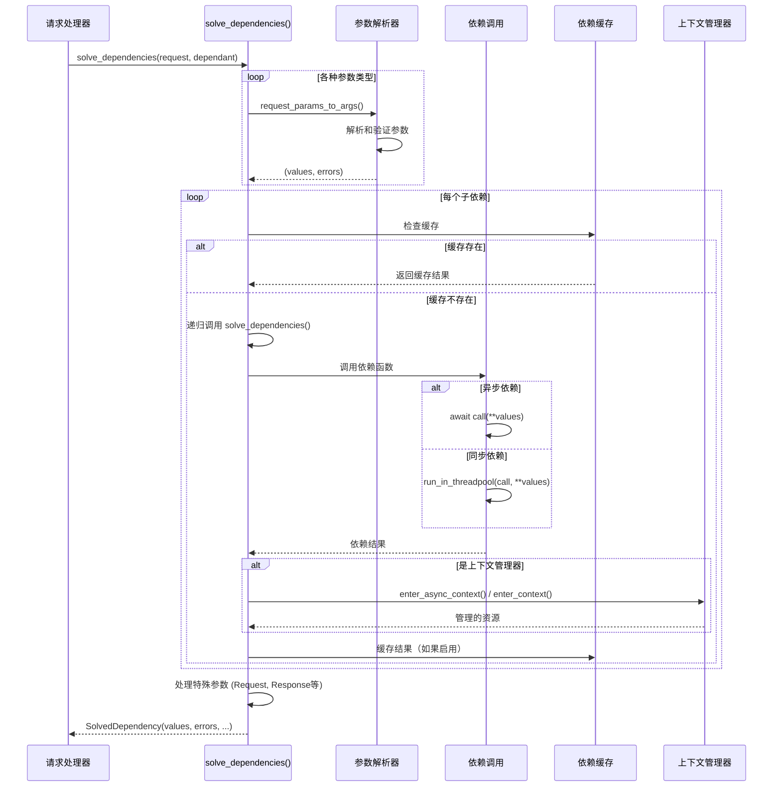
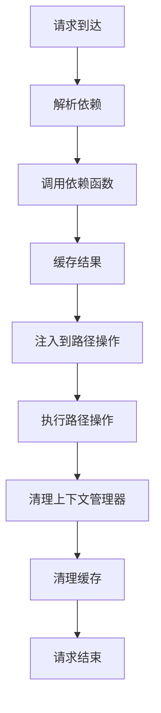

# FastAPI 源码剖析 - 依赖注入系统

## 1. 依赖注入概述

依赖注入（Dependency Injection, DI）是 FastAPI 最强大和创新的特性之一。它允许开发者以声明式的方式定义函数的依赖关系，FastAPI 会自动解析和注入这些依赖，从而实现代码的解耦和复用。

### 1.1 依赖注入系统架构

```mermaid
graph TB
    subgraph "依赖定义层"
        A[依赖函数定义] --> B[Depends()]
        B --> C[SecurityBase]
        C --> D[OAuth2, APIKey等]
    end
    
    subgraph "依赖分析层"  
        E[get_dependant()] --> F[分析函数签名]
        F --> G[识别依赖参数]
        G --> H[构建依赖树]
        H --> I[Dependant对象]
    end
    
    subgraph "依赖解析层"
        J[solve_dependencies()] --> K[递归解析依赖]
        K --> L[缓存机制]
        L --> M[作用域管理]
        M --> N[生命周期控制]
    end
    
    subgraph "依赖注入层"
        O[注入到路径操作] --> P[参数绑定]
        P --> Q[调用用户函数]
    end
    
    A --> E
    I --> J
    N --> O
```

### 1.2 核心概念

**依赖（Dependency）**: 一个函数或类，提供某种功能或资源  
**依赖项（Dependant）**: 需要依赖的函数或类  
**依赖声明**: 通过 `Depends()` 声明依赖关系  
**依赖解析**: FastAPI 自动分析和解决依赖关系的过程  
**依赖注入**: 将解析后的依赖值注入到目标函数的过程

## 2. Depends() 函数深度分析

### 2.1 Depends 类的实现

```python
class Depends:
    """
    依赖注入标记类
    
    用于标记函数参数是一个依赖注入，需要由 FastAPI 自动解析和注入
    
    Attributes:
        dependency: 依赖函数或类
        use_cache: 是否使用缓存，同一请求内相同依赖只执行一次
    """
    
    def __init__(
        self,
        dependency: Optional[Callable[..., Any]] = None,  # 依赖函数
        *,
        use_cache: bool = True,  # 是否缓存结果
    ):
        """
        初始化依赖对象
        
        Args:
            dependency: 依赖函数。如果为None，将使用参数的类型注解作为依赖
            use_cache: 是否缓存依赖结果。在同一请求内，相同依赖只执行一次
            
        Examples:
            # 显式依赖函数
            def get_db() -> Database:
                return Database()
            
            def get_user(user_id: int, db: Database = Depends(get_db)):
                return db.get_user(user_id)
            
            # 类型注解依赖（dependency=None）
            def get_user(user_id: int, db: Database = Depends()):
                return Database().get_user(user_id)  # 会自动调用 Database()
        """
        self.dependency = dependency
        self.use_cache = use_cache

    def __repr__(self) -> str:
        attr = getattr(self.dependency, "__name__", type(self.dependency).__name__)
        cache = "" if self.use_cache else ", use_cache=False"
        return f"{self.__class__.__name__}({attr}{cache})"
```

### 2.2 依赖声明的多种形式

FastAPI 支持多种依赖声明方式：

```python
from fastapi import Depends, FastAPI
from sqlalchemy.orm import Session
from typing import Annotated

app = FastAPI()

# === 1. 函数依赖 ===
def get_database_session() -> Session:
    """
    数据库会话依赖
    
    Returns:
        Session: SQLAlchemy 数据库会话
    """
    db = SessionLocal()
    try:
        yield db  # 使用生成器可以在请求结束后清理资源
    finally:
        db.close()

# === 2. 类依赖 ===
class DatabaseService:
    """数据库服务类依赖"""
    
    def __init__(self, session: Session = Depends(get_database_session)):
        """
        初始化数据库服务
        
        Args:
            session: 数据库会话，通过依赖注入获得
        """
        self.session = session
    
    def get_user(self, user_id: int):
        """获取用户信息"""
        return self.session.query(User).filter(User.id == user_id).first()

# === 3. 子依赖 ===
def get_current_user_id(token: str = Depends(oauth2_scheme)) -> int:
    """
    从令牌中提取当前用户ID
    
    Args:
        token: OAuth2 令牌，通过依赖注入获得
        
    Returns:
        int: 用户ID
        
    Raises:
        HTTPException: 当令牌无效时
    """
    payload = jwt.decode(token, SECRET_KEY, algorithms=[ALGORITHM])
    user_id = payload.get("user_id")
    if user_id is None:
        raise HTTPException(status_code=401, detail="Invalid token")
    return user_id

def get_current_user(
    user_id: int = Depends(get_current_user_id),  # 依赖于 get_current_user_id
    db_service: DatabaseService = Depends(DatabaseService)  # 依赖于 DatabaseService
) -> User:
    """
    获取当前用户对象
    
    这个函数展示了依赖链：
    get_current_user -> get_current_user_id -> oauth2_scheme
                     -> DatabaseService -> get_database_session
    
    Args:
        user_id: 用户ID，通过依赖链获得
        db_service: 数据库服务，通过依赖注入获得
        
    Returns:
        User: 用户对象
    """
    user = db_service.get_user(user_id)
    if not user:
        raise HTTPException(status_code=404, detail="User not found")
    return user

# === 4. 路径操作中使用依赖 ===
@app.get("/users/me")
async def read_users_me(
    current_user: User = Depends(get_current_user)  # 自动解析整个依赖链
) -> User:
    """
    获取当前用户信息
    
    依赖解析流程：
    1. 解析 get_current_user 依赖
    2. 解析 get_current_user_id 子依赖
    3. 解析 oauth2_scheme 子依赖
    4. 解析 DatabaseService 依赖
    5. 解析 get_database_session 子依赖
    6. 按顺序执行所有依赖函数
    7. 注入结果到路径操作函数
    
    Args:
        current_user: 当前用户对象，通过复杂依赖链自动注入
        
    Returns:
        User: 当前用户信息
    """
    return current_user

# === 5. 类型注解依赖（推荐用法）===
@app.get("/items/")
async def read_items(
    # 使用 Annotated 类型注解，提供更好的类型提示
    db: Annotated[Session, Depends(get_database_session)],
    current_user: Annotated[User, Depends(get_current_user)]
) -> List[Item]:
    """
    获取项目列表
    
    使用 Annotated 类型注解的优势：
    1. 提供完整的类型信息
    2. IDE 支持更好
    3. 代码更清晰
    
    Args:
        db: 数据库会话
        current_user: 当前用户
        
    Returns:
        List[Item]: 项目列表
    """
    return db.query(Item).filter(Item.owner_id == current_user.id).all()
```

## 3. Dependant 模型深度分析

### 3.1 Dependant 数据结构

```python
@dataclass
class Dependant:
    """
    依赖对象模型
    
    包含函数或类的所有依赖信息，用于依赖解析和注入
    
    这是 FastAPI 依赖系统的核心数据结构，包含了一个函数
    或类的所有参数信息和依赖关系
    """
    
    # === 基本信息 ===
    path: str = ""                           # 路径（仅用于路径操作）
    call: Optional[Callable[..., Any]] = None # 要调用的函数或类
    name: Optional[str] = None               # 依赖名称
    
    # === 参数分类 ===
    path_params: List[ModelField] = field(default_factory=list)      # 路径参数
    query_params: List[ModelField] = field(default_factory=list)     # 查询参数  
    header_params: List[ModelField] = field(default_factory=list)    # 请求头参数
    cookie_params: List[ModelField] = field(default_factory=list)    # Cookie参数
    body_params: List[ModelField] = field(default_factory=list)      # 请求体参数
    form_params: List[ModelField] = field(default_factory=list)      # 表单参数
    file_params: List[ModelField] = field(default_factory=list)      # 文件参数
    
    # === 依赖关系 ===
    dependencies: List["Dependant"] = field(default_factory=list)    # 子依赖列表
    
    # === 特殊参数 ===
    request_param_name: Optional[str] = None         # Request 对象参数名
    websocket_param_name: Optional[str] = None       # WebSocket 对象参数名
    http_connection_param_name: Optional[str] = None # HTTPConnection 参数名
    response_param_name: Optional[str] = None        # Response 对象参数名  
    background_tasks_param_name: Optional[str] = None# BackgroundTasks 参数名
    security_scopes_param_name: Optional[str] = None # SecurityScopes 参数名
    
    # === 安全相关 ===
    security_requirements: List[SecurityRequirement] = field(default_factory=list)
    
    # === 缓存控制 ===
    use_cache: bool = True  # 是否使用缓存


@dataclass  
class SecurityRequirement:
    """
    安全需求模型
    
    定义访问某个资源所需的安全权限
    
    Attributes:
        security_scheme: 安全方案（OAuth2、API Key等）
        scopes: 所需的权限范围列表
    """
    security_scheme: SecurityBase
    scopes: List[str] = field(default_factory=list)
```

### 3.2 依赖分析过程 - get_dependant()

`get_dependant()` 是依赖分析的核心函数，它将一个普通的 Python 函数转换为 Dependant 对象：

```python
def get_dependant(
    *,
    path: str = "",                                   # URL路径
    call: Optional[Callable[..., Any]] = None,        # 要分析的函数
    dependencies: Optional[Sequence[params.Depends]] = None, # 额外依赖
    name: Optional[str] = None,                       # 依赖名称
    security_scopes: Optional[List[str]] = None,      # 安全范围
) -> Dependant:
    """
    分析函数或类的依赖关系
    
    这个函数是 FastAPI 依赖系统的核心，它：
    1. 解析函数签名
    2. 分析每个参数的类型和注解
    3. 识别各种参数类型（路径、查询、依赖等）
    4. 递归分析子依赖
    5. 构建完整的依赖树
    
    Args:
        path: URL路径模式，用于提取路径参数名
        call: 要分析的函数或类
        dependencies: 额外的依赖列表
        name: 依赖的名称
        security_scopes: 安全权限范围
        
    Returns:
        Dependant: 包含所有依赖信息的对象
        
    Examples:
        # 分析简单函数
        def get_user(user_id: int, db: Session = Depends(get_db)):
            return db.query(User).get(user_id)
            
        dependant = get_dependant(call=get_user)
        # dependant.path_params: []  # 没有路径参数
        # dependant.query_params: [ModelField(name="user_id", type_=int)]
        # dependant.dependencies: [Dependant(call=get_db)]
    """
    # 获取路径中的参数名
    path_param_names = get_path_param_names(path)
    
    # 获取函数签名
    signature = inspect.signature(call) if call else None
    
    # 创建 Dependant 对象
    dependant = Dependant(path=path, call=call, name=name)
    
    # === 处理额外依赖 ===
    if dependencies:
        for depends in dependencies:
            # 递归分析每个子依赖
            sub_dependant = get_sub_dependant(
                depends=depends,
                dependency_overrides_provider=None,
                path=path,
                name=getattr(depends.dependency, "__name__", None),
                security_scopes=security_scopes,
            )
            dependant.dependencies.append(sub_dependant)
    
    # 如果没有函数可分析，返回基础依赖对象
    if not signature:
        return dependant
    
    # === 遍历函数的每个参数 ===
    for param_name, param in signature.parameters.items():
        param_default = param.default
        param_annotation = param.annotation if param.annotation != param.empty else Any
        
        # === 处理特殊类型参数 ===
        
        # 1. Request 对象
        if lenient_issubclass(param_annotation, Request):
            dependant.request_param_name = param_name
            continue
            
        # 2. WebSocket 对象  
        if lenient_issubclass(param_annotation, WebSocket):
            dependant.websocket_param_name = param_name
            continue
            
        # 3. HTTPConnection 对象
        if lenient_issubclass(param_annotation, HTTPConnection):
            dependant.http_connection_param_name = param_name
            continue
            
        # 4. Response 对象
        if lenient_issubclass(param_annotation, Response):
            dependant.response_param_name = param_name
            continue
            
        # 5. BackgroundTasks
        if lenient_issubclass(param_annotation, BackgroundTasks):
            dependant.background_tasks_param_name = param_name
            continue
            
        # 6. SecurityScopes
        if lenient_issubclass(param_annotation, SecurityScopes):
            dependant.security_scopes_param_name = param_name
            continue
        
        # === 处理 Depends 依赖注入 ===
        if isinstance(param_default, params.Depends):
            # 这是一个依赖注入参数
            sub_dependant = get_sub_dependant(
                depends=param_default,
                dependency_overrides_provider=None,
                name=param_name,
                path=path,
                security_scopes=security_scopes,
            )
            dependant.dependencies.append(sub_dependant)
            continue
        
        # === 处理各种参数类型 ===
        
        # 路径参数：在路径模式中定义的参数
        if param_name in path_param_names:
            add_param_to_fields(
                field_info=params.Path(),
                field_name=param_name,
                annotation=param_annotation,
                field_list=dependant.path_params,
            )
            continue
        
        # 显式标记的参数类型
        param_field_info = None
        
        if isinstance(param_default, params.Query):
            param_field_info = param_default
            field_list = dependant.query_params
            
        elif isinstance(param_default, params.Header):
            param_field_info = param_default
            field_list = dependant.header_params
            
        elif isinstance(param_default, params.Cookie):
            param_field_info = param_default
            field_list = dependant.cookie_params
            
        elif isinstance(param_default, params.Body):
            param_field_info = param_default
            field_list = dependant.body_params
            
        elif isinstance(param_default, params.Form):
            param_field_info = param_default
            field_list = dependant.form_params
            
        elif isinstance(param_default, params.File):
            param_field_info = param_default
            field_list = dependant.file_params
        
        # 如果有明确的参数类型标记
        if param_field_info is not None:
            add_param_to_fields(
                field_info=param_field_info,
                field_name=param_name,
                annotation=param_annotation,
                field_list=field_list,
            )
            continue
        
        # === 自动推断参数类型 ===
        # 如果没有显式标记，根据类型和默认值推断
        
        if is_scalar_field(field=create_model_field(name=param_name, type_=param_annotation)):
            # 标量类型（int, str, bool等）-> 查询参数
            add_param_to_fields(
                field_info=params.Query(default=param_default),
                field_name=param_name,
                annotation=param_annotation,
                field_list=dependant.query_params,
            )
        else:
            # 复杂类型（Pydantic模型等）-> 请求体参数
            add_param_to_fields(
                field_info=params.Body(default=param_default),
                field_name=param_name,
                annotation=param_annotation,
                field_list=dependant.body_params,
            )
    
    return dependant


def get_sub_dependant(
    *,
    depends: params.Depends,                          # Depends 对象
    dependency_overrides_provider: Optional[Any] = None, # 依赖覆盖提供者
    name: Optional[str] = None,                       # 依赖名称
    path: str = "",                                   # 路径
    security_scopes: Optional[List[str]] = None,      # 安全范围
) -> Dependant:
    """
    获取子依赖的 Dependant 对象
    
    处理 Depends() 标记的参数，递归分析其依赖关系
    
    Args:
        depends: Depends 对象，包含依赖函数和配置
        dependency_overrides_provider: 用于测试时覆盖依赖
        name: 子依赖的名称
        path: URL路径
        security_scopes: 安全权限范围
        
    Returns:
        Dependant: 子依赖的依赖对象
    """
    # 获取实际的依赖函数
    dependency = depends.dependency
    
    # 如果没有指定依赖函数，使用参数的类型注解
    if dependency is None:
        # 这种情况下，参数的类型注解就是要调用的类或函数
        # 例如: db: Database = Depends() -> 会调用 Database()
        dependency = param_annotation
    
    # 检查是否为安全依赖
    security_requirement = None
    if isinstance(dependency, SecurityBase):
        # 这是一个安全依赖（OAuth2、API Key等）
        security_requirement = SecurityRequirement(
            security_scheme=dependency,
            scopes=security_scopes or [],
        )
        
    # 递归分析子依赖
    sub_dependant = get_dependant(
        path=path,
        call=dependency,
        name=name,
        security_scopes=security_scopes,
    )
    
    # 设置缓存策略
    sub_dependant.use_cache = depends.use_cache
    
    # 添加安全需求
    if security_requirement:
        sub_dependant.security_requirements.append(security_requirement)
    
    return sub_dependant
```

## 4. 依赖解析过程 - solve_dependencies()

### 4.1 依赖解析算法

```python
@dataclass
class SolvedDependency:
    """
    依赖解析结果
    
    包含解析后的参数值和相关信息
    
    Attributes:
        values: 解析后的参数值字典
        errors: 解析过程中的错误列表  
        background_tasks: 后台任务集合
        security_scopes: 安全权限范围
        response: 响应对象（用于WebSocket）
    """
    values: Dict[str, Any] = field(default_factory=dict)
    errors: List[ErrorWrapper] = field(default_factory=list)
    background_tasks: Optional[BackgroundTasks] = None
    security_scopes: List[str] = field(default_factory=list)
    response: Optional[Response] = None


async def solve_dependencies(
    *,
    request: Union[Request, WebSocket],               # 请求对象
    dependant: Dependant,                             # 依赖对象
    dependency_overrides_provider: Optional[Any] = None, # 依赖覆盖
    async_exit_stack: AsyncExitStack,                 # 异步上下文栈
    embed_body_fields: bool = False,                  # 是否嵌入body字段
) -> SolvedDependency:
    """
    解析所有依赖
    
    这是 FastAPI 依赖注入系统的核心函数，负责：
    1. 解析各种类型的参数（路径、查询、头部、Cookie、body等）
    2. 递归解析所有子依赖
    3. 处理依赖缓存
    4. 管理依赖的生命周期
    5. 处理安全依赖
    
    解析过程采用深度优先算法，确保子依赖在父依赖之前被解析
    
    Args:
        request: HTTP请求或WebSocket连接对象
        dependant: 要解析的依赖对象
        dependency_overrides_provider: 依赖覆盖提供者（主要用于测试）
        async_exit_stack: 异步退出栈，用于管理上下文管理器的生命周期
        embed_body_fields: 是否嵌入请求体字段
        
    Returns:
        SolvedDependency: 包含所有解析结果的对象
    """
    # 初始化解析结果
    values: Dict[str, Any] = {}
    errors: List[ErrorWrapper] = []
    background_tasks = BackgroundTasks()
    security_scopes: List[str] = []
    response: Optional[Response] = None
    
    # === 1. 解析各种参数类型 ===
    
    # 路径参数解析
    if dependant.path_params:
        path_values, path_errors = request_params_to_args(
            required_params=dependant.path_params,
            received_params=request.path_params,  # 从URL路径提取
        )
        values.update(path_values)
        errors.extend(path_errors)
    
    # 查询参数解析
    if dependant.query_params:
        query_values, query_errors = request_params_to_args(
            required_params=dependant.query_params,
            received_params=request.query_params,  # 从查询字符串提取
        )
        values.update(query_values)
        errors.extend(query_errors)
    
    # 请求头参数解析
    if dependant.header_params:
        header_values, header_errors = request_params_to_args(
            required_params=dependant.header_params,
            received_params=request.headers,  # 从HTTP头提取
        )
        values.update(header_values)
        errors.extend(header_errors)
    
    # Cookie参数解析
    if dependant.cookie_params:
        cookie_values, cookie_errors = request_params_to_args(
            required_params=dependant.cookie_params,
            received_params=request.cookies,  # 从Cookie提取
        )
        values.update(cookie_values)
        errors.extend(cookie_errors)
    
    # 请求体参数解析
    if dependant.body_params:
        if isinstance(request, Request):  # HTTP请求
            body_values, body_errors = await request_body_to_args(
                body_fields=dependant.body_params,
                received_body=await request.body(),
                embed_body_fields=embed_body_fields,
            )
            values.update(body_values)
            errors.extend(body_errors)
    
    # 表单参数解析
    if dependant.form_params:
        if isinstance(request, Request):
            form = await request.form()
            form_values, form_errors = await request_form_to_args(
                required_params=dependant.form_params,
                received_form=form,
            )
            values.update(form_values)
            errors.extend(form_errors)
    
    # === 2. 递归解析子依赖 ===
    dependency_cache: Dict[Callable[..., Any], Any] = {}
    
    for sub_dependant in dependant.dependencies:
        # 检查是否有依赖覆盖（主要用于测试）
        call = sub_dependant.call
        if (
            dependency_overrides_provider
            and call in dependency_overrides_provider.dependency_overrides
        ):
            # 使用覆盖的依赖
            call = dependency_overrides_provider.dependency_overrides[call]
        
        # 检查缓存
        cache_key = call
        if sub_dependant.use_cache and cache_key in dependency_cache:
            # 使用缓存的结果
            solved_result = dependency_cache[cache_key]
        else:
            # 需要重新解析
            if call != sub_dependant.call:
                # 使用覆盖的依赖，重新创建 Dependant 对象
                use_sub_dependant = get_dependant(
                    path="",
                    call=call,
                    name=sub_dependant.name,
                )
            else:
                use_sub_dependant = sub_dependant
            
            # 递归解析子依赖
            solved_result = await solve_dependencies(
                request=request,
                dependant=use_sub_dependant,
                dependency_overrides_provider=dependency_overrides_provider,
                async_exit_stack=async_exit_stack,
                embed_body_fields=embed_body_fields,
            )
            
            # 缓存结果（如果启用缓存）
            if sub_dependant.use_cache:
                dependency_cache[cache_key] = solved_result
        
        # 处理解析错误
        if solved_result.errors:
            errors.extend(solved_result.errors)
            continue
        
        # === 3. 调用依赖函数 ===
        if call:
            # 检查是否为协程函数
            if iscoroutinefunction(call):
                # 异步依赖
                sub_response = await call(**solved_result.values)
            else:
                # 同步依赖，在线程池中运行
                sub_response = await run_in_threadpool(call, **solved_result.values)
            
            # === 4. 处理上下文管理器 ===
            if hasattr(sub_response, "__aenter__"):
                # 异步上下文管理器
                sub_response = await async_exit_stack.enter_async_context(sub_response)
            elif hasattr(sub_response, "__enter__"):
                # 同步上下文管理器
                sub_response = async_exit_stack.enter_context(sub_response)
            
            # 将依赖结果添加到参数值中
            if sub_dependant.name:
                values[sub_dependant.name] = sub_response
        
        # 合并后台任务和安全范围
        if solved_result.background_tasks:
            background_tasks.add_task_list(solved_result.background_tasks.tasks)
        security_scopes.extend(solved_result.security_scopes)
    
    # === 5. 处理特殊参数 ===
    
    # Request对象
    if dependant.request_param_name:
        values[dependant.request_param_name] = request
    
    # WebSocket对象  
    if dependant.websocket_param_name and isinstance(request, WebSocket):
        values[dependant.websocket_param_name] = request
    
    # HTTPConnection对象
    if dependant.http_connection_param_name:
        values[dependant.http_connection_param_name] = request
    
    # BackgroundTasks对象
    if dependant.background_tasks_param_name:
        values[dependant.background_tasks_param_name] = background_tasks
    
    # SecurityScopes对象
    if dependant.security_scopes_param_name:
        values[dependant.security_scopes_param_name] = SecurityScopes(scopes=security_scopes)
    
    # Response对象（仅用于WebSocket）
    if dependant.response_param_name:
        response = Response()
        values[dependant.response_param_name] = response
    
    return SolvedDependency(
        values=values,
        errors=errors,
        background_tasks=background_tasks,
        security_scopes=security_scopes,
        response=response,
    )
```

### 4.2 依赖解析时序图



## 5. 依赖缓存机制

### 5.1 缓存策略

FastAPI 的依赖缓存有以下特点：

1. **请求级别缓存**：在同一个请求内，相同依赖只执行一次
2. **可选择性**：通过 `use_cache=False` 可以禁用缓存
3. **基于函数引用**：使用函数对象作为缓存键
4. **自动清理**：请求结束后自动清理缓存

```python
# 缓存示例
expensive_computation_count = 0

def expensive_computation() -> str:
    """
    模拟昂贵的计算
    
    在同一请求内，这个函数只会被调用一次
    """
    global expensive_computation_count
    expensive_computation_count += 1
    time.sleep(2)  # 模拟耗时操作
    return f"Result {expensive_computation_count}"

@app.get("/cached")
async def test_cache(
    # 这两个依赖都会调用 expensive_computation，但只执行一次
    result1: str = Depends(expensive_computation),
    result2: str = Depends(expensive_computation)
) -> dict:
    """
    测试依赖缓存
    
    尽管有两个依赖都需要 expensive_computation 的结果，
    但在同一请求内，expensive_computation 只会被执行一次
    """
    return {"result1": result1, "result2": result2}  # 两个结果相同

# 禁用缓存示例
@app.get("/no-cache")  
async def test_no_cache(
    result1: str = Depends(expensive_computation),
    result2: str = Depends(expensive_computation, use_cache=False)  # 禁用缓存
) -> dict:
    """
    测试禁用缓存
    
    result2 禁用了缓存，所以 expensive_computation 会被调用两次
    """
    return {"result1": result1, "result2": result2}  # 可能得到不同结果
```

### 5.2 上下文管理器支持

FastAPI 支持依赖作为上下文管理器，自动管理资源的生命周期：

```python
from contextlib import contextmanager, asynccontextmanager
from typing import Iterator, AsyncIterator

# === 同步上下文管理器 ===
@contextmanager
def get_db_session() -> Iterator[Session]:
    """
    数据库会话上下文管理器
    
    自动处理会话的创建和清理
    """
    session = SessionLocal()
    try:
        yield session
        session.commit()  # 自动提交
    except Exception:
        session.rollback()  # 出错时回滚
        raise
    finally:
        session.close()  # 自动关闭会话

# === 异步上下文管理器 ===
@asynccontextmanager  
async def get_redis_pool() -> AsyncIterator[Redis]:
    """
    Redis连接池上下文管理器
    
    自动处理连接的获取和释放
    """
    pool = await aioredis.create_pool('redis://localhost')
    try:
        redis = Redis(connection_pool=pool)
        yield redis
    finally:
        pool.close()
        await pool.wait_closed()

# === 在路径操作中使用 ===
@app.get("/users/{user_id}")
async def get_user(
    user_id: int,
    # FastAPI 自动管理上下文管理器的生命周期
    db: Session = Depends(get_db_session),
    redis: Redis = Depends(get_redis_pool)
) -> User:
    """
    使用上下文管理器依赖
    
    FastAPI 会自动：
    1. 进入上下文管理器（获取资源）
    2. 执行路径操作函数
    3. 退出上下文管理器（清理资源）
    
    即使路径操作函数抛出异常，资源也会被正确清理
    """
    # 从缓存中查找用户
    cached_user = await redis.get(f"user:{user_id}")
    if cached_user:
        return User.parse_raw(cached_user)
    
    # 从数据库查找用户
    user = db.query(User).filter(User.id == user_id).first()
    if not user:
        raise HTTPException(status_code=404, detail="User not found")
    
    # 缓存用户信息
    await redis.setex(f"user:{user_id}", 3600, user.json())
    
    return user
    
# 请求处理流程：
# 1. 进入 get_db_session 上下文 -> 创建 session
# 2. 进入 get_redis_pool 上下文 -> 创建 redis 连接
# 3. 执行 get_user 函数
# 4. 退出 get_redis_pool 上下文 -> 关闭 redis 连接
# 5. 退出 get_db_session 上下文 -> 提交/回滚并关闭 session
```

## 6. 依赖作用域和生命周期

### 6.1 依赖的生命周期

FastAPI 中的依赖有明确的生命周期：



### 6.2 依赖作用域

```python
# === 全局依赖 ===
# 应用级别的依赖，作用于所有路径操作
app = FastAPI(dependencies=[
    Depends(verify_api_key),  # 全局API密钥验证
    Depends(rate_limiter),    # 全局限流
])

# === 路由器级别依赖 ===
# 作用于整个路由器的所有路径操作
router = APIRouter(
    prefix="/api/v1",
    dependencies=[
        Depends(get_current_user),  # 路由器级别的用户认证
    ]
)

# === 路径操作级别依赖 ===
@router.get("/users/me")
async def get_current_user_info(
    # 路径操作级别的依赖
    user: User = Depends(get_current_user),
    permissions: List[str] = Depends(get_user_permissions)
):
    """
    依赖执行顺序：
    1. 全局依赖：verify_api_key, rate_limiter
    2. 路由器依赖：get_current_user  
    3. 路径操作依赖：get_current_user（缓存命中），get_user_permissions
    """
    return {"user": user, "permissions": permissions}
```

## 7. 安全依赖集成

### 7.1 安全依赖的特殊处理

FastAPI 对安全依赖（继承自 `SecurityBase` 的依赖）有特殊处理：

```python
from fastapi.security import OAuth2PasswordBearer, HTTPBearer

# OAuth2 安全方案
oauth2_scheme = OAuth2PasswordBearer(tokenUrl="token")

# HTTP Bearer 安全方案
bearer_scheme = HTTPBearer()

def get_current_user(token: str = Depends(oauth2_scheme)) -> User:
    """
    从令牌获取当前用户
    
    oauth2_scheme 是一个安全依赖，FastAPI 会：
    1. 在 OpenAPI 中标记此端点需要认证
    2. 在 Swagger UI 中显示认证按钮
    3. 从 Authorization 头中提取令牌
    """
    # 验证令牌并返回用户
    return verify_token(token)

@app.get("/protected")
async def protected_endpoint(
    current_user: User = Depends(get_current_user)
):
    """
    受保护的端点
    
    在 OpenAPI 文档中，此端点会显示：
    1. 需要 OAuth2 认证
    2. 锁图标表示需要认证
    3. 在 Swagger UI 中可以输入令牌进行测试
    """
    return {"user": current_user.username}
```

### 7.2 复合安全依赖

```python
from fastapi.security import SecurityScopes

def verify_permissions(
    security_scopes: SecurityScopes,
    token: str = Depends(oauth2_scheme)
) -> User:
    """
    验证用户权限
    
    Args:
        security_scopes: 所需的权限范围
        token: 访问令牌
        
    Returns:
        User: 验证通过的用户
        
    Raises:
        HTTPException: 权限不足或令牌无效
    """
    user = verify_token(token)
    
    # 检查用户是否有所需权限
    for scope in security_scopes.scopes:
        if scope not in user.permissions:
            raise HTTPException(
                status_code=403,
                detail=f"Not enough permissions. Required: {scope}"
            )
    
    return user

@app.get("/admin/users")
async def list_users(
    # 使用 Security() 指定所需权限
    current_user: User = Security(verify_permissions, scopes=["users:read"])
):
    """
    需要 users:read 权限的端点
    
    FastAPI 会自动：
    1. 将 scopes=["users:read"] 传递给 SecurityScopes
    2. 在 OpenAPI 中记录所需权限
    3. 在文档中显示权限要求
    """
    return get_all_users()
```

## 8. 依赖注入的高级特性

### 8.1 动态依赖

```python
def create_database_dependency(database_url: str):
    """
    动态创建数据库依赖
    
    根据配置动态创建不同的数据库连接
    """
    engine = create_engine(database_url)
    SessionLocal = sessionmaker(bind=engine)
    
    def get_db():
        db = SessionLocal()
        try:
            yield db
        finally:
            db.close()
    
    return get_db

# 根据环境使用不同的数据库
if settings.ENVIRONMENT == "test":
    get_db = create_database_dependency(settings.TEST_DATABASE_URL)
else:
    get_db = create_database_dependency(settings.DATABASE_URL)

@app.get("/users")
async def list_users(db: Session = Depends(get_db)):
    return db.query(User).all()
```

### 8.2 条件依赖

```python
def conditional_dependency(condition: bool):
    """
    条件依赖工厂
    
    根据条件返回不同的依赖
    """
    if condition:
        return expensive_dependency
    else:
        return simple_dependency

def get_service_dependency():
    """
    根据配置选择服务实现
    """
    if settings.USE_REDIS:
        return get_redis_service
    else:
        return get_memory_service

@app.get("/data")
async def get_data(
    service = Depends(get_service_dependency())
):
    return service.get_data()
```

## 9. 性能优化和最佳实践

### 9.1 依赖优化建议

```python
# ✅ 好的做法：使用缓存
@lru_cache()
def get_settings():
    """
    配置依赖使用缓存
    
    配置信息通常不会改变，使用缓存可以避免重复创建
    """
    return Settings()

# ✅ 好的做法：异步依赖
async def get_async_database():
    """
    对于 I/O 密集型操作，使用异步依赖
    """
    async with AsyncSession() as session:
        yield session

# ❌ 避免的做法：在依赖中执行昂贵操作而不使用缓存
def expensive_calculation():  # 没有 use_cache=True
    time.sleep(5)  # 昂贵操作
    return "result"

# ✅ 改进：使用缓存或者全局变量
@lru_cache()
def cached_expensive_calculation():
    time.sleep(5)
    return "result"
```

### 9.2 依赖组织建议

```python
# dependencies/database.py
async def get_database_session():
    """数据库会话依赖"""
    pass

# dependencies/auth.py  
async def get_current_user():
    """认证依赖"""
    pass

# dependencies/cache.py
async def get_redis_client():
    """缓存依赖"""
    pass

# main.py
from dependencies import database, auth, cache

@app.get("/users")
async def list_users(
    db: Session = Depends(database.get_database_session),
    current_user: User = Depends(auth.get_current_user),
    redis: Redis = Depends(cache.get_redis_client)
):
    # 清晰的依赖组织
    pass
```

## 10. 总结

FastAPI 的依赖注入系统是其最强大的特性之一，它通过以下创新实现了优雅的依赖管理：

1. **类型驱动**：基于 Python 类型提示自动推断依赖关系
2. **声明式设计**：通过 `Depends()` 声明式地定义依赖
3. **递归解析**：支持复杂的依赖链和嵌套依赖
4. **智能缓存**：请求级别的依赖缓存，提高性能
5. **生命周期管理**：自动管理上下文管理器的生命周期
6. **安全集成**：与安全系统深度集成，自动生成文档
7. **测试友好**：支持依赖覆盖，方便单元测试

这个系统不仅简化了代码编写，还提供了强大的功能和优秀的性能。下一章我们将分析 FastAPI 的安全认证系统实现。
