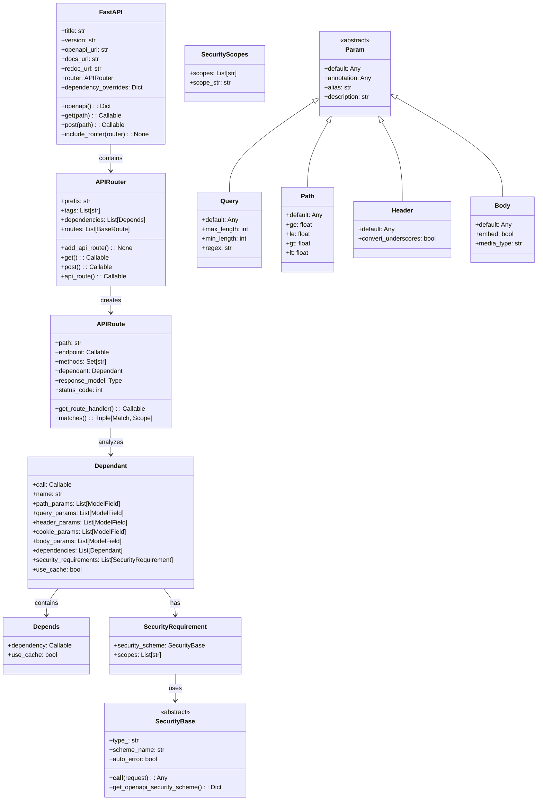
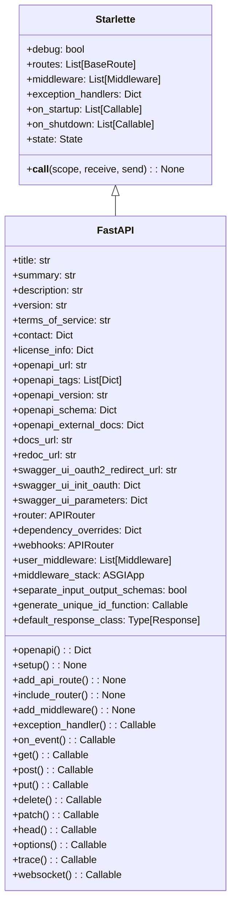
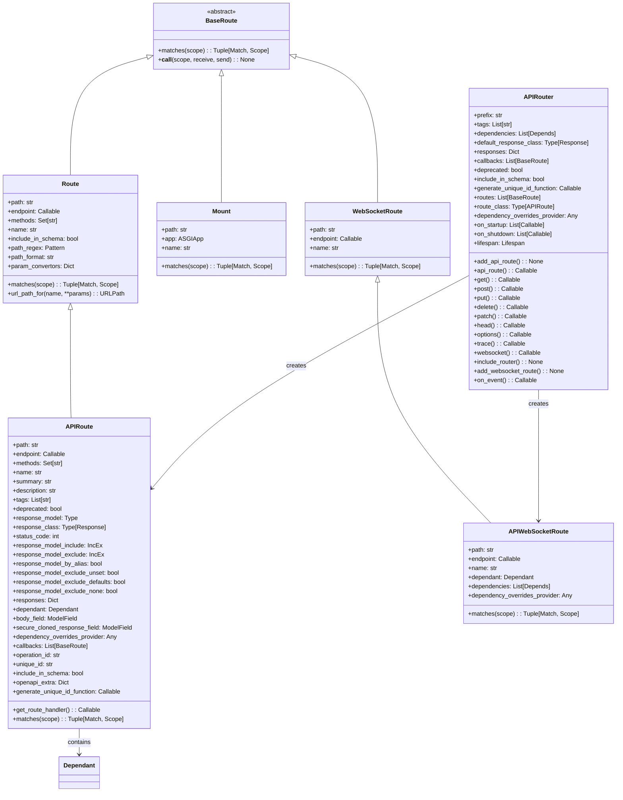
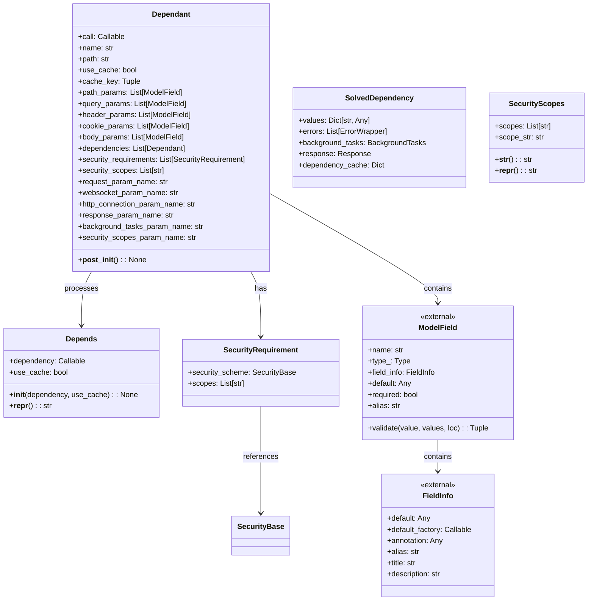
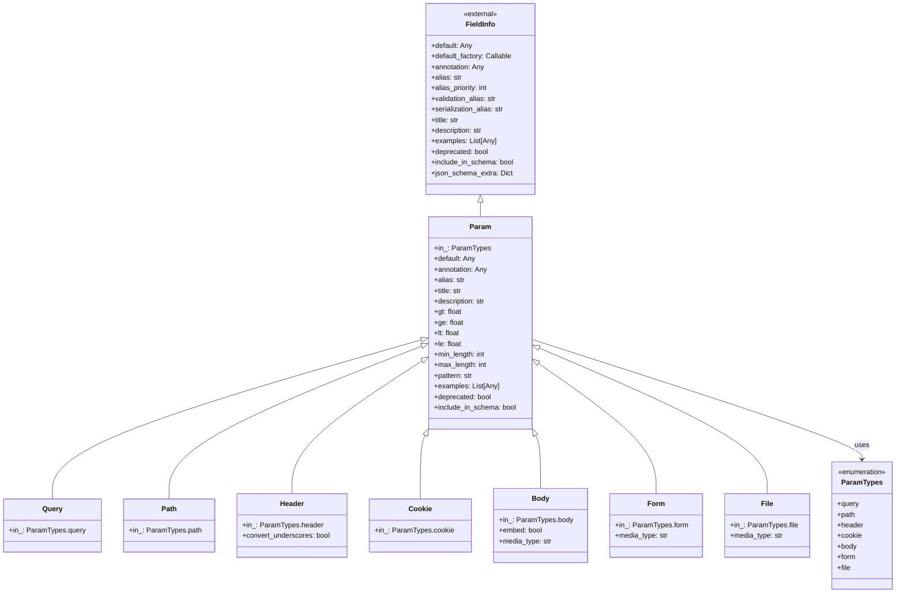
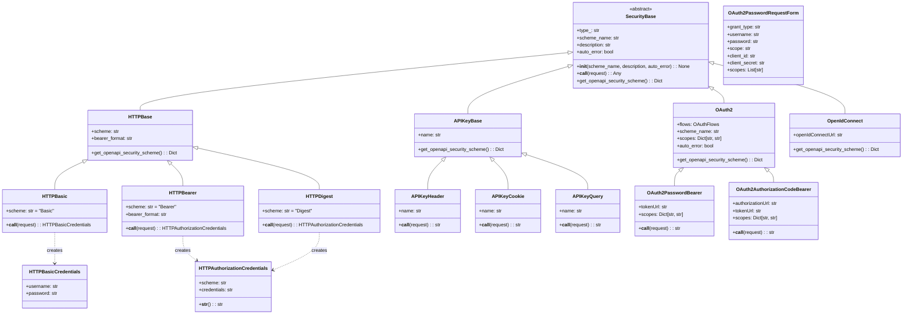
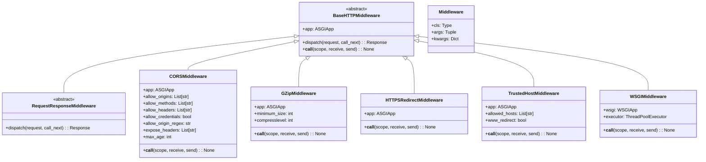
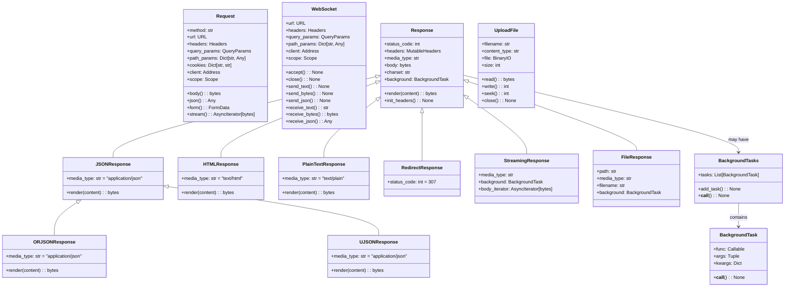
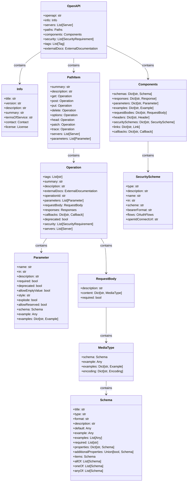
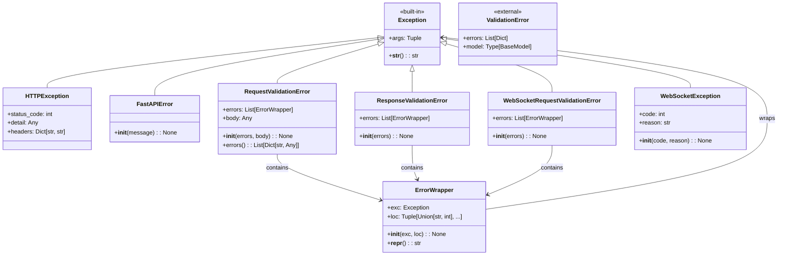

## 1. 整体数据结构关系图

## 2. FastAPI 应用类详细结构

## 3. 路由系统类图

## 4. 依赖注入系统类图

## 5. 参数处理系统类图

## 6. 安全认证系统类图

## 7. 中间件系统类图

## 8. 请求响应处理类图

## 9. OpenAPI 集成系统类图

## 10. 异常处理系统类图

这些 UML 图展示了 FastAPI 的核心数据结构和它们之间的关系，帮助理解整个框架的架构设计：

1. **分层设计**：从 Starlette 基础到 FastAPI 扩展的清晰分层
2. **组合模式**：大量使用组合而非继承来构建复杂功能  
3. **类型安全**：通过 Pydantic 模型确保类型安全
4. **依赖注入**：通过 Dependant 和相关类实现复杂的依赖管理
5. **可扩展性**：通过抽象基类和接口设计支持自定义扩展

这些结构图为深入理解 FastAPI 的实现原理提供了重要参考。
