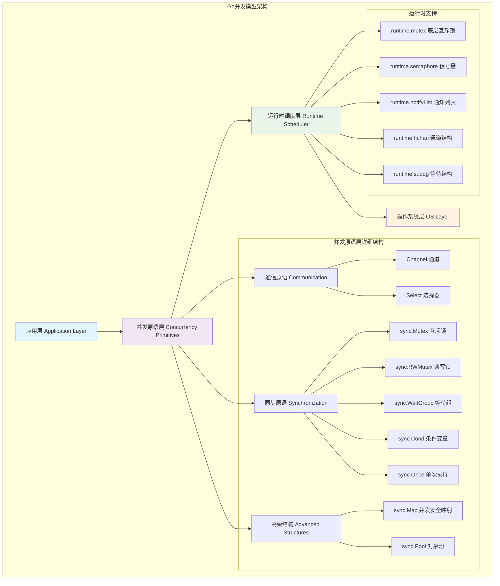
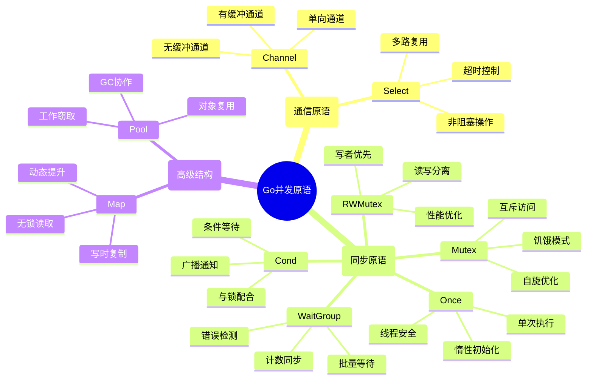
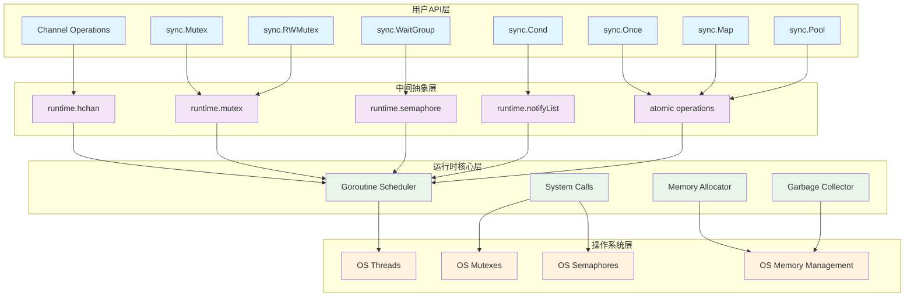
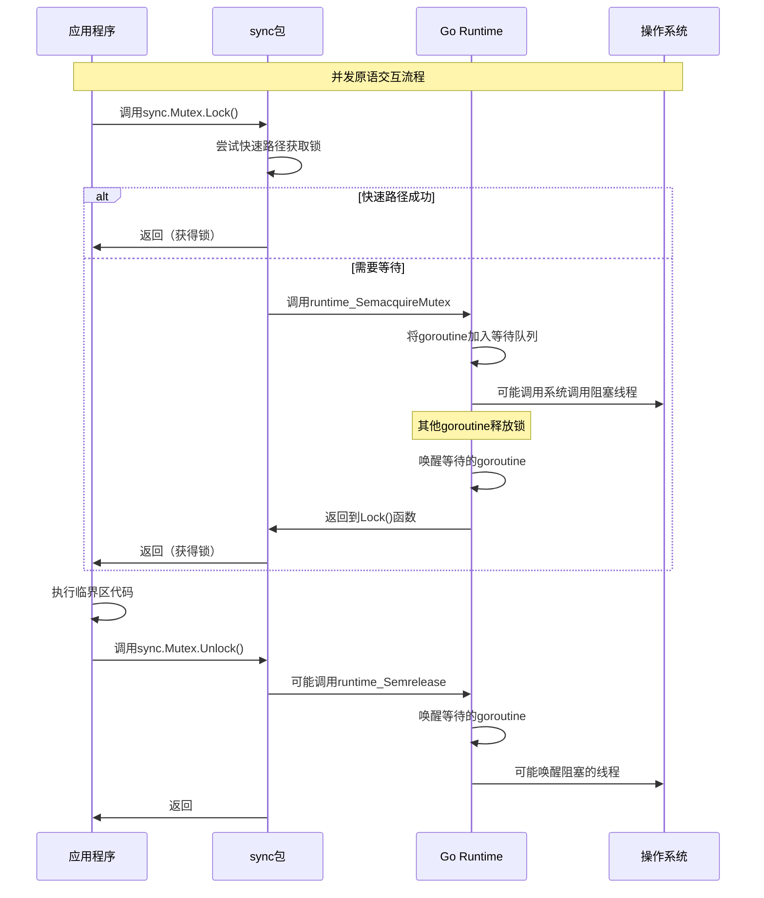
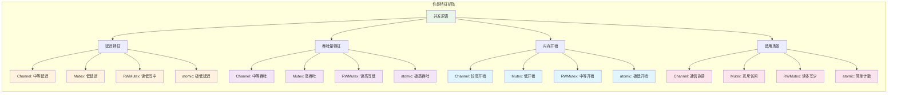
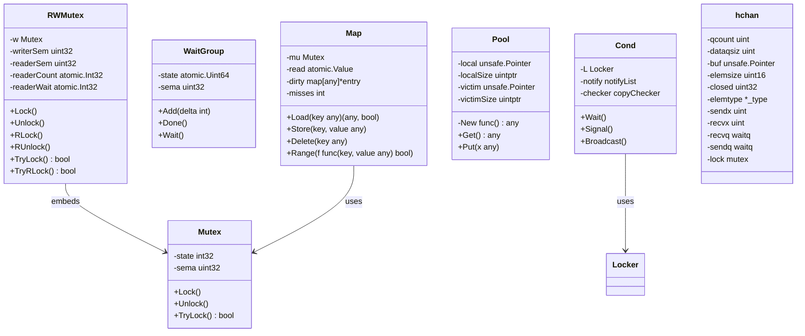

# Go并发原语架构总览：从设计理念到工程实践

## 概述

Go语言的并发模型基于CSP（Communicating Sequential Processes）理论，通过goroutine和channel实现了"不要通过共享内存来通信，而要通过通信来共享内存"的设计哲学。同时，Go还提供了传统的同步原语（sync包），为开发者提供了灵活的并发编程选择。

本文档系列将深入剖析Go并发原语的整体架构，包括：
- **通信原语**：Channel机制的底层实现
- **同步原语**：sync包中的各种同步工具
- **高级结构**：sync.Map、sync.Pool等高性能并发数据结构

## 1. Go并发模型整体架构

### 1.1 并发模型层次结构



**架构层次说明**：

1. **应用层**：开发者直接使用的并发API
2. **并发原语层**：Go提供的各种并发工具
3. **运行时调度层**：Go runtime的调度器和底层支持
4. **操作系统层**：系统级的线程和同步原语

### 1.2 并发原语分类与特性



## 2. 框架使用示例

### 2.1 基础并发模式

```go
package main

import (
    "fmt"
    "sync"
    "time"
)

// 示例1：使用Channel进行goroutine通信
func channelExample() {
    // 创建有缓冲通道用于任务分发
    taskCh := make(chan int, 10)
    // 创建无缓冲通道用于结果收集
    resultCh := make(chan string)
    
    // 启动工作goroutine
    const numWorkers = 3
    for i := 0; i < numWorkers; i++ {
        go func(workerID int) {
            for task := range taskCh {
                // 模拟任务处理
                result := fmt.Sprintf("Worker %d processed task %d", workerID, task)
                resultCh <- result
            }
        }(i)
    }
    
    // 发送任务
    go func() {
        for i := 1; i <= 10; i++ {
            taskCh <- i
        }
        close(taskCh) // 关闭任务通道，通知工作者退出
    }()
    
    // 收集结果
    for i := 0; i < 10; i++ {
        result := <-resultCh
        fmt.Println(result)
    }
}

// 示例2：使用sync.WaitGroup等待多个goroutine完成
func waitGroupExample() {
    var wg sync.WaitGroup
    
    // 启动多个并发任务
    for i := 1; i <= 5; i++ {
        wg.Add(1) // 增加等待计数
        go func(taskID int) {
            defer wg.Done() // 任务完成时减少计数
            
            // 模拟任务执行
            fmt.Printf("Task %d started\n", taskID)
            time.Sleep(time.Duration(taskID) * time.Second)
            fmt.Printf("Task %d completed\n", taskID)
        }(i)
    }
    
    wg.Wait() // 等待所有任务完成
    fmt.Println("All tasks completed")
}

// 示例3：使用sync.Mutex保护共享资源
func mutexExample() {
    var (
        counter int
        mu      sync.Mutex
        wg      sync.WaitGroup
    )
    
    // 启动多个goroutine并发修改计数器
    for i := 0; i < 100; i++ {
        wg.Add(1)
        go func() {
            defer wg.Done()
            
            // 使用互斥锁保护临界区
            mu.Lock()
            counter++
            mu.Unlock()
        }()
    }
    
    wg.Wait()
    fmt.Printf("Final counter value: %d\n", counter)
}

// 示例4：使用sync.RWMutex实现读写分离
func rwMutexExample() {
    type SafeMap struct {
        mu   sync.RWMutex
        data map[string]int
    }
    
    safeMap := &SafeMap{
        data: make(map[string]int),
    }
    
    // 写操作方法
    safeMap.Set := func(key string, value int) {
        safeMap.mu.Lock()         // 获取写锁
        defer safeMap.mu.Unlock()
        safeMap.data[key] = value
    }
    
    // 读操作方法
    safeMap.Get := func(key string) (int, bool) {
        safeMap.mu.RLock()         // 获取读锁
        defer safeMap.mu.RUnlock()
        value, exists := safeMap.data[key]
        return value, exists
    }
    
    var wg sync.WaitGroup
    
    // 启动写goroutine
    for i := 0; i < 10; i++ {
        wg.Add(1)
        go func(i int) {
            defer wg.Done()
            key := fmt.Sprintf("key%d", i)
            safeMap.Set(key, i*10)
        }(i)
    }
    
    // 启动读goroutine
    for i := 0; i < 50; i++ {
        wg.Add(1)
        go func(i int) {
            defer wg.Done()
            key := fmt.Sprintf("key%d", i%10)
            if value, exists := safeMap.Get(key); exists {
                fmt.Printf("Read %s: %d\n", key, value)
            }
        }(i)
    }
    
    wg.Wait()
}

// 示例5：使用sync.Pool对象复用
func poolExample() {
    // 创建对象池
    bufferPool := sync.Pool{
        New: func() interface{} {
            // 当池中没有对象时，创建新对象
            return make([]byte, 1024)
        },
    }
    
    var wg sync.WaitGroup
    
    // 模拟并发使用缓冲区
    for i := 0; i < 100; i++ {
        wg.Add(1)
        go func(i int) {
            defer wg.Done()
            
            // 从池中获取对象
            buffer := bufferPool.Get().([]byte)
            
            // 使用缓冲区进行一些操作
            copy(buffer, fmt.Sprintf("Data from goroutine %d", i))
            
            // 将对象归还到池中
            bufferPool.Put(buffer)
        }(i)
    }
    
    wg.Wait()
}

// 示例6：使用sync.Map并发安全映射
func syncMapExample() {
    var sm sync.Map
    var wg sync.WaitGroup
    
    // 并发写入
    for i := 0; i < 100; i++ {
        wg.Add(1)
        go func(i int) {
            defer wg.Done()
            key := fmt.Sprintf("key%d", i)
            sm.Store(key, i*10)
        }(i)
    }
    
    // 并发读取
    for i := 0; i < 100; i++ {
        wg.Add(1)
        go func(i int) {
            defer wg.Done()
            key := fmt.Sprintf("key%d", i)
            if value, ok := sm.Load(key); ok {
                fmt.Printf("Loaded %s: %v\n", key, value)
            }
        }(i)
    }
    
    wg.Wait()
    
    // 遍历所有键值对
    sm.Range(func(key, value interface{}) bool {
        fmt.Printf("Range: %v = %v\n", key, value)
        return true // 继续遍历
    })
}

func main() {
    fmt.Println("=== Channel Example ===")
    channelExample()
    
    fmt.Println("\n=== WaitGroup Example ===")
    waitGroupExample()
    
    fmt.Println("\n=== Mutex Example ===")
    mutexExample()
    
    fmt.Println("\n=== RWMutex Example ===")
    rwMutexExample()
    
    fmt.Println("\n=== Pool Example ===")
    poolExample()
    
    fmt.Println("\n=== sync.Map Example ===")
    syncMapExample()
}
```

### 2.2 高级并发模式

```go
// 生产者-消费者模式
func producerConsumerPattern() {
    const (
        bufferSize = 10
        numProducers = 3
        numConsumers = 2
    )
    
    // 创建有缓冲通道作为队列
    queue := make(chan int, bufferSize)
    var wg sync.WaitGroup
    
    // 启动生产者
    for i := 0; i < numProducers; i++ {
        wg.Add(1)
        go func(producerID int) {
            defer wg.Done()
            for j := 0; j < 10; j++ {
                item := producerID*100 + j
                queue <- item
                fmt.Printf("Producer %d produced: %d\n", producerID, item)
                time.Sleep(100 * time.Millisecond)
            }
        }(i)
    }
    
    // 启动消费者
    for i := 0; i < numConsumers; i++ {
        wg.Add(1)
        go func(consumerID int) {
            defer wg.Done()
            for {
                select {
                case item, ok := <-queue:
                    if !ok {
                        return // 通道已关闭
                    }
                    fmt.Printf("Consumer %d consumed: %d\n", consumerID, item)
                    time.Sleep(200 * time.Millisecond)
                }
            }
        }(i)
    }
    
    // 等待所有生产者完成
    go func() {
        wg.Wait()
        close(queue) // 关闭队列，通知消费者退出
    }()
    
    // 等待一段时间让消费者处理完剩余项目
    time.Sleep(5 * time.Second)
}

// 工作池模式
func workerPoolPattern() {
    type Job struct {
        ID   int
        Data string
    }
    
    type Result struct {
        JobID  int
        Output string
    }
    
    const numWorkers = 5
    jobs := make(chan Job, 100)
    results := make(chan Result, 100)
    
    // 启动工作池
    var wg sync.WaitGroup
    for i := 0; i < numWorkers; i++ {
        wg.Add(1)
        go func(workerID int) {
            defer wg.Done()
            for job := range jobs {
                // 模拟工作处理
                output := fmt.Sprintf("Worker %d processed job %d: %s", 
                    workerID, job.ID, job.Data)
                results <- Result{
                    JobID:  job.ID,
                    Output: output,
                }
                time.Sleep(100 * time.Millisecond)
            }
        }(i)
    }
    
    // 发送任务
    go func() {
        for i := 1; i <= 20; i++ {
            jobs <- Job{
                ID:   i,
                Data: fmt.Sprintf("task-data-%d", i),
            }
        }
        close(jobs)
    }()
    
    // 收集结果
    go func() {
        wg.Wait()
        close(results)
    }()
    
    // 处理结果
    for result := range results {
        fmt.Printf("Result for job %d: %s\n", result.JobID, result.Output)
    }
}

// 扇入扇出模式
func fanInFanOutPattern() {
    // 扇出：将输入分发给多个处理器
    input := make(chan int)
    
    // 创建多个处理通道
    const numProcessors = 3
    processors := make([]chan int, numProcessors)
    for i := range processors {
        processors[i] = make(chan int)
    }
    
    // 扇出逻辑
    go func() {
        defer func() {
            for _, proc := range processors {
                close(proc)
            }
        }()
        
        for i := 1; i <= 30; i++ {
            // 轮询分发到不同的处理器
            processors[i%numProcessors] <- i
        }
    }()
    
    // 处理器处理数据
    outputs := make([]chan string, numProcessors)
    for i := 0; i < numProcessors; i++ {
        outputs[i] = make(chan string)
        go func(procID int) {
            defer close(outputs[procID])
            for num := range processors[procID] {
                result := fmt.Sprintf("Processor %d handled: %d", procID, num*num)
                outputs[procID] <- result
            }
        }(i)
    }
    
    // 扇入：合并多个处理器的输出
    merged := make(chan string)
    var wg sync.WaitGroup
    
    for i, output := range outputs {
        wg.Add(1)
        go func(output chan string) {
            defer wg.Done()
            for result := range output {
                merged <- result
            }
        }(output)
    }
    
    go func() {
        wg.Wait()
        close(merged)
    }()
    
    // 收集最终结果
    for result := range merged {
        fmt.Println(result)
    }
}
```

## 3. 核心API总览

### 3.1 通信原语API

```go
// Channel操作API
func channelAPIs() {
    // 创建通道
    ch1 := make(chan int)           // 无缓冲通道
    ch2 := make(chan int, 10)       // 有缓冲通道
    ch3 := make(<-chan int)         // 只读通道
    ch4 := make(chan<- int)         // 只写通道
    
    // 发送操作
    ch2 <- 42                       // 阻塞发送
    select {
    case ch2 <- 43:                 // 非阻塞发送
        fmt.Println("Sent 43")
    default:
        fmt.Println("Channel full")
    }
    
    // 接收操作
    value := <-ch2                  // 阻塞接收
    value, ok := <-ch2              // 接收并检查通道状态
    
    select {
    case value := <-ch2:            // 非阻塞接收
        fmt.Println("Received:", value)
    default:
        fmt.Println("No data available")
    }
    
    // 关闭通道
    close(ch2)
    
    // 遍历通道
    for value := range ch2 {
        fmt.Println("Range value:", value)
    }
}

// Select多路复用API
func selectAPIs() {
    ch1 := make(chan int)
    ch2 := make(chan string)
    timeout := time.After(1 * time.Second)
    
    select {
    case value := <-ch1:
        fmt.Println("Received int:", value)
    case msg := <-ch2:
        fmt.Println("Received string:", msg)
    case <-timeout:
        fmt.Println("Timeout occurred")
    default:
        fmt.Println("No channel ready")
    }
}
```

### 3.2 同步原语API

```go
// sync包核心API
func syncAPIs() {
    // Mutex API
    var mu sync.Mutex
    mu.Lock()                       // 加锁
    defer mu.Unlock()               // 解锁
    
    // RWMutex API
    var rwmu sync.RWMutex
    rwmu.RLock()                    // 读锁
    defer rwmu.RUnlock()            // 读解锁
    rwmu.Lock()                     // 写锁
    defer rwmu.Unlock()             // 写解锁
    
    // WaitGroup API
    var wg sync.WaitGroup
    wg.Add(1)                       // 增加计数
    go func() {
        defer wg.Done()             // 完成任务（等价于Add(-1)）
        // 执行任务
    }()
    wg.Wait()                       // 等待所有任务完成
    
    // Once API
    var once sync.Once
    once.Do(func() {                // 确保函数只执行一次
        fmt.Println("This runs only once")
    })
    
    // Cond API
    var cond = sync.NewCond(&mu)
    cond.Wait()                     // 等待条件
    cond.Signal()                   // 唤醒一个等待者
    cond.Broadcast()                // 唤醒所有等待者
}

// 高级结构API
func advancedAPIs() {
    // sync.Map API
    var sm sync.Map
    sm.Store("key", "value")        // 存储键值对
    value, ok := sm.Load("key")     // 加载值
    actual, loaded := sm.LoadOrStore("key", "new") // 加载或存储
    value, loaded = sm.LoadAndDelete("key") // 加载并删除
    sm.Delete("key")                // 删除键
    swapped := sm.CompareAndSwap("key", "old", "new") // 比较并交换
    sm.Range(func(key, value interface{}) bool { // 遍历
        fmt.Printf("%v: %v\n", key, value)
        return true // 继续遍历
    })
    
    // sync.Pool API
    pool := &sync.Pool{
        New: func() interface{} {   // 创建新对象的函数
            return make([]byte, 1024)
        },
    }
    obj := pool.Get()               // 获取对象
    pool.Put(obj)                   // 归还对象
}
```

## 4. 整体架构设计

### 4.1 并发原语依赖关系图



**依赖关系说明**：

1. **用户API层**：开发者直接使用的并发原语接口
2. **中间抽象层**：Go runtime提供的底层抽象
3. **运行时核心层**：Go runtime的核心组件
4. **操作系统层**：底层的操作系统支持

### 4.2 模块交互时序图



### 4.3 性能特征对比



## 5. 模块划分说明

基于Go并发原语的功能特性和实现机制，我们将整个系统划分为以下模块：

### 5.1 核心同步模块

1. **[sync.Mutex模块](golang-concurrency-mutex.md)**
   - 互斥锁的实现机制
   - 饥饿模式与自旋优化
   - 快速路径与慢路径分析

2. **[sync.RWMutex模块](golang-concurrency-rwmutex.md)**
   - 读写锁的设计原理
   - 写者优先机制
   - 性能优化策略

3. **[sync.WaitGroup模块](golang-concurrency-waitgroup.md)**
   - 计数同步机制
   - 状态管理与错误检测
   - 使用模式与最佳实践

### 5.2 条件同步模块

4. **[sync.Cond模块](golang-concurrency-cond.md)**
   - 条件变量实现
   - 等待与通知机制
   - 与锁的协作模式

5. **[sync.Once模块](golang-concurrency-once.md)**
   - 单次执行保证
   - 原子操作实现
   - 惰性初始化模式

### 5.3 通信原语模块

6. **[Channel模块](golang-concurrency-channel.md)**
   - 通道的底层实现
   - 缓冲区管理机制
   - 发送接收优化

7. **[Select模块](golang-concurrency-select.md)**
   - 多路复用实现
   - 随机选择算法
   - 性能优化技巧

### 5.4 高级结构模块

8. **[sync.Map模块](golang-concurrency-syncmap.md)**
   - 无锁读取机制
   - 读写分离设计
   - 动态提升策略

9. **[sync.Pool模块](golang-concurrency-pool.md)**
   - 对象池实现
   - GC协作机制
   - 工作窃取算法

### 5.5 实践指导模块

10. **[最佳实践模块](golang-concurrency-best-practices.md)**
    - 性能优化策略
    - 常见陷阱避免
    - 实战案例分析

## 6. 关键数据结构概览

### 6.1 核心数据结构UML图



### 6.2 数据结构关系说明

**继承与组合关系**：
- `RWMutex`内嵌`Mutex`用于写者间的互斥
- `Cond`使用`Locker`接口，通常与`Mutex`配合
- `sync.Map`内部使用`Mutex`保护dirty map

**依赖关系**：
- 所有高级同步原语都依赖于底层的`runtime.mutex`
- `Channel`通过`hchan`结构实现，内部使用`mutex`保护
- `Pool`使用原子操作和per-P结构避免锁竞争

## 7. 总结

Go并发原语系统通过精心设计的层次结构，为开发者提供了从底层同步到高级通信的完整解决方案。每个模块都有其特定的适用场景和性能特征：

- **Channel**：适合goroutine间的通信和协调
- **Mutex/RWMutex**：适合保护共享资源的访问
- **WaitGroup**：适合等待多个任务完成
- **sync.Map/Pool**：适合高性能的特殊场景

通过深入理解这些并发原语的实现机制，开发者可以：
1. 选择合适的并发工具
2. 避免常见的并发陷阱
3. 编写高性能的并发程序
4. 进行有效的性能优化

接下来的模块文档将深入分析每个并发原语的具体实现，帮助读者全面掌握Go并发编程的精髓。
