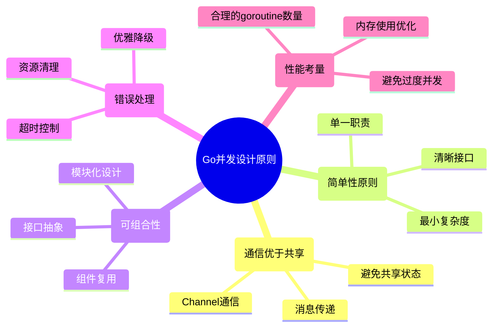

# Go并发编程最佳实践：从设计模式到性能优化的完整指南

## 概述

Go语言的并发模型基于CSP理论，提供了goroutine、channel以及sync包等丰富的并发原语。本文总结了Go并发编程的最佳实践，涵盖设计模式、性能优化、常见陷阱和调试技巧，帮助开发者编写高质量的并发程序。

## 1. 并发设计原则

### 1.1 核心设计原则



### 1.2 设计决策框架

```go
// 并发设计决策框架
type ConcurrencyDesignFramework struct {
    // 问题分析
    ProblemAnalysis struct {
        // 是否需要并发？
        NeedsConcurrency bool
        // 并发类型：CPU密集 vs I/O密集
        ConcurrencyType string
        // 数据依赖关系
        DataDependencies []string
        // 性能要求
        PerformanceRequirements struct {
            Latency    time.Duration
            Throughput int
            Memory     int64
        }
    }
    
    // 工具选择
    ToolSelection struct {
        // 通信方式：Channel vs 共享内存
        CommunicationMethod string
        // 同步原语选择
        SyncPrimitives []string
        // 并发模式
        ConcurrencyPatterns []string
    }
    
    // 实现策略
    ImplementationStrategy struct {
        // Goroutine数量控制
        GoroutinePoolSize int
        // 缓冲区大小
        BufferSizes map[string]int
        // 超时设置
        Timeouts map[string]time.Duration
        // 错误处理策略
        ErrorHandling string
    }
}

// 决策辅助函数
func ChooseConcurrencyApproach(problem ProblemDescription) ConcurrencyApproach {
    approach := ConcurrencyApproach{}
    
    // 1. 分析问题特征
    if problem.IsIOIntensive {
        approach.PreferredPattern = "ProducerConsumer"
        approach.CommunicationMethod = "Channel"
    } else if problem.IsCPUIntensive {
        approach.PreferredPattern = "WorkerPool"
        approach.CommunicationMethod = "SharedMemory"
    }
    
    // 2. 考虑数据流向
    if problem.HasComplexDataFlow {
        approach.PreferredPattern = "Pipeline"
        approach.CommunicationMethod = "Channel"
    }
    
    // 3. 考虑错误处理需求
    if problem.RequiresRobustErrorHandling {
        approach.ErrorStrategy = "ContextCancellation"
        approach.TimeoutStrategy = "Hierarchical"
    }
    
    return approach
}

type ProblemDescription struct {
    IsIOIntensive                bool
    IsCPUIntensive              bool
    HasComplexDataFlow          bool
    RequiresRobustErrorHandling bool
    ExpectedLoad                int
    LatencyRequirement          time.Duration
}

type ConcurrencyApproach struct {
    PreferredPattern      string
    CommunicationMethod   string
    ErrorStrategy         string
    TimeoutStrategy       string
}
```

## 2. 经典并发模式实践

### 2.1 生产者-消费者模式

```go
// 高性能生产者-消费者实现
type ProducerConsumer struct {
    // 配置参数
    config ProducerConsumerConfig
    
    // 通信通道
    taskQueue   chan Task
    resultQueue chan Result
    errorQueue  chan error
    
    // 控制通道
    ctx    context.Context
    cancel context.CancelFunc
    
    // 同步原语
    wg sync.WaitGroup
    
    // 监控指标
    metrics *ProducerConsumerMetrics
}

type ProducerConsumerConfig struct {
    // 队列配置
    TaskQueueSize   int
    ResultQueueSize int
    ErrorQueueSize  int
    
    // 工作者配置
    ProducerCount int
    ConsumerCount int
    
    // 性能配置
    BatchSize      int
    FlushInterval  time.Duration
    MaxRetries     int
    RetryDelay     time.Duration
    
    // 超时配置
    ProduceTimeout time.Duration
    ConsumeTimeout time.Duration
    ShutdownTimeout time.Duration
}

type Task struct {
    ID       string
    Data     interface{}
    Priority int
    Deadline time.Time
    Retries  int
}

type Result struct {
    TaskID    string
    Data      interface{}
    ProcessTime time.Duration
    Error     error
}

type ProducerConsumerMetrics struct {
    TasksProduced    int64
    TasksConsumed    int64
    TasksCompleted   int64
    TasksFailed      int64
    AverageLatency   time.Duration
    QueueLength      int64
    ActiveConsumers  int32
    ActiveProducers  int32
}

// NewProducerConsumer 创建生产者-消费者系统
func NewProducerConsumer(config ProducerConsumerConfig) *ProducerConsumer {
    ctx, cancel := context.WithCancel(context.Background())
    
    return &ProducerConsumer{
        config:      config,
        taskQueue:   make(chan Task, config.TaskQueueSize),
        resultQueue: make(chan Result, config.ResultQueueSize),
        errorQueue:  make(chan error, config.ErrorQueueSize),
        ctx:         ctx,
        cancel:      cancel,
        metrics:     &ProducerConsumerMetrics{},
    }
}

// Start 启动生产者-消费者系统
func (pc *ProducerConsumer) Start() error {
    // 启动消费者
    for i := 0; i < pc.config.ConsumerCount; i++ {
        pc.wg.Add(1)
        go pc.consumer(i)
    }
    
    // 启动监控goroutine
    pc.wg.Add(1)
    go pc.monitor()
    
    return nil
}

// Produce 生产任务（支持批量和超时）
func (pc *ProducerConsumer) Produce(tasks []Task) error {
    atomic.AddInt32(&pc.metrics.ActiveProducers, 1)
    defer atomic.AddInt32(&pc.metrics.ActiveProducers, -1)
    
    for _, task := range tasks {
        select {
        case pc.taskQueue <- task:
            atomic.AddInt64(&pc.metrics.TasksProduced, 1)
            
        case <-time.After(pc.config.ProduceTimeout):
            return fmt.Errorf("produce timeout for task %s", task.ID)
            
        case <-pc.ctx.Done():
            return pc.ctx.Err()
        }
    }
    
    return nil
}

// ProduceBatch 批量生产（优化版本）
func (pc *ProducerConsumer) ProduceBatch(tasks []Task) error {
    atomic.AddInt32(&pc.metrics.ActiveProducers, 1)
    defer atomic.AddInt32(&pc.metrics.ActiveProducers, -1)
    
    // 分批处理，避免长时间阻塞
    batchSize := pc.config.BatchSize
    for i := 0; i < len(tasks); i += batchSize {
        end := i + batchSize
        if end > len(tasks) {
            end = len(tasks)
        }
        
        batch := tasks[i:end]
        if err := pc.produceBatchInternal(batch); err != nil {
            return err
        }
    }
    
    return nil
}

func (pc *ProducerConsumer) produceBatchInternal(batch []Task) error {
    timeout := time.NewTimer(pc.config.ProduceTimeout)
    defer timeout.Stop()
    
    for _, task := range batch {
        select {
        case pc.taskQueue <- task:
            atomic.AddInt64(&pc.metrics.TasksProduced, 1)
            
        case <-timeout.C:
            return fmt.Errorf("batch produce timeout")
            
        case <-pc.ctx.Done():
            return pc.ctx.Err()
        }
    }
    
    return nil
}

// consumer 消费者goroutine
func (pc *ProducerConsumer) consumer(consumerID int) {
    defer pc.wg.Done()
    
    atomic.AddInt32(&pc.metrics.ActiveConsumers, 1)
    defer atomic.AddInt32(&pc.metrics.ActiveConsumers, -1)
    
    log.Printf("Consumer %d started", consumerID)
    defer log.Printf("Consumer %d stopped", consumerID)
    
    for {
        select {
        case task, ok := <-pc.taskQueue:
            if !ok {
                return // 任务队列已关闭
            }
            
            pc.processTask(consumerID, task)
            
        case <-pc.ctx.Done():
            return
        }
    }
}

// processTask 处理单个任务
func (pc *ProducerConsumer) processTask(consumerID int, task Task) {
    startTime := time.Now()
    atomic.AddInt64(&pc.metrics.TasksConsumed, 1)
    
    defer func() {
        if r := recover(); r != nil {
            log.Printf("Consumer %d panic processing task %s: %v", 
                consumerID, task.ID, r)
            
            pc.sendError(fmt.Errorf("panic in consumer %d: %v", consumerID, r))
            atomic.AddInt64(&pc.metrics.TasksFailed, 1)
        }
    }()
    
    // 检查任务是否过期
    if !task.Deadline.IsZero() && time.Now().After(task.Deadline) {
        log.Printf("Task %s expired", task.ID)
        atomic.AddInt64(&pc.metrics.TasksFailed, 1)
        return
    }
    
    // 处理任务（这里是示例逻辑）
    result, err := pc.executeTask(task)
    
    processTime := time.Since(startTime)
    
    // 发送结果
    select {
    case pc.resultQueue <- Result{
        TaskID:      task.ID,
        Data:        result,
        ProcessTime: processTime,
        Error:       err,
    }:
        if err != nil {
            atomic.AddInt64(&pc.metrics.TasksFailed, 1)
        } else {
            atomic.AddInt64(&pc.metrics.TasksCompleted, 1)
        }
        
    case <-time.After(pc.config.ConsumeTimeout):
        log.Printf("Failed to send result for task %s: timeout", task.ID)
        
    case <-pc.ctx.Done():
        return
    }
    
    // 更新平均延迟
    pc.updateAverageLatency(processTime)
}

// executeTask 执行具体任务逻辑
func (pc *ProducerConsumer) executeTask(task Task) (interface{}, error) {
    // 模拟任务处理
    switch data := task.Data.(type) {
    case string:
        // 字符串处理任务
        time.Sleep(100 * time.Millisecond)
        return strings.ToUpper(data), nil
        
    case int:
        // 数值计算任务
        time.Sleep(50 * time.Millisecond)
        return data * data, nil
        
    default:
        return nil, fmt.Errorf("unsupported task data type: %T", data)
    }
}

// GetResults 获取处理结果
func (pc *ProducerConsumer) GetResults() <-chan Result {
    return pc.resultQueue
}

// GetErrors 获取错误信息
func (pc *ProducerConsumer) GetErrors() <-chan error {
    return pc.errorQueue
}

// sendError 发送错误信息
func (pc *ProducerConsumer) sendError(err error) {
    select {
    case pc.errorQueue <- err:
    default:
        log.Printf("Error queue full, dropping error: %v", err)
    }
}

// updateAverageLatency 更新平均延迟
func (pc *ProducerConsumer) updateAverageLatency(latency time.Duration) {
    // 使用简单的移动平均算法
    currentAvg := atomic.LoadInt64((*int64)(&pc.metrics.AverageLatency))
    newAvg := (time.Duration(currentAvg)*9 + latency) / 10
    atomic.StoreInt64((*int64)(&pc.metrics.AverageLatency), int64(newAvg))
}

// monitor 监控goroutine
func (pc *ProducerConsumer) monitor() {
    defer pc.wg.Done()
    
    ticker := time.NewTicker(5 * time.Second)
    defer ticker.Stop()
    
    for {
        select {
        case <-ticker.C:
            pc.logMetrics()
            
        case <-pc.ctx.Done():
            return
        }
    }
}

// logMetrics 记录监控指标
func (pc *ProducerConsumer) logMetrics() {
    metrics := pc.GetMetrics()
    
    log.Printf("ProducerConsumer Metrics: "+
        "Produced=%d, Consumed=%d, Completed=%d, Failed=%d, "+
        "QueueLen=%d, AvgLatency=%v, ActiveConsumers=%d, ActiveProducers=%d",
        metrics.TasksProduced, metrics.TasksConsumed, metrics.TasksCompleted,
        metrics.TasksFailed, metrics.QueueLength, metrics.AverageLatency,
        metrics.ActiveConsumers, metrics.ActiveProducers)
}

// GetMetrics 获取监控指标
func (pc *ProducerConsumer) GetMetrics() ProducerConsumerMetrics {
    return ProducerConsumerMetrics{
        TasksProduced:   atomic.LoadInt64(&pc.metrics.TasksProduced),
        TasksConsumed:   atomic.LoadInt64(&pc.metrics.TasksConsumed),
        TasksCompleted:  atomic.LoadInt64(&pc.metrics.TasksCompleted),
        TasksFailed:     atomic.LoadInt64(&pc.metrics.TasksFailed),
        AverageLatency:  time.Duration(atomic.LoadInt64((*int64)(&pc.metrics.AverageLatency))),
        QueueLength:     int64(len(pc.taskQueue)),
        ActiveConsumers: atomic.LoadInt32(&pc.metrics.ActiveConsumers),
        ActiveProducers: atomic.LoadInt32(&pc.metrics.ActiveProducers),
    }
}

// Stop 停止生产者-消费者系统
func (pc *ProducerConsumer) Stop() error {
    log.Println("Stopping ProducerConsumer...")
    
    // 关闭任务队列，不再接受新任务
    close(pc.taskQueue)
    
    // 等待所有消费者完成
    done := make(chan struct{})
    go func() {
        pc.wg.Wait()
        close(done)
    }()
    
    select {
    case <-done:
        log.Println("ProducerConsumer stopped gracefully")
        
    case <-time.After(pc.config.ShutdownTimeout):
        log.Println("ProducerConsumer shutdown timeout, forcing stop")
        pc.cancel()
        
        // 再等待一小段时间
        select {
        case <-done:
        case <-time.After(1 * time.Second):
            log.Println("Some goroutines may not have stopped")
        }
    }
    
    // 关闭结果和错误通道
    close(pc.resultQueue)
    close(pc.errorQueue)
    
    return nil
}
```

### 2.2 工作池模式

```go
// 高性能工作池实现
type WorkerPool struct {
    // 配置
    config WorkerPoolConfig
    
    // 任务分发
    taskQueue chan Job
    
    // 工作者管理
    workers    []*Worker
    workerWG   sync.WaitGroup
    
    // 控制
    ctx    context.Context
    cancel context.CancelFunc
    
    // 监控
    metrics *WorkerPoolMetrics
    
    // 动态调整
    scalingMu sync.RWMutex
    scaling   bool
}

type WorkerPoolConfig struct {
    // 基础配置
    MinWorkers      int
    MaxWorkers      int
    QueueSize       int
    
    // 性能配置
    WorkerTimeout   time.Duration
    IdleTimeout     time.Duration
    ScaleInterval   time.Duration
    
    // 负载均衡
    LoadBalancing   string // "round_robin", "least_loaded", "random"
    
    // 监控配置
    MetricsInterval time.Duration
}

type Job struct {
    ID       string
    Task     func() (interface{}, error)
    Priority int
    Timeout  time.Duration
    Callback func(interface{}, error)
}

type Worker struct {
    id          int
    pool        *WorkerPool
    taskQueue   chan Job
    quit        chan struct{}
    
    // 统计信息
    tasksProcessed int64
    lastActive     time.Time
    
    // 状态
    busy int32
}

type WorkerPoolMetrics struct {
    ActiveWorkers    int32
    IdleWorkers      int32
    QueueLength      int64
    TasksProcessed   int64
    TasksCompleted   int64
    TasksFailed      int64
    AverageLatency   time.Duration
    ThroughputPerSec float64
}

// NewWorkerPool 创建工作池
func NewWorkerPool(config WorkerPoolConfig) *WorkerPool {
    ctx, cancel := context.WithCancel(context.Background())
    
    wp := &WorkerPool{
        config:    config,
        taskQueue: make(chan Job, config.QueueSize),
        workers:   make([]*Worker, 0, config.MaxWorkers),
        ctx:       ctx,
        cancel:    cancel,
        metrics:   &WorkerPoolMetrics{},
    }
    
    return wp
}

// Start 启动工作池
func (wp *WorkerPool) Start() error {
    // 启动最小数量的工作者
    for i := 0; i < wp.config.MinWorkers; i++ {
        wp.addWorker()
    }
    
    // 启动任务分发器
    wp.workerWG.Add(1)
    go wp.dispatcher()
    
    // 启动监控和自动缩放
    wp.workerWG.Add(1)
    go wp.monitor()
    
    if wp.config.MaxWorkers > wp.config.MinWorkers {
        wp.workerWG.Add(1)
        go wp.autoScale()
    }
    
    return nil
}

// Submit 提交任务
func (wp *WorkerPool) Submit(job Job) error {
    select {
    case wp.taskQueue <- job:
        atomic.AddInt64(&wp.metrics.TasksProcessed, 1)
        return nil
        
    case <-wp.ctx.Done():
        return wp.ctx.Err()
        
    default:
        return fmt.Errorf("task queue is full")
    }
}

// SubmitWithTimeout 带超时的任务提交
func (wp *WorkerPool) SubmitWithTimeout(job Job, timeout time.Duration) error {
    select {
    case wp.taskQueue <- job:
        atomic.AddInt64(&wp.metrics.TasksProcessed, 1)
        return nil
        
    case <-time.After(timeout):
        return fmt.Errorf("submit timeout")
        
    case <-wp.ctx.Done():
        return wp.ctx.Err()
    }
}

// addWorker 添加工作者
func (wp *WorkerPool) addWorker() {
    wp.scalingMu.Lock()
    defer wp.scalingMu.Unlock()
    
    if len(wp.workers) >= wp.config.MaxWorkers {
        return
    }
    
    worker := &Worker{
        id:         len(wp.workers),
        pool:       wp,
        taskQueue:  make(chan Job, 1),
        quit:       make(chan struct{}),
        lastActive: time.Now(),
    }
    
    wp.workers = append(wp.workers, worker)
    
    wp.workerWG.Add(1)
    go worker.start()
    
    atomic.AddInt32(&wp.metrics.IdleWorkers, 1)
    
    log.Printf("Added worker %d, total workers: %d", worker.id, len(wp.workers))
}

// removeWorker 移除工作者
func (wp *WorkerPool) removeWorker() {
    wp.scalingMu.Lock()
    defer wp.scalingMu.Unlock()
    
    if len(wp.workers) <= wp.config.MinWorkers {
        return
    }
    
    // 找到最空闲的工作者
    var idleWorker *Worker
    oldestIdle := time.Now()
    
    for _, worker := range wp.workers {
        if atomic.LoadInt32(&worker.busy) == 0 {
            if worker.lastActive.Before(oldestIdle) {
                oldestIdle = worker.lastActive
                idleWorker = worker
            }
        }
    }
    
    if idleWorker != nil {
        close(idleWorker.quit)
        
        // 从切片中移除
        for i, w := range wp.workers {
            if w == idleWorker {
                wp.workers = append(wp.workers[:i], wp.workers[i+1:]...)
                break
            }
        }
        
        atomic.AddInt32(&wp.metrics.IdleWorkers, -1)
        
        log.Printf("Removed worker %d, total workers: %d", 
            idleWorker.id, len(wp.workers))
    }
}

// dispatcher 任务分发器
func (wp *WorkerPool) dispatcher() {
    defer wp.workerWG.Done()
    
    for {
        select {
        case job := <-wp.taskQueue:
            wp.dispatchJob(job)
            
        case <-wp.ctx.Done():
            return
        }
    }
}

// dispatchJob 分发任务到工作者
func (wp *WorkerPool) dispatchJob(job Job) {
    var selectedWorker *Worker
    
    wp.scalingMu.RLock()
    workers := make([]*Worker, len(wp.workers))
    copy(workers, wp.workers)
    wp.scalingMu.RUnlock()
    
    // 根据负载均衡策略选择工作者
    switch wp.config.LoadBalancing {
    case "least_loaded":
        selectedWorker = wp.selectLeastLoadedWorker(workers)
    case "round_robin":
        selectedWorker = wp.selectRoundRobinWorker(workers)
    default:
        selectedWorker = wp.selectRandomWorker(workers)
    }
    
    if selectedWorker != nil {
        select {
        case selectedWorker.taskQueue <- job:
        case <-time.After(wp.config.WorkerTimeout):
            log.Printf("Failed to dispatch job %s: worker timeout", job.ID)
        case <-wp.ctx.Done():
            return
        }
    }
}

// selectLeastLoadedWorker 选择负载最小的工作者
func (wp *WorkerPool) selectLeastLoadedWorker(workers []*Worker) *Worker {
    var selected *Worker
    minLoad := int64(math.MaxInt64)
    
    for _, worker := range workers {
        load := atomic.LoadInt64(&worker.tasksProcessed)
        if load < minLoad {
            minLoad = load
            selected = worker
        }
    }
    
    return selected
}

// selectRoundRobinWorker 轮询选择工作者
func (wp *WorkerPool) selectRoundRobinWorker(workers []*Worker) *Worker {
    if len(workers) == 0 {
        return nil
    }
    
    // 简单的轮询实现
    index := int(atomic.AddInt64(&wp.metrics.TasksProcessed, 0)) % len(workers)
    return workers[index]
}

// selectRandomWorker 随机选择工作者
func (wp *WorkerPool) selectRandomWorker(workers []*Worker) *Worker {
    if len(workers) == 0 {
        return nil
    }
    
    index := rand.Intn(len(workers))
    return workers[index]
}

// Worker的start方法
func (w *Worker) start() {
    defer w.pool.workerWG.Done()
    
    log.Printf("Worker %d started", w.id)
    defer log.Printf("Worker %d stopped", w.id)
    
    for {
        select {
        case job := <-w.taskQueue:
            w.processJob(job)
            
        case <-time.After(w.pool.config.IdleTimeout):
            // 空闲超时，可能被移除
            continue
            
        case <-w.quit:
            return
            
        case <-w.pool.ctx.Done():
            return
        }
    }
}

// processJob 处理任务
func (w *Worker) processJob(job Job) {
    atomic.StoreInt32(&w.busy, 1)
    defer atomic.StoreInt32(&w.busy, 0)
    
    atomic.AddInt32(&w.pool.metrics.ActiveWorkers, 1)
    atomic.AddInt32(&w.pool.metrics.IdleWorkers, -1)
    
    defer func() {
        atomic.AddInt32(&w.pool.metrics.ActiveWorkers, -1)
        atomic.AddInt32(&w.pool.metrics.IdleWorkers, 1)
        
        atomic.AddInt64(&w.tasksProcessed, 1)
        w.lastActive = time.Now()
    }()
    
    startTime := time.Now()
    
    // 执行任务
    var result interface{}
    var err error
    
    if job.Timeout > 0 {
        // 带超时的任务执行
        done := make(chan struct{})
        go func() {
            defer close(done)
            result, err = job.Task()
        }()
        
        select {
        case <-done:
            // 任务完成
        case <-time.After(job.Timeout):
            err = fmt.Errorf("job %s timeout", job.ID)
        }
    } else {
        // 普通任务执行
        result, err = job.Task()
    }
    
    duration := time.Since(startTime)
    
    // 更新统计
    if err != nil {
        atomic.AddInt64(&w.pool.metrics.TasksFailed, 1)
    } else {
        atomic.AddInt64(&w.pool.metrics.TasksCompleted, 1)
    }
    
    // 更新平均延迟
    w.pool.updateAverageLatency(duration)
    
    // 调用回调函数
    if job.Callback != nil {
        go job.Callback(result, err)
    }
}

// autoScale 自动缩放
func (wp *WorkerPool) autoScale() {
    defer wp.workerWG.Done()
    
    ticker := time.NewTicker(wp.config.ScaleInterval)
    defer ticker.Stop()
    
    for {
        select {
        case <-ticker.C:
            wp.performAutoScale()
            
        case <-wp.ctx.Done():
            return
        }
    }
}

// performAutoScale 执行自动缩放
func (wp *WorkerPool) performAutoScale() {
    if wp.scaling {
        return
    }
    
    wp.scaling = true
    defer func() { wp.scaling = false }()
    
    queueLen := len(wp.taskQueue)
    activeWorkers := int(atomic.LoadInt32(&wp.metrics.ActiveWorkers))
    totalWorkers := len(wp.workers)
    
    // 扩容条件：队列长度 > 工作者数量 * 2
    if queueLen > totalWorkers*2 && totalWorkers < wp.config.MaxWorkers {
        wp.addWorker()
        return
    }
    
    // 缩容条件：活跃工作者 < 总工作者 / 2 且队列为空
    if activeWorkers < totalWorkers/2 && queueLen == 0 && totalWorkers > wp.config.MinWorkers {
        wp.removeWorker()
        return
    }
}

// monitor 监控
func (wp *WorkerPool) monitor() {
    defer wp.workerWG.Done()
    
    ticker := time.NewTicker(wp.config.MetricsInterval)
    defer ticker.Stop()
    
    lastProcessed := int64(0)
    lastTime := time.Now()
    
    for {
        select {
        case <-ticker.C:
            currentProcessed := atomic.LoadInt64(&wp.metrics.TasksProcessed)
            currentTime := time.Now()
            
            // 计算吞吐量
            duration := currentTime.Sub(lastTime).Seconds()
            if duration > 0 {
                throughput := float64(currentProcessed-lastProcessed) / duration
                atomic.StoreUint64((*uint64)(&wp.metrics.ThroughputPerSec), 
                    math.Float64bits(throughput))
            }
            
            lastProcessed = currentProcessed
            lastTime = currentTime
            
            wp.logMetrics()
            
        case <-wp.ctx.Done():
            return
        }
    }
}

// updateAverageLatency 更新平均延迟
func (wp *WorkerPool) updateAverageLatency(latency time.Duration) {
    currentAvg := atomic.LoadInt64((*int64)(&wp.metrics.AverageLatency))
    newAvg := (time.Duration(currentAvg)*9 + latency) / 10
    atomic.StoreInt64((*int64)(&wp.metrics.AverageLatency), int64(newAvg))
}

// logMetrics 记录指标
func (wp *WorkerPool) logMetrics() {
    metrics := wp.GetMetrics()
    
    log.Printf("WorkerPool Metrics: "+
        "Workers=%d/%d, Queue=%d, Processed=%d, Completed=%d, Failed=%d, "+
        "AvgLatency=%v, Throughput=%.2f/s",
        metrics.ActiveWorkers+metrics.IdleWorkers, wp.config.MaxWorkers,
        metrics.QueueLength, metrics.TasksProcessed, metrics.TasksCompleted,
        metrics.TasksFailed, metrics.AverageLatency, metrics.ThroughputPerSec)
}

// GetMetrics 获取指标
func (wp *WorkerPool) GetMetrics() WorkerPoolMetrics {
    return WorkerPoolMetrics{
        ActiveWorkers:    atomic.LoadInt32(&wp.metrics.ActiveWorkers),
        IdleWorkers:      atomic.LoadInt32(&wp.metrics.IdleWorkers),
        QueueLength:      int64(len(wp.taskQueue)),
        TasksProcessed:   atomic.LoadInt64(&wp.metrics.TasksProcessed),
        TasksCompleted:   atomic.LoadInt64(&wp.metrics.TasksCompleted),
        TasksFailed:      atomic.LoadInt64(&wp.metrics.TasksFailed),
        AverageLatency:   time.Duration(atomic.LoadInt64((*int64)(&wp.metrics.AverageLatency))),
        ThroughputPerSec: math.Float64frombits(atomic.LoadUint64((*uint64)(&wp.metrics.ThroughputPerSec))),
    }
}

// Stop 停止工作池
func (wp *WorkerPool) Stop() error {
    log.Println("Stopping WorkerPool...")
    
    // 停止接受新任务
    wp.cancel()
    
    // 关闭任务队列
    close(wp.taskQueue)
    
    // 停止所有工作者
    wp.scalingMu.Lock()
    for _, worker := range wp.workers {
        close(worker.quit)
    }
    wp.scalingMu.Unlock()
    
    // 等待所有goroutine完成
    done := make(chan struct{})
    go func() {
        wp.workerWG.Wait()
        close(done)
    }()
    
    select {
    case <-done:
        log.Println("WorkerPool stopped gracefully")
        return nil
        
    case <-time.After(10 * time.Second):
        return fmt.Errorf("timeout waiting for workers to stop")
    }
}
```

### 2.3 流水线模式

```go
// 高性能流水线实现
type Pipeline struct {
    stages    []PipelineStage
    ctx       context.Context
    cancel    context.CancelFunc
    wg        sync.WaitGroup
    metrics   *PipelineMetrics
    config    PipelineConfig
}

type PipelineConfig struct {
    BufferSize      int
    StageTimeout    time.Duration
    ErrorStrategy   string // "fail_fast", "skip", "retry"
    MaxRetries      int
    RetryDelay      time.Duration
    MonitorInterval time.Duration
}

type PipelineStage struct {
    Name        string
    Processor   func(interface{}) (interface{}, error)
    Workers     int
    BufferSize  int
    Input       chan PipelineData
    Output      chan PipelineData
    ErrorChan   chan PipelineError
    
    // 内部状态
    activeWorkers int32
    processed     int64
    failed        int64
}

type PipelineData struct {
    ID        string
    Data      interface{}
    Metadata  map[string]interface{}
    Timestamp time.Time
    StageHistory []StageRecord
}

type StageRecord struct {
    StageName   string
    StartTime   time.Time
    EndTime     time.Time
    Duration    time.Duration
    Error       error
}

type PipelineError struct {
    StageIndex int
    StageName  string
    Data       PipelineData
    Error      error
    Timestamp  time.Time
}

type PipelineMetrics struct {
    TotalProcessed   int64
    TotalCompleted   int64
    TotalFailed      int64
    StageMetrics     []StageMetrics
    AverageLatency   time.Duration
    ThroughputPerSec float64
}

type StageMetrics struct {
    StageName        string
    Processed        int64
    Failed           int64
    AverageLatency   time.Duration
    ActiveWorkers    int32
    QueueLength      int64
}

// NewPipeline 创建流水线
func NewPipeline(config PipelineConfig) *Pipeline {
    ctx, cancel := context.WithCancel(context.Background())
    
    return &Pipeline{
        config:  config,
        ctx:     ctx,
        cancel:  cancel,
        metrics: &PipelineMetrics{},
    }
}

// AddStage 添加流水线阶段
func (p *Pipeline) AddStage(name string, processor func(interface{}) (interface{}, error), workers int) *Pipeline {
    stage := PipelineStage{
        Name:       name,
        Processor:  processor,
        Workers:    workers,
        BufferSize: p.config.BufferSize,
        Input:      make(chan PipelineData, p.config.BufferSize),
        Output:     make(chan PipelineData, p.config.BufferSize),
        ErrorChan:  make(chan PipelineError, p.config.BufferSize),
    }
    
    p.stages = append(p.stages, stage)
    
    // 连接阶段
    if len(p.stages) > 1 {
        prevStage := &p.stages[len(p.stages)-2]
        prevStage.Output = stage.Input
    }
    
    return p
}

// Start 启动流水线
func (p *Pipeline) Start() error {
    if len(p.stages) == 0 {
        return fmt.Errorf("no stages defined")
    }
    
    // 初始化指标
    p.metrics.StageMetrics = make([]StageMetrics, len(p.stages))
    for i, stage := range p.stages {
        p.metrics.StageMetrics[i] = StageMetrics{
            StageName: stage.Name,
        }
    }
    
    // 启动每个阶段的工作者
    for i := range p.stages {
        stage := &p.stages[i]
        
        for j := 0; j < stage.Workers; j++ {
            p.wg.Add(1)
            go p.stageWorker(i, j, stage)
        }
    }
    
    // 启动监控
    p.wg.Add(1)
    go p.monitor()
    
    // 启动错误处理器
    p.wg.Add(1)
    go p.errorHandler()
    
    return nil
}

// Process 处理数据
func (p *Pipeline) Process(input <-chan interface{}, output chan<- PipelineData) error {
    if len(p.stages) == 0 {
        return fmt.Errorf("no stages defined")
    }
    
    // 启动输入处理器
    p.wg.Add(1)
    go func() {
        defer p.wg.Done()
        defer close(p.stages[0].Input)
        
        for data := range input {
            pipelineData := PipelineData{
                ID:           generateID(),
                Data:         data,
                Metadata:     make(map[string]interface{}),
                Timestamp:    time.Now(),
                StageHistory: make([]StageRecord, 0, len(p.stages)),
            }
            
            select {
            case p.stages[0].Input <- pipelineData:
                atomic.AddInt64(&p.metrics.TotalProcessed, 1)
                
            case <-p.ctx.Done():
                return
            }
        }
    }()
    
    // 启动输出处理器
    p.wg.Add(1)
    go func() {
        defer p.wg.Done()
        defer close(output)
        
        lastStage := &p.stages[len(p.stages)-1]
        
        for data := range lastStage.Output {
            select {
            case output <- data:
                atomic.AddInt64(&p.metrics.TotalCompleted, 1)
                
            case <-p.ctx.Done():
                return
            }
        }
    }()
    
    return nil
}

// stageWorker 阶段工作者
func (p *Pipeline) stageWorker(stageIndex, workerID int, stage *PipelineStage) {
    defer p.wg.Done()
    
    atomic.AddInt32(&stage.activeWorkers, 1)
    defer atomic.AddInt32(&stage.activeWorkers, -1)
    
    log.Printf("Stage %s Worker %d started", stage.Name, workerID)
    defer log.Printf("Stage %s Worker %d stopped", stage.Name, workerID)
    
    for {
        select {
        case data, ok := <-stage.Input:
            if !ok {
                // 输入通道已关闭
                if stageIndex < len(p.stages)-1 {
                    // 不是最后一个阶段，关闭输出通道
                    close(stage.Output)
                }
                return
            }
            
            p.processStageData(stageIndex, stage, data)
            
        case <-p.ctx.Done():
            return
        }
    }
}

// processStageData 处理阶段数据
func (p *Pipeline) processStageData(stageIndex int, stage *PipelineStage, data PipelineData) {
    startTime := time.Now()
    
    // 添加阶段记录
    stageRecord := StageRecord{
        StageName: stage.Name,
        StartTime: startTime,
    }
    
    defer func() {
        stageRecord.EndTime = time.Now()
        stageRecord.Duration = stageRecord.EndTime.Sub(stageRecord.StartTime)
        data.StageHistory = append(data.StageHistory, stageRecord)
        
        // 更新指标
        atomic.AddInt64(&stage.processed, 1)
        p.updateStageLatency(stageIndex, stageRecord.Duration)
    }()
    
    // 处理数据
    var result interface{}
    var err error
    
    if p.config.StageTimeout > 0 {
        // 带超时的处理
        done := make(chan struct{})
        go func() {
            defer close(done)
            result, err = stage.Processor(data.Data)
        }()
        
        select {
        case <-done:
            // 处理完成
        case <-time.After(p.config.StageTimeout):
            err = fmt.Errorf("stage %s timeout", stage.Name)
        case <-p.ctx.Done():
            return
        }
    } else {
        // 普通处理
        result, err = stage.Processor(data.Data)
    }
    
    if err != nil {
        stageRecord.Error = err
        atomic.AddInt64(&stage.failed, 1)
        atomic.AddInt64(&p.metrics.TotalFailed, 1)
        
        // 发送错误
        pipelineError := PipelineError{
            StageIndex: stageIndex,
            StageName:  stage.Name,
            Data:       data,
            Error:      err,
            Timestamp:  time.Now(),
        }
        
        select {
        case stage.ErrorChan <- pipelineError:
        default:
            log.Printf("Error channel full for stage %s", stage.Name)
        }
        
        // 根据错误策略处理
        switch p.config.ErrorStrategy {
        case "fail_fast":
            p.cancel()
            return
        case "skip":
            return // 跳过这个数据项
        case "retry":
            // 实现重试逻辑
            if p.retryStageData(stageIndex, stage, data) {
                return
            }
        }
        
        return
    }
    
    // 更新数据并发送到下一阶段
    data.Data = result
    
    if stageIndex < len(p.stages)-1 {
        // 不是最后一个阶段，发送到下一阶段
        select {
        case stage.Output <- data:
        case <-p.ctx.Done():
            return
        }
    } else {
        // 最后一个阶段，发送到输出
        select {
        case stage.Output <- data:
        case <-p.ctx.Done():
            return
        }
    }
}

// retryStageData 重试阶段数据处理
func (p *Pipeline) retryStageData(stageIndex int, stage *PipelineStage, data PipelineData) bool {
    for retry := 0; retry < p.config.MaxRetries; retry++ {
        time.Sleep(p.config.RetryDelay)
        
        result, err := stage.Processor(data.Data)
        if err == nil {
            data.Data = result
            
            if stageIndex < len(p.stages)-1 {
                select {
                case stage.Output <- data:
                    return true
                case <-p.ctx.Done():
                    return false
                }
            } else {
                select {
                case stage.Output <- data:
                    return true
                case <-p.ctx.Done():
                    return false
                }
            }
        }
    }
    
    return false
}

// errorHandler 错误处理器
func (p *Pipeline) errorHandler() {
    defer p.wg.Done()
    
    for {
        select {
        case <-p.ctx.Done():
            return
            
        default:
            // 收集所有阶段的错误
            for i := range p.stages {
                stage := &p.stages[i]
                
                select {
                case err := <-stage.ErrorChan:
                    log.Printf("Pipeline error in stage %s: %v", err.StageName, err.Error)
                    
                default:
                    // 没有错误，继续下一个阶段
                }
            }
            
            time.Sleep(100 * time.Millisecond)
        }
    }
}

// monitor 监控器
func (p *Pipeline) monitor() {
    defer p.wg.Done()
    
    ticker := time.NewTicker(p.config.MonitorInterval)
    defer ticker.Stop()
    
    lastProcessed := int64(0)
    lastTime := time.Now()
    
    for {
        select {
        case <-ticker.C:
            currentProcessed := atomic.LoadInt64(&p.metrics.TotalProcessed)
            currentTime := time.Now()
            
            // 计算吞吐量
            duration := currentTime.Sub(lastTime).Seconds()
            if duration > 0 {
                throughput := float64(currentProcessed-lastProcessed) / duration
                atomic.StoreUint64((*uint64)(&p.metrics.ThroughputPerSec), 
                    math.Float64bits(throughput))
            }
            
            lastProcessed = currentProcessed
            lastTime = currentTime
            
            p.logMetrics()
            
        case <-p.ctx.Done():
            return
        }
    }
}

// updateStageLatency 更新阶段延迟
func (p *Pipeline) updateStageLatency(stageIndex int, latency time.Duration) {
    if stageIndex >= len(p.metrics.StageMetrics) {
        return
    }
    
    stageMetrics := &p.metrics.StageMetrics[stageIndex]
    currentAvg := atomic.LoadInt64((*int64)(&stageMetrics.AverageLatency))
    newAvg := (time.Duration(currentAvg)*9 + latency) / 10
    atomic.StoreInt64((*int64)(&stageMetrics.AverageLatency), int64(newAvg))
}

// logMetrics 记录指标
func (p *Pipeline) logMetrics() {
    metrics := p.GetMetrics()
    
    log.Printf("Pipeline Metrics: "+
        "Processed=%d, Completed=%d, Failed=%d, Throughput=%.2f/s",
        metrics.TotalProcessed, metrics.TotalCompleted, 
        metrics.TotalFailed, metrics.ThroughputPerSec)
    
    for _, stageMetric := range metrics.StageMetrics {
        log.Printf("  Stage %s: Processed=%d, Failed=%d, AvgLatency=%v, "+
            "ActiveWorkers=%d, QueueLen=%d",
            stageMetric.StageName, stageMetric.Processed, stageMetric.Failed,
            stageMetric.AverageLatency, stageMetric.ActiveWorkers, 
            stageMetric.QueueLength)
    }
}

// GetMetrics 获取指标
func (p *Pipeline) GetMetrics() PipelineMetrics {
    metrics := PipelineMetrics{
        TotalProcessed:   atomic.LoadInt64(&p.metrics.TotalProcessed),
        TotalCompleted:   atomic.LoadInt64(&p.metrics.TotalCompleted),
        TotalFailed:      atomic.LoadInt64(&p.metrics.TotalFailed),
        ThroughputPerSec: math.Float64frombits(atomic.LoadUint64((*uint64)(&p.metrics.ThroughputPerSec))),
        StageMetrics:     make([]StageMetrics, len(p.stages)),
    }
    
    for i, stage := range p.stages {
        metrics.StageMetrics[i] = StageMetrics{
            StageName:      stage.Name,
            Processed:      atomic.LoadInt64(&stage.processed),
            Failed:         atomic.LoadInt64(&stage.failed),
            AverageLatency: time.Duration(atomic.LoadInt64((*int64)(&p.metrics.StageMetrics[i].AverageLatency))),
            ActiveWorkers:  atomic.LoadInt32(&stage.activeWorkers),
            QueueLength:    int64(len(stage.Input)),
        }
    }
    
    return metrics
}

// Stop 停止流水线
func (p *Pipeline) Stop() error {
    log.Println("Stopping Pipeline...")
    
    p.cancel()
    
    // 等待所有goroutine完成
    done := make(chan struct{})
    go func() {
        p.wg.Wait()
        close(done)
    }()
    
    select {
    case <-done:
        log.Println("Pipeline stopped gracefully")
        return nil
        
    case <-time.After(30 * time.Second):
        return fmt.Errorf("timeout waiting for pipeline to stop")
    }
}

// 辅助函数
func generateID() string {
    return fmt.Sprintf("data-%d", time.Now().UnixNano())
}
```

## 3. 性能优化策略

### 3.1 内存优化

```go
// 内存优化策略实现
type MemoryOptimizer struct {
    // 对象池
    pools map[string]*sync.Pool
    
    // 内存监控
    memStats     runtime.MemStats
    lastGC       time.Time
    gcThreshold  int64
    
    // 配置
    config MemoryOptimizerConfig
}

type MemoryOptimizerConfig struct {
    // GC配置
    GCPercent       int
    GCThreshold     int64
    ForceGCInterval time.Duration
    
    // 对象池配置
    PoolCleanInterval time.Duration
    MaxPoolSize       int
    
    // 监控配置
    MonitorInterval time.Duration
}

// NewMemoryOptimizer 创建内存优化器
func NewMemoryOptimizer(config MemoryOptimizerConfig) *MemoryOptimizer {
    mo := &MemoryOptimizer{
        pools:  make(map[string]*sync.Pool),
        config: config,
    }
    
    // 设置GC百分比
    if config.GCPercent > 0 {
        debug.SetGCPercent(config.GCPercent)
    }
    
    return mo
}

// RegisterPool 注册对象池
func (mo *MemoryOptimizer) RegisterPool(name string, newFunc func() interface{}) {
    mo.pools[name] = &sync.Pool{
        New: newFunc,
    }
}

// GetFromPool 从池中获取对象
func (mo *MemoryOptimizer) GetFromPool(name string) interface{} {
    if pool, exists := mo.pools[name]; exists {
        return pool.Get()
    }
    return nil
}

// PutToPool 将对象放回池中
func (mo *MemoryOptimizer) PutToPool(name string, obj interface{}) {
    if pool, exists := mo.pools[name]; exists {
        pool.Put(obj)
    }
}

// Start 启动内存优化器
func (mo *MemoryOptimizer) Start(ctx context.Context) {
    // 启动监控
    go mo.monitor(ctx)
    
    // 启动强制GC
    if mo.config.ForceGCInterval > 0 {
        go mo.forceGC(ctx)
    }
    
    // 启动池清理
    if mo.config.PoolCleanInterval > 0 {
        go mo.cleanPools(ctx)
    }
}

// monitor 内存监控
func (mo *MemoryOptimizer) monitor(ctx context.Context) {
    ticker := time.NewTicker(mo.config.MonitorInterval)
    defer ticker.Stop()
    
    for {
        select {
        case <-ticker.C:
            mo.updateMemStats()
            mo.logMemStats()
            
            // 检查是否需要强制GC
            if mo.shouldForceGC() {
                mo.performGC()
            }
            
        case <-ctx.Done():
            return
        }
    }
}

// updateMemStats 更新内存统计
func (mo *MemoryOptimizer) updateMemStats() {
    runtime.ReadMemStats(&mo.memStats)
}

// shouldForceGC 判断是否应该强制GC
func (mo *MemoryOptimizer) shouldForceGC() bool {
    if mo.config.GCThreshold <= 0 {
        return false
    }
    
    return mo.memStats.HeapAlloc > uint64(mo.config.GCThreshold)
}

// performGC 执行GC
func (mo *MemoryOptimizer) performGC() {
    start := time.Now()
    
    var m1, m2 runtime.MemStats
    runtime.ReadMemStats(&m1)
    
    runtime.GC()
    
    runtime.ReadMemStats(&m2)
    
    duration := time.Since(start)
    freed := int64(m1.HeapAlloc) - int64(m2.HeapAlloc)
    
    log.Printf("Forced GC completed: duration=%v, freed=%d bytes", 
        duration, freed)
    
    mo.lastGC = time.Now()
}

// forceGC 定期强制GC
func (mo *MemoryOptimizer) forceGC(ctx context.Context) {
    ticker := time.NewTicker(mo.config.ForceGCInterval)
    defer ticker.Stop()
    
    for {
        select {
        case <-ticker.C:
            mo.performGC()
            
        case <-ctx.Done():
            return
        }
    }
}

// cleanPools 清理对象池
func (mo *MemoryOptimizer) cleanPools(ctx context.Context) {
    ticker := time.NewTicker(mo.config.PoolCleanInterval)
    defer ticker.Stop()
    
    for {
        select {
        case <-ticker.C:
            // 清理所有池（通过创建新的池实例）
            for name, pool := range mo.pools {
                newFunc := pool.New
                mo.pools[name] = &sync.Pool{New: newFunc}
            }
            
            log.Println("Cleaned all object pools")
            
        case <-ctx.Done():
            return
        }
    }
}

// logMemStats 记录内存统计
func (mo *MemoryOptimizer) logMemStats() {
    log.Printf("Memory Stats: "+
        "Alloc=%d KB, TotalAlloc=%d KB, Sys=%d KB, "+
        "NumGC=%d, LastGC=%v ago",
        mo.memStats.Alloc/1024,
        mo.memStats.TotalAlloc/1024,
        mo.memStats.Sys/1024,
        mo.memStats.NumGC,
        time.Since(time.Unix(0, int64(mo.memStats.LastGC))))
}

// GetMemoryStats 获取内存统计
func (mo *MemoryOptimizer) GetMemoryStats() runtime.MemStats {
    mo.updateMemStats()
    return mo.memStats
}

// 内存友好的数据结构示例
type MemoryEfficientBuffer struct {
    data     []byte
    capacity int
    size     int
    pool     *sync.Pool
}

func NewMemoryEfficientBuffer(initialCapacity int, pool *sync.Pool) *MemoryEfficientBuffer {
    return &MemoryEfficientBuffer{
        data:     make([]byte, initialCapacity),
        capacity: initialCapacity,
        pool:     pool,
    }
}

func (b *MemoryEfficientBuffer) Write(data []byte) {
    needed := b.size + len(data)
    
    if needed > b.capacity {
        // 扩容策略：按需扩容，避免过度分配
        newCapacity := b.capacity
        for newCapacity < needed {
            newCapacity *= 2
        }
        
        newData := make([]byte, newCapacity)
        copy(newData, b.data[:b.size])
        b.data = newData
        b.capacity = newCapacity
    }
    
    copy(b.data[b.size:], data)
    b.size += len(data)
}

func (b *MemoryEfficientBuffer) Read() []byte {
    return b.data[:b.size]
}

func (b *MemoryEfficientBuffer) Reset() {
    b.size = 0
    
    // 如果缓冲区过大，重新分配较小的缓冲区
    if b.capacity > 64*1024 && b.capacity > 4*cap(b.data) {
        b.data = make([]byte, 1024)
        b.capacity = 1024
    }
}

func (b *MemoryEfficientBuffer) Release() {
    if b.pool != nil {
        b.Reset()
        b.pool.Put(b)
    }
}
```

### 3.2 CPU优化

```go
// CPU优化策略实现
type CPUOptimizer struct {
    // CPU监控
    cpuUsage     float64
    lastCPUTime  time.Time
    
    // 负载控制
    loadController *LoadController
    
    // 配置
    config CPUOptimizerConfig
}

type CPUOptimizerConfig struct {
    // 监控配置
    MonitorInterval time.Duration
    
    // 负载控制
    MaxCPUUsage     float64
    LoadShedding    bool
    AdaptiveWorkers bool
    
    // 性能调优
    GOMAXPROCSRatio float64
    GoroutineLimit  int
}

type LoadController struct {
    maxLoad        float64
    currentLoad    float64
    shedding       bool
    adaptiveLimit  int
    
    mu sync.RWMutex
}

// NewCPUOptimizer 创建CPU优化器
func NewCPUOptimizer(config CPUOptimizerConfig) *CPUOptimizer {
    co := &CPUOptimizer{
        config: config,
        loadController: &LoadController{
            maxLoad: config.MaxCPUUsage,
        },
    }
    
    // 设置GOMAXPROCS
    if config.GOMAXPROCSRatio > 0 {
        numCPU := runtime.NumCPU()
        maxProcs := int(float64(numCPU) * config.GOMAXPROCSRatio)
        if maxProcs < 1 {
            maxProcs = 1
        }
        runtime.GOMAXPROCS(maxProcs)
        log.Printf("Set GOMAXPROCS to %d (ratio: %.2f, CPUs: %d)", 
            maxProcs, config.GOMAXPROCSRatio, numCPU)
    }
    
    return co
}

// Start 启动CPU优化器
func (co *CPUOptimizer) Start(ctx context.Context) {
    go co.monitor(ctx)
    
    if co.config.AdaptiveWorkers {
        go co.adaptiveWorkerControl(ctx)
    }
}

// monitor CPU监控
func (co *CPUOptimizer) monitor(ctx context.Context) {
    ticker := time.NewTicker(co.config.MonitorInterval)
    defer ticker.Stop()
    
    for {
        select {
        case <-ticker.C:
            co.updateCPUUsage()
            co.updateLoadController()
            co.logCPUStats()
            
        case <-ctx.Done():
            return
        }
    }
}

// updateCPUUsage 更新CPU使用率
func (co *CPUOptimizer) updateCPUUsage() {
    // 简化的CPU使用率计算
    // 实际实现中可以使用更精确的方法
    var rusage syscall.Rusage
    syscall.Getrusage(syscall.RUSAGE_SELF, &rusage)
    
    now := time.Now()
    if !co.lastCPUTime.IsZero() {
        duration := now.Sub(co.lastCPUTime)
        // 这里应该实现更精确的CPU使用率计算
        co.cpuUsage = float64(runtime.NumGoroutine()) / float64(runtime.NumCPU()) * 10
        if co.cpuUsage > 100 {
            co.cpuUsage = 100
        }
    }
    co.lastCPUTime = now
}

// updateLoadController 更新负载控制器
func (co *CPUOptimizer) updateLoadController() {
    co.loadController.mu.Lock()
    defer co.loadController.mu.Unlock()
    
    co.loadController.currentLoad = co.cpuUsage
    
    // 判断是否需要负载削减
    if co.config.LoadShedding {
        if co.cpuUsage > co.config.MaxCPUUsage {
            co.loadController.shedding = true
        } else if co.cpuUsage < co.config.MaxCPUUsage*0.8 {
            co.loadController.shedding = false
        }
    }
    
    // 自适应工作者数量
    if co.config.AdaptiveWorkers {
        optimalWorkers := co.calculateOptimalWorkers()
        co.loadController.adaptiveLimit = optimalWorkers
    }
}

// calculateOptimalWorkers 计算最优工作者数量
func (co *CPUOptimizer) calculateOptimalWorkers() int {
    numCPU := runtime.NumCPU()
    
    // 基于CPU使用率调整工作者数量
    if co.cpuUsage > 80 {
        return numCPU / 2
    } else if co.cpuUsage > 60 {
        return numCPU
    } else {
        return numCPU * 2
    }
}

// adaptiveWorkerControl 自适应工作者控制
func (co *CPUOptimizer) adaptiveWorkerControl(ctx context.Context) {
    ticker := time.NewTicker(10 * time.Second)
    defer ticker.Stop()
    
    for {
        select {
        case <-ticker.C:
            co.adjustWorkerPools()
            
        case <-ctx.Done():
            return
        }
    }
}

// adjustWorkerPools 调整工作池
func (co *CPUOptimizer) adjustWorkerPools() {
    co.loadController.mu.RLock()
    optimalWorkers := co.loadController.adaptiveLimit
    co.loadController.mu.RUnlock()
    
    log.Printf("Adjusting worker pools to optimal size: %d", optimalWorkers)
    
    // 这里应该通知所有注册的工作池调整大小
    // 实际实现中需要一个工作池注册机制
}

// ShouldShedLoad 判断是否应该削减负载
func (co *CPUOptimizer) ShouldShedLoad() bool {
    co.loadController.mu.RLock()
    defer co.loadController.mu.RUnlock()
    
    return co.loadController.shedding
}

// GetOptimalWorkerCount 获取最优工作者数量
func (co *CPUOptimizer) GetOptimalWorkerCount() int {
    co.loadController.mu.RLock()
    defer co.loadController.mu.RUnlock()
    
    return co.loadController.adaptiveLimit
}

// logCPUStats 记录CPU统计
func (co *CPUOptimizer) logCPUStats() {
    numGoroutine := runtime.NumGoroutine()
    
    log.Printf("CPU Stats: "+
        "Usage=%.2f%%, Goroutines=%d, GOMAXPROCS=%d, "+
        "LoadShedding=%t, OptimalWorkers=%d",
        co.cpuUsage, numGoroutine, runtime.GOMAXPROCS(0),
        co.ShouldShedLoad(), co.GetOptimalWorkerCount())
}

// 高性能计算优化示例
type HighPerformanceProcessor struct {
    workers    int
    batchSize  int
    optimizer  *CPUOptimizer
}

func NewHighPerformanceProcessor(workers, batchSize int, optimizer *CPUOptimizer) *HighPerformanceProcessor {
    return &HighPerformanceProcessor{
        workers:   workers,
        batchSize: batchSize,
        optimizer: optimizer,
    }
}

// ProcessBatch 批量处理（CPU密集型）
func (hpp *HighPerformanceProcessor) ProcessBatch(data []int) []int {
    // 检查是否需要负载削减
    if hpp.optimizer.ShouldShedLoad() {
        // 减少批次大小或跳过处理
        return hpp.processWithLoadShedding(data)
    }
    
    // 正常批量处理
    return hpp.processNormal(data)
}

func (hpp *HighPerformanceProcessor) processNormal(data []int) []int {
    numWorkers := hpp.optimizer.GetOptimalWorkerCount()
    if numWorkers <= 0 {
        numWorkers = hpp.workers
    }
    
    batchSize := len(data) / numWorkers
    if batchSize < hpp.batchSize {
        batchSize = hpp.batchSize
    }
    
    results := make([]int, len(data))
    var wg sync.WaitGroup
    
    for i := 0; i < len(data); i += batchSize {
        end := i + batchSize
        if end > len(data) {
            end = len(data)
        }
        
        wg.Add(1)
        go func(start, end int) {
            defer wg.Done()
            
            for j := start; j < end; j++ {
                // CPU密集型计算
                results[j] = hpp.intensiveComputation(data[j])
            }
        }(i, end)
    }
    
    wg.Wait()
    return results
}

func (hpp *HighPerformanceProcessor) processWithLoadShedding(data []int) []int {
    // 负载削减策略：处理部分数据或使用更简单的算法
    reducedBatchSize := hpp.batchSize / 2
    if reducedBatchSize < 1 {
        reducedBatchSize = 1
    }
    
    results := make([]int, len(data))
    
    for i := 0; i < len(data); i += reducedBatchSize {
        end := i + reducedBatchSize
        if end > len(data) {
            end = len(data)
        }
        
        for j := i; j < end; j++ {
            // 使用简化的计算
            results[j] = hpp.simpleComputation(data[j])
        }
        
        // 让出CPU时间
        runtime.Gosched()
    }
    
    return results
}

func (hpp *HighPerformanceProcessor) intensiveComputation(n int) int {
    // 模拟CPU密集型计算
    result := n
    for i := 0; i < 1000; i++ {
        result = result*result + n
        result = result % 1000000
    }
    return result
}

func (hpp *HighPerformanceProcessor) simpleComputation(n int) int {
    // 简化的计算
    return n * n % 1000000
}
```

### 3.3 I/O优化

```go
// I/O优化策略实现
type IOOptimizer struct {
    // 连接池
    connectionPools map[string]*ConnectionPool
    
    // 缓冲管理
    bufferManager *BufferManager
    
    // 批处理
    batchProcessor *BatchProcessor
    
    // 配置
    config IOOptimizerConfig
}

type IOOptimizerConfig struct {
    // 连接池配置
    MaxConnections     int
    MaxIdleConnections int
    ConnectionTimeout  time.Duration
    IdleTimeout        time.Duration
    
    // 缓冲配置
    BufferSize         int
    MaxBufferSize      int
    FlushInterval      time.Duration
    
    // 批处理配置
    BatchSize          int
    BatchTimeout       time.Duration
    
    // 重试配置
    MaxRetries         int
    RetryDelay         time.Duration
}

type ConnectionPool struct {
    factory    func() (Connection, error)
    destroyer  func(Connection) error
    validator  func(Connection) bool
    
    connections chan Connection
    maxSize     int
    currentSize int32
    
    mu    sync.RWMutex
    stats ConnectionPoolStats
}

type Connection interface {
    IsValid() bool
    Close() error
    LastUsed() time.Time
    SetLastUsed(time.Time)
}

type ConnectionPoolStats struct {
    TotalCreated   int64
    TotalDestroyed int64
    CurrentActive  int32
    CurrentIdle    int32
    GetRequests    int64
    PutRequests    int64
    GetErrors      int64
}

type BufferManager struct {
    buffers   sync.Pool
    maxSize   int
    flushFunc func([]byte) error
    
    mu           sync.Mutex
    pendingData  []byte
    lastFlush    time.Time
    flushTimer   *time.Timer
}

type BatchProcessor struct {
    batches     map[string]*Batch
    mu          sync.RWMutex
    
    batchSize    int
    batchTimeout time.Duration
    processor    func(string, []interface{}) error
}

type Batch struct {
    key     string
    items   []interface{}
    timer   *time.Timer
    mu      sync.Mutex
}

// NewIOOptimizer 创建I/O优化器
func NewIOOptimizer(config IOOptimizerConfig) *IOOptimizer {
    io := &IOOptimizer{
        connectionPools: make(map[string]*ConnectionPool),
        config:          config,
    }
    
    // 初始化缓冲管理器
    io.bufferManager = &BufferManager{
        buffers: sync.Pool{
            New: func() interface{} {
                return make([]byte, 0, config.BufferSize)
            },
        },
        maxSize: config.MaxBufferSize,
    }
    
    // 初始化批处理器
    io.batchProcessor = &BatchProcessor{
        batches:      make(map[string]*Batch),
        batchSize:    config.BatchSize,
        batchTimeout: config.BatchTimeout,
    }
    
    return io
}

// RegisterConnectionPool 注册连接池
func (io *IOOptimizer) RegisterConnectionPool(
    name string,
    factory func() (Connection, error),
    destroyer func(Connection) error,
    validator func(Connection) bool,
) {
    pool := &ConnectionPool{
        factory:     factory,
        destroyer:   destroyer,
        validator:   validator,
        connections: make(chan Connection, io.config.MaxConnections),
        maxSize:     io.config.MaxConnections,
    }
    
    io.connectionPools[name] = pool
}

// GetConnection 获取连接
func (io *IOOptimizer) GetConnection(poolName string) (Connection, error) {
    pool, exists := io.connectionPools[poolName]
    if !exists {
        return nil, fmt.Errorf("connection pool %s not found", poolName)
    }
    
    atomic.AddInt64(&pool.stats.GetRequests, 1)
    
    // 尝试从池中获取连接
    select {
    case conn := <-pool.connections:
        // 验证连接
        if pool.validator != nil && !pool.validator(conn) {
            pool.destroyConnection(conn)
            return io.createConnection(pool)
        }
        
        conn.SetLastUsed(time.Now())
        atomic.AddInt32(&pool.stats.CurrentIdle, -1)
        atomic.AddInt32(&pool.stats.CurrentActive, 1)
        
        return conn, nil
        
    default:
        // 池中没有连接，创建新的
        return io.createConnection(pool)
    }
}

// PutConnection 归还连接
func (io *IOOptimizer) PutConnection(poolName string, conn Connection) error {
    pool, exists := io.connectionPools[poolName]
    if !exists {
        return fmt.Errorf("connection pool %s not found", poolName)
    }
    
    atomic.AddInt64(&pool.stats.PutRequests, 1)
    
    // 验证连接
    if pool.validator != nil && !pool.validator(conn) {
        return pool.destroyConnection(conn)
    }
    
    // 尝试放回池中
    select {
    case pool.connections <- conn:
        atomic.AddInt32(&pool.stats.CurrentActive, -1)
        atomic.AddInt32(&pool.stats.CurrentIdle, 1)
        return nil
        
    default:
        // 池已满，销毁连接
        return pool.destroyConnection(conn)
    }
}

// createConnection 创建连接
func (io *IOOptimizer) createConnection(pool *ConnectionPool) (Connection, error) {
    currentSize := atomic.LoadInt32(&pool.currentSize)
    if int(currentSize) >= pool.maxSize {
        atomic.AddInt64(&pool.stats.GetErrors, 1)
        return nil, fmt.Errorf("connection pool is full")
    }
    
    conn, err := pool.factory()
    if err != nil {
        atomic.AddInt64(&pool.stats.GetErrors, 1)
        return nil, err
    }
    
    atomic.AddInt32(&pool.currentSize, 1)
    atomic.AddInt64(&pool.stats.TotalCreated, 1)
    atomic.AddInt32(&pool.stats.CurrentActive, 1)
    
    return conn, nil
}

// destroyConnection 销毁连接
func (pool *ConnectionPool) destroyConnection(conn Connection) error {
    atomic.AddInt32(&pool.currentSize, -1)
    atomic.AddInt64(&pool.stats.TotalDestroyed, 1)
    
    if atomic.LoadInt32(&pool.stats.CurrentActive) > 0 {
        atomic.AddInt32(&pool.stats.CurrentActive, -1)
    } else if atomic.LoadInt32(&pool.stats.CurrentIdle) > 0 {
        atomic.AddInt32(&pool.stats.CurrentIdle, -1)
    }
    
    if pool.destroyer != nil {
        return pool.destroyer(conn)
    }
    
    return conn.Close()
}

// WriteBuffered 缓冲写入
func (io *IOOptimizer) WriteBuffered(data []byte) error {
    io.bufferManager.mu.Lock()
    defer io.bufferManager.mu.Unlock()
    
    // 检查是否需要刷新
    if len(io.bufferManager.pendingData)+len(data) > io.bufferManager.maxSize {
        if err := io.flushBuffer(); err != nil {
            return err
        }
    }
    
    // 添加数据到缓冲区
    io.bufferManager.pendingData = append(io.bufferManager.pendingData, data...)
    
    // 设置刷新定时器
    if io.bufferManager.flushTimer == nil {
        io.bufferManager.flushTimer = time.AfterFunc(io.config.FlushInterval, func() {
            io.bufferManager.mu.Lock()
            defer io.bufferManager.mu.Unlock()
            io.flushBuffer()
        })
    }
    
    return nil
}

// flushBuffer 刷新缓冲区
func (io *IOOptimizer) flushBuffer() error {
    if len(io.bufferManager.pendingData) == 0 {
        return nil
    }
    
    if io.bufferManager.flushFunc != nil {
        err := io.bufferManager.flushFunc(io.bufferManager.pendingData)
        if err != nil {
            return err
        }
    }
    
    // 重置缓冲区
    io.bufferManager.pendingData = io.bufferManager.pendingData[:0]
    io.bufferManager.lastFlush = time.Now()
    
    if io.bufferManager.flushTimer != nil {
        io.bufferManager.flushTimer.Stop()
        io.bufferManager.flushTimer = nil
    }
    
    return nil
}

// SetFlushFunction 设置刷新函数
func (io *IOOptimizer) SetFlushFunction(flushFunc func([]byte) error) {
    io.bufferManager.flushFunc = flushFunc
}

// AddToBatch 添加到批处理
func (io *IOOptimizer) AddToBatch(key string, item interface{}) error {
    io.batchProcessor.mu.Lock()
    defer io.batchProcessor.mu.Unlock()
    
    batch, exists := io.batchProcessor.batches[key]
    if !exists {
        batch = &Batch{
            key:   key,
            items: make([]interface{}, 0, io.batchProcessor.batchSize),
        }
        io.batchProcessor.batches[key] = batch
    }
    
    batch.mu.Lock()
    defer batch.mu.Unlock()
    
    batch.items = append(batch.items, item)
    
    // 检查是否需要处理批次
    if len(batch.items) >= io.batchProcessor.batchSize {
        return io.processBatch(batch)
    }
    
    // 设置超时定时器
    if batch.timer == nil {
        batch.timer = time.AfterFunc(io.batchProcessor.batchTimeout, func() {
            io.batchProcessor.mu.Lock()
            defer io.batchProcessor.mu.Unlock()
            
            batch.mu.Lock()
            defer batch.mu.Unlock()
            
            if len(batch.items) > 0 {
                io.processBatch(batch)
            }
        })
    }
    
    return nil
}

// processBatch 处理批次
func (io *IOOptimizer) processBatch(batch *Batch) error {
    if io.batchProcessor.processor == nil {
        return fmt.Errorf("batch processor not set")
    }
    
    items := make([]interface{}, len(batch.items))
    copy(items, batch.items)
    
    // 重置批次
    batch.items = batch.items[:0]
    if batch.timer != nil {
        batch.timer.Stop()
        batch.timer = nil
    }
    
    // 异步处理批次
    go func() {
        if err := io.batchProcessor.processor(batch.key, items); err != nil {
            log.Printf("Batch processing error for key %s: %v", batch.key, err)
        }
    }()
    
    return nil
}

// SetBatchProcessor 设置批处理器
func (io *IOOptimizer) SetBatchProcessor(processor func(string, []interface{}) error) {
    io.batchProcessor.processor = processor
}

// RetryOperation 重试操作
func (io *IOOptimizer) RetryOperation(operation func() error) error {
    var lastErr error
    
    for attempt := 0; attempt <= io.config.MaxRetries; attempt++ {
        if attempt > 0 {
            time.Sleep(io.config.RetryDelay * time.Duration(attempt))
        }
        
        if err := operation(); err != nil {
            lastErr = err
            log.Printf("Operation failed (attempt %d/%d): %v", 
                attempt+1, io.config.MaxRetries+1, err)
            continue
        }
        
        return nil
    }
    
    return fmt.Errorf("operation failed after %d attempts: %v", 
        io.config.MaxRetries+1, lastErr)
}

// GetConnectionPoolStats 获取连接池统计
func (io *IOOptimizer) GetConnectionPoolStats(poolName string) (ConnectionPoolStats, error) {
    pool, exists := io.connectionPools[poolName]
    if !exists {
        return ConnectionPoolStats{}, fmt.Errorf("connection pool %s not found", poolName)
    }
    
    return ConnectionPoolStats{
        TotalCreated:  atomic.LoadInt64(&pool.stats.TotalCreated),
        TotalDestroyed: atomic.LoadInt64(&pool.stats.TotalDestroyed),
        CurrentActive: atomic.LoadInt32(&pool.stats.CurrentActive),
        CurrentIdle:   atomic.LoadInt32(&pool.stats.CurrentIdle),
        GetRequests:   atomic.LoadInt64(&pool.stats.GetRequests),
        PutRequests:   atomic.LoadInt64(&pool.stats.PutRequests),
        GetErrors:     atomic.LoadInt64(&pool.stats.GetErrors),
    }, nil
}

// Cleanup 清理资源
func (io *IOOptimizer) Cleanup() error {
    // 刷新所有缓冲区
    io.bufferManager.mu.Lock()
    io.flushBuffer()
    io.bufferManager.mu.Unlock()
    
    // 处理所有待处理的批次
    io.batchProcessor.mu.Lock()
    for _, batch := range io.batchProcessor.batches {
        batch.mu.Lock()
        if len(batch.items) > 0 {
            io.processBatch(batch)
        }
        batch.mu.Unlock()
    }
    io.batchProcessor.mu.Unlock()
    
    // 关闭所有连接池
    for name, pool := range io.connectionPools {
        log.Printf("Closing connection pool: %s", name)
        
        close(pool.connections)
        for conn := range pool.connections {
            pool.destroyConnection(conn)
        }
    }
    
    return nil
}
```

## 4. 总结

### 4.1 关键设计原则

1. **通信优于共享**：优先使用channel进行goroutine间通信
2. **简单性原则**：保持设计简单，避免过度复杂化
3. **可组合性**：设计可组合的模块和接口
4. **错误处理**：实现优雅的错误处理和恢复机制
5. **性能考量**：在正确性的基础上追求性能优化

### 4.2 最佳实践总结

1. **并发原语选择**：
   - 使用Channel进行通信和协调
   - 使用Mutex保护共享状态
   - 使用WaitGroup等待任务完成
   - 使用Context控制生命周期

2. **性能优化策略**：
   - 内存优化：对象池、GC调优、内存对齐
   - CPU优化：负载控制、自适应调整、批处理
   - I/O优化：连接池、缓冲、批处理、重试机制

3. **监控和调试**：
   - 实现全面的监控指标
   - 使用调试工具辅助开发
   - 建立完善的日志记录
   - 进行性能基准测试

4. **错误处理**：
   - 使用Context进行超时控制
   - 实现优雅的错误恢复
   - 建立错误分类和处理策略
   - 提供详细的错误信息

通过遵循这些最佳实践，可以构建出高性能、可维护、可扩展的Go并发程序。关键是要根据具体的业务场景选择合适的并发模式和优化策略，在正确性、性能和可维护性之间找到最佳平衡点。
