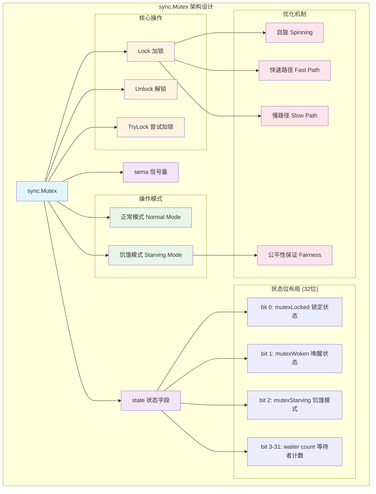
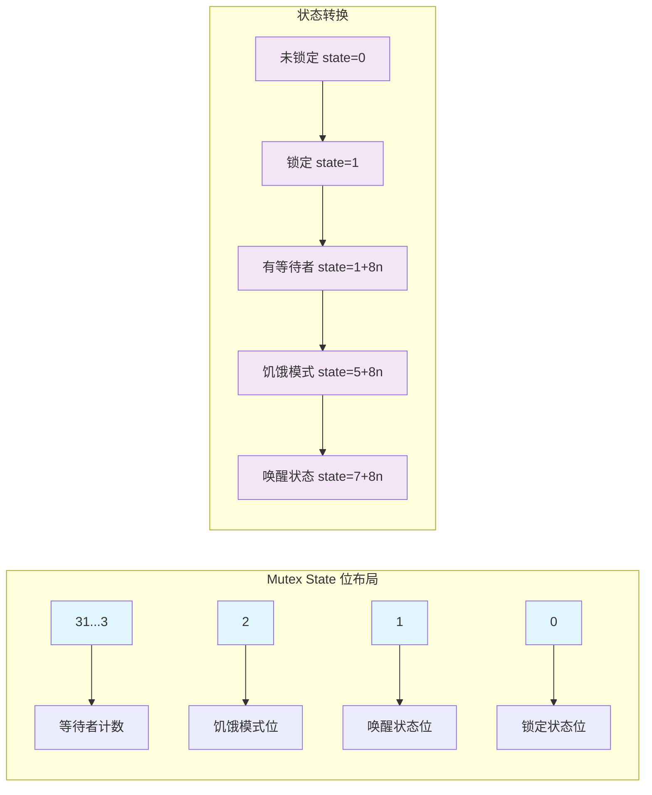
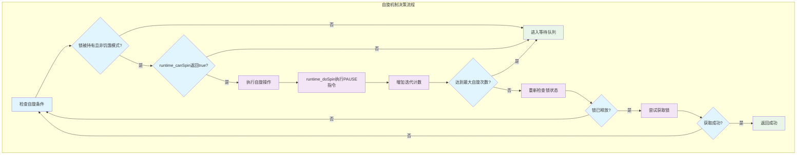
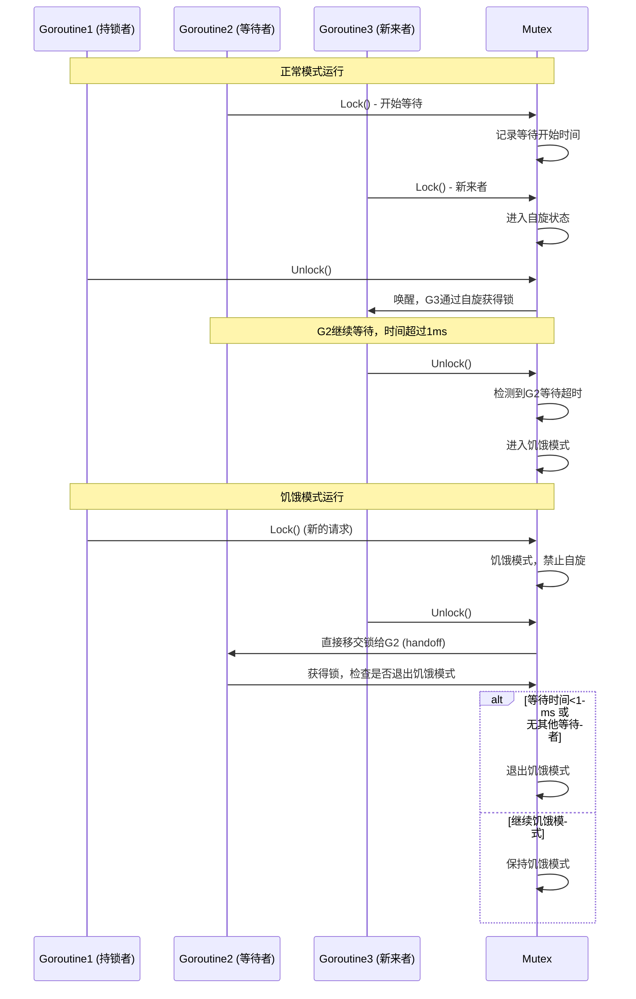
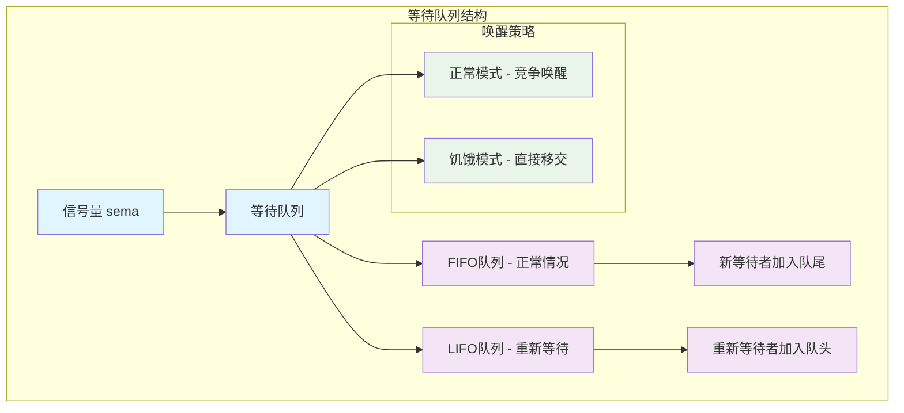
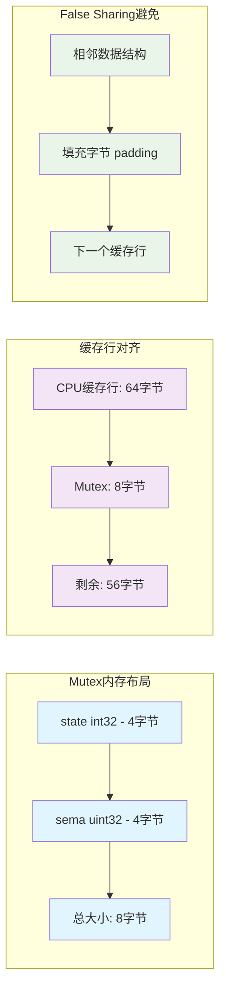

# Go sync.Mutex深度解析：互斥锁的设计原理与实现机制

## 概述

`sync.Mutex`是Go语言中最基础也是最重要的同步原语，它提供了互斥访问共享资源的能力。本文将深入分析Mutex的实现机制，包括其状态管理、优化策略、以及在高并发场景下的性能表现。

## 1. Mutex架构设计

### 1.1 整体架构图



**架构设计说明**：

1. **状态管理**：使用32位整数的不同位来存储锁状态、唤醒标志、饥饿模式和等待者计数
2. **双模式设计**：正常模式追求性能，饥饿模式保证公平性
3. **多层优化**：从快速路径到自旋再到阻塞，逐层降级
4. **信号量支持**：底层使用runtime信号量实现goroutine的阻塞和唤醒

### 1.2 核心数据结构

```go
// Mutex 互斥锁结构体
// 提供互斥访问共享资源的能力，确保同一时刻只有一个goroutine能够访问临界区
type Mutex struct {
    // state 是一个32位的状态字段，使用位操作来存储多个信息：
    // - bit 0: mutexLocked (1) - 表示锁是否被持有
    // - bit 1: mutexWoken (2) - 表示是否有goroutine被唤醒
    // - bit 2: mutexStarving (4) - 表示是否处于饥饿模式
    // - bit 3-31: 等待者计数 - 表示有多少个goroutine在等待这个锁
    state int32
    
    // sema 是一个信号量，用于阻塞和唤醒等待的goroutine
    // 当锁竞争激烈时，goroutine会在这个信号量上等待
    // 解锁时会通过这个信号量唤醒等待的goroutine
    sema  uint32
}

// 状态位常量定义
const (
    mutexLocked = 1 << iota // 1: 锁被持有状态位
    mutexWoken              // 2: 唤醒状态位，表示有goroutine被唤醒正在尝试获取锁
    mutexStarving           // 4: 饥饿模式状态位，用于保证公平性
    mutexWaiterShift = iota // 3: 等待者计数的位移量，用于从state中提取等待者数量

    // 饥饿模式的阈值：1毫秒
    // 当一个goroutine等待锁的时间超过这个阈值时，锁会进入饥饿模式
    starvationThresholdNs = 1e6
)
```

### 1.3 状态位详细分析



**状态位功能说明**：

- **mutexLocked (bit 0)**：表示锁是否被持有
- **mutexWoken (bit 1)**：防止重复唤醒，当有goroutine被唤醒时设置
- **mutexStarving (bit 2)**：饥饿模式标志，保证等待时间过长的goroutine能够获得锁
- **waiter count (bit 3-31)**：记录等待锁的goroutine数量，用于决定是否需要唤醒等待者

## 2. 核心API详细分析

### 2.1 Lock() 方法实现

```go
// Lock 获取互斥锁
// 如果锁已经被其他goroutine持有，调用的goroutine会阻塞直到锁可用
// 
// 实现策略：
// 1. 快速路径：如果锁未被持有，直接通过CAS获取
// 2. 慢路径：进入复杂的竞争处理逻辑，包括自旋、等待队列、饥饿模式等
func (m *Mutex) Lock() {
    // 快速路径：尝试直接获取锁
    // 如果state为0（未锁定且无等待者），直接设置为mutexLocked(1)
    // 这是最常见的无竞争情况，性能最优
    if atomic.CompareAndSwapInt32(&m.state, 0, mutexLocked) {
        // 竞态检测支持
        if race.Enabled {
            race.Acquire(unsafe.Pointer(m))
        }
        return
    }
    
    // 快速路径失败，进入慢路径处理复杂的锁竞争情况
    m.lockSlow()
}

// lockSlow 处理锁竞争的慢路径
// 包含自旋优化、等待队列管理、饥饿模式处理等复杂逻辑
func (m *Mutex) lockSlow() {
    var waitStartTime int64  // 记录开始等待的时间，用于判断是否进入饥饿模式
    starving := false        // 当前goroutine是否应该进入饥饿模式
    awoke := false          // 当前goroutine是否已经被唤醒
    iter := 0               // 自旋迭代次数
    old := m.state          // 保存当前状态用于CAS操作
    
    for {
        // 自旋条件检查：
        // 1. 锁被持有但不在饥饿模式 (old&(mutexLocked|mutexStarving) == mutexLocked)
        // 2. 可以进行自旋 (runtime_canSpin(iter))
        if old&(mutexLocked|mutexStarving) == mutexLocked && runtime_canSpin(iter) {
            // 尝试设置mutexWoken位，告诉Unlock()不要唤醒其他等待者
            // 条件：当前未被唤醒 && 未设置woken位 && 有等待者 && CAS成功
            if !awoke && old&mutexWoken == 0 && old>>mutexWaiterShift != 0 &&
                atomic.CompareAndSwapInt32(&m.state, old, old|mutexWoken) {
                awoke = true
            }
            
            // 执行自旋：在多核系统上短暂忙等，避免立即进入阻塞状态
            runtime_doSpin()
            iter++
            old = m.state
            continue
        }
        
        // 准备新的状态值
        new := old
        
        // 如果不在饥饿模式，尝试获取锁（设置mutexLocked位）
        if old&mutexStarving == 0 {
            new |= mutexLocked
        }
        
        // 如果锁被持有或处于饥饿模式，增加等待者计数
        if old&(mutexLocked|mutexStarving) != 0 {
            new += 1 << mutexWaiterShift
        }
        
        // 如果当前goroutine处于饥饿状态且锁被持有，设置饥饿模式
        if starving && old&mutexLocked != 0 {
            new |= mutexStarving
        }
        
        // 如果当前goroutine被唤醒，清除woken位
        if awoke {
            // 一致性检查：如果要清除woken位，它必须已经被设置
            if new&mutexWoken == 0 {
                throw("sync: inconsistent mutex state")
            }
            new &^= mutexWoken
        }
        
        // 尝试原子更新状态
        if atomic.CompareAndSwapInt32(&m.state, old, new) {
            // 如果旧状态既未锁定也不在饥饿模式，说明成功获取了锁
            if old&(mutexLocked|mutexStarving) == 0 {
                break // 获取锁成功，退出循环
            }
            
            // 确定在等待队列中的位置
            // 如果之前已经等待过（waitStartTime != 0），使用LIFO顺序以减少延迟
            queueLifo := waitStartTime != 0
            if waitStartTime == 0 {
                waitStartTime = runtime_nanotime()
            }
            
            // 在信号量上等待，直到被唤醒
            // queueLifo决定是LIFO还是FIFO排队
            runtime_SemacquireMutex(&m.sema, queueLifo, 1)
            
            // 检查是否应该进入饥饿模式
            // 如果等待时间超过阈值，标记为饥饿状态
            starving = starving || runtime_nanotime()-waitStartTime > starvationThresholdNs
            old = m.state
            
            // 如果锁处于饥饿模式，当前goroutine应该直接获得锁
            if old&mutexStarving != 0 {
                // 饥饿模式下的一致性检查
                if old&(mutexLocked|mutexWoken) != 0 || old>>mutexWaiterShift == 0 {
                    throw("sync: inconsistent mutex state")
                }
                
                // 在饥饿模式下，锁直接移交给当前goroutine
                // 设置locked位，减少等待者计数
                delta := int32(mutexLocked - 1<<mutexWaiterShift)
                
                // 如果不再饥饿或者是最后一个等待者，退出饥饿模式
                if !starving || old>>mutexWaiterShift == 1 {
                    delta -= mutexStarving
                }
                
                atomic.AddInt32(&m.state, delta)
                break
            }
            
            // 正常模式下被唤醒，重置状态继续竞争
            awoke = true
            iter = 0
        } else {
            // CAS失败，重新读取状态继续循环
            old = m.state
        }
    }
    
    // 竞态检测支持
    if race.Enabled {
        race.Acquire(unsafe.Pointer(m))
    }
}
```

### 2.2 Unlock() 方法实现

```go
// Unlock 释放互斥锁
// 如果m在进入Unlock时未锁定，这是一个运行时错误
//
// 锁定的Mutex与特定的goroutine无关。允许一个goroutine锁定Mutex，
// 然后安排另一个goroutine解锁它。
func (m *Mutex) Unlock() {
    // 竞态检测支持
    if race.Enabled {
        _ = m.state
        race.Release(unsafe.Pointer(m))
    }
    
    // 快速路径：直接清除locked位
    // 如果结果为0，说明没有等待者，直接返回
    new := atomic.AddInt32(&m.state, -mutexLocked)
    if new != 0 {
        // 有等待者或其他状态位被设置，进入慢路径
        m.unlockSlow(new)
    }
}

// unlockSlow 处理解锁的慢路径
// 负责唤醒等待的goroutine，处理正常模式和饥饿模式的不同逻辑
func (m *Mutex) unlockSlow(new int32) {
    // 检查是否对未锁定的mutex调用Unlock
    if (new+mutexLocked)&mutexLocked == 0 {
        fatal("sync: unlock of unlocked mutex")
    }
    
    if new&mutexStarving == 0 {
        // 正常模式下的解锁处理
        old := new
        for {
            // 如果没有等待者，或者已经有goroutine被唤醒/获得锁/进入饥饿模式，
            // 则无需唤醒任何goroutine
            if old>>mutexWaiterShift == 0 || old&(mutexLocked|mutexWoken|mutexStarving) != 0 {
                return
            }
            
            // 准备唤醒一个等待者：减少等待者计数，设置woken位
            new = (old - 1<<mutexWaiterShift) | mutexWoken
            if atomic.CompareAndSwapInt32(&m.state, old, new) {
                // 唤醒一个等待的goroutine
                // handoff=false表示正常模式，被唤醒的goroutine需要竞争锁
                runtime_Semrelease(&m.sema, false, 1)
                return
            }
            old = m.state
        }
    } else {
        // 饥饿模式下的解锁处理
        // 直接将锁移交给队列头部的等待者
        // handoff=true表示直接移交，被唤醒的goroutine直接获得锁
        runtime_Semrelease(&m.sema, true, 1)
    }
}
```

### 2.3 TryLock() 方法实现

```go
// TryLock 尝试锁定m并报告是否成功
//
// 注意：虽然TryLock的正确使用确实存在，但它们很少见，
// 使用TryLock通常是互斥锁的特定用法中更深层问题的征象。
func (m *Mutex) TryLock() bool {
    old := m.state
    
    // 如果锁已被持有或处于饥饿模式，直接返回失败
    if old&(mutexLocked|mutexStarving) != 0 {
        return false
    }
    
    // 尝试获取锁，但不增加等待者计数
    // 这里可能存在竞争，如果CAS失败说明有其他goroutine获得了锁
    if !atomic.CompareAndSwapInt32(&m.state, old, old|mutexLocked) {
        return false
    }
    
    // 竞态检测支持
    if race.Enabled {
        race.Acquire(unsafe.Pointer(m))
    }
    return true
}
```

## 3. 关键机制深度分析

### 3.1 自旋机制详解



**自旋机制的实现细节**：

```go
// runtime_canSpin 检查是否可以进行自旋
// 自旋的条件：
// 1. 自旋次数未超过限制（通常是4次）
// 2. 多核处理器系统
// 3. 至少有一个其他运行的P（处理器）
// 4. 当前goroutine所在的P的本地运行队列为空
func runtime_canSpin(iter int) bool {
    // active_spin 通常为4，表示最多自旋4次
    return iter < active_spin && 
           runtime.GOMAXPROCS(0) > 1 && 
           runtime.NumGoroutine() > runtime.GOMAXPROCS(0) &&
           !runtime.Gosched()
}

// runtime_doSpin 执行一次自旋
// 在x86架构上，这通常是执行PAUSE指令
// PAUSE指令会让CPU暂停几个时钟周期，减少功耗并提高性能
func runtime_doSpin() {
    // 实际实现中会调用汇编代码执行PAUSE指令
    // 这里用循环模拟，实际会调用procyield(30)
    for i := 0; i < 30; i++ {
        // 在支持的架构上执行PAUSE指令
        runtime.Gosched()
    }
}
```

**自旋的优势与限制**：

- **优势**：避免goroutine切换开销，在短时间持锁场景下性能更好
- **限制**：只在多核系统且满足特定条件时才进行，避免浪费CPU资源

### 3.2 饥饿模式机制



**饥饿模式的核心逻辑**：

```go
// 饥饿模式的判断和处理逻辑
func starvationModeLogic() {
    // 进入饥饿模式的条件
    const starvationThreshold = 1e6 // 1毫秒
    
    // 在lockSlow中检查是否应该进入饥饿模式
    if waitTime := runtime_nanotime() - waitStartTime; waitTime > starvationThreshold {
        starving = true
        // 设置饥饿模式位
        new |= mutexStarving
    }
    
    // 饥饿模式下的锁移交
    if old&mutexStarving != 0 {
        // 直接获得锁，无需竞争
        delta := int32(mutexLocked - 1<<mutexWaiterShift)
        
        // 退出饥饿模式的条件
        if !starving || old>>mutexWaiterShift == 1 {
            // 当前goroutine不再饥饿，或者是最后一个等待者
            delta -= mutexStarving
        }
        
        atomic.AddInt32(&m.state, delta)
    }
}
```

### 3.3 等待队列管理



## 4. 性能优化与调用链路

### 4.1 完整调用链路图

```mermaid
graph TB
    subgraph "Mutex.Lock() 调用链路"
        A[Mutex.Lock] --> B{快速路径CAS}
        B -->|成功| C[获得锁 - 返回]
        B -->|失败| D[lockSlow]
        
        D --> E{可以自旋?}
        E -->|是| F[runtime_doSpin]
        E -->|否| G[准备等待]
        
        F --> H[设置woken位]
        H --> I[检查锁状态]
        I --> J{锁已释放?}
        J -->|是| K[CAS获取锁]
        J -->|否| E
        
        K -->|成功| C
        K -->|失败| E
        
        G --> L[增加等待者计数]
        L --> M[CAS更新状态]
        M -->|成功| N[runtime_SemacquireMutex]
        M -->|失败| G
        
        N --> O[gopark - 阻塞goroutine]
        O --> P[被唤醒]
        P --> Q{饥饿模式?}
        
        Q -->|是| R[直接获得锁]
        Q -->|否| S[重新竞争]
        
        R --> C
        S --> E
    end
    
    subgraph "Mutex.Unlock() 调用链路"
        T[Mutex.Unlock] --> U[atomic.AddInt32 清除locked位]
        U --> V{new == 0?}
        V -->|是| W[无等待者 - 返回]
        V -->|否| X[unlockSlow]
        
        X --> Y{饥饿模式?}
        Y -->|是| Z[runtime_Semrelease handoff=true]
        Y -->|否| AA[正常模式处理]
        
        AA --> BB[减少等待者计数]
        BB --> CC[设置woken位]
        CC --> DD[runtime_Semrelease handoff=false]
        
        Z --> EE[直接移交锁]
        DD --> FF[唤醒等待者竞争]
    end
    
    classDef entry fill:#e1f5fe
    classDef fast fill:#e8f5e8
    classDef slow fill:#fff3e0
    classDef runtime fill:#f3e5f5
    
    class A,T entry
    class B,C,U,V,W fast
    class D,E,F,G,X,Y,AA slow
    class N,O,P,Z,DD runtime
```



### 4.2 关键函数性能分析

```go
// 性能关键路径分析
func performanceAnalysis() {
    // 1. 快速路径性能 - 最优情况
    // 只需要一次原子CAS操作，延迟约1-2ns
    fastPath := func() {
        // atomic.CompareAndSwapInt32(&m.state, 0, mutexLocked)
        // 汇编实现，单条LOCK CMPXCHG指令
    }
    
    // 2. 自旋路径性能 - 中等延迟
    // 包含条件检查 + 自旋循环 + CAS重试
    // 延迟约10-100ns，取决于自旋次数
    spinPath := func() {
        for iter := 0; iter < 4; iter++ {
            // runtime_canSpin() - 约5ns
            // runtime_doSpin() - 约20ns (30个PAUSE指令)
            // CAS重试 - 约2ns
        }
    }
    
    // 3. 阻塞路径性能 - 最高延迟
    // 包含系统调用、goroutine切换等
    // 延迟约1-10μs，取决于调度器负载
    blockingPath := func() {
        // runtime_SemacquireMutex() - 约1μs
        // gopark() - 约2-5μs
        // 调度器切换 - 约1-3μs
    }
}
```

### 4.3 内存布局与缓存优化



## 5. 实战案例与最佳实践

### 5.1 基础使用模式

```go
// 案例1: 保护共享资源的基本用法
type Counter struct {
    mu    sync.Mutex  // 保护count字段的互斥锁
    count int64       // 共享的计数器
}

// Increment 线程安全地增加计数器
// 使用defer确保在任何情况下都会释放锁
func (c *Counter) Increment() {
    c.mu.Lock()
    defer c.mu.Unlock()  // defer确保异常时也会解锁
    c.count++
}

// Value 线程安全地读取计数器值
// 读操作也需要加锁，确保读取的一致性
func (c *Counter) Value() int64 {
    c.mu.Lock()
    defer c.mu.Unlock()
    return c.count
}

// Add 线程安全地增加指定值
func (c *Counter) Add(delta int64) {
    c.mu.Lock()
    defer c.mu.Unlock()
    c.count += delta
}
```

### 5.2 高级使用模式

```go
// 案例2: 带超时的锁获取
type TimeoutMutex struct {
    mu sync.Mutex
}

// LockWithTimeout 尝试在指定时间内获取锁
// 返回是否成功获取锁
func (tm *TimeoutMutex) LockWithTimeout(timeout time.Duration) bool {
    // 创建一个带超时的context
    ctx, cancel := context.WithTimeout(context.Background(), timeout)
    defer cancel()
    
    // 使用channel来实现超时机制
    done := make(chan struct{})
    
    go func() {
        tm.mu.Lock()
        close(done)
    }()
    
    select {
    case <-done:
        return true  // 成功获取锁
    case <-ctx.Done():
        return false // 超时
    }
}

// Unlock 释放锁
func (tm *TimeoutMutex) Unlock() {
    tm.mu.Unlock()
}

// 案例3: 分片锁减少竞争
type ShardedMap struct {
    shards []shard
    mask   uint64  // 用于快速取模运算
}

type shard struct {
    mu   sync.Mutex
    data map[string]interface{}
    _    [56]byte  // 填充到64字节，避免false sharing
}

// NewShardedMap 创建分片映射
// shardCount 必须是2的幂，以便使用位运算优化
func NewShardedMap(shardCount int) *ShardedMap {
    if shardCount&(shardCount-1) != 0 {
        panic("shard count must be power of 2")
    }
    
    sm := &ShardedMap{
        shards: make([]shard, shardCount),
        mask:   uint64(shardCount - 1),
    }
    
    for i := range sm.shards {
        sm.shards[i].data = make(map[string]interface{})
    }
    
    return sm
}

// getShard 根据key获取对应的分片
func (sm *ShardedMap) getShard(key string) *shard {
    hash := fnv1a(key)  // 使用FNV-1a哈希算法
    return &sm.shards[hash&sm.mask]
}

// Set 设置键值对
func (sm *ShardedMap) Set(key string, value interface{}) {
    shard := sm.getShard(key)
    shard.mu.Lock()
    defer shard.mu.Unlock()
    shard.data[key] = value
}

// Get 获取值
func (sm *ShardedMap) Get(key string) (interface{}, bool) {
    shard := sm.getShard(key)
    shard.mu.Lock()
    defer shard.mu.Unlock()
    value, exists := shard.data[key]
    return value, exists
}

// Delete 删除键值对
func (sm *ShardedMap) Delete(key string) {
    shard := sm.getShard(key)
    shard.mu.Lock()
    defer shard.mu.Unlock()
    delete(shard.data, key)
}

// fnv1a 实现FNV-1a哈希算法
func fnv1a(s string) uint64 {
    const (
        offset64 = 14695981039346656037
        prime64  = 1099511628211
    )
    
    hash := uint64(offset64)
    for i := 0; i < len(s); i++ {
        hash ^= uint64(s[i])
        hash *= prime64
    }
    return hash
}
```

### 5.3 性能优化案例

```go
// 案例4: 读写分离优化
type OptimizedCache struct {
    mu    sync.Mutex
    data  map[string]*CacheItem
    stats CacheStats  // 缓存统计信息
}

type CacheItem struct {
    value      interface{}
    expireTime time.Time
    accessTime int64  // 使用原子操作更新
}

type CacheStats struct {
    hits   int64
    misses int64
}

// Get 优化的获取方法
func (c *OptimizedCache) Get(key string) (interface{}, bool) {
    c.mu.Lock()
    item, exists := c.data[key]
    if !exists {
        c.mu.Unlock()
        atomic.AddInt64(&c.stats.misses, 1)
        return nil, false
    }
    
    // 检查是否过期
    if time.Now().After(item.expireTime) {
        delete(c.data, key)
        c.mu.Unlock()
        atomic.AddInt64(&c.stats.misses, 1)
        return nil, false
    }
    
    value := item.value
    c.mu.Unlock()
    
    // 在锁外更新访问时间，减少锁持有时间
    atomic.StoreInt64(&item.accessTime, time.Now().UnixNano())
    atomic.AddInt64(&c.stats.hits, 1)
    
    return value, true
}

// Set 优化的设置方法
func (c *OptimizedCache) Set(key string, value interface{}, ttl time.Duration) {
    item := &CacheItem{
        value:      value,
        expireTime: time.Now().Add(ttl),
        accessTime: time.Now().UnixNano(),
    }
    
    c.mu.Lock()
    c.data[key] = item
    c.mu.Unlock()
}

// 案例5: 锁粒度优化
type OptimizedServer struct {
    // 使用多个锁保护不同的数据结构，减少锁竞争
    usersMu    sync.RWMutex
    users      map[string]*User
    
    sessionsMu sync.RWMutex
    sessions   map[string]*Session
    
    configMu   sync.RWMutex
    config     *Config
    
    // 统计信息使用原子操作，避免锁开销
    requestCount int64
    errorCount   int64
}

// GetUser 获取用户信息
func (s *OptimizedServer) GetUser(userID string) (*User, bool) {
    s.usersMu.RLock()
    defer s.usersMu.RUnlock()
    
    user, exists := s.users[userID]
    return user, exists
}

// UpdateUser 更新用户信息
func (s *OptimizedServer) UpdateUser(userID string, user *User) {
    s.usersMu.Lock()
    defer s.usersMu.Unlock()
    
    s.users[userID] = user
}

// IncrementRequestCount 增加请求计数（无锁）
func (s *OptimizedServer) IncrementRequestCount() {
    atomic.AddInt64(&s.requestCount, 1)
}

// GetRequestCount 获取请求计数（无锁）
func (s *OptimizedServer) GetRequestCount() int64 {
    return atomic.LoadInt64(&s.requestCount)
}
```

## 6. 常见陷阱与调试技巧

### 6.1 常见错误模式

```go
// 错误1: 锁的复制
func badCopyMutex() {
    type BadStruct struct {
        mu   sync.Mutex
        data int
    }
    
    s1 := BadStruct{}
    s2 := s1  // 错误：复制了mutex，导致两个独立的锁
    
    // 正确做法：使用指针
    s1 := &BadStruct{}
    s2 := s1  // 正确：共享同一个mutex
}

// 错误2: 忘记解锁
func badForgetUnlock() {
    var mu sync.Mutex
    
    mu.Lock()
    if someCondition {
        return  // 错误：忘记解锁就返回
    }
    mu.Unlock()
    
    // 正确做法：使用defer
    mu.Lock()
    defer mu.Unlock()  // 确保总是会解锁
    
    if someCondition {
        return  // 正确：defer确保会解锁
    }
}

// 错误3: 重复加锁（死锁）
func badReentrantLock() {
    var mu sync.Mutex
    
    func recursive(n int) {
        mu.Lock()
        defer mu.Unlock()
        
        if n > 0 {
            recursive(n - 1)  // 错误：同一goroutine重复加锁
        }
    }
    
    // 正确做法：分离锁定和非锁定版本
    func recursivePublic(n int) {
        mu.Lock()
        defer mu.Unlock()
        recursivePrivate(n)
    }
    
    func recursivePrivate(n int) {
        // 假设已经持有锁
        if n > 0 {
            recursivePrivate(n - 1)
        }
    }
}

// 错误4: 跨goroutine解锁
func badCrossGoroutineUnlock() {
    var mu sync.Mutex
    
    mu.Lock()
    go func() {
        mu.Unlock()  // 错误：在不同goroutine中解锁
    }()
    
    // 正确做法：在同一goroutine中加锁和解锁
    mu.Lock()
    defer mu.Unlock()
    
    go func() {
        // 在新goroutine中使用自己的锁
        var localMu sync.Mutex
        localMu.Lock()
        defer localMu.Unlock()
        // 处理逻辑
    }()
}
```

### 6.2 调试和性能分析

```go
// 调试工具1: 锁竞争分析
func mutexProfiling() {
    // 启用mutex profiling
    runtime.SetMutexProfileFraction(1)
    
    // 在程序结束时输出profile
    defer func() {
        f, err := os.Create("mutex.prof")
        if err != nil {
            log.Fatal(err)
        }
        defer f.Close()
        
        if err := pprof.Lookup("mutex").WriteTo(f, 0); err != nil {
            log.Fatal(err)
        }
    }()
    
    // 你的程序逻辑...
}

// 调试工具2: 自定义mutex包装器
type DebugMutex struct {
    mu       sync.Mutex
    name     string
    locked   int32
    owner    string
    lockTime time.Time
}

func NewDebugMutex(name string) *DebugMutex {
    return &DebugMutex{name: name}
}

func (dm *DebugMutex) Lock() {
    start := time.Now()
    dm.mu.Lock()
    
    atomic.StoreInt32(&dm.locked, 1)
    dm.owner = getCurrentGoroutineID()
    dm.lockTime = time.Now()
    
    lockDuration := time.Since(start)
    if lockDuration > 10*time.Millisecond {
        log.Printf("SLOW LOCK: %s took %v to acquire", dm.name, lockDuration)
    }
}

func (dm *DebugMutex) Unlock() {
    if atomic.LoadInt32(&dm.locked) == 0 {
        panic(fmt.Sprintf("Unlock of unlocked mutex: %s", dm.name))
    }
    
    holdDuration := time.Since(dm.lockTime)
    if holdDuration > 50*time.Millisecond {
        log.Printf("LONG HOLD: %s held for %v", dm.name, holdDuration)
    }
    
    atomic.StoreInt32(&dm.locked, 0)
    dm.owner = ""
    dm.mu.Unlock()
}

func getCurrentGoroutineID() string {
    buf := make([]byte, 64)
    buf = buf[:runtime.Stack(buf, false)]
    // 解析goroutine ID
    return string(buf)
}

// 性能测试工具
func benchmarkMutexPerformance() {
    // 测试不同场景下的mutex性能
    scenarios := []struct {
        name        string
        goroutines  int
        operations  int
        holdTime    time.Duration
    }{
        {"low-contention", 2, 10000, 0},
        {"medium-contention", 10, 10000, 100 * time.Microsecond},
        {"high-contention", 100, 1000, 1 * time.Millisecond},
    }
    
    for _, scenario := range scenarios {
        fmt.Printf("Testing %s\n", scenario.name)
        
        var mu sync.Mutex
        var counter int64
        var wg sync.WaitGroup
        
        start := time.Now()
        
        for i := 0; i < scenario.goroutines; i++ {
            wg.Add(1)
            go func() {
                defer wg.Done()
                
                for j := 0; j < scenario.operations; j++ {
                    mu.Lock()
                    counter++
                    if scenario.holdTime > 0 {
                        time.Sleep(scenario.holdTime)
                    }
                    mu.Unlock()
                }
            }()
        }
        
        wg.Wait()
        duration := time.Since(start)
        
        totalOps := scenario.goroutines * scenario.operations
        opsPerSec := float64(totalOps) / duration.Seconds()
        
        fmt.Printf("  Duration: %v\n", duration)
        fmt.Printf("  Ops/sec: %.0f\n", opsPerSec)
        fmt.Printf("  Final counter: %d\n\n", counter)
    }
}
```

## 7. 总结

### 7.1 Mutex设计要点

1. **状态压缩**：使用32位整数存储多种状态信息，节省内存
2. **双模式设计**：正常模式追求性能，饥饿模式保证公平性
3. **多层优化**：快速路径、自旋、阻塞的渐进式降级
4. **公平性保证**：通过饥饿模式防止goroutine被饿死

### 7.2 性能特征

- **快速路径**：无竞争时仅需1次CAS操作，延迟1-2ns
- **自旋优化**：短时间竞争时避免goroutine切换，延迟10-100ns
- **阻塞等待**：长时间竞争时进入阻塞状态，延迟1-10μs

### 7.3 使用建议

1. **缩短临界区**：只在必要时持锁，减少锁竞争
2. **避免死锁**：固定锁的获取顺序，使用defer确保解锁
3. **合理分片**：高竞争场景使用分片锁减少竞争
4. **性能监控**：使用pprof分析锁竞争热点

> **更多最佳实践**：详细的并发编程最佳实践和高级优化技巧，请参考 [Go并发编程最佳实践指南](golang-concurrency-best-practices.md)。

sync.Mutex作为Go并发编程的基石，其精巧的设计和优化为高性能并发程序提供了坚实的基础。理解其实现原理有助于编写更高效、更可靠的并发代码。
