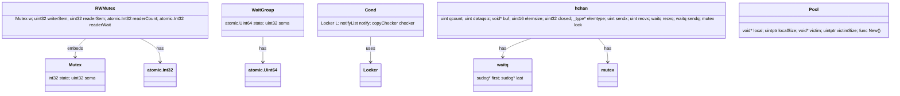

## 概述

Go语言提供了并发原语系统。通过channel实现goroutine间的通信，通过sync包提供各种同步原语，Go构建了一个并发编程框架。

Go提供了并发原语，包括channel、sync.Mutex、sync.WaitGroup、sync.Pool等，这些原语可以组合使用来解决各种并发问题。Go的并发原语在底层实现上进行了优化。

<!--more-->

## 1. 并发原语架构总览

### 1.1 并发原语的核心使命

Go并发原语系统的本质是解决goroutine间的同步和通信问题，其目标是：

- **安全同步**：提供无竞态的数据访问机制
- **数据通信**：实现goroutine间的数据传递
- **灵活协调**：支持复杂的并发控制模式
- **性能优化**：最小化同步开销和锁竞争

### 1.2 Go并发原语架构图


### 1.3 并发原语分类图


### 1.4 sync.Mutex操作时序图


### 1.5 Channel通信时序图


### 1.6 sync.Map操作时序图


### 1.7 sync.WaitGroup时序图


### 1.8 sync.Pool对象池时序图


## 2. sync.Map - 并发安全映射

### 2.1 sync.Map架构设计


### 2.2 sync.Map核心实现

```go
// sync.Map 的新实现基于 HashTrieMap
type Map struct {
    _ noCopy
    m isync.HashTrieMap[any, any]
}

// Load 返回存储在映射中的键值，如果不存在则返回nil
func (m *Map) Load(key any) (value any, ok bool) {
    return m.m.Load(key)
}

// Store 设置键的值
func (m *Map) Store(key, value any) {
    m.m.Store(key, value)
}

// LoadOrStore 返回键的现有值（如果存在）
// 否则，存储并返回给定值
// loaded结果为true表示值已加载，false表示已存储
func (m *Map) LoadOrStore(key, value any) (actual any, loaded bool) {
    return m.m.LoadOrStore(key, value)
}

// LoadAndDelete 删除键的值，返回之前的值（如果有）
// loaded结果报告键是否存在
func (m *Map) LoadAndDelete(key any) (value any, loaded bool) {
    return m.m.LoadAndDelete(key)
}

// Delete 删除键的值
// 如果键不在映射中，Delete什么也不做
func (m *Map) Delete(key any) {
    m.m.Delete(key)
}

// CompareAndSwap 如果映射中存储的值等于old，则交换old和new值
// old值必须是可比较类型
func (m *Map) CompareAndSwap(key, old, new any) (swapped bool) {
    return m.m.CompareAndSwap(key, old, new)
}

// Range 对映射中存在的每个键值对顺序调用f
// 如果f返回false，Range停止迭代
func (m *Map) Range(f func(key, value any) bool) {
    m.m.Range(f)
}
```

### 2.3 HashTrieMap的优势

1. **无锁设计**：使用原子操作和版本控制避免锁竞争
2. **高并发性能**：读操作完全无锁，写操作冲突最小
3. **内存效率**：使用trie结构减少内存碎片
4. **扩展性好**：支持动态扩容，性能随核心数线性扩展

## 3. sync.Pool - 对象池

### 3.1 sync.Pool架构设计


### 3.2 sync.Pool核心实现

```go
// Pool 对象池结构体，用于存储和复用临时对象，减少内存分配开销
type Pool struct {
    noCopy noCopy  // 防止Pool被复制的标记，确保Pool只能通过指针传递
    
    // ==================== 本地池管理 ====================
    local     unsafe.Pointer // 指向Per-P池数组的指针，每个P都有自己的本地池
                            // 类型为[]poolLocal，但使用unsafe.Pointer避免GC扫描
    localSize uintptr        // 本地池数组的大小，等于GOMAXPROCS的值
                            // 用于边界检查和数组访问
    
    // ==================== 受害者缓存机制 ====================  
    victim     unsafe.Pointer // 指向上一轮GC前的本地池数组
                             // 当本地池为空时，会尝试从victim中获取对象
                             // 这是一种两代回收机制，提高对象复用率
    victimSize uintptr        // 受害者池数组的大小
                             // 可能与当前localSize不同，因为GOMAXPROCS可能发生变化
    
    // ==================== 对象创建函数 ====================
    // New可选地指定一个函数来生成新对象
    // 当Get方法无法从池中获取对象时调用此函数创建新对象
    // 如果New为nil，Get方法将返回nil
    New func() any
}

// poolLocalInternal Per-P池的内部结构，包含实际的对象存储
type poolLocalInternal struct {
    // ==================== 私有对象槽 ====================
    private any       // 私有对象槽，只能被对应的P访问
                     // 这是最快的获取路径，无需任何同步操作
                     // 当Put时如果private为空，直接存储到这里
                     // 当Get时优先从这里获取
    
    // ==================== 共享对象队列 ====================                 
    shared  poolChain // 共享对象队列，支持多P并发访问
                     // 本地P可以pushHead/popHead（LIFO操作，保证局部性）
                     // 其他P只能popTail（工作窃取，避免竞争）
                     // 使用无锁链式队列实现，支持动态扩容
}

// poolLocal Per-P池的完整结构，包含缓存行对齐
type poolLocal struct {
    poolLocalInternal  // 嵌入内部结构
    
    // ==================== 缓存行对齐填充 ====================
    // 防止在广泛使用的平台上出现false sharing（伪共享）
    // 128字节对齐确保每个poolLocal占用独立的缓存行
    // 128 mod (缓存行大小) = 0，适配主流CPU的缓存行大小（64/128字节）
    pad [128 - unsafe.Sizeof(poolLocalInternal{})%128]byte
}

// Put 将对象x添加到池中，供后续Get操作复用
// 这是对象池的核心存储操作，优先使用私有槽，其次使用共享队列
func (p *Pool) Put(x any) {
    // 空对象检查：nil对象没有复用价值，直接返回
    if x == nil {
        return
    }
    
    // ==================== 获取本地池 ====================
    // pin()操作：
    // 1. 禁用抢占，确保当前goroutine不会被调度到其他P
    // 2. 获取当前P对应的poolLocal
    // 3. 返回poolLocal指针和P的ID
    l, _ := p.pin()
    
    // ==================== 优先使用私有槽 ====================
    if l.private == nil {
        // 私有槽为空，直接存储对象
        // 这是最快的路径，无需任何同步操作
        // 下次同一个P上的Get操作可以直接获取
        l.private = x
    } else {
        // ==================== 使用共享队列 ====================
        // 私有槽已被占用，将对象推入共享队列的头部
        // pushHead操作：
        // 1. 使用LIFO策略，保证时间局部性
        // 2. 新对象更可能被快速复用
        // 3. 支持无锁并发操作
        l.shared.pushHead(x)
    }
    
    // ==================== 恢复抢占 ====================
    // 重新启用抢占，允许goroutine被调度
    // 必须与pin()配对使用，确保临界区的完整性
    runtime_procUnpin()
}

// Get 从池中获取一个对象，将其从池中移除并返回给调用者
// 获取顺序：私有槽 -> 本地共享队列 -> 工作窃取 -> 受害者缓存 -> 创建新对象
// Get可能选择忽略池并将其视为空，这是一种性能优化策略
func (p *Pool) Get() any {
    // ==================== 获取本地池 ====================
    // pin()禁用抢占并获取当前P的poolLocal和P的ID
    l, pid := p.pin()
    
    // ==================== 第一优先级：私有槽 ====================
    // 尝试从私有槽获取对象，这是最快的路径
    x := l.private      // 读取私有槽中的对象
    l.private = nil     // 立即清空私有槽，为下次Put做准备
    
    if x == nil {
        // ==================== 第二优先级：本地共享队列 ====================
        // 私有槽为空，尝试从本地共享队列的头部弹出对象
        // 我们更喜欢头部而不是尾部，以实现重用的时间局部性
        // popHead操作：
        // 1. LIFO策略，最近Put的对象最先被Get
        // 2. 保证缓存友好性，提高性能
        x, _ = l.shared.popHead()
        
        if x == nil {
            // ==================== 第三优先级：慢路径 ====================
            // 本地队列也为空，进入慢路径
            // getSlow会尝试工作窃取和受害者缓存
            x = p.getSlow(pid)
        }
    }
    
    // ==================== 恢复抢占 ====================
    // 重新启用抢占，必须与pin()配对
    runtime_procUnpin()
    
    // ==================== 最后手段：创建新对象 ====================
    if x == nil && p.New != nil {
        // 所有获取途径都失败，调用New函数创建新对象
        // 这确保了Get操作总是能返回可用的对象（如果New不为nil）
        x = p.New()
    }
    
    return x
}

// getSlow 实现工作窃取和受害者缓存访问的慢路径
// 当本地池（私有槽和共享队列）都为空时调用此方法
func (p *Pool) getSlow(pid int) any {
    // ==================== 工作窃取阶段 ====================
    // 获取当前池的大小和本地池数组
    size := runtime_LoadAcquintptr(&p.localSize)  // 原子加载，确保读取到最新的大小
    locals := p.local                             // 获取本地池数组指针
    
    // 尝试从其他P的本地池中窃取对象
    // 窃取策略：从下一个P开始，循环遍历所有其他P的共享队列
    for i := 0; i < int(size); i++ {
        // 计算目标P的索引：(pid+i+1) % size
        // +1确保不会窃取自己的队列，i确保遍历所有其他P
        l := indexLocal(locals, (pid+i+1)%int(size))
        
        // 从目标P的共享队列尾部窃取对象
        // 使用popTail而不是popHead，实现真正的工作窃取：
        // - 本地Get使用popHead（LIFO）
        // - 远程窃取使用popTail（FIFO）
        // 这样可以减少竞争，提高并发性能
        if x, _ := l.shared.popTail(); x != nil {
            return x  // 窃取成功，返回对象
        }
    }
    
    // ==================== 受害者缓存阶段 ====================
    // 工作窃取失败，尝试从受害者缓存中获取对象
    // 受害者缓存是上一轮GC周期中保存的池内容
    
    // 获取受害者缓存的大小
    size = atomic.LoadUintptr(&p.victimSize)  // 原子加载受害者缓存大小
    if uintptr(pid) >= size {
        // 当前P的ID超出受害者缓存范围，直接返回nil
        // 这可能发生在GOMAXPROCS动态调整的情况下
        return nil
    }
    
    // 获取受害者缓存数组
    locals = p.victim
    
    // ==================== 受害者私有槽 ====================
    // 首先尝试从当前P对应的受害者私有槽获取
    l := indexLocal(locals, pid)
    if x := l.private; x != nil {
        l.private = nil  // 清空私有槽
        return x         // 返回找到的对象
    }
    
    // ==================== 受害者共享队列窃取 ====================
    // 私有槽为空，尝试从所有受害者共享队列中窃取
    for i := 0; i < int(size); i++ {
        // 从当前P开始，循环遍历所有受害者池的共享队列
        l := indexLocal(locals, (pid+i)%int(size))
        
        // 从受害者共享队列尾部窃取对象
        if x, _ := l.shared.popTail(); x != nil {
            return x  // 窃取成功，返回对象
        }
    }

    // ==================== 清理受害者缓存 ====================
    // 受害者缓存已经完全耗尽，标记为空
    // 这样可以避免后续无意义的受害者缓存访问
    atomic.StoreUintptr(&p.victimSize, 0)
    
    // 所有获取途径都失败，返回nil
    // 调用者会检查这个结果，并可能调用New函数创建新对象
    return nil
}
```

### 3.3 Pool时序图


## 4. sync.WaitGroup - 等待组

### 4.1 WaitGroup架构设计


### 4.2 WaitGroup核心实现

```go
// WaitGroup 等待一组goroutine完成的同步原语
// 使用场景：主goroutine需要等待多个子goroutine完成后再继续执行
// 
// 典型用法：
// 1. 主goroutine调用Add(n)设置要等待的goroutine数量
// 2. 启动n个goroutine，每个goroutine在完成时调用Done()
// 3. 主goroutine调用Wait()阻塞，直到所有goroutine完成
//
// 注意：Add()调用必须在Wait()之前，通常在启动goroutine之前调用
type WaitGroup struct {
    noCopy noCopy  // 防止WaitGroup被复制，确保语义正确性
    
    // ==================== 核心状态字段 ====================
    // state是一个64位原子值，使用位字段布局存储多个信息：
    // 
    // 位字段布局 (从低位到高位):
    //   bits[0:32]   counter 计数器 - 记录还有多少个goroutine未完成
    //   bits[32]     flag: synctest bubble membership - 测试标志位
    //   bits[33:64]  wait count 等待计数 - 记录有多少个goroutine在Wait()中阻塞
    //
    // 使用64位原子操作的原因：
    // 1. 需要同时原子地操作计数器和等待者计数
    // 2. 避免竞态条件，确保Add/Done/Wait操作的一致性
    // 3. 单次原子操作比多次原子操作更高效
    //
    // 内存对齐考虑：
    // 64位原子操作需要64位对齐，Go编译器会自动处理对齐问题
    state atomic.Uint64  // 组合的计数器、标志位和等待者状态
    
    // ==================== 信号量字段 ====================
    // sema是用于阻塞和唤醒等待goroutine的信号量
    // 当计数器降为0时，会通过信号量唤醒所有等待的goroutine
    // 使用runtime的信号量实现，比channel更轻量级且性能更好
    sema  uint32         // 信号量，用于Wait()的阻塞和唤醒机制
}

// Add 将delta（可能为负）添加到WaitGroup任务计数器
// 这是WaitGroup的核心操作，用于增加或减少待完成的任务数量
// 
// 参数说明：
// - delta > 0: 增加待完成任务数（通常在启动goroutine前调用）
// - delta < 0: 减少待完成任务数（Done()内部调用Add(-1)）
// - delta = 0: 无操作，直接返回
//
// 重要规则：
// 1. 如果计数器变为零，所有在Wait()上阻塞的goroutine都会被释放
// 2. 如果计数器变为负数，Add会panic
// 3. Add()必须在Wait()之前调用，否则会panic
func (wg *WaitGroup) Add(delta int) {
    // ==================== 原子更新状态 ====================
    // 将delta左移32位，因为计数器位于state的高32位
    // 原子地将delta添加到计数器部分
    state := wg.state.Add(uint64(delta) << 32)
    
    // 解析state的各个字段
    v := int32(state >> 32)              // 提取计数器值（高32位）
    w := uint32(state & 0x7fffffff)      // 提取等待者数量（低31位，排除flag位）
    
    // ==================== 错误检查 ====================
    if v < 0 {
        // 计数器不能为负，这通常意味着Done()调用次数超过了Add()
        panic("sync: negative WaitGroup counter")
    }
    
    // 检查并发使用错误：Add()和Wait()不能并发调用
    // 条件解释：
    // - w != 0: 有goroutine在等待
    // - delta > 0: 这是一个增加计数的Add调用
    // - v == int32(delta): 计数器之前为0，现在等于delta
    // 这种情况表明在有goroutine等待时又调用了Add()，这是错误的使用方式
    if w != 0 && delta > 0 && v == int32(delta) {
        panic("sync: WaitGroup misuse: Add called concurrently with Wait")
    }
    
    // ==================== 常规情况：无需唤醒 ====================
    if v > 0 || w == 0 {
        // 情况1：计数器仍大于0，还有任务未完成，无需唤醒等待者
        // 情况2：计数器为0但没有等待者，无需唤醒
        return
    }
    
    // ==================== 唤醒等待者 ====================
    // 执行到这里说明：v == 0 && w > 0
    // 即计数器为0且有等待者，需要唤醒所有等待的goroutine
    
    // 此时状态不能再改变，因为：
    // - Add不能与Wait并发（上面已检查）
    // - Wait不能增加等待者计数，因为它们会看到counter==0
    // 
    // 额外的安全检查：确保状态没有被其他goroutine修改
    // 这是一个防御性检查，正常情况下不应该失败
    if wg.state.Load() != state {
        panic("sync: WaitGroup misuse: Add called concurrently with Wait")
    }
    
    // 重置state为0，清除所有状态
    // 这样可以让WaitGroup重新使用（虽然不推荐）
    wg.state.Store(0)
    
    // 逐个释放所有等待的goroutine
    // 使用信号量机制唤醒每个在Wait()中阻塞的goroutine
    for ; w != 0; w-- {
        // 参数说明：
        // - &wg.sema: 信号量地址
        // - false: 不是handoff模式
        // - 1: 跳过等待队列中的1个waiter（即释放1个等待者）
        runtime_Semrelease(&wg.sema, false, 1)
    }
}

// Done 减少WaitGroup计数器1，标记一个任务完成
// 这是Add(-1)的便捷方法，通常在goroutine完成工作时调用
// 
// 使用模式：
//   defer wg.Done()  // 在goroutine开始时设置，确保无论如何都会调用
//
// 注意事项：
// 1. Done()调用次数不能超过Add()增加的总数，否则会panic
// 2. 建议使用defer确保Done()一定会被调用，避免死锁
// 3. Done()内部调用Add(-1)，会触发相同的唤醒逻辑
func (wg *WaitGroup) Done() {
    // 直接调用Add(-1)来减少计数器
    // 这样可以复用Add()中的所有逻辑，包括：
    // - 原子操作保证并发安全
    // - 错误检查（防止计数器变负）
    // - 唤醒等待者（当计数器变为0时）
    wg.Add(-1)
}

// Wait 阻塞直到WaitGroup计数器为零
// 这个方法会一直阻塞，直到所有通过Add()添加的任务都调用了Done()
//
// 使用场景：
// - 主goroutine等待所有工作goroutine完成
// - 确保所有并发任务完成后再进行下一步操作
//
// 重要注意事项：
// 1. Wait()必须在所有Add()调用之后调用
// 2. 不要在Add()和Wait()之间有竞态条件
// 3. WaitGroup可以重用，但必须等待上一轮Wait()完全返回
func (wg *WaitGroup) Wait() {
    // ==================== 循环等待逻辑 ====================
    // 使用循环是因为CompareAndSwap可能失败，需要重试
    for {
        // 原子加载当前状态
        state := wg.state.Load()
        
        // 解析状态字段
        v := int32(state >> 32)              // 提取计数器值（高32位）
        w := uint32(state & 0x7fffffff)      // 提取等待者数量（低31位，排除flag位）
        
        // ==================== 快速路径：无需等待 ====================
        if v == 0 {
            // 计数器为0，说明所有任务都已完成，无需等待
            return
        }
        
        // ==================== 慢路径：需要阻塞等待 ====================
        // 尝试原子地增加等待者计数（+1）
        // 使用CompareAndSwap确保在增加等待者计数时状态没有被其他goroutine修改
        if wg.state.CompareAndSwap(state, state+1) {
            // ==================== 成功增加等待者计数 ====================
            // 现在当前goroutine已经注册为等待者，可以安全地阻塞
            
            // 在信号量上阻塞等待，直到被Add()中的Semrelease唤醒
            // 参数说明：
            // - &wg.sema: 信号量地址
            // - false: 不是lifo模式，按FIFO顺序唤醒
            runtime_SemacquireWaitGroup(&wg.sema, false)
            
            // ==================== 被唤醒后的检查 ====================
            // 正常情况下，被唤醒时state应该为0（所有任务完成）
            // 如果state不为0，说明WaitGroup在Wait()返回前就被重用了
            // 这是一个使用错误，需要panic
            if wg.state.Load() != 0 {
                panic("sync: WaitGroup is reused before previous Wait has returned")
            }
            
            // 等待完成，返回
            return
        }
        
        // ==================== CompareAndSwap失败，重试 ====================
        // 如果CompareAndSwap失败，说明其他goroutine修改了state
        // 继续循环，重新读取state并尝试
        // 这种情况可能发生在：
        // 1. 其他goroutine调用了Add()或Done()
        // 2. 其他goroutine也在调用Wait()
    }
}

// Go 在新goroutine中调用f并将该任务添加到WaitGroup
// 这是一个便捷方法，自动处理Add()和Done()的调用
// 当f返回时，任务从WaitGroup中移除
//
// 使用场景：
// - 简化并发任务的启动和管理
// - 避免手动调用Add()和Done()的繁琐操作
// - 确保Done()一定会被调用（通过defer）
//
// 等价于手动操作：
//   wg.Add(1)
//   go func() {
//       defer wg.Done()
//       f()
//   }()
func (wg *WaitGroup) Go(f func()) {
    // ==================== 增加任务计数 ====================
    // 在启动goroutine之前先增加计数器
    // 这样可以确保Wait()不会在goroutine启动前就返回
    wg.Add(1)
    
    // ==================== 启动goroutine ====================
    go func() {
        // 使用defer确保Done()一定会被调用
        // 无论f()是正常返回还是panic，Done()都会执行
        // 这避免了因为panic导致的死锁问题
        defer wg.Done()
        
        // 执行用户提供的函数
        // 如果f()发生panic，defer会确保Done()仍然被调用
        // panic会继续向上传播，不会被这里捕获
        f()
    }()
}
```

### 4.3 WaitGroup时序图


## 5. sync.Cond - 条件变量

### 5.1 Cond架构设计


### 5.2 Cond核心实现

```go
// Cond 条件变量，用于在共享资源状态改变时通知等待的goroutine
// 条件变量必须与互斥锁配合使用，实现"等待某个条件成立"的同步模式
//
// 典型使用场景：
// - 生产者-消费者模式：消费者等待队列非空
// - 资源池：等待资源可用
// - 状态同步：等待某个状态变化
//
// 重要原则：
// 1. 条件检查必须在循环中进行（防止虚假唤醒）
// 2. Wait()调用前必须持有锁
// 3. Signal/Broadcast调用时建议持有锁（虽然不强制）
type Cond struct {
    noCopy noCopy  // 防止Cond被复制，确保语义正确性
    
    // ==================== 互斥锁字段 ====================
    // L是与条件变量关联的锁，用于保护共享状态
    // 在观察或更改条件时必须持有此锁
    // 通常是*sync.Mutex或*sync.RWMutex
    L Locker       // 关联的锁，保护条件变量相关的共享状态
    
    // ==================== 通知机制字段 ====================
    // notify是等待队列的实现，管理所有等待此条件的goroutine
    // 使用runtime的notifyList实现高效的等待和唤醒
    notify  notifyList  // 等待队列，存储所有在此条件上等待的goroutine
    
    // ==================== 复制检查字段 ====================
    // checker用于检测Cond是否被非法复制
    // 复制Cond会导致不可预期的行为，因为等待队列会被复制
    checker copyChecker // 复制检测器，防止Cond被意外复制
}

// NewCond 返回一个带有Locker l的新Cond
// 创建条件变量时必须提供一个锁，这个锁将用于保护条件相关的共享状态
//
// 参数说明：
// - l: 实现了Locker接口的锁（通常是*sync.Mutex或*sync.RWMutex）
//
// 返回值：
// - 新创建的Cond实例指针
//
// 使用示例：
//   var mu sync.Mutex
//   cond := sync.NewCond(&mu)
func NewCond(l Locker) *Cond {
    // 创建新的Cond实例，只需要设置关联的锁
    // notify和checker字段会使用零值初始化
    // - notify: 空的等待队列
    // - checker: 初始状态的复制检测器
    return &Cond{L: l}
}

// Wait 原子地解锁c.L并暂停调用goroutine的执行
// 这是条件变量的核心操作，实现"等待条件成立"的语义
//
// 操作流程：
// 1. 原子地释放锁并加入等待队列
// 2. 阻塞当前goroutine，直到被Signal或Broadcast唤醒
// 3. 被唤醒后重新获取锁
// 4. 返回给调用者（此时持有锁）
//
// 重要特性：
// - 与其他系统不同，Wait不能返回，除非被Broadcast或Signal唤醒
// - Wait返回时不保证条件为真（可能存在虚假唤醒）
// - 调用Wait前必须持有c.L锁
//
// 标准使用模式：
//   c.L.Lock()
//   for !condition() {  // 必须使用循环检查条件
//       c.Wait()        // 等待条件成立
//   }
//   // ... 使用条件 ...
//   c.L.Unlock()
//
// 为什么需要循环：
// 1. 防止虚假唤醒（spurious wakeup）
// 2. 多个goroutine可能同时被唤醒，但只有一个能满足条件
// 3. 条件可能在唤醒后被其他goroutine改变
func (c *Cond) Wait() {
    // ==================== 复制检查 ====================
    // 检查Cond是否被非法复制
    // 如果检测到复制，会panic
    c.checker.check()
    
    // ==================== 加入等待队列 ====================
    // 将当前goroutine添加到等待队列，并返回一个ticket
    // ticket用于标识这个等待者，在唤醒时使用
    // 这个操作是原子的，确保在释放锁前已经加入队列
    t := runtime_notifyListAdd(&c.notify)
    
    // ==================== 释放锁 ====================
    // 释放关联的锁，允许其他goroutine修改共享状态
    // 这是条件变量的关键：在等待时不持有锁
    c.L.Unlock()
    
    // ==================== 阻塞等待 ====================
    // 在等待队列上阻塞，直到被Signal或Broadcast唤醒
    // 参数说明：
    // - &c.notify: 等待队列
    // - t: 等待者的ticket，用于标识和唤醒
    // 这个调用会阻塞当前goroutine，直到被唤醒
    runtime_notifyListWait(&c.notify, t)
    
    // ==================== 重新获取锁 ====================
    // 被唤醒后，重新获取锁
    // 这确保了Wait返回时调用者持有锁，可以安全地检查条件
    c.L.Lock()
    
    // 此时goroutine已被唤醒并重新持有锁
    // 调用者应该重新检查条件，因为：
    // 1. 可能是虚假唤醒
    // 2. 条件可能已被其他goroutine改变
}

// Signal 唤醒一个等待c的goroutine（如果有的话）
// 这是条件变量的通知操作，用于唤醒单个等待者
//
// 使用场景：
// - 资源变为可用时，只需要唤醒一个等待者
// - 生产者-消费者模式中，生产了一个项目
// - 状态改变时，只需要一个goroutine处理
//
// 重要特性：
// - 如果没有goroutine在等待，Signal是无操作的
// - 只唤醒一个等待者，具体是哪个是不确定的
// - 调用者在调用期间持有c.L是允许的但不是必需的
// - 建议在持有锁时调用，确保状态一致性
//
// 使用模式：
//   c.L.Lock()
//   // 修改共享状态
//   condition = true
//   c.Signal()  // 通知一个等待者
//   c.L.Unlock()
func (c *Cond) Signal() {
    // ==================== 复制检查 ====================
    // 检查Cond是否被非法复制
    // 如果检测到复制，会panic
    c.checker.check()
    
    // ==================== 唤醒一个等待者 ====================
    // 从等待队列中唤醒一个goroutine
    // 如果等待队列为空，这个调用是无操作的
    // 被唤醒的goroutine会从Wait()中的runtime_notifyListWait返回
    // 然后重新获取锁并继续执行
    runtime_notifyListNotifyOne(&c.notify)
}

// Broadcast 唤醒所有等待c的goroutine
// 这是条件变量的广播操作，用于唤醒所有等待者
//
// 使用场景：
// - 全局状态改变，所有等待者都需要重新检查条件
// - 程序关闭时，唤醒所有等待的goroutine
// - 配置更新时，所有相关的goroutine都需要知道
// - 资源池扩容时，多个等待者可能都能获得资源
//
// 重要特性：
// - 唤醒所有在等待队列中的goroutine
// - 如果没有goroutine在等待，Broadcast是无操作的
// - 所有被唤醒的goroutine都会竞争锁
// - 调用者在调用期间持有c.L是允许的但不是必需的
// - 建议在持有锁时调用，确保状态一致性
//
// 使用模式：
//   c.L.Lock()
//   // 修改全局状态
//   globalCondition = true
//   c.Broadcast()  // 通知所有等待者
//   c.L.Unlock()
//
// 注意事项：
// - Broadcast后，所有等待者会竞争锁，只有一个能立即执行
// - 其他goroutine需要等待锁释放后才能继续
// - 每个被唤醒的goroutine都应该重新检查条件
func (c *Cond) Broadcast() {
    // ==================== 复制检查 ====================
    // 检查Cond是否被非法复制
    // 如果检测到复制，会panic
    c.checker.check()
    
    // ==================== 唤醒所有等待者 ====================
    // 从等待队列中唤醒所有goroutine
    // 如果等待队列为空，这个调用是无操作的
    // 所有被唤醒的goroutine会从Wait()中的runtime_notifyListWait返回
    // 它们会竞争重新获取锁，然后继续执行
    runtime_notifyListNotifyAll(&c.notify)
}

// copyChecker 持有指向自身的后向指针以检测对象复制
type copyChecker uintptr

func (c *copyChecker) check() {
    // 分三步检查c是否已被复制：
    // 1. 第一次比较是快速路径。如果c已初始化且未复制，这将立即返回
    // 2. 确保c已初始化。如果CAS成功，我们就完成了
    // 3. 再次执行步骤1。现在c肯定已初始化，如果失败，c被复制了
    if uintptr(*c) != uintptr(unsafe.Pointer(c)) &&
        !atomic.CompareAndSwapUintptr((*uintptr)(c), 0, uintptr(unsafe.Pointer(c))) &&
        uintptr(*c) != uintptr(unsafe.Pointer(c)) {
        panic("sync.Cond is copied")
    }
}
```

### 5.3 Cond使用模式

```go
// 生产者-消费者模式
type Buffer struct {
    mu   sync.Mutex
    cond *sync.Cond
    data []int
    size int
}

func NewBuffer(size int) *Buffer {
    b := &Buffer{size: size}
    b.cond = sync.NewCond(&b.mu)
    return b
}

// 生产者
func (b *Buffer) Put(item int) {
    b.mu.Lock()
    defer b.mu.Unlock()
    
    // 等待缓冲区有空间
    for len(b.data) >= b.size {
        b.cond.Wait()
    }
    
    b.data = append(b.data, item)
    b.cond.Broadcast() // 通知消费者
}

// 消费者
func (b *Buffer) Get() int {
    b.mu.Lock()
    defer b.mu.Unlock()
    
    // 等待缓冲区有数据
    for len(b.data) == 0 {
        b.cond.Wait()
    }
    
    item := b.data[0]
    b.data = b.data[1:]
    b.cond.Broadcast() // 通知生产者
    return item
}
```

## 6. Channel - 通信原语

### 6.1 Channel架构设计


### 6.2 Channel核心数据结构

```go
// hchan 是channel的运行时表示，包含了channel的所有状态信息
// 这是Go语言channel机制的核心数据结构
type hchan struct {
    // ==================== 缓冲区管理字段 ====================
    qcount   uint           // 当前缓冲区中的元素数量
                           // 对于无缓冲channel，始终为0
                           // 对于有缓冲channel，表示buf中实际存储的元素个数
    
    dataqsiz uint           // 缓冲区容量，即make(chan T, N)中的N
                           // 0表示无缓冲channel
                           // >0表示有缓冲channel的最大容量
    
    buf      unsafe.Pointer // 指向缓冲区数组的指针
                           // 缓冲区是一个循环队列，存储dataqsiz个元素
                           // 对于无缓冲channel，buf为nil
    
    elemsize uint16         // 单个元素的字节大小
                           // 用于计算缓冲区偏移和内存分配
                           // 例如：chan int的elemsize为8（64位系统）
    
    // ==================== 状态管理字段 ====================
    closed   uint32         // channel关闭状态标志
                           // 0: 未关闭，1: 已关闭
                           // 使用原子操作访问，确保并发安全
    
    timer    *timer         // 关联的定时器（用于select with timeout等场景）
                           // 大多数情况下为nil，只在特定场景下使用
    
    elemtype *_type         // 元素类型信息，用于GC和反射
                           // 包含类型的大小、对齐、GC信息等
    
    // ==================== 循环队列索引 ====================
    sendx    uint           // 下一个发送元素在buf中的索引位置
                           // 发送时使用，发送后递增（模dataqsiz）
                           // 与recvx配合实现循环队列
    
    recvx    uint           // 下一个接收元素在buf中的索引位置
                           // 接收时使用，接收后递增（模dataqsiz）
                           // 当sendx == recvx时，缓冲区为空或满
    
    // ==================== 等待队列 ====================
    recvq    waitq          // 等待接收的goroutine队列
                           // 当channel为空时，接收操作会阻塞在此队列
                           // 按FIFO顺序排列等待的goroutine
    
    sendq    waitq          // 等待发送的goroutine队列
                           // 当channel满时，发送操作会阻塞在此队列
                           // 按FIFO顺序排列等待的goroutine
    
    // ==================== 互斥锁 ====================
    // lock保护hchan中的所有字段，以及在此通道上阻塞的sudog中的几个字段
    // 
    // 重要约束：
    // - 持有此锁时不要更改另一个G的状态（特别是不要ready一个G）
    // - 这可能与栈收缩产生死锁
    // - 所有channel操作都必须在此锁保护下进行
    lock mutex              // 保护channel所有字段的互斥锁
}

// waitq 等待队列，用于管理阻塞在channel上的goroutine
// 这是一个双向链表结构，按FIFO顺序管理等待者
type waitq struct {
    first *sudog  // 队列头部，指向第一个等待的sudog
                  // 新的等待者会被添加到队列尾部
                  // 唤醒时从头部开始
    
    last  *sudog  // 队列尾部，指向最后一个等待的sudog
                  // 用于快速在队列尾部添加新的等待者
                  // 当队列为空时，first和last都为nil
}
```

### 6.3 Channel发送实现

```go
// chansend 在通道c上发送数据
// ep指向要发送的数据
// block表示是否阻塞
// callerpc用于竞态检测
func chansend(c *hchan, ep unsafe.Pointer, block bool, callerpc uintptr) bool {
    if c == nil {
        if !block {
            return false
        }
        // 向nil通道发送会永远阻塞
        gopark(nil, nil, waitReasonChanSendNilChan, traceBlockForever, 2)
        throw("unreachable")
    }
    
    // 快速路径：检查非阻塞操作是否失败，无需获取锁
    if !block && c.closed == 0 && full(c) {
        return false
    }
    
    lock(&c.lock)
    
    if c.closed != 0 {
        unlock(&c.lock)
        panic(plainError("send on closed channel"))
    }
    
    // 情况1：找到等待的接收者，直接发送
    if sg := c.recvq.dequeue(); sg != nil {
        send(c, sg, ep, func() { unlock(&c.lock) }, 3)
        return true
    }
    
    // 情况2：缓冲区有空间，入队
    if c.qcount < c.dataqsiz {
        qp := chanbuf(c, c.sendx)
        typedmemmove(c.elemtype, qp, ep)
        c.sendx++
        if c.sendx == c.dataqsiz {
            c.sendx = 0
        }
        c.qcount++
        unlock(&c.lock)
        return true
    }
    
    if !block {
        unlock(&c.lock)
        return false
    }
    
    // 情况3：阻塞在通道上，等待接收者完成操作
    gp := getg()
    mysg := acquireSudog()
    mysg.releasetime = 0
    mysg.elem = ep
    mysg.waitlink = nil
    mysg.g = gp
    mysg.isSelect = false
    mysg.c = c
    gp.waiting = mysg
    gp.param = nil
    c.sendq.enqueue(mysg)
    
    // 标记即将在通道上park
    gp.parkingOnChan.Store(true)
    gopark(chanparkcommit, unsafe.Pointer(&c.lock), waitReasonChanSend, traceBlockChanSend, 2)
    
    // 被唤醒
    KeepAlive(ep)
    
    if mysg != gp.waiting {
        throw("G waiting list is corrupted")
    }
    gp.waiting = nil
    gp.activeStackChans = false
    closed := !mysg.success
    gp.param = nil
    mysg.c = nil
    releaseSudog(mysg)
    
    if closed {
        if c.closed == 0 {
            throw("chansend: spurious wakeup")
        }
        panic(plainError("send on closed channel"))
    }
    return true
}

// send 处理空通道c上的发送操作
// 发送者发送的值ep被复制到接收者sg
// 然后唤醒接收者继续执行
func send(c *hchan, sg *sudog, ep unsafe.Pointer, unlockf func(), skip int) {
    if sg.elem != nil {
        sendDirect(c.elemtype, sg, ep)
        sg.elem = nil
    }
    gp := sg.g
    unlockf()
    gp.param = unsafe.Pointer(sg)
    sg.success = true
    if sg.releasetime != 0 {
        sg.releasetime = cputicks()
    }
    goready(gp, skip+1)
}
```

### 6.4 Channel接收实现

```go
// chanrecv 从通道c接收数据并将其写入ep
// ep可能为nil，在这种情况下接收的值被忽略
// 如果block == false且没有元素可用，返回(false, false)
// 否则，如果c关闭，将*ep清零并返回(true, false)
// 否则，用元素填充*ep并返回(true, true)
func chanrecv(c *hchan, ep unsafe.Pointer, block bool) (selected, received bool) {
    if c == nil {
        if !block {
            return
        }
        // 从nil通道接收会永远阻塞
        gopark(nil, nil, waitReasonChanReceiveNilChan, traceBlockForever, 2)
        throw("unreachable")
    }
    
    // 快速路径：检查非阻塞操作是否失败，无需获取锁
    if !block && empty(c) {
        if atomic.Load(&c.closed) == 0 {
            return
        }
        if empty(c) {
            if ep != nil {
                typedmemclr(c.elemtype, ep)
            }
            return true, false
        }
    }
    
    lock(&c.lock)
    
    if c.closed != 0 {
        if c.qcount == 0 {
            unlock(&c.lock)
            if ep != nil {
                typedmemclr(c.elemtype, ep)
            }
            return true, false
        }
        // 通道已关闭，但缓冲区有数据
    } else {
        // 找到等待的发送者且通道未关闭
        if sg := c.sendq.dequeue(); sg != nil {
            recv(c, sg, ep, func() { unlock(&c.lock) }, 3)
            return true, true
        }
    }
    
    // 情况1：缓冲区有数据，直接接收
    if c.qcount > 0 {
        qp := chanbuf(c, c.recvx)
        if ep != nil {
            typedmemmove(c.elemtype, ep, qp)
        }
        typedmemclr(c.elemtype, qp)
        c.recvx++
        if c.recvx == c.dataqsiz {
            c.recvx = 0
        }
        c.qcount--
        unlock(&c.lock)
        return true, true
    }
    
    if !block {
        unlock(&c.lock)
        return false, false
    }
    
    // 情况2：没有发送者可用，阻塞在此通道上
    gp := getg()
    mysg := acquireSudog()
    mysg.releasetime = 0
    mysg.elem = ep
    mysg.waitlink = nil
    gp.waiting = mysg
    mysg.g = gp
    mysg.isSelect = false
    mysg.c = c
    gp.param = nil
    c.recvq.enqueue(mysg)
    
    // 标记即将在通道上park
    gp.parkingOnChan.Store(true)
    gopark(chanparkcommit, unsafe.Pointer(&c.lock), waitReasonChanReceive, traceBlockChanRecv, 2)
    
    // 被唤醒
    if mysg != gp.waiting {
        throw("G waiting list is corrupted")
    }
    gp.waiting = nil
    gp.activeStackChans = false
    success := mysg.success
    gp.param = nil
    mysg.c = nil
    releaseSudog(mysg)
    return true, success
}
```

### 6.5 Channel时序图


## 7. 普通map与并发安全对比

### 7.1 性能对比架构


### 7.2 性能测试对比

```go
// 普通map + RWMutex实现
type RWMutexMap struct {
    mu    sync.RWMutex
    dirty map[any]any
}

func (m *RWMutexMap) Load(key any) (value any, ok bool) {
    m.mu.RLock()
    value, ok = m.dirty[key]
    m.mu.RUnlock()
    return
}

func (m *RWMutexMap) Store(key, value any) {
    m.mu.Lock()
    if m.dirty == nil {
        m.dirty = make(map[any]any)
    }
    m.dirty[key] = value
    m.mu.Unlock()
}

// 性能基准测试
func BenchmarkMapLoadMostlyHits(b *testing.B) {
    const hits, misses = 1023, 1
    
    // 测试不同的map实现
    maps := []mapInterface{
        &RWMutexMap{},
        &sync.Map{},
    }
    
    for _, m := range maps {
        b.Run(fmt.Sprintf("%T", m), func(b *testing.B) {
            // 预填充数据
            for i := 0; i < hits; i++ {
                m.Store(i, i)
            }
            
            b.ResetTimer()
            b.RunParallel(func(pb *testing.PB) {
                for pb.Next() {
                    m.Load(rand.Intn(hits + misses))
                }
            })
        })
    }
}
```

## 8. 并发原语最佳实践

### 8.1 选择合适的并发原语

```go
// 1. 使用sync.Map的场景
type CacheService struct {
    cache sync.Map // 读多写少的缓存
}

func (s *CacheService) Get(key string) (interface{}, bool) {
    return s.cache.Load(key)
}

func (s *CacheService) Set(key string, value interface{}) {
    s.cache.Store(key, value)
}

// 2. 使用sync.Pool的场景
var bufferPool = sync.Pool{
    New: func() interface{} {
        return make([]byte, 1024)
    },
}

func ProcessData(data []byte) []byte {
    buf := bufferPool.Get().([]byte)
    defer bufferPool.Put(buf)
    
    // 处理数据...
    return buf[:len(data)]
}

// 3. 使用sync.WaitGroup的场景
func ParallelProcess(items []Item) {
    var wg sync.WaitGroup
    
    for _, item := range items {
        wg.Add(1)
        go func(item Item) {
            defer wg.Done()
            processItem(item)
        }(item)
    }
    
    wg.Wait() // 等待所有任务完成
}

// 4. 使用Channel的场景
func ProducerConsumer() {
    ch := make(chan int, 10) // 有缓冲通道
    
    // 生产者
    go func() {
        defer close(ch)
        for i := 0; i < 100; i++ {
            ch <- i
        }
    }()
    
    // 消费者
    for value := range ch {
        fmt.Println("Processed:", value)
    }
}

// 5. 使用sync.Cond的场景
type Queue struct {
    mu    sync.Mutex
    cond  *sync.Cond
    items []interface{}
}

func NewQueue() *Queue {
    q := &Queue{}
    q.cond = sync.NewCond(&q.mu)
    return q
}

func (q *Queue) Put(item interface{}) {
    q.mu.Lock()
    defer q.mu.Unlock()
    
    q.items = append(q.items, item)
    q.cond.Signal() // 通知等待的消费者
}

func (q *Queue) Get() interface{} {
    q.mu.Lock()
    defer q.mu.Unlock()
    
    for len(q.items) == 0 {
        q.cond.Wait() // 等待生产者
    }
    
    item := q.items[0]
    q.items = q.items[1:]
    return item
}
```

### 8.2 性能优化策略

#### 1. 减少锁竞争

```go
// 坏：全局锁
type BadCounter struct {
    mu    sync.Mutex
    count int64
}

func (c *BadCounter) Inc() {
    c.mu.Lock()
    c.count++
    c.mu.Unlock()
}

// 好：原子操作
type GoodCounter struct {
    count int64
}

func (c *GoodCounter) Inc() {
    atomic.AddInt64(&c.count, 1)
}

// 好：分片锁
type ShardedCounter struct {
    shards []struct {
        mu    sync.Mutex
        count int64
        _     [56]byte // 避免false sharing
    }
}

func (c *ShardedCounter) Inc() {
    shard := &c.shards[fastrand()%len(c.shards)]
    shard.mu.Lock()
    shard.count++
    shard.mu.Unlock()
}
```

#### 2. 合理使用缓冲

```go
// 根据场景选择合适的缓冲大小
func OptimalChannelSize() {
    // 无缓冲：同步通信
    syncCh := make(chan int)
    
    // 小缓冲：减少阻塞
    smallBuf := make(chan int, 1)
    
    // 大缓冲：批量处理
    largeBuf := make(chan int, 1000)
}
```

#### 3. 避免常见陷阱

```go
// 陷阱1：WaitGroup计数错误
func BadWaitGroup() {
    var wg sync.WaitGroup
    
    for i := 0; i < 10; i++ {
        go func() {
            wg.Add(1) // 错误：在goroutine内部Add
            defer wg.Done()
            // 工作...
        }()
    }
    wg.Wait()
}

func GoodWaitGroup() {
    var wg sync.WaitGroup
    
    for i := 0; i < 10; i++ {
        wg.Add(1) // 正确：在启动goroutine前Add
        go func() {
            defer wg.Done()
            // 工作...
        }()
    }
    wg.Wait()
}

// 陷阱2：忘记检查channel关闭
func BadChannelReceive(ch <-chan int) {
    for {
        value := <-ch // 可能永远阻塞
        process(value)
    }
}

func GoodChannelReceive(ch <-chan int) {
    for {
        value, ok := <-ch
        if !ok {
            break // channel已关闭
        }
        process(value)
    }
}

// 更好：使用range
func BetterChannelReceive(ch <-chan int) {
    for value := range ch { // 自动处理关闭
        process(value)
    }
}
```

## 9. 关键路径函数总结

### 9.1 sync.Map关键路径

```text
Load() -> HashTrieMap.Load() -> 原子读取
Store() -> HashTrieMap.Store() -> CAS操作
LoadOrStore() -> HashTrieMap.LoadOrStore() -> 原子操作组合
```

### 9.2 sync.Pool关键路径

```text
Get() -> pin() -> 检查private -> shared.popHead() -> getSlow() -> 工作窃取
Put() -> pin() -> 设置private -> shared.pushHead()
```

### 9.3 sync.WaitGroup关键路径

```text
Add() -> atomic.Add() -> 检查计数器 -> 唤醒等待者
Wait() -> 检查计数器 -> CAS增加等待者 -> runtime_Semacquire()
```

### 9.4 Channel关键路径

```text
发送: chansend() -> 检查接收队列 -> 缓冲区操作 -> 阻塞等待
接收: chanrecv() -> 检查发送队列 -> 缓冲区操作 -> 阻塞等待
```

## 10. 并发原语性能优化深度解析

### 10.1 基于权威源码分析的优化策略

结合权威源码分析文章，深入探讨并发原语的性能优化策略：

#### 1. sync.Mutex的优化演进

```go
// Mutex的状态位设计
const (
    mutexLocked = 1 << iota // mutex被锁定
    mutexWoken              // 有goroutine被唤醒
    mutexStarving           // mutex处于饥饿模式
    mutexWaiterShift = iota // 等待者数量的位移
)

// Mutex结构体
type Mutex struct {
    state int32  // 状态字段，包含锁定状态、唤醒状态、饥饿模式和等待者数量
    sema  uint32 // 信号量，用于阻塞和唤醒goroutine
}

// 优化的Lock实现
func (m *Mutex) Lock() {
    // 快速路径：尝试直接获取锁
    if atomic.CompareAndSwapInt32(&m.state, 0, mutexLocked) {
        if race.Enabled {
            race.Acquire(unsafe.Pointer(m))
        }
        return
    }
    // 慢路径：进入复杂的锁竞争处理
    m.lockSlow()
}

// 复杂的锁竞争处理
func (m *Mutex) lockSlow() {
    var waitStartTime int64
    starving := false
    awoke := false
    iter := 0
    old := m.state
    
    for {
        // 在正常模式下，如果锁被占用且不在饥饿模式，尝试自旋
        if old&(mutexLocked|mutexStarving) == mutexLocked && runtime_canSpin(iter) {
            // 尝试设置唤醒标志，通知Unlock不要唤醒其他goroutine
            if !awoke && old&mutexWoken == 0 && old>>mutexWaiterShift != 0 &&
                atomic.CompareAndSwapInt32(&m.state, old, old|mutexWoken) {
                awoke = true
            }
            runtime_doSpin()
            iter++
            old = m.state
            continue
        }
        
        new := old
        // 如果不在饥饿模式，尝试获取锁
        if old&mutexStarving == 0 {
            new |= mutexLocked
        }
        // 如果锁被占用或处于饥饿模式，增加等待者数量
        if old&(mutexLocked|mutexStarving) != 0 {
            new += 1 << mutexWaiterShift
        }
        
        // 当前goroutine将mutex切换到饥饿模式
        // 但如果mutex当前未被锁定，不要切换
        if starving && old&mutexLocked != 0 {
            new |= mutexStarving
        }
        
        if awoke {
            // goroutine已从睡眠中唤醒，需要重置标志
            if new&mutexWoken == 0 {
                throw("sync: inconsistent mutex state")
            }
            new &^= mutexWoken
        }
        
        if atomic.CompareAndSwapInt32(&m.state, old, new) {
            if old&(mutexLocked|mutexStarving) == 0 {
                break // 通过CAS获得了锁
            }
            
            // 如果之前已经等待过，排到队列前面
            queueLifo := waitStartTime != 0
            if waitStartTime == 0 {
                waitStartTime = runtime_nanotime()
            }
            
            // 阻塞等待
            runtime_SemacquireMutex(&m.sema, queueLifo, 1)
            
            // 检查是否应该进入饥饿模式
            starving = starving || runtime_nanotime()-waitStartTime > starvationThresholdNs
            old = m.state
            
            if old&mutexStarving != 0 {
                // 如果这个goroutine被唤醒且mutex处于饥饿模式
                // 锁的所有权被移交给我们，但mutex处于不一致状态
                if old&(mutexLocked|mutexWoken) != 0 || old>>mutexWaiterShift == 0 {
                    throw("sync: inconsistent mutex state")
                }
                delta := int32(mutexLocked - 1<<mutexWaiterShift)
                if !starving || old>>mutexWaiterShift == 1 {
                    // 退出饥饿模式
                    delta -= mutexStarving
                }
                atomic.AddInt32(&m.state, delta)
                break
            }
            awoke = true
            iter = 0
        } else {
            old = m.state
        }
    }
    
    if race.Enabled {
        race.Acquire(unsafe.Pointer(m))
    }
}
```

**核心优化点**：
- **自旋优化**：在多核系统上短时间自旋而不是立即阻塞
- **饥饿模式**：防止等待时间过长的goroutine被饿死
- **LIFO队列**：让最近等待的goroutine优先获得锁，提高缓存局部性

#### 2. sync.Map的无锁优化

```go
// sync.Map的核心优化：读写分离
type Map struct {
    mu     Mutex
    read   atomic.Value // readOnly结构体
    dirty  map[interface{}]*entry
    misses int
}

type readOnly struct {
    m       map[interface{}]*entry
    amended bool // 如果dirty包含read.m中没有的key，则为true
}

// 优化的Load操作
func (m *Map) Load(key interface{}) (value interface{}, ok bool) {
    read, _ := m.read.Load().(readOnly)
    e, ok := read.m[key]
    if !ok && read.amended {
        // 慢路径：需要检查dirty map
        m.mu.Lock()
        // 双重检查，避免在获取锁期间dirty被提升为read
        read, _ = m.read.Load().(readOnly)
        e, ok = read.m[key]
        if !ok && read.amended {
            e, ok = m.dirty[key]
            // 记录miss，用于决定何时提升dirty为read
            m.missLocked()
        }
        m.mu.Unlock()
    }
    if !ok {
        return nil, false
    }
    return e.load()
}

// entry的原子操作
type entry struct {
    p unsafe.Pointer // *interface{}
}

func (e *entry) load() (value interface{}, ok bool) {
    p := atomic.LoadPointer(&e.p)
    if p == nil || p == expunged {
        return nil, false
    }
    return *(*interface{})(p), true
}

// 智能的dirty提升策略
func (m *Map) missLocked() {
    m.misses++
    if m.misses < len(m.dirty) {
        return
    }
    // 提升dirty为read
    m.read.Store(readOnly{m: m.dirty})
    m.dirty = nil
    m.misses = 0
}
```

**核心优化点**：
- **读写分离**：读操作无锁，写操作才需要锁
- **延迟删除**：使用标记删除避免立即重建map
- **动态提升**：基于miss率动态提升dirty为read

#### 3. Channel的高性能实现

```go
// Channel的核心结构
type hchan struct {
    qcount   uint           // 队列中的元素总数
    dataqsiz uint           // 环形队列的大小
    buf      unsafe.Pointer // 指向大小为dataqsiz的数组
    elemsize uint16         // 元素大小
    closed   uint32         // 关闭标志
    elemtype *_type         // 元素类型
    sendx    uint           // 发送索引
    recvx    uint           // 接收索引
    recvq    waitq          // 接收等待队列
    sendq    waitq          // 发送等待队列
    
    lock mutex              // 保护所有字段
}

// 优化的发送操作
func chansend(c *hchan, ep unsafe.Pointer, block bool, callerpc uintptr) bool {
    if c == nil {
        if !block {
            return false
        }
        gopark(nil, nil, waitReasonChanSendNilChan, traceEvGoStop, 2)
        throw("unreachable")
    }
    
    // 快速路径：非阻塞发送到已关闭或满的channel
    if !block && c.closed == 0 && full(c) {
        return false
    }
    
    var t0 int64
    if blockprofilerate > 0 {
        t0 = cputicks()
    }
    
    lock(&c.lock)
    
    if c.closed != 0 {
        unlock(&c.lock)
        panic(plainError("send on closed channel"))
    }
    
    // 直接发送给等待的接收者
    if sg := c.recvq.dequeue(); sg != nil {
        send(c, sg, ep, func() { unlock(&c.lock) }, 3)
        return true
    }
    
    // 缓冲区有空间
    if c.qcount < c.dataqsiz {
        qp := chanbuf(c, c.sendx)
        if raceenabled {
            raceacquire(qp)
            racerelease(qp)
        }
        typedmemmove(c.elemtype, qp, ep)
        c.sendx++
        if c.sendx == c.dataqsiz {
            c.sendx = 0
        }
        c.qcount++
        unlock(&c.lock)
        return true
    }
    
    if !block {
        unlock(&c.lock)
        return false
    }
    
    // 阻塞发送
    gp := getg()
    mysg := acquireSudog()
    mysg.releasetime = 0
    if t0 != 0 {
        mysg.releasetime = -1
    }
    mysg.elem = ep
    mysg.waitlink = nil
    mysg.g = gp
    mysg.isSelect = false
    mysg.c = c
    gp.waiting = mysg
    gp.param = nil
    c.sendq.enqueue(mysg)
    
    // 等待被接收者唤醒
    atomic.Store8(&gp.parkingOnChan, 1)
    gopark(chanparkcommit, unsafe.Pointer(&c.lock), waitReasonChanSend, traceEvGoBlockSend, 2)
    
    // 被唤醒
    KeepAlive(ep)
    
    if mysg != gp.waiting {
        throw("G waiting list is corrupted")
    }
    gp.waiting = nil
    gp.activeStackChans = false
    if gp.param == nil {
        if c.closed == 0 {
            throw("chansend: spurious wakeup")
        }
        panic(plainError("send on closed channel"))
    }
    gp.param = nil
    if mysg.releasetime > 0 {
        blockevent(mysg.releasetime-t0, 2)
    }
    mysg.c = nil
    releaseSudog(mysg)
    return true
}
```

**核心优化点**：
- **直接传递**：发送者直接传递给等待的接收者，避免缓冲区拷贝
- **环形缓冲区**：缓冲区管理
- **sudog池化**：复用等待结构体，减少内存分配

### 10.2 并发原语使用最佳实践

#### 1. 性能基准测试

```go
// 不同并发原语的性能对比
func BenchmarkMutex(b *testing.B) {
    var mu sync.Mutex
    var counter int64
    
    b.RunParallel(func(pb *testing.PB) {
        for pb.Next() {
            mu.Lock()
            counter++
            mu.Unlock()
        }
    })
}

func BenchmarkAtomic(b *testing.B) {
    var counter int64
    
    b.RunParallel(func(pb *testing.PB) {
        for pb.Next() {
            atomic.AddInt64(&counter, 1)
        }
    })
}

func BenchmarkChannel(b *testing.B) {
    ch := make(chan int, 1000)
    
    go func() {
        for i := 0; i < b.N; i++ {
            ch <- i
        }
        close(ch)
    }()
    
    b.ResetTimer()
    for range ch {
        // 接收数据
    }
}
```

#### 2. 内存和CPU使用优化

```go
// 优化的对象池使用
type Connection struct {
    // 连接字段
}

var connPool = sync.Pool{
    New: func() interface{} {
        return &Connection{}
    },
}

func GetConnection() *Connection {
    return connPool.Get().(*Connection)
}

func PutConnection(conn *Connection) {
    // 重置连接状态
    conn.Reset()
    connPool.Put(conn)
}

// 优化的WaitGroup使用
func ProcessBatch(items []Item) {
    const batchSize = 100
    var wg sync.WaitGroup
    
    for i := 0; i < len(items); i += batchSize {
        end := i + batchSize
        if end > len(items) {
            end = len(items)
        }
        
        wg.Add(1)
        go func(batch []Item) {
            defer wg.Done()
            processBatch(batch)
        }(items[i:end])
    }
    
    wg.Wait()
}
```

### 10.3 并发原语监控和调试

#### 1. 竞态检测

```go
// 使用race detector检测竞态条件
// go run -race main.go

type Counter struct {
    mu    sync.RWMutex
    value int64
}

func (c *Counter) Inc() {
    c.mu.Lock()
    defer c.mu.Unlock()
    c.value++
}

func (c *Counter) Value() int64 {
    c.mu.RLock()
    defer c.mu.RUnlock()
    return c.value
}
```

#### 2. 死锁检测

```go
// 避免死锁的锁排序策略
type Account struct {
    id      int
    mu      sync.Mutex
    balance int64
}

func Transfer(from, to *Account, amount int64) {
    // 按ID排序获取锁，避免死锁
    if from.id < to.id {
        from.mu.Lock()
        defer from.mu.Unlock()
        to.mu.Lock()
        defer to.mu.Unlock()
    } else {
        to.mu.Lock()
        defer to.mu.Unlock()
        from.mu.Lock()
        defer from.mu.Unlock()
    }
    
    from.balance -= amount
    to.balance += amount
}
```

## 11. 深度并发原语优化机制

基于Go源码深入研究，以下是并发原语核心优化机制的详细实现分析：

### 11.1 sync.Mutex饥饿模式深度解析

#### 饥饿模式的核心实现

```go
// Mutex饥饿模式的核心实现
const (
    mutexLocked = 1 << iota // mutex被锁定
    mutexWoken              // 有goroutine被唤醒
    mutexStarving           // mutex处于饥饿模式
    mutexWaiterShift = iota // 等待者数量的位移
    
    // 饥饿模式阈值：1毫秒
    starvationThresholdNs = 1e6
)

// lockSlow Mutex加锁的慢路径，包含饥饿模式处理
func (m *Mutex) lockSlow() {
    var waitStartTime int64
    starving := false
    awoke := false
    iter := 0
    old := m.state
    
    for {
        // 正常模式下的自旋
        if old&(mutexLocked|mutexStarving) == mutexLocked && runtime_canSpin(iter) {
            if !awoke && old&mutexWoken == 0 && old>>mutexWaiterShift != 0 &&
                atomic.CompareAndSwapInt32(&m.state, old, old|mutexWoken) {
                awoke = true
            }
            runtime_doSpin() // 执行30次PAUSE指令
            iter++
            old = m.state
            continue
        }
        
        new := old
        
        // 饥饿模式检查
        if old&mutexStarving == 0 {
            new |= mutexLocked // 尝试获取锁
        }
        
        if old&(mutexLocked|mutexStarving) != 0 {
            new += 1 << mutexWaiterShift
        }
        
        // 切换到饥饿模式
        if starving && old&mutexLocked != 0 {
            new |= mutexStarving
        }
        
        if awoke {
            if new&mutexWoken == 0 {
                throw("sync: inconsistent mutex state")
            }
            new &^= mutexWoken
        }
        
        if atomic.CompareAndSwapInt32(&m.state, old, new) {
            if old&(mutexLocked|mutexStarving) == 0 {
                break // 成功获取锁
            }
            
            // 等待队列管理
            queueLifo := waitStartTime != 0
            if waitStartTime == 0 {
                waitStartTime = runtime_nanotime()
            }
            
            runtime_SemacquireMutex(&m.sema, queueLifo, 1)
            
            // 饥饿状态判断
            starving = starving || runtime_nanotime()-waitStartTime > starvationThresholdNs
            old = m.state
            
            // 饥饿模式下的锁获取
            if old&mutexStarving != 0 {
                if old&(mutexLocked|mutexWoken) != 0 || old>>mutexWaiterShift == 0 {
                    throw("sync: inconsistent mutex state")
                }
                
                delta := int32(mutexLocked - 1<<mutexWaiterShift)
                
                // 退出饥饿模式条件
                if !starving || old>>mutexWaiterShift == 1 {
                    delta -= mutexStarving
                }
                
                atomic.AddInt32(&m.state, delta)
                break
            }
            
            awoke = true
            iter = 0
        } else {
            old = m.state
        }
    }
}
```

**饥饿模式核心优势**：
- **公平性保证**：防止新来的goroutine"插队"
- **延迟可预测**：等待时间有上界保证
- **吞吐量平衡**：在公平性和性能间取得平衡

### 11.2 sync.Map读写分离机制

#### 读写分离核心设计

```go
// Map的核心结构：读写分离设计
type Map struct {
    mu     Mutex        // 保护dirty的互斥锁
    read   atomic.Value // readOnly，存储只读数据
    dirty  map[interface{}]*entry // 包含最新写入的数据
    misses int          // 从read中miss的次数
}

// Load 读取操作的优化实现
func (m *Map) Load(key interface{}) (value interface{}, ok bool) {
    read, _ := m.read.Load().(readOnly)
    e, ok := read.m[key]
    
    if !ok && read.amended {
        m.mu.Lock()
        // 双重检查
        read, _ = m.read.Load().(readOnly)
        e, ok = read.m[key]
        
        if !ok && read.amended {
            e, ok = m.dirty[key]
            // Miss计数和提升策略
            m.missLocked()
        }
        m.mu.Unlock()
    }
    
    if !ok {
        return nil, false
    }
    
    return e.load()
}
```

**读写分离核心优势**：
- **读操作无锁**：大部分读操作无需加锁
- **动态提升**：基于miss率动态提升dirty为read

### 11.3 Channel直接传递机制

#### 直接传递优化实现

```go
// chansend Channel发送的核心实现
func chansend(c *hchan, ep unsafe.Pointer, block bool, callerpc uintptr) bool {
    if c == nil {
        if !block {
            return false
        }
        gopark(nil, nil, waitReasonChanSendNilChan, traceEvGoStop, 2)
        throw("unreachable")
    }
    
    // 非阻塞快速失败
    if !block && c.closed == 0 && full(c) {
        return false
    }
    
    lock(&c.lock)
    
    if c.closed != 0 {
        unlock(&c.lock)
        panic(plainError("send on closed channel"))
    }
    
    // 直接传递优化
    if sg := c.recvq.dequeue(); sg != nil {
        send(c, sg, ep, func() { unlock(&c.lock) }, 3)
        return true
    }
    
    // 缓冲区处理
    if c.qcount < c.dataqsiz {
        qp := chanbuf(c, c.sendx)
        typedmemmove(c.elemtype, qp, ep)
        c.sendx++
        if c.sendx == c.dataqsiz {
            c.sendx = 0
        }
        c.qcount++
        unlock(&c.lock)
        return true
    }
    
    // 阻塞发送逻辑...
    return true
}

// sendDirect 直接内存拷贝实现
func sendDirect(t *_type, sg *sudog, src unsafe.Pointer) {
    dst := sg.elem
    typeBitsBulkBarrier(t, uintptr(dst), uintptr(src), t.size)
    memmove(dst, src, t.size)
}
```

**直接传递核心优势**：
- **零拷贝**：避免数据在缓冲区中的中转
- **低延迟**：减少goroutine切换次数
- **内存效率**：减少内存分配和GC压力

## 12. 关键函数调用路径分析

### 12.1 sync.Mutex调用路径

#### 加锁路径
```
Mutex.Lock() -> 快速路径CAS -> lockSlow() -> 
runtime_SemacquireMutex() -> gopark() -> schedule()
```

#### 详细加锁分析

**1. 快速路径**
```
Mutex.Lock()
├── atomic.CompareAndSwapInt32(&m.state, 0, mutexLocked)
├── 成功 -> 直接获得锁
└── 失败 -> lockSlow()
```

**2. 慢路径**
```
lockSlow()
├── 自旋尝试
│   ├── runtime_canSpin() -> 检查自旋条件
│   ├── runtime_doSpin() -> 执行PAUSE指令
│   └── 重试CAS获取锁
├── 更新状态位
│   ├── 设置mutexLocked位
│   ├── 增加等待者计数
│   ├── 设置mutexWoken位
│   └── 可能设置mutexStarving位
├── 进入等待
│   ├── runtime_SemacquireMutex() -> 信号量等待
│   ├── gopark() -> 阻塞当前goroutine
│   └── 被唤醒后重新竞争
└── 饥饿模式处理
    ├── 直接获得锁移交
    └── 可能退出饥饿模式
```

#### 解锁路径
```
Mutex.Unlock() -> atomic.AddInt32() -> unlockSlow() -> 
runtime_Semrelease() -> goready() -> 唤醒等待者
```

### 12.2 sync.RWMutex调用路径

#### 读锁路径
```
RWMutex.RLock() -> readerCount.Add(1) -> 
检查负数 -> runtime_SemacquireRWMutexR() -> gopark()
```

#### 详细读锁分析

**1. 读锁获取路径**
```
RWMutex.RLock()
├── readerCount.Add(1) -> 原子增加读者计数
├── 结果 >= 0 -> 直接获得读锁
└── 结果 < 0 -> 有写者意图
    ├── runtime_SemacquireRWMutexR() -> 在读者信号量等待
    ├── gopark() -> 阻塞当前goroutine
    └── 被写者唤醒后继续
```

**2. 读锁释放路径**
```
RWMutex.RUnlock()
├── readerCount.Add(-1) -> 原子减少读者计数
├── 结果 >= 0 -> 正常释放
└── 结果 < 0 -> 写者等待中
    ├── rUnlockSlow() -> 慢路径处理
    ├── readerWait.Add(-1) -> 减少等待计数
    ├── 等待计数为0 -> 最后一个读者
    └── runtime_Semrelease() -> 唤醒写者
```

#### 写锁路径
```
RWMutex.Lock() -> w.Lock() -> readerCount.Add(-rwmutexMaxReaders) -> 
runtime_SemacquireRWMutex() -> 等待读者退出
```

#### 详细写锁分析

**1. 写锁获取路径**
```
RWMutex.Lock()
├── w.Lock() -> 获取写者互斥锁
├── readerCount.Add(-rwmutexMaxReaders) -> 宣告写者意图
├── 快照当前读者数量
├── 有活跃读者 -> 需要等待
│   ├── readerWait.Add(r) -> 设置等待计数
│   ├── runtime_SemacquireRWMutex() -> 等待信号量
│   └── gopark() -> 阻塞等待读者退出
└── 无活跃读者 -> 直接获得写锁
```

**2. 写锁释放路径**
```
RWMutex.Unlock()
├── readerCount.Add(rwmutexMaxReaders) -> 撤销写者意图
├── 批量唤醒等待的读者
│   ├── 循环调用runtime_Semrelease()
│   └── 唤醒所有阻塞的读者
└── w.Unlock() -> 释放写者互斥锁
```

### 12.3 sync.WaitGroup调用路径

#### Add/Done路径
```
WaitGroup.Add() -> state.Add() -> 检查计数器 -> 
可能唤醒等待者 -> runtime_Semrelease()
```

#### 详细WaitGroup分析

**1. Add操作路径**
```
WaitGroup.Add(delta)
├── state.Add(uint64(delta) << 32) -> 原子更新状态
├── 解析状态字段
│   ├── 提取计数器值(高32位)
│   └── 提取等待者数量(低32位)
├── 错误检查
│   ├── 计数器 < 0 -> panic
│   └── 并发使用检查
├── 计数器 > 0 -> 直接返回
└── 计数器 == 0 且有等待者
    ├── 循环唤醒所有等待者
    ├── runtime_Semrelease() -> 释放信号量
    └── goready() -> 唤醒等待的goroutine
```

**2. Wait操作路径**
```
WaitGroup.Wait()
├── 循环检查状态
├── 计数器 == 0 -> 直接返回
├── 计数器 > 0 -> 需要等待
│   ├── state.CompareAndSwap() -> 增加等待者计数
│   ├── runtime_SemacquireWaitGroup() -> 等待信号量
│   ├── gopark() -> 阻塞当前goroutine
│   └── 被唤醒后检查状态
└── 重用检查 -> 防止过早重用
```

### 12.4 sync.Pool调用路径

#### Get操作路径
```
Pool.Get() -> pin() -> 检查private -> shared.popHead() -> 
getSlow() -> 工作窃取 -> victim缓存 -> New()
```

#### 详细Pool分析

**1. Get快速路径**
```
Pool.Get()
├── pin() -> 禁用抢占，获取本地池
├── 检查private槽
│   ├── private非空 -> 直接返回
│   └── private为空 -> 检查shared
├── shared.popHead() -> 从共享队列头部获取
│   ├── 队列非空 -> 返回对象
│   └── 队列为空 -> getSlow()
└── runtime_procUnpin() -> 恢复抢占
```

**2. Get慢路径**
```
getSlow()
├── 工作窃取阶段
│   ├── 遍历其他P的local
│   ├── shared.popTail() -> 从尾部窃取
│   └── 窃取成功 -> 返回对象
├── victim缓存阶段
│   ├── 检查victim private
│   ├── 遍历victim shared队列
│   └── popTail() -> 尝试获取
├── 清理victim缓存
│   └── victimSize设为0
└── 返回nil -> 调用New()创建
```

**3. Put操作路径**
```
Pool.Put(x)
├── x == nil -> 直接返回
├── pin() -> 禁用抢占，获取本地池
├── private为空 -> 设置为private
├── private已占用 -> shared.pushHead()
│   ├── 加入共享队列头部
│   └── LIFO策略保证局部性
└── runtime_procUnpin() -> 恢复抢占
```

### 12.5 Channel调用路径

#### 发送路径
```
ch <- value -> chansend() -> 检查接收队列 -> send() -> 
sendDirect() -> goready() -> 唤醒接收者
```

#### 详细Channel分析

**1. 发送操作路径**
```
chansend()
├── 快速路径检查
│   ├── c == nil -> 永久阻塞或返回false
│   └── 非阻塞且满 -> 返回false
├── lock(&c.lock) -> 获取channel锁
├── 检查关闭状态 -> 已关闭则panic
├── 直接发送给等待接收者
│   ├── recvq.dequeue() -> 获取等待接收者
│   ├── send() -> 直接传递数据
│   ├── sendDirect() -> 内存拷贝
│   └── goready() -> 唤醒接收者
├── 缓冲区有空间
│   ├── chanbuf() -> 计算缓冲区位置
│   ├── typedmemmove() -> 数据拷贝
│   ├── 更新sendx和qcount
│   └── unlock() -> 释放锁
└── 阻塞发送
    ├── acquireSudog() -> 获取等待结构
    ├── sendq.enqueue() -> 加入发送队列
    ├── gopark() -> 阻塞当前goroutine
    └── 被唤醒后清理
```

**2. 接收操作路径**
```
chanrecv()
├── 快速路径检查
│   ├── c == nil -> 永久阻塞或返回false
│   └── 非阻塞且空 -> 返回false
├── lock(&c.lock) -> 获取channel锁
├── 检查关闭状态和缓冲区
├── 直接从等待发送者接收
│   ├── sendq.dequeue() -> 获取等待发送者
│   ├── recv() -> 接收数据
│   └── goready() -> 唤醒发送者
├── 缓冲区有数据
│   ├── chanbuf() -> 计算缓冲区位置
│   ├── typedmemmove() -> 数据拷贝
│   ├── 更新recvx和qcount
│   └── 可能唤醒发送者
└── 阻塞接收
    ├── acquireSudog() -> 获取等待结构
    ├── recvq.enqueue() -> 加入接收队列
    ├── gopark() -> 阻塞当前goroutine
    └── 被唤醒后清理
```

### 12.6 sync.Map调用路径

#### Load操作路径
```
Map.Load() -> read.Load() -> 检查read map -> 
加锁检查dirty -> missLocked() -> 可能提升dirty
```

#### 详细sync.Map分析

**1. Load快速路径**
```
Map.Load(key)
├── read.Load() -> 原子加载read map
├── read.m[key] -> 查找key
├── 找到 -> entry.load() -> 原子加载值
└── 未找到且amended -> 慢路径
```

**2. Load慢路径**
```
Load慢路径
├── mu.Lock() -> 获取互斥锁
├── 双重检查read map
├── 检查dirty map
│   ├── dirty[key] -> 查找key
│   └── missLocked() -> 记录miss
├── miss达到阈值 -> 提升dirty
│   ├── read.Store(readOnly{m: dirty})
│   ├── dirty = nil
│   └── misses = 0
└── mu.Unlock() -> 释放锁
```

**3. Store操作路径**
```
Map.Store(key, value)
├── read.Load() -> 检查read map
├── entry.tryStore() -> 尝试原子更新
├── 成功 -> 直接返回
└── 失败 -> 慢路径
    ├── mu.Lock() -> 获取锁
    ├── 检查read和dirty
    ├── 可能复制read到dirty
    ├── dirty[key] = newEntry(value)
    └── mu.Unlock() -> 释放锁
```

## 13. 总结

### 13.1 Go并发原语的核心优势

- **类型安全**：编译时检查，避免运行时错误
- **高性能**：无锁算法和原子操作的广泛应用
- **易用性**：简洁的API设计，降低并发编程复杂度
- **可组合性**：不同原语可以灵活组合使用
- **可观测性**：内置的竞态检测和性能分析工具

### 13.3 Go并发编程的特点

Go并发原语具有以下特点：

**简洁易用**：Go提供的并发原语数量有限，降低了学习成本。

**性能表现**：底层实现经过优化。

**组合灵活**：不同的并发原语可以灵活组合，满足各种复杂的并发需求。

**理念清晰**：Go倡导"通过通信来共享内存"的并发编程理念，使代码更加清晰和安全。

通过使用这些并发原语，开发者能够编写并发程序。

---


## 附录A：关键函数与调用链


### A.1 sync.Mutex

```go
// 快速路径 + 慢路径入口
func (m *Mutex) Lock() {
    if atomic.CompareAndSwapInt32(&m.state, 0, mutexLocked) { return }
    m.lockSlow()
}

func (m *Mutex) Unlock() {
    new := atomic.AddInt32(&m.state, -mutexLocked)
    if new != 0 { m.unlockSlow(new) }
}
```

- 功能：互斥进入/退出临界区；在高竞争时进入自旋/等待队列并支持饥饿模式。
- 调用链：
  - 加锁: `Mutex.Lock -> lockSlow? -> runtime_SemacquireMutex -> gopark`
  - 解锁: `Mutex.Unlock -> unlockSlow? -> runtime_Semrelease -> goready`

### A.2 sync.RWMutex

```go
// 写者优先：先置负readerCount阻断新读者，再等待存量读者退出
func (rw *RWMutex) Lock() { /* 见正文 */ }
func (rw *RWMutex) Unlock() { /* 见正文 */ }
func (rw *RWMutex) RLock() { /* 见正文 */ }
func (rw *RWMutex) RUnlock() { /* 见正文 */ }
```

- 功能：读共享、写独占；写者到达时阻断新读者，待存量读者退出后写入。
- 调用链：
  - 读：`RLock -> readerCount.Add(1) [<0 则 SemacquireR]`
  - 写：`Lock -> readerCount.Add(-rwmutexMaxReaders) -> wait readers -> writerSem`

### A.3 sync.WaitGroup

```go
type WaitGroup struct { state atomic.Uint64; sema uint32 }
func (wg *WaitGroup) Add(delta int) { /* 见正文 */ }
func (wg *WaitGroup) Done() { wg.Add(-1) }
func (wg *WaitGroup) Wait() { /* 见正文 */ }
```

- 功能：计数同步；Add/Done 调整计数，Wait 在计数归零时被唤醒。
- 调用链：
  - `Add -> state.Add -> (counter==0 && waiters>0) -> Semrelease`
  - `Wait -> state.CAS(+1) -> SemacquireWaitGroup -> 被Release唤醒`

### A.4 sync.Cond

```go
type Cond struct { L Locker; notify notifyList; checker copyChecker }
func NewCond(l Locker) *Cond { return &Cond{L:l} }
func (c *Cond) Wait() { /* Add->Unlock->Wait->Lock */ }
func (c *Cond) Signal() { runtime_notifyListNotifyOne(&c.notify) }
func (c *Cond) Broadcast() { runtime_notifyListNotifyAll(&c.notify) }
```

- 功能：等待条件变化与通知；Wait 原子释放锁并阻塞，Signal/Broadcast 唤醒等待者。
- 调用链：`Wait -> notifyListAdd -> Unlock -> notifyListWait -> Lock`

### A.5 Channel（hchan）

```go
func chansend(c *hchan, ep unsafe.Pointer, block bool, callerpc uintptr) bool { /* 见正文 */ }
func chanrecv(c *hchan, ep unsafe.Pointer, block bool) (bool, bool) { /* 见正文 */ }
```

- 功能：goroutine 间通信；无缓冲直接配对传递，有缓冲使用环形队列；满/空时排队阻塞。
- 调用链：
  - 发送：`chansend -> (recvq? | buf? | enqueue+gopark) -> goready`
  - 接收：`chanrecv -> (sendq? | buf? | enqueue+gopark) -> goready`

### A.6 sync.Pool

```go
type Pool struct { local unsafe.Pointer; victim unsafe.Pointer; New func() any }
func (p *Pool) Get() any { /* private -> shared -> steal/victim -> New */ }
func (p *Pool) Put(x any) { /* private 优先，shared 其次 */ }
```

- 功能：对象复用以降低分配/GC 压力；按 P 分片、两代缓存、支持工作窃取。
- 调用链：
  - 获取：`Get -> pin -> private | shared.popHead | getSlow(steal/victim) | New`
  - 归还：`Put -> pin -> private? else shared.pushHead`

---

## 附录B：关键结构体类结构图（组合/嵌入关系）



说明：Go 无继承，此处以组合/嵌入表达依赖与所有权关系。

---


