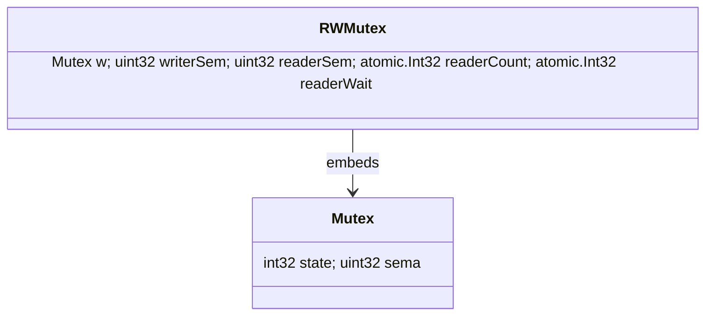
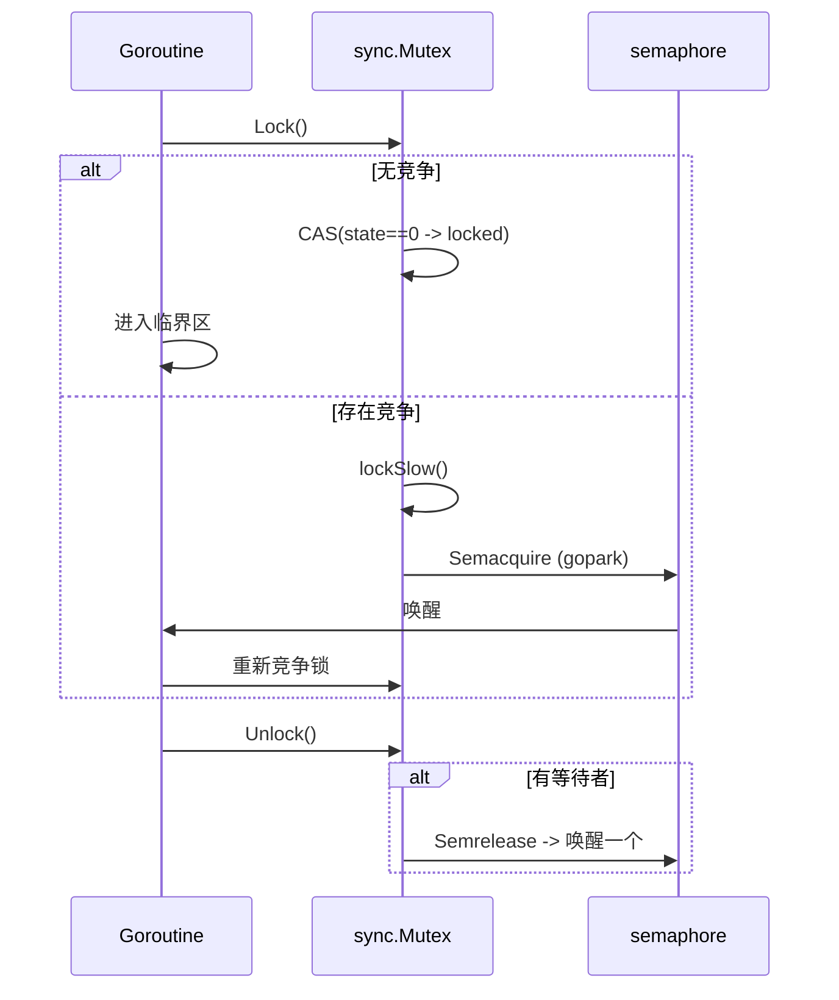
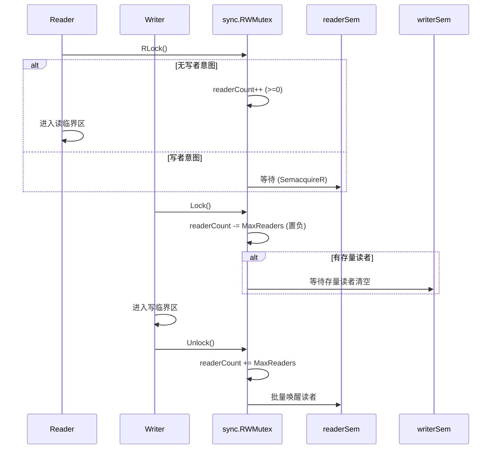

# Go并发原语深度解析：Mutex、RWMutex与sync包核心机制

> 深入剖析Go语言sync包中Mutex和RWMutex的源码实现，从状态位管理到饥饿模式，从写者优先到性能优化，全面解析Go并发原语的设计哲学与工程实践。

---

# 第一部分：sync.Mutex 互斥锁深度解析

## 结构与状态位深度解析

### 基础结构

```go
type Mutex struct {
	state int32  // 低位为标志位，高位为等待者计数
	sema  uint32 // 等待队列使用的信号量句柄
}

const (
	mutexLocked           = 1 << iota // 1：互斥锁已被持有
	mutexWoken                        // 2：已有一个等待者被唤醒（避免重复唤醒）
	mutexStarving                     // 4：进入饥饿模式（handoff）
	mutexWaiterShift      = iota      // 3：等待者计数的偏移（state >> 3 即等待者数）
	starvationThresholdNs = 1e6       // 1ms：饥饿模式阈值
)
```

### 状态位详细分析

**state字段的位布局**：
```
31                           3   2   1   0
+----------------------------+---+---+---+
|     waiter count          |S|W|L|
+----------------------------+---+---+---+
```

- **bit 0 (L)**: `mutexLocked` - 锁定状态
- **bit 1 (W)**: `mutexWoken` - 唤醒状态  
- **bit 2 (S)**: `mutexStarving` - 饥饿模式
- **bit 3-31**: 等待者计数

### 饥饿模式深度解析

**饥饿模式的引入背景**：
在Go 1.9之前，Mutex使用纯粹的FIFO队列，但这导致了严重的性能问题：
- 新来的goroutine可能直接获得锁，而队列中的goroutine继续等待
- 长时间等待的goroutine可能被"饿死"
- 在高竞争场景下，吞吐量下降严重

**饥饿模式的工作机制**：

```go
// 饥饿模式判断逻辑
func (m *Mutex) lockSlow() {
    var waitStartTime int64
    starving := false
    awoke := false
    iter := 0
    old := m.state
    
    for {
        // 正常模式下的自旋条件检查
        if old&(mutexLocked|mutexStarving) == mutexLocked && runtime_canSpin(iter) {
            // 尝试设置woken位，避免不必要的唤醒
            if !awoke && old&mutexWoken == 0 && old>>mutexWaiterShift != 0 &&
                atomic.CompareAndSwapInt32(&m.state, old, old|mutexWoken) {
                awoke = true
            }
            runtime_doSpin() // 执行30次PAUSE指令
            iter++
            old = m.state
            continue
        }
        
        new := old
        // 非饥饿模式才尝试获取锁
        if old&mutexStarving == 0 {
            new |= mutexLocked
        }
        // 增加等待者计数
        if old&(mutexLocked|mutexStarving) != 0 {
            new += 1 << mutexWaiterShift
        }
        
        // 切换到饥饿模式的条件
        if starving && old&mutexLocked != 0 {
            new |= mutexStarving
        }
        
        if awoke {
            if new&mutexWoken == 0 {
                throw("sync: inconsistent mutex state")
            }
            new &^= mutexWoken
        }
        
        if atomic.CompareAndSwapInt32(&m.state, old, new) {
            if old&(mutexLocked|mutexStarving) == 0 {
                break // 获得锁
            }
            
            // 计算等待时间，判断是否进入饥饿模式
            queueLifo := waitStartTime != 0
            if waitStartTime == 0 {
                waitStartTime = runtime_nanotime()
            }
            
            // 在信号量上等待
            runtime_SemacquireMutex(&m.sema, queueLifo, 1)
            
            // 检查是否应该进入饥饿模式
            starving = starving || runtime_nanotime()-waitStartTime > starvationThresholdNs
            old = m.state
            
            if old&mutexStarving != 0 {
                // 饥饿模式下的直接获取锁
                if old&(mutexLocked|mutexWoken) != 0 || old>>mutexWaiterShift == 0 {
                    throw("sync: inconsistent mutex state")
                }
                delta := int32(mutexLocked - 1<<mutexWaiterShift)
                if !starving || old>>mutexWaiterShift == 1 {
                    // 退出饥饿模式
                    delta -= mutexStarving
                }
                atomic.AddInt32(&m.state, delta)
                break
            }
            awoke = true
            iter = 0
        } else {
            old = m.state
        }
    }
}
```

**饥饿模式的特点**：
1. **直接移交**：解锁时直接将锁移交给队列头部的等待者
2. **禁用自旋**：新来的goroutine不能自旋获取锁
3. **FIFO保证**：严格按照等待顺序获取锁
4. **自动退出**：当等待时间小于1ms或队列为空时退出饥饿模式

### 自旋锁机制详解

**自旋条件检查**：

```go
// runtime_canSpin 检查是否可以自旋
func runtime_canSpin(iter int) bool {
    return iter < active_spin &&  // 自旋次数限制（通常是4次）
           runtime.GOMAXPROCS(0) > 1 &&  // 多核系统
           runtime.NumGoroutine() > runtime.GOMAXPROCS(0) && // 有其他goroutine可运行
           !runtime.Gosched() // 当前P的本地队列不为空
}

// runtime_doSpin 执行自旋
func runtime_doSpin() {
    // 执行30次PAUSE指令，让出CPU时间片
    for i := 0; i < 30; i++ {
        runtime.Gosched() // 在某些架构上是PAUSE指令
    }
}
```

**自旋的优势与劣势**：

*优势*：
- 避免goroutine切换开销
- 在短时间持锁场景下性能更好
- 减少系统调用

*劣势*：
- 消耗CPU资源
- 在长时间持锁场景下浪费资源
- 可能影响其他goroutine的调度

## 加锁：快速路径与慢路径

### 快速路径

```go
func (m *Mutex) Lock() {
	if atomic.CompareAndSwapInt32(&m.state, 0, mutexLocked) {
		return // 无竞争，直接获得锁
	}
	m.lockSlow()
}
```

`state==0` 表示无人持有且无等待者，CAS 成功即入锁。

### 慢路径（lockSlow）要点

1. **可自旋则短暂自旋**
   条件（概括）：自旋轮次未超上限、`GOMAXPROCS>1`、本地 P runq 为空、且非饥饿模式。
   自旋时若尚未标记唤醒，尝试置位 `mutexWoken`，声明"我在忙等，勿重复唤醒"。

2. **尝试更新状态**（CAS）

   * 非饥饿：置 `mutexLocked`；
   * 已持有/饥饿：等待者计数 `+1`；
   * 等待超过 `starvationThresholdNs`：置 `mutexStarving`；
   * 若之前置过 `mutexWoken`，此处需要清掉。
     CAS 失败则重读 `state` 循环重试。

3. **两种结果**

   * 旧状态无 `mutexLocked|mutexStarving`：直接拿锁成功；
   * 否则进入 `runtime_SemacquireMutex(&m.sema, queueLifo, 1)` 休眠：

     * `queueLifo := waitStartTime != 0`，第二次及以后优先 LIFO 降低尾延迟；
     * 被唤醒后：若处于饥饿模式，则 handoff 直接获得锁权并调整计数；否则回到循环按常规路径再试。

## 解锁：快速路径与慢路径

### 快速路径

```go
func (m *Mutex) Unlock() {
	new := atomic.AddInt32(&m.state, -mutexLocked) // 清 locked
	if new != 0 {
		m.unlockSlow(new)
	}
}
```

### 慢路径（unlockSlow）

```go
func (m *Mutex) unlockSlow(new int32) {
	if (new+mutexLocked)&mutexLocked == 0 {
		fatal("sync: unlock of unlocked mutex")
	}
	if new&mutexStarving == 0 {
		// 常规模式
		for {
			if new>>mutexWaiterShift == 0 || new&(mutexLocked|mutexWoken|mutexStarving) != 0 {
				return // 无等待者或已有唤醒/持有/饥饿痕迹
			}
			next := (new - 1<<mutexWaiterShift) | mutexWoken
			if atomic.CompareAndSwapInt32(&m.state, new, next) {
				runtime_Semrelease(&m.sema, false, 1) // 唤醒一个等待者参与竞争
				return
			}
            new = m.state
        }
    } else {
        // 饥饿模式：直接 handoff 给队头等待者
        runtime_Semrelease(&m.sema, true, 1)
    }
}
```

* **常规模式**：减少等待者计数并置 `mutexWoken`，唤醒一个等待者参与竞争；
* **饥饿模式**：handoff 给队头等待者，被唤醒者**立即获得锁权**。

---

# 第二部分：sync.RWMutex 读写锁深度解析

## RWMutex 结构与语义深度解析

### 基础结构

```go
type RWMutex struct {
	w           Mutex        // 写锁之间的互斥：任一时刻仅允许一个写者进入写临界区
	writerSem   uint32       // 写者在此信号量上等待"读者全部退出"
	readerSem   uint32       // 读者在此信号量上等待"写者完成"
	readerCount atomic.Int32 // 活跃读者计数；当存在写者意图时会被整体置负以阻断新读者
	readerWait  atomic.Int32 // 写者需要等待的"尚未离开"的读者数
}

const rwmutexMaxReaders = 1 << 30 // 最大读者数量，用于区分正常状态和写者意图状态
```

### 字段详细分析

* **`w`**：写者互斥，确保写临界区的**唯一性**，也用来串行化"写者意图"的处理。
* **`readerCount`**：正常情况下≥0，表示当前活跃读者数量；一旦写者来临，会整体减去一个巨大常量 `rwmutexMaxReaders`（`1<<30`），使其变为**负数**，以此**阻断后续新读者进入**。
* **`readerWait`**：写者在宣告意图（把 `readerCount` 置负）之后，对**当时仍在进行中的读者**计数快照；写者只有等 `readerWait` 递减到 0 才能继续。
* **`writerSem / readerSem`**：配合内核/运行时 sema，用于在"读者应当阻塞"或"写者应当等待"时进行休眠/唤醒。

### 写者优先机制深度解析

**写者优先的设计原理**：

Go的RWMutex采用写者优先策略，这是基于以下考虑：
1. **避免写者饥饿**：在读密集场景下，如果读者优先，写者可能永远无法获得锁
2. **数据一致性**：写操作通常更重要，需要及时执行以保证数据一致性
3. **性能平衡**：虽然可能影响读性能，但避免了更严重的写饥饿问题

**写者优先的实现机制**：

```go
// 写者意图宣告过程
func (rw *RWMutex) Lock() {
    // 1. 获取写者互斥锁，确保只有一个写者
    rw.w.Lock()
    
    // 2. 宣告写者意图：将readerCount置为负数
    // 这里使用原子操作减去rwmutexMaxReaders
    r := rw.readerCount.Add(-rwmutexMaxReaders) + rwmutexMaxReaders
    
    // 3. 如果还有活跃读者，需要等待它们完成
    if r != 0 && rw.readerWait.Add(r) != 0 {
        // 在writerSem上等待，直到所有读者退出
        runtime_SemacquireRWMutex(&rw.writerSem, false, 0)
    }
    // 此时写者获得了独占访问权
}
```

**状态转换图**：

```
正常状态 (readerCount >= 0)
    ↓ 写者到达
写者意图状态 (readerCount < 0)
    ↓ 所有读者退出
写者独占状态
    ↓ 写者释放
正常状态 (恢复 readerCount >= 0)
```

## 读锁路径

```go
func (rw *RWMutex) RLock() {
	if rw.readerCount.Add(1) < 0 {
		// 说明此刻有写者意图：readerCount 已被置负
		runtime_SemacquireRWMutexR(&rw.readerSem, false, 0)
	}
}
```

* 正常路径：`readerCount` 自增后仍 ≥ 0，直接获得读锁。
* 慢路径：若结果 **< 0**，说明有写者已把 `readerCount` 置负（宣告意图并阻断新读者）。此时读者需在 `readerSem` 上休眠，等待写者完成后被唤醒。

```go
func (rw *RWMutex) RUnlock() {
	if r := rw.readerCount.Add(-1); r < 0 {
		rw.rUnlockSlow(r)
	}
}

func (rw *RWMutex) rUnlockSlow(r int32) {
	if r+1 == 0 || r+1 == -rwmutexMaxReaders {
		fatal("sync: RUnlock of unlocked RWMutex")
	}
    // 处于"写者意图"阶段：当前读者属于写者需要等待的存量读者之一
    if rw.readerWait.Add(-1) == 0 {
        // 最后一个存量读者离开，唤醒写者继续
        runtime_Semrelease(&rw.writerSem, false, 1)
    }
}
```

* 正常解锁：`readerCount` 自减后仍 ≥ 0，无额外操作。
* 慢路径：当 `readerCount` 为负时（存在写者意图阶段），该读者属于**存量读者**，它的离开需让 `readerWait` 递减；当 `readerWait` 递减到 0，说明存量读者清空，**唤醒写者**。

## 写锁路径

```go
func (rw *RWMutex) Lock() {
	// 1) 先与其他写者互斥，串行化"写意图"的宣布与执行
	rw.w.Lock()

	// 2) 宣布写意图：把 readerCount 整体置负，阻断后续新读者
	//    r 为"置负之前"的活跃读者数快照
	r := rw.readerCount.Add(-rwmutexMaxReaders) + rwmutexMaxReaders

	// 3) 若存在存量读者（r > 0），写者在 writerSem 上休眠，等待它们退出
	//    readerWait 记录需要等待的存量读者数
    if r != 0 && rw.readerWait.Add(r) != 0 {
        runtime_SemacquireRWMutex(&rw.writerSem, false, 0)
    }
}
```

## 写锁释放

```go
func (rw *RWMutex) Unlock() {
	// 1) 撤销写意图：恢复 readerCount 到非负域
	r := rw.readerCount.Add(rwmutexMaxReaders)

	// 2) 唤醒因写者而阻塞的读者：有多少就放多少
	for i := 0; i < int(r); i++ {
		runtime_Semrelease(&rw.readerSem, false, 0)
	}

	// 3) 最后释放写者互斥
    rw.w.Unlock()
}
```

---

# 第三部分：性能优化与工程实践

## 性能优化策略

**的优化建议**：

```go
// 1. 减少锁的持有时间
func optimizedCriticalSection() {
    mu.Lock()
    // 只在临界区内执行必要操作
    criticalOperation()
    mu.Unlock()
    
    // 非临界操作移到锁外
    nonCriticalOperation()
}

// 2. 使用读写锁替代互斥锁（读多写少场景）
var rwmu sync.RWMutex
func readOperation() {
    rwmu.RLock()
    defer rwmu.RUnlock()
    // 读操作
}

// 3. 分片锁减少竞争
type ShardedMap struct {
    shards []struct {
        mu sync.Mutex
        m  map[string]interface{}
    }
}

func (sm *ShardedMap) Get(key string) interface{} {
    shard := &sm.shards[hash(key)%len(sm.shards)]
    shard.mu.Lock()
    defer shard.mu.Unlock()
    return shard.m[key]
}
```

### 读写锁的性能特征与优化

**适用场景**：

```go
// 1. 读多写少的缓存系统
type Cache struct {
    mu   sync.RWMutex
    data map[string]interface{}
}

func (c *Cache) Get(key string) interface{} {
    c.mu.RLock()
    defer c.mu.RUnlock()
    return c.data[key]
}

func (c *Cache) Set(key string, value interface{}) {
    c.mu.Lock()
    defer c.mu.Unlock()
    c.data[key] = value
}

// 2. 配置管理系统
type Config struct {
    mu     sync.RWMutex
    values map[string]string
}

func (c *Config) GetValue(key string) string {
    c.mu.RLock()
    defer c.mu.RUnlock()
    return c.values[key]
}

func (c *Config) UpdateValue(key, value string) {
    c.mu.Lock()
    defer c.mu.Unlock()
    c.values[key] = value
}
```

**性能优化策略**：

```go
// 1. 减少写锁持有时间
func (c *Cache) BatchUpdate(updates map[string]interface{}) {
    // 在锁外准备数据
    newData := make(map[string]interface{})
    for k, v := range updates {
        newData[k] = processValue(v) // 耗时操作在锁外进行
    }
    
    // 快速更新
    c.mu.Lock()
    for k, v := range newData {
        c.data[k] = v
    }
    c.mu.Unlock()
}

// 2. 使用原子操作替代读锁（适用于简单类型）
type AtomicCounter struct {
    value int64
}

func (c *AtomicCounter) Get() int64 {
    return atomic.LoadInt64(&c.value) // 比RLock更快
}

func (c *AtomicCounter) Set(v int64) {
    atomic.StoreInt64(&c.value, v)
}

// 3. 分片减少锁竞争
type ShardedRWMap struct {
    shards []struct {
        mu   sync.RWMutex
        data map[string]interface{}
    }
}

func (m *ShardedRWMap) Get(key string) interface{} {
    shard := &m.shards[hash(key)%len(m.shards)]
    shard.mu.RLock()
    defer shard.mu.RUnlock()
    return shard.data[key]
}
```

## 语义与工程约束

* **零值可用**：`var mu sync.Mutex` 和 `var rwmu sync.RWMutex` 直接用。
* **不可复制**：一旦开始使用，不得复制包含锁的对象（值语义放入 map/切片覆盖等）。
* **非可重入**：同一 goroutine 持锁情况下再次 `Lock()` 会自锁阻塞。
* **内存语义**：`Unlock` 为 release，`Lock` 为 acquire，二者建立 happens-before。

## 实战经验与优化要点

1. **成对使用，避免跨 goroutine 解锁**：用 channel 传递资源而非"转移锁"。
2. **缩短临界区**：避免在临界区内做阻塞 I/O/长计算；只读路径用 `atomic` 降低加锁频率。
3. **结构性降争用**：热点场景下采用分段锁/分片（per-shard `Mutex`），或改为 `RWMutex`/无锁结构。
4. **自旋需"有希望"**：高争用长等待时尽快休眠，让出 CPU，提升吞吐与公平性。
5. **饥饿模式权衡**：降低尾延迟但可能牺牲吞吐；通过压测在 TP99 与 QPS 间选择。
6. **defer 与性能**：一般优先可读性与安全；极热路径可手写 `Unlock`，确保所有分支释放。
7. **锁顺序**：多锁时固定获取顺序，避免死锁；必要时抽象事务接口统一管理。
8. **TryLock（若版本支持）**：低延迟场景可用来做退避或丢弃过期请求，减少排队尾延迟。
9. **画像与监控**：`runtime.SetMutexProfileFraction` + `pprof`/`go test -mutexprofile`，定位长尾与热点。
10. **避免值拷贝**：包含锁的结构体以指针语义传递，防止隐式复制破坏状态。
11. **竞态检测**：开启 `-race` 校验锁粒度与共享访问是否正确。

## 常见误区澄清

* **"记录持有者可避免误用"**：可封装调试版 `OwnerMutex` 做持有者校验，但会引入检查开销；标准库取舍为最小热路径成本。
* **"严格 FIFO 队列"**：常规模式并非严格 FIFO，存在自旋与 `mutexWoken` 的调度优化；饥饿模式下接近队头优先（handoff）。
* **"读写锁总是更快"**：在写操作频繁或读操作很短的场景下，RWMutex可能不如Mutex；需要根据实际场景测试。

## 使用建议与常见坑

### Mutex使用建议
1. **缩短临界区**：只在必要时持锁
2. **避免死锁**：固定锁的获取顺序
3. **配对使用**：确保每个Lock()都有对应的Unlock()
4. **避免重入**：同一goroutine不要重复获取同一个锁

### RWMutex使用建议
1. **读多写少**场景最优
2. 避免 **读锁内再申请写锁**
3. 保持 **临界区小**
4. **写优先，不是读优先**
5. 无 `TryLock`
6. 热点场景可用 **分段锁 / atomic.Value**

## 时序举例

### Mutex饥饿模式时序
```
t0: G1获得锁，G2开始等待
t1: G3到达，开始自旋
t2: G1释放锁，G3通过自旋获得锁
t3: G2等待1ms，进入饥饿模式
t4: G3释放锁，直接handoff给G2（饥饿模式）
```

### RWMutex写者优先时序
```
t0: 5个读者活跃
t1: 写者到达，阻断新读者，快照r=5
t2-t6: 存量读者逐个退出
t7: 最后一个读者退出，唤醒写者
t8: 写者完成，恢复计数，唤醒新读者，再释放w
```

---

## 小结

* **sync.Mutex** 以**自旋 + 等待队列 + 饥饿模式**在吞吐与公平间折中；位运算维护 `locked/woken/starving + waiters` 四元状态，快速路径极轻。

* **sync.RWMutex** 采用**写者优先**策略，通过 `readerCount` 置负 + 存量清空实现；写释放时先批量唤醒读者再解锁，提供了读并发的性能优势。

* **工程实践**聚焦：**缩短临界区、固定锁序、避免跨 goroutine 解锁、画像定位热点并结构化降争用**。

* **场景选择**：读多写少用RWMutex，高竞争短临界区用Mutex，超高性能场景考虑atomic或无锁结构。

---


## 附录：关键函数与调用链合并、结构体图与时序索引

### 1) 关键函数与简要说明

```go
// Mutex 快速/慢路径
func (m *Mutex) Lock() { /* CAS -> lockSlow */ }
func (m *Mutex) Unlock() { /* Add -> unlockSlow */ }

// RWMutex 写者优先
func (rw *RWMutex) Lock() { /* 置负 readerCount; 等待读者退出 */ }
func (rw *RWMutex) Unlock() { /* 恢复 readerCount; 唤醒读者 */ }
func (rw *RWMutex) RLock() { /* readerCount++; 若<0则等待 */ }
func (rw *RWMutex) RUnlock() { /* readerCount--; 写者等待路径 */ }
```

- 目标：在高并发下保证互斥或读写隔离；写者到达时阻断新读者，避免写饥饿。

### 2) 标准调用链

- Mutex
  - 加锁：`Lock -> lockSlow? -> runtime_SemacquireMutex -> gopark`
  - 解锁：`Unlock -> unlockSlow? -> runtime_Semrelease -> goready`
- RWMutex
  - 读：`RLock -> readerCount.Add(1) [<0 -> SemacquireR]`
  - 写：`Lock -> readerCount.Add(-rwmutexMaxReaders) -> writerSem 等待`

### 3) 结构体类图（组合/嵌入）




### 4) 关键函数时序图




