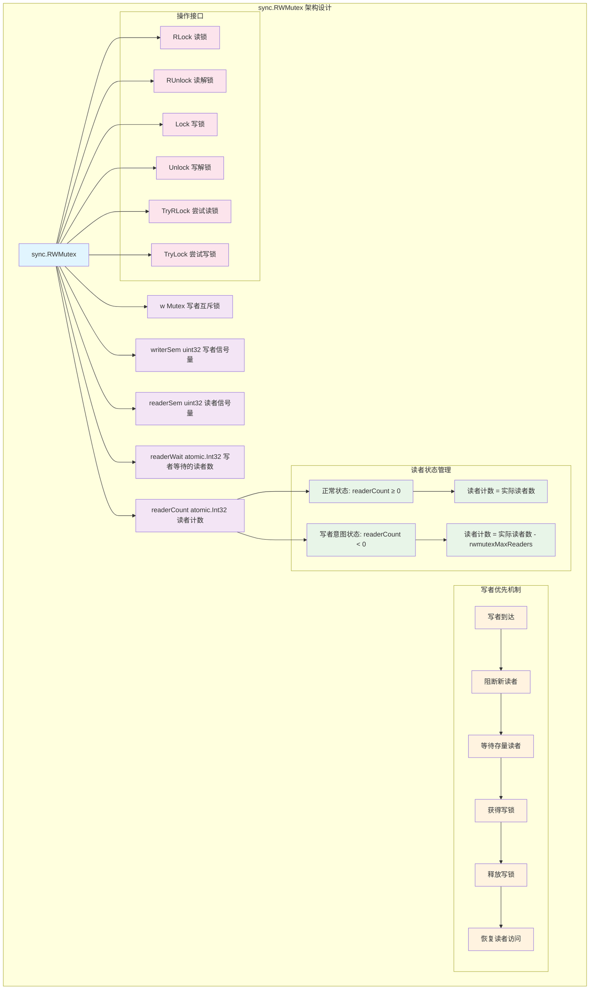
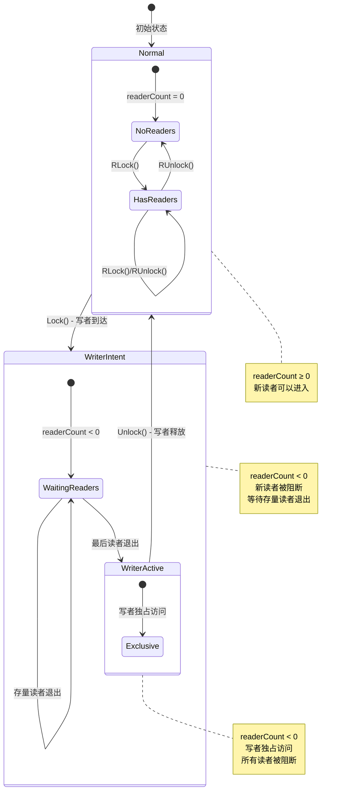
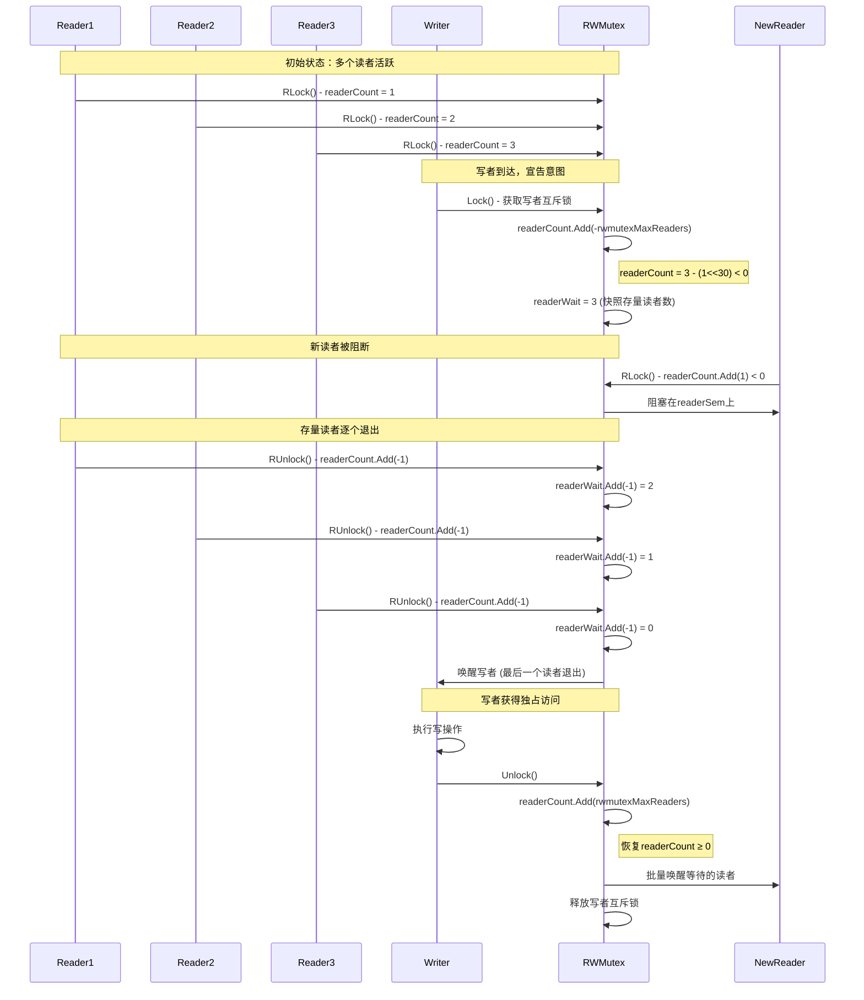
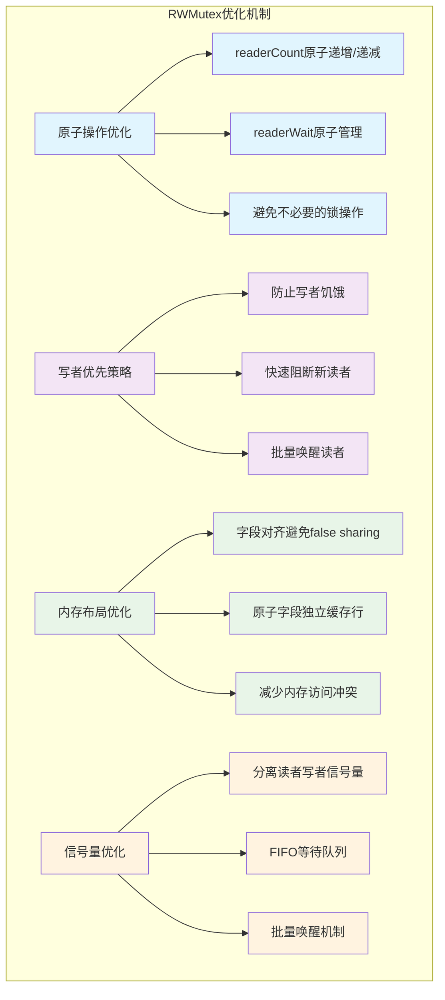

# Go sync.RWMutex深度解析：读写锁的写者优先机制与性能优化

## 概述

`sync.RWMutex`是Go语言提供的读写锁，它允许多个读者同时访问共享资源，但写者需要独占访问。RWMutex采用写者优先策略，在读多写少的场景下能显著提升性能。本文将深入分析RWMutex的实现机制、写者优先策略以及性能优化技巧。

## 1. RWMutex架构设计

### 1.1 整体架构图



**架构设计说明**：

1. **多字段协作**：使用多个原子字段协同工作，实现复杂的读写控制逻辑
2. **写者优先**：通过readerCount的正负值变化实现写者优先机制
3. **信号量管理**：使用两个独立的信号量分别管理读者和写者的等待队列
4. **状态转换**：通过原子操作实现状态的安全转换

### 1.2 核心数据结构

```go
// RWMutex 读写互斥锁
// 提供读者共享、写者独占的访问控制机制
// 采用写者优先策略，防止写者饥饿
type RWMutex struct {
    // w 写者之间的互斥锁
    // 确保同一时刻只有一个写者能够进入写临界区
    // 也用于串行化写者意图的宣告和处理
    w           Mutex
    
    // writerSem 写者等待的信号量
    // 当有活跃读者时，写者在此信号量上等待
    // 最后一个读者退出时会唤醒等待的写者
    writerSem   uint32
    
    // readerSem 读者等待的信号量  
    // 当有写者意图时，新来的读者在此信号量上等待
    // 写者完成后会批量唤醒等待的读者
    readerSem   uint32
    
    // readerCount 活跃读者计数（原子操作）
    // 正常情况下：≥ 0，表示当前活跃读者数量
    // 写者意图时：< 0，表示 (实际读者数 - rwmutexMaxReaders)
    // 通过正负值的变化实现写者优先机制
    readerCount atomic.Int32
    
    // readerWait 写者需要等待的读者数量（原子操作）
    // 当写者宣告意图时，记录当时的活跃读者数量
    // 每个存量读者退出时会递减此值
    // 当此值变为0时，唤醒等待的写者
    readerWait  atomic.Int32
}

// 常量定义
const (
    // rwmutexMaxReaders 最大读者数量：1 << 30
    // 用于区分正常状态和写者意图状态
    // 写者意图时，readerCount会减去这个值变为负数
    rwmutexMaxReaders = 1 << 30
)
```

### 1.3 状态转换图



## 2. 核心API详细分析

### 2.1 RLock() 读锁实现

```go
// RLock 获取读锁
// 允许多个读者同时持有读锁，但会被写者阻断
// 
// 实现策略：
// 1. 原子递增readerCount
// 2. 如果结果为负数，说明有写者意图，需要等待
// 3. 否则直接获得读锁
func (rw *RWMutex) RLock() {
    // 竞态检测支持
    if race.Enabled {
        _ = rw.w.state
        race.Disable()
    }
    
    // 原子递增读者计数
    // 如果返回值 < 0，说明有写者已经宣告意图（readerCount被置为负数）
    if rw.readerCount.Add(1) < 0 {
        // 有写者意图，当前读者需要在readerSem上等待
        // 写者完成后会批量唤醒所有等待的读者
        runtime_SemacquireRWMutexR(&rw.readerSem, false, 0)
    }
    
    // 竞态检测支持
    if race.Enabled {
        race.Enable()
        race.Acquire(unsafe.Pointer(&rw.readerSem))
    }
}

// TryRLock 尝试获取读锁，不阻塞
// 返回是否成功获取读锁
func (rw *RWMutex) TryRLock() bool {
    // 竞态检测支持
    if race.Enabled {
        _ = rw.w.state
        race.Disable()
    }
    
    for {
        c := rw.readerCount.Load()
        
        // 如果有写者意图（c < 0），直接返回失败
        if c < 0 {
            if race.Enabled {
                race.Enable()
            }
            return false
        }
        
        // 尝试原子递增读者计数
        if rw.readerCount.CompareAndSwap(c, c+1) {
            if race.Enabled {
                race.Enable()
                race.Acquire(unsafe.Pointer(&rw.readerSem))
            }
            return true
        }
        
        // CAS失败，重试
    }
}
```

### 2.2 RUnlock() 读解锁实现

```go
// RUnlock 释放读锁
// 如果当前没有持有读锁，这是一个运行时错误
func (rw *RWMutex) RUnlock() {
    // 竞态检测支持
    if race.Enabled {
        _ = rw.w.state
        race.ReleaseMerge(unsafe.Pointer(&rw.readerSem))
        race.Disable()
    }
    
    // 原子递减读者计数
    // 如果返回值 < 0，说明处于写者意图阶段，需要特殊处理
    if r := rw.readerCount.Add(-1); r < 0 {
        // 慢路径：处于写者意图阶段的读者退出
        rw.rUnlockSlow(r)
    }
    
    // 竞态检测支持
    if race.Enabled {
        race.Enable()
    }
}

// rUnlockSlow 处理写者意图阶段的读者退出
// 当前读者属于写者需要等待的存量读者之一
func (rw *RWMutex) rUnlockSlow(r int32) {
    // 错误检查：确保不是对未锁定的RWMutex调用RUnlock
    if r+1 == 0 || r+1 == -rwmutexMaxReaders {
        race.Enable()
        fatal("sync: RUnlock of unlocked RWMutex")
    }
    
    // 递减写者等待的读者计数
    // 如果这是最后一个存量读者（readerWait变为0），唤醒写者
    if rw.readerWait.Add(-1) == 0 {
        // 最后一个存量读者退出，唤醒等待的写者
        runtime_Semrelease(&rw.writerSem, false, 1)
    }
}
```

### 2.3 Lock() 写锁实现

```go
// Lock 获取写锁
// 写锁是独占的，与所有读锁和其他写锁互斥
// 采用写者优先策略，会阻断新的读者
func (rw *RWMutex) Lock() {
    // 竞态检测支持
    if race.Enabled {
        _ = rw.w.state
        race.Disable()
    }
    
    // 第一步：获取写者互斥锁，确保写者之间的互斥
    // 这也串行化了写者意图的宣告过程
    rw.w.Lock()
    
    // 第二步：宣告写者意图，阻断新读者
    // 将readerCount减去rwmutexMaxReaders，使其变为负数
    // r保存的是减法操作前的读者数量（即当前活跃的读者数）
    r := rw.readerCount.Add(-rwmutexMaxReaders) + rwmutexMaxReaders
    
    // 第三步：等待存量读者退出
    // 如果有活跃读者（r > 0），需要等待它们全部退出
    if r != 0 && rw.readerWait.Add(r) != 0 {
        // 在writerSem上等待，直到所有存量读者退出
        runtime_SemacquireRWMutex(&rw.writerSem, false, 0)
    }
    
    // 竞态检测支持
    if race.Enabled {
        race.Enable()
        race.Acquire(unsafe.Pointer(&rw.readerSem))
        race.Acquire(unsafe.Pointer(&rw.writerSem))
    }
}

// TryLock 尝试获取写锁，不阻塞
// 返回是否成功获取写锁
func (rw *RWMutex) TryLock() bool {
    // 竞态检测支持
    if race.Enabled {
        _ = rw.w.state
        race.Disable()
    }
    
    // 尝试获取写者互斥锁
    if !rw.w.TryLock() {
        if race.Enabled {
            race.Enable()
        }
        return false
    }
    
    // 检查是否有活跃读者
    if !rw.readerCount.CompareAndSwap(0, -rwmutexMaxReaders) {
        // 有活跃读者，释放写者互斥锁并返回失败
        rw.w.Unlock()
        if race.Enabled {
            race.Enable()
        }
        return false
    }
    
    // 成功获取写锁
    if race.Enabled {
        race.Enable()
        race.Acquire(unsafe.Pointer(&rw.readerSem))
        race.Acquire(unsafe.Pointer(&rw.writerSem))
    }
    return true
}
```

### 2.4 Unlock() 写解锁实现

```go
// Unlock 释放写锁
// 如果m在进入Unlock时未被写锁定，这是一个运行时错误
func (rw *RWMutex) Unlock() {
    // 竞态检测支持
    if race.Enabled {
        _ = rw.w.state
        race.Release(unsafe.Pointer(&rw.readerSem))
        race.Disable()
    }
    
    // 第一步：撤销写者意图，恢复readerCount到正数域
    // 加上rwmutexMaxReaders，使readerCount恢复为实际读者数
    // r是恢复后的读者数量，也是需要唤醒的等待读者数量
    r := rw.readerCount.Add(rwmutexMaxReaders)
    
    // 错误检查：确保不是对未锁定的RWMutex调用Unlock
    if r >= rwmutexMaxReaders {
        race.Enable()
        fatal("sync: Unlock of unlocked RWMutex")
    }
    
    // 第二步：批量唤醒所有等待的读者
    // r表示在写者意图期间被阻断的读者数量
    for i := 0; i < int(r); i++ {
        runtime_Semrelease(&rw.readerSem, false, 0)
    }
    
    // 第三步：释放写者互斥锁，允许其他写者竞争
    rw.w.Unlock()
    
    // 竞态检测支持
    if race.Enabled {
        race.Enable()
    }
}
```

## 3. 写者优先机制深度分析

### 3.1 写者优先实现原理



### 3.2 状态变化详细分析

```go
// 写者优先机制的核心实现逻辑
func writerPriorityMechanism() {
    // 阶段1：正常状态 - 读者自由进入
    // readerCount ≥ 0，表示当前活跃读者数量
    normalState := func() {
        // 读者加锁：readerCount++
        // 读者解锁：readerCount--
        // 新读者可以随时进入
    }
    
    // 阶段2：写者意图宣告 - 阻断新读者
    writerIntentDeclaration := func() {
        // 1. 获取写者互斥锁 w.Lock()
        // 2. 宣告写者意图：readerCount -= rwmutexMaxReaders
        //    这使得 readerCount < 0，新读者会被阻断
        // 3. 快照存量读者：readerWait = 当前读者数
    }
    
    // 阶段3：等待存量读者退出
    waitingExistingReaders := func() {
        // 存量读者调用RUnlock()时：
        // 1. readerCount-- (仍然 < 0)
        // 2. readerWait-- 
        // 3. 如果readerWait == 0，唤醒写者
    }
    
    // 阶段4：写者独占访问
    writerExclusiveAccess := func() {
        // readerCount < 0，所有读者被阻断
        // 写者执行独占操作
    }
    
    // 阶段5：写者释放，恢复读者访问
    writerRelease := func() {
        // 1. 恢复读者计数：readerCount += rwmutexMaxReaders
        // 2. 批量唤醒等待的读者
        // 3. 释放写者互斥锁
    }
}
```

### 3.3 关键优化点分析



## 4. 性能特征与调用链路

### 4.1 完整调用链路图

```mermaid
graph TB
    subgraph "RWMutex.RLock() 调用链路"
        A[RWMutex.RLock] --> B[readerCount.Add(1)]
        B --> C{结果 < 0?}
        C -->|否| D[获得读锁 - 返回]
        C -->|是| E[runtime_SemacquireRWMutexR]
        E --> F[gopark - 阻塞等待]
        F --> G[被写者唤醒]
        G --> D
    end
    
    subgraph "RWMutex.RUnlock() 调用链路"
        H[RWMutex.RUnlock] --> I[readerCount.Add(-1)]
        I --> J{结果 < 0?}
        J -->|否| K[正常释放 - 返回]
        J -->|是| L[rUnlockSlow]
        L --> M[readerWait.Add(-1)]
        M --> N{readerWait == 0?}
        N -->|否| K
        N -->|是| O[runtime_Semrelease 唤醒写者]
        O --> K
    end
    
    subgraph "RWMutex.Lock() 调用链路"
        P[RWMutex.Lock] --> Q[w.Lock 写者互斥]
        Q --> R[readerCount.Add(-rwmutexMaxReaders)]
        R --> S{有活跃读者?}
        S -->|否| T[获得写锁 - 返回]
        S -->|是| U[readerWait.Add(r)]
        U --> V[runtime_SemacquireRWMutex]
        V --> W[gopark - 等待读者退出]
        W --> X[被最后读者唤醒]
        X --> T
    end
    
    subgraph "RWMutex.Unlock() 调用链路"
        Y[RWMutex.Unlock] --> Z[readerCount.Add(rwmutexMaxReaders)]
        Z --> AA[批量唤醒等待读者]
        AA --> BB[循环调用runtime_Semrelease]
        BB --> CC[w.Unlock 释放写者互斥]
        CC --> DD[返回]
    end
    
    classDef entry fill:#e1f5fe
    classDef atomic fill:#e8f5e8
    classDef condition fill:#fff3e0
    classDef runtime fill:#f3e5f5
    classDef result fill:#fce4ec
    
    class A,H,P,Y entry
    class B,I,R,Z atomic
    class C,J,S,N condition
    class E,F,G,O,V,W,X,BB runtime
    class D,K,T,DD result
```

### 4.2 性能基准测试

```go
// RWMutex性能测试用例
func benchmarkRWMutexPerformance() {
    // 测试场景定义
    scenarios := []struct {
        name         string
        readers      int     // 读者数量
        writers      int     // 写者数量
        readOps      int     // 每个读者的操作数
        writeOps     int     // 每个写者的操作数
        readDuration time.Duration // 读操作持续时间
        writeDuration time.Duration // 写操作持续时间
    }{
        {"read-heavy", 100, 1, 1000, 100, 0, 1 * time.Millisecond},
        {"write-heavy", 10, 10, 100, 100, 0, 1 * time.Millisecond},
        {"balanced", 50, 5, 500, 50, 0, 1 * time.Millisecond},
        {"long-read", 20, 2, 100, 10, 10 * time.Millisecond, 1 * time.Millisecond},
    }
    
    for _, scenario := range scenarios {
        fmt.Printf("Testing %s scenario\n", scenario.name)
        
        var rwmu sync.RWMutex
        var data int64
        var wg sync.WaitGroup
        
        start := time.Now()
        
        // 启动读者
        for i := 0; i < scenario.readers; i++ {
            wg.Add(1)
            go func() {
                defer wg.Done()
                
                for j := 0; j < scenario.readOps; j++ {
                    rwmu.RLock()
                    _ = atomic.LoadInt64(&data) // 模拟读操作
                    if scenario.readDuration > 0 {
                        time.Sleep(scenario.readDuration)
                    }
                    rwmu.RUnlock()
                }
            }()
        }
        
        // 启动写者
        for i := 0; i < scenario.writers; i++ {
            wg.Add(1)
            go func() {
                defer wg.Done()
                
                for j := 0; j < scenario.writeOps; j++ {
                    rwmu.Lock()
                    atomic.AddInt64(&data, 1) // 模拟写操作
                    if scenario.writeDuration > 0 {
                        time.Sleep(scenario.writeDuration)
                    }
                    rwmu.Unlock()
                }
            }()
        }
        
        wg.Wait()
        duration := time.Since(start)
        
        totalReadOps := scenario.readers * scenario.readOps
        totalWriteOps := scenario.writers * scenario.writeOps
        totalOps := totalReadOps + totalWriteOps
        
        fmt.Printf("  Duration: %v\n", duration)
        fmt.Printf("  Total Ops: %d (R:%d, W:%d)\n", totalOps, totalReadOps, totalWriteOps)
        fmt.Printf("  Ops/sec: %.0f\n", float64(totalOps)/duration.Seconds())
        fmt.Printf("  Final data: %d\n\n", data)
    }
}
```

### 4.3 与Mutex性能对比

```go
// RWMutex vs Mutex 性能对比
func compareRWMutexVsMutex() {
    readRatios := []float64{0.5, 0.7, 0.9, 0.95, 0.99} // 读操作比例
    
    for _, readRatio := range readRatios {
        fmt.Printf("Read ratio: %.0f%%\n", readRatio*100)
        
        // 测试RWMutex
        rwmutexTime := benchmarkWithRWMutex(readRatio)
        
        // 测试Mutex
        mutexTime := benchmarkWithMutex(readRatio)
        
        speedup := float64(mutexTime) / float64(rwmutexTime)
        fmt.Printf("  RWMutex: %v\n", rwmutexTime)
        fmt.Printf("  Mutex:   %v\n", mutexTime)
        fmt.Printf("  Speedup: %.2fx\n\n", speedup)
    }
}

func benchmarkWithRWMutex(readRatio float64) time.Duration {
    var rwmu sync.RWMutex
    var data int64
    var wg sync.WaitGroup
    
    const totalOps = 100000
    readOps := int(float64(totalOps) * readRatio)
    writeOps := totalOps - readOps
    
    start := time.Now()
    
    // 读操作
    for i := 0; i < readOps; i++ {
        wg.Add(1)
        go func() {
            defer wg.Done()
            rwmu.RLock()
            _ = atomic.LoadInt64(&data)
            rwmu.RUnlock()
        }()
    }
    
    // 写操作
    for i := 0; i < writeOps; i++ {
        wg.Add(1)
        go func() {
            defer wg.Done()
            rwmu.Lock()
            atomic.AddInt64(&data, 1)
            rwmu.Unlock()
        }()
    }
    
    wg.Wait()
    return time.Since(start)
}

func benchmarkWithMutex(readRatio float64) time.Duration {
    var mu sync.Mutex
    var data int64
    var wg sync.WaitGroup
    
    const totalOps = 100000
    readOps := int(float64(totalOps) * readRatio)
    writeOps := totalOps - readOps
    
    start := time.Now()
    
    // 读操作（使用Mutex）
    for i := 0; i < readOps; i++ {
        wg.Add(1)
        go func() {
            defer wg.Done()
            mu.Lock()
            _ = atomic.LoadInt64(&data)
            mu.Unlock()
        }()
    }
    
    // 写操作
    for i := 0; i < writeOps; i++ {
        wg.Add(1)
        go func() {
            defer wg.Done()
            mu.Lock()
            atomic.AddInt64(&data, 1)
            mu.Unlock()
        }()
    }
    
    wg.Wait()
    return time.Since(start)
}
```

## 5. 实战案例与最佳实践

### 5.1 缓存系统实现

```go
// 高性能缓存系统实现
type Cache struct {
    mu    sync.RWMutex
    data  map[string]*CacheItem
    stats CacheStats
}

type CacheItem struct {
    Value      interface{}
    ExpireTime time.Time
    AccessTime int64 // 使用原子操作更新
    HitCount   int64 // 使用原子操作更新
}

type CacheStats struct {
    Hits        int64
    Misses      int64
    Evictions   int64
    TotalItems  int64
}

// NewCache 创建新的缓存实例
func NewCache() *Cache {
    return &Cache{
        data: make(map[string]*CacheItem),
    }
}

// Get 获取缓存项（读操作，使用读锁）
func (c *Cache) Get(key string) (interface{}, bool) {
    c.mu.RLock()
    item, exists := c.data[key]
    
    if !exists {
        c.mu.RUnlock()
        atomic.AddInt64(&c.stats.Misses, 1)
        return nil, false
    }
    
    // 检查是否过期
    if time.Now().After(item.ExpireTime) {
        c.mu.RUnlock()
        
        // 需要删除过期项，升级到写锁
        c.mu.Lock()
        // 双重检查，防止在锁升级期间被其他goroutine删除
        if item, exists := c.data[key]; exists && time.Now().After(item.ExpireTime) {
            delete(c.data, key)
            atomic.AddInt64(&c.stats.Evictions, 1)
            atomic.AddInt64(&c.stats.TotalItems, -1)
        }
        c.mu.Unlock()
        
        atomic.AddInt64(&c.stats.Misses, 1)
        return nil, false
    }
    
    value := item.Value
    c.mu.RUnlock()
    
    // 在锁外更新统计信息，减少锁持有时间
    atomic.StoreInt64(&item.AccessTime, time.Now().UnixNano())
    atomic.AddInt64(&item.HitCount, 1)
    atomic.AddInt64(&c.stats.Hits, 1)
    
    return value, true
}

// Set 设置缓存项（写操作，使用写锁）
func (c *Cache) Set(key string, value interface{}, ttl time.Duration) {
    item := &CacheItem{
        Value:      value,
        ExpireTime: time.Now().Add(ttl),
        AccessTime: time.Now().UnixNano(),
        HitCount:   0,
    }
    
    c.mu.Lock()
    defer c.mu.Unlock()
    
    // 检查是否是新增项
    if _, exists := c.data[key]; !exists {
        atomic.AddInt64(&c.stats.TotalItems, 1)
    }
    
    c.data[key] = item
}

// Delete 删除缓存项（写操作，使用写锁）
func (c *Cache) Delete(key string) bool {
    c.mu.Lock()
    defer c.mu.Unlock()
    
    if _, exists := c.data[key]; exists {
        delete(c.data, key)
        atomic.AddInt64(&c.stats.TotalItems, -1)
        return true
    }
    
    return false
}

// GetStats 获取缓存统计信息（读操作，使用读锁）
func (c *Cache) GetStats() CacheStats {
    return CacheStats{
        Hits:       atomic.LoadInt64(&c.stats.Hits),
        Misses:     atomic.LoadInt64(&c.stats.Misses),
        Evictions:  atomic.LoadInt64(&c.stats.Evictions),
        TotalItems: atomic.LoadInt64(&c.stats.TotalItems),
    }
}

// Cleanup 清理过期项（写操作，使用写锁）
func (c *Cache) Cleanup() int {
    c.mu.Lock()
    defer c.mu.Unlock()
    
    now := time.Now()
    expired := 0
    
    for key, item := range c.data {
        if now.After(item.ExpireTime) {
            delete(c.data, key)
            expired++
        }
    }
    
    atomic.AddInt64(&c.stats.Evictions, int64(expired))
    atomic.AddInt64(&c.stats.TotalItems, -int64(expired))
    
    return expired
}

// Keys 获取所有键（读操作，使用读锁）
func (c *Cache) Keys() []string {
    c.mu.RLock()
    defer c.mu.RUnlock()
    
    keys := make([]string, 0, len(c.data))
    for key := range c.data {
        keys = append(keys, key)
    }
    
    return keys
}
```

### 5.2 配置管理系统

```go
// 配置管理系统，支持热更新
type ConfigManager struct {
    mu     sync.RWMutex
    config map[string]interface{}
    
    // 配置变更通知
    subscribers []chan ConfigChange
    subsMu      sync.Mutex
}

type ConfigChange struct {
    Key      string
    OldValue interface{}
    NewValue interface{}
    Action   string // "set", "delete"
}

// NewConfigManager 创建配置管理器
func NewConfigManager() *ConfigManager {
    return &ConfigManager{
        config:      make(map[string]interface{}),
        subscribers: make([]chan ConfigChange, 0),
    }
}

// Get 获取配置值（高频读操作）
func (cm *ConfigManager) Get(key string) (interface{}, bool) {
    cm.mu.RLock()
    defer cm.mu.RUnlock()
    
    value, exists := cm.config[key]
    return value, exists
}

// GetString 获取字符串配置
func (cm *ConfigManager) GetString(key string, defaultValue string) string {
    if value, exists := cm.Get(key); exists {
        if str, ok := value.(string); ok {
            return str
        }
    }
    return defaultValue
}

// GetInt 获取整数配置
func (cm *ConfigManager) GetInt(key string, defaultValue int) int {
    if value, exists := cm.Get(key); exists {
        if i, ok := value.(int); ok {
            return i
        }
    }
    return defaultValue
}

// GetBool 获取布尔配置
func (cm *ConfigManager) GetBool(key string, defaultValue bool) bool {
    if value, exists := cm.Get(key); exists {
        if b, ok := value.(bool); ok {
            return b
        }
    }
    return defaultValue
}

// Set 设置配置值（低频写操作）
func (cm *ConfigManager) Set(key string, value interface{}) {
    cm.mu.Lock()
    oldValue, existed := cm.config[key]
    cm.config[key] = value
    cm.mu.Unlock()
    
    // 通知配置变更（在锁外进行，避免阻塞）
    change := ConfigChange{
        Key:      key,
        OldValue: oldValue,
        NewValue: value,
        Action:   "set",
    }
    
    if existed {
        cm.notifySubscribers(change)
    }
}

// Delete 删除配置项
func (cm *ConfigManager) Delete(key string) bool {
    cm.mu.Lock()
    oldValue, existed := cm.config[key]
    if existed {
        delete(cm.config, key)
    }
    cm.mu.Unlock()
    
    if existed {
        change := ConfigChange{
            Key:      key,
            OldValue: oldValue,
            NewValue: nil,
            Action:   "delete",
        }
        cm.notifySubscribers(change)
    }
    
    return existed
}

// GetAll 获取所有配置（返回副本）
func (cm *ConfigManager) GetAll() map[string]interface{} {
    cm.mu.RLock()
    defer cm.mu.RUnlock()
    
    // 创建副本，避免外部修改
    result := make(map[string]interface{}, len(cm.config))
    for k, v := range cm.config {
        result[k] = v
    }
    
    return result
}

// LoadFromFile 从文件加载配置
func (cm *ConfigManager) LoadFromFile(filename string) error {
    data, err := ioutil.ReadFile(filename)
    if err != nil {
        return err
    }
    
    var config map[string]interface{}
    if err := json.Unmarshal(data, &config); err != nil {
        return err
    }
    
    cm.mu.Lock()
    defer cm.mu.Unlock()
    
    // 批量更新配置
    for key, value := range config {
        cm.config[key] = value
    }
    
    return nil
}

// Subscribe 订阅配置变更通知
func (cm *ConfigManager) Subscribe() <-chan ConfigChange {
    ch := make(chan ConfigChange, 100) // 缓冲通道，避免阻塞
    
    cm.subsMu.Lock()
    cm.subscribers = append(cm.subscribers, ch)
    cm.subsMu.Unlock()
    
    return ch
}

// notifySubscribers 通知所有订阅者
func (cm *ConfigManager) notifySubscribers(change ConfigChange) {
    cm.subsMu.Lock()
    subscribers := make([]chan ConfigChange, len(cm.subscribers))
    copy(subscribers, cm.subscribers)
    cm.subsMu.Unlock()
    
    // 异步通知，避免阻塞
    go func() {
        for _, ch := range subscribers {
            select {
            case ch <- change:
            default:
                // 通道满了，跳过这个订阅者
            }
        }
    }()
}
```

### 5.3 读写分离的数据库连接池

```go
// 读写分离的数据库连接池
type DBPool struct {
    mu          sync.RWMutex
    readPools   []*sql.DB  // 读库连接池
    writePool   *sql.DB    // 写库连接
    readIndex   int64      // 读库轮询索引
    
    // 连接状态监控
    readStats   []PoolStats
    writeStats  PoolStats
    
    // 健康检查
    healthCheck time.Duration
    stopCh      chan struct{}
}

type PoolStats struct {
    ActiveConns int
    IdleConns   int
    TotalConns  int
    Errors      int64
}

// NewDBPool 创建数据库连接池
func NewDBPool(writeDB *sql.DB, readDBs []*sql.DB) *DBPool {
    pool := &DBPool{
        readPools:   readDBs,
        writePool:   writeDB,
        readStats:   make([]PoolStats, len(readDBs)),
        healthCheck: 30 * time.Second,
        stopCh:      make(chan struct{}),
    }
    
    // 启动健康检查
    go pool.healthCheckLoop()
    
    return pool
}

// GetReadDB 获取读数据库连接（负载均衡）
func (p *DBPool) GetReadDB() *sql.DB {
    p.mu.RLock()
    defer p.mu.RUnlock()
    
    if len(p.readPools) == 0 {
        return p.writePool // 降级到写库
    }
    
    // 轮询选择读库
    index := atomic.AddInt64(&p.readIndex, 1) % int64(len(p.readPools))
    return p.readPools[index]
}

// GetWriteDB 获取写数据库连接
func (p *DBPool) GetWriteDB() *sql.DB {
    p.mu.RLock()
    defer p.mu.RUnlock()
    
    return p.writePool
}

// Query 执行查询（使用读库）
func (p *DBPool) Query(query string, args ...interface{}) (*sql.Rows, error) {
    db := p.GetReadDB()
    rows, err := db.Query(query, args...)
    
    if err != nil {
        // 记录错误统计
        atomic.AddInt64(&p.readStats[p.readIndex%int64(len(p.readStats))].Errors, 1)
    }
    
    return rows, err
}

// Exec 执行写操作（使用写库）
func (p *DBPool) Exec(query string, args ...interface{}) (sql.Result, error) {
    db := p.GetWriteDB()
    result, err := db.Exec(query, args...)
    
    if err != nil {
        atomic.AddInt64(&p.writeStats.Errors, 1)
    }
    
    return result, err
}

// Transaction 执行事务（使用写库）
func (p *DBPool) Transaction(fn func(*sql.Tx) error) error {
    db := p.GetWriteDB()
    tx, err := db.Begin()
    if err != nil {
        return err
    }
    
    defer func() {
        if r := recover(); r != nil {
            tx.Rollback()
            panic(r)
        }
    }()
    
    if err := fn(tx); err != nil {
        tx.Rollback()
        return err
    }
    
    return tx.Commit()
}

// AddReadDB 动态添加读库
func (p *DBPool) AddReadDB(db *sql.DB) {
    p.mu.Lock()
    defer p.mu.Unlock()
    
    p.readPools = append(p.readPools, db)
    p.readStats = append(p.readStats, PoolStats{})
}

// RemoveReadDB 动态移除读库
func (p *DBPool) RemoveReadDB(index int) error {
    p.mu.Lock()
    defer p.mu.Unlock()
    
    if index < 0 || index >= len(p.readPools) {
        return fmt.Errorf("invalid index: %d", index)
    }
    
    // 关闭连接
    p.readPools[index].Close()
    
    // 从切片中移除
    p.readPools = append(p.readPools[:index], p.readPools[index+1:]...)
    p.readStats = append(p.readStats[:index], p.readStats[index+1:]...)
    
    return nil
}

// GetStats 获取连接池统计信息
func (p *DBPool) GetStats() ([]PoolStats, PoolStats) {
    p.mu.RLock()
    defer p.mu.RUnlock()
    
    // 更新连接统计
    for i, db := range p.readPools {
        stats := db.Stats()
        p.readStats[i].ActiveConns = stats.OpenConnections - stats.Idle
        p.readStats[i].IdleConns = stats.Idle
        p.readStats[i].TotalConns = stats.OpenConnections
    }
    
    writeDBStats := p.writePool.Stats()
    p.writeStats.ActiveConns = writeDBStats.OpenConnections - writeDBStats.Idle
    p.writeStats.IdleConns = writeDBStats.Idle
    p.writeStats.TotalConns = writeDBStats.OpenConnections
    
    // 返回副本
    readStats := make([]PoolStats, len(p.readStats))
    copy(readStats, p.readStats)
    
    return readStats, p.writeStats
}

// healthCheckLoop 健康检查循环
func (p *DBPool) healthCheckLoop() {
    ticker := time.NewTicker(p.healthCheck)
    defer ticker.Stop()
    
    for {
        select {
        case <-ticker.C:
            p.performHealthCheck()
        case <-p.stopCh:
            return
        }
    }
}

// performHealthCheck 执行健康检查
func (p *DBPool) performHealthCheck() {
    p.mu.RLock()
    readPools := make([]*sql.DB, len(p.readPools))
    copy(readPools, p.readPools)
    writePool := p.writePool
    p.mu.RUnlock()
    
    // 检查读库
    for i, db := range readPools {
        if err := db.Ping(); err != nil {
            log.Printf("Read DB %d health check failed: %v", i, err)
            atomic.AddInt64(&p.readStats[i].Errors, 1)
        }
    }
    
    // 检查写库
    if err := writePool.Ping(); err != nil {
        log.Printf("Write DB health check failed: %v", err)
        atomic.AddInt64(&p.writeStats.Errors, 1)
    }
}

// Close 关闭连接池
func (p *DBPool) Close() error {
    close(p.stopCh)
    
    p.mu.Lock()
    defer p.mu.Unlock()
    
    // 关闭所有读库连接
    for _, db := range p.readPools {
        if err := db.Close(); err != nil {
            log.Printf("Error closing read DB: %v", err)
        }
    }
    
    // 关闭写库连接
    return p.writePool.Close()
}
```

## 6. 常见陷阱与调试技巧

### 6.1 常见错误模式

```go
// 错误1: 读锁内尝试获取写锁（死锁）
func badNestedLock() {
    var rwmu sync.RWMutex
    
    rwmu.RLock()
    defer rwmu.RUnlock()
    
    // 错误：在持有读锁时尝试获取写锁
    go func() {
        rwmu.Lock() // 死锁！写者被阻断，读者无法释放
        defer rwmu.Unlock()
        // 写操作
    }()
    
    // 正确做法：分离读写操作
    value := func() interface{} {
        rwmu.RLock()
        defer rwmu.RUnlock()
        return getData()
    }()
    
    if needUpdate(value) {
        rwmu.Lock()
        defer rwmu.Unlock()
        updateData()
    }
}

// 错误2: 写锁内进行长时间操作
func badLongWriteOperation() {
    var rwmu sync.RWMutex
    
    rwmu.Lock()
    defer rwmu.Unlock()
    
    // 错误：在写锁内进行耗时操作，阻塞所有读者
    time.Sleep(10 * time.Second) // 模拟耗时操作
    updateData()
    
    // 正确做法：缩短写锁持有时间
    newData := prepareData() // 在锁外准备数据
    
    rwmu.Lock()
    setData(newData) // 快速更新
    rwmu.Unlock()
}

// 错误3: 忘记区分读写操作
func badMixedOperations() {
    var rwmu sync.RWMutex
    var data map[string]int
    
    // 错误：读操作使用写锁
    getValue := func(key string) int {
        rwmu.Lock() // 应该使用RLock
        defer rwmu.Unlock()
        return data[key]
    }
    
    // 错误：写操作使用读锁
    setValue := func(key string, value int) {
        rwmu.RLock() // 应该使用Lock
        defer rwmu.RUnlock()
        data[key] = value // 竞态条件！
    }
    
    // 正确做法：明确区分读写操作
    getValueCorrect := func(key string) int {
        rwmu.RLock()
        defer rwmu.RUnlock()
        return data[key]
    }
    
    setValueCorrect := func(key string, value int) {
        rwmu.Lock()
        defer rwmu.Unlock()
        data[key] = value
    }
}

// 错误4: 锁升级尝试
func badLockUpgrade() {
    var rwmu sync.RWMutex
    
    rwmu.RLock()
    defer rwmu.RUnlock()
    
    if needUpdate() {
        // 错误：尝试锁升级，会导致死锁
        rwmu.RUnlock() // 释放读锁
        rwmu.Lock()    // 获取写锁 - 可能死锁
        defer rwmu.Unlock()
        
        // 更新操作
    }
    
    // 正确做法：重新设计逻辑，避免锁升级
    checkResult := func() bool {
        rwmu.RLock()
        defer rwmu.RUnlock()
        return needUpdate()
    }()
    
    if checkResult {
        rwmu.Lock()
        defer rwmu.Unlock()
        
        // 双重检查，因为状态可能已变化
        if needUpdate() {
            // 更新操作
        }
    }
}
```

### 6.2 调试和监控工具

```go
// 调试工具1: RWMutex包装器
type DebugRWMutex struct {
    mu           sync.RWMutex
    name         string
    
    // 统计信息
    readLocks    int64
    writeLocks   int64
    readWaits    int64
    writeWaits   int64
    
    // 当前状态
    readers      int32
    writer       int32
    
    // 性能监控
    readLockTime  time.Duration
    writeLockTime time.Duration
}

func NewDebugRWMutex(name string) *DebugRWMutex {
    return &DebugRWMutex{name: name}
}

func (drw *DebugRWMutex) RLock() {
    start := time.Now()
    
    drw.mu.RLock()
    
    lockDuration := time.Since(start)
    atomic.AddInt64(&drw.readLocks, 1)
    atomic.AddInt32(&drw.readers, 1)
    
    if lockDuration > 10*time.Millisecond {
        log.Printf("SLOW READ LOCK: %s took %v", drw.name, lockDuration)
        atomic.AddInt64(&drw.readWaits, 1)
    }
    
    atomic.AddInt64((*int64)(&drw.readLockTime), int64(lockDuration))
}

func (drw *DebugRWMutex) RUnlock() {
    atomic.AddInt32(&drw.readers, -1)
    drw.mu.RUnlock()
}

func (drw *DebugRWMutex) Lock() {
    start := time.Now()
    
    drw.mu.Lock()
    
    lockDuration := time.Since(start)
    atomic.AddInt64(&drw.writeLocks, 1)
    atomic.StoreInt32(&drw.writer, 1)
    
    if lockDuration > 50*time.Millisecond {
        log.Printf("SLOW WRITE LOCK: %s took %v", drw.name, lockDuration)
        atomic.AddInt64(&drw.writeWaits, 1)
    }
    
    atomic.AddInt64((*int64)(&drw.writeLockTime), int64(lockDuration))
}

func (drw *DebugRWMutex) Unlock() {
    atomic.StoreInt32(&drw.writer, 0)
    drw.mu.Unlock()
}

func (drw *DebugRWMutex) Stats() DebugStats {
    return DebugStats{
        Name:          drw.name,
        ReadLocks:     atomic.LoadInt64(&drw.readLocks),
        WriteLocks:    atomic.LoadInt64(&drw.writeLocks),
        ReadWaits:     atomic.LoadInt64(&drw.readWaits),
        WriteWaits:    atomic.LoadInt64(&drw.writeWaits),
        CurrentReaders: atomic.LoadInt32(&drw.readers),
        HasWriter:     atomic.LoadInt32(&drw.writer) > 0,
        AvgReadTime:   time.Duration(atomic.LoadInt64((*int64)(&drw.readLockTime))) / time.Duration(max(1, atomic.LoadInt64(&drw.readLocks))),
        AvgWriteTime:  time.Duration(atomic.LoadInt64((*int64)(&drw.writeLockTime))) / time.Duration(max(1, atomic.LoadInt64(&drw.writeLocks))),
    }
}

type DebugStats struct {
    Name           string
    ReadLocks      int64
    WriteLocks     int64
    ReadWaits      int64
    WriteWaits     int64
    CurrentReaders int32
    HasWriter      bool
    AvgReadTime    time.Duration
    AvgWriteTime   time.Duration
}

// 调试工具2: 死锁检测
type DeadlockDetector struct {
    mu      sync.Mutex
    locks   map[string]*LockInfo
    timeout time.Duration
}

type LockInfo struct {
    Name      string
    Goroutine string
    Stack     string
    Time      time.Time
    Type      string // "read" or "write"
}

func NewDeadlockDetector(timeout time.Duration) *DeadlockDetector {
    return &DeadlockDetector{
        locks:   make(map[string]*LockInfo),
        timeout: timeout,
    }
}

func (dd *DeadlockDetector) BeforeLock(name, lockType string) {
    dd.mu.Lock()
    defer dd.mu.Unlock()
    
    goroutineID := getCurrentGoroutineID()
    
    // 检查是否已经持有其他锁
    for lockName, info := range dd.locks {
        if info.Goroutine == goroutineID {
            log.Printf("POTENTIAL DEADLOCK: Goroutine %s already holds %s, trying to acquire %s",
                goroutineID, lockName, name)
        }
    }
    
    dd.locks[name] = &LockInfo{
        Name:      name,
        Goroutine: goroutineID,
        Stack:     getStack(),
        Time:      time.Now(),
        Type:      lockType,
    }
    
    // 启动超时检测
    go dd.timeoutCheck(name, goroutineID)
}

func (dd *DeadlockDetector) AfterLock(name string) {
    dd.mu.Lock()
    defer dd.mu.Unlock()
    
    delete(dd.locks, name)
}

func (dd *DeadlockDetector) timeoutCheck(name, goroutineID string) {
    time.Sleep(dd.timeout)
    
    dd.mu.Lock()
    defer dd.mu.Unlock()
    
    if info, exists := dd.locks[name]; exists && info.Goroutine == goroutineID {
        log.Printf("LOCK TIMEOUT: %s has been waiting for %s for %v\nStack:\n%s",
            goroutineID, name, time.Since(info.Time), info.Stack)
    }
}

func getCurrentGoroutineID() string {
    buf := make([]byte, 64)
    buf = buf[:runtime.Stack(buf, false)]
    // 解析goroutine ID
    return string(buf)
}

func getStack() string {
    buf := make([]byte, 4096)
    buf = buf[:runtime.Stack(buf, false)]
    return string(buf)
}

func max(a, b int64) int64 {
    if a > b {
        return a
    }
    return b
}
```

## 7. 总结

### 7.1 RWMutex设计要点

1. **写者优先策略**：通过readerCount正负值变化实现写者优先，防止写者饥饿
2. **读写分离**：允许多个读者并发访问，提升读密集场景的性能
3. **原子操作优化**：使用原子操作管理状态，减少锁竞争
4. **信号量协作**：使用独立的读者和写者信号量，实现精确的等待和唤醒

### 7.2 性能特征

- **读并发**：多个读者可以同时持有读锁，无额外开销
- **写者优先**：写者到达时立即阻断新读者，等待存量读者退出
- **批量唤醒**：写者释放时批量唤醒所有等待的读者

### 7.3 适用场景

1. **读多写少**：读操作频率远高于写操作的场景
2. **缓存系统**：频繁读取，偶尔更新的数据结构
3. **配置管理**：运行时读取配置，偶尔热更新
4. **统计信息**：频繁查询统计数据，定期更新

### 7.4 使用建议

1. **明确读写边界**：严格区分读操作和写操作，使用正确的锁类型
2. **避免锁升级**：不要在持有读锁时尝试获取写锁
3. **缩短写锁时间**：在锁外准备数据，在锁内快速更新
4. **考虑替代方案**：在写操作频繁时，考虑使用普通Mutex或原子操作

> **更多最佳实践**：详细的并发编程最佳实践和高级优化技巧，请参考 [Go并发编程最佳实践指南](golang-concurrency-best-practices.md)。

RWMutex通过精巧的写者优先机制和读写分离设计，为读密集型应用提供了高性能的并发控制解决方案。理解其实现原理有助于在合适的场景下发挥其最大性能优势。
