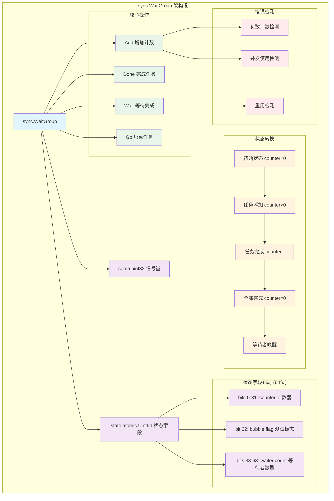
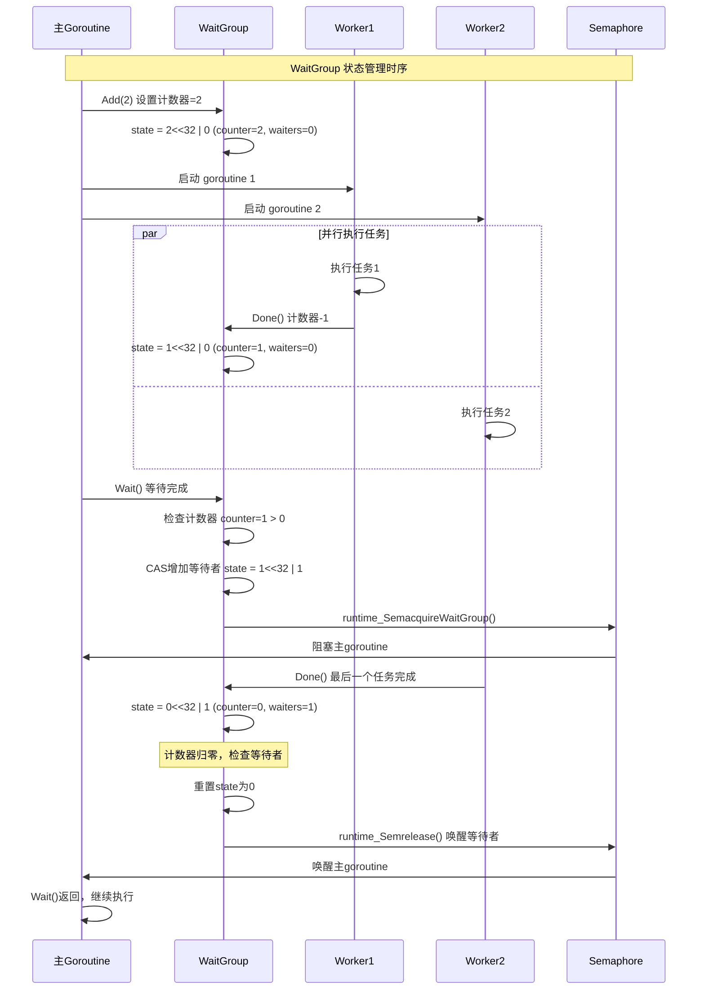
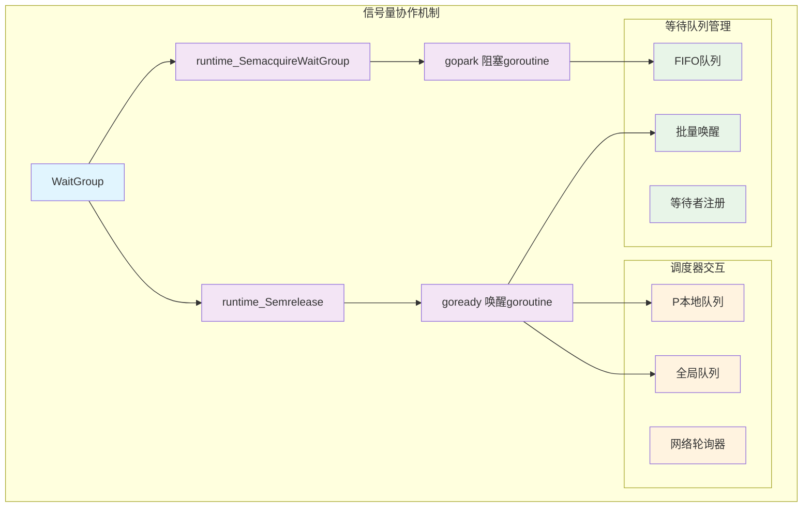

# Go sync.WaitGroup深度解析：计数同步机制与并发协调

## 概述

`sync.WaitGroup`是Go语言中用于等待一组goroutine完成的同步原语。它通过计数器机制实现了简单而强大的并发协调功能，是并发编程中最常用的工具之一。本文将深入分析WaitGroup的实现机制、状态管理以及在实际项目中的应用模式。

## 1. WaitGroup架构设计

### 1.1 整体架构图



**架构设计说明**：

1. **状态压缩**：使用64位原子值存储计数器、标志位和等待者数量
2. **原子操作**：所有状态变更都通过原子操作保证并发安全
3. **信号量协作**：使用runtime信号量实现goroutine的阻塞和唤醒
4. **错误检测**：内置多种错误检测机制，防止误用

### 1.2 核心数据结构

```go
// WaitGroup 等待一组goroutine完成的同步原语
// 使用场景：主goroutine需要等待多个子goroutine完成后再继续执行
// 
// 典型用法：
// 1. 主goroutine调用Add(n)设置要等待的goroutine数量
// 2. 启动n个goroutine，每个goroutine在完成时调用Done()
// 3. 主goroutine调用Wait()阻塞，直到所有goroutine完成
//
// 注意：Add()调用必须在Wait()之前，通常在启动goroutine之前调用
type WaitGroup struct {
    noCopy noCopy  // 防止WaitGroup被复制，确保语义正确性
    
    // ==================== 核心状态字段 ====================
    // state是一个64位原子值，使用位字段布局存储多个信息：
    // 
    // 位字段布局 (从低位到高位):
    //   bits[0:32]   counter 计数器 - 记录还有多少个goroutine未完成
    //   bits[32]     flag: synctest bubble membership - 测试标志位
    //   bits[33:64]  wait count 等待计数 - 记录有多少个goroutine在Wait()中阻塞
    //
    // 使用64位原子操作的原因：
    // 1. 需要同时原子地操作计数器和等待者计数
    // 2. 避免竞态条件，确保Add/Done/Wait操作的一致性
    // 3. 单次原子操作比多次原子操作更高效
    //
    // 内存对齐考虑：
    // 64位原子操作需要64位对齐，Go编译器会自动处理对齐问题
    state atomic.Uint64  // 组合的计数器、标志位和等待者状态
    
    // ==================== 信号量字段 ====================
    // sema是用于阻塞和唤醒等待goroutine的信号量
    // 当计数器降为0时，会通过信号量唤醒所有等待的goroutine
    // 使用runtime的信号量实现，比channel更轻量级且性能更好
    sema  uint32         // 信号量，用于Wait()的阻塞和唤醒机制
}

// noCopy 防止结构体被复制的标记类型
// 实现了sync.Locker接口，但不提供实际功能
// go vet工具会检测到这个类型并报告复制错误
type noCopy struct{}

func (*noCopy) Lock()   {}
func (*noCopy) Unlock() {}
```

### 1.3 状态位详细分析

```mermaid
graph LR
    subgraph "WaitGroup State 位布局 (64位)"
        A[63...33] --> B[等待者计数 waiter count]
        C[32] --> D[测试标志位 bubble flag]
        E[31...0] --> F[任务计数器 counter]
    end
    
    subgraph "状态转换示例"
        G[初始: 0x0000000000000000] --> H[Add(3): 0x0000000000000003]
        H --> I[Wait(): 0x0000000200000003]
        I --> J[Done(): 0x0000000200000002]
        J --> K[Done(): 0x0000000200000001]
        K --> L[Done(): 0x0000000000000000]
        L --> M[唤醒等待者]
    end
    
    classDef bit fill:#e1f5fe
    classDef state fill:#f3e5f5
    classDef transition fill:#e8f5e8
    
    class A,C,E bit
    class B,D,F state
    class G,H,I,J,K,L,M transition
```

**状态位功能说明**：

- **counter (bits 0-31)**：记录未完成的任务数量，Add()增加，Done()减少
- **bubble flag (bit 32)**：用于测试框架的标志位，正常使用中为0
- **waiter count (bits 33-63)**：记录在Wait()中阻塞的goroutine数量

## 2. 核心API详细分析

### 2.1 Add() 方法实现

```go
// Add 将delta（可能为负）添加到WaitGroup任务计数器
// 这是WaitGroup的核心操作，用于增加或减少待完成的任务数量
// 
// 参数说明：
// - delta > 0: 增加待完成任务数（通常在启动goroutine前调用）
// - delta < 0: 减少待完成任务数（Done()内部调用Add(-1)）
// - delta = 0: 无操作，直接返回
//
// 重要规则：
// 1. 如果计数器变为零，所有在Wait()上阻塞的goroutine都会被释放
// 2. 如果计数器变为负数，Add会panic
// 3. Add()必须在Wait()之前调用，否则会panic
func (wg *WaitGroup) Add(delta int) {
    // ==================== 原子更新状态 ====================
    // 将delta左移32位，因为计数器位于state的低32位
    // 原子地将delta添加到计数器部分
    state := wg.state.Add(uint64(delta) << 32)
    
    // 解析state的各个字段
    v := int32(state >> 32)              // 提取计数器值（高32位）
    w := uint32(state & 0x7fffffff)      // 提取等待者数量（低31位，排除flag位）
    
    // ==================== 错误检查 ====================
    if v < 0 {
        // 计数器不能为负，这通常意味着Done()调用次数超过了Add()
        panic("sync: negative WaitGroup counter")
    }
    
    // 检查并发使用错误：Add()和Wait()不能并发调用
    // 条件解释：
    // - w != 0: 有goroutine在等待
    // - delta > 0: 这是一个增加计数的Add调用
    // - v == int32(delta): 计数器之前为0，现在等于delta
    // 这种情况表明在有goroutine等待时又调用了Add()，这是错误的使用方式
    if w != 0 && delta > 0 && v == int32(delta) {
        panic("sync: WaitGroup misuse: Add called concurrently with Wait")
    }
    
    // ==================== 常规情况：无需唤醒 ====================
    if v > 0 || w == 0 {
        // 情况1：计数器仍大于0，还有任务未完成，无需唤醒等待者
        // 情况2：计数器为0但没有等待者，无需唤醒
        return
    }
    
    // ==================== 唤醒等待者 ====================
    // 执行到这里说明：v == 0 && w > 0
    // 即计数器为0且有等待者，需要唤醒所有等待的goroutine
    
    // 此时状态不能再改变，因为：
    // - Add不能与Wait并发（上面已检查）
    // - Wait不能增加等待者计数，因为它们会看到counter==0
    // 
    // 额外的安全检查：确保状态没有被其他goroutine修改
    // 这是一个防御性检查，正常情况下不应该失败
    if wg.state.Load() != state {
        panic("sync: WaitGroup misuse: Add called concurrently with Wait")
    }
    
    // 重置state为0，清除所有状态
    // 这样可以让WaitGroup重新使用（虽然不推荐）
    wg.state.Store(0)
    
    // 逐个释放所有等待的goroutine
    // 使用信号量机制唤醒每个在Wait()中阻塞的goroutine
    for ; w != 0; w-- {
        // 参数说明：
        // - &wg.sema: 信号量地址
        // - false: 不是handoff模式
        // - 1: 跳过等待队列中的1个waiter（即释放1个等待者）
        runtime_Semrelease(&wg.sema, false, 1)
    }
}
```

### 2.2 Done() 方法实现

```go
// Done 减少WaitGroup计数器1，标记一个任务完成
// 这是Add(-1)的便捷方法，通常在goroutine完成工作时调用
// 
// 使用模式：
//   defer wg.Done()  // 在goroutine开始时设置，确保无论如何都会调用
//
// 注意事项：
// 1. Done()调用次数不能超过Add()增加的总数，否则会panic
// 2. 建议使用defer确保Done()一定会被调用，避免死锁
// 3. Done()内部调用Add(-1)，会触发相同的唤醒逻辑
func (wg *WaitGroup) Done() {
    // 直接调用Add(-1)来减少计数器
    // 这样可以复用Add()中的所有逻辑，包括：
    // - 原子操作保证并发安全
    // - 错误检查（防止计数器变负）
    // - 唤醒等待者（当计数器变为0时）
    wg.Add(-1)
}
```

### 2.3 Wait() 方法实现

```go
// Wait 阻塞直到WaitGroup计数器为零
// 这个方法会一直阻塞，直到所有通过Add()添加的任务都调用了Done()
//
// 使用场景：
// - 主goroutine等待所有工作goroutine完成
// - 确保所有并发任务完成后再进行下一步操作
//
// 重要注意事项：
// 1. Wait()必须在所有Add()调用之后调用
// 2. 不要在Add()和Wait()之间有竞态条件
// 3. WaitGroup可以重用，但必须等待上一轮Wait()完全返回
func (wg *WaitGroup) Wait() {
    // ==================== 循环等待逻辑 ====================
    // 使用循环是因为CompareAndSwap可能失败，需要重试
    for {
        // 原子加载当前状态
        state := wg.state.Load()
        
        // 解析状态字段
        v := int32(state >> 32)              // 提取计数器值（高32位）
        w := uint32(state & 0x7fffffff)      // 提取等待者数量（低31位，排除flag位）
        
        // ==================== 快速路径：无需等待 ====================
        if v == 0 {
            // 计数器为0，说明所有任务都已完成，无需等待
            return
        }
        
        // ==================== 慢路径：需要阻塞等待 ====================
        // 尝试原子地增加等待者计数（+1）
        // 使用CompareAndSwap确保在增加等待者计数时状态没有被其他goroutine修改
        if wg.state.CompareAndSwap(state, state+1) {
            // ==================== 成功增加等待者计数 ====================
            // 现在当前goroutine已经注册为等待者，可以安全地阻塞
            
            // 在信号量上阻塞等待，直到被Add()中的Semrelease唤醒
            // 参数说明：
            // - &wg.sema: 信号量地址
            // - false: 不是lifo模式，按FIFO顺序唤醒
            runtime_SemacquireWaitGroup(&wg.sema, false)
            
            // ==================== 被唤醒后的检查 ====================
            // 正常情况下，被唤醒时state应该为0（所有任务完成）
            // 如果state不为0，说明WaitGroup在Wait()返回前就被重用了
            // 这是一个使用错误，需要panic
            if wg.state.Load() != 0 {
                panic("sync: WaitGroup is reused before previous Wait has returned")
            }
            
            // 等待完成，返回
            return
        }
        
        // ==================== CompareAndSwap失败，重试 ====================
        // 如果CompareAndSwap失败，说明其他goroutine修改了state
        // 继续循环，重新读取state并尝试
        // 这种情况可能发生在：
        // 1. 其他goroutine调用了Add()或Done()
        // 2. 其他goroutine也在调用Wait()
    }
}
```

### 2.4 Go() 便捷方法实现

```go
// Go 在新goroutine中调用f并将该任务添加到WaitGroup
// 这是一个便捷方法，自动处理Add()和Done()的调用
// 当f返回时，任务从WaitGroup中移除
//
// 使用场景：
// - 简化并发任务的启动和管理
// - 避免手动调用Add()和Done()的繁琐操作
// - 确保Done()一定会被调用（通过defer）
//
// 等价于手动操作：
//   wg.Add(1)
//   go func() {
//       defer wg.Done()
//       f()
//   }()
func (wg *WaitGroup) Go(f func()) {
    // ==================== 增加任务计数 ====================
    // 在启动goroutine之前先增加计数器
    // 这样可以确保Wait()不会在goroutine启动前就返回
    wg.Add(1)
    
    // ==================== 启动goroutine ====================
    go func() {
        // 使用defer确保Done()一定会被调用
        // 无论f()是正常返回还是panic，Done()都会执行
        // 这避免了因为panic导致的死锁问题
        defer wg.Done()
        
        // 执行用户提供的函数
        // 如果f()发生panic，defer会确保Done()仍然被调用
        // panic会继续向上传播，不会被这里捕获
        f()
    }()
}
```

## 3. 关键机制深度分析

### 3.1 状态管理机制



### 3.2 错误检测机制

```go
// WaitGroup的错误检测机制
func errorDetectionMechanisms() {
    // 1. 负数计数器检测
    negativeCounterDetection := func() {
        // 在Add()中检查计数器是否为负
        if v < 0 {
            panic("sync: negative WaitGroup counter")
        }
        // 防止Done()调用次数超过Add()的总数
    }
    
    // 2. 并发使用检测
    concurrentUseDetection := func() {
        // 检查Add()和Wait()是否并发调用
        if w != 0 && delta > 0 && v == int32(delta) {
            panic("sync: WaitGroup misuse: Add called concurrently with Wait")
        }
        // 防止在有等待者时添加新任务
    }
    
    // 3. 重用检测
    reuseDetection := func() {
        // 在Wait()被唤醒后检查状态
        if wg.state.Load() != 0 {
            panic("sync: WaitGroup is reused before previous Wait has returned")
        }
        // 防止WaitGroup在Wait()返回前被重用
    }
    
    // 4. 状态一致性检测
    stateConsistencyDetection := func() {
        // 在唤醒等待者前检查状态是否被修改
        if wg.state.Load() != state {
            panic("sync: WaitGroup misuse: Add called concurrently with Wait")
        }
        // 确保状态在关键操作期间保持一致
    }
}
```

### 3.3 信号量协作机制



## 4. 性能特征与调用链路

### 4.1 完整调用链路图

```mermaid
graph TB
    subgraph "WaitGroup.Add() 调用链路"
        A[WaitGroup.Add] --> B[state.Add 原子更新]
        B --> C[解析状态字段]
        C --> D{计数器 < 0?}
        D -->|是| E[panic: negative counter]
        D -->|否| F{并发使用检测}
        F -->|错误| G[panic: concurrent Add/Wait]
        F -->|正常| H{需要唤醒?}
        H -->|否| I[返回]
        H -->|是| J[批量唤醒等待者]
        J --> K[循环调用runtime_Semrelease]
        K --> I
    end
    
    subgraph "WaitGroup.Wait() 调用链路"
        L[WaitGroup.Wait] --> M[循环检查状态]
        M --> N[state.Load 原子加载]
        N --> O{计数器 == 0?}
        O -->|是| P[立即返回]
        O -->|否| Q[state.CompareAndSwap 增加等待者]
        Q -->|失败| M
        Q -->|成功| R[runtime_SemacquireWaitGroup]
        R --> S[gopark 阻塞等待]
        S --> T[被唤醒]
        T --> U{状态检查}
        U -->|异常| V[panic: reuse before return]
        U -->|正常| P
    end
    
    subgraph "WaitGroup.Done() 调用链路"
        W[WaitGroup.Done] --> X[Add(-1)]
        X --> B
    end
    
    classDef entry fill:#e1f5fe
    classDef atomic fill:#e8f5e8
    classDef condition fill:#fff3e0
    classDef runtime fill:#f3e5f5
    classDef error fill:#ffebee
    
    class A,L,W entry
    class B,N,Q atomic
    class D,F,H,O,U condition
    class K,R,S,T runtime
    class E,G,V error
```

### 4.2 性能基准测试

```go
// WaitGroup性能测试
func benchmarkWaitGroupPerformance() {
    scenarios := []struct {
        name       string
        goroutines int
        operations int
        workload   time.Duration
    }{
        {"lightweight", 10, 1000, 0},
        {"medium-work", 50, 200, 1 * time.Millisecond},
        {"heavy-work", 100, 50, 10 * time.Millisecond},
        {"many-goroutines", 1000, 10, 0},
    }
    
    for _, scenario := range scenarios {
        fmt.Printf("Testing %s scenario\n", scenario.name)
        
        start := time.Now()
        
        var wg sync.WaitGroup
        
        for i := 0; i < scenario.goroutines; i++ {
            wg.Add(1)
            go func() {
                defer wg.Done()
                
                for j := 0; j < scenario.operations; j++ {
                    if scenario.workload > 0 {
                        time.Sleep(scenario.workload)
                    }
                    // 模拟一些计算工作
                    _ = fibonacci(10)
                }
            }()
        }
        
        wg.Wait()
        duration := time.Since(start)
        
        totalOps := scenario.goroutines * scenario.operations
        fmt.Printf("  Goroutines: %d\n", scenario.goroutines)
        fmt.Printf("  Total operations: %d\n", totalOps)
        fmt.Printf("  Duration: %v\n", duration)
        fmt.Printf("  Ops/sec: %.0f\n\n", float64(totalOps)/duration.Seconds())
    }
}

func fibonacci(n int) int {
    if n <= 1 {
        return n
    }
    return fibonacci(n-1) + fibonacci(n-2)
}

// WaitGroup vs Channel 性能对比
func compareWaitGroupVsChannel() {
    goroutines := []int{10, 50, 100, 500, 1000}
    
    for _, n := range goroutines {
        fmt.Printf("Goroutines: %d\n", n)
        
        // 测试WaitGroup
        wgTime := benchmarkWaitGroup(n)
        
        // 测试Channel
        chTime := benchmarkChannel(n)
        
        speedup := float64(chTime) / float64(wgTime)
        fmt.Printf("  WaitGroup: %v\n", wgTime)
        fmt.Printf("  Channel:   %v\n", chTime)
        fmt.Printf("  Speedup:   %.2fx\n\n", speedup)
    }
}

func benchmarkWaitGroup(n int) time.Duration {
    start := time.Now()
    
    var wg sync.WaitGroup
    for i := 0; i < n; i++ {
        wg.Add(1)
        go func() {
            defer wg.Done()
            // 模拟工作
            time.Sleep(1 * time.Millisecond)
        }()
    }
    wg.Wait()
    
    return time.Since(start)
}

func benchmarkChannel(n int) time.Duration {
    start := time.Now()
    
    done := make(chan struct{}, n)
    for i := 0; i < n; i++ {
        go func() {
            // 模拟工作
            time.Sleep(1 * time.Millisecond)
            done <- struct{}{}
        }()
    }
    
    for i := 0; i < n; i++ {
        <-done
    }
    
    return time.Since(start)
}
```

### 4.3 内存使用分析

```go
// WaitGroup内存使用分析
func analyzeWaitGroupMemory() {
    // WaitGroup结构体大小分析
    wg := sync.WaitGroup{}
    
    fmt.Printf("WaitGroup size: %d bytes\n", unsafe.Sizeof(wg))
    fmt.Printf("state field size: %d bytes\n", unsafe.Sizeof(wg.state))
    fmt.Printf("sema field size: %d bytes\n", unsafe.Sizeof(wg.sema))
    
    // 内存对齐分析
    fmt.Printf("WaitGroup alignment: %d bytes\n", unsafe.Alignof(wg))
    fmt.Printf("state alignment: %d bytes\n", unsafe.Alignof(wg.state))
    
    // 缓存行友好性分析
    const cacheLineSize = 64
    wgSize := unsafe.Sizeof(wg)
    
    fmt.Printf("Cache line size: %d bytes\n", cacheLineSize)
    fmt.Printf("WaitGroups per cache line: %d\n", cacheLineSize/wgSize)
    
    if wgSize <= cacheLineSize {
        fmt.Println("WaitGroup fits in single cache line - good for performance")
    } else {
        fmt.Println("WaitGroup spans multiple cache lines - potential performance impact")
    }
}

// 内存分配测试
func testWaitGroupAllocation() {
    var m1, m2 runtime.MemStats
    
    // 测试WaitGroup创建的内存开销
    runtime.GC()
    runtime.ReadMemStats(&m1)
    
    const numWaitGroups = 10000
    wgs := make([]sync.WaitGroup, numWaitGroups)
    
    runtime.GC()
    runtime.ReadMemStats(&m2)
    
    allocatedBytes := m2.TotalAlloc - m1.TotalAlloc
    bytesPerWaitGroup := allocatedBytes / numWaitGroups
    
    fmt.Printf("Created %d WaitGroups\n", numWaitGroups)
    fmt.Printf("Total allocated: %d bytes\n", allocatedBytes)
    fmt.Printf("Bytes per WaitGroup: %d bytes\n", bytesPerWaitGroup)
    
    // 防止编译器优化
    runtime.KeepAlive(wgs)
}
```

## 5. 实战案例与最佳实践

### 5.1 并行任务处理

```go
// 并行任务处理框架
type TaskProcessor struct {
    maxWorkers int
    taskQueue  chan Task
    wg         sync.WaitGroup
    ctx        context.Context
    cancel     context.CancelFunc
}

type Task struct {
    ID       string
    Data     interface{}
    Callback func(interface{}) error
}

type TaskResult struct {
    TaskID string
    Result interface{}
    Error  error
}

// NewTaskProcessor 创建任务处理器
func NewTaskProcessor(maxWorkers int, queueSize int) *TaskProcessor {
    ctx, cancel := context.WithCancel(context.Background())
    
    return &TaskProcessor{
        maxWorkers: maxWorkers,
        taskQueue:  make(chan Task, queueSize),
        ctx:        ctx,
        cancel:     cancel,
    }
}

// Start 启动任务处理器
func (tp *TaskProcessor) Start() {
    // 启动工作goroutine
    for i := 0; i < tp.maxWorkers; i++ {
        tp.wg.Add(1)
        go tp.worker(i)
    }
}

// worker 工作goroutine
func (tp *TaskProcessor) worker(workerID int) {
    defer tp.wg.Done()
    
    log.Printf("Worker %d started", workerID)
    defer log.Printf("Worker %d stopped", workerID)
    
    for {
        select {
        case task, ok := <-tp.taskQueue:
            if !ok {
                // 任务队列已关闭
                return
            }
            
            // 处理任务
            tp.processTask(workerID, task)
            
        case <-tp.ctx.Done():
            // 收到停止信号
            return
        }
    }
}

// processTask 处理单个任务
func (tp *TaskProcessor) processTask(workerID int, task Task) {
    defer func() {
        if r := recover(); r != nil {
            log.Printf("Worker %d panic processing task %s: %v", 
                workerID, task.ID, r)
        }
    }()
    
    log.Printf("Worker %d processing task %s", workerID, task.ID)
    
    // 执行任务回调
    if task.Callback != nil {
        if err := task.Callback(task.Data); err != nil {
            log.Printf("Task %s failed: %v", task.ID, err)
        } else {
            log.Printf("Task %s completed successfully", task.ID)
        }
    }
}

// Submit 提交任务
func (tp *TaskProcessor) Submit(task Task) error {
    select {
    case tp.taskQueue <- task:
        return nil
    case <-tp.ctx.Done():
        return fmt.Errorf("task processor is shutting down")
    default:
        return fmt.Errorf("task queue is full")
    }
}

// SubmitBatch 批量提交任务
func (tp *TaskProcessor) SubmitBatch(tasks []Task) []error {
    errors := make([]error, len(tasks))
    
    for i, task := range tasks {
        errors[i] = tp.Submit(task)
    }
    
    return errors
}

// Stop 停止任务处理器
func (tp *TaskProcessor) Stop(timeout time.Duration) error {
    log.Println("Stopping task processor...")
    
    // 关闭任务队列，不再接受新任务
    close(tp.taskQueue)
    
    // 等待所有工作goroutine完成，带超时
    done := make(chan struct{})
    go func() {
        tp.wg.Wait()
        close(done)
    }()
    
    select {
    case <-done:
        log.Println("All workers stopped gracefully")
        return nil
    case <-time.After(timeout):
        // 超时，强制取消
        tp.cancel()
        
        // 再等待一小段时间让goroutine响应取消
        select {
        case <-done:
            log.Println("All workers stopped after cancellation")
        case <-time.After(1 * time.Second):
            log.Println("Some workers may not have stopped")
        }
        
        return fmt.Errorf("timeout waiting for workers to stop")
    }
}

// GetStats 获取统计信息
func (tp *TaskProcessor) GetStats() TaskProcessorStats {
    return TaskProcessorStats{
        MaxWorkers:    tp.maxWorkers,
        QueueLength:   len(tp.taskQueue),
        QueueCapacity: cap(tp.taskQueue),
        IsRunning:     tp.ctx.Err() == nil,
    }
}

type TaskProcessorStats struct {
    MaxWorkers    int
    QueueLength   int
    QueueCapacity int
    IsRunning     bool
}

// 使用示例
func exampleTaskProcessor() {
    // 创建任务处理器
    processor := NewTaskProcessor(5, 100)
    
    // 启动处理器
    processor.Start()
    
    // 提交任务
    for i := 0; i < 20; i++ {
        task := Task{
            ID:   fmt.Sprintf("task-%d", i),
            Data: i,
            Callback: func(data interface{}) error {
                // 模拟任务处理
                time.Sleep(time.Duration(rand.Intn(1000)) * time.Millisecond)
                fmt.Printf("Processed data: %v\n", data)
                return nil
            },
        }
        
        if err := processor.Submit(task); err != nil {
            log.Printf("Failed to submit task: %v", err)
        }
    }
    
    // 等待一段时间让任务完成
    time.Sleep(5 * time.Second)
    
    // 停止处理器
    if err := processor.Stop(10 * time.Second); err != nil {
        log.Printf("Error stopping processor: %v", err)
    }
}
```

### 5.2 分阶段流水线处理

```go
// 分阶段流水线处理系统
type Pipeline struct {
    stages []Stage
    wg     sync.WaitGroup
    ctx    context.Context
    cancel context.CancelFunc
}

type Stage struct {
    Name     string
    Input    chan interface{}
    Output   chan interface{}
    Process  func(interface{}) interface{}
    Workers  int
}

// NewPipeline 创建流水线
func NewPipeline(stages []Stage) *Pipeline {
    ctx, cancel := context.WithCancel(context.Background())
    
    // 连接各个阶段
    for i := 0; i < len(stages)-1; i++ {
        stages[i].Output = stages[i+1].Input
    }
    
    return &Pipeline{
        stages: stages,
        ctx:    ctx,
        cancel: cancel,
    }
}

// Start 启动流水线
func (p *Pipeline) Start() {
    for i, stage := range p.stages {
        // 为每个阶段启动多个工作goroutine
        for j := 0; j < stage.Workers; j++ {
            p.wg.Add(1)
            go p.stageWorker(i, j, stage)
        }
    }
}

// stageWorker 阶段工作goroutine
func (p *Pipeline) stageWorker(stageIndex, workerIndex int, stage Stage) {
    defer p.wg.Done()
    
    log.Printf("Stage %s Worker %d started", stage.Name, workerIndex)
    defer log.Printf("Stage %s Worker %d stopped", stage.Name, workerIndex)
    
    for {
        select {
        case data, ok := <-stage.Input:
            if !ok {
                // 输入通道已关闭
                if stage.Output != nil {
                    // 如果不是最后一个阶段，关闭输出通道
                    // 注意：这里需要协调多个worker，实际实现可能需要更复杂的逻辑
                    close(stage.Output)
                }
                return
            }
            
            // 处理数据
            result := stage.Process(data)
            
            // 发送到下一阶段
            if stage.Output != nil {
                select {
                case stage.Output <- result:
                case <-p.ctx.Done():
                    return
                }
            }
            
        case <-p.ctx.Done():
            return
        }
    }
}

// Process 处理数据
func (p *Pipeline) Process(input <-chan interface{}, output chan<- interface{}) {
    // 将输入连接到第一个阶段
    go func() {
        defer close(p.stages[0].Input)
        for data := range input {
            select {
            case p.stages[0].Input <- data:
            case <-p.ctx.Done():
                return
            }
        }
    }()
    
    // 从最后一个阶段收集输出
    lastStage := p.stages[len(p.stages)-1]
    go func() {
        defer close(output)
        for result := range lastStage.Output {
            select {
            case output <- result:
            case <-p.ctx.Done():
                return
            }
        }
    }()
}

// Stop 停止流水线
func (p *Pipeline) Stop(timeout time.Duration) error {
    log.Println("Stopping pipeline...")
    
    // 取消上下文
    p.cancel()
    
    // 等待所有工作goroutine完成
    done := make(chan struct{})
    go func() {
        p.wg.Wait()
        close(done)
    }()
    
    select {
    case <-done:
        log.Println("Pipeline stopped gracefully")
        return nil
    case <-time.After(timeout):
        return fmt.Errorf("timeout waiting for pipeline to stop")
    }
}

// 使用示例
func examplePipeline() {
    // 定义流水线阶段
    stages := []Stage{
        {
            Name:    "Parse",
            Input:   make(chan interface{}, 10),
            Workers: 2,
            Process: func(data interface{}) interface{} {
                // 解析阶段
                time.Sleep(100 * time.Millisecond)
                return fmt.Sprintf("parsed-%v", data)
            },
        },
        {
            Name:    "Transform",
            Input:   make(chan interface{}, 10),
            Workers: 3,
            Process: func(data interface{}) interface{} {
                // 转换阶段
                time.Sleep(200 * time.Millisecond)
                return fmt.Sprintf("transformed-%v", data)
            },
        },
        {
            Name:    "Output",
            Input:   make(chan interface{}, 10),
            Output:  make(chan interface{}, 10),
            Workers: 1,
            Process: func(data interface{}) interface{} {
                // 输出阶段
                time.Sleep(50 * time.Millisecond)
                return fmt.Sprintf("output-%v", data)
            },
        },
    }
    
    // 创建并启动流水线
    pipeline := NewPipeline(stages)
    pipeline.Start()
    
    // 创建输入和输出通道
    input := make(chan interface{}, 5)
    output := make(chan interface{}, 5)
    
    // 连接流水线
    pipeline.Process(input, output)
    
    // 发送测试数据
    go func() {
        defer close(input)
        for i := 0; i < 10; i++ {
            input <- i
        }
    }()
    
    // 接收结果
    go func() {
        for result := range output {
            fmt.Printf("Final result: %v\n", result)
        }
    }()
    
    // 运行一段时间后停止
    time.Sleep(5 * time.Second)
    pipeline.Stop(2 * time.Second)
}
```

### 5.3 资源池管理

```go
// 通用资源池管理器
type ResourcePool struct {
    factory    func() (Resource, error)  // 资源创建工厂
    destroyer  func(Resource) error      // 资源销毁函数
    validator  func(Resource) bool       // 资源验证函数
    
    resources  chan Resource             // 资源池
    maxSize    int                      // 最大资源数
    currentSize int32                   // 当前资源数
    
    mu         sync.RWMutex             // 保护统计信息
    stats      PoolStats               // 统计信息
    
    wg         sync.WaitGroup           // 等待所有资源释放
    closed     int32                   // 关闭标志
}

type Resource interface {
    ID() string
    IsValid() bool
    Close() error
}

type PoolStats struct {
    TotalCreated  int64
    TotalDestroyed int64
    CurrentActive int32
    CurrentIdle   int32
    GetRequests   int64
    PutRequests   int64
    GetErrors     int64
    PutErrors     int64
}

// NewResourcePool 创建资源池
func NewResourcePool(
    factory func() (Resource, error),
    destroyer func(Resource) error,
    validator func(Resource) bool,
    maxSize int,
) *ResourcePool {
    return &ResourcePool{
        factory:   factory,
        destroyer: destroyer,
        validator: validator,
        resources: make(chan Resource, maxSize),
        maxSize:   maxSize,
    }
}

// Get 获取资源
func (rp *ResourcePool) Get(ctx context.Context) (Resource, error) {
    if atomic.LoadInt32(&rp.closed) == 1 {
        return nil, fmt.Errorf("resource pool is closed")
    }
    
    atomic.AddInt64(&rp.stats.GetRequests, 1)
    
    // 尝试从池中获取资源
    select {
    case resource := <-rp.resources:
        // 验证资源是否仍然有效
        if rp.validator != nil && !rp.validator(resource) {
            // 资源无效，销毁并创建新的
            rp.destroyResource(resource)
            return rp.createResource()
        }
        
        atomic.AddInt32(&rp.stats.CurrentIdle, -1)
        atomic.AddInt32(&rp.stats.CurrentActive, 1)
        return resource, nil
        
    default:
        // 池中没有资源，尝试创建新的
        return rp.createResource()
    }
}

// Put 归还资源
func (rp *ResourcePool) Put(resource Resource) error {
    if atomic.LoadInt32(&rp.closed) == 1 {
        return rp.destroyResource(resource)
    }
    
    atomic.AddInt64(&rp.stats.PutRequests, 1)
    
    // 验证资源
    if rp.validator != nil && !rp.validator(resource) {
        atomic.AddInt64(&rp.stats.PutErrors, 1)
        return rp.destroyResource(resource)
    }
    
    // 尝试放回池中
    select {
    case rp.resources <- resource:
        atomic.AddInt32(&rp.stats.CurrentActive, -1)
        atomic.AddInt32(&rp.stats.CurrentIdle, 1)
        return nil
    default:
        // 池已满，销毁资源
        return rp.destroyResource(resource)
    }
}

// createResource 创建新资源
func (rp *ResourcePool) createResource() (Resource, error) {
    currentSize := atomic.LoadInt32(&rp.currentSize)
    if int(currentSize) >= rp.maxSize {
        atomic.AddInt64(&rp.stats.GetErrors, 1)
        return nil, fmt.Errorf("resource pool is full")
    }
    
    resource, err := rp.factory()
    if err != nil {
        atomic.AddInt64(&rp.stats.GetErrors, 1)
        return nil, err
    }
    
    atomic.AddInt32(&rp.currentSize, 1)
    atomic.AddInt64(&rp.stats.TotalCreated, 1)
    atomic.AddInt32(&rp.stats.CurrentActive, 1)
    
    // 注册资源，用于关闭时等待
    rp.wg.Add(1)
    
    return resource, nil
}

// destroyResource 销毁资源
func (rp *ResourcePool) destroyResource(resource Resource) error {
    defer rp.wg.Done()
    
    atomic.AddInt32(&rp.currentSize, -1)
    atomic.AddInt64(&rp.stats.TotalDestroyed, 1)
    
    // 更新活跃/空闲计数
    if atomic.LoadInt32(&rp.stats.CurrentActive) > 0 {
        atomic.AddInt32(&rp.stats.CurrentActive, -1)
    } else if atomic.LoadInt32(&rp.stats.CurrentIdle) > 0 {
        atomic.AddInt32(&rp.stats.CurrentIdle, -1)
    }
    
    if rp.destroyer != nil {
        return rp.destroyer(resource)
    }
    
    return resource.Close()
}

// Close 关闭资源池
func (rp *ResourcePool) Close(timeout time.Duration) error {
    if !atomic.CompareAndSwapInt32(&rp.closed, 0, 1) {
        return fmt.Errorf("resource pool already closed")
    }
    
    log.Println("Closing resource pool...")
    
    // 关闭资源通道，防止新的Put操作
    close(rp.resources)
    
    // 销毁池中剩余的资源
    for {
        select {
        case resource := <-rp.resources:
            go rp.destroyResource(resource)
        default:
            goto waitForResources
        }
    }
    
waitForResources:
    // 等待所有资源被销毁
    done := make(chan struct{})
    go func() {
        rp.wg.Wait()
        close(done)
    }()
    
    select {
    case <-done:
        log.Println("All resources destroyed")
        return nil
    case <-time.After(timeout):
        return fmt.Errorf("timeout waiting for resources to be destroyed")
    }
}

// GetStats 获取统计信息
func (rp *ResourcePool) GetStats() PoolStats {
    rp.mu.RLock()
    defer rp.mu.RUnlock()
    
    return PoolStats{
        TotalCreated:  atomic.LoadInt64(&rp.stats.TotalCreated),
        TotalDestroyed: atomic.LoadInt64(&rp.stats.TotalDestroyed),
        CurrentActive: atomic.LoadInt32(&rp.stats.CurrentActive),
        CurrentIdle:   atomic.LoadInt32(&rp.stats.CurrentIdle),
        GetRequests:   atomic.LoadInt64(&rp.stats.GetRequests),
        PutRequests:   atomic.LoadInt64(&rp.stats.PutRequests),
        GetErrors:     atomic.LoadInt64(&rp.stats.GetErrors),
        PutErrors:     atomic.LoadInt64(&rp.stats.PutErrors),
    }
}

// 数据库连接资源实现示例
type DBConnection struct {
    id   string
    conn *sql.DB
}

func (db *DBConnection) ID() string {
    return db.id
}

func (db *DBConnection) IsValid() bool {
    return db.conn.Ping() == nil
}

func (db *DBConnection) Close() error {
    return db.conn.Close()
}

// 使用示例
func exampleResourcePool() {
    // 创建数据库连接池
    pool := NewResourcePool(
        // 工厂函数
        func() (Resource, error) {
            conn, err := sql.Open("mysql", "user:password@tcp(localhost:3306)/dbname")
            if err != nil {
                return nil, err
            }
            
            return &DBConnection{
                id:   fmt.Sprintf("conn-%d", time.Now().UnixNano()),
                conn: conn,
            }, nil
        },
        // 销毁函数
        func(resource Resource) error {
            return resource.Close()
        },
        // 验证函数
        func(resource Resource) bool {
            return resource.IsValid()
        },
        10, // 最大连接数
    )
    
    // 模拟并发使用
    var wg sync.WaitGroup
    
    for i := 0; i < 50; i++ {
        wg.Add(1)
        go func(i int) {
            defer wg.Done()
            
            ctx, cancel := context.WithTimeout(context.Background(), 5*time.Second)
            defer cancel()
            
            // 获取连接
            conn, err := pool.Get(ctx)
            if err != nil {
                log.Printf("Failed to get connection: %v", err)
                return
            }
            
            // 模拟使用连接
            time.Sleep(time.Duration(rand.Intn(1000)) * time.Millisecond)
            
            // 归还连接
            if err := pool.Put(conn); err != nil {
                log.Printf("Failed to put connection: %v", err)
            }
        }(i)
    }
    
    wg.Wait()
    
    // 打印统计信息
    stats := pool.GetStats()
    fmt.Printf("Pool Stats: %+v\n", stats)
    
    // 关闭池
    if err := pool.Close(5 * time.Second); err != nil {
        log.Printf("Error closing pool: %v", err)
    }
}
```

## 6. 常见陷阱与调试技巧

### 6.1 常见错误模式

```go
// 错误1: Add()和Wait()的调用顺序错误
func badAddWaitOrder() {
    var wg sync.WaitGroup
    
    // 错误：在启动goroutine后才Add
    go func() {
        defer wg.Done()
        // 工作...
    }()
    wg.Add(1) // 可能导致竞态条件
    
    wg.Wait()
    
    // 正确做法：在启动goroutine前Add
    wg.Add(1)
    go func() {
        defer wg.Done()
        // 工作...
    }()
    wg.Wait()
}

// 错误2: Done()调用次数不匹配
func badDoneCount() {
    var wg sync.WaitGroup
    
    wg.Add(2)
    
    go func() {
        defer wg.Done()
        // 工作...
    }()
    
    go func() {
        // 错误：忘记调用Done()
        // 工作...
    }()
    
    wg.Wait() // 会永远阻塞
    
    // 正确做法：确保每个goroutine都调用Done()
    wg.Add(2)
    
    go func() {
        defer wg.Done() // 使用defer确保一定调用
        // 工作...
    }()
    
    go func() {
        defer wg.Done() // 使用defer确保一定调用
        // 工作...
    }()
    
    wg.Wait()
}

// 错误3: 过早重用WaitGroup
func badEarlyReuse() {
    var wg sync.WaitGroup
    
    // 第一轮使用
    wg.Add(1)
    go func() {
        defer wg.Done()
        time.Sleep(1 * time.Second)
    }()
    
    go func() {
        wg.Wait() // 第一个Wait()
        
        // 错误：在第一个Wait()返回前就重用
        wg.Add(1) // 可能panic
        go func() {
            defer wg.Done()
            // 工作...
        }()
        wg.Wait()
    }()
    
    wg.Wait() // 第二个Wait()
    
    // 正确做法：等待所有Wait()返回后再重用
    wg.Wait()
    
    // 确保所有Wait()都已返回
    time.Sleep(100 * time.Millisecond)
    
    // 现在可以安全重用
    wg.Add(1)
    go func() {
        defer wg.Done()
        // 工作...
    }()
    wg.Wait()
}

// 错误4: 在循环中错误使用WaitGroup
func badLoopUsage() {
    var wg sync.WaitGroup
    
    // 错误：在循环内部Add和Wait
    for i := 0; i < 10; i++ {
        wg.Add(1)
        go func(i int) {
            defer wg.Done()
            fmt.Println(i)
        }(i)
        wg.Wait() // 错误：每次只等待一个goroutine
    }
    
    // 正确做法1：批量处理
    wg.Add(10)
    for i := 0; i < 10; i++ {
        go func(i int) {
            defer wg.Done()
            fmt.Println(i)
        }(i)
    }
    wg.Wait()
    
    // 正确做法2：分批处理
    const batchSize = 3
    for i := 0; i < 10; i += batchSize {
        end := i + batchSize
        if end > 10 {
            end = 10
        }
        
        wg.Add(end - i)
        for j := i; j < end; j++ {
            go func(j int) {
                defer wg.Done()
                fmt.Println(j)
            }(j)
        }
        wg.Wait()
    }
}

// 错误5: 复制WaitGroup
func badCopyWaitGroup() {
    var wg1 sync.WaitGroup
    
    wg1.Add(1)
    
    // 错误：复制WaitGroup
    wg2 := wg1 // 复制了内部状态，导致不一致
    
    go func() {
        defer wg1.Done() // 在原始WaitGroup上调用Done
        // 工作...
    }()
    
    wg2.Wait() // 在复制的WaitGroup上等待，永远不会返回
    
    // 正确做法：使用指针传递WaitGroup
    processWithWaitGroup := func(wg *sync.WaitGroup) {
        wg.Add(1)
        go func() {
            defer wg.Done()
            // 工作...
        }()
    }
    
    var wg sync.WaitGroup
    processWithWaitGroup(&wg)
    wg.Wait()
}
```

### 6.2 调试和监控工具

```go
// 调试工具1: WaitGroup包装器
type DebugWaitGroup struct {
    wg       sync.WaitGroup
    name     string
    
    // 统计信息
    addCalls    int64
    doneCalls   int64
    waitCalls   int64
    
    // 当前状态
    counter     int32
    waiters     int32
    
    // 调用栈跟踪
    mu          sync.Mutex
    addStacks   []string
    doneStacks  []string
    waitStacks  []string
}

func NewDebugWaitGroup(name string) *DebugWaitGroup {
    return &DebugWaitGroup{name: name}
}

func (dwg *DebugWaitGroup) Add(delta int) {
    atomic.AddInt64(&dwg.addCalls, 1)
    atomic.AddInt32(&dwg.counter, int32(delta))
    
    // 记录调用栈
    dwg.mu.Lock()
    dwg.addStacks = append(dwg.addStacks, getCallStack())
    dwg.mu.Unlock()
    
    log.Printf("WaitGroup %s: Add(%d), counter=%d", 
        dwg.name, delta, atomic.LoadInt32(&dwg.counter))
    
    dwg.wg.Add(delta)
}

func (dwg *DebugWaitGroup) Done() {
    atomic.AddInt64(&dwg.doneCalls, 1)
    atomic.AddInt32(&dwg.counter, -1)
    
    // 记录调用栈
    dwg.mu.Lock()
    dwg.doneStacks = append(dwg.doneStacks, getCallStack())
    dwg.mu.Unlock()
    
    log.Printf("WaitGroup %s: Done(), counter=%d", 
        dwg.name, atomic.LoadInt32(&dwg.counter))
    
    dwg.wg.Done()
}

func (dwg *DebugWaitGroup) Wait() {
    atomic.AddInt64(&dwg.waitCalls, 1)
    atomic.AddInt32(&dwg.waiters, 1)
    
    // 记录调用栈
    dwg.mu.Lock()
    dwg.waitStacks = append(dwg.waitStacks, getCallStack())
    dwg.mu.Unlock()
    
    log.Printf("WaitGroup %s: Wait() started, waiters=%d", 
        dwg.name, atomic.LoadInt32(&dwg.waiters))
    
    dwg.wg.Wait()
    
    atomic.AddInt32(&dwg.waiters, -1)
    log.Printf("WaitGroup %s: Wait() completed", dwg.name)
}

func (dwg *DebugWaitGroup) Stats() DebugWaitGroupStats {
    dwg.mu.Lock()
    defer dwg.mu.Unlock()
    
    return DebugWaitGroupStats{
        Name:       dwg.name,
        AddCalls:   atomic.LoadInt64(&dwg.addCalls),
        DoneCalls:  atomic.LoadInt64(&dwg.doneCalls),
        WaitCalls:  atomic.LoadInt64(&dwg.waitCalls),
        Counter:    atomic.LoadInt32(&dwg.counter),
        Waiters:    atomic.LoadInt32(&dwg.waiters),
        AddStacks:  append([]string(nil), dwg.addStacks...),
        DoneStacks: append([]string(nil), dwg.doneStacks...),
        WaitStacks: append([]string(nil), dwg.waitStacks...),
    }
}

type DebugWaitGroupStats struct {
    Name       string
    AddCalls   int64
    DoneCalls  int64
    WaitCalls  int64
    Counter    int32
    Waiters    int32
    AddStacks  []string
    DoneStacks []string
    WaitStacks []string
}

func getCallStack() string {
    buf := make([]byte, 4096)
    buf = buf[:runtime.Stack(buf, false)]
    return string(buf)
}

// 调试工具2: 死锁检测器
type WaitGroupDeadlockDetector struct {
    mu       sync.Mutex
    groups   map[string]*WaitGroupInfo
    timeout  time.Duration
}

type WaitGroupInfo struct {
    Name      string
    Counter   int32
    Waiters   []WaiterInfo
    LastAdd   time.Time
    LastDone  time.Time
    LastWait  time.Time
}

type WaiterInfo struct {
    Goroutine string
    Stack     string
    StartTime time.Time
}

func NewWaitGroupDeadlockDetector(timeout time.Duration) *WaitGroupDeadlockDetector {
    detector := &WaitGroupDeadlockDetector{
        groups:  make(map[string]*WaitGroupInfo),
        timeout: timeout,
    }
    
    // 启动检测goroutine
    go detector.detectLoop()
    
    return detector
}

func (wdd *WaitGroupDeadlockDetector) RegisterAdd(name string, delta int) {
    wdd.mu.Lock()
    defer wdd.mu.Unlock()
    
    info, exists := wdd.groups[name]
    if !exists {
        info = &WaitGroupInfo{Name: name}
        wdd.groups[name] = info
    }
    
    info.Counter += int32(delta)
    info.LastAdd = time.Now()
}

func (wdd *WaitGroupDeadlockDetector) RegisterDone(name string) {
    wdd.mu.Lock()
    defer wdd.mu.Unlock()
    
    if info, exists := wdd.groups[name]; exists {
        info.Counter--
        info.LastDone = time.Now()
    }
}

func (wdd *WaitGroupDeadlockDetector) RegisterWait(name string) {
    wdd.mu.Lock()
    defer wdd.mu.Unlock()
    
    info, exists := wdd.groups[name]
    if !exists {
        info = &WaitGroupInfo{Name: name}
        wdd.groups[name] = info
    }
    
    waiter := WaiterInfo{
        Goroutine: getCurrentGoroutineID(),
        Stack:     getCallStack(),
        StartTime: time.Now(),
    }
    
    info.Waiters = append(info.Waiters, waiter)
    info.LastWait = time.Now()
}

func (wdd *WaitGroupDeadlockDetector) UnregisterWait(name string) {
    wdd.mu.Lock()
    defer wdd.mu.Unlock()
    
    if info, exists := wdd.groups[name]; exists {
        goroutineID := getCurrentGoroutineID()
        
        // 移除对应的waiter
        for i, waiter := range info.Waiters {
            if waiter.Goroutine == goroutineID {
                info.Waiters = append(info.Waiters[:i], info.Waiters[i+1:]...)
                break
            }
        }
    }
}

func (wdd *WaitGroupDeadlockDetector) detectLoop() {
    ticker := time.NewTicker(wdd.timeout / 2)
    defer ticker.Stop()
    
    for range ticker.C {
        wdd.checkForDeadlocks()
    }
}

func (wdd *WaitGroupDeadlockDetector) checkForDeadlocks() {
    wdd.mu.Lock()
    defer wdd.mu.Unlock()
    
    now := time.Now()
    
    for name, info := range wdd.groups {
        // 检查是否有长时间等待的情况
        for _, waiter := range info.Waiters {
            if now.Sub(waiter.StartTime) > wdd.timeout {
                log.Printf("POTENTIAL DEADLOCK: WaitGroup %s has waiter %s waiting for %v\n"+
                    "Counter: %d, Last Add: %v, Last Done: %v\n"+
                    "Stack:\n%s",
                    name, waiter.Goroutine, now.Sub(waiter.StartTime),
                    info.Counter, info.LastAdd, info.LastDone,
                    waiter.Stack)
            }
        }
        
        // 检查计数器是否异常
        if info.Counter < 0 {
            log.Printf("NEGATIVE COUNTER: WaitGroup %s has negative counter %d",
                name, info.Counter)
        }
        
        if info.Counter > 1000 {
            log.Printf("HIGH COUNTER: WaitGroup %s has unusually high counter %d",
                name, info.Counter)
        }
    }
}

func getCurrentGoroutineID() string {
    buf := make([]byte, 64)
    buf = buf[:runtime.Stack(buf, false)]
    // 简单解析goroutine ID
    return fmt.Sprintf("goroutine-%d", time.Now().UnixNano()%10000)
}
```

## 7. 总结

### 7.1 WaitGroup设计要点

1. **状态压缩**：使用64位原子值存储计数器和等待者信息，提高效率
2. **原子操作**：所有状态变更都通过原子操作保证并发安全
3. **错误检测**：内置多种错误检测机制，防止常见的使用错误
4. **信号量协作**：使用runtime信号量实现高效的阻塞和唤醒

### 7.2 性能特征

- **轻量级**：结构体只有12字节，内存开销极小
- **高效率**：Add/Done操作只需要原子操作，性能优异
- **可扩展**：支持任意数量的goroutine，无固定限制

### 7.3 适用场景

1. **并行任务处理**：等待多个并行任务完成
2. **资源初始化**：等待多个资源初始化完成
3. **分阶段处理**：协调多阶段处理流程
4. **优雅关闭**：等待所有工作goroutine完成后关闭

### 7.4 使用建议

1. **正确顺序**：Add()必须在Wait()之前调用，通常在启动goroutine前
2. **配对使用**：确保每个Add()都有对应的Done()调用
3. **使用defer**：使用defer确保Done()一定会被调用
4. **避免复制**：通过指针传递WaitGroup，避免复制
5. **谨慎重用**：确保所有Wait()返回后再重用WaitGroup

> **更多最佳实践**：详细的并发编程最佳实践和高级优化技巧，请参考 [Go并发编程最佳实践指南](golang-concurrency-best-practices.md)。

sync.WaitGroup通过简洁的API和高效的实现，为Go并发编程提供了强大的任务协调能力。理解其实现原理和使用模式，有助于编写更可靠、更高效的并发程序。
