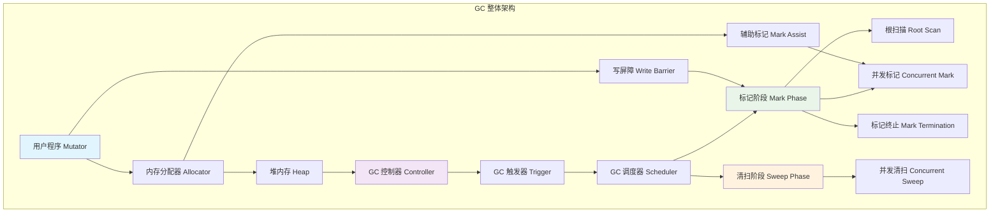
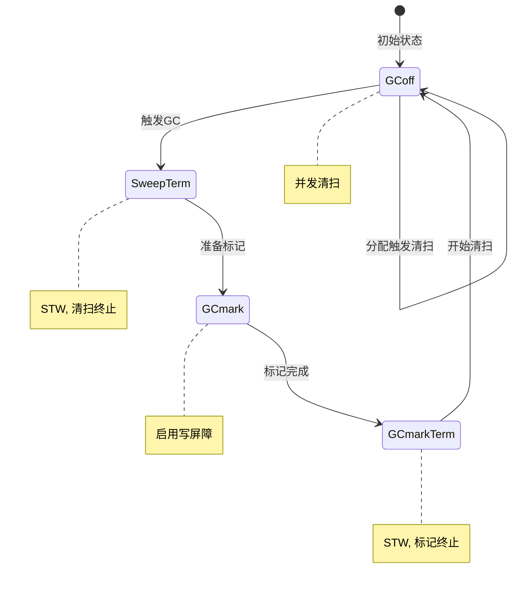
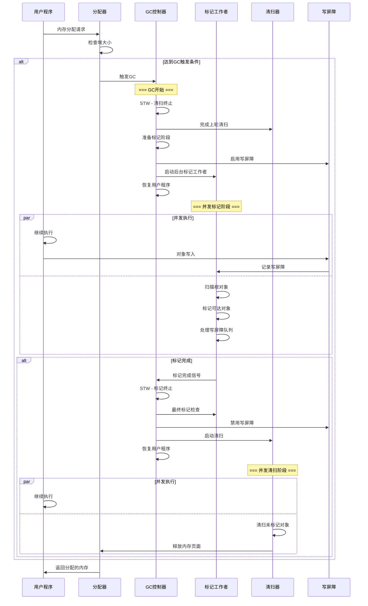
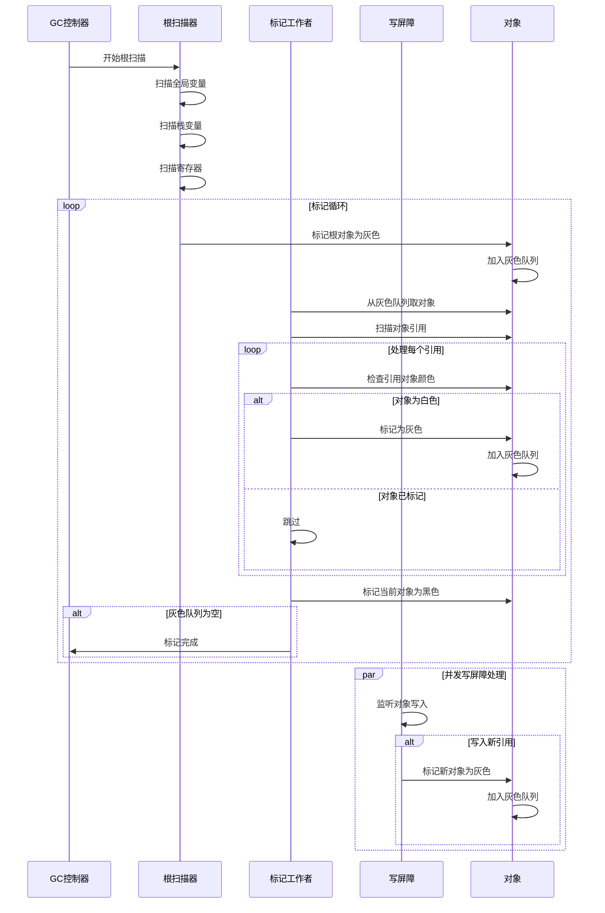
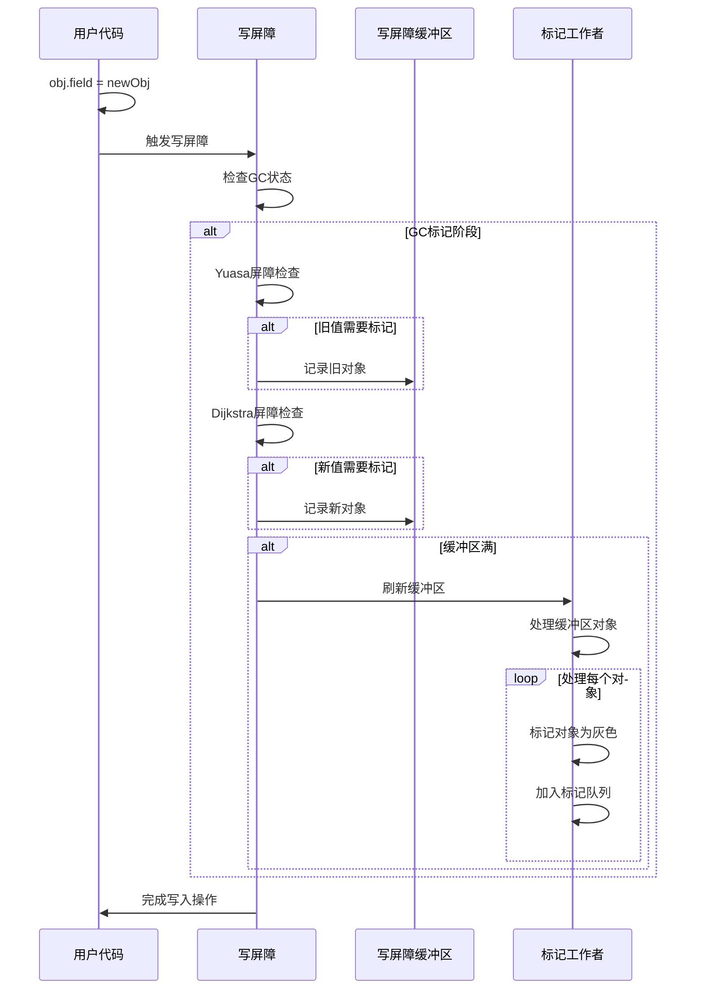
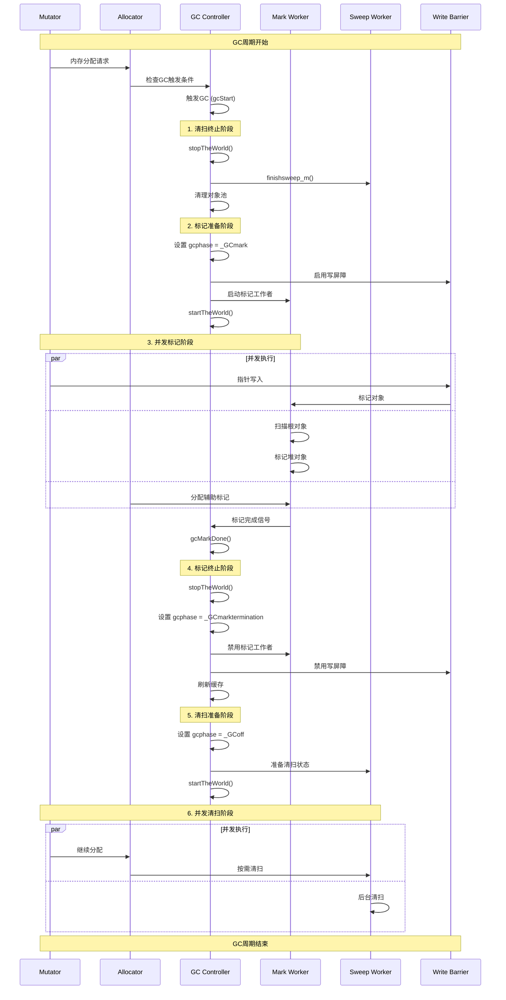
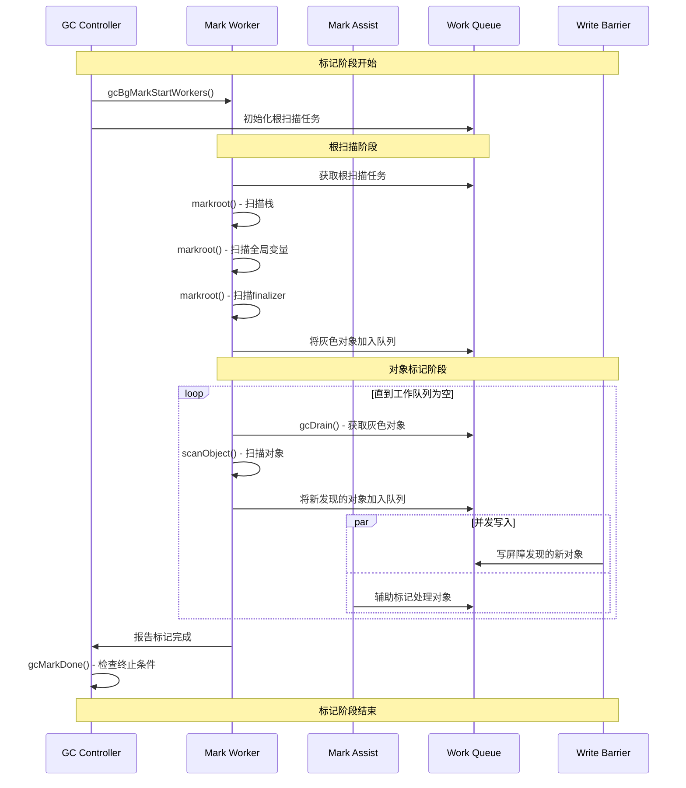
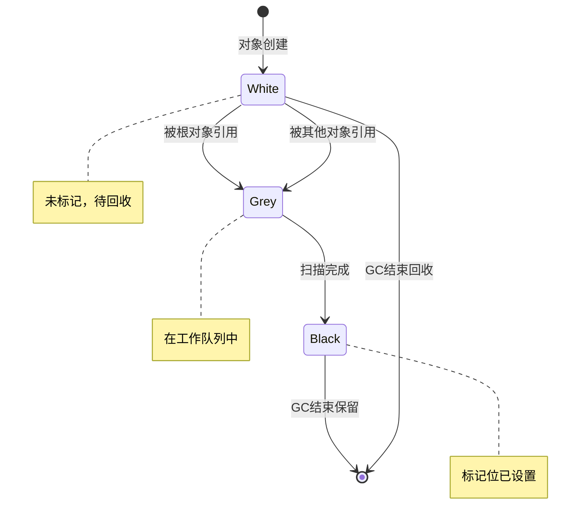
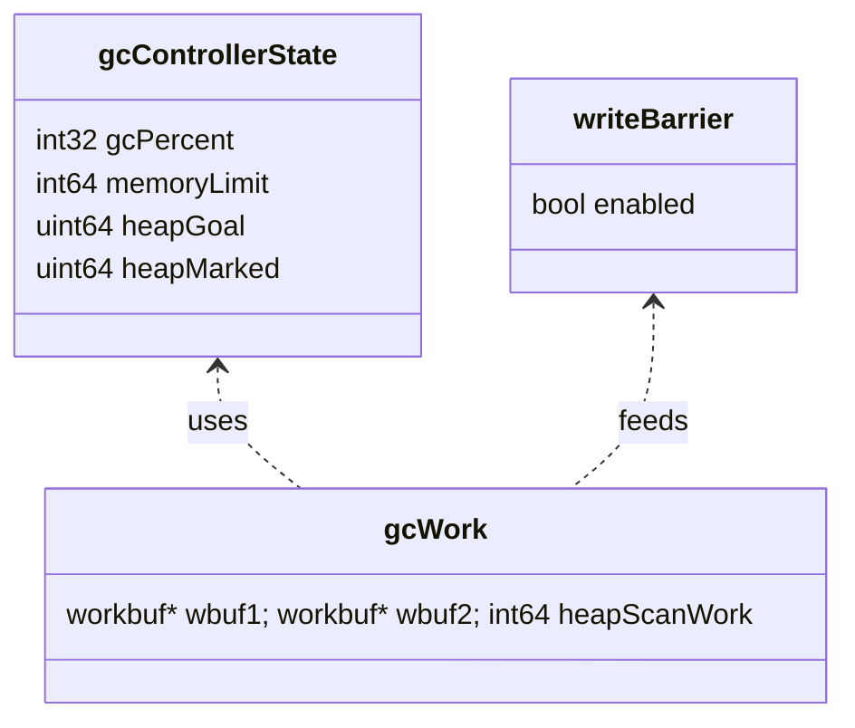

## 概述

Go语言的垃圾收集器采用并发三色标记清扫算法。通过写屏障机制，Go GC能够在保持程序正常运行的同时进行垃圾回收。

Go GC采用并发标记清扫算法，在保证程序正常运行的同时进行垃圾回收。通过写屏障机制和GC调步算法，Go将GC暂停时间控制在亚毫秒级别。

<!--more-->

## 1. GC架构总览

### 1.1 GC的核心使命

垃圾收集器的本质是解决内存管理问题，其目标是：

- **自动回收**：无需手动释放内存，避免内存泄漏
- **低延迟**：最小化STW（Stop The World）时间
- **高吞吐量**：不显著影响程序性能
- **并发安全**：与用户程序并发执行

### 1.2 Go GC架构图



### 1.3 GC状态机



### 1.4 GC完整执行时序图



### 1.5 三色标记时序图



### 1.6 写屏障执行时序图



## 2. 三色标记算法深度解析

### 2.1 三色标记算法原理

文章，三色标记算法是Go GC的核心，它将对象分为三种颜色：

#### 2.1.1 三色定义与状态转换

```go
// 对象的三种颜色状态（概念上的，实际通过位图实现）
const (
    // 白色：未被访问的对象，GC结束后将被回收
    WHITE = iota
    
    // 灰色：已被访问但其引用的对象尚未全部访问
    GREY
    
    // 黑色：已被访问且其引用的对象也已全部访问
    BLACK
)
```

**状态转换规则**：
1. **初始状态**：所有对象都是白色
2. **根对象标记**：从GC roots开始，将直接可达对象标记为灰色
3. **灰色对象处理**：取出灰色对象，扫描其引用，将引用的白色对象标记为灰色，然后将当前对象标记为黑色
4. **终止条件**：当没有灰色对象时，标记阶段结束
5. **清扫阶段**：回收所有剩余的白色对象

#### 2.1.2 三色不变性

**三色不变性（Tri-color Invariant）**是并发GC正确性的基础：

```go
// 强三色不变性：黑色对象不能直接指向白色对象
// 弱三色不变性：黑色对象可以指向白色对象，但必须存在从灰色对象到该白色对象的路径

// 违反三色不变性的示例
func violateTricolorInvariant() {
    // 假设A是黑色对象，B是白色对象
    // 如果执行 A.field = B，就违反了强三色不变性
    // 这时需要写屏障来维护不变性
}
```

### 2.2 写屏障机制深度分析

#### 2.2.1 混合写屏障（Hybrid Write Barrier）

Go 1.8引入了混合写屏障，结合了Dijkstra写屏障和Yuasa删除屏障的优点：

```go
// 混合写屏障的伪代码实现
func hybridWriteBarrier(slot *unsafe.Pointer, ptr unsafe.Pointer) {
    // Dijkstra写屏障：标记新值
    if ptr != nil && !isBlack(ptr) {
        shade(ptr) // 将ptr标记为灰色
    }
    
    // Yuasa删除屏障：标记旧值（在某些条件下）
    oldPtr := *slot
    if oldPtr != nil && !isBlack(oldPtr) && needShadeOld(slot) {
        shade(oldPtr)
    }
    
    // 执行实际的指针写入
    *slot = ptr
}

// 实际的Go运行时写屏障实现
func gcWriteBarrier(slot *unsafe.Pointer, ptr unsafe.Pointer) {
    if writeBarrier.enabled {
        if ptr != nil {
            // 检查ptr是否需要标记
            if !inheap(ptr) || isBlack(ptr) {
                goto write
            }
            // 将ptr加入写屏障缓冲区
            wbBufFlush1(getg().m.p.ptr())
            *(*uintptr)(unsafe.Pointer(&writeBarrier.buf[writeBarrier.buf.next])) = uintptr(ptr)
            writeBarrier.buf.next++
            if writeBarrier.buf.next == len(writeBarrier.buf.buf) {
                wbBufFlush(nil, 0)
            }
        }
    }
write:
    *slot = ptr
}
```

#### 2.2.2 写屏障的性能优化

**批量处理机制**：

```go
// 写屏障缓冲区结构
type wbBuf struct {
    next uintptr        // 下一个可用位置
    end  uintptr        // 缓冲区结束位置
    buf  [wbBufEntries]uintptr // 缓冲区数组
}

// 批量刷新写屏障缓冲区
func wbBufFlush(dst *wbBuf, src uintptr) {
    // 获取当前P的写屏障缓冲区
    systemstack(func() {
        // 批量处理缓冲区中的指针
        for i := uintptr(0); i < src; i++ {
            ptr := (*wbBuf)(unsafe.Pointer(&dst.buf[i]))
            // 标记指针指向的对象
            greyobject(uintptr(unsafe.Pointer(ptr)), 0, 0, span, gcw, 0)
        }
    })
}
```

### 2.3 并发标记的实现机制

#### 2.3.1 标记工作者（Mark Workers）

```go
// GC标记工作者的类型
const (
    // 专用标记工作者：专门用于GC标记
    gcMarkWorkerDedicatedMode = iota
    
    // 分数标记工作者：部分时间用于GC标记
    gcMarkWorkerFractionalMode
    
    // 空闲标记工作者：在空闲时进行GC标记
    gcMarkWorkerIdleMode
)

// 标记工作者的主循环
func gcBgMarkWorker() {
    gp := getg()
    
    for {
        // 等待GC开始
        gopark(func(gp *g, parkp unsafe.Pointer) bool {
            // 检查是否有标记工作
            return gcMarkWorkAvailable(nil)
        }, nil, waitReasonGCWorkerIdle, traceEvGoBlock, 0)
        
        // 获取当前P
        pp := gp.m.p.ptr()
        
        // 根据模式执行不同的标记策略
        switch pp.gcMarkWorkerMode {
        case gcMarkWorkerDedicatedMode:
            // 专用模式：持续标记直到没有工作
            gcDrain(&pp.gcw, gcDrainUntilPreempt|gcDrainFlushBgCredit)
            
        case gcMarkWorkerFractionalMode:
            // 分数模式：标记一定时间后让出CPU
            gcDrain(&pp.gcw, gcDrainFractional|gcDrainUntilPreempt|gcDrainFlushBgCredit)
            
        case gcMarkWorkerIdleMode:
            // 空闲模式：在空闲时进行标记
            gcDrain(&pp.gcw, gcDrainIdle|gcDrainUntilPreempt|gcDrainFlushBgCredit)
        }
    }
}
```

#### 2.3.2 工作窃取机制

```go
// GC工作窃取的实现
func gcDrain(gcw *gcWork, flags gcDrainFlags) {
    gp := getg().m.curg
    preemptible := flags&gcDrainUntilPreempt != 0
    flushBgCredit := flags&gcDrainFlushBgCredit != 0
    idle := flags&gcDrainIdle != 0
    
    initScanFlushUnits := gcw.scanWork
    
    // 主标记循环
    for {
        // 从本地工作缓存获取对象
        var b uintptr
        if idle && pollWork() {
            // 空闲模式下检查是否有其他工作
            goto done
        }
        
        // 尝试从本地缓存获取工作
        if b = gcw.tryGetFast(); b == 0 {
            // 本地缓存为空，尝试从全局获取
            if b = gcw.tryGet(); b == 0 {
                // 全局也为空，尝试工作窃取
                if !gcMarkWorkAvailable(nil) {
                    // 没有更多工作，退出
                    break
                }
                // 从其他P窃取工作
                if b = gcw.balance(); b == 0 {
                    break
                }
            }
        }
        
        // 扫描获取到的对象
        scanobject(b, gcw)
        
        // 检查是否需要让出CPU
        if preemptible && gp.preempt {
            break
        }
    }
    
done:
    // 刷新扫描工作统计
    if flushBgCredit {
        gcFlushBgCredit(gcw.scanWork - initScanFlushUnits)
    }
}
```

### 2.4 GC触发机制深度分析

#### 2.4.1 自适应GC调节

```go
// GC触发条件的判断
type gcTrigger struct {
    kind gcTriggerKind // 触发类型
    now  int64         // 当前时间
    n    uint32        // 强制GC的次数
}

const (
    gcTriggerHeap gcTriggerKind = iota // 基于堆大小触发
    gcTriggerTime                      // 基于时间触发
    gcTriggerCycle                     // 基于周期触发
)

// 检查是否应该触发GC
func (t gcTrigger) test() bool {
    if !memstats.enablegc || panicking != 0 || gcphase != _GCoff {
        return false
    }
    
    switch t.kind {
    case gcTriggerHeap:
        // 基于堆大小的触发逻辑
        trigger := gcController.heapGoal
        return memstats.heap_live >= trigger
        
    case gcTriggerTime:
        // 基于时间的触发逻辑（默认2分钟）
        if gcController.gcPercent.Load() < 0 {
            return false
        }
        lastgc := int64(atomic.Load64(&memstats.last_gc_nanotime))
        return lastgc != 0 && t.now-lastgc > forcegcperiod
        
    case gcTriggerCycle:
        // 基于周期的强制触发
        return int32(t.n-work.cycles) > 0
    }
    return true
}
```

#### 2.4.2 GC调节算法

```go
// GC调节器的核心算法
func (c *gcControllerState) endCycle(now int64, procs int, userForced bool) {
    // 计算本轮GC的统计信息
    work := c.heapScanWork.Load()
    duration := now - c.markStartTime
    
    // 更新GC目标
    oldGoal := c.heapGoal
    c.heapGoal = c.calcHeapGoal()
    
    // 调整GC触发比例
    if !userForced {
        totalTime := c.totalTime + duration
        utilization := gcGoalUtilization
        
        // 基于CPU利用率调整触发比例
        if utilization < gcBackgroundUtilization {
            // CPU利用率过低，可以更频繁地GC
            c.gcPercent.Store(c.gcPercent.Load() - 1)
        } else if utilization > gcBackgroundUtilization*1.1 {
            // CPU利用率过高，减少GC频率
            c.gcPercent.Store(c.gcPercent.Load() + 1)
        }
    }
    
    // 更新统计信息
    c.lastHeapGoal = oldGoal
    c.totalTime = totalTime
    c.cycles++
}
```

## 3. 核心数据结构深度解析

### 3.1 GC控制器结构体

```go
// gcControllerState 是GC控制器的核心状态结构
// 负责管理GC的触发时机、调节参数和性能统计
// 这是Go GC自适应调节机制的核心组件
type gcControllerState struct {
    // ==================== GC调节参数 ====================
    // gcPercent 是GOGC环境变量的值，控制GC触发频率
    // 默认值100表示当堆大小增长100%时触发GC
    // 值越小GC越频繁，内存占用越低但CPU开销越大
    // 设置为负数可以禁用GC
    gcPercent atomic.Int32
    
    // memoryLimit 是软内存限制（字节数）
    // 当接近此限制时，GC会更积极地回收内存
    // 通过GOMEMLIMIT环境变量或debug.SetMemoryLimit()设置
    // 0表示无限制
    memoryLimit atomic.Int64
    
    // ==================== 堆大小管理 ====================
    // heapMinimum 是最小堆大小，避免小堆过于频繁的GC
    // 当堆小于此值时，GC触发阈值会被调整
    // 通常设置为4MB，平衡启动性能和内存使用
    heapMinimum uint64
    
    // runway 是GC跑道，为GC提供缓冲空间
    // 表示从GC触发到标记完成期间允许分配的内存量
    // 动态调整以适应不同的分配模式
    runway atomic.Uint64
    
    // ==================== 性能调节参数 ====================
    // consMark 是分配速率与扫描速率的比值
    // 用于计算辅助标记的工作量
    // 值越大说明分配越快，需要更多辅助标记
    consMark float64
    
    // ==================== 堆大小统计 ====================
    // heapLive 是当前活跃堆大小（字节数）
    // 包括所有已分配但未回收的对象
    // 实时更新，用于GC触发判断
    heapLive atomic.Uint64
    
    // heapMarked 是上次GC标记阶段结束时的堆大小
    // 用作下次GC触发阈值的基准
    // 只在GC标记完成时更新
    heapMarked uint64
    
    // heapGoal 是触发下次GC的堆大小目标
    // 基于heapMarked和gcPercent计算
    // 当heapLive达到此值时触发GC
    heapGoal uint64
    
    // ==================== 扫描工作量统计 ====================
    // heapScanWork 是堆对象扫描工作量（字节数）
    // 用于计算扫描进度和辅助标记需求
    heapScanWork atomic.Int64
    
    // stackScanWork 是栈扫描工作量（字节数）
    // 包括所有goroutine栈的扫描工作
    stackScanWork atomic.Int64
    
    // globalsScanWork 是全局变量扫描工作量（字节数）
    // 包括全局变量和finalizer队列的扫描
    globalsScanWork atomic.Int64
    
    // ==================== 辅助标记统计 ====================
    // assistTime 是辅助标记消耗的总时间（纳秒）
    // 用于性能分析和调节
    assistTime atomic.Int64
    
    // assistBytes 是辅助标记处理的总字节数
    // 用于计算辅助标记效率
    assistBytes atomic.Int64
    
    // assistBytesPerWork 是每单位工作对应的辅助字节数
    // 用于动态调整辅助标记强度
    assistBytesPerWork atomic.Float64
    
    // assistWorkPerByte 是每字节分配需要的辅助工作量
    // 用于计算分配时的辅助标记需求
    assistWorkPerByte atomic.Float64
    
    // ==================== 后台扫描管理 ====================
    // bgScanCredit 是后台扫描的信用额度
    // 当后台扫描超前时，可以减少辅助标记的压力
    // 负值表示需要更多辅助标记
    bgScanCredit atomic.Int64
}
```

### 2.2 GC工作状态结构体

```go
// gcWork 是GC工作者的本地工作状态
// 每个参与GC的goroutine都有自己的gcWork实例
// 用于管理标记工作的本地缓冲和统计信息
type gcWork struct {
    // ==================== 工作缓冲区管理 ====================
    // wbuf1, wbuf2 是双缓冲工作队列
    // 存储待扫描的对象指针，实现高效的工作分发
    // 当一个缓冲区满时，切换到另一个缓冲区
    // 空的缓冲区会被放回全局工作池供其他工作者使用
    wbuf1, wbuf2 *workbuf
    
    // ==================== 扫描工作统计 ====================
    // heapScanWork 记录此工作者已扫描的堆字节数
    // 用于计算扫描进度和负载均衡
    // 定期汇总到全局gcController中
    heapScanWork int64
    
    // ==================== 写屏障缓冲区 ====================
    // ptrBuf 是写屏障的本地缓冲区
    // 存储写屏障捕获的指针，避免频繁的全局同步
    // 大小为一个页面，平衡内存使用和性能
    // 满时会刷新到全局工作队列
    ptrBuf *[gc.PageSize / goarch.PtrSize]uintptr
    
    // ==================== 工作调度标志 ====================
    // mayNeedWorker 表示是否可能需要更多工作者
    // 当发现大量工作时设置此标志
    // GC调度器会据此决定是否启动更多后台工作者
    mayNeedWorker bool
}
```

### 2.3 写屏障结构体

```go
// writeBarrier 是全局写屏障控制结构
// 编译器生成的写屏障代码会检查这个结构来决定是否执行写屏障逻辑
var writeBarrier struct {
    // ==================== 写屏障开关 ====================
    // enabled 控制写屏障是否启用
    // 编译器生成的代码会检查此标志
    // 只在GC标记阶段为true，其他时候为false
    // 这样可以避免非GC期间的写屏障开销
    enabled bool    
    
    // ==================== 内存对齐填充 ====================
    // pad 是填充字节，确保整个结构体的对齐
    // 在32位系统上保证后续字段的正确对齐
    pad     [3]byte 
    
    // alignme 用于确保整个结构体64位对齐
    // 这对于原子操作的性能很重要
    // 虽然当前版本可能不需要，但为未来扩展预留
    alignme uint64  
}
```

## 3. GC时序图

### 3.1 完整GC周期时序图



### 3.2 标记阶段详细时序图



## 4. GC触发机制

### 4.1 触发条件枚举

```go
type gcTriggerKind int

const (
    // 堆大小触发：当堆大小达到控制器计算的触发大小时
    gcTriggerHeap gcTriggerKind = iota
    
    // 时间触发：距离上次GC超过forcegcperiod（2分钟）
    gcTriggerTime
    
    // 周期触发：手动调用runtime.GC()
    gcTriggerCycle
)
```

### 4.2 触发条件检测

```go
// test 检查是否应该触发GC
// 这是GC触发决策的核心函数，综合考虑各种触发条件
func (t gcTrigger) test() bool {
    // ==================== 前置条件检查 ====================
    // 检查GC是否被禁用、程序是否在panic、或GC是否已在运行
    if !memstats.enablegc || panicking.Load() != 0 || gcphase != _GCoff {
        return false  // 任何一个条件不满足都不能触发GC
    }
    
    // ==================== 根据触发类型判断 ====================
    switch t.kind {
    case gcTriggerHeap:
        // 堆大小触发：检查当前堆大小是否达到触发阈值
        trigger, _ := gcController.trigger()  // 获取触发阈值
        return gcController.heapLive.Load() >= trigger  // 比较当前堆大小
        
    case gcTriggerTime:
        // 时间触发：检查是否超过强制GC时间间隔
        if gcController.gcPercent.Load() < 0 {
            return false  // GOGC<0时禁用时间触发
        }
        // 获取上次GC的时间戳
        lastgc := int64(atomic.Load64(&memstats.last_gc_nanotime))
        // 检查是否超过强制GC周期（通常为2分钟）
        return lastgc != 0 && t.now-lastgc > forcegcperiod
        
    case gcTriggerCycle:
        // 周期触发：检查是否有待处理的GC周期
        // 通常由runtime.GC()手动触发
        return int32(t.n-work.cycles.Load()) > 0
    }
    
    // 默认返回true，但实际上不应该到达这里
    return true
}
```

### 4.3 堆目标计算

```go
// trigger 计算GC触发阈值和堆目标
// 这是GC调节算法的核心，平衡内存使用和GC频率
func (c *gcControllerState) trigger() (uint64, uint64) {
    // ==================== 获取基础参数 ====================
    // 计算堆目标和最小触发点
    goal, minTrigger := c.heapGoalInternal()
    
    // ==================== 边界情况处理 ====================
    // 如果当前标记的堆大小已经超过目标，立即触发GC
    if c.heapMarked >= goal {
        return goal, goal  // 触发点和目标都设为goal
    }
    
    // ==================== 最小触发点调整 ====================
    // 确保触发点不低于上次GC后的堆大小
    // 这防止了在堆大小没有增长时就触发GC
    if minTrigger < c.heapMarked {
        minTrigger = c.heapMarked
    }
    
    // ==================== 触发下界计算 ====================
    // 计算触发下界，防止RSS（常驻内存集）过度增长
    // 使用比例计算：在heapMarked和goal之间按比例设置下界
    // triggerRatioDen和minTriggerRatioNum是调节参数
    triggerLowerBound := ((goal-c.heapMarked)/triggerRatioDen)*minTriggerRatioNum + c.heapMarked
    if minTrigger < triggerLowerBound {
        minTrigger = triggerLowerBound  // 确保不低于下界
    }
    
    // ==================== 触发上界计算 ====================
    // 计算触发上界，防止GC触发过晚
    // 确保在达到堆目标前有足够时间完成GC
    maxTrigger := ((goal-c.heapMarked)/triggerRatioDen)*maxTriggerRatioNum + c.heapMarked
    
    // 返回最终的触发点和堆目标
    // minTrigger: 实际的GC触发阈值
    // goal: 堆大小目标，用于其他计算
    return minTrigger, goal
}
```

## 5. 三色标记算法实现

### 5.1 三色标记原理

Go GC采用三色标记算法，将对象分为三种颜色：

- **白色（White）**：未被扫描的对象，可能是垃圾
- **灰色（Grey）**：已被扫描但其引用的对象未全部扫描
- **黑色（Black）**：已被扫描且其引用的对象也已扫描

### 5.2 标记状态转换图



### 5.3 对象扫描核心函数

```go
// scanObject 扫描对象并标记其引用的所有对象
// 这是三色标记算法中将灰色对象变为黑色的核心函数
func scanObject(b uintptr, gcw *gcWork) {
    // ==================== 获取对象元信息 ====================
    // 获取对象的堆位图信息，用于确定哪些字段是指针
    hbits := heapBitsForAddr(b, 0)
    
    // 获取对象所在的span，包含大小和类型信息
    s := spanOfUnchecked(b)
    n := s.elemsize  // 对象大小
    
    // ==================== 安全性检查 ====================
    if n == 0 {
        // 不应该扫描已释放的对象
        throw("scanObject of a free object")
    }
    
    // ==================== 大对象处理 ====================
    if n > maxObletBytes {
        // 大对象需要分块扫描以减少单次扫描的延迟
        // 这样可以避免长时间阻塞其他goroutine
        if b == s.freeIndexForScan {
            // 这是span中第一个对象，扫描整个span
            // 使用分块扫描策略，每次只扫描一小部分
            scanobject_chunked(b, gcw)
            return
        }
    }
    
    // ==================== 小对象处理 ====================
    // 小对象可以一次性扫描完成，不会造成明显延迟
    
    // 更新统计信息
    gcw.bytesMarked += uint64(n)      // 记录已标记的字节数
    gcw.heapScanWork += int64(n)      // 记录扫描工作量
    
    // 执行实际的扫描工作
    // 使用堆位图精确识别指针字段，避免误标记
    scanblock(b, n, hbits.bits(), gcw, nil)
}

// scanblock 扫描内存块，查找指针并标记引用的对象
// 这是GC扫描的核心函数，支持精确扫描和保守扫描两种模式
func scanblock(b0, n0 uintptr, ptrmask *uint8, gcw *gcWork, stk *stackScanState) {
    // ==================== 初始化扫描参数 ====================
    b := b0  // 内存块起始地址
    n := n0  // 内存块大小
    
    // ==================== 主扫描循环 ====================
    for i := uintptr(0); i < n; {
        // ==================== 扫描模式选择 ====================
        if ptrmask == nil {
            // ==================== 保守扫描模式 ====================
            // 没有类型信息，需要保守地扫描每个可能的指针位置
            // 这通常用于栈扫描或没有类型信息的内存区域
            for ; i < n; i += goarch.PtrSize {
                // 检查每个指针大小的位置
                if *(*uintptr)(unsafe.Pointer(b + i)) != 0 {
                    // 发现非零值，可能是指针，进行保守扫描
                    scanConservative(b+i, goarch.PtrSize, nil, gcw, stk)
                }
            }
            return
        }
        
        // ==================== 精确扫描模式 ====================
        // 使用类型信息中的指针掩码进行精确扫描
        // 每个字节的掩码表示8个指针大小位置的指针信息
        
        // 读取当前字节的指针掩码
        bits := uint32(*ptrmask)
        ptrmask = add1(ptrmask)  // 移动到下一个掩码字节
        
        // 处理当前掩码字节对应的8个位置
        for j := 0; j < 8 && i < n; j++ {
            if bits&1 != 0 {
                // ==================== 指针字段处理 ====================
                // 当前位置确实是指针字段
                p := *(*uintptr)(unsafe.Pointer(b + i))  // 读取指针值
                
                if p != 0 {
                    // 指针非空，需要查找并标记目标对象
                    if obj, span, objIndex := findObject(p, b, i); obj != 0 {
                        // 找到有效对象，将其标记为灰色（加入扫描队列）
                        greyobject(obj, b, i, span, gcw, objIndex)
                    }
                }
            }
            
            // 移动到下一个位置
            bits >>= 1              // 处理掩码的下一位
            i += goarch.PtrSize     // 移动到下一个指针位置
        }
    }
}
```

### 5.4 对象标记函数

```go
// greyobject 将对象标记为灰色并加入工作队列
// 这是三色标记算法中将白色对象变为灰色的核心函数
func greyobject(obj, base, off uintptr, span *mspan, gcw *gcWork, objIndex uintptr) {
    // ==================== 对象状态检查 ====================
    // 检查对象是否已经被释放
    if span.isFree(objIndex) {
        return // 对象已被释放，无需标记
    }
    
    // ==================== 标记位检查 ====================
    // 获取对象的标记位
    mbits := span.markBitsForIndex(objIndex)
    if mbits.isMarked() {
        return // 对象已被标记（黑色或灰色），避免重复处理
    }
    
    // ==================== 执行标记操作 ====================
    // 将对象标记为已访问（从白色变为灰色）
    // 这是一个原子操作，确保并发安全
    mbits.setMarked()
    
    // ==================== 扫描需求判断 ====================
    // 检查对象是否包含指针字段
    if span.spanclass.noscan() {
        // 对象不包含指针（如[]byte, string等）
        // 直接标记为黑色，无需进一步扫描
        gcw.bytesMarked += uint64(span.elemsize)
        return
    }
    
    // ==================== 加入工作队列 ====================
    // 对象包含指针，需要扫描其引用的对象
    // 将对象加入工作队列，等待后续扫描（保持灰色状态）
    
    // 尝试快速放入本地工作缓冲区
    if !gcw.putFast(obj) {
        // 本地缓冲区满，使用慢路径放入全局工作队列
        gcw.put(obj)
    }
}
```

## 6. 写屏障机制

### 6.1 混合写屏障原理

Go使用混合写屏障，结合了Yuasa删除屏障和Dijkstra插入屏障：

```go
// 伪代码：混合写屏障
writePointer(slot, ptr):
    shade(*slot)           // Yuasa删除屏障：标记被覆盖的对象
    if current stack is grey:
        shade(ptr)         // Dijkstra插入屏障：标记新写入的对象
    *slot = ptr
```

### 6.2 写屏障实现

```go
// gcWriteBarrier 是写屏障的汇编入口点
// 在 asm_amd64.s 中实现
TEXT runtime·gcWriteBarrier<ABIInternal>(SB),NOSPLIT,$112
    // 保存寄存器
    MOVQ    AX, 96(SP)
    MOVQ    CX, 104(SP)
    
    // 获取写屏障缓冲区
    get_tls(CX)
    MOVQ    g(CX), CX
    MOVQ    g_m(CX), CX
    MOVQ    m_p(CX), CX
    MOVQ    (p_wbBuf+wbBuf_next)(CX), AX
    
    // 检查缓冲区是否已满
    CMPQ    AX, (p_wbBuf+wbBuf_end)(CX)
    JEQ     flush
    
    // 将指针写入缓冲区
    MOVQ    DI, (AX)        // 写入被覆盖的指针
    ADDQ    $8, AX
    MOVQ    AX, (p_wbBuf+wbBuf_next)(CX)
    
    // 恢复寄存器并返回
    MOVQ    96(SP), AX
    MOVQ    104(SP), CX
    RET

flush:
    // 缓冲区已满，刷新到全局队列
    CALL    runtime·wbBufFlush(SB)
    JMP     retry
```

### 6.3 写屏障缓冲区刷新

```go
// wbBufFlush 刷新写屏障缓冲区
func wbBufFlush() {
    pp := getg().m.p.ptr()
    
    // 获取当前缓冲区
    start := uintptr(unsafe.Pointer(pp.wbBuf.buf))
    n := (pp.wbBuf.next - start) / unsafe.Sizeof(pp.wbBuf.buf[0])
    
    if n == 0 {
        return
    }
    
    // 处理缓冲区中的每个指针
    gcw := &pp.gcw
    for i := uintptr(0); i < n; i++ {
        p := *(*uintptr)(unsafe.Pointer(start + i*unsafe.Sizeof(pp.wbBuf.buf[0])))
        if p != 0 {
            if obj, span, objIndex := findObject(p, 0, 0); obj != 0 {
                greyobject(obj, 0, 0, span, gcw, objIndex)
            }
        }
    }
    
    // 重置缓冲区
    pp.wbBuf.next = start
}
```

## 7. 标记工作者和辅助机制

### 7.1 标记工作者类型

```go
type gcMarkWorkerMode int

const (
    // 非工作者：普通goroutine
    gcMarkWorkerNotWorker gcMarkWorkerMode = iota
    
    // 专用工作者：专门用于GC标记
    gcMarkWorkerDedicatedMode
    
    // 分数工作者：部分时间用于GC标记
    gcMarkWorkerFractionalMode
    
    // 空闲工作者：在空闲时进行GC标记
    gcMarkWorkerIdleMode
)
```

### 7.2 后台标记工作者

```go
// gcBgMarkWorker 后台标记工作者的主循环
func gcBgMarkWorker() {
    gp := getg()
    
    // 通知GC控制器工作者已准备就绪
    type parkInfo struct {
        m      muintptr // 绑定的M
        attach puintptr // 要绑定的P
    }
    
    gp.m.preemptoff = "GC worker init"
    node := (*gcBgMarkWorkerNode)(gcBgMarkWorkerPool.pop())
    if node == nil {
        node = new(gcBgMarkWorkerNode)
    }
    node.gp.set(gp)
    
    notewakeup(&work.bgMarkReady)
    
    for {
        // 等待GC开始
        gopark(func(gp *g, parkp unsafe.Pointer) bool {
            // 检查是否应该继续等待
            return true
        }, unsafe.Pointer(&park), waitReasonGCWorkerIdle, traceBlockSystemGoroutine, 0)
        
        // 执行标记工作
        systemstack(func() {
            // 设置工作者模式
            casgstatus(gp, _Grunning, _Gwaiting)
            
            switch pp.gcMarkWorkerMode {
            case gcMarkWorkerDedicatedMode:
                gcDrain(&pp.gcw, gcDrainUntilPreempt|gcDrainFlushBgCredit)
                
            case gcMarkWorkerFractionalMode:
                gcDrain(&pp.gcw, gcDrainFractional|gcDrainUntilPreempt|gcDrainFlushBgCredit)
                
            case gcMarkWorkerIdleMode:
                gcDrain(&pp.gcw, gcDrainIdle|gcDrainUntilPreempt|gcDrainFlushBgCredit)
            }
            
            casgstatus(gp, _Gwaiting, _Grunning)
        })
    }
}
```

### 7.3 分配辅助标记

```go
// gcAssistAlloc 在内存分配时执行辅助标记
func gcAssistAlloc(gp *g) {
    // 计算需要执行的扫描工作量
    assistBytesPerWork := gcController.assistBytesPerWork.Load()
    assistWorkPerByte := gcController.assistWorkPerByte.Load()
    debtBytes := -gp.gcAssistBytes
    scanWork := int64(assistWorkPerByte * float64(debtBytes))
    
    if scanWork < gcOverAssistWork {
        scanWork = gcOverAssistWork
    }
    
    // 尝试从后台扫描信用中偷取工作
    bgScanCredit := gcController.bgScanCredit.Load()
    stolen := int64(0)
    if bgScanCredit > 0 {
        if bgScanCredit < scanWork {
            stolen = bgScanCredit
            gp.gcAssistBytes += 1 + int64(assistBytesPerWork*float64(stolen))
        } else {
            stolen = scanWork
            gp.gcAssistBytes += debtBytes
        }
        gcController.bgScanCredit.Add(-stolen)
        scanWork -= stolen
        
        if scanWork == 0 {
            return // 成功偷取了所有需要的信用
        }
    }
    
    // 执行辅助标记工作
    systemstack(func() {
        gcAssistAlloc1(gp, scanWork)
    })
}

// gcAssistAlloc1 执行实际的辅助标记工作
func gcAssistAlloc1(gp *g, scanWork int64) {
    if atomic.Load(&gcBlackenEnabled) == 0 {
        gp.gcAssistBytes = 0
        return
    }
    
    // 执行扫描工作
    gcw := &getg().m.p.ptr().gcw
    workDone := gcDrainN(gcw, scanWork)
    
    // 更新辅助字节数
    assistBytesPerWork := gcController.assistBytesPerWork.Load()
    gp.gcAssistBytes += 1 + int64(assistBytesPerWork*float64(workDone))
}
```

## 8. 根对象扫描

### 8.1 根对象类型

```go
const (
    fixedRootFinalizers = iota  // finalizer队列
    fixedRootFreeGStacks       // 空闲G栈
    fixedRootCleanups          // 清理块
    fixedRootCount
)
```

### 8.2 根扫描准备

```go
// gcPrepareMarkRoots 准备根扫描任务
func gcPrepareMarkRoots() {
    assertWorldStopped()
    
    // 计算数据段和BSS段的根块数量
    nBlocks := func(bytes uintptr) int {
        return int(divRoundUp(bytes, rootBlockBytes))
    }
    
    work.nDataRoots = 0
    work.nBSSRoots = 0
    
    // 扫描全局变量
    for _, datap := range activeModules() {
        nDataRoots := nBlocks(datap.edata - datap.data)
        if nDataRoots > work.nDataRoots {
            work.nDataRoots = nDataRoots
        }
        
        nBSSRoots := nBlocks(datap.ebss - datap.bss)
        if nBSSRoots > work.nBSSRoots {
            work.nBSSRoots = nBSSRoots
        }
    }
    
    // 扫描span根（用于finalizer特殊处理）
    mheap_.markArenas = mheap_.heapArenas[:len(mheap_.heapArenas):len(mheap_.heapArenas)]
    work.nSpanRoots = len(mheap_.markArenas) * (pagesPerArena / pagesPerSpanRoot)
    
    // 扫描栈
    work.stackRoots = allGsSnapshot()
    work.nStackRoots = len(work.stackRoots)
    
    // 计算总的根扫描任务数
    work.markrootJobs = uint32(fixedRootCount + work.nDataRoots + work.nBSSRoots + work.nSpanRoots + work.nStackRoots)
    
    // 计算各类型根的基础索引
    work.baseData = uint32(fixedRootCount)
    work.baseBSS = work.baseData + uint32(work.nDataRoots)
    work.baseSpans = work.baseBSS + uint32(work.nBSSRoots)
    work.baseStacks = work.baseSpans + uint32(work.nSpanRoots)
    work.baseEnd = work.baseStacks + uint32(work.nStackRoots)
}
```

### 8.3 根扫描执行

```go
// markroot 执行根扫描任务
func markroot(gcw *gcWork, i uint32, flushBgCredit bool) int64 {
    var workDone int64
    var workCounter *atomic.Int64
    
    switch {
    case work.baseData <= i && i < work.baseBSS:
        // 扫描数据段
        workCounter = &gcController.globalsScanWork
        for _, datap := range activeModules() {
            workDone += markrootBlock(datap.data, datap.edata-datap.data, 
                datap.gcdatamask.bytedata, gcw, int(i-work.baseData))
        }
        
    case work.baseBSS <= i && i < work.baseSpans:
        // 扫描BSS段
        workCounter = &gcController.globalsScanWork
        for _, datap := range activeModules() {
            workDone += markrootBlock(datap.bss, datap.ebss-datap.bss,
                datap.gcbssmask.bytedata, gcw, int(i-work.baseBSS))
        }
        
    case i == fixedRootFinalizers:
        // 扫描finalizer队列
        for fb := allfin; fb != nil; fb = fb.alllink {
            cnt := uintptr(atomic.Load(&fb.cnt))
            scanblock(uintptr(unsafe.Pointer(&fb.fin[0])), 
                cnt*unsafe.Sizeof(fb.fin[0]), &finptrmask[0], gcw, nil)
        }
        
    case i == fixedRootFreeGStacks:
        // 扫描空闲G栈
        systemstack(markrootFreeGStacks)
        
    case work.baseSpans <= i && i < work.baseStacks:
        // 扫描span特殊处理
        markrootSpans(gcw, int(i-work.baseSpans))
        
    default:
        // 扫描goroutine栈
        workCounter = &gcController.stackScanWork
        gp := work.stackRoots[i-work.baseStacks]
        
        systemstack(func() {
            // 暂停goroutine并扫描其栈
            stopped := suspendG(gp)
            if stopped.dead {
                gp.gcscandone = true
                return
            }
            if gp.gcscandone {
                throw("g already scanned")
            }
            workDone += scanstack(gp, gcw)
            gp.gcscandone = true
            resumeG(stopped)
        })
    }
    
    // 更新工作计数器
    if workCounter != nil && workDone != 0 {
        workCounter.Add(workDone)
        if flushBgCredit {
            gcFlushBgCredit(workDone)
        }
    }
    return workDone
}
```

## 9. 栈扫描机制

### 9.1 栈扫描状态

```go
type stackScanState struct {
    stack stack           // 栈边界
    conservative bool     // 是否需要保守扫描
    
    // 指向栈对象的指针缓冲区
    buf     *stackWorkBuf  // 精确指针
    cbuf    *stackWorkBuf  // 保守指针
    freeBuf *stackWorkBuf  // 空闲缓冲区
    
    // 栈对象列表
    head  *stackObjectBuf
    tail  *stackObjectBuf
    nobjs int
    
    // 快速查找的二叉树根
    root *stackObject
}
```

### 9.2 栈扫描实现

```go
// scanstack 扫描goroutine的栈
func scanstack(gp *g, gcw *gcWork) int64 {
    if readgstatus(gp)&_Gscan == 0 {
        print("runtime: gp=", gp, ", goid=", gp.goid, ", gp->atomicstatus=", hex(readgstatus(gp)), "\n")
        throw("scanstack - bad status")
    }
    
    switch readgstatus(gp) &^ _Gscan {
    default:
        print("runtime: gp=", gp, ", goid=", gp.goid, ", gp->atomicstatus=", hex(readgstatus(gp)), "\n")
        throw("mark - bad status")
    case _Gdead:
        return 0
    case _Grunning:
        throw("scanstack: goroutine not stopped")
    case _Grunnable, _Gsyscall, _Gwaiting:
        // 可以安全扫描
    }
    
    if gp == getg() {
        throw("scanstack: scanning self")
    }
    
    // 扫描栈帧
    var state stackScanState
    state.stack = gp.stack
    
    if stackTraceDebug {
        println("stack trace goroutine", gp.goid)
    }
    
    if msanenabled && gp == getg() {
        // 当前goroutine的栈可能包含未初始化的内存
        msanread(unsafe.Pointer(gp.stack.lo), gp.stack.hi-gp.stack.lo)
    }
    
    // 扫描栈上的指针
    scanframeworker := func(frame *stkframe, unused unsafe.Pointer) bool {
        scanframe(frame, unused, &state, gcw)
        return true
    }
    
    // 遍历栈帧
    gentraceback(^uintptr(0), ^uintptr(0), 0, gp, 0, nil, 0x7fffffff, scanframeworker, nil, 0)
    
    // 处理栈对象
    tracebackdefers(gp, scanframeworker, nil)
    
    if state.buf != nil || state.cbuf != nil || state.freeBuf != nil {
        throw("remaining pointer buffers")
    }
    
    // 计算扫描的字节数
    scannedSize := gp.stack.hi - gp.stack.lo
    gcw.heapScanWork += int64(scannedSize)
    
    return int64(scannedSize)
}
```

### 9.3 栈帧扫描

```go
// scanframe 扫描单个栈帧
func scanframe(frame *stkframe, unused unsafe.Pointer, state *stackScanState, gcw *gcWork) {
    if _DebugGC > 1 && frame.continpc != 0 {
        print("scanframe ", funcname(frame.fn), "\n")
    }
    
    locals, args, objs := getStackMap(frame, &state.cache, false)
    
    // 扫描局部变量
    if locals.n > 0 {
        size := uintptr(locals.n) * goarch.PtrSize
        scanblock(frame.varp-size, size, locals.bytedata, gcw, state)
    }
    
    // 扫描函数参数
    if args.n > 0 {
        scanblock(frame.argp, uintptr(args.n)*goarch.PtrSize, args.bytedata, gcw, state)
    }
    
    // 处理栈对象
    if frame.varp != 0 {
        for i := range objs {
            obj := &objs[i]
            off := obj.off
            base := frame.varp // 局部变量基址
            if off >= 0 {
                base = frame.argp // 参数基址
                off = -off - 1
            }
            ptr := base + uintptr(off)
            if ptr < state.stack.lo || ptr >= state.stack.hi {
                continue
            }
            // 记录栈对象
            state.putStackObject(ptr, obj)
        }
    }
}
```

## 10. 并发清扫机制

### 10.1 清扫状态管理

```go
var sweep struct {
    lock    mutex
    g       *g      // 后台清扫goroutine
    parked  bool    // 清扫goroutine是否已暂停
    started bool    // 清扫是否已开始
    
    nbgsweep    uint32  // 后台清扫的span数量
    npausesweep uint32  // 暂停时清扫的span数量
    
    centralIndex sweepClass // 下一个要清扫的central索引
    active       activeSweep // 活跃清扫状态
}

type activeSweep struct {
    spans [2]*gcSweepBuf // 双缓冲区
    
    // 当前正在清扫的缓冲区索引
    curBuf int
}
```

### 10.2 清扫初始化

```go
// gcSweep 初始化清扫阶段
func gcSweep(mode gcMode) bool {
    assertWorldStopped()
    
    if gcphase != _GCoff {
        throw("gcSweep being done but phase is not GCoff")
    }
    
    lock(&mheap_.lock)
    mheap_.sweepgen += 2  // 增加清扫代数
    sweep.active.reset()
    mheap_.pagesSwept.Store(0)
    mheap_.sweepArenas = mheap_.heapArenas
    mheap_.reclaimIndex.Store(0)
    mheap_.reclaimCredit.Store(0)
    unlock(&mheap_.lock)
    
    sweep.centralIndex.clear()
    
    if !concurrentSweep || mode == gcForceBlockMode {
        // 同步清扫模式
        lock(&mheap_.lock)
        mheap_.sweepPagesPerByte = 0
        unlock(&mheap_.lock)
        
        // 刷新所有mcache
        for _, pp := range allp {
            pp.mcache.prepareForSweep()
        }
        
        // 立即清扫所有span
        for sweepone() != ^uintptr(0) {
        }
        
        // 释放工作缓冲区
        prepareFreeWorkbufs()
        for freeSomeWbufs(false) {
        }
        
        mProf_NextCycle()
        mProf_Flush()
        return true
    }
    
    // 并发清扫模式：唤醒后台清扫goroutine
    lock(&sweep.lock)
    if sweep.parked {
        sweep.parked = false
        ready(sweep.g, 0, true)
    }
    unlock(&sweep.lock)
    return false
}
```

### 10.3 后台清扫goroutine

```go
// bgsweep 后台清扫goroutine的主循环
func bgsweep() {
    sweep.g = getg()
    
    lockInit(&sweep.lock, lockRankSweep)
    lock(&sweep.lock)
    sweep.parked = true
    goparkunlock(&sweep.lock, waitReasonGCSweepWait, traceBlockGCSweep, 1)
    
    for {
        for sweepone() != ^uintptr(0) {
            Gosched() // 让出CPU给其他goroutine
        }
        
        for freeSomeWbufs(true) {
            Gosched()
        }
        
        lock(&sweep.lock)
        if !isSweepDone() {
            // 还有清扫工作未完成
            unlock(&sweep.lock)
            continue
        }
        sweep.parked = true
        goparkunlock(&sweep.lock, waitReasonGCSweepWait, traceBlockGCSweep, 1)
    }
}
```

### 10.4 单个span清扫

```go
// sweepone 清扫一个span
func sweepone() uintptr {
    gp := getg()
    
    // 增加清扫计数
    incnwait := atomic.Xadd(&work.nwait, +1)
    if incnwait > work.nproc {
        atomic.Xadd(&work.nwait, -1)
        return ^uintptr(0)
    }
    
    // 查找需要清扫的span
    npages := ^uintptr(0)
    var s *mspan
    
    // 首先尝试从活跃清扫缓冲区获取
    s = sweep.active.tryAcquire()
    if s != nil {
        npages = s.npages
        if s.sweep(false) {
            // 清扫成功，span已被释放
            mheap_.reclaimCredit.Add(npages)
        }
        goto done
    }
    
    // 从central获取span进行清扫
    for sc := sweep.centralIndex.load(); sc < numSweepClasses; sc++ {
        s = mheap_.central[sc].mcentral.sweep(1)
        if s != nil {
            sweep.centralIndex.store(sc + 1)
            npages = s.npages
            goto done
        }
    }
    
    // 没有更多span需要清扫
    npages = ^uintptr(0)
    
done:
    atomic.Xadd(&work.nwait, -1)
    return npages
}
```

## 11. GC性能优化策略

### 11.1 GC调优参数

```go
// 主要的GC调优环境变量
const (
    // GOGC: 控制GC频率，默认100
    // GOGC=100表示当堆大小达到上次GC后的2倍时触发GC
    defaultGOGC = 100
    
    // GOMEMLIMIT: 软内存限制
    // 当接近此限制时，GC会更频繁地运行
    
    // GODEBUG=gctrace=1: 打印GC跟踪信息
    // GODEBUG=gcpacertrace=1: 打印GC调步器跟踪信息
)
```

### 11.2 基于GC的优化建议

#### 1. 减少内存分配

```go
// 使用对象池减少分配
var bufferPool = sync.Pool{
    New: func() interface{} {
        return make([]byte, 1024)
    },
}

func ProcessData(data []byte) {
    buf := bufferPool.Get().([]byte)
    defer bufferPool.Put(buf)
    
    // 使用buf处理数据
}
```

#### 2. 合理设置GOGC

```go
import "runtime/debug"

func init() {
    // 对于内存敏感的应用，可以降低GOGC
    debug.SetGCPercent(50)
    
    // 对于延迟敏感的应用，可以提高GOGC
    debug.SetGCPercent(200)
}
```

#### 3. 避免指针密集的数据结构

```go
// 不好：指针密集，增加GC扫描负担
type BadNode struct {
    Value *int
    Next  *BadNode
}

// 好：减少指针，降低GC压力
type GoodNode struct {
    Value int
    Next  *GoodNode
}
```

### 11.3 GC性能监控

```go
// 监控GC性能的工具函数
func MonitorGC() {
    var m runtime.MemStats
    
    ticker := time.NewTicker(time.Second)
    defer ticker.Stop()
    
    for range ticker.C {
        runtime.ReadMemStats(&m)
        
        fmt.Printf("GC Stats:\n")
        fmt.Printf("  Heap Size: %d KB\n", m.HeapSys/1024)
        fmt.Printf("  Heap In Use: %d KB\n", m.HeapInuse/1024)
        fmt.Printf("  GC Cycles: %d\n", m.NumGC)
        fmt.Printf("  Last GC: %v ago\n", time.Since(time.Unix(0, int64(m.LastGC))))
        fmt.Printf("  GC Pause: %v\n", time.Duration(m.PauseNs[(m.NumGC+255)%256]))
        fmt.Printf("  GC CPU%%: %.2f%%\n", m.GCCPUFraction*100)
        fmt.Println()
    }
}
```

## 12. GC关键路径函数总结

### 12.1 GC启动路径

```text
malloc() -> mallocgc() -> gcTrigger.test() -> gcStart() -> gcBgMarkStartWorkers()
```

### 12.2 标记路径

```text
gcBgMarkWorker() -> gcDrain() -> scanObject() -> greyobject() -> gcWork.put()
```

### 12.3 写屏障路径

```text
编译器插入 -> gcWriteBarrier -> wbBufFlush -> greyobject()
```

### 12.4 清扫路径

```text
gcSweep() -> bgsweep() -> sweepone() -> mspan.sweep()
```

## 13. GC核心优势与发展方向

### 13.1 Go GC的核心优势

Go垃圾收集器通过算法和优化策略，实现了以下特性：

#### 1. 低延迟保证
- **并发执行**：标记和清扫与用户程序并发进行
- **STW最小化**：仅在关键阶段短暂停止世界
- **增量标记**：分批处理大对象，避免长时间阻塞

#### 2. 高吞吐量优化
- **三色标记**：可达性分析算法
- **写屏障优化**：批量处理减少单次开销
- **工作窃取**：负载均衡的并发标记

#### 3. 自适应调节
- **动态触发**：根据分配速率调整GC频率
- **动态工作者**：按需分配标记工作者
- **内存压力感知**：接近内存限制时更频繁GC

### 13.2 未来发展方向

随着硬件技术的发展和应用场景的变化，Go GC也在持续演进：

1. **分代GC**：针对对象生命周期特征优化
2. **区域GC**：减少大堆的GC延迟  
3. **并行优化**：更好地利用多核CPU
4. **内存压缩**：减少内存碎片和提高缓存局部性

## 14. 关键函数调用路径分析

### 14.1 GC触发调用路径

#### 主要触发路径
```
mallocgc() -> shouldhelpgc() -> gcStart() -> 
gcBgMarkStartWorkers() -> gcController.startCycle() -> setGCPhase()
```

#### 详细触发分析

**1. 内存分配触发路径**
```
mallocgc()
├── heapminimum检查           // 检查堆最小值
├── gcController.heapGoal     // 检查堆目标
├── shouldhelpgc()            // 判断是否需要辅助GC
│   ├── gcController.assistTime // 计算辅助时间
│   └── gcAssistAlloc()       // 执行辅助标记
└── gcStart()                 // 启动GC
    ├── stopTheWorldWithSemas() // STW
    ├── gcBgMarkStartWorkers()  // 启动后台标记工作者
    └── startTheWorldWithSemas() // 恢复世界
```

**2. 强制GC触发路径**
```
runtime.GC() -> gcStart() -> 
gcBgMarkStartWorkers() -> gcController.startCycle()
```

### 14.2 三色标记调用路径

#### 标记阶段调用路径
```
gcBgMarkWorker() -> gcDrain() -> scanObject() -> 
greyobject() -> putPartialObject() -> gcWork.put()
```

#### 详细标记分析

**1. 根扫描路径**
```
gcBgMarkWorker()
├── gcDrain()                 // 排空标记队列
│   ├── markroot()            // 扫描根对象
│   │   ├── scanblock()       // 扫描内存块
│   │   ├── scanstackblock()  // 扫描栈块
│   │   └── scang()           // 扫描goroutine栈
│   └── scanObject()          // 扫描对象
│       ├── findObject()      // 查找对象
│       ├── greyobject()      // 标记为灰色
│       └── scanConservative() // 保守扫描
└── gcMarkDone()              // 标记完成检查
    ├── gcMarkTermination()   // 标记终止
    └── gcSweep()             // 开始清扫
```

**2. 写屏障调用路径**
```
writeBarrier() -> gcWriteBarrier() -> wbBufFlush() -> 
gcDrain() -> scanObject() -> greyobject()
```

### 14.3 清扫阶段调用路径

#### 清扫启动路径
```
gcMarkTermination() -> gcSweep() -> 
sweepone() -> mspan.sweep() -> freeObject()
```

#### 详细清扫分析

**1. 并发清扫路径**
```
gcSweep()
├── 启动后台清扫器
├── sweepone()                // 清扫一个span
│   ├── mspan.sweep()         // 清扫span
│   │   ├── heapBitsForAddr() // 获取堆位图
│   │   ├── freeObject()      // 释放对象
│   │   └── setGCBits()       // 设置GC位
│   └── mcentral.freeSpan()   // 释放span到mcentral
└── bgsweep()                 // 后台清扫循环
    ├── sweepone()
    └── Gosched()             // 让出CPU
```

**2. 分配时清扫路径**
```
mallocgc() -> mcache.nextFree() -> mcentral.cacheSpan() -> 
mspan.ensureSwept() -> mspan.sweep()
```

### 14.4 辅助标记调用路径

#### 辅助GC路径
```
mallocgc() -> gcAssistAlloc() -> gcAssistAlloc1() -> 
gcDrainN() -> scanObject() -> greyobject()
```

#### 详细辅助分析

**1. 辅助时间计算路径**
```
gcAssistAlloc()
├── gcController.assistWorkPerByte // 计算辅助工作量
├── gcController.assistTime       // 计算辅助时间
├── gcAssistAlloc1()              // 执行辅助标记
│   ├── gcDrainN()                // 排空N个对象
│   ├── gcFlushBgCredit()         // 刷新后台信用
│   └── park_m()                  // 可能需要阻塞
└── gcController.revise()         // 修正控制器参数
```

### 14.5 GC控制器调用路径

#### 控制器更新路径
```
gcSetTriggerRatio() -> gcController.commit() -> 
gcController.revise() -> gcController.endCycle()
```

#### 详细控制分析

**1. 触发比例调整路径**
```
gcController.endCycle()
├── 计算GC CPU利用率
├── 计算标记辅助利用率  
├── 调整触发比例
│   ├── gcController.triggerRatio
│   └── gcController.heapGoal
└── gcController.commit()         // 提交新参数
    ├── 更新全局变量
    └── 通知调度器
```

**2. 堆目标计算路径**
```
gcController.commit()
├── 计算下次GC的堆目标
├── 考虑GOGC环境变量
├── 应用最小堆大小限制
└── 更新memstats.next_gc
```

## 15. Go GC的技术总结

Go GC在实现上取得了显著的成功，在低延迟和高吞吐量之间找到了良好的平衡点。

### 15.1 Go GC的核心特点

Go GC在设计上体现了以下特点：

**1. 低延迟优先**
Go选择了可预测的低延迟设计，将GC暂停时间控制在可接受范围内，而不是追求理论上的零暂停。

**2. 系统整体优化**
GC与调度器、内存分配器紧密配合，通过系统级的协调实现整体性能的最优化。

**3. 持续演进改进**
Go GC通过版本迭代不断优化算法和实现，逐步提升性能表现。

---


## 附录：关键函数/调用链合并、结构体图与时序索引

### 1) 关键函数与简要说明

```go
// 触发判定
func (t gcTrigger) test() bool { /* 见正文 */ }

// 后台标记工作者
func gcBgMarkWorker() { /* 见正文 */ }

// 标记/扫描核心
func scanObject(b uintptr, gcw *gcWork) { /* 见正文 */ }
func greyobject(obj, base, off uintptr, span *mspan, gcw *gcWork, objIndex uintptr) { /* 见正文 */ }

// 清扫阶段
func gcSweep(mode gcMode) bool { /* 见正文 */ }
func sweepone() uintptr { /* 见正文 */ }
```

- 目标：在低暂停时间前提下完成并发标记与按需清扫；支持写屏障、辅助标记与后台清扫。

### 2) 调用链

- 启动：`mallocgc -> gcTrigger.test -> gcStart -> gcBgMarkStartWorkers`
- 标记：`gcBgMarkWorker -> gcDrain -> scanObject/greyobject`
- 写屏障：`gcWriteBarrier -> wbBufFlush -> greyobject`
- 清扫：`gcSweep -> bgsweep/sweepone -> mspan.sweep`

### 3) 核心结构体（关系图）



