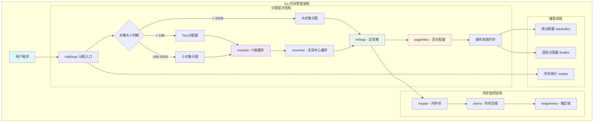
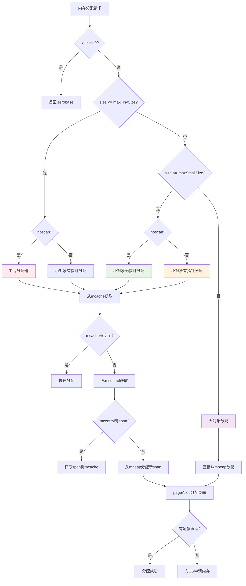
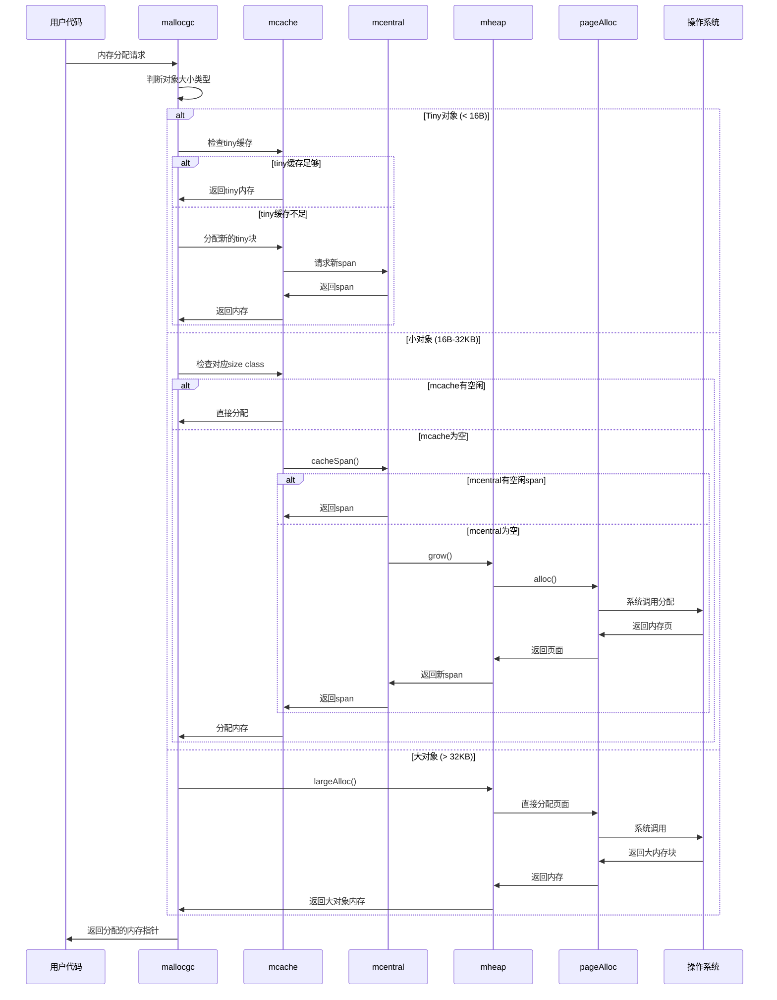
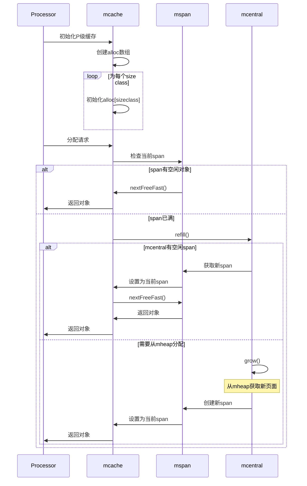
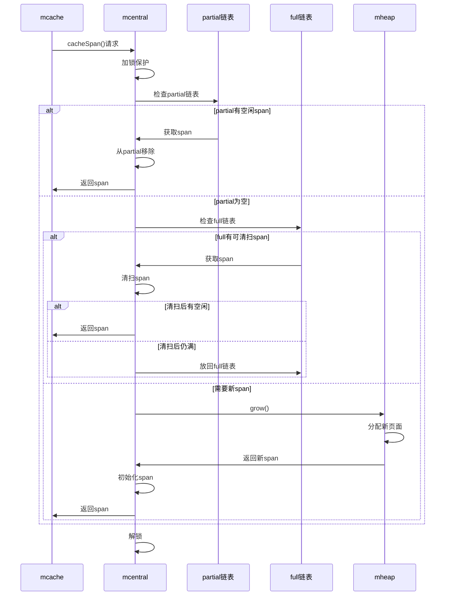
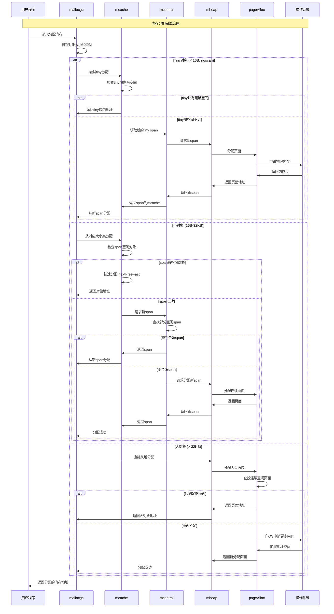
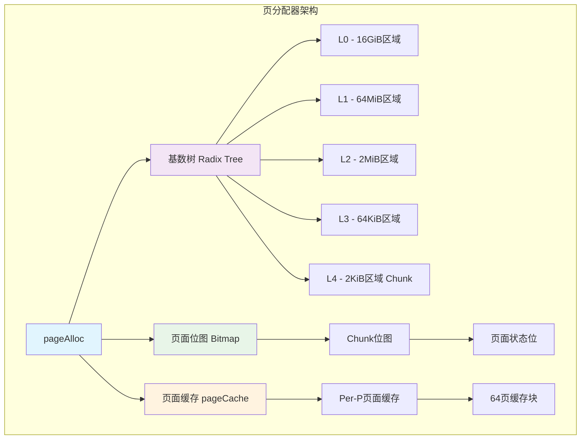
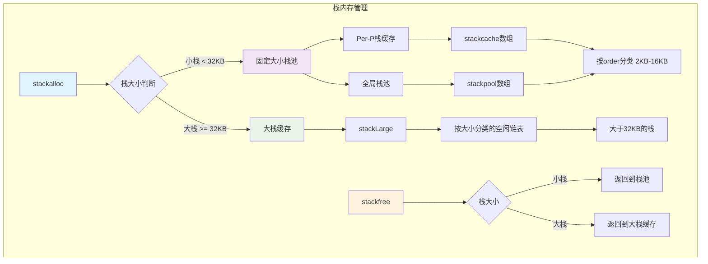
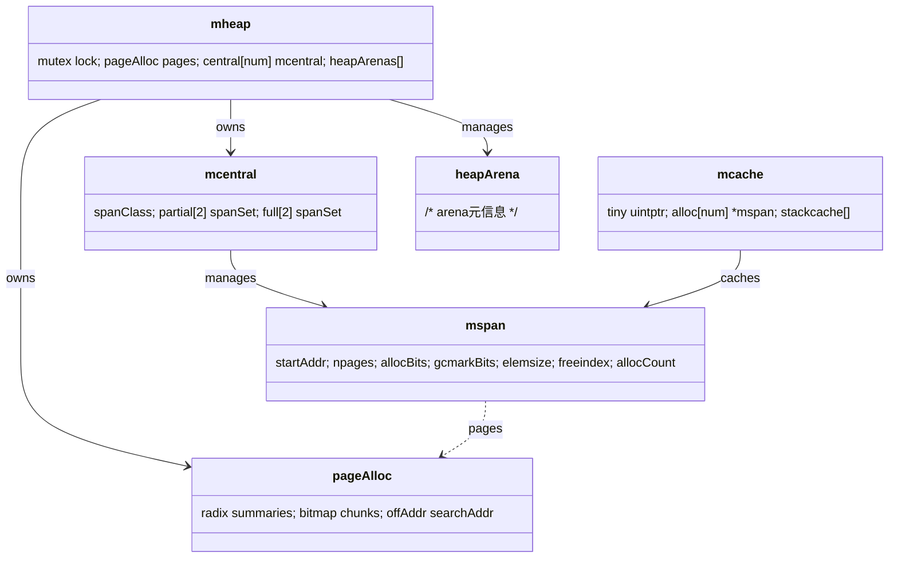

## 概述

Go语言的内存管理系统采用了受TCMalloc启发的多层次分配器设计。结合Go语言的并发特性和GC需求，Go构建了一个内存分配体系，通过多级缓存减少锁竞争。

Go内存分配器通过多级缓存架构，实现内存分配和回收。每个P都有独立的mcache，减少了锁竞争；mcentral作为全局缓存，在各个P之间共享内存；mheap管理大块内存和页面分配。

<!--more-->

## 1. 内存管理架构总览

### 1.1 内存管理的核心使命

Go内存管理系统的本质是解决内存分配问题，其目标是：

- **高性能分配**：最小化内存分配的延迟和开销
- **内存碎片控制**：减少内存碎片，提高内存利用率
- **并发安全**：支持多goroutine并发分配而无锁竞争
- **自动回收**：与GC系统协作，实现自动内存管理

### 1.2 Go内存管理架构图



### 1.3 内存分配决策树



### 1.4 内存分配完整时序图



### 1.5 mcache缓存管理时序图



### 1.6 mcentral全局缓存时序图



## 2. 核心数据结构深度解析

### 2.1 mheap - 全局堆管理器

```go
type mheap struct {
    _ sys.NotInHeap
    
    // 全局锁，保护堆的并发访问
    lock mutex
    
    // 页分配器，管理虚拟地址空间
    pages pageAlloc
    
    // 清扫代数，用于GC清扫
    sweepgen uint32
    
    // 所有span的集合
    allspans []*mspan
    
    // 按页数索引的空闲span列表（已废弃，现在使用pageAlloc）
    // free [_MaxMHeapList]mSpanList
    
    // 比例清扫相关参数
    pagesInUse         atomic.Uintptr // 正在使用的页数
    pagesSwept         atomic.Uint64  // 已清扫的页数
    pagesSweptBasis    atomic.Uint64  // 清扫基准
    sweepHeapLiveBasis uint64         // 堆存活基准
    sweepPagesPerByte  float64        // 每字节清扫页数比例
    
    // 清扫相关状态
    reclaimIndex atomic.Uintptr // 回收索引
    reclaimCredit atomic.Uintptr // 回收信用
    
    // 各种大小类的中心缓存
    central [numSpanClasses]struct {
        mcentral mcentral
        pad      [cpu.CacheLinePadSize - unsafe.Sizeof(mcentral{})%cpu.CacheLinePadSize]byte
    }
    
    // 固定大小对象分配器
    spanalloc             fixalloc // mspan分配器
    cachealloc            fixalloc // mcache分配器
    specialfinalizeralloc fixalloc // specialfinalizer分配器
    specialprofilealloc   fixalloc // specialprofile分配器
    speciallock           mutex    // 特殊对象锁
    
    // arena相关
    arenaHints      *arenaHint   // arena分配提示
    arenaHintAlloc  fixalloc     // arenaHint分配器
    
    // 堆区域管理
    heapArenas []heapArena       // 堆区域数组
    markArenas []heapArena       // 标记时的堆区域快照
    curArena   struct {
        base, end uintptr        // 当前arena的范围
    }
}
```

### 2.2 mspan - 内存块管理

```go
type mspan struct {
    _ sys.NotInHeap
    
    next *mspan     // 链表中的下一个span
    prev *mspan     // 链表中的前一个span
    list *mSpanList // 所属链表（用于调试）
    
    startAddr uintptr // span起始地址
    npages    uintptr // span包含的页数
    
    // 手动管理的空闲对象链表
    manualFreeList gclinkptr
    
    // 分配相关字段
    freeindex uint16 // 下一个空闲对象的索引
    nelems    uint16 // span中对象的总数
    freeIndexForScan uint16 // GC扫描用的空闲索引
    
    // 分配位图和GC位图
    allocCache uint64    // 分配缓存，加速查找空闲对象
    allocBits  *gcBits   // 分配位图
    gcmarkBits *gcBits   // GC标记位图
    
    // span状态和属性
    sweepgen    uint32    // 清扫代数
    divMul      uint32    // 除法优化乘数
    allocCount  uint16    // 已分配对象数
    spanclass   spanClass // span类别（大小类+扫描性）
    state       mSpanStateBox // span状态
    needzero    uint8     // 是否需要清零
    elemsize    uintptr   // 对象大小
    
    // 特殊对象链表
    specials *special // 特殊对象（finalizer等）
    
    // GC相关
    sweepgen uint32 // 清扫代数
    
    // 限制相关
    limit uintptr // span结束地址
}
```

### 2.3 mcache - P级缓存

```go
type mcache struct {
    _ sys.NotInHeap
    
    // 内存分析相关
    nextSample  int64   // 下次采样触发点
    memProfRate int     // 内存分析采样率
    scanAlloc   uintptr // 可扫描堆分配字节数
    
    // Tiny分配器
    tiny       uintptr // 当前tiny块指针
    tinyoffset uintptr // tiny块内偏移
    tinyAllocs uintptr // tiny分配计数
    
    // 按大小类索引的span数组
    alloc [numSpanClasses]*mspan
    
    // 栈缓存
    stackcache [_NumStackOrders]stackfreelist
    
    // 刷新代数，用于GC协调
    flushGen atomic.Uint32
}
```

### 2.4 mcentral - 全局中心缓存

```go
type mcentral struct {
    _ sys.NotInHeap
    
    spanclass spanClass // 管理的span类别
    
    // 双缓冲区设计：partial和full各有两个spanSet
    // 在每个GC周期中交换角色
    partial [2]spanSet // 部分空闲的span集合
    full    [2]spanSet // 完全分配的span集合
}
```

## 3. 内存分配时序图

### 3.1 完整分配流程时序图



### 3.2 mcache重填时序图

```mermaid
sequenceDiagram
    participant MC as mcache
    participant MCT as mcentral
    participant MH as mheap
    participant SW as Sweeper

    Note over MC,SW: mcache span重填流程
    
    MC->>MCT: refill(spanClass)
    MCT->>MCT: 尝试从partialSwept获取
    
    alt 有已清扫的部分空闲span
        MCT->>MC: 返回span
    else 无已清扫span
        MCT->>SW: 开始清扫循环
        loop 清扫预算内
            MCT->>MCT: 从partialUnswept获取
            alt 获取到span
                MCT->>SW: 清扫span
                SW->>MCT: 清扫完成
                alt 清扫后有空闲对象
                    MCT->>MC: 返回清扫后的span
                else 清扫后仍满
                    MCT->>MCT: 移到fullSwept
                end
            else 无更多unswept span
                break
            end
        end
        
        alt 仍未获得span
            MCT->>MH: grow() - 请求新span
            MH->>MH: allocSpan()
            MH->>MCT: 返回新分配的span
            MCT->>MC: 返回新span
        end
    end
```

## 4. 内存分配核心函数

### 4.1 mallocgc - 分配入口函数

```go
func mallocgc(size uintptr, typ *_type, needzero bool) unsafe.Pointer {
    // 零大小分配的快速路径
    if size == 0 {
        return unsafe.Pointer(&zerobase)
    }
    
    // 调试钩子
    if debug.malloc {
        if x := preMallocgcDebug(size, typ); x != nil {
            return x
        }
    }
    
    // ASAN支持：添加红区
    var asanRZ uintptr
    if asanenabled {
        asanRZ = redZoneSize(size)
        size += asanRZ
    }
    
    // GC辅助标记
    if gcBlackenEnabled != 0 {
        deductAssistCredit(size)
    }
    
    // 根据大小选择分配策略
    var x unsafe.Pointer
    var elemsize uintptr
    
    if size <= maxSmallSize-gc.MallocHeaderSize {
        if typ == nil || !typ.Pointers() {
            // 无指针对象
            if size < maxTinySize {
                // Tiny分配
                x, elemsize = mallocgcTiny(size, typ)
            } else {
                // 小对象无指针分配
                x, elemsize = mallocgcSmallNoscan(size, typ, needzero)
            }
        } else {
            // 有指针对象
            if !needzero {
                throw("objects with pointers must be zeroed")
            }
            if heapBitsInSpan(size) {
                x, elemsize = mallocgcSmallScanNoHeader(size, typ)
            } else {
                x, elemsize = mallocgcSmallScanHeader(size, typ)
            }
        }
    } else {
        // 大对象分配
        x, elemsize = mallocgcLarge(size, typ, needzero)
    }
    
    // 内存屏障，确保初始化完成后才能被GC观察到
    publicationBarrier()
    
    // GC期间分配的对象直接标记为黑色
    if writeBarrier.enabled {
        gcmarknewobject(uintptr(x), size)
    }
    
    // 内存分析采样
    if rate := MemProfileRate; rate > 0 {
        profilealloc(mp, x, size)
    }
    
    return x
}
```

### 4.2 Tiny分配器实现

```go
func mallocgcTiny(size uintptr, typ *_type) (unsafe.Pointer, uintptr) {
    mp := acquirem()
    if mp.mallocing != 0 {
        throw("malloc deadlock")
    }
    mp.mallocing = 1
    
    c := getMCache(mp)
    
    // Tiny分配器逻辑
    off := c.tinyoffset
    // 对齐到typ的对齐要求
    if typ != nil {
        align := uintptr(typ.Align_)
        if align > 1 {
            off = alignUp(off, align)
        }
    }
    
    if off+size <= maxTinySize && c.tiny != 0 {
        // 当前tiny块有足够空间
        x := unsafe.Pointer(c.tiny + off)
        c.tinyoffset = off + size
        c.tinyAllocs++
        mp.mallocing = 0
        releasem(mp)
        return x, maxTinySize
    }
    
    // 需要新的tiny块
    span := c.alloc[tinySpanClass]
    v := nextFreeFast(span)
    if v == 0 {
        v, span, _ = c.nextFree(tinySpanClass)
    }
    
    x := unsafe.Pointer(v)
    (*[2]uint64)(x)[0] = 0
    (*[2]uint64)(x)[1] = 0
    
    // 设置新的tiny块
    if typ != nil && typ.Pointers() {
        // 如果tiny对象包含指针，不能合并到tiny块中
        c.tiny = 0
        c.tinyoffset = 0
    } else {
        // 更新tiny块状态
        size = alignUp(size, 8)
        c.tiny = uintptr(x)
        c.tinyoffset = size
    }
    
    c.tinyAllocs++
    mp.mallocing = 0
    releasem(mp)
    return x, maxTinySize
}
```

### 4.3 小对象分配实现

```go
func mallocgcSmallNoscan(size uintptr, typ *_type, needzero bool) (unsafe.Pointer, uintptr) {
    mp := acquirem()
    mp.mallocing = 1
    
    c := getMCache(mp)
    
    // 计算大小类
    var sizeclass uint8
    if size <= gc.SmallSizeMax-8 {
        sizeclass = gc.SizeToSizeClass8[divRoundUp(size, gc.SmallSizeDiv)]
    } else {
        sizeclass = gc.SizeToSizeClass128[divRoundUp(size-gc.SmallSizeMax, gc.LargeSizeDiv)]
    }
    
    size = uintptr(gc.SizeClassToSize[sizeclass])
    spc := makeSpanClass(sizeclass, true) // noscan=true
    span := c.alloc[spc]
    
    // 快速分配路径
    v := nextFreeFast(span)
    if v == 0 {
        // 慢速路径：需要重填span
        v, span, checkGCTrigger := c.nextFree(spc)
        if checkGCTrigger {
            // 可能触发GC
            if t := (gcTrigger{kind: gcTriggerHeap}); t.test() {
                gcStart(t)
            }
        }
    }
    
    x := unsafe.Pointer(v)
    
    // 清零内存（如果需要）
    if needzero && span.needzero != 0 {
        memclrNoHeapPointers(x, size)
    }
    
    // 发布屏障
    publicationBarrier()
    
    mp.mallocing = 0
    releasem(mp)
    return x, span.elemsize
}
```

### 4.4 nextFreeFast - 快速分配

```go
func nextFreeFast(s *mspan) gclinkptr {
    theBit := sys.TrailingZeros64(s.allocCache) // 找到第一个0位
    if theBit < 64 {
        result := s.freeindex + uintptr(theBit)
        if result < s.nelems {
            freeidx := result + 1
            if freeidx%64 == 0 && freeidx != s.nelems {
                return 0 // 需要重新填充allocCache
            }
            s.allocCache >>= uint(theBit + 1)
            s.freeindex = freeidx
            s.allocCount++
            return gclinkptr(result*s.elemsize + s.base())
        }
    }
    return 0
}
```

### 4.5 大对象分配

```go
func mallocgcLarge(size uintptr, typ *_type, needzero bool) (unsafe.Pointer, uintptr) {
    if size+gc.MallocHeaderSize < size {
        throw("size overflow")
    }
    
    // 计算需要的页数
    npages := size >> gc.PageShift
    if size&(gc.PageSize-1) != 0 {
        npages++
    }
    
    // 直接从mheap分配
    var s *mspan
    systemstack(func() {
        s = mheap_.alloc(npages, makeSpanClass(0, typ == nil || !typ.Pointers()))
    })
    
    if s == nil {
        throw("out of memory")
    }
    
    owner := muintptr(unsafe.Pointer(s))
    if typ != nil && typ.Pointers() {
        // 设置GC位图
        scanSize := typ.Size_
        heapBitsSetType(uintptr(s.base()), scanSize, typ)
        if dataSize := typ.Size_ - typ.PtrBytes; dataSize > 0 {
            memclrNoHeapPointers(unsafe.Pointer(uintptr(s.base())+scanSize), dataSize)
        }
    }
    
    // 大对象统计
    atomic.Xadd64(&memstats.nmalloc, 1)
    atomic.Xadd64(&memstats.total_alloc, int64(size))
    
    return unsafe.Pointer(s.base()), s.elemsize
}
```

## 5. mcentral管理机制

### 5.1 mcentral初始化

```go
func (c *mcentral) init(spc spanClass) {
    c.spanclass = spc
    lockInit(&c.partial[0].spineLock, lockRankSpanSetSpine)
    lockInit(&c.partial[1].spineLock, lockRankSpanSetSpine)
    lockInit(&c.full[0].spineLock, lockRankSpanSetSpine)
    lockInit(&c.full[1].spineLock, lockRankSpanSetSpine)
}
```

### 5.2 span缓存获取

```go
func (c *mcentral) cacheSpan() *mspan {
    // 扣除清扫信用
    spanBytes := uintptr(gc.SizeClassToNPages[c.spanclass.sizeclass()]) * pageSize
    deductSweepCredit(spanBytes, 0)
    
    // 清扫预算，限制清扫时间
    spanBudget := 100
    
    var s *mspan
    var sl sweepLocker
    
    // 1. 首先尝试已清扫的部分空闲span
    sg := mheap_.sweepgen
    if s = c.partialSwept(sg).pop(); s != nil {
        goto havespan
    }
    
    // 2. 尝试清扫未清扫的span
    sl = sweep.active.begin()
    if sl.valid {
        // 清扫部分空闲的未清扫span
        for ; spanBudget >= 0; spanBudget-- {
            s = c.partialUnswept(sg).pop()
            if s == nil {
                break
            }
            if s, ok := sl.tryAcquire(s); ok {
                s.sweep(true)
                sweep.active.end(sl)
                goto havespan
            }
        }
        
        // 清扫完全分配的未清扫span
        for ; spanBudget >= 0; spanBudget-- {
            s = c.fullUnswept(sg).pop()
            if s == nil {
                break
            }
            if s, ok := sl.tryAcquire(s); ok {
                s.sweep(true)
                freeIndex := s.nextFreeIndex()
                if freeIndex != s.nelems {
                    s.freeindex = freeIndex
                    sweep.active.end(sl)
                    goto havespan
                }
                // 清扫后仍然满，移到已清扫的满span列表
                c.fullSwept(sg).push(s.mspan)
            }
        }
        sweep.active.end(sl)
    }
    
    // 3. 从mheap分配新span
    s = c.grow()
    if s == nil {
        return nil
    }
    
havespan:
    // 验证span状态
    n := int(s.nelems) - int(s.allocCount)
    if n == 0 || s.freeindex == s.nelems || s.allocCount == s.nelems {
        throw("span has no free objects")
    }
    
    // 更新统计信息
    atomic.Xadd64(&c.nmalloc, int64(n))
    usedBytes := uintptr(s.allocCount) * s.elemsize
    atomic.Xadd64(&memstats.heap_live, int64(spanBytes)-int64(usedBytes))
    
    return s
}
```

### 5.3 span增长机制

```go
func (c *mcentral) grow() *mspan {
    npages := uintptr(gc.SizeClassToNPages[c.spanclass.sizeclass()])
    size := uintptr(gc.SizeClassToSize[c.spanclass.sizeclass()])
    
    s := mheap_.alloc(npages, c.spanclass)
    if s == nil {
        return nil
    }
    
    // 初始化span
    n := (npages << gc.PageShift) / size
    s.limit = s.base() + size*n
    heapBitsForAddr(s.base(), size).initSpan(s)
    return s
}
```

## 6. 页分配器(pageAlloc)

### 6.1 页分配器架构



### 6.2 页分配核心函数

```go
func (p *pageAlloc) alloc(npages uintptr) (addr uintptr, scav uintptr) {
    assertLockHeld(p.mheapLock)
    
    // 检查搜索地址是否超出已知范围
    if chunkIndex(p.searchAddr.addr()) >= p.end {
        return 0, 0
    }
    
    // 快速路径：在当前搜索地址的chunk中查找
    searchAddr := minOffAddr
    if pallocChunkPages-chunkPageIndex(p.searchAddr.addr()) >= uint(npages) {
        i := chunkIndex(p.searchAddr.addr())
        if max := p.summary[len(p.summary)-1][i].max(); max >= uint(npages) {
            j, searchIdx := p.chunkOf(i).find(npages, chunkPageIndex(p.searchAddr.addr()))
            if j != ^uint(0) {
                addr = chunkBase(i) + uintptr(j)*pageSize
                searchAddr = offAddr{chunkBase(i) + uintptr(searchIdx)*pageSize}
                goto Found
            }
        }
    }
    
    // 慢速路径：使用基数树查找
    addr, searchAddr = p.find(npages)
    if addr == 0 {
        if npages == 1 {
            // 连一个页面都分配不了，堆已耗尽
            p.searchAddr = maxSearchAddr()
        }
        return 0, 0
    }
    
Found:
    // 标记页面为已分配
    scav = p.allocRange(addr, npages)
    
    // 更新搜索地址
    p.searchAddr = searchAddr
    
    return addr, scav
}
```

### 6.3 基数树查找算法

```go
func (p *pageAlloc) find(npages uintptr) (uintptr, offAddr) {
    // 从根级别开始查找
    i := 0
    for l := 0; l < len(p.summary); l++ {
        // 在当前级别查找足够大的区域
        i, _ = p.findMappedAddr(offAddrOf(chunkBase(i)))
        if i >= len(p.summary[l]) {
            return 0, minOffAddr
        }
        
        // 查找满足条件的summary
        for ; i < len(p.summary[l]); i++ {
            if p.summary[l][i].max() >= uint(npages) {
                break
            }
        }
        
        if i >= len(p.summary[l]) {
            return 0, minOffAddr
        }
        
        // 转换到下一级别的索引
        i <<= levelBits[l]
    }
    
    // 在叶子chunk中查找具体页面
    ci := chunkIdx(i)
    j, _ := p.chunkOf(ci).find(npages, 0)
    if j == ^uint(0) {
        return 0, minOffAddr
    }
    
    addr := chunkBase(ci) + uintptr(j)*pageSize
    return addr, offAddr{addr + uintptr(npages)*pageSize}
}
```

## 7. 栈内存管理

### 7.1 栈分配器架构



### 7.2 栈分配实现

```go
func stackalloc(n uint32) stack {
    thisg := getg()
    if thisg != thisg.m.g0 {
        throw("stackalloc not on scheduler stack")
    }
    if n&(n-1) != 0 {
        throw("stack size not a power of 2")
    }
    
    // 调试模式或系统分配模式
    if debug.efence != 0 || stackFromSystem != 0 {
        n = uint32(alignUp(uintptr(n), physPageSize))
        v := sysAlloc(uintptr(n), &memstats.stacks_sys, "goroutine stack (system)")
        if v == nil {
            throw("out of memory (stackalloc)")
        }
        return stack{uintptr(v), uintptr(v) + uintptr(n)}
    }
    
    // 小栈分配（使用固定大小分配器）
    var v unsafe.Pointer
    if n < fixedStack<<_NumStackOrders && n < _StackCacheSize {
        order := uint8(0)
        n2 := n
        for n2 > fixedStack {
            order++
            n2 >>= 1
        }
        
        var x gclinkptr
        if stackNoCache != 0 || thisg.m.p == 0 || thisg.m.preemptoff != "" {
            // 从全局栈池分配
            lock(&stackpool[order].item.mu)
            x = stackpoolalloc(order)
            unlock(&stackpool[order].item.mu)
        } else {
            // 从P的栈缓存分配
            c := thisg.m.p.ptr().mcache
            x = c.stackcache[order].list
            if x.ptr() == nil {
                // 缓存为空，重新填充
                stackcacherefill(c, order)
                x = c.stackcache[order].list
            }
            c.stackcache[order].list = x.ptr().next
            c.stackcache[order].size -= uintptr(n)
        }
        v = unsafe.Pointer(x)
    } else {
        // 大栈分配
        var s *mspan
        npage := uintptr(n) >> gc.PageShift
        log2npage := stacklog2(npage)
        
        // 尝试从大栈缓存获取
        lock(&stackLarge.lock)
        if !stackLarge.free[log2npage].isEmpty() {
            s = stackLarge.free[log2npage].first
            stackLarge.free[log2npage].remove(s)
        }
        unlock(&stackLarge.lock)
        
        if s == nil {
            // 从堆分配新的栈span
            s = mheap_.allocManual(npage, spanAllocStack)
            if s == nil {
                throw("out of memory")
            }
            osStackAlloc(s)
            s.elemsize = uintptr(n)
        }
        v = unsafe.Pointer(s.base())
    }
    
    return stack{uintptr(v), uintptr(v) + uintptr(n)}
}
```

### 7.3 栈释放实现

```go
func stackfree(stk stack) {
    gp := getg()
    v := unsafe.Pointer(stk.lo)
    n := stk.hi - stk.lo
    
    if n&(n-1) != 0 {
        throw("stack not a power of 2")
    }
    
    // 调试模式直接释放给系统
    if debug.efence != 0 || stackFromSystem != 0 {
        if debug.efence != 0 || stackFaultOnFree != 0 {
            sysFault(v, n)
        } else {
            sysFree(v, n, &memstats.stacks_sys)
        }
        return
    }
    
    // 小栈释放到栈池
    if n < fixedStack<<_NumStackOrders && n < _StackCacheSize {
        order := uint8(0)
        n2 := n
        for n2 > fixedStack {
            order++
            n2 >>= 1
        }
        
        x := gclinkptr(uintptr(v))
        if stackNoCache != 0 || gp.m.p == 0 || gp.m.preemptoff != "" {
            lock(&stackpool[order].item.mu)
            stackpoolfree(x, order)
            unlock(&stackpool[order].item.mu)
        } else {
            // 释放到P的栈缓存
            c := gp.m.p.ptr().mcache
            if c.stackcache[order].size >= _StackCacheSize {
                // 缓存已满，刷新到全局池
                stackcacherelease(c, order)
            }
            x.ptr().next = c.stackcache[order].list
            c.stackcache[order].list = x
            c.stackcache[order].size += n
        }
    } else {
        // 大栈释放到大栈缓存
        s := spanOfUnchecked(uintptr(v))
        if s.state.get() != mSpanManual {
            println(hex(s.base()), v)
            throw("bad span state")
        }
        if gcphase == _GCoff {
            // GC未运行时，可以缓存大栈
            log2npage := stacklog2(s.npages)
            lock(&stackLarge.lock)
            stackLarge.free[log2npage].insert(s)
            unlock(&stackLarge.lock)
        } else {
            // GC运行时，直接释放给堆
            s.needzero = 1
            mheap_.freeManual(s, spanAllocStack)
        }
    }
}
```

## 8. 内存统计和监控

### 8.1 内存统计结构

```go
type mstats struct {
    // 通用统计
    alloc       uint64 // 当前分配的字节数
    total_alloc uint64 // 累计分配的字节数
    sys         uint64 // 从系统获得的字节数
    nlookup     uint64 // 指针查找次数
    nmalloc     uint64 // 分配次数
    nfree       uint64 // 释放次数
    
    // 堆统计
    heap_alloc    uint64 // 堆中分配的字节数
    heap_sys      uint64 // 堆从系统获得的字节数
    heap_idle     uint64 // 堆中空闲的字节数
    heap_inuse    uint64 // 堆中使用的字节数
    heap_released uint64 // 释放给系统的字节数
    heap_objects  uint64 // 堆中对象数量
    
    // 栈统计
    stack_inuse uint64 // 栈使用的字节数
    stack_sys   uint64 // 栈从系统获得的字节数
    
    // 各种内存区域统计
    mspan_inuse uint64 // mspan使用的字节数
    mspan_sys   uint64 // mspan从系统获得的字节数
    mcache_inuse uint64 // mcache使用的字节数
    mcache_sys   uint64 // mcache从系统获得的字节数
    
    // GC统计
    gc_sys         uint64 // GC元数据使用的字节数
    other_sys      uint64 // 其他系统分配
    next_gc        uint64 // 下次GC的堆大小目标
    last_gc_unix   uint64 // 上次GC的Unix时间戳
    last_gc_nanotime uint64 // 上次GC的纳秒时间戳
    
    // 按大小类的统计
    by_size [_NumSizeClasses]struct {
        size    uint32 // 大小类的字节数
        nmalloc uint64 // 该大小类的分配次数
        nfree   uint64 // 该大小类的释放次数
    }
}
```

### 8.2 内存统计更新

```go
// 更新分配统计
func (mp *m) incalloc(size uintptr) {
    c := getMCache(mp)
    c.scanAlloc += size
    
    atomic.Xadd64(&memstats.nmalloc, 1)
    atomic.Xadd64(&memstats.total_alloc, int64(size))
    atomic.Xadd64(&memstats.heap_live, int64(size))
}

// 更新释放统计  
func (mp *m) decalloc(size uintptr) {
    atomic.Xadd64(&memstats.nfree, 1)
    atomic.Xadd64(&memstats.heap_live, -int64(size))
}
```

## 9. 性能监控和调优

#### 1. 内存分配监控

```go
func MonitorMemoryAllocation() {
    var m runtime.MemStats
    
    ticker := time.NewTicker(time.Second)
    defer ticker.Stop()
    
    for range ticker.C {
        runtime.ReadMemStats(&m)
        
        fmt.Printf("内存统计:\n")
        fmt.Printf("  堆大小: %d KB\n", m.HeapSys/1024)
        fmt.Printf("  堆使用: %d KB\n", m.HeapInuse/1024)
        fmt.Printf("  堆对象数: %d\n", m.HeapObjects)
        fmt.Printf("  分配次数: %d\n", m.Mallocs)
        fmt.Printf("  释放次数: %d\n", m.Frees)
        fmt.Printf("  栈使用: %d KB\n", m.StackInuse/1024)
        fmt.Printf("  系统内存: %d KB\n", m.Sys/1024)
        fmt.Println()
    }
}
```

#### 2. 分配热点分析

```go
// 使用pprof分析内存分配热点
import _ "net/http/pprof"

func main() {
    go func() {
        log.Println(http.ListenAndServe("localhost:6060", nil))
    }()
    
    // 启用内存分析
    runtime.MemProfileRate = 1
    
    // 应用逻辑...
}
```

### 9.3 最佳实践建议

#### 1. 减少内存分配

```go
// 好：使用对象池
var bufferPool = sync.Pool{
    New: func() interface{} {
        return make([]byte, 1024)
    },
}

func ProcessData(data []byte) {
    buf := bufferPool.Get().([]byte)
    defer bufferPool.Put(buf)
    // 处理数据...
}

// 坏：频繁分配
func ProcessDataBad(data []byte) {
    buf := make([]byte, 1024) // 每次都分配
    // 处理数据...
}
```

#### 2. 预分配切片容量

```go
// 好：预分配已知容量
func BuildSlice(n int) []int {
    result := make([]int, 0, n) // 预分配容量
    for i := 0; i < n; i++ {
        result = append(result, i)
    }
    return result
}

// 坏：让切片自动增长
func BuildSliceBad(n int) []int {
    var result []int // 容量为0，会多次重新分配
    for i := 0; i < n; i++ {
        result = append(result, i)
    }
    return result
}
```

#### 3. 避免内存泄漏

```go
// 好：及时释放大切片的引用
func ProcessLargeSlice(data []int) []int {
    // 只需要前10个元素
    result := make([]int, 10)
    copy(result, data[:10])
    return result // 不持有原始大切片的引用
}

// 坏：持有大切片引用
func ProcessLargeSliceBad(data []int) []int {
    return data[:10] // 仍然引用整个大切片
}
```

## 10. 关键路径函数总结

### 10.1 内存分配路径

```
用户分配 -> mallocgc() -> 大小判断 -> 具体分配函数
                      |
                      ├─ mallocgcTiny() (< 16B)
                      ├─ mallocgcSmallNoscan() (16B-32KB, 无指针)
                      ├─ mallocgcSmallScan() (16B-32KB, 有指针)  
                      └─ mallocgcLarge() (> 32KB)
```

### 10.2 缓存重填路径

```
mcache.nextFree() -> mcentral.cacheSpan() -> mheap.alloc() -> pageAlloc.alloc()
```

### 10.3 栈管理路径

```
stackalloc() -> 大小判断 -> stackpool/stackLarge -> mheap.allocManual()
stackfree() -> 大小判断 -> 返回池子 -> mheap.freeManual()
```

## 11. 关键函数调用路径分析

### 11.1 内存分配调用路径

#### 主要分配路径（示例：缓存重填路径）
```
mallocgc() -> mcache.nextFree() -> mcentral.cacheSpan() -> 
mheap.alloc() -> pageAlloc.alloc() -> sysAlloc()
```

#### 详细分配分析

**1. Tiny对象分配路径**
```
mallocgc()
├── size <= maxTinySize检查    // 检查是否为tiny对象
├── mcache.tiny检查           // 检查tiny缓存
│   ├── tiny空间足够 -> 直接分配
│   └── tiny空间不足 -> 分配新tiny块
│       ├── mcache.nextFree() // 获取新的tiny块
│       └── 更新tiny指针
└── 返回分配地址
```

**2. 小对象分配路径**
```
mallocgc()
├── size <= maxSmallSize检查   // 检查是否为小对象
├── size_to_class()           // 计算size class
├── mcache.alloc[sizeclass]   // 检查对应的mcache
│   ├── mcache有空闲 -> nextFreeFast()
│   └── mcache为空 -> refill()
│       ├── mcentral.cacheSpan() // 从mcentral获取span
│       │   ├── partial链表检查
│       │   ├── full链表清扫
│       │   └── mheap.alloc() -> 分配新span
│       └── 设置新的alloc
└── 返回分配地址
```

**3. 大对象分配路径**
```
mallocgc()
├── size > maxSmallSize检查    // 检查是否为大对象
├── largeAlloc()              // 大对象分配
│   ├── 计算所需页数
│   ├── mheap.alloc()         // 直接从堆分配
│   │   ├── pageAlloc.alloc() // 页面分配器
│   │   │   ├── 查找连续空闲页
│   │   │   ├── radixTree搜索
│   │   │   └── 标记页面已分配
│   │   └── 创建span
│   └── 设置span元数据
└── 返回分配地址
```

### 11.2 缓存层次调用路径

#### mcache重填路径
```
mcache.nextFree() -> mcache为空 -> mcentral.cacheSpan() -> 
mcentral.grow() -> mheap.alloc() -> pageAlloc.alloc()
```

#### 详细缓存分析

**1. mcache快速分配路径**
```
mcache.nextFree()
├── 检查freeIndex           // 检查空闲索引
├── nextFreeFast()          // 快速路径
│   ├── 位图扫描找空闲对象
│   ├── 更新freeIndex
│   └── 返回对象地址
└── nextFreeSlow()          // 慢路径
    ├── 完整位图扫描
    ├── 更新allocCache
    └── 可能触发refill
```

**2. mcentral缓存管理路径**
```
mcentral.cacheSpan()
├── 加锁保护
├── partial.pop()           // 从partial链表获取
│   ├── 有空闲span -> 返回
│   └── partial为空 -> 检查full
├── full链表清扫
│   ├── 遍历full链表
│   ├── span.sweep()        // 清扫span
│   ├── 有空闲 -> 移到partial
│   └── 仍满 -> 保持在full
└── grow()                  // 分配新span
    ├── mheap.alloc()
    ├── 初始化span
    └── 加入partial链表
```

### 11.3 页面分配调用路径

#### 页面分配器路径
```
pageAlloc.alloc() -> find() -> radixTree.find() -> 
allocRange() -> update() -> sysAlloc()
```

#### 详细页面分析

**1. 页面查找路径**
```
pageAlloc.alloc()
├── 计算所需页数npages
├── find()                  // 查找连续空闲页
│   ├── radixTree.find()    // 基数树搜索
│   │   ├── 从根节点开始
│   │   ├── 逐层向下搜索
│   │   └── 找到合适的叶子节点
│   ├── 检查边界对齐
│   └── 返回页面地址
├── allocRange()            // 分配页面范围
│   ├── 更新位图
│   ├── 更新基数树
│   └── 统计信息更新
└── 可能触发sysAlloc()     // 系统内存分配
```

**2. 系统内存分配路径**
```
sysAlloc()
├── 检查保留内存
├── sysReserve()            // 保留虚拟地址空间
│   ├── Linux: mmap()
│   ├── Windows: VirtualAlloc()
│   └── 其他系统调用
├── sysMap()                // 映射物理内存
└── 更新内存统计
```

### 11.4 内存释放调用路径

#### 对象释放路径
```
GC扫描 -> freeObject() -> mcache.freeSpan() -> 
mcentral.uncacheSpan() -> mheap.freeSpan()
```

#### 详细释放分析

**1. span释放路径**
```
mheap.freeSpan()
├── 检查span状态
├── 合并相邻空闲span       // 减少碎片
│   ├── 检查前一个span
│   ├── 检查后一个span
│   └── 执行合并操作
├── pageAlloc.free()       // 释放页面
│   ├── 更新位图
│   ├── 更新基数树
│   └── 统计信息更新
└── 可能触发sysUnused()   // 通知系统释放
```

**2. 系统内存释放路径**
```
sysUnused()
├── Linux: madvise(MADV_FREE)
├── Windows: VirtualAlloc(MEM_RESET)
└── 其他系统优化调用
```

### 11.5 栈内存管理调用路径

#### 栈分配路径
```
stackalloc() -> stackcacheget() -> stackpoolalloc() -> 
mheap.allocManual() -> pageAlloc.alloc()
```

#### 详细栈分析

**1. 栈缓存管理路径**
```
stackalloc()
├── 计算栈大小等级
├── stackcacheget()         // P级栈缓存
│   ├── 检查本地栈缓存
│   ├── 有空闲栈 -> 直接返回
│   └── 缓存为空 -> 全局获取
├── stackpoolalloc()        // 全局栈池
│   ├── 加锁访问全局池
│   ├── 有空闲栈 -> 返回
│   └── 池为空 -> 分配新栈
└── mheap.allocManual()     // 手动堆分配
    ├── pageAlloc.alloc()
    └── 创建栈span
```

**2. 栈增长路径**
```
morestack() -> newstack() -> copystack() -> 
stackalloc() -> memmove() -> stackfree()
```

## 12. 总结

### 11.1 Go内存管理的核心优势

- **多层次缓存**：通过mcache、mcentral、mheap三级缓存最小化锁竞争
- **大小类设计**：平衡内存利用率和管理开销的设计
- **并发友好**：P级缓存实现无锁快速分配
- **GC协作**：与垃圾收集器紧密配合，支持并发标记和清扫

### 11.2 内存分配器优化策略深度解析

和实践经验，Go内存分配器采用了多项优化策略：

#### 1. 分层分配策略

Go内存分配器采用分层分配策略，根据对象大小选择不同的分配路径：

- **Tiny对象（< 16B）**：合并分配到16B块中，减少内存碎片
- **小对象（16B-32KB）**：使用大小类分配，从mcache快速获取
- **大对象（> 32KB）**：直接从mheap分配，跳过缓存层

详细实现参见第4.1节的`mallocgc`函数分析。

#### 2. 缓存层次优化

Go内存分配器通过三级缓存减少锁竞争：

- **L1缓存（mcache）**：P级无锁缓存，提供最快的分配路径
- **L2缓存（mcentral）**：全局中心缓存，支持批量span获取
- **L3缓存（mheap）**：全局堆管理器，负责页面分配和回收

详细的缓存重填机制参见第5节mcentral管理机制。

#### 3. 内存分配性能监控

Go提供了丰富的内存统计信息用于性能监控和调优：

- **分配统计**：分配次数、释放次数、堆使用情况
- **对象统计**：堆对象数量、按大小类的分配统计
- **GC统计**：GC次数、暂停时间、CPU使用率

详细的内存统计结构和监控方法参见第8节内存统计和监控。

#### 4. 内存布局优化

Go内存分配器在内存布局方面采用了多项优化策略：

- **对象对齐**：确保对象按照类型要求对齐，提高访问效率
- **缓存友好设计**：使用CPU缓存行填充避免false sharing
- **局部性优化**：相关数据结构在内存中紧密排列

#### 5. 分配优化技术

Go内存分配器采用多种技术优化分配性能：

```go
// 三级缓存减少锁竞争
// L1: mcache (P级，无锁)
// L2: mcentral (全局，有锁但批量操作)  
// L3: mheap (全局，有锁)

func optimizedAlloc() {
    // 1. 尝试P级缓存（最快）
    if obj := tryMcache(); obj != nil {
        return obj
    }
    
    // 2. 尝试全局中心缓存
    if obj := tryMcentral(); obj != nil {
        return obj
    }
    
    // 3. 从堆分配（最慢）
    return allocFromHeap()
}
```

### 11.3 内存管理核心优势总结

Go内存管理系统通过架构设计实现了以下特性：

#### 1. 高性能分配
- **无锁快速路径**：P级mcache提供无锁分配
- **批量操作**：mcentral支持批量span获取
- **预取机制**：分配缓存预取机制

#### 2. 内存碎片控制
- **大小类设计**：约70个大小类平衡利用率和开销
- **Tiny分配器**：小对象合并分配减少碎片
- **页面对齐**：大对象页面对齐分配

#### 3. 并发安全性
- **分层缓存**：减少全局锁竞争
- **原子操作**：关键路径使用原子操作
- **无锁设计**：热路径避免锁开销

理解Go内存管理的实现原理，有助于编写内存管理程序，使用Go语言的内存管理特性。

---

## 附录：关键函数/调用链合并、结构体图与时序索引

### 1) 关键函数与简要说明

```go
// 分配入口（大小分类与GC协作）
func mallocgc(size uintptr, typ *_type, needzero bool) unsafe.Pointer { /* 见正文 */ }

// Tiny/小/大对象分配
func mallocgcTiny(size uintptr, typ *_type) (unsafe.Pointer, uintptr) { /* 见正文 */ }
func mallocgcSmallNoscan(size uintptr, typ *_type, needzero bool) (unsafe.Pointer, uintptr) { /* 见正文 */ }
func mallocgcLarge(size uintptr, typ *_type, needzero bool) (unsafe.Pointer, uintptr) { /* 见正文 */ }

// 快速路径：在span位图中找空闲对象
func nextFreeFast(s *mspan) gclinkptr { /* 见正文 */ }

// mcentral 侧：为mcache补货
func (c *mcentral) cacheSpan() *mspan { /* 见正文 */ }
func (c *mcentral) grow() *mspan { /* 见正文 */ }

// 页分配器
func (p *pageAlloc) alloc(npages uintptr) (addr uintptr, scav uintptr) { /* 见正文 */ }
func (p *pageAlloc) find(npages uintptr) (uintptr, offAddr) { /* 见正文 */ }

// 栈管理
func stackalloc(n uint32) stack { /* 见正文 */ }
func stackfree(stk stack) { /* 见正文 */ }
```

- 目标：在多级缓存与GC协作下，提供低延迟分配与按需回收；小对象走`mcache/mcentral`，大对象直取`mheap/pageAlloc`；栈按需扩缩。

### 2) 调用链

- 分配路径（用户态）
  - `mallocgc -> (Tiny|SmallNoscan|SmallScan|Large) -> publicationBarrier -> (gcmarknewobject?)`
- mcache补货
  - `mcache.nextFree -> mcentral.cacheSpan -> (partial/清扫full | grow->mheap.alloc -> pageAlloc.alloc)`
- 页分配
  - `pageAlloc.alloc -> (chunk快速查找 | 基数树find) -> allocRange`
- 栈分配/释放
  - `stackalloc -> (stackcache|stackpool|mheap.allocManual)`
  - `stackfree -> (小栈回池 | 大栈回收/缓存)`

### 3) 核心结构体（关系图）


