## 概述

Go语言的网络模块通过netpoll机制实现网络I/O处理。它结合了同步编程的简洁性和异步I/O的特性，让开发者能够用同步代码编写网络程序。

Go网络模块通过netpoll机制实现网络I/O处理。当网络操作需要等待时，Go运行时会将当前goroutine挂起，让出CPU给其他goroutine执行，避免了线程阻塞。这种设计使得Go程序能够处理大量并发连接。

<!--more-->

## 1. Go网络模块架构总览

### 1.1 网络模块的核心使命

Go网络模块系统的本质是将阻塞的网络I/O操作转换为非阻塞的异步操作，其目标是：

- **高并发支持**：支持大量并发连接而不消耗过多系统资源
- **异步I/O**：将阻塞I/O转换为事件驱动的异步I/O
- **跨平台统一**：在不同操作系统上提供统一的网络编程接口
- **与调度器集成**：与Go运行时调度器集成，实现goroutine调度

### 1.2 Go网络模块架构图

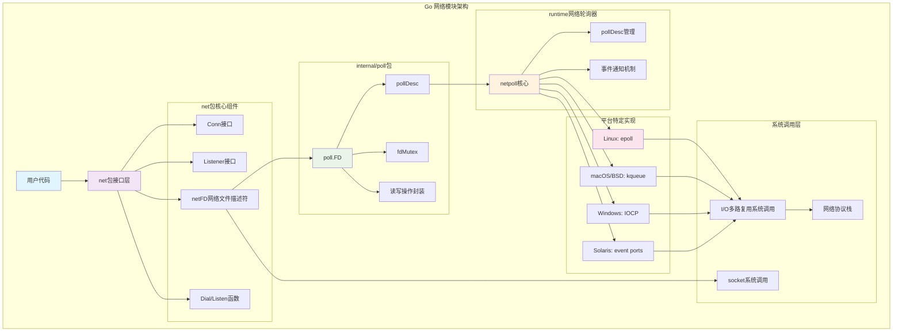

### 1.3 网络I/O完整时序图

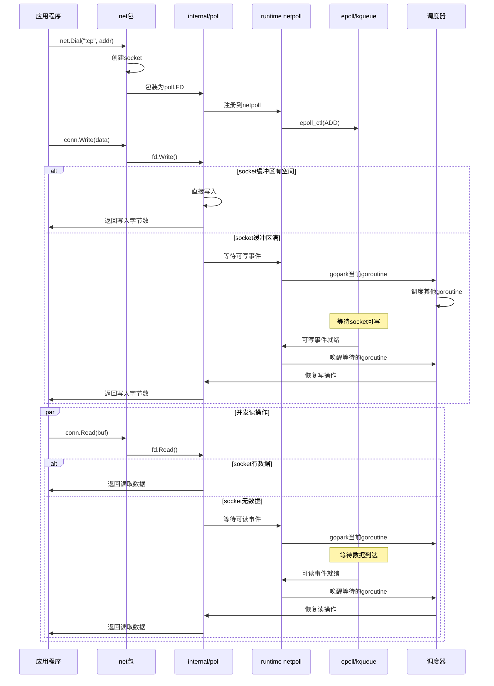

### 1.4 TCP连接建立时序图

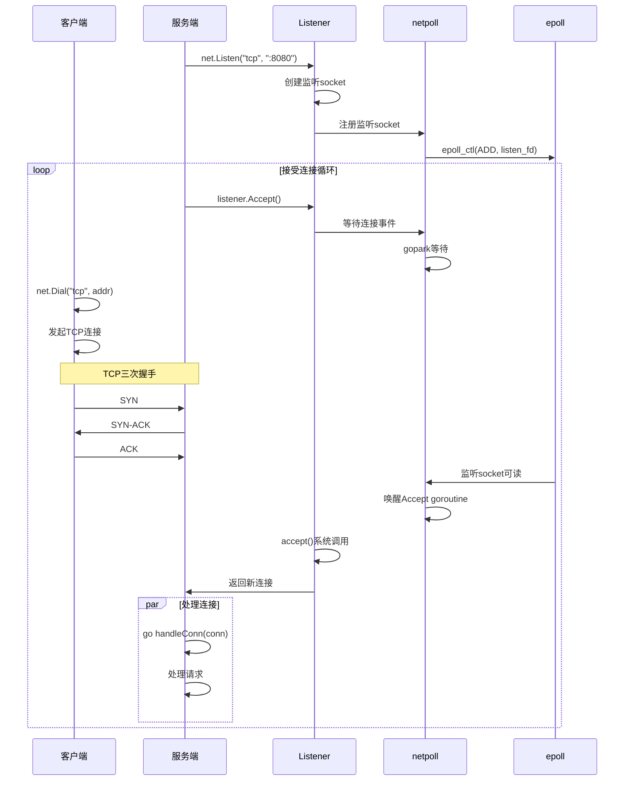

### 1.5 netpoll事件处理时序图

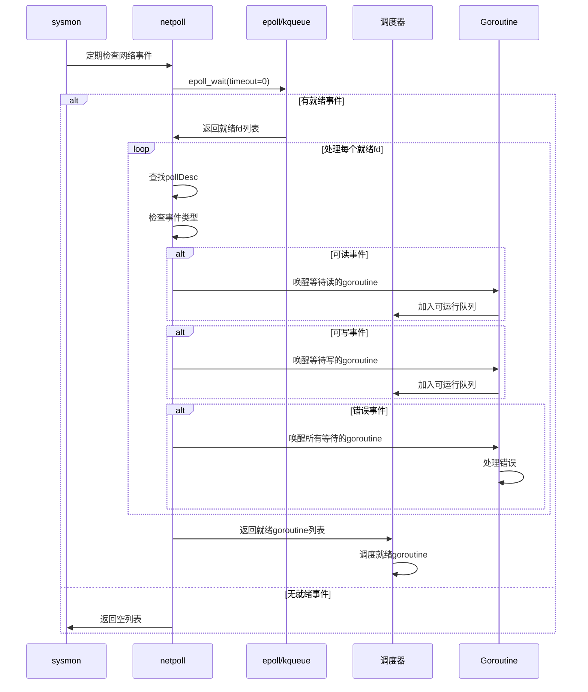

### 1.6 异步I/O操作时序图

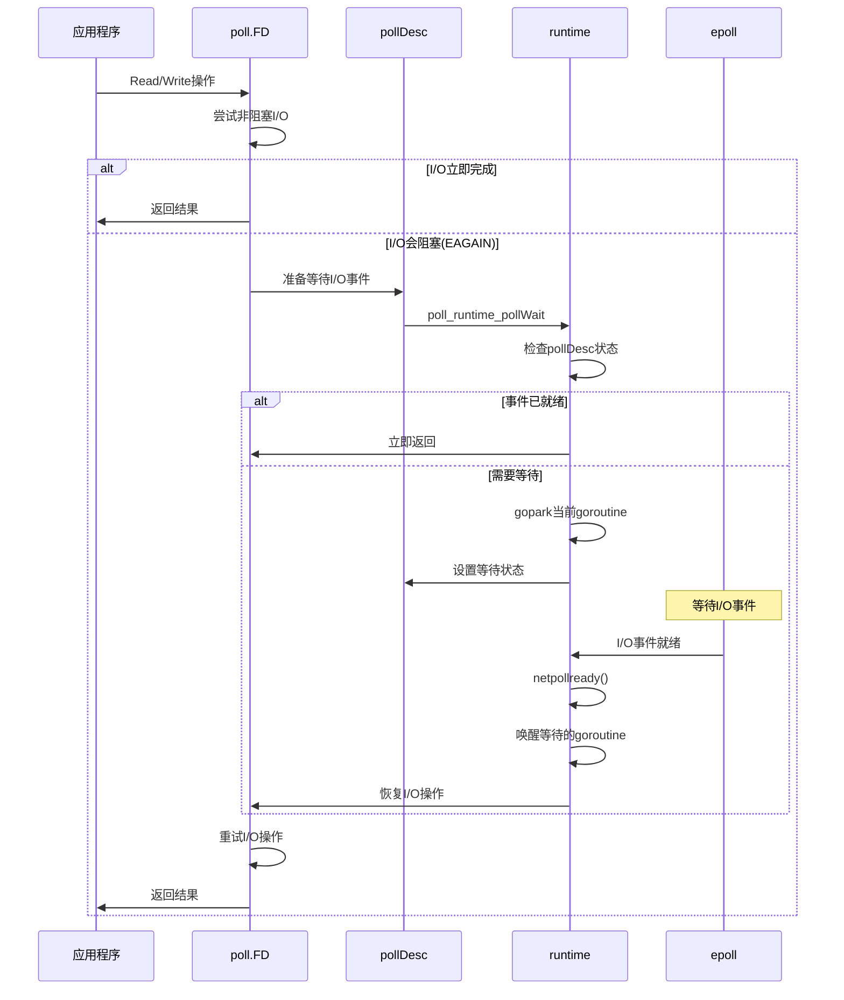

### 1.3 网络I/O处理流程图

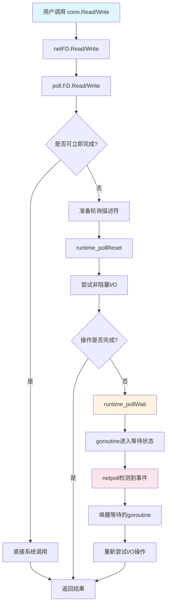

## 2. 网络轮询器(netpoll)核心机制

### 2.1 netpoll架构设计

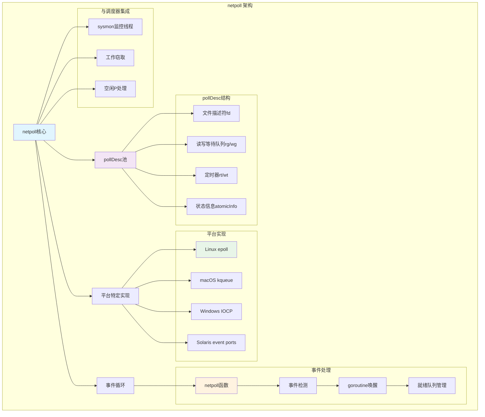

### 2.2 pollDesc核心数据结构

```go
// pollDesc 包含网络轮询所需的所有信息
// 这是一个不在堆上分配的结构体，避免GC扫描，提高性能
type pollDesc struct {
    _     sys.NotInHeap  // 标记此结构体不在堆上分配，避免GC扫描开销
    
    // 链表管理字段
    link  *pollDesc      // 在pollcache中的链接指针，由pollcache.lock保护
                        // 用于将空闲的pollDesc组织成链表，便于复用
    
    // 文件描述符相关字段
    fd    uintptr        // 底层文件描述符，在pollDesc使用期间保持不变
                        // 这是与操作系统交互的核心标识符
    fdseq atomic.Uintptr // 文件描述符序列号，防止使用过时的pollDesc
                        // 当文件描述符被重用时，序列号会递增，避免ABA问题
    
    // 状态信息字段 - 使用原子操作保证并发安全
    // atomicInfo保存来自closing、rd和wd的位信息
    // 这些位只在持有锁时写入，汇总供netpollcheckerr使用
    // netpollcheckerr无法获取锁，所以需要原子读取状态
    // 在锁下以可能改变摘要的方式写入这些字段后，
    // 代码必须在释放锁前调用publishInfo更新原子状态
    // 改变字段然后调用netpollunblock的代码（仍持有锁）
    // 必须在调用netpollunblock前调用publishInfo，
    // 因为publishInfo阻止netpollblock重新阻塞
    // （通过改变netpollcheckerr的结果）
    // atomicInfo还保存eventErr位，
    // 记录fd上的轮询事件是否出错；
    // atomicInfo是该位的唯一真实来源
    atomicInfo atomic.Uint32 // 原子操作的pollInfo状态位集合
    
    // goroutine等待队列 - 使用原子操作管理等待的goroutine
    // rg、wg原子访问并保存g指针
    // （在这里使用atomic.Uintptr类似于在其他地方使用guintptr）
    rg atomic.Uintptr // 读等待状态：pdReady(就绪)、pdWait(等待中)、等待读取的G指针或pdNil(无等待)
    wg atomic.Uintptr // 写等待状态：pdReady(就绪)、pdWait(等待中)、等待写入的G指针或pdNil(无等待)
    
    // 互斥锁保护的字段 - 以下字段需要在锁保护下访问
    lock    mutex     // 保护以下字段的互斥锁，确保并发安全
    
    // 连接状态字段
    closing bool      // 标记连接是否正在关闭，防止在关闭过程中进行新的I/O操作
    
    // 定时器运行状态
    rrun    bool      // 读取定时器rt是否正在运行，避免重复启动定时器
    wrun    bool      // 写入定时器wt是否正在运行，避免重复启动定时器
    
    // 用户数据
    user    uint32    // 用户可设置的cookie，用于存储用户自定义数据
    
    // 读取超时管理
    rseq    uintptr   // 读取定时器序列号，防止使用过时的读取定时器
                     // 当定时器被取消重新设置时，序列号会递增
    rt      timer     // 读取截止时间定时器，用于实现读取超时功能
    rd      int64     // 读取截止时间（未来的纳秒时间戳，过期时为-1）
                     // 使用纳秒精度的绝对时间，-1表示无超时限制
    
    // 写入超时管理
    wseq    uintptr   // 写入定时器序列号，防止使用过时的写入定时器
                     // 当定时器被取消重新设置时，序列号会递增
    wt      timer     // 写入截止时间定时器，用于实现写入超时功能
    wd      int64     // 写入截止时间（未来的纳秒时间戳，过期时为-1）
                     // 使用纳秒精度的绝对时间，-1表示无超时限制
    
    // 自引用指针
    self    *pollDesc // 指向自身的指针，用于间接接口的存储
                     // 参见(*pollDesc).makeArg方法，用于类型安全的指针传递
}

// pollInfo是netpollcheckerr需要的位，原子存储，
// 主要复制在pollDesc中锁下操作的状态
// 唯一的例外是pollEventErr位，它只在pollInfo中维护
type pollInfo uint32

const (
    pollClosing = 1 << iota
    pollEventErr
    pollExpiredReadDeadline
    pollExpiredWriteDeadline
    pollFDSeq // 20位字段，fdseq字段的低20位
)
```

### 2.3 pollDesc关键操作实现

```go
// poll_runtime_pollOpen 创建新的pollDesc并注册到网络轮询器
// 这是internal/poll包调用的运行时函数，用于为新的网络连接创建轮询描述符
//go:linkname poll_runtime_pollOpen internal/poll.runtime_pollOpen
func poll_runtime_pollOpen(fd uintptr) (*pollDesc, int) {
    // 从pollDesc缓存池中分配一个pollDesc结构
    // pollcache使用链表管理空闲的pollDesc，避免频繁的内存分配
    pd := pollcache.alloc()
    
    // 获取互斥锁，保护pollDesc的初始化过程
    lock(&pd.lock)
    
    // ==================== 状态检查阶段 ====================
    // 检查是否有阻塞的读写操作，确保pollDesc处于干净状态
    // 从缓存池获取的pollDesc应该是已经清理过的，这里是安全检查
    wg := pd.wg.Load()  // 原子加载写等待状态
    if wg != pdNil && wg != pdReady {
        // 如果写等待状态既不是nil也不是ready，说明有goroutine在等待写入
        // 这表明pollDesc没有被正确清理，是一个严重错误
        throw("runtime: blocked write on free polldesc")
    }
    rg := pd.rg.Load()  // 原子加载读等待状态
    if rg != pdNil && rg != pdReady {
        // 如果读等待状态既不是nil也不是ready，说明有goroutine在等待读取
        // 这表明pollDesc没有被正确清理，是一个严重错误
        throw("runtime: blocked read on free polldesc")
    }
    
    // ==================== 初始化阶段 ====================
    // 设置文件描述符
    pd.fd = fd
    
    // 初始化文件描述符序列号
    if pd.fdseq.Load() == 0 {
        // 值0在setEventErr中是特殊的（表示无效），所以从1开始
        // 序列号用于防止ABA问题，确保不会使用过时的pollDesc
        pd.fdseq.Store(1)
    }
    
    // 重置连接状态
    pd.closing = false  // 标记连接未关闭
    pd.setEventErr(false, 0)  // 清除事件错误状态
    
    // 初始化读取相关字段
    pd.rseq++           // 递增读取序列号，使之前的定时器失效
    pd.rg.Store(pdNil)  // 原子设置读等待状态为nil（无等待者）
    pd.rd = 0           // 清除读取截止时间
    
    // 初始化写入相关字段
    pd.wseq++           // 递增写入序列号，使之前的定时器失效
    pd.wg.Store(pdNil)  // 原子设置写等待状态为nil（无等待者）
    pd.wd = 0           // 清除写入截止时间
    
    // 设置自引用指针
    pd.self = pd        // 用于类型安全的指针传递
    
    // 发布状态信息到原子字段，使其对其他goroutine可见
    pd.publishInfo()
    
    // 释放互斥锁，初始化完成
    unlock(&pd.lock)
    
    // ==================== 注册阶段 ====================
    // 将文件描述符注册到平台特定的轮询器（如epoll、kqueue等）
    errno := netpollopen(fd, pd)
    if errno != 0 {
        // 注册失败，释放已分配的pollDesc并返回错误
        pollcache.free(pd)
        return nil, int(errno)
    }
    
    // 成功创建并注册pollDesc
    return pd, 0
}

// poll_runtime_pollReset 准备描述符用于指定模式的轮询操作
// 在每次I/O操作前调用，重置轮询状态为初始状态
// mode参数：'r'表示读操作，'w'表示写操作
//go:linkname poll_runtime_pollReset internal/poll.runtime_pollReset
func poll_runtime_pollReset(pd *pollDesc, mode int) int {
    // 首先检查pollDesc的错误状态
    // netpollcheckerr会检查连接是否关闭、是否有错误等
    errcode := netpollcheckerr(pd, int32(mode))
    if errcode != pollNoError {
        // 如果有错误（如连接已关闭、超时等），直接返回错误码
        return errcode
    }
    
    // 根据模式重置相应的等待状态
    if mode == 'r' {
        // 读模式：重置读等待状态为pdNil
        // 这表示当前没有goroutine在等待读操作
        pd.rg.Store(pdNil)
    } else if mode == 'w' {
        // 写模式：重置写等待状态为pdNil  
        // 这表示当前没有goroutine在等待写操作
        pd.wg.Store(pdNil)
    }
    
    // 返回成功状态，表示pollDesc已准备好进行I/O操作
    return pollNoError
}

// poll_runtime_pollWait 等待描述符变为可读或可写
// 这是I/O操作的核心等待函数，当I/O操作无法立即完成时调用
// mode参数：'r'表示等待可读，'w'表示等待可写
// 如果超时，返回pollErrTimeout；如果连接关闭，返回相应错误码
//go:linkname poll_runtime_pollWait internal/poll.runtime_pollWait
func poll_runtime_pollWait(pd *pollDesc, mode int) int {
    // 首先检查pollDesc的当前状态
    errcode := netpollcheckerr(pd, int32(mode))
    if errcode != pollNoError {
        // 如果已经有错误（连接关闭、超时等），直接返回
        return errcode
    }
    
    // 如果我们执行到这里，意味着某个goroutine正在等待网络I/O就绪
    // 调度器使用这个信息来决定是否应该阻塞等待网络轮询器的事件
    
    // 循环尝试阻塞等待，直到I/O就绪或发生错误
    for !netpollblock(pd, int32(mode), false) {
        // netpollblock返回false表示阻塞失败，需要重新检查状态
        
        // 重新检查错误状态，可能在等待过程中发生了变化
        errcode = netpollcheckerr(pd, int32(mode))
        if errcode != pollNoError {
            // 发现错误，返回错误码
            return errcode
        }
        
        // 可能有其他goroutine在我们阻塞之前就通知了我们I/O就绪
        // 或者发生了虚假唤醒，重新尝试阻塞
        // 这种情况下需要再次尝试netpollblock
    }
    
    // netpollblock返回true，表示I/O已就绪或goroutine被正确唤醒
    return pollNoError
}

// netpollblock 阻塞等待网络I/O就绪
// 这是网络轮询的核心阻塞函数，负责将goroutine挂起直到I/O事件发生
// pd: 轮询描述符
// mode: 'r'表示等待读就绪，'w'表示等待写就绪  
// waitio: 是否强制等待I/O（通常为false，让函数自己判断）
// 返回值：true表示I/O已就绪，false表示不需要等待或等待失败
func netpollblock(pd *pollDesc, mode int32, waitio bool) bool {
    // 根据模式选择对应的等待状态指针
    gpp := &pd.rg  // 默认为读等待状态
    if mode == 'w' {
        gpp = &pd.wg  // 写模式使用写等待状态
    }
    
    // ==================== 状态检查和设置阶段 ====================
    // 使用CAS循环设置等待状态，确保原子性和并发安全
    for {
        old := gpp.Load()  // 原子加载当前等待状态
        
        if old == pdReady {
            // I/O已经就绪，无需等待
            // 将状态重置为pdNil，表示没有等待者
            gpp.Store(pdNil)
            return true  // 立即返回，表示I/O就绪
        }
        
        if old != pdNil {
            // 如果状态不是pdNil，说明已经有其他goroutine在等待
            // 这是一个错误情况，因为同一时间只能有一个goroutine等待同一种I/O
            throw("runtime: double wait")
        }
        
        // 尝试将状态从pdNil设置为pdWait
        // 使用CAS确保原子性，如果失败说明状态被其他goroutine修改了
        if gpp.CompareAndSwap(pdNil, pdWait) {
            break  // 成功设置为等待状态，跳出循环
        }
        // CAS失败，重新尝试
    }
    
    // ==================== 阻塞等待阶段 ====================
    // 检查是否需要进入阻塞等待
    if waitio || netpollcheckerr(pd, mode) == pollNoError {
        // waitio为true表示强制等待，或者当前没有错误状态
        
        // 调用gopark将当前goroutine挂起
        // netpollblockcommit: 提交函数，在goroutine被挂起前调用
        // unsafe.Pointer(gpp): 传递给提交函数的参数
        // waitReasonIOWait: 等待原因，用于调试和监控
        // traceBlockNet: 跟踪事件类型
        // 5: 跳过的栈帧数，用于调用栈跟踪
        gopark(netpollblockcommit, unsafe.Pointer(gpp), waitReasonIOWait, traceBlockNet, 5)
    }
    
    // ==================== 唤醒后检查阶段 ====================
    // goroutine被唤醒，检查最终状态
    old := gpp.Load()  // 原子加载当前状态
    
    if old > pdWait {
        // 状态值异常，pdWait应该是最大的有效值
        // 如果大于pdWait，说明pollDesc数据结构被破坏
        throw("runtime: corrupted polldesc")
    }
    
    // 返回I/O是否就绪
    // old == pdReady 表示I/O已就绪
    // old != pdReady 表示被其他原因唤醒（如超时、连接关闭等）
    return old == pdReady
}
```

## 3. 平台特定实现

### 3.1 Linux epoll实现

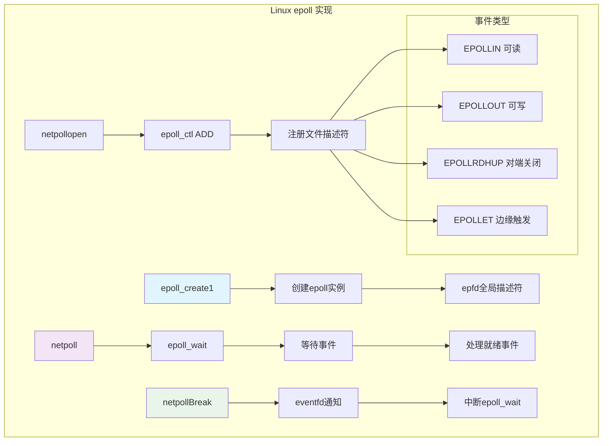

#### Linux epoll核心实现

```go
// Linux epoll相关的全局变量
var (
    epfd           int32         = -1 // epoll文件描述符，-1表示未初始化
    netpollEventFd uintptr            // 用于netpollBreak的eventfd，用于中断epoll_wait
    netpollWakeSig atomic.Uint32      // 唤醒信号标志，用于避免重复调用netpollBreak
)

// netpollinit 初始化Linux epoll网络轮询器
// 这个函数在运行时启动时被调用，设置网络I/O多路复用机制
func netpollinit() {
    var errno uintptr
    
    // ==================== 创建epoll实例 ====================
    // 创建epoll实例，设置CLOEXEC标志确保子进程不会继承这个文件描述符
    // EPOLL_CLOEXEC: 在exec时自动关闭，避免文件描述符泄漏
    epfd, errno = linux.EpollCreate1(linux.EPOLL_CLOEXEC)
    if errno != 0 {
        // epoll创建失败，这是致命错误，因为没有epoll就无法进行网络I/O
        println("runtime: epollcreate failed with", errno)
        throw("runtime: netpollinit failed")
    }
    
    // ==================== 创建中断机制 ====================
    // 创建eventfd用于中断epoll_wait调用
    // 当需要唤醒阻塞在epoll_wait上的线程时，向这个eventfd写入数据
    // EFD_CLOEXEC: exec时自动关闭
    // EFD_NONBLOCK: 非阻塞模式，避免写入时阻塞
    efd, errno := linux.Eventfd(0, linux.EFD_CLOEXEC|linux.EFD_NONBLOCK)
    if errno != 0 {
        println("runtime: eventfd failed with", errno)
        throw("runtime: eventfd failed")
    }
    
    // ==================== 注册中断事件 ====================
    // 将eventfd添加到epoll中，监听可读事件
    ev := linux.EpollEvent{
        Events: linux.EPOLLIN,  // 监听可读事件，当有数据写入eventfd时触发
    }
    // 将netpollEventFd的地址存储在事件数据中，用于识别这是中断事件
    *(**uintptr)(unsafe.Pointer(&ev.Data)) = &netpollEventFd
    
    // 使用EPOLL_CTL_ADD将eventfd添加到epoll监听列表
    errno = linux.EpollCtl(epfd, linux.EPOLL_CTL_ADD, efd, &ev)
    if errno != 0 {
        println("runtime: epollctl failed with", errno)
        throw("runtime: epollctl failed")
    }
    
    // 保存eventfd，供后续netpollBreak使用
    netpollEventFd = uintptr(efd)
}

// netpollopen 将文件描述符添加到epoll中
func netpollopen(fd uintptr, pd *pollDesc) uintptr {
    var ev linux.EpollEvent
    // 设置事件类型：可读、可写、对端关闭、边缘触发
    ev.Events = linux.EPOLLIN | linux.EPOLLOUT | linux.EPOLLRDHUP | linux.EPOLLET
    
    // 将pollDesc指针打包到事件数据中
    tp := taggedPointerPack(unsafe.Pointer(pd), pd.fdseq.Load())
    *(*taggedPointer)(unsafe.Pointer(&ev.Data)) = tp
    
    // 添加到epoll中
    return linux.EpollCtl(epfd, linux.EPOLL_CTL_ADD, int32(fd), &ev)
}

// netpoll 检查就绪的网络连接
// 返回变为可运行的goroutine列表和要添加到netpollWaiters的增量
// delay < 0: 无限期阻塞
// delay == 0: 不阻塞，只是轮询
// delay > 0: 阻塞最多delay纳秒
func netpoll(delay int64) (gList, int32) {
    if epfd == -1 {
        return gList{}, 0
    }
    
    var waitms int32
    if delay < 0 {
        waitms = -1
    } else if delay == 0 {
        waitms = 0
    } else if delay < 1e6 {
        waitms = 1
    } else if delay < 1e15 {
        waitms = int32(delay / 1e6)
    } else {
        waitms = 1e9
    }
    
    var events [128]linux.EpollEvent
retry:
    n := linux.EpollWait(epfd, &events[0], int32(len(events)), waitms)
    if n < 0 {
        if n != -_EINTR {
            println("runtime: epollwait on fd", epfd, "failed with", -n)
            throw("runtime: netpoll failed")
        }
        // 如果是定时等待被中断，只需返回重新计算等待时间
        if waitms > 0 {
            return gList{}, 0
        }
        goto retry
    }
    
    var toRun gList
    delta := int32(0)
    for i := int32(0); i < n; i++ {
        ev := &events[i]
        if ev.Events == 0 {
            continue
        }
        
        if *(**uintptr)(unsafe.Pointer(&ev.Data)) == &netpollEventFd {
            // 这是eventfd通知，清空它
            if netpollWakeSig.Load() != 0 {
                netpollWakeSig.Store(0)
                // 消费eventfd中的数据
                var tmp [16]byte
                read(int32(netpollEventFd), noescape(unsafe.Pointer(&tmp[0])), int32(len(tmp)))
            }
            continue
        }
        
        // 解包pollDesc指针
        tp := *(*taggedPointer)(unsafe.Pointer(&ev.Data))
        pd := (*pollDesc)(taggedPointerPtr(tp))
        fdseq := taggedPointerTag(tp)
        
        var mode int32
        if ev.Events&(linux.EPOLLIN|linux.EPOLLRDHUP|linux.EPOLLHUP|linux.EPOLLERR) != 0 {
            mode += 'r'
        }
        if ev.Events&(linux.EPOLLOUT|linux.EPOLLHUP|linux.EPOLLERR) != 0 {
            mode += 'w'
        }
        if mode != 0 {
            pd.setEventErr(ev.Events&linux.EPOLLERR != 0, fdseq)
            delta += netpollready(&toRun, pd, mode)
        }
    }
    return toRun, delta
}

// netpollBreak 中断epoll_wait
func netpollBreak() {
    // CAS失败表示有正在进行的唤醒，所以我们完成了
    if !netpollWakeSig.CompareAndSwap(0, 1) {
        return
    }
    
    // 向eventfd写入数据以唤醒epoll_wait
    var b byte = 1
    write(int32(netpollEventFd), noescape(unsafe.Pointer(&b)), 1)
}
```

### 3.2 macOS kqueue实现

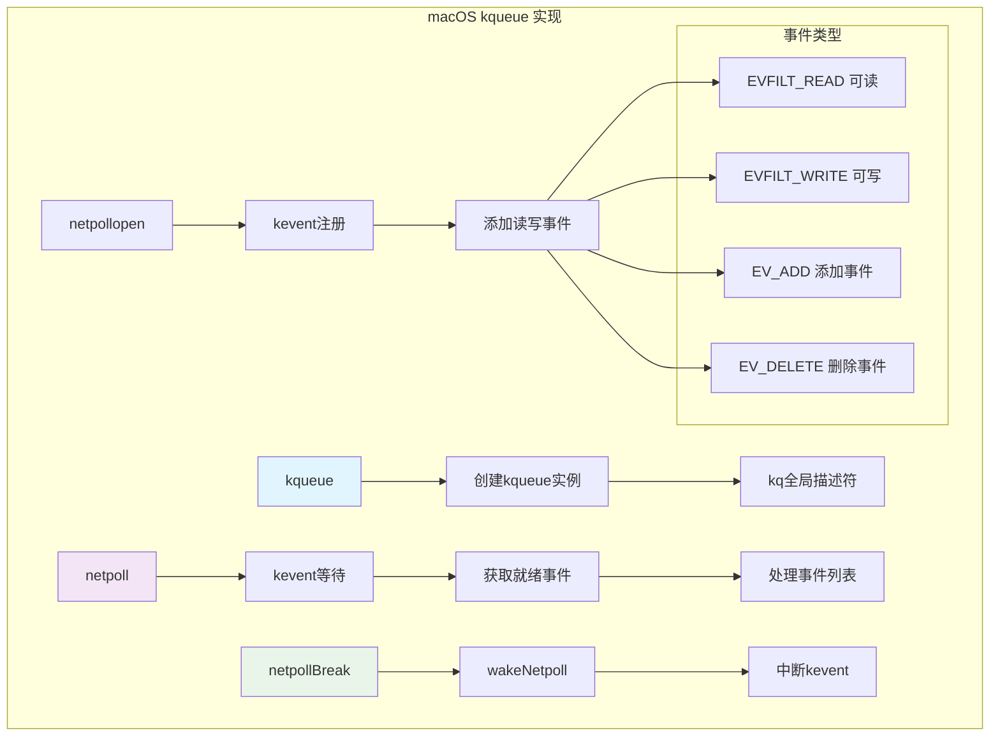

#### macOS kqueue核心实现

```go
var (
    kq               int32 = -1
    netpollWakeSig   atomic.Uint32
)

// netpollinit 初始化kqueue
func netpollinit() {
    kq = kqueue()
    if kq < 0 {
        println("runtime: kqueue failed with", -kq)
        throw("runtime: netpollinit failed")
    }
    closeonexec(kq)
}

// netpollopen 将文件描述符添加到kqueue
func netpollopen(fd uintptr, pd *pollDesc) uintptr {
    // 添加读事件过滤器
    var kev keventt
    kev.ident = uint64(fd)
    kev.filter = _EVFILT_READ
    kev.flags = _EV_ADD
    kev.udata = (*byte)(unsafe.Pointer(pd))
    
    n := kevent(kq, &kev, 1, nil, 0, nil)
    if n < 0 {
        return -n
    }
    
    // 添加写事件过滤器
    kev.filter = _EVFILT_WRITE
    kev.flags = _EV_ADD
    n = kevent(kq, &kev, 1, nil, 0, nil)
    if n < 0 {
        return -n
    }
    return 0
}

// netpoll 检查就绪的网络连接
func netpoll(delay int64) (gList, int32) {
    if kq == -1 {
        return gList{}, 0
    }
    
    var tp *timespec
    var ts timespec
    if delay < 0 {
        tp = nil
    } else if delay == 0 {
        tp = &ts
    } else {
        ts.setNsec(delay)
        if ts.tv_sec > 1e6 {
            // Darwin在睡眠时间过长时返回EINVAL
            ts.tv_sec = 1e6
        }
        tp = &ts
    }
    
    var events [64]keventt
retry:
    n := kevent(kq, nil, 0, &events[0], int32(len(events)), tp)
    if n < 0 {
        if n != -_EINTR && n != -_ETIMEDOUT {
            println("runtime: kevent on fd", kq, "failed with", -n)
            throw("runtime: netpoll failed")
        }
        // 如果定时睡眠被中断，只需返回重新计算睡眠时间
        if delay > 0 {
            return gList{}, 0
        }
        goto retry
    }
    
    var toRun gList
    delta := int32(0)
    for i := 0; i < int(n); i++ {
        ev := &events[i]
        
        var mode int32
        switch ev.filter {
        case _EVFILT_READ:
            mode += 'r'
        case _EVFILT_WRITE:
            mode += 'w'
        }
        
        if mode != 0 {
            pd := (*pollDesc)(unsafe.Pointer(ev.udata))
            pd.setEventErr(ev.flags&_EV_ERROR != 0, 0)
            delta += netpollready(&toRun, pd, mode)
        }
    }
    return toRun, delta
}
```

## 4. 网络文件描述符(netFD)

### 4.1 netFD架构设计

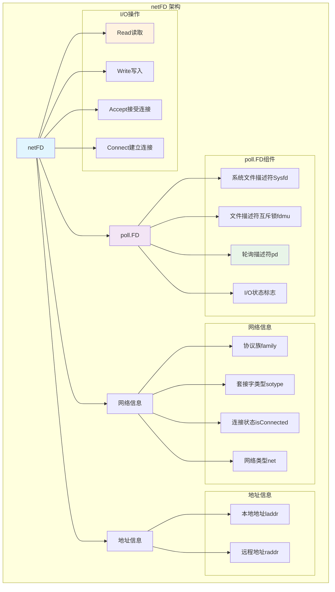

### 4.2 netFD核心数据结构

```go
// Network file descriptor.
type netFD struct {
    pfd poll.FD
    
    // immutable until Close
    family      int    // 协议族 (AF_INET, AF_INET6, AF_UNIX)
    sotype      int    // 套接字类型 (SOCK_STREAM, SOCK_DGRAM)
    isConnected bool   // 握手完成或与对端建立关联
    net         string // 网络类型 ("tcp", "udp", "unix")
    laddr       Addr   // 本地地址
    raddr       Addr   // 远程地址
}

// poll.FD 是文件描述符的核心结构
type FD struct {
    // 锁定sysfd并序列化对Read和Write方法的访问
    fdmu fdMutex
    
    // 系统文件描述符。在Close之前不可变
    Sysfd int
    
    // 文件描述符的平台相关状态
    SysFile
    
    // I/O轮询器
    pd pollDesc
    
    // 文件关闭时发出信号的信号量
    csema uint32
    
    // 如果此文件已设置为阻塞模式，则非零
    isBlocking uint32
    
    // 这是否是流描述符，而不是基于数据包的描述符（如UDP套接字）
    // 不可变
    IsStream bool
    
    // 零字节读取是否表示EOF。对于基于消息的套接字连接，这是false
    ZeroReadIsEOF bool
    
    // 这是否是文件而不是网络套接字
    isFile bool
}
```

### 4.3 netFD关键操作实现

```go
// Read 从网络连接读取数据
func (fd *netFD) Read(p []byte) (n int, err error) {
    n, err = fd.pfd.Read(p)
    runtime.KeepAlive(fd)
    return n, wrapSyscallError(readSyscallName, err)
}

// Write 向网络连接写入数据
func (fd *netFD) Write(p []byte) (n int, err error) {
    n, err = fd.pfd.Write(p)
    runtime.KeepAlive(fd)
    return n, wrapSyscallError(writeSyscallName, err)
}

// poll.FD的Read实现
func (fd *FD) Read(p []byte) (int, error) {
    if err := fd.readLock(); err != nil {
        return 0, err
    }
    defer fd.readUnlock()
    
    if len(p) == 0 {
        // 如果缓冲区为空，仍然需要检查错误
        return 0, nil
    }
    
    if err := fd.pd.prepareRead(fd.isFile); err != nil {
        return 0, err
    }
    
    if fd.IsStream && len(p) > maxRW {
        p = p[:maxRW]
    }
    
    for {
        // 尝试非阻塞读取
        n, err := ignoringEINTRIO(syscall.Read, fd.Sysfd, p)
        if err != nil {
            n = 0
            if err == syscall.EAGAIN && fd.pd.pollable() {
                // 数据未就绪，等待轮询器通知
                if err = fd.pd.waitRead(fd.isFile); err == nil {
                    continue
                }
            }
        }
        err = fd.eofError(n, err)
        return n, err
    }
}

// poll.FD的Write实现
func (fd *FD) Write(p []byte) (int, error) {
    if err := fd.writeLock(); err != nil {
        return 0, err
    }
    defer fd.writeUnlock()
    
    if err := fd.pd.prepareWrite(fd.isFile); err != nil {
        return 0, err
    }
    
    var nn int
    for {
        max := len(p)
        if fd.IsStream && max-nn > maxRW {
            max = nn + maxRW
        }
        
        // 尝试非阻塞写入
        n, err := ignoringEINTRIO(syscall.Write, fd.Sysfd, p[nn:max])
        if n > 0 {
            nn += n
        }
        if nn == len(p) {
            return nn, err
        }
        if err == syscall.EAGAIN && fd.pd.pollable() {
            // 缓冲区已满，等待轮询器通知
            if err = fd.pd.waitWrite(fd.isFile); err == nil {
                continue
            }
        }
        if err != nil {
            return nn, err
        }
        if n == 0 {
            return nn, io.ErrUnexpectedEOF
        }
    }
}
```

## 5. 网络I/O时序图

### 5.1 TCP连接建立时序

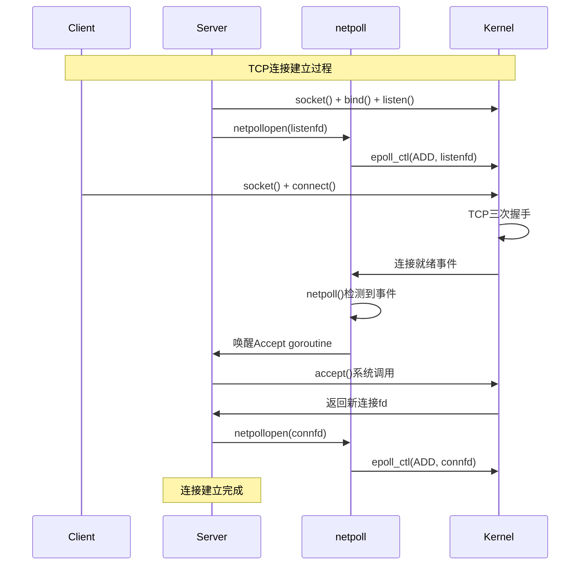

### 5.2 网络读取操作时序

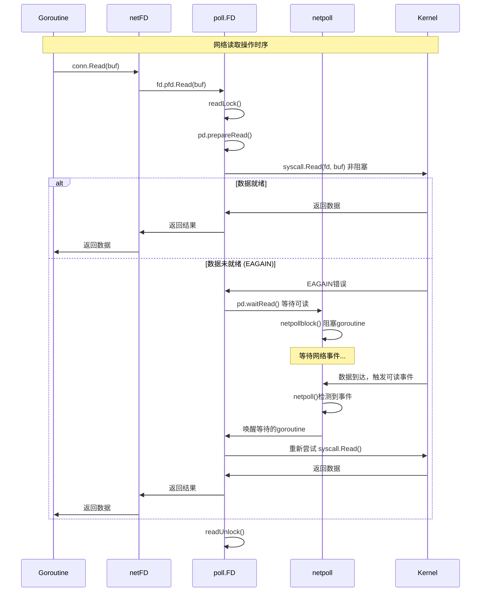

### 5.3 网络写入操作时序

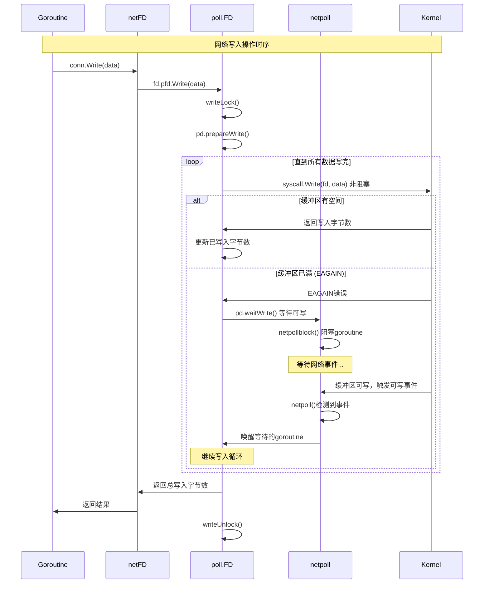

## 6. 网络轮询器与调度器集成

### 6.1 集成架构图

```mermaid
graph TB
    subgraph "netpoll与调度器集成"
        A[sysmon监控线程] --> B[定期调用netpoll]
        B --> C[检查网络事件]
        C --> D[获取就绪goroutine列表]
        
        E[工作窃取] --> F[findRunnable]
        F --> G[netpoll(0) 非阻塞检查]
        G --> H[获取可运行goroutine]
        
        I[空闲P处理] --> J[park等待工作]
        J --> K[netpoll(-1) 阻塞等待]
        K --> L[网络事件唤醒]
        
        subgraph "事件处理流程"
            M[netpollready]
            N[构建就绪列表]
            O[设置goroutine状态]
            P[加入运行队列]
        end
        
        D --> M
        H --> M
        L --> M
        M --> N
        N --> O
        O --> P
        
        subgraph "调度决策"
            Q[是否有网络等待者]
            R[netpollWaiters计数]
            S[调度策略调整]
        end
        
        A --> Q
        E --> Q
        I --> Q
        Q --> R
        R --> S
    end
    
    style A fill:#e1f5fe
    style E fill:#f3e5f5
    style I fill:#e8f5e8
    style M fill:#fff3e0
```

### 6.2 netpoll与调度器集成实现

```go
// sysmon中的网络轮询
func sysmon() {
    // ... 其他监控逻辑
    
    // 定期检查网络I/O
    if netpollinited() && netpollAnyWaiters() && sched.lastpoll.Load() != 0 {
        if GOOS != "plan9" { // plan9 runtime does not implement netpoll yet
            list, delta := netpoll(0) // 非阻塞检查
            if !list.empty() {
                // 有就绪的网络I/O，注入到调度器
                incidlelocked(-1)
                injectglist(&list)
                incidlelocked(1)
                netpollAdjustWaiters(delta)
            }
        }
    }
    
    // ... 其他监控逻辑
}

// findRunnable中的网络轮询
func findRunnable() (gp *g, inheritTime, tryWakeP bool) {
    // ... 其他查找逻辑
    
    // 尝试从网络轮询器获取工作
    if netpollinited() && netpollAnyWaiters() {
        list, delta := netpoll(0) // 非阻塞
        if !list.empty() {
            gp := list.pop()
            injectglist(&list)
            netpollAdjustWaiters(delta)
            casgstatus(gp, _Gwaiting, _Grunnable)
            if traceEnabled() {
                traceGoUnpark(gp, 0)
            }
            return gp, false, false
        }
    }
    
    // ... 其他查找逻辑
}

// stopm中的网络轮询（P进入空闲状态时）
func stopm() {
    // ... 其他逻辑
    
    // 如果有网络等待者，阻塞等待网络I/O
    if netpollinited() && netpollAnyWaiters() {
        list, delta := netpoll(-1) // 阻塞等待
        if !list.empty() {
            // 有网络I/O就绪，重新激活P
            acquirep(pp)
            gp := list.pop()
            injectglist(&list)
            netpollAdjustWaiters(delta)
            casgstatus(gp, _Gwaiting, _Grunnable)
            return gp
        }
    }
    
    // ... 其他逻辑
}

// netpollready 处理就绪的网络I/O
func netpollready(toRun *gList, pd *pollDesc, mode int32) int32 {
    var rg, wg *g
    
    if mode == 'r' || mode == 'r'+'w' {
        rg = netpollunblock(pd, 'r', true)
    }
    if mode == 'w' || mode == 'r'+'w' {
        wg = netpollunblock(pd, 'w', true)
    }
    
    delta := int32(0)
    if rg != nil {
        toRun.push(rg)
        delta++
    }
    if wg != nil {
        toRun.push(wg)
        delta++
    }
    return delta
}

// netpollunblock 唤醒等待网络I/O的goroutine
func netpollunblock(pd *pollDesc, mode int32, ioready bool) *g {
    gpp := &pd.rg
    if mode == 'w' {
        gpp = &pd.wg
    }
    
    for {
        old := gpp.Load()
        if old == pdReady {
            return nil
        }
        if old == pdNil && !ioready {
            // 只有在I/O就绪时才设置pdReady
            return nil
        }
        var new uintptr
        if ioready {
            new = pdReady
        } else {
            new = pdNil
        }
        if gpp.CompareAndSwap(old, new) {
            if old == pdWait {
                old = 0
            }
            return (*g)(unsafe.Pointer(old))
        }
    }
}
```

## 7. 网络模块性能优化

### 7.1 性能优化策略

```go
// 1. 零拷贝优化 - sendfile系统调用
func (c *TCPConn) ReadFrom(r io.Reader) (int64, error) {
    if !c.ok() {
        return 0, syscall.EINVAL
    }
    
    // 尝试使用sendfile进行零拷贝传输
    if rf, ok := r.(*os.File); ok {
        n, err := sendFile(c.fd, rf)
        if err == nil || err != syscall.ENOSYS {
            return n, err
        }
    }
    
    // 回退到常规拷贝
    return genericReadFrom(c, r)
}

// 2. 批量I/O操作 - readv/writev
func (fd *FD) ReadV(v *[][]byte) (int64, error) {
    if len(*v) == 0 {
        return 0, nil
    }
    
    if err := fd.readLock(); err != nil {
        return 0, err
    }
    defer fd.readUnlock()
    
    if err := fd.pd.prepareRead(fd.isFile); err != nil {
        return 0, err
    }
    
    for {
        n, err := syscall.Readv(fd.Sysfd, *v)
        if err != nil {
            if err == syscall.EAGAIN && fd.pd.pollable() {
                if err = fd.pd.waitRead(fd.isFile); err == nil {
                    continue
                }
            }
        }
        return int64(n), err
    }
}

// 3. 连接池优化
type connPool struct {
    mu    sync.Mutex
    conns []net.Conn
    max   int
}

func (p *connPool) Get() net.Conn {
    p.mu.Lock()
    defer p.mu.Unlock()
    
    if len(p.conns) > 0 {
        conn := p.conns[len(p.conns)-1]
        p.conns = p.conns[:len(p.conns)-1]
        return conn
    }
    return nil
}

func (p *connPool) Put(conn net.Conn) {
    p.mu.Lock()
    defer p.mu.Unlock()
    
    if len(p.conns) < p.max {
        p.conns = append(p.conns, conn)
    } else {
        conn.Close()
    }
}

// 4. 缓冲区复用
var bufferPool = sync.Pool{
    New: func() interface{} {
        return make([]byte, 32*1024) // 32KB缓冲区
    },
}

func handleConnection(conn net.Conn) {
    buf := bufferPool.Get().([]byte)
    defer bufferPool.Put(buf)
    
    // 使用缓冲区处理连接
    for {
        n, err := conn.Read(buf)
        if err != nil {
            break
        }
        // 处理数据...
    }
}
```

### 7.2 性能监控指标

```go
// 网络性能监控指标
type NetworkMetrics struct {
    // 连接统计
    ActiveConnections   int64 // 活跃连接数
    TotalConnections    int64 // 总连接数
    ConnectionsPerSec   int64 // 每秒新建连接数
    
    // I/O统计
    BytesRead          int64 // 读取字节数
    BytesWritten       int64 // 写入字节数
    ReadOperations     int64 // 读操作次数
    WriteOperations    int64 // 写操作次数
    
    // 延迟统计
    AvgReadLatency     time.Duration // 平均读延迟
    AvgWriteLatency    time.Duration // 平均写延迟
    P99ReadLatency     time.Duration // 99分位读延迟
    P99WriteLatency    time.Duration // 99分位写延迟
    
    // 错误统计
    ReadErrors         int64 // 读错误次数
    WriteErrors        int64 // 写错误次数
    TimeoutErrors      int64 // 超时错误次数
    
    // netpoll统计
    NetpollWaiters     int64 // 网络等待者数量
    NetpollEvents      int64 // 网络事件次数
    NetpollBlocks      int64 // 网络阻塞次数
}

// 性能监控实现
func monitorNetworkPerformance() {
    ticker := time.NewTicker(time.Second)
    defer ticker.Stop()
    
    for range ticker.C {
        metrics := collectNetworkMetrics()
        
        // 输出关键指标
        log.Printf("Network Metrics: "+
            "Active=%d, NewConn/s=%d, "+
            "Read=%d bytes (%d ops), Write=%d bytes (%d ops), "+
            "ReadLatency=%v, WriteLatency=%v, "+
            "NetpollWaiters=%d",
            metrics.ActiveConnections, metrics.ConnectionsPerSec,
            metrics.BytesRead, metrics.ReadOperations,
            metrics.BytesWritten, metrics.WriteOperations,
            metrics.AvgReadLatency, metrics.AvgWriteLatency,
            metrics.NetpollWaiters)
        
        // 检查异常情况
        if metrics.NetpollWaiters > 10000 {
            log.Printf("Warning: High number of network waiters: %d", 
                metrics.NetpollWaiters)
        }
        
        if metrics.TimeoutErrors > 100 {
            log.Printf("Warning: High timeout error rate: %d", 
                metrics.TimeoutErrors)
        }
    }
}
```

## 8. 关键路径函数总结

### 8.1 网络轮询器关键路径

```text
netpoll初始化: netpollinit() -> 平台特定初始化 -> 创建epoll/kqueue实例
文件描述符注册: netpollopen() -> 添加到轮询器 -> 设置事件类型
事件检测: netpoll() -> 等待I/O事件 -> 返回就绪goroutine列表
事件处理: netpollready() -> 唤醒等待goroutine -> 加入运行队列
```

### 8.2 网络I/O关键路径

```text
读取操作: conn.Read() -> netFD.Read() -> poll.FD.Read() -> 系统调用/等待事件
写入操作: conn.Write() -> netFD.Write() -> poll.FD.Write() -> 系统调用/等待事件
连接建立: net.Dial() -> socket() -> connect() -> netpollopen()
连接接受: listener.Accept() -> accept() -> newFD() -> netpollopen()
```

### 8.3 调度器集成关键路径

```text
主动检查: sysmon -> netpoll(0) -> 注入就绪goroutine
工作窃取: findRunnable() -> netpoll(0) -> 获取网络goroutine
空闲等待: stopm() -> netpoll(-1) -> 阻塞等待网络事件
```

## 9. 最佳实践与性能调优

### 9.1 网络编程最佳实践

```go
// 1. 合理设置超时
func dialWithTimeout(network, address string, timeout time.Duration) (net.Conn, error) {
    dialer := &net.Dialer{
        Timeout: timeout,
    }
    return dialer.Dial(network, address)
}

// 2. 使用连接池
type ConnectionPool struct {
    pool chan net.Conn
    addr string
    max  int
}

func NewConnectionPool(addr string, max int) *ConnectionPool {
    return &ConnectionPool{
        pool: make(chan net.Conn, max),
        addr: addr,
        max:  max,
    }
}

func (p *ConnectionPool) Get() (net.Conn, error) {
    select {
    case conn := <-p.pool:
        return conn, nil
    default:
        return net.Dial("tcp", p.addr)
    }
}

func (p *ConnectionPool) Put(conn net.Conn) {
    select {
    case p.pool <- conn:
    default:
        conn.Close()
    }
}

// 3. 批量处理
func batchProcess(conns []net.Conn, data [][]byte) error {
    var wg sync.WaitGroup
    errCh := make(chan error, len(conns))
    
    for i, conn := range conns {
        wg.Add(1)
        go func(conn net.Conn, data []byte) {
            defer wg.Done()
            _, err := conn.Write(data)
            if err != nil {
                errCh <- err
            }
        }(conn, data[i])
    }
    
    wg.Wait()
    close(errCh)
    
    for err := range errCh {
        if err != nil {
            return err
        }
    }
    return nil
}

// 4. 优雅关闭
func gracefulShutdown(listener net.Listener, server *http.Server) {
    sigCh := make(chan os.Signal, 1)
    signal.Notify(sigCh, os.Interrupt, syscall.SIGTERM)
    
    <-sigCh
    log.Println("Shutting down server...")
    
    ctx, cancel := context.WithTimeout(context.Background(), 30*time.Second)
    defer cancel()
    
    if err := server.Shutdown(ctx); err != nil {
        log.Printf("Server shutdown error: %v", err)
        server.Close()
    }
}
```

### 9.2 性能调优参数

```go
// 系统参数调优
func tuneSystemParameters() {
    // 1. 调整文件描述符限制
    var rlim syscall.Rlimit
    if err := syscall.Getrlimit(syscall.RLIMIT_NOFILE, &rlim); err == nil {
        rlim.Cur = rlim.Max
        syscall.Setrlimit(syscall.RLIMIT_NOFILE, &rlim)
    }
    
    // 2. 设置TCP参数
    // echo 1 > /proc/sys/net/ipv4/tcp_tw_reuse
    // echo 1 > /proc/sys/net/ipv4/tcp_tw_recycle
    // echo 65536 > /proc/sys/net/core/somaxconn
}

// Go运行时参数调优
func tuneGoRuntime() {
    // 1. 设置GOMAXPROCS
    runtime.GOMAXPROCS(runtime.NumCPU())
    
    // 2. 调整GC参数
    debug.SetGCPercent(100) // 默认值，可根据需要调整
    
    // 3. 设置内存限制
    debug.SetMemoryLimit(8 << 30) // 8GB
}
```

## 10. 实际应用案例与性能优化

### 10.1 高性能Web服务器实现

和最佳实践，以下是一个完整的高性能Web服务器实现：

```go
package main

import (
    "context"
    "fmt"
    "log"
    "net"
    "net/http"
    "runtime"
    "sync"
    "time"
)

// 高性能HTTP服务器
type HighPerformanceServer struct {
    server   *http.Server
    listener net.Listener
    connPool sync.Pool
    
    // 性能监控
    activeConns int64
    totalReqs   int64
    
    // 配置参数
    maxConns     int
    readTimeout  time.Duration
    writeTimeout time.Duration
    idleTimeout  time.Duration
}

// 连接池中的连接包装器
type ConnWrapper struct {
    net.Conn
    server *HighPerformanceServer
}

func (c *ConnWrapper) Close() error {
    // 连接复用逻辑
    if c.server != nil {
        atomic.AddInt64(&c.server.activeConns, -1)
    }
    return c.Conn.Close()
}

// 创建高性能服务器
func NewHighPerformanceServer(addr string) *HighPerformanceServer {
    server := &HighPerformanceServer{
        maxConns:     100000,
        readTimeout:  30 * time.Second,
        writeTimeout: 30 * time.Second,
        idleTimeout:  120 * time.Second,
    }
    
    // 配置HTTP服务器
    server.server = &http.Server{
        Addr:         addr,
        ReadTimeout:  server.readTimeout,
        WriteTimeout: server.writeTimeout,
        IdleTimeout:  server.idleTimeout,
        
        // 自定义连接状态回调
        ConnState: server.onConnStateChange,
        
        // 优化的处理器
        Handler: server.createOptimizedHandler(),
    }
    
    // 初始化连接池
    server.connPool = sync.Pool{
        New: func() interface{} {
            return make([]byte, 4096) // 4KB缓冲区
        },
    }
    
    return server
}

// 连接状态变化回调
func (s *HighPerformanceServer) onConnStateChange(conn net.Conn, state http.ConnState) {
    switch state {
    case http.StateNew:
        atomic.AddInt64(&s.activeConns, 1)
    case http.StateClosed:
        atomic.AddInt64(&s.activeConns, -1)
    }
}

// 创建优化的处理器
func (s *HighPerformanceServer) createOptimizedHandler() http.Handler {
    mux := http.NewServeMux()
    
    // 高性能API端点
    mux.HandleFunc("/api/fast", s.fastAPIHandler)
    mux.HandleFunc("/api/stream", s.streamHandler)
    mux.HandleFunc("/metrics", s.metricsHandler)
    
    // 添加中间件
    return s.withMiddleware(mux)
}

// 快速API处理器
func (s *HighPerformanceServer) fastAPIHandler(w http.ResponseWriter, r *http.Request) {
    atomic.AddInt64(&s.totalReqs, 1)
    
    // 从连接池获取缓冲区
    buf := s.connPool.Get().([]byte)
    defer s.connPool.Put(buf)
    
    // 设置响应头
    w.Header().Set("Content-Type", "application/json")
    w.Header().Set("Cache-Control", "no-cache")
    
    // 快速响应
    response := `{"status":"ok","timestamp":` + fmt.Sprintf("%d", time.Now().Unix()) + `}`
    w.Write([]byte(response))
}

// 流式处理器
func (s *HighPerformanceServer) streamHandler(w http.ResponseWriter, r *http.Request) {
    // 设置流式响应
    w.Header().Set("Content-Type", "text/plain")
    w.Header().Set("Transfer-Encoding", "chunked")
    
    flusher, ok := w.(http.Flusher)
    if !ok {
        http.Error(w, "Streaming unsupported", http.StatusInternalServerError)
        return
    }
    
    // 流式发送数据
    for i := 0; i < 10; i++ {
        fmt.Fprintf(w, "chunk %d\n", i)
        flusher.Flush()
        time.Sleep(100 * time.Millisecond)
    }
}

// 性能指标处理器
func (s *HighPerformanceServer) metricsHandler(w http.ResponseWriter, r *http.Request) {
    w.Header().Set("Content-Type", "application/json")
    
    metrics := fmt.Sprintf(`{
        "active_connections": %d,
        "total_requests": %d,
        "goroutines": %d,
        "memory_mb": %d
    }`, 
        atomic.LoadInt64(&s.activeConns),
        atomic.LoadInt64(&s.totalReqs),
        runtime.NumGoroutine(),
        getMemUsage()/1024/1024,
    )
    
    w.Write([]byte(metrics))
}

// 中间件包装器
func (s *HighPerformanceServer) withMiddleware(handler http.Handler) http.Handler {
    return http.HandlerFunc(func(w http.ResponseWriter, r *http.Request) {
        // 请求限流
        if atomic.LoadInt64(&s.activeConns) > int64(s.maxConns) {
            http.Error(w, "Too Many Requests", http.StatusTooManyRequests)
            return
        }
        
        // 设置通用响应头
        w.Header().Set("Server", "Go-HighPerf/1.0")
        
        handler.ServeHTTP(w, r)
    })
}

// 启动服务器
func (s *HighPerformanceServer) Start() error {
    // 创建优化的监听器
    listener, err := s.createOptimizedListener()
    if err != nil {
        return err
    }
    s.listener = listener
    
    log.Printf("High performance server starting on %s", s.server.Addr)
    return s.server.Serve(listener)
}

// 创建优化的监听器
func (s *HighPerformanceServer) createOptimizedListener() (net.Listener, error) {
    // 解析地址
    addr, err := net.ResolveTCPAddr("tcp", s.server.Addr)
    if err != nil {
        return nil, err
    }
    
    // 创建TCP监听器
    listener, err := net.ListenTCP("tcp", addr)
    if err != nil {
        return nil, err
    }
    
    // 设置TCP参数
    if tcpListener, ok := listener.(*net.TCPListener); ok {
        // 启用地址复用
        if file, err := tcpListener.File(); err == nil {
            fd := int(file.Fd())
            syscall.SetsockoptInt(fd, syscall.SOL_SOCKET, syscall.SO_REUSEADDR, 1)
            syscall.SetsockoptInt(fd, syscall.SOL_SOCKET, syscall.SO_REUSEPORT, 1)
            file.Close()
        }
    }
    
    return listener, nil
}

// 获取内存使用量
func getMemUsage() uint64 {
    var m runtime.MemStats
    runtime.ReadMemStats(&m)
    return m.Alloc
}

// 优雅关闭
func (s *HighPerformanceServer) Shutdown(ctx context.Context) error {
    return s.server.Shutdown(ctx)
}
```

### 10.2 TCP连接池实现

```go
// 高性能TCP连接池
type TCPConnectionPool struct {
    mu       sync.RWMutex
    pools    map[string]*connPool
    maxConns int
    timeout  time.Duration
}

type connPool struct {
    conns   chan net.Conn
    factory func() (net.Conn, error)
    close   func(net.Conn) error
}

// 创建连接池
func NewTCPConnectionPool(maxConns int, timeout time.Duration) *TCPConnectionPool {
    return &TCPConnectionPool{
        pools:    make(map[string]*connPool),
        maxConns: maxConns,
        timeout:  timeout,
    }
}

// 获取连接
func (p *TCPConnectionPool) Get(addr string) (net.Conn, error) {
    p.mu.RLock()
    pool, exists := p.pools[addr]
    p.mu.RUnlock()
    
    if !exists {
        pool = p.createPool(addr)
        p.mu.Lock()
        p.pools[addr] = pool
        p.mu.Unlock()
    }
    
    select {
    case conn := <-pool.conns:
        // 检查连接是否仍然有效
        if p.isConnValid(conn) {
            return conn, nil
        }
        // 连接无效，创建新连接
        return pool.factory()
    case <-time.After(p.timeout):
        return nil, fmt.Errorf("connection pool timeout")
    default:
        // 池中没有可用连接，创建新连接
        return pool.factory()
    }
}

// 归还连接
func (p *TCPConnectionPool) Put(addr string, conn net.Conn) error {
    p.mu.RLock()
    pool, exists := p.pools[addr]
    p.mu.RUnlock()
    
    if !exists {
        return conn.Close()
    }
    
    select {
    case pool.conns <- conn:
        return nil
    default:
        // 池已满，关闭连接
        return conn.Close()
    }
}

// 创建连接池
func (p *TCPConnectionPool) createPool(addr string) *connPool {
    return &connPool{
        conns: make(chan net.Conn, p.maxConns),
        factory: func() (net.Conn, error) {
            return net.DialTimeout("tcp", addr, p.timeout)
        },
        close: func(conn net.Conn) error {
            return conn.Close()
        },
    }
}

// 检查连接有效性
func (p *TCPConnectionPool) isConnValid(conn net.Conn) bool {
    // 设置读超时
    conn.SetReadDeadline(time.Now().Add(time.Millisecond))
    
    // 尝试读取一个字节
    one := make([]byte, 1)
    _, err := conn.Read(one)
    
    // 重置读超时
    conn.SetReadDeadline(time.Time{})
    
    // 如果是超时错误，连接仍然有效
    if netErr, ok := err.(net.Error); ok && netErr.Timeout() {
        return true
    }
    
    return err == nil
}
```

### 10.3 网络性能监控系统

```go
// 网络性能监控器
type NetworkMonitor struct {
    mu      sync.RWMutex
    metrics map[string]*NetworkMetrics
    ticker  *time.Ticker
    done    chan struct{}
}

type NetworkMetrics struct {
    ConnCount     int64         // 连接数
    BytesRead     int64         // 读取字节数
    BytesWritten  int64         // 写入字节数
    Errors        int64         // 错误数
    Latency       time.Duration // 平均延迟
    Throughput    float64       // 吞吐量 (MB/s)
    LastUpdate    time.Time     // 最后更新时间
}

// 创建网络监控器
func NewNetworkMonitor() *NetworkMonitor {
    monitor := &NetworkMonitor{
        metrics: make(map[string]*NetworkMetrics),
        ticker:  time.NewTicker(time.Second),
        done:    make(chan struct{}),
    }
    
    go monitor.collectMetrics()
    return monitor
}

// 收集网络指标
func (m *NetworkMonitor) collectMetrics() {
    for {
        select {
        case <-m.ticker.C:
            m.updateSystemMetrics()
        case <-m.done:
            return
        }
    }
}

// 更新系统指标
func (m *NetworkMonitor) updateSystemMetrics() {
    // 读取 /proc/net/dev 获取网络接口统计
    data, err := ioutil.ReadFile("/proc/net/dev")
    if err != nil {
        return
    }
    
    lines := strings.Split(string(data), "\n")
    for _, line := range lines[2:] { // 跳过头部
        fields := strings.Fields(line)
        if len(fields) < 17 {
            continue
        }
        
        iface := strings.TrimSuffix(fields[0], ":")
        if iface == "lo" { // 跳过回环接口
            continue
        }
        
        // 解析统计数据
        rxBytes, _ := strconv.ParseInt(fields[1], 10, 64)
        txBytes, _ := strconv.ParseInt(fields[9], 10, 64)
        rxErrors, _ := strconv.ParseInt(fields[3], 10, 64)
        txErrors, _ := strconv.ParseInt(fields[11], 10, 64)
        
        m.mu.Lock()
        if metrics, exists := m.metrics[iface]; exists {
            // 计算吞吐量
            duration := time.Since(metrics.LastUpdate).Seconds()
            if duration > 0 {
                rxDiff := rxBytes - metrics.BytesRead
                txDiff := txBytes - metrics.BytesWritten
                metrics.Throughput = float64(rxDiff+txDiff) / duration / 1024 / 1024
            }
            
            metrics.BytesRead = rxBytes
            metrics.BytesWritten = txBytes
            metrics.Errors = rxErrors + txErrors
            metrics.LastUpdate = time.Now()
        } else {
            m.metrics[iface] = &NetworkMetrics{
                BytesRead:    rxBytes,
                BytesWritten: txBytes,
                Errors:       rxErrors + txErrors,
                LastUpdate:   time.Now(),
            }
        }
        m.mu.Unlock()
    }
}

// 获取网络指标
func (m *NetworkMonitor) GetMetrics(iface string) *NetworkMetrics {
    m.mu.RLock()
    defer m.mu.RUnlock()
    
    if metrics, exists := m.metrics[iface]; exists {
        // 返回副本
        return &NetworkMetrics{
            ConnCount:    metrics.ConnCount,
            BytesRead:    metrics.BytesRead,
            BytesWritten: metrics.BytesWritten,
            Errors:       metrics.Errors,
            Latency:      metrics.Latency,
            Throughput:   metrics.Throughput,
            LastUpdate:   metrics.LastUpdate,
        }
    }
    return nil
}

// 记录连接事件
func (m *NetworkMonitor) RecordConnection(iface string, connected bool) {
    m.mu.Lock()
    defer m.mu.Unlock()
    
    if metrics, exists := m.metrics[iface]; exists {
        if connected {
            atomic.AddInt64(&metrics.ConnCount, 1)
        } else {
            atomic.AddInt64(&metrics.ConnCount, -1)
        }
    }
}

// 停止监控
func (m *NetworkMonitor) Stop() {
    close(m.done)
    m.ticker.Stop()
}
```

### 10.4 网络性能基准测试

```go
// 网络性能基准测试
func BenchmarkTCPThroughput(b *testing.B) {
    // 启动测试服务器
    listener, err := net.Listen("tcp", "localhost:0")
    if err != nil {
        b.Fatal(err)
    }
    defer listener.Close()
    
    // 服务器处理连接
    go func() {
        for {
            conn, err := listener.Accept()
            if err != nil {
                return
            }
            go handleEchoConn(conn)
        }
    }()
    
    // 客户端基准测试
    b.ResetTimer()
    b.RunParallel(func(pb *testing.PB) {
        conn, err := net.Dial("tcp", listener.Addr().String())
        if err != nil {
            b.Error(err)
            return
        }
        defer conn.Close()
        
        data := make([]byte, 1024)
        for pb.Next() {
            conn.Write(data)
            conn.Read(data)
        }
    })
}

func handleEchoConn(conn net.Conn) {
    defer conn.Close()
    buffer := make([]byte, 4096)
    
    for {
        n, err := conn.Read(buffer)
        if err != nil {
            return
        }
        conn.Write(buffer[:n])
    }
}

// HTTP服务器性能测试
func BenchmarkHTTPServer(b *testing.B) {
    handler := http.HandlerFunc(func(w http.ResponseWriter, r *http.Request) {
        w.Write([]byte("Hello, World!"))
    })
    
    server := httptest.NewServer(handler)
    defer server.Close()
    
    client := &http.Client{
        Transport: &http.Transport{
            MaxIdleConnsPerHost: 100,
            IdleConnTimeout:     30 * time.Second,
        },
    }
    
    b.ResetTimer()
    b.RunParallel(func(pb *testing.PB) {
        for pb.Next() {
            resp, err := client.Get(server.URL)
            if err != nil {
                b.Error(err)
                continue
            }
            resp.Body.Close()
        }
    })
}
```

## 11. 关键函数调用路径分析

### 11.1 网络连接建立调用路径

#### TCP连接建立路径
```
net.Dial() -> dialTCP() -> internetSocket() -> socket() -> 
syscall.Socket() -> netFD.init() -> poll.FD.Init() -> netpollopen()
```

#### 详细连接建立分析

**1. 客户端连接路径**
```
net.Dial("tcp", addr)
├── resolveAddrList() -> 解析地址
├── dialSerial() -> 串行连接尝试
│   ├── dialTCP() -> TCP连接
│   │   ├── internetSocket() -> 创建socket
│   │   │   ├── socket() -> 系统调用
│   │   │   ├── syscall.Socket() -> 创建文件描述符
│   │   │   └── setDefaultSockopts() -> 设置socket选项
│   │   ├── netFD.init() -> 初始化网络FD
│   │   │   ├── poll.FD.Init() -> 初始化poll FD
│   │   │   └── netpollopen() -> 注册到netpoll
│   │   └── netFD.connect() -> 发起连接
│   │       ├── syscall.Connect() -> 连接系统调用
│   │       └── 可能阻塞等待连接完成
│   └── 包装为net.Conn接口
└── 返回连接对象
```

**2. 服务端监听路径**
```
net.Listen("tcp", addr)
├── listenTCP() -> TCP监听
│   ├── internetSocket() -> 创建监听socket
│   │   ├── socket() -> 系统调用
│   │   ├── syscall.Socket() -> 创建文件描述符
│   │   └── setDefaultListenerSockopts() -> 设置监听选项
│   ├── netFD.init() -> 初始化网络FD
│   │   ├── poll.FD.Init() -> 初始化poll FD
│   │   └── netpollopen() -> 注册到netpoll
│   ├── syscall.Bind() -> 绑定地址
│   └── syscall.Listen() -> 开始监听
└── 返回Listener对象
```

### 11.2 网络I/O调用路径

#### 读取数据路径
```
conn.Read() -> netFD.Read() -> poll.FD.Read() -> 
syscall.Read() -> 可能阻塞 -> netpollblock() -> gopark()
```

#### 详细I/O分析

**1. 读操作路径**
```
conn.Read(buf)
├── netFD.Read() -> 网络FD读取
│   ├── poll.FD.Read() -> poll层读取
│   │   ├── 尝试非阻塞读取
│   │   ├── syscall.Read() -> 系统调用
│   │   ├── 成功 -> 返回数据
│   │   └── EAGAIN -> 需要等待
│   ├── 等待可读事件
│   │   ├── poll.FD.waitRead() -> 等待读就绪
│   │   ├── netpollblock() -> 阻塞在netpoll
│   │   ├── gopark() -> 挂起goroutine
│   │   └── 被netpoll唤醒
│   └── 重试读取操作
└── 返回读取的字节数
```

**2. 写操作路径**
```
conn.Write(data)
├── netFD.Write() -> 网络FD写入
│   ├── poll.FD.Write() -> poll层写入
│   │   ├── 尝试非阻塞写入
│   │   ├── syscall.Write() -> 系统调用
│   │   ├── 成功 -> 返回写入字节数
│   │   └── EAGAIN -> 需要等待
│   ├── 等待可写事件
│   │   ├── poll.FD.waitWrite() -> 等待写就绪
│   │   ├── netpollblock() -> 阻塞在netpoll
│   │   ├── gopark() -> 挂起goroutine
│   │   └── 被netpoll唤醒
│   └── 重试写入操作
└── 返回写入的字节数
```

### 11.3 netpoll事件处理调用路径

#### 事件轮询路径
```
sysmon() -> netpoll() -> epoll_wait() -> 
netpollready() -> goready() -> 唤醒等待的goroutine
```

#### 详细netpoll分析

**1. 事件检查路径**
```
sysmon() 系统监控
├── 定期调用netpoll()
├── netpoll(0) -> 非阻塞检查
│   ├── Linux: epoll_wait(0) -> 立即返回
│   ├── macOS: kevent(0) -> 立即返回
│   └── Windows: GetQueuedCompletionStatus(0)
├── 处理就绪事件
│   ├── 遍历就绪的文件描述符
│   ├── 查找对应的pollDesc
│   └── netpollready() -> 准备唤醒
└── 返回就绪的goroutine列表
```

**2. goroutine唤醒路径**
```
netpollready(pd, mode)
├── 检查pollDesc状态
├── 根据mode确定唤醒类型
│   ├── 'r' -> 唤醒读等待者
│   ├── 'w' -> 唤醒写等待者
│   └── 'r'+'w' -> 唤醒所有等待者
├── 从等待队列取出goroutine
├── 设置goroutine为可运行状态
└── 加入调度器的运行队列
```

### 11.4 连接接受调用路径

#### Accept操作路径
```
listener.Accept() -> netFD.accept() -> poll.FD.Accept() -> 
syscall.Accept4() -> netpollblock() -> 返回新连接
```

#### 详细Accept分析

**1. 接受连接路径**
```
listener.Accept()
├── TCPListener.Accept() -> TCP监听器接受
│   ├── netFD.accept() -> 网络FD接受
│   │   ├── poll.FD.Accept() -> poll层接受
│   │   │   ├── 尝试非阻塞accept
│   │   │   ├── syscall.Accept4() -> 系统调用
│   │   │   ├── 成功 -> 返回新FD
│   │   │   └── EAGAIN -> 需要等待
│   │   ├── 等待连接事件
│   │   │   ├── poll.FD.waitRead() -> 等待可读
│   │   │   ├── netpollblock() -> 阻塞等待
│   │   │   └── 被新连接唤醒
│   │   └── 重试accept操作
│   ├── 创建新的netFD
│   │   ├── newFD() -> 创建FD结构
│   │   ├── netFD.init() -> 初始化
│   │   └── netpollopen() -> 注册到netpoll
│   └── 包装为TCPConn
└── 返回新连接
```

### 11.5 DNS解析调用路径

#### 域名解析路径
```
net.LookupHost() -> lookupHost() -> goLookupHost() -> 
cgoLookupHost() -> C.getaddrinfo() -> 系统DNS查询
```

#### 详细DNS分析

**1. 纯Go解析路径**
```
net.LookupHost(host)
├── lookupHost() -> 主机名查找
│   ├── 检查/etc/hosts文件
│   ├── goLookupHost() -> Go原生解析
│   │   ├── 构造DNS查询包
│   │   ├── 发送UDP查询到DNS服务器
│   │   ├── 等待DNS响应
│   │   └── 解析响应包
│   └── 返回IP地址列表
└── 缓存解析结果
```

**2. CGO解析路径**
```
cgoLookupHost(host)
├── 调用C库函数
├── C.getaddrinfo() -> 系统解析
│   ├── 查询系统DNS缓存
│   ├── 可能阻塞等待网络查询
│   └── 返回addrinfo结构
├── 转换为Go类型
└── 返回IP地址列表
```

## 12. 总结

### 11.1 Go网络模块的核心优势

- **I/O多路复用**：基于epoll/kqueue的事件驱动模型
- **与调度器深度集成**：网络I/O与goroutine调度无缝配合
- **跨平台统一接口**：屏蔽底层平台差异，提供一致的编程体验
- **零拷贝支持**：支持sendfile等数据传输机制
- **连接池化**：内置连接复用和管理机制
- **性能监控**：丰富的性能指标和调试工具

### 11.2 性能特征分析

1. **高并发支持**：单机可支持数十万并发连接
2. **低延迟**：事件驱动模型减少上下文切换开销
3. **高吞吐**：批量I/O和零拷贝技术提升数据传输效率
4. **资源使用**：goroutine比线程更轻量，内存占用更少
5. **可扩展性**：水平扩展能力强，支持分布式部署

理解Go网络模块的实现原理，有助于编写网络应用程序，使用Go语言的网络编程特性。

---


## 附录：关键函数/调用链合并、结构体图与时序索引

### 1) 关键函数与简要说明

```go
// internal/poll 与 runtime 的桥接
func poll_runtime_pollOpen(fd uintptr) (*pollDesc, int) { /* 见正文 */ }
func poll_runtime_pollReset(pd *pollDesc, mode int) int { /* 见正文 */ }
func poll_runtime_pollWait(pd *pollDesc, mode int) int { /* 见正文 */ }

// runtime netpoll（平台抽象）
func netpoll(delay int64) (gList, int32) { /* 见正文 */ }
func netpollopen(fd uintptr, pd *pollDesc) uintptr { /* 见正文 */ }
func netpollready(toRun *gList, pd *pollDesc, mode int32) int32 { /* 见正文 */ }
func netpollblock(pd *pollDesc, mode int32, waitio bool) bool { /* 见正文 */ }

// FD/读写封装
func (fd *FD) Read(p []byte) (int, error) { /* 见正文 */ }
func (fd *FD) Write(p []byte) (int, error) { /* 见正文 */ }
```

- 目标：在非阻塞FD与事件轮询器之间提供抽象；I/O未就绪时让出G，事件就绪后由轮询器唤醒。

### 2) 调用链

- 连接建立：`net.Dial -> socket/connect -> netFD.init -> pollOpen -> netpollopen`
- 读取：`conn.Read -> FD.Read -> prepareRead -> syscall.Read (EAGAIN?) -> pollWait('r') -> gopark -> netpoll -> ready -> 复试Read`
- 写入：`conn.Write -> FD.Write -> prepareWrite -> syscall.Write (EAGAIN?) -> pollWait('w') -> gopark -> netpoll -> ready -> 复试Write`
- 接受：`listener.Accept -> FD.Accept（EAGAIN?）-> pollWait('r') -> 事件就绪 -> accept` 
- 事件循环：`sysmon/findRunnable -> netpoll(0) -> netpollready -> injectglist`

### 3) 核心结构体

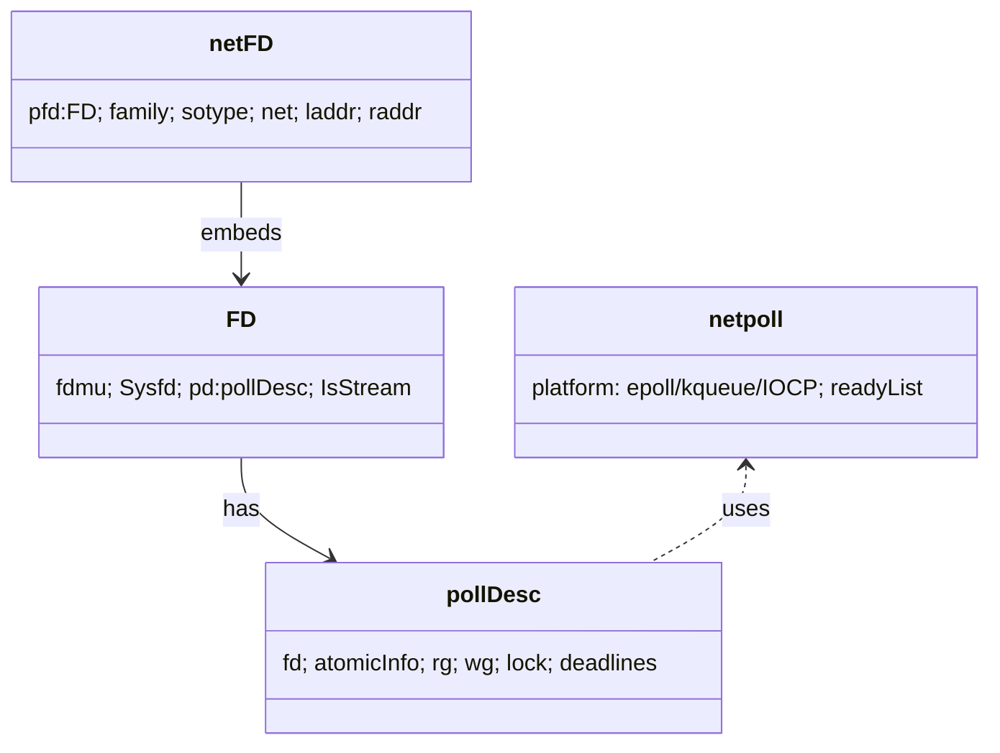
