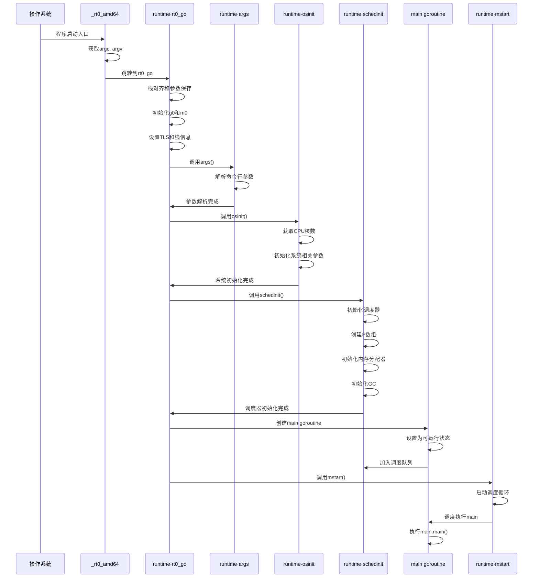
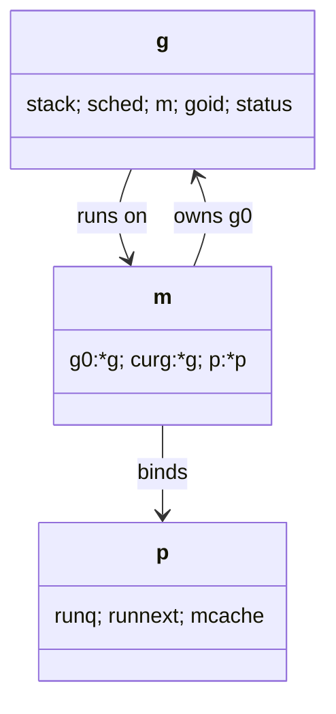
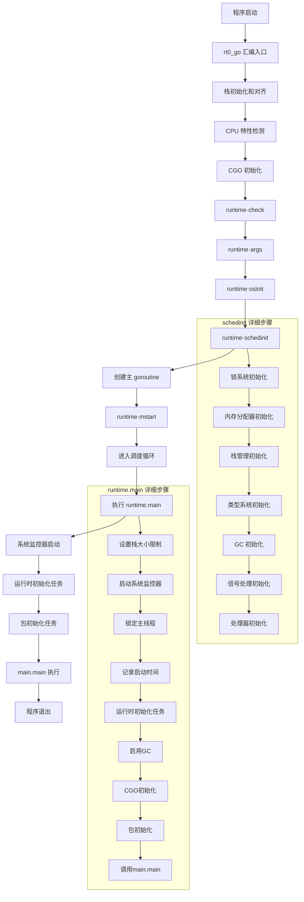

## 0. Go程序启动流程深度解析

Go程序从操作系统启动到用户main函数执行的完整流程。

### 0.1 程序入口点分析

#### 0.1.1 `_rt0_amd64` 函数 - 程序真正的入口

```assembly
// src/runtime/asm_amd64.s
TEXT _rt0_amd64(SB),NOSPLIT,$-8
    MOVQ    0(SP), DI        // argc -> DI
    LEAQ    8(SP), SI        // argv -> SI
    JMP     runtime·rt0_go(SB) // 跳转到核心启动函数
```

**详细分析**：
- **函数签名**：`_rt0_amd64` 是Go程序在AMD64架构上的真正入口点
- **参数获取**：从栈中获取`argc`（参数数量）和`argv`（参数指针）
- **寄存器约定**：遵循System V ABI调用约定，DI和SI作为前两个参数寄存器
- **无栈帧**：使用`$-8`表示不分配栈帧，直接使用调用者栈

#### 0.1.2 `runtime·rt0_go` 函数 - 核心启动逻辑

```assembly
// src/runtime/asm_amd64.s  
TEXT runtime·rt0_go(SB),NOSPLIT|NOFRAME|TOPFRAME,$0
    // 保存参数到寄存器
    MOVQ    DI, AX           // argc -> AX
    MOVQ    SI, BX           // argv -> BX
    
    // 栈空间分配和对齐
    SUBQ    $(5*8), SP       // 分配40字节栈空间
    ANDQ    $~15, SP         // 16字节栈对齐
    
    // 参数保存到栈
    MOVQ    AX, 24(SP)       // 保存argc
    MOVQ    BX, 32(SP)       // 保存argv
    
    // 初始化g0和m0
    LEAQ    runtime·g0(SB), CX
    MOVQ    CX, g(BX)        // 设置当前g为g0
    LEAQ    runtime·m0(SB), AX
    
    // 设置g0的栈
    MOVQ    $runtime·g0(SB), DI
    LEAQ    (-64*1024+104)(SP), BX  // g0栈底
    MOVQ    BX, g_stackguard0(DI)   // 设置栈保护
    MOVQ    BX, g_stackguard1(DI)
    MOVQ    SP, g_stack+stack_hi(DI) // 设置栈顶
    
    // 调用Go初始化函数
    CALL    runtime·args(SB)         // 处理命令行参数
    CALL    runtime·osinit(SB)       // 操作系统初始化
    CALL    runtime·schedinit(SB)    // 调度器初始化
    
    // 创建main goroutine
    MOVQ    $runtime·mainPC(SB), AX  // main函数地址
    PUSHQ   AX                       // 压栈作为参数
    CALL    runtime·newproc(SB)      // 创建main goroutine
    POPQ    AX                       // 清理栈
    
    // 启动调度器
    CALL    runtime·mstart(SB)       // 永不返回
```

**关键步骤解析**：

1. **栈对齐**：16字节对齐确保SSE指令正确执行
2. **g0初始化**：g0是每个M的调度栈，用于执行调度器代码
3. **m0初始化**：m0是主线程对应的M结构
4. **参数处理**：`runtime·args`解析命令行参数
5. **系统初始化**：`runtime·osinit`进行操作系统相关初始化
6. **调度器初始化**：`runtime·schedinit`初始化调度器
7. **main goroutine创建**：创建执行用户main函数的goroutine
8. **调度器启动**：`runtime·mstart`启动调度循环

### 0.2 Go程序启动完整时序图



### 0.3 逃逸分析机制深度解析

#### 0.3.1 逃逸分析概述

逃逸分析是Go编译器在编译时执行的重要优化技术，用于确定变量的分配位置（栈或堆）。

```go
// 示例1：变量不逃逸，分配在栈上
func stackAllocation() {
    x := 42
    fmt.Println(x) // 栈上分配
}

// 示例2：变量逃逸，分配在堆上
func heapAllocation() *int {
    x := 42
    return &x // 逃逸到堆上
}

// 示例3：接口导致逃逸
func interfaceEscape() {
    x := 42
    fmt.Println(x) // interface{}参数导致逃逸
}

// 示例4：切片扩容导致逃逸
func sliceEscape() {
    s := make([]int, 0, 10)
    for i := 0; i < 1000; i++ {
        s = append(s, i) // 扩容时逃逸
    }
}
```

#### 0.2.2 逃逸分析的编译器实现

**查看逃逸分析结果**：

```bash
# 编译时显示逃逸分析信息
go build -gcflags='-m -m' main.go

# 输出示例
./main.go:8:13: heapAllocation &x does not escape
./main.go:9:9: &x escapes to heap
./main.go:8:13: moved to heap: x
./main.go:14:13: x escapes to heap
./main.go:15:13: main ... argument does not escape
```

**逃逸分析规则**：

1. **指针逃逸**：指向栈变量的指针被返回或存储
2. **接口逃逸**：变量被转换为interface{}
3. **闭包捕获**：闭包捕获外部变量
4. **大对象**：超过一定大小的对象直接分配在堆上
5. **动态类型**：运行时才能确定大小的对象

#### 0.2.3 逃逸分析的性能影响

```go
// 性能测试：栈分配 vs 堆分配
func BenchmarkStackAllocation(b *testing.B) {
    for i := 0; i < b.N; i++ {
        stackAllocation()
    }
}

func BenchmarkHeapAllocation(b *testing.B) {
    for i := 0; i < b.N; i++ {
        heapAllocation()
    }
}

// 优化技巧：避免不必要的逃逸
func optimizedFunction() {
    // 使用值类型而不是指针
    var buffer [1024]byte
    processBuffer(buffer[:]) // 传递切片而不是指针
    
    // 预分配切片容量
    items := make([]Item, 0, expectedSize)
    
    // 使用对象池避免频繁分配
    obj := objectPool.Get().(*Object)
    defer objectPool.Put(obj)
}
```

### 0.3 编译器优化技术深度分析

#### 0.3.1 函数内联优化

```go
// 内联前
func add(a, b int) int {
    return a + b
}

func main() {
    result := add(1, 2) // 函数调用开销
    fmt.Println(result)
}

// 内联后（编译器优化）
func main() {
    result := 1 + 2 // 直接计算，无函数调用开销
    fmt.Println(result)
}
```

**内联条件**：
- 函数体小于80个节点（编译器内部计算）
- 不包含复杂控制流（循环、递归等）
- 不是接口方法调用
- 调用频率高的热点函数

**控制内联行为**：

```go
//go:noinline
func noInlineFunction() {
    // 强制不内联
}

//go:nosplit
func noSplitFunction() {
    // 不检查栈溢出，用于运行时关键函数
}
```

#### 0.3.2 死代码消除

```go
// 优化前
func deadCodeExample() {
    const debug = false
    
    if debug {
        fmt.Println("Debug info") // 死代码，会被消除
    }
    
    x := 42
    y := x * 2 // 如果y未使用，也会被消除
    
    fmt.Println("Hello")
}

// 优化后
func deadCodeExample() {
    fmt.Println("Hello")
}
```

#### 0.3.3 边界检查消除

```go
// 优化前：每次访问都检查边界
func boundCheckExample(slice []int) int {
    sum := 0
    for i := 0; i < len(slice); i++ {
        sum += slice[i] // 边界检查
    }
    return sum
}

// 优化后：编译器证明i < len(slice)，消除边界检查
func optimizedBoundCheck(slice []int) int {
    sum := 0
    for i := range slice {
        sum += slice[i] // 无边界检查
    }
    return sum
}
```

## 1. Plan9 汇编完全指南

Plan9 汇编是 Go 语言运行时系统的核心技术之一。理解 Plan9 汇编对于深入掌握 Go 语言的底层实现、性能优化和系统编程至关重要。本章将从基础语法开始，逐步深入到高级应用，为后续的运行时分析奠定基础。

### 0.1 Plan9 汇编概述

#### 0.1.1 什么是 Plan9 汇编

Plan9 汇编是贝尔实验室为 Plan 9 操作系统开发的汇编语言，后来被 Go 语言采用作为其汇编语言。它具有以下特点：

- **统一语法**：提供一致的语法结构
- **高级抽象**：提供比传统汇编更高级的抽象
- **Go 集成**：与 Go 语言工具链深度集成
- **安全性**：提供类型安全和内存安全保障

#### 0.1.2 与传统汇编的区别

```go
// 传统 x86-64 汇编
movq %rax, %rbx
addq $8, %rsp
callq function

// Plan9 汇编
MOVQ AX, BX
ADDQ $8, SP
CALL function(SB)
```

**主要区别**：

- 操作数顺序：Plan9 使用 `source, destination`
- 寄存器命名：去掉 `%` 前缀，使用大写
- 符号- 统一语法：跨架构保持一致

### 0.2 基础语法和概念

#### 0.2.1 指令格式

Plan9 汇编指令的基本格式：

```asm
INSTRUCTION source, destination
```

**示例**：

```asm
MOVQ $42, AX        // 立即数 42 -> AX
MOVQ AX, BX         // AX -> BX  
ADDQ $8, SP         // SP = SP + 8
SUBQ BX, AX         // AX = AX - BX
```

#### 0.2.2 寄存器系统

##### 通用寄存器（AMD64）

```asm
// 64位寄存器
AX, BX, CX, DX      // 对应 RAX, RBX, RCX, RDX
DI, SI              // 对应 RDI, RSI
BP, SP              // 对应 RBP, RSP
R8, R9, R10, R11    // 对应 R8-R11
R12, R13, R14, R15  // 对应 R12-R15

// 32位寄存器（自动推断）
// 使用32位操作时，Plan9会自动处理
```

##### 伪寄存器

Plan9 汇编引入了几个重要的伪寄存器：

```asm
SB  // Static Base - 静态基址，用于全局符号
FP  // Frame Pointer - 帧指针（虚拟）
SP  // Stack Pointer - 栈指针
PC  // Program Counter - 程序计数器
```

#### 0.2.3 内存寻址模式

##### 基本寻址

```asm
// 立即数寻址
MOVQ $123, AX           // 立即数 123 -> AX
MOVQ $symbol, AX        // 符号地址 -> AX

// 寄存器寻址
MOVQ AX, BX             // AX -> BX

// 内存寻址
MOVQ symbol(SB), AX     // 全局符号 -> AX
MOVQ 8(SP), AX          // 栈偏移8 -> AX
MOVQ (AX), BX           // AX指向的内存 -> BX
```

##### 复杂寻址

```asm
// 基址+偏移
MOVQ 16(AX), BX         // *(AX + 16) -> BX
MOVQ -8(SP), CX         // *(SP - 8) -> CX

// 索引寻址
MOVQ (AX)(BX*8), CX     // *(AX + BX*8) -> CX
MOVQ 8(AX)(BX*4), DX    // *(AX + BX*4 + 8) -> DX

// 段寻址（特殊用途）
MOVQ 0(AX)(BX*1), CX    // 数组访问模式
```

### 0.3 函数定义和调用约定

#### 0.3.1 函数定义语法

```asm
TEXT symbol(SB), flags, $framesize-argsize
```

**参数说明**：

- `symbol`: 函数名
- `(SB)`: 静态基址
- `flags`: 函数标志
- `framesize`: 栈帧大小
- `argsize`: 参数大小

##### 函数标志

```asm
NOSPLIT     // 禁止栈分裂检查
NOFRAME     // 不建立栈帧
TOPFRAME    // 标记为栈顶帧
WRAPPER     // 包装函数
NEEDCTXT    // 需要上下文
DUPOK       // 允许重复定义
RODATA      // 只读数据
NOPTR       // 不包含指针
```

#### 0.3.2 函数示例

##### 简单函数

```asm
// 简单的加法函数
// func add(a, b int64) int64
TEXT ·add(SB), NOSPLIT, $0-24
    MOVQ a+0(FP), AX        // 加载参数 a
    MOVQ b+8(FP), BX        // 加载参数 b
    ADDQ BX, AX             // AX = AX + BX
    MOVQ AX, ret+16(FP)     // 存储返回值
    RET

// 对应的Go声明
//go:noescape
func add(a, b int64) int64
```

##### 带栈帧的函数

```asm
// 需要局部变量的函数
TEXT ·complex_func(SB), NOSPLIT, $32-16
    // 栈帧布局:
    // SP+24: 局部变量3 (8字节)
    // SP+16: 局部变量2 (8字节)  
    // SP+8:  局部变量1 (8字节)
    // SP+0:  临时存储   (8字节)
    
    MOVQ x+0(FP), AX        // 加载参数
    MOVQ AX, 8(SP)          // 保存到局部变量1
    
    // 进行一些计算
    IMULQ $2, AX
    MOVQ AX, 16(SP)         // 保存到局部变量2
    
    // 调用其他函数
    MOVQ 8(SP), AX
    MOVQ AX, 0(SP)          // 准备参数
    CALL runtime·someFunc(SB)
    
    // 处理返回值
    MOVQ 16(SP), AX
    MOVQ AX, ret+8(FP)
    RET
```

#### 0.3.3 调用约定

##### 参数传递

Go 语言使用栈传递参数和返回值：

```asm
// 函数签名: func example(a int64, b string, c []int) (int64, error)
// 栈布局 (从FP开始):
// a+0(FP):     参数a (8字节)
// b+8(FP):     参数b.data (8字节)  
// b+16(FP):    参数b.len (8字节)
// c+24(FP):    参数c.data (8字节)
// c+32(FP):    参数c.len (8字节)
// c+40(FP):    参数c.cap (8字节)
// ret1+48(FP): 返回值1 (8字节)
// ret2+56(FP): 返回值2.data (8字节)
// ret2+64(FP): 返回值2.type (8字节)

TEXT ·example(SB), NOSPLIT, $0-72
    // 访问参数
    MOVQ a+0(FP), AX
    MOVQ b+8(FP), BX        // string.data
    MOVQ b+16(FP), CX       // string.len
    MOVQ c+24(FP), DX       // slice.data
    MOVQ c+32(FP), DI       // slice.len
    MOVQ c+40(FP), SI       // slice.cap
    
    // 设置返回值
    MOVQ AX, ret1+48(FP)
    MOVQ $0, ret2+56(FP)    // nil error.data
    MOVQ $0, ret2+64(FP)    // nil error.type
    RET
```

### 0.4 数据类型和操作

#### 0.4.1 基本数据类型

##### 整数类型

```asm
// 8位操作
MOVB $0xFF, AL          // 字节操作
ADDB BL, AL             // 字节加法

// 16位操作  
MOVW $0x1234, AX        // 字操作
ADDW BX, AX             // 字加法

// 32位操作
MOVL $0x12345678, EAX   // 双字操作
ADDL EBX, EAX           // 双字加法

// 64位操作
MOVQ $0x123456789ABCDEF0, RAX  // 四字操作
ADDQ RBX, RAX           // 四字加法
```

##### 浮点类型

```asm
// 单精度浮点 (32位)
MOVSS X0, X1            // 移动单精度浮点
ADDSS X1, X0            // 单精度浮点加法
MULSS X1, X0            // 单精度浮点乘法

// 双精度浮点 (64位)
MOVSD X0, X1            // 移动双精度浮点
ADDSD X1, X0            // 双精度浮点加法
MULSD X1, X0            // 双精度浮点乘法

// 浮点与整数转换
CVTSI2SD AX, X0         // int64 -> float64
CVTSD2SI X0, AX         // float64 -> int64
```

#### 0.4.2 复合数据类型

##### 字符串操作

```asm
// 字符串结构: {data *byte, len int}
TEXT ·stringLen(SB), NOSPLIT, $0-16
    MOVQ s+8(FP), AX        // 获取字符串长度
    MOVQ AX, ret+16(FP)     // 返回长度
    RET

// 字符串比较
TEXT ·stringEqual(SB), NOSPLIT, $0-25
    MOVQ s1+0(FP), AX       // s1.data
    MOVQ s1+8(FP), BX       // s1.len
    MOVQ s2+16(FP), CX      // s2.data
    MOVQ s2+24(FP), DX      // s2.len
    
    // 比较长度
    CMPQ BX, DX
    JNE not_equal
    
    // 比较内容
    CMPQ BX, $0
    JE equal                // 空字符串相等
    
compare_loop:
    MOVB (AX), SI
    MOVB (CX), DI
    CMPB SI, DI
    JNE not_equal
    
    INCQ AX
    INCQ CX
    DECQ BX
    JNZ compare_loop
    
equal:
    MOVB $1, ret+32(FP)
    RET
    
not_equal:
    MOVB $0, ret+32(FP)
    RET
```

### 0.5 控制流和跳转

#### 0.5.1 条件跳转

##### 比较和跳转

```asm
// 整数比较
CMPQ AX, BX             // 比较 AX 和 BX
JE equal                // 相等跳转
JNE not_equal           // 不等跳转
JL less                 // 小于跳转 (有符号)
JLE less_equal          // 小于等于跳转
JG greater              // 大于跳转
JGE greater_equal       // 大于等于跳转
JB below                // 小于跳转 (无符号)
JA above                // 大于跳转 (无符号)

// 测试和跳转
TESTQ AX, AX            // 测试 AX
JZ zero                 // 为零跳转
JNZ not_zero            // 非零跳转

// 位测试
BTQ $5, AX              // 测试第5位
JC bit_set              // 位为1跳转
JNC bit_clear           // 位为0跳转
```

#### 0.5.2 循环结构

##### for 循环

```asm
// for i := 0; i < n; i++
TEXT ·forLoop(SB), NOSPLIT, $0-16
    MOVQ n+0(FP), BX        // 循环上限
    XORQ AX, AX             // i = 0
    XORQ CX, CX             // sum = 0
    
loop_start:
    CMPQ AX, BX             // 比较 i 和 n
    JGE loop_end            // i >= n 时退出
    
    ADDQ AX, CX             // sum += i
    INCQ AX                 // i++
    JMP loop_start
    
loop_end:
    MOVQ CX, ret+8(FP)      // 返回 sum
    RET
```

### 0.6 Go 运行时集成

#### 0.6.1 TLS (Thread Local Storage) 访问

```asm
// 获取当前 goroutine
get_tls(CX)                 // 获取 TLS 基址
MOVQ g(CX), AX              // 加载当前 g

// 宏定义 (在不同架构上有不同实现)
#ifdef GOARCH_amd64
#define get_tls(r) MOVQ TLS, r
#define g(r) 0(r)(TLS*1)
#endif

// 使用示例
TEXT ·getCurrentG(SB), NOSPLIT, $0-8
    get_tls(BX)
    MOVQ g(BX), AX          // 获取当前 g
    MOVQ AX, ret+0(FP)
    RET
```

#### 0.6.2 G-M-P 模型访问

```asm
// 访问 G-M-P 结构
TEXT ·getGMP(SB), NOSPLIT, $0-24
    get_tls(BX)
    MOVQ g(BX), AX          // 当前 g
    MOVQ g_m(AX), CX        // g.m
    MOVQ m_p(CX), DX        // m.p
    
    MOVQ AX, g+0(FP)        // 返回 g
    MOVQ CX, m+8(FP)        // 返回 m  
    MOVQ DX, p+16(FP)       // 返回 p
    RET

// 检查抢占
TEXT ·checkPreempt(SB), NOSPLIT, $0-1
    get_tls(BX)
    MOVQ g(BX), AX
    MOVB g_preempt(AX), CX  // 检查抢占标志
    MOVB CX, ret+0(FP)
    RET
```

#### 0.6.3 栈管理

```asm
// 栈增长检查
TEXT ·stackCheck(SB), NOSPLIT, $0-0
    get_tls(BX)
    MOVQ g(BX), AX
    MOVQ g_stackguard0(AX), CX  // 栈保护边界
    CMPQ SP, CX
    JHI stack_ok
    
    // 需要栈增长
    CALL runtime·morestack_noctxt(SB)
    
stack_ok:
    RET
```

#### 0.6.4 系统调用

```asm
// 系统调用包装
TEXT ·syscall(SB), NOSPLIT, $0-56
    // 保存 G 状态
    get_tls(BX)
    MOVQ g(BX), AX
    MOVQ g_m(AX), BX
    
    // 进入系统调用状态
    MOVQ $0, m_p(BX)        // 解除 M-P 绑定
    
    // 准备系统调用参数
    MOVQ num+0(FP), AX      // 系统调用号
    MOVQ a1+8(FP), DI       // 参数1
    MOVQ a2+16(FP), SI      // 参数2
    MOVQ a3+24(FP), DX      // 参数3
    
    // 执行系统调用
    SYSCALL
    
    // 检查错误
    CMPQ AX, $0xfffffffffffff001
    JLS ok
    
    // 处理错误
    NEGQ AX
    MOVQ AX, err+48(FP)
    MOVQ $-1, ret+40(FP)
    JMP exit_syscall
    
ok:
    MOVQ AX, ret+40(FP)
    MOVQ $0, err+48(FP)
    
exit_syscall:
    // 退出系统调用状态
    CALL runtime·exitsyscall(SB)
    RET
```

### 0.7 高级技巧和优化

#### 0.7.1 SIMD 指令

```asm
// SSE/AVX 向量操作
TEXT ·vectorAdd(SB), NOSPLIT, $0-72
    MOVQ a+0(FP), AX        // 数组a地址
    MOVQ b+24(FP), BX       // 数组b地址  
    MOVQ result+48(FP), CX  // 结果数组地址
    MOVQ len+8(FP), DX      // 数组长度
    
    // 向量化处理 (每次处理4个float32)
    SHRQ $2, DX             // len / 4
    JZ scalar_remainder
    
vector_loop:
    MOVUPS (AX), X0         // 加载4个float32
    MOVUPS (BX), X1         // 加载4个float32
    ADDPS X1, X0            // 向量加法
    MOVUPS X0, (CX)         // 存储结果
    
    ADDQ $16, AX            // 移动到下一组
    ADDQ $16, BX
    ADDQ $16, CX
    DECQ DX
    JNZ vector_loop
    
scalar_remainder:
    // 处理剩余元素
    MOVQ len+8(FP), DX
    ANDQ $3, DX             // len % 4
    JZ done
    
scalar_loop:
    MOVSS (AX), X0
    MOVSS (BX), X1
    ADDSS X1, X0
    MOVSS X0, (CX)
    
    ADDQ $4, AX
    ADDQ $4, BX
    ADDQ $4, CX
    DECQ DX
    JNZ scalar_loop
    
done:
    RET
```

#### 0.7.2 原子操作

```asm
// 原子比较交换
TEXT ·atomicCAS(SB), NOSPLIT, $0-25
    MOVQ addr+0(FP), BX     // 地址
    MOVQ old+8(FP), AX      // 期望值
    MOVQ new+16(FP), CX     // 新值
    
    LOCK
    CMPXCHGQ CX, (BX)       // 原子比较交换
    
    SETEQ AL                // 设置成功标志
    MOVB AL, ret+24(FP)
    RET

// 原子加法
TEXT ·atomicAdd(SB), NOSPLIT, $0-24
    MOVQ addr+0(FP), BX
    MOVQ delta+8(FP), AX
    
    LOCK
    XADDQ AX, (BX)          // 原子加法并返回旧值
    
    ADDQ delta+8(FP), AX    // 计算新值
    MOVQ AX, ret+16(FP)
    RET

// 内存屏障
TEXT ·memoryBarrier(SB), NOSPLIT, $0-0
    MFENCE                  // 完全内存屏障
    RET
```

### 0.8 调试和工具

#### 0.8.1 调试技巧

##### 使用 GDB 调试

```bash
# 编译时保留调试信息
go build -gcflags="-N -l" -o myprogram

# 使用 GDB 调试
gdb myprogram
(gdb) break main.main
(gdb) run
(gdb) disas
(gdb) info registers
(gdb) x/10i $pc
```

##### 查看汇编输出

```bash
# 查看Go函数的汇编输出
go tool compile -S main.go

# 查看特定函数的汇编
go build -gcflags="-S" main.go 2>&1 | grep -A 20 "main.myFunc"

# 查看优化后的汇编
go build -gcflags="-S -l=4" main.go
```

### 0.9 最佳实践

#### 0.9.1 编程规范

```asm
// 函数命名：使用包名前缀
TEXT ·functionName(SB), flags, $framesize-argsize

// 全局变量：使用描述性名称
GLOBL ·globalVar(SB), RODATA, $8

// 标签：使用小写和下划线
loop_start:
    // 循环体
    JMP loop_start
```

#### 0.9.2 性能考虑

```asm
// 优先使用调用者保存寄存器
// AX, CX, DX, DI, SI, R8-R11 (调用者保存)
// BX, BP, R12-R15 (被调用者保存)

TEXT ·efficientFunc(SB), NOSPLIT, $0-16
    // 使用调用者保存寄存器，避免保存/恢复开销
    MOVQ x+0(FP), AX        // 使用AX
    MOVQ y+8(FP), CX        // 使用CX
    IMULQ CX, AX            // 计算
    MOVQ AX, ret+16(FP)
    RET
```

#### 0.9.3 安全考虑

```asm
// 数组访问边界检查
TEXT ·safeArrayAccess(SB), NOSPLIT, $0-32
    MOVQ arr+0(FP), AX      // 数组指针
    MOVQ len+8(FP), BX      // 数组长度
    MOVQ index+16(FP), CX   // 索引
    
    // 边界检查
    CMPQ CX, BX
    JAE panic_bounds        // index >= len
    
    // 安全访问
    SHLQ $3, CX             // index * 8
    ADDQ CX, AX
    MOVQ (AX), DX
    MOVQ DX, ret+24(FP)
    RET
    
panic_bounds:
    CALL runtime·panicIndex(SB)
    RET
```

通过以上Plan9汇编的完整介绍，为深入理解Go运行时初始化流程奠定了坚实的基础。以下进入具体的运行时分析。

---

## 附录：关键函数/调用链、结构体图与时序索引

### 1) 关键函数与简要说明

```asm
// 程序入口与引导
TEXT _rt0_amd64(SB),NOSPLIT,$-8         // 获取argc/argv，跳转rt0_go
TEXT runtime·rt0_go(SB),NOSPLIT|NOFRAME // g0/m0/TLS初始化，args/osinit/schedinit/newproc/mstart
```

```go
// 早期初始化
func args(c int32, v **byte) { /* 见正文 */ }
func osinit() { /* 见正文 */ }
func schedinit() { /* 见正文 */ }

// 主goroutine创建与调度启动
func newproc(fn *funcval) { /* 见正文 */ }
func mstart() { /* 见正文 */ }

// 运行时主入口
func main() { /* runtime.main，调用包init与main.main */ }
```

- 目标：从OS入口到用户`main.main`的最小闭环初始化；在STW窗口内完成必要初始化，随后转入常态运行。

### 2) 调用链（汇总）

- 启动路径：
  - `_rt0_amd64 -> runtime.rt0_go -> args -> osinit -> schedinit -> newproc(runtime.main) -> mstart -> schedule -> runtime.main -> main.main`
- 包初始化：`runtime.main -> doInit(runtime_inittasks) -> doInit(每模块.inittasks) -> main.main`

### 3) 关键结构体（关系图）



### 4) 统一时序图索引与去重

- 启动与初始化：见 0.2、6.1/6.2
- 关键汇编段：见 0.1、1.x
- 调度启动与执行：见 4.x（与调度文档的细节互补）


## 1. `rt0_go`：入口汇编

```asm
// TEXT runtime·rt0_go(SB),NOSPLIT|NOFRAME|TOPFRAME,$0
// Go 运行时最早入口。NOSPLIT 禁止栈分裂，NOFRAME 不建立常规栈帧，TOPFRAME 标记为栈顶帧（便于回溯）。

TEXT runtime·rt0_go(SB),NOSPLIT|NOFRAME|TOPFRAME,$0
    // ==================== 第一阶段：栈初始化和参数保存 ====================
    // 保证栈对齐后把 argc/argv 挪到新的栈槽上（SysV ABI 需要 16 字节对齐）
    MOVQ    DI, AX      // argc - 将命令行参数个数从 DI 寄存器保存到 AX
    // 入参寄存器 DI 保存 argc（根据 System V ABI，第一个整数参数通过 RDI 传递）
    MOVQ    SI, BX      // argv - 将命令行参数数组指针从 SI 寄存器保存到 BX  
    // 入参寄存器 SI 保存 argv（第二个整数参数通过 RSI 传递）
    
    SUBQ    $(5*8), SP      // 3args 2auto - 在栈上预留 40 字节空间
    // 预留 5*8=40 字节的栈空间：3个参数位（24字节）+ 2个自动变量槽（16字节）
    // 早期调用约定使用栈传参，需要为后续函数调用准备参数空间
    
    ANDQ    $~15, SP        // 栈指针对齐到 16 字节边界
    // 使用位运算清除 SP 的低 4 位，确保栈指针按 16 字节对齐
    // System V ABI 要求栈在函数调用时必须 16 字节对齐
    
    MOVQ    AX, 24(SP)      // 将 argc 存储到栈偏移 24 的位置
    // 把 argc 写入对齐后的栈槽，为后续 runtime·args 调用准备参数
    MOVQ    BX, 32(SP)      // 将 argv 存储到栈偏移 32 的位置  
    // 把 argv 写入对齐后的栈槽，为后续 runtime·args 调用准备参数

    // ==================== 第二阶段：g0 栈空间初始化 ====================
    // 为 g0（调度器专用 goroutine）设定一个临时的 64KB 栈窗口和栈哨兵，供引导期使用
    MOVQ    $runtime·g0(SB), DI    // 加载全局 g0 结构体的地址到 DI
    // runtime·g0 是全局的调度器 goroutine，用于执行调度器代码和系统调用
    
    LEAQ    (-64*1024)(SP), BX     // 计算栈底地址：当前 SP - 64KB
    // 为 g0 分配 64KB 的栈空间，LEA 指令计算有效地址而不访问内存
    
    MOVQ    BX, g_stackguard0(DI)  // 设置栈保护边界 0（用于栈增长检查）
    // stackguard0 用于检测栈溢出，当 SP 接近此值时触发栈扩容
    MOVQ    BX, g_stackguard1(DI)  // 设置栈保护边界 1（用于 C 代码栈检查）
    // stackguard1 主要用于 C 代码的栈检查，通常与 stackguard0 相同
    
    MOVQ    BX, (g_stack+stack_lo)(DI)  // 设置栈的低地址边界
    // 记录栈的起始地址（低地址），用于垃圾回收器扫描栈空间
    MOVQ    SP, (g_stack+stack_hi)(DI)  // 设置栈的高地址边界  
    // 记录栈的结束地址（高地址），栈从高地址向低地址增长

    // ==================== 第三阶段：TLS（线程本地存储）初始化 ====================
    // 建立 TLS，令该 OS 线程的 TLS 槽指向 m0.tls；后续可用 get_tls 快速取 g/m
    LEAQ    runtime·m0+m_tls(SB), DI   // 计算 m0.tls 字段的地址
    // m0 是主线程对应的 M 结构，m_tls 是其 TLS 存储区域
    CALL    runtime·settls(SB)         // 调用平台相关的 TLS 设置函数
    // settls 将 m0.tls 地址设置到当前线程的 TLS 槽中，使得后续可以快速访问

    // ==================== 第四阶段：G-M 关联建立 ====================
    // set the per-goroutine and per-mach "registers"
    // 把 g/m 写入 TLS 中的约定槽位（编译器内置伪寄存器访问）
    get_tls(BX)                 // 获取当前线程的 TLS 基址到 BX
    // get_tls 是编译器内置宏，展开为平台相关的 TLS 访问代码
    
    LEAQ    runtime·g0(SB), CX    // 加载 g0 地址到 CX
    MOVQ    CX, g(BX)             // 将 g0 设置为当前 goroutine
    // g(BX) 是编译器约定的 TLS 槽位，存储当前执行的 goroutine
    
    LEAQ    runtime·m0(SB), AX    // 加载 m0 地址到 AX

    // save m->g0 = g0 - 建立 M 到 G 的引用
    // m0.g0 = &g0 - 让 m0 知道它的调度 goroutine 是 g0
    MOVQ    CX, m_g0(AX)          // 设置 m0.g0 = g0
    
    // save m0 to g0->m - 建立 G 到 M 的反向引用  
    // g0.m = &m0 - 让 g0 知道它运行在 m0 上
    MOVQ    AX, g_m(CX)           // 设置 g0.m = m0

    // ==================== 第五阶段：运行时初始化调用序列 ====================
    // 恢复 argc/argv，按 ABI0 的栈传参方式调用早期 C/Go 桥接函数
    MOVL    24(SP), AX      // 从栈中恢复 argc（32位加载）
    MOVL    AX, 0(SP)       // 将 argc 作为第一个参数放到栈顶
    MOVQ    32(SP), AX      // 从栈中恢复 argv（64位加载）
    MOVQ    AX, 8(SP)       // 将 argv 作为第二个参数放到栈偏移8处
    CALL    runtime·args(SB)
    // 调用 runtime·args 解析命令行参数和环境变量
    // 把 argc/argv 解析并复制到受管内存（避免后续 C 层改动）

    CALL    runtime·osinit(SB)
    // 调用操作系统相关初始化函数
    // 探测 CPU 数、页大小、时间源、初始化信号子系统基本状态等（平台相关早期信息）

    CALL    runtime·schedinit(SB)
    // 调用调度器初始化函数 - 这是最关键的初始化步骤
    // 初始化调度器/内存/GC/类型链接等核心子系统；保证 newproc/mstart 之前环境有效
    // 初始化顺序：ticks→stack→rand→malloc→cpu→alg→mcommon→modules/typelinks/itabs/stkobj→gc→GOMAXPROCS/procresize

    // ==================== 第六阶段：主 Goroutine 创建 ====================
    // create a new goroutine to start program
    // 构造第一个用户 goroutine，入口是 runtime.main（经间接全局 mainPC 取地址）
    MOVQ    $runtime·mainPC(SB), AX      // 加载 runtime.main 函数地址
    // mainPC 是一个全局变量，存储 runtime.main 函数的地址
    PUSHQ   AX                          // 将函数地址压栈作为 newproc 的参数
    CALL    runtime·newproc(SB)         // 调用 newproc 创建新的 goroutine
    // 在 g0 的系统栈上分配新的 G 结构，初始化其用户栈与入口 PC，入队到当前 P 的 runq
    POPQ    AX                          // 清理栈上的参数

    // ==================== 第七阶段：启动调度器 ====================
    // start this M - 启动当前 M 的调度循环
    // 进入调度循环，从当前 P 的 runq 取出刚刚创建的 runtime.main 开始执行
    CALL    runtime·mstart(SB)          // 启动 M 的调度循环，永不返回

    // ==================== 异常处理 ====================
    CALL    runtime·abort(SB)    // mstart should never return
    // 正常情况下 mstart 永不返回；如果返回则说明出现严重错误，直接 abort
    RET                          // 函数返回（实际上永远不会执行到这里）
```

## 2. 运行时核心初始化序列

### 2.1 初始化调用序列

```assembly
    // ==================== G-M 关联建立 ====================
    // set the per-goroutine and per-mach "registers"
    // 建立 G-M 关联，设置 g0 和 m0 的相互引用
    MOVQ    $runtime·m0(SB), AX    // 加载全局 m0 结构体地址到 AX

    // save m->g0 = g0 - 建立 M 到调度 G 的引用
    // m0.g0 = &g0 - 设置 m0 的调度 goroutine 为 g0
    MOVQ    DI, m_g0(AX)           // 将 g0 地址存储到 m0.g0 字段
    
    // save m0 to g0->m - 建立 G 到 M 的反向引用
    // g0.m = &m0 - 设置 g0 运行在 m0 上
    MOVQ    AX, g_m(DI)            // 将 m0 地址存储到 g0.m 字段

    // ==================== 运行时一致性检查 ====================
    CALL    runtime·check(SB)
    // 运行时一致性检查，验证基本类型大小、原子操作、浮点运算等是否正确
    // 确保编译器假设与运行时环境一致，防止因平台差异导致的错误

    // ==================== 命令行参数处理 ====================
    MOVL    24(SP), AX        // copy argc - 从栈偏移24处加载argc（32位）
    MOVL    AX, 0(SP)        // 将argc作为第一个参数放到栈顶
    MOVQ    32(SP), AX        // copy argv - 从栈偏移32处加载argv（64位）
    MOVQ    AX, 8(SP)        // 将argv作为第二个参数放到栈偏移8处
    CALL    runtime·args(SB)
    // 调用参数处理函数，解析命令行参数和环境变量
    // 保存 argc/argv 到运行时全局变量，解析 GODEBUG 等环境变量

    // ==================== 操作系统初始化 ====================
    CALL    runtime·osinit(SB)
    // 操作系统相关初始化，平台特定的早期设置
    // 检测 CPU 核心数、内存页大小、时钟频率、信号处理等系统信息

    // ==================== 调度器初始化 ====================
    CALL    runtime·schedinit(SB)
    // 调度器初始化 - 这是最关键的初始化步骤
    // 初始化内存分配器、垃圾回收器、调度器、类型系统等核心组件
    // 创建和配置 P（处理器）数组，准备调度环境
```

**初始化顺序说明**：

1. **建立 G-M 关联**：设置 g0 和 m0 的相互引用
2. `runtime·check` - 运行时一致性检查
3. `runtime·args` - 命令行参数处理
4. `runtime·osinit` - 操作系统相关初始化
5. `runtime·schedinit` - 调度器初始化

### 2.2 runtime·args 参数处理

```go
// src/runtime/runtime1.go
// args 函数处理从操作系统传入的命令行参数
func args(c int32, v **byte) {
    // 保存全局的命令行参数计数和指针
    argc = c    // 将参数个数保存到全局变量 argc
    argv = v    // 将参数数组指针保存到全局变量 argv
    
    // 调用系统相关的参数处理函数
    sysargs(c, v)  // 进行平台特定的参数解析和环境变量处理
}

// sysargs 执行系统相关的参数和环境变量处理
func sysargs(argc int32, argv **byte) {
    // 计算参数总数（包括程序名）
    n := argc + 1  // argc 不包括程序名，所以加1

    // skip over argv, envp to get to auxv
    // 遍历命令行参数数组，跳过 argv 和 envp 以到达 auxv
    for argv_index := uintptr(0); argv_index < uintptr(n); argv_index++ {
        // 处理命令行参数
        // 这里会解析每个参数，提取运行时相关的标志
        // 例如：-X 链接器标志、调试标志等
    }

    // 解析环境变量
    // 处理 GODEBUG、GOMAXPROCS、GOMEMLIMIT 等Go运行时环境变量
    // 这些环境变量会影响运行时的行为配置
    
    // 处理辅助向量（auxv）
    // 在支持的平台上（如Linux），auxv包含内核传递的系统信息
    // 例如：页大小、CPU特性、随机数种子等
}
```

**参数处理功能**：

- 保存命令行参数计数和指针
- 解析环境变量
- 处理系统辅助向量（在支持的平台上）
- 为后续的参数访问做准备

### 2.3 runtime·osinit 系统初始化

```go
// src/runtime/os_linux.go (示例)
// osinit 执行操作系统相关的早期初始化
func osinit() {
    // 检测系统CPU核心数量
    ncpu = getproccount()           // 获取可用的CPU处理器数量
    
    // 获取系统大页面大小信息
    physHugePageSize = getHugePageSize()  // 读取物理大页面大小，用于内存分配优化
    
    // 执行架构特定的初始化
    osArchInit()                    // 调用特定CPU架构的初始化函数
}

// getproccount 获取系统可用的CPU处理器数量
func getproccount() int32 {
    // 从 /proc/stat 或 sched_getaffinity 系统调用获取 CPU 数量
    // 这个值将用于确定 GOMAXPROCS 的默认值
    // 在容器环境中，会考虑 cgroup 的CPU限制
    // 返回的值影响调度器创建的P（处理器）数量
}

// getHugePageSize 获取系统大页面大小
func getHugePageSize() uintptr {
    // 读取 /proc/meminfo 获取大页面（HugePage）信息
    // 大页面可以减少TLB（Translation Lookaside Buffer）缺失
    // 用于内存分配器的优化，特别是大对象分配
    // 如果系统不支持大页面，返回0
}
```

**系统初始化内容**：

- 检测 CPU 核心数量
- 获取大页面大小信息
- 架构特定的初始化
- 设置系统相关的全局变量

### 2.4 runtime·check 函数详解

```go
// check 函数执行运行时环境的一致性检查
// 确保编译器假设与实际运行环境匹配，防止因平台差异导致的错误
func check() {
    // 声明各种基本类型的变量用于大小检查
    var (
        a     int8          // 8位有符号整数
        b     uint8         // 8位无符号整数  
        c     int16         // 16位有符号整数
        d     uint16        // 16位无符号整数
        e     int32         // 32位有符号整数
        f     uint32        // 32位无符号整数
        g     int64         // 64位有符号整数
        h     uint64        // 64位无符号整数
        i, i1 float32       // 32位浮点数
        j, j1 float64       // 64位浮点数
        k     unsafe.Pointer // 指针类型
        l     *uint16       // uint16指针
        m     [4]byte       // 4字节数组
    )
    
    // ==================== 基本类型大小检查 ====================
    // 检查基本类型大小是否符合预期，确保跨平台一致性
    if unsafe.Sizeof(a) != 1 {
        throw("bad a")  // int8 必须是1字节
    }
    if unsafe.Sizeof(b) != 1 {
        throw("bad b")  // uint8 必须是1字节
    }
    if unsafe.Sizeof(c) != 2 {
        throw("bad c")  // int16 必须是2字节
    }
    if unsafe.Sizeof(d) != 2 {
        throw("bad d")  // uint16 必须是2字节
    }
    if unsafe.Sizeof(e) != 4 {
        throw("bad e")  // int32 必须是4字节
    }
    if unsafe.Sizeof(f) != 4 {
        throw("bad f")  // uint32 必须是4字节
    }
    if unsafe.Sizeof(g) != 8 {
        throw("bad g")  // int64 必须是8字节
    }
    if unsafe.Sizeof(h) != 8 {
        throw("bad h")  // uint64 必须是8字节
    }
    // ... 更多类型检查
    
    // ==================== 原子操作功能检查 ====================
    // 检查原子操作是否正常工作，这对并发安全至关重要
    var z uint32
    z = 1                           // 初始值设为1
    if !atomic.Cas(&z, 1, 2) {     // 尝试原子性地将1替换为2
        throw("cas1")               // CAS操作失败，说明原子操作不工作
    }
    if z != 2 {                     // 检查CAS操作是否真的修改了值
        throw("cas2")               // 值没有被正确修改
    }
    
    // ==================== 浮点数特殊值检查 ====================
    // 检查浮点数NaN和无穷大的处理是否正确
    // 这确保了浮点运算的IEEE 754标准兼容性
    
    // ==================== 内存对齐检查 ====================
    // 检查结构体字段对齐是否符合预期
    // 不正确的对齐可能导致性能问题或访问错误
}
```

**检查内容**：

- 基本数据类型大小验证
- 结构体对齐检查
- 原子操作功能验证
- 浮点数 NaN 处理验证

### 2.5 schedinit 调度器初始化

```go
// schedinit 是调度器的核心初始化函数
// 负责初始化Go运行时的所有关键子系统，为程序执行做好准备
func schedinit() {
    // ==================== 锁系统初始化 ====================
    // 初始化各种全局锁，建立锁的层次结构以防止死锁
    lockInit(&sched.lock, lockRankSched)         // 调度器全局锁
    lockInit(&sched.sysmonlock, lockRankSysmon)  // 系统监控锁
    lockInit(&sched.deferlock, lockRankDefer)    // defer语句处理锁
    // ... 更多锁初始化，每个锁都有明确的层次等级

    // ==================== 竞态检测初始化 ====================
    // 如果启用了竞态检测器，初始化相关数据结构
    gp := getg()  // 获取当前goroutine（此时是g0）
    if raceenabled {
        // 初始化竞态检测器，为当前goroutine和进程创建竞态检测上下文
        gp.racectx, raceprocctx0 = raceinit()
    }

    // ==================== 调度器参数设置 ====================
    // 设置调度器的基本参数和限制
    sched.maxmcount = 10000           // 最大M（OS线程）数量限制
    crashFD.Store(^uintptr(0))        // 崩溃时的文件描述符，初始化为无效值

    // ==================== 世界停止状态 ====================
    // 设置世界停止状态，在初始化期间阻止GC运行
    worldStopped()  // 标记世界已停止，防止GC在初始化期间启动

    // ==================== 核心组件初始化（按依赖顺序） ====================
    ticks.init()           // 时钟和计时器系统初始化
    moduledataverify()     // 验证模块数据的完整性和一致性
    stackinit()            // 栈管理器初始化，设置栈池和栈缓存
    randinit()             // 随机数生成器初始化 - 必须在 mallocinit 之前
    mallocinit()           // 内存分配器初始化，设置堆、span、cache等
    
    // 获取早期的GODEBUG设置，用于后续组件配置
    godebug := getGodebugEarly()
    cpuinit(godebug)       // CPU特性检测和初始化 - 必须在 alginit 之前
    alginit()              // 算法初始化（map哈希、字符串比较等）
    mcommoninit(gp.m, -1)  // 当前M的通用初始化
    
    // ==================== 类型系统初始化 ====================
    modulesinit()          // 模块系统初始化 - 提供 activeModules 列表
    typelinksinit()        // 类型链接初始化 - 依赖 maps 和 activeModules
    itabsinit()            // 接口表初始化 - 依赖 activeModules
    stkobjinit()           // 栈对象初始化 - 必须在 GC 启动前完成

    // ==================== 信号处理初始化 ====================
    // 保存当前的信号掩码，用于后续的信号处理
    sigsave(&gp.m.sigmask)      // 保存当前M的信号掩码
    initSigmask = gp.m.sigmask  // 记录初始信号掩码

    // ==================== 环境和调试初始化 ====================
    goargs()               // 处理Go相关的命令行参数
    goenvs()               // 处理Go相关的环境变量（GODEBUG等）
    secure()               // 执行安全检查，验证运行环境安全性
    checkfds()             // 检查标准文件描述符（stdin/stdout/stderr）
    parsedebugvars()       // 解析调试变量，设置运行时调试选项
    gcinit()               // 垃圾回收器初始化

    // ==================== 崩溃处理栈分配 ====================
    // 为崩溃处理分配专用的栈空间，确保在崩溃时能正常处理
    gcrash.stack = stackalloc(16384)                    // 分配16KB崩溃处理栈
    gcrash.stackguard0 = gcrash.stack.lo + 1000        // 设置栈保护边界
    gcrash.stackguard1 = gcrash.stack.lo + 1000        // 设置备用栈保护边界

    // ==================== 处理器（P）初始化 ====================
    // 启动世界，创建和配置处理器
    lock(&sched.lock)                    // 获取调度器锁
    sched.lastpoll.Store(nanotime())     // 记录最后一次网络轮询时间
    
    // 确定处理器数量
    procs := ncpu  // 默认使用CPU核心数
    if n, ok := atoi32(gogetenv("GOMAXPROCS")); ok && n > 0 {
        procs = n  // 如果设置了GOMAXPROCS环境变量，使用该值
    }
    
    // 调整处理器数量，创建P数组
    if procresize(procs) != nil {
        // 如果在引导期间发现可运行的goroutine，说明出现了异常
        throw("unknown runnable goroutine during bootstrap")
    }
    unlock(&sched.lock)  // 释放调度器锁
}
```

**schedinit 关键步骤**：

1. **锁系统初始化**：初始化调度器、系统监控、defer 等各种锁
2. **竞态检测**：如果启用，初始化竞态检测器
3. **内存管理**：初始化栈管理、内存分配器
4. **类型系统**：初始化类型链接、接口表
5. **垃圾回收**：初始化 GC 系统
6. **信号处理**：设置信号掩码
7. **处理器初始化**：根据 GOMAXPROCS 创建和初始化 P
8. **崩溃处理**：分配专用的崩溃处理栈

### 2.6 关键初始化函数详解

#### 2.6.1 stackinit - 栈管理初始化

```go
func stackinit() {
    if _StackCacheSize&_PageMask != 0 {
        throw("cache size must be a multiple of page size")
    }
    for i := range stackpool {
        stackpool[i].item.span.init()
        lockInit(&stackpool[i].item.mu, lockRankStackpool)
    }
    for i := range stackLarge.free {
        stackLarge.free[i].init()
        lockInit(&stackLarge.lock, lockRankStackLarge)
    }
}
```

#### 2.6.2 mallocinit - 内存分配器初始化

```go
func mallocinit() {
    // 验证 tiny 大小类别
    if gc.SizeClassToSize[tinySizeClass] != maxTinySize {
        throw("bad TinySizeClass")
    }

    // 检查物理页大小
    if physPageSize == 0 {
        throw("failed to get system page size")
    }

    // 初始化堆
    mheap_.init()
    mcache0 = allocmcache()
    
    // 初始化各种锁
    lockInit(&gcBitsArenas.lock, lockRankGcBitsArenas)
    // ...
}
```

##### 2.6.2.1 系统调用封装

```go
// 统一入口：统计 + GC 控制 + 平台分配
func sysAlloc(n uintptr, sysStat *sysMemStat, vmaName string) unsafe.Pointer {
    sysStat.add(int64(n))
    gcController.mappedReady.Add(int64(n))
    p := sysAllocOS(n, vmaName)
    if asanenabled { lsanregisterrootregion(p, n) }
    return p
}

type sysMemStat struct { bytes atomic.Uint64 }
func (s *sysMemStat) add(n int64) { if n>=0 { s.bytes.Add(uint64(n)) } else { s.bytes.Add(^uint64(-n)+1) } }
func (s *sysMemStat) load() uint64 { return s.bytes.Load() }

// Linux 平台
//go:nosplit
func sysAllocOS(n uintptr, vmaName string) unsafe.Pointer {
    p, err := mmap(nil, n, _PROT_READ|_PROT_WRITE, _MAP_ANON|_MAP_PRIVATE, -1, 0)
    if err != 0 { if err==_ENOMEM { return nil }; print("runtime: mmap failed errno=", err, "\n"); throw("out of memory") }
    return p
}
func sysUnusedOS(v unsafe.Pointer, n uintptr) { _ = madvise(v, n, _MADV_DONTNEED) }
//go:nosplit
func sysFreeOS(v unsafe.Pointer, n uintptr) { if err := munmap(v, n); err != 0 { throw("runtime: failed to unmap pages") } }

```

#### 2.6.3 gcinit - 垃圾回收器初始化

```go
func gcinit() {
    if unsafe.Sizeof(workbuf{}) != _WorkbufSize {
        throw("size of Workbuf is suboptimal")
    }
    
    // 初始化 GC 工作缓冲区
    work.empty = 0
    work.full = 0
    work.partial = 0
    work.pad0 = cpu.CacheLinePad{}
    
    // 设置 GC 百分比
    if readgogc() < 0 {
        memstats.gc_trigger = ^uint64(0)
    }
}
```

## 3. 主 Goroutine 创建

### 3.1 创建主 Goroutine

```assembly
    // ==================== 创建主 Goroutine ====================
    // create a new goroutine to start program
    // 构造第一个用户 goroutine，入口是 runtime.main（经间接全局 mainPC 取地址）
    MOVQ    $runtime·mainPC(SB), AX        // entry - 加载 runtime.main 函数地址
    // runtime·mainPC 是一个全局变量，存储指向 runtime.main 函数的指针
    // 使用间接寻址是因为链接器在链接时才能确定 main 包的地址
    
    PUSHQ    AX                          // 将函数地址压栈，作为 newproc 的参数
    // 按照调用约定，函数参数通过栈传递
    
    CALL    runtime·newproc(SB)         // 调用 newproc 创建新的 goroutine
    // newproc 会：
    // 1. 在 g0 的系统栈上分配新的 G 结构体
    // 2. 初始化 G 的用户栈（默认2KB）
    // 3. 设置 G 的入口 PC 为 runtime.main
    // 4. 将新 G 入队到当前 P 的本地运行队列（runq）
    // 5. 设置 G 的状态为 _Grunnable
    
    POPQ    AX                          // 清理栈上的参数
    // 恢复栈平衡，移除之前压入的函数地址
```

**mainPC 定义**：
```assembly
// mainPC is a function value for runtime.main, to be passed to newproc.
DATA    runtime·mainPC+0(SB)/8,$runtime·main<ABIInternal>(SB)
GLOBL    runtime·mainPC(SB),RODATA,$8
```

### 3.2 newproc 函数分析

```go
// newproc 创建一个新的 goroutine 来执行指定的函数
// fn: 要执行的函数，包含函数指针和可能的闭包数据
func newproc(fn *funcval) {
    // 获取当前正在执行的 goroutine（此时是 g0）
    gp := getg()
    
    // 获取调用者的程序计数器（PC），用于调试和跟踪
    pc := sys.GetCallerPC()
    
    // 切换到系统栈执行 goroutine 创建逻辑
    // 使用系统栈是因为：
    // 1. 避免在用户栈上进行复杂的内存分配操作
    // 2. 系统栈足够大（8KB），不会发生栈溢出
    // 3. 系统栈上的操作不会被抢占
    systemstack(func() {
        // 调用 newproc1 执行实际的 goroutine 创建工作
        // 参数说明：
        // - fn: 要执行的函数
        // - gp: 调用者 goroutine（用于继承某些属性）
        // - pc: 调用者PC（用于调试信息）
        // - false: 不是 parked 状态
        // - waitReasonZero: 等待原因为0（不等待）
        newg := newproc1(fn, gp, pc, false, waitReasonZero)

        // 获取当前 M 关联的 P（处理器）
        pp := getg().m.p.ptr()
        
        // 将新创建的 goroutine 放入 P 的本地运行队列
        // 参数说明：
        // - pp: 目标处理器
        // - newg: 新创建的 goroutine
        // - true: 放入 runnext 位置（优先执行）
        runqput(pp, newg, true)

        // 如果主程序已经启动，尝试唤醒空闲的 P 来执行新的 goroutine
        if mainStarted {
            wakep()  // 唤醒一个空闲的 P 或创建新的 M
        }
    })
}
```

**newproc 流程**：
1. 获取当前 goroutine 和调用者 PC
2. 在系统栈上调用 `newproc1` 创建新的 goroutine
3. 将新 goroutine 放入 P 的运行队列
4. 如果需要，唤醒空闲的 P

### 3.3 newproc1 核心实现

```go
// newproc1 是 goroutine 创建的核心实现函数
// 负责分配 G 结构体、初始化栈空间、设置执行上下文
func newproc1(fn *funcval, callergp *g, callerpc uintptr, parked bool, waitreason waitReason) *g {
    // ==================== 参数验证 ====================
    if fn == nil {
        fatal("go of nil func value")  // 不能创建空函数的 goroutine
    }

    // ==================== 禁用抢占 ====================
    // 获取当前 M 并禁用抢占，防止在创建过程中被调度器打断
    mp := acquirem() // 增加 M 的锁计数，禁用抢占
    pp := mp.p.ptr() // 获取当前 M 关联的 P

    // ==================== 第一步：获取或分配 Goroutine 结构 ====================
    // 尝试从 P 的本地 G 缓存中获取一个空闲的 G 结构
    newg := gfget(pp)  // 从 P 的 gFree 列表中获取空闲的 G
    if newg == nil {
        // 如果本地缓存没有空闲的 G，分配一个新的
        newg = malg(stackMin)  // 分配新的 G，初始栈大小为 stackMin（2KB）
        
        // 设置 G 的状态：从 _Gidle 转换为 _Gdead
        casgstatus(newg, _Gidle, _Gdead)
        
        // 将新 G 添加到全局 G 列表中，供 GC 扫描和调试使用
        allgadd(newg) // 发布到全局 allgs 列表
    }

    // ==================== 第二步：计算栈帧大小并设置栈指针 ====================
    // 计算初始栈帧的大小，包括参数空间和最小帧大小
    totalSize := uintptr(4*goarch.PtrSize + sys.MinFrameSize)
    // 4*PtrSize: 为参数和返回地址预留空间
    // MinFrameSize: 最小栈帧大小，确保有足够空间进行函数调用
    
    // 按照栈对齐要求对齐大小
    totalSize = alignUp(totalSize, sys.StackAlign)
    
    // 计算栈指针位置（栈从高地址向低地址增长）
    sp := newg.stack.hi - totalSize

    // ==================== 第三步：清理并设置调度上下文 ====================
    // 清零调度上下文结构，确保没有残留数据
    memclrNoHeapPointers(unsafe.Pointer(&newg.sched), unsafe.Sizeof(newg.sched))
    
    // 设置栈指针
    newg.sched.sp = sp      // 设置栈指针
    newg.stktopsp = sp      // 设置栈顶指针，用于栈扫描
    
    // 设置程序计数器为 goexit 函数地址
    // goexit 是 goroutine 退出时的清理函数
    // +PCQuantum 确保 PC 指向正确的指令边界
    newg.sched.pc = abi.FuncPCABI0(goexit) + sys.PCQuantum
    
    // 设置 G 指针，建立调度上下文与 G 的关联
    newg.sched.g = guintptr(unsafe.Pointer(newg))
    
    // 调用 gostartcallfn 设置真正的函数入口
    // 这会在栈上构造调用帧，使得函数执行完毕后能正确返回到 goexit
    gostartcallfn(&newg.sched, fn)

    // ==================== 第四步：设置 Goroutine 属性 ====================
    // 设置创建者信息，用于调试和性能分析
    newg.gopc = callerpc              // 记录创建 goroutine 的 PC 地址
    newg.ancestors = saveAncestors(callergp)  // 保存祖先 goroutine 信息（用于调试）
    newg.startpc = fn.fn              // 记录 goroutine 的入口函数地址

    // ==================== 第五步：更新状态并返回 ====================
    // 原子性地将 G 的状态从 _Gdead 更新为 _Grunnable
    // 这标志着 G 已经准备好被调度执行
    casgstatus(newg, _Gdead, _Grunnable)

    // 释放 M 锁，重新允许抢占
    releasem(mp)

    // 返回新创建的 goroutine
    return newg
}
```

## 4. 启动调度器

### 4.1 mstart 调用

```assembly
    // start this M
    // 进入调度循环，从当前 P 的 runq 取出刚刚创建的 runtime.main 开始执行
    CALL    runtime·mstart(SB)

    CALL    runtime·abort(SB)    // mstart should never return
    // 正常不应返回；返回则直接 abort
    RET
```

### 4.2 mstart 实现

```go
func mstart1() {
    gp := getg()

    if gp != gp.m.g0 {
        throw("bad runtime·mstart")
    }

    // 设置调度上下文
    gp.sched.g = guintptr(unsafe.Pointer(gp))
    gp.sched.pc = sys.GetCallerPC()
    gp.sched.sp = sys.GetCallerSP()

    asminit()
    minit()

    // 安装信号处理器
    if gp.m == &m0 {
        mstartm0()
    }

    if fn := gp.m.mstartfn; fn != nil {
        fn()
    }

    if gp.m != &m0 {
        acquirep(gp.m.nextp.ptr())
        gp.m.nextp = 0
    }
    schedule()  // 进入调度循环
}
```

**mstart 关键步骤**：
1. 设置 M 的调度上下文
2. 架构相关初始化（`asminit`）
3. M 初始化（`minit`）
4. 信号处理器安装（仅 m0）
5. 进入调度循环

### 4.3 栈切换与恢复（mcall / systemstack / gogo）

#### 4.3.1 mcall：切换到系统栈执行

```asm
// func mcall(fn func(*g))
// 切换到 m->g0 的栈，调用 fn(g)；fn 不返回，需 gogo(&g->sched) 继续执行
TEXT runtime·mcall<ABIInternal>(SB), NOSPLIT, $0-8
    MOVQ    AX, DX
    MOVQ    SP, BX
    MOVQ    8(BX), BX
    MOVQ    BX, (g_sched+gobuf_pc)(R14)
    LEAQ    fn+0(FP), BX
    MOVQ    BX, (g_sched+gobuf_sp)(R14)
    MOVQ    (BP), BX
    MOVQ    BX, (g_sched+gobuf_bp)(R14)

    MOVQ    g_m(R14), BX
    MOVQ    m_g0(BX), SI
    CMPQ    SI, R14
    JNE     goodm
    JMP     runtime·badmcall(SB)
goodm:
    MOVQ    R14, AX
    MOVQ    SI, R14
    get_tls(CX)
    MOVQ    R14, g(CX)
    MOVQ    (g_sched+gobuf_sp)(R14), SP
    MOVQ    $0, BP
    PUSHQ   AX
    MOVQ    0(DX), R12
    CALL    R12
    BYTE    $0x90
    POPQ    AX
    JMP     runtime·badmcall2(SB)
    RET
```

典型用途：从用户 G 切换到系统栈执行如 park_m 等关键调度逻辑。

#### 4.3.2 systemstack：在系统栈运行并返回

```asm
// func systemstack(fn func())
TEXT runtime·systemstack(SB), NOSPLIT, $0-8
    MOVQ    fn+0(FP), DI
    MOVQ    g_m(R14), AX
    MOVQ    m_gsignal(AX), DX
    CMPQ    R14, DX
    JEQ     noswitch
    MOVQ    m_g0(AX), DX
    CMPQ    R14, DX
    JEQ     noswitch
    MOVQ    m_curg(AX), R11
    CMPQ    R14, R11
    JEQ     switch
    MOVQ    $runtime·badsystemstack(SB), AX
    CALL    AX
    CALL    runtime·abort(SB)
switch:
    CALL    gosave_systemstack_switch<>(SB)
    MOVQ    DX, R14
    get_tls(CX)
    MOVQ    DX, g(CX)
    MOVQ    (g_sched+gobuf_sp)(DX), SP
    MOVQ    DI, DX
    MOVQ    0(DI), DI
    CALL    DI
    MOVQ    g_m(R14), AX
    MOVQ    m_curg(AX), R14
    get_tls(CX)
    MOVQ    R14, g(CX)
    MOVQ    (g_sched+gobuf_sp)(R14), SP
    MOVQ    $0, (g_sched+gobuf_sp)(R14)
    RET
noswitch:
    MOVQ    0(DI), DI
    JMP     DI
```

常见于 mallocgc 等在系统栈执行的复杂运行时操作。

#### 4.3.3 gogo：从 Gobuf 恢复执行

```asm
// void gogo(Gobuf*)
TEXT runtime·gogo(SB), NOSPLIT|NOFRAME, $0-8
    MOVQ    buf+0(FP), BX
    MOVQ    gobuf_g(BX), DX
    MOVQ    0(DX), CX
    JMP     gogo<>(SB)

TEXT gogo<>(SB), NOSPLIT|NOFRAME, $0
    get_tls(CX)
    MOVQ    DX, g(CX)
    MOVQ    DX, R14
    MOVQ    gobuf_sp(BX), SP
    MOVQ    gobuf_bp(BX), BP
    MOVQ    gobuf_ret(BX), AX
    MOVQ    gobuf_ctxt(BX), DX
    MOVQ    gobuf_pc(BX), BX
    MOVQ    $0, gobuf_sp(BX)
    MOVQ    $0, gobuf_bp(BX)
    MOVQ    $0, gobuf_ret(BX)
    MOVQ    $0, gobuf_ctxt(BX)
    JMP     BX
```

用于 execute/schedule 路径恢复 G 的运行现场。

### 4.4 调度器机制（状态/队列/窃取/抢占）

#### 4.4.1 goroutine 状态与转换

```go
const (
    _Gidle = iota; _Grunnable; _Grunning; _Gsyscall; _Gwaiting; _Gmoribund_unused; _Gdead; _Genqueue_unused; _Gcopystack
    _Gscan = 0x1000; _Gscanrunnable = _Gscan+_Grunnable; _Gscanrunning = _Gscan+_Grunning
)

func casgstatus(gp *g, oldval, newval uint32) {
    // 原子状态切换（必要时在 systemstack 上执行复杂检查）
    for {
        old := gp.atomicstatus.Load()
        if old == oldval && gp.atomicstatus.CompareAndSwap(old, newval) { break }
        if old == oldval { continue }
        throw("casgstatus: wrong old value")
    }
    if newval == _Grunning { gp.m.locks++ }
}
```

#### 4.4.2 newproc/newproc1 关键路径（摘录）

```go
func newproc(fn *funcval) {
    gp := getg(); pc := sys.GetCallerPC()
    systemstack(func(){
        newg := newproc1(fn, gp, pc, false, waitReasonZero)
        pp := getg().m.p.ptr(); runqput(pp, newg, true)
        if mainStarted { wakep() }
    })
}
```

#### 4.4.3 运行队列与工作窃取（摘录）

```go
func runqput(pp *p, gp *g, next bool) {
    if next { // 尝试放入 runnext，提高优先级
        for {
            oldnext := pp.runnext
            if pp.runnext.CompareAndSwap(oldnext, guintptr(unsafe.Pointer(gp))) { if oldnext==0 { return }; gp = oldnext.ptr(); break }
        }
    }
    for { // 本地环形队列入队
        h := atomic.LoadAcq(&pp.runqhead); t := pp.runqtail
        if t-h < uint32(len(pp.runq)) { pp.runq[t%uint32(len(pp.runq))] = guintptr(unsafe.Pointer(gp)); atomic.StoreRel(&pp.runqtail, t+1); return }
        if runqputslow(pp, gp, h, t) { return }
    }
}

func runqget(pp *p) (gp *g, inheritTime bool) {
    if next := pp.runnext; next != 0 && pp.runnext.CompareAndSwap(next, 0) { return next.ptr(), true }
    for { h := atomic.LoadAcq(&pp.runqhead); t := atomic.LoadAcq(&pp.runqtail); if t==h { return nil, false }
        gp := pp.runq[h%uint32(len(pp.runq))].ptr(); if atomic.CasRel(&pp.runqhead, h, h+1) { return gp, false } }
}

func runqsteal(pp, p2 *p, stealRunNextG bool) *g {
    t := atomic.LoadAcq(&p2.runqtail); n := t - atomic.LoadAcq(&p2.runqhead); n = n - n/2
    if n == 0 { return nil }
    h := atomic.LoadAcq(&p2.runqhead); if t-h < n { return nil }
    if !atomic.CasRel(&p2.runqhead, h, h+n) { return nil }
    var batch [256]*g
    for i := uint32(0); i < n; i++ { batch[i] = p2.runq[(h+i)%uint32(len(p2.runq))].ptr() }
    for i := uint32(1); i < n; i++ { runqput(pp, batch[i], false) }
    return batch[0]
}
```

#### 4.4.4 异步抢占（摘录）

```go
func preemptone(pp *p) bool {
    mp := pp.m.ptr(); if mp==nil || mp==getg().m { return false }
    gp := mp.curg; if gp==nil || gp==mp.g0 { return false }
    gp.preempt = true; gp.stackguard0 = stackPreempt
    if preemptMSupported && debug.asyncpreemptoff==0 { pp.preempt = true; preemptM(mp) }
    return true
}

func doSigPreempt(gp *g, ctxt *sigctxt) {
    if wantAsyncPreempt(gp) { if ok, newpc := isAsyncSafePoint(gp, ctxt.sigpc(), ctxt.sigsp(), ctxt.siglr()); ok { ctxt.pushCall(abi.FuncPCABI0(asyncPreempt), newpc) } }
    gp.m.preemptGen.Add(1); gp.m.signalPending.Store(0)
}

func asyncPreempt() {
    gp := getg(); gp.asyncSafePoint = true
    if gp.preemptStop { mcall(preemptPark) } else { mcall(gopreempt_m) }
    gp.asyncSafePoint = false
}

func gopreempt_m(gp *g) { if traceEnabled() { traceGoPreempt() }; goschedImpl(gp) }

func goschedImpl(gp *g) {
    status := readgstatus(gp); if status&^_Gscan != _Grunning { throw("bad g status") }
    casgstatus(gp, _Grunning, _Grunnable); dropg(); lock(&sched.lock); globrunqput(gp); unlock(&sched.lock); schedule()
}
```

## 5. runtime.main 执行

### 5.1 runtime.main 函数

```go
func main() {
    mp := getg().m

    // Racectx of m0->g0 is used only as the parent of the main goroutine.
    // It must not be used for anything else.
    mp.g0.racectx = 0

    // 设置最大栈大小
    // Max stack size is 1 GB on 64-bit, 250 MB on 32-bit.
    if goarch.PtrSize == 8 {
        maxstacksize = 1000000000
    } else {
        maxstacksize = 250000000
    }
    // An upper limit for max stack size.
    maxstackceiling = 2 * maxstacksize

    // 允许 newproc 启动新的 M
    mainStarted = true

    // 启动系统监控器
    if haveSysmon {
        systemstack(func() {
            newm(sysmon, nil, -1)
        })
    }

    // 锁定主 goroutine 到主 OS 线程
    // Lock the main goroutine onto this, the main OS thread,
    // during initialization. Most programs won't care, but a few
    // do require certain calls to be made by the main thread.
    lockOSThread()

    if mp != &m0 {
        throw("runtime.main not on m0")
    }

    // 记录运行时启动时间
    // Record when the world started.
    // Must be before doInit for tracing init.
    runtimeInitTime = nanotime()
    if runtimeInitTime == 0 {
        throw("nanotime returning zero")
    }

    // 启用初始化跟踪
    if debug.inittrace != 0 {
        inittrace.id = getg().goid
        inittrace.active = true
    }

    // 执行运行时初始化任务
    doInit(runtime_inittasks) // Must be before defer.

    // Defer unlock so that runtime.Goexit during init does the unlock too.
    needUnlock := true
    defer func() {
        if needUnlock {
            unlockOSThread()
        }
    }()

    // 启用 GC
    gcenable()
    defaultGOMAXPROCSUpdateEnable() // don't STW before runtime initialized.

    main_init_done = make(chan bool)

    // CGO 相关初始化
    if iscgo {
        if _cgo_pthread_key_created == nil {
            throw("_cgo_pthread_key_created missing")
        }
        if _cgo_thread_start == nil {
            throw("_cgo_thread_start missing")
        }
        if _cgo_setenv == nil {
            throw("_cgo_setenv missing")
        }
        if _cgo_unsetenv == nil {
            throw("_cgo_unsetenv missing")
        }
        if _cgo_notify_runtime_init_done == nil {
            throw("_cgo_notify_runtime_init_done missing")
        }

        // Set the x_crosscall2_ptr C function pointer variable point to crosscall2.
        if set_crosscall2 == nil {
            throw("set_crosscall2 missing")
        }
        set_crosscall2()

        // Start the template thread in case we enter Go from
        // a C-created thread and need to create a new thread.
        startTemplateThread()
        cgocall(_cgo_notify_runtime_init_done, nil)
    }

    // 执行包初始化
    // Run the initializing tasks. Depending on build mode this
    // list can arrive a few different ways, but it will always
    // contain the init tasks computed by the linker for all the
    // packages in the program (excluding those added at runtime
    // by package plugin).
    last := lastmoduledatap // grab before loop starts
    for m := &firstmoduledata; ; m = m.next {
        doInit(m.inittasks)
        if m == last {
            break
        }
    }

    // Disable init tracing after main init done to avoid overhead
    // of collecting statistics in malloc and newproc
    inittrace.active = false

    close(main_init_done)

    needUnlock = false
    unlockOSThread()

    if isarchive || islibrary {
        // A program compiled with -buildmode=c-archive or c-shared
        // has a main, but it is not executed.
        return
    }

    // 调用用户 main.main
    fn := main_main // make an indirect call, as the linker doesn't know the address of the main package when laying down the runtime
    if fn == nil {
        throw("no main.main")
    }
    fn()

    // 程序退出处理
    if raceenabled {
        racefini()
    }

    // Make racy client program work: if panicking on
    // another goroutine at the same time as main returns,
    // let the other goroutine finish printing the panic trace.
    // Once it does, it will exit. See issues 3934 and 20018.
    if runningPanicDefers.Load() != 0 {
        // Running deferred functions should not take long.
        for c := 0; c < 1000; c++ {
            if runningPanicDefers.Load() == 0 {
                break
            }
            Gosched()
        }
    }
    if panicking.Load() != 0 {
        gopark(nil, nil, waitReasonPanicWait, traceBlockForever, 1)
    }
    
    exit(0)
}
```

### 5.2 系统监控器启动

```go
// sysmon runs on a dedicated OS thread.
func sysmon() {
    lock(&sched.lock)
    sched.nmsys++
    checkdead()
    unlock(&sched.lock)

    lasttrace := int64(0)
    idle := 0 // how many cycles in succession we had not wokeup somebody
    delay := uint32(0)

    for {
        if idle == 0 { // start with 20us sleep...
            delay = 20
        } else if idle > 50 { // start doubling the sleep after 1ms...
            delay *= 2
        }
        if delay > 10*1000 { // up to 10ms
            delay = 10 * 1000
        }
        usleep(delay)

        // 网络轮询检查
        now := nanotime()
        lastpoll := sched.lastpoll.Load()
        if netpollinited() && lastpoll != 0 && lastpoll+10*1000*1000 < now {
            sched.lastpoll.CompareAndSwap(lastpoll, now)
            list, delta := netpoll(0) // non-blocking - returns list of goroutines
            if !list.empty() {
                incidlelocked(-1)
                injectglist(&list)
                incidlelocked(1)
                netpollAdjustWaiters(delta)
            }
        }

        // 抢占检查
        if retake(now) != 0 {
            idle = 0
        } else {
            idle++
        }

        // 强制 GC 检查
        if t := (gcTrigger{kind: gcTriggerTime, now: now}); t.test() && forcegc.idle.Load() {
            lock(&forcegc.lock)
            forcegc.idle.Store(false)
            var list gList
            list.push(forcegc.g)
            injectglist(&list)
            unlock(&forcegc.lock)
        }

        // 调度跟踪
        if debug.schedtrace > 0 && lasttrace+int64(debug.schedtrace)*1000000 <= now {
            lasttrace = now
            schedtrace(debug.scheddetail > 0)
        }
    }
}
```

**系统监控器功能**：
- 网络轮询器管理
- 抢占长时间运行的 Goroutine
- 强制垃圾回收
- 调度跟踪输出
- 内存清理触发

### 5.3 初始化任务执行

```go
func doInit(ts []*initTask) {
    for _, t := range ts {
        doInit1(t)
    }
}

func doInit1(t *initTask) {
    switch t.state {
    case 2: // 已完全初始化
        return
    case 1: // 初始化进行中
        throw("recursive call during initialization - linker skew")
    default: // 尚未初始化
        t.state = 1 // 设置为初始化进行中

        var (
            start  int64
            before tracestat
        )

        if inittrace.active {
            start = nanotime()
            // Load stats non-atomically since tracinit is updated only by this init goroutine.
            before = inittrace
        }

        if t.nfns == 0 {
            // We should have pruned all of these in the linker.
            throw("inittask with no functions")
        }

        // 执行初始化函数
        firstFunc := add(unsafe.Pointer(t), 8)
        for i := uint32(0); i < t.nfns; i++ {
            p := add(firstFunc, uintptr(i)*goarch.PtrSize)
            f := *(*func())(unsafe.Pointer(&p))
            f()
        }

        if inittrace.active {
            end := nanotime()
            // Load stats non-atomically since tracinit is updated only by this init goroutine.
            after := inittrace

            f := *(*func())(unsafe.Pointer(&firstFunc))
            pkg := funcpkgpath(findfunc(abi.FuncPCABIInternal(f)))

            var sbuf [24]byte
            print("init ", pkg, " @")
            print(string(fmtNSAsMS(sbuf[:], uint64(start-runtimeInitTime))), " ms, ")
            print(string(fmtNSAsMS(sbuf[:], uint64(end-start))), " ms clock, ")
            print(string(itoa(sbuf[:], after.bytes-before.bytes)), " bytes, ")
            print(string(itoa(sbuf[:], after.allocs-before.allocs)), " allocs")
            print("\n")
        }

        t.state = 2 // 设置为已完成
    }
}
```

**初始化任务特点**：
- 支持初始化跟踪和性能统计
- 防止递归初始化
- 按依赖顺序执行包的 init 函数
- 记录每个包的初始化时间和内存分配

## 6. 完整初始化流程图

### 6.1 Go运行时初始化架构图

```mermaid
graph TB
    subgraph "Go 运行时初始化架构"
        subgraph "程序入口层"
            A[操作系统加载器]
            B[_rt0_amd64_linux]
            C[rt0_go 汇编入口]
        end
        
        subgraph "底层初始化层"
            D[栈对齐和参数保存]
            E[g0栈空间初始化]
            F[TLS线程本地存储]
            G[G-M关联建立]
        end
        
        subgraph "运行时检查层"
            H[runtime·check 一致性检查]
            I[runtime·args 参数处理]
            J[runtime·osinit 系统初始化]
        end
        
        subgraph "调度器初始化层"
            K[runtime·schedinit]
            L[锁系统初始化]
            M[内存分配器初始化]
            N[栈管理初始化]
            O[类型系统初始化]
            P[GC初始化]
            Q[处理器P初始化]
        end
        
        subgraph "主协程创建层"
            R[newproc 创建主goroutine]
            S[runtime.main 入口设置]
            T[G结构初始化]
            U[调度队列入队]
        end
        
        subgraph "调度器启动层"
            V[runtime·mstart]
            W[M启动和P绑定]
            X[schedule 调度循环]
        end
        
        subgraph "运行时服务层"
            Y[runtime.main 执行]
            Z[系统监控器启动]
            AA[网络轮询器初始化]
            BB[GC后台服务]
        end
        
        subgraph "用户程序层"
            CC[包初始化任务]
            DD[main.main 执行]
            EE[程序正常运行]
        end
        
        %% 连接关系
        A --> B
        B --> C
        C --> D
        D --> E
        E --> F
        F --> G
        
        G --> H
        H --> I
        I --> J
        
        J --> K
        K --> L
        K --> M
        K --> N
        K --> O
        K --> P
        K --> Q
        
        Q --> R
        R --> S
        S --> T
        T --> U
        
        U --> V
        V --> W
        W --> X
        
        X --> Y
        Y --> Z
        Y --> AA
        Y --> BB
        
        Y --> CC
        CC --> DD
        DD --> EE
    end
    
    style A fill:#e1f5fe
    style K fill:#f3e5f5
    style R fill:#e8f5e8
    style Y fill:#fff3e0
    style DD fill:#fce4ec
```



### 6.2 初始化时序流程图


  </div>
</div>

## 7. 关键数据结构

### 7.1 Goroutine 结构（g）

```go
type g struct {
    stack       stack          // 栈信息
    stackguard0 uintptr        // 栈保护
    stackguard1 uintptr        // 栈保护

    _panic       *_panic        // panic 链表
    _defer       *_defer        // defer 链表
    m            *m             // 当前 M
    sched        gobuf          // 调度信息
    syscallsp    uintptr        // 系统调用栈指针
    syscallpc    uintptr        // 系统调用 PC
    stktopsp     uintptr        // 栈顶指针
    param        unsafe.Pointer // 参数
    atomicstatus uint32         // 状态
    stackLock    uint32         // 栈锁
    goid         int64          // goroutine ID
    schedlink    guintptr       // 调度链表
    waitsince    int64          // 等待时间
    waitreason   waitReason     // 等待原因
    preempt      bool           // 抢占标志
    // ... 更多字段
}
```

### 7.2 Machine 结构（m）

```go
type m struct {
    g0      *g     // 调度 goroutine
    morebuf gobuf  // 更多栈缓冲
    divmod  uint32 // 除法模运算

    // 调度相关
    curg          *g                           // 当前 goroutine
    p             puintptr                     // 关联的 P
    nextp         puintptr                     // 下一个 P
    oldp          puintptr                     // 之前的 P
    id            int64                        // M ID
    mallocing     int32                        // 分配状态
    throwing      int32                        // 抛出异常状态
    preemptoff    string                       // 抢占禁用原因
    locks         int32                        // 锁计数
    dying         int32                        // 死亡状态
    profilehz     int32                        // 性能分析频率
    spinning      bool                         // 自旋状态
    blocked       bool                         // 阻塞状态
    newSigstack   bool                         // 新信号栈
    printlock     int8                         // 打印锁
    incgo         bool                         // 在 CGO 中
    freeWait      uint32                       // 释放等待
    fastrand      uint64                       // 快速随机数
    needextram    bool                         // 需要额外 M
    traceback     uint8                        // 回溯状态
    ncgocall      uint64                       // CGO 调用计数
    ncgo          int32                        // CGO 计数
    cgoCallersUse uint32                       // CGO 调用者使用
    cgoCallers    *cgoCallers                  // CGO 调用者
    park          note                         // 停车通知
    alllink       *m                           // 全局链表
    schedlink     muintptr                     // 调度链表
    lockedg       guintptr                     // 锁定的 G
    createstack   [32]uintptr                  // 创建栈
    lockedExt     uint32                       // 外部锁定
    lockedInt     uint32                       // 内部锁定
    nextwaitm     muintptr                     // 下一个等待 M
    waitunlockf   func(*g, unsafe.Pointer) bool // 等待解锁函数
    waitlock      unsafe.Pointer               // 等待锁
    waittraceev   byte                         // 等待跟踪事件
    waittraceskip int                          // 等待跟踪跳过
    startingtrace bool                         // 开始跟踪
    syscalltick   uint32                       // 系统调用计数
    freelink      *m                           // 释放链表
    // ... 更多字段
}
```

### 7.3 Processor 结构（p）

```go
type p struct {
    id          int32      // P ID
    status      uint32     // P 状态
    link        puintptr   // 链表指针
    schedtick   uint32     // 调度计数
    syscalltick uint32     // 系统调用计数
    sysmontick  sysmontick // 系统监控计数
    m           muintptr   // 关联的 M
    mcache      *mcache    // 内存缓存
    pcache      pageCache  // 页缓存
    raceprocctx uintptr    // 竞态检测上下文

    deferpool    [5][]*_defer     // defer 池
    deferpoolbuf [5][32]*_defer   // defer 池缓冲区

    // goroutine 队列
    runqhead uint32           // 运行队列头
    runqtail uint32           // 运行队列尾
    runq     [256]guintptr    // 本地运行队列
    runnext  guintptr         // 下一个运行的 G

    // 可用 G 列表
    gFree struct {
        gList
        n int32
    }

    sudogcache []*sudog       // sudog 缓存
    sudogbuf   [128]*sudog    // sudog 缓冲区

    // 跟踪缓冲区
    tracebuf traceBufPtr

    // 性能分析
    palloc persistentAlloc

    _ uint32 // 对齐

    // 每个 P 的计时器
    timers

    // ... 更多字段
}
```

## 8. 启动性能分析

### 8.1 启动时间分解

Go 程序的启动时间主要由以下几个阶段组成：

```
总启动时间 = rt0_go时间 + schedinit时间 + runtime.main时间 + 包初始化时间 + main.main时间
```

**各阶段典型耗时**（微秒级别）：
- `rt0_go` 汇编初始化：~10-50μs
- `schedinit` 调度器初始化：~100-500μs
- `runtime.main` 运行时初始化：~50-200μs
- 包初始化：取决于包的复杂度，通常 ~100μs-10ms
- 用户 `main.main`：取决于用户代码

### 8.2 启动优化技术

#### 8.2.1 延迟初始化
```go
// 使用 sync.Once 延迟初始化
var (
    heavyResource *Resource
    once          sync.Once
)

func getResource() *Resource {
    once.Do(func() {
        heavyResource = initHeavyResource()
    })
    return heavyResource
}
```

#### 8.2.2 并行初始化
```go
// 在 init 函数中启动并行初始化
func init() {
    go func() {
        // 异步初始化非关键资源
        initNonCriticalResources()
    }()
}
```

### 8.3 启动跟踪

使用 `GODEBUG=inittrace=1` 可以跟踪包初始化时间：

```bash
$ GODEBUG=inittrace=1 ./myprogram
init internal/bytealg @0.008 ms, 0.058 ms clock, 0 bytes, 0 allocs
init runtime @0.059 ms, 0.087 ms clock, 0 bytes, 0 allocs
init sync @0.116 ms, 0.050 ms clock, 16 bytes, 1 allocs
init syscall @0.119 ms, 0.40 ms clock, 168 bytes, 4 allocs
init time @0.68 ms, 0.033 ms clock, 224 bytes, 5 allocs
init os @0.95 ms, 0.64 ms clock, 7544 bytes, 26 allocs
init fmt @2.0 ms, 0.077 ms clock, 368 bytes, 6 allocs
init main @2.1 ms, 0.023 ms clock, 48 bytes, 2 allocs
```

## 9. 调试和故障排除

### 9.1 常见启动问题

#### 9.1.1 栈溢出
```
runtime: goroutine stack exceeds 1000000000-byte limit
runtime: sp=0xc020160398 stack=[0xc020160000, 0xc020180000]
fatal error: stack overflow
```

**解决方案**：
- 检查递归调用
- 使用 `debug.SetMaxStack()` 调整栈大小限制

#### 9.1.2 内存不足
```
runtime: out of memory: cannot allocate 1073741824-byte block (1073741824 in use)
fatal error: out of memory
```

**解决方案**：
- 检查内存泄漏
- 调整 `GOMEMLIMIT` 环境变量
- 优化内存使用模式

### 9.2 调试工具

#### 9.2.1 运行时统计
```go
import _ "net/http/pprof"

func main() {
    go func() {
        log.Println(http.ListenAndServe("localhost:6060", nil))
    }()
    // 程序逻辑
}
```

#### 9.2.2 跟踪分析
```bash
$ go tool trace trace.out
$ go tool pprof cpu.prof
$ go tool pprof mem.prof
```

## 10. 总结

Go 语言的运行时初始化是一个复杂而精密的过程，从汇编层面的 `rt0_go` 开始，经过多个阶段的初始化，最终执行用户的 `main.main` 函数。整个过程包括：

