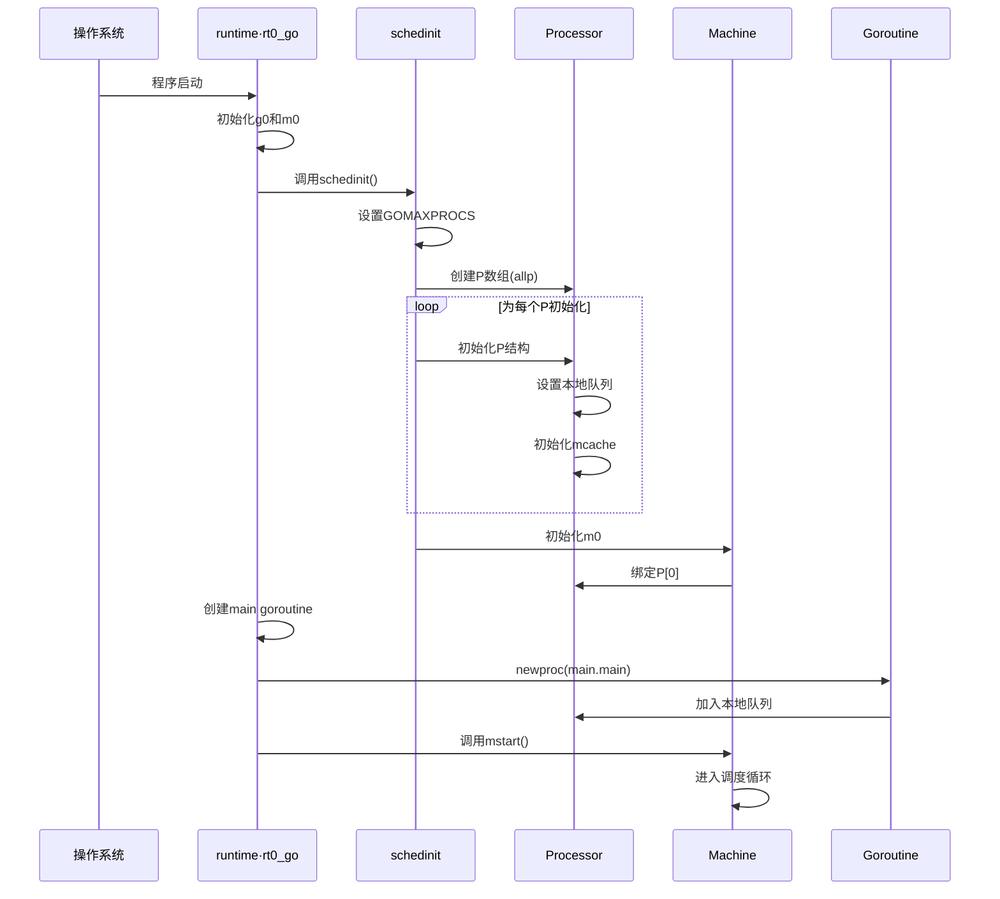
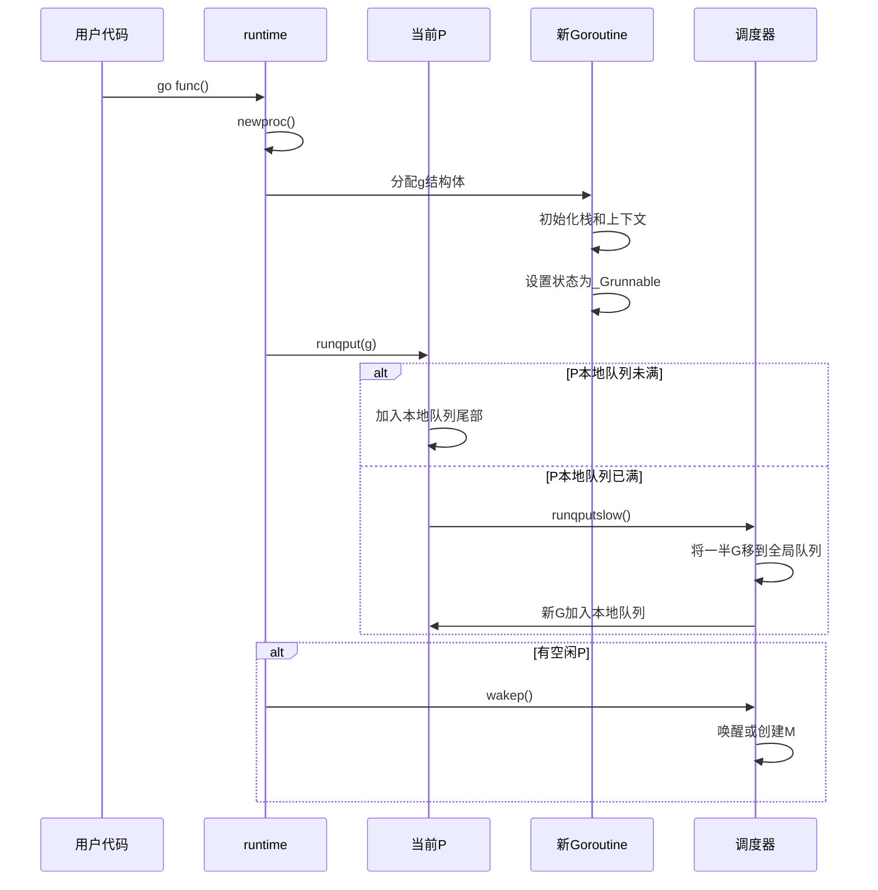
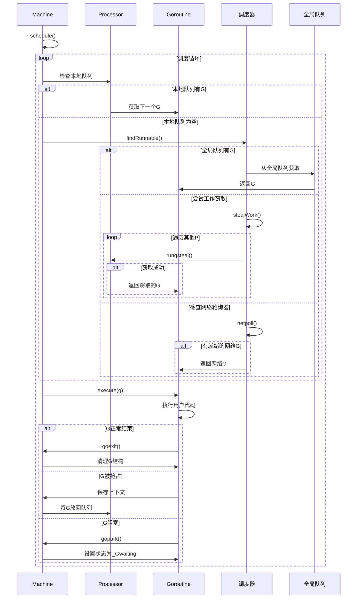
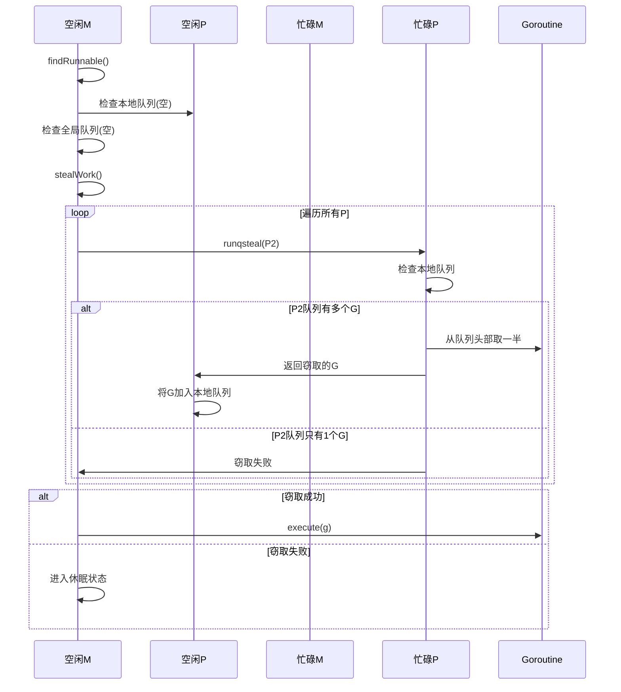
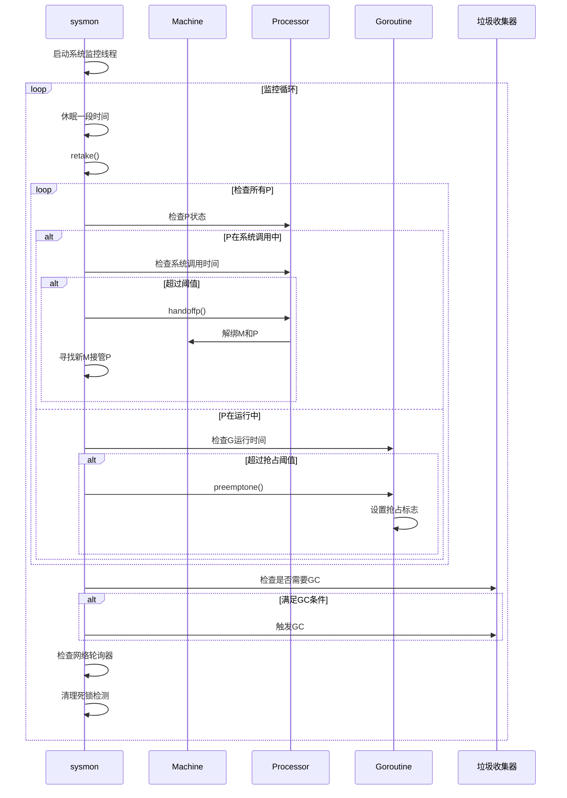
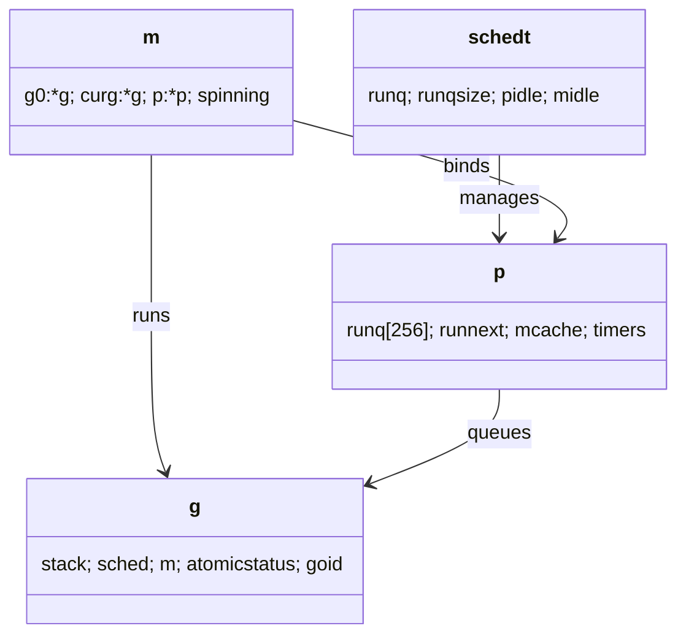

## 概述

Go调度器采用GMP模型，通过用户态调度实现并发执行。与传统的线程模型相比，Go调度器提供了不同的并发编程接口。

Go调度器将并发编程的复杂性封装在运行时系统中，开发者只需要关注业务逻辑，而无需处理底层的线程管理、负载均衡等细节。

<!--more-->

## 1. GMP模型基础

### 1.1 调度器的核心使命

调度器的本质是解决任务分配和执行问题，其目标是：

- **最大化吞吐量**：充分利用系统资源
- **支持高并发**：处理大量并发任务
- **保证公平性**：避免任务饥饿
- **降低延迟**：快速响应任务切换

### 1.2 GMP三要素详解

Go调度器采用GMP模型，由三个核心组件构成：

- **G (Goroutine)**：用户级轻量线程，包含执行栈、程序计数器等上下文信息
- **M (Machine)**：操作系统线程的抽象，负责执行G
- **P (Processor)**：逻辑处理器，维护G的本地队列，是M和G之间的桥梁

## 2. 核心数据结构深度解析

### 2.1 Goroutine结构体（G）

```go
type g struct {
    // 栈参数 - 描述实际栈内存：[stack.lo, stack.hi)
    // stackguard0 是Go栈增长序言中比较的栈指针
    // 通常是 stack.lo+StackGuard，但可以是 StackPreempt 来触发抢占
    // stackguard1 是C栈增长序言中比较的栈指针
    // 在g0和gsignal栈上是 stack.lo+StackGuard
    // 在其他goroutine栈上是 ~0，触发调用 morestackc（并崩溃）
    stack       stack   // 栈信息，offset known to runtime/cgo
    stackguard0 uintptr // 栈保护边界，offset known to liblink
    stackguard1 uintptr // 栈保护边界，offset known to liblink

    _panic       *_panic // 最内层panic - offset known to liblink
    _defer       *_defer // 最内层defer
    m            *m      // 当前m；offset known to arm liblink
    sched        gobuf   // 调度上下文
    syscallsp    uintptr // 如果status==Gsyscall，syscallsp = sched.sp 用于gc
    syscallpc    uintptr // 如果status==Gsyscall，syscallpc = sched.pc 用于gc
    stktopsp     uintptr // 栈顶期望的sp，用于traceback检查
    param        unsafe.Pointer // 唤醒时传递的参数
    atomicstatus uint32         // 原子状态
    stackLock    uint32         // sigprof/scang锁；TODO: 折叠到atomicstatus中
    goid         int64          // goroutine ID
    schedlink    guintptr       // 调度链表
    waitsince    int64          // g变为阻塞时的大致时间
    waitreason   waitReason     // 如果status==Gwaiting的等待原因

    preempt       bool // 抢占信号，复制stackguard0 = stackpreempt
    preemptStop   bool // 抢占时转换到_Gpreempted；否则，只是取消调度
    preemptShrink bool // 在同步安全点收缩栈

    // asyncSafePoint 在g停在异步安全点时设置
    // 这意味着栈上有没有精确指针信息的帧
    asyncSafePoint bool

    paniconfault bool // 在意外故障地址上panic（而不是崩溃）
    gcscandone   bool // g已扫描栈；受status中的_Gscan位保护
    throwsplit   bool // 不得分割栈
    
    // activeStackChans 表示有未锁定的channel指向此goroutine的栈
    // 如果为true，栈复制需要获取channel锁来保护栈的这些区域
    activeStackChans bool
    
    // parkingOnChan 表示goroutine即将在chansend或chanrecv上park
    // 用于标记栈收缩的不安全点。这是一个布尔值，但原子更新
    parkingOnChan uint8

    raceignore     int8     // 忽略竞态检测事件
    sysblocktraced bool     // StartTrace已为此goroutine发出EvGoInSyscall
    sysexitticks   int64    // syscall返回时的cputicks（用于跟踪）
    traceseq       uint64   // 跟踪事件序列器
    tracelastp     puintptr // 为此goroutine发出事件的最后一个P
    lockedm        muintptr // 锁定的M
    sig            uint32   // 信号
    writebuf       []byte   // 写缓冲区
    sigcode0       uintptr  // 信号代码0
    sigcode1       uintptr  // 信号代码1
    sigpc          uintptr  // 信号PC
    gopc           uintptr  // 创建此goroutine的go语句的pc
    ancestors      *[]ancestorInfo // 创建此goroutine的祖先goroutine信息（仅在debug.tracebackancestors时使用）
    startpc        uintptr         // goroutine函数的pc
    racectx        uintptr         // 竞态上下文
    waiting        *sudog          // 此g等待的sudog结构（具有有效elem ptr）；按锁顺序
    cgoCtxt        []uintptr       // cgo回溯上下文
    labels         unsafe.Pointer  // 分析器标签
    timer          *timer          // time.Sleep的缓存计时器
    selectDone     uint32          // 我们是否参与select并且有人赢得了竞争？

    // Per-G GC状态
    // gcAssistBytes 是此G的GC辅助信用，以分配的字节为单位
    // 如果为正，则G有信用分配gcAssistBytes字节而无需辅助
    // 如果为负，则G必须通过执行扫描工作来纠正这一点
    // 我们以字节为单位跟踪这一点，以便在malloc热路径中快速更新和检查债务
    // 辅助比率决定了这如何对应于扫描工作债务
    gcAssistBytes int64
}
```

**G的关键字段解析**：

- `stack`：goroutine的栈空间信息
- `sched`：保存调度上下文（PC、SP等寄存器状态）
- `atomicstatus`：goroutine的当前状态
- `goid`：全局唯一的goroutine ID
- `m`：当前执行此goroutine的M

### 2.2 Machine结构体（M）

```go
type m struct {
    g0      *g     // 每个M都有一个自己的g0，用于调度和系统调用时的栈切换
    curg    *g     // 当前正在执行的Goroutine
    // ... 其他字段
}
```

### 2.3 Processor结构体（P）

```go
type p struct {
    id          int32       // P的唯一标识
    status      uint32      // P的状态，如空闲、运行中、系统调用中等
    link        puintptr    // 用于将P链接到全局P队列中
    schedtick   uint32      // 每次调度时递增的计数器
    syscalltick uint32      // 每次系统调用时递增的计数器
    m           muintptr    // 指向当前绑定的M

    // 可执行的Goroutine队列，支持无锁访问
    runqhead    uint32
    runqtail    uint32
    runq        [256]guintptr
    runnext     guintptr    // 下一个优先执行的Goroutine
    // ...
}
```

### 2.4 全局调度器结构体

```go
type schedt struct {
    // 全局Goroutine队列，链表结构，长度无限制
    runq     gQueue
    runqsize int32      // 全局队列长度
    // ...
}
```

## 3. GMP调度时序图详解

### 3.1 调度器初始化时序图



### 3.2 Goroutine创建时序图



### 3.3 调度循环时序图



### 3.4 工作窃取时序图



### 3.5 系统监控时序图



## 4. Goroutine创建流程

### 4.1 newproc：创建新协程的入口

所有的`go func(){}`语句都会转换成`newproc`函数调用：

```go
func newproc(fn *funcval) {
    gp := getg()
    pc := sys.GetCallerPC()
    systemstack(func() {
        newg := newproc1(fn, gp, pc, false, waitReasonZero)

        pp := getg().m.p.ptr()
        runqput(pp, newg, true)

        if mainStarted {
            wakep()
        }
    })
}
```

`sys.GetCallerPC()`获取调用者PC值，即`go func(){}`下一个汇编指令的地址。由于担心使用用户栈会导致栈扩容，这里调用`systemstack`，切换到g0（g0的栈很大，16k）的栈去调用`newproc1`代码。

### 3.2 systemstack：栈切换的核心

```asm
TEXT runtime·systemstack(SB), NOSPLIT, $0-4
    MOVL    fn+0(FP), DI    // DI = fn
    get_tls(CX)
    MOVL    g(CX), AX    // AX = g
    MOVL    g_m(AX), BX    // BX = m

    CMPL    AX, m_gsignal(BX)
    JEQ    noswitch

    MOVL    m_g0(BX), DX    // DX = g0
    CMPL    AX, DX
    JEQ    noswitch

    CMPL    AX, m_curg(BX)
    JNE    bad

    // 切换栈
    // 在g->sched中保存我们的状态。如果扫描G栈，则假装为systemstack_switch
    CALL    gosave_systemstack_switch<>(SB)

    // 切换到g0
    get_tls(CX)
    MOVL    DX, g(CX)
    MOVL    (g_sched+gobuf_sp)(DX), BX
    MOVL    BX, SP

    // 调用目标函数
    MOVL    DI, DX
    MOVL    0(DI), DI
    CALL    DI

    // 切换回g
    get_tls(CX)
    MOVL    g(CX), AX
    MOVL    g_m(AX), BX
    MOVL    m_curg(BX), AX
    MOVL    AX, g(CX)
    MOVL    (g_sched+gobuf_sp)(AX), SP
    MOVL    $0, (g_sched+gobuf_sp)(AX)
    RET

noswitch:
    // 已经在系统栈上；尾调用函数
    // 在这里使用尾调用清理回溯，因为我们不会在中间systemstack处停止
    MOVL    DI, DX
    MOVL    0(DI), DI
    JMP    DI

bad:
    // 错误：g不是gsignal，不是g0，不是curg。它是什么？
    // 从链接器nosplit分析中隐藏调用
    MOVL    $runtime·badsystemstack(SB), AX
    CALL    AX
    INT    $3
```

**systemstack工作原理**：

1. 通过获取线程的TLS检查当前是否已在g0或gsignal栈上
2. 如果是普通g，调用`gosave_systemstack_switch`保存g的调度上下文
3. 切换到g0栈并执行目标函数
4. 执行完毕后切换回原来的g栈

### 3.3 funcval结构体

```go
type funcval struct {
    fn uintptr
    // 可变大小，fn特定的数据在这里
}
```

systemstack通过以下指令获取函数代码地址：

```asm
// 调用目标函数
MOVQ    DI, DX
MOVQ    0(DI), DI
CALL    DI
```

### 3.4 newproc1：核心创建逻辑

```go
func newproc1(fn *funcval, callergp *g, callerpc uintptr, parked bool, waitreason waitReason) *g {

    mp := acquirem() // 禁用抢占，因为我们在本地变量中持有M和P
    pp := mp.p.ptr()
    newg := gfget(pp)
    if newg == nil {
        newg = malg(stackMin)
        casgstatus(newg, _Gidle, _Gdead)
        allgadd(newg) // 以g->status为Gdead发布，这样GC扫描器不会查看未初始化的栈
    }

    totalSize := uintptr(4*goarch.PtrSize + sys.MinFrameSize) // 额外空间以防读取稍微超出帧
    totalSize = alignUp(totalSize, sys.StackAlign)
    sp := newg.stack.hi - totalSize

    memclrNoHeapPointers(unsafe.Pointer(&newg.sched), unsafe.Sizeof(newg.sched))
    newg.sched.sp = sp
    newg.stktopsp = sp
    newg.sched.pc = abi.FuncPCABI0(goexit) + sys.PCQuantum // +PCQuantum使前一条指令在同一函数中
    newg.sched.g = guintptr(unsafe.Pointer(newg))
    gostartcallfn(&newg.sched, fn)
    newg.parentGoid = callergp.goid
    newg.gopc = callerpc
    newg.ancestors = saveAncestors(callergp)
    newg.startpc = fn.fn
    newg.runningCleanups.Store(false)
    
    gcController.addScannableStack(pp, int64(newg.stack.hi-newg.stack.lo))

    var status uint32 = _Grunnable
    if parked {
        status = _Gwaiting
        newg.waitreason = waitreason
    }
    if pp.goidcache == pp.goidcacheend {
        pp.goidcache = sched.goidgen.Add(_GoidCacheBatch)
        pp.goidcache -= _GoidCacheBatch - 1
        pp.goidcacheend = pp.goidcache + _GoidCacheBatch
    }
    newg.goid = pp.goidcache
    casgstatus(newg, _Gdead, status)
    pp.goidcache++

    pp.goroutinesCreated++
    releasem(mp)

    return newg
}
```

**newproc1关键步骤**：

1. 从P的空闲协程列表获取g，如果没有则分配新的（stackMin=2k）
2. 计算栈帧大小并进行内存对齐
3. 初始化g的调度上下文，设置PC为goexit函数地址
4. 通过`gostartcallfn`设置真正的函数入口

### 3.5 gostartcallfn和gostartcall

```go
func gostartcallfn(gobuf *gobuf, fv *funcval) {
    var fn unsafe.Pointer
    if fv != nil {
        fn = unsafe.Pointer(fv.fn)
    } else {
        fn = unsafe.Pointer(abi.FuncPCABIInternal(nilfunc))
    }
    gostartcall(gobuf, fn, unsafe.Pointer(fv))
}

func gostartcall(buf *gobuf, fn, ctxt unsafe.Pointer) {
    sp := buf.sp
    sp -= goarch.PtrSize
    *(*uintptr)(unsafe.Pointer(sp)) = buf.pc
    buf.sp = sp
    buf.pc = uintptr(fn)
    buf.ctxt = ctxt
}
```

这里构造了一个调用栈：将goexit的地址压入栈中，然后设置PC为真正的函数地址。这样当函数执行完毕时，会自动返回到goexit进行清理工作。

### 3.6 M锁机制

```go
func acquirem() *m {
    gp := getg()
    gp.m.locks++
    return gp.m
}

func releasem(mp *m) {
    gp := getg()
    mp.locks--
    if mp.locks == 0 && gp.preempt {
        // 如果我们在newstack中清除了抢占请求，则恢复它
        gp.stackguard0 = stackPreempt
    }
}
```

## 4. Goroutine调度入队

### 4.1 runqput：双层队列设计

```go
func runqput(pp *p, gp *g, next bool) {
    if randomizeScheduler && next && randn(2) == 0 {
        next = false
    }

    if next {
    retryNext:
        oldnext := pp.runnext
        if !pp.runnext.cas(oldnext, guintptr(unsafe.Pointer(gp))) {
            goto retryNext
        }
        if oldnext == 0 {
            return
        }
        // 将旧的runnext踢到常规运行队列
        gp = oldnext.ptr()
    }

retry:
    h := atomic.LoadAcq(&pp.runqhead) // load-acquire，与消费者同步
    t := pp.runqtail
    if t-h < uint32(len(pp.runq)) {
        pp.runq[t%uint32(len(pp.runq))].set(gp)
        atomic.StoreRel(&pp.runqtail, t+1) // store-release，使项目可供消费
        return
    }
    if runqputslow(pp, gp, h, t) {
        return
    }
    // 队列未满，现在上面的put必须成功
    goto retry
}
```

**runqput设计亮点**：

- **双层队列**：runnext（单个G）+ runq（256个G的环形队列）
- **局部性优化**：runnext优先级更高，保证新创建的G能快速执行
- **随机化**：50%概率将next设为false，避免某些G永远得不到执行
- **无锁设计**：使用原子操作保证并发安全

### 4.2 wakep：唤醒空闲处理器

```go
func wakep() {
    // 对自旋线程保守，只有在不存在时才启动一个
    if sched.nmspinning.Load() != 0 || !sched.nmspinning.CompareAndSwap(0, 1) {
        return
    }

    // 禁用抢占直到pp的所有权转移到startm中的下一个M
    // 否则这里的抢占会让pp卡在等待进入_Pgcstop
    mp := acquirem()

    var pp *p
    lock(&sched.lock)
    pp, _ = pidlegetSpinning(0)
    if pp == nil {
        if sched.nmspinning.Add(-1) < 0 {
            throw("wakep: negative nmspinning")
        }
        unlock(&sched.lock)
        releasem(mp)
        return
    }
    unlock(&sched.lock)

    startm(pp, true, false)
    releasem(mp)
}
```

## 5. M和P的绑定机制

### 5.1 startm：启动M

```go
func startm(pp *p, spinning, lockheld bool) {
    mp := acquirem()
    if !lockheld {
        lock(&sched.lock)
    }

    nmp := mget()
    if nmp == nil {
        // 没有可用的M，我们必须释放sched.lock并调用newm
        // 但是，我们已经拥有一个要分配给M的P
        id := mReserveID()
        unlock(&sched.lock)

        var fn func()
        if spinning {
            // 调用者递增了nmspinning，所以在新M中设置m.spinning
            fn = mspinning
        }
        newm(fn, pp, id)

        if lockheld {
            lock(&sched.lock)
        }
        releasem(mp)
        return
    }
    
    if !lockheld {
        unlock(&sched.lock)
    }
    if nmp.spinning {
        throw("startm: m is spinning")
    }
    if nmp.nextp != 0 {
        throw("startm: m has p")
    }
    if spinning && !runqempty(pp) {
        throw("startm: p has runnable gs")
    }
    // 调用者递增了nmspinning，所以在新M中设置m.spinning
    nmp.spinning = spinning
    nmp.nextp.set(pp)
    notewakeup(&nmp.park)
    releasem(mp)
}
```

### 5.2 newm：创建新的M

```go
func newm(fn func(), pp *p, id int64) {
    acquirem()

    mp := allocm(pp, fn, id)
    mp.nextp.set(pp)
    mp.sigmask = initSigmask

    newm1(mp)
    releasem(getg().m)
}
```

`newm1`调用`newosproc`，通过clone系统调用创建一个线程，线程的栈空间就是m.g0的栈空间。

### 5.3 newosproc：操作系统线程创建

```go
func newosproc(mp *m) {
    stk := unsafe.Pointer(mp.g0.stack.hi)

    var oset sigset
    sigprocmask(_SIG_SETMASK, &sigset_all, &oset)
    ret := retryOnEAGAIN(func() int32 {
        r := clone(cloneFlags, stk, unsafe.Pointer(mp), unsafe.Pointer(mp.g0), unsafe.Pointer(abi.FuncPCABI0(mstart)))

        if r >= 0 {
            return 0
        }
        return -r
    })
    sigprocmask(_SIG_SETMASK, &oset, nil)
}
```

## 6. 调度循环核心

### 6.1 mstart：M的启动入口

```go
func mstart0() {
    gp := getg()
    
    gp.stackguard0 = gp.stack.lo + stackGuard
    gp.stackguard1 = gp.stackguard0

    mstart1()
}

func mstart1() {
    gp := getg()

    gp.sched.g = guintptr(unsafe.Pointer(gp))
    gp.sched.pc = sys.GetCallerPC()
    gp.sched.sp = sys.GetCallerSP()

    asminit()
    minit()

    if fn := gp.m.mstartfn; fn != nil {
        fn()
    }

    if gp.m != &m0 {
        acquirep(gp.m.nextp.ptr())
        gp.m.nextp = 0
    }
    schedule()
}
```

### 6.2 schedule：调度主循环

```go
func schedule() {
    mp := getg().m

top:
    pp := mp.p.ptr()
    pp.preempt = false

    gp, inheritTime, tryWakeP := findRunnable() // 阻塞直到工作可用

    mp.clearAllpSnapshot()

    if mp.spinning {
        resetspinning()
    }

    if tryWakeP {
        wakep()
    }

    if gp.lockedm != 0 {
        // 将自己的p交给锁定的m，然后阻塞等待新的p
        startlockedm(gp)
        goto top
    }

    execute(gp, inheritTime)
}
```

### 6.3 findRunnable：查找可运行的G

`findRunnable`是调度器的核心，它按照以下优先级查找可执行的G：

```go
func findRunnable() (gp *g, inheritTime, tryWakeP bool) {
    mp := getg().m

top:
    mp.clearAllpSnapshot()
    pp := mp.p.ptr()

    now, pollUntil, _ := pp.timers.check(0, nil)

    // 1. 如果gcBlackenEnabled=1，表明在gc过程中，获取一个gc worker去执行
    if gcBlackenEnabled != 0 {
        gp, tnow := gcController.findRunnableGCWorker(pp, now)
        if gp != nil {
            return gp, false, true
        }
        now = tnow
    }

    // 2. 每隔61次，执行一次全局待运行的g
    if pp.schedtick%61 == 0 && !sched.runq.empty() {
        lock(&sched.lock)
        gp := globrunqget()
        unlock(&sched.lock)
        if gp != nil {
            return gp, false, false
        }
    }

    // 3. 从p.runnext或者p.runq里面获取一个可执行g
    if gp, inheritTime := runqget(pp); gp != nil {
        return gp, inheritTime, false
    }

    // 4. 从全局sched.runq里面获取一批g，放入到p的队列
    if !sched.runq.empty() {
        lock(&sched.lock)
        gp, q := globrunqgetbatch(int32(len(pp.runq)) / 2)
        unlock(&sched.lock)
        if gp != nil {
            if runqputbatch(pp, &q); !q.empty() {
                throw("Couldn't put Gs into empty local runq")
            }
            return gp, false, false
        }
    }

    // 5. 非阻塞的方式获取网络read的相关g
    if netpollinited() && netpollAnyWaiters() && sched.lastpoll.Load() != 0 && sched.pollingNet.Swap(1) == 0 {
        list, delta := netpoll(0)
        sched.pollingNet.Store(0)
        if !list.empty() {
            gp := list.pop()
            injectglist(&list)
            netpollAdjustWaiters(delta)
            trace := traceAcquire()
            casgstatus(gp, _Gwaiting, _Grunnable)
            if trace.ok() {
                trace.GoUnpark(gp, 0)
                traceRelease(trace)
            }
            return gp, false, false
        }
    }

    // 6. 通过stealwork去其他p获取一批g列表
    if mp.spinning || 2*sched.nmspinning.Load() < gomaxprocs-sched.npidle.Load() {
        if !mp.spinning {
            mp.becomeSpinning()
        }

        gp, inheritTime, tnow, w, newWork := stealWork(now)
        if gp != nil {
            return gp, inheritTime, false
        }
        if newWork {
            goto top
        }

        now = tnow
        if w != 0 && (pollUntil == 0 || w < pollUntil) {
            pollUntil = w
        }
    }

    // 7. 再检查下gc任务
    if gcBlackenEnabled != 0 && gcMarkWorkAvailable(pp) && gcController.addIdleMarkWorker() {
        node := (*gcBgMarkWorkerNode)(gcBgMarkWorkerPool.pop())
        if node != nil {
            pp.gcMarkWorkerMode = gcMarkWorkerIdleMode
            gp := node.gp.ptr()
            casgstatus(gp, _Gwaiting, _Grunnable)
            return gp, false, false
        }
        gcController.removeIdleMarkWorker()
    }

    // 8. 再去全局sched.runq里面获取可执行的g
    lock(&sched.lock)
    if !sched.runq.empty() {
        gp, q := globrunqgetbatch(int32(len(pp.runq)) / 2)
        unlock(&sched.lock)
        if gp == nil {
            throw("global runq empty with non-zero runqsize")
        }
        if runqputbatch(pp, &q); !q.empty() {
            throw("Couldn't put Gs into empty local runq")
        }
        return gp, false, false
    }

    // 9. 将p放入idle列表，然后调用netpoll等待网络相关的g ready
    now = pidleput(pp, now)
    unlock(&sched.lock)

    if netpollinited() && (netpollAnyWaiters() || pollUntil != 0) && sched.lastpoll.Swap(0) != 0 {
        list, delta := netpoll(delay) // 阻塞直到新工作可用
        now = nanotime()
        sched.pollUntil.Store(0)
        sched.lastpoll.Store(now)

        lock(&sched.lock)
        pp, _ := pidleget(now)
        unlock(&sched.lock)
        if pp == nil {
            injectglist(&list)
            netpollAdjustWaiters(delta)
        } else {
            acquirep(pp)
            if !list.empty() {
                gp := list.pop()
                injectglist(&list)
                netpollAdjustWaiters(delta)
                casgstatus(gp, _Gwaiting, _Grunnable)
                return gp, false, false
            }
            goto top
        }
    }
    stopm()
    goto top
}
```

**findRunnable查找优先级顺序**：

1. **Trace Reader**：追踪读取器（如果启用）
2. **GC Worker**：垃圾收集工作者
3. **全局队列公平性检查**：每 61 次调度检查一次全局队列
4. **Finalizer**：终结器 Goroutine
5. **本地运行队列**：当前 P 的本地队列
6. **全局运行队列**：全局 Goroutine 队列
7. **网络轮询**：网络 I/O 就绪的 Goroutine
8. **工作窃取**：从其他 P 窃取工作
9. **空闲时 GC 标记**：在空闲时进行 GC 标记工作

## 7. 工作窃取与负载均衡机制

### 7.1 本地队列获取策略

```go
// runqget 从本地队列获取goroutine (runnext > 本地队列)
func runqget(pp *p) (gp *g, inheritTime bool) {
    // 优先从 runnext 获取
    for {
        old := pp.runnext
        if old == 0 { break }
        if pp.runnext.cas(old, 0) {
            return old.ptr(), true
        }
    }
    
    // 从本地环形队列获取
    for {
        h := atomic.LoadAcq(&pp.runqhead)
        t := pp.runqtail
        if t == h { return nil, false }
        
        gp := pp.runq[h%uint32(len(pp.runq))].ptr()
        if atomic.CasRel(&pp.runqhead, h, h+1) {
            return gp, false
        }
    }
}
```

### 7.2 工作窃取核心算法

```go
// stealWork 实现负载均衡的工作窃取机制
func stealWork(now int64) (gp *g, inheritTime bool, rnow, pollUntil int64, newWork bool) {
    pp := getg().m.p.ptr()
    randn := fastrandn(uint32(gomaxprocs))
    
    const stealTries = 4
    for i := 0; i < stealTries; i++ {
        stealTimersOrRunNextG := i == stealTries-1
        
        // 随机遍历所有P
        for j := 0; j < gomaxprocs; j++ {
            p2 := allp[(randn+uint32(j))%uint32(gomaxprocs)]
            if pp == p2 {
                continue
            }
            
            // 窃取goroutine
            if gp := runqsteal(pp, p2, stealTimersOrRunNextG); gp != nil {
                return gp, false, now, pollUntil, false
            }
            
            // 窃取定时器任务
            if stealTimersOrRunNextG {
                tnow, w, ran := pp.timers.steal(p2, now)
                now = tnow
                if w != 0 && (pollUntil == 0 || w < pollUntil) {
                    pollUntil = w
                }
                if ran {
                    if gp, inheritTime := runqget(pp); gp != nil {
                        return gp, inheritTime, now, pollUntil, false
                    }
                }
            }
        }
    }
    
    return nil, false, now, pollUntil, false
}

// runqsteal 从目标P窃取一半的goroutine
func runqsteal(pp, p2 *p, stealRunNext bool) *g {
    t := pp.runqtail
    n := runqgrab(p2, &pp.runq, t, stealRunNext)
    if n == 0 {
        return nil
    }
    
    n--
    gp := pp.runq[(t+n)%uint32(len(pp.runq))].ptr()
    if n == 0 {
        return gp
    }
    
    h := atomic.LoadAcq(&pp.runqhead)
    if t-h+n >= uint32(len(pp.runq)) {
        return gp
    }
    
    atomic.StoreRel(&pp.runqtail, t+n)
    return gp
}
```

**工作窃取设计要点**：

- **随机化访问**：避免所有P都从同一个P开始窃取
- **半量窃取**：每次窃取一半工作，保持负载均衡
- **定时器窃取**：不仅窃取goroutine，还窃取定时器任务
- **多轮尝试**：最多4轮窃取，提高成功率

## 8. Goroutine执行

### 8.1 execute：执行准备

```go
func execute(gp *g, inheritTime bool) {
    mp := getg().m

    // 设置当前执行的G
    mp.curg = gp
    gp.m = mp
    gp.syncSafePoint = false // 清除标志，可能由morestack设置
    casgstatus(gp, _Grunnable, _Grunning)
    gp.waitsince = 0
    gp.preempt = false
    gp.stackguard0 = gp.stack.lo + stackGuard
    if !inheritTime {
        mp.p.ptr().schedtick++
    }

    gogo(&gp.sched)
}
```

### 8.2 gogo：上下文切换

```asm
TEXT runtime·gogo(SB), NOSPLIT, $0-8
    MOVQ    buf+0(FP), BX        // gobuf
    MOVQ    gobuf_g(BX), DX
    MOVQ    0(DX), CX        // 确保g != nil
    JMP    gogo<>(SB)

TEXT gogo<>(SB), NOSPLIT, $0
    get_tls(CX)
    MOVQ    DX, g(CX)
    MOVQ    DX, R14        // 设置g寄存器
    MOVQ    gobuf_sp(BX), SP    // 恢复SP
    MOVQ    gobuf_ctxt(BX), DX
    MOVQ    gobuf_bp(BX), BP
    MOVQ    $0, gobuf_sp(BX)    // 清除以帮助垃圾回收器
    MOVQ    $0, gobuf_ctxt(BX)
    MOVQ    $0, gobuf_bp(BX)
    MOVQ    gobuf_pc(BX), BX
    JMP    BX
```

**gogo功能**：

- 恢复goroutine的执行上下文（SP、BP、PC等）
- 清空gobuf中的指针以帮助GC
- 跳转到goroutine的入口点开始执行

## 9. Goroutine退出和清理

### 9.1 goexit0：退出处理

```go
func goexit0(gp *g) {
    gdestroy(gp)
    schedule()
}

func gdestroy(gp *g) {
    mp := getg().m
    pp := mp.p.ptr()

    casgstatus(gp, _Grunning, _Gdead)
    gcController.addScannableStack(pp, -int64(gp.stack.hi-gp.stack.lo))

    gp.m = nil
    locked := gp.lockedm != 0
    gp.lockedm = 0
    mp.lockedg = 0
    gp.preemptStop = false
    gp.paniconfault = false
    gp._defer = nil // 应该已经为true，但以防万一
    gp._panic = nil // Goexit期间panic的非nil。指向栈分配的数据
    gp.writebuf = nil
    gp.waitreason = waitReasonZero
    gp.param = nil
    gp.labels = nil
    gp.timer = nil

    if gcBlackenEnabled != 0 && gp.gcAssistBytes > 0 {
        assistWorkPerByte := gcController.assistWorkPerByte.Load()
        scanCredit := int64(assistWorkPerByte * float64(gp.gcAssistBytes))
        gcController.bgScanCredit.Add(scanCredit)
        gp.gcAssistBytes = 0
    }

    dropg()
    gfput(pp, gp)
}
```

### 9.2 gfput：G的回收

```go
func gfput(pp *p, gp *g) {
    if readgstatus(gp) != _Gdead {
        throw("gfput: bad status (not Gdead)")
    }

    stksize := gp.stack.hi - gp.stack.lo

    if stksize != uintptr(startingStackSize) {
        // 非标准栈大小 - 释放它
        stackfree(gp.stack)
        gp.stack.lo = 0
        gp.stack.hi = 0
        gp.stackguard0 = 0
    }

    pp.gFree.push(gp)
    if pp.gFree.size >= 64 {
        var (
            stackQ   gQueue
            noStackQ gQueue
        )
        for pp.gFree.size >= 32 {
            gp := pp.gFree.pop()
            if gp.stack.lo == 0 {
                noStackQ.push(gp)
            } else {
                stackQ.push(gp)
            }
        }
        lock(&sched.gFree.lock)
        sched.gFree.noStack.pushAll(noStackQ)
        sched.gFree.stack.pushAll(stackQ)
        unlock(&sched.gFree.lock)
    }
}
```

## 10. M的休眠和唤醒

### 10.1 M的获取和休眠

```go
func mget() *m {
    assertLockHeld(&sched.lock)

    mp := sched.midle.ptr()
    if mp != nil {
        sched.midle = mp.schedlink
        sched.nmidle--
    }
    return mp
}

func stopm() {
    gp := getg()

    if gp.m.locks != 0 {
        throw("stomp holding locks")
    }
    if gp.m.p != 0 {
        throw("stopm holding p")
    }
    if gp.m.spinning {
        throw("stopm spinning")
    }

    lock(&sched.lock)
    mput(gp.m)
    unlock(&sched.lock)
    mPark()
    acquirep(gp.m.nextp.ptr())
    gp.m.nextp = 0
}

func mPark() {
    gp := getg()
    notesleep(&gp.m.park)
    noteclear(&gp.m.park)
}
```

### 10.2 futex机制

```go
func notewakeup(n *note) {
    old := atomic.Xchg(key32(&n.key), 1)
    if old != 0 {
        print("notewakeup - double wakeup (", old, ")\n")
        throw("notewakeup - double wakeup")
    }
    futexwakeup(key32(&n.key), 1)
}

func futexwakeup(addr *uint32, cnt uint32) {
    ret := futex(unsafe.Pointer(addr), _FUTEX_WAKE_PRIVATE, cnt, nil, nil, 0)
    if ret >= 0 {
        return
    }

    systemstack(func() {
        print("futexwakeup addr=", addr, " returned ", ret, "\n")
    })

    *(*int32)(unsafe.Pointer(uintptr(0x1006))) = 0x1006
}
```

**futex优势**：

- **用户态快路径**：无争用时完全在用户态完成加/解锁，不进内核
- **按需入内核**：只有发生争用或需要睡眠/唤醒时才走慢路径进入内核

## 11. 网络轮询器集成

### 11.1 netpoll和injectglist

网络轮询器是Go调度器的重要组成部分，负责处理网络I/O事件：

```go
// netpoll 检查网络事件并返回就绪的goroutine列表
func netpoll(delay int64) (gList, int32) {
    if epfd == -1 {
        return gList{}, 0
    }
    
    var events [128]epollevent
    n := epollwait(epfd, &events[0], int32(len(events)), waitms)
    
    var toRun gList
    delta := int32(0)
    
    for i := int32(0); i < n; i++ {
        ev := &events[i]
        if ev.events == 0 {
            continue
        }
        
        var mode int32
        if ev.events&(_EPOLLIN|_EPOLLRDHUP|_EPOLLHUP|_EPOLLERR) != 0 {
            mode += 'r'
        }
        if ev.events&(_EPOLLOUT|_EPOLLHUP|_EPOLLERR) != 0 {
            mode += 'w'
        }
        
        if mode != 0 {
            pd := (*pollDesc)(unsafe.Pointer(ev.data))
            pd.everr = false
            if ev.events&_EPOLLERR != 0 {
                pd.everr = true
            }
            netpollready(&toRun, pd, mode)
        }
    }
    
    return toRun, delta
}

// injectglist 将goroutine列表注入到调度器中
func injectglist(glist *gList) {
    if glist.empty() {
        return
    }
    
    lock(&sched.lock)
    var n int
    for n = 0; !glist.empty() && sched.runqsize < len(sched.runq); n++ {
        gp := glist.pop()
        casgstatus(gp, _Gwaiting, _Grunnable)
        globrunqput(gp)
    }
    unlock(&sched.lock)
    
    for !glist.empty() {
        gp := glist.pop()
        casgstatus(gp, _Gwaiting, _Grunnable)
        runqput(getg().m.p.ptr(), gp, false)
        n++
    }
}
```

## 12. 系统调用处理

### 12.1 entersyscall和exitsyscall

```go
// entersyscall 在系统调用前调用，暂时释放P
func entersyscall() {
    reentersyscall(sys.GetCallerPC(), sys.GetCallerSP())
}

func reentersyscall(pc, sp uintptr) {
    gp := getg()
    
    // 保存调用者的PC/SP，以便traceback可以找到系统调用帧
    gp.syscallsp = sp
    gp.syscallpc = pc
    casgstatus(gp, _Grunning, _Gsyscall)
    
    // 快速路径：如果没有其他工作，保持P
    if sched.npidle.Load()+sched.nmspinning.Load() == 0 {
        return
    }
    
    // 慢路径：释放P给其他M使用
    save(pc, sp)
    handoffp(releasep())
}

// exitsyscall 在系统调用后调用，尝试重新获取P
func exitsyscall() {
    gp := getg()
    
    oldp := gp.m.oldp.ptr()
    gp.m.oldp = 0
    if exitsyscallfast(oldp) {
        // 快速路径：成功重新获取P
        casgstatus(gp, _Gsyscall, _Grunning)
        return
    }
    
    // 慢路径：无法获取P，需要重新调度
    mcall(exitsyscall0)
}
```

## 13. 抢占调度机制

Go 1.14引入了基于信号的异步抢占机制，解决了长时间运行的goroutine无法被抢占的问题。

### 13.1 抢占触发条件

抢占机制主要在以下情况下触发：

1. **时间片耗尽**：goroutine运行时间超过10ms
2. **系统调用过长**：系统调用时间超过20μs且有其他工作等待
3. **GC需要**：垃圾收集器需要停止所有goroutine
4. **手动抢占**：调用`runtime.Gosched()`主动让出CPU

### 13.2 协作式抢占实现

```go
// preemptone 对指定P上运行的goroutine发起抢占
func preemptone(pp *p) bool {
    mp := pp.m.ptr()
    if mp == nil || mp == getg().m {
        return false
    }
    
    gp := mp.curg
    if gp == nil || gp == mp.g0 {
        return false
    }
    
    gp.preempt = true
    
    // 协作式抢占：设置栈保护区域为特殊值
    // 下次函数调用时会检查栈空间，触发抢占检查
    gp.stackguard0 = stackPreempt
    
    // 如果支持异步抢占，同时发起异步抢占
    if preemptMSupported && debug.asyncpreemptoff == 0 {
        pp.preempt = true
        preemptM(mp)
    }
    
    return true
}

// checkPreempt 在函数序言中检查是否需要抢占
func checkPreempt() {
    gp := getg()
    if gp.preempt && gp.stackguard0 == stackPreempt {
        gopreempt_m(gp) // 执行抢占
    }
}
```

### 13.3 异步抢占实现

```go
// preemptM 向目标M发送抢占信号
func preemptM(mp *m) {
    if atomic.Cas(&mp.signalPending, 0, 1) {
        // 发送SIGURG信号进行异步抢占
        signalM(mp, sigPreempt)
    }
}

// doSigPreempt 处理抢占信号
func doSigPreempt(gp *g, ctxt *sigctxt) {
    // 检查是否在安全点
    if wantAsyncPreempt(gp) {
        if ok, newpc := isAsyncSafePoint(gp, ctxt.sigpc(), ctxt.sigsp(), ctxt.siglr()); ok {
            // 在安全点，可以进行抢占
            ctxt.pushCall(abi.FuncPCABI0(asyncPreempt), newpc)
        }
    }
    
    // 确认抢占请求
    gp.m.preemptGen.Add(1)
    gp.m.signalPending.Store(0)
}

// asyncPreempt 异步抢占处理函数
func asyncPreempt() {
    gp := getg()
    gp.asyncSafePoint = true
    
    if gp.preemptStop {
        // 需要停止执行（如GC）
        mcall(preemptPark)
    } else {
        // 只是让出CPU
        mcall(gopreempt_m)
    }
    
    gp.asyncSafePoint = false
}
```

### 13.4 系统监控中的抢占检查

```go
// retake 检查并抢占长时间运行的P
func retake(now int64) uint32 {
    n := 0
    
    for i := 0; i < len(allp); i++ {
        pp := allp[i]
        if pp == nil {
            continue
        }
        
        pd := &pp.sysmontick
        s := pp.status
        sysretake := false
        
        // 处理运行中的P
        if s == _Prunning {
            t := int64(pp.schedtick)
            if int64(pd.schedtick) != t {
                pd.schedtick = uint32(t)
                pd.schedwhen = now
            } else if pd.schedwhen+forcePreemptNS <= now {
                // goroutine运行时间过长，发起抢占
                preemptone(pp)
                sysretake = true
            }
        }
        
        // 处理系统调用中的P
        if s == _Psyscall {
            t := int64(pp.syscalltick)
            if !sysretake && int64(pd.syscalltick) != t {
                pd.syscalltick = uint32(t)
                pd.syscallwhen = now
                continue
            }
            
            // 系统调用时间过长，回收P
            if runqempty(pp) && sched.nmspinning.Load()+sched.npidle.Load() > 0 && pd.syscallwhen+10*1000*1000 > now {
                continue
            }
            
            if atomic.Cas(&pp.status, s, _Pidle) {
                n++
                pp.syscalltick++
                handoffp(pp) // 将P交给其他M
            }
        }
        
        if sysretake {
            n++
        }
    }
    
    return uint32(n)
}
```

**抢占机制设计要点**：

1. **双重保险**：协作式 + 异步抢占，确保抢占成功
2. **安全点检查**：异步抢占只在安全点进行，保证程序正确性
3. **时间阈值**：合理的抢占时间阈值，平衡响应性和开销
4. **状态区分**：不同场景采用不同的抢占策略

## 14. 定时器管理

### 14.1 P的定时器检查

每个P都维护自己的定时器堆：

```go
// timers 是P的定时器管理结构
type timers struct {
    lock         mutex
    gp           *g
    created      bool
    sleeping     bool
    rescheduling bool
    sleepUntil   int64
    waitnote     note
    t            []*timer
    len          int32
    cap          int32
}

// check 检查并运行到期的定时器
func (ts *timers) check(now int64, pollUntil *int64) (rnow int64, pollUntil_ int64, ran bool) {
    if ts.len == 0 {
        return now, 0, false
    }
    
    lock(&ts.lock)
    if ts.len == 0 {
        unlock(&ts.lock)
        return now, 0, false
    }
    
    if now == 0 {
        now = nanotime()
    }
    rnow = now
    
    for ts.len > 0 {
        t := ts.t[0]
        if t.when > now {
            // 第一个定时器还没到期
            if pollUntil != nil && (pollUntil_ == 0 || t.when < pollUntil_) {
                pollUntil_ = t.when
            }
            break
        }
        
        // 运行定时器
        runOneTimer(ts, t, now)
        ran = true
    }
    
    unlock(&ts.lock)
    return rnow, pollUntil_, ran
}
```

## 15. 系统监控器(sysmon)

系统监控器是Go运行时的重要组件，运行在独立的OS线程上，不需要P，负责全局的监控和维护工作。

### 15.1 sysmon的核心职责

1. **抢占长时间运行的goroutine**
2. **回收系统调用中阻塞的P**  
3. **触发网络轮询器**
4. **强制垃圾收集**
5. **内存清理和回收**

### 15.2 sysmon完整实现

```go
// sysmon 系统监控器主循环
func sysmon() {
    lock(&sched.lock)
    sched.nmsys++
    checkdead() // 检查是否有死锁
    unlock(&sched.lock)

    lasttrace := int64(0)
    idle := 0 // 空闲周期计数
    delay := uint32(0)

    for {
        // ==================== 动态调整监控频率 ====================
        if idle == 0 { 
            delay = 20 // 从20μs开始
        } else if idle > 50 { 
            delay *= 2 // 空闲时加倍延迟
        }
        if delay > 10*1000 { 
            delay = 10 * 1000 // 最大10ms
        }
        usleep(delay)

        now := nanotime()
        
        // ==================== 网络轮询检查 ====================
        if netpollinited() && lastpoll != 0 && lastpoll+10*1000*1000 < now {
            atomic.Cas64(&sched.lastpoll, lastpoll, now)
            list, delta := netpoll(0) // 非阻塞检查
            if !list.empty() {
                incidlelocked(-1)
                injectglist(&list) // 将就绪的goroutine注入调度器
                incidlelocked(1)
                netpollAdjustWaiters(delta)
            }
        }

        // ==================== 抢占检查 ====================
        if retake(now) != 0 {
            idle = 0 // 有抢占发生，重置空闲计数
        } else {
            idle++
        }

        // ==================== 强制GC检查 ====================
        if t := (gcTrigger{kind: gcTriggerTime, now: now}); t.test() && forcegc.idle.Load() {
            lock(&forcegc.lock)
            forcegc.idle.Store(false)
            var list gList
            list.push(forcegc.g)
            injectglist(&list)
            unlock(&forcegc.lock)
        }

        // ==================== 内存清理 ====================
        if lastscavenge+scavengelimit/2 < now {
            mheap_.pages.scavenge(false) // 回收闲置内存
            lastscavenge = now
        }

        // ==================== 调度跟踪 ====================
        if debug.schedtrace > 0 && lasttrace+int64(debug.schedtrace)*1000000 <= now {
            lasttrace = now
            schedtrace(debug.scheddetail > 0)
        }
    }
}
```

### 15.3 sysmon的设计特点

**独立性**：

- 运行在独立的OS线程上，不需要P
- 不受Go调度器管理，避免被阻塞

**自适应频率**：

- 有活动时高频监控（20μs）
- 空闲时降低频率（最高10ms）
- 平衡监控及时性和CPU开销

**全局视角**：

- 监控所有P的状态
- 处理跨P的协调工作
- 维护全局资源

## 16. 锁定Goroutine处理

### 16.1 startlockedm

某些goroutine需要锁定到特定的OS线程上执行：

```go
// startlockedm 启动锁定的M来运行锁定的G
func startlockedm(gp *g) {
    mp := gp.lockedm.ptr()
    if mp == getg().m {
        throw("startlockedm: locked to me")
    }
    if mp.nextp != 0 {
        throw("startlockedm: m has p")
    }
    
    // 直接将P交给锁定的M
    incidlelocked(-1) // 这个M不再空闲
    pp := releasep()
    mp.nextp.set(pp)
    notewakeup(&mp.park)
    stopm()
}

// LockOSThread 将调用的goroutine锁定到当前OS线程
func LockOSThread() {
    if atomic.Load(&newmHandoff.haveTemplateThread) == 0 && GOOS != "plan9" {
        startTemplateThread()
    }
    gp := getg()
    gp.m.lockedExt++
    if gp.m.lockedExt == 1 {
        gp.m.lockedg.set(gp)
        gp.lockedm.set(gp.m)
    }
}
```

## 17. 空闲P与自旋治理

### 17.1 idle P管理

```go
// pidleput 将P放入空闲列表
func pidleput(pp *p, now int64) int64 {
    assertLockHeld(&sched.lock)
    
    if !runqempty(pp) {
        throw("pidleput: P has non-empty run queue")
    }
    if now == 0 {
        now = nanotime()
    }
    
    pp.link = sched.pidle
    sched.pidle.set(pp)
    sched.npidle.Add(1)
    if !pp.limiterEvent.start(limiterEventIdle, now) {
        throw("must be able to track idle limiter event")
    }
    return now
}

// pidleget 从空闲列表获取P
func pidleget(now int64) (*p, int64) {
    assertLockHeld(&sched.lock)
    
    pp := sched.pidle.ptr()
    if pp != nil {
        if now == 0 {
            now = nanotime()
        }
        sched.pidle = pp.link
        sched.npidle.Add(-1)
        pp.limiterEvent.stop(limiterEventIdle, now)
    }
    return pp, now
}
```

### 17.2 自旋M管理

```go
// resetspinning 重置自旋状态
func resetspinning() {
    gp := getg()
    if !gp.m.spinning {
        throw("resetspinning: not a spinning m")
    }
    gp.m.spinning = false
    nmspinning := sched.nmspinning.Add(-1)
    if nmspinning < 0 {
        throw("findrunnable: negative nmspinning")
    }
    wakep()
}

// 自旋治理策略
// 1. 自旋M的数量不超过GOMAXPROCS的一半
// 2. 至少保持一个自旋M（如果有空闲P的话）
// 3. 当有新工作时，优先唤醒自旋M
```

## 18. 性能优化与最佳实践

### 18.1 基于GMP模型的优化策略

#### 1. Goroutine池化技术

```go
// 使用对象池复用goroutine，减少创建开销
var goroutinePool = sync.Pool{
    New: func() interface{} {
        return make(chan func(), 1)
    },
}

func RunTask(task func()) {
    ch := goroutinePool.Get().(chan func())
    defer goroutinePool.Put(ch)
    
    select {
    case ch <- task:
    default:
        go func() {
            task()
            for {
                select {
                case t := <-ch:
                    t()
                default:
                    return
                }
            }
        }()
    }
}
```

#### 2. 合理设置GOMAXPROCS

```go
import "runtime"

func init() {
    // 根据实际CPU核心数设置，避免过度调度
    runtime.GOMAXPROCS(runtime.NumCPU())
}
```

#### 3. 批量处理减少系统调用

```go
// 批量处理减少系统调用开销
func BatchWrite(data [][]byte) error {
    var buf bytes.Buffer
    for _, d := range data {
        buf.Write(d)
    }
    return writeOnce(buf.Bytes())
}
```

#### 4. 避免Goroutine泄漏

```go
// 使用context控制goroutine生命周期
func WorkerWithContext(ctx context.Context) {
    for {
        select {
        case <-ctx.Done():
            return // 优雅退出
        case work := <-workChan:
            processWork(work)
        }
    }
}
```

### 18.2 调度器性能监控与诊断

```go
// 监控调度器状态
func MonitorScheduler() {
    ticker := time.NewTicker(time.Second)
    defer ticker.Stop()
    
    for range ticker.C {
        var stats runtime.MemStats
        runtime.ReadMemStats(&stats)
        
        fmt.Printf("Goroutines: %d\n", runtime.NumGoroutine())
        fmt.Printf("OS Threads: %d\n", runtime.GOMAXPROCS(0))
        fmt.Printf("CGO Calls: %d\n", runtime.NumCgoCall())
    }
}
```

## 20. 关键函数调用路径分析

### 20.1 Goroutine创建调用路径

#### 主要创建路径
```
用户代码: go func() -> 编译器转换 -> newproc() -> newproc1() -> 
gfget() -> malg() -> stackalloc() -> runqput() -> wakep()
```

#### 详细调用链分析

**1. Goroutine分配路径**
```
newproc1()
├── gfget()                    // 尝试从P的gFree列表获取g
│   ├── 本地gFree非空 -> 直接返回g
│   └── 本地gFree为空 -> globrunqget() -> 从全局gFree获取
├── malg()                     // 分配新的g结构
│   ├── stackalloc()           // 分配goroutine栈
│   │   ├── stackcache获取     // 从P级栈缓存获取
│   │   ├── stackpoolalloc()   // 从全局栈池获取
│   │   └── mheap.allocManual() // 直接从堆分配
│   └── 初始化g字段
└── runqput()                  // 将g加入运行队列
    ├── 本地队列未满 -> 直接加入
    └── 本地队列已满 -> runqputslow() -> 移动到全局队列
```

**2. 调度器启动路径**
```
runtime·rt0_go() -> schedinit() -> newproc() -> mstart() -> 
mstart1() -> schedule() -> execute() -> gogo()
```

### 20.2 调度循环调用路径

#### 核心调度路径
```
schedule() -> findRunnable() -> execute() -> gogo() -> 
用户代码执行 -> goexit() -> goexit1() -> schedule()
```

#### 详细调度分析

**1. 工作查找路径**
```
findRunnable()
├── runqget()                  // 检查本地队列
│   └── 原子操作获取队列头部G
├── globrunqget()              // 检查全局队列
│   ├── 加锁访问全局队列
│   └── 批量转移到本地队列
├── netpoll()                  // 检查网络轮询器
│   ├── epoll_wait()           // Linux系统调用
│   └── 返回就绪的网络G
├── stealWork()                // 工作窃取
│   ├── 遍历其他P的队列
│   ├── runqsteal()            // 窃取操作
│   └── 返回窃取的G
└── stopm()                    // 进入休眠状态
    ├── 释放P
    ├── 加入空闲M列表
    └── notesleep() -> 休眠等待唤醒
```

**2. 抢占调用路径**
```
sysmon() -> retake() -> preemptone() -> 
设置抢占标志 -> 异步抢占 -> newstack() -> goschedImpl() -> schedule()
```

### 20.3 系统调用处理路径

#### 系统调用进入路径
```
用户代码 -> syscall -> entersyscall() -> 
entersyscallblock() -> handoffp() -> startm()
```

#### 系统调用退出路径
```
系统调用返回 -> exitsyscall() -> 
exitsyscallfast() -> acquirep() -> execute()
```

### 20.4 栈管理调用路径

#### 栈分配路径
```
stackalloc() -> stackcacheget() -> stackpoolalloc() -> 
mheap.allocManual() -> pageAlloc.alloc() -> sysAlloc()
```

#### 栈增长路径
```
morestack() -> newstack() -> copystack() -> 
stackalloc() -> gentraceback() -> stackfree()
```

## 21. 总结

Go调度器的GMP模型通过以下关键技术实现并发调度：

### 20.1 核心优势

- **轻量级协程**：Goroutine创建和销毁开销极小，支持大规模并发
- **工作窃取机制**：通过负载均衡提高系统整体利用率  
- **灵活调度策略**：多层次队列设计，保证调度公平性和效率
- **用户态调度**：避免内核态切换开销，提升性能
- **异步抢占**：基于信号的抢占机制，确保调度公平性
- **动态栈管理**：自动栈扩展和收缩，优化内存使用

理解Go调度器的实现原理，有助于编写并发程序，使用Go语言的并发特性。

---

## 附录：关键函数/调用链合并、结构体图与时序索引

### 1) 关键函数与简要说明

```go
// 创建协程
func newproc(fn *funcval) { /* 见正文 */ }
func newproc1(fn *funcval, callergp *g, callerpc uintptr, parked bool, reason waitReason) *g { /* 见正文 */ }

// 入队与取队
func runqput(pp *p, gp *g, next bool) { /* 见正文 */ }
func runqget(pp *p) (gp *g, inheritTime bool) { /* 见正文 */ }
func runqsteal(pp, p2 *p, stealRunNext bool) *g { /* 见正文 */ }

// 调度主循环
func schedule() { /* 见正文 */ }
func findRunnable() (gp *g, inheritTime, tryWakeP bool) { /* 见正文 */ }
func execute(gp *g, inheritTime bool) { /* 见正文 */ }
func gogo(buf *gobuf) { /* 见正文 */ }

// 抢占与系统监控
func preemptone(pp *p) bool { /* 见正文 */ }
func sysmon() { /* 见正文 */ }
func startm(pp *p, spinning, lockheld bool) { /* 见正文 */ }
func stopm() { /* 见正文 */ }
```

- 目标：在本地/全局队列、工作窃取、netpoll与GC worker间进行公平高效的任务分配；在长运行与系统调用场景下保障可抢占性。

### 2) 调用链

- 创建路径：`go func -> newproc -> newproc1 -> runqput -> wakep?`
- 调度循环：`schedule -> findRunnable -> (runq/local | global | netpoll | steal) -> execute -> gogo -> 用户代码 -> goexit -> schedule`
- 工作窃取：`findRunnable -> stealWork -> runqsteal -> execute`
- 系统调用：`entersyscall -> handoffp/releasep -> ... -> exitsyscall -> acquirep -> execute`

### 3) 结构体类图


