# grpc-go-01-客户端连接

## 模块概览

## 模块职责与边界

### 核心职责
客户端连接模块（ClientConn）是 gRPC-Go 客户端的核心组件，负责管理与 gRPC 服务端的连接生命周期和 RPC 调用的执行。该模块封装了连接建立、服务发现、负载均衡、连接池管理等复杂逻辑，为上层应用提供简洁统一的 RPC 调用接口。

### 输入输出
- **输入：**
  - 目标服务地址（target）
  - 连接配置选项（DialOption）
  - RPC 方法调用请求（method、args）
  - 调用选项（CallOption）

- **输出：**
  - 建立的客户端连接（ClientConn）
  - RPC 调用响应结果
  - 连接状态变化通知
  - 错误状态信息

### 上下游依赖
- **上游依赖：** 应用层 RPC 调用代码
- **下游依赖：**
  - Resolver（服务发现模块）
  - Balancer（负载均衡模块）
  - Transport（传输层模块）
  - Credentials（认证凭证模块）
  - Interceptor（拦截器模块）

### 生命周期
1. **初始化阶段：** 通过 `NewClient()` 或 `Dial()` 创建连接
2. **连接建立：** 启动服务发现和负载均衡器
3. **活跃期：** 处理 RPC 调用和连接维护
4. **空闲管理：** 支持连接空闲和恢复机制
5. **关闭阶段：** 清理资源和关闭连接

## 模块架构图

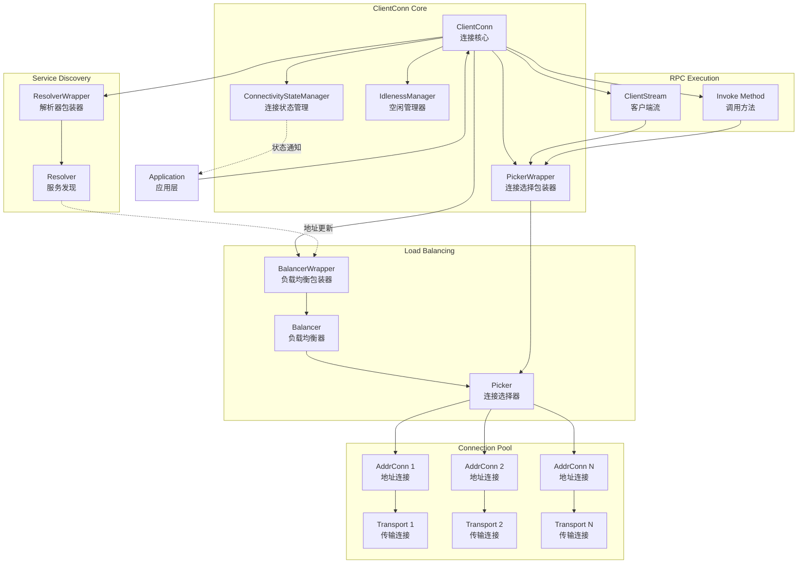
```mermaid
flowchart TB
    subgraph "ClientConn Core"
        CC[ClientConn<br/>连接核心]
        CSM[ConnectivityStateManager<br/>连接状态管理]
        PW[PickerWrapper<br/>连接选择包装器]
        IM[IdlenessManager<br/>空闲管理器]
    end
    
    subgraph "Service Discovery"
        RW[ResolverWrapper<br/>解析器包装器]
        R[Resolver<br/>服务发现]
    end
    
    subgraph "Load Balancing"
        BW[BalancerWrapper<br/>负载均衡包装器]
        B[Balancer<br/>负载均衡器]
        P[Picker<br/>连接选择器]
    end
    
    subgraph "Connection Pool"
        AC1[AddrConn 1<br/>地址连接]
        AC2[AddrConn 2<br/>地址连接]
        AC3[AddrConn N<br/>地址连接]
        T1[Transport 1<br/>传输连接]
        T2[Transport 2<br/>传输连接]
        T3[Transport N<br/>传输连接]
    end
    
    subgraph "RPC Execution"
        CS[ClientStream<br/>客户端流]
        Invoke[Invoke Method<br/>调用方法]
    end
    
    App[Application<br/>应用层] --> CC
    CC --> CSM
    CC --> PW
    CC --> IM
    CC --> RW
    RW --> R
    CC --> BW
    BW --> B
    B --> P
    PW --> P
    P --> AC1
    P --> AC2
    P --> AC3
    AC1 --> T1
    AC2 --> T2
    AC3 --> T3
    CC --> CS
    CC --> Invoke
    CS --> PW
    Invoke --> PW
    
    R -.->|地址更新| BW
    CSM -.->|状态通知| App
```

**架构说明：**

1. **连接核心层：**
   - `ClientConn` 作为整个模块的核心控制器
   - `ConnectivityStateManager` 管理连接状态变化和通知
   - `PickerWrapper` 封装连接选择逻辑，支持并发安全
   - `IdlenessManager` 处理连接空闲和激活机制

2. **服务发现层：**
   - `ResolverWrapper` 包装具体的解析器实现
   - `Resolver` 负责将服务名解析为具体的后端地址列表
   - 支持 DNS、passthrough、unix socket 等多种解析方式

3. **负载均衡层：**
   - `BalancerWrapper` 管理负载均衡器的生命周期
   - `Balancer` 实现具体的负载均衡策略（轮询、加权等）
   - `Picker` 为每个 RPC 请求选择合适的连接

4. **连接池层：**
   - `AddrConn` 管理到单个后端地址的连接
   - `Transport` 处理底层 HTTP/2 协议通信
   - 支持连接复用和故障转移

5. **RPC执行层：**
   - `ClientStream` 处理流式 RPC 调用
   - `Invoke` 处理一元 RPC 调用
   - 统一的调用入口和错误处理

**边界条件：**

- 最大连接数由负载均衡器策略决定
- 连接超时默认 20 秒，可配置
- 支持并发调用，线程安全
- 连接失败时自动重试和故障转移

**异常处理：**

- 连接建立失败时返回相应错误码
- 服务不可用时触发重试机制
- 网络异常时自动进行服务发现更新
- 支持熔断和降级策略

**性能要点：**

- 连接复用减少建立开销
- 异步状态更新避免阻塞调用
- 内存池复用减少 GC 压力
- 支持连接预热和保活机制

**版本兼容：**

- 向后兼容 `Dial()` 和 `DialContext()` API
- 新版本推荐使用 `NewClient()` 接口
- 支持渐进式配置迁移

## 核心算法与流程

### 连接建立流程

```go
func NewClient(target string, opts ...DialOption) (*ClientConn, err error) {
    // 1. 初始化 ClientConn 结构
    cc := &ClientConn{
        target: target,
        conns:  make(map[*addrConn]struct{}),
        dopts:  defaultDialOptions(),
    }
    
    // 2. 应用配置选项
    for _, opt := range opts {
        opt.apply(&cc.dopts)
    }
    
    // 3. 初始化解析器和负载均衡器
    if err := cc.initParsedTargetAndResolverBuilder(); err != nil {
        return nil, err
    }
    
    // 4. 设置拦截器链
    chainUnaryClientInterceptors(cc)
    chainStreamClientInterceptors(cc)
    
    // 5. 验证传输凭证
    if err := cc.validateTransportCredentials(); err != nil {
        return nil, err
    }
    
    // 6. 初始化连接状态管理器
    cc.csMgr = newConnectivityStateManager(cc.ctx, cc.channelz)
    cc.pickerWrapper = newPickerWrapper()
    
    // 7. 启动解析器和负载均衡器
    cc.exitIdleMode()
    
    return cc, nil
}
```

**流程说明：**

1. **结构初始化：** 创建 ClientConn 实例，初始化基本字段
2. **配置应用：** 处理全局和局部配置选项
3. **组件初始化：** 根据 target 确定使用的解析器和负载均衡器
4. **拦截器设置：** 构建拦截器调用链
5. **安全验证：** 检查传输层安全配置
6. **状态管理：** 初始化连接状态管理组件
7. **服务启动：** 激活解析器开始服务发现

**复杂度分析：**

- 时间复杂度：O(n)，n 为配置选项数量
- 空间复杂度：O(1)，固定内存分配
- 并发安全：初始化阶段非并发安全，完成后支持并发访问

### RPC 调用流程

```go
func (cc *ClientConn) Invoke(ctx context.Context, method string, args, reply any, opts ...CallOption) error {
    // 1. 合并调用选项
    opts = combine(cc.dopts.callOptions, opts)
    
    // 2. 应用一元拦截器
    if cc.dopts.unaryInt != nil {
        return cc.dopts.unaryInt(ctx, method, args, reply, cc, invoke, opts...)
    }
    
    // 3. 执行实际调用
    return invoke(ctx, method, args, reply, cc, opts...)
}

func invoke(ctx context.Context, method string, req, reply any, cc *ClientConn, opts ...CallOption) error {
    // 1. 创建客户端流
    cs, err := newClientStream(ctx, unaryStreamDesc, cc, method, opts...)
    if err != nil {
        return err
    }
    
    // 2. 发送请求
    if err := cs.SendMsg(req); err != nil {
        return err
    }
    
    // 3. 接收响应
    return cs.RecvMsg(reply)
}
```

**流程说明：**

1. **选项处理：** 合并默认和调用时指定的选项
2. **拦截器执行：** 应用配置的一元拦截器链
3. **流创建：** 创建用于此次调用的客户端流
4. **消息发送：** 序列化请求并发送到服务端
5. **响应接收：** 等待并反序列化服务端响应

**性能优化：**

- 连接选择缓存减少选择开销
- 流对象复用避免频繁分配
- 异步发送减少网络延迟影响

### 连接选择算法

```go
func (pw *pickerWrapper) pick(ctx context.Context, failfast bool, info balancer.PickInfo) (transport.ClientTransport, balancer.PickResult, error) {
    // 1. 获取当前 Picker
    p := pw.picker.Load()
    if p == nil {
        return nil, balancer.PickResult{}, status.Error(codes.Unavailable, "no picker available")
    }
    
    // 2. 执行连接选择
    pickResult, err := p.Pick(info)
    if err != nil {
        return nil, balancer.PickResult{}, err
    }
    
    // 3. 获取选中连接的传输层
    acbw, ok := pickResult.SubConn.(*acBalancerWrapper)
    if !ok {
        return nil, balancer.PickResult{}, status.Error(codes.Internal, "invalid SubConn type")
    }
    
    transport := acbw.ac.getReadyTransport()
    if transport == nil {
        return nil, balancer.PickResult{}, status.Error(codes.Unavailable, "SubConn not ready")
    }
    
    return transport, pickResult, nil
}
```

**算法特点：**

- 无锁设计：使用原子操作避免锁竞争
- 快速失败：连接不可用时立即返回错误
- 状态感知：只选择就绪状态的连接
- 策略可插拔：支持多种负载均衡算法

## 关键数据结构

### ClientConn 结构体

```go
type ClientConn struct {
    // 基础字段
    ctx    context.Context    // 连接生命周期上下文
    cancel context.CancelFunc // 取消函数
    target string             // 目标服务地址
    
    // 组件管理
    csMgr              *connectivityStateManager // 连接状态管理器
    pickerWrapper      *pickerWrapper            // 连接选择器包装
    resolverWrapper    *ccResolverWrapper        // 解析器包装
    balancerWrapper    *ccBalancerWrapper        // 负载均衡器包装
    
    // 连接池
    conns map[*addrConn]struct{} // 活跃连接集合
    
    // 配置选项
    dopts dialOptions // 拨号选项
    
    // 并发控制
    mu sync.RWMutex // 保护可变字段的读写锁
}
```

### 连接状态管理器

```go
type connectivityStateManager struct {
    mu         sync.Mutex        // 状态变更锁
    state      connectivity.State // 当前连接状态
    notifyChan chan struct{}      // 状态变化通知通道
    channelz   *channelz.Channel  // 调试信息通道
    pubSub     *grpcsync.PubSub   // 发布订阅机制
}
```

**状态枚举：**

- `Idle`：空闲状态，未建立连接
- `Connecting`：连接建立中
- `Ready`：连接就绪，可处理请求
- `TransientFailure`：临时失败，正在重试
- `Shutdown`：连接已关闭

### 地址连接结构

```go
type addrConn struct {
    ctx    context.Context    // 连接上下文
    cancel context.CancelFunc // 取消函数
    cc     *ClientConn        // 所属客户端连接
    
    // 连接信息
    addrs   []resolver.Address // 后端地址列表
    transport transport.ClientTransport // 底层传输连接
    
    // 状态管理
    state connectivity.State // 连接状态
    
    // 并发控制
    mu sync.Mutex // 状态变更锁
}
```

## 配置与可观测性

### 主要配置项
- `MaxReceiveMessageSize`：最大接收消息大小（默认 4MB）
- `MaxSendMessageSize`：最大发送消息大小（默认无限制）
- `InitialWindowSize`：HTTP/2 流初始窗口大小（默认 64KB）
- `InitialConnWindowSize`：HTTP/2 连接初始窗口大小（默认 16KB）
- `KeepaliveParams`：连接保活参数
- `ConnectTimeout`：连接建立超时（默认 20 秒）

### 关键指标
- 连接数：当前活跃连接数量
- 连接状态：各状态连接的分布
- RPC 调用量：每秒请求数和响应时间
- 错误率：按错误类型分类的失败率
- 连接建立耗时：从发起到建立成功的时间

### 调试接口
- `GetState()`：获取当前连接状态
- `WaitForStateChange()`：等待状态变化
- `Connect()`：强制建立连接
- Channelz 调试信息：详细的连接和调用统计

---

## API接口

## API 概览

客户端连接模块提供以下核心 API：

- 连接创建：`NewClient`、`Dial`、`DialContext`
- RPC 调用：`Invoke`、`NewStream`
- 连接管理：`Connect`、`GetState`、`WaitForStateChange`、`Close`
- 配置选项：各种 `DialOption` 函数

---

## 1. 连接创建 API

### 1.1 NewClient

#### 基本信息
- **名称：** `NewClient`
- **协议/方法：** Go 函数调用 `func NewClient(target string, opts ...DialOption) (*ClientConn, error)`
- **幂等性：** 否（每次调用创建新连接）

#### 请求结构体

```go
// NewClient 参数结构
type NewClientParams struct {
    Target string       // 目标服务地址，支持多种格式
    Opts   []DialOption // 连接配置选项列表
}
```

| 字段 | 类型 | 必填 | 默认 | 约束 | 说明 |
|------|------|------|------|------|------|
| target | string | 是 | - | 非空字符串 | 目标服务地址，如 "localhost:50051" |
| opts | []DialOption | 否 | 默认选项 | - | 连接配置选项数组 |

#### 响应结构体

```go
type NewClientResponse struct {
    Conn *ClientConn // 创建的客户端连接
    Err  error       // 错误信息（如果创建失败）
}
```

| 字段 | 类型 | 必填 | 默认 | 约束 | 说明 |
|------|------|------|------|------|------|
| Conn | *ClientConn | 成功时必填 | nil | - | 创建的客户端连接实例 |
| Err | error | 失败时必填 | nil | - | 创建失败的错误信息 |

#### 入口函数与关键代码

```go
func NewClient(target string, opts ...DialOption) (conn *ClientConn, err error) {
    // 1. 初始化 ClientConn 基础结构
    cc := &ClientConn{
        target: target,
        conns:  make(map[*addrConn]struct{}),
        dopts:  defaultDialOptions(),
    }
    
    // 2. 设置上下文和取消函数
    cc.ctx, cc.cancel = context.WithCancel(context.Background())
    
    // 3. 应用全局和局部配置选项
    for _, opt := range globalDialOptions {
        opt.apply(&cc.dopts)
    }
    for _, opt := range opts {
        opt.apply(&cc.dopts)
    }
    
    // 4. 初始化解析器构建器
    if err := cc.initParsedTargetAndResolverBuilder(); err != nil {
        return nil, err
    }
    
    // 5. 构建拦截器链
    chainUnaryClientInterceptors(cc)
    chainStreamClientInterceptors(cc)
    
    // 6. 验证传输凭证配置
    if err := cc.validateTransportCredentials(); err != nil {
        return nil, err
    }
    
    // 7. 初始化连接状态管理器
    cc.csMgr = newConnectivityStateManager(cc.ctx, cc.channelz)
    cc.pickerWrapper = newPickerWrapper()
    
    return cc, nil
}
```

#### 上层适配/调用链核心代码

```go
// 应用层典型调用方式
func createGRPCClient(serverAddr string) (*pb.GreeterClient, error) {
    // 创建连接
    conn, err := grpc.NewClient(serverAddr,
        grpc.WithTransportCredentials(insecure.NewCredentials()),
        grpc.WithDefaultServiceConfig(`{"loadBalancingPolicy":"round_robin"}`),
    )
    if err != nil {
        return nil, fmt.Errorf("连接失败: %w", err)
    }
    
    // 创建服务客户端
    client := pb.NewGreeterClient(conn)
    return client, nil
}
```

#### 时序图（请求→响应）

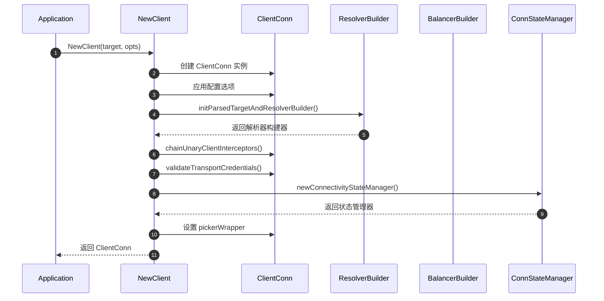
```mermaid
sequenceDiagram
    autonumber
    participant App as Application
    participant NC as NewClient
    participant CC as ClientConn
    participant R as ResolverBuilder
    participant B as BalancerBuilder
    participant CSM as ConnStateManager

    App->>NC: NewClient(target, opts)
    NC->>CC: 创建 ClientConn 实例
    NC->>CC: 应用配置选项
    NC->>R: initParsedTargetAndResolverBuilder()
    R-->>NC: 返回解析器构建器
    NC->>CC: chainUnaryClientInterceptors()
    NC->>CC: validateTransportCredentials()
    NC->>CSM: newConnectivityStateManager()
    CSM-->>NC: 返回状态管理器
    NC->>CC: 设置 pickerWrapper
    NC-->>App: 返回 ClientConn
```

#### 异常/回退与性能要点

**错误处理：**

- `target` 为空：返回 `InvalidArgument` 错误
- 解析器初始化失败：返回相应的解析错误
- 传输凭证验证失败：返回认证配置错误
- 内存分配失败：返回系统资源错误

**性能要点：**

- 连接创建是轻量级操作，不涉及网络 I/O
- 实际网络连接在首次 RPC 调用时建立
- 支持连接池复用，避免重复创建开销
- 配置选项应用为 O(n) 时间复杂度

---

### 1.2 Dial（已废弃，推荐使用 NewClient）

#### 基本信息
- **名称：** `Dial`
- **协议/方法：** Go 函数调用 `func Dial(target string, opts ...DialOption) (*ClientConn, error)`
- **幂等性：** 否

#### 入口函数与关键代码

```go
func Dial(target string, opts ...DialOption) (*ClientConn, error) {
    // 直接调用 DialContext，使用背景上下文
    return DialContext(context.Background(), target, opts...)
}
```

---

## 2. RPC 调用 API

### 2.1 Invoke（一元 RPC 调用）

#### 基本信息
- **名称：** `Invoke`
- **协议/方法：** 方法调用 `func (cc *ClientConn) Invoke(ctx context.Context, method string, args, reply any, opts ...CallOption) error`
- **幂等性：** 取决于具体的 RPC 方法实现

#### 请求结构体

```go
type InvokeParams struct {
    Ctx    context.Context // 调用上下文，控制超时和取消
    Method string          // RPC 方法名，格式：/package.service/method
    Args   any            // 请求参数，需要是 protobuf 消息类型
    Reply  any            // 响应接收器，需要是 protobuf 消息类型
    Opts   []CallOption   // 调用选项
}
```

| 字段 | 类型 | 必填 | 默认 | 约束 | 说明 |
|------|------|------|------|------|------|
| ctx | context.Context | 是 | - | 非 nil | 调用上下文，用于超时控制 |
| method | string | 是 | - | 格式：/service/method | RPC 方法的完整路径 |
| args | any | 是 | - | protobuf 消息 | 请求参数对象 |
| reply | any | 是 | - | protobuf 消息指针 | 响应接收对象 |
| opts | []CallOption | 否 | 空数组 | - | 调用级别的选项 |

#### 响应结构体

```go
// Invoke 直接修改 reply 参数，返回 error
type InvokeResult struct {
    Error error // 调用错误，nil 表示成功
}
```

#### 入口函数与关键代码

```go
func (cc *ClientConn) Invoke(ctx context.Context, method string, args, reply any, opts ...CallOption) error {
    // 1. 合并默认和调用时的选项
    opts = combine(cc.dopts.callOptions, opts)
    
    // 2. 应用一元拦截器（如果配置了）
    if cc.dopts.unaryInt != nil {
        return cc.dopts.unaryInt(ctx, method, args, reply, cc, invoke, opts...)
    }
    
    // 3. 执行实际的调用逻辑
    return invoke(ctx, method, args, reply, cc, opts...)
}

// 实际调用实现
func invoke(ctx context.Context, method string, req, reply any, cc *ClientConn, opts ...CallOption) error {
    // 1. 创建一元调用的客户端流
    cs, err := newClientStream(ctx, unaryStreamDesc, cc, method, opts...)
    if err != nil {
        return err
    }
    
    // 2. 发送请求消息
    if err := cs.SendMsg(req); err != nil {
        return err
    }
    
    // 3. 接收响应消息
    return cs.RecvMsg(reply)
}
```

#### 上层适配/调用链核心代码

```go
// 生成代码中的典型调用模式
func (c *greeterClient) SayHello(ctx context.Context, in *HelloRequest, opts ...grpc.CallOption) (*HelloReply, error) {
    out := new(HelloReply)
    err := c.cc.Invoke(ctx, "/helloworld.Greeter/SayHello", in, out, opts...)
    if err != nil {
        return nil, err
    }
    return out, nil
}

// 应用层使用示例
func callGreeterService(client pb.GreeterClient) error {
    ctx, cancel := context.WithTimeout(context.Background(), time.Second)
    defer cancel()
    
    resp, err := client.SayHello(ctx, &pb.HelloRequest{Name: "World"})
    if err != nil {
        return fmt.Errorf("调用失败: %w", err)
    }
    
    log.Printf("响应: %s", resp.Message)
    return nil
}
```

#### 时序图（请求→响应）

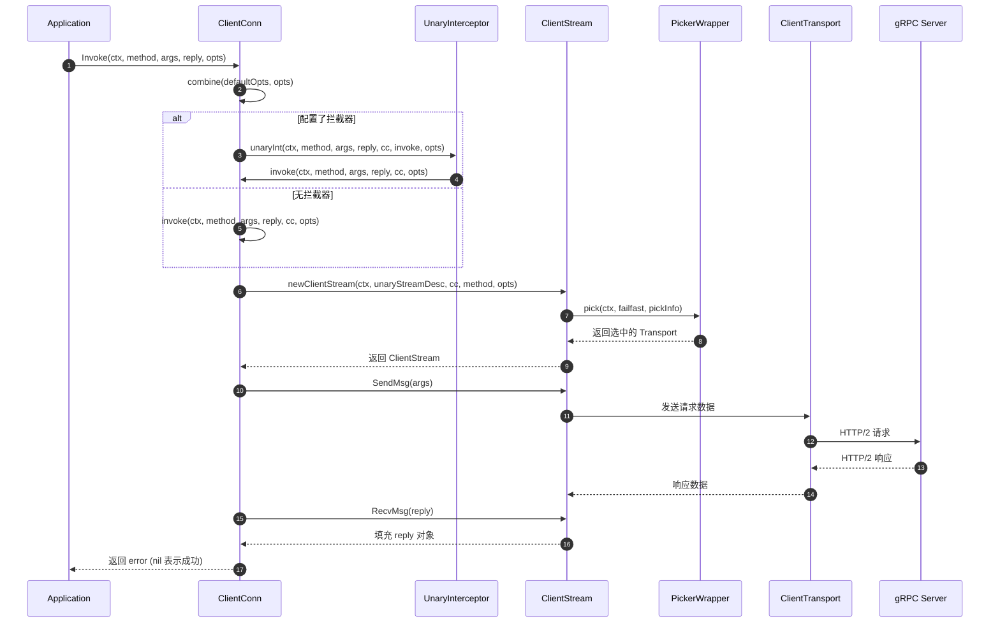
```mermaid
sequenceDiagram
    autonumber
    participant App as Application
    participant CC as ClientConn
    participant Interceptor as UnaryInterceptor
    participant CS as ClientStream
    participant PW as PickerWrapper
    participant Transport as ClientTransport
    participant Server as gRPC Server

    App->>CC: Invoke(ctx, method, args, reply, opts)
    CC->>CC: combine(defaultOpts, opts)
    
    alt 配置了拦截器
        CC->>Interceptor: unaryInt(ctx, method, args, reply, cc, invoke, opts)
        Interceptor->>CC: invoke(ctx, method, args, reply, cc, opts)
    else 无拦截器
        CC->>CC: invoke(ctx, method, args, reply, cc, opts)
    end
    
    CC->>CS: newClientStream(ctx, unaryStreamDesc, cc, method, opts)
    CS->>PW: pick(ctx, failfast, pickInfo)
    PW-->>CS: 返回选中的 Transport
    CS-->>CC: 返回 ClientStream
    
    CC->>CS: SendMsg(args)
    CS->>Transport: 发送请求数据
    Transport->>Server: HTTP/2 请求
    
    Server-->>Transport: HTTP/2 响应
    Transport-->>CS: 响应数据
    CC->>CS: RecvMsg(reply)
    CS-->>CC: 填充 reply 对象
    CC-->>App: 返回 error (nil 表示成功)
```

#### 异常/回退与性能要点

**错误处理：**

- 连接不可用：返回 `Unavailable` 状态码
- 请求超时：返回 `DeadlineExceeded` 状态码
- 服务端错误：返回相应的 gRPC 状态码
- 序列化失败：返回 `Internal` 状态码

**重试策略：**

- 支持可配置的重试策略
- 只对幂等方法进行重试
- 指数退避算法控制重试间隔
- 最大重试次数限制

**性能优化：**

- 连接复用避免重复握手
- 请求管道化提高吞吐量
- 压缩减少网络传输量
- 连接池管理减少资源消耗

---

### 2.2 NewStream（流式 RPC 调用）

#### 基本信息
- **名称：** `NewStream`
- **协议/方法：** 方法调用 `func (cc *ClientConn) NewStream(ctx context.Context, desc *StreamDesc, method string, opts ...CallOption) (ClientStream, error)`
- **幂等性：** 否（每次调用创建新流）

#### 请求结构体

```go
type NewStreamParams struct {
    Ctx    context.Context // 流的生命周期上下文
    Desc   *StreamDesc     // 流描述符，定义流的特性
    Method string          // RPC 方法名
    Opts   []CallOption    // 调用选项
}

// 流描述符结构
type StreamDesc struct {
    StreamName    string // 流名称
    Handler       StreamHandler // 服务端处理器（客户端不使用）
    ServerStreams bool   // 是否为服务端流
    ClientStreams bool   // 是否为客户端流
}
```

| 字段 | 类型 | 必填 | 默认 | 约束 | 说明 |
|------|------|------|------|------|------|
| ctx | context.Context | 是 | - | 非 nil | 流的生命周期上下文 |
| desc | *StreamDesc | 是 | - | 非 nil | 流的描述信息 |
| method | string | 是 | - | 格式：/service/method | RPC 方法路径 |
| opts | []CallOption | 否 | 空数组 | - | 流级别选项 |

#### 响应结构体

```go
type NewStreamResult struct {
    Stream ClientStream // 创建的客户端流
    Error  error        // 创建错误
}

// 客户端流接口
type ClientStream interface {
    Header() (metadata.MD, error)         // 获取响应头
    Trailer() metadata.MD                 // 获取响应尾部
    CloseSend() error                     // 关闭发送端
    Context() context.Context             // 获取流上下文
    SendMsg(m any) error                 // 发送消息
    RecvMsg(m any) error                 // 接收消息
}
```

#### 入口函数与关键代码

```go
func (cc *ClientConn) NewStream(ctx context.Context, desc *StreamDesc, method string, opts ...CallOption) (ClientStream, error) {
    // 1. 合并调用选项
    opts = combine(cc.dopts.callOptions, opts)
    
    // 2. 应用流拦截器（如果配置了）
    if cc.dopts.streamInt != nil {
        return cc.dopts.streamInt(ctx, desc, cc, method, newClientStream, opts...)
    }
    
    // 3. 创建实际的客户端流
    return newClientStream(ctx, desc, cc, method, opts...)
}

func newClientStream(ctx context.Context, desc *StreamDesc, cc *ClientConn, method string, opts ...CallOption) (_ ClientStream, err error) {
    // 1. 检查连接状态，确保不在空闲状态
    if err := cc.idlenessMgr.OnCallBegin(); err != nil {
        return nil, err
    }
    
    // 2. 解析调用选项
    c := defaultCallInfo()
    for _, o := range opts {
        if err := o.before(c); err != nil {
            return nil, toRPCErr(err)
        }
    }
    
    // 3. 等待解析器首次更新
    if err := cc.waitForResolvedAddrs(ctx); err != nil {
        return nil, err
    }
    
    // 4. 创建客户端流实例
    cs := &clientStream{
        callHdr: &transport.CallHdr{
            Host:           cc.authority,
            Method:         method,
            ContentSubtype: c.contentSubtype,
        },
        ctx:    ctx,
        methodConfig: &mc,
        opts:   opts,
        callInfo: c,
        cc:     cc,
        desc:   desc,
    }
    
    // 5. 选择连接并建立流
    return cs, cs.newAttemptLocked(false /* isTransparent */)
}
```

#### 时序图（请求→响应）

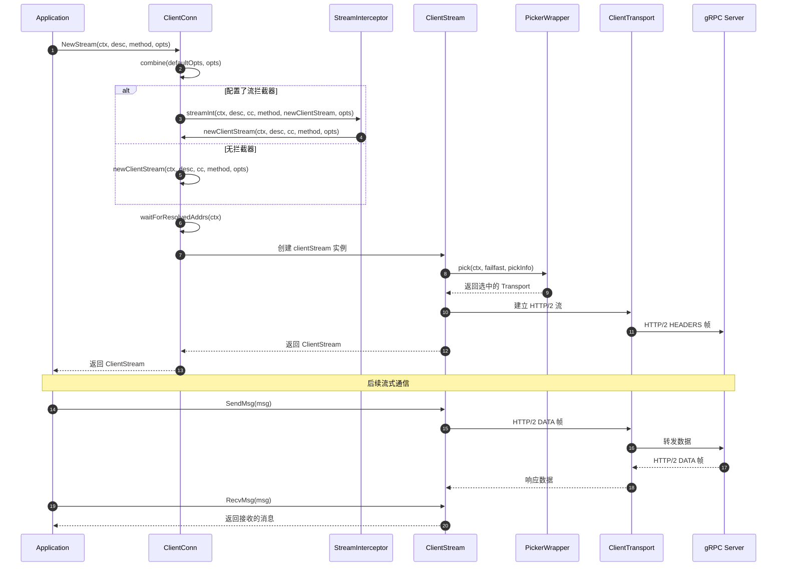
```mermaid
sequenceDiagram
    autonumber
    participant App as Application
    participant CC as ClientConn
    participant SI as StreamInterceptor
    participant CS as ClientStream
    participant PW as PickerWrapper
    participant Transport as ClientTransport
    participant Server as gRPC Server

    App->>CC: NewStream(ctx, desc, method, opts)
    CC->>CC: combine(defaultOpts, opts)
    
    alt 配置了流拦截器
        CC->>SI: streamInt(ctx, desc, cc, method, newClientStream, opts)
        SI->>CC: newClientStream(ctx, desc, cc, method, opts)
    else 无拦截器
        CC->>CC: newClientStream(ctx, desc, cc, method, opts)
    end
    
    CC->>CC: waitForResolvedAddrs(ctx)
    CC->>CS: 创建 clientStream 实例
    CS->>PW: pick(ctx, failfast, pickInfo)
    PW-->>CS: 返回选中的 Transport
    CS->>Transport: 建立 HTTP/2 流
    Transport->>Server: HTTP/2 HEADERS 帧
    CS-->>CC: 返回 ClientStream
    CC-->>App: 返回 ClientStream

    Note over App,Server: 后续流式通信
    App->>CS: SendMsg(msg)
    CS->>Transport: HTTP/2 DATA 帧
    Transport->>Server: 转发数据
    
    Server-->>Transport: HTTP/2 DATA 帧
    Transport-->>CS: 响应数据
    App->>CS: RecvMsg(msg)
    CS-->>App: 返回接收的消息
```

#### 异常/回退与性能要点

**错误处理：**

- 连接选择失败：返回 `Unavailable` 错误
- 流建立超时：返回 `DeadlineExceeded` 错误
- 网络连接断开：触发重连和流重建
- 流控窗口耗尽：阻塞发送直到窗口恢复

**流管理：**

- 支持客户端流、服务端流、双向流
- 自动流控管理避免内存溢出
- 流取消传播到服务端
- 连接断开时自动清理流资源

**性能要点：**

- HTTP/2 多路复用支持并发流
- 流窗口大小可配置优化吞吐量
- 支持流压缩减少带宽消耗
- 异步发送接收提高并发性能

---

## 3. 连接管理 API

### 3.1 GetState

#### 基本信息
- **名称：** `GetState`
- **协议/方法：** 方法调用 `func (cc *ClientConn) GetState() connectivity.State`
- **幂等性：** 是（只读操作）

#### 入口函数与关键代码

```go
func (cc *ClientConn) GetState() connectivity.State {
    return cc.csMgr.getState()
}

func (csm *connectivityStateManager) getState() connectivity.State {
    csm.mu.Lock()
    defer csm.mu.Unlock()
    return csm.state
}
```

**状态枚举：**

- `Idle`：空闲状态，未建立连接
- `Connecting`：正在建立连接
- `Ready`：连接就绪，可处理请求
- `TransientFailure`：临时失败，正在重试
- `Shutdown`：连接已关闭

### 3.2 WaitForStateChange

#### 基本信息
- **名称：** `WaitForStateChange`
- **协议/方法：** 方法调用 `func (cc *ClientConn) WaitForStateChange(ctx context.Context, sourceState connectivity.State) bool`
- **幂等性：** 是

#### 入口函数与关键代码

```go
func (cc *ClientConn) WaitForStateChange(ctx context.Context, sourceState connectivity.State) bool {
    ch := cc.csMgr.getNotifyChan()
    if cc.csMgr.getState() != sourceState {
        return true // 状态已经改变
    }
    
    select {
    case <-ctx.Done():
        return false // 上下文超时或取消
    case <-ch:
        return true // 状态发生变化
    }
}
```

### 3.3 Connect

#### 基本信息
- **名称：** `Connect`
- **协议/方法：** 方法调用 `func (cc *ClientConn) Connect()`
- **幂等性：** 是（重复调用无副作用）

#### 入口函数与关键代码

```go
func (cc *ClientConn) Connect() {
    // 1. 尝试退出空闲模式
    if err := cc.idlenessMgr.ExitIdleMode(); err != nil {
        cc.addTraceEvent(err.Error())
        return
    }
    
    // 2. 通知负载均衡器退出空闲
    cc.mu.Lock()
    cc.balancerWrapper.exitIdle()
    cc.mu.Unlock()
}
```

### 3.4 Close

#### 基本信息
- **名称：** `Close`
- **协议/方法：** 方法调用 `func (cc *ClientConn) Close() error`
- **幂等性：** 是（重复关闭无副作用）

#### 入口函数与关键代码

```go
func (cc *ClientConn) Close() error {
    defer cc.cancel() // 取消上下文
    
    cc.mu.Lock()
    if cc.conns == nil {
        cc.mu.Unlock()
        return ErrClientConnClosing
    }
    
    // 关闭所有连接
    conns := cc.conns
    cc.conns = nil
    cc.mu.Unlock()
    
    // 清理资源
    for ac := range conns {
        ac.tearDown(ErrClientConnClosing)
    }
    
    // 关闭组件
    if cc.resolverWrapper != nil {
        cc.resolverWrapper.close()
    }
    if cc.balancerWrapper != nil {
        cc.balancerWrapper.close()
    }
    
    return nil
}
```

---

## 4. 配置选项 API

### 4.1 WithTransportCredentials

#### 基本信息

```go
func WithTransportCredentials(creds credentials.TransportCredentials) DialOption
```

设置传输层安全凭证，支持 TLS、mTLS 等安全协议。

### 4.2 WithDefaultServiceConfig

#### 基本信息

```go
func WithDefaultServiceConfig(s string) DialOption
```

设置默认的服务配置，包括负载均衡策略、重试策略等。

### 4.3 WithUnaryInterceptor

#### 基本信息

```go
func WithUnaryInterceptor(f UnaryClientInterceptor) DialOption
```

设置一元 RPC 调用拦截器，用于实现认证、日志、监控等横切关注点。

### 4.4 WithStreamInterceptor

#### 基本信息

```go
func WithStreamInterceptor(f StreamClientInterceptor) DialOption
```

设置流式 RPC 调用拦截器。

## 使用最佳实践

1. **连接管理：**
   - 复用 ClientConn 实例，避免频繁创建
   - 应用退出时主动调用 Close() 清理资源
   - 监控连接状态，实现健康检查

2. **错误处理：**
   - 检查返回的 gRPC 状态码
   - 实现适当的重试策略
   - 区分临时错误和永久错误

3. **性能优化：**
   - 配置合适的消息大小限制
   - 使用连接池管理多个服务连接
   - 启用压缩减少网络传输量

4. **安全配置：**
   - 生产环境必须使用 TLS
   - 实现客户端认证和授权
   - 定期更新证书和密钥

---

## 数据结构

## 概述

客户端连接模块的数据结构设计体现了分层架构和职责分离的原则。核心结构包括连接管理、状态控制、负载均衡、服务发现等多个层次，通过清晰的接口定义和状态机制实现高效的 RPC 通信。

## 核心数据结构类图

```mermaid
classDiagram
    class ClientConn {
        +string target
        +context.Context ctx
        +context.CancelFunc cancel
        +dialOptions dopts
        +map[*addrConn]struct{} conns
        +*connectivityStateManager csMgr
        +*pickerWrapper pickerWrapper
        +*ccResolverWrapper resolverWrapper
        +*ccBalancerWrapper balancerWrapper
        +sync.RWMutex mu
        
        +Invoke(ctx, method, args, reply, opts) error
        +NewStream(ctx, desc, method, opts) ClientStream
        +GetState() connectivity.State
        +WaitForStateChange(ctx, sourceState) bool
        +Connect()
        +Close() error
    }
    
    class connectivityStateManager {
        +connectivity.State state
        +chan struct{} notifyChan
        +*channelz.Channel channelz
        +*grpcsync.PubSub pubSub
        +sync.Mutex mu
        
        +updateState(state)
        +getState() connectivity.State
        +getNotifyChan() <-chan struct{}
    }
    
    class pickerWrapper {
        +atomic.Value picker
        +chan struct{} blockingCh
        +sync.RWMutex mu
        
        +updatePicker(picker)
        +pick(ctx, failfast, info) (transport, result, error)
        +close()
    }
    
    class addrConn {
        +context.Context ctx
        +context.CancelFunc cancel
        +*ClientConn cc
        +[]resolver.Address addrs
        +transport.ClientTransport transport
        +connectivity.State state
        +sync.Mutex mu
        
        +connect()
        +tryAllAddrs(addrs, connectDeadline) error
        +createTransport(ctx, addr, copts, connectDeadline) error
        +getReadyTransport() transport.ClientTransport
        +tearDown(err)
    }
    
    class ccResolverWrapper {
        +resolver.Resolver resolver
        +*ClientConn cc
        +resolver.ClientConn resolverCC
        +context.Context ctx
        +context.CancelFunc cancel
        
        +start()
        +close()
        +UpdateState(state)
        +ReportError(err)
        +NewAddress(addresses)
        +NewServiceConfig(serviceConfig)
    }
    
    class ccBalancerWrapper {
        +balancer.Balancer balancer
        +*ClientConn cc
        +balancer.ClientConn balancerCC
        +context.Context ctx
        +context.CancelFunc cancel
        
        +start()
        +close()
        +UpdateClientConnState(state)
        +ResolverError(err)
        +UpdateSubConnState(sc, state)
        +NewSubConn(addrs, opts) balancer.SubConn
        +RemoveSubConn(sc)
    }
    
    class dialOptions {
        +UnaryClientInterceptor unaryInt
        +StreamClientInterceptor streamInt
        +[]UnaryClientInterceptor chainUnaryInts
        +[]StreamClientInterceptor chainStreamInts
        +credentials.TransportCredentials creds
        +bool block
        +time.Duration timeout
        +string authority
        +*ServiceConfig defaultServiceConfig
        +time.Duration idleTimeout
        +int maxCallAttempts
        
        +apply(*dialOptions)
    }
    
    class ServiceConfig {
        +*LBConfig loadBalancingConfig
        +[]MethodConfig methodConfig
        +*retryPolicy retryPolicy
        +*hedgingPolicy hedgingPolicy
        +*healthCheckConfig healthCheckConfig
        
        +validateAndProcess() error
    }

    ClientConn ||--|| connectivityStateManager : manages
    ClientConn ||--|| pickerWrapper : uses
    ClientConn ||--o| ccResolverWrapper : contains
    ClientConn ||--o| ccBalancerWrapper : contains
    ClientConn ||--o{ addrConn : manages
    ClientConn ||--|| dialOptions : configured_by
    dialOptions ||--o| ServiceConfig : contains
    ccResolverWrapper ||--|| resolver.Resolver : wraps
    ccBalancerWrapper ||--|| balancer.Balancer : wraps
    addrConn ||--o| transport.ClientTransport : uses
```

## 详细数据结构说明

### 1. ClientConn - 客户端连接核心

```go
type ClientConn struct {
    // 基础字段 - 连接创建时初始化，后续只读
    ctx              context.Context      // 连接生命周期上下文
    cancel           context.CancelFunc   // 上下文取消函数
    target           string              // 目标服务地址
    parsedTarget     resolver.Target     // 解析后的目标地址
    authority        string              // 服务权威标识
    dopts            dialOptions         // 拨号配置选项
    channelz         *channelz.Channel   // 调试信息通道
    resolverBuilder  resolver.Builder    // 解析器构建器
    
    // 并发安全的组件 - 提供自己的同步机制
    csMgr              *connectivityStateManager // 连接状态管理器
    pickerWrapper      *pickerWrapper            // 连接选择器包装
    safeConfigSelector iresolver.SafeConfigSelector // 安全配置选择器
    retryThrottler     atomic.Value               // 重试限流器
    
    // 互斥保护的字段
    mu              sync.RWMutex           // 读写互斥锁
    resolverWrapper *ccResolverWrapper     // 解析器包装器
    balancerWrapper *ccBalancerWrapper     // 负载均衡器包装器
    sc              *ServiceConfig         // 当前服务配置
    conns           map[*addrConn]struct{} // 活跃连接集合
    keepaliveParams keepalive.ClientParameters // 保活参数
    firstResolveEvent *grpcsync.Event     // 首次解析事件
    
    // 连接错误管理
    lceMu               sync.Mutex // 保护最后连接错误
    lastConnectionError error      // 最后一次连接错误
}
```

**字段说明：**

- **生命周期管理：** `ctx` 和 `cancel` 控制整个连接的生命周期
- **目标解析：** `target`、`parsedTarget`、`authority` 确定连接目标
- **配置管理：** `dopts` 和 `sc` 存储连接和服务配置
- **状态管理：** `csMgr` 管理连接状态变化和通知
- **连接选择：** `pickerWrapper` 为 RPC 调用选择合适的连接
- **连接池：** `conns` 管理所有活跃的地址连接

### 2. connectivityStateManager - 连接状态管理器

```go
type connectivityStateManager struct {
    mu         sync.Mutex        // 状态变更互斥锁
    state      connectivity.State // 当前连接状态
    notifyChan chan struct{}      // 状态变化通知通道
    channelz   *channelz.Channel  // 调试信息通道
    pubSub     *grpcsync.PubSub   // 发布订阅机制
}

// 连接状态枚举
type connectivity.State int32

const (
    Idle connectivity.State = iota           // 空闲状态
    Connecting                               // 连接中
    Ready                                    // 就绪状态
    TransientFailure                         // 临时失败
    Shutdown                                 // 已关闭
)
```

**状态转换规则：**

- `Idle` → `Connecting`：开始建立连接
- `Connecting` → `Ready`：连接建立成功
- `Connecting` → `TransientFailure`：连接建立失败
- `Ready` → `TransientFailure`：连接断开
- `TransientFailure` → `Connecting`：重试连接
- 任何状态 → `Shutdown`：连接关闭

**并发安全机制：**

- 使用互斥锁保护状态变更
- 通过通道实现非阻塞状态通知
- 发布订阅模式支持多个订阅者

### 3. pickerWrapper - 连接选择器包装

```go
type pickerWrapper struct {
    picker     atomic.Value      // 当前连接选择器（原子操作）
    blockingCh chan struct{}     // 阻塞通道，无可用连接时使用
    mu         sync.RWMutex      // 读写锁保护阻塞通道
}

// 连接选择结果
type balancer.PickResult struct {
    SubConn balancer.SubConn     // 选中的子连接
    Done    func(balancer.DoneInfo) // 完成回调函数
    Metadata metadata.MD         // 附加元数据
}
```

**选择算法：**

1. 原子加载当前 Picker
2. 调用 Picker.Pick() 选择连接
3. 验证选中连接的可用性
4. 返回传输层连接对象

**无锁设计：**

- 使用 `atomic.Value` 存储 Picker，避免读取锁竞争
- 连接选择过程完全无锁，提高并发性能
- 只在更新 Picker 时需要写锁

### 4. addrConn - 地址连接

```go
type addrConn struct {
    ctx    context.Context    // 连接上下文
    cancel context.CancelFunc // 取消函数
    cc     *ClientConn        // 所属客户端连接
    
    // 连接信息
    addrs     []resolver.Address      // 后端地址列表
    transport transport.ClientTransport // 底层传输连接
    
    // 状态管理
    state connectivity.State // 连接状态
    
    // 重连控制
    backoffIdx   int           // 退避算法索引
    resetBackoff chan struct{} // 重置退避信号
    connectDeadline time.Time  // 连接截止时间
    
    // 并发控制
    mu sync.Mutex // 状态变更互斥锁
}
```

**连接建立流程：**

1. 遍历地址列表尝试连接
2. 使用指数退避算法控制重试间隔
3. 连接成功后创建 HTTP/2 传输层
4. 注册连接关闭回调处理重连

**故障处理：**

- 连接失败时自动切换到下一个地址
- 所有地址都失败时进入 `TransientFailure` 状态
- 支持连接健康检查和自动恢复

### 5. ccResolverWrapper - 解析器包装

```go
type ccResolverWrapper struct {
    resolver   resolver.Resolver    // 具体解析器实现
    cc         *ClientConn          // 所属客户端连接
    resolverCC resolver.ClientConn  // 解析器回调接口
    ctx        context.Context      // 解析器上下文
    cancel     context.CancelFunc   // 取消函数
    
    // 状态管理
    mu           sync.Mutex
    closed       bool
    resolver     resolver.Resolver
}

// 解析器回调接口实现
func (ccr *ccResolverWrapper) UpdateState(s resolver.State) error {
    // 1. 验证地址列表
    // 2. 更新服务配置
    // 3. 通知负载均衡器
    // 4. 更新连接状态
}
```

**解析流程：**

1. 根据 target 选择合适的解析器
2. 启动解析器进行地址发现
3. 接收地址更新并通知负载均衡器
4. 处理解析错误和重试逻辑

### 6. ccBalancerWrapper - 负载均衡器包装

```go
type ccBalancerWrapper struct {
    balancer   balancer.Balancer    // 具体负载均衡器实现
    cc         *ClientConn          // 所属客户端连接
    balancerCC balancer.ClientConn  // 负载均衡器回调接口
    ctx        context.Context      // 负载均衡器上下文
    cancel     context.CancelFunc   // 取消函数
    
    // 子连接管理
    subConns map[balancer.SubConn]*acBalancerWrapper
    mu       sync.Mutex
}

// 负载均衡器回调接口实现
func (ccb *ccBalancerWrapper) UpdateClientConnState(s balancer.ClientConnState) error {
    // 1. 处理地址列表变更
    // 2. 更新子连接状态
    // 3. 重新计算负载均衡策略
    // 4. 更新连接选择器
}
```

**负载均衡流程：**

1. 接收解析器的地址更新
2. 创建或销毁子连接
3. 监控子连接状态变化
4. 根据策略生成新的 Picker

### 7. dialOptions - 拨号选项

```go
type dialOptions struct {
    // 拦截器配置
    unaryInt        UnaryClientInterceptor    // 一元拦截器
    streamInt       StreamClientInterceptor   // 流拦截器
    chainUnaryInts  []UnaryClientInterceptor  // 一元拦截器链
    chainStreamInts []StreamClientInterceptor // 流拦截器链
    
    // 传输配置
    copts transport.ConnectOptions // 连接选项
    creds credentials.TransportCredentials // 传输凭证
    
    // 行为控制
    block           bool          // 是否阻塞等待连接就绪
    timeout         time.Duration // 连接超时时间
    idleTimeout     time.Duration // 空闲超时时间
    authority       string        // 服务权威标识
    
    // 服务配置
    defaultServiceConfig        *ServiceConfig // 默认服务配置
    defaultServiceConfigRawJSON *string        // 原始 JSON 配置
    disableServiceConfig        bool           // 禁用服务配置
    disableRetry               bool           // 禁用重试
    disableHealthCheck         bool           // 禁用健康检查
    
    // 高级选项
    resolvers        []resolver.Builder // 自定义解析器
    maxCallAttempts  int               // 最大调用尝试次数
    channelzParent   channelz.Identifier // Channelz 父节点
    binaryLogger     binarylog.Logger   // 二进制日志记录器
}
```

**配置分类：**

- **拦截器配置：** 支持单个和链式拦截器
- **传输配置：** TLS、认证、连接参数等
- **行为控制：** 阻塞、超时、重试等策略
- **服务配置：** 负载均衡、健康检查等
- **调试选项：** 日志、监控、调试信息

### 8. ServiceConfig - 服务配置

```go
type ServiceConfig struct {
    // 负载均衡配置
    loadBalancingConfig *LBConfig
    
    // 方法级配置
    methodConfig []MethodConfig
    
    // 重试策略
    retryPolicy *retryPolicy
    
    // 对冲策略
    hedgingPolicy *hedgingPolicy
    
    // 健康检查配置
    healthCheckConfig *healthCheckConfig
}

type MethodConfig struct {
    name           []Name           // 方法名匹配规则
    waitForReady   *bool           // 是否等待连接就绪
    timeout        *time.Duration   // 方法调用超时
    maxReqSize     *int            // 最大请求大小
    maxRespSize    *int            // 最大响应大小
    retryPolicy    *retryPolicy    // 重试策略
    hedgingPolicy  *hedgingPolicy  // 对冲策略
}
```

**配置层次：**

1. **全局配置：** 适用于所有方法的默认设置
2. **服务配置：** 特定服务的配置覆盖
3. **方法配置：** 特定方法的精细化配置
4. **调用配置：** 单次调用的临时配置

## 数据结构关系与交互

### 组合关系
- `ClientConn` 包含所有其他核心组件
- 每个组件负责特定的功能领域
- 通过接口实现松耦合设计

### 生命周期管理
- 所有组件的生命周期都受 `ClientConn` 控制
- 使用 context 实现优雅关闭
- 支持组件的独立重启和重建

### 状态同步
- 状态变化通过回调接口传播
- 使用发布订阅模式实现解耦
- 原子操作保证状态读取的一致性

### 并发安全
- 读多写少的场景使用读写锁
- 频繁访问的数据使用原子操作
- 状态变更使用互斥锁保护

## 内存管理与性能优化

### 对象池化
- 连接对象复用减少 GC 压力
- 消息缓冲区池化避免频繁分配
- 流对象复用提高创建效率

### 内存布局优化
- 相关字段聚集减少缓存未命中
- 使用紧凑的数据结构减少内存占用
- 避免内存碎片化

### 并发优化
- 无锁数据结构提高并发性能
- 细粒度锁减少锁竞争
- 异步处理避免阻塞主流程

这些数据结构的设计体现了 gRPC-Go 对性能、可靠性和可扩展性的综合考虑，通过清晰的分层和职责分离实现了高效的 RPC 通信框架。

---

## 时序图

## 概述

本文档详细描述了 gRPC-Go 客户端连接模块在不同场景下的交互时序，包括连接建立、RPC 调用、状态管理、故障处理等关键流程。通过时序图和详细说明，帮助理解客户端连接的完整生命周期。

---

## 1. 连接建立时序图

### 1.1 NewClient 连接创建流程

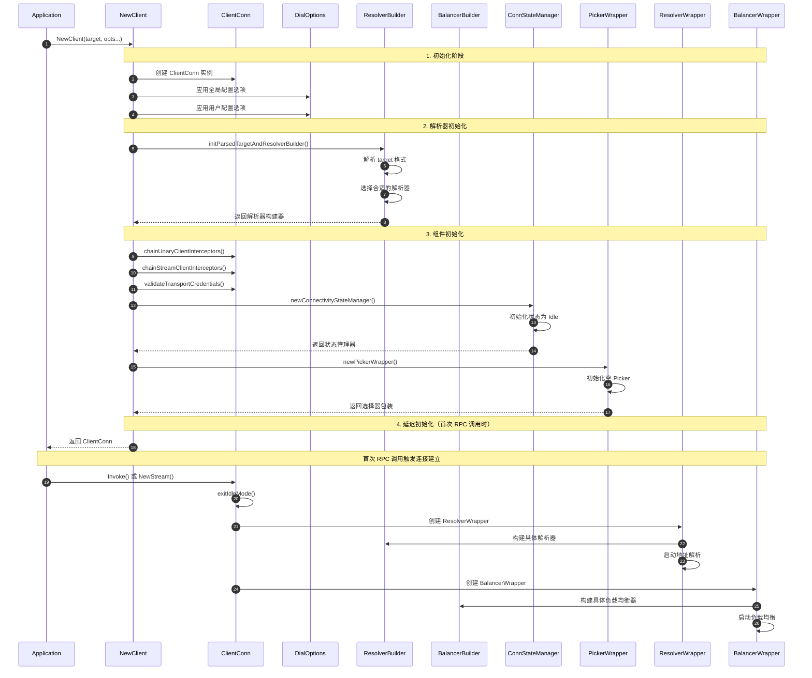
```mermaid
sequenceDiagram
    autonumber
    participant App as Application
    participant NC as NewClient
    participant CC as ClientConn
    participant DO as DialOptions
    participant RB as ResolverBuilder
    participant BB as BalancerBuilder
    participant CSM as ConnStateManager
    participant PW as PickerWrapper
    participant RW as ResolverWrapper
    participant BW as BalancerWrapper

    App->>NC: NewClient(target, opts...)
    
    Note over NC,BW: 1. 初始化阶段
    NC->>CC: 创建 ClientConn 实例
    NC->>DO: 应用全局配置选项
    NC->>DO: 应用用户配置选项
    
    Note over NC,BW: 2. 解析器初始化
    NC->>RB: initParsedTargetAndResolverBuilder()
    RB->>RB: 解析 target 格式
    RB->>RB: 选择合适的解析器
    RB-->>NC: 返回解析器构建器
    
    Note over NC,BW: 3. 组件初始化
    NC->>CC: chainUnaryClientInterceptors()
    NC->>CC: chainStreamClientInterceptors()
    NC->>CC: validateTransportCredentials()
    
    NC->>CSM: newConnectivityStateManager()
    CSM->>CSM: 初始化状态为 Idle
    CSM-->>NC: 返回状态管理器
    
    NC->>PW: newPickerWrapper()
    PW->>PW: 初始化空 Picker
    PW-->>NC: 返回选择器包装
    
    Note over NC,BW: 4. 延迟初始化（首次 RPC 调用时）
    NC-->>App: 返回 ClientConn
    
    Note over App,BW: 首次 RPC 调用触发连接建立
    App->>CC: Invoke() 或 NewStream()
    CC->>CC: exitIdleMode()
    CC->>RW: 创建 ResolverWrapper
    RW->>RB: 构建具体解析器
    RW->>RW: 启动地址解析
    CC->>BW: 创建 BalancerWrapper
    BW->>BB: 构建具体负载均衡器
    BW->>BW: 启动负载均衡
```

**时序说明：**

1. **初始化阶段（步骤1-4）：**
   - 创建 `ClientConn` 基础结构
   - 应用全局和用户指定的配置选项
   - 设置基本的上下文和取消机制

2. **解析器初始化（步骤5-8）：**
   - 解析目标地址格式（如 `dns:///example.com:80`）
   - 根据 scheme 选择对应的解析器构建器
   - 验证解析器的可用性

3. **组件初始化（步骤9-16）：**
   - 构建拦截器调用链
   - 验证传输层安全配置
   - 初始化连接状态管理器和选择器包装

4. **延迟激活（步骤17-24）：**
   - `NewClient` 返回时连接处于 `Idle` 状态
   - 首次 RPC 调用时才真正启动解析器和负载均衡器
   - 这种设计避免了不必要的资源消耗

### 1.2 服务发现与负载均衡启动

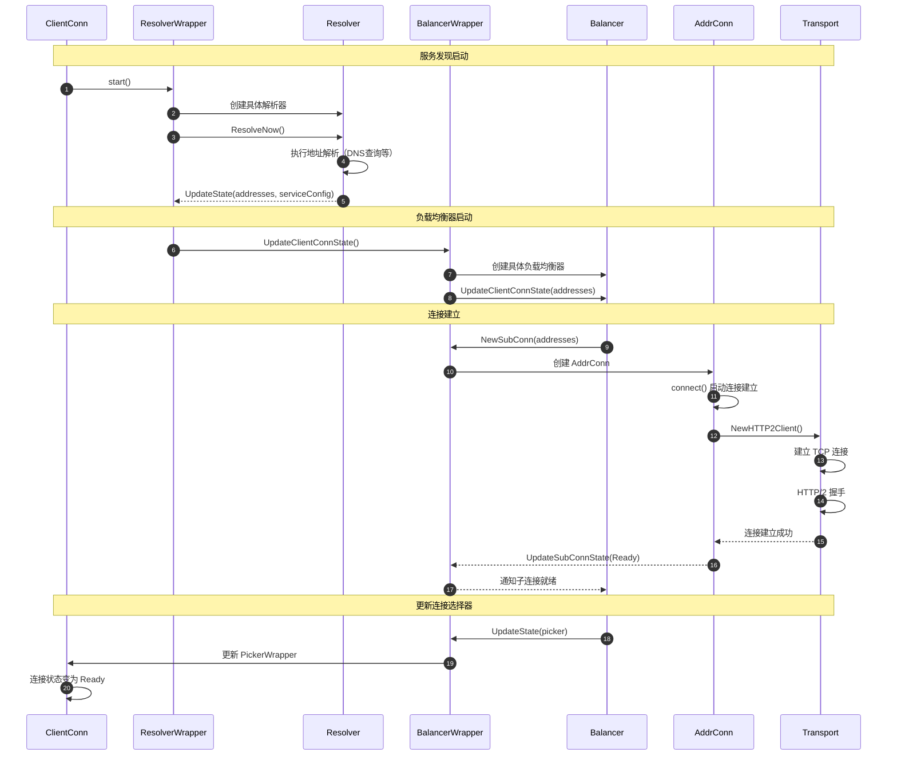
```mermaid
sequenceDiagram
    autonumber
    participant CC as ClientConn
    participant RW as ResolverWrapper
    participant R as Resolver
    participant BW as BalancerWrapper
    participant B as Balancer
    participant AC as AddrConn
    participant T as Transport

    Note over CC,T: 服务发现启动
    CC->>RW: start()
    RW->>R: 创建具体解析器
    RW->>R: ResolveNow()
    R->>R: 执行地址解析（DNS查询等）
    R-->>RW: UpdateState(addresses, serviceConfig)
    
    Note over CC,T: 负载均衡器启动
    RW->>BW: UpdateClientConnState()
    BW->>B: 创建具体负载均衡器
    BW->>B: UpdateClientConnState(addresses)
    
    Note over CC,T: 连接建立
    B->>BW: NewSubConn(addresses)
    BW->>AC: 创建 AddrConn
    AC->>AC: connect() 启动连接建立
    AC->>T: NewHTTP2Client()
    T->>T: 建立 TCP 连接
    T->>T: HTTP/2 握手
    T-->>AC: 连接建立成功
    AC-->>BW: UpdateSubConnState(Ready)
    BW-->>B: 通知子连接就绪
    
    Note over CC,T: 更新连接选择器
    B->>BW: UpdateState(picker)
    BW->>CC: 更新 PickerWrapper
    CC->>CC: 连接状态变为 Ready
```

**关键时间点：**

- **T0-T1：** 解析器启动和地址发现（通常 100-500ms）
- **T2-T3：** 负载均衡器初始化（< 10ms）
- **T4-T6：** TCP 连接建立（20-2000ms，取决于网络）
- **T7-T8：** HTTP/2 握手（10-100ms）
- **T9-T10：** 状态更新和选择器就绪（< 5ms）

---

## 2. RPC 调用时序图

### 2.1 一元 RPC 调用流程

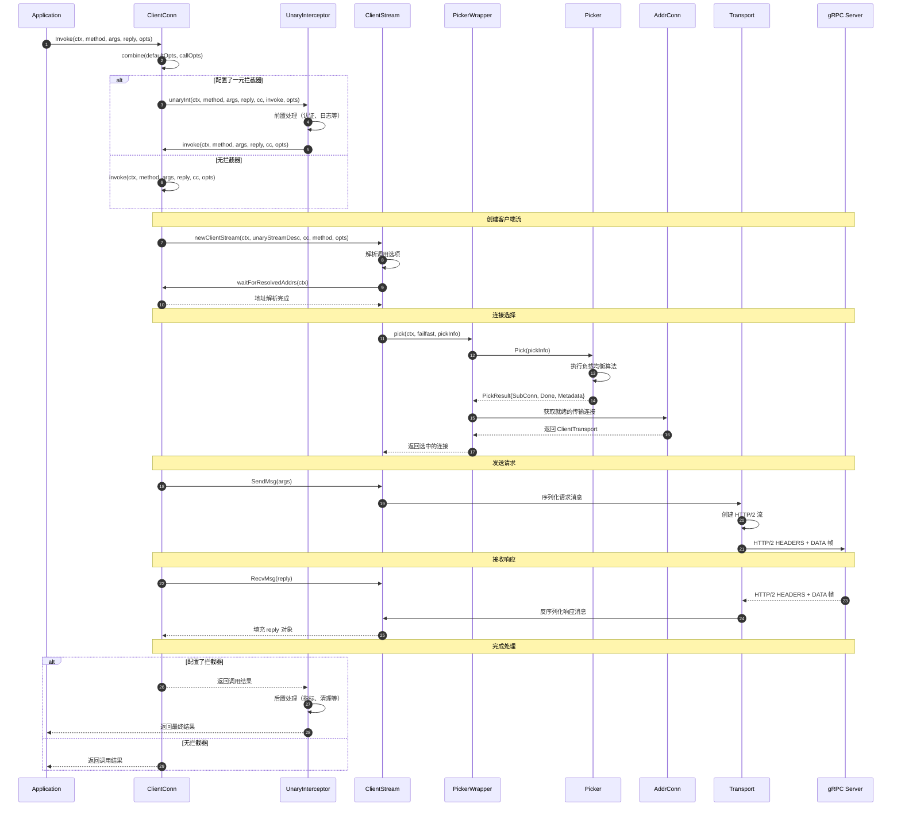
```mermaid
sequenceDiagram
    autonumber
    participant App as Application
    participant CC as ClientConn
    participant UI as UnaryInterceptor
    participant CS as ClientStream
    participant PW as PickerWrapper
    participant P as Picker
    participant AC as AddrConn
    participant T as Transport
    participant Server as gRPC Server

    App->>CC: Invoke(ctx, method, args, reply, opts)
    CC->>CC: combine(defaultOpts, callOpts)
    
    alt 配置了一元拦截器
        CC->>UI: unaryInt(ctx, method, args, reply, cc, invoke, opts)
        UI->>UI: 前置处理（认证、日志等）
        UI->>CC: invoke(ctx, method, args, reply, cc, opts)
    else 无拦截器
        CC->>CC: invoke(ctx, method, args, reply, cc, opts)
    end
    
    Note over CC,Server: 创建客户端流
    CC->>CS: newClientStream(ctx, unaryStreamDesc, cc, method, opts)
    CS->>CS: 解析调用选项
    CS->>CC: waitForResolvedAddrs(ctx)
    CC-->>CS: 地址解析完成
    
    Note over CC,Server: 连接选择
    CS->>PW: pick(ctx, failfast, pickInfo)
    PW->>P: Pick(pickInfo)
    P->>P: 执行负载均衡算法
    P-->>PW: PickResult{SubConn, Done, Metadata}
    PW->>AC: 获取就绪的传输连接
    AC-->>PW: 返回 ClientTransport
    PW-->>CS: 返回选中的连接
    
    Note over CC,Server: 发送请求
    CC->>CS: SendMsg(args)
    CS->>T: 序列化请求消息
    T->>T: 创建 HTTP/2 流
    T->>Server: HTTP/2 HEADERS + DATA 帧
    
    Note over CC,Server: 接收响应
    CC->>CS: RecvMsg(reply)
    Server-->>T: HTTP/2 HEADERS + DATA 帧
    T->>CS: 反序列化响应消息
    CS-->>CC: 填充 reply 对象
    
    Note over CC,Server: 完成处理
    alt 配置了拦截器
        CC-->>UI: 返回调用结果
        UI->>UI: 后置处理（指标、清理等）
        UI-->>App: 返回最终结果
    else 无拦截器
        CC-->>App: 返回调用结果
    end
```

**性能分析：**

- **连接选择：** < 1ms（无锁算法）
- **消息序列化：** 1-10ms（取决于消息大小）
- **网络传输：** 1-100ms（取决于网络延迟）
- **消息反序列化：** 1-10ms
- **总体延迟：** P95 通常在 10-200ms 之间

### 2.2 流式 RPC 调用流程

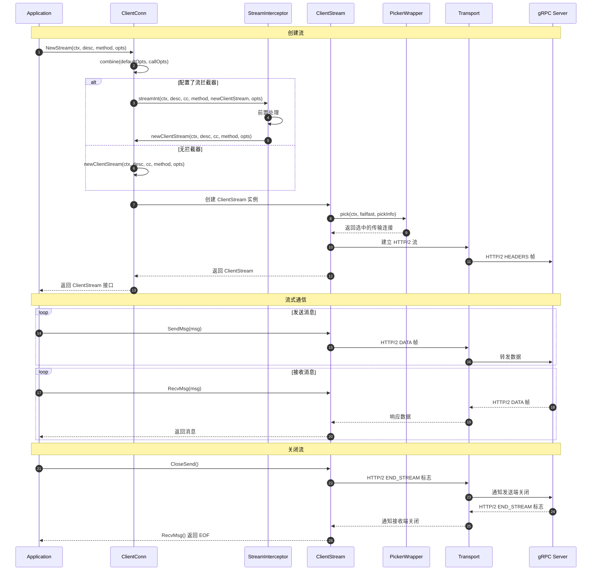
```mermaid
sequenceDiagram
    autonumber
    participant App as Application
    participant CC as ClientConn
    participant SI as StreamInterceptor
    participant CS as ClientStream
    participant PW as PickerWrapper
    participant T as Transport
    participant Server as gRPC Server

    Note over App,Server: 创建流
    App->>CC: NewStream(ctx, desc, method, opts)
    CC->>CC: combine(defaultOpts, callOpts)
    
    alt 配置了流拦截器
        CC->>SI: streamInt(ctx, desc, cc, method, newClientStream, opts)
        SI->>SI: 前置处理
        SI->>CC: newClientStream(ctx, desc, cc, method, opts)
    else 无拦截器
        CC->>CC: newClientStream(ctx, desc, cc, method, opts)
    end
    
    CC->>CS: 创建 ClientStream 实例
    CS->>PW: pick(ctx, failfast, pickInfo)
    PW-->>CS: 返回选中的传输连接
    CS->>T: 建立 HTTP/2 流
    T->>Server: HTTP/2 HEADERS 帧
    CS-->>CC: 返回 ClientStream
    CC-->>App: 返回 ClientStream 接口

    Note over App,Server: 流式通信
    loop 发送消息
        App->>CS: SendMsg(msg)
        CS->>T: HTTP/2 DATA 帧
        T->>Server: 转发数据
    end
    
    loop 接收消息
        App->>CS: RecvMsg(msg)
        Server-->>T: HTTP/2 DATA 帧
        T-->>CS: 响应数据
        CS-->>App: 返回消息
    end
    
    Note over App,Server: 关闭流
    App->>CS: CloseSend()
    CS->>T: HTTP/2 END_STREAM 标志
    T->>Server: 通知发送端关闭
    
    Server-->>T: HTTP/2 END_STREAM 标志
    T-->>CS: 通知接收端关闭
    CS-->>App: RecvMsg() 返回 EOF
```

**流控机制：**

- HTTP/2 流级别窗口控制发送速率
- 连接级别窗口控制总体流量
- 背压机制防止内存溢出
- 动态窗口调整优化吞吐量

---

## 3. 连接状态管理时序图

### 3.1 连接状态变化流程

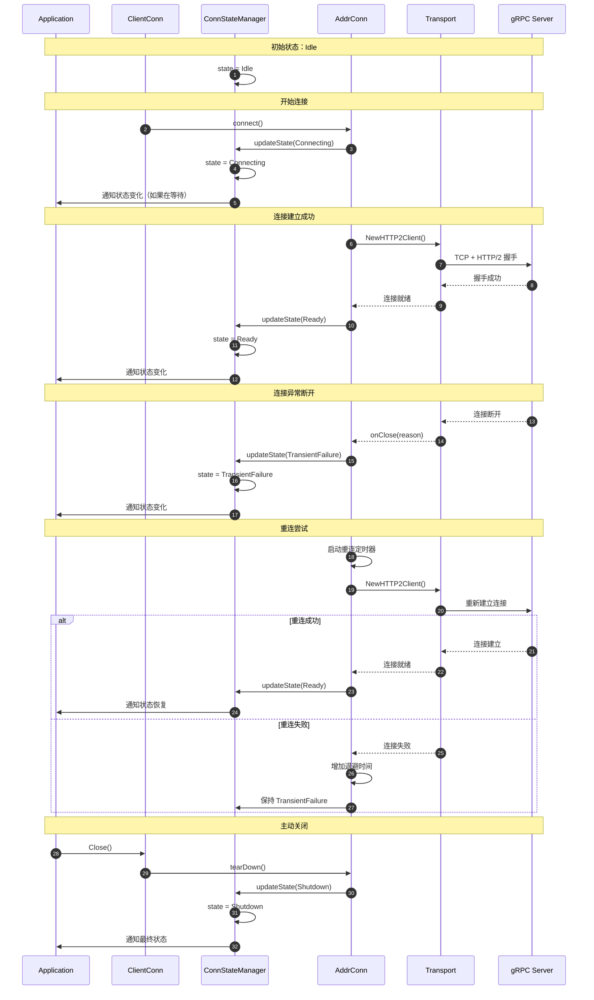
```mermaid
sequenceDiagram
    autonumber
    participant App as Application
    participant CC as ClientConn
    participant CSM as ConnStateManager
    participant AC as AddrConn
    participant T as Transport
    participant Server as gRPC Server

    Note over App,Server: 初始状态：Idle
    CSM->>CSM: state = Idle
    
    Note over App,Server: 开始连接
    CC->>AC: connect()
    AC->>CSM: updateState(Connecting)
    CSM->>CSM: state = Connecting
    CSM->>App: 通知状态变化（如果在等待）
    
    Note over App,Server: 连接建立成功
    AC->>T: NewHTTP2Client()
    T->>Server: TCP + HTTP/2 握手
    Server-->>T: 握手成功
    T-->>AC: 连接就绪
    AC->>CSM: updateState(Ready)
    CSM->>CSM: state = Ready
    CSM->>App: 通知状态变化
    
    Note over App,Server: 连接异常断开
    Server-->>T: 连接断开
    T-->>AC: onClose(reason)
    AC->>CSM: updateState(TransientFailure)
    CSM->>CSM: state = TransientFailure
    CSM->>App: 通知状态变化
    
    Note over App,Server: 重连尝试
    AC->>AC: 启动重连定时器
    AC->>T: NewHTTP2Client()
    T->>Server: 重新建立连接
    
    alt 重连成功
        Server-->>T: 连接建立
        T-->>AC: 连接就绪
        AC->>CSM: updateState(Ready)
        CSM->>App: 通知状态恢复
    else 重连失败
        T-->>AC: 连接失败
        AC->>AC: 增加退避时间
        AC->>CSM: 保持 TransientFailure
    end
    
    Note over App,Server: 主动关闭
    App->>CC: Close()
    CC->>AC: tearDown()
    AC->>CSM: updateState(Shutdown)
    CSM->>CSM: state = Shutdown
    CSM->>App: 通知最终状态
```

**状态监控示例：**

```go
// 应用层监控连接状态
go func() {
    for {
        state := conn.GetState()
        log.Printf("连接状态: %v", state)
        
        if state == connectivity.Shutdown {
            break
        }
        
        // 等待状态变化
        conn.WaitForStateChange(context.Background(), state)
    }
}()
```

### 3.2 空闲管理时序图

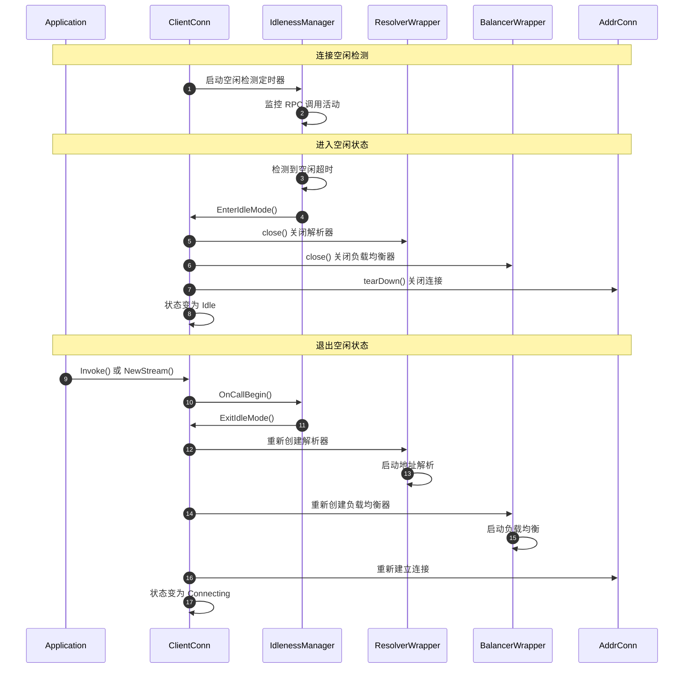
```mermaid
sequenceDiagram
    autonumber
    participant App as Application
    participant CC as ClientConn
    participant IM as IdlenessManager
    participant RW as ResolverWrapper
    participant BW as BalancerWrapper
    participant AC as AddrConn

    Note over App,AC: 连接空闲检测
    CC->>IM: 启动空闲检测定时器
    IM->>IM: 监控 RPC 调用活动
    
    Note over App,AC: 进入空闲状态
    IM->>IM: 检测到空闲超时
    IM->>CC: EnterIdleMode()
    CC->>RW: close() 关闭解析器
    CC->>BW: close() 关闭负载均衡器
    CC->>AC: tearDown() 关闭连接
    CC->>CC: 状态变为 Idle
    
    Note over App,AC: 退出空闲状态
    App->>CC: Invoke() 或 NewStream()
    CC->>IM: OnCallBegin()
    IM->>CC: ExitIdleMode()
    CC->>RW: 重新创建解析器
    RW->>RW: 启动地址解析
    CC->>BW: 重新创建负载均衡器
    BW->>BW: 启动负载均衡
    CC->>AC: 重新建立连接
    CC->>CC: 状态变为 Connecting
```

**空闲管理配置：**

```go
conn, err := grpc.NewClient(target,
    grpc.WithIdleTimeout(30*time.Minute), // 30分钟无活动进入空闲
)
```

---

## 4. 故障处理时序图

### 4.1 连接失败重试流程

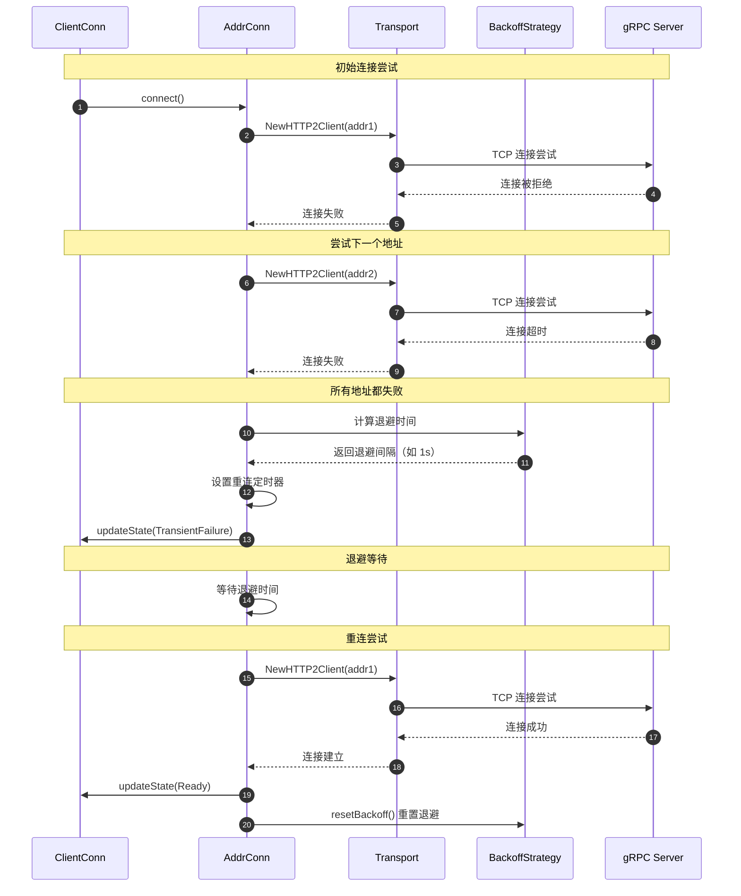
```mermaid
sequenceDiagram
    autonumber
    participant CC as ClientConn
    participant AC as AddrConn
    participant T as Transport
    participant Backoff as BackoffStrategy
    participant Server as gRPC Server

    Note over CC,Server: 初始连接尝试
    CC->>AC: connect()
    AC->>T: NewHTTP2Client(addr1)
    T->>Server: TCP 连接尝试
    Server-->>T: 连接被拒绝
    T-->>AC: 连接失败
    
    Note over CC,Server: 尝试下一个地址
    AC->>T: NewHTTP2Client(addr2)
    T->>Server: TCP 连接尝试
    Server-->>T: 连接超时
    T-->>AC: 连接失败
    
    Note over CC,Server: 所有地址都失败
    AC->>Backoff: 计算退避时间
    Backoff-->>AC: 返回退避间隔（如 1s）
    AC->>AC: 设置重连定时器
    AC->>CC: updateState(TransientFailure)
    
    Note over CC,Server: 退避等待
    AC->>AC: 等待退避时间
    
    Note over CC,Server: 重连尝试
    AC->>T: NewHTTP2Client(addr1)
    T->>Server: TCP 连接尝试
    Server-->>T: 连接成功
    T-->>AC: 连接建立
    AC->>CC: updateState(Ready)
    AC->>Backoff: resetBackoff() 重置退避
```

**退避策略：**

- 初始间隔：1 秒
- 最大间隔：120 秒
- 退避倍数：1.6
- 随机抖动：±20%

### 4.2 请求失败处理流程

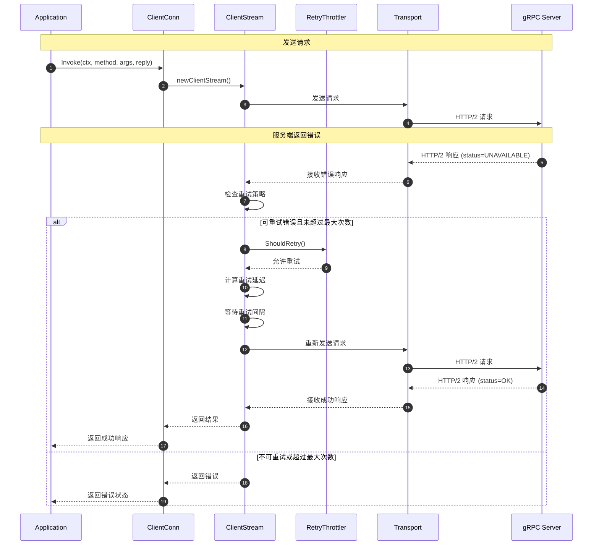
```mermaid
sequenceDiagram
    autonumber
    participant App as Application
    participant CC as ClientConn
    participant CS as ClientStream
    participant RT as RetryThrottler
    participant T as Transport
    participant Server as gRPC Server

    Note over App,Server: 发送请求
    App->>CC: Invoke(ctx, method, args, reply)
    CC->>CS: newClientStream()
    CS->>T: 发送请求
    T->>Server: HTTP/2 请求
    
    Note over App,Server: 服务端返回错误
    Server-->>T: HTTP/2 响应 (status=UNAVAILABLE)
    T-->>CS: 接收错误响应
    CS->>CS: 检查重试策略
    
    alt 可重试错误且未超过最大次数
        CS->>RT: ShouldRetry()
        RT-->>CS: 允许重试
        CS->>CS: 计算重试延迟
        CS->>CS: 等待重试间隔
        CS->>T: 重新发送请求
        T->>Server: HTTP/2 请求
        Server-->>T: HTTP/2 响应 (status=OK)
        T-->>CS: 接收成功响应
        CS-->>CC: 返回结果
        CC-->>App: 返回成功响应
    else 不可重试或超过最大次数
        CS-->>CC: 返回错误
        CC-->>App: 返回错误状态
    end
```

**重试配置示例：**

```json
{
  "methodConfig": [{
    "name": [{"service": "example.Service"}],
    "retryPolicy": {
      "maxAttempts": 3,
      "initialBackoff": "0.1s",
      "maxBackoff": "1s",
      "backoffMultiplier": 2,
      "retryableStatusCodes": ["UNAVAILABLE", "DEADLINE_EXCEEDED"]
    }
  }]
}
```

---

## 5. 负载均衡时序图

### 5.1 Round Robin 负载均衡

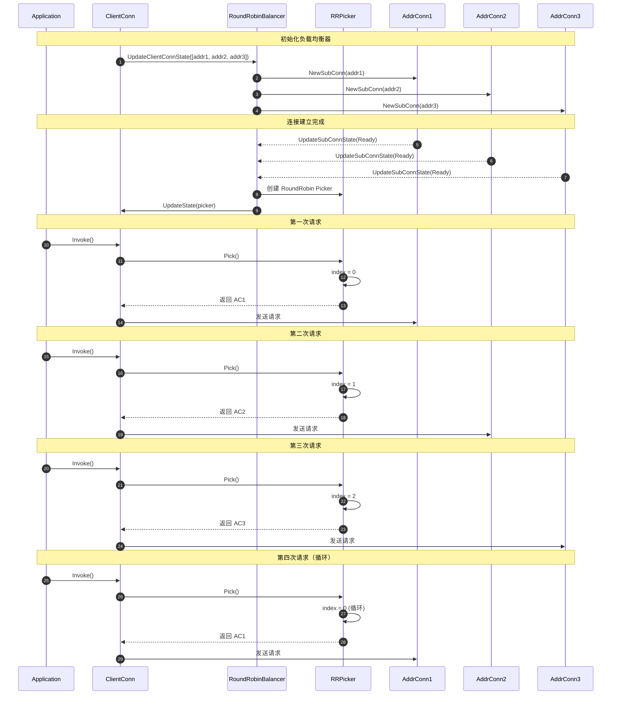
```mermaid
sequenceDiagram
    autonumber
    participant App as Application
    participant CC as ClientConn
    participant RR as RoundRobinBalancer
    participant P as RRPicker
    participant AC1 as AddrConn1
    participant AC2 as AddrConn2
    participant AC3 as AddrConn3

    Note over App,AC3: 初始化负载均衡器
    CC->>RR: UpdateClientConnState([addr1, addr2, addr3])
    RR->>AC1: NewSubConn(addr1)
    RR->>AC2: NewSubConn(addr2)
    RR->>AC3: NewSubConn(addr3)
    
    Note over App,AC3: 连接建立完成
    AC1-->>RR: UpdateSubConnState(Ready)
    AC2-->>RR: UpdateSubConnState(Ready)
    AC3-->>RR: UpdateSubConnState(Ready)
    RR->>P: 创建 RoundRobin Picker
    RR->>CC: UpdateState(picker)
    
    Note over App,AC3: 第一次请求
    App->>CC: Invoke()
    CC->>P: Pick()
    P->>P: index = 0
    P-->>CC: 返回 AC1
    CC->>AC1: 发送请求
    
    Note over App,AC3: 第二次请求
    App->>CC: Invoke()
    CC->>P: Pick()
    P->>P: index = 1
    P-->>CC: 返回 AC2
    CC->>AC2: 发送请求
    
    Note over App,AC3: 第三次请求
    App->>CC: Invoke()
    CC->>P: Pick()
    P->>P: index = 2
    P-->>CC: 返回 AC3
    CC->>AC3: 发送请求
    
    Note over App,AC3: 第四次请求（循环）
    App->>CC: Invoke()
    CC->>P: Pick()
    P->>P: index = 0 (循环)
    P-->>CC: 返回 AC1
    CC->>AC1: 发送请求
```

### 5.2 连接故障时的负载均衡调整

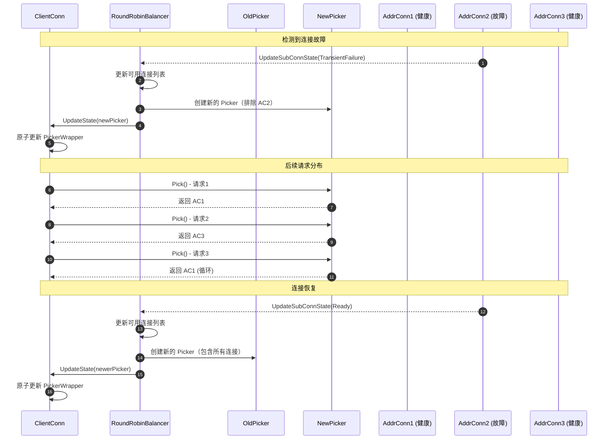
```mermaid
sequenceDiagram
    autonumber
    participant CC as ClientConn
    participant RR as RoundRobinBalancer
    participant P1 as OldPicker
    participant P2 as NewPicker
    participant AC1 as AddrConn1 (健康)
    participant AC2 as AddrConn2 (故障)
    participant AC3 as AddrConn3 (健康)

    Note over CC,AC3: 检测到连接故障
    AC2-->>RR: UpdateSubConnState(TransientFailure)
    RR->>RR: 更新可用连接列表
    RR->>P2: 创建新的 Picker（排除 AC2）
    RR->>CC: UpdateState(newPicker)
    CC->>CC: 原子更新 PickerWrapper
    
    Note over CC,AC3: 后续请求分布
    CC->>P2: Pick() - 请求1
    P2-->>CC: 返回 AC1
    CC->>P2: Pick() - 请求2
    P2-->>CC: 返回 AC3
    CC->>P2: Pick() - 请求3
    P2-->>CC: 返回 AC1 (循环)
    
    Note over CC,AC3: 连接恢复
    AC2-->>RR: UpdateSubConnState(Ready)
    RR->>RR: 更新可用连接列表
    RR->>P1: 创建新的 Picker（包含所有连接）
    RR->>CC: UpdateState(newerPicker)
    CC->>CC: 原子更新 PickerWrapper
```

---

## 6. 性能分析与优化

### 关键性能指标

1. **连接建立时间：**
   - DNS 解析：50-200ms
   - TCP 握手：1-100ms（取决于 RTT）
   - TLS 握手：2-200ms（取决于证书链）
   - HTTP/2 握手：1-10ms

2. **RPC 调用延迟：**
   - 连接选择：< 1ms（无锁算法）
   - 序列化：1-10ms（取决于消息大小）
   - 网络传输：RTT + 处理时间
   - 反序列化：1-10ms

3. **吞吐量优化：**
   - HTTP/2 多路复用：单连接支持数百并发流
   - 连接池：减少连接建立开销
   - 消息压缩：减少网络传输量
   - 批量操作：减少网络往返次数

### 并发安全保证

1. **无锁数据结构：**
   - `atomic.Value` 存储 Picker，避免读锁竞争
   - 原子操作更新连接状态
   - 无锁连接选择算法

2. **细粒度锁：**
   - 连接状态使用独立的互斥锁
   - 地址连接使用独立的状态锁
   - 避免全局锁竞争

3. **异步处理：**
   - 状态变化通过 channel 异步通知
   - 连接建立在独立 goroutine 中进行
   - 避免阻塞主调用路径

通过这些详细的时序图和说明，可以深入理解 gRPC-Go 客户端连接模块的工作机制，为性能优化和故障诊断提供重要参考。

---
