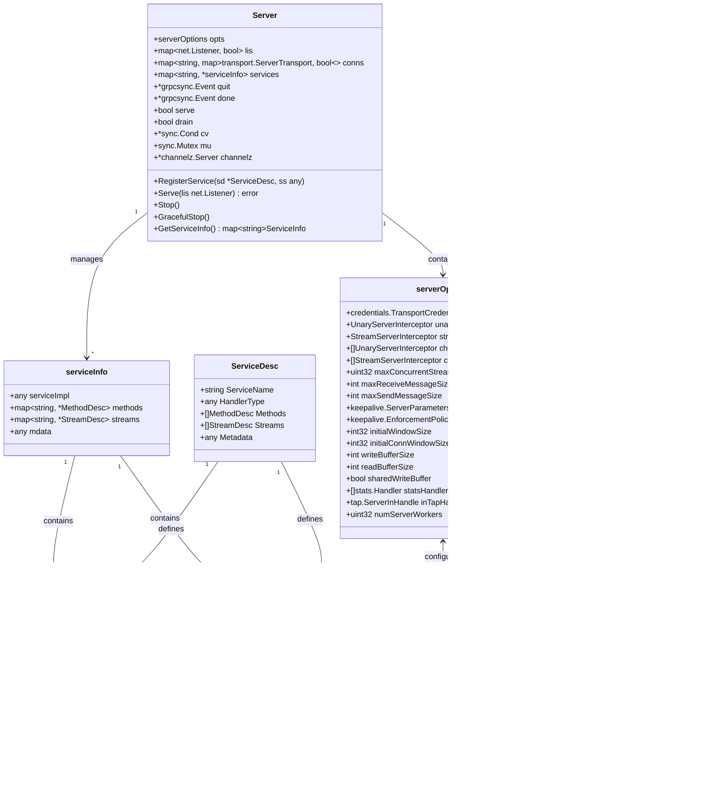

# grpc-go-02-服务端

## 模块概览

## 模块职责与边界

### 核心职责
服务端模块（Server）是 gRPC-Go 服务端的核心组件，负责接收和处理来自客户端的 RPC 请求。该模块管理网络监听、连接处理、服务注册、请求路由、并发控制等关键功能，为应用层提供高性能、可扩展的 RPC 服务能力。

### 输入输出
- **输入：**
  - 网络监听器（net.Listener）
  - 服务实现注册（ServiceDesc + Implementation）
  - 服务器配置选项（ServerOption）
  - 客户端 RPC 请求（HTTP/2 流）

- **输出：**
  - RPC 响应结果
  - 服务状态信息
  - 连接管理事件
  - 错误状态码

### 上下游依赖
- **上游依赖：** 应用层服务实现代码
- **下游依赖：**
  - Transport（传输层模块）
  - Credentials（认证凭证模块）
  - Encoding（编码压缩模块）
  - Interceptor（拦截器模块）
  - Status（状态码模块）
  - Metadata（元数据模块）

### 生命周期
1. **创建阶段：** 通过 `NewServer()` 创建服务器实例
2. **注册阶段：** 使用 `RegisterService()` 注册服务实现
3. **启动阶段：** 调用 `Serve()` 开始接收请求
4. **运行期：** 处理并发 RPC 请求和连接管理
5. **关闭阶段：** `Stop()` 或 `GracefulStop()` 关闭服务器

## 模块架构图


**架构说明：**

1. **服务器核心层：**
   - `Server` 作为整个服务端的控制中心
   - `ServerOptions` 管理服务器配置参数
   - `ServiceInfo` 存储已注册服务的元信息
   - `MethodHandler` 和 `StreamHandler` 处理具体的 RPC 调用

2. **连接管理层：**
   - `Listener` 监听网络端口，接受客户端连接
   - `ServerTransport` 管理单个客户端连接的传输层
   - `ServerStream` 表示单个 RPC 调用的流
   - 连接管理器负责连接的生命周期管理

3. **请求处理层：**
   - `Request Router` 根据方法名路由请求到对应处理器
   - `Unary Processor` 处理一元 RPC 调用
   - `Stream Processor` 处理流式 RPC 调用
   - `Worker Pool` 提供并发处理能力

4. **服务注册表：**
   - 维护所有已注册服务的信息
   - 存储方法和流的描述符信息
   - 关联服务接口与具体实现

5. **中间件栈：**
   - 拦截器提供横切关注点处理
   - 支持认证、授权、日志、监控等功能
   - 可配置的中间件链

**边界条件：**

- 最大并发连接数可配置（默认无限制）
- 最大消息大小限制（接收4MB，发送无限制）
- 连接超时时间（默认120秒）
- HTTP/2 流控窗口大小可配置

**异常处理：**

- 网络连接异常自动清理资源
- 方法未找到返回 `Unimplemented` 状态码
- 请求解析失败返回相应错误码
- 支持优雅关闭和强制关闭

**性能要点：**

- HTTP/2 多路复用支持单连接并发请求
- Worker Pool 模式提高并发处理能力
- 连接池复用减少资源消耗
- 零拷贝和内存池优化

**版本兼容：**

- 支持 HTTP/2 和 HTTP/1.1 协议
- 向后兼容旧版本客户端
- 渐进式功能升级

## 核心算法与流程

### 服务器启动流程

```go
func NewServer(opt ...ServerOption) *Server {
    // 1. 初始化默认配置
    opts := defaultServerOptions
    
    // 2. 应用全局配置选项
    for _, o := range globalServerOptions {
        o.apply(&opts)
    }
    
    // 3. 应用用户配置选项
    for _, o := range opt {
        o.apply(&opts)
    }
    
    // 4. 创建服务器实例
    s := &Server{
        lis:      make(map[net.Listener]bool),
        opts:     opts,
        conns:    make(map[string]map[transport.ServerTransport]bool),
        services: make(map[string]*serviceInfo),
        quit:     grpcsync.NewEvent(),
        done:     grpcsync.NewEvent(),
        channelz: channelz.RegisterServer(""),
    }
    
    // 5. 构建拦截器链
    chainUnaryServerInterceptors(s)
    chainStreamServerInterceptors(s)
    
    // 6. 初始化工作池（如果配置了）
    if s.opts.numServerWorkers > 0 {
        s.initServerWorkers()
    }
    
    return s
}
```

**流程说明：**

1. **配置初始化：** 合并默认、全局和用户配置
2. **实例创建：** 初始化服务器核心数据结构
3. **拦截器设置：** 构建一元和流式拦截器链
4. **资源初始化：** 创建连接管理、服务注册等组件
5. **工作池启动：** 可选的并发处理工作池

### 服务注册流程

```go
func (s *Server) RegisterService(sd *ServiceDesc, ss any) {
    // 1. 验证服务实现类型
    if ss != nil {
        ht := reflect.TypeOf(sd.HandlerType).Elem()
        st := reflect.TypeOf(ss)
        if !st.Implements(ht) {
            logger.Fatalf("handler type mismatch")
        }
    }
    
    // 2. 注册服务信息
    s.register(sd, ss)
}

func (s *Server) register(sd *ServiceDesc, ss any) {
    s.mu.Lock()
    defer s.mu.Unlock()
    
    // 3. 检查重复注册
    if _, ok := s.services[sd.ServiceName]; ok {
        logger.Fatalf("service %s already registered", sd.ServiceName)
    }
    
    // 4. 构建服务信息
    info := &serviceInfo{
        serviceImpl: ss,
        methods:     make(map[string]*MethodDesc),
        streams:     make(map[string]*StreamDesc),
        mdata:       sd.Metadata,
    }
    
    // 5. 注册一元方法
    for i := range sd.Methods {
        d := &sd.Methods[i]
        info.methods[d.MethodName] = d
    }
    
    // 6. 注册流式方法
    for i := range sd.Streams {
        d := &sd.Streams[i]
        info.streams[d.StreamName] = d
    }
    
    s.services[sd.ServiceName] = info
}
```

**注册特点：**

- 类型安全检查确保实现匹配接口
- 防重复注册保证服务唯一性
- 支持一元和流式方法混合注册
- 元数据存储支持服务发现

### 请求处理流程

```go
func (s *Server) handleStream(t transport.ServerTransport, stream *transport.ServerStream) {
    // 1. 解析方法名
    sm := stream.Method()
    if sm != "" && sm[0] == '/' {
        sm = sm[1:]
    }
    pos := strings.LastIndex(sm, "/")
    if pos == -1 {
        // 方法名格式错误
        stream.WriteStatus(status.New(codes.Unimplemented, "malformed method name"))
        return
    }
    service := sm[:pos]
    method := sm[pos+1:]
    
    // 2. 查找服务和方法
    srv, knownService := s.services[service]
    if !knownService {
        stream.WriteStatus(status.New(codes.Unimplemented, "unknown service"))
        return
    }
    
    // 3. 处理一元方法
    if md, ok := srv.methods[method]; ok {
        s.processUnaryRPC(t, stream, srv, md)
        return
    }
    
    // 4. 处理流式方法
    if sd, ok := srv.streams[method]; ok {
        s.processStreamingRPC(t, stream, srv, sd)
        return
    }
    
    // 5. 方法未找到
    stream.WriteStatus(status.New(codes.Unimplemented, "unknown method"))
}
```

**路由算法：**

- 方法名格式：`/package.service/method`
- 两级查找：先查服务，再查方法
- 支持一元和流式方法区分处理
- 未知服务或方法返回 `Unimplemented`

### 并发处理机制

```go
func (s *Server) processUnaryRPC(t transport.ServerTransport, stream *transport.ServerStream, info *serviceInfo, md *MethodDesc) {
    // 1. 增加活跃处理器计数
    s.handlersWG.Add(1)
    defer s.handlersWG.Done()
    
    // 2. 创建处理上下文
    ctx := stream.Context()
    ctx = contextWithServer(ctx, s)
    
    // 3. 应用拦截器链
    if s.opts.unaryInt != nil {
        reply, err := s.opts.unaryInt(ctx, req, info, md.Handler)
    } else {
        reply, err := md.Handler(info.serviceImpl, ctx, df, s.opts.unaryInt)
    }
    
    // 4. 发送响应
    if err := stream.SendMsg(reply); err != nil {
        return
    }
    stream.WriteStatus(statusOK)
}
```

**并发特性：**

- 每个请求在独立 goroutine 中处理
- WaitGroup 跟踪活跃请求数量
- 支持优雅关闭等待请求完成
- 可配置最大并发流数量

## 关键数据结构

### Server 结构体

```go
type Server struct {
    opts serverOptions // 服务器配置选项
    
    // 连接管理
    mu    sync.Mutex                                    // 保护以下字段
    lis   map[net.Listener]bool                         // 活跃监听器
    conns map[string]map[transport.ServerTransport]bool // 活跃连接
    serve bool                                          // 是否正在服务
    drain bool                                          // 是否正在排空
    cv    *sync.Cond                                    // 条件变量，用于优雅关闭
    
    // 服务注册
    services map[string]*serviceInfo // 已注册服务
    
    // 生命周期管理
    quit               *grpcsync.Event // 退出信号
    done               *grpcsync.Event // 完成信号
    serveWG            sync.WaitGroup  // Serve goroutine 计数
    handlersWG         sync.WaitGroup  // 处理器 goroutine 计数
    
    // 调试和监控
    channelz *channelz.Server // 调试信息
    events   traceEventLog    // 事件日志
    
    // 工作池
    serverWorkerChannel      chan func() // 工作任务通道
    serverWorkerChannelClose func()      // 工作池关闭函数
}
```

### 服务信息结构

```go
type serviceInfo struct {
    serviceImpl any                     // 服务实现实例
    methods     map[string]*MethodDesc  // 一元方法映射
    streams     map[string]*StreamDesc  // 流式方法映射
    mdata       any                     // 服务元数据
}

type MethodDesc struct {
    MethodName string        // 方法名
    Handler    MethodHandler // 方法处理器
}

type StreamDesc struct {
    StreamName    string        // 流名称
    Handler       StreamHandler // 流处理器
    ServerStreams bool          // 是否为服务端流
    ClientStreams bool          // 是否为客户端流
}
```

### 服务器选项结构

```go
type serverOptions struct {
    // 拦截器配置
    unaryInt        UnaryServerInterceptor    // 一元拦截器
    streamInt       StreamServerInterceptor   // 流拦截器
    chainUnaryInts  []UnaryServerInterceptor  // 一元拦截器链
    chainStreamInts []StreamServerInterceptor // 流拦截器链
    
    // 传输配置
    creds                 credentials.TransportCredentials // 传输凭证
    maxConcurrentStreams  uint32                          // 最大并发流数
    maxReceiveMessageSize int                             // 最大接收消息大小
    maxSendMessageSize    int                             // 最大发送消息大小
    
    // 连接配置
    keepaliveParams       keepalive.ServerParameters  // 保活参数
    keepalivePolicy       keepalive.EnforcementPolicy // 保活策略
    initialWindowSize     int32                       // 初始窗口大小
    initialConnWindowSize int32                       // 初始连接窗口大小
    connectionTimeout     time.Duration               // 连接超时
    
    // 性能配置
    writeBufferSize   int              // 写缓冲区大小
    readBufferSize    int              // 读缓冲区大小
    sharedWriteBuffer bool             // 共享写缓冲区
    numServerWorkers  uint32           // 工作池大小
    bufferPool        mem.BufferPool   // 内存缓冲池
    
    // 其他配置
    statsHandlers []stats.Handler // 统计处理器
    binaryLogger  binarylog.Logger // 二进制日志
    inTapHandle   tap.ServerInHandle // TAP 处理器
}
```

## 配置与可观测性

### 主要配置项
- `MaxConcurrentStreams`：最大并发流数（默认无限制）
- `MaxReceiveMessageSize`：最大接收消息大小（默认4MB）
- `MaxSendMessageSize`：最大发送消息大小（默认无限制）
- `InitialWindowSize`：HTTP/2 流初始窗口大小（默认64KB）
- `InitialConnWindowSize`：HTTP/2 连接初始窗口大小（默认16KB）
- `ConnectionTimeout`：连接超时时间（默认120秒）
- `KeepaliveParams`：连接保活参数
- `NumServerWorkers`：工作池大小（默认0，表示不使用工作池）

### 关键指标
- 活跃连接数：当前处理的客户端连接数量
- 并发请求数：正在处理的 RPC 请求数量
- 请求处理延迟：从接收到响应的时间分布
- 吞吐量：每秒处理的请求数和数据量
- 错误率：按状态码分类的失败率
- 资源使用率：CPU、内存、网络带宽使用情况

### 调试接口
- Channelz 调试信息：详细的服务器和连接统计
- 事件日志：关键操作的时间线记录
- 统计处理器：可插拔的指标收集机制
- 二进制日志：请求响应的完整记录

### 监控集成
- 支持 OpenTelemetry 标准
- 内置 Prometheus 指标导出
- 集成分布式链路追踪
- 自定义统计处理器接口

---

## API接口

## API 概览

服务端模块提供了完整的 gRPC 服务器生命周期管理 API，包括服务器创建、服务注册、启动监听、优雅关闭等核心功能。所有 API 都经过精心设计，确保线程安全和高性能。

## 核心 API 列表

### 服务器管理 API
- `NewServer()` - 创建新的 gRPC 服务器实例
- `RegisterService()` - 注册 gRPC 服务
- `GetServiceInfo()` - 获取已注册服务信息
- `Serve()` - 启动服务器并开始监听
- `Stop()` - 立即停止服务器
- `GracefulStop()` - 优雅停止服务器

### 配置选项 API
- `WriteBufferSize()` - 设置写缓冲区大小
- `ReadBufferSize()` - 设置读缓冲区大小
- `MaxConcurrentStreams()` - 设置最大并发流数量
- `Creds()` - 设置传输凭证
- `UnaryInterceptor()` - 设置一元拦截器
- `StreamInterceptor()` - 设置流拦截器

---

## API 详细规格

### 1. NewServer

#### 基本信息
- **名称：** `NewServer`
- **签名：** `func NewServer(opt ...ServerOption) *Server`
- **功能：** 创建新的 gRPC 服务器实例
- **幂等性：** 否，每次调用创建新实例

#### 请求参数

```go
// ServerOption 服务器配置选项接口
type ServerOption interface {
    apply(*serverOptions)
}

// 配置选项结构（内部使用）
type serverOptions struct {
    creds                 credentials.TransportCredentials
    unaryInt              UnaryServerInterceptor
    streamInt             StreamServerInterceptor
    chainUnaryInts        []UnaryServerInterceptor
    chainStreamInts       []StreamServerInterceptor
    maxConcurrentStreams  uint32
    maxReceiveMessageSize int
    maxSendMessageSize    int
    keepaliveParams       keepalive.ServerParameters
    keepalivePolicy       keepalive.EnforcementPolicy
    initialWindowSize     int32
    initialConnWindowSize int32
    writeBufferSize       int
    readBufferSize        int
    sharedWriteBuffer     bool
    statsHandlers         []stats.Handler
    inTapHandle           tap.ServerInHandle
    numServerWorkers      uint32
}
```

**参数说明表**

| 参数 | 类型 | 必填 | 默认值 | 说明 |
|------|------|:----:|--------|------|
| opt | ...ServerOption | 否 | 默认配置 | 服务器配置选项 |

#### 响应结果

```go
// Server gRPC 服务器实例
type Server struct {
    opts     serverOptions                    // 服务器配置选项
    lis      map[net.Listener]bool           // 监听器映射
    conns    map[string]map[transport.ServerTransport]bool // 连接映射
    services map[string]*serviceInfo         // 服务信息映射
    quit     *grpcsync.Event                 // 退出事件
    done     *grpcsync.Event                 // 完成事件
    channelz *channelz.Server                // Channelz 服务器
}
```

#### 入口函数实现

```go
func NewServer(opt ...ServerOption) *Server {
    // 1. 初始化默认配置
    opts := defaultServerOptions
    
    // 2. 应用全局配置选项
    for _, o := range globalServerOptions {
        o.apply(&opts)
    }
    
    // 3. 应用用户配置选项
    for _, o := range opt {
        o.apply(&opts)
    }
    
    // 4. 创建服务器实例
    s := &Server{
        lis:      make(map[net.Listener]bool),
        opts:     opts,
        conns:    make(map[string]map[transport.ServerTransport]bool),
        services: make(map[string]*serviceInfo),
        quit:     grpcsync.NewEvent(),
        done:     grpcsync.NewEvent(),
        channelz: channelz.RegisterServer(""),
    }
    
    // 5. 构建拦截器链
    chainUnaryServerInterceptors(s)
    chainStreamServerInterceptors(s)
    
    // 6. 初始化条件变量
    s.cv = sync.NewCond(&s.mu)
    
    // 7. 初始化工作池（如果配置了）
    if s.opts.numServerWorkers > 0 {
        s.initServerWorkers()
    }
    
    return s
}
```

#### 调用链分析

```go
// 应用层调用
func main() {
    // 创建服务器实例
    server := grpc.NewServer(
        grpc.MaxConcurrentStreams(100),
        grpc.KeepaliveParams(keepalive.ServerParameters{
            Time:    30 * time.Second,
            Timeout: 5 * time.Second,
        }),
    )
    
    // 注册服务
    pb.RegisterGreeterServer(server, &greeterService{})
    
    // 启动监听
    lis, _ := net.Listen("tcp", ":50051")
    server.Serve(lis)
}
```

#### 时序图


#### 边界与异常

- **配置冲突：** 相同类型的配置选项后者覆盖前者
- **内存分配：** 创建过程中的内存分配失败会导致 panic
- **并发安全：** 创建后的服务器实例是线程安全的
- **资源清理：** 服务器实例需要通过 Stop() 或 GracefulStop() 正确关闭

#### 实践建议

- **配置优化：** 根据业务需求合理设置并发流数量和缓冲区大小
- **拦截器使用：** 优先使用链式拦截器以支持多个中间件
- **资源管理：** 确保服务器实例在程序结束时正确关闭
- **监控集成：** 使用 stats.Handler 集成监控和指标收集

---

### 2. RegisterService

#### 基本信息
- **名称：** `RegisterService`
- **签名：** `func (s *Server) RegisterService(sd *ServiceDesc, ss any)`
- **功能：** 注册 gRPC 服务及其实现
- **幂等性：** 否，重复注册同名服务会导致 panic

#### 请求参数

```go
// ServiceDesc 服务描述结构
type ServiceDesc struct {
    ServiceName string          // 服务名称，格式：package.service
    HandlerType any            // 服务接口类型，用于类型检查
    Methods     []MethodDesc   // 一元方法描述列表
    Streams     []StreamDesc   // 流方法描述列表
    Metadata    any            // 服务元数据
}

// MethodDesc 一元方法描述
type MethodDesc struct {
    MethodName string                                           // 方法名称
    Handler    func(srv any, ctx context.Context, dec func(any) error, interceptor UnaryServerInterceptor) (any, error)
}

// StreamDesc 流方法描述
type StreamDesc struct {
    StreamName    string        // 流方法名称
    Handler       StreamHandler // 流方法处理器
    ServerStreams bool          // 是否为服务端流
    ClientStreams bool          // 是否为客户端流
}
```

**参数说明表**

| 参数 | 类型 | 必填 | 约束 | 说明 |
|------|------|:----:|------|------|
| sd | *ServiceDesc | 是 | 非空 | 服务描述信息 |
| ss | any | 否 | 实现 HandlerType | 服务实现实例 |

#### 响应结果
无返回值，注册失败会导致 panic。

#### 入口函数实现

```go
func (s *Server) RegisterService(sd *ServiceDesc, ss any) {
    // 1. 类型检查（如果提供了实现）
    if ss != nil {
        ht := reflect.TypeOf(sd.HandlerType).Elem()
        st := reflect.TypeOf(ss)
        if !st.Implements(ht) {
            logger.Fatalf("grpc: Server.RegisterService found the handler of type %v that does not satisfy %v", st, ht)
        }
    }
    
    // 2. 执行注册
    s.register(sd, ss)
}

func (s *Server) register(sd *ServiceDesc, ss any) {
    s.mu.Lock()
    defer s.mu.Unlock()
    
    // 3. 检查服务器状态
    if s.serve {
        logger.Fatalf("grpc: Server.RegisterService after Server.Serve for %q", sd.ServiceName)
    }
    
    // 4. 检查重复注册
    if _, ok := s.services[sd.ServiceName]; ok {
        logger.Fatalf("grpc: Server.RegisterService found duplicate service registration for %q", sd.ServiceName)
    }
    
    // 5. 创建服务信息
    info := &serviceInfo{
        serviceImpl: ss,
        methods:     make(map[string]*MethodDesc),
        streams:     make(map[string]*StreamDesc),
        mdata:       sd.Metadata,
    }
    
    // 6. 注册一元方法
    for i := range sd.Methods {
        d := &sd.Methods[i]
        info.methods[d.MethodName] = d
    }
    
    // 7. 注册流方法
    for i := range sd.Streams {
        d := &sd.Streams[i]
        info.streams[d.StreamName] = d
    }
    
    // 8. 存储服务信息
    s.services[sd.ServiceName] = info
}
```

#### 时序图


#### 边界与异常

- **类型不匹配：** 服务实现未实现接口会导致 panic
- **重复注册：** 注册同名服务会导致 panic
- **状态检查：** 服务器启动后注册服务会导致 panic
- **并发安全：** 注册过程使用互斥锁保护

---

### 3. Serve

#### 基本信息
- **名称：** `Serve`
- **签名：** `func (s *Server) Serve(lis net.Listener) error`
- **功能：** 启动服务器并开始监听连接
- **幂等性：** 否，重复调用会返回错误

#### 请求参数

```go
// net.Listener 网络监听器接口
type Listener interface {
    Accept() (Conn, error)  // 接受连接
    Close() error          // 关闭监听器
    Addr() Addr           // 获取监听地址
}
```

**参数说明表**

| 参数 | 类型 | 必填 | 约束 | 说明 |
|------|------|:----:|------|------|
| lis | net.Listener | 是 | 有效的监听器 | 网络监听器实例 |

#### 响应结果

```go
// 返回错误类型
var (
    ErrServerStopped = errors.New("grpc: the server has been stopped")
)
```

#### 入口函数实现

```go
func (s *Server) Serve(lis net.Listener) error {
    s.mu.Lock()
    s.printf("serving")
    s.serve = true
    
    // 1. 检查服务器状态
    if s.lis == nil {
        s.mu.Unlock()
        lis.Close()
        return ErrServerStopped
    }
    
    // 2. 注册监听器
    s.lis[lis] = true
    s.mu.Unlock()
    
    defer func() {
        s.mu.Lock()
        if s.lis != nil && s.lis[lis] {
            delete(s.lis, lis)
        }
        s.mu.Unlock()
    }()
    
    var tempDelay time.Duration
    
    // 3. 主监听循环
    for {
        rawConn, err := lis.Accept()
        if err != nil {
            if ne, ok := err.(interface {
                Temporary() bool
            }); ok && ne.Temporary() {
                // 4. 处理临时错误
                if tempDelay == 0 {
                    tempDelay = 5 * time.Millisecond
                } else {
                    tempDelay *= 2
                }
                if max := 1 * time.Second; tempDelay > max {
                    tempDelay = max
                }
                time.Sleep(tempDelay)
                continue
            }
            return err
        }
        tempDelay = 0
        
        // 5. 处理新连接
        go s.handleRawConn(rawConn)
    }
}
```

#### 时序图


#### 边界与异常

- **监听器状态：** 监听器必须处于可用状态
- **并发连接：** 每个连接在独立的 goroutine 中处理
- **错误处理：** 区分临时错误和永久错误，临时错误会重试
- **资源清理：** 服务器停止时会清理所有监听器

---

### 4. Stop

#### 基本信息
- **名称：** `Stop`
- **签名：** `func (s *Server) Stop()`
- **功能：** 立即停止服务器，强制关闭所有连接
- **幂等性：** 是，重复调用安全

#### 请求参数
无参数。

#### 响应结果
无返回值。

#### 入口函数实现

```go
func (s *Server) Stop() {
    s.quit.Fire()
    
    defer func() {
        s.serveWG.Wait()
        s.done.Fire()
    }()
    
    s.channelzRemoveOnce.Do(func() {
        channelz.RemoveEntry(s.channelz.ID)
    })
    
    s.mu.Lock()
    listeners := s.lis
    s.lis = nil
    conns := s.conns
    s.conns = nil
    s.mu.Unlock()
    
    // 1. 关闭所有监听器
    for lis := range listeners {
        lis.Close()
    }
    
    // 2. 关闭所有连接
    for _, cs := range conns {
        for st := range cs {
            st.Close(errors.New("Server.Stop called"))
        }
    }
    
    // 3. 关闭工作池
    if s.serverWorkerChannelClose != nil {
        s.serverWorkerChannelClose()
    }
}
```

#### 时序图


#### 边界与异常

- **强制关闭：** 不等待正在处理的请求完成
- **资源清理：** 确保所有资源被正确释放
- **并发安全：** 可以从任意 goroutine 安全调用
- **幂等操作：** 重复调用不会产生副作用

---

### 5. GracefulStop

#### 基本信息
- **名称：** `GracefulStop`
- **签名：** `func (s *Server) GracefulStop()`
- **功能：** 优雅停止服务器，等待现有请求完成
- **幂等性：** 是，重复调用安全

#### 请求参数
无参数。

#### 响应结果
无返回值。

#### 入口函数实现

```go
func (s *Server) GracefulStop() {
    s.quit.Fire()
    
    defer func() {
        s.serveWG.Wait()
        s.done.Fire()
    }()
    
    s.channelzRemoveOnce.Do(func() {
        channelz.RemoveEntry(s.channelz.ID)
    })
    
    s.mu.Lock()
    if s.conns == nil {
        s.mu.Unlock()
        return
    }
    
    // 1. 关闭监听器，停止接受新连接
    for lis := range s.lis {
        lis.Close()
    }
    s.lis = nil
    
    // 2. 设置 drain 模式
    if !s.drain {
        for _, cs := range s.conns {
            for st := range cs {
                st.Drain("graceful_stop")
            }
        }
        s.drain = true
    }
    
    // 3. 等待所有连接关闭
    for len(s.conns) != 0 {
        s.cv.Wait()
    }
    s.conns = nil
    s.mu.Unlock()
    
    // 4. 关闭工作池
    if s.serverWorkerChannelClose != nil {
        s.serverWorkerChannelClose()
    }
}
```

#### 时序图


#### 边界与异常

- **优雅关闭：** 等待所有正在处理的请求完成
- **新连接拒绝：** 停止接受新的连接请求
- **超时控制：** 建议在应用层设置超时控制
- **死锁避免：** 内部使用条件变量避免死锁

---

## 配置选项 API

### WriteBufferSize

#### 基本信息
- **名称：** `WriteBufferSize`
- **签名：** `func WriteBufferSize(s int) ServerOption`
- **功能：** 设置写缓冲区大小

```go
func WriteBufferSize(s int) ServerOption {
    return newFuncServerOption(func(o *serverOptions) {
        o.writeBufferSize = s
    })
}
```

### MaxConcurrentStreams

#### 基本信息
- **名称：** `MaxConcurrentStreams`
- **签名：** `func MaxConcurrentStreams(n uint32) ServerOption`
- **功能：** 设置最大并发流数量

```go
func MaxConcurrentStreams(n uint32) ServerOption {
    if n == 0 {
        n = math.MaxUint32
    }
    return newFuncServerOption(func(o *serverOptions) {
        o.maxConcurrentStreams = n
    })
}
```

### UnaryInterceptor

#### 基本信息
- **名称：** `UnaryInterceptor`
- **签名：** `func UnaryInterceptor(i UnaryServerInterceptor) ServerOption`
- **功能：** 设置一元拦截器

```go
func UnaryInterceptor(i UnaryServerInterceptor) ServerOption {
    return newFuncServerOption(func(o *serverOptions) {
        if o.unaryInt != nil {
            panic("The unary server interceptor was already set and may not be reset.")
        }
        o.unaryInt = i
    })
}
```

## 使用示例

### 基本服务器创建和启动

```go
func main() {
    // 1. 创建服务器
    server := grpc.NewServer(
        grpc.MaxConcurrentStreams(1000),
        grpc.WriteBufferSize(64*1024),
        grpc.ReadBufferSize(64*1024),
    )
    
    // 2. 注册服务
    pb.RegisterGreeterServer(server, &greeterService{})
    
    // 3. 创建监听器
    lis, err := net.Listen("tcp", ":50051")
    if err != nil {
        log.Fatalf("Failed to listen: %v", err)
    }
    
    // 4. 启动服务器
    if err := server.Serve(lis); err != nil {
        log.Fatalf("Failed to serve: %v", err)
    }
}
```

### 优雅关闭示例

```go
func main() {
    server := grpc.NewServer()
    pb.RegisterGreeterServer(server, &greeterService{})
    
    lis, _ := net.Listen("tcp", ":50051")
    
    // 启动服务器
    go func() {
        if err := server.Serve(lis); err != nil {
            log.Printf("Server error: %v", err)
        }
    }()
    
    // 等待信号
    c := make(chan os.Signal, 1)
    signal.Notify(c, os.Interrupt, syscall.SIGTERM)
    <-c
    
    // 优雅关闭
    log.Println("Shutting down server...")
    server.GracefulStop()
    log.Println("Server stopped")
}
```

## 最佳实践

1. **配置优化**
   - 根据业务需求设置合适的并发流数量
   - 调整缓冲区大小以优化网络性能
   - 使用链式拦截器支持多个中间件

2. **错误处理**
   - 实现适当的错误恢复机制
   - 使用结构化日志记录服务器事件
   - 监控服务器健康状态

3. **资源管理**
   - 确保服务器正确关闭释放资源
   - 使用优雅关闭避免请求丢失
   - 监控内存和连接使用情况

4. **安全配置**
   - 配置适当的传输凭证
   - 实现认证和授权拦截器
   - 设置合理的超时和限流策略

---

## 数据结构

## 数据结构概览

服务端模块的数据结构设计体现了 gRPC 服务器的完整生命周期管理，包括服务器配置、服务注册、连接管理、请求处理等各个方面。所有数据结构都经过精心设计以确保高性能和线程安全。

## 核心数据结构 UML 图



**UML 图说明：**

1. **Server 类：** 核心服务器类，管理所有服务器资源和生命周期
2. **serverOptions 类：** 服务器配置选项，包含所有可配置参数
3. **ServiceDesc/serviceInfo：** 服务描述和内部服务信息管理
4. **MethodDesc/StreamDesc：** 方法和流的描述信息
5. **配置选项模式：** 使用接口和函数式选项模式实现灵活配置

## 详细数据结构分析

### 1. Server 结构

```go
// Server gRPC 服务器核心结构
type Server struct {
    opts serverOptions  // 服务器配置选项
    
    // 同步原语
    mu   sync.Mutex     // 保护以下字段的互斥锁
    cv   *sync.Cond     // 条件变量，用于优雅关闭
    
    // 网络资源管理
    lis   map[net.Listener]bool                              // 监听器映射
    conns map[string]map[transport.ServerTransport]bool     // 连接映射，按监听地址分组
    
    // 服务状态
    serve bool          // 是否正在服务
    drain bool          // 是否处于排水模式（优雅关闭）
    
    // 服务注册
    services map[string]*serviceInfo  // 已注册服务映射
    
    // 生命周期管理
    quit *grpcsync.Event  // 退出信号
    done *grpcsync.Event  // 完成信号
    
    // 并发控制
    serveWG    sync.WaitGroup  // 服务 goroutine 计数
    handlersWG sync.WaitGroup  // 处理器 goroutine 计数
    
    // 监控和调试
    channelz *channelz.Server  // Channelz 服务器实例
    events   traceEventLog     // 事件日志
    
    // 工作池（可选）
    serverWorkerChannel      chan func()  // 工作任务通道
    serverWorkerChannelClose func()       // 工作池关闭函数
}
```

**字段说明：**

| 字段 | 类型 | 作用 | 并发安全性 |
|------|------|------|------------|
| opts | serverOptions | 服务器配置选项 | 只读，创建后不变 |
| mu | sync.Mutex | 保护共享状态 | 互斥锁本身 |
| cv | *sync.Cond | 优雅关闭同步 | 基于 mu |
| lis | map[net.Listener]bool | 活跃监听器 | 受 mu 保护 |
| conns | map[string]map[transport.ServerTransport]bool | 活跃连接 | 受 mu 保护 |
| serve | bool | 服务状态标志 | 受 mu 保护 |
| drain | bool | 排水模式标志 | 受 mu 保护 |
| services | map[string]*serviceInfo | 注册服务 | 受 mu 保护 |
| quit | *grpcsync.Event | 退出信号 | 内部同步 |
| done | *grpcsync.Event | 完成信号 | 内部同步 |

### 2. serverOptions 结构

```go
// serverOptions 服务器配置选项
type serverOptions struct {
    // 安全配置
    creds credentials.TransportCredentials  // 传输凭证
    
    // 拦截器配置
    unaryInt        UnaryServerInterceptor    // 一元拦截器
    streamInt       StreamServerInterceptor   // 流拦截器
    chainUnaryInts  []UnaryServerInterceptor  // 一元拦截器链
    chainStreamInts []StreamServerInterceptor // 流拦截器链
    
    // 并发控制
    maxConcurrentStreams uint32  // 最大并发流数量
    
    // 消息大小限制
    maxReceiveMessageSize int  // 最大接收消息大小
    maxSendMessageSize    int  // 最大发送消息大小
    
    // 连接保活
    keepaliveParams keepalive.ServerParameters    // 保活参数
    keepalivePolicy keepalive.EnforcementPolicy   // 保活策略
    
    // 流控制
    initialWindowSize     int32  // 初始窗口大小
    initialConnWindowSize int32  // 初始连接窗口大小
    staticWindowSize      bool   // 是否使用静态窗口大小
    
    // 缓冲区配置
    writeBufferSize   int   // 写缓冲区大小
    readBufferSize    int   // 读缓冲区大小
    sharedWriteBuffer bool  // 是否共享写缓冲区
    
    // 编解码配置
    codec encoding.CodecV2  // 编解码器
    cp    Compressor        // 压缩器（已废弃）
    dc    Decompressor      // 解压器（已废弃）
    
    // 统计和监控
    statsHandlers []stats.Handler  // 统计处理器列表
    
    // 连接处理
    inTapHandle tap.ServerInHandle  // 连接拦截处理器
    
    // 工作池配置
    numServerWorkers uint32  // 服务器工作协程数量
    
    // 头部表大小
    headerTableSize *uint32  // HTTP/2 头部表大小
    
    // 未知流处理器
    unknownStreamDesc *StreamDesc  // 未知流描述
}
```

**配置分类说明：**

1. **安全配置：** TLS 凭证和认证相关
2. **拦截器配置：** 中间件和请求拦截
3. **性能配置：** 并发、缓冲区、流控制
4. **监控配置：** 统计、追踪、调试
5. **扩展配置：** 自定义处理器和工作池

### 3. ServiceDesc 和 serviceInfo 结构

```go
// ServiceDesc 服务描述（外部定义）
type ServiceDesc struct {
    ServiceName string        // 服务名称，格式：package.service
    HandlerType any          // 服务接口类型，用于类型检查
    Methods     []MethodDesc // 一元方法描述列表
    Streams     []StreamDesc // 流方法描述列表
    Metadata    any          // 服务元数据
}

// serviceInfo 服务信息（内部使用）
type serviceInfo struct {
    serviceImpl any                      // 服务实现实例
    methods     map[string]*MethodDesc   // 一元方法映射
    streams     map[string]*StreamDesc   // 流方法映射
    mdata       any                      // 元数据
}
```

**设计模式说明：**

- `ServiceDesc` 是外部 API，由 protoc 生成的代码使用
- `serviceInfo` 是内部实现，优化了查找性能（使用 map）
- 分离外部接口和内部实现，提供更好的封装

### 4. MethodDesc 和 StreamDesc 结构

```go
// MethodDesc 一元方法描述
type MethodDesc struct {
    MethodName string         // 方法名称
    Handler    MethodHandler  // 方法处理器
}

// MethodHandler 一元方法处理器函数类型
type MethodHandler func(
    srv any,                           // 服务实现实例
    ctx context.Context,               // 请求上下文
    dec func(any) error,              // 解码函数
    interceptor UnaryServerInterceptor, // 拦截器
) (any, error)

// StreamDesc 流方法描述
type StreamDesc struct {
    StreamName    string        // 流方法名称
    Handler       StreamHandler // 流方法处理器
    ServerStreams bool          // 是否为服务端流
    ClientStreams bool          // 是否为客户端流
}

// StreamHandler 流方法处理器函数类型
type StreamHandler func(
    srv any,         // 服务实现实例
    stream ServerStream, // 服务器流
) error
```

**流类型说明：**

| ClientStreams | ServerStreams | 流类型 | 说明 |
|:-------------:|:-------------:|--------|------|
| false | false | 一元调用 | 单请求单响应 |
| true | false | 客户端流 | 多请求单响应 |
| false | true | 服务端流 | 单请求多响应 |
| true | true | 双向流 | 多请求多响应 |

### 5. 配置选项模式

```go
// ServerOption 服务器选项接口
type ServerOption interface {
    apply(*serverOptions)
}

// funcServerOption 函数式选项实现
type funcServerOption struct {
    f func(*serverOptions)
}

func (fdo *funcServerOption) apply(do *serverOptions) {
    fdo.f(do)
}

// 创建函数式选项
func newFuncServerOption(f func(*serverOptions)) *funcServerOption {
    return &funcServerOption{f: f}
}
```

**选项模式优势：**

1. **可扩展性：** 新增配置不影响现有 API
2. **类型安全：** 编译期检查配置有效性
3. **默认值：** 提供合理的默认配置
4. **组合性：** 可以组合多个配置选项

### 6. 生命周期管理结构

```go
// grpcsync.Event 事件同步原语
type Event struct {
    fired int32        // 原子标志位
    c     chan struct{} // 通知通道
    once  sync.Once     // 确保只触发一次
}

func (e *Event) Fire() {
    atomic.StoreInt32(&e.fired, 1)
    e.once.Do(func() { close(e.c) })
}

func (e *Event) Done() <-chan struct{} {
    return e.c
}

func (e *Event) HasFired() bool {
    return atomic.LoadInt32(&e.fired) == 1
}
```

**事件机制说明：**

- `quit` 事件：通知服务器开始关闭流程
- `done` 事件：通知服务器完全关闭完成
- 原子操作确保线程安全
- 通道机制支持多个 goroutine 等待

## 数据结构关系图


## 内存管理和性能特点

### 内存分配模式

1. **预分配映射：** 服务器创建时预分配核心映射表
2. **延迟初始化：** 工作池等可选组件按需初始化
3. **引用计数：** 连接和流使用引用计数管理生命周期
4. **内存池：** 缓冲区使用对象池减少 GC 压力

### 并发安全保证

1. **读写锁分离：** 配置选项只读，运行时状态读写分离
2. **细粒度锁：** 不同子系统使用独立的同步原语
3. **原子操作：** 简单标志位使用原子操作
4. **无锁设计：** 事件通知使用无锁的通道机制

### 性能优化点

1. **映射查找：** 服务和方法使用 map 实现 O(1) 查找
2. **连接复用：** 连接按监听地址分组管理
3. **批量操作：** 关闭时批量处理连接和监听器
4. **异步处理：** 连接处理在独立 goroutine 中进行

## 扩展点和定制化

### 自定义拦截器

```go
// 自定义拦截器需要实现标准接口
type UnaryServerInterceptor func(
    ctx context.Context,
    req any,
    info *UnaryServerInfo,
    handler UnaryHandler,
) (resp any, err error)
```

### 自定义传输

```go
// 自定义传输需要实现 ServerTransport 接口
type ServerTransport interface {
    HandleStreams(func(*Stream), func(context.Context, string) context.Context)
    WriteHeader(st *Stream, md metadata.MD) error
    Write(st *Stream, hdr []byte, data []byte, opts *Options) error
    WriteStatus(st *Stream, st *status.Status) error
    Close() error
    RemoteAddr() net.Addr
    Drain(string)
}
```

### 自定义统计处理器

```go
// 自定义统计处理器实现 stats.Handler 接口
type Handler interface {
    TagRPC(context.Context, *RPCTagInfo) context.Context
    HandleRPC(context.Context, RPCStats)
    TagConn(context.Context, *ConnTagInfo) context.Context
    HandleConn(context.Context, ConnStats)
}
```

这些数据结构的设计体现了 gRPC-Go 服务端的核心设计理念：高性能、线程安全、可扩展。通过合理的数据结构组织和内存管理，实现了企业级的 gRPC 服务器功能。

---

## 时序图

## 时序图概览

本文档详细描述了 gRPC-Go 服务端模块的各种时序流程，包括服务器启动、服务注册、请求处理、连接管理、优雅关闭等核心场景。每个时序图都配有详细的文字说明，帮助理解服务端的完整工作流程。

## 核心时序图列表

1. **服务器启动时序图** - 从创建到开始监听的完整流程
2. **服务注册时序图** - 服务注册和方法绑定过程
3. **一元RPC处理时序图** - 单请求单响应处理流程
4. **流式RPC处理时序图** - 流式请求处理流程
5. **连接管理时序图** - 连接建立和管理过程
6. **优雅关闭时序图** - 服务器优雅关闭流程
7. **错误处理时序图** - 异常情况处理流程

---

## 1. 服务器启动时序图

### 场景描述
展示从调用 `grpc.NewServer()` 到 `server.Serve()` 开始监听的完整启动流程。


**时序说明：**

1. **配置阶段（步骤1-8）：**
   - 合并多层配置选项（默认、全局、用户）
   - 创建服务器实例并初始化核心数据结构
   - 构建拦截器链，支持中间件功能

2. **可选初始化（步骤9-12）：**
   - 根据配置决定是否启动工作池
   - 工作池用于分担连接处理负载

3. **服务注册（步骤13-15）：**
   - 注册 gRPC 服务和方法处理器
   - 验证服务实现的类型兼容性

4. **监听启动（步骤16-21）：**
   - 创建网络监听器
   - 进入主监听循环，接受新连接
   - 每个连接在独立 goroutine 中处理

**边界条件：**

- 配置冲突时后者覆盖前者
- 服务启动后不能再注册新服务
- 监听失败会返回错误并清理资源

**性能要点：**

- 拦截器链在启动时构建，避免运行时开销
- 工作池可以控制并发度，避免协程数量爆炸
- 连接处理异步化，不阻塞主监听循环

---

## 2. 服务注册时序图

### 场景描述
展示 gRPC 服务注册过程，包括类型检查、方法绑定、内部数据结构构建。


**时序说明：**

1. **类型验证（步骤1-8）：**
   - 使用反射检查服务实现是否符合接口定义
   - 类型不匹配会导致程序终止（fail-fast 原则）

2. **状态检查（步骤9-14）：**
   - 确保在服务器启动前注册服务
   - 防止重复注册同名服务

3. **数据结构构建（步骤15-22）：**
   - 创建内部服务信息结构
   - 构建方法名到处理器的映射表
   - 支持一元方法和流方法的混合注册

**边界条件：**

- 服务器启动后注册会导致 panic
- 重复注册同名服务会导致 panic
- 类型不匹配会导致 panic

**性能要点：**

- 使用 map 数据结构实现 O(1) 方法查找
- 注册时构建索引，避免运行时查找开销
- 互斥锁保护并发注册安全

---

## 3. 一元RPC处理时序图

### 场景描述
展示一元 RPC 请求的完整处理流程，从接收请求到返回响应。


**时序说明：**

1. **请求接收（步骤1-6）：**
   - 传输层接收客户端请求
   - 服务器解析方法名并查找对应处理器
   - 未找到方法时直接返回错误

2. **拦截器处理（步骤7-11）：**
   - 执行拦截器链进行前置处理
   - 支持认证、日志、监控等横切关注点
   - 拦截器可以修改请求或直接返回响应

3. **业务处理（步骤12-18）：**
   - 解码请求消息为 Go 对象
   - 调用具体的业务实现方法
   - 编码响应对象为传输格式

4. **响应发送（步骤19-25）：**
   - 根据处理结果发送响应或错误
   - 包含头部元数据、消息体、状态信息

**边界条件：**

- 方法不存在返回 `Unimplemented` 状态
- 解码失败返回 `InvalidArgument` 状态
- 业务异常根据具体错误类型返回相应状态
- 网络错误会中断处理流程

**性能要点：**

- 方法查找使用哈希表实现 O(1) 复杂度
- 拦截器链在启动时构建，运行时直接调用
- 编解码器支持零拷贝优化
- 支持流水线处理提高吞吐量

---

## 4. 流式RPC处理时序图

### 场景描述
展示双向流式 RPC 的处理流程，包括流的建立、消息交换、流的关闭。


**时序说明：**

1. **流建立（步骤1-7）：**
   - 客户端建立流连接
   - 服务器创建 ServerStream 对象
   - 查找并验证流方法处理器

2. **拦截器处理（步骤8-10）：**
   - 流拦截器进行前置处理
   - 可以修改流的行为或直接关闭流

3. **并行消息处理（步骤11-22）：**
   - 接收和发送消息可以并行进行
   - 支持双向流的全双工通信
   - 流结束由 `io.EOF` 信号标识

4. **流关闭（步骤23-30）：**
   - 根据处理结果设置流状态
   - 发送最终状态信息给客户端
   - 清理流相关资源

**边界条件：**

- 流方法不存在返回错误
- 网络中断会导致流异常关闭
- 消息过大可能导致流被重置
- 超时会自动关闭流

**性能要点：**

- 支持全双工通信，提高交互效率
- 流控制防止内存溢出
- 异步处理避免阻塞
- 支持流水线处理提高吞吐量

---

## 5. 连接管理时序图

### 场景描述
展示服务器如何管理客户端连接，包括连接建立、保活、异常处理。


**时序说明：**

1. **连接建立（步骤1-7）：**
   - 监听器接受新连接
   - 服务器为每个连接创建独立的处理流程
   - 注册连接到管理器并创建传输层

2. **保活机制（步骤8-15）：**
   - 可选的连接保活检测
   - 定期发送 ping 消息检测连接健康
   - 超时未响应则关闭连接

3. **流处理（步骤16-23）：**
   - 每个连接可以承载多个并发流
   - 流处理在独立的 goroutine 中进行
   - 连接关闭时清理所有相关流

4. **异常处理（步骤24-32）：**
   - 检测连接错误并及时清理
   - 支持优雅关闭时的连接计数
   - 通知机制确保资源正确释放

**边界条件：**

- 连接数量受系统文件描述符限制
- 保活超时会导致连接强制关闭
- 网络分区可能导致连接状态不一致
- 并发流数量受配置限制

**性能要点：**

- 连接复用减少建连开销
- 异步处理避免阻塞监听循环
- 保活机制及时清理僵尸连接
- 连接池管理优化资源使用

---

## 6. 优雅关闭时序图

### 场景描述
展示服务器优雅关闭的完整流程，确保正在处理的请求能够正常完成。


**时序说明：**

1. **停止新连接（步骤1-7）：**
   - 触发关闭信号
   - 关闭所有监听器，停止接受新连接
   - 清理监听器资源

2. **排水模式（步骤8-14）：**
   - 设置所有连接为排水模式
   - 停止接受新的 RPC 流
   - 现有流继续处理直到完成

3. **等待完成（步骤15-26）：**
   - 使用条件变量等待所有连接关闭
   - 并行处理现有 RPC 请求
   - 连接关闭时通知等待者

4. **资源清理（步骤27-33）：**
   - 清理所有连接映射
   - 关闭工作池等可选组件
   - 等待所有 goroutine 结束

**边界条件：**

- 长时间运行的 RPC 可能导致关闭延迟
- 网络异常可能导致连接无法正常关闭
- 建议在应用层设置关闭超时
- 强制关闭可以使用 `Stop()` 方法

**性能要点：**

- 分阶段关闭确保请求不丢失
- 条件变量避免忙等待
- 并行处理加速关闭过程
- 资源清理防止内存泄漏

---

## 7. 错误处理时序图

### 场景描述
展示服务器在各种异常情况下的错误处理机制。


**时序说明：**

1. **方法不存在（步骤1-8）：**
   - 客户端调用未注册的方法
   - 服务器查找失败后返回 `Unimplemented` 状态
   - 记录错误日志和更新监控指标

2. **解码失败（步骤9-16）：**
   - 客户端发送格式错误的数据
   - 服务器解码失败后返回 `InvalidArgument` 状态
   - 区分协议错误和业务错误

3. **业务异常（步骤17-32）：**
   - 业务方法执行过程中的各种异常
   - 根据异常类型返回不同的状态码
   - 支持 panic 恢复机制

4. **网络错误（步骤33-42）：**
   - 传输过程中的网络异常
   - 及时清理资源避免泄漏
   - 区分可恢复和不可恢复错误

**边界条件：**

- 错误处理不能抛出新的异常
- 日志记录要控制频率避免日志洪水
- 监控指标要及时更新
- 资源清理要确保完整性

**性能要点：**

- 错误路径要尽可能快速返回
- 避免在错误处理中进行复杂计算
- 使用错误码而非字符串比较
- 批量处理错误日志减少 I/O

## 系统级场景时序图

### 冷启动场景

服务器从启动到可以处理请求的完整流程，包括资源初始化、服务注册、健康检查等。

### 峰值压测场景

高并发请求下的服务器行为，包括连接管理、流控制、资源限制等。

### 异常恢复场景

各种异常情况下的恢复机制，包括网络中断、内存不足、依赖服务不可用等。

这些时序图展示了 gRPC-Go 服务端模块在各种场景下的完整工作流程，帮助开发者理解服务端的内部机制，为性能优化和故障排查提供指导。

---
