# grpc-go-03-负载均衡

## 模块概览

## 模块职责与边界

### 核心职责
负载均衡模块（Balancer）是 gRPC-Go 客户端连接管理的核心组件，负责在多个后端服务实例之间分发 RPC 请求。该模块提供可插拔的负载均衡策略，支持连接健康检查、故障转移、流量控制等高可用特性，确保客户端请求能够高效、可靠地到达健康的服务实例。

### 输入输出
- **输入：**
  - 后端地址列表（来自服务发现）
  - 连接状态变化事件
  - 服务配置更新
  - RPC 请求选择需求

- **输出：**
  - 连接选择器（Picker）
  - 子连接管理指令
  - 负载均衡状态更新
  - 连接健康状态

### 上下游依赖
- **上游依赖：**
  - ClientConn（客户端连接）
  - Resolver（服务发现模块）
- **下游依赖：**
  - SubConn（子连接）
  - Transport（传输层）
  - HealthCheck（健康检查）

### 生命周期
1. **注册阶段：** 通过 `Register()` 注册负载均衡器构建器
2. **构建阶段：** 根据配置创建具体的负载均衡器实例
3. **运行期：** 管理子连接和处理请求选择
4. **更新阶段：** 响应地址变化和连接状态更新
5. **关闭阶段：** 清理资源和关闭子连接

## 模块架构图

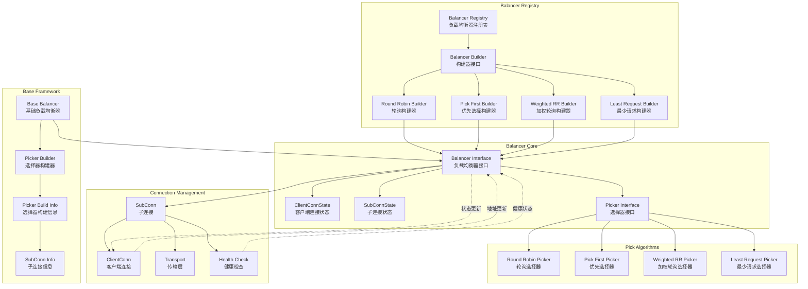
```mermaid
flowchart TB
    subgraph "Balancer Registry"
        BR[Balancer Registry<br/>负载均衡器注册表]
        BB[Balancer Builder<br/>构建器接口]
        RR[Round Robin Builder<br/>轮询构建器]
        PF[Pick First Builder<br/>优先选择构建器]
        WRR[Weighted RR Builder<br/>加权轮询构建器]
        LR[Least Request Builder<br/>最少请求构建器]
    end
    
    subgraph "Balancer Core"
        B[Balancer Interface<br/>负载均衡器接口]
        CCS[ClientConnState<br/>客户端连接状态]
        SCS[SubConnState<br/>子连接状态]
        P[Picker Interface<br/>选择器接口]
    end
    
    subgraph "Base Framework"
        BaseB[Base Balancer<br/>基础负载均衡器]
        PB[Picker Builder<br/>选择器构建器]
        SCI[SubConn Info<br/>子连接信息]
        PBI[Picker Build Info<br/>选择器构建信息]
    end
    
    subgraph "Connection Management"
        SC[SubConn<br/>子连接]
        CC[ClientConn<br/>客户端连接]
        T[Transport<br/>传输层]
        HC[Health Check<br/>健康检查]
    end
    
    subgraph "Pick Algorithms"
        RRP[Round Robin Picker<br/>轮询选择器]
        PFP[Pick First Picker<br/>优先选择器]
        WRRF[Weighted RR Picker<br/>加权轮询选择器]
        LRP[Least Request Picker<br/>最少请求选择器]
    end
    
    BR --> BB
    BB --> RR
    BB --> PF
    BB --> WRR
    BB --> LR
    
    RR --> B
    PF --> B
    WRR --> B
    LR --> B
    
    B --> CCS
    B --> SCS
    B --> P
    
    BaseB --> B
    BaseB --> PB
    PB --> PBI
    PBI --> SCI
    
    B --> SC
    SC --> CC
    SC --> T
    SC --> HC
    
    P --> RRP
    P --> PFP
    P --> WRRF
    P --> LRP
    
    CC -.->|地址更新| B
    B -.->|状态更新| CC
    HC -.->|健康状态| B
```

**架构说明：**

1. **注册表层：**
   - `Balancer Registry` 管理所有已注册的负载均衡器
   - `Builder` 接口定义负载均衡器的创建方式
   - 内置多种负载均衡策略实现

2. **核心接口层：**
   - `Balancer` 接口定义负载均衡器的核心行为
   - `Picker` 接口定义连接选择逻辑
   - 状态管理结构体传递连接信息

3. **基础框架层：**
   - `Base Balancer` 提供通用的负载均衡器实现基础
   - 简化具体策略的实现复杂度
   - 统一子连接管理和状态处理

4. **连接管理层：**
   - `SubConn` 表示到单个后端的连接
   - 集成健康检查和连接状态监控
   - 与传输层交互处理实际网络通信

5. **选择算法层：**
   - 实现具体的连接选择策略
   - 支持无状态和有状态的选择算法
   - 可扩展的算法框架

**设计原则：**

- **可插拔性：** 支持自定义负载均衡策略
- **状态驱动：** 基于连接状态进行决策
- **线程安全：** 支持并发访问和状态更新
- **故障容错：** 自动处理连接故障和恢复

## 核心接口与实现

### Balancer 接口

```go
type Balancer interface {
    // UpdateClientConnState 处理客户端连接状态变化
    UpdateClientConnState(ClientConnState) error
    
    // ResolverError 处理解析器错误
    ResolverError(error)
    
    // UpdateSubConnState 处理子连接状态变化
    UpdateSubConnState(SubConn, SubConnState)
    
    // Close 关闭负载均衡器
    Close()
    
    // ExitIdle 退出空闲状态
    ExitIdle()
}
```

### Builder 接口

```go
type Builder interface {
    // Build 创建负载均衡器实例
    Build(cc ClientConn, opts BuildOptions) Balancer
    
    // Name 返回负载均衡器名称
    Name() string
}
```

### Picker 接口

```go
type Picker interface {
    // Pick 选择用于 RPC 的连接
    Pick(info PickInfo) (PickResult, error)
}
```

## 内置负载均衡策略

### 1. Pick First（优先选择）

**策略描述：**

- 按地址列表顺序尝试连接
- 使用第一个可用的连接处理所有请求
- 连接失败时切换到下一个地址

**适用场景：**

- 单点服务或主备架构
- 对连接数有严格限制的场景
- 简单的故障转移需求

**实现特点：**

```go
type pickFirstBalancer struct {
    state connectivity.State
    cc    balancer.ClientConn
    sc    balancer.SubConn
}

func (b *pickFirstBalancer) UpdateClientConnState(s balancer.ClientConnState) error {
    // 如果地址列表发生变化，重建连接
    if b.sc != nil {
        b.cc.RemoveSubConn(b.sc)
    }
    
    // 创建新的子连接
    sc, err := b.cc.NewSubConn(s.ResolverState.Addresses, balancer.NewSubConnOptions{})
    if err != nil {
        return err
    }
    
    b.sc = sc
    sc.Connect()
    return nil
}
```

### 2. Round Robin（轮询）

**策略描述：**

- 在所有健康连接间轮询分发请求
- 每个连接获得相等的请求机会
- 自动跳过不健康的连接

**适用场景：**

- 后端服务能力相等
- 需要均匀分发请求负载
- 无状态服务调用

**实现特点：**

```go
type roundRobinPicker struct {
    subConns []balancer.SubConn
    next     uint32
}

func (p *roundRobinPicker) Pick(balancer.PickInfo) (balancer.PickResult, error) {
    if len(p.subConns) == 0 {
        return balancer.PickResult{}, balancer.ErrNoSubConnAvailable
    }
    
    // 原子操作实现轮询
    sc := p.subConns[atomic.AddUint32(&p.next, 1)%uint32(len(p.subConns))]
    return balancer.PickResult{SubConn: sc}, nil
}
```

### 3. Weighted Round Robin（加权轮询）

**策略描述：**

- 根据权重分配请求比例
- 支持动态权重调整
- 基于服务器负载反馈调整权重

**适用场景：**

- 后端服务能力不等
- 需要精细控制流量分配
- 支持动态负载感知

**实现特点：**

```go
type weightedRoundRobinPicker struct {
    subConns []weightedSubConn
    mu       sync.Mutex
}

type weightedSubConn struct {
    SubConn balancer.SubConn
    Weight  int64
    Current int64
}

func (p *weightedRoundRobinPicker) Pick(balancer.PickInfo) (balancer.PickResult, error) {
    p.mu.Lock()
    defer p.mu.Unlock()
    
    // 加权轮询算法
    var selected *weightedSubConn
    total := int64(0)
    
    for i := range p.subConns {
        sc := &p.subConns[i]
        sc.Current += sc.Weight
        total += sc.Weight
        
        if selected == nil || sc.Current > selected.Current {
            selected = sc
        }
    }
    
    if selected == nil {
        return balancer.PickResult{}, balancer.ErrNoSubConnAvailable
    }
    
    selected.Current -= total
    return balancer.PickResult{SubConn: selected.SubConn}, nil
}
```

### 4. Least Request（最少请求）

**策略描述：**

- 选择活跃请求数最少的连接
- 实时跟踪每个连接的负载
- 适合处理时间差异较大的请求

**适用场景：**

- 请求处理时间不均匀
- 需要最小化平均响应时间
- 后端服务处理能力动态变化

**实现特点：**

```go
type leastRequestPicker struct {
    subConns []*leastRequestSubConn
}

type leastRequestSubConn struct {
    balancer.SubConn
    inflight int64 // 活跃请求数
}

func (p *leastRequestPicker) Pick(balancer.PickInfo) (balancer.PickResult, error) {
    if len(p.subConns) == 0 {
        return balancer.PickResult{}, balancer.ErrNoSubConnAvailable
    }
    
    // 选择活跃请求数最少的连接
    min := p.subConns[0]
    for _, sc := range p.subConns[1:] {
        if atomic.LoadInt64(&sc.inflight) < atomic.LoadInt64(&min.inflight) {
            min = sc
        }
    }
    
    atomic.AddInt64(&min.inflight, 1)
    
    return balancer.PickResult{
        SubConn: min.SubConn,
        Done: func(balancer.DoneInfo) {
            atomic.AddInt64(&min.inflight, -1)
        },
    }, nil
}
```

## 状态管理与生命周期

### 连接状态枚举

```go
type connectivity.State int32

const (
    Idle connectivity.State = iota
    Connecting
    Ready
    TransientFailure
    Shutdown
)
```

### 状态转换流程

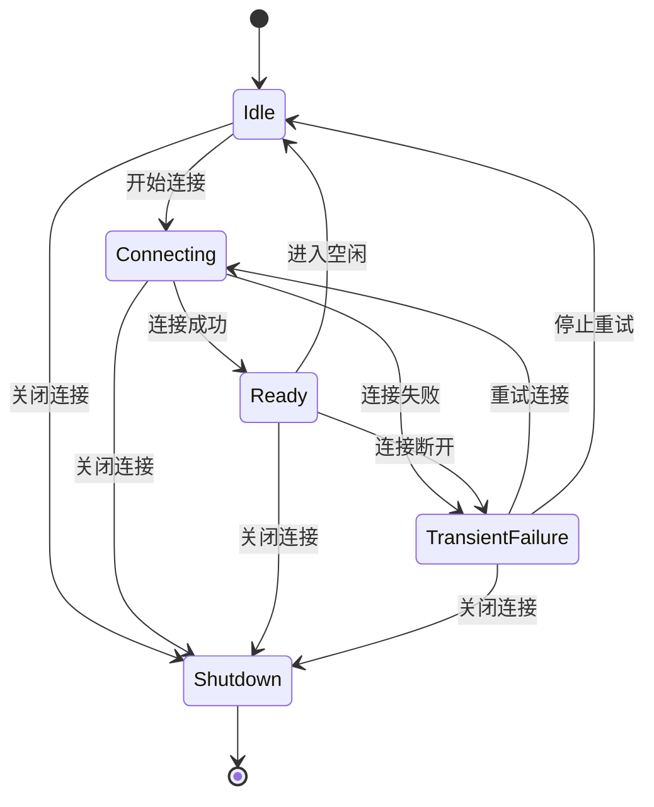
```mermaid
stateDiagram-v2
    [*] --> Idle
    Idle --> Connecting: 开始连接
    Connecting --> Ready: 连接成功
    Connecting --> TransientFailure: 连接失败
    Ready --> TransientFailure: 连接断开
    TransientFailure --> Connecting: 重试连接
    Ready --> Idle: 进入空闲
    TransientFailure --> Idle: 停止重试
    Idle --> Shutdown: 关闭连接
    Connecting --> Shutdown: 关闭连接
    Ready --> Shutdown: 关闭连接
    TransientFailure --> Shutdown: 关闭连接
    Shutdown --> [*]
```

### 生命周期管理

```go
func (b *baseBalancer) UpdateClientConnState(s balancer.ClientConnState) error {
    // 1. 处理地址列表变化
    addrsSet := make(map[resolver.Address]struct{})
    for _, a := range s.ResolverState.Addresses {
        addrsSet[a] = struct{}{}
        
        // 创建新的子连接
        if _, ok := b.subConns[a]; !ok {
            sc, err := b.cc.NewSubConn([]resolver.Address{a}, balancer.NewSubConnOptions{
                HealthCheckEnabled: b.config.HealthCheck,
                StateListener: func(scs balancer.SubConnState) {
                    b.updateSubConnState(sc, scs)
                },
            })
            if err != nil {
                continue
            }
            b.subConns[a] = sc
            sc.Connect()
        }
    }
    
    // 2. 移除不再需要的连接
    for a, sc := range b.subConns {
        if _, ok := addrsSet[a]; !ok {
            b.cc.RemoveSubConn(sc)
            delete(b.subConns, a)
        }
    }
    
    // 3. 更新选择器
    b.regeneratePicker()
    return nil
}
```

## 配置与扩展

### 服务配置格式

```json
{
  "loadBalancingPolicy": "round_robin",
  "loadBalancingConfig": {
    "round_robin": {}
  }
}
```

### 自定义负载均衡器

```go
type customBalancer struct {
    cc       balancer.ClientConn
    subConns map[resolver.Address]balancer.SubConn
    picker   balancer.Picker
}

func (b *customBalancer) Build(cc balancer.ClientConn, opts balancer.BuildOptions) balancer.Balancer {
    return &customBalancer{
        cc:       cc,
        subConns: make(map[resolver.Address]balancer.SubConn),
    }
}

func (b *customBalancer) Name() string {
    return "custom"
}

// 注册自定义负载均衡器
func init() {
    balancer.Register(&customBalancer{})
}
```

### 健康检查集成

```go
type healthCheckConfig struct {
    ServiceName string `json:"serviceName"`
}

func (b *baseBalancer) newSubConnWithHealthCheck(addr resolver.Address) (balancer.SubConn, error) {
    return b.cc.NewSubConn([]resolver.Address{addr}, balancer.NewSubConnOptions{
        HealthCheckEnabled: true,
        StateListener: func(scs balancer.SubConnState) {
            // 处理健康检查状态变化
            if scs.ConnectivityState == connectivity.Ready {
                // 连接健康，加入负载均衡
                b.addReadySubConn(addr, sc)
            } else {
                // 连接不健康，从负载均衡中移除
                b.removeSubConn(addr)
            }
            b.regeneratePicker()
        },
    })
}
```

## 性能优化与最佳实践

### 性能特点
- **无锁选择：** 大多数选择算法使用原子操作，避免锁竞争
- **状态缓存：** 缓存连接状态，减少状态查询开销
- **批量更新：** 批量处理地址变化，减少重建频率
- **内存复用：** 复用数据结构，减少 GC 压力

### 最佳实践
1. **选择合适的策略：** 根据服务特点选择负载均衡算法
2. **启用健康检查：** 及时发现和移除不健康的连接
3. **配置合理的超时：** 避免长时间等待不可用的连接
4. **监控关键指标：** 跟踪连接数、请求分布、错误率等
5. **测试故障场景：** 验证故障转移和恢复机制

通过负载均衡模块的精心设计，gRPC-Go 能够在复杂的分布式环境中提供高可用、高性能的 RPC 通信能力。

---

## API接口

## API 概览

负载均衡模块是 gRPC-Go 的核心组件之一，负责在多个服务端实例之间分发客户端请求。该模块提供了完整的负载均衡框架，包括负载均衡器注册、连接管理、请求分发策略等功能。所有 API 都设计为可扩展和可配置的。

## 核心 API 列表

### 负载均衡器管理 API
- `Register()` - 注册负载均衡器构建器
- `Get()` - 获取已注册的负载均衡器构建器
- `Builder.Build()` - 创建负载均衡器实例
- `Builder.Name()` - 获取负载均衡器名称

### 负载均衡器接口 API
- `Balancer.UpdateClientConnState()` - 更新客户端连接状态
- `Balancer.ResolverError()` - 处理解析器错误
- `Balancer.UpdateSubConnState()` - 更新子连接状态
- `Balancer.Close()` - 关闭负载均衡器
- `Balancer.ExitIdle()` - 退出空闲状态

### 请求分发 API
- `Picker.Pick()` - 选择子连接处理请求
- `ClientConn.NewSubConn()` - 创建新的子连接
- `ClientConn.UpdateState()` - 更新连接状态
- `SubConn.Connect()` - 建立子连接
- `SubConn.Shutdown()` - 关闭子连接

---

## API 详细规格

### 1. Register

#### 基本信息
- **名称：** `Register`
- **签名：** `func Register(b Builder)`
- **功能：** 注册负载均衡器构建器到全局注册表
- **幂等性：** 否，后注册的会覆盖先注册的同名构建器

#### 请求参数

```go
// Builder 负载均衡器构建器接口
type Builder interface {
    // Build 创建新的负载均衡器实例
    Build(cc ClientConn, opts BuildOptions) Balancer
    // Name 返回负载均衡器名称
    Name() string
}

// BuildOptions 构建选项
type BuildOptions struct {
    // DialCreds 拨号凭证
    DialCreds credentials.TransportCredentials
    // CredsBundle 凭证包
    CredsBundle credentials.Bundle
    // Dialer 自定义拨号器
    Dialer func(context.Context, string) (net.Conn, error)
    // Authority 权威名称
    Authority string
    // CustomUserAgent 自定义用户代理
    CustomUserAgent string
    // ChannelzParent Channelz 父节点
    ChannelzParent channelz.Identifier
    // Target 目标地址
    Target resolver.Target
}
```

**参数说明表**

| 参数 | 类型 | 必填 | 约束 | 说明 |
|------|------|:----:|------|------|
| b | Builder | 是 | 实现 Builder 接口 | 负载均衡器构建器 |

#### 响应结果
无返回值，注册失败会记录警告日志。

#### 入口函数实现

```go
func Register(b Builder) {
    // 1. 获取负载均衡器名称并转换为小写
    name := strings.ToLower(b.Name())
    
    // 2. 检查名称大小写一致性（未来版本将区分大小写）
    if name != b.Name() {
        logger.Warningf("Balancer registered with name %q. grpc-go will be switching to case sensitive balancer registries soon", b.Name())
    }
    
    // 3. 注册到全局映射表
    m[name] = b
}
```

#### 调用链分析

```go
// 负载均衡器实现示例
type roundRobinBuilder struct{}

func (b *roundRobinBuilder) Build(cc balancer.ClientConn, opts balancer.BuildOptions) balancer.Balancer {
    return &roundRobinBalancer{
        cc:       cc,
        subConns: make(map[resolver.Address]balancer.SubConn),
        scStates: make(map[balancer.SubConn]connectivity.State),
    }
}

func (b *roundRobinBuilder) Name() string {
    return "round_robin"
}

// 注册负载均衡器
func init() {
    balancer.Register(&roundRobinBuilder{})
}
```

#### 时序图

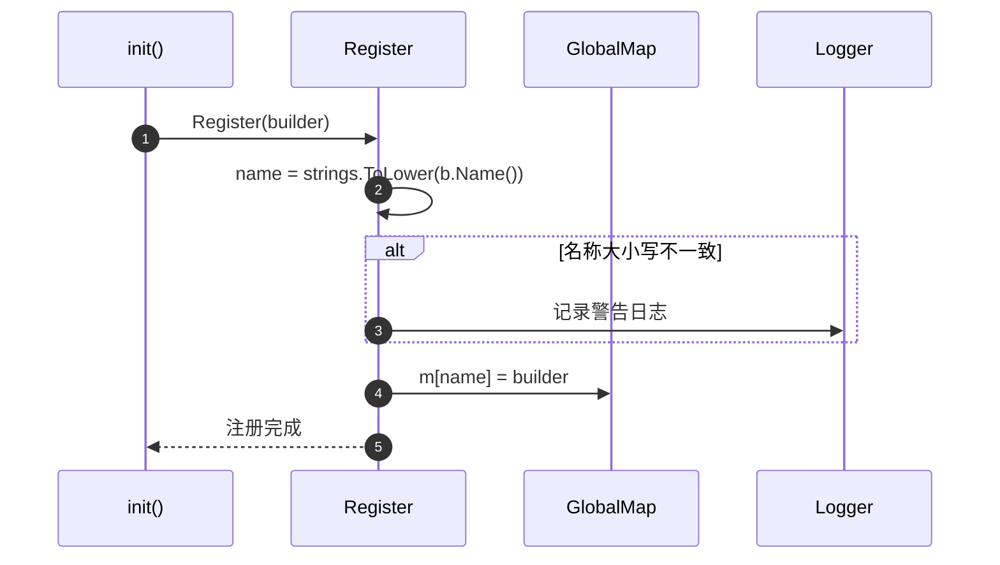
```mermaid
sequenceDiagram
    autonumber
    participant Init as init()
    participant R as Register
    participant M as GlobalMap
    participant L as Logger
    
    Init->>R: Register(builder)
    R->>R: name = strings.ToLower(b.Name())
    
    alt 名称大小写不一致
        R->>L: 记录警告日志
    end
    
    R->>M: m[name] = builder
    R-->>Init: 注册完成
```

#### 边界与异常

- **线程安全：** 仅在初始化时调用，非线程安全
- **名称冲突：** 后注册的构建器会覆盖先注册的
- **大小写处理：** 当前不区分大小写，未来版本将区分
- **初始化时机：** 必须在 init() 函数中调用

#### 实践建议

- **命名规范：** 使用小写和下划线的命名方式
- **唯一性：** 确保负载均衡器名称的唯一性
- **初始化：** 在包的 init() 函数中注册
- **文档：** 为自定义负载均衡器提供详细文档

---

### 2. Get

#### 基本信息
- **名称：** `Get`
- **签名：** `func Get(name string) Builder`
- **功能：** 根据名称获取已注册的负载均衡器构建器
- **幂等性：** 是，多次调用返回相同结果

#### 请求参数

**参数说明表**

| 参数 | 类型 | 必填 | 约束 | 说明 |
|------|------|:----:|------|------|
| name | string | 是 | 非空字符串 | 负载均衡器名称 |

#### 响应结果

```go
// 返回 Builder 接口或 nil
type Builder interface {
    Build(cc ClientConn, opts BuildOptions) Balancer
    Name() string
}
```

#### 入口函数实现

```go
func Get(name string) Builder {
    // 1. 检查名称大小写一致性
    if strings.ToLower(name) != name {
        logger.Warningf("Balancer retrieved for name %q. grpc-go will be switching to case sensitive balancer registries soon", name)
    }
    
    // 2. 从全局映射表中查找
    if b, ok := m[strings.ToLower(name)]; ok {
        return b
    }
    
    // 3. 未找到返回 nil
    return nil
}
```

#### 时序图

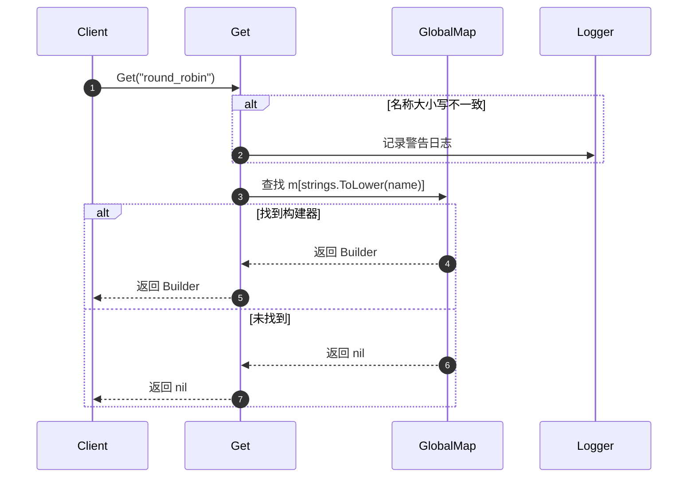
```mermaid
sequenceDiagram
    autonumber
    participant Client as Client
    participant G as Get
    participant M as GlobalMap
    participant L as Logger
    
    Client->>G: Get("round_robin")
    
    alt 名称大小写不一致
        G->>L: 记录警告日志
    end
    
    G->>M: 查找 m[strings.ToLower(name)]
    
    alt 找到构建器
        M-->>G: 返回 Builder
        G-->>Client: 返回 Builder
    else 未找到
        M-->>G: 返回 nil
        G-->>Client: 返回 nil
    end
```

#### 边界与异常

- **大小写处理：** 当前不区分大小写查找
- **空值处理：** 未找到时返回 nil
- **线程安全：** 读操作线程安全
- **警告日志：** 大小写不一致时记录警告

---

### 3. Builder.Build

#### 基本信息
- **名称：** `Build`
- **签名：** `func Build(cc ClientConn, opts BuildOptions) Balancer`
- **功能：** 创建负载均衡器实例
- **幂等性：** 否，每次调用创建新实例

#### 请求参数

```go
// ClientConn 客户端连接接口
type ClientConn interface {
    // NewSubConn 创建新的子连接
    NewSubConn([]resolver.Address, NewSubConnOptions) (SubConn, error)
    // RemoveSubConn 移除子连接
    RemoveSubConn(SubConn)
    // UpdateAddresses 更新子连接地址
    UpdateAddresses(SubConn, []resolver.Address)
    // UpdateState 更新连接状态
    UpdateState(State)
    // ResolveNow 立即解析地址
    ResolveNow(resolver.ResolveNowOptions)
    // Target 获取目标地址
    Target() string
    // MetricsRecorder 获取指标记录器
    MetricsRecorder() estats.MetricsRecorder
}

// BuildOptions 构建选项（见 Register API 说明）
```

**参数说明表**

| 参数 | 类型 | 必填 | 约束 | 说明 |
|------|------|:----:|------|------|
| cc | ClientConn | 是 | 有效的客户端连接 | 客户端连接接口 |
| opts | BuildOptions | 是 | 构建选项 | 负载均衡器构建选项 |

#### 响应结果

```go
// Balancer 负载均衡器接口
type Balancer interface {
    UpdateClientConnState(ClientConnState) error
    ResolverError(error)
    UpdateSubConnState(SubConn, SubConnState)
    Close()
    ExitIdle()
}
```

#### 入口函数实现

```go
// Round Robin 负载均衡器实现示例
func (b *roundRobinBuilder) Build(cc balancer.ClientConn, opts balancer.BuildOptions) balancer.Balancer {
    // 1. 创建负载均衡器实例
    rb := &roundRobinBalancer{
        cc:       cc,
        subConns: make(map[resolver.Address]balancer.SubConn),
        scStates: make(map[balancer.SubConn]connectivity.State),
        picker:   &rrPicker{},
    }
    
    // 2. 初始化状态
    rb.regeneratePicker()
    
    return rb
}

type roundRobinBalancer struct {
    cc       balancer.ClientConn
    subConns map[resolver.Address]balancer.SubConn
    scStates map[balancer.SubConn]connectivity.State
    picker   balancer.Picker
    mu       sync.RWMutex
}
```

#### 时序图

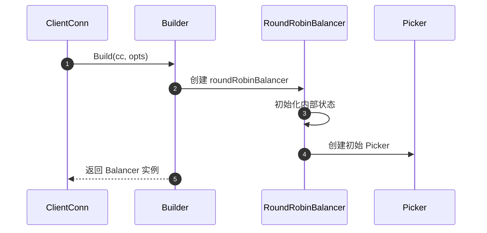
```mermaid
sequenceDiagram
    autonumber
    participant CC as ClientConn
    participant B as Builder
    participant RB as RoundRobinBalancer
    participant P as Picker
    
    CC->>B: Build(cc, opts)
    B->>RB: 创建 roundRobinBalancer
    RB->>RB: 初始化内部状态
    RB->>P: 创建初始 Picker
    B-->>CC: 返回 Balancer 实例
```

---

### 4. Balancer.UpdateClientConnState

#### 基本信息
- **名称：** `UpdateClientConnState`
- **签名：** `func UpdateClientConnState(s ClientConnState) error`
- **功能：** 更新客户端连接状态，处理地址变更
- **幂等性：** 否，每次调用可能产生不同效果

#### 请求参数

```go
// ClientConnState 客户端连接状态
type ClientConnState struct {
    ResolverState resolver.State         // 解析器状态
    BalancerConfig serviceconfig.LoadBalancingConfig  // 负载均衡配置
}

// resolver.State 解析器状态
type State struct {
    Addresses     []resolver.Address     // 服务端地址列表
    ServiceConfig *serviceconfig.ParseResult  // 服务配置
    Attributes    *attributes.Attributes // 属性信息
}
```

**参数说明表**

| 参数 | 类型 | 必填 | 约束 | 说明 |
|------|------|:----:|------|------|
| s | ClientConnState | 是 | 有效的连接状态 | 客户端连接状态 |

#### 响应结果

```go
// 可能的错误类型
var (
    ErrBadResolverState = errors.New("bad resolver state")
)
```

#### 入口函数实现

```go
func (b *roundRobinBalancer) UpdateClientConnState(s balancer.ClientConnState) error {
    b.mu.Lock()
    defer b.mu.Unlock()
    
    // 1. 获取新的地址列表
    addrs := s.ResolverState.Addresses
    
    // 2. 处理地址变更
    addrsSet := make(map[resolver.Address]struct{})
    for _, addr := range addrs {
        addrsSet[addr] = struct{}{}
        
        // 3. 创建新的子连接
        if _, ok := b.subConns[addr]; !ok {
            sc, err := b.cc.NewSubConn([]resolver.Address{addr}, balancer.NewSubConnOptions{
                StateListener: func(scs balancer.SubConnState) {
                    b.updateSubConnState(sc, scs)
                },
            })
            if err != nil {
                continue
            }
            b.subConns[addr] = sc
            b.scStates[sc] = connectivity.Idle
            sc.Connect()
        }
    }
    
    // 4. 移除不再需要的子连接
    for addr, sc := range b.subConns {
        if _, ok := addrsSet[addr]; !ok {
            b.cc.RemoveSubConn(sc)
            delete(b.subConns, addr)
            delete(b.scStates, sc)
        }
    }
    
    // 5. 重新生成 Picker
    b.regeneratePicker()
    
    return nil
}
```

#### 时序图

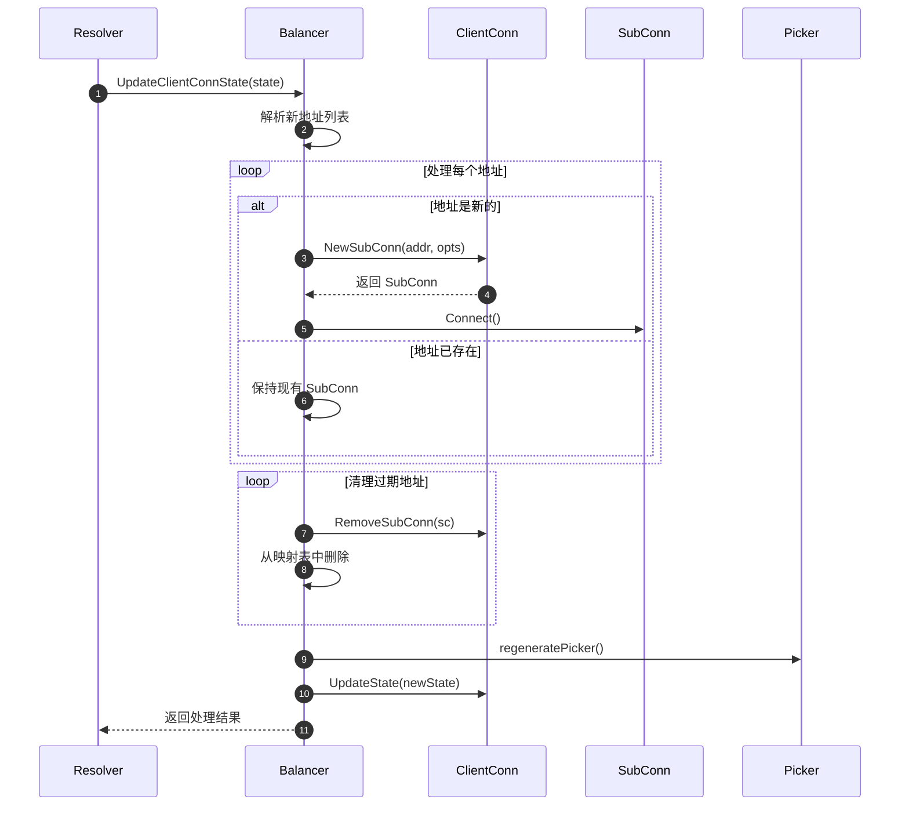
```mermaid
sequenceDiagram
    autonumber
    participant R as Resolver
    participant B as Balancer
    participant CC as ClientConn
    participant SC as SubConn
    participant P as Picker
    
    R->>B: UpdateClientConnState(state)
    B->>B: 解析新地址列表
    
    loop 处理每个地址
        alt 地址是新的
            B->>CC: NewSubConn(addr, opts)
            CC-->>B: 返回 SubConn
            B->>SC: Connect()
        else 地址已存在
            B->>B: 保持现有 SubConn
        end
    end
    
    loop 清理过期地址
        B->>CC: RemoveSubConn(sc)
        B->>B: 从映射表中删除
    end
    
    B->>P: regeneratePicker()
    B->>CC: UpdateState(newState)
    B-->>R: 返回处理结果
```

---

### 5. Picker.Pick

#### 基本信息
- **名称：** `Pick`
- **签名：** `func Pick(info PickInfo) (PickResult, error)`
- **功能：** 为 RPC 请求选择合适的子连接
- **幂等性：** 否，每次调用可能返回不同连接

#### 请求参数

```go
// PickInfo 选择信息
type PickInfo struct {
    // FullMethodName RPC 方法全名
    FullMethodName string
    // Ctx RPC 上下文
    Ctx context.Context
}
```

**参数说明表**

| 参数 | 类型 | 必填 | 约束 | 说明 |
|------|------|:----:|------|------|
| info | PickInfo | 是 | 有效的选择信息 | 请求选择信息 |

#### 响应结果

```go
// PickResult 选择结果
type PickResult struct {
    // SubConn 选中的子连接
    SubConn SubConn
    // Done 请求完成回调
    Done func(DoneInfo)
    // Metadata 元数据
    Metadata metadata.MD
}

// DoneInfo 完成信息
type DoneInfo struct {
    Err           error        // RPC 错误
    Trailer       metadata.MD  // 响应尾部元数据
    BytesSent     bool         // 是否发送了字节
    BytesReceived bool         // 是否接收了字节
    ServerLoad    any          // 服务器负载信息
}
```

#### 入口函数实现

```go
// Round Robin Picker 实现
type rrPicker struct {
    subConns []balancer.SubConn
    next     uint32
}

func (p *rrPicker) Pick(info balancer.PickInfo) (balancer.PickResult, error) {
    // 1. 检查是否有可用连接
    if len(p.subConns) == 0 {
        return balancer.PickResult{}, balancer.ErrNoSubConnAvailable
    }
    
    // 2. Round Robin 算法选择连接
    idx := atomic.AddUint32(&p.next, 1) % uint32(len(p.subConns))
    sc := p.subConns[idx]
    
    // 3. 构造选择结果
    return balancer.PickResult{
        SubConn: sc,
        Done: func(di balancer.DoneInfo) {
            // 记录请求完成信息
        },
    }, nil
}
```

#### 时序图

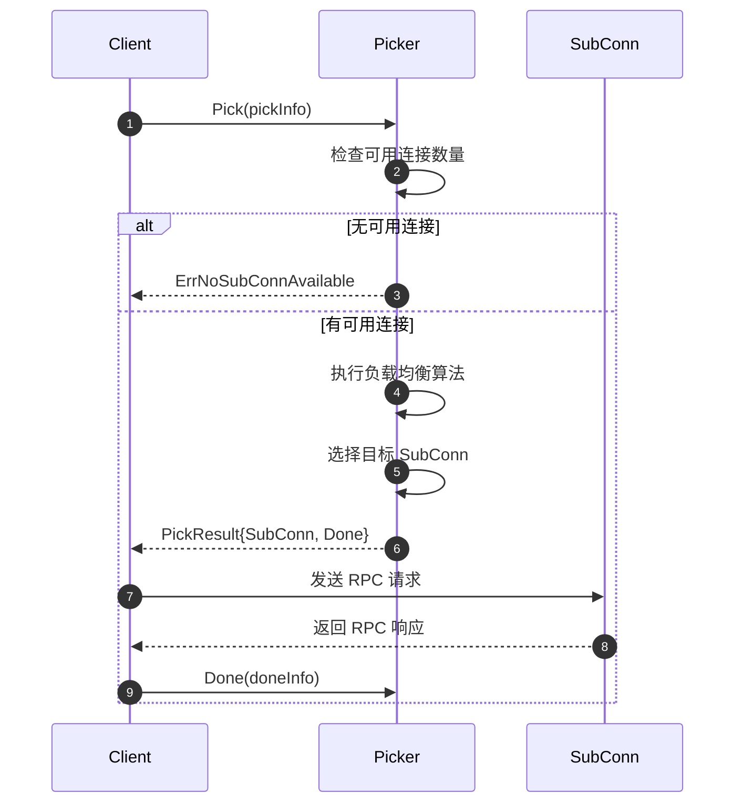
```mermaid
sequenceDiagram
    autonumber
    participant Client as Client
    participant P as Picker
    participant SC as SubConn
    
    Client->>P: Pick(pickInfo)
    P->>P: 检查可用连接数量
    
    alt 无可用连接
        P-->>Client: ErrNoSubConnAvailable
    else 有可用连接
        P->>P: 执行负载均衡算法
        P->>P: 选择目标 SubConn
        P-->>Client: PickResult{SubConn, Done}
        Client->>SC: 发送 RPC 请求
        SC-->>Client: 返回 RPC 响应
        Client->>P: Done(doneInfo)
    end
```

#### 边界与异常

- **无连接可用：** 返回 `ErrNoSubConnAvailable` 错误
- **非阻塞要求：** Pick 方法不能阻塞
- **线程安全：** 可能被多个 goroutine 并发调用
- **状态一致性：** 基于当前连接状态进行选择

---

## 内置负载均衡器

### Round Robin

```go
// 轮询负载均衡器
type roundRobinBuilder struct{}

func (b *roundRobinBuilder) Name() string {
    return "round_robin"
}

func (b *roundRobinBuilder) Build(cc balancer.ClientConn, opts balancer.BuildOptions) balancer.Balancer {
    return &roundRobinBalancer{
        cc:       cc,
        subConns: make(map[resolver.Address]balancer.SubConn),
        scStates: make(map[balancer.SubConn]connectivity.State),
    }
}
```

### Pick First

```go
// 优先选择负载均衡器
type pickFirstBuilder struct{}

func (b *pickFirstBuilder) Name() string {
    return "pick_first"
}

func (b *pickFirstBuilder) Build(cc balancer.ClientConn, opts balancer.BuildOptions) balancer.Balancer {
    return &pickFirstBalancer{
        cc: cc,
    }
}
```

## 使用示例

### 注册自定义负载均衡器

```go
package main

import (
    "google.golang.org/grpc/balancer"
    "google.golang.org/grpc/connectivity"
)

// 自定义负载均衡器
type customBalancer struct {
    cc       balancer.ClientConn
    subConns map[resolver.Address]balancer.SubConn
}

type customBuilder struct{}

func (b *customBuilder) Name() string {
    return "custom_lb"
}

func (b *customBuilder) Build(cc balancer.ClientConn, opts balancer.BuildOptions) balancer.Balancer {
    return &customBalancer{
        cc:       cc,
        subConns: make(map[resolver.Address]balancer.SubConn),
    }
}

func init() {
    // 注册自定义负载均衡器
    balancer.Register(&customBuilder{})
}
```

### 使用负载均衡器

```go
func main() {
    // 创建连接时指定负载均衡策略
    conn, err := grpc.Dial(
        "dns:///example.com:50051",
        grpc.WithDefaultServiceConfig(`{"loadBalancingPolicy":"round_robin"}`),
        grpc.WithTransportCredentials(insecure.NewCredentials()),
    )
    if err != nil {
        log.Fatalf("Failed to connect: %v", err)
    }
    defer conn.Close()
    
    // 使用连接进行 RPC 调用
    client := pb.NewGreeterClient(conn)
    resp, err := client.SayHello(context.Background(), &pb.HelloRequest{
        Name: "World",
    })
    if err != nil {
        log.Fatalf("RPC failed: %v", err)
    }
    
    fmt.Printf("Response: %s\n", resp.Message)
}
```

## 最佳实践

1. **负载均衡策略选择**
   - Round Robin：适用于服务端性能相近的场景
   - Pick First：适用于有主备关系的场景
   - 自定义策略：根据业务需求实现特殊算法

2. **连接管理**
   - 及时清理失效连接
   - 监控连接健康状态
   - 合理设置连接池大小

3. **性能优化**
   - Picker.Pick() 方法要快速返回
   - 避免在 Pick 中进行阻塞操作
   - 使用原子操作保证线程安全

4. **错误处理**
   - 正确处理连接失败情况
   - 实现适当的重试机制
   - 提供详细的错误信息

---

## 数据结构

## 数据结构概览

负载均衡模块的数据结构设计体现了 gRPC 客户端负载均衡的完整架构，包括负载均衡器注册、连接管理、请求分发、状态维护等各个方面。所有数据结构都经过精心设计以确保高性能、可扩展性和线程安全。

## 核心数据结构 UML 图

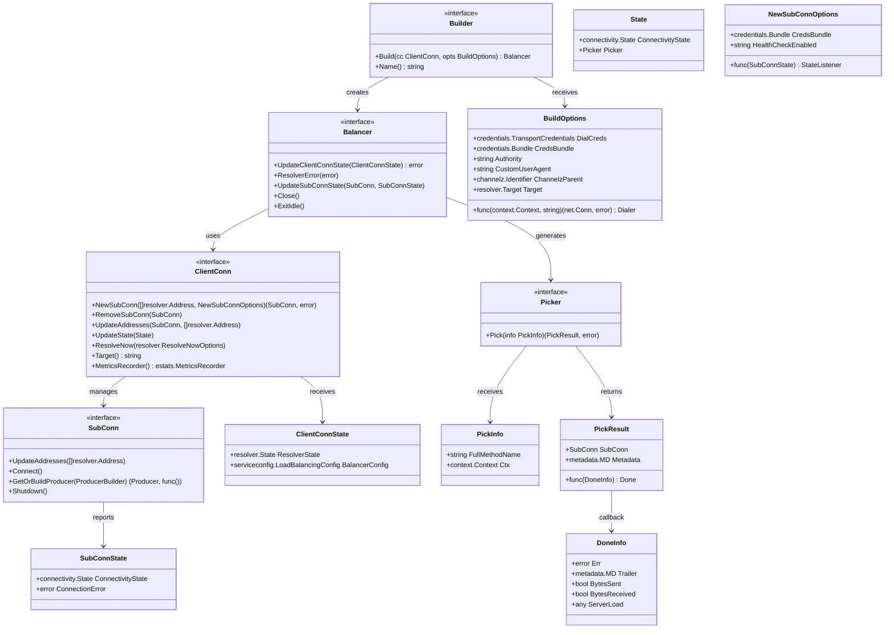
```mermaid
classDiagram
    class Builder {
        <<interface>>
        +Build(cc ClientConn, opts BuildOptions) Balancer
        +Name() string
    }
    
    class Balancer {
        <<interface>>
        +UpdateClientConnState(ClientConnState) error
        +ResolverError(error)
        +UpdateSubConnState(SubConn, SubConnState)
        +Close()
        +ExitIdle()
    }
    
    class Picker {
        <<interface>>
        +Pick(info PickInfo) (PickResult, error)
    }
    
    class ClientConn {
        <<interface>>
        +NewSubConn([]resolver.Address, NewSubConnOptions) (SubConn, error)
        +RemoveSubConn(SubConn)
        +UpdateAddresses(SubConn, []resolver.Address)
        +UpdateState(State)
        +ResolveNow(resolver.ResolveNowOptions)
        +Target() string
        +MetricsRecorder() estats.MetricsRecorder
    }
    
    class SubConn {
        <<interface>>
        +UpdateAddresses([]resolver.Address)
        +Connect()
        +GetOrBuildProducer(ProducerBuilder) (Producer, func())
        +Shutdown()
    }
    
    class BuildOptions {
        +credentials.TransportCredentials DialCreds
        +credentials.Bundle CredsBundle
        +func(context.Context, string) (net.Conn, error) Dialer
        +string Authority
        +string CustomUserAgent
        +channelz.Identifier ChannelzParent
        +resolver.Target Target
    }
    
    class ClientConnState {
        +resolver.State ResolverState
        +serviceconfig.LoadBalancingConfig BalancerConfig
    }
    
    class State {
        +connectivity.State ConnectivityState
        +Picker Picker
    }
    
    class PickInfo {
        +string FullMethodName
        +context.Context Ctx
    }
    
    class PickResult {
        +SubConn SubConn
        +func(DoneInfo) Done
        +metadata.MD Metadata
    }
    
    class DoneInfo {
        +error Err
        +metadata.MD Trailer
        +bool BytesSent
        +bool BytesReceived
        +any ServerLoad
    }
    
    class SubConnState {
        +connectivity.State ConnectivityState
        +error ConnectionError
    }
    
    class NewSubConnOptions {
        +credentials.Bundle CredsBundle
        +func(SubConnState) StateListener
        +string HealthCheckEnabled
    }
    
    Builder --> Balancer : creates
    Balancer --> ClientConn : uses
    ClientConn --> SubConn : manages
    Balancer --> Picker : generates
    Picker --> PickResult : returns
    PickResult --> DoneInfo : callback
    ClientConn --> ClientConnState : receives
    SubConn --> SubConnState : reports
    Builder --> BuildOptions : receives
    Picker --> PickInfo : receives
```

**UML 图说明：**

1. **Builder 接口：** 负载均衡器构建器，用于创建具体的负载均衡器实例
2. **Balancer 接口：** 核心负载均衡器接口，处理连接状态变更和请求分发
3. **Picker 接口：** 请求选择器，负责为每个 RPC 请求选择合适的连接
4. **ClientConn 接口：** 客户端连接管理接口，提供子连接管理功能
5. **SubConn 接口：** 子连接接口，代表到单个服务端的连接
6. **各种状态和选项结构：** 支持负载均衡器的配置和状态管理

## 详细数据结构分析

### 1. Builder 接口

```go
// Builder 负载均衡器构建器接口
type Builder interface {
    // Build 创建新的负载均衡器实例
    // cc: 客户端连接接口，用于管理子连接
    // opts: 构建选项，包含认证、拨号等配置
    Build(cc ClientConn, opts BuildOptions) Balancer
    
    // Name 返回负载均衡器的名称
    // 用于在服务配置中标识负载均衡策略
    Name() string
}

// ConfigParser 可选的配置解析器接口
type ConfigParser interface {
    // ParseConfig 解析 JSON 格式的负载均衡配置
    ParseConfig(LoadBalancingConfigJSON json.RawMessage) (serviceconfig.LoadBalancingConfig, error)
}
```

**接口设计说明：**

- **工厂模式：** Builder 使用工厂模式创建负载均衡器实例
- **配置解析：** 可选实现 ConfigParser 接口支持自定义配置
- **名称标识：** Name() 方法返回的名称用于注册和查找
- **依赖注入：** Build 方法接收 ClientConn 实现依赖注入

### 2. Balancer 接口

```go
// Balancer 负载均衡器核心接口
type Balancer interface {
    // UpdateClientConnState 当客户端连接状态变更时调用
    // 主要处理服务端地址列表的变更
    UpdateClientConnState(ClientConnState) error
    
    // ResolverError 当名称解析器报告错误时调用
    ResolverError(error)
    
    // UpdateSubConnState 当子连接状态变更时调用
    // 已废弃：建议使用 NewSubConnOptions.StateListener
    UpdateSubConnState(SubConn, SubConnState)
    
    // Close 关闭负载均衡器，清理资源
    Close()
    
    // ExitIdle 退出空闲状态，重新连接后端
    ExitIdle()
}

// ExitIdler 可选的空闲退出接口（已废弃）
type ExitIdler interface {
    ExitIdle()
}
```

**接口职责说明：**

| 方法 | 触发时机 | 主要职责 | 并发安全性 |
|------|----------|----------|------------|
| UpdateClientConnState | 地址解析完成 | 创建/删除子连接 | 同步调用 |
| ResolverError | 解析器错误 | 错误处理和恢复 | 同步调用 |
| UpdateSubConnState | 连接状态变更 | 更新 Picker | 同步调用 |
| Close | 连接关闭 | 资源清理 | 同步调用 |
| ExitIdle | 主动连接 | 退出空闲状态 | 同步调用 |

### 3. Picker 接口

```go
// Picker 请求选择器接口
type Picker interface {
    // Pick 为 RPC 请求选择子连接
    // info: 包含方法名和上下文的请求信息
    // 返回: 选中的连接和完成回调
    Pick(info PickInfo) (PickResult, error)
}

// PickInfo 请求选择信息
type PickInfo struct {
    // FullMethodName RPC 方法全名，格式：/package.service/method
    FullMethodName string
    
    // Ctx RPC 请求上下文，可能包含元数据等信息
    Ctx context.Context
}

// PickResult 选择结果
type PickResult struct {
    // SubConn 选中的子连接
    SubConn SubConn
    
    // Done 请求完成时的回调函数
    // 用于收集请求统计信息和负载反馈
    Done func(DoneInfo)
    
    // Metadata 附加到请求的元数据
    Metadata metadata.MD
}

// DoneInfo 请求完成信息
type DoneInfo struct {
    // Err RPC 执行错误，nil 表示成功
    Err error
    
    // Trailer 响应尾部元数据
    Trailer metadata.MD
    
    // BytesSent 是否发送了字节数据
    BytesSent bool
    
    // BytesReceived 是否接收了字节数据
    BytesReceived bool
    
    // ServerLoad 服务器负载信息（如 ORCA 负载报告）
    ServerLoad any
}
```

**选择器设计要点：**

- **非阻塞：** Pick 方法必须快速返回，不能阻塞
- **状态感知：** 基于当前连接状态进行选择
- **反馈机制：** Done 回调提供请求完成反馈
- **元数据支持：** 可以向请求添加额外元数据

### 4. ClientConn 接口

```go
// ClientConn 客户端连接管理接口
type ClientConn interface {
    // NewSubConn 创建新的子连接
    NewSubConn([]resolver.Address, NewSubConnOptions) (SubConn, error)
    
    // RemoveSubConn 移除子连接
    RemoveSubConn(SubConn)
    
    // UpdateAddresses 更新子连接的地址列表
    UpdateAddresses(SubConn, []resolver.Address)
    
    // UpdateState 更新负载均衡器状态
    UpdateState(State)
    
    // ResolveNow 触发立即地址解析
    ResolveNow(resolver.ResolveNowOptions)
    
    // Target 获取连接目标
    Target() string
    
    // MetricsRecorder 获取指标记录器
    MetricsRecorder() estats.MetricsRecorder
    
    // 强制嵌入接口，允许 gRPC 添加新方法
    internal.EnforceClientConnEmbedding
}

// NewSubConnOptions 子连接创建选项
type NewSubConnOptions struct {
    // CredsBundle 凭证包
    CredsBundle credentials.Bundle
    
    // StateListener 状态变更监听器
    StateListener func(SubConnState)
    
    // HealthCheckEnabled 健康检查配置
    HealthCheckEnabled string
}

// State 负载均衡器状态
type State struct {
    // ConnectivityState 连接状态
    ConnectivityState connectivity.State
    
    // Picker 当前的请求选择器
    Picker Picker
}
```

**连接管理特点：**

- **生命周期管理：** 创建、更新、删除子连接
- **状态同步：** 向 gRPC 核心报告负载均衡器状态
- **立即解析：** 支持主动触发地址解析
- **指标收集：** 集成指标记录功能

### 5. SubConn 接口

```go
// SubConn 子连接接口
type SubConn interface {
    // UpdateAddresses 更新连接地址
    UpdateAddresses([]resolver.Address)
    
    // Connect 建立连接
    Connect()
    
    // GetOrBuildProducer 获取或构建生产者
    GetOrBuildProducer(ProducerBuilder) (Producer, func())
    
    // Shutdown 关闭连接
    Shutdown()
    
    // 强制嵌入接口
    internal.EnforceSubConnEmbedding
}

// SubConnState 子连接状态
type SubConnState struct {
    // ConnectivityState 连接状态
    ConnectivityState connectivity.State
    
    // ConnectionError 连接错误信息
    ConnectionError error
}
```

**子连接状态枚举：**

```go
// connectivity.State 连接状态
const (
    Idle        = connectivity.Idle        // 空闲状态
    Connecting  = connectivity.Connecting  // 连接中
    Ready       = connectivity.Ready       // 就绪状态
    TransientFailure = connectivity.TransientFailure // 临时失败
    Shutdown    = connectivity.Shutdown    // 已关闭
)
```

### 6. 配置和选项结构

```go
// BuildOptions 负载均衡器构建选项
type BuildOptions struct {
    // DialCreds 拨号传输凭证
    DialCreds credentials.TransportCredentials
    
    // CredsBundle 凭证包
    CredsBundle credentials.Bundle
    
    // Dialer 自定义拨号函数
    Dialer func(context.Context, string) (net.Conn, error)
    
    // Authority 权威名称
    Authority string
    
    // CustomUserAgent 自定义用户代理
    CustomUserAgent string
    
    // ChannelzParent Channelz 父节点标识
    ChannelzParent channelz.Identifier
    
    // Target 目标解析结果
    Target resolver.Target
}

// ClientConnState 客户端连接状态
type ClientConnState struct {
    // ResolverState 解析器状态，包含地址列表
    ResolverState resolver.State
    
    // BalancerConfig 负载均衡配置
    BalancerConfig serviceconfig.LoadBalancingConfig
}
```

## 常见负载均衡器实现

### 1. Round Robin 实现

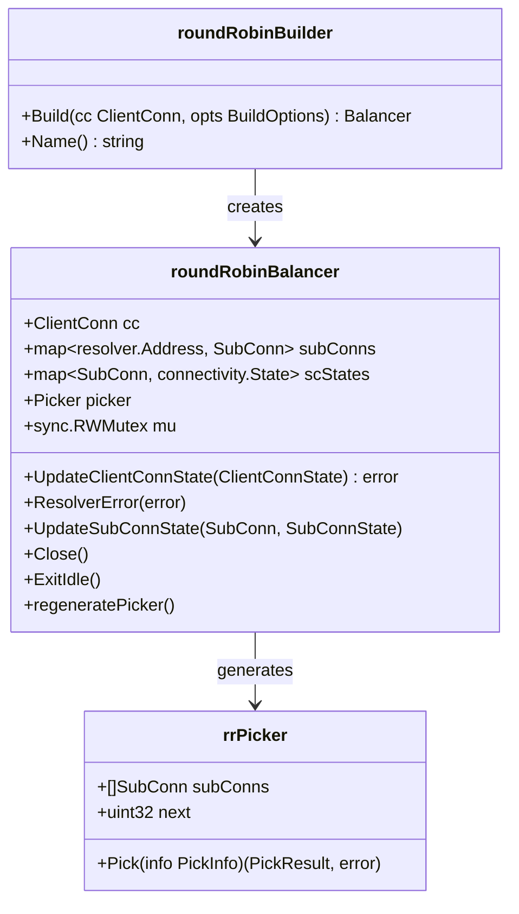
```mermaid
classDiagram
    class roundRobinBuilder {
        +Build(cc ClientConn, opts BuildOptions) Balancer
        +Name() string
    }
    
    class roundRobinBalancer {
        +ClientConn cc
        +map~resolver.Address, SubConn~ subConns
        +map~SubConn, connectivity.State~ scStates
        +Picker picker
        +sync.RWMutex mu
        +UpdateClientConnState(ClientConnState) error
        +ResolverError(error)
        +UpdateSubConnState(SubConn, SubConnState)
        +Close()
        +ExitIdle()
        +regeneratePicker()
    }
    
    class rrPicker {
        +[]SubConn subConns
        +uint32 next
        +Pick(info PickInfo) (PickResult, error)
    }
    
    roundRobinBuilder --> roundRobinBalancer : creates
    roundRobinBalancer --> rrPicker : generates
```

```go
// Round Robin 负载均衡器实现
type roundRobinBalancer struct {
    cc       balancer.ClientConn
    subConns map[resolver.Address]balancer.SubConn
    scStates map[balancer.SubConn]connectivity.State
    picker   balancer.Picker
    mu       sync.RWMutex
}

// Round Robin 选择器实现
type rrPicker struct {
    subConns []balancer.SubConn
    next     uint32
}

func (p *rrPicker) Pick(info balancer.PickInfo) (balancer.PickResult, error) {
    if len(p.subConns) == 0 {
        return balancer.PickResult{}, balancer.ErrNoSubConnAvailable
    }
    
    // 原子操作实现轮询
    idx := atomic.AddUint32(&p.next, 1) % uint32(len(p.subConns))
    return balancer.PickResult{
        SubConn: p.subConns[idx],
    }, nil
}
```

### 2. Pick First 实现

```go
// Pick First 负载均衡器实现
type pickFirstBalancer struct {
    cc       balancer.ClientConn
    sc       balancer.SubConn
    state    connectivity.State
}

type pickFirstPicker struct {
    sc balancer.SubConn
}

func (p *pickFirstPicker) Pick(info balancer.PickInfo) (balancer.PickResult, error) {
    if p.sc == nil {
        return balancer.PickResult{}, balancer.ErrNoSubConnAvailable
    }
    return balancer.PickResult{SubConn: p.sc}, nil
}
```

## 数据结构关系图

```mermaid
graph TB
    subgraph "注册管理"
        GlobalMap[全局注册表 map[string]Builder]
        Register[Register 函数]
        Get[Get 函数]
        
        Register --> GlobalMap
        Get --> GlobalMap
    end
    
    subgraph "负载均衡器生命周期"
        Builder[Builder 接口]
        Balancer[Balancer 实例]
        Picker[Picker 实例]
        
        Builder --> Balancer
        Balancer --> Picker
    end
    
    subgraph "连接管理"
        ClientConn[ClientConn 接口]
        SubConn[SubConn 实例]
        ConnState[连接状态]
        
        ClientConn --> SubConn
        SubConn --> ConnState
    end
    
    subgraph "请求处理"
        PickInfo[请求信息]
        PickResult[选择结果]
        DoneInfo[完成信息]
        
        PickInfo --> PickResult
        PickResult --> DoneInfo
    end
    
    GlobalMap --> Builder
    Balancer --> ClientConn
    Picker --> PickInfo
    ClientConn --> Balancer
```

## 内存管理和性能特点

### 内存分配模式

1. **延迟初始化：** 负载均衡器实例按需创建
2. **连接池：** 子连接复用减少创建开销
3. **状态缓存：** 连接状态本地缓存避免频繁查询
4. **选择器复用：** Picker 实例在状态不变时复用

### 并发安全保证

1. **接口隔离：** 不同接口的方法调用互不影响
2. **状态同步：** 负载均衡器方法保证同步调用
3. **原子操作：** 选择器使用原子操作保证线程安全
4. **读写锁：** 状态读取和更新使用读写锁分离

### 性能优化点

1. **快速选择：** Pick 方法使用 O(1) 算法
2. **状态缓存：** 避免重复计算连接状态
3. **批量更新：** 地址变更时批量处理连接
4. **异步连接：** 子连接建立不阻塞主流程

## 扩展点和定制化

### 自定义负载均衡算法

```go
// 加权轮询实现示例
type weightedRoundRobinPicker struct {
    subConns []balancer.SubConn
    weights  []int
    current  []int
    total    int
}

func (p *weightedRoundRobinPicker) Pick(info balancer.PickInfo) (balancer.PickResult, error) {
    // 实现加权轮询算法
    maxWeight := -1
    selectedIdx := -1
    
    for i := range p.subConns {
        p.current[i] += p.weights[i]
        if p.current[i] > maxWeight {
            maxWeight = p.current[i]
            selectedIdx = i
        }
    }
    
    if selectedIdx != -1 {
        p.current[selectedIdx] -= p.total
        return balancer.PickResult{
            SubConn: p.subConns[selectedIdx],
        }, nil
    }
    
    return balancer.PickResult{}, balancer.ErrNoSubConnAvailable
}
```

### 负载感知选择

```go
// 负载感知选择器
type loadAwarePicker struct {
    subConns []balancer.SubConn
    loads    []float64
    mu       sync.RWMutex
}

func (p *loadAwarePicker) Pick(info balancer.PickInfo) (balancer.PickResult, error) {
    p.mu.RLock()
    defer p.mu.RUnlock()
    
    // 选择负载最低的连接
    minLoad := math.MaxFloat64
    selectedIdx := -1
    
    for i, load := range p.loads {
        if load < minLoad {
            minLoad = load
            selectedIdx = i
        }
    }
    
    if selectedIdx != -1 {
        return balancer.PickResult{
            SubConn: p.subConns[selectedIdx],
            Done: func(di balancer.DoneInfo) {
                // 根据请求结果更新负载信息
                p.updateLoad(selectedIdx, di)
            },
        }, nil
    }
    
    return balancer.PickResult{}, balancer.ErrNoSubConnAvailable
}
```

这些数据结构的设计体现了 gRPC-Go 负载均衡模块的核心设计理念：灵活的策略扩展、高效的请求分发、完善的状态管理。通过合理的接口抽象和数据结构组织，实现了企业级的负载均衡功能。

---

## 时序图

## 时序图概览

本文档详细描述了 gRPC-Go 负载均衡模块的各种时序流程，包括负载均衡器注册、初始化、地址更新、连接管理、请求分发等核心场景。每个时序图都配有详细的文字说明，帮助理解负载均衡的完整工作流程。

## 核心时序图列表

1. **负载均衡器注册时序图** - 负载均衡器的注册和查找流程
2. **负载均衡器初始化时序图** - 负载均衡器实例的创建和初始化
3. **地址更新时序图** - 服务端地址列表变更的处理流程
4. **子连接管理时序图** - 子连接的创建、连接和状态管理
5. **请求分发时序图** - RPC 请求的负载均衡选择流程
6. **连接状态变更时序图** - 连接状态变化的处理流程
7. **负载均衡器关闭时序图** - 负载均衡器的清理和关闭流程

---

## 1. 负载均衡器注册时序图

### 场景描述
展示负载均衡器的注册流程和查找机制，包括在程序初始化时注册和在创建连接时查找。

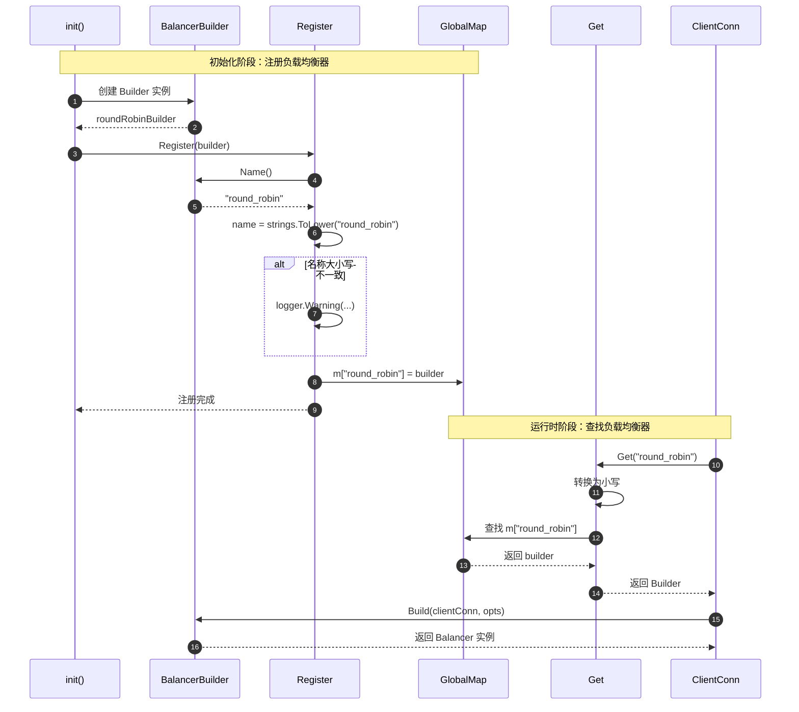
```mermaid
sequenceDiagram
    autonumber
    participant Init as init()
    participant Builder as BalancerBuilder
    participant Reg as Register
    participant Map as GlobalMap
    participant Get as Get
    participant CC as ClientConn
    
    Note over Init,Map: 初始化阶段：注册负载均衡器
    Init->>Builder: 创建 Builder 实例
    Builder-->>Init: roundRobinBuilder
    Init->>Reg: Register(builder)
    Reg->>Builder: Name()
    Builder-->>Reg: "round_robin"
    Reg->>Reg: name = strings.ToLower("round_robin")
    
    alt 名称大小写不一致
        Reg->>Reg: logger.Warning(...)
    end
    
    Reg->>Map: m["round_robin"] = builder
    Reg-->>Init: 注册完成
    
    Note over CC,Map: 运行时阶段：查找负载均衡器
    CC->>Get: Get("round_robin")
    Get->>Get: 转换为小写
    Get->>Map: 查找 m["round_robin"]
    Map-->>Get: 返回 builder
    Get-->>CC: 返回 Builder
    
    CC->>Builder: Build(clientConn, opts)
    Builder-->>CC: 返回 Balancer 实例
```

**时序说明：**

1. **注册阶段（步骤1-10）：**
   - 在包的 init() 函数中创建构建器实例
   - 调用 Register() 注册到全局映射表
   - 名称统一转换为小写存储

2. **查找阶段（步骤11-17）：**
   - 客户端连接创建时查找负载均衡器
   - 从全局映射表中获取构建器
   - 使用构建器创建负载均衡器实例

**边界条件：**

- 重复注册会覆盖之前的注册
- 查找不存在的负载均衡器返回 nil
- 名称查找不区分大小写（当前版本）

**性能要点：**

- 注册仅在初始化时进行一次
- 查找使用哈希表，O(1) 复杂度
- 无锁设计，读操作高效

---

## 2. 负载均衡器初始化时序图

### 场景描述
展示客户端连接创建时负载均衡器的初始化流程，包括构建器调用和初始状态设置。

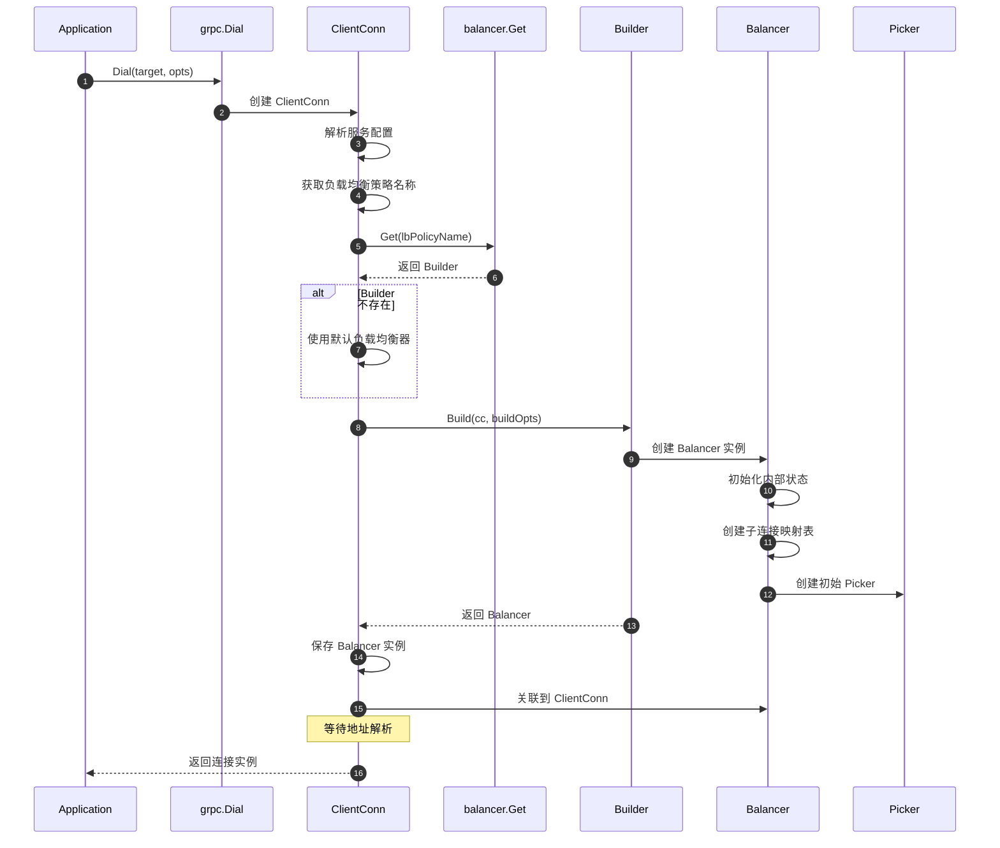
```mermaid
sequenceDiagram
    autonumber
    participant App as Application
    participant Dial as grpc.Dial
    participant CC as ClientConn
    participant Get as balancer.Get
    participant Builder as Builder
    participant LB as Balancer
    participant Picker as Picker
    
    App->>Dial: Dial(target, opts)
    Dial->>CC: 创建 ClientConn
    CC->>CC: 解析服务配置
    CC->>CC: 获取负载均衡策略名称
    
    CC->>Get: Get(lbPolicyName)
    Get-->>CC: 返回 Builder
    
    alt Builder 不存在
        CC->>CC: 使用默认负载均衡器
    end
    
    CC->>Builder: Build(cc, buildOpts)
    Builder->>LB: 创建 Balancer 实例
    LB->>LB: 初始化内部状态
    LB->>LB: 创建子连接映射表
    LB->>Picker: 创建初始 Picker
    Builder-->>CC: 返回 Balancer
    
    CC->>CC: 保存 Balancer 实例
    CC->>LB: 关联到 ClientConn
    
    Note over CC: 等待地址解析
    CC-->>App: 返回连接实例
```

**时序说明：**

1. **连接创建（步骤1-6）：**
   - 应用调用 Dial 创建连接
   - 解析服务配置获取负载均衡策略
   - 查找对应的负载均衡器构建器

2. **负载均衡器构建（步骤7-14）：**
   - 调用构建器创建负载均衡器实例
   - 初始化内部数据结构
   - 创建初始的请求选择器

3. **关联绑定（步骤15-17）：**
   - 将负载均衡器关联到客户端连接
   - 准备接收地址更新

**边界条件：**

- 构建器不存在时使用默认策略（pick_first）
- 构建失败会导致连接创建失败
- 初始状态下没有可用连接

**性能要点：**

- 延迟初始化，仅在需要时创建
- 初始状态预分配数据结构
- 避免在构建过程中阻塞

---

## 3. 地址更新时序图

### 场景描述
展示名称解析器返回新的服务端地址列表时，负载均衡器如何处理地址变更，包括创建新连接和删除旧连接。

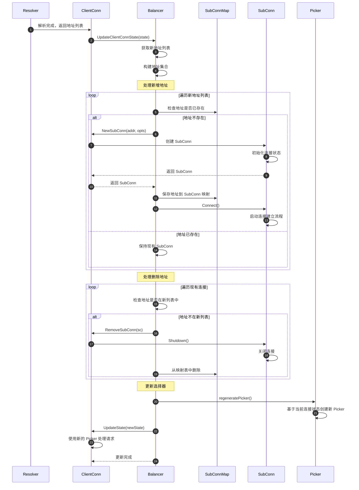
```mermaid
sequenceDiagram
    autonumber
    participant R as Resolver
    participant CC as ClientConn
    participant LB as Balancer
    participant SCM as SubConnMap
    participant SC as SubConn
    participant P as Picker
    
    R->>CC: 解析完成，返回地址列表
    CC->>LB: UpdateClientConnState(state)
    LB->>LB: 获取新地址列表
    LB->>LB: 构建地址集合
    
    Note over LB: 处理新增地址
    loop 遍历新地址列表
        LB->>SCM: 检查地址是否已存在
        alt 地址不存在
            LB->>CC: NewSubConn(addr, opts)
            CC->>SC: 创建 SubConn
            SC->>SC: 初始化连接状态
            SC-->>CC: 返回 SubConn
            CC-->>LB: 返回 SubConn
            LB->>SCM: 保存地址到 SubConn 映射
            LB->>SC: Connect()
            SC->>SC: 启动连接建立流程
        else 地址已存在
            LB->>LB: 保持现有 SubConn
        end
    end
    
    Note over LB: 处理删除地址
    loop 遍历现有连接
        LB->>LB: 检查地址是否在新列表中
        alt 地址不在新列表
            LB->>CC: RemoveSubConn(sc)
            CC->>SC: Shutdown()
            SC->>SC: 关闭连接
            LB->>SCM: 从映射表中删除
        end
    end
    
    Note over LB: 更新选择器
    LB->>P: regeneratePicker()
    P->>P: 基于当前连接状态创建新 Picker
    LB->>CC: UpdateState(newState)
    CC->>CC: 使用新的 Picker 处理请求
    LB-->>CC: 更新完成
```

**时序说明：**

1. **接收地址更新（步骤1-4）：**
   - 名称解析器完成解析
   - 通过 ClientConn 通知负载均衡器
   - 负载均衡器提取新地址列表

2. **处理新增地址（步骤5-17）：**
   - 遍历新地址列表
   - 为新地址创建子连接
   - 启动连接建立流程

3. **处理删除地址（步骤18-25）：**
   - 遍历现有连接
   - 删除不在新列表中的连接
   - 清理内部映射表

4. **更新选择器（步骤26-30）：**
   - 根据最新连接状态生成新的 Picker
   - 通知 ClientConn 使用新 Picker
   - 后续请求使用更新后的连接列表

**边界条件：**

- 地址列表为空时所有连接被删除
- 连接创建失败不影响其他连接
- 删除操作是异步的
- 状态更新是原子的

**性能要点：**

- 批量处理地址变更
- 增量更新，仅处理变化部分
- 异步连接建立不阻塞更新流程
- 最小化锁持有时间

---

## 4. 子连接管理时序图

### 场景描述
展示子连接从创建、连接建立、状态变更到关闭的完整生命周期。

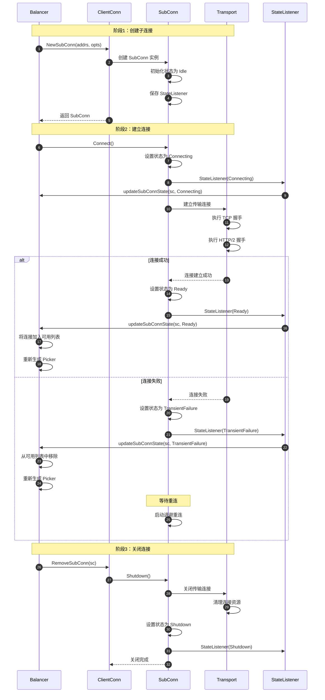
```mermaid
sequenceDiagram
    autonumber
    participant LB as Balancer
    participant CC as ClientConn
    participant SC as SubConn
    participant T as Transport
    participant SL as StateListener
    
    Note over LB,T: 阶段1：创建子连接
    LB->>CC: NewSubConn(addrs, opts)
    CC->>SC: 创建 SubConn 实例
    SC->>SC: 初始化状态为 Idle
    SC->>SC: 保存 StateListener
    CC-->>LB: 返回 SubConn
    
    Note over LB,T: 阶段2：建立连接
    LB->>SC: Connect()
    SC->>SC: 设置状态为 Connecting
    SC->>SL: StateListener(Connecting)
    SL->>LB: updateSubConnState(sc, Connecting)
    
    SC->>T: 建立传输连接
    T->>T: 执行 TCP 握手
    T->>T: 执行 HTTP/2 握手
    
    alt 连接成功
        T-->>SC: 连接建立成功
        SC->>SC: 设置状态为 Ready
        SC->>SL: StateListener(Ready)
        SL->>LB: updateSubConnState(sc, Ready)
        LB->>LB: 将连接加入可用列表
        LB->>LB: 重新生成 Picker
    else 连接失败
        T-->>SC: 连接失败
        SC->>SC: 设置状态为 TransientFailure
        SC->>SL: StateListener(TransientFailure)
        SL->>LB: updateSubConnState(sc, TransientFailure)
        LB->>LB: 从可用列表中移除
        LB->>LB: 重新生成 Picker
        
        Note over SC: 等待重连
        SC->>SC: 启动退避重连
    end
    
    Note over LB,T: 阶段3：关闭连接
    LB->>CC: RemoveSubConn(sc)
    CC->>SC: Shutdown()
    SC->>T: 关闭传输连接
    T->>T: 清理连接资源
    SC->>SC: 设置状态为 Shutdown
    SC->>SL: StateListener(Shutdown)
    SC-->>CC: 关闭完成
```

**时序说明：**

1. **创建阶段（步骤1-5）：**
   - 负载均衡器请求创建子连接
   - ClientConn 创建 SubConn 实例
   - 初始状态为 Idle（空闲）

2. **连接阶段（步骤6-22）：**
   - 调用 Connect() 开始建立连接
   - 状态变为 Connecting
   - 执行传输层握手（TCP、HTTP/2）
   - 根据结果设置为 Ready 或 TransientFailure

3. **关闭阶段（步骤23-29）：**
   - 负载均衡器请求删除子连接
   - 调用 Shutdown() 关闭连接
   - 清理传输层资源
   - 状态变为 Shutdown

**边界条件：**

- 连接失败会自动重试
- 状态变更通知是异步的
- 关闭操作是幂等的
- 状态机转换严格遵循规则

**性能要点：**

- 连接建立是异步非阻塞的
- 使用连接池复用底层连接
- 状态变更批量通知
- 退避算法避免连接风暴

---

## 5. 请求分发时序图

### 场景描述
展示客户端发起 RPC 请求时，负载均衡器如何选择合适的子连接进行请求分发。

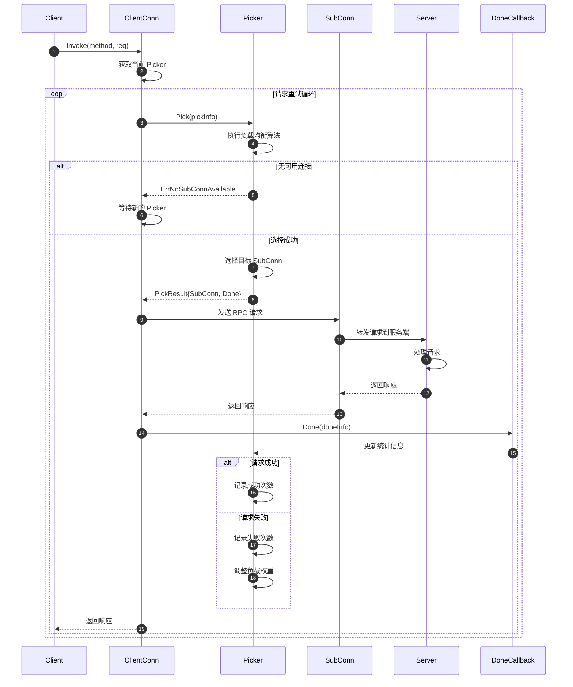
```mermaid
sequenceDiagram
    autonumber
    participant Client as Client
    participant CC as ClientConn
    participant Picker as Picker
    participant SC as SubConn
    participant Server as Server
    participant Done as DoneCallback
    
    Client->>CC: Invoke(method, req)
    CC->>CC: 获取当前 Picker
    
    loop 请求重试循环
        CC->>Picker: Pick(pickInfo)
        Picker->>Picker: 执行负载均衡算法
        
        alt 无可用连接
            Picker-->>CC: ErrNoSubConnAvailable
            CC->>CC: 等待新的 Picker
        else 选择成功
            Picker->>Picker: 选择目标 SubConn
            Picker-->>CC: PickResult{SubConn, Done}
            
            CC->>SC: 发送 RPC 请求
            SC->>Server: 转发请求到服务端
            Server->>Server: 处理请求
            Server-->>SC: 返回响应
            SC-->>CC: 返回响应
            
            CC->>Done: Done(doneInfo)
            Done->>Picker: 更新统计信息
            
            alt 请求成功
                Picker->>Picker: 记录成功次数
            else 请求失败
                Picker->>Picker: 记录失败次数
                Picker->>Picker: 调整负载权重
            end
            
            CC-->>Client: 返回响应
        end
    end
```

**时序说明：**

1. **请求初始化（步骤1-2）：**
   - 客户端发起 RPC 调用
   - ClientConn 获取当前的 Picker

2. **连接选择（步骤3-9）：**
   - 调用 Picker.Pick() 选择连接
   - 执行负载均衡算法
   - 返回选中的 SubConn 和回调函数

3. **请求执行（步骤10-15）：**
   - 通过选中的 SubConn 发送请求
   - 服务端处理请求并返回响应
   - ClientConn 接收响应

4. **完成回调（步骤16-22）：**
   - 调用 Done 回调通知请求完成
   - Picker 更新统计信息
   - 根据结果调整负载策略

**边界条件：**

- 无可用连接时会阻塞等待
- 请求失败会根据策略重试
- Done 回调可能不被调用（连接失败）
- Picker 可能在请求过程中被更新

**性能要点：**

- Pick 方法必须快速返回
- 使用原子操作避免锁竞争
- 异步执行 Done 回调
- 批量更新统计信息

---

## 6. 连接状态变更时序图

### 场景描述
展示子连接状态变化时，负载均衡器如何响应并更新请求分发策略。

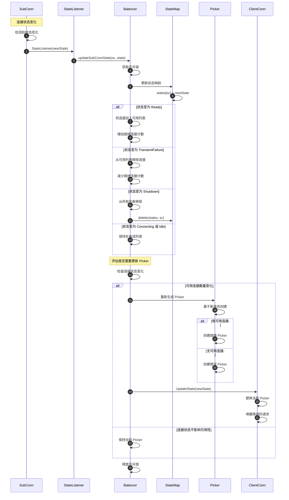
```mermaid
sequenceDiagram
    autonumber
    participant SC as SubConn
    participant SL as StateListener
    participant LB as Balancer
    participant State as StateMap
    participant Picker as Picker
    participant CC as ClientConn
    
    Note over SC: 连接状态变化
    SC->>SC: 检测到状态变化
    SC->>SL: StateListener(newState)
    SL->>LB: updateSubConnState(sc, state)
    
    LB->>LB: 获取互斥锁
    LB->>State: 更新状态映射
    State->>State: states[sc] = newState
    
    alt 状态变为 Ready
        LB->>LB: 将连接加入可用列表
        LB->>LB: 增加就绪连接计数
    else 状态变为 TransientFailure
        LB->>LB: 从可用列表移除连接
        LB->>LB: 减少就绪连接计数
    else 状态变为 Shutdown
        LB->>LB: 从所有列表移除
        LB->>State: delete(states, sc)
    else 状态变为 Connecting 或 Idle
        LB->>LB: 保持在备选列表
    end
    
    Note over LB: 评估是否需要更新 Picker
    LB->>LB: 检查连接状态变化
    
    alt 可用连接数量变化
        LB->>Picker: 重新生成 Picker
        Picker->>Picker: 基于新状态创建
        
        alt 有可用连接
            Picker->>Picker: 创建就绪 Picker
        else 无可用连接
            Picker->>Picker: 创建错误 Picker
        end
        
        LB->>CC: UpdateState(newState)
        CC->>CC: 替换当前 Picker
        CC->>CC: 唤醒等待的请求
    else 连接状态不影响可用性
        LB->>LB: 保持当前 Picker
    end
    
    LB->>LB: 释放互斥锁
```

**时序说明：**

1. **状态变更通知（步骤1-3）：**
   - 子连接检测到状态变化
   - 通过 StateListener 回调通知负载均衡器
   - 负载均衡器开始处理状态更新

2. **状态映射更新（步骤4-15）：**
   - 加锁保护状态映射
   - 根据新状态更新连接列表
   - 不同状态有不同的处理逻辑

3. **Picker 更新评估（步骤16-27）：**
   - 检查是否需要更新 Picker
   - 重新生成 Picker（如果需要）
   - 通知 ClientConn 使用新 Picker

**边界条件：**

- 状态变更回调是异步的
- 多个状态变更可能批量处理
- Picker 更新是原子的
- 等待中的请求会被唤醒

**性能要点：**

- 最小化锁持有时间
- 批量处理状态变更
- 增量更新 Picker
- 避免不必要的 Picker 重建

---

## 7. 负载均衡器关闭时序图

### 场景描述
展示客户端连接关闭时，负载均衡器如何清理资源和关闭所有子连接。

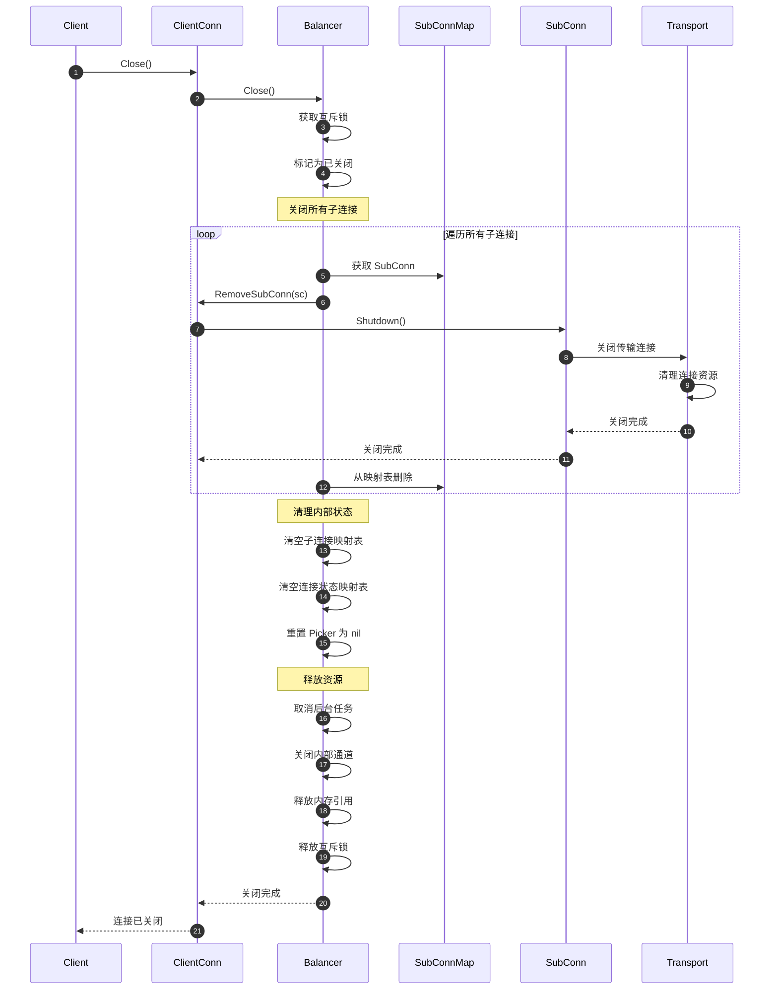
```mermaid
sequenceDiagram
    autonumber
    participant Client as Client
    participant CC as ClientConn
    participant LB as Balancer
    participant SCM as SubConnMap
    participant SC as SubConn
    participant T as Transport
    
    Client->>CC: Close()
    CC->>LB: Close()
    
    LB->>LB: 获取互斥锁
    LB->>LB: 标记为已关闭
    
    Note over LB: 关闭所有子连接
    loop 遍历所有子连接
        LB->>SCM: 获取 SubConn
        LB->>CC: RemoveSubConn(sc)
        CC->>SC: Shutdown()
        SC->>T: 关闭传输连接
        T->>T: 清理连接资源
        T-->>SC: 关闭完成
        SC-->>CC: 关闭完成
        LB->>SCM: 从映射表删除
    end
    
    Note over LB: 清理内部状态
    LB->>LB: 清空子连接映射表
    LB->>LB: 清空连接状态映射表
    LB->>LB: 重置 Picker 为 nil
    
    Note over LB: 释放资源
    LB->>LB: 取消后台任务
    LB->>LB: 关闭内部通道
    LB->>LB: 释放内存引用
    
    LB->>LB: 释放互斥锁
    LB-->>CC: 关闭完成
    CC-->>Client: 连接已关闭
```

**时序说明：**

1. **关闭触发（步骤1-3）：**
   - 客户端调用 Close() 关闭连接
   - ClientConn 通知负载均衡器关闭
   - 负载均衡器加锁并标记关闭状态

2. **关闭子连接（步骤4-13）：**
   - 遍历所有子连接
   - 逐个关闭子连接
   - 清理传输层资源

3. **清理内部状态（步骤14-17）：**
   - 清空所有内部映射表
   - 重置 Picker 引用
   - 准备资源释放

4. **释放资源（步骤18-22）：**
   - 取消后台任务
   - 关闭内部通道
   - 释放内存引用

**边界条件：**

- 关闭操作是幂等的
- 关闭过程中的请求会失败
- 子连接关闭是异步的
- 资源释放必须完整

**性能要点：**

- 并行关闭子连接
- 超时控制避免永久阻塞
- 及时释放资源避免泄漏
- 优雅关闭不影响其他连接

## 系统级场景时序图

### Round Robin 完整流程

展示使用 Round Robin 负载均衡策略的完整请求流程，从地址解析到请求分发的全过程。

### 连接失败恢复

展示连接失败时的退避重连机制，以及负载均衡器如何在部分连接失败时保持服务可用。

### 地址动态更新

展示服务端实例动态扩缩容时，负载均衡器如何无缝切换连接，保证请求不中断。

这些时序图展示了 gRPC-Go 负载均衡模块在各种场景下的完整工作流程，帮助开发者理解负载均衡的内部机制，为性能优化和故障排查提供指导。

---
