# grpc-go-04-服务发现

## 模块概览

## 模块职责与边界

### 核心职责
服务发现模块（Resolver）是 gRPC-Go 客户端连接管理的关键组件，负责将抽象的服务名称解析为具体的网络地址列表。该模块支持多种解析策略，包括 DNS 解析、直连模式、Unix Socket 等，并能动态监控地址变化，为负载均衡器提供最新的后端服务实例信息。

### 输入输出
- **输入：**
  - 目标服务名称（Target）
  - 解析选项和配置
  - 解析触发请求（ResolveNow）

- **输出：**
  - 解析状态（State）包含地址列表
  - 服务配置信息
  - 解析错误通知
  - 地址变化事件

### 上下游依赖
- **上游依赖：**
  - ClientConn（客户端连接）
  - 外部服务发现系统（DNS、注册中心等）
- **下游依赖：**
  - Balancer（负载均衡模块）
  - ServiceConfig（服务配置）

### 生命周期
1. **注册阶段：** 通过 `Register()` 注册解析器构建器
2. **构建阶段：** 根据 Target 的 scheme 选择合适的解析器
3. **解析阶段：** 执行名称解析，获取地址列表
4. **监控阶段：** 持续监控地址变化并通知客户端
5. **关闭阶段：** 清理资源和停止监控

## 模块架构图

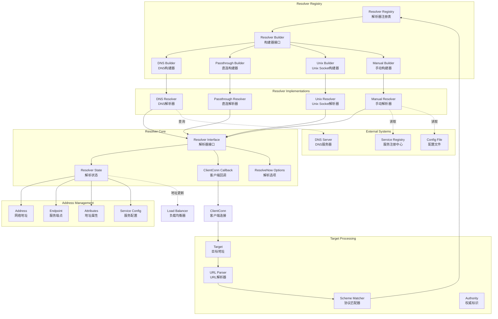

**架构说明：**

1. **注册表层：**
   - `Resolver Registry` 管理所有已注册的解析器构建器
   - 根据 Target 的 scheme 选择合适的构建器
   - 支持运行时动态注册新的解析器类型

2. **目标处理层：**
   - `Target` 结构解析和验证目标地址格式
   - `URL Parser` 解析标准 URL 格式的目标地址
   - `Scheme Matcher` 根据协议选择对应的解析器

3. **解析器核心层：**
   - `Resolver` 接口定义解析器的核心行为
   - `State` 封装解析结果和服务配置
   - `ClientConn` 回调接口通知地址变化

4. **地址管理层：**
   - `Address` 表示单个网络地址
   - `Endpoint` 表示服务端点，可包含多个地址
   - `Attributes` 存储地址相关的元数据

5. **解析器实现层：**
   - 内置多种解析器实现
   - 支持自定义解析器扩展
   - 每种解析器适用不同的使用场景

**设计原则：**

- **可扩展性：** 支持自定义解析器实现
- **协议无关：** 通过 scheme 机制支持多种协议
- **状态驱动：** 基于状态变化进行通知
- **异步处理：** 非阻塞的地址解析和更新

## 核心接口与数据结构

### Builder 接口

```go
type Builder interface {
    // Build 创建解析器实例
    Build(target Target, cc ClientConn, opts BuildOptions) (Resolver, error)
    
    // Scheme 返回支持的协议名称
    Scheme() string
}
```

### Resolver 接口

```go
type Resolver interface {
    // ResolveNow 触发立即解析
    ResolveNow(ResolveNowOptions)
    
    // Close 关闭解析器
    Close()
}
```

### Target 结构

```go
type Target struct {
    // URL 包含解析后的目标地址
    URL url.URL
}

// 目标地址格式示例：
// dns:///example.com:80
// passthrough:///localhost:50051
// unix:///tmp/grpc.sock
```

### State 结构

```go
type State struct {
    // Addresses 解析得到的地址列表
    Addresses []Address
    
    // Endpoints 服务端点列表（新版本推荐）
    Endpoints []Endpoint
    
    // ServiceConfig 服务配置解析结果
    ServiceConfig *serviceconfig.ParseResult
    
    // Attributes 解析器相关属性
    Attributes *attributes.Attributes
}
```

### Address 结构

```go
type Address struct {
    // Addr 服务器地址
    Addr string
    
    // ServerName TLS 服务器名称
    ServerName string
    
    // Attributes 地址相关属性
    Attributes *attributes.Attributes
    
    // BalancerAttributes 负载均衡器属性
    BalancerAttributes *attributes.Attributes
    
    // Metadata 地址元数据（已废弃）
    Metadata any
}
```

## 内置解析器实现

### 1. DNS Resolver

**功能描述：**

- 通过 DNS 查询解析服务名为 IP 地址列表
- 支持 A、AAAA、SRV 记录查询
- 自动处理 DNS 缓存和 TTL

**Target 格式：**

```
dns:///example.com:80
dns://8.8.8.8/example.com:80  // 指定 DNS 服务器
```

**实现特点：**

```go
type dnsResolver struct {
    host         string
    port         string
    resolver     netResolver
    wg           sync.WaitGroup
    cc           resolver.ClientConn
    rn           chan struct{}
    disableServiceConfig bool
}

func (d *dnsResolver) ResolveNow(resolver.ResolveNowOptions) {
    select {
    case d.rn <- struct{}{}:
    default:
    }
}

func (d *dnsResolver) watcher() {
    defer d.wg.Done()
    for {
        select {
        case <-d.ctx.Done():
            return
        case <-d.rn:
            // 执行 DNS 查询
            state, err := d.lookup()
            if err != nil {
                d.cc.ReportError(err)
            } else {
                d.cc.UpdateState(state)
            }
        case <-time.After(30 * time.Minute):
            // 定期刷新
            d.ResolveNow(resolver.ResolveNowOptions{})
        }
    }
}
```

**适用场景：**

- 标准的服务发现场景
- 需要动态地址解析
- 支持 DNS 负载均衡

### 2. Passthrough Resolver

**功能描述：**

- 直接使用提供的地址，不进行解析
- 适用于已知确切地址的场景
- 最简单的解析器实现

**Target 格式：**

```
passthrough:///localhost:50051
passthrough:///192.168.1.100:8080
```

**实现特点：**

```go
type passthroughResolver struct {
    target resolver.Target
    cc     resolver.ClientConn
}

func (r *passthroughResolver) start() {
    // 直接使用 target 中的地址
    addr := resolver.Address{Addr: r.target.Endpoint()}
    r.cc.UpdateState(resolver.State{Addresses: []resolver.Address{addr}})
}

func (r *passthroughResolver) ResolveNow(resolver.ResolveNowOptions) {
    // 无需额外操作
}
```

**适用场景：**

- 开发测试环境
- 已知固定地址的服务
- 不需要服务发现的场景

### 3. Unix Socket Resolver

**功能描述：**

- 解析 Unix Domain Socket 地址
- 支持本地进程间通信
- 高性能的本地连接方式

**Target 格式：**

```
unix:///tmp/grpc.sock
unix:///var/run/service.sock
```

**实现特点：**

```go
type unixResolver struct {
    target resolver.Target
    cc     resolver.ClientConn
}

func (r *unixResolver) start() {
    // Unix socket 地址处理
    addr := resolver.Address{
        Addr: r.target.URL.Path, // 使用完整路径
    }
    r.cc.UpdateState(resolver.State{Addresses: []resolver.Address{addr}})
}
```

**适用场景：**

- 本地微服务通信
- 高性能要求的场景
- 容器内服务通信

### 4. Manual Resolver

**功能描述：**

- 手动控制地址列表
- 支持动态添加/删除地址
- 适用于测试和特殊场景

**使用示例：**

```go
r := manual.NewBuilderWithScheme("manual")
r.InitialState(resolver.State{
    Addresses: []resolver.Address{
        {Addr: "localhost:50051"},
        {Addr: "localhost:50052"},
    },
})

conn, err := grpc.NewClient("manual:///test", grpc.WithResolvers(r))

// 动态更新地址
r.UpdateState(resolver.State{
    Addresses: []resolver.Address{
        {Addr: "localhost:50053"},
    },
})
```

**适用场景：**

- 单元测试和集成测试
- 需要精确控制地址变化的场景
- 自定义服务发现逻辑

## 解析流程与状态管理

### 解析器创建流程

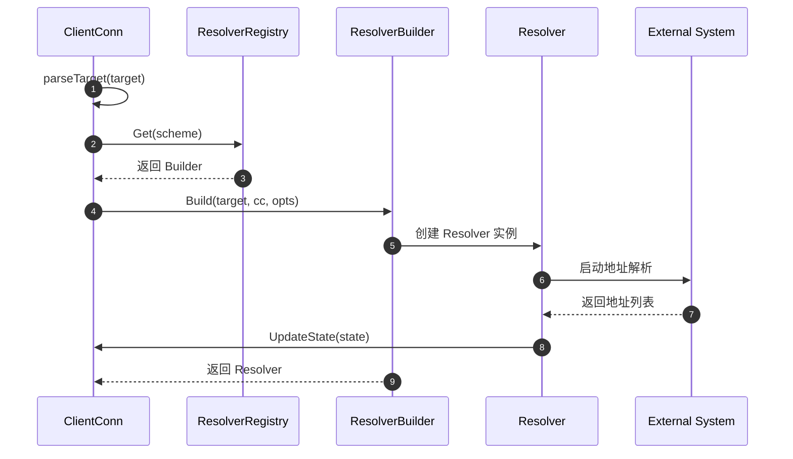

### 地址更新流程

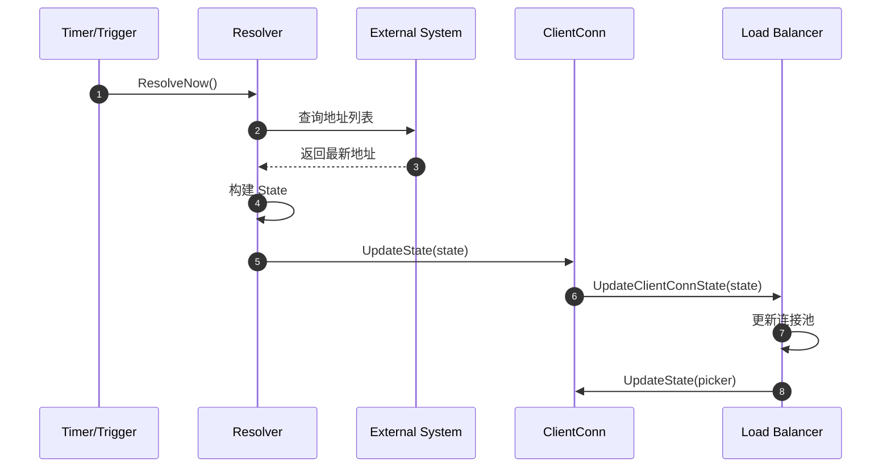

## 服务配置集成

### 服务配置格式

```json
{
  "loadBalancingPolicy": "round_robin",
  "methodConfig": [{
    "name": [{"service": "example.Service"}],
    "waitForReady": true,
    "timeout": "10s",
    "maxRequestMessageBytes": 1024,
    "maxResponseMessageBytes": 1024,
    "retryPolicy": {
      "maxAttempts": 3,
      "initialBackoff": "0.1s",
      "maxBackoff": "1s",
      "backoffMultiplier": 2,
      "retryableStatusCodes": ["UNAVAILABLE"]
    }
  }]
}
```

### DNS TXT 记录服务配置

```bash
# DNS TXT 记录示例
_grpc_config.example.com. 300 IN TXT "grpc_config=[{\"serviceConfig\":{\"loadBalancingPolicy\":\"round_robin\"}}]"
```

### 服务配置解析

```go
func (d *dnsResolver) lookupTXT() (*serviceconfig.ParseResult, error) {
    // 查询 DNS TXT 记录
    txtRecords, err := d.resolver.LookupTXT(d.ctx, "_grpc_config."+d.host)
    if err != nil {
        return nil, err
    }
    
    // 解析服务配置
    for _, txt := range txtRecords {
        if strings.HasPrefix(txt, "grpc_config=") {
            config := strings.TrimPrefix(txt, "grpc_config=")
            return d.cc.ParseServiceConfig(config), nil
        }
    }
    
    return nil, nil
}
```

## 自定义解析器实现

### 实现步骤

1. **实现 Builder 接口：**

```go
type customBuilder struct{}

func (b *customBuilder) Build(target resolver.Target, cc resolver.ClientConn, opts resolver.BuildOptions) (resolver.Resolver, error) {
    r := &customResolver{
        target: target,
        cc:     cc,
        close:  make(chan struct{}),
    }
    go r.start()
    return r, nil
}

func (b *customBuilder) Scheme() string {
    return "custom"
}
```

1. **实现 Resolver 接口：**

```go
type customResolver struct {
    target resolver.Target
    cc     resolver.ClientConn
    close  chan struct{}
}

func (r *customResolver) start() {
    // 实现自定义解析逻辑
    for {
        select {
        case <-r.close:
            return
        case <-time.After(30 * time.Second):
            // 定期更新地址
            r.resolve()
        }
    }
}

func (r *customResolver) resolve() {
    // 自定义地址解析逻辑
    addresses := r.discoverServices(r.target.Endpoint())
    
    state := resolver.State{
        Addresses: addresses,
    }
    
    r.cc.UpdateState(state)
}

func (r *customResolver) ResolveNow(resolver.ResolveNowOptions) {
    go r.resolve()
}

func (r *customResolver) Close() {
    close(r.close)
}
```

1. **注册解析器：**

```go
func init() {
    resolver.Register(&customBuilder{})
}
```

## 性能优化与最佳实践

### 性能特点
- **异步解析：** 解析过程不阻塞 RPC 调用
- **缓存机制：** DNS 解析结果缓存，减少查询频率
- **批量更新：** 地址变化批量通知，减少更新开销
- **连接复用：** 解析器实例复用，避免重复创建

### 最佳实践

1. **选择合适的解析器：**
   - 生产环境推荐使用 DNS 解析器
   - 开发测试可使用 passthrough 解析器
   - 本地通信优先考虑 unix socket

2. **DNS 解析优化：**
   - 配置合理的 DNS 缓存 TTL
   - 使用可靠的 DNS 服务器
   - 监控 DNS 查询延迟和失败率

3. **错误处理：**
   - 实现解析失败的重试机制
   - 记录解析错误日志便于排查
   - 提供降级方案应对解析失败

4. **监控告警：**
   - 监控地址解析成功率
   - 跟踪地址变化频率
   - 设置解析延迟阈值告警

5. **服务配置管理：**
   - 合理配置负载均衡策略
   - 设置适当的超时和重试参数
   - 定期验证服务配置的有效性

通过服务发现模块的灵活设计，gRPC-Go 能够适应各种部署环境和服务发现需求，为分布式系统提供可靠的服务定位能力。

---

## API接口

## API 概览

服务发现模块提供了完整的名称解析框架，负责将服务名称转换为可连接的网络地址列表。该模块支持多种解析策略（DNS、直连、Unix Socket等），并能动态监控地址变化，为负载均衡器提供实时的后端实例信息。

## 核心 API 列表

### 解析器管理 API
- `Register()` - 注册解析器构建器
- `Get()` - 获取已注册的解析器构建器
- `SetDefaultScheme()` - 设置默认解析协议
- `GetDefaultScheme()` - 获取默认解析协议

### 解析器接口 API
- `Builder.Build()` - 创建解析器实例
- `Builder.Scheme()` - 获取解析器协议名
- `Resolver.ResolveNow()` - 立即触发解析
- `Resolver.Close()` - 关闭解析器

### 状态更新 API
- `ClientConn.UpdateState()` - 更新解析状态
- `ClientConn.ReportError()` - 报告解析错误
- `ClientConn.ParseServiceConfig()` - 解析服务配置

---

## API 详细规格

### 1. Register

#### 基本信息
- **名称：** `Register`
- **签名：** `func Register(b Builder)`
- **功能：** 注册解析器构建器到全局注册表
- **幂等性：** 否，后注册的会覆盖先注册的同名构建器

#### 请求参数

```go
// Builder 解析器构建器接口
type Builder interface {
    // Build 创建新的解析器实例
    Build(target Target, cc ClientConn, opts BuildOptions) (Resolver, error)
    // Scheme 返回解析器支持的协议名
    Scheme() string
}
```

**参数说明表**

| 参数 | 类型 | 必填 | 约束 | 说明 |
|------|------|:----:|------|------|
| b | Builder | 是 | 实现 Builder 接口 | 解析器构建器 |

#### 入口函数实现

```go
func Register(b Builder) {
    // 使用 Scheme 作为键注册构建器
    m[b.Scheme()] = b
}
```

---

### 2. Builder.Build

#### 基本信息
- **名称：** `Build`
- **签名：** `func Build(target Target, cc ClientConn, opts BuildOptions) (Resolver, error)`
- **功能：** 创建解析器实例并开始解析

#### 请求参数

```go
// Target 解析目标
type Target struct {
    URL url.URL  // 解析的目标URL
}

// ClientConn 客户端连接回调接口
type ClientConn interface {
    UpdateState(State) error
    ReportError(error)
    ParseServiceConfig(serviceConfigJSON string) *serviceconfig.ParseResult
}

// BuildOptions 构建选项
type BuildOptions struct {
    DialCreds      credentials.TransportCredentials
    CredsBundle    credentials.Bundle
    Dialer         func(context.Context, string) (net.Conn, error)
    Authority      string
}
```

**参数说明表**

| 参数 | 类型 | 必填 | 约束 | 说明 |
|------|------|:----:|------|------|
| target | Target | 是 | 有效的目标地址 | 解析目标 |
| cc | ClientConn | 是 | 有效的回调接口 | 客户端连接回调 |
| opts | BuildOptions | 是 | 构建选项 | 解析器构建选项 |

#### 响应结果

```go
// Resolver 解析器接口
type Resolver interface {
    ResolveNow(ResolveNowOptions)
    Close()
}
```

---

### 3. Resolver.ResolveNow

#### 基本信息
- **名称：** `ResolveNow`
- **签名：** `func ResolveNow(opts ResolveNowOptions)`
- **功能：** 立即触发一次名称解析
- **幂等性：** 是，多次调用安全

#### 请求参数

```go
// ResolveNowOptions 解析选项
type ResolveNowOptions struct{}
```

#### 入口函数实现（DNS示例）

```go
func (d *dnsResolver) ResolveNow(opts resolver.ResolveNowOptions) {
    select {
    case d.rn <- struct{}{}:
    default:
    }
}
```

---

### 4. ClientConn.UpdateState

#### 基本信息
- **名称：** `UpdateState`
- **签名：** `func UpdateState(s State) error`
- **功能：** 更新解析状态，通知新的地址列表

#### 请求参数

```go
// State 解析器状态
type State struct {
    Addresses     []Address                     // 地址列表
    ServiceConfig *serviceconfig.ParseResult    // 服务配置
    Attributes    *attributes.Attributes        // 属性信息
}

// Address 网络地址
type Address struct {
    Addr       string                    // 网络地址
    ServerName string                    // 服务器名称
    Attributes *attributes.Attributes    // 地址属性
    Metadata   any                       // 元数据
}
```

**参数说明表**

| 参数 | 类型 | 必填 | 约束 | 说明 |
|------|------|:----:|------|------|
| s | State | 是 | 非空状态 | 解析器状态 |

---

## 内置解析器

### DNS 解析器

```go
// DNS 解析器实现
type dnsBuilder struct{}

func (b *dnsBuilder) Build(target resolver.Target, cc resolver.ClientConn, opts resolver.BuildOptions) (resolver.Resolver, error) {
    host, port, err := parseTarget(target.Endpoint())
    if err != nil {
        return nil, err
    }
    
    d := &dnsResolver{
        host: host,
        port: port,
        cc:   cc,
        rn:   make(chan struct{}, 1),
    }
    
    // 启动解析协程
    go d.watcher()
    
    // 立即执行一次解析
    d.ResolveNow(resolver.ResolveNowOptions{})
    
    return d, nil
}
```

### Passthrough 解析器

```go
// 直连解析器实现
type passthroughBuilder struct{}

func (b *passthroughBuilder) Build(target resolver.Target, cc resolver.ClientConn, opts resolver.BuildOptions) (resolver.Resolver, error) {
    addr := resolver.Address{Addr: target.Endpoint()}
    cc.UpdateState(resolver.State{Addresses: []resolver.Address{addr}})
    return &passthroughResolver{}, nil
}
```

## 使用示例

### 注册自定义解析器

```go
package main

import (
    "google.golang.org/grpc/resolver"
)

type customResolver struct {
    cc resolver.ClientConn
}

type customBuilder struct{}

func (b *customBuilder) Build(target resolver.Target, cc resolver.ClientConn, opts resolver.BuildOptions) (resolver.Resolver, error) {
    r := &customResolver{cc: cc}
    
    // 执行自定义解析逻辑
    go r.start()
    
    return r, nil
}

func (b *customBuilder) Scheme() string {
    return "custom"
}

func (r *customResolver) ResolveNow(opts resolver.ResolveNowOptions) {
    // 触发立即解析
}

func (r *customResolver) Close() {
    // 清理资源
}

func init() {
    resolver.Register(&customBuilder{})
}
```

### 使用解析器

```go
func main() {
    // 使用 DNS 解析器
    conn, err := grpc.Dial(
        "dns:///example.com:50051",
        grpc.WithTransportCredentials(insecure.NewCredentials()),
    )
    
    // 使用自定义解析器
    conn2, err := grpc.Dial(
        "custom:///my-service",
        grpc.WithTransportCredentials(insecure.NewCredentials()),
    )
}
```

## 最佳实践

1. **解析器选择**
   - DNS：适用于标准服务发现
   - Passthrough：适用于直连场景
   - 自定义：集成服务注册中心

2. **性能优化**
   - 缓存解析结果
   - 合理设置解析间隔
   - 异步解析不阻塞

3. **错误处理**
   - 解析失败时的降级策略
   - 重试机制和退避算法
   - 及时报告解析错误

4. **动态更新**
   - 监听地址变化
   - 增量更新地址列表
   - 平滑切换后端实例

---

## 数据结构

## 数据结构概览

服务发现模块的数据结构设计体现了名称解析的完整流程，包括目标解析、地址管理、状态同步、配置传递等各个方面。所有数据结构都经过精心设计以支持多种解析策略和动态更新机制。

## 核心数据结构 UML 图

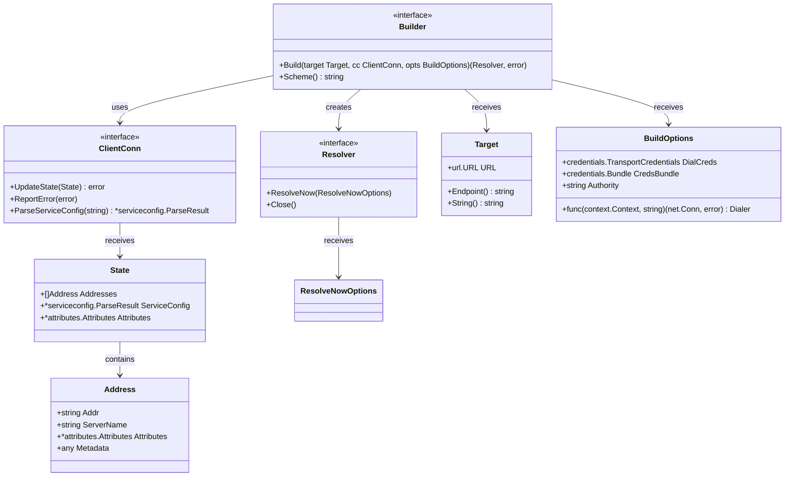

**UML 图说明：**

1. **Builder 接口：** 解析器构建器，创建具体的解析器实例
2. **Resolver 接口：** 核心解析器接口，处理名称解析和监控
3. **ClientConn 接口：** 客户端连接回调接口，通知解析结果
4. **Target 结构：** 解析目标，包含协议和端点信息
5. **State 结构：** 解析状态，包含地址列表和服务配置
6. **Address 结构：** 网络地址信息，包含连接所需的完整信息

## 详细数据结构分析

### 1. Target 结构

```go
// Target 解析目标结构
type Target struct {
    // URL 解析后的目标URL
    // 格式：scheme://authority/endpoint?query
    URL url.URL
}

// Endpoint 获取端点地址
func (t Target) Endpoint() string {
    endpoint := t.URL.Path
    if endpoint == "" {
        endpoint = t.URL.Opaque
    }
    return strings.TrimPrefix(endpoint, "/")
}

// String 返回目标的字符串表示
func (t Target) String() string {
    return t.URL.Scheme + "://" + t.URL.Host + "/" + t.Endpoint()
}
```

**字段说明：**

| 字段 | 类型 | 作用 | 示例 |
|------|------|------|------|
| URL | url.URL | 解析后的完整URL | dns:///example.com:50051 |
| Scheme | string | 解析协议 | dns, passthrough, unix |
| Host | string | 权威标识 | example.com |
| Path/Opaque | string | 端点地址 | /service, 127.0.0.1:50051 |

### 2. State 结构

```go
// State 解析器状态
type State struct {
    // Addresses 解析到的地址列表
    Addresses []Address
    
    // ServiceConfig 服务配置（可选）
    ServiceConfig *serviceconfig.ParseResult
    
    // Attributes 附加属性信息
    Attributes *attributes.Attributes
}
```

**字段说明：**

| 字段 | 类型 | 必填 | 作用 |
|------|------|:----:|------|
| Addresses | []Address | 是 | 后端服务地址列表 |
| ServiceConfig | *serviceconfig.ParseResult | 否 | 服务配置信息 |
| Attributes | *attributes.Attributes | 否 | 自定义属性 |

### 3. Address 结构

```go
// Address 网络地址
type Address struct {
    // Addr 网络地址，格式：host:port
    Addr string
    
    // ServerName 服务器名称，用于TLS验证
    ServerName string
    
    // Attributes 地址属性
    Attributes *attributes.Attributes
    
    // Metadata 元数据（已废弃，使用Attributes）
    Metadata any
}
```

**字段说明：**

| 字段 | 类型 | 必填 | 作用 |
|------|------|:----:|------|
| Addr | string | 是 | 可连接的网络地址 |
| ServerName | string | 否 | TLS握手使用的服务器名 |
| Attributes | *attributes.Attributes | 否 | 负载均衡等使用的属性 |
| Metadata | any | 否 | 已废弃字段 |

### 4. BuildOptions 结构

```go
// BuildOptions 解析器构建选项
type BuildOptions struct {
    // DialCreds 拨号传输凭证
    DialCreds credentials.TransportCredentials
    
    // CredsBundle 凭证包
    CredsBundle credentials.Bundle
    
    // Dialer 自定义拨号函数
    Dialer func(context.Context, string) (net.Conn, error)
    
    // Authority 权威标识
    Authority string
}
```

## DNS 解析器实现

```mermaid
classDiagram
    class dnsBuilder {
        +Build(target Target, cc ClientConn, opts BuildOptions) (Resolver, error)
        +Scheme() string
    }
    
    class dnsResolver {
        +string host
        +string port
        +ClientConn cc
        +chan struct{} rn
        +time.Time lastResolveTime
        +watcher()
        +lookup()
        +ResolveNow(ResolveNowOptions)
        +Close()
    }
    
    dnsBuilder --> dnsResolver : creates
```

```go
// DNS 解析器实现
type dnsResolver struct {
    host string
    port string
    cc   resolver.ClientConn
    
    // 解析触发通道
    rn chan struct{}
    
    // 关闭通道
    ctx    context.Context
    cancel context.CancelFunc
    
    // 最后解析时间
    lastResolveTime time.Time
}

// watcher 解析监控协程
func (d *dnsResolver) watcher() {
    for {
        select {
        case <-d.ctx.Done():
            return
        case <-d.rn:
            d.lookup()
        case <-time.After(30 * time.Minute):
            d.lookup()
        }
    }
}

// lookup 执行DNS查询
func (d *dnsResolver) lookup() {
    // 查询DNS记录
    addrs, err := net.LookupHost(d.host)
    if err != nil {
        d.cc.ReportError(err)
        return
    }
    
    // 构建地址列表
    var resolvedAddrs []resolver.Address
    for _, addr := range addrs {
        resolvedAddrs = append(resolvedAddrs, resolver.Address{
            Addr: net.JoinHostPort(addr, d.port),
        })
    }
    
    // 更新状态
    d.cc.UpdateState(resolver.State{
        Addresses: resolvedAddrs,
    })
}
```

## Manual 解析器实现

```go
// Manual 解析器（用于测试）
type Resolver struct {
    BuildCallback       func(Target, ClientConn, BuildOptions)
    UpdateStateCallback func(error)
    ResolveNowCallback  func(ResolveNowOptions)
    CloseCallback       func()
    
    scheme        string
    mu            sync.Mutex
    cc            ClientConn
    lastSeenState *State
}

// UpdateState 手动更新地址
func (r *Resolver) UpdateState(s State) {
    r.mu.Lock()
    defer r.mu.Unlock()
    
    r.lastSeenState = &s
    if r.cc != nil {
        err := r.cc.UpdateState(s)
        go r.UpdateStateCallback(err)
    }
}
```

## 数据流转图

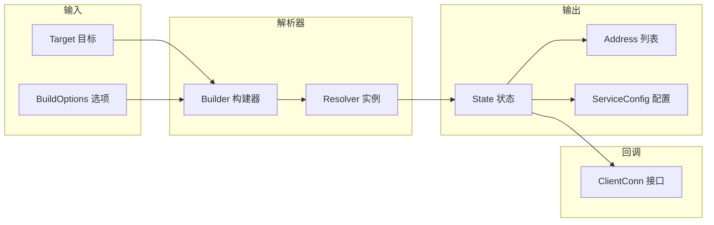

## 最佳实践

1. **地址格式**
   - 使用标准的 host:port 格式
   - IPv6 地址需要用方括号包裹
   - 确保地址可连接

2. **属性使用**
   - 使用 Attributes 而非 Metadata
   - 合理设置负载均衡属性
   - 避免过大的属性数据

3. **状态更新**
   - 仅在地址变更时更新状态
   - 批量更新减少通知次数
   - 保持状态一致性

4. **错误处理**
   - 及时报告解析错误
   - 区分临时错误和永久错误
   - 提供有意义的错误信息

---

## 时序图

## 时序图概览

本文档详细描述了 gRPC-Go 服务发现模块的各种时序流程，包括解析器注册、初始化、名称解析、状态更新、错误处理等核心场景。每个时序图都配有详细的文字说明，帮助理解服务发现的完整工作流程。

## 核心时序图列表

1. **解析器注册时序图** - 解析器的注册和查找流程
2. **解析器初始化时序图** - 解析器实例的创建和启动
3. **DNS解析时序图** - DNS名称解析的完整流程
4. **地址更新时序图** - 解析结果向客户端的通知流程
5. **立即解析时序图** - ResolveNow触发的解析流程
6. **解析错误处理时序图** - 解析失败的错误处理机制
7. **解析器关闭时序图** - 解析器的清理和关闭流程

---

## 1. 解析器注册时序图

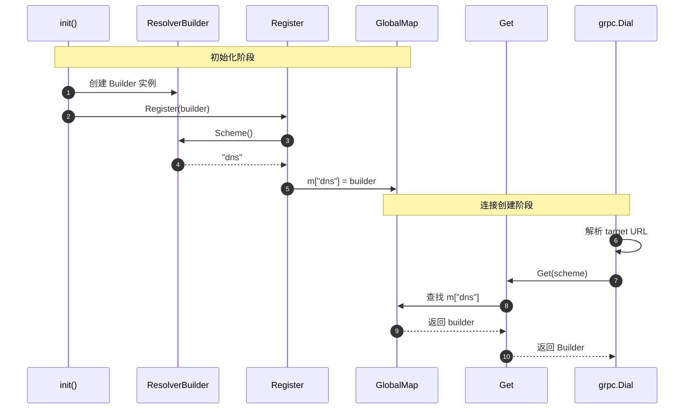

---

## 2. 解析器初始化时序图

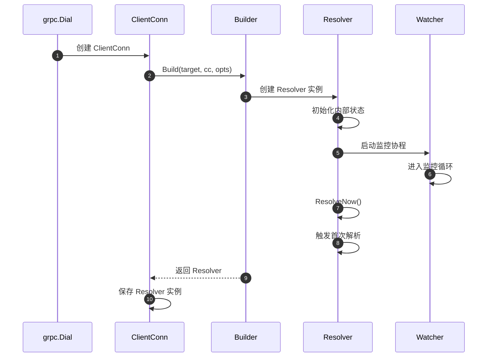

---

## 3. DNS解析时序图

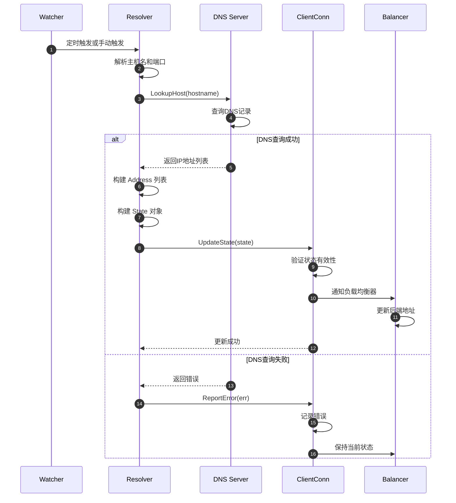

---

## 4. 地址更新时序图

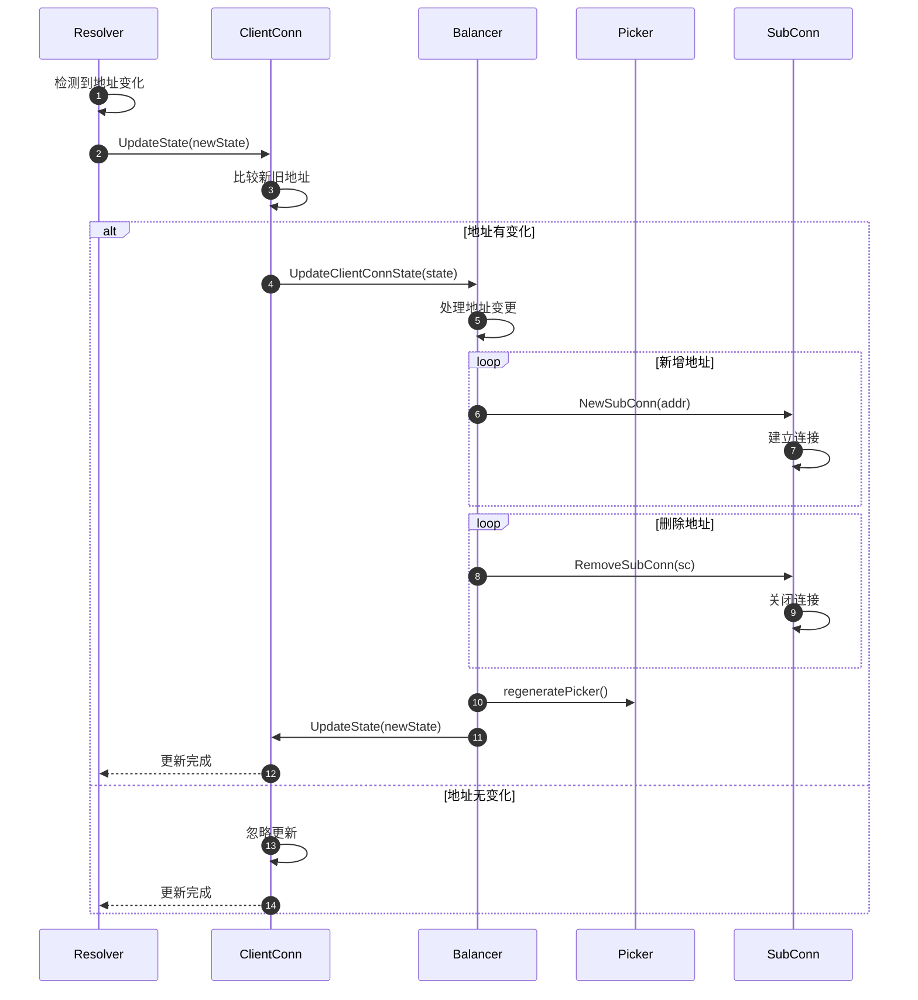

---

## 5. 立即解析时序图

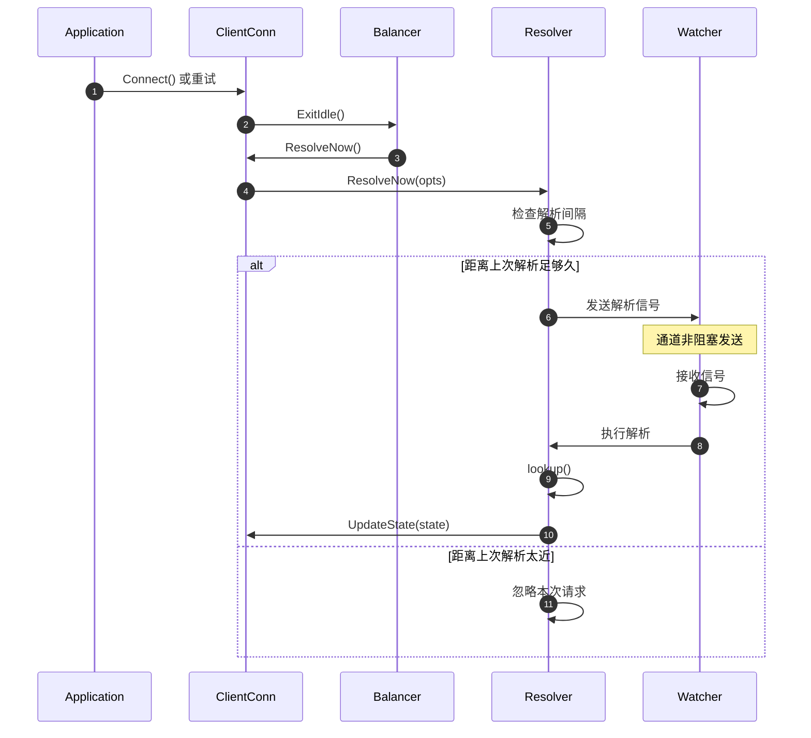

---

## 6. 解析错误处理时序图

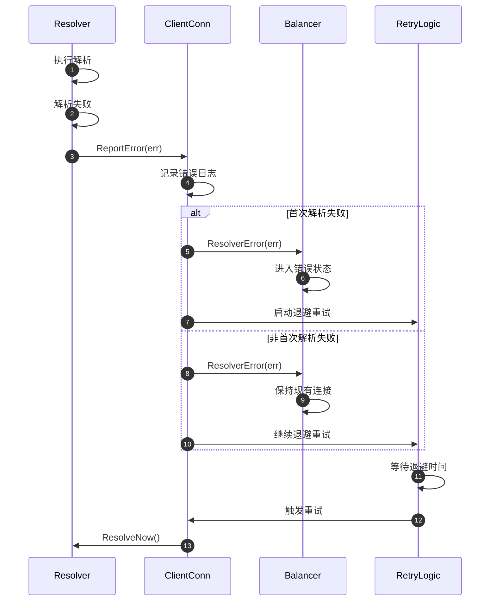

---

## 7. 解析器关闭时序图

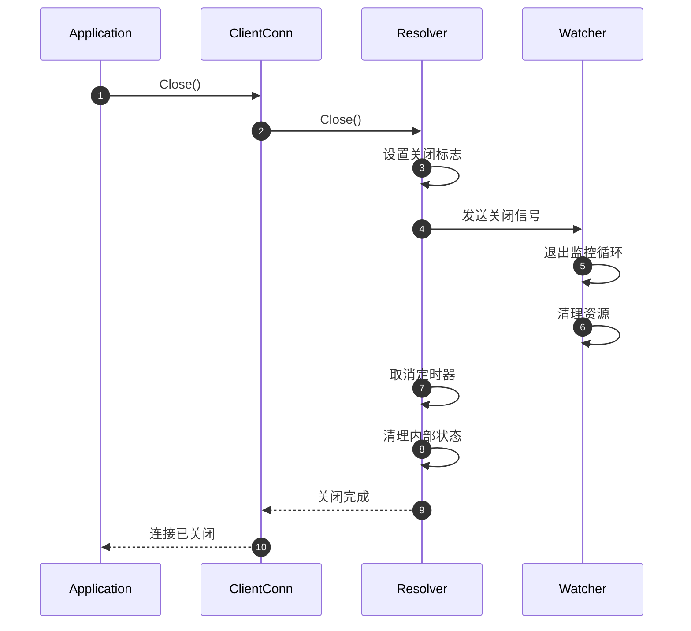

这些时序图展示了 gRPC-Go 服务发现模块在各种场景下的完整工作流程，帮助开发者理解名称解析的内部机制，为服务发现集成和故障排查提供指导。

---
