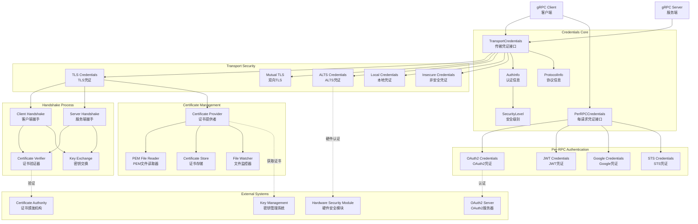

# gRPC-Go 认证凭证模块概览

## 模块职责与边界

### 核心职责
认证凭证模块（Credentials）是 gRPC-Go 安全体系的核心组件，负责提供完整的身份认证和传输安全解决方案。该模块封装了各种认证机制，包括传输层安全（TLS）、每请求认证（OAuth2、JWT）、Google Cloud 认证、ALTS 等，确保 gRPC 通信的安全性和可信性。

### 输入输出
- **输入：**
  - 证书文件和私钥
  - 认证令牌和凭据
  - 安全配置参数
  - 连接握手信息

- **输出：**
  - 安全连接（加密后的 net.Conn）
  - 认证信息（AuthInfo）
  - 请求元数据（Headers）
  - 安全级别标识

### 上下游依赖
- **上游依赖：**
  - ClientConn/Server（连接管理）
  - Transport（传输层）
- **下游依赖：**
  - TLS/SSL 协议栈
  - OAuth2/JWT 认证服务
  - 证书颁发机构（CA）
  - 密钥管理系统

### 生命周期
1. **初始化阶段：** 加载证书、密钥和配置参数
2. **握手阶段：** 执行认证握手建立安全连接
3. **运行期：** 提供请求级认证信息
4. **更新阶段：** 刷新令牌和证书轮换
5. **关闭阶段：** 清理敏感信息和资源

## 模块架构图



**架构说明：**

1. **凭证核心层：**
   - `TransportCredentials` 定义传输层安全接口
   - `PerRPCCredentials` 定义每请求认证接口
   - `AuthInfo` 封装认证结果信息
   - `SecurityLevel` 标识安全保护级别

2. **传输安全层：**
   - `TLS Credentials` 提供标准 TLS/SSL 加密
   - `Mutual TLS` 支持双向证书认证
   - `ALTS` 提供 Google Cloud 应用层传输安全
   - `Local Credentials` 用于本地安全连接

3. **请求认证层：**
   - `OAuth2` 支持标准 OAuth2 流程
   - `JWT` 支持 JSON Web Token 认证
   - `Google Credentials` 集成 Google Cloud 认证
   - `STS` 支持安全令牌服务

4. **证书管理层：**
   - `Certificate Provider` 抽象证书获取接口
   - `PEM File Reader` 读取 PEM 格式证书
   - `Certificate Store` 管理证书缓存
   - `File Watcher` 监控证书文件变化

5. **握手处理层：**
   - 实现客户端和服务端握手逻辑
   - 证书验证和密钥交换
   - 安全参数协商

**设计原则：**

- **分层设计：** 传输安全与应用认证分离
- **可插拔性：** 支持自定义认证实现
- **安全优先：** 默认要求传输安全
- **标准兼容：** 遵循安全标准和最佳实践

## 核心接口与实现

### TransportCredentials 接口

```go
type TransportCredentials interface {
    // ClientHandshake 执行客户端握手
    ClientHandshake(ctx context.Context, authority string, rawConn net.Conn) (net.Conn, AuthInfo, error)
    
    // ServerHandshake 执行服务端握手
    ServerHandshake(rawConn net.Conn) (net.Conn, AuthInfo, error)
    
    // Info 返回协议信息
    Info() ProtocolInfo
    
    // Clone 创建凭证副本
    Clone() TransportCredentials
    
    // OverrideServerName 覆盖服务器名称
    OverrideServerName(string) TransportCredentials
}
```

### PerRPCCredentials 接口

```go
type PerRPCCredentials interface {
    // GetRequestMetadata 获取请求元数据
    GetRequestMetadata(ctx context.Context, uri ...string) (map[string]string, error)
    
    // RequireTransportSecurity 是否需要传输安全
    RequireTransportSecurity() bool
}
```

### AuthInfo 接口

```go
type AuthInfo interface {
    // AuthType 返回认证类型
    AuthType() string
}

type CommonAuthInfo struct {
    SecurityLevel SecurityLevel
}
```

## 传输安全实现

### 1. TLS Credentials

**功能描述：**

- 基于标准 TLS/SSL 协议提供传输加密
- 支持服务器证书验证
- 可配置加密套件和协议版本

**创建方式：**

```go
// 客户端 TLS（验证服务器证书）
creds := credentials.NewTLS(&tls.Config{
    ServerName: "example.com",
})

// 服务端 TLS
creds, err := credentials.NewServerTLSFromFile("server.crt", "server.key")

// 自定义 TLS 配置
creds := credentials.NewTLS(&tls.Config{
    Certificates: []tls.Certificate{cert},
    ClientAuth:   tls.RequireAndVerifyClientCert,
    ClientCAs:    caCertPool,
})
```

**实现特点：**

```go
type tlsCreds struct {
    config *tls.Config
}

func (c *tlsCreds) ClientHandshake(ctx context.Context, authority string, rawConn net.Conn) (net.Conn, AuthInfo, error) {
    // 1. 配置 TLS 连接
    cfg := cloneTLSConfig(c.config)
    if cfg.ServerName == "" {
        cfg.ServerName = authority
    }
    
    // 2. 执行 TLS 握手
    conn := tls.Client(rawConn, cfg)
    if err := conn.HandshakeContext(ctx); err != nil {
        return nil, nil, err
    }
    
    // 3. 构建认证信息
    authInfo := TLSInfo{
        State:       conn.ConnectionState(),
        CommonAuthInfo: CommonAuthInfo{
            SecurityLevel: PrivacyAndIntegrity,
        },
    }
    
    return conn, authInfo, nil
}
```

**适用场景：**

- 标准的客户端-服务器 TLS 通信
- 需要传输加密和服务器身份验证
- 与现有 TLS 基础设施集成

### 2. Mutual TLS (mTLS)

**功能描述：**

- 双向证书认证
- 客户端和服务端都需要证书
- 提供强身份验证

**配置示例：**

```go
// 加载客户端证书
clientCert, err := tls.LoadX509KeyPair("client.crt", "client.key")

// 加载 CA 证书
caCert, err := os.ReadFile("ca.crt")
caCertPool := x509.NewCertPool()
caCertPool.AppendCertsFromPEM(caCert)

// 客户端 mTLS 配置
clientCreds := credentials.NewTLS(&tls.Config{
    Certificates: []tls.Certificate{clientCert},
    RootCAs:      caCertPool,
    ServerName:   "server.example.com",
})

// 服务端 mTLS 配置
serverCreds := credentials.NewTLS(&tls.Config{
    Certificates: []tls.Certificate{serverCert},
    ClientAuth:   tls.RequireAndVerifyClientCert,
    ClientCAs:    caCertPool,
})
```

**适用场景：**

- 高安全要求的环境
- 微服务间的安全通信
- 零信任网络架构

### 3. ALTS (Application Layer Transport Security)

**功能描述：**

- Google Cloud 专用的传输安全协议
- 基于硬件信任根
- 自动证书管理和轮换

**使用示例：**

```go
// 客户端 ALTS
altsOpts := alts.DefaultClientOptions()
altsOpts.TargetServiceAccounts = []string{"service@project.iam.gserviceaccount.com"}
creds := alts.NewClientCreds(altsOpts)

// 服务端 ALTS
creds := alts.NewServerCreds(alts.DefaultServerOptions())
```

**实现特点：**

```go
type altsCreds struct {
    hsAddress string
    opts      *alts.ClientOptions
}

func (c *altsCreds) ClientHandshake(ctx context.Context, authority string, rawConn net.Conn) (net.Conn, AuthInfo, error) {
    // 1. 连接 ALTS 握手服务
    hsConn, err := grpc.Dial(c.hsAddress, grpc.WithTransportCredentials(local.NewCredentials()))
    
    // 2. 创建握手客户端
    client := handshaker.NewHandshakerServiceClient(hsConn)
    
    // 3. 执行 ALTS 握手
    conn, authInfo, err := c.doHandshake(ctx, client, rawConn, authority)
    
    return conn, authInfo, err
}
```

**适用场景：**

- Google Cloud Platform 环境
- 需要硬件级安全保证
- 大规模微服务部署

### 4. Local Credentials

**功能描述：**

- 本地连接的轻量级安全
- Unix Domain Socket 和 localhost 连接
- 基于操作系统的安全机制

**使用示例：**

```go
creds := local.NewCredentials()
```

**适用场景：**

- 本地进程间通信
- 开发测试环境
- 容器内服务通信

## 每请求认证实现

### 1. OAuth2 Credentials

**功能描述：**

- 支持标准 OAuth2 授权流程
- 自动令牌刷新
- 多种授权类型支持

**使用示例：**

```go
// 使用访问令牌
creds := oauth.NewOauthAccess(&oauth2.Token{
    AccessToken: "access_token",
    TokenType:   "Bearer",
})

// 使用 JWT 服务账号
config := &jwt.Config{
    Email:      "service@project.iam.gserviceaccount.com",
    PrivateKey: privateKey,
    Scopes:     []string{"https://www.googleapis.com/auth/cloud-platform"},
    TokenURL:   "https://oauth2.googleapis.com/token",
}
creds := oauth.NewJWTAccessFromKey(keyData)
```

**实现特点：**

```go
type oauthAccess struct {
    token oauth2.TokenSource
}

func (oa *oauthAccess) GetRequestMetadata(ctx context.Context, uri ...string) (map[string]string, error) {
    // 1. 获取访问令牌
    token, err := oa.token.Token()
    if err != nil {
        return nil, err
    }
    
    // 2. 构建认证头
    return map[string]string{
        "authorization": token.Type() + " " + token.AccessToken,
    }, nil
}

func (oa *oauthAccess) RequireTransportSecurity() bool {
    return true
}
```

### 2. JWT Credentials

**功能描述：**

- 基于 JSON Web Token 的认证
- 支持文件和内存中的令牌
- 自动过期检查和刷新

**使用示例：**

```go
// 从文件读取 JWT
creds, err := jwt.NewFromTokenFile("/path/to/token.jwt")

// 手动提供 JWT
creds := jwt.NewFromToken("eyJhbGciOiJIUzI1NiIsInR5cCI6IkpXVCJ9...")
```

**实现特点：**

```go
type jwtCredentials struct {
    tokenFile string
    cache     *tokenCache
}

func (j *jwtCredentials) GetRequestMetadata(ctx context.Context, uri ...string) (map[string]string, error) {
    // 1. 从缓存或文件获取令牌
    token, err := j.getToken()
    if err != nil {
        return nil, err
    }
    
    // 2. 检查令牌是否过期
    if j.isExpired(token) {
        return nil, status.Error(codes.Unauthenticated, "JWT token expired")
    }
    
    // 3. 返回认证头
    return map[string]string{
        "authorization": "Bearer " + token,
    }, nil
}
```

### 3. Google Credentials

**功能描述：**

- 集成 Google Cloud 认证
- 支持多种 Google Cloud 凭证类型
- 自动环境检测和配置

**使用示例：**

```go
// 应用默认凭证
creds, err := google.FindDefaultCredentials(ctx, "https://www.googleapis.com/auth/cloud-platform")

// 服务账号密钥文件
creds, err := google.CredentialsFromFile("service-account.json", "https://www.googleapis.com/auth/cloud-platform")

// Compute Engine 元数据服务
creds := google.ComputeEngineTokenSource("")
```

## 证书管理与轮换

### Certificate Provider 接口

```go
type Provider interface {
    // KeyMaterial 返回密钥材料
    KeyMaterial(ctx context.Context) (*KeyMaterial, error)
    
    // Close 关闭提供者
    Close()
}

type KeyMaterial struct {
    Certs []tls.Certificate
    Roots *x509.CertPool
}
```

### 文件监控证书提供者

```go
// 创建文件监控提供者
provider, err := pemfile.NewProvider(pemfile.Options{
    CertFile:        "server.crt",
    KeyFile:         "server.key",
    CACertFile:      "ca.crt",
    RefreshDuration: time.Hour,
})

// 集成到 TLS 凭证
distributor := certprovider.NewDistributor()
distributor.Set(provider, nil)

creds, err := tls.NewCredentials(&tls.Config{
    GetCertificate: func(*tls.ClientHelloInfo) (*tls.Certificate, error) {
        km, err := distributor.KeyMaterial(context.Background())
        if err != nil {
            return nil, err
        }
        return &km.Certs[0], nil
    },
})
```

## 安全配置最佳实践

### 1. TLS 配置建议

```go
// 安全的 TLS 配置
config := &tls.Config{
    // 使用强加密套件
    CipherSuites: []uint16{
        tls.TLS_ECDHE_RSA_WITH_AES_256_GCM_SHA384,
        tls.TLS_ECDHE_RSA_WITH_CHACHA20_POLY1305,
        tls.TLS_ECDHE_ECDSA_WITH_AES_256_GCM_SHA384,
    },
    
    // 使用现代 TLS 版本
    MinVersion: tls.VersionTLS12,
    MaxVersion: tls.VersionTLS13,
    
    // 启用证书验证
    InsecureSkipVerify: false,
    
    // 配置服务器名称
    ServerName: "api.example.com",
    
    // 客户端证书认证（mTLS）
    ClientAuth: tls.RequireAndVerifyClientCert,
    ClientCAs:  caCertPool,
}
```

### 2. 证书管理建议

```go
// 证书轮换监控
type CertificateManager struct {
    provider certprovider.Provider
    ticker   *time.Ticker
    done     chan struct{}
}

func (cm *CertificateManager) Start() {
    cm.ticker = time.NewTicker(time.Hour)
    go func() {
        for {
            select {
            case <-cm.ticker.C:
                // 检查证书是否需要更新
                km, err := cm.provider.KeyMaterial(context.Background())
                if err != nil {
                    log.Printf("Failed to get key material: %v", err)
                    continue
                }
                
                // 检查证书过期时间
                for _, cert := range km.Certs {
                    if time.Until(cert.Leaf.NotAfter) < 24*time.Hour {
                        log.Printf("Certificate expiring soon: %s", cert.Leaf.Subject)
                        // 触发证书更新
                    }
                }
            case <-cm.done:
                return
            }
        }
    }()
}
```

### 3. 认证错误处理

```go
// 统一认证错误处理
func handleAuthError(err error) error {
    switch {
    case errors.Is(err, context.DeadlineExceeded):
        return status.Error(codes.DeadlineExceeded, "authentication timeout")
    case errors.Is(err, x509.CertificateInvalidError{}):
        return status.Error(codes.Unauthenticated, "invalid certificate")
    case errors.Is(err, x509.UnknownAuthorityError{}):
        return status.Error(codes.Unauthenticated, "unknown certificate authority")
    default:
        return status.Error(codes.Internal, "authentication failed")
    }
}
```

## 性能优化与监控

### 性能特点
- **连接复用：** TLS 握手开销分摊到多个请求
- **会话恢复：** TLS 会话票证减少握手时间
- **令牌缓存：** 避免重复的令牌获取和验证
- **证书缓存：** 减少证书文件读取次数

### 监控指标
- 握手成功率和延迟
- 证书过期时间监控
- 令牌刷新频率和失败率
- 认证错误分类统计

### 故障排查
1. **证书问题：** 检查证书有效期、证书链、域名匹配
2. **网络问题：** 验证 CA 可达性、时钟同步
3. **配置问题：** 确认加密套件兼容性、协议版本
4. **权限问题：** 检查服务账号权限、令牌作用域

通过认证凭证模块的完整实现，gRPC-Go 提供了企业级的安全保障，满足各种安全合规要求和部署场景需求。
