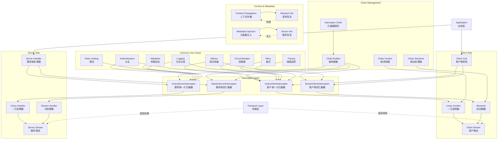

# gRPC-Go 拦截器模块概览

## 模块职责与边界

### 核心职责
拦截器模块（Interceptor）是 gRPC-Go 中实现横切关注点的核心机制，提供了在 RPC 调用前后插入自定义逻辑的能力。该模块支持客户端和服务端的一元（Unary）和流式（Stream）RPC 拦截，广泛用于认证授权、日志记录、性能监控、错误处理、限流熔断等场景，是构建企业级 gRPC 应用的重要基础设施。

### 输入输出
- **输入：**
  - RPC 方法信息和参数
  - 上下文对象（Context）
  - 调用选项（CallOption）
  - 请求和响应对象

- **输出：**
  - 修改后的上下文和参数
  - 处理结果和错误信息
  - 附加的元数据和状态
  - 拦截决策和控制流

### 上下游依赖
- **上游依赖：**
  - ClientConn（客户端连接）
  - Server（服务端实例）
  - Transport（传输层）
- **下游依赖：**
  - 业务服务实现
  - 认证授权系统
  - 日志和监控系统
  - 限流和熔断组件

### 生命周期
1. **注册阶段：** 在客户端/服务端初始化时注册拦截器
2. **链构建：** 将多个拦截器组织成调用链
3. **调用拦截：** 在 RPC 调用时按顺序执行拦截器
4. **处理委托：** 拦截器决定是否继续调用下游
5. **结果处理：** 处理调用结果并执行后置逻辑

## 模块架构图



**架构说明：**

1. **拦截器类型层：**
   - `UnaryClientInterceptor` 拦截客户端一元 RPC 调用
   - `StreamClientInterceptor` 拦截客户端流式 RPC 调用
   - `UnaryServerInterceptor` 拦截服务端一元 RPC 处理
   - `StreamServerInterceptor` 拦截服务端流式 RPC 处理

2. **链管理层：**
   - `Chain Builder` 构建拦截器调用链
   - `Chain Invoker` 管理一元调用链的执行
   - `Chain Streamer` 管理流式调用链的执行
   - `Interceptor Order` 控制拦截器的执行顺序

3. **客户端处理层：**
   - 管理客户端 RPC 调用的拦截流程
   - 提供调用器和流创建器的抽象
   - 支持调用前后的处理逻辑

4. **服务端处理层：**
   - 管理服务端 RPC 处理的拦截流程
   - 提供处理器的抽象和包装
   - 支持请求处理前后的逻辑

5. **通用用例层：**
   - 实现常见的横切关注点
   - 提供可复用的拦截器实现
   - 支持组合和定制

6. **上下文元数据层：**
   - 管理请求上下文的传播
   - 处理元数据的注入和提取
   - 提供请求和服务信息的访问

**设计原则：**

- **职责分离：** 每个拦截器专注单一职责
- **链式调用：** 支持多个拦截器的组合
- **透明性：** 对业务逻辑透明，不影响正常调用
- **可扩展性：** 易于添加自定义拦截器

## 核心接口定义

### 客户端拦截器接口

```go
// UnaryClientInterceptor 客户端一元 RPC 拦截器
type UnaryClientInterceptor func(
    ctx context.Context,
    method string,
    req, reply any,
    cc *ClientConn,
    invoker UnaryInvoker,
    opts ...CallOption,
) error

// UnaryInvoker 一元调用器，用于继续 RPC 调用
type UnaryInvoker func(
    ctx context.Context,
    method string,
    req, reply any,
    cc *ClientConn,
    opts ...CallOption,
) error

// StreamClientInterceptor 客户端流式 RPC 拦截器
type StreamClientInterceptor func(
    ctx context.Context,
    desc *StreamDesc,
    cc *ClientConn,
    method string,
    streamer Streamer,
    opts ...CallOption,
) (ClientStream, error)

// Streamer 流创建器，用于创建客户端流
type Streamer func(
    ctx context.Context,
    desc *StreamDesc,
    cc *ClientConn,
    method string,
    opts ...CallOption,
) (ClientStream, error)
```

### 服务端拦截器接口

```go
// UnaryServerInterceptor 服务端一元 RPC 拦截器
type UnaryServerInterceptor func(
    ctx context.Context,
    req any,
    info *UnaryServerInfo,
    handler UnaryHandler,
) (resp any, err error)

// UnaryHandler 一元处理器，用于继续处理请求
type UnaryHandler func(ctx context.Context, req any) (any, error)

// UnaryServerInfo 一元服务信息
type UnaryServerInfo struct {
    Server     any    // 服务实现对象
    FullMethod string // 完整方法名，如 /package.service/method
}

// StreamServerInterceptor 服务端流式 RPC 拦截器
type StreamServerInterceptor func(
    srv any,
    ss ServerStream,
    info *StreamServerInfo,
    handler StreamHandler,
) error

// StreamHandler 流处理器，用于继续处理流
type StreamHandler func(srv any, stream ServerStream) error

// StreamServerInfo 流式服务信息
type StreamServerInfo struct {
    FullMethod     string // 完整方法名
    IsClientStream bool   // 是否为客户端流
    IsServerStream bool   // 是否为服务端流
}
```

## 拦截器链管理

### 客户端拦截器链

```go
// 构建客户端一元拦截器链
func chainUnaryClientInterceptors(cc *ClientConn) {
    interceptors := cc.dopts.chainUnaryInts
    
    // 如果设置了单个拦截器，将其添加到链的开头
    if cc.dopts.unaryInt != nil {
        interceptors = append([]UnaryClientInterceptor{cc.dopts.unaryInt}, interceptors...)
    }
    
    var chainedInt UnaryClientInterceptor
    if len(interceptors) == 0 {
        chainedInt = nil
    } else if len(interceptors) == 1 {
        chainedInt = interceptors[0]
    } else {
        chainedInt = func(ctx context.Context, method string, req, reply any, cc *ClientConn, invoker UnaryInvoker, opts ...CallOption) error {
            return interceptors[0](ctx, method, req, reply, cc, getChainUnaryInvoker(interceptors, 0, invoker), opts...)
        }
    }
    
    cc.dopts.unaryInt = chainedInt
}

// 递归构建链式调用器
func getChainUnaryInvoker(interceptors []UnaryClientInterceptor, curr int, finalInvoker UnaryInvoker) UnaryInvoker {
    if curr == len(interceptors)-1 {
        return finalInvoker
    }
    
    return func(ctx context.Context, method string, req, reply any, cc *ClientConn, opts ...CallOption) error {
        return interceptors[curr+1](ctx, method, req, reply, cc, getChainUnaryInvoker(interceptors, curr+1, finalInvoker), opts...)
    }
}
```

### 服务端拦截器链

```go
// 构建服务端一元拦截器链
func chainUnaryServerInterceptors(s *Server) {
    interceptors := s.opts.chainUnaryInts
    
    if s.opts.unaryInt != nil {
        interceptors = append([]UnaryServerInterceptor{s.opts.unaryInt}, interceptors...)
    }
    
    var chainedInt UnaryServerInterceptor
    if len(interceptors) == 0 {
        chainedInt = nil
    } else if len(interceptors) == 1 {
        chainedInt = interceptors[0]
    } else {
        chainedInt = func(ctx context.Context, req any, info *UnaryServerInfo, handler UnaryHandler) (any, error) {
            return interceptors[0](ctx, req, info, getChainUnaryHandler(interceptors, 0, info, handler))
        }
    }
    
    s.opts.unaryInt = chainedInt
}

// 递归构建链式处理器
func getChainUnaryHandler(interceptors []UnaryServerInterceptor, curr int, info *UnaryServerInfo, finalHandler UnaryHandler) UnaryHandler {
    if curr == len(interceptors)-1 {
        return finalHandler
    }
    
    return func(ctx context.Context, req any) (any, error) {
        return interceptors[curr+1](ctx, req, info, getChainUnaryHandler(interceptors, curr+1, info, finalHandler))
    }
}
```

## 常用拦截器实现

### 1. 认证拦截器

**客户端认证拦截器：**

```go
func AuthUnaryClientInterceptor(token string) grpc.UnaryClientInterceptor {
    return func(ctx context.Context, method string, req, reply any, cc *grpc.ClientConn, invoker grpc.UnaryInvoker, opts ...grpc.CallOption) error {
        // 添加认证头
        ctx = metadata.AppendToOutgoingContext(ctx, "authorization", "Bearer "+token)
        
        // 继续调用
        return invoker(ctx, method, req, reply, cc, opts...)
    }
}

func AuthStreamClientInterceptor(token string) grpc.StreamClientInterceptor {
    return func(ctx context.Context, desc *grpc.StreamDesc, cc *grpc.ClientConn, method string, streamer grpc.Streamer, opts ...grpc.CallOption) (grpc.ClientStream, error) {
        // 添加认证头
        ctx = metadata.AppendToOutgoingContext(ctx, "authorization", "Bearer "+token)
        
        // 创建流
        return streamer(ctx, desc, cc, method, opts...)
    }
}
```

**服务端认证拦截器：**

```go
func AuthUnaryServerInterceptor(authFunc func(ctx context.Context) error) grpc.UnaryServerInterceptor {
    return func(ctx context.Context, req any, info *grpc.UnaryServerInfo, handler grpc.UnaryHandler) (any, error) {
        // 执行认证检查
        if err := authFunc(ctx); err != nil {
            return nil, err
        }
        
        // 继续处理请求
        return handler(ctx, req)
    }
}

func validateToken(ctx context.Context) error {
    md, ok := metadata.FromIncomingContext(ctx)
    if !ok {
        return status.Error(codes.Unauthenticated, "missing metadata")
    }
    
    auth := md.Get("authorization")
    if len(auth) == 0 {
        return status.Error(codes.Unauthenticated, "missing authorization header")
    }
    
    token := strings.TrimPrefix(auth[0], "Bearer ")
    if !isValidToken(token) {
        return status.Error(codes.Unauthenticated, "invalid token")
    }
    
    return nil
}
```

### 2. 日志拦截器

**通用日志拦截器：**

```go
func LoggingUnaryServerInterceptor(logger *log.Logger) grpc.UnaryServerInterceptor {
    return func(ctx context.Context, req any, info *grpc.UnaryServerInfo, handler grpc.UnaryHandler) (any, error) {
        start := time.Now()
        
        // 记录请求开始
        logger.Printf("Started %s", info.FullMethod)
        
        // 执行处理
        resp, err := handler(ctx, req)
        
        // 记录请求结束
        duration := time.Since(start)
        status := "OK"
        if err != nil {
            status = grpc_status.Code(err).String()
        }
        
        logger.Printf("Finished %s [%s] in %v", info.FullMethod, status, duration)
        
        return resp, err
    }
}

func LoggingStreamServerInterceptor(logger *log.Logger) grpc.StreamServerInterceptor {
    return func(srv any, ss grpc.ServerStream, info *grpc.StreamServerInfo, handler grpc.StreamHandler) error {
        start := time.Now()
        
        logger.Printf("Started stream %s", info.FullMethod)
        
        err := handler(srv, ss)
        
        duration := time.Since(start)
        status := "OK"
        if err != nil {
            status = grpc_status.Code(err).String()
        }
        
        logger.Printf("Finished stream %s [%s] in %v", info.FullMethod, status, duration)
        
        return err
    }
}
```

### 3. 指标收集拦截器

**Prometheus 指标拦截器：**

```go
var (
    requestDuration = prometheus.NewHistogramVec(
        prometheus.HistogramOpts{
            Name: "grpc_request_duration_seconds",
            Help: "Time spent on gRPC requests",
        },
        []string{"method", "status"},
    )
    
    requestCount = prometheus.NewCounterVec(
        prometheus.CounterOpts{
            Name: "grpc_requests_total",
            Help: "Total number of gRPC requests",
        },
        []string{"method", "status"},
    )
)

func MetricsUnaryServerInterceptor() grpc.UnaryServerInterceptor {
    return func(ctx context.Context, req any, info *grpc.UnaryServerInfo, handler grpc.UnaryHandler) (any, error) {
        start := time.Now()
        
        resp, err := handler(ctx, req)
        
        duration := time.Since(start)
        status := grpc_status.Code(err).String()
        
        // 记录指标
        requestDuration.WithLabelValues(info.FullMethod, status).Observe(duration.Seconds())
        requestCount.WithLabelValues(info.FullMethod, status).Inc()
        
        return resp, err
    }
}
```

### 4. 重试拦截器

**客户端重试拦截器：**

```go
type RetryConfig struct {
    MaxAttempts int
    BackoffFunc func(attempt int) time.Duration
    RetryableCodes []codes.Code
}

func RetryUnaryClientInterceptor(config RetryConfig) grpc.UnaryClientInterceptor {
    return func(ctx context.Context, method string, req, reply any, cc *grpc.ClientConn, invoker grpc.UnaryInvoker, opts ...grpc.CallOption) error {
        var lastErr error
        
        for attempt := 0; attempt < config.MaxAttempts; attempt++ {
            err := invoker(ctx, method, req, reply, cc, opts...)
            if err == nil {
                return nil
            }
            
            // 检查是否可重试
            if !isRetryableError(err, config.RetryableCodes) {
                return err
            }
            
            lastErr = err
            
            // 最后一次尝试不需要等待
            if attempt < config.MaxAttempts-1 {
                backoff := config.BackoffFunc(attempt)
                select {
                case <-time.After(backoff):
                case <-ctx.Done():
                    return ctx.Err()
                }
            }
        }
        
        return lastErr
    }
}

func isRetryableError(err error, retryableCodes []codes.Code) bool {
    st := grpc_status.Convert(err)
    for _, code := range retryableCodes {
        if st.Code() == code {
            return true
        }
    }
    return false
}

// 指数退避函数
func ExponentialBackoff(baseDelay time.Duration, multiplier float64) func(int) time.Duration {
    return func(attempt int) time.Duration {
        return time.Duration(float64(baseDelay) * math.Pow(multiplier, float64(attempt)))
    }
}
```

### 5. 限流拦截器

**令牌桶限流拦截器：**

```go
func RateLimitUnaryServerInterceptor(limiter *rate.Limiter) grpc.UnaryServerInterceptor {
    return func(ctx context.Context, req any, info *grpc.UnaryServerInfo, handler grpc.UnaryHandler) (any, error) {
        // 尝试获取令牌
        if !limiter.Allow() {
            return nil, status.Error(codes.ResourceExhausted, "rate limit exceeded")
        }
        
        return handler(ctx, req)
    }
}

// 基于用户的限流
func UserRateLimitUnaryServerInterceptor(limiters map[string]*rate.Limiter, defaultLimiter *rate.Limiter) grpc.UnaryServerInterceptor {
    return func(ctx context.Context, req any, info *grpc.UnaryServerInfo, handler grpc.UnaryHandler) (any, error) {
        // 从上下文获取用户ID
        userID := getUserID(ctx)
        
        // 选择对应的限流器
        limiter := defaultLimiter
        if userLimiter, exists := limiters[userID]; exists {
            limiter = userLimiter
        }
        
        if !limiter.Allow() {
            return nil, status.Error(codes.ResourceExhausted, "rate limit exceeded")
        }
        
        return handler(ctx, req)
    }
}
```

### 6. 熔断器拦截器

**熔断器拦截器：**

```go
type CircuitBreaker struct {
    maxFailures int
    resetTimeout time.Duration
    failures     int
    state        int // 0: closed, 1: open, 2: half-open
    lastFailTime time.Time
    mutex        sync.RWMutex
}

func (cb *CircuitBreaker) Call(fn func() error) error {
    cb.mutex.Lock()
    defer cb.mutex.Unlock()
    
    // 检查熔断器状态
    if cb.state == 1 { // open
        if time.Since(cb.lastFailTime) > cb.resetTimeout {
            cb.state = 2 // half-open
        } else {
            return status.Error(codes.Unavailable, "circuit breaker is open")
        }
    }
    
    err := fn()
    
    if err != nil {
        cb.failures++
        cb.lastFailTime = time.Now()
        
        if cb.failures >= cb.maxFailures {
            cb.state = 1 // open
        }
        
        return err
    }
    
    // 成功调用，重置失败计数
    cb.failures = 0
    cb.state = 0 // closed
    
    return nil
}

func CircuitBreakerUnaryClientInterceptor(cb *CircuitBreaker) grpc.UnaryClientInterceptor {
    return func(ctx context.Context, method string, req, reply any, cc *grpc.ClientConn, invoker grpc.UnaryInvoker, opts ...grpc.CallOption) error {
        return cb.Call(func() error {
            return invoker(ctx, method, req, reply, cc, opts...)
        })
    }
}
```

### 7. 链路追踪拦截器

**OpenTracing 拦截器：**

```go
func TracingUnaryServerInterceptor(tracer opentracing.Tracer) grpc.UnaryServerInterceptor {
    return func(ctx context.Context, req any, info *grpc.UnaryServerInfo, handler grpc.UnaryHandler) (any, error) {
        // 从元数据中提取 span 上下文
        md, ok := metadata.FromIncomingContext(ctx)
        if !ok {
            md = metadata.New(nil)
        }
        
        spanContext, err := tracer.Extract(opentracing.HTTPHeaders, MetadataReaderWriter{md})
        if err != nil && err != opentracing.ErrSpanContextNotFound {
            return nil, err
        }
        
        // 创建新的 span
        span := tracer.StartSpan(info.FullMethod, ext.RPCServerOption(spanContext))
        defer span.Finish()
        
        // 设置标签
        ext.Component.Set(span, "grpc-server")
        
        // 将 span 添加到上下文
        ctx = opentracing.ContextWithSpan(ctx, span)
        
        // 执行处理
        resp, err := handler(ctx, req)
        
        // 记录错误信息
        if err != nil {
            ext.Error.Set(span, true)
            span.LogFields(log.String("error", err.Error()))
        }
        
        return resp, err
    }
}

type MetadataReaderWriter struct {
    metadata.MD
}

func (mrw MetadataReaderWriter) Set(key, val string) {
    mrw.MD[key] = []string{val}
}

func (mrw MetadataReaderWriter) ForeachKey(handler func(key, val string) error) error {
    for k, vals := range mrw.MD {
        for _, v := range vals {
            if err := handler(k, v); err != nil {
                return err
            }
        }
    }
    return nil
}
```

## 拦截器配置和使用

### 客户端拦截器配置

```go
// 单个拦截器
conn, err := grpc.NewClient(address,
    grpc.WithUnaryInterceptor(AuthUnaryClientInterceptor(token)),
    grpc.WithStreamInterceptor(AuthStreamClientInterceptor(token)),
)

// 拦截器链
conn, err := grpc.NewClient(address,
    grpc.WithChainUnaryInterceptor(
        LoggingUnaryClientInterceptor(),
        MetricsUnaryClientInterceptor(),
        RetryUnaryClientInterceptor(retryConfig),
        AuthUnaryClientInterceptor(token),
    ),
    grpc.WithChainStreamInterceptor(
        LoggingStreamClientInterceptor(),
        AuthStreamClientInterceptor(token),
    ),
)
```

### 服务端拦截器配置

```go
// 单个拦截器
server := grpc.NewServer(
    grpc.UnaryInterceptor(AuthUnaryServerInterceptor(validateToken)),
    grpc.StreamInterceptor(AuthStreamServerInterceptor(validateToken)),
)

// 拦截器链
server := grpc.NewServer(
    grpc.ChainUnaryInterceptor(
        LoggingUnaryServerInterceptor(logger),
        MetricsUnaryServerInterceptor(),
        RateLimitUnaryServerInterceptor(limiter),
        AuthUnaryServerInterceptor(validateToken),
    ),
    grpc.ChainStreamInterceptor(
        LoggingStreamServerInterceptor(logger),
        AuthStreamServerInterceptor(validateToken),
    ),
)
```

## 最佳实践建议

### 1. 拦截器顺序

```go
// 推荐的服务端拦截器顺序
server := grpc.NewServer(
    grpc.ChainUnaryInterceptor(
        PanicRecoveryInterceptor(),    // 1. 异常恢复（最外层）
        LoggingInterceptor(),          // 2. 日志记录
        MetricsInterceptor(),          // 3. 指标收集
        TracingInterceptor(),          // 4. 链路追踪
        RateLimitInterceptor(),        // 5. 限流控制
        AuthInterceptor(),             // 6. 认证授权
        ValidationInterceptor(),       // 7. 参数验证（最内层）
    ),
)

// 推荐的客户端拦截器顺序
conn, err := grpc.NewClient(address,
    grpc.WithChainUnaryInterceptor(
        LoggingInterceptor(),          // 1. 日志记录（最外层）
        MetricsInterceptor(),          // 2. 指标收集
        TracingInterceptor(),          // 3. 链路追踪
        RetryInterceptor(),            // 4. 重试逻辑
        CircuitBreakerInterceptor(),   // 5. 熔断器
        AuthInterceptor(),             // 6. 认证（最内层）
    ),
)
```

### 2. 错误处理

```go
func SafeUnaryServerInterceptor() grpc.UnaryServerInterceptor {
    return func(ctx context.Context, req any, info *grpc.UnaryServerInfo, handler grpc.UnaryHandler) (resp any, err error) {
        // 使用 defer 捕获 panic
        defer func() {
            if r := recover(); r != nil {
                log.Printf("Panic in %s: %v\n%s", info.FullMethod, r, debug.Stack())
                err = status.Error(codes.Internal, "internal server error")
            }
        }()
        
        return handler(ctx, req)
    }
}
```

### 3. 性能考虑

```go
// 避免在拦截器中进行耗时操作
func BadInterceptor() grpc.UnaryServerInterceptor {
    return func(ctx context.Context, req any, info *grpc.UnaryServerInfo, handler grpc.UnaryHandler) (any, error) {
        // 错误：同步的数据库查询
        user := queryUserFromDB(getUserID(ctx))
        
        return handler(ctx, req)
    }
}

// 正确：使用异步处理或缓存
func GoodInterceptor(cache *UserCache) grpc.UnaryServerInterceptor {
    return func(ctx context.Context, req any, info *grpc.UnaryServerInfo, handler grpc.UnaryHandler) (any, error) {
        // 正确：从缓存获取用户信息
        userID := getUserID(ctx)
        if user, exists := cache.Get(userID); exists {
            ctx = context.WithValue(ctx, "user", user)
        }
        
        return handler(ctx, req)
    }
}
```

### 4. 测试策略

```go
// 拦截器单元测试
func TestAuthInterceptor(t *testing.T) {
    interceptor := AuthUnaryServerInterceptor(func(ctx context.Context) error {
        return nil // 模拟认证成功
    })
    
    // 模拟处理器
    handler := func(ctx context.Context, req any) (any, error) {
        return "success", nil
    }
    
    // 执行测试
    resp, err := interceptor(context.Background(), nil, &grpc.UnaryServerInfo{}, handler)
    
    assert.NoError(t, err)
    assert.Equal(t, "success", resp)
}
```

通过拦截器模块的完整实现，gRPC-Go 提供了强大而灵活的横切关注点处理能力，使开发者能够以声明式的方式实现认证、日志、监控等功能，大大提高了代码的可维护性和可重用性。
