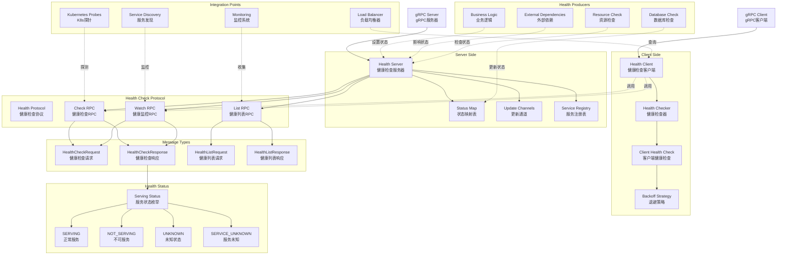

# gRPC-Go 健康检查模块概览

## 模块职责与边界

### 核心职责
健康检查模块（Health Check）是 gRPC-Go 中负责服务健康状态监控和报告的核心组件，实现了标准的 gRPC 健康检查协议。该模块提供了服务级别的健康状态管理，支持实时健康状态查询、状态变化监控和批量健康状态列表，为负载均衡器、服务发现系统和监控工具提供了标准化的健康检查接口。

### 输入输出
- **输入：**
  - 服务名称标识
  - 健康状态设置请求
  - 健康检查查询请求
  - 状态监控订阅请求

- **输出：**
  - 服务健康状态响应
  - 健康状态变化通知
  - 服务健康状态列表
  - 监控流数据

### 上下游依赖
- **上游依赖：**
  - gRPC Server（服务端实例）
  - gRPC Client（客户端连接）
  - 业务服务实现
- **下游依赖：**
  - 负载均衡器（Load Balancer）
  - 服务发现系统（Service Discovery）
  - 监控和告警系统
  - 容器编排系统（Kubernetes等）

### 生命周期
1. **初始化阶段：** 创建健康检查服务器并注册到 gRPC 服务
2. **状态管理：** 维护各个服务的健康状态映射
3. **查询处理：** 响应健康检查查询请求
4. **监控服务：** 提供实时健康状态变化监控
5. **状态更新：** 根据业务逻辑动态更新服务健康状态

## 模块架构图



**架构说明：**

1. **健康检查协议层：**
   - `Health Protocol` 实现标准 gRPC 健康检查协议
   - `Check RPC` 提供即时健康状态查询
   - `List RPC` 提供批量健康状态列表
   - `Watch RPC` 提供实时健康状态监控

2. **服务端处理层：**
   - `Health Server` 实现健康检查服务接口
   - `Status Map` 维护服务名到健康状态的映射
   - `Update Channels` 管理状态变化通知通道
   - `Service Registry` 跟踪已注册的服务

3. **客户端处理层：**
   - `Health Client` 提供健康检查客户端接口
   - `Health Checker` 实现健康检查逻辑
   - `Client Health Check` 集成到连接健康检查
   - `Backoff Strategy` 处理重试和退避逻辑

4. **健康状态层：**
   - 定义标准的服务健康状态枚举
   - 支持四种基本状态类型
   - 提供状态语义和转换规则

5. **集成点层：**
   - 与负载均衡器集成进行健康检查
   - 与服务发现系统集成监控服务状态
   - 与监控系统集成收集健康指标
   - 与容器编排系统集成提供探针

6. **健康生产者层：**
   - 业务逻辑控制服务健康状态
   - 数据库连接检查影响健康状态
   - 外部依赖可用性影响服务健康
   - 系统资源状态检查

**设计原则：**

- **标准兼容：** 完全遵循 gRPC 健康检查协议标准
- **实时性：** 支持实时健康状态查询和监控
- **可扩展性：** 支持多服务健康状态管理
- **集成友好：** 易于与外部系统集成

## 核心数据结构

### 健康状态枚举

```go
// ServingStatus 定义服务的健康状态
type HealthCheckResponse_ServingStatus int32

const (
    // UNKNOWN 未知状态，通常用于初始化
    HealthCheckResponse_UNKNOWN HealthCheckResponse_ServingStatus = 0
    
    // SERVING 正常服务状态，可以处理请求
    HealthCheckResponse_SERVING HealthCheckResponse_ServingStatus = 1
    
    // NOT_SERVING 不可服务状态，无法处理请求
    HealthCheckResponse_NOT_SERVING HealthCheckResponse_ServingStatus = 2
    
    // SERVICE_UNKNOWN 服务未知，仅用于 Watch 方法
    HealthCheckResponse_SERVICE_UNKNOWN HealthCheckResponse_ServingStatus = 3
)
```

### 请求响应消息

```go
// HealthCheckRequest 健康检查请求
type HealthCheckRequest struct {
    Service string `protobuf:"bytes,1,opt,name=service,proto3" json:"service,omitempty"`
}

// HealthCheckResponse 健康检查响应
type HealthCheckResponse struct {
    Status HealthCheckResponse_ServingStatus `protobuf:"varint,1,opt,name=status,proto3,enum=grpc.health.v1.HealthCheckResponse_ServingStatus" json:"status,omitempty"`
}

// HealthListRequest 健康列表请求
type HealthListRequest struct{}

// HealthListResponse 健康列表响应
type HealthListResponse struct {
    Statuses map[string]*HealthCheckResponse `protobuf:"bytes,1,rep,name=statuses,proto3" json:"statuses,omitempty"`
}
```

### 健康检查服务器

```go
// Server 健康检查服务器实现
type Server struct {
    healthgrpc.UnimplementedHealthServer
    mu        sync.RWMutex
    shutdown  bool
    statusMap map[string]healthpb.HealthCheckResponse_ServingStatus
    updates   map[string]map[healthgrpc.Health_WatchServer]chan healthpb.HealthCheckResponse_ServingStatus
}
```

## 服务端实现

### 1. 健康检查服务器创建

```go
// NewServer 创建新的健康检查服务器
func NewServer() *Server {
    return &Server{
        // 默认整体服务状态为 SERVING
        statusMap: map[string]healthpb.HealthCheckResponse_ServingStatus{
            "": healthpb.HealthCheckResponse_SERVING,
        },
        updates: make(map[string]map[healthgrpc.Health_WatchServer]chan healthpb.HealthCheckResponse_ServingStatus),
    }
}

// 注册健康检查服务
func RegisterHealthServer(server *grpc.Server) *health.Server {
    healthServer := health.NewServer()
    healthgrpc.RegisterHealthServer(server, healthServer)
    return healthServer
}
```

### 2. Check 方法实现

```go
// Check 实现健康检查查询
func (s *Server) Check(ctx context.Context, in *healthpb.HealthCheckRequest) (*healthpb.HealthCheckResponse, error) {
    s.mu.RLock()
    defer s.mu.RUnlock()
    
    // 查找服务状态
    if servingStatus, ok := s.statusMap[in.Service]; ok {
        return &healthpb.HealthCheckResponse{
            Status: servingStatus,
        }, nil
    }
    
    // 服务未找到
    return nil, status.Error(codes.NotFound, "unknown service")
}
```

### 3. List 方法实现

```go
// List 实现健康状态列表查询
func (s *Server) List(_ context.Context, _ *healthpb.HealthListRequest) (*healthpb.HealthListResponse, error) {
    s.mu.RLock()
    defer s.mu.RUnlock()
    
    // 检查服务数量限制
    if len(s.statusMap) > maxAllowedServices {
        return nil, status.Errorf(codes.ResourceExhausted,
            "server health list exceeds maximum capacity: %d", maxAllowedServices)
    }
    
    // 构建状态映射
    statusMap := make(map[string]*healthpb.HealthCheckResponse, len(s.statusMap))
    for k, v := range s.statusMap {
        statusMap[k] = &healthpb.HealthCheckResponse{Status: v}
    }
    
    return &healthpb.HealthListResponse{Statuses: statusMap}, nil
}
```

### 4. Watch 方法实现

```go
// Watch 实现健康状态监控
func (s *Server) Watch(in *healthpb.HealthCheckRequest, stream healthgrpc.Health_WatchServer) error {
    service := in.Service
    
    // 发送当前状态
    s.mu.RLock()
    status, exists := s.statusMap[service]
    if !exists {
        status = healthpb.HealthCheckResponse_SERVICE_UNKNOWN
    }
    s.mu.RUnlock()
    
    // 立即发送当前状态
    if err := stream.Send(&healthpb.HealthCheckResponse{Status: status}); err != nil {
        return err
    }
    
    // 创建更新通道
    update := make(chan healthpb.HealthCheckResponse_ServingStatus, 1)
    s.mu.Lock()
    if s.updates[service] == nil {
        s.updates[service] = make(map[healthgrpc.Health_WatchServer]chan healthpb.HealthCheckResponse_ServingStatus)
    }
    s.updates[service][stream] = update
    s.mu.Unlock()
    
    // 清理资源
    defer func() {
        s.mu.Lock()
        delete(s.updates[service], stream)
        if len(s.updates[service]) == 0 {
            delete(s.updates, service)
        }
        s.mu.Unlock()
        close(update)
    }()
    
    // 监听状态变化
    for {
        select {
        case newStatus := <-update:
            if err := stream.Send(&healthpb.HealthCheckResponse{Status: newStatus}); err != nil {
                return err
            }
        case <-stream.Context().Done():
            return stream.Context().Err()
        }
    }
}
```

### 5. 状态管理方法

```go
// SetServingStatus 设置服务健康状态
func (s *Server) SetServingStatus(service string, servingStatus healthpb.HealthCheckResponse_ServingStatus) {
    s.mu.Lock()
    defer s.mu.Unlock()
    
    if s.shutdown {
        return
    }
    
    // 更新状态
    s.statusMap[service] = servingStatus
    
    // 通知监听者
    if watchers, exists := s.updates[service]; exists {
        for _, update := range watchers {
            select {
            case update <- servingStatus:
            default:
                // 通道已满，跳过
            }
        }
    }
}

// Shutdown 关闭健康检查服务器
func (s *Server) Shutdown() {
    s.mu.Lock()
    defer s.mu.Unlock()
    
    s.shutdown = true
    
    // 将所有服务状态设置为 NOT_SERVING
    for service := range s.statusMap {
        s.statusMap[service] = healthpb.HealthCheckResponse_NOT_SERVING
    }
    
    // 通知所有监听者
    for service, watchers := range s.updates {
        for _, update := range watchers {
            select {
            case update <- healthpb.HealthCheckResponse_NOT_SERVING:
            default:
            }
        }
    }
}
```

## 客户端实现

### 1. 健康检查客户端

```go
// HealthClient 健康检查客户端接口
type HealthClient interface {
    Check(ctx context.Context, in *HealthCheckRequest, opts ...grpc.CallOption) (*HealthCheckResponse, error)
    List(ctx context.Context, in *HealthListRequest, opts ...grpc.CallOption) (*HealthListResponse, error)
    Watch(ctx context.Context, in *HealthCheckRequest, opts ...grpc.CallOption) (Health_WatchClient, error)
}

// 创建健康检查客户端
func NewHealthClient(conn grpc.ClientConnInterface) HealthClient {
    return healthgrpc.NewHealthClient(conn)
}
```

### 2. 客户端健康检查

```go
// 执行健康检查
func PerformHealthCheck(client healthgrpc.HealthClient, service string) error {
    ctx, cancel := context.WithTimeout(context.Background(), 5*time.Second)
    defer cancel()
    
    resp, err := client.Check(ctx, &healthpb.HealthCheckRequest{
        Service: service,
    })
    
    if err != nil {
        return fmt.Errorf("health check failed: %v", err)
    }
    
    switch resp.Status {
    case healthpb.HealthCheckResponse_SERVING:
        return nil
    case healthpb.HealthCheckResponse_NOT_SERVING:
        return fmt.Errorf("service is not serving")
    case healthpb.HealthCheckResponse_UNKNOWN:
        return fmt.Errorf("service status unknown")
    default:
        return fmt.Errorf("unexpected service status: %v", resp.Status)
    }
}
```

### 3. 健康状态监控

```go
// 监控服务健康状态
func WatchServiceHealth(client healthgrpc.HealthClient, service string, callback func(status healthpb.HealthCheckResponse_ServingStatus)) error {
    stream, err := client.Watch(context.Background(), &healthpb.HealthCheckRequest{
        Service: service,
    })
    if err != nil {
        return err
    }
    
    go func() {
        defer stream.CloseSend()
        
        for {
            resp, err := stream.Recv()
            if err != nil {
                if err == io.EOF {
                    return
                }
                log.Printf("Health watch error: %v", err)
                return
            }
            
            callback(resp.Status)
        }
    }()
    
    return nil
}
```

### 4. 连接级健康检查

```go
// 连接级健康检查函数
func clientHealthCheck(ctx context.Context, newStream func(string) (any, error), setConnectivityState func(connectivity.State, error), service string) error {
    retries := 0
    
    for {
        // 创建健康检查流
        stream, err := newStream(healthCheckMethod)
        if err != nil {
            setConnectivityState(connectivity.TransientFailure, err)
            if !backoffFunc(ctx, retries) {
                return ctx.Err()
            }
            retries++
            continue
        }
        
        healthStream := stream.(healthgrpc.Health_WatchClient)
        
        // 发送健康检查请求
        if err := healthStream.Send(&healthpb.HealthCheckRequest{Service: service}); err != nil {
            setConnectivityState(connectivity.TransientFailure, err)
            if !backoffFunc(ctx, retries) {
                return ctx.Err()
            }
            retries++
            continue
        }
        
        // 接收健康检查响应
        for {
            resp, err := healthStream.Recv()
            if err != nil {
                setConnectivityState(connectivity.TransientFailure, err)
                break
            }
            
            // 根据健康状态设置连接状态
            switch resp.Status {
            case healthpb.HealthCheckResponse_SERVING:
                setConnectivityState(connectivity.Ready, nil)
                retries = 0
            case healthpb.HealthCheckResponse_NOT_SERVING:
                setConnectivityState(connectivity.TransientFailure, fmt.Errorf("service unhealthy"))
            case healthpb.HealthCheckResponse_SERVICE_UNKNOWN:
                setConnectivityState(connectivity.TransientFailure, fmt.Errorf("service unknown"))
            }
        }
        
        if !backoffFunc(ctx, retries) {
            return ctx.Err()
        }
        retries++
    }
}
```

## 集成示例

### 1. 基本服务集成

```go
func main() {
    // 创建 gRPC 服务器
    server := grpc.NewServer()
    
    // 注册健康检查服务
    healthServer := health.NewServer()
    healthgrpc.RegisterHealthServer(server, healthServer)
    
    // 注册业务服务
    pb.RegisterMyServiceServer(server, &myServiceImpl{
        healthServer: healthServer,
    })
    
    // 启动服务器
    lis, err := net.Listen("tcp", ":50051")
    if err != nil {
        log.Fatalf("Failed to listen: %v", err)
    }
    
    log.Println("Server starting...")
    if err := server.Serve(lis); err != nil {
        log.Fatalf("Failed to serve: %v", err)
    }
}

type myServiceImpl struct {
    pb.UnimplementedMyServiceServer
    healthServer *health.Server
}

func (s *myServiceImpl) SomeMethod(ctx context.Context, req *pb.Request) (*pb.Response, error) {
    // 检查依赖服务健康状态
    if !s.checkDependencies() {
        s.healthServer.SetServingStatus("myservice", healthpb.HealthCheckResponse_NOT_SERVING)
        return nil, status.Error(codes.Unavailable, "dependencies unavailable")
    }
    
    s.healthServer.SetServingStatus("myservice", healthpb.HealthCheckResponse_SERVING)
    
    // 处理业务逻辑
    return &pb.Response{}, nil
}

func (s *myServiceImpl) checkDependencies() bool {
    // 检查数据库连接
    if !s.checkDatabase() {
        return false
    }
    
    // 检查外部服务
    if !s.checkExternalServices() {
        return false
    }
    
    return true
}
```

### 2. 客户端健康检查集成

```go
func createHealthyConnection(address string) (*grpc.ClientConn, error) {
    // 启用健康检查的连接
    conn, err := grpc.NewClient(address,
        grpc.WithTransportCredentials(insecure.NewCredentials()),
        grpc.WithDefaultServiceConfig(`{
            "healthCheckConfig": {
                "serviceName": "myservice"
            }
        }`),
    )
    if err != nil {
        return nil, err
    }
    
    // 等待连接就绪
    ctx, cancel := context.WithTimeout(context.Background(), 10*time.Second)
    defer cancel()
    
    if !conn.WaitForStateChange(ctx, connectivity.Connecting) {
        return nil, fmt.Errorf("connection timeout")
    }
    
    return conn, nil
}

func monitorConnectionHealth(conn *grpc.ClientConn) {
    for {
        state := conn.GetState()
        log.Printf("Connection state: %v", state)
        
        if state == connectivity.TransientFailure || state == connectivity.Shutdown {
            log.Printf("Connection unhealthy: %v", state)
        }
        
        if !conn.WaitForStateChange(context.Background(), state) {
            break
        }
    }
}
```

### 3. 负载均衡器集成

```go
// 自定义健康检查负载均衡器
type healthCheckBalancer struct {
    cc     balancer.ClientConn
    picker balancer.Picker
    subConns map[balancer.SubConn]*subConnInfo
}

type subConnInfo struct {
    addr    resolver.Address
    healthy bool
}

func (b *healthCheckBalancer) UpdateClientConnState(state balancer.ClientConnState) error {
    // 为每个地址创建子连接
    for _, addr := range state.ResolverState.Addresses {
        subConn, err := b.cc.NewSubConn([]resolver.Address{addr}, balancer.NewSubConnOptions{
            HealthCheckEnabled: true,
        })
        if err != nil {
            continue
        }
        
        b.subConns[subConn] = &subConnInfo{
            addr:    addr,
            healthy: false,
        }
        
        subConn.Connect()
    }
    
    return nil
}

func (b *healthCheckBalancer) UpdateSubConnState(subConn balancer.SubConn, state balancer.SubConnState) {
    info := b.subConns[subConn]
    if info == nil {
        return
    }
    
    switch state.ConnectivityState {
    case connectivity.Ready:
        info.healthy = true
    case connectivity.TransientFailure, connectivity.Idle:
        info.healthy = false
    }
    
    // 更新选择器
    b.updatePicker()
}

func (b *healthCheckBalancer) updatePicker() {
    var healthySubConns []balancer.SubConn
    
    for subConn, info := range b.subConns {
        if info.healthy {
            healthySubConns = append(healthySubConns, subConn)
        }
    }
    
    if len(healthySubConns) == 0 {
        b.cc.UpdateState(balancer.State{
            ConnectivityState: connectivity.TransientFailure,
            Picker:           base.NewErrPicker(fmt.Errorf("no healthy backends")),
        })
        return
    }
    
    b.cc.UpdateState(balancer.State{
        ConnectivityState: connectivity.Ready,
        Picker:           newHealthyPicker(healthySubConns),
    })
}
```

### 4. Kubernetes 集成

```yaml
# Kubernetes Deployment with Health Checks
apiVersion: apps/v1
kind: Deployment
metadata:
  name: grpc-service
spec:
  replicas: 3
  selector:
    matchLabels:
      app: grpc-service
  template:
    metadata:
      labels:
        app: grpc-service
    spec:
      containers:

      - name: grpc-service
        image: grpc-service:latest
        ports:
        - containerPort: 50051
          name: grpc
        # gRPC 健康检查探针
        livenessProbe:
          exec:
            command: ["/bin/grpc_health_probe", "-addr=:50051"]
          initialDelaySeconds: 10
          periodSeconds: 10
        readinessProbe:
          exec:
            command: ["/bin/grpc_health_probe", "-addr=:50051"]
          initialDelaySeconds: 5
          periodSeconds: 5

```

## 最佳实践建议

### 1. 健康状态管理

```go
// 分层健康检查
type HealthManager struct {
    healthServer *health.Server
    checks       map[string]HealthCheck
    mutex        sync.RWMutex
}

type HealthCheck interface {
    Name() string
    Check(ctx context.Context) error
}

func (hm *HealthManager) RegisterCheck(check HealthCheck) {
    hm.mutex.Lock()
    defer hm.mutex.Unlock()
    hm.checks[check.Name()] = check
}

func (hm *HealthManager) StartHealthChecking(interval time.Duration) {
    ticker := time.NewTicker(interval)
    go func() {
        for range ticker.C {
            hm.performHealthChecks()
        }
    }()
}

func (hm *HealthManager) performHealthChecks() {
    hm.mutex.RLock()
    defer hm.mutex.RUnlock()
    
    allHealthy := true
    
    for name, check := range hm.checks {
        ctx, cancel := context.WithTimeout(context.Background(), 5*time.Second)
        err := check.Check(ctx)
        cancel()
        
        if err != nil {
            log.Printf("Health check failed for %s: %v", name, err)
            hm.healthServer.SetServingStatus(name, healthpb.HealthCheckResponse_NOT_SERVING)
            allHealthy = false
        } else {
            hm.healthServer.SetServingStatus(name, healthpb.HealthCheckResponse_SERVING)
        }
    }
    
    // 设置整体服务状态
    if allHealthy {
        hm.healthServer.SetServingStatus("", healthpb.HealthCheckResponse_SERVING)
    } else {
        hm.healthServer.SetServingStatus("", healthpb.HealthCheckResponse_NOT_SERVING)
    }
}
```

### 2. 客户端重试策略

```go
// 带健康检查的客户端包装器
type HealthAwareClient struct {
    conn         *grpc.ClientConn
    healthClient healthgrpc.HealthClient
    serviceName  string
}

func (hac *HealthAwareClient) Call(ctx context.Context, method string, req, resp any) error {
    // 检查服务健康状态
    if !hac.isHealthy(ctx) {
        return status.Error(codes.Unavailable, "service is not healthy")
    }
    
    // 执行 RPC 调用
    return hac.conn.Invoke(ctx, method, req, resp)
}

func (hac *HealthAwareClient) isHealthy(ctx context.Context) bool {
    healthResp, err := hac.healthClient.Check(ctx, &healthpb.HealthCheckRequest{
        Service: hac.serviceName,
    })
    
    if err != nil {
        return false
    }
    
    return healthResp.Status == healthpb.HealthCheckResponse_SERVING
}
```

### 3. 监控集成

```go
// Prometheus 指标集成
var (
    healthCheckDuration = prometheus.NewHistogramVec(
        prometheus.HistogramOpts{
            Name: "grpc_health_check_duration_seconds",
            Help: "Time spent on health checks",
        },
        []string{"service", "status"},
    )
    
    healthCheckStatus = prometheus.NewGaugeVec(
        prometheus.GaugeOpts{
            Name: "grpc_health_check_status",
            Help: "Current health check status (1=healthy, 0=unhealthy)",
        },
        []string{"service"},
    )
)

func (hm *HealthManager) performHealthChecksWithMetrics() {
    for name, check := range hm.checks {
        start := time.Now()
        
        ctx, cancel := context.WithTimeout(context.Background(), 5*time.Second)
        err := check.Check(ctx)
        cancel()
        
        duration := time.Since(start)
        
        if err != nil {
            healthCheckDuration.WithLabelValues(name, "unhealthy").Observe(duration.Seconds())
            healthCheckStatus.WithLabelValues(name).Set(0)
            hm.healthServer.SetServingStatus(name, healthpb.HealthCheckResponse_NOT_SERVING)
        } else {
            healthCheckDuration.WithLabelValues(name, "healthy").Observe(duration.Seconds())
            healthCheckStatus.WithLabelValues(name).Set(1)
            hm.healthServer.SetServingStatus(name, healthpb.HealthCheckResponse_SERVING)
        }
    }
}
```

通过健康检查模块的完整实现，gRPC-Go 提供了标准化、可靠的服务健康监控能力，为构建高可用的分布式系统提供了重要的基础设施支持。
