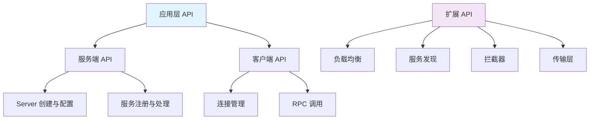

# gRPC-Go API 深度分析

## 核心 API 概览

gRPC-Go 对外提供的主要 API 可以分为以下几个层次：



## 服务端 API 分析

### 1. grpc.NewServer - 服务器创建

**入口函数**：
```go
// 位置：server.go:802
func NewServer(opt ...ServerOption) *Server {
    opts := defaultServerOptions
    for _, o := range globalServerOptions {
        o.apply(&opts)
    }
    for _, o := range opt {
        o.apply(&opts)
    }
    s := &Server{
        lis:      make(map[net.Listener]bool),
        conns:    make(map[string]map[transport.ServerTransport]bool),
        services: make(map[string]*serviceInfo),
        quit:     grpcsync.NewEvent(),
        done:     grpcsync.NewEvent(),
        channelz: channelz.RegisterServer(""),
    }
    // 初始化条件变量用于优雅关闭
    s.cv = sync.NewCond(&s.mu)
    
    // 如果启用了服务器工作池
    if s.opts.numServerWorkers > 0 {
        s.initServerWorkers()
    }
    return s
}
```

**关键数据结构**：
```go
// Server 结构体定义
type Server struct {
    opts serverOptions
    
    mu       sync.Mutex // 保护以下字段
    lis      map[net.Listener]bool
    conns    map[string]map[transport.ServerTransport]bool
    serve    bool
    drain    bool
    cv       *sync.Cond // 用于等待连接关闭
    
    services map[string]*serviceInfo // 注册的服务
    events   trace.EventLog
    
    quit     *grpcsync.Event
    done     *grpcsync.Event
    channelz *channelz.Server
    
    // 服务器工作池相关
    serverWorkerChannels []chan *serverWorkerData
    serverWorkerChannel  chan *serverWorkerData
}
```

**调用链路分析**：
```text
NewServer() → 
├── defaultServerOptions 应用默认配置
├── globalServerOptions 应用全局配置  
├── opt 应用用户配置
├── 初始化 Server 结构体
├── channelz.RegisterServer() 注册到 channelz
└── initServerWorkers() 初始化工作池(可选)
```

### 2. Server.RegisterService - 服务注册

**入口函数**：
```go
// 位置：server.go:1060
func (s *Server) RegisterService(sd *ServiceDesc, ss any) {
    if ss != nil {
        ht := reflect.TypeOf(sd.HandlerType).Elem()
        st := reflect.TypeOf(ss)
        if !st.Implements(ht) {
            logger.Fatalf("grpc: Server.RegisterService found the handler of type %v that does not satisfy %v", st, ht)
        }
    }
    s.register(sd, ss)
}

// 内部注册函数
func (s *Server) register(sd *ServiceDesc, ss any) {
    s.mu.Lock()
    defer s.mu.Unlock()
    s.printf("RegisterService(%q)", sd.ServiceName)
    if s.serve {
        logger.Fatalf("grpc: Server.RegisterService after Server.Serve for %q", sd.ServiceName)
    }
    if _, ok := s.services[sd.ServiceName]; ok {
        logger.Fatalf("grpc: Server.RegisterService found duplicate service registration for %q", sd.ServiceName)
    }
    info := &serviceInfo{
        serviceImpl: ss,
        methods:     make(map[string]*MethodDesc),
        streams:     make(map[string]*StreamDesc),
        mdata:       sd.Metadata,
    }
    for i := range sd.Methods {
        d := &sd.Methods[i]
        info.methods[d.MethodName] = d
    }
    for i := range sd.Streams {
        d := &sd.Streams[i]
        info.streams[d.StreamName] = d
    }
    s.services[sd.ServiceName] = info
}
```

**ServiceDesc 结构**：
```go
type ServiceDesc struct {
    ServiceName string
    HandlerType any
    Methods     []MethodDesc
    Streams     []StreamDesc
    Metadata    any
}

type MethodDesc struct {
    MethodName string
    Handler    MethodHandler
}

type StreamDesc struct {
    StreamName    string
    Handler       StreamHandler
    ServerStreams bool
    ClientStreams bool
}
```

### 3. Server.Serve - 开始服务

**入口函数**：
```go
// 位置：server.go:1123
func (s *Server) Serve(lis net.Listener) error {
    s.mu.Lock()
    s.printf("serving")
    s.serve = true
    if s.lis == nil {
        s.mu.Unlock()
        lis.Close()
        return ErrServerStopped
    }
    
    s.addListener(lis)
    s.mu.Unlock()
    
    defer func() {
        s.mu.Lock()
        if s.lis != nil && s.lis[lis] {
            lis.Close()
            delete(s.lis, lis)
        }
        s.mu.Unlock()
    }()
    
    var tempDelay time.Duration // 指数退避延迟
    for {
        rawConn, err := lis.Accept()
        if err != nil {
            if ne, ok := err.(net.Error); ok && ne.Temporary() {
                if tempDelay == 0 {
                    tempDelay = 5 * time.Millisecond
                } else {
                    tempDelay *= 2
                }
                if max := 1 * time.Second; tempDelay > max {
                    tempDelay = max
                }
                s.printf("Accept error: %v; retrying in %v", err, tempDelay)
                timer := time.NewTimer(tempDelay)
                select {
                case <-timer.C:
                case <-s.quit.Done():
                    timer.Stop()
                    return nil
                }
                continue
            }
            s.printf("done serving; Accept = %v", err)
            
            if s.quit.HasFired() {
                return nil
            }
            return err
        }
        tempDelay = 0
        s.serveWG.Add(1)
        go func() {
            s.handleRawConn(lis.Addr().String(), rawConn)
            s.serveWG.Done()
        }()
    }
}
```

**连接处理流程**：
```go
// 位置：server.go:1205
func (s *Server) handleRawConn(lisAddr string, rawConn net.Conn) {
    if s.quit.HasFired() {
        rawConn.Close()
        return
    }
    rawConn.SetDeadline(time.Now().Add(s.opts.connectionTimeout))
    
    // 创建服务器传输
    st, err := transport.NewServerTransport(rawConn, s.opts.transportOptions)
    if err != nil {
        s.printf("NewServerTransport(%q) failed: %v", rawConn.RemoteAddr(), err)
        rawConn.Close()
        return
    }
    
    rawConn.SetDeadline(time.Time{})
    if !s.addConn(lisAddr, st) {
        return
    }
    go func() {
        s.serveStreams(st, rawConn)
        s.removeConn(lisAddr, st)
    }()
}
```

### 4. 流处理核心逻辑

**serveStreams 函数**：
```go
func (s *Server) serveStreams(st transport.ServerTransport, rawConn net.Conn) {
    defer st.Close(errors.New("finished serving streams for the server transport"))
    var wg sync.WaitGroup
    
    var roundRobinCounter uint32
    st.HandleStreams(func(stream *transport.Stream) {
        wg.Add(1)
        if s.opts.numServerWorkers > 0 {
            data := &serverWorkerData{st: st, wg: &wg, stream: stream}
            select {
            case s.serverWorkerChannels[atomic.AddUint32(&roundRobinCounter, 1)%uint32(len(s.serverWorkerChannels))] <- data:
            default:
                // 工作池满，创建新的 goroutine
                go func() {
                    s.handleStream(st, stream)
                    wg.Done()
                }()
            }
        } else {
            go func() {
                defer wg.Done()
                s.handleStream(st, stream)
            }()
        }
    }, func(ctx context.Context, method string) context.Context {
        if !s.isRegisteredMethod(method) {
            return ctx
        }
        return ctx
    })
    wg.Wait()
}
```

**handleStream 函数**：
```go
func (s *Server) handleStream(st transport.ServerTransport, stream *transport.Stream) {
    sm := stream.Method()
    if sm != "" && sm[0] == '/' {
        sm = sm[1:]
    }
    pos := strings.LastIndex(sm, "/")
    if pos == -1 {
        if trInfo != nil {
            trInfo.tr.LazyLog(&fmtStringer{"Malformed method name %q", []any{sm}}, true)
            trInfo.tr.SetError()
        }
        errDesc := fmt.Sprintf("malformed method name: %q", stream.Method())
        if err := st.WriteStatus(stream, status.New(codes.ResourceExhausted, errDesc)); err != nil {
            if trInfo != nil {
                trInfo.tr.LazyLog(&fmtStringer{"%v", []any{err}}, true)
                trInfo.tr.SetError()
            }
            channelz.Warningf(logger, s.channelz, "grpc: Server.handleStream failed to write status: %v", err)
        }
        if trInfo != nil {
            trInfo.tr.Finish()
        }
        return
    }
    service := sm[:pos]
    method := sm[pos+1:]
    
    srv, knownService := s.services[service]
    if knownService {
        if md, ok := srv.methods[method]; ok {
            s.processUnaryRPC(st, stream, srv, md, trInfo)
            return
        }
        if sd, ok := srv.streams[method]; ok {
            s.processStreamingRPC(st, stream, srv, sd, trInfo)
            return
        }
    }
    
    // 未知服务或方法
    var errDesc string
    if !knownService {
        errDesc = fmt.Sprintf("unknown service %v", service)
    } else {
        errDesc = fmt.Sprintf("unknown method %v for service %v", method, service)
    }
    if trInfo != nil {
        trInfo.tr.LazyLog(&fmtStringer{errDesc, nil}, true)
        trInfo.tr.SetError()
    }
    if err := st.WriteStatus(stream, status.New(codes.Unimplemented, errDesc)); err != nil {
        if trInfo != nil {
            trInfo.tr.LazyLog(&fmtStringer{"%v", []any{err}}, true)
            trInfo.tr.SetError()
        }
        channelz.Warningf(logger, s.channelz, "grpc: Server.handleStream failed to write status: %v", err)
    }
    if trInfo != nil {
        trInfo.tr.Finish()
    }
}
```

## 客户端 API 分析

### 1. grpc.NewClient - 客户端连接创建

**入口函数**：
```go
// 位置：clientconn.go:165
func NewClient(target string, opts ...DialOption) (*ClientConn, error) {
    cc := &ClientConn{
        target:            target,
        csMgr:             &connectivityStateManager{},
        conns:             make(map[*addrConn]struct{}),
        dopts:             defaultDialOptions(),
        blockingpicker:    newPickerWrapper(),
        czData:            new(channelzData),
        firstResolveEvent: grpcsync.NewEvent(),
    }
    cc.retryThrottler.Store((*retryThrottler)(nil))
    cc.safeConfigSelector.UpdateConfigSelector(&defaultConfigSelector{nil})
    cc.ctx, cc.cancel = context.WithCancel(context.Background())
    
    // 应用拨号选项
    for _, opt := range opts {
        opt.apply(&cc.dopts)
    }
    
    // 验证传输凭证
    if err := cc.validateTransportCredentials(); err != nil {
        return nil, err
    }
    
    // 解析目标地址
    if err := cc.parseTargetAndFindResolver(); err != nil {
        return nil, err
    }
    
    // 注册到 channelz
    cc.channelz = channelz.RegisterChannel(&channelzChannel{cc}, cc.dopts.channelzParentID, target)
    
    // 初始化连接状态管理器
    cc.csMgr = &connectivityStateManager{
        channelz: cc.channelz,
        pubSub:   grpcsync.NewPubSub(),
    }
    cc.csMgr.updateState(connectivity.Idle)
    
    // 创建 resolver 和 balancer 包装器
    cc.resolverWrapper = newCCResolverWrapper(cc, cc.resolverBuilder)
    cc.balancerWrapper = newCCBalancerWrapper(cc, cc.dopts.balancerBuilder)
    
    // 启动地址解析
    if err := cc.resolverWrapper.start(); err != nil {
        return nil, err
    }
    
    return cc, nil
}
```

**ClientConn 结构体**：
```go
type ClientConn struct {
    ctx    context.Context
    cancel context.CancelFunc
    
    target       string
    parsedTarget resolver.Target
    authority    string
    dopts        dialOptions
    csMgr        *connectivityStateManager
    
    balancerWrapper   *ccBalancerWrapper
    resolverWrapper   *ccResolverWrapper
    blockingpicker    *pickerWrapper
    safeConfigSelector iresolver.SafeConfigSelector
    
    mu              sync.RWMutex
    resolverBuilder resolver.Builder
    balancerBuilder balancer.Builder
    
    firstResolveEvent *grpcsync.Event
    
    conns                     map[*addrConn]struct{}
    mkp                       keepalive.ClientParameters
    curBalancerName           string
    preBalancerName           string
    curAddresses              []resolver.Address
    retryThrottler            atomic.Value
    
    channelz      *channelz.Channel
    czData        *channelzData
}
```

### 2. ClientConn.Invoke - 一元 RPC 调用

**入口函数**：
```go
// 位置：call.go:59
func (cc *ClientConn) Invoke(ctx context.Context, method string, args, reply any, opts ...CallOption) error {
    // 合并调用选项
    if cc.dopts.unaryInt != nil {
        return cc.dopts.unaryInt(ctx, method, args, reply, cc, invoke, opts...)
    }
    return invoke(ctx, method, args, reply, cc, opts...)
}

// 实际调用函数
func invoke(ctx context.Context, method string, req, reply any, cc *ClientConn, opts ...CallOption) error {
    cs, err := newClientStream(ctx, unaryStreamDesc, cc, method, opts...)
    if err != nil {
        return err
    }
    if err := cs.SendMsg(req); err != nil {
        return err
    }
    return cs.RecvMsg(reply)
}
```

**newClientStream 函数**：
```go
func newClientStream(ctx context.Context, desc *StreamDesc, cc *ClientConn, method string, opts ...CallOption) (_ ClientStream, err error) {
    if channelz.IsOn() {
        cc.incrCallsStarted()
        defer func() {
            if err != nil {
                cc.incrCallsFailed()
            }
        }()
    }
    
    c := defaultCallInfo()
    
    // 应用调用选项
    for _, o := range opts {
        if err := o.before(c); err != nil {
            return nil, toRPCErr(err)
        }
    }
    
    // 等待地址解析完成
    if err := cc.waitForResolvedAddrs(ctx); err != nil {
        return nil, err
    }
    
    // 获取方法配置
    mc := cc.safeConfigSelector.SelectConfig(iresolver.RPCInfo{Context: ctx, Method: method})
    if mc.OnCommitted != nil {
        defer func() {
            if err != nil {
                mc.OnCommitted(balancer.DoneInfo{Err: err})
            }
        }()
    }
    
    // 创建客户端流
    cs := &clientStream{
        callHdr: &transport.CallHdr{
            Host:           cc.authority,
            Method:         method,
            ContentSubtype: c.contentSubtype,
        },
        ctx:    ctx,
        methodConfig: &mc,
        opts:   opts,
        callInfo: c,
        cc:     cc,
        desc:   desc,
        codec:  c.codec,
        cp:     Compressor(c.compressorType),
        dc:     Decompressor(c.compressorType),
        cancel: cancel,
        beginTime: beginTime,
        firstAttempt: true,
    }
    
    // 创建第一次尝试
    if err := cs.newAttemptLocked(sh, trInfo); err != nil {
        cs.finish(err)
        return nil, err
    }
    
    op := func(a *csAttempt) error { return a.newStream() }
    if err := cs.withRetry(op, func() { cs.bufferForRetryLocked(0, op) }); err != nil {
        cs.finish(err)
        return nil, err
    }
    
    if desc != unaryStreamDesc {
        // 对于流式 RPC，立即返回
        return cs, nil
    }
    
    return cs, nil
}
```

### 3. 负载均衡与连接选择

**pickerWrapper.pick 函数**：
```go
func (pw *pickerWrapper) pick(ctx context.Context, failfast bool, info balancer.PickInfo) (transport.ClientTransport, balancer.PickResult, error) {
    var ch chan struct{}
    
    var lastPickErr error
    for {
        pw.mu.Lock()
        if pw.done {
            pw.mu.Unlock()
            return nil, balancer.PickResult{}, ErrClientConnClosing
        }
        
        if pw.picker == nil {
            ch = pw.blockingCh
        }
        if ch == pw.blockingCh {
            // 阻塞等待新的 picker
            pw.mu.Unlock()
            select {
            case <-ctx.Done():
                var errStr string
                if lastPickErr != nil {
                    errStr = "latest balancer error: " + lastPickErr.Error()
                } else {
                    errStr = ctx.Err().Error()
                }
                switch ctx.Err() {
                case context.DeadlineExceeded:
                    return nil, balancer.PickResult{}, status.Error(codes.DeadlineExceeded, errStr)
                case context.Canceled:
                    return nil, balancer.PickResult{}, status.Error(codes.Canceled, errStr)
                }
            case <-ch:
            }
            continue
        }
        
        ch = pw.blockingCh
        p := pw.picker
        pw.mu.Unlock()
        
        pickResult, err := p.Pick(info)
        if err != nil {
            if err == balancer.ErrNoSubConnAvailable {
                continue
            }
            if _, ok := status.FromError(err); ok {
                // 错误已经是 status 错误，直接返回
                return nil, balancer.PickResult{}, err
            }
            // 对于其他错误，包装为 status 错误
            return nil, balancer.PickResult{}, status.Error(codes.Unavailable, err.Error())
        }
        
        acw, ok := pickResult.SubConn.(*acBalancerWrapper)
        if !ok {
            logger.Errorf("subconn returned from pick is type %T, not *acBalancerWrapper", pickResult.SubConn)
            continue
        }
        if t := acw.ac.getReadyTransport(); t != nil {
            if channelz.IsOn() {
                return t, pickResult, nil
            }
            return t, pickResult, nil
        }
        if pickResult.Done != nil {
            // 通知负载均衡器选择结果
            pickResult.Done(balancer.DoneInfo{Err: balancer.ErrNoSubConnAvailable})
        }
        logger.Infof("blockingPicker: the picked transport is not ready, loop back to repick")
        // 这个 SubConn 不可用，继续选择
    }
}
```

## 传输层 API 分析

### 1. HTTP/2 传输创建

**NewServerTransport 函数**：
```go
// 位置：internal/transport/http2_server.go
func NewServerTransport(conn net.Conn, config *ServerConfig) (_ ServerTransport, err error) {
    writeBufSize := config.WriteBufferSize
    readBufSize := config.ReadBufferSize
    maxHeaderListSize := defaultServerMaxHeaderListSize
    if config.MaxHeaderListSize != nil {
        maxHeaderListSize = *config.MaxHeaderListSize
    }
    
    framer := newFramer(conn, writeBufSize, readBufSize, maxHeaderListSize)
    
    // 发送初始设置
    var settings []http2.Setting
    if config.MaxStreams != math.MaxUint32 {
        settings = append(settings, http2.Setting{
            ID:  http2.SettingMaxConcurrentStreams,
            Val: config.MaxStreams,
        })
    }
    
    // 其他设置...
    
    if err := framer.fr.WriteSettings(settings...); err != nil {
        return nil, connectionErrorf(false, err, "transport: %v", err)
    }
    
    // 创建 HTTP/2 服务器传输
    t := &http2Server{
        ctx:               context.Background(),
        done:              grpcsync.NewEvent(),
        conn:              conn,
        loopy:             newLoopyWriter(serverSide, framer, cbuf, kep),
        framer:            framer,
        hBuf:              &bytes.Buffer{},
        hEnc:              hpack.NewEncoder(&bytes.Buffer{}),
        maxStreams:        maxStreams,
        inTapHandle:       config.InTapHandle,
        fc:                &trInFlow{limit: uint32(icwz)},
        sendQuotaPool:     newQuotaPool(defaultWindowSize),
        localSendQuota:    newQuotaPool(defaultWindowSize),
        maxStreamMsgSize:  config.MaxReceiveMessageSize,
        keepaliveParams:   kp,
        initialWindowSize: iwz,
        czData:            new(channelzData),
        bufferPool:        newBufferPool(),
    }
    
    t.controlBuf = newControlBuffer(t.done)
    
    // 启动 loopy writer
    go t.loopy.run()
    
    // 启动 keepalive
    t.kep.Start(t)
    
    return t, nil
}
```

### 2. 流创建与管理

**NewStream 函数**：
```go
func (t *http2Client) NewStream(ctx context.Context, callHdr *CallHdr) (_ *Stream, err error) {
    ctx = peer.NewContext(ctx, t.getPeer())
    headerFields, err := t.createHeaderFields(ctx, callHdr)
    if err != nil {
        return nil, err
    }
    s := t.newStream(ctx, callHdr)
    cleanup := func(err error) {
        if s.swapState(streamDone) == streamDone {
            return
        }
        t.closeStream(s, err, true, http2.ErrCodeCancel, status.New(codes.Internal, "transport: stream broken"), nil, false)
    }
    defer func() {
        if err != nil {
            cleanup(err)
        }
    }()
    
    hdr := &headerFrame{
        hf:        headerFields,
        endStream: false,
        initStream: func(id uint32) {
            t.mu.Lock()
            if state := t.state; state != reachable {
                t.mu.Unlock()
                cleanup(connectionErrorf(true, nil, "transport: %v", state))
                return
            }
            t.activeStreams[id] = s
            if channelz.IsOn() {
                atomic.AddInt64(&t.czData.streamsStarted, 1)
                atomic.StoreInt64(&t.czData.lastStreamCreatedTime, time.Now().UnixNano())
            }
            t.mu.Unlock()
            s.id = id
            s.done = s.ctx.Done()
            s.goAway = t.goAway
            if t.statsHandler != nil {
                outHeader := &stats.OutHeader{
                    Client:      true,
                    FullMethod:  callHdr.Method,
                    RemoteAddr:  t.remoteAddr,
                    LocalAddr:   t.localAddr,
                    Compression: callHdr.SendCompress,
                }
                t.statsHandler.HandleRPC(s.ctx, outHeader)
            }
        },
        onOrphaned: cleanup,
        wq:         s.wq,
    }
    
    firstTry := true
    var ch chan struct{}
    checkForStreamQuota := func(it interface{}) bool {
        if t.streamQuota <= 0 {
            if firstTry {
                t.waitingStreams++
            }
            ch = t.streamQuotaReady
            return false
        }
        if !firstTry {
            t.waitingStreams--
        }
        t.streamQuota--
        h := it.(*headerFrame)
        h.streamID = t.nextID
        t.nextID += 2
        s.id = h.streamID
        s.fc = &inFlow{limit: uint32(t.initialWindowSize)}
        if t.streamQuota > 0 && t.waitingStreams > 0 {
            select {
            case t.streamQuotaReady <- struct{}{}:
            default:
            }
        }
        return true
    }
    
    var hdrListSizeErr error
    checkForHeaderListSize := func(it interface{}) bool {
        if t.maxSendHeaderListSize == nil {
            return true
        }
        hdrFrame := it.(*headerFrame)
        var sz int64
        for _, f := range hdrFrame.hf {
            if sz += int64(f.Size()); sz > int64(*t.maxSendHeaderListSize) {
                hdrListSizeErr = status.Errorf(codes.Internal, "header list size to send violates the maximum size (%d bytes) set by server", *t.maxSendHeaderListSize)
                return false
            }
        }
        return true
    }
    
    for {
        success, err := t.controlBuf.executeAndPut(func(it interface{}) bool {
            if !checkForStreamQuota(it) {
                return false
            }
            if !checkForHeaderListSize(it) {
                return false
            }
            return true
        }, hdr)
        if err != nil {
            return nil, err
        }
        if success {
            break
        }
        if hdrListSizeErr != nil {
            return nil, hdrListSizeErr
        }
        firstTry = false
        select {
        case <-ch:
        case <-s.ctx.Done():
            return nil, ContextErr(s.ctx.Err())
        case <-t.goAway:
            return nil, errStreamDrain
        case <-t.ctx.Done():
            return nil, ErrConnClosing
        }
    }
    
    if t.statsHandler != nil {
        header, ok := metadata.FromOutgoingContext(ctx)
        if ok {
            header.Set("user-agent", t.userAgent)
        } else {
            header = metadata.Pairs("user-agent", t.userAgent)
        }
        // 注意：这里的 header 是 metadata.MD 类型，而不是 http.Header
        outHeader := &stats.OutHeader{
            Client:     true,
            FullMethod: callHdr.Method,
            RemoteAddr: t.remoteAddr,
            LocalAddr:  t.localAddr,
            Header:     header,
        }
        t.statsHandler.HandleRPC(s.ctx, outHeader)
    }
    return s, nil
}
```

## 负载均衡 API 分析

### 1. Balancer 接口定义

```go
// 位置：balancer/balancer.go
type Balancer interface {
    UpdateClientConnState(ClientConnState) error
    ResolverError(error)
    UpdateSubConnState(SubConn, SubConnState)
    Close()
}

type ClientConnState struct {
    ResolverState resolver.State
    BalancerConfig serviceconfig.LoadBalancingConfig
}

type SubConnState struct {
    ConnectivityState connectivity.State
    ConnectionError   error
}
```

### 2. Round Robin 负载均衡器实现

```go
// 位置：balancer/roundrobin/roundrobin.go
type rrBalancer struct {
    cc            balancer.ClientConn
    csEvltr       *balancer.ConnectivityStateEvaluator
    state         connectivity.State
    subConns      map[resolver.Address]balancer.SubConn
    scStates      map[balancer.SubConn]connectivity.State
    picker        balancer.Picker
    logger        *grpclog.PrefixLogger
    subConnsList  []*subConn
    currentIndex  int
}

func (b *rrBalancer) UpdateClientConnState(s balancer.ClientConnState) error {
    if logger.V(2) {
        logger.Info("roundrobinBalancer: UpdateClientConnState: ", s)
    }
    if len(s.ResolverState.Addresses) == 0 {
        b.ResolverError(errors.New("produced zero addresses"))
        return balancer.ErrBadResolverState
    }
    
    // 创建新的 SubConn
    for _, a := range s.ResolverState.Addresses {
        if _, ok := b.subConns[a]; !ok {
            sc, err := b.cc.NewSubConn([]resolver.Address{a}, balancer.NewSubConnOptions{
                HealthCheckEnabled: b.config.HealthCheckEnabled,
                StateListener: func(scs balancer.SubConnState) {
                    b.updateSubConnState(sc, scs)
                },
            })
            if err != nil {
                logger.Warningf("roundrobinBalancer: failed to create new SubConn: %v", err)
                continue
            }
            b.subConns[a] = sc
            b.scStates[sc] = connectivity.Idle
            b.csEvltr.RecordTransition(connectivity.Shutdown, connectivity.Idle)
            sc.Connect()
        }
    }
    
    // 移除不再需要的 SubConn
    for a, sc := range b.subConns {
        found := false
        for _, aa := range s.ResolverState.Addresses {
            if a == aa {
                found = true
                break
            }
        }
        if !found {
            b.cc.RemoveSubConn(sc)
            delete(b.subConns, a)
            delete(b.scStates, sc)
        }
    }
    
    // 如果状态发生变化，更新 picker
    if b.state != b.csEvltr.CurrentState() {
        b.state = b.csEvltr.CurrentState()
        b.regeneratePicker()
        b.cc.UpdateState(balancer.State{ConnectivityState: b.state, Picker: b.picker})
    }
    return nil
}

func (b *rrBalancer) regeneratePicker() {
    if b.state == connectivity.TransientFailure {
        b.picker = base.NewErrPicker(b.mergeErrors())
        return
    }
    var readySCs []balancer.SubConn
    for sc, state := range b.scStates {
        if state == connectivity.Ready {
            readySCs = append(readySCs, sc)
        }
    }
    b.picker = &rrPicker{
        subConns: readySCs,
        next:     grpcrand.Intn(len(readySCs)),
    }
}
```

### 3. Picker 实现

```go
type rrPicker struct {
    subConns []balancer.SubConn
    mu       sync.Mutex
    next     int
}

func (p *rrPicker) Pick(info balancer.PickInfo) (balancer.PickResult, error) {
    p.mu.Lock()
    sc := p.subConns[p.next]
    p.next = (p.next + 1) % len(p.subConns)
    p.mu.Unlock()
    return balancer.PickResult{SubConn: sc}, nil
}
```

## 服务发现 API 分析

### 1. Resolver 接口定义

```go
// 位置：resolver/resolver.go
type Resolver interface {
    ResolveNow(ResolveNowOptions)
    Close()
}

type Builder interface {
    Build(target Target, cc ClientConn, opts BuildOptions) (Resolver, error)
    Scheme() string
}

type ClientConn interface {
    UpdateState(State) error
    ReportError(error)
    NewAddress(addresses []Address)
    NewServiceConfig(serviceConfig string)
    ParseServiceConfig(serviceConfigJSON string) *serviceconfig.ParseResult
}
```

### 2. DNS Resolver 实现

```go
// 位置：resolver/dns/dns_resolver.go
type dnsResolver struct {
    host                 string
    port                 string
    ctx                  context.Context
    cancel               context.CancelFunc
    cc                   resolver.ClientConn
    rn                   chan struct{}
    t                    *time.Timer
    wg                   sync.WaitGroup
    disableServiceConfig bool
}

func (d *dnsResolver) ResolveNow(resolver.ResolveNowOptions) {
    select {
    case d.rn <- struct{}{}:
    default:
    }
}

func (d *dnsResolver) watcher() {
    defer d.wg.Done()
    for {
        select {
        case <-d.ctx.Done():
            return
        case <-d.rn:
        }
        
        state, err := d.lookup()
        if err != nil {
            d.cc.ReportError(err)
        } else {
            err = d.cc.UpdateState(*state)
        }
        
        var timer *time.Timer
        if err == nil {
            timer = time.NewTimer(defaultFreq)
        } else {
            timer = time.NewTimer(minDNSResRate)
        }
        
        select {
        case <-d.ctx.Done():
            timer.Stop()
            return
        case <-timer.C:
        }
    }
}

func (d *dnsResolver) lookup() (*resolver.State, error) {
    srv := []string{}
    host := d.host
    if _, addrs, err := lookupSRV(d.ctx, "grpc", "tcp", host); err == nil {
        for _, a := range addrs {
            srv = append(srv, net.JoinHostPort(a.Target, strconv.Itoa(int(a.Port))))
        }
    }
    
    addrs := []string{}
    if len(srv) == 0 {
        if addrs1, err := lookupHost(d.ctx, host); err == nil {
            for _, a := range addrs1 {
                addrs = append(addrs, net.JoinHostPort(a, d.port))
            }
        }
    } else {
        addrs = srv
    }
    
    if len(addrs) == 0 {
        return nil, fmt.Errorf("dns: no addresses found for %s", host)
    }
    
    state := resolver.State{Addresses: make([]resolver.Address, len(addrs))}
    for i, a := range addrs {
        state.Addresses[i] = resolver.Address{Addr: a}
    }
    return &state, nil
}
```

## 拦截器 API 分析

### 1. 拦截器接口定义

```go
// 一元拦截器
type UnaryServerInterceptor func(ctx context.Context, req any, info *UnaryServerInfo, handler UnaryHandler) (resp any, err error)

type UnaryClientInterceptor func(ctx context.Context, method string, req, reply any, cc *ClientConn, invoker UnaryInvoker, opts ...CallOption) error

// 流式拦截器
type StreamServerInterceptor func(srv any, ss ServerStream, info *StreamServerInfo, handler StreamHandler) error

type StreamClientInterceptor func(ctx context.Context, desc *StreamDesc, cc *ClientConn, method string, streamer Streamer, opts ...CallOption) (ClientStream, error)
```

### 2. 拦截器链实现

```go
// 位置：server.go
func chainUnaryServerInterceptors(s *Server) {
    interceptors := s.opts.chainUnaryInts
    if s.opts.unaryInt != nil {
        interceptors = append([]UnaryServerInterceptor{s.opts.unaryInt}, s.opts.chainUnaryInts...)
    }
    
    var chainedInt UnaryServerInterceptor
    if len(interceptors) == 0 {
        chainedInt = nil
    } else if len(interceptors) == 1 {
        chainedInt = interceptors[0]
    } else {
        chainedInt = func(ctx context.Context, req any, info *UnaryServerInfo, handler UnaryHandler) (any, error) {
            return interceptors[0](ctx, req, info, getChainUnaryHandler(interceptors, 0, info, handler))
        }
    }
    s.opts.unaryInt = chainedInt
}

func getChainUnaryHandler(interceptors []UnaryServerInterceptor, curr int, info *UnaryServerInfo, finalHandler UnaryHandler) UnaryHandler {
    if curr == len(interceptors)-1 {
        return finalHandler
    }
    return func(ctx context.Context, req any) (any, error) {
        return interceptors[curr+1](ctx, req, info, getChainUnaryHandler(interceptors, curr+1, info, finalHandler))
    }
}
```

这个 API 分析文档详细展示了 gRPC-Go 的核心 API 结构、入口函数、调用链路和关键实现代码。每个模块都包含了完整的代码示例和功能说明，帮助开发者深入理解 gRPC-Go 的内部工作机制。
