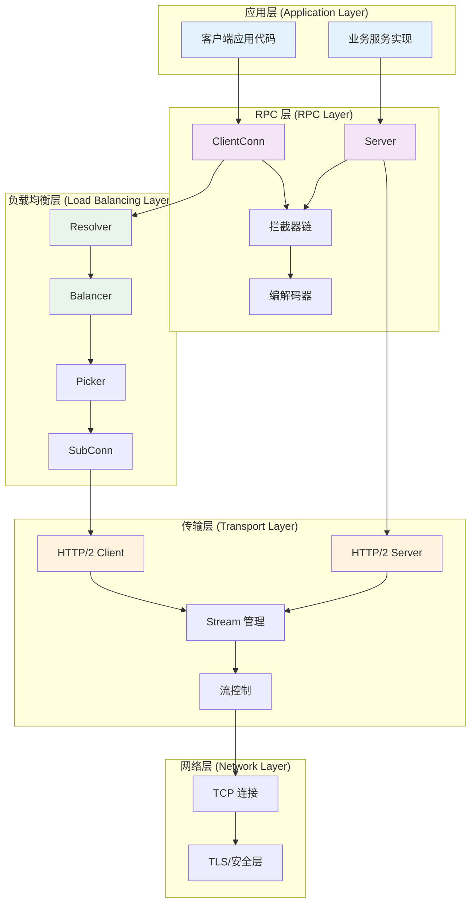
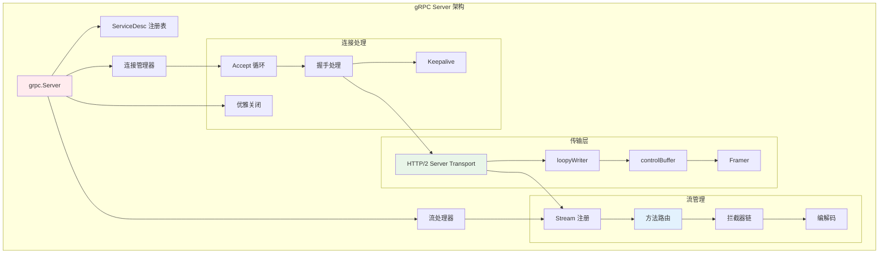
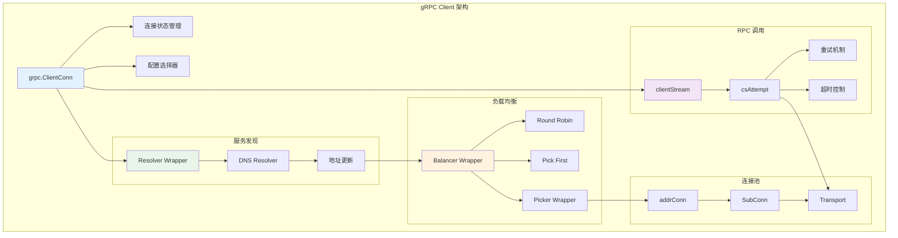
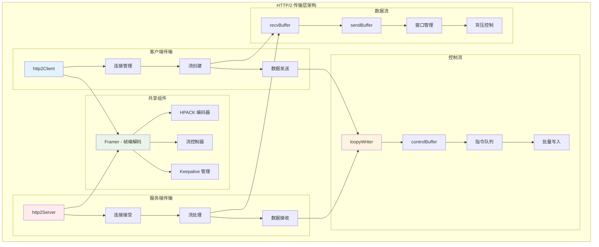
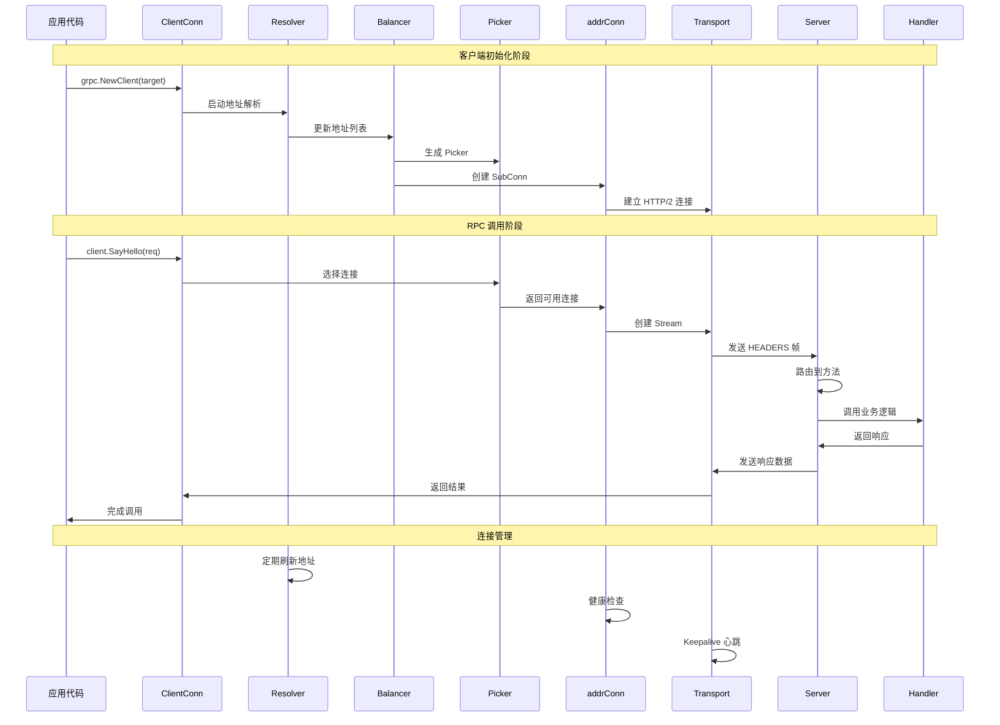
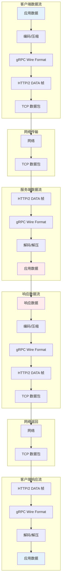
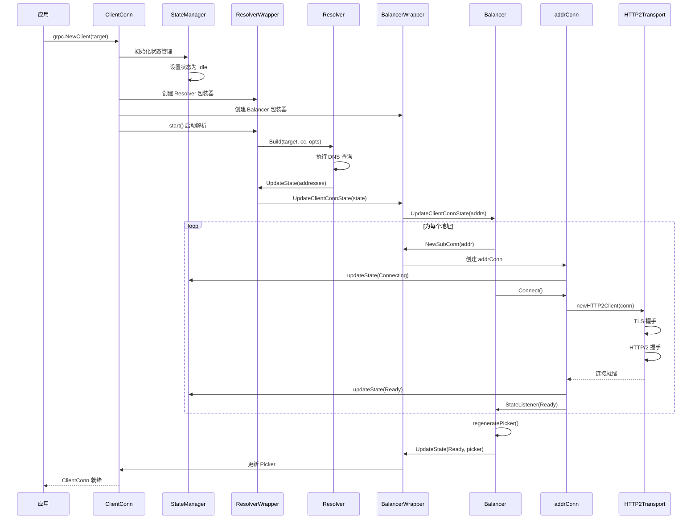
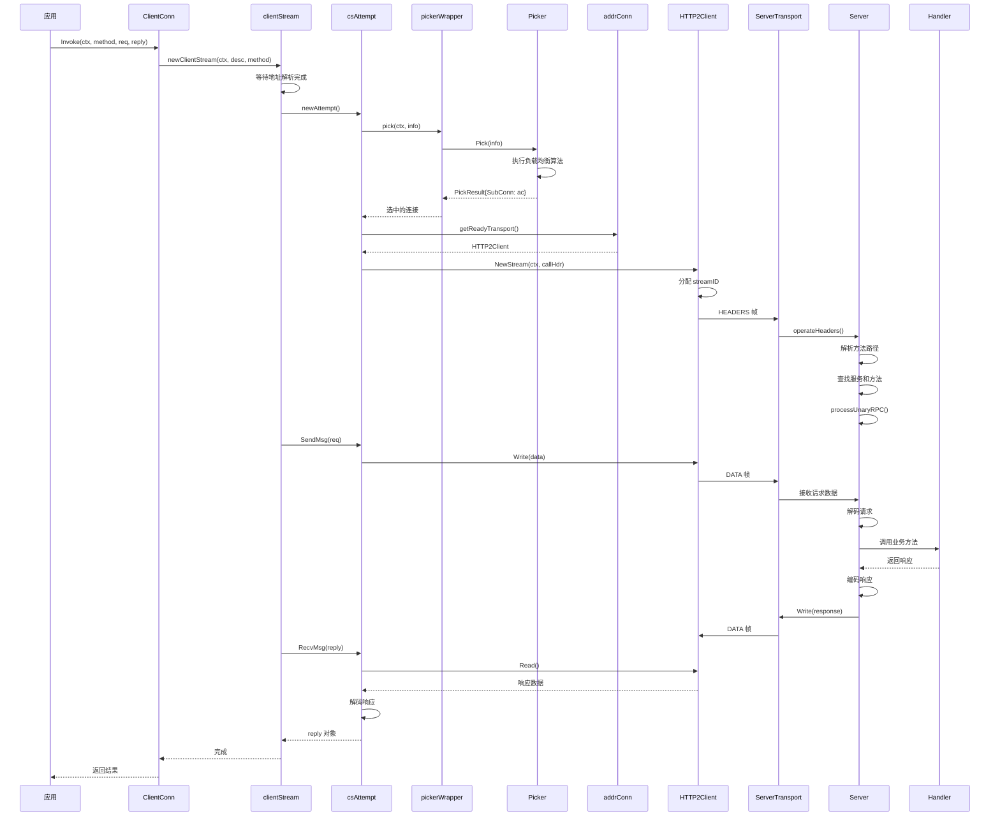
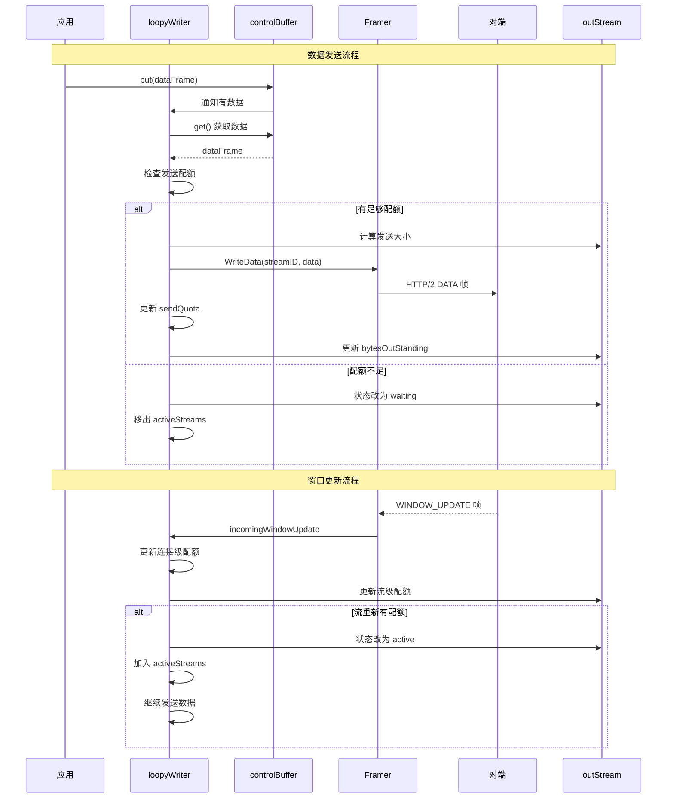
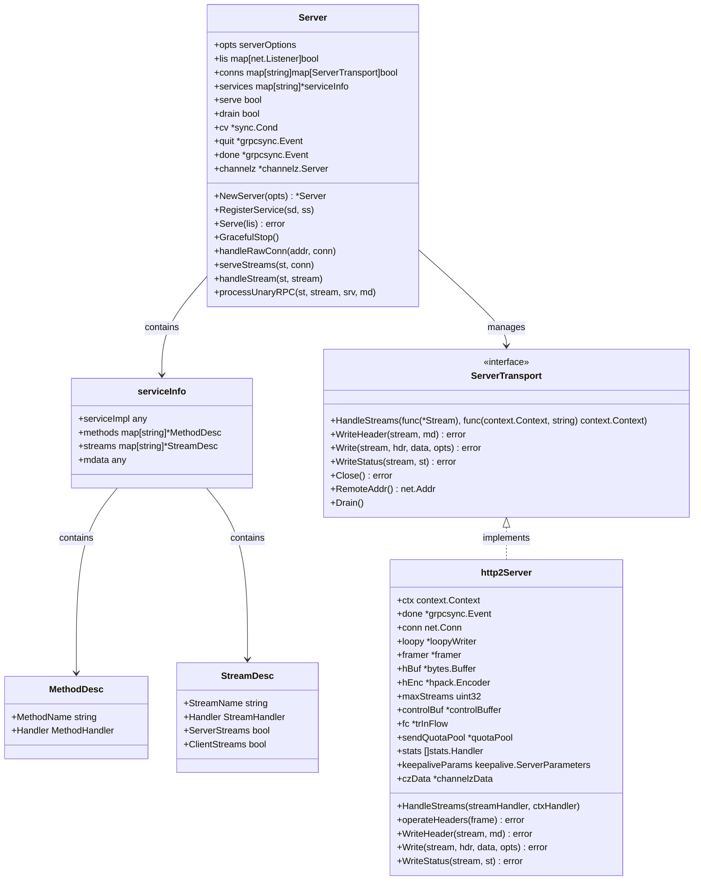

# gRPC-Go 整体架构分析

## 目录

1. [整体架构概览](#整体架构概览)
2. [核心组件架构](#核心组件架构)
3. [模块交互关系](#模块交互关系)
4. [数据流时序图](#数据流时序图)
5. [关键结构体关系](#关键结构体关系)

## 整体架构概览

gRPC-Go 采用分层架构设计，从上到下分为应用层、RPC 层、传输层和网络层：



## 核心组件架构

### 1. 服务端架构



### 2. 客户端架构



### 3. 传输层架构



## 模块交互关系

### 1. 完整调用链路图



### 2. 数据流向图



## 数据流时序图

### 1. 客户端连接建立时序



### 2. RPC 调用完整时序



### 3. 流控制时序图



## 关键结构体关系

### 1. 服务端核心结构



### 2. 客户端核心结构

```mermaid
classDiagram
    class ClientConn {
        +ctx context.Context
        +cancel context.CancelFunc
        +target string
        +parsedTarget resolver.Target
        +authority string
        +dopts dialOptions
        +csMgr *connectivityStateManager
        +balancerWrapper *ccBalancerWrapper
        +resolverWrapper *ccResolverWrapper
        +blockingpicker *pickerWrapper
        +conns map[*addrConn]struct{}
        +channelz *channelz.Channel
        
        +NewClient(target, opts) (*ClientConn, error)
        +Invoke(ctx, method, args, reply, opts) error
        +NewStream(ctx, desc, method, opts) (ClientStream, error)
        +GetState() connectivity.State
        +WaitForStateChange(ctx, lastState) bool
        +Close() error
    }
    
    class ccResolverWrapper {
        +cc *ClientConn
        +resolverMu sync.Mutex
        +resolver resolver.Resolver
        +done *grpcsync.Event
        +curState resolver.State
        
        +start() error
        +resolveNow(o resolver.ResolveNowOptions)
        +UpdateState(s resolver.State) error
        +ReportError(err error)
        +close()
    }
    
    class ccBalancerWrapper {
        +cc *ClientConn
        +balancerMu sync.Mutex
        +balancer balancer.Balancer
        +updateCh *buffer.Unbounded
        +done *grpcsync.Event
        +subConns map[*acBalancerWrapper]struct{}
        
        +UpdateClientConnState(ccs balancer.ClientConnState) error
        +UpdateState(s balancer.State) error
        +NewSubConn(addrs, opts) (balancer.SubConn, error)
        +RemoveSubConn(sc balancer.SubConn)
        +close()
    }
    
    class addrConn {
        +cc *ClientConn
        +addrs []resolver.Address
        +ctx context.Context
        +cancel context.CancelFunc
        +stateMu sync.Mutex
        +state connectivity.State
        +backoffIdx int
        +resetBackoff chan struct{}
        +transport transport.ClientTransport
        +czData *channelzData
        
        +connect() error
        +tryAllAddrs(addrs, connectDeadline) error
        +createTransport(addr, copts, connectDeadline) error
        +getReadyTransport() transport.ClientTransport
        +tearDown(err error)
    }
    
    class pickerWrapper {
        +mu sync.Mutex
        +done bool
        +blockingCh chan struct{}
        +picker balancer.Picker
        
        +updatePicker(p balancer.Picker)
        +pick(ctx, failfast, info) (transport.ClientTransport, balancer.PickResult, error)
        +close()
    }
    
    ClientConn --> ccResolverWrapper : has
    ClientConn --> ccBalancerWrapper : has
    ClientConn --> pickerWrapper : has
    ClientConn --> addrConn : manages
    ccBalancerWrapper --> addrConn : creates
```

### 3. 传输层结构关系

```mermaid
classDiagram
    class ClientTransport {
        <<interface>>
        +Write(s, hdr, data, opts) error
        +NewStream(ctx, callHdr) (*Stream, error)
        +CloseStream(stream, err) error
        +Error() <-chan struct{}
        +GoAway() <-chan struct{}
        +GetGoAwayReason() GoAwayReason
    }
    
    class ServerTransport {
        <<interface>>
        +HandleStreams(streamHandler, ctxHandler)
        +WriteHeader(stream, md) error
        +Write(stream, hdr, data, opts) error
        +WriteStatus(stream, st) error
        +Close() error
        +Drain()
    }
    
    class http2Client {
        +ctx context.Context
        +ctxDone <-chan struct{}
        +cancel context.CancelFunc
        +conn net.Conn
        +loopy *loopyWriter
        +framer *framer
        +hBuf *bytes.Buffer
        +hEnc *hpack.Encoder
        +controlBuf *controlBuffer
        +fc *trInFlow
        +sendQuotaPool *quotaPool
        +localSendQuota *quotaPool
        +mu sync.Mutex
        +activeStreams map[uint32]*Stream
        +nextID uint32
        +maxConcurrentStreams uint32
        +streamQuota int64
        +streamsQuotaAvailable chan struct{}
        +waitingStreams uint32
        +goAway chan struct{}
        +awakenKeepalive chan struct{}
        +czData *channelzData
        
        +NewStream(ctx, callHdr) (*Stream, error)
        +Write(s, hdr, data, opts) error
        +CloseStream(stream, err) error
        +handleData(f) error
        +handleHeaders(f) error
        +handleRSTStream(f) error
        +handleSettings(f) error
        +handlePing(f) error
        +handleGoAway(f) error
        +handleWindowUpdate(f) error
    }
    
    class http2Server {
        +ctx context.Context
        +done *grpcsync.Event
        +conn net.Conn
        +loopy *loopyWriter
        +framer *framer
        +hBuf *bytes.Buffer
        +hEnc *hpack.Encoder
        +maxStreams uint32
        +controlBuf *controlBuffer
        +fc *trInFlow
        +sendQuotaPool *quotaPool
        +stats []stats.Handler
        +mu sync.Mutex
        +activeStreams map[uint32]*Stream
        +streamSendQuota uint32
        +czData *channelzData
        
        +HandleStreams(streamHandler, ctxHandler)
        +operateHeaders(frame) error
        +WriteHeader(stream, md) error
        +Write(stream, hdr, data, opts) error
        +WriteStatus(stream, st) error
        +handleData(f) error
        +handleHeaders(f) error
        +handleRSTStream(f) error
        +handleSettings(f) error
        +handlePing(f) error
        +handleGoAway(f) error
        +handleWindowUpdate(f) error
    }
    
    class loopyWriter {
        +side side
        +cbuf *controlBuffer
        +sendQuota uint32
        +oiws uint32
        +estdStreams map[uint32]*outStream
        +activeStreams *outStreamList
        +framer *framer
        +hBuf *bytes.Buffer
        +hEnc *hpack.Encoder
        +bdpEst *bdpEstimator
        +draining bool
        +conn net.Conn
        +logger *grpclog.PrefixLogger
        
        +run() error
        +writeHeader(streamID, endStream, hf, onWrite) error
        +processData() (bool, error)
        +handleWindowUpdate(wu *windowUpdate) error
        +outgoingWindowUpdateHandler(wu *windowUpdate) error
        +incomingWindowUpdateHandler(wu *windowUpdate) error
    }
    
    class controlBuffer {
        +ch chan struct{}
        +done <-chan struct{}
        +mu sync.Mutex
        +consumerWaiting bool
        +list *itemList
        +err error
        +consumeAndClose func(item) error
        
        +put(it) error
        +load() error
        +get(block) (item, error)
        +finish()
        +close()
    }
    
    ClientTransport <|.. http2Client : implements
    ServerTransport <|.. http2Server : implements
    http2Client --> loopyWriter : has
    http2Server --> loopyWriter : has
    loopyWriter --> controlBuffer : uses
```

这个架构分析文档全面展示了 gRPC-Go 的整体架构、核心组件、模块交互关系和关键数据结构。通过详细的架构图和时序图，开发者可以深入理解 gRPC-Go 的内部工作机制和各组件之间的协作关系。
