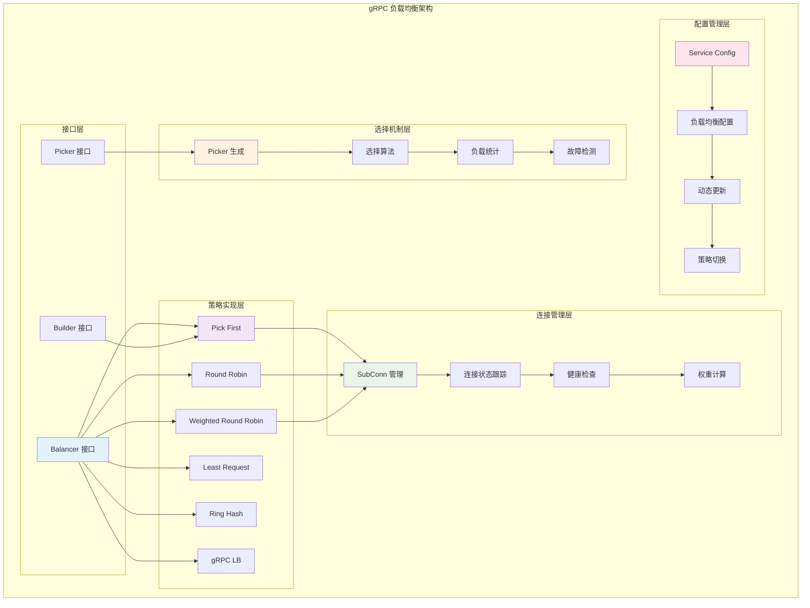
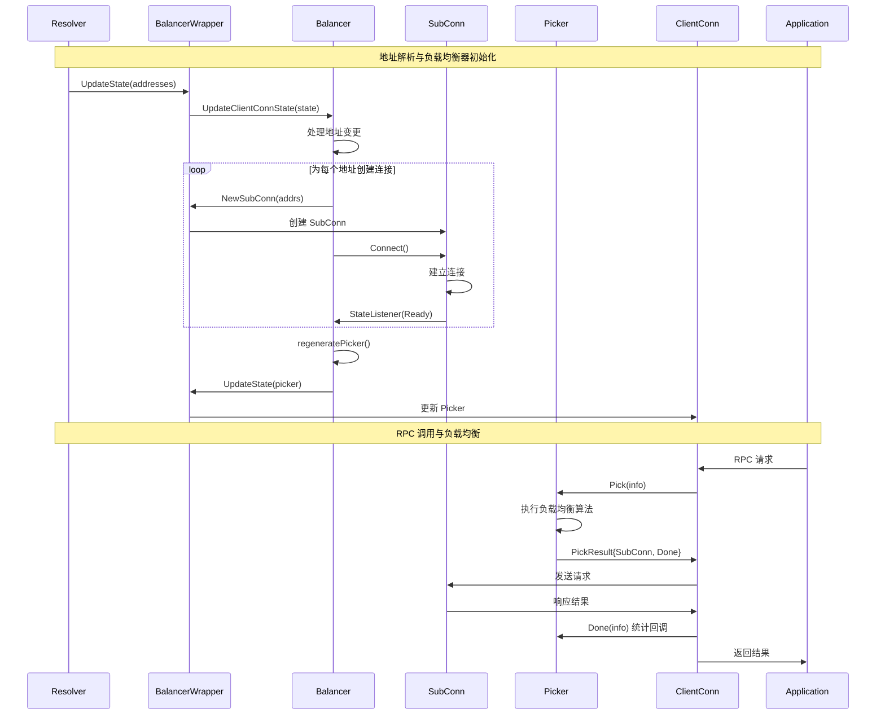
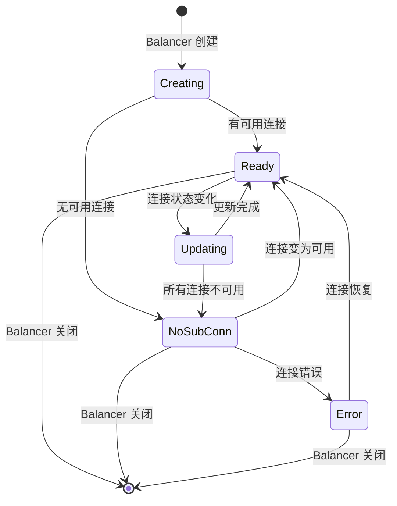

# gRPC-Go 负载均衡模块深度剖析

## 目录

1. [负载均衡模块架构](#负载均衡模块架构)
2. [核心接口与抽象](#核心接口与抽象)
3. [内置负载均衡策略](#内置负载均衡策略)
4. [Picker 机制详解](#picker-机制详解)
5. [健康检查集成](#健康检查集成)
6. [自定义负载均衡器](#自定义负载均衡器)
7. [关键结构体关系](#关键结构体关系)
8. [实战经验总结](#实战经验总结)

## 负载均衡模块架构

### 整体架构图



### 负载均衡工作流程



## 核心接口与抽象

### 1. Balancer 接口定义

```go
// 位置：balancer/balancer.go
type Balancer interface {
    // UpdateClientConnState 当 ClientConn 状态改变时被调用
    UpdateClientConnState(ClientConnState) error
    
    // ResolverError 当 Resolver 遇到错误时被调用
    ResolverError(error)
    
    // UpdateSubConnState 当 SubConn 状态改变时被调用
    UpdateSubConnState(SubConn, SubConnState)
    
    // Close 关闭负载均衡器
    Close()
}

// ClientConnState 包含 ClientConn 的状态信息
type ClientConnState struct {
    ResolverState  resolver.State                    // 解析器状态
    BalancerConfig serviceconfig.LoadBalancingConfig // 负载均衡配置
}

// SubConnState 包含 SubConn 的状态信息
type SubConnState struct {
    ConnectivityState connectivity.State // 连接状态
    ConnectionError   error              // 连接错误
}
```

### 2. Picker 接口定义

```go
// 位置：balancer/balancer.go
type Picker interface {
    // Pick 返回用于此 RPC 的连接和相关信息
    // Pick 不应该阻塞。如果负载均衡器需要执行 I/O 或任何阻塞
    // 或耗时的工作来服务此调用，它应该返回 ErrNoSubConnAvailable，
    // 当 Picker 更新时，gRPC 将重复 Pick 调用
    Pick(info PickInfo) (PickResult, error)
}

// PickInfo 包含 Pick 调用的信息
type PickInfo struct {
    FullMethodName string        // 完整方法名
    Ctx            context.Context // 请求上下文
}

// PickResult 包含 Pick 的结果
type PickResult struct {
    SubConn SubConn                    // 选中的子连接
    Done    func(DoneInfo)            // 完成回调
    Metadata metadata.MD              // 要添加的元数据
}

// DoneInfo 包含 RPC 完成的信息
type DoneInfo struct {
    Err           error     // RPC 错误
    Trailer       metadata.MD // 尾部元数据
    BytesSent     bool      // 是否发送了字节
    BytesReceived bool      // 是否接收了字节
    ServerLoad    any       // 服务器负载信息
}
```

### 3. Builder 接口定义

```go
// 位置：balancer/balancer.go
type Builder interface {
    // Build 创建一个新的负载均衡器
    Build(cc ClientConn, opts BuildOptions) Balancer
    
    // Name 返回负载均衡器的名称
    Name() string
}

// ClientConn 表示 gRPC ClientConn 的负载均衡器视图
type ClientConn interface {
    // NewSubConn 创建一个新的 SubConn
    NewSubConn([]resolver.Address, NewSubConnOptions) (SubConn, error)
    
    // RemoveSubConn 移除一个 SubConn
    RemoveSubConn(SubConn)
    
    // UpdateAddresses 更新 SubConn 的地址
    UpdateAddresses(SubConn, []resolver.Address) error
    
    // UpdateState 更新 ClientConn 的状态
    UpdateState(State) error
    
    // ResolveNow 触发立即解析
    ResolveNow(resolver.ResolveNowOptions)
    
    // Target 返回目标字符串
    Target() string
}
```

## 内置负载均衡策略

### 1. Pick First 策略

Pick First 是最简单的负载均衡策略，它总是选择第一个可用的连接。

```go
// 位置：balancer/pickfirst/pickfirst.go
type pickfirstBalancer struct {
    state connectivity.State
    cc    balancer.ClientConn
    subConn balancer.SubConn
}

// UpdateClientConnState 处理地址更新
func (b *pickfirstBalancer) UpdateClientConnState(cs balancer.ClientConnState) error {
    if len(cs.ResolverState.Addresses) == 0 {
        b.ResolverError(errors.New("produced zero addresses"))
        return balancer.ErrBadResolverState
    }
    
    if b.subConn != nil {
        b.cc.UpdateAddresses(b.subConn, cs.ResolverState.Addresses)
        return nil
    }
    
    // 创建新的 SubConn
    subConn, err := b.cc.NewSubConn(cs.ResolverState.Addresses, balancer.NewSubConnOptions{
        StateListener: func(scs balancer.SubConnState) {
            b.updateSubConnState(subConn, scs)
        },
    })
    if err != nil {
        if logger.V(2) {
            logger.Errorf("pickfirstBalancer: failed to NewSubConn: %v", err)
        }
        b.state = connectivity.TransientFailure
        b.cc.UpdateState(balancer.State{
            ConnectivityState: connectivity.TransientFailure,
            Picker:           &picker{err: fmt.Errorf("error creating connection: %v", err)},
        })
        return balancer.ErrBadResolverState
    }
    b.subConn = subConn
    b.state = connectivity.Idle
    b.cc.UpdateState(balancer.State{
        ConnectivityState: connectivity.Idle,
        Picker:           &picker{err: balancer.ErrNoSubConnAvailable},
    })
    subConn.Connect()
    return nil
}

// updateSubConnState 处理 SubConn 状态变化
func (b *pickfirstBalancer) updateSubConnState(subConn balancer.SubConn, s balancer.SubConnState) {
    if logger.V(2) {
        logger.Infof("pickfirstBalancer: UpdateSubConnState: %p, %v", subConn, s)
    }
    if b.subConn != subConn {
        if logger.V(2) {
            logger.Infof("pickfirstBalancer: ignored state change because subConn is not recognized")
        }
        return
    }
    if s.ConnectivityState == connectivity.Shutdown {
        b.subConn = nil
        return
    }
    
    switch s.ConnectivityState {
    case connectivity.Ready:
        b.cc.UpdateState(balancer.State{
            ConnectivityState: s.ConnectivityState,
            Picker:           &picker{result: balancer.PickResult{SubConn: subConn}},
        })
    case connectivity.Connecting:
        b.cc.UpdateState(balancer.State{
            ConnectivityState: s.ConnectivityState,
            Picker:           &picker{err: balancer.ErrNoSubConnAvailable},
        })
    case connectivity.Idle:
        b.cc.UpdateState(balancer.State{
            ConnectivityState: s.ConnectivityState,
            Picker:           &idlePicker{subConn: subConn},
        })
    case connectivity.TransientFailure:
        b.cc.UpdateState(balancer.State{
            ConnectivityState: s.ConnectivityState,
            Picker:           &picker{err: s.ConnectionError},
        })
    }
}

// Pick First Picker 实现
type picker struct {
    result balancer.PickResult
    err    error
}

func (p *picker) Pick(balancer.PickInfo) (balancer.PickResult, error) {
    return p.result, p.err
}

// Idle Picker 在连接空闲时触发连接
type idlePicker struct {
    subConn balancer.SubConn
}

func (i *idlePicker) Pick(balancer.PickInfo) (balancer.PickResult, error) {
    i.subConn.Connect()
    return balancer.PickResult{}, balancer.ErrNoSubConnAvailable
}
```

### 2. Round Robin 策略

Round Robin 策略在所有可用连接之间轮询选择。

```go
// 位置：balancer/roundrobin/roundrobin.go
type rrBalancer struct {
    cc            balancer.ClientConn
    csEvltr       *balancer.ConnectivityStateEvaluator
    state         connectivity.State
    subConns      map[resolver.Address]balancer.SubConn
    scStates      map[balancer.SubConn]connectivity.State
    picker        balancer.Picker
    logger        *grpclog.PrefixLogger
    subConnsList  []*subConn
    currentIndex  int
}

// UpdateClientConnState 处理地址更新
func (b *rrBalancer) UpdateClientConnState(s balancer.ClientConnState) error {
    if logger.V(2) {
        logger.Info("roundrobinBalancer: UpdateClientConnState: ", s)
    }
    if len(s.ResolverState.Addresses) == 0 {
        b.ResolverError(errors.New("produced zero addresses"))
        return balancer.ErrBadResolverState
    }
    
    // 创建新的 SubConn
    for _, a := range s.ResolverState.Addresses {
        if _, ok := b.subConns[a]; !ok {
            sc, err := b.cc.NewSubConn([]resolver.Address{a}, balancer.NewSubConnOptions{
                HealthCheckEnabled: b.config.HealthCheckEnabled,
                StateListener: func(scs balancer.SubConnState) {
                    b.updateSubConnState(sc, scs)
                },
            })
            if err != nil {
                logger.Warningf("roundrobinBalancer: failed to create new SubConn: %v", err)
                continue
            }
            b.subConns[a] = sc
            b.scStates[sc] = connectivity.Idle
            b.csEvltr.RecordTransition(connectivity.Shutdown, connectivity.Idle)
            sc.Connect()
        }
    }
    
    // 移除不再需要的 SubConn
    for a, sc := range b.subConns {
        found := false
        for _, aa := range s.ResolverState.Addresses {
            if a == aa {
                found = true
                break
            }
        }
        if !found {
            b.cc.RemoveSubConn(sc)
            delete(b.subConns, a)
            delete(b.scStates, sc)
        }
    }
    
    // 如果状态发生变化，更新 picker
    if b.state != b.csEvltr.CurrentState() {
        b.state = b.csEvltr.CurrentState()
        b.regeneratePicker()
        b.cc.UpdateState(balancer.State{ConnectivityState: b.state, Picker: b.picker})
    }
    return nil
}

// regeneratePicker 重新生成 picker
func (b *rrBalancer) regeneratePicker() {
    if b.state == connectivity.TransientFailure {
        b.picker = base.NewErrPicker(b.mergeErrors())
        return
    }
    var readySCs []balancer.SubConn
    for sc, state := range b.scStates {
        if state == connectivity.Ready {
            readySCs = append(readySCs, sc)
        }
    }
    b.picker = &rrPicker{
        subConns: readySCs,
        next:     grpcrand.Intn(len(readySCs)),
    }
}

// Round Robin Picker 实现
type rrPicker struct {
    subConns []balancer.SubConn
    mu       sync.Mutex
    next     int
}

func (p *rrPicker) Pick(balancer.PickInfo) (balancer.PickResult, error) {
    p.mu.Lock()
    sc := p.subConns[p.next]
    p.next = (p.next + 1) % len(p.subConns)
    p.mu.Unlock()
    return balancer.PickResult{SubConn: sc}, nil
}
```

### 3. Weighted Round Robin 策略

Weighted Round Robin 基于权重进行轮询选择，支持动态权重调整。

```go
// 位置：balancer/weightedroundrobin/balancer.go
type wrrBalancer struct {
    cc     balancer.ClientConn
    config *LBConfig
    
    csEvltr *balancer.ConnectivityStateEvaluator
    state   connectivity.State
    
    endpoints map[string]*endpointWeight
    picker    *picker
}

// UpdateClientConnState 处理地址更新
func (b *wrrBalancer) UpdateClientConnState(s balancer.ClientConnState) error {
    if logger.V(2) {
        logger.Info("wrrBalancer: UpdateClientConnState: ", s)
    }
    
    addresses := s.ResolverState.Addresses
    if len(addresses) == 0 {
        b.ResolverError(errors.New("produced zero addresses"))
        return balancer.ErrBadResolverState
    }
    
    // 更新端点权重
    newEndpoints := make(map[string]*endpointWeight)
    for _, addr := range addresses {
        addrStr := addr.Addr
        if ew, exists := b.endpoints[addrStr]; exists {
            newEndpoints[addrStr] = ew
            ew.updateAddress(addr)
        } else {
            ew := newEndpointWeight(addr, b.config, b.cc)
            newEndpoints[addrStr] = ew
        }
    }
    
    // 清理不再需要的端点
    for addr, ew := range b.endpoints {
        if _, exists := newEndpoints[addr]; !exists {
            ew.close()
        }
    }
    
    b.endpoints = newEndpoints
    b.regeneratePicker()
    return nil
}

// regeneratePicker 重新生成加权 picker
func (b *wrrBalancer) regeneratePicker() {
    if b.state == connectivity.TransientFailure {
        b.picker = &picker{err: b.mergeErrors()}
        return
    }
    
    var readyEndpoints []*weightedPicker
    for _, ew := range b.endpoints {
        if ew.getState() == connectivity.Ready {
            readyEndpoints = append(readyEndpoints, &weightedPicker{
                picker:           ew.getPicker(),
                weightedEndpoint: ew,
                weight:          ew.getWeight(),
            })
        }
    }
    
    if len(readyEndpoints) == 0 {
        b.picker = &picker{err: balancer.ErrNoSubConnAvailable}
        return
    }
    
    b.picker = newPicker(readyEndpoints, b.config)
}

// Weighted Round Robin Picker 实现
type picker struct {
    cfg             *LBConfig
    weightedPickers []*weightedPicker
    scheduler       unsafe.Pointer // *scheduler
    v               uint32          // 版本号
}

func (p *picker) Pick(info balancer.PickInfo) (balancer.PickResult, error) {
    // 原子读取调度器
    sched := *(*scheduler)(atomic.LoadPointer(&p.scheduler))
    
    pickedPicker := p.weightedPickers[sched.nextIndex()]
    pr, err := pickedPicker.picker.Pick(info)
    if err != nil {
        logger.Errorf("ready picker returned error: %v", err)
        return balancer.PickResult{}, err
    }
    
    if !p.cfg.EnableOOBLoadReport {
        oldDone := pr.Done
        pr.Done = func(info balancer.DoneInfo) {
            if load, ok := info.ServerLoad.(*v3orcapb.OrcaLoadReport); ok && load != nil {
                pickedPicker.weightedEndpoint.OnLoadReport(load)
            }
            if oldDone != nil {
                oldDone(info)
            }
        }
    }
    return pr, nil
}

// 权重调度器
type scheduler struct {
    weights []float64
    total   float64
    mu      sync.Mutex
    index   int
}

func (s *scheduler) nextIndex() int {
    s.mu.Lock()
    defer s.mu.Unlock()
    
    // 使用加权轮询算法
    maxWeight := float64(0)
    selectedIndex := 0
    
    for i, weight := range s.weights {
        if weight > maxWeight {
            maxWeight = weight
            selectedIndex = i
        }
    }
    
    // 减少选中权重，增加其他权重
    s.weights[selectedIndex] -= s.total
    for i := range s.weights {
        if i != selectedIndex {
            s.weights[i] += s.weights[i] / s.total
        }
    }
    
    return selectedIndex
}
```

### 4. Least Request 策略

Least Request 策略选择当前请求数最少的连接。

```go
// 位置：balancer/leastrequest/leastrequest.go
type leastRequestBalancer struct {
    cc       balancer.ClientConn
    csEvltr  *balancer.ConnectivityStateEvaluator
    state    connectivity.State
    subConns map[resolver.Address]*subConn
    picker   balancer.Picker
}

type subConn struct {
    addr         resolver.Address
    sc           balancer.SubConn
    state        connectivity.State
    activeReqs   int64 // 活跃请求数
}

// regeneratePicker 重新生成最少请求 picker
func (b *leastRequestBalancer) regeneratePicker() {
    if b.state == connectivity.TransientFailure {
        b.picker = base.NewErrPicker(b.mergeErrors())
        return
    }
    
    var readySCs []*subConn
    for _, sc := range b.subConns {
        if sc.state == connectivity.Ready {
            readySCs = append(readySCs, sc)
        }
    }
    
    if len(readySCs) == 0 {
        b.picker = base.NewErrPicker(balancer.ErrNoSubConnAvailable)
        return
    }
    
    b.picker = &picker{
        subConns: readySCs,
    }
}

// Least Request Picker 实现
type picker struct {
    subConns []*subConn
}

func (p *picker) Pick(balancer.PickInfo) (balancer.PickResult, error) {
    if len(p.subConns) == 0 {
        return balancer.PickResult{}, balancer.ErrNoSubConnAvailable
    }
    
    // 找到请求数最少的连接
    var selected *subConn
    minReqs := int64(math.MaxInt64)
    
    for _, sc := range p.subConns {
        activeReqs := atomic.LoadInt64(&sc.activeReqs)
        if activeReqs < minReqs {
            minReqs = activeReqs
            selected = sc
        }
    }
    
    if selected == nil {
        return balancer.PickResult{}, balancer.ErrNoSubConnAvailable
    }
    
    // 增加活跃请求计数
    atomic.AddInt64(&selected.activeReqs, 1)
    
    return balancer.PickResult{
        SubConn: selected.sc,
        Done: func(info balancer.DoneInfo) {
            // 减少活跃请求计数
            atomic.AddInt64(&selected.activeReqs, -1)
        },
    }, nil
}
```

### 5. Ring Hash 策略

Ring Hash 策略基于一致性哈希算法，适用于需要会话亲和性的场景。

```go
// 位置：balancer/ringhash/picker.go
type picker struct {
    ring                         *ring
    requestHashHeader            string
    hasEndpointInConnectingState bool
    randUint64                   func() uint64
}

func (p *picker) Pick(info balancer.PickInfo) (balancer.PickResult, error) {
    usingRandomHash := false
    var requestHash uint64
    
    if p.requestHashHeader == "" {
        var ok bool
        if requestHash, ok = iringhash.XDSRequestHash(info.Ctx); !ok {
            return balancer.PickResult{}, fmt.Errorf("ringhash: expected xDS config selector to set the request hash")
        }
    } else {
        md, ok := metadata.FromOutgoingContext(info.Ctx)
        if !ok || len(md.Get(p.requestHashHeader)) == 0 {
            requestHash = p.randUint64()
            usingRandomHash = true
        } else {
            values := strings.Join(md.Get(p.requestHashHeader), ",")
            requestHash = xxhash.Sum64String(values)
        }
    }

    e := p.ring.pick(requestHash)
    ringSize := len(p.ring.items)
    
    if !usingRandomHash {
        // 根据 gRFC A61，由于 PickFirst 的 sticky-TF 和自动重连，
        // 我们忽略所有 TF 子通道，找到第一个处于 READY、CONNECTING 或 IDLE 状态的环条目
        for i := 0; i < ringSize; i++ {
            index := (e.idx + i) % ringSize
            es := p.endpointState(p.ring.items[index])
            switch es.state.ConnectivityState {
            case connectivity.Ready, connectivity.Connecting, connectivity.Idle:
                return es.state.Picker.Pick(info)
            case connectivity.TransientFailure:
                // 继续查找下一个
            default:
                panic(fmt.Sprintf("Found child balancer in unknown state: %v", es.state.ConnectivityState))
            }
        }
    } else {
        // 如果 picker 生成了随机哈希，它将从选中的条目开始遍历环
        // 直到找到一个处于 READY 状态的条目
        for i := 0; i < ringSize; i++ {
            index := (e.idx + i) % ringSize
            es := p.endpointState(p.ring.items[index])
            if es.state.ConnectivityState == connectivity.Ready {
                return es.state.Picker.Pick(info)
            }
        }
    }
    
    return balancer.PickResult{}, balancer.ErrNoSubConnAvailable
}

// 一致性哈希环
type ring struct {
    items []*ringEntry
}

type ringEntry struct {
    idx      int
    hash     uint64
    endpoint balancer.Endpoint
}

// pick 在环上查找哈希值对应的条目
func (r *ring) pick(h uint64) *ringEntry {
    i := sort.Search(len(r.items), func(i int) bool {
        return r.items[i].hash >= h
    })
    if i == len(r.items) {
        i = 0
    }
    return r.items[i]
}
```

## Picker 机制详解

### 1. Picker 生命周期



### 2. Picker 更新机制

```go
// pickerWrapper 提供线程安全的 Picker 更新
type pickerWrapper struct {
    mu         sync.Mutex
    done       bool
    blockingCh chan struct{}
    picker     balancer.Picker
}

// updatePicker 更新 picker
func (pw *pickerWrapper) updatePicker(p balancer.Picker) {
    pw.mu.Lock()
    if pw.done {
        pw.mu.Unlock()
        return
    }
    pw.picker = p
    // 通知等待的 goroutine
    if pw.blockingCh != nil {
        close(pw.blockingCh)
        pw.blockingCh = nil
    }
    pw.mu.Unlock()
}

// pick 执行负载均衡选择
func (pw *pickerWrapper) pick(ctx context.Context, failfast bool, info balancer.PickInfo) (transport.ClientTransport, balancer.PickResult, error) {
    var ch chan struct{}
    var lastPickErr error
    
    for {
        pw.mu.Lock()
        if pw.done {
            pw.mu.Unlock()
            return nil, balancer.PickResult{}, ErrClientConnClosing
        }
        
        if pw.picker == nil {
            ch = pw.blockingCh
        }
        
        if ch == pw.blockingCh {
            // 等待新的 picker
            pw.mu.Unlock()
            select {
            case <-ctx.Done():
                var errStr string
                if lastPickErr != nil {
                    errStr = "latest balancer error: " + lastPickErr.Error()
                } else {
                    errStr = ctx.Err().Error()
                }
                switch ctx.Err() {
                case context.DeadlineExceeded:
                    return nil, balancer.PickResult{}, status.Error(codes.DeadlineExceeded, errStr)
                case context.Canceled:
                    return nil, balancer.PickResult{}, status.Error(codes.Canceled, errStr)
                }
            case <-ch:
            }
            continue
        }
        
        ch = pw.blockingCh
        p := pw.picker
        pw.mu.Unlock()
        
        // 执行负载均衡选择
        pickResult, err := p.Pick(info)
        if err != nil {
            if err == balancer.ErrNoSubConnAvailable {
                continue
            }
            if _, ok := status.FromError(err); ok {
                return nil, balancer.PickResult{}, err
            }
            return nil, balancer.PickResult{}, status.Error(codes.Unavailable, err.Error())
        }
        
        // 获取可用的传输
        acw, ok := pickResult.SubConn.(*acBalancerWrapper)
        if !ok {
            logger.Errorf("subconn returned from pick is type %T, not *acBalancerWrapper", pickResult.SubConn)
            continue
        }
        
        if t := acw.ac.getReadyTransport(); t != nil {
            return t, pickResult, nil
        }
        
        if pickResult.Done != nil {
            pickResult.Done(balancer.DoneInfo{Err: balancer.ErrNoSubConnAvailable})
        }
        
        logger.Infof("blockingPicker: the picked transport is not ready, loop back to repick")
    }
}
```

## 健康检查集成

### 1. 健康检查配置

```go
// 健康检查配置
type HealthCheckConfig struct {
    ServiceName string `json:"serviceName,omitempty"`
}

// 启用健康检查的 SubConn 选项
func NewSubConnWithHealthCheck(addrs []resolver.Address, serviceName string) balancer.NewSubConnOptions {
    return balancer.NewSubConnOptions{
        HealthCheckEnabled: true,
        StateListener: func(scs balancer.SubConnState) {
            // 处理健康状态变化
            handleHealthStateChange(scs)
        },
    }
}

func handleHealthStateChange(scs balancer.SubConnState) {
    switch scs.ConnectivityState {
    case connectivity.Ready:
        // 连接就绪且健康
        logger.Info("SubConn is ready and healthy")
    case connectivity.TransientFailure:
        // 连接失败或不健康
        logger.Warningf("SubConn is unhealthy: %v", scs.ConnectionError)
    }
}
```

### 2. 健康检查集成示例

```go
// 带健康检查的负载均衡器
type healthAwareBalancer struct {
    cc            balancer.ClientConn
    subConns      map[resolver.Address]*healthySubConn
    healthService string
}

type healthySubConn struct {
    sc       balancer.SubConn
    addr     resolver.Address
    healthy  bool
    lastCheck time.Time
}

func (b *healthAwareBalancer) UpdateClientConnState(s balancer.ClientConnState) error {
    // 解析健康检查配置
    var healthConfig *HealthCheckConfig
    if s.BalancerConfig != nil {
        if hc, ok := s.BalancerConfig.(*HealthCheckConfig); ok {
            healthConfig = hc
        }
    }
    
    for _, addr := range s.ResolverState.Addresses {
        if _, exists := b.subConns[addr]; !exists {
            // 创建带健康检查的 SubConn
            sc, err := b.cc.NewSubConn([]resolver.Address{addr}, balancer.NewSubConnOptions{
                HealthCheckEnabled: healthConfig != nil,
                StateListener: func(scs balancer.SubConnState) {
                    b.updateSubConnState(addr, scs)
                },
            })
            if err != nil {
                continue
            }
            
            b.subConns[addr] = &healthySubConn{
                sc:   sc,
                addr: addr,
                healthy: false,
                lastCheck: time.Now(),
            }
            sc.Connect()
        }
    }
    
    b.regeneratePicker()
    return nil
}

func (b *healthAwareBalancer) regeneratePicker() {
    var healthySubConns []balancer.SubConn
    for _, hsc := range b.subConns {
        if hsc.healthy {
            healthySubConns = append(healthySubConns, hsc.sc)
        }
    }
    
    if len(healthySubConns) == 0 {
        b.cc.UpdateState(balancer.State{
            ConnectivityState: connectivity.TransientFailure,
            Picker:           &picker{err: balancer.ErrNoSubConnAvailable},
        })
        return
    }
    
    b.cc.UpdateState(balancer.State{
        ConnectivityState: connectivity.Ready,
        Picker: &healthAwarePicker{
            subConns: healthySubConns,
        },
    })
}
```

## 自定义负载均衡器

### 1. 实现自定义负载均衡器

```go
// 自定义负载均衡器：基于延迟的选择
type latencyBasedBalancer struct {
    cc       balancer.ClientConn
    subConns map[resolver.Address]*latencySubConn
    picker   balancer.Picker
}

type latencySubConn struct {
    sc         balancer.SubConn
    addr       resolver.Address
    state      connectivity.State
    avgLatency time.Duration
    reqCount   int64
    totalTime  time.Duration
    mu         sync.RWMutex
}

// 更新延迟统计
func (lsc *latencySubConn) updateLatency(latency time.Duration) {
    lsc.mu.Lock()
    defer lsc.mu.Unlock()
    
    lsc.reqCount++
    lsc.totalTime += latency
    lsc.avgLatency = lsc.totalTime / time.Duration(lsc.reqCount)
}

// 获取平均延迟
func (lsc *latencySubConn) getAvgLatency() time.Duration {
    lsc.mu.RLock()
    defer lsc.mu.RUnlock()
    return lsc.avgLatency
}

// Builder 实现
type latencyBasedBuilder struct{}

func (latencyBasedBuilder) Build(cc balancer.ClientConn, opts balancer.BuildOptions) balancer.Balancer {
    return &latencyBasedBalancer{
        cc:       cc,
        subConns: make(map[resolver.Address]*latencySubConn),
    }
}

func (latencyBasedBuilder) Name() string {
    return "latency_based"
}

// 注册自定义负载均衡器
func init() {
    balancer.Register(latencyBasedBuilder{})
}

// UpdateClientConnState 实现
func (b *latencyBasedBalancer) UpdateClientConnState(s balancer.ClientConnState) error {
    for _, addr := range s.ResolverState.Addresses {
        if _, exists := b.subConns[addr]; !exists {
            sc, err := b.cc.NewSubConn([]resolver.Address{addr}, balancer.NewSubConnOptions{
                StateListener: func(scs balancer.SubConnState) {
                    b.updateSubConnState(addr, scs)
                },
            })
            if err != nil {
                continue
            }
            
            b.subConns[addr] = &latencySubConn{
                sc:    sc,
                addr:  addr,
                state: connectivity.Idle,
            }
            sc.Connect()
        }
    }
    
    b.regeneratePicker()
    return nil
}

// 基于延迟的 Picker
type latencyBasedPicker struct {
    subConns []*latencySubConn
}

func (p *latencyBasedPicker) Pick(info balancer.PickInfo) (balancer.PickResult, error) {
    if len(p.subConns) == 0 {
        return balancer.PickResult{}, balancer.ErrNoSubConnAvailable
    }
    
    // 选择延迟最低的连接
    var selected *latencySubConn
    minLatency := time.Hour
    
    for _, lsc := range p.subConns {
        if lsc.state == connectivity.Ready {
            avgLatency := lsc.getAvgLatency()
            if avgLatency < minLatency || selected == nil {
                minLatency = avgLatency
                selected = lsc
            }
        }
    }
    
    if selected == nil {
        return balancer.PickResult{}, balancer.ErrNoSubConnAvailable
    }
    
    start := time.Now()
    return balancer.PickResult{
        SubConn: selected.sc,
        Done: func(info balancer.DoneInfo) {
            // 更新延迟统计
            latency := time.Since(start)
            selected.updateLatency(latency)
        },
    }, nil
}
```

### 2. 使用自定义负载均衡器

```go
// 在客户端配置中使用自定义负载均衡器
const customServiceConfig = `{
    "loadBalancingConfig": [{"latency_based": {}}]
}`

conn, err := grpc.NewClient(target,
    grpc.WithDefaultServiceConfig(customServiceConfig),
    grpc.WithTransportCredentials(insecure.NewCredentials()),
)
```

## 关键结构体关系

### 类图关系

```mermaid
classDiagram
    class Balancer {
        <<interface>>
        +UpdateClientConnState(ClientConnState) error
        +ResolverError(error)
        +UpdateSubConnState(SubConn, SubConnState)
        +Close()
    }
    
    class Picker {
        <<interface>>
        +Pick(PickInfo) (PickResult, error)
    }
    
    class Builder {
        <<interface>>
        +Build(ClientConn, BuildOptions) Balancer
        +Name() string
    }
    
    class pickfirstBalancer {
        +state connectivity.State
        +cc balancer.ClientConn
        +subConn balancer.SubConn
        
        +UpdateClientConnState(cs ClientConnState) error
        +updateSubConnState(sc SubConn, s SubConnState)
        +ResolverError(error)
        +Close()
    }
    
    class rrBalancer {
        +cc balancer.ClientConn
        +csEvltr *ConnectivityStateEvaluator
        +state connectivity.State
        +subConns map[resolver.Address]balancer.SubConn
        +scStates map[balancer.SubConn]connectivity.State
        +picker balancer.Picker
        
        +UpdateClientConnState(s ClientConnState) error
        +regeneratePicker()
        +updateSubConnState(sc SubConn, s SubConnState)
    }
    
    class wrrBalancer {
        +cc balancer.ClientConn
        +config *LBConfig
        +csEvltr *ConnectivityStateEvaluator
        +state connectivity.State
        +endpoints map[string]*endpointWeight
        +picker *picker
        
        +UpdateClientConnState(s ClientConnState) error
        +regeneratePicker()
        +updateEndpointWeight(addr string, weight float64)
    }
    
    class rrPicker {
        +subConns []balancer.SubConn
        +mu sync.Mutex
        +next int
        
        +Pick(PickInfo) (PickResult, error)
    }
    
    class wrrPicker {
        +cfg *LBConfig
        +weightedPickers []*weightedPicker
        +scheduler unsafe.Pointer
        +v uint32
        
        +Pick(info PickInfo) (PickResult, error)
        +regenerateScheduler()
        +start(stopPicker *grpcsync.Event)
    }
    
    class pickerWrapper {
        +mu sync.Mutex
        +done bool
        +blockingCh chan struct{}
        +picker balancer.Picker
        
        +updatePicker(p balancer.Picker)
        +pick(ctx, failfast, info) (ClientTransport, PickResult, error)
        +close()
    }
    
    Balancer <|.. pickfirstBalancer : implements
    Balancer <|.. rrBalancer : implements
    Balancer <|.. wrrBalancer : implements
    Picker <|.. rrPicker : implements
    Picker <|.. wrrPicker : implements
    Builder --> Balancer : creates
    rrBalancer --> rrPicker : creates
    wrrBalancer --> wrrPicker : creates
    pickerWrapper --> Picker : wraps
```

## 实战经验总结

### 1. 负载均衡策略选择指南

**Pick First 适用场景**：
- 主备模式部署
- 需要会话亲和性
- 后端服务有明显优先级
- 简单的故障转移需求

**Round Robin 适用场景**：
- 后端服务实例性能相近
- 需要均匀分布负载
- 无状态服务
- 请求处理时间相对均匀

**Weighted Round Robin 适用场景**：
- 后端服务实例性能不同
- 需要根据服务器容量分配负载
- 支持动态权重调整
- 有负载反馈机制

**Least Request 适用场景**：
- 请求处理时间差异较大
- 需要考虑当前负载状况
- 后端服务处理能力不均匀
- 实时负载感知需求

### 2. 自定义负载均衡器最佳实践

**设计原则**：
```go
// 1. 线程安全设计
type customBalancer struct {
    mu       sync.RWMutex
    subConns map[string]*subConnInfo
    picker   balancer.Picker
}

// 2. 状态管理
func (b *customBalancer) updateSubConnState(sc balancer.SubConn, s balancer.SubConnState) {
    b.mu.Lock()
    defer b.mu.Unlock()
    
    // 更新连接状态
    info := b.subConns[sc.String()]
    info.state = s.ConnectivityState
    
    // 重新生成 picker
    b.regeneratePicker()
}

// 3. 错误处理
func (b *customBalancer) regeneratePicker() {
    readyConns := b.getReadyConnections()
    if len(readyConns) == 0 {
        b.picker = &errorPicker{err: balancer.ErrNoSubConnAvailable}
        return
    }
    
    b.picker = &customPicker{subConns: readyConns}
}
```

**性能优化**：
```go
// 1. 避免频繁的 Picker 重建
type optimizedBalancer struct {
    lastPickerHash uint64
    picker         balancer.Picker
}

func (b *optimizedBalancer) regeneratePicker() {
    newHash := b.calculateStateHash()
    if newHash == b.lastPickerHash {
        return // 状态未变化，无需重建
    }
    
    b.lastPickerHash = newHash
    b.picker = b.createNewPicker()
}

// 2. 使用对象池减少分配
var pickerPool = sync.Pool{
    New: func() interface{} {
        return &customPicker{}
    },
}

func (b *optimizedBalancer) createNewPicker() balancer.Picker {
    p := pickerPool.Get().(*customPicker)
    p.reset()
    p.subConns = b.getReadyConnections()
    return p
}
```

### 3. 健康检查集成策略

**健康检查配置**：
```go
// 配置健康检查
const healthCheckServiceConfig = `{
    "loadBalancingConfig": [{"round_robin": {}}],
    "healthCheckConfig": {
        "serviceName": "your.service.Health"
    }
}`

// 自定义健康检查逻辑
type healthChecker struct {
    client   grpc_health_v1.HealthClient
    service  string
    interval time.Duration
}

func (hc *healthChecker) startHealthCheck(sc balancer.SubConn) {
    ticker := time.NewTicker(hc.interval)
    defer ticker.Stop()
    
    for range ticker.C {
        ctx, cancel := context.WithTimeout(context.Background(), 5*time.Second)
        resp, err := hc.client.Check(ctx, &grpc_health_v1.HealthCheckRequest{
            Service: hc.service,
        })
        cancel()
        
        if err != nil || resp.Status != grpc_health_v1.HealthCheckResponse_SERVING {
            // 标记为不健康
            sc.UpdateState(balancer.SubConnState{
                ConnectivityState: connectivity.TransientFailure,
                ConnectionError:   fmt.Errorf("health check failed"),
            })
        } else {
            // 标记为健康
            sc.UpdateState(balancer.SubConnState{
                ConnectivityState: connectivity.Ready,
            })
        }
    }
}
```

### 4. 监控和调试

**负载均衡器监控**：
```go
type monitoredBalancer struct {
    balancer.Balancer
    metrics *BalancerMetrics
}

type BalancerMetrics struct {
    pickerUpdates    prometheus.Counter
    subConnStates    *prometheus.GaugeVec
    pickLatency      prometheus.Histogram
    pickErrors       prometheus.Counter
}

func (m *monitoredBalancer) UpdateClientConnState(s balancer.ClientConnState) error {
    start := time.Now()
    err := m.Balancer.UpdateClientConnState(s)
    
    if err == nil {
        m.metrics.pickerUpdates.Inc()
    }
    
    return err
}

func (m *monitoredBalancer) UpdateSubConnState(sc balancer.SubConn, s balancer.SubConnState) {
    m.metrics.subConnStates.WithLabelValues(s.ConnectivityState.String()).Set(1)
    m.Balancer.UpdateSubConnState(sc, s)
}

// Picker 监控
type monitoredPicker struct {
    balancer.Picker
    metrics *BalancerMetrics
}

func (p *monitoredPicker) Pick(info balancer.PickInfo) (balancer.PickResult, error) {
    start := time.Now()
    result, err := p.Picker.Pick(info)
    
    p.metrics.pickLatency.Observe(time.Since(start).Seconds())
    if err != nil {
        p.metrics.pickErrors.Inc()
    }
    
    return result, err
}
```

### 5. 故障处理和恢复

**故障检测和恢复**：
```go
type resilientBalancer struct {
    cc           balancer.ClientConn
    subConns     map[string]*resilientSubConn
    circuitBreaker *CircuitBreaker
}

type resilientSubConn struct {
    sc           balancer.SubConn
    failures     int
    lastFailure  time.Time
    backoffTime  time.Duration
}

type CircuitBreaker struct {
    failureThreshold int
    resetTimeout     time.Duration
    state           CircuitState
}

type CircuitState int

const (
    Closed CircuitState = iota
    Open
    HalfOpen
)

func (b *resilientBalancer) updateSubConnState(sc balancer.SubConn, s balancer.SubConnState) {
    rsc := b.subConns[sc.String()]
    
    switch s.ConnectivityState {
    case connectivity.Ready:
        // 重置失败计数
        rsc.failures = 0
        rsc.backoffTime = 0
        b.circuitBreaker.onSuccess()
        
    case connectivity.TransientFailure:
        // 增加失败计数
        rsc.failures++
        rsc.lastFailure = time.Now()
        rsc.backoffTime = b.calculateBackoff(rsc.failures)
        b.circuitBreaker.onFailure()
        
        // 延迟重连
        go func() {
            time.Sleep(rsc.backoffTime)
            if b.circuitBreaker.allowRequest() {
                sc.Connect()
            }
        }()
    }
    
    b.regeneratePicker()
}

func (b *resilientBalancer) calculateBackoff(failures int) time.Duration {
    base := 100 * time.Millisecond
    max := 30 * time.Second
    
    backoff := time.Duration(failures) * base
    if backoff > max {
        backoff = max
    }
    
    // 添加抖动
    jitter := time.Duration(rand.Float64() * float64(backoff) * 0.1)
    return backoff + jitter
}
```

### 6. 配置管理

**动态配置更新**：
```go
type configurableBalancer struct {
    cc     balancer.ClientConn
    config *BalancerConfig
    mu     sync.RWMutex
}

type BalancerConfig struct {
    Strategy        string            `json:"strategy"`
    HealthCheck     bool             `json:"healthCheck"`
    Weights         map[string]float64 `json:"weights"`
    CircuitBreaker  CircuitBreakerConfig `json:"circuitBreaker"`
}

func (b *configurableBalancer) UpdateConfig(newConfig *BalancerConfig) error {
    b.mu.Lock()
    defer b.mu.Unlock()
    
    // 验证配置
    if err := b.validateConfig(newConfig); err != nil {
        return err
    }
    
    oldConfig := b.config
    b.config = newConfig
    
    // 应用配置变更
    if oldConfig.Strategy != newConfig.Strategy {
        b.switchStrategy(newConfig.Strategy)
    }
    
    if !reflect.DeepEqual(oldConfig.Weights, newConfig.Weights) {
        b.updateWeights(newConfig.Weights)
    }
    
    b.regeneratePicker()
    return nil
}

func (b *configurableBalancer) switchStrategy(strategy string) {
    switch strategy {
    case "round_robin":
        b.picker = &rrPicker{}
    case "least_request":
        b.picker = &leastRequestPicker{}
    case "weighted_round_robin":
        b.picker = &wrrPicker{}
    default:
        logger.Warningf("Unknown strategy: %s, fallback to round_robin", strategy)
        b.picker = &rrPicker{}
    }
}
```

这个负载均衡模块文档详细分析了 gRPC-Go 负载均衡的核心架构、内置策略实现、Picker 机制、健康检查集成等关键组件，并提供了丰富的自定义负载均衡器实现和实战经验。通过深入的源码分析和完整的示例代码，帮助开发者全面理解负载均衡的工作原理和最佳实践。
