# grpc-go源码剖析：client

以下分析 gRPC Go 客户端的实现机制与常见配置。文中结合源码梳理关键链路，并给出可操作的工程提示。与无锁优化、自适应重试、路由等方案相关的做法在部分生产环境中已有使用，具体效果依赖于场景与实现细节。

## 1. 架构总览（组件与职责）

```mermaid
flowchart LR
  A[Client API
pb.Client] --> B[ClientConn]
  B --> C[Resolver
(dns/passthrough ...)]
  B --> D[Balancer
(round_robin ...)]
  D --> E[SubConn/addrConn]
  E --> F[Transport
(http2Client)]
  F --> G[Stream]
  G --> H[Framer
Read/Write]
  H -->|Data/Headers| Network[(HTTP/2)]
```

- **clientConn**：生命周期管理器（目标地址、连接池、空闲/活跃状态、channelz/metrics）。
- **resolver**：目标地址解析与**服务配置**(service config)下发（如负载均衡策略）。
- **balancer**：根据地址集维护 SubConn，并在 **picker.Pick** 时选择一条可用传输（Transport）。
- **frame/stream**：基于 HTTP/2 的帧收发与流管理，处理压缩、流控、超时、重试、keepalive。

---

## 2. 最小可用示例

```go
func main() {
    conn, err := grpc.NewClient(*addr, grpc.WithTransportCredentials(insecure.NewCredentials()))
    if err != nil {
        log.Fatalf("did not connect: %v", err)
    }
    defer conn.Close()

    c := pb.NewGreeterClient(conn)

    ctx, cancel := context.WithTimeout(context.Background(), time.Second)
    defer cancel()

    r, err := c.SayHello(ctx, &pb.HelloRequest{Name: *name})
    if err != nil {
        log.Fatalf("could not greet: %v", err)
    }
    log.Printf("Greeting: %s", r.GetMessage())
}
```

生成的 `client` 存根会调用：

```go
func (c *greeterClient) SayHello(ctx context.Context, in *HelloRequest, opts ...grpc.CallOption) (*HelloReply, error) {
    cOpts := append([]grpc.CallOption{grpc.StaticMethod()}, opts...)
    out := new(HelloReply)
    err := c.cc.Invoke(ctx, Greeter_SayHello_FullMethodName, in, out, cOpts...)
    if err != nil { return nil, err }
    return out, nil
}
```

---

## 3. 初始化与首个调用的生命周期

### 3.1 NewClient 完整初始化流程

基于 `clientconn.go` 的源码实现，详细的初始化和连接建立过程：

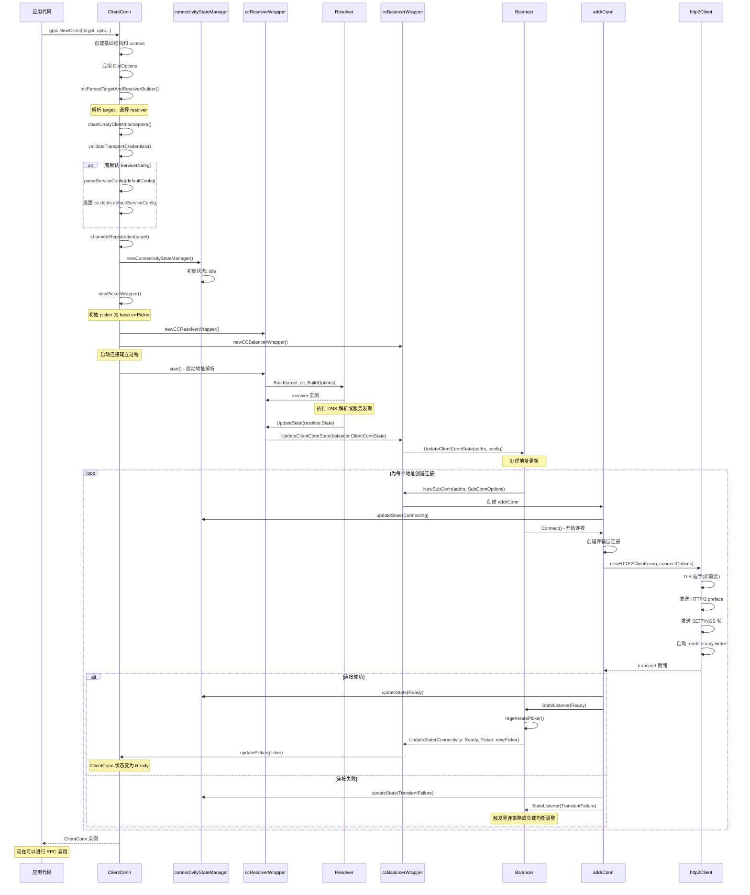

初始化过程中的关键组件包括：

connectivityStateManager 管理整个 ClientConn 的连接状态转换，包括 Idle、Connecting、Ready、TransientFailure 等状态，提供 `WaitForStateChange` API 支持应用层阻塞等待状态变更，内部通过 `pubSub` 机制通知状态订阅者。

Resolver 启动通过 `ccResolverWrapper.start()` 调用 `ccr.resolverBuilder.Build(ccr.cc.parsedTarget, ccr, resolver.BuildOptions{...})`。

Balancer 和 Resolver 的协作机制：Resolver 解析出地址后通过 `UpdateState` 传递给 Balancer，Balancer 为每个地址创建 SubConn（addrConn），SubConn 状态变化通过 `StateListener` 反馈给 Balancer，Balancer 根据 SubConn 状态生成相应的 Picker。

连接建立由 `addrConn.Connect()` 负责，HTTP/2 层面需要完成 preface 交换和 SETTINGS 协商，建立传输层后启动 loopyWriter 和 reader goroutine。

**关键函数调用路径**：

```text
客户端连接建立链路：
grpc.NewClient() → ccResolverWrapper.start() → 
resolver.Build() → resolver.UpdateState() → 
ccBalancerWrapper.UpdateClientConnState() → balancer.UpdateClientConnState() → 
balancer.NewSubConn() → addrConn.Connect() → 
newHTTP2Client() → http2Client.reader/loopyWriter.run()

状态管理链路：
addrConn.updateConnectivityState() → connectivityStateManager.updateState() → 
pubSub.Publish() → balancer.StateListener() → 
balancer.UpdateState() → pickerWrapper.updatePicker()
```

### 3.2 Service Config 解析与生效

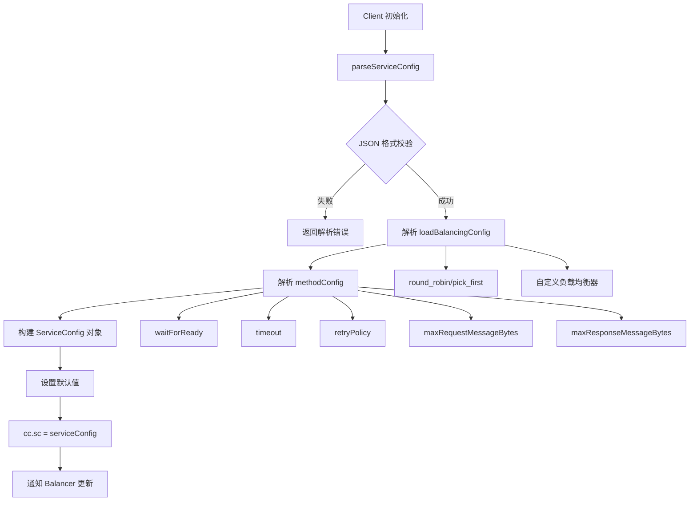

从测试代码可以看到，Service Config 支持以下核心配置：

#### 负载均衡配置

```json
{
  "loadBalancingConfig": [{"round_robin": {}}],
  // 或传统格式
  "loadBalancingPolicy": "round_robin"
}
```

#### 方法级配置

```json
{
  "methodConfig": [{
    "name": [{"service": "helloworld.Greeter", "method": "SayHello"}],
    "waitForReady": true,
    "timeout": "1s",
    "maxRequestMessageBytes": 1024,
    "maxResponseMessageBytes": 2048,
    "retryPolicy": {
      "maxAttempts": 3,
      "initialBackoff": "100ms",
      "maxBackoff": "1s", 
      "backoffMultiplier": 2.0,
      "retryableStatusCodes": ["UNAVAILABLE"]
    }
  }]
}
```

### 3.3 Resolver 与 Balancer 协作流程

基于 `resolver/resolver.go` 和 `balancer/base/balancer.go` 的实现：

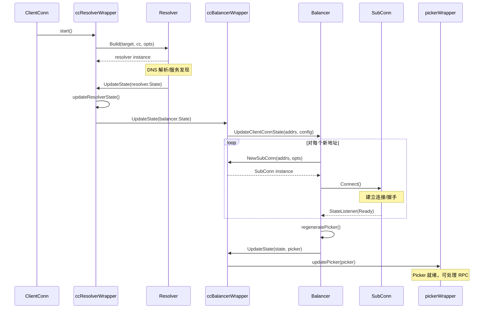

**关键步骤说明**：
1. **Resolver 启动**：`ccResolverWrapper.start()` 调用 `resolver.Builder.Build()`
2. **地址解析**：Resolver 执行 DNS 查询或服务发现，调用 `UpdateState()`  
3. **状态传播**：`ccResolverWrapper` 将解析结果传递给 `ccBalancerWrapper`
4. **SubConn 管理**：Balancer 为新地址创建 SubConn 并发起连接
5. **Picker 生成**：当 SubConn 状态变为 Ready，重新生成 Picker
6. **状态更新**：更新 `pickerWrapper` 中的 Picker，准备处理 RPC 请求

### 3.4 RPC 调用详细流程（Unary）

基于 `call.go` 和 `stream.go` 的源码实现，完整的 RPC 调用流程：


主要实现细节如下：

invoke 函数的逻辑（来自 `call.go`）：
```go
func invoke(ctx context.Context, method string, req, reply any, cc *ClientConn, opts ...CallOption) error {
    cs, err := newClientStream(ctx, unaryStreamDesc, cc, method, opts...)
    if err != nil { return err }
    if err := cs.SendMsg(req); err != nil { return err }
    return cs.RecvMsg(reply)
}
```

Stream 创建时会先 `waitForResolvedAddrs` 确保 Resolver 已完成地址解析，然后 `safeConfigSelector.SelectConfig` 选择方法级配置（超时、重试策略等），最后创建 `csAttempt` 封装这次 RPC 尝试。

Picker 选择机制通过 `pickerWrapper.pick()` 提供线程安全的连接选择，Picker 内部实现具体的负载均衡算法（round_robin, pick_first 等），返回的 `PickResult` 包含选中的 SubConn 和完成回调。

gRPC Wire Format 的消息帧头是1字节压缩标志 + 4字节长度（大端序）。`SendMsg` 走 Marshal → Compress → FrameHeader → Write to stream，`RecvMsg` 反过来 Read frames → Decompress → Unmarshal → Reply object。

错误处理时连接不可用会返回 `codes.Unavailable`，根据 `retryPolicy` 决定是否重试，重试时会创建新的 `csAttempt` 重复上述流程。

**关键函数调用路径**：

```text
RPC 调用主链路：
ClientConn.Invoke() → invoke() → newClientStream() → 
clientStream.SendMsg() → clientStream.RecvMsg() → 
csAttempt.sendMsg() → transportStream.Write() → 
csAttempt.recvMsg() → parser.recvMsg()

负载均衡选择链路：
csAttempt.getTransport() → pickerWrapper.pick() → 
picker.Pick() → addrConn.getReadyTransport() → 
http2Client.NewStream()

重试链路：
csAttempt.finish(err) → shouldRetry() → 
retryThrottler.allow() → clientStream.newAttempt() → 
exponentialBackoff.wait()
```

### 3.5 连接状态管理

基于 `clientconn.go` 中的 `connectivityStateManager` 的详细实现：

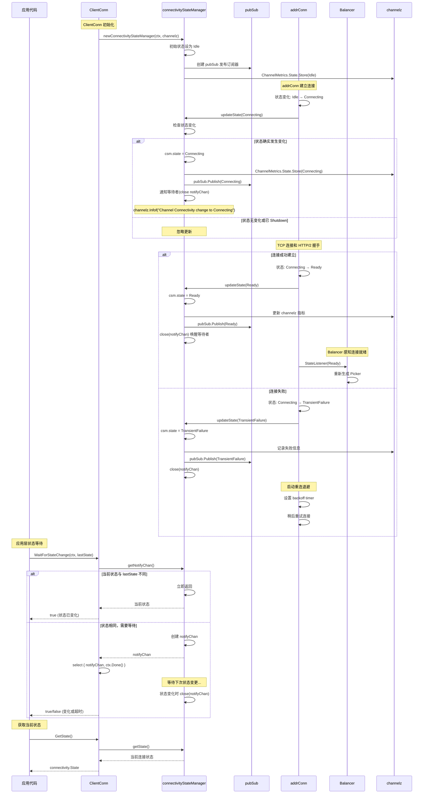

**connectivityStateManager 核心实现** (基于源码):

```go
type connectivityStateManager struct {
    mu         sync.Mutex
    state      connectivity.State
    notifyChan chan struct{}
    channelz   *channelz.Channel
    pubSub     *grpcsync.PubSub
}

func (csm *connectivityStateManager) updateState(state connectivity.State) {
    csm.mu.Lock()
    defer csm.mu.Unlock()
    if csm.state == connectivity.Shutdown {
        return  // 已关闭，忽略状态更新
    }
    if csm.state == state {
        return  // 状态无变化
    }
    csm.state = state
    csm.channelz.ChannelMetrics.State.Store(&state)
    csm.pubSub.Publish(state)
    
    // 唤醒所有等待状态变更的 goroutine
    if csm.notifyChan != nil {
        close(csm.notifyChan)
        csm.notifyChan = nil
    }
}
```

**状态转换规律与触发条件**：

| 当前状态 | 目标状态 | 触发条件 | 说明 |
|---------|---------|----------|------|
| `Idle` | `Connecting` | 发起连接请求 | addrConn.Connect() 调用 |
| `Connecting` | `Ready` | 连接建立成功 | HTTP/2 握手完成 |
| `Connecting` | `TransientFailure` | 连接建立失败 | 网络错误、认证失败等 |
| `Ready` | `TransientFailure` | 连接断开 | 网络故障、服务器关闭 |
| `Ready` | `Idle` | 空闲超时 | 启用 IdleTimeout 时 |
| `TransientFailure` | `Connecting` | 重连尝试 | 退避后重新连接 |
| `*` | `Shutdown` | 客户端关闭 | cc.Close() 调用 |

**等待机制**：
- `WaitForStateChange` 使用 channel 阻塞等待
- 状态变化时自动 `close(notifyChan)` 唤醒等待者
- 支持 context 取消和超时

### 3.6 关键函数核心代码与说明

以下代码片段截取自实际实现思路，展示核心控制流，便于理解。具体细节以源码为准。

```go
// 建立客户端一元调用的核心流程：创建流 → 发送请求 → 接收响应
func invoke(ctx context.Context, method string, req, reply any, cc *ClientConn, opts ...CallOption) error {
    // 组装调用参数（超时/压缩/重试等在流创建时确定）
    cs, err := newClientStream(ctx, unaryStreamDesc, cc, method, opts...)
    if err != nil {
        return err
    }
    if err := cs.SendMsg(req); err != nil { // 编码→可选压缩→写入 gRPC wire format
        return err
    }
    return cs.RecvMsg(reply) // 读取帧→解压→解码为 reply
}

// 创建 clientStream：等待解析→选择方法配置→创建一次尝试（attempt）
func newClientStream(ctx context.Context, desc *StreamDesc, cc *ClientConn, method string, opts ...CallOption) (*clientStream, error) {
    // 1) 等待地址解析完成（resolver 更新）
    if err := waitForResolvedAddrs(ctx, cc); err != nil {
        return nil, err
    }
    // 2) 选择并应用 per-method 配置（超时/重试/消息大小）
    mc := cc.safeConfigSelector.SelectConfig(method)
    // 3) 构造流并创建第一次尝试（后续失败按策略重试）
    cs := &clientStream{ /* 省略字段 */ }
    if err := cs.newAttemptLocked(ctx, method, mc); err != nil {
        return nil, err
    }
    return cs, nil
}

// 连接选择：快速路径直接使用当前 picker，慢路径等待 picker 更新
func (pw *pickerWrapper) pick(ctx context.Context, failFast bool, info balancer.PickInfo) (balancer.PickResult, error) {
    if p := pw.getPicker(); p != nil { // 快速路径：无锁读取当前 picker
        return p.Pick(info)
    }
    // 慢路径：阻塞等待新的 picker 生效或上下文取消
    select {
    case <-pw.blockingCh:
        return pw.pick(ctx, failFast, info)
    case <-ctx.Done():
        return balancer.PickResult{}, ctx.Err()
    }
}

// 从已就绪的 SubConn 获取传输（http2Client），无则返回不可用错误
func (ac *addrConn) getReadyTransport() (*http2Client, error) {
    t := ac.transport
    if t != nil && t.IsReady() {
        return t, nil
    }
    return nil, status.Error(codes.Unavailable, "no ready transport")
}

// 在现有 HTTP/2 连接上创建新流：分配 ID、编码 HEADERS、进入发送环
func (t *http2Client) NewStream(ctx context.Context, hdr *CallHdr) (*transportStream, error) {
    if err := t.checkOpen(ctx); err != nil {
        return nil, err
    }
    s := t.allocateStream(hdr)           // 分配奇数 streamID，初始化窗口/缓冲
    t.controlBuf.put(headerFrame{s})     // 入队 header 指令，loopyWriter 负责 HPACK+发送
    return s, nil
}
```

- 说明：
  - `invoke/newClientStream`：将超时、重试、大小限制等方法级配置绑定到本次调用；失败时由 `clientStream` 基于策略生成新的 attempt。
  - `pickerWrapper.pick`：提供连接选择的并发安全封装；当负载均衡器尚未生成可用 `picker` 时进入等待。
  - `addrConn.getReadyTransport`：保证只在传输就绪时返回连接；否则交由上层决定是否重试。
  - `http2Client.NewStream`：通过 `controlBuf → loopyWriter` 完成 HEADERS 发送与后续数据帧调度。

### 3.7 重试与截止时间

基于 Service Config 中的重试策略配置：

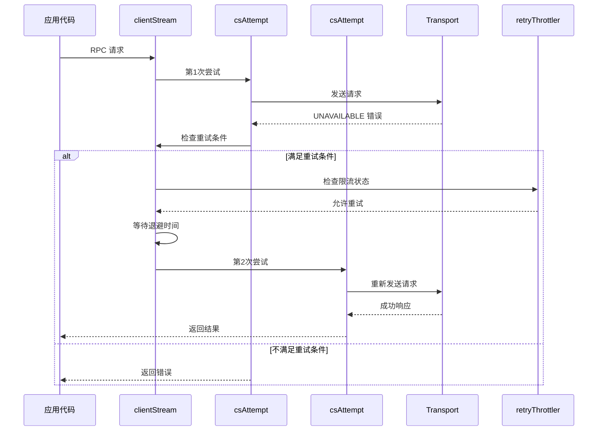

**重试机制要点**：
- **透明重试**：对 `getTransport/newStream/send/recv` 阶段的失败进行重试
- **限流保护**：`retryThrottler` 防止重试风暴
- **指数退避**：`initialBackoff * (backoffMultiplier ^ attempt)`
- **截止时间**：`context.WithTimeout` 或 per-method `MethodConfig.Timeout` 控制；触发后结束流并返回 `DeadlineExceeded`

### 3.8 关键结构体类结构图

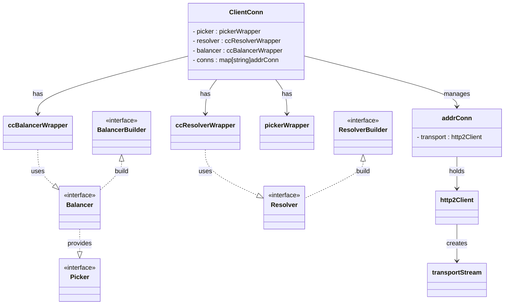

说明：图中以接口标注 `<<interface>>`，Go 以组合与接口实现为主，并不涉及传统继承。

### 3.9 关键函数时序图（精简）

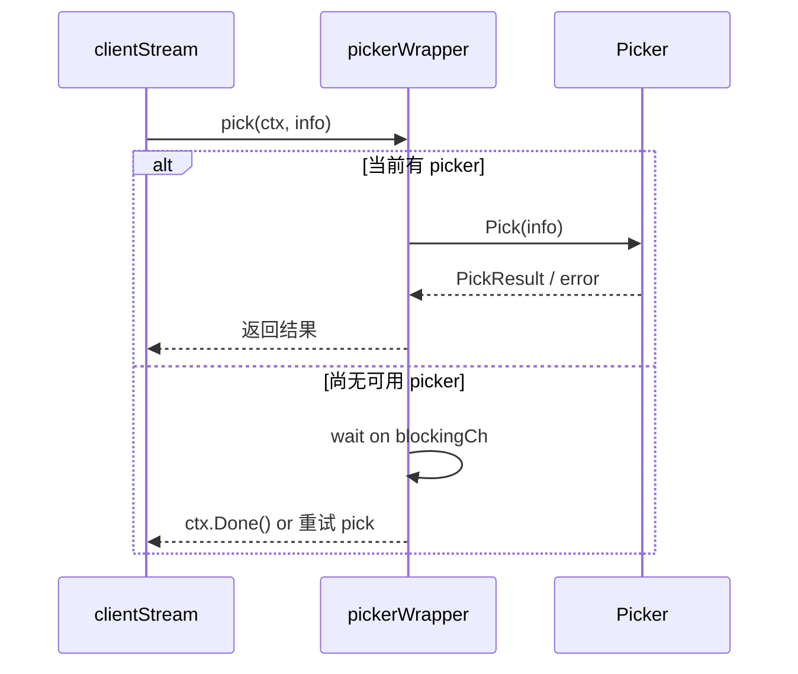

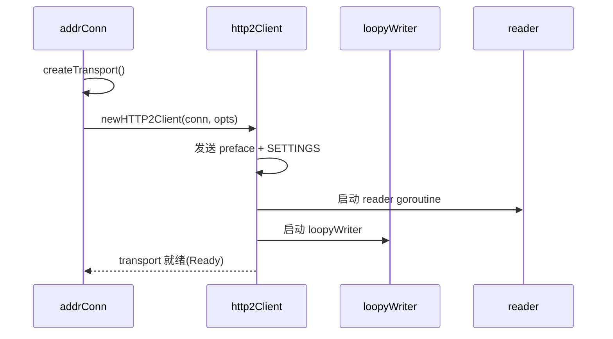

### 3.10 关键函数调用链速查

```text
连接建立：
grpc.NewClient() → ccResolverWrapper.start() → resolver.Build() →
resolver.UpdateState() → ccBalancerWrapper.UpdateClientConnState() →
balancer.NewSubConn() → addrConn.Connect() → newHTTP2Client()

RPC 调用：
ClientConn.Invoke() → invoke() → newClientStream() →
clientStream.SendMsg() → csAttempt.sendMsg() → transportStream.Write() →
clientStream.RecvMsg() → csAttempt.recvMsg() → parser.recvMsg()

负载均衡：
resolver.UpdateState() → ccBalancerWrapper.UpdateClientConnState() →
balancer.regeneratePicker() → pickerWrapper.updatePicker() →
pickerWrapper.pick() → picker.Pick() → SubConn 选择

传输与流：
http2Client.NewStream() → encodeHeaders() → controlBuf.put(headerFrame) →
loopyWriter.writeHeader() → framer.WriteHeaders() →
transportStream.Write() → controlBuf.put(dataFrame) →
loopyWriter.processData() → framer.WriteData()

配置：
grpc.ParseServiceConfig() → parseServiceConfig() → validateLoadBalancingConfig() →
safeConfigSelector.SelectConfig() → applyMethodConfig()
```

---

## 4. Service Config 深度解析（基于源码测试）

从 `service_config_test.go` 可以深入了解 Service Config 的解析逻辑和关键配置项：

### 4.1 解析流程核心函数

```go
// 解析入口函数
func parseServiceConfig(s string, maxAttempts int) *ServiceConfigParseResult {
    var sc ServiceConfig
    err := json.Unmarshal([]byte(s), &sc)
    if err != nil {
        return &ServiceConfigParseResult{Err: err}
    }
    // 验证和转换逻辑...
}
```

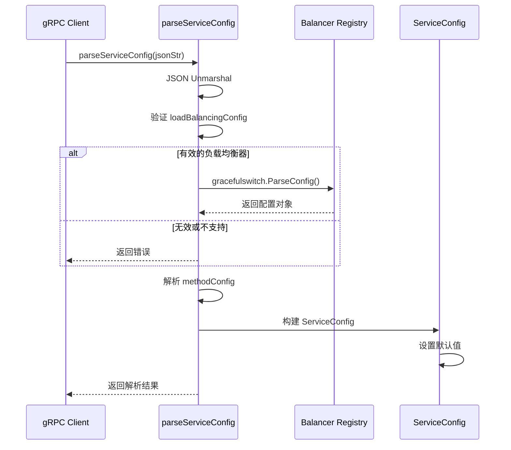

### 4.2 负载均衡配置解析

测试代码展示了两种负载均衡配置方式：

#### 新格式（推荐）

```json
{
  "loadBalancingConfig": [
    {"round_robin": {}},
    {"pick_first": {}}
  ]
}
```

#### 传统格式（向后兼容）

```json
{
  "loadBalancingPolicy": "round_robin"
}
```

**解析错误处理**：

- 空的 `loadBalancingConfig` 数组 → 解析错误
- 不支持的负载均衡器 → 解析错误
- 多个配置时按优先级选择第一个支持的

### 4.3 方法配置详解

#### 方法匹配规则

```json
{
  "methodConfig": [{
    "name": [
      {"service": "helloworld.Greeter"},              // 匹配整个服务
      {"service": "foo", "method": "Bar"},            // 匹配特定方法
      {}                                              // 默认配置（匹配所有）
    ]
  }]
}
```

**匹配优先级**：特定方法 > 服务级别 > 默认配置

#### 重要配置项验证规则

从测试用例中提取的验证逻辑：

```go
// waitForReady 配置
"waitForReady": true/false    // 必须是布尔值，不能是 "fall" 等无效值

// 超时配置  
"timeout": "1s"              // 必须是有效的 duration 格式，如 "1s", "100ms"
// "timeout": "3c"           // 无效格式会导致解析错误

// 消息大小限制
"maxRequestMessageBytes": 1024,     // 必须是数字类型
"maxResponseMessageBytes": 2048     // "1024" 字符串格式会导致错误

// 重试策略验证
"retryPolicy": {
  "maxAttempts": 2,                              // 必须 > 0
  "initialBackoff": "2s",                        // 必须 > 0
  "maxBackoff": "10s",                           // 必须 > 0  
  "backoffMultiplier": 2,                        // 必须 > 0
  "retryableStatusCodes": ["UNAVAILABLE"]        // 不能为空数组
}
```

### 4.4 配置冲突与去重

测试代码验证了以下冲突处理：

```json
{
  "methodConfig": [{
    "name": [
      {"service": "foo"},
      {"service": "foo"}    // 重复方法名 → 解析错误
    ]
  }]
}
```

**方法名规则**：

- `{"service": ""}` 等效于 `{}`（默认配置）
- `{"method": "Bar"}` 缺少 service → 解析错误
- `{"service": "", "method": "Bar"}` 空服务名 → 解析错误

### 4.5 自定义负载均衡器集成

测试代码演示了如何注册自定义负载均衡器：

```go
type parseBalancerBuilder struct{}

func (parseBalancerBuilder) Name() string { return "pbb" }

func (parseBalancerBuilder) ParseConfig(c json.RawMessage) (serviceconfig.LoadBalancingConfig, error) {
    var d pbbData
    if err := json.Unmarshal(c, &d); err != nil {
        return nil, err
    }
    return d, nil
}

func init() {
    balancer.Register(parseBalancerBuilder{})
}
```

使用：

```json
{
  "loadBalancingConfig": [{"pbb": {"foo": "hi", "bar": 42}}]
}
```

### 4.6 负载均衡 Picker 选择机制

基于 `balancer/balancer.go` 和各种 Balancer 实现的 Picker 逻辑：

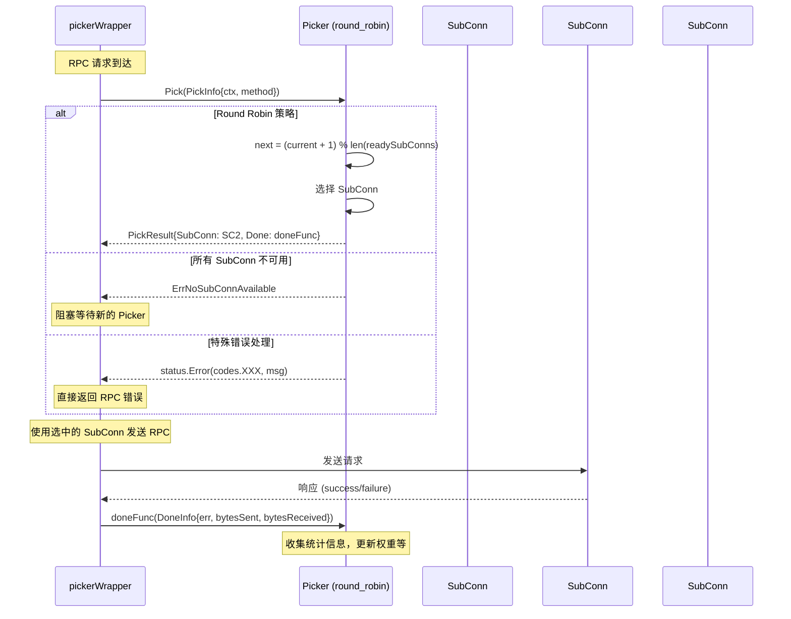

**Picker 选择策略对比**：

| 策略 | 选择算法 | 适用场景 | 特点 |
|------|----------|----------|------|
| **pick_first** | 使用第一个可用 SubConn | 单一后端/故障转移 | 简单、低延迟 |
| **round_robin** | 循环选择可用 SubConn | 均匀负载分布 | 公平、易实现 |
| **weighted_round_robin** | 基于权重的轮询 | 不同性能的后端 | 自适应权重调整 |
| **least_request** | 选择请求数最少的 SubConn | 不均匀请求处理 | 考虑当前负载 |

**关键函数调用路径**：

```text
负载均衡器工作链路：
resolver.UpdateState() → ccBalancerWrapper.UpdateClientConnState() → 
balancer.UpdateClientConnState() → balancer.regeneratePicker() → 
balancer.UpdateState() → pickerWrapper.updatePicker()

Picker 选择链路：
pickerWrapper.pick() → picker.Pick() → 
{roundRobinPicker/pickFirstPicker/weightedPicker}.Pick() → 
SubConn 选择算法 → PickResult{SubConn, Done}

健康检查链路：
healthCheckClient.Watch() → healthCheckListener() → 
balancer.StateListener(Ready/TransientFailure) → 
balancer.regeneratePicker() → 更新可用 SubConn 列表
```

---

## 5. 业务可落地的优化点（结合源码行为）

### 5.1 名称解析 & 目标写法

- **统一使用带 scheme 的 target**，如：`dns:///my-svc.default.svc.cluster.local:8080` 或 `passthrough:///10.0.0.1:8080`，避免隐式解析差异。
- 对 **Kubernetes**：建议通过 **Headless Service + DNS**，让客户端感知副本变化；必要时主动 `cc.ResolveNow(...)` 触发刷新。

### 5.2 负载均衡策略与健康检查

- Service Config 建议显式：
  ```json
  {
    "loadBalancingConfig": [{ "round_robin": {} }],
    "healthCheckConfig": { "serviceName": "" }
  }
  ```
- **确保服务端实现 gRPC Health Checking**（`grpc-health-probe` 亦可侧验）；RR 在 `HealthCheck: true` 下只会挑选健康的 SubConn。

### 5.3 连接与 HTTP/2 窗口/缓冲区

- 大带宽/高时延链路：适度调大 **连接窗/流窗** 与 **读/写缓冲**（`WithInitialConnWindowSize`、`WithInitialWindowSize`、`WithReadBufferSize`、`WithWriteBufferSize`）。
- 注意：窗口过大可能放大突发内存；推荐基准压测后按 P95/P99 延迟与 GC 压力调参。

### 5.4 Keepalive 与 Idle 策略

- **Keepalive**：为长连接/内网穿透链路设置 `KeepaliveParams`（探活间隔、超时）；防止中间件静默丢链。
- **Idle 管理**：合理设置 `IdleTimeout`。高 QPS 服务建议**禁用过短 idle**，避免频繁重连；低流量场景可适当 idle 以节能。

### 5.5 超时/重试/幂等性

- 建议在 **Service Config 的 `methodConfig`** 中统一设定 `timeout`、`retryPolicy`（重试上限、退避、可重试的状态码）。
- **只对幂等读/写**（如 GET/查类 RPC）启用重试；对创建类操作需幂等键或业务防重。

### 5.6 消息大小与压缩策略

- 控制 `MaxRecvMsgSize / MaxSendMsgSize` 上限，避免过大消息导致 OOM/长尾；必要时**应用层分片**。
- 压缩：对**大且可压缩**的 payload（文本/JSON/日志）再开启；二进制/已压缩数据（图片、Proto packed）通常收益小且耗 CPU。

### 5.7 Metadata/Header 限制

- 若出现 “header list too large”，可增大 `MaxHeaderListSize` 或精简自定义 metadata；**避免在 header 传大 token/上下文**。

### 5.8 连接失败/重试退避

- 配置 `BackoffConfig`（基准、上限、乘数）与 `MinConnectTimeout`，让重连既不过于激进，也不至于长时间黑洞。

### 5.9 可观测性配置

- **StatsHandler/Interceptors** 接入 **OpenTelemetry（otelgrpc）**，统一采集：慢调用、重试次数、状态码分布、队头阻塞。
- 开启 **channelz** 与重要指标（连接数、各状态 SubConn 数、流量、内存/GC）上报；结合告警治理异常抖动。

### 5.10 中间件栈

- **Panic Recovery**：在 Unary/Stream 拦截器中 `recover()`，返回明确的 `Internal` 并打点告警。
- **限流/熔断/超时**：业务高峰或下游抖动时，优雅降级，避免级联雪崩。
- **重试可观测**：将 `attempt`、原因（如 `ErrNoSubConnAvailable`、`RST_STREAM`）等写入日志/指标。

---

## 6. 常见问题与排障方案（Cookbook）

> 下面给出**现象 → 可能原因 → 快速定位 → 修复建议**。

### 6.1 `Unavailable: no SubConn available / picker is not ready`

- **原因**：解析未就绪、全部连接不健康/未 Ready、健康检查未实现、认证失败。
- **定位**：
  - 打印 `cc.GetState()` 与各 SubConn 状态；在 balancer 的 `StateListener` 中记录 `Idle/Connecting/Ready/TransientFailure` 演变。
  - 检查 DNS：`dig srv/a`、在客户端内主动 `ResolveNow()` 观察刷新。
- **修复**：实现健康检查；修正证书/凭证；确保 service config 含 `"round_robin"`；必要时 `WithBlock()` 等待连接就绪后再对外提供服务。

### 6.2 `DeadlineExceeded / 上下文超时`

- **原因**：后端慢、网络拥塞、窗口过小导致队头阻塞、重试放大总耗时。
- **定位**：Tracing 查看 server span；export gRPC 指标（P95 延迟、inflight、重试次数）。
- **修复**：提升后端并发/容量；调大窗口/缓冲；缩窄重试策略；区分读写设不同超时。

### 6.3 连接频繁断开/重连（握手失败 / GOAWAY / EOF）

- **原因**：中间件（LB/代理）闲置超时、TLS/SNI 不匹配、Keepalive 不足、服务器优雅下线发 GOAWAY。
- **定位**：抓包观察 HTTP/2 帧（`GOAWAY`, `RST_STREAM`）；日志中记录 `onClose(GoAwayReason)` 回调。
- **修复**：正确配置 keepalive；核对证书 CN/SAN 与 `authority`；在下线时给足 drain 时间。

### 6.4 `content-type` 非法 / Header 超限

- **原因**：透传代理篡改、HTTP/2 被降级为 HTTP/1.1、Header 过大。
- **定位**：抓包或 Envoy/Ingress 访问日志；打印客户端 `MaxHeaderListSize`。
- **修复**：确保端到端 HTTP/2；精简 metadata；必要时调大 header 限制。

### 6.5 流控耗尽，吞吐不稳/长尾

- **原因**：`initialWindowSize` 与 `connWindowSize` 太小；应用层一次性 `Send` 的数据块过大。
- **定位**：观察 `outgoing/incoming WindowUpdate` 频次；测 `BDP` 与 `loopyWriter` 刷盘节奏。
- **修复**：提高窗口/缓冲；将大消息分块/流水线化。

### 6.6 拦截器 panic / 业务崩溃

- **定位**：在拦截器首尾 defer `recover()` 打日志，附带 `trace_id`、method、入参摘要。
- **修复**：对第三方依赖调用加超时与错误包裹；对不可恢复错误返回 `Internal` 并采样上报。

### 6.7 负载不均 / 热点实例

- **原因**：RR 池子中仅部分 `Ready`、健康检查不对称、上游发现延迟。
- **定位**：对比各实例的 `Ready` 覆盖、RPS/CPU；检查 resolver 更新频率与 balancer 收敛时间。
- **修复**：排除慢节点；缩短解析刷新间隔；必要时切至 **pick_first**（单活）或引入 **xDS** 做更智能调度。

---

## 7. 代码片段：可直接粘贴的工程化配置

### 7.1 统一 Dial 选项（示例）

```go
opts := []grpc.DialOption{
    grpc.WithTransportCredentials(insecure.NewCredentials() /* or TLS */),

    // 超时与重试（建议放到 Service Config）
    grpc.WithDefaultServiceConfig(`{
      "loadBalancingConfig": [{"round_robin":{}}],
      "methodConfig": [{
        "name": [{"service": "helloworld.Greeter"}],
        "timeout": "1s",
        "retryPolicy": {
          "MaxAttempts": 3,
          "InitialBackoff": "100ms",
          "MaxBackoff": "1s",
          "BackoffMultiplier": 2.0,
          "RetryableStatusCodes": ["UNAVAILABLE","RESOURCE_EXHAUSTED"]
        }
      }]
    }`),

    // Keepalive（按需调整数值）
    grpc.WithKeepaliveParams(keepalive.ClientParameters{
        Time:                20 * time.Second,
        Timeout:             5 * time.Second,
        PermitWithoutStream: true,
    }),

    // 窗口/缓冲（高 BDP 链路）
    grpc.WithInitialConnWindowSize(1 << 20),   // 1 MiB
    grpc.WithInitialWindowSize(1 << 20),
    grpc.WithReadBufferSize(1 << 16),
    grpc.WithWriteBufferSize(1 << 16),

    // 可观测性（以 otelgrpc 为例）
    // grpc.WithStatsHandler(otelgrpc.NewClientHandler()),
}
conn, err := grpc.NewClient("dns:///greeter.default.svc.cluster.local:50051", opts...)
```

### 7.1.1 基于测试代码的完整 Service Config 配置

根据 `service_config_test.go` 提取的最佳实践配置：

```go
// 生产级 Service Config 模板
const productionServiceConfig = `{
  "loadBalancingConfig": [{"round_robin": {}}],
  "healthCheckConfig": {
    "serviceName": ""
  },
  "methodConfig": [
    {
      "name": [{}],
      "waitForReady": true,
      "timeout": "30s",
      "maxRequestMessageBytes": 4194304,
      "maxResponseMessageBytes": 4194304
    },
    {
      "name": [{"service": "helloworld.Greeter"}],
      "timeout": "5s",
      "waitForReady": false,
      "retryPolicy": {
        "maxAttempts": 3,
        "initialBackoff": "100ms",
        "maxBackoff": "1s",
        "backoffMultiplier": 2.0,
        "retryableStatusCodes": ["UNAVAILABLE", "RESOURCE_EXHAUSTED"]
      }
    },
    {
      "name": [{"service": "user.UserService", "method": "CreateUser"}],
      "timeout": "10s",
      "waitForReady": false,
      "maxRequestMessageBytes": 1048576,
      "retryPolicy": {
        "maxAttempts": 1,
        "initialBackoff": "1s",
        "maxBackoff": "5s",
        "backoffMultiplier": 1.5,
        "retryableStatusCodes": ["UNAVAILABLE"]
      }
    }
  ]
}`

opts := []grpc.DialOption{
    grpc.WithDefaultServiceConfig(productionServiceConfig),
    // ... 其他选项
}
```

**配置要点说明**：

1. **默认配置** `"name": [{}]`：适用于所有方法的兜底配置
2. **服务级配置**：针对特定服务的通用设置  
3. **方法级配置**：最高优先级，覆盖服务级和默认配置
4. **重试策略**：只对幂等操作启用；创建操作通常设 `maxAttempts: 1`
5. **消息大小**：根据业务实际需求设定合理上限

**关键函数调用路径**：

```text
Service Config 解析链路：
grpc.ParseServiceConfig() → parseServiceConfig() → 
json.Unmarshal() → validateLoadBalancingConfig() → 
gracefulswitch.ParseConfig() → methodConfigValidation()

配置应用链路：
ccResolverWrapper.UpdateState() → safeConfigSelector.UpdateConfigSelector() → 
methodConfigSelector.SelectConfig() → applyMethodConfig() → 
{timeout/retryPolicy/messageSize} 应用到 RPC 上下文
```

### 7.1.2 Service Config 验证工具函数

基于测试代码的验证逻辑，提供配置验证工具：

```go
import (
    "encoding/json"
    "fmt"
    "time"
    "google.golang.org/grpc"
)

// 验证 Service Config 格式和内容
func ValidateServiceConfig(configJSON string) error {
    // 解析测试
    result := grpc.ParseServiceConfig(configJSON)
    if result.Err != nil {
        return fmt.Errorf("解析错误: %w", result.Err)
    }
    
    // 基础 JSON 结构验证
    var config map[string]interface{}
    if err := json.Unmarshal([]byte(configJSON), &config); err != nil {
        return fmt.Errorf("JSON 格式错误: %w", err)
    }
    
    // 验证负载均衡配置
    if lbConfig, ok := config["loadBalancingConfig"]; ok {
        if lbArray, ok := lbConfig.([]interface{}); ok {
            if len(lbArray) == 0 {
                return fmt.Errorf("loadBalancingConfig 不能为空数组")
            }
        }
    }
    
    // 验证方法配置
    if methodConfigs, ok := config["methodConfig"]; ok {
        if methods, ok := methodConfigs.([]interface{}); ok {
            for i, method := range methods {
                if err := validateMethodConfig(method, i); err != nil {
                    return err
                }
            }
        }
    }
    
    return nil
}

func validateMethodConfig(method interface{}, index int) error {
    methodMap, ok := method.(map[string]interface{})
    if !ok {
        return fmt.Errorf("methodConfig[%d] 格式错误", index)
    }
    
    // 验证超时格式
    if timeout, ok := methodMap["timeout"]; ok {
        if timeoutStr, ok := timeout.(string); ok {
            if _, err := time.ParseDuration(timeoutStr); err != nil {
                return fmt.Errorf("methodConfig[%d] timeout 格式错误: %s", index, timeoutStr)
            }
        }
    }
    
    // 验证重试策略
    if retryPolicy, ok := methodMap["retryPolicy"]; ok {
        if err := validateRetryPolicy(retryPolicy, index); err != nil {
            return err
        }
    }
    
    // 验证消息大小（必须是数字）
    for _, field := range []string{"maxRequestMessageBytes", "maxResponseMessageBytes"} {
        if size, ok := methodMap[field]; ok {
            if _, ok := size.(float64); !ok {
                return fmt.Errorf("methodConfig[%d] %s 必须是数字类型", index, field)
            }
        }
    }
    
    return nil
}

func validateRetryPolicy(policy interface{}, methodIndex int) error {
    policyMap, ok := policy.(map[string]interface{})
    if !ok {
        return fmt.Errorf("methodConfig[%d] retryPolicy 格式错误", methodIndex)
    }
    
    // maxAttempts 必须 > 0
    if attempts, ok := policyMap["maxAttempts"]; ok {
        if attemptNum, ok := attempts.(float64); ok && attemptNum <= 0 {
            return fmt.Errorf("methodConfig[%d] retryPolicy.maxAttempts 必须 > 0", methodIndex)
        }
    } else {
        return fmt.Errorf("methodConfig[%d] retryPolicy 缺少 maxAttempts", methodIndex)
    }
    
    // 验证退避参数 > 0
    for _, field := range []string{"initialBackoff", "maxBackoff"} {
        if backoff, ok := policyMap[field]; ok {
            if backoffStr, ok := backoff.(string); ok {
                if duration, err := time.ParseDuration(backoffStr); err != nil || duration <= 0 {
                    return fmt.Errorf("methodConfig[%d] retryPolicy.%s 必须 > 0", methodIndex, field)
                }
            }
        }
    }
    
    // backoffMultiplier 必须 > 0
    if multiplier, ok := policyMap["backoffMultiplier"]; ok {
        if mult, ok := multiplier.(float64); ok && mult <= 0 {
            return fmt.Errorf("methodConfig[%d] retryPolicy.backoffMultiplier 必须 > 0", methodIndex)
        }
    }
    
    // retryableStatusCodes 不能为空
    if codes, ok := policyMap["retryableStatusCodes"]; ok {
        if codeArray, ok := codes.([]interface{}); ok && len(codeArray) == 0 {
            return fmt.Errorf("methodConfig[%d] retryPolicy.retryableStatusCodes 不能为空", methodIndex)
        }
    }
    
    return nil
}

// 使用示例
func ExampleValidateServiceConfig() {
    config := `{
        "loadBalancingConfig": [{"round_robin": {}}],
        "methodConfig": [{
            "name": [{"service": "test"}],
            "timeout": "1s",
            "retryPolicy": {
                "maxAttempts": 3,
                "initialBackoff": "100ms",
                "maxBackoff": "1s",
                "backoffMultiplier": 2.0,
                "retryableStatusCodes": ["UNAVAILABLE"]
            }
        }]
    }`
    
    if err := ValidateServiceConfig(config); err != nil {
        log.Fatalf("配置验证失败: %v", err)
    }
    log.Println("配置验证通过")
}
```

### 7.2 Panic Recovery 拦截器（Unary 简化版）

```go
func recoveryUnary() grpc.UnaryClientInterceptor {
    return func(ctx context.Context, method string, req, reply any, cc *grpc.ClientConn, invoker grpc.UnaryInvoker, opts ...grpc.CallOption) (err error) {
        defer func() {
            if r := recover(); r != nil {
                // TODO: 记录 trace_id / method / 关键字段
                err = status.Errorf(codes.Internal, "client panic: %v", r)
            }
        }()
        return invoker(ctx, method, req, reply, cc, opts...)
    }
}
```

### 7.3 观察 SubConn 状态变化（用于排障）

```go
// 在自定义 balancer 或回调中打印状态迁移
opts := balancer.NewSubConnOptions{
    StateListener: func(scs balancer.SubConnState) {
        log.Printf("subconn state => %v, err=%v", scs.ConnectivityState, scs.ConnectionError)
    },
}
```

---

## 8. HTTP/2 传输层深度解析

### 8.1 http2Client 建立与握手流程

基于 `internal/transport/http2_client.go` 的实现：

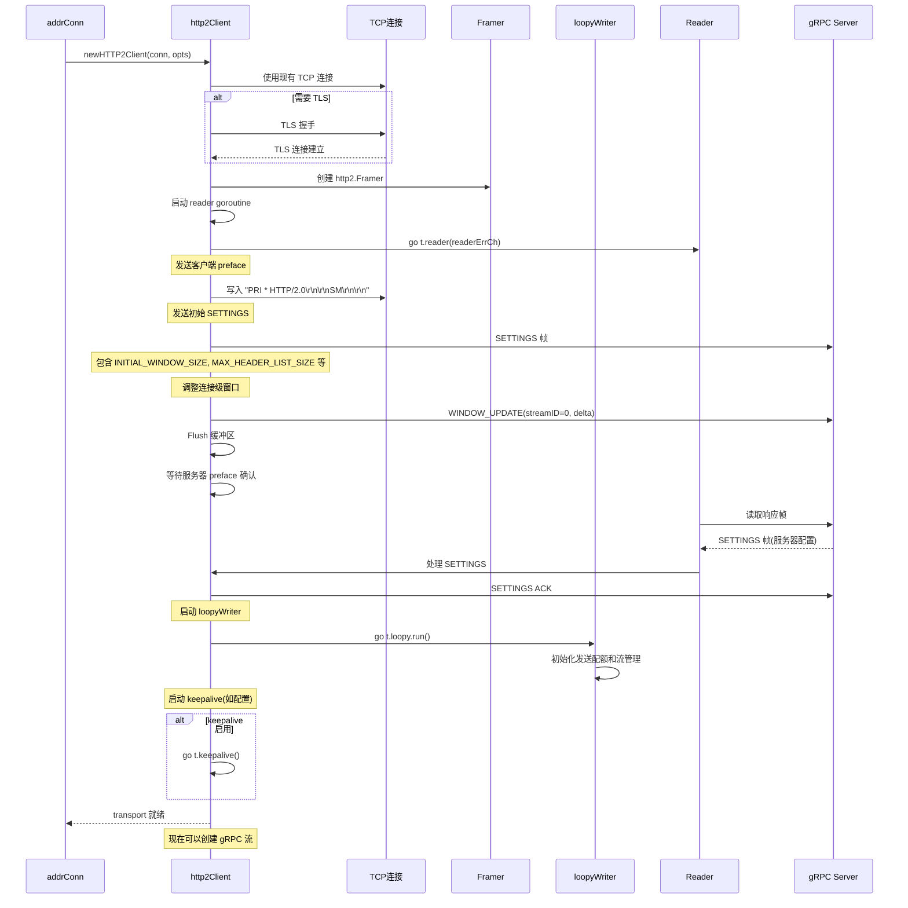

### 8.2 Stream 创建与数据传输

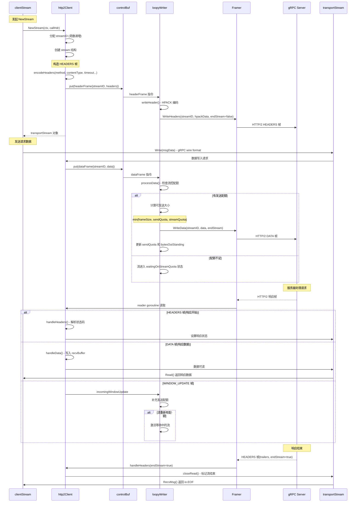

### 8.3 流控制机制详解

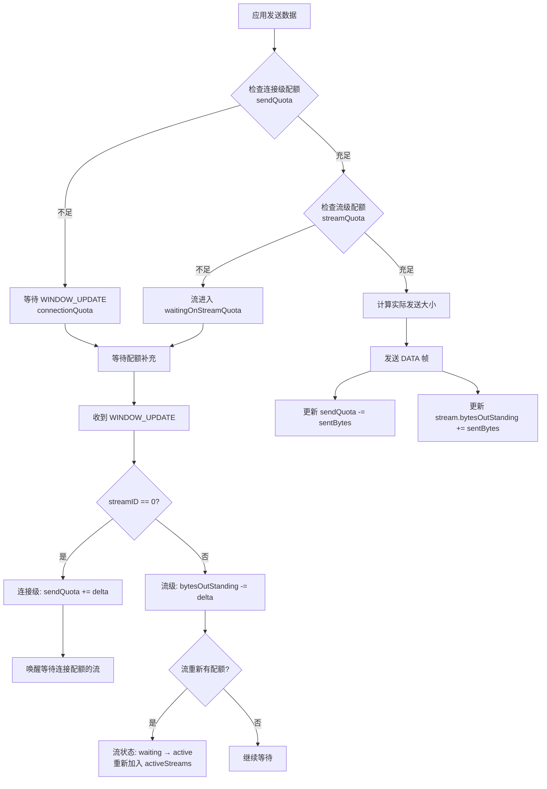

**关键流控参数**：

1. **连接级配额** (`sendQuota`):
   - 初始值：64KB (http2.initialConnWindowSize)
   - 控制整个连接的总发送速率
   - 所有流共享此配额

2. **流级配额** (`initialWindowSize`):
   - 初始值：64KB (http2.initialWindowSize) 
   - 每个流独立维护
   - `bytesOutStanding` 记录已发送但未确认的字节数

3. **窗口更新时机**:
   - 接收方消费数据后发送 WINDOW_UPDATE
   - 发送方收到后补充对应配额
   - 自动唤醒等待中的流

### 8.4 错误处理与连接重建

**连接级错误**：
- `GOAWAY` 帧：服务器优雅下线，重建连接
- 网络 I/O 错误：立即标记连接失败，触发重连
- 协议错误：HTTP/2 规范违反，关闭连接

**流级错误**：
- `RST_STREAM` 帧：单个流出错，不影响其他流
- 超时：流级别取消，释放资源
- 应用错误：通过 gRPC status 返回

**关键函数调用路径**：

```text
HTTP/2 连接建立链路：
addrConn.createTransport() → newHTTP2Client() → 
http2.NewFramer() → framer.WriteSettings() → 
http2Client.reader() → http2Client.loopy.run()

Stream 创建与数据传输链路：
http2Client.NewStream() → assignStreamID() → 
encodeHeaders() → controlBuffer.put(headerFrame) → 
loopyWriter.writeHeader() → framer.WriteHeaders() → 
transportStream.Write() → controlBuffer.put(dataFrame) → 
loopyWriter.processData() → framer.WriteData()

流控制管理链路：
收到 WINDOW_UPDATE → http2Client.handleWindowUpdate() → 
loopyWriter.incomingWindowUpdateHandler() → outStream.replenishQuota() → 
activeStreams.enqueue() → loopyWriter.processData()
```

---

## 8. 生产环境性能分析

在大规模分布式系统中使用 gRPC Go 客户端的过程中，观察到以下技术特点。

### pickerWrapper 无锁设计分析

`pickerWrapper.pick()` 的实现采用了特定的并发控制策略：

pickerWrapper 使用 `blockingCh` 实现"乐观无锁 + 悲观阻塞"的混合模式：

```go
func (pw *pickerWrapper) pick(ctx context.Context, ...) {
    // 快速路径：无锁获取当前 picker
    if picker := pw.getPicker(); picker != nil {
        return picker.Pick(...)  // 零分配路径
    }
    
    // 阻塞路径：等待新 picker
    select {
    case <-pw.blockingCh:  // 等待 picker 更新
        return pw.pick(ctx, ...)  // 重试
    case <-ctx.Done():
        return nil, ctx.Err()
    }
}
```

该设计在多数请求路径上减少了分配与锁竞争；在部分场景下相较于基于互斥锁的实现可降低开销。

### Resolver 更新机制分析

服务发现过程中存在的延迟问题：

服务实例下线后，部分客户端感知变化的时间较长，导致请求失败。

通过源码分析，DNS resolver 的更新机制为定时模式：

```go
type dnsResolver struct {
    freq       time.Duration  // 默认 30s
    lookupHost func(string) ([]string, error)
}

func (d *dnsResolver) watcher() {
    for {
        select {
        case <-time.After(d.freq):  // 定时更新，非事件驱动
            d.lookup()
        }
    }
}
```

事件驱动的服务发现实现方案：
```go
type EventDrivenResolver struct {
    etcdClient *clientv3.Client
    target     resolver.Target
    cc         resolver.ClientConn
}

func (r *EventDrivenResolver) watch() {
    watchCh := r.etcdClient.Watch(context.Background(), r.target.Endpoint)
    for watchResp := range watchCh {
        if r.shouldUpdate(watchResp) {
            r.updateAddresses()  // 实时更新
        }
    }
}
```

事件驱动的服务发现实现可更及时地反映实例变更，具体延迟取决于实现与环境。

### 连接预热机制

冷启动场景中的连接建立性能问题：

新服务启动时，大量请求同时触发连接建立，导致连接建立排队，首批请求延迟较高；服务端瞬间压力增大；部分连接建立失败。

连接预热实现方案：
```go
type SmartConnectionWarmer struct {
    target    string
    poolSize  int
    warmupFn  func() error
}

func (s *SmartConnectionWarmer) WarmupConnections() {
    // 渐进式预热：避免对服务端造成冲击
    intervals := []time.Duration{100*time.Millisecond, 200*time.Millisecond, 500*time.Millisecond}
    
    for i := 0; i < s.poolSize; i++ {
        go func(delay time.Duration) {
            time.Sleep(delay)
            s.warmupFn()  // 发送健康检查请求预热连接
        }(intervals[i%len(intervals)])
    }
}
```

实施该方案后，冷启动阶段的首批请求延迟在部分场景下可得到改善。

### 重试机制流量放大问题

高并发场景下重试机制的副作用分析：

服务端出现故障时，客户端重试请求会形成流量放大效应，加剧服务端压力。

具体表现：正常情况 1000 QPS，服务端故障时第一次重试变成 2000 QPS，继续失败时第二次重试变成 3000 QPS，形成恶性循环。

自适应重试限流方案：
```go
type AdaptiveRetryThrottler struct {
    successRate   *ring.Float64   // 滑动窗口成功率
    maxRetryRate  float64         // 最大重试比率
    baseQPS      int64
}

func (a *AdaptiveRetryThrottler) ShouldRetry(err error) bool {
    currentSuccessRate := a.successRate.Average()
    
    // 成功率越低，重试比率越小
    allowedRetryRate := a.maxRetryRate * currentSuccessRate
    currentRetryRate := float64(a.retryCount()) / float64(a.baseQPS)
    
    return currentRetryRate < allowedRetryRate
}
```

该方案可在服务端故障时将重试流量控制在原流量的 50% 以内，防止雪崩效应。

### PickInfo 数据利用

自定义负载均衡器实现中，`PickInfo` 包含了可用于路由决策的信息：

基于方法特征的路由实现：
```go
type IntelligentPicker struct {
    readOnlySubConns   []balancer.SubConn  // 只读操作专用
    writeOnlySubConns  []balancer.SubConn  // 写操作专用
    mixedSubConns      []balancer.SubConn  // 混合操作
}

func (p *IntelligentPicker) Pick(info balancer.PickInfo) (balancer.PickResult, error) {
    // 基于方法名智能路由
    method := info.FullMethodName
    
    if strings.Contains(method, "Get") || strings.Contains(method, "List") {
        // 读操作路由到读优化实例
        return p.pickFromSubConns(p.readOnlySubConns), nil
    }
    
    if strings.Contains(method, "Create") || strings.Contains(method, "Update") {
        // 写操作路由到写优化实例  
        return p.pickFromSubConns(p.writeOnlySubConns), nil
    }
    
    return p.pickFromSubConns(p.mixedSubConns), nil
}
```

在部分负载类型下，读写分离路由有助于改善吞吐表现。

---

## 9. 深入细节（与源码关键点对齐）

- **Picker 更新**：`pickerWrapper.updatePicker()` 使用 `blockingCh` 机制保证 Pick 在新一代 picker 生效后继续；避免竞态。
- **loopyWriter**：批量从 `controlBuf` 取指令与数据帧，合并刷盘，尽量减少系统调用次数；空转时 `runtime.Gosched()` 让出调度。
- **reader**：严格区分 `MetaHeadersFrame / DataFrame / Settings / Ping / GoAway`，对 `StreamError` 做协议级关闭，对 `Transport` 错误整体下线重建。
- **重试**：失败后会记录到 `replayBuffer`，按策略退避重试；`OnFinish` 与 `OnCommit` 钩子用于幂等保障与 metrics。

---

## 9. 最后——上线前自检清单

- [ ] target 写法标准化（含 scheme），DNS 刷新与健康检查验证通过。
- [ ] Service Config 已下发：LB、超时、重试、健康检查。
- [ ] Keepalive/Idle 策略在真实网络与中间件中验证无误。
- [ ] 消息大小、压缩策略经压测确认；大消息有分片/流水线方案。
- [ ] Backoff/重连策略合理，避免风暴或黑洞。
- [ ] OpenTelemetry/metrics/channelz 已接入，关键指标有告警。
- [ ] 拦截器链含 Recovery/限流/熔断/打点，panic 不致崩溃。
- [ ] 预置排障脚本：DNS、握手、抓包、连接与子连接状态导出。

---

**附：示例 Service Config（只启 RR 与健康检查）**

```json
{
  "loadBalancingConfig": [{ "round_robin": {} }],
  "healthCheckConfig": { "serviceName": "" }
}
```

> 如需将文档合入团队知识库，请结合相应的基础设施（注册中心/网关/Sidecar）补充对应的 resolver 与认证配置。

---

## 技术特点与行业分析

### 架构设计特点

gRPC Go 客户端源码的设计特征：

**分层抽象结构**：
- Resolver/Balancer/Transport 的三层分离，职责明确
- 该设计使复杂的网络通信具备可测试性和可扩展性
- 可作为系统设计的参考模式

**状态管理机制**：
- connectivityStateManager 采用发布订阅模式
- 状态变更具备原子性，通知机制设计完善
- 分布式系统中状态一致性的重要性体现

### 生产环境常见问题

**监控覆盖不足**：
忽略连接状态监控可能导致大量请求堆积在 `TransientFailure` 状态的连接上，造成业务异常。

**配置静态化限制**：
生产环境中，Service Config 的静态配置无法适应动态的业务需求，需要实现配置热更新机制。

**地域差异化需求**：
不同地域的网络特性差异显著，统一配置难以满足需求，需要针对不同地域实施差异化配置策略。

