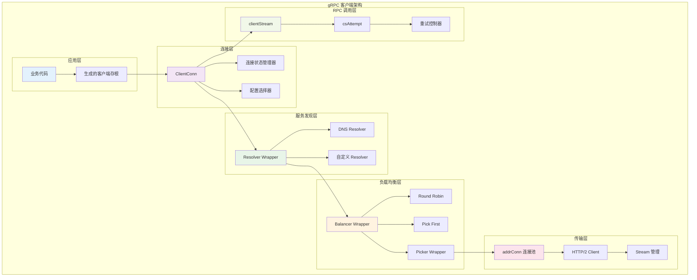
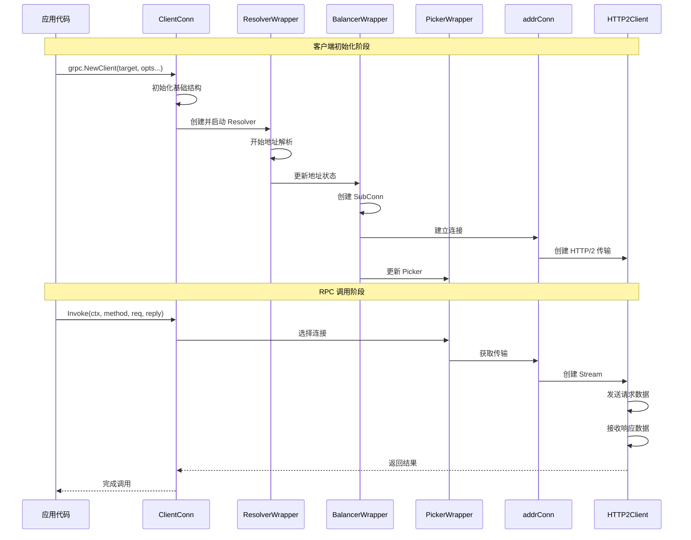
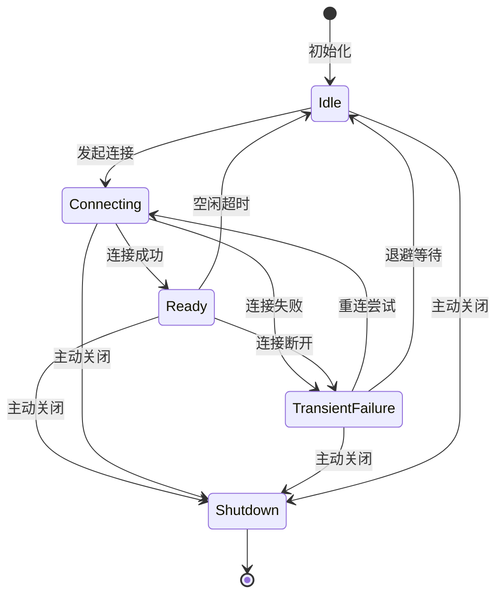

# gRPC-Go 客户端模块深度剖析

## 目录

1. [客户端模块架构](#客户端模块架构)
2. [核心 API 分析](#核心-api-分析)
3. [连接管理机制](#连接管理机制)
4. [负载均衡与服务发现](#负载均衡与服务发现)
5. [RPC 调用流程](#rpc-调用流程)
6. [重试与超时机制](#重试与超时机制)
7. [关键结构体关系](#关键结构体关系)
8. [实战经验总结](#实战经验总结)

## 客户端模块架构

### 整体架构图



### 核心组件时序图



## 核心 API 分析

### 1. grpc.NewClient - 客户端连接创建

**API 签名**：
```go
func NewClient(target string, opts ...DialOption) (*ClientConn, error)
```

**入口函数实现**：
```go
// 位置：clientconn.go:165
func NewClient(target string, opts ...DialOption) (*ClientConn, error) {
    // 创建基础 ClientConn 结构
    cc := &ClientConn{
        target:            target,
        csMgr:             &connectivityStateManager{},
        conns:             make(map[*addrConn]struct{}),
        dopts:             defaultDialOptions(),
        blockingpicker:    newPickerWrapper(),
        czData:            new(channelzData),
        firstResolveEvent: grpcsync.NewEvent(),
    }
    
    // 初始化重试限流器和配置选择器
    cc.retryThrottler.Store((*retryThrottler)(nil))
    cc.safeConfigSelector.UpdateConfigSelector(&defaultConfigSelector{nil})
    cc.ctx, cc.cancel = context.WithCancel(context.Background())
    
    // 应用拨号选项
    for _, opt := range opts {
        opt.apply(&cc.dopts)
    }
    
    // 验证传输凭证配置
    if err := cc.validateTransportCredentials(); err != nil {
        return nil, err
    }
    
    // 解析目标地址并查找对应的 Resolver
    if err := cc.parseTargetAndFindResolver(); err != nil {
        return nil, err
    }
    
    // 注册到 channelz 监控系统
    cc.channelz = channelz.RegisterChannel(&channelzChannel{cc}, cc.dopts.channelzParentID, target)
    
    // 初始化连接状态管理器
    cc.csMgr = &connectivityStateManager{
        channelz: cc.channelz,
        pubSub:   grpcsync.NewPubSub(),
    }
    cc.csMgr.updateState(connectivity.Idle)
    
    // 创建 Resolver 和 Balancer 包装器
    cc.resolverWrapper = newCCResolverWrapper(cc, cc.resolverBuilder)
    cc.balancerWrapper = newCCBalancerWrapper(cc, cc.dopts.balancerBuilder)
    
    // 启动地址解析过程
    if err := cc.resolverWrapper.start(); err != nil {
        return nil, err
    }
    
    return cc, nil
}
```

**关键调用链路**：
```text
NewClient() →
├── defaultDialOptions() 设置默认选项
├── validateTransportCredentials() 验证传输凭证
├── parseTargetAndFindResolver() 解析目标并查找 Resolver
├── channelz.RegisterChannel() 注册监控
├── newCCResolverWrapper() 创建 Resolver 包装器
├── newCCBalancerWrapper() 创建 Balancer 包装器
└── resolverWrapper.start() 启动地址解析
```

**功能说明**：
- **目标解析**：解析用户提供的目标字符串，确定使用哪种 Resolver
- **选项应用**：应用用户配置的拨号选项，如传输凭证、超时设置等
- **组件初始化**：创建连接状态管理、负载均衡、服务发现等核心组件
- **监控集成**：集成 channelz 监控系统，便于调试和观察

### 2. ClientConn.Invoke - 一元 RPC 调用

**API 签名**：
```go
func (cc *ClientConn) Invoke(ctx context.Context, method string, args, reply any, opts ...CallOption) error
```

**入口函数实现**：
```go
// 位置：call.go:29
func (cc *ClientConn) Invoke(ctx context.Context, method string, args, reply any, opts ...CallOption) error {
    // 合并默认调用选项和用户提供的选项
    opts = combine(cc.dopts.callOptions, opts)

    // 如果配置了一元拦截器，则通过拦截器调用
    if cc.dopts.unaryInt != nil {
        return cc.dopts.unaryInt(ctx, method, args, reply, cc, invoke, opts...)
    }
    return invoke(ctx, method, args, reply, cc, opts...)
}

// 实际的调用实现
func invoke(ctx context.Context, method string, req, reply any, cc *ClientConn, opts ...CallOption) error {
    // 创建客户端流
    cs, err := newClientStream(ctx, unaryStreamDesc, cc, method, opts...)
    if err != nil {
        return err
    }
    
    // 发送请求消息
    if err := cs.SendMsg(req); err != nil {
        return err
    }
    
    // 接收响应消息
    return cs.RecvMsg(reply)
}
```

**newClientStream 核心实现**：
```go
// 位置：stream.go:180
func newClientStream(ctx context.Context, desc *StreamDesc, cc *ClientConn, method string, opts ...CallOption) (_ ClientStream, err error) {
    // 启动空闲管理跟踪
    if err := cc.idlenessMgr.OnCallBegin(); err != nil {
        return nil, err
    }
    
    // 添加调用完成回调
    opts = append([]CallOption{OnFinish(func(error) { cc.idlenessMgr.OnCallEnd() })}, opts...)

    // 验证元数据
    if md, added, ok := metadataFromOutgoingContextRaw(ctx); ok {
        if err := imetadata.Validate(md); err != nil {
            return nil, status.Error(codes.Internal, err.Error())
        }
        for _, kvs := range added {
            for i := 0; i < len(kvs); i += 2 {
                if err := imetadata.ValidatePair(kvs[i], kvs[i+1]); err != nil {
                    return nil, status.Error(codes.Internal, err.Error())
                }
            }
        }
    }

    // 统计调用开始
    if channelz.IsOn() {
        cc.incrCallsStarted()
        defer func() {
            if err != nil {
                cc.incrCallsFailed()
            }
        }()
    }

    // 创建默认调用信息
    c := defaultCallInfo()
    
    // 应用调用选项
    for _, o := range opts {
        if err := o.before(c); err != nil {
            return nil, toRPCErr(err)
        }
    }
    
    // 等待地址解析完成
    if err := cc.waitForResolvedAddrs(ctx); err != nil {
        return nil, err
    }

    // 获取方法配置
    mc := cc.safeConfigSelector.SelectConfig(iresolver.RPCInfo{Context: ctx, Method: method})
    if mc.OnCommitted != nil {
        defer func() {
            if err != nil {
                mc.OnCommitted(balancer.DoneInfo{Err: err})
            }
        }()
    }

    // 创建客户端流对象
    cs := &clientStream{
        callHdr: &transport.CallHdr{
            Host:           cc.authority,
            Method:         method,
            ContentSubtype: c.contentSubtype,
        },
        ctx:          ctx,
        methodConfig: &mc,
        opts:         opts,
        callInfo:     c,
        cc:           cc,
        desc:         desc,
        codec:        c.codec,
        cp:           Compressor(c.compressorType),
        dc:           Decompressor(c.compressorType),
        beginTime:    beginTime,
        firstAttempt: true,
    }

    // 创建第一次尝试
    if err := cs.newAttemptLocked(sh, trInfo); err != nil {
        cs.finish(err)
        return nil, err
    }

    // 执行带重试的操作
    op := func(a *csAttempt) error { return a.newStream() }
    if err := cs.withRetry(op, func() { cs.bufferForRetryLocked(0, op) }); err != nil {
        cs.finish(err)
        return nil, err
    }

    return cs, nil
}
```

### 3. ClientConn.NewStream - 流式 RPC 调用

**API 签名**：
```go
func (cc *ClientConn) NewStream(ctx context.Context, desc *StreamDesc, method string, opts ...CallOption) (ClientStream, error)
```

**实现分析**：
```go
// 位置：stream.go:164
func (cc *ClientConn) NewStream(ctx context.Context, desc *StreamDesc, method string, opts ...CallOption) (ClientStream, error) {
    // 合并调用选项
    opts = combine(cc.dopts.callOptions, opts)

    // 如果配置了流式拦截器，则通过拦截器调用
    if cc.dopts.streamInt != nil {
        return cc.dopts.streamInt(ctx, desc, cc, method, newClientStream, opts...)
    }
    return newClientStream(ctx, desc, cc, method, opts...)
}
```

## 连接管理机制

### 连接状态管理器

**connectivityStateManager 结构**：
```go
// 位置：clientconn.go:539
type connectivityStateManager struct {
    mu         sync.Mutex
    state      connectivity.State
    notifyChan chan struct{}
    channelz   *channelz.Channel
    pubSub     *grpcsync.PubSub
}

// 更新连接状态
func (csm *connectivityStateManager) updateState(state connectivity.State) {
    csm.mu.Lock()
    defer csm.mu.Unlock()
    
    // 如果已经关闭，忽略状态更新
    if csm.state == connectivity.Shutdown {
        return
    }
    
    // 如果状态没有变化，直接返回
    if csm.state == state {
        return
    }
    
    // 更新状态并通知订阅者
    csm.state = state
    csm.channelz.ChannelMetrics.State.Store(&state)
    csm.pubSub.Publish(state)

    // 记录状态变化日志
    channelz.Infof(logger, csm.channelz, "Channel Connectivity change to %v", state)
    
    // 唤醒等待状态变化的 goroutine
    if csm.notifyChan != nil {
        close(csm.notifyChan)
        csm.notifyChan = nil
    }
}

// 获取当前状态
func (csm *connectivityStateManager) getState() connectivity.State {
    csm.mu.Lock()
    defer csm.mu.Unlock()
    return csm.state
}

// 获取通知通道
func (csm *connectivityStateManager) getNotifyChan() <-chan struct{} {
    csm.mu.Lock()
    defer csm.mu.Unlock()
    if csm.notifyChan == nil {
        csm.notifyChan = make(chan struct{})
    }
    return csm.notifyChan
}
```

### 连接状态转换图



### addrConn 连接管理

**addrConn 结构体**：
```go
// addrConn 表示到一组地址的连接
type addrConn struct {
    ctx    context.Context
    cancel context.CancelFunc
    cc     *ClientConn
    addrs  []resolver.Address
    
    // 连接状态管理
    stateMu sync.Mutex
    state   connectivity.State
    
    // 重连控制
    backoffIdx    int
    resetBackoff  chan struct{}
    connectDeadline time.Time
    
    // 传输层
    transport transport.ClientTransport
    
    // 监控数据
    channelz *channelz.SubChannel
    czData   *channelzData
}
```

**连接建立过程**：
```go
// 位置：clientconn.go:1364
func (ac *addrConn) createTransport(ctx context.Context, addr resolver.Address, copts transport.ConnectOptions, connectDeadline time.Time) error {
    // 设置服务器名称
    addr.ServerName = ac.cc.getServerName(addr)
    hctx, hcancel := context.WithCancel(ctx)

    // 定义连接关闭回调
    onClose := func(r transport.GoAwayReason) {
        ac.mu.Lock()
        defer ac.mu.Unlock()
        
        // 根据 GoAway 原因调整参数
        ac.adjustParams(r)
        
        if ctx.Err() != nil {
            // 连接已被取消或关闭
            return
        }
        
        hcancel()
        
        if ac.transport == nil {
            // 仍在连接过程中，不更新状态
            return
        }
        
        // 清理传输层并触发重新解析
        ac.transport = nil
        ac.cc.resolveNow(resolver.ResolveNowOptions{})
        
        // 进入空闲状态等待负载均衡器重新连接
        ac.updateConnectivityState(connectivity.Idle, nil)
    }

    // 设置连接超时
    connectCtx, cancel := context.WithDeadline(ctx, connectDeadline)
    defer cancel()
    copts.ChannelzParent = ac.channelz

    // 创建 HTTP/2 客户端传输
    newTr, err := transport.NewHTTP2Client(connectCtx, ac.cc.ctx, addr, copts, onClose)
    if err != nil {
        if logger.V(2) {
            logger.Infof("Creating new client transport to %q: %v", addr, err)
        }
        hcancel()
        channelz.Warningf(logger, ac.channelz, "grpc: addrConn.createTransport failed to connect to %s. Err: %v", addr, err)
        return err
    }

    ac.mu.Lock()
    defer ac.mu.Unlock()
    
    if ctx.Err() != nil {
        // 连接过程中被取消
        newTr.Close(transport.ErrConnClosing)
        return nil
    }
    
    // 设置传输层并更新状态
    ac.transport = newTr
    ac.updateConnectivityState(connectivity.Ready, nil)
    return nil
}
```

## 负载均衡与服务发现

### Resolver 包装器

**ccResolverWrapper 结构**：
```go
type ccResolverWrapper struct {
    cc         *ClientConn
    resolverMu sync.Mutex
    resolver   resolver.Resolver
    done       *grpcsync.Event
    curState   resolver.State
}

// 启动地址解析
func (ccr *ccResolverWrapper) start() error {
    ccr.resolverMu.Lock()
    defer ccr.resolverMu.Unlock()
    
    if ccr.done.HasFired() {
        return nil
    }
    
    // 构建 Resolver
    ccr.resolver, err := ccr.cc.resolverBuilder.Build(ccr.cc.parsedTarget, ccr, resolver.BuildOptions{
        DisableServiceConfig: ccr.cc.dopts.disableServiceConfig,
        DialCreds:           ccr.cc.dopts.copts.TransportCredentials,
        CredsBundle:         ccr.cc.dopts.copts.CredsBundle,
        Dialer:              ccr.cc.dopts.copts.Dialer,
    })
    
    if err != nil {
        return err
    }
    
    return nil
}

// 更新解析状态
func (ccr *ccResolverWrapper) UpdateState(s resolver.State) error {
    if ccr.done.HasFired() {
        return nil
    }
    
    channelz.Infof(logger, ccr.cc.channelz, "ccResolverWrapper: sending update to cc: %v", s)
    
    // 更新当前状态
    ccr.curState = s
    
    // 通知负载均衡器
    return ccr.cc.updateResolverState(s, nil)
}
```

### Balancer 包装器

**ccBalancerWrapper 结构**：
```go
type ccBalancerWrapper struct {
    cc       *ClientConn
    balancerMu sync.Mutex
    balancer balancer.Balancer
    updateCh *buffer.Unbounded
    done     *grpcsync.Event
    subConns map[*acBalancerWrapper]struct{}
}

// 更新客户端连接状态
func (ccb *ccBalancerWrapper) UpdateClientConnState(ccs balancer.ClientConnState) error {
    ccb.balancerMu.Lock()
    defer ccb.balancerMu.Unlock()
    
    if ccb.done.HasFired() {
        return nil
    }
    
    return ccb.balancer.UpdateClientConnState(ccs)
}

// 创建子连接
func (ccb *ccBalancerWrapper) NewSubConn(addrs []resolver.Address, opts balancer.NewSubConnOptions) (balancer.SubConn, error) {
    if len(addrs) <= 0 {
        return nil, fmt.Errorf("grpc: cannot create SubConn with empty address list")
    }
    
    ccb.balancerMu.Lock()
    defer ccb.balancerMu.Unlock()
    
    if ccb.done.HasFired() {
        return nil, fmt.Errorf("grpc: ClientConn is closing")
    }

    // 创建 addrConn
    ac, err := ccb.cc.newAddrConn(addrs, opts)
    if err != nil {
        return nil, err
    }
    
    // 包装为 balancer 可用的 SubConn
    acbw := &acBalancerWrapper{ac: ac, producers: make(map[balancer.ProducerBuilder]*refCountedProducer)}
    acbw.ac.mu.Lock()
    ac.acbw = acbw
    acbw.ac.mu.Unlock()
    ccb.subConns[acbw] = struct{}{}
    
    return acbw, nil
}
```

### Picker 选择机制

**pickerWrapper 实现**：
```go
type pickerWrapper struct {
    mu         sync.Mutex
    done       bool
    blockingCh chan struct{}
    picker     balancer.Picker
}

// 选择连接
func (pw *pickerWrapper) pick(ctx context.Context, failfast bool, info balancer.PickInfo) (transport.ClientTransport, balancer.PickResult, error) {
    var ch chan struct{}
    var lastPickErr error
    
    for {
        pw.mu.Lock()
        if pw.done {
            pw.mu.Unlock()
            return nil, balancer.PickResult{}, ErrClientConnClosing
        }
        
        if pw.picker == nil {
            ch = pw.blockingCh
        }
        
        if ch == pw.blockingCh {
            // 等待新的 picker
            pw.mu.Unlock()
            select {
            case <-ctx.Done():
                var errStr string
                if lastPickErr != nil {
                    errStr = "latest balancer error: " + lastPickErr.Error()
                } else {
                    errStr = ctx.Err().Error()
                }
                switch ctx.Err() {
                case context.DeadlineExceeded:
                    return nil, balancer.PickResult{}, status.Error(codes.DeadlineExceeded, errStr)
                case context.Canceled:
                    return nil, balancer.PickResult{}, status.Error(codes.Canceled, errStr)
                }
            case <-ch:
            }
            continue
        }
        
        ch = pw.blockingCh
        p := pw.picker
        pw.mu.Unlock()
        
        // 执行负载均衡选择
        pickResult, err := p.Pick(info)
        if err != nil {
            if err == balancer.ErrNoSubConnAvailable {
                continue
            }
            if _, ok := status.FromError(err); ok {
                return nil, balancer.PickResult{}, err
            }
            return nil, balancer.PickResult{}, status.Error(codes.Unavailable, err.Error())
        }
        
        // 获取可用的传输
        acw, ok := pickResult.SubConn.(*acBalancerWrapper)
        if !ok {
            logger.Errorf("subconn returned from pick is type %T, not *acBalancerWrapper", pickResult.SubConn)
            continue
        }
        
        if t := acw.ac.getReadyTransport(); t != nil {
            return t, pickResult, nil
        }
        
        if pickResult.Done != nil {
            pickResult.Done(balancer.DoneInfo{Err: balancer.ErrNoSubConnAvailable})
        }
        
        logger.Infof("blockingPicker: the picked transport is not ready, loop back to repick")
    }
}
```

## RPC 调用流程

### clientStream 结构

```go
type clientStream struct {
    callHdr      *transport.CallHdr
    ctx          context.Context
    methodConfig *iresolver.MethodConfig
    opts         []CallOption
    callInfo     *callInfo
    cc           *ClientConn
    desc         *StreamDesc
    codec        baseCodec
    cp           Compressor
    dc           Decompressor
    
    // 流状态管理
    mu       sync.Mutex
    finished bool
    
    // 重试相关
    attempt          *csAttempt
    numRetries       int
    numRetriesSincePushback int
    finished         bool
    
    // 缓冲区
    buffer    []func(*csAttempt) error
    bufferSize int
}
```

### csAttempt 尝试机制

```go
type csAttempt struct {
    ctx    context.Context
    cs     *clientStream
    t      transport.ClientTransport
    s      *transport.Stream
    p      *parser
    done   func(balancer.DoneInfo)
    
    finished  bool
    dc        Decompressor
    decomp    encoding.Compressor
    decompSet bool
    
    mu     sync.Mutex
    state  attemptState
}

// 创建新的流
func (a *csAttempt) newStream() error {
    cs := a.cs
    cs.callHdr.PreviousAttempts = cs.numRetries
    
    // 创建传输流
    s, err := a.t.NewStream(cs.ctx, cs.callHdr)
    if err != nil {
        return toRPCErr(err)
    }
    
    a.s = s
    a.p = &parser{r: s}
    return nil
}

// 发送消息
func (a *csAttempt) sendMsg(m interface{}, hdr, payld, data mem.BufferSlice) error {
    cs := a.cs
    
    if a.trInfo != nil {
        a.trInfo.tr.LazyLog(&payload{sent: true, msg: m}, true)
    }
    
    if err := a.t.Write(a.s, hdr, payld, &transport.Options{Last: !cs.desc.ClientStreams}); err != nil {
        if !a.s.Done() {
            return io.EOF
        }
        return err
    }
    
    if a.statsHandler != nil {
        a.statsHandler.HandleRPC(cs.ctx, outPayload(true, m, data, payld, time.Now()))
    }
    
    return nil
}

// 接收消息
func (a *csAttempt) recvMsg(m interface{}, payInfo *payloadInfo) (err error) {
    cs := a.cs
    
    if a.statsHandler != nil && payInfo == nil {
        payInfo = &payloadInfo{}
    }
    
    if !a.decompSet {
        // 设置解压缩器
        a.decompSet = true
        if dc := a.s.RecvCompress(); dc != "" && dc != encoding.Identity {
            if a.dc == nil || a.dc.Type() != dc {
                a.dc = nil
                if a.decomp = encoding.GetCompressor(dc); a.decomp != nil {
                    a.dc = a.decomp
                }
            }
        }
    }
    
    // 解析消息
    if err := recv(a.p, cs.codec, a.s, a.dc, m, *cs.callInfo.maxReceiveMessageSize, payInfo, a.decomp); err != nil {
        if err == io.EOF {
            if statusErr := a.s.Status().Err(); statusErr != nil {
                return statusErr
            }
            return io.EOF
        }
        return toRPCErr(err)
    }
    
    if a.trInfo != nil {
        a.trInfo.tr.LazyLog(&payload{sent: false, msg: m}, true)
    }
    
    if a.statsHandler != nil {
        a.statsHandler.HandleRPC(cs.ctx, &stats.InPayload{
            Client:     true,
            RecvTime:   payInfo.uncompressedBytes.ReadOnlyData(),
            Payload:    m,
            WireLength: payInfo.wireLength,
            Data:       payInfo.uncompressedBytes.ReadOnlyData(),
            Length:     len(payInfo.uncompressedBytes.ReadOnlyData()),
        })
    }
    
    return nil
}
```

## 重试与超时机制

### 重试策略配置

```go
type retryPolicy struct {
    maxAttempts          int
    initialBackoff       time.Duration
    maxBackoff           time.Duration
    backoffMultiplier    float64
    retryableStatusCodes map[codes.Code]bool
}

// 检查是否应该重试
func (cs *clientStream) shouldRetry(err error) (bool, error) {
    if cs.finished || cs.committed {
        return false, err
    }
    
    // 检查重试策略
    rp := cs.methodConfig.RetryPolicy
    if rp == nil {
        return false, err
    }
    
    // 检查重试次数限制
    if cs.numRetries >= rp.MaxAttempts {
        return false, err
    }
    
    // 检查状态码是否可重试
    if rpcErr, ok := status.FromError(err); ok {
        if !rp.RetryableStatusCodes[rpcErr.Code()] {
            return false, err
        }
    } else {
        return false, err
    }
    
    // 检查重试限流
    if !cs.retryThrottler.allow() {
        return false, err
    }
    
    return true, nil
}

// 执行重试
func (cs *clientStream) withRetry(op func(*csAttempt) error, onSuccess func()) error {
    for {
        if err := op(cs.attempt); err != nil {
            if shouldRetry, _ := cs.shouldRetry(err); shouldRetry {
                // 计算退避时间
                backoff := cs.calculateBackoff()
                timer := time.NewTimer(backoff)
                select {
                case <-timer.C:
                case <-cs.ctx.Done():
                    timer.Stop()
                    return cs.ctx.Err()
                }
                
                // 创建新的尝试
                cs.numRetries++
                if err := cs.newAttemptLocked(nil, nil); err != nil {
                    return err
                }
                continue
            }
            return err
        }
        
        if onSuccess != nil {
            onSuccess()
        }
        return nil
    }
}
```

### 超时控制机制

```go
// 方法级超时配置
type MethodConfig struct {
    Timeout *time.Duration
    // 其他配置...
}

// 应用超时配置
func (cs *clientStream) applyTimeout() {
    if cs.methodConfig.Timeout != nil {
        var cancel context.CancelFunc
        cs.ctx, cancel = context.WithTimeout(cs.ctx, *cs.methodConfig.Timeout)
        cs.cancel = cancel
    }
}

// 检查上下文超时
func (cs *clientStream) checkTimeout() error {
    select {
    case <-cs.ctx.Done():
        err := cs.ctx.Err()
        if err == context.DeadlineExceeded {
            return status.Error(codes.DeadlineExceeded, err.Error())
        }
        return status.Error(codes.Canceled, err.Error())
    default:
        return nil
    }
}
```

## 关键结构体关系

### 类图关系

```mermaid
classDiagram
    class ClientConn {
        +target string
        +parsedTarget resolver.Target
        +authority string
        +dopts dialOptions
        +csMgr *connectivityStateManager
        +resolverWrapper *ccResolverWrapper
        +balancerWrapper *ccBalancerWrapper
        +blockingpicker *pickerWrapper
        +conns map[*addrConn]struct{}
        
        +NewClient(target, opts) (*ClientConn, error)
        +Invoke(ctx, method, args, reply, opts) error
        +NewStream(ctx, desc, method, opts) (ClientStream, error)
        +GetState() connectivity.State
        +WaitForStateChange(ctx, lastState) bool
        +Close() error
    }
    
    class connectivityStateManager {
        +mu sync.Mutex
        +state connectivity.State
        +notifyChan chan struct{}
        +channelz *channelz.Channel
        +pubSub *grpcsync.PubSub
        
        +updateState(state connectivity.State)
        +getState() connectivity.State
        +getNotifyChan() <-chan struct{}
    }
    
    class ccResolverWrapper {
        +cc *ClientConn
        +resolverMu sync.Mutex
        +resolver resolver.Resolver
        +done *grpcsync.Event
        +curState resolver.State
        
        +start() error
        +resolveNow(o resolver.ResolveNowOptions)
        +UpdateState(s resolver.State) error
        +ReportError(err error)
        +close()
    }
    
    class ccBalancerWrapper {
        +cc *ClientConn
        +balancerMu sync.Mutex
        +balancer balancer.Balancer
        +updateCh *buffer.Unbounded
        +done *grpcsync.Event
        +subConns map[*acBalancerWrapper]struct{}
        
        +UpdateClientConnState(ccs balancer.ClientConnState) error
        +UpdateState(s balancer.State) error
        +NewSubConn(addrs, opts) (balancer.SubConn, error)
        +RemoveSubConn(sc balancer.SubConn)
        +close()
    }
    
    class addrConn {
        +ctx context.Context
        +cancel context.CancelFunc
        +cc *ClientConn
        +addrs []resolver.Address
        +stateMu sync.Mutex
        +state connectivity.State
        +backoffIdx int
        +resetBackoff chan struct{}
        +transport transport.ClientTransport
        +channelz *channelz.SubChannel
        
        +connect() error
        +tryAllAddrs(addrs, connectDeadline) error
        +createTransport(addr, copts, connectDeadline) error
        +getReadyTransport() transport.ClientTransport
        +tearDown(err error)
    }
    
    class clientStream {
        +callHdr *transport.CallHdr
        +ctx context.Context
        +methodConfig *iresolver.MethodConfig
        +opts []CallOption
        +cc *ClientConn
        +desc *StreamDesc
        +codec baseCodec
        +attempt *csAttempt
        +numRetries int
        +finished bool
        
        +SendMsg(m interface{}) error
        +RecvMsg(m interface{}) error
        +Header() (metadata.MD, error)
        +Trailer() metadata.MD
        +CloseSend() error
        +Context() context.Context
    }
    
    class csAttempt {
        +ctx context.Context
        +cs *clientStream
        +t transport.ClientTransport
        +s *transport.Stream
        +p *parser
        +done func(balancer.DoneInfo)
        +finished bool
        +dc Decompressor
        
        +newStream() error
        +sendMsg(m interface{}, hdr, payld, data mem.BufferSlice) error
        +recvMsg(m interface{}, payInfo *payloadInfo) error
        +finish(err error)
    }
    
    ClientConn --> connectivityStateManager : has
    ClientConn --> ccResolverWrapper : has
    ClientConn --> ccBalancerWrapper : has
    ClientConn --> addrConn : manages
    ClientConn --> clientStream : creates
    clientStream --> csAttempt : has
    ccBalancerWrapper --> addrConn : creates
```

## 实战经验总结

### 1. 连接管理最佳实践

**连接池配置**：
```go
// 合理配置连接参数
conn, err := grpc.NewClient(target,
    // 设置合适的 keepalive 参数
    grpc.WithKeepaliveParams(keepalive.ClientParameters{
        Time:                10 * time.Second, // 发送 keepalive ping 的间隔
        Timeout:             time.Second,       // 等待 keepalive ping 响应的超时时间
        PermitWithoutStream: true,              // 允许在没有活跃流时发送 keepalive ping
    }),
    
    // 设置连接状态变化回调
    grpc.WithConnectParams(grpc.ConnectParams{
        Backoff: backoff.Config{
            BaseDelay:  1.0 * time.Second,
            Multiplier: 1.6,
            Jitter:     0.2,
            MaxDelay:   120 * time.Second,
        },
        MinConnectTimeout: 20 * time.Second,
    }),
)
```

**连接状态监控**：
```go
// 监控连接状态变化
func monitorConnectionState(conn *grpc.ClientConn) {
    go func() {
        for {
            state := conn.GetState()
            log.Printf("Connection state: %v", state)
            
            if !conn.WaitForStateChange(context.Background(), state) {
                // 连接已关闭
                break
            }
        }
    }()
}
```

### 2. 负载均衡策略选择

**Round Robin 适用场景**：
- 后端服务实例性能相近
- 请求处理时间相对均匀
- 需要均匀分布负载

**Pick First 适用场景**：
- 主备模式部署
- 需要会话亲和性
- 后端服务有明显的优先级

**自定义负载均衡器**：
```go
// 实现基于延迟的负载均衡器
type latencyBasedPicker struct {
    subConns []balancer.SubConn
    latencies map[balancer.SubConn]time.Duration
    mu       sync.RWMutex
}

func (p *latencyBasedPicker) Pick(info balancer.PickInfo) (balancer.PickResult, error) {
    p.mu.RLock()
    defer p.mu.RUnlock()
    
    if len(p.subConns) == 0 {
        return balancer.PickResult{}, balancer.ErrNoSubConnAvailable
    }
    
    // 选择延迟最低的连接
    var bestConn balancer.SubConn
    var minLatency time.Duration = time.Hour
    
    for _, sc := range p.subConns {
        if latency, ok := p.latencies[sc]; ok && latency < minLatency {
            minLatency = latency
            bestConn = sc
        }
    }
    
    if bestConn == nil {
        bestConn = p.subConns[0] // 回退到第一个连接
    }
    
    return balancer.PickResult{
        SubConn: bestConn,
        Done: func(info balancer.DoneInfo) {
            // 更新延迟统计
            p.updateLatency(bestConn, info)
        },
    }, nil
}
```

### 3. 重试策略配置

**重试配置最佳实践**：
```go
const retryServiceConfig = `{
    "methodConfig": [{
        "name": [{}],
        "retryPolicy": {
            "maxAttempts": 3,
            "initialBackoff": "100ms",
            "maxBackoff": "1s",
            "backoffMultiplier": 2.0,
            "retryableStatusCodes": ["UNAVAILABLE", "RESOURCE_EXHAUSTED"]
        }
    }]
}`

// 只对幂等操作启用重试
const idempotentRetryConfig = `{
    "methodConfig": [{
        "name": [{"service": "UserService", "method": "GetUser"}],
        "retryPolicy": {
            "maxAttempts": 5,
            "initialBackoff": "50ms",
            "maxBackoff": "2s",
            "backoffMultiplier": 1.5,
            "retryableStatusCodes": ["UNAVAILABLE", "DEADLINE_EXCEEDED"]
        }
    }, {
        "name": [{"service": "UserService", "method": "CreateUser"}],
        "retryPolicy": {
            "maxAttempts": 1
        }
    }]
}`
```

### 4. 性能优化技巧

**减少内存分配**：
```go
// 使用对象池减少分配
var requestPool = sync.Pool{
    New: func() interface{} {
        return &pb.Request{}
    },
}

func makeRequest() *pb.Request {
    req := requestPool.Get().(*pb.Request)
    req.Reset() // 重置对象状态
    return req
}

func releaseRequest(req *pb.Request) {
    requestPool.Put(req)
}
```

**批量操作**：
```go
// 使用流式 RPC 进行批量操作
func batchProcess(client pb.ServiceClient, items []*pb.Item) error {
    stream, err := client.BatchProcess(context.Background())
    if err != nil {
        return err
    }
    
    // 发送批量数据
    for _, item := range items {
        if err := stream.Send(item); err != nil {
            return err
        }
    }
    
    // 关闭发送并接收结果
    resp, err := stream.CloseAndRecv()
    if err != nil {
        return err
    }
    
    log.Printf("Processed %d items", resp.Count)
    return nil
}
```

### 5. 错误处理策略

**错误分类处理**：
```go
func handleGRPCError(err error) error {
    if err == nil {
        return nil
    }
    
    st, ok := status.FromError(err)
    if !ok {
        return err
    }
    
    switch st.Code() {
    case codes.Unavailable:
        // 服务不可用，可以重试
        log.Printf("Service unavailable: %v", st.Message())
        return err
    case codes.DeadlineExceeded:
        // 超时，检查是否可以重试
        log.Printf("Request timeout: %v", st.Message())
        return err
    case codes.InvalidArgument:
        // 参数错误，不应该重试
        log.Printf("Invalid argument: %v", st.Message())
        return err
    case codes.PermissionDenied:
        // 权限错误，需要重新认证
        log.Printf("Permission denied: %v", st.Message())
        return err
    default:
        log.Printf("Unknown error: %v", st.Message())
        return err
    }
}
```

### 6. 监控和调试

**集成 OpenTelemetry**：
```go
import (
    "go.opentelemetry.io/contrib/instrumentation/google.golang.org/grpc/otelgrpc"
)

// 添加追踪和指标
conn, err := grpc.NewClient(target,
    grpc.WithStatsHandler(otelgrpc.NewClientHandler()),
    grpc.WithUnaryInterceptor(otelgrpc.UnaryClientInterceptor()),
    grpc.WithStreamInterceptor(otelgrpc.StreamClientInterceptor()),
)
```

**使用 channelz 调试**：
```go
import _ "google.golang.org/grpc/channelz/service"

// 启动 channelz 服务用于调试
go func() {
    lis, err := net.Listen("tcp", ":50052")
    if err != nil {
        log.Fatal(err)
    }
    s := grpc.NewServer()
    channelzservice.RegisterChannelzServiceToServer(s)
    s.Serve(lis)
}()
```

这个客户端模块文档详细分析了 gRPC-Go 客户端的核心架构、API 实现、连接管理、负载均衡等关键机制，并提供了丰富的实战经验和最佳实践。通过深入的源码分析和完整的时序图，帮助开发者全面理解客户端的工作原理。
