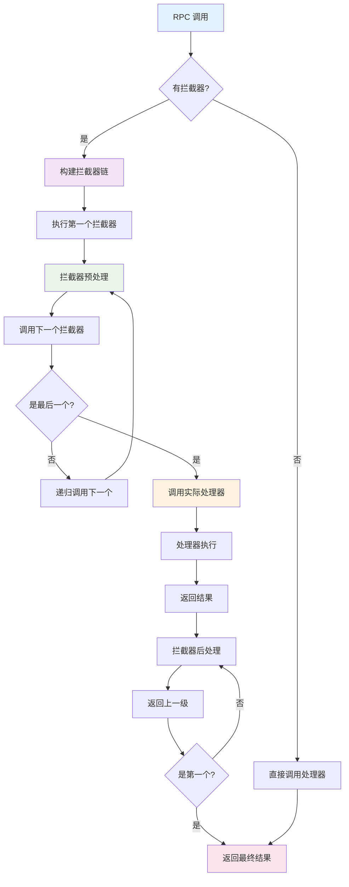

# gRPC-Go 拦截器模块深度剖析

## 拦截器模块架构

### 整体架构图


### 拦截器执行流程


## 核心接口与类型

### 1. 客户端拦截器接口

```go
// 位置：interceptor.go
// UnaryInvoker 被 UnaryClientInterceptor 调用来完成 RPC
type UnaryInvoker func(ctx context.Context, method string, req, reply any, cc *ClientConn, opts ...CallOption) error

// UnaryClientInterceptor 拦截客户端一元 RPC 的执行
// 一元拦截器可以通过 DialOption 指定，使用 WithUnaryInterceptor() 或 WithChainUnaryInterceptor()
// 当在 ClientConn 上设置一元拦截器时，gRPC 将所有一元 RPC 调用委托给拦截器
// 拦截器有责任调用 invoker 来完成 RPC 的处理
type UnaryClientInterceptor func(ctx context.Context, method string, req, reply any, cc *ClientConn, invoker UnaryInvoker, opts ...CallOption) error

// Streamer 被 StreamClientInterceptor 调用来创建 ClientStream
type Streamer func(ctx context.Context, desc *StreamDesc, cc *ClientConn, method string, opts ...CallOption) (ClientStream, error)

// StreamClientInterceptor 拦截 ClientStream 的创建
// 流拦截器可以通过 DialOption 指定，使用 WithStreamInterceptor() 或 WithChainStreamInterceptor()
// 当在 ClientConn 上设置流拦截器时，gRPC 将所有流创建委托给拦截器
// 拦截器有责任调用 streamer
type StreamClientInterceptor func(ctx context.Context, desc *StreamDesc, cc *ClientConn, method string, streamer Streamer, opts ...CallOption) (ClientStream, error)
```

### 2. 服务端拦截器接口

```go
// 位置：interceptor.go
// UnaryHandler 定义由 UnaryServerInterceptor 调用的处理器
// 用于完成一元 RPC 的正常执行
type UnaryHandler func(ctx context.Context, req any) (any, error)

// UnaryServerInterceptor 提供拦截服务器上一元 RPC 执行的钩子
// info 包含此 RPC 的所有信息，拦截器可以对其进行操作
// handler 是服务方法实现的包装器
// 拦截器有责任调用 handler 来完成 RPC
type UnaryServerInterceptor func(ctx context.Context, req any, info *UnaryServerInfo, handler UnaryHandler) (resp any, err error)

// UnaryServerInfo 包含服务器端一元 RPC 的各种信息
// 所有每个 RPC 的信息都可能被拦截器修改
type UnaryServerInfo struct {
    // Server 是用户提供的服务实现，这是只读的
    Server any
    // FullMethod 是完整的 RPC 方法字符串，即 /package.service/method
    FullMethod string
}

// StreamHandler 定义由 StreamServerInterceptor 调用的处理器
// 用于完成流式 RPC 的正常执行
type StreamHandler func(srv any, stream ServerStream) error

// StreamServerInterceptor 提供拦截服务器上流式 RPC 执行的钩子
// info 包含此 RPC 的所有信息，拦截器可以对其进行操作
// handler 是服务方法实现
// 拦截器有责任调用 handler 来完成 RPC
type StreamServerInterceptor func(srv any, ss ServerStream, info *StreamServerInfo, handler StreamHandler) error

// StreamServerInfo 包含服务器端流式 RPC 的各种信息
// 所有每个 RPC 的信息都可能被拦截器修改
type StreamServerInfo struct {
    // FullMethod 是完整的 RPC 方法字符串，即 /package.service/method
    FullMethod string
    // IsClientStream 指示 RPC 是否为客户端流式 RPC
    IsClientStream bool
    // IsServerStream 指示 RPC 是否为服务器端流式 RPC
    IsServerStream bool
}
```

## 客户端拦截器实现

### 1. 一元客户端拦截器示例

```go
// 位置：examples/features/interceptor/client/main.go
// unaryInterceptor 是一元拦截器示例
func unaryInterceptor(ctx context.Context, method string, req, reply any, cc *grpc.ClientConn, invoker grpc.UnaryInvoker, opts ...grpc.CallOption) error {
    // 预处理：检查是否配置了凭据
    var credsConfigured bool
    for _, o := range opts {
        _, ok := o.(grpc.PerRPCCredsCallOption)
        if ok {
            credsConfigured = true
            break
        }
    }
    
    // 如果没有配置凭据，添加默认凭据
    if !credsConfigured {
        opts = append(opts, grpc.PerRPCCredentials(oauth.TokenSource{
            TokenSource: oauth2.StaticTokenSource(&oauth2.Token{AccessToken: fallbackToken}),
        }))
    }
    
    // 记录开始时间
    start := time.Now()
    
    // 调用实际的 RPC
    err := invoker(ctx, method, req, reply, cc, opts...)
    
    // 后处理：记录执行时间和结果
    end := time.Now()
    logger("RPC: %s, start time: %s, end time: %s, err: %v", 
           method, start.Format("Basic"), end.Format(time.RFC3339), err)
    
    return err
}
```

### 2. 流式客户端拦截器示例

```go
// 位置：examples/features/interceptor/client/main.go
// wrappedStream 包装嵌入的 grpc.ClientStream，并拦截 RecvMsg 和 SendMsg 方法调用
type wrappedStream struct {
    grpc.ClientStream
}

func (w *wrappedStream) RecvMsg(m any) error {
    logger("Receive a message (Type: %T) at %v", m, time.Now().Format(time.RFC3339))
    return w.ClientStream.RecvMsg(m)
}

func (w *wrappedStream) SendMsg(m any) error {
    logger("Send a message (Type: %T) at %v", m, time.Now().Format(time.RFC3339))
    return w.ClientStream.SendMsg(m)
}

func newWrappedStream(s grpc.ClientStream) grpc.ClientStream {
    return &wrappedStream{s}
}

// streamInterceptor 是流拦截器示例
func streamInterceptor(ctx context.Context, desc *grpc.StreamDesc, cc *grpc.ClientConn, method string, streamer grpc.Streamer, opts ...grpc.CallOption) (grpc.ClientStream, error) {
    // 预处理：检查凭据配置
    var credsConfigured bool
    for _, o := range opts {
        _, ok := o.(*grpc.PerRPCCredsCallOption)
        if ok {
            credsConfigured = true
            break
        }
    }
    
    // 添加默认凭据
    if !credsConfigured {
        opts = append(opts, grpc.PerRPCCredentials(oauth.TokenSource{
            TokenSource: oauth2.StaticTokenSource(&oauth2.Token{AccessToken: fallbackToken}),
        }))
    }
    
    // 创建流
    s, err := streamer(ctx, desc, cc, method, opts...)
    if err != nil {
        return nil, err
    }
    
    // 返回包装的流以拦截消息
    return newWrappedStream(s), nil
}
```

### 3. 客户端拦截器链实现

```go
// 位置：clientconn.go
// chainUnaryClientInterceptors 将所有一元客户端拦截器链接为一个
func chainUnaryClientInterceptors(cc *ClientConn) {
    interceptors := cc.dopts.chainUnaryInts
    // 如果存在 dopts.unaryInt，则将其添加到链式拦截器前面
    // 因为 unaryInt 将在任何其他链式拦截器之前执行
    if cc.dopts.unaryInt != nil {
        interceptors = append([]UnaryClientInterceptor{cc.dopts.unaryInt}, interceptors...)
    }
    
    var chainedInt UnaryClientInterceptor
    if len(interceptors) == 0 {
        chainedInt = nil
    } else if len(interceptors) == 1 {
        chainedInt = interceptors[0]
    } else {
        chainedInt = func(ctx context.Context, method string, req, reply any, cc *ClientConn, invoker UnaryInvoker, opts ...CallOption) error {
            return interceptors[0](ctx, method, req, reply, cc, getChainUnaryInvoker(interceptors, 0, invoker), opts...)
        }
    }
    cc.dopts.unaryInt = chainedInt
}

// getChainUnaryInvoker 递归生成链式一元调用器
func getChainUnaryInvoker(interceptors []UnaryClientInterceptor, curr int, finalInvoker UnaryInvoker) UnaryInvoker {
    if curr == len(interceptors)-1 {
        return finalInvoker
    }
    return func(ctx context.Context, method string, req, reply any, cc *ClientConn, opts ...CallOption) error {
        return interceptors[curr+1](ctx, method, req, reply, cc, getChainUnaryInvoker(interceptors, curr+1, finalInvoker), opts...)
    }
}

// chainStreamClientInterceptors 将所有流客户端拦截器链接为一个
func chainStreamClientInterceptors(cc *ClientConn) {
    interceptors := cc.dopts.chainStreamInts
    // 如果存在 dopts.streamInt，则将其添加到链式拦截器前面
    if cc.dopts.streamInt != nil {
        interceptors = append([]StreamClientInterceptor{cc.dopts.streamInt}, interceptors...)
    }
    
    var chainedInt StreamClientInterceptor
    if len(interceptors) == 0 {
        chainedInt = nil
    } else if len(interceptors) == 1 {
        chainedInt = interceptors[0]
    } else {
        chainedInt = func(ctx context.Context, desc *StreamDesc, cc *ClientConn, method string, streamer Streamer, opts ...CallOption) (ClientStream, error) {
            return interceptors[0](ctx, desc, cc, method, getChainStreamer(interceptors, 0, streamer), opts...)
        }
    }
    cc.dopts.streamInt = chainedInt
}

// getChainStreamer 递归生成链式客户端流构造器
func getChainStreamer(interceptors []StreamClientInterceptor, curr int, finalStreamer Streamer) Streamer {
    if curr == len(interceptors)-1 {
        return finalStreamer
    }
    return func(ctx context.Context, desc *StreamDesc, cc *ClientConn, method string, opts ...CallOption) (ClientStream, error) {
        return interceptors[curr+1](ctx, desc, cc, method, getChainStreamer(interceptors, curr+1, finalStreamer), opts...)
    }
}
```

## 服务端拦截器实现

### 1. 一元服务端拦截器示例

```go
// 位置：examples/features/interceptor/server/main.go
// valid 验证授权
func valid(authorization []string) bool {
    if len(authorization) < 1 {
        return false
    }
    token := strings.TrimPrefix(authorization[0], "Bearer ")
    // 执行令牌验证。为了示例的简单性，这里的代码
    // 省略了通常的 OAuth2 令牌验证，而是检查
    // 与任意字符串匹配的令牌
    return token == "some-secret-token"
}

func unaryInterceptor(ctx context.Context, req any, _ *grpc.UnaryServerInfo, handler grpc.UnaryHandler) (any, error) {
    // 认证（令牌验证）
    md, ok := metadata.FromIncomingContext(ctx)
    if !ok {
        return nil, errMissingMetadata
    }
    if !valid(md["authorization"]) {
        return nil, errInvalidToken
    }
    
    // 调用实际的处理器
    m, err := handler(ctx, req)
    if err != nil {
        logger("RPC failed with error: %v", err)
    }
    return m, err
}
```

### 2. 流式服务端拦截器示例

```go
// 位置：examples/features/interceptor/server/main.go
// wrappedStream 包装嵌入的 grpc.ServerStream，并拦截 RecvMsg 和 SendMsg 方法调用
type wrappedStream struct {
    grpc.ServerStream
}

func (w *wrappedStream) RecvMsg(m any) error {
    logger("Receive a message (Type: %T) at %s", m, time.Now().Format(time.RFC3339))
    return w.ServerStream.RecvMsg(m)
}

func (w *wrappedStream) SendMsg(m any) error {
    logger("Send a message (Type: %T) at %v", m, time.Now().Format(time.RFC3339))
    return w.ServerStream.SendMsg(m)
}

func newWrappedStream(s grpc.ServerStream) grpc.ServerStream {
    return &wrappedStream{s}
}

func streamInterceptor(srv any, ss grpc.ServerStream, _ *grpc.StreamServerInfo, handler grpc.StreamHandler) error {
    // 认证（令牌验证）
    md, ok := metadata.FromIncomingContext(ss.Context())
    if !ok {
        return errMissingMetadata
    }
    if !valid(md["authorization"]) {
        return errInvalidToken
    }

    // 调用处理器并包装流
    err := handler(srv, newWrappedStream(ss))
    if err != nil {
        logger("RPC failed with error: %v", err)
    }
    return err
}
```

### 3. 服务端拦截器链实现

```go
// 位置：server.go
// chainUnaryServerInterceptors 将所有一元服务器拦截器链接为一个
func chainUnaryServerInterceptors(s *Server) {
    // 如果存在 opts.unaryInt，则将其添加到链式拦截器前面
    // 因为 unaryInt 将在任何其他链式拦截器之前执行
    interceptors := s.opts.chainUnaryInts
    if s.opts.unaryInt != nil {
        interceptors = append([]UnaryServerInterceptor{s.opts.unaryInt}, s.opts.chainUnaryInts...)
    }

    var chainedInt UnaryServerInterceptor
    if len(interceptors) == 0 {
        chainedInt = nil
    } else if len(interceptors) == 1 {
        chainedInt = interceptors[0]
    } else {
        chainedInt = chainUnaryInterceptors(interceptors)
    }

    s.opts.unaryInt = chainedInt
}

func chainUnaryInterceptors(interceptors []UnaryServerInterceptor) UnaryServerInterceptor {
    return func(ctx context.Context, req any, info *UnaryServerInfo, handler UnaryHandler) (any, error) {
        return interceptors[0](ctx, req, info, getChainUnaryHandler(interceptors, 0, info, handler))
    }
}

func getChainUnaryHandler(interceptors []UnaryServerInterceptor, curr int, info *UnaryServerInfo, finalHandler UnaryHandler) UnaryHandler {
    if curr == len(interceptors)-1 {
        return finalHandler
    }
    return func(ctx context.Context, req any) (any, error) {
        return interceptors[curr+1](ctx, req, info, getChainUnaryHandler(interceptors, curr+1, info, finalHandler))
    }
}

// chainStreamServerInterceptors 将所有流服务器拦截器链接为一个
func chainStreamServerInterceptors(s *Server) {
    // 如果存在 opts.streamInt，则将其添加到链式拦截器前面
    interceptors := s.opts.chainStreamInts
    if s.opts.streamInt != nil {
        interceptors = append([]StreamServerInterceptor{s.opts.streamInt}, s.opts.chainStreamInts...)
    }

    var chainedInt StreamServerInterceptor
    if len(interceptors) == 0 {
        chainedInt = nil
    } else if len(interceptors) == 1 {
        chainedInt = interceptors[0]
    } else {
        chainedInt = chainStreamInterceptors(interceptors)
    }

    s.opts.streamInt = chainedInt
}

func chainStreamInterceptors(interceptors []StreamServerInterceptor) StreamServerInterceptor {
    return func(srv any, ss ServerStream, info *StreamServerInfo, handler StreamHandler) error {
        return interceptors[0](srv, ss, info, getChainStreamHandler(interceptors, 0, info, handler))
    }
}

func getChainStreamHandler(interceptors []StreamServerInterceptor, curr int, info *StreamServerInfo, finalHandler StreamHandler) StreamHandler {
    if curr == len(interceptors)-1 {
        return finalHandler
    }
    return func(srv any, stream ServerStream) error {
        return interceptors[curr+1](srv, stream, info, getChainStreamHandler(interceptors, curr+1, info, finalHandler))
    }
}
```

## 拦截器链式调用机制

### 拦截器链执行流程图



### 拦截器链构建原理

```go
// 拦截器链构建示例
func buildInterceptorChain() {
    // 假设有三个拦截器：Auth, Logging, Metrics
    interceptors := []UnaryServerInterceptor{
        authInterceptor,
        loggingInterceptor,
        metricsInterceptor,
    }
    
    // 构建链式拦截器
    chainedInterceptor := func(ctx context.Context, req any, info *UnaryServerInfo, handler UnaryHandler) (any, error) {
        // 第一个拦截器调用
        return authInterceptor(ctx, req, info, func(ctx context.Context, req any) (any, error) {
            // 第二个拦截器调用
            return loggingInterceptor(ctx, req, info, func(ctx context.Context, req any) (any, error) {
                // 第三个拦截器调用
                return metricsInterceptor(ctx, req, info, handler)
            })
        })
    }
    
    // 执行顺序：
    // 1. authInterceptor 预处理
    // 2. loggingInterceptor 预处理
    // 3. metricsInterceptor 预处理
    // 4. 实际处理器执行
    // 5. metricsInterceptor 后处理
    // 6. loggingInterceptor 后处理
    // 7. authInterceptor 后处理
}
```

## 实战拦截器案例

### 1. 认证授权拦截器

```go
// JWT 认证拦截器
type AuthInterceptor struct {
    jwtSecret []byte
    publicMethods map[string]bool
}

func NewAuthInterceptor(secret []byte) *AuthInterceptor {
    return &AuthInterceptor{
        jwtSecret: secret,
        publicMethods: map[string]bool{
            "/health/check": true,
            "/metrics":      true,
        },
    }
}

func (a *AuthInterceptor) UnaryInterceptor(ctx context.Context, req any, info *grpc.UnaryServerInfo, handler grpc.UnaryHandler) (any, error) {
    // 检查是否为公开方法
    if a.publicMethods[info.FullMethod] {
        return handler(ctx, req)
    }
    
    // 从元数据中提取 JWT 令牌
    md, ok := metadata.FromIncomingContext(ctx)
    if !ok {
        return nil, status.Error(codes.Unauthenticated, "missing metadata")
    }
    
    tokens := md.Get("authorization")
    if len(tokens) == 0 {
        return nil, status.Error(codes.Unauthenticated, "missing authorization token")
    }
    
    tokenString := strings.TrimPrefix(tokens[0], "Bearer ")
    
    // 验证 JWT 令牌
    token, err := jwt.Parse(tokenString, func(token *jwt.Token) (interface{}, error) {
        if _, ok := token.Method.(*jwt.SigningMethodHMAC); !ok {
            return nil, fmt.Errorf("unexpected signing method: %v", token.Header["alg"])
        }
        return a.jwtSecret, nil
    })
    
    if err != nil || !token.Valid {
        return nil, status.Error(codes.Unauthenticated, "invalid token")
    }
    
    // 提取用户信息并添加到上下文
    if claims, ok := token.Claims.(jwt.MapClaims); ok {
        ctx = context.WithValue(ctx, "user_id", claims["user_id"])
        ctx = context.WithValue(ctx, "username", claims["username"])
        ctx = context.WithValue(ctx, "roles", claims["roles"])
    }
    
    return handler(ctx, req)
}

func (a *AuthInterceptor) StreamInterceptor(srv any, ss grpc.ServerStream, info *grpc.StreamServerInfo, handler grpc.StreamHandler) error {
    // 检查是否为公开方法
    if a.publicMethods[info.FullMethod] {
        return handler(srv, ss)
    }
    
    // 从流上下文中提取令牌
    ctx := ss.Context()
    md, ok := metadata.FromIncomingContext(ctx)
    if !ok {
        return status.Error(codes.Unauthenticated, "missing metadata")
    }
    
    tokens := md.Get("authorization")
    if len(tokens) == 0 {
        return status.Error(codes.Unauthenticated, "missing authorization token")
    }
    
    tokenString := strings.TrimPrefix(tokens[0], "Bearer ")
    
    // 验证令牌（与一元拦截器相同的逻辑）
    token, err := jwt.Parse(tokenString, func(token *jwt.Token) (interface{}, error) {
        if _, ok := token.Method.(*jwt.SigningMethodHMAC); !ok {
            return nil, fmt.Errorf("unexpected signing method: %v", token.Header["alg"])
        }
        return a.jwtSecret, nil
    })
    
    if err != nil || !token.Valid {
        return status.Error(codes.Unauthenticated, "invalid token")
    }
    
    // 创建包装的流以传递用户信息
    wrappedStream := &AuthenticatedStream{
        ServerStream: ss,
        userInfo:     token.Claims.(jwt.MapClaims),
    }
    
    return handler(srv, wrappedStream)
}

// AuthenticatedStream 包装 ServerStream 以提供用户信息
type AuthenticatedStream struct {
    grpc.ServerStream
    userInfo jwt.MapClaims
}

func (s *AuthenticatedStream) Context() context.Context {
    ctx := s.ServerStream.Context()
    ctx = context.WithValue(ctx, "user_id", s.userInfo["user_id"])
    ctx = context.WithValue(ctx, "username", s.userInfo["username"])
    ctx = context.WithValue(ctx, "roles", s.userInfo["roles"])
    return ctx
}
```

### 2. 日志记录拦截器

```go
// 日志拦截器
type LoggingInterceptor struct {
    logger *logrus.Logger
}

func NewLoggingInterceptor() *LoggingInterceptor {
    logger := logrus.New()
    logger.SetFormatter(&logrus.JSONFormatter{})
    return &LoggingInterceptor{logger: logger}
}

func (l *LoggingInterceptor) UnaryInterceptor(ctx context.Context, req any, info *grpc.UnaryServerInfo, handler grpc.UnaryHandler) (any, error) {
    start := time.Now()
    
    // 提取请求信息
    peer, _ := peer.FromContext(ctx)
    userAgent := ""
    if md, ok := metadata.FromIncomingContext(ctx); ok {
        if ua := md.Get("user-agent"); len(ua) > 0 {
            userAgent = ua[0]
        }
    }
    
    // 记录请求开始
    l.logger.WithFields(logrus.Fields{
        "method":     info.FullMethod,
        "peer":       peer.Addr.String(),
        "user_agent": userAgent,
        "start_time": start,
    }).Info("RPC request started")
    
    // 执行处理器
    resp, err := handler(ctx, req)
    
    // 计算执行时间
    duration := time.Since(start)
    
    // 记录请求结果
    fields := logrus.Fields{
        "method":   info.FullMethod,
        "duration": duration,
        "peer":     peer.Addr.String(),
    }
    
    if err != nil {
        if st, ok := status.FromError(err); ok {
            fields["status_code"] = st.Code()
            fields["status_message"] = st.Message()
        }
        l.logger.WithFields(fields).Error("RPC request failed")
    } else {
        l.logger.WithFields(fields).Info("RPC request completed")
    }
    
    return resp, err
}

func (l *LoggingInterceptor) StreamInterceptor(srv any, ss grpc.ServerStream, info *grpc.StreamServerInfo, handler grpc.StreamHandler) error {
    start := time.Now()
    
    // 提取请求信息
    ctx := ss.Context()
    peer, _ := peer.FromContext(ctx)
    
    // 记录流开始
    l.logger.WithFields(logrus.Fields{
        "method":           info.FullMethod,
        "peer":             peer.Addr.String(),
        "is_client_stream": info.IsClientStream,
        "is_server_stream": info.IsServerStream,
        "start_time":       start,
    }).Info("Stream RPC started")
    
    // 包装流以记录消息
    wrappedStream := &LoggingStream{
        ServerStream: ss,
        logger:       l.logger,
        method:       info.FullMethod,
    }
    
    // 执行处理器
    err := handler(srv, wrappedStream)
    
    // 记录流结束
    duration := time.Since(start)
    fields := logrus.Fields{
        "method":   info.FullMethod,
        "duration": duration,
        "peer":     peer.Addr.String(),
    }
    
    if err != nil {
        if st, ok := status.FromError(err); ok {
            fields["status_code"] = st.Code()
            fields["status_message"] = st.Message()
        }
        l.logger.WithFields(fields).Error("Stream RPC failed")
    } else {
        l.logger.WithFields(fields).Info("Stream RPC completed")
    }
    
    return err
}

// LoggingStream 包装 ServerStream 以记录消息
type LoggingStream struct {
    grpc.ServerStream
    logger *logrus.Logger
    method string
}

func (s *LoggingStream) RecvMsg(m any) error {
    err := s.ServerStream.RecvMsg(m)
    if err != nil && err != io.EOF {
        s.logger.WithFields(logrus.Fields{
            "method": s.method,
            "error":  err,
        }).Error("Failed to receive message")
    } else if err == nil {
        s.logger.WithFields(logrus.Fields{
            "method":       s.method,
            "message_type": fmt.Sprintf("%T", m),
        }).Debug("Received message")
    }
    return err
}

func (s *LoggingStream) SendMsg(m any) error {
    err := s.ServerStream.SendMsg(m)
    if err != nil {
        s.logger.WithFields(logrus.Fields{
            "method": s.method,
            "error":  err,
        }).Error("Failed to send message")
    } else {
        s.logger.WithFields(logrus.Fields{
            "method":       s.method,
            "message_type": fmt.Sprintf("%T", m),
        }).Debug("Sent message")
    }
    return err
}
```

### 3. 指标收集拦截器

```go
// 指标拦截器
type MetricsInterceptor struct {
    requestsTotal    *prometheus.CounterVec
    requestDuration  *prometheus.HistogramVec
    requestsInFlight prometheus.Gauge
}

func NewMetricsInterceptor() *MetricsInterceptor {
    requestsTotal := prometheus.NewCounterVec(
        prometheus.CounterOpts{
            Name: "grpc_requests_total",
            Help: "Total number of gRPC requests",
        },
        []string{"method", "status"},
    )
    
    requestDuration := prometheus.NewHistogramVec(
        prometheus.HistogramOpts{
            Name:    "grpc_request_duration_seconds",
            Help:    "Duration of gRPC requests",
            Buckets: prometheus.DefBuckets,
        },
        []string{"method", "status"},
    )
    
    requestsInFlight := prometheus.NewGauge(
        prometheus.GaugeOpts{
            Name: "grpc_requests_in_flight",
            Help: "Number of gRPC requests currently being processed",
        },
    )
    
    prometheus.MustRegister(requestsTotal, requestDuration, requestsInFlight)
    
    return &MetricsInterceptor{
        requestsTotal:    requestsTotal,
        requestDuration:  requestDuration,
        requestsInFlight: requestsInFlight,
    }
}

func (m *MetricsInterceptor) UnaryInterceptor(ctx context.Context, req any, info *grpc.UnaryServerInfo, handler grpc.UnaryHandler) (any, error) {
    start := time.Now()
    m.requestsInFlight.Inc()
    defer m.requestsInFlight.Dec()
    
    // 执行处理器
    resp, err := handler(ctx, req)
    
    // 记录指标
    duration := time.Since(start)
    status := "success"
    if err != nil {
        if st, ok := status.FromError(err); ok {
            status = st.Code().String()
        } else {
            status = "error"
        }
    }
    
    m.requestsTotal.WithLabelValues(info.FullMethod, status).Inc()
    m.requestDuration.WithLabelValues(info.FullMethod, status).Observe(duration.Seconds())
    
    return resp, err
}

func (m *MetricsInterceptor) StreamInterceptor(srv any, ss grpc.ServerStream, info *grpc.StreamServerInfo, handler grpc.StreamHandler) error {
    start := time.Now()
    m.requestsInFlight.Inc()
    defer m.requestsInFlight.Dec()
    
    // 执行处理器
    err := handler(srv, ss)
    
    // 记录指标
    duration := time.Since(start)
    status := "success"
    if err != nil {
        if st, ok := status.FromError(err); ok {
            status = st.Code().String()
        } else {
            status = "error"
        }
    }
    
    m.requestsTotal.WithLabelValues(info.FullMethod, status).Inc()
    m.requestDuration.WithLabelValues(info.FullMethod, status).Observe(duration.Seconds())
    
    return err
}
```

### 4. 错误处理和恢复拦截器

```go
// 恢复拦截器
type RecoveryInterceptor struct {
    logger *log.Logger
}

func NewRecoveryInterceptor() *RecoveryInterceptor {
    return &RecoveryInterceptor{
        logger: log.New(os.Stderr, "[RECOVERY] ", log.LstdFlags),
    }
}

func (r *RecoveryInterceptor) UnaryInterceptor(ctx context.Context, req any, info *grpc.UnaryServerInfo, handler grpc.UnaryHandler) (resp any, err error) {
    defer func() {
        if rec := recover(); rec != nil {
            // 记录 panic 信息
            stack := debug.Stack()
            r.logger.Printf("panic recovered in %s: %v\n%s", info.FullMethod, rec, stack)
            
            // 发送告警
            r.sendAlert("gRPC Panic", fmt.Sprintf("Method: %s, Error: %v", info.FullMethod, rec))
            
            // 返回内部错误
            err = status.Error(codes.Internal, "internal server error")
        }
    }()
    
    return handler(ctx, req)
}

func (r *RecoveryInterceptor) StreamInterceptor(srv any, ss grpc.ServerStream, info *grpc.StreamServerInfo, handler grpc.StreamHandler) (err error) {
    defer func() {
        if rec := recover(); rec != nil {
            // 记录 panic 信息
            stack := debug.Stack()
            r.logger.Printf("panic recovered in %s: %v\n%s", info.FullMethod, rec, stack)
            
            // 发送告警
            r.sendAlert("gRPC Stream Panic", fmt.Sprintf("Method: %s, Error: %v", info.FullMethod, rec))
            
            // 返回内部错误
            err = status.Error(codes.Internal, "internal server error")
        }
    }()
    
    return handler(srv, ss)
}

func (r *RecoveryInterceptor) sendAlert(title, message string) {
    // 实现告警发送逻辑
    // 例如：发送到 Slack、邮件、钉钉等
    r.logger.Printf("ALERT: %s - %s", title, message)
}
```

### 5. 限流拦截器

```go
// 限流拦截器
type RateLimitInterceptor struct {
    limiter *rate.Limiter
    burst   int
}

func NewRateLimitInterceptor(rps int, burst int) *RateLimitInterceptor {
    return &RateLimitInterceptor{
        limiter: rate.NewLimiter(rate.Limit(rps), burst),
        burst:   burst,
    }
}

func (rl *RateLimitInterceptor) UnaryInterceptor(ctx context.Context, req any, info *grpc.UnaryServerInfo, handler grpc.UnaryHandler) (any, error) {
    // 检查是否允许请求
    if !rl.limiter.Allow() {
        return nil, status.Error(codes.ResourceExhausted, "rate limit exceeded")
    }
    
    return handler(ctx, req)
}

func (rl *RateLimitInterceptor) StreamInterceptor(srv any, ss grpc.ServerStream, info *grpc.StreamServerInfo, handler grpc.StreamHandler) error {
    // 检查是否允许请求
    if !rl.limiter.Allow() {
        return status.Error(codes.ResourceExhausted, "rate limit exceeded")
    }
    
    return handler(srv, ss)
}

// 基于用户的限流拦截器
type UserRateLimitInterceptor struct {
    limiters sync.Map // map[string]*rate.Limiter
    rps      int
    burst    int
}

func NewUserRateLimitInterceptor(rps, burst int) *UserRateLimitInterceptor {
    return &UserRateLimitInterceptor{
        rps:   rps,
        burst: burst,
    }
}

func (url *UserRateLimitInterceptor) getLimiter(userID string) *rate.Limiter {
    if limiter, ok := url.limiters.Load(userID); ok {
        return limiter.(*rate.Limiter)
    }
    
    limiter := rate.NewLimiter(rate.Limit(url.rps), url.burst)
    url.limiters.Store(userID, limiter)
    return limiter
}

func (url *UserRateLimitInterceptor) UnaryInterceptor(ctx context.Context, req any, info *grpc.UnaryServerInfo, handler grpc.UnaryHandler) (any, error) {
    // 从上下文中获取用户 ID
    userID, ok := ctx.Value("user_id").(string)
    if !ok {
        userID = "anonymous"
    }
    
    // 获取用户的限流器
    limiter := url.getLimiter(userID)
    
    // 检查是否允许请求
    if !limiter.Allow() {
        return nil, status.Error(codes.ResourceExhausted, "user rate limit exceeded")
    }
    
    return handler(ctx, req)
}
```

### 6. 链路追踪拦截器

```go
// 链路追踪拦截器
type TracingInterceptor struct {
    tracer opentracing.Tracer
}

func NewTracingInterceptor(tracer opentracing.Tracer) *TracingInterceptor {
    return &TracingInterceptor{tracer: tracer}
}

func (t *TracingInterceptor) UnaryInterceptor(ctx context.Context, req any, info *grpc.UnaryServerInfo, handler grpc.UnaryHandler) (any, error) {
    // 从元数据中提取 span 上下文
    md, ok := metadata.FromIncomingContext(ctx)
    if !ok {
        md = metadata.New(nil)
    }
    
    spanContext, err := t.tracer.Extract(opentracing.TextMap, MetadataTextMap(md))
    if err != nil && err != opentracing.ErrSpanContextNotFound {
        // 记录错误但继续执行
        log.Printf("Failed to extract span context: %v", err)
    }
    
    // 创建新的 span
    span := t.tracer.StartSpan(
        info.FullMethod,
        ext.RPCServerOption(spanContext),
        opentracing.Tag{Key: "component", Value: "gRPC"},
        opentracing.Tag{Key: "span.kind", Value: "server"},
    )
    defer span.Finish()
    
    // 将 span 添加到上下文
    ctx = opentracing.ContextWithSpan(ctx, span)
    
    // 执行处理器
    resp, err := handler(ctx, req)
    
    // 记录错误信息
    if err != nil {
        ext.Error.Set(span, true)
        span.LogFields(
            log.String("event", "error"),
            log.String("message", err.Error()),
        )
        
        if st, ok := status.FromError(err); ok {
            span.SetTag("grpc.status_code", st.Code())
        }
    }
    
    return resp, err
}

func (t *TracingInterceptor) StreamInterceptor(srv any, ss grpc.ServerStream, info *grpc.StreamServerInfo, handler grpc.StreamHandler) error {
    // 从元数据中提取 span 上下文
    ctx := ss.Context()
    md, ok := metadata.FromIncomingContext(ctx)
    if !ok {
        md = metadata.New(nil)
    }
    
    spanContext, err := t.tracer.Extract(opentracing.TextMap, MetadataTextMap(md))
    if err != nil && err != opentracing.ErrSpanContextNotFound {
        log.Printf("Failed to extract span context: %v", err)
    }
    
    // 创建新的 span
    span := t.tracer.StartSpan(
        info.FullMethod,
        ext.RPCServerOption(spanContext),
        opentracing.Tag{Key: "component", Value: "gRPC"},
        opentracing.Tag{Key: "span.kind", Value: "server"},
        opentracing.Tag{Key: "grpc.is_client_stream", Value: info.IsClientStream},
        opentracing.Tag{Key: "grpc.is_server_stream", Value: info.IsServerStream},
    )
    defer span.Finish()
    
    // 创建包装的流
    wrappedStream := &TracingStream{
        ServerStream: ss,
        span:         span,
    }
    
    // 执行处理器
    err = handler(srv, wrappedStream)
    
    // 记录错误信息
    if err != nil {
        ext.Error.Set(span, true)
        span.LogFields(
            log.String("event", "error"),
            log.String("message", err.Error()),
        )
        
        if st, ok := status.FromError(err); ok {
            span.SetTag("grpc.status_code", st.Code())
        }
    }
    
    return err
}

// TracingStream 包装 ServerStream 以支持链路追踪
type TracingStream struct {
    grpc.ServerStream
    span opentracing.Span
}

func (s *TracingStream) Context() context.Context {
    return opentracing.ContextWithSpan(s.ServerStream.Context(), s.span)
}

// MetadataTextMap 适配器用于从 gRPC 元数据中提取 span 上下文
type MetadataTextMap metadata.MD

func (m MetadataTextMap) ForeachKey(handler func(key, val string) error) error {
    for k, vs := range m {
        for _, v := range vs {
            if err := handler(k, v); err != nil {
                return err
            }
        }
    }
    return nil
}

func (m MetadataTextMap) Set(key, val string) {
    m[key] = append(m[key], val)
}
```

## 关键结构体关系

### 类图关系


## 实战经验总结

### 1. 拦截器设计最佳实践

**拦截器职责分离**：
```go
// 好的做法：每个拦截器专注单一职责
func authInterceptor(ctx context.Context, req any, info *grpc.UnaryServerInfo, handler grpc.UnaryHandler) (any, error) {
    // 只处理认证逻辑
    if err := validateAuth(ctx); err != nil {
        return nil, err
    }
    return handler(ctx, req)
}

func loggingInterceptor(ctx context.Context, req any, info *grpc.UnaryServerInfo, handler grpc.UnaryHandler) (any, error) {
    // 只处理日志记录
    start := time.Now()
    resp, err := handler(ctx, req)
    logRequest(info.FullMethod, time.Since(start), err)
    return resp, err
}

// 避免的做法：一个拦截器处理多种职责
func badInterceptor(ctx context.Context, req any, info *grpc.UnaryServerInfo, handler grpc.UnaryHandler) (any, error) {
    // 认证
    if err := validateAuth(ctx); err != nil {
        return nil, err
    }
    
    // 日志
    start := time.Now()
    
    // 指标
    requestsInFlight.Inc()
    defer requestsInFlight.Dec()
    
    // 限流
    if !rateLimiter.Allow() {
        return nil, status.Error(codes.ResourceExhausted, "rate limit exceeded")
    }
    
    resp, err := handler(ctx, req)
    
    // 更多处理...
    return resp, err
}
```

**拦截器顺序规划**：
```go
// 推荐的拦截器顺序
func setupInterceptors() []grpc.UnaryServerInterceptor {
    return []grpc.UnaryServerInterceptor{
        recoveryInterceptor,    // 1. 恢复拦截器（最外层）
        loggingInterceptor,     // 2. 日志拦截器
        metricsInterceptor,     // 3. 指标拦截器
        tracingInterceptor,     // 4. 链路追踪拦截器
        rateLimitInterceptor,   // 5. 限流拦截器
        authInterceptor,        // 6. 认证拦截器
        validationInterceptor,  // 7. 参数验证拦截器（最内层）
    }
}

// 执行顺序：
// 请求：recovery -> logging -> metrics -> tracing -> rateLimit -> auth -> validation -> handler
// 响应：validation -> auth -> rateLimit -> tracing -> metrics -> logging -> recovery
```

### 2. 性能优化策略

**避免重复计算**：
```go
type OptimizedInterceptor struct {
    cache sync.Map
}

func (o *OptimizedInterceptor) UnaryInterceptor(ctx context.Context, req any, info *grpc.UnaryServerInfo, handler grpc.UnaryHandler) (any, error) {
    // 缓存方法级别的配置
    config, ok := o.cache.Load(info.FullMethod)
    if !ok {
        config = o.loadMethodConfig(info.FullMethod)
        o.cache.Store(info.FullMethod, config)
    }
    
    methodConfig := config.(*MethodConfig)
    
    // 使用缓存的配置
    if !methodConfig.RequireAuth {
        return handler(ctx, req)
    }
    
    // 执行认证逻辑
    return o.authenticateAndHandle(ctx, req, handler)
}
```

**减少内存分配**：
```go
// 使用对象池减少分配
var requestInfoPool = sync.Pool{
    New: func() interface{} {
        return &RequestInfo{}
    },
}

func efficientInterceptor(ctx context.Context, req any, info *grpc.UnaryServerInfo, handler grpc.UnaryHandler) (any, error) {
    // 从池中获取对象
    reqInfo := requestInfoPool.Get().(*RequestInfo)
    defer requestInfoPool.Put(reqInfo)
    
    // 重置对象
    reqInfo.Reset()
    reqInfo.Method = info.FullMethod
    reqInfo.StartTime = time.Now()
    
    // 处理请求
    resp, err := handler(ctx, req)
    
    // 记录信息
    reqInfo.Duration = time.Since(reqInfo.StartTime)
    reqInfo.Error = err
    
    return resp, err
}
```

### 3. 错误处理策略

**统一错误处理**：
```go
type ErrorHandlingInterceptor struct {
    errorMapper map[error]codes.Code
}

func (e *ErrorHandlingInterceptor) UnaryInterceptor(ctx context.Context, req any, info *grpc.UnaryServerInfo, handler grpc.UnaryHandler) (any, error) {
    resp, err := handler(ctx, req)
    if err != nil {
        // 转换内部错误为 gRPC 状态码
        if grpcCode, exists := e.errorMapper[err]; exists {
            return nil, status.Error(grpcCode, err.Error())
        }
        
        // 处理特定类型的错误
        switch e := err.(type) {
        case *ValidationError:
            return nil, status.Error(codes.InvalidArgument, e.Error())
        case *AuthenticationError:
            return nil, status.Error(codes.Unauthenticated, e.Error())
        case *AuthorizationError:
            return nil, status.Error(codes.PermissionDenied, e.Error())
        case *NotFoundError:
            return nil, status.Error(codes.NotFound, e.Error())
        default:
            // 默认返回内部错误
            return nil, status.Error(codes.Internal, "internal server error")
        }
    }
    return resp, nil
}
```

### 4. 测试策略

**拦截器单元测试**：
```go
func TestAuthInterceptor(t *testing.T) {
    interceptor := NewAuthInterceptor([]byte("secret"))
    
    tests := []struct {
        name           string
        ctx            context.Context
        expectedError  error
    }{
        {
            name: "valid token",
            ctx:  contextWithValidToken(),
            expectedError: nil,
        },
        {
            name: "invalid token",
            ctx:  contextWithInvalidToken(),
            expectedError: status.Error(codes.Unauthenticated, "invalid token"),
        },
        {
            name: "missing token",
            ctx:  context.Background(),
            expectedError: status.Error(codes.Unauthenticated, "missing metadata"),
        },
    }
    
    for _, tt := range tests {
        t.Run(tt.name, func(t *testing.T) {
            // 模拟处理器
            handler := func(ctx context.Context, req any) (any, error) {
                return "response", nil
            }
            
            info := &grpc.UnaryServerInfo{
                FullMethod: "/test.Service/Method",
            }
            
            _, err := interceptor.UnaryInterceptor(tt.ctx, "request", info, handler)
            
            if tt.expectedError != nil {
                assert.Error(t, err)
                assert.Equal(t, tt.expectedError.Error(), err.Error())
            } else {
                assert.NoError(t, err)
            }
        })
    }
}
```

### 5. 监控和调试

**拦截器监控**：
```go
type MonitoredInterceptor struct {
    interceptorMetrics map[string]*InterceptorMetrics
}

type InterceptorMetrics struct {
    ExecutionTime prometheus.Histogram
    ErrorCount    prometheus.Counter
    CallCount     prometheus.Counter
}

func (m *MonitoredInterceptor) WrapUnaryInterceptor(name string, interceptor grpc.UnaryServerInterceptor) grpc.UnaryServerInterceptor {
    metrics := m.interceptorMetrics[name]
    
    return func(ctx context.Context, req any, info *grpc.UnaryServerInfo, handler grpc.UnaryHandler) (any, error) {
        start := time.Now()
        metrics.CallCount.Inc()
        
        resp, err := interceptor(ctx, req, info, handler)
        
        metrics.ExecutionTime.Observe(time.Since(start).Seconds())
        if err != nil {
            metrics.ErrorCount.Inc()
        }
        
        return resp, err
    }
}
```

### 6. 配置管理

**动态拦截器配置**：
```go
type ConfigurableInterceptor struct {
    config     atomic.Value // *InterceptorConfig
    configFile string
    watcher    *fsnotify.Watcher
}

type InterceptorConfig struct {
    EnableAuth    bool              `json:"enable_auth"`
    EnableLogging bool              `json:"enable_logging"`
    RateLimit     int               `json:"rate_limit"`
    Methods       map[string]Method `json:"methods"`
}

func (c *ConfigurableInterceptor) UnaryInterceptor(ctx context.Context, req any, info *grpc.UnaryServerInfo, handler grpc.UnaryHandler) (any, error) {
    config := c.config.Load().(*InterceptorConfig)
    
    // 根据配置决定是否执行特定逻辑
    if config.EnableAuth {
        if err := c.authenticate(ctx); err != nil {
            return nil, err
        }
    }
    
    if config.EnableLogging {
        c.logRequest(info.FullMethod)
    }
    
    // 方法级别配置
    if methodConfig, exists := config.Methods[info.FullMethod]; exists {
        if methodConfig.Timeout > 0 {
            var cancel context.CancelFunc
            ctx, cancel = context.WithTimeout(ctx, methodConfig.Timeout)
            defer cancel()
        }
    }
    
    return handler(ctx, req)
}

func (c *ConfigurableInterceptor) watchConfig() {
    for {
        select {
        case event := <-c.watcher.Events:
            if event.Op&fsnotify.Write == fsnotify.Write {
                c.reloadConfig()
            }
        case err := <-c.watcher.Errors:
            log.Printf("Config watcher error: %v", err)
        }
    }
}
```

这个拦截器模块文档详细分析了 gRPC-Go 拦截器的核心架构、接口定义、链式调用机制、实战案例等关键组件，并提供了丰富的最佳实践和优化策略。通过深入的源码分析和完整的示例代码，帮助开发者全面理解拦截器的工作原理和实际应用。
