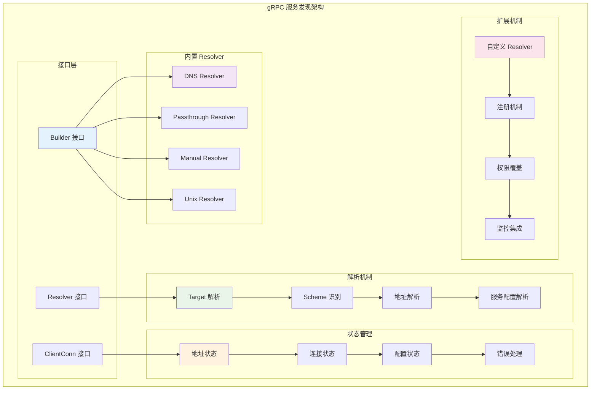
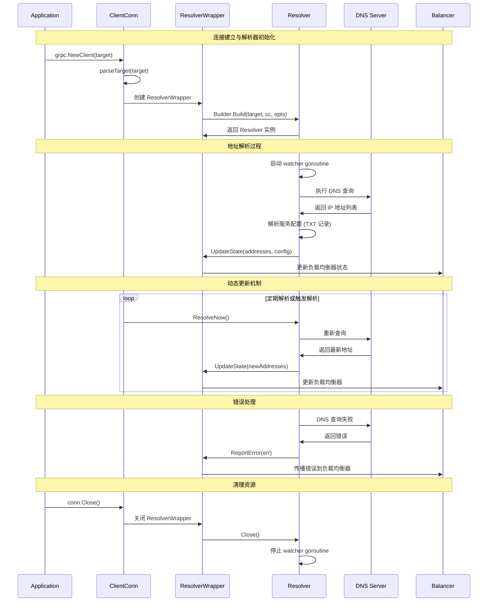
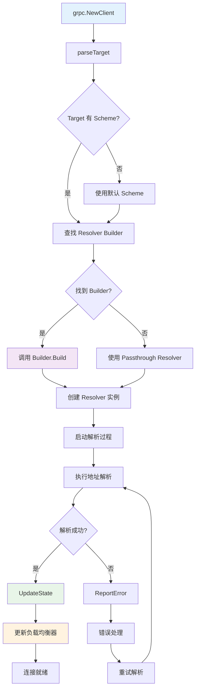

# gRPC-Go 服务发现模块深度剖析

## 目录

1. [服务发现模块架构](#服务发现模块架构)
2. [核心接口与抽象](#核心接口与抽象)
3. [DNS Resolver 实现](#dns-resolver-实现)
4. [自定义 Resolver 开发](#自定义-resolver-开发)
5. [配置管理与服务配置](#配置管理与服务配置)
6. [地址解析流程](#地址解析流程)
7. [关键结构体关系](#关键结构体关系)
8. [实战经验总结](#实战经验总结)

## 服务发现模块架构

### 整体架构图



### 服务发现工作流程



## 核心接口与抽象

### 1. Builder 接口定义

```go
// 位置：resolver/resolver.go
type Builder interface {
    // Build 创建一个新的 resolver 用于给定的目标
    // gRPC dial 同步调用 Build，如果返回的错误不为 nil，则 dial 失败
    Build(target Target, cc ClientConn, opts BuildOptions) (Resolver, error)
    
    // Scheme 返回此 resolver 支持的 scheme
    // Scheme 定义在 https://github.com/grpc/grpc/blob/master/doc/naming.md
    // 返回的字符串不应包含大写字符，因为它们不会匹配
    // RFC 3986 中定义的解析目标的 scheme
    Scheme() string
}

// BuildOptions 包含 builder 创建 resolver 的附加信息
type BuildOptions struct {
    // DisableServiceConfig 指示 resolver 实现是否应该获取服务配置数据
    DisableServiceConfig bool
    
    // DialCreds 是 ClientConn 用于与目标 gRPC 服务通信的传输凭据
    DialCreds credentials.TransportCredentials
    
    // CredsBundle 是 ClientConn 用于与目标 gRPC 服务通信的凭据包
    CredsBundle credentials.Bundle
    
    // Dialer 是 ClientConn 用于拨号的拨号器
    Dialer func(context.Context, string) (net.Conn, error)
    
    // MetricsRecorder 是用于记录的指标记录器
    MetricsRecorder stats.MetricsRecorder
}
```

### 2. Resolver 接口定义

```go
// 位置：resolver/resolver.go
type Resolver interface {
    // ResolveNow 将被 gRPC 调用以尝试再次解析目标名称
    // 这只是一个提示，resolver 可以忽略这个调用如果不必要
    // 它可能被并发多次调用
    ResolveNow(ResolveNowOptions)
    
    // Close 关闭 resolver
    Close()
}

// ResolveNowOptions 包含 ResolveNow 的附加信息
type ResolveNowOptions struct{}
```

### 3. ClientConn 接口定义

```go
// 位置：resolver/resolver.go
type ClientConn interface {
    // UpdateState 适当地更新 ClientConn 的状态
    // 如果返回错误，resolver 应该尝试再次解析目标
    // resolver 应该使用退避计时器来防止用请求过载服务器
    UpdateState(State) error
    
    // ReportError 通知 ClientConn resolver 遇到了错误
    // ClientConn 然后将此错误转发给负载均衡策略
    ReportError(error)
    
    // NewAddress 被 resolver 调用以通知 ClientConn 新的已解析地址列表
    // 地址列表应该是已解析地址的完整列表
    // Deprecated: 使用 UpdateState 代替
    NewAddress(addresses []Address)
    
    // ParseServiceConfig 解析提供的服务配置并返回提供解析配置的对象
    ParseServiceConfig(serviceConfigJSON string) *serviceconfig.ParseResult
}
```

### 4. Target 和 Address 结构体

```go
// 位置：resolver/resolver.go
type Target struct {
    // URL 包含解析的拨号目标，如果原始拨号目标不包含 scheme
    // 或包含未注册的 scheme，则添加可选的默认 scheme
    URL url.URL
}

// Endpoint 检索端点，从 URL.Path 或 URL.Opaque 中去除前导 "/"
func (t Target) Endpoint() string {
    endpoint := t.URL.Path
    if endpoint == "" {
        endpoint = t.URL.Opaque
    }
    return strings.TrimPrefix(endpoint, "/")
}

// String 返回 Target 的规范字符串表示
func (t Target) String() string {
    return t.URL.Scheme + "://" + t.URL.Host + "/" + t.Endpoint()
}

// Address 表示客户端连接到的服务器
type Address struct {
    // Addr 是将建立连接的服务器地址
    Addr string
    
    // ServerName 是此地址的名称
    // 如果非空，ServerName 用作地址的传输认证机构，
    // 而不是来自 Dial 目标字符串的主机名
    ServerName string
    
    // Attributes 包含关于此地址的任意数据，供 SubConn 使用
    Attributes *attributes.Attributes
    
    // BalancerAttributes 包含关于此地址的任意数据，供 LB 策略使用
    // Deprecated: 当 Address 在 Endpoint 内部时，不应使用此字段
    BalancerAttributes *attributes.Attributes
    
    // Metadata 是与 Addr 关联的信息，可用于做负载均衡决策
    // Deprecated: 使用 Attributes 代替
    Metadata any
}

// State 包含与 ClientConn 相关的当前 Resolver 状态
type State struct {
    // Addresses 是目标的最新已解析地址集
    Addresses []Address
    
    // Endpoints 是目标的最新已解析端点集
    Endpoints []Endpoint
    
    // ServiceConfig 包含解析最新服务配置的结果
    ServiceConfig *serviceconfig.ParseResult
    
    // Attributes 包含关于 resolver 的任意数据，供负载均衡策略使用
    Attributes *attributes.Attributes
}
```

## DNS Resolver 实现

### 1. DNS Builder 实现

```go
// 位置：internal/resolver/dns/dns_resolver.go
type dnsBuilder struct{}

// Build 创建并启动一个 DNS resolver，监视目标的名称解析
func (b *dnsBuilder) Build(target resolver.Target, cc resolver.ClientConn, opts resolver.BuildOptions) (resolver.Resolver, error) {
    host, port, err := parseTarget(target.Endpoint(), defaultPort)
    if err != nil {
        return nil, err
    }

    // IP 地址直接返回
    if ipAddr, err := formatIP(host); err == nil {
        addr := []resolver.Address{{Addr: ipAddr + ":" + port}}
        cc.UpdateState(resolver.State{Addresses: addr})
        return deadResolver{}, nil
    }

    // DNS 地址（非 IP）
    ctx, cancel := context.WithCancel(context.Background())
    d := &dnsResolver{
        host:                host,
        port:                port,
        ctx:                 ctx,
        cancel:              cancel,
        cc:                  cc,
        rn:                  make(chan struct{}, 1),
        enableServiceConfig: envconfig.EnableTXTServiceConfig && !opts.DisableServiceConfig,
    }

    d.resolver, err = internal.NewNetResolver(target.URL.Host)
    if err != nil {
        return nil, err
    }

    d.wg.Add(1)
    go d.watcher()
    return d, nil
}

// Scheme 返回此 resolver builder 的命名方案，即 "dns"
func (b *dnsBuilder) Scheme() string {
    return "dns"
}
```

### 2. DNS Resolver 核心实现

```go
// 位置：internal/resolver/dns/dns_resolver.go
type dnsResolver struct {
    host     string
    port     string
    resolver internal.NetResolver
    ctx      context.Context
    cancel   context.CancelFunc
    cc       resolver.ClientConn
    // rn 通道被 ResolveNow() 用来强制立即解析目标
    rn chan struct{}
    // wg 用于强制 Close() 在 watcher() goroutine 完成后返回
    wg                  sync.WaitGroup
    enableServiceConfig bool
}

// ResolveNow 调用目标的立即解析
func (d *dnsResolver) ResolveNow(resolver.ResolveNowOptions) {
    select {
    case d.rn <- struct{}{}:
    default:
    }
}

// Close 关闭 dnsResolver
func (d *dnsResolver) Close() {
    d.cancel()
    d.wg.Wait()
}

// watcher 是 DNS resolver 的主要工作循环
func (d *dnsResolver) watcher() {
    defer d.wg.Done()
    backoffIndex := 1
    for {
        state, err := d.lookup()
        if err != nil {
            // 向底层 grpc.ClientConn 报告错误
            d.cc.ReportError(err)
        } else {
            err = d.cc.UpdateState(*state)
        }

        var nextResolutionTime time.Time
        if err == nil {
            // 成功解析，等待下一个 ResolveNow
            // 但是，至少等待 30 秒以防止不断重新解析
            backoffIndex = 1
            nextResolutionTime = internal.TimeNowFunc().Add(MinResolutionInterval)
            select {
            case <-d.ctx.Done():
                return
            case <-d.rn:
            }
        } else {
            // 在 DNS Resolver 中发现错误或从 ClientConn 收到错误时轮询
            nextResolutionTime = internal.TimeNowFunc().Add(backoff.DefaultExponential.Backoff(backoffIndex))
            backoffIndex++
        }
        select {
        case <-d.ctx.Done():
            return
        case <-internal.TimeAfterFunc(internal.TimeUntilFunc(nextResolutionTime)):
        }
    }
}
```

### 3. DNS 查询实现

```go
// 位置：internal/resolver/dns/dns_resolver.go
// lookup 执行实际的 DNS 查询
func (d *dnsResolver) lookup() (*resolver.State, error) {
    ctx, cancel := context.WithTimeout(d.ctx, ResolvingTimeout)
    defer cancel()
    srv, srvErr := d.lookupSRV(ctx)
    addrs, hostErr := d.lookupHost(ctx)
    if hostErr != nil && (srvErr != nil || len(srv) == 0) {
        return nil, hostErr
    }

    state := resolver.State{Addresses: addrs}
    if len(srv) > 0 {
        state = grpclbstate.Set(state, &grpclbstate.State{BalancerAddresses: srv})
    }
    if d.enableServiceConfig {
        state.ServiceConfig = d.lookupTXT(ctx)
    }
    return &state, nil
}

// lookupHost 查询 A/AAAA 记录
func (d *dnsResolver) lookupHost(ctx context.Context) ([]resolver.Address, error) {
    addrs, err := d.resolver.LookupHost(ctx, d.host)
    if err != nil {
        err = handleDNSError(err, "A")
        return nil, err
    }
    newAddrs := make([]resolver.Address, 0, len(addrs))
    for _, a := range addrs {
        ip, err := formatIP(a)
        if err != nil {
            return nil, fmt.Errorf("dns: error parsing A record IP address %v: %v", a, err)
        }
        addr := ip + ":" + d.port
        newAddrs = append(newAddrs, resolver.Address{Addr: addr})
    }
    return newAddrs, nil
}

// lookupSRV 查询 SRV 记录用于 gRPCLB
func (d *dnsResolver) lookupSRV(ctx context.Context) ([]resolver.Address, error) {
    if !EnableSRVLookups || d.host == "metadata.google.internal." {
        return nil, nil
    }
    var newAddrs []resolver.Address
    _, srvs, err := d.resolver.LookupSRV(ctx, "grpclb", "tcp", d.host)
    if err != nil {
        err = handleDNSError(err, "SRV")
        return nil, err
    }
    for _, s := range srvs {
        lbAddrs, err := d.resolver.LookupHost(ctx, s.Target)
        if err != nil {
            err = handleDNSError(err, "A")
            if err == nil {
                continue
            }
            return nil, err
        }
        for _, a := range lbAddrs {
            ip, err := formatIP(a)
            if err != nil {
                return nil, fmt.Errorf("dns: error parsing A record IP address %v: %v", a, err)
            }
            addr := ip + ":" + strconv.Itoa(int(s.Port))
            newAddrs = append(newAddrs, resolver.Address{Addr: addr, ServerName: s.Target})
        }
    }
    return newAddrs, nil
}

// lookupTXT 查询 TXT 记录获取服务配置
func (d *dnsResolver) lookupTXT(ctx context.Context) *serviceconfig.ParseResult {
    ss, err := d.resolver.LookupTXT(ctx, txtPrefix+d.host)
    if err != nil {
        if envconfig.TXTErrIgnore {
            return nil
        }
        if err = handleDNSError(err, "TXT"); err != nil {
            return &serviceconfig.ParseResult{Err: err}
        }
        return nil
    }
    var res string
    for _, s := range ss {
        res += s
    }

    // TXT 记录必须有 "grpc_config=" 属性才能用作服务配置
    if !strings.HasPrefix(res, txtAttribute) {
        logger.Warningf("dns: TXT record %v missing %v attribute", res, txtAttribute)
        return nil
    }
    sc := canaryingSC(strings.TrimPrefix(res, txtAttribute))
    return d.cc.ParseServiceConfig(sc)
}
```

### 4. DNS 配置选项

```go
// 位置：resolver/dns/dns_resolver.go
// SetResolvingTimeout 设置 DNS 解析请求的最大持续时间
func SetResolvingTimeout(timeout time.Duration) {
    dns.ResolvingTimeout = timeout
}

// SetMinResolutionInterval 设置允许 DNS 重新解析的默认最小间隔
func SetMinResolutionInterval(interval time.Duration) {
    dns.MinResolutionInterval = interval
}

// 位置：internal/resolver/dns/dns_resolver.go
var (
    // EnableSRVLookups 控制 DNS resolver 是否尝试从 SRV 记录获取 gRPCLB 地址
    EnableSRVLookups = false

    // MinResolutionInterval 是允许重新解析的最小间隔
    MinResolutionInterval = 30 * time.Second

    // ResolvingTimeout 指定 DNS 解析请求的最大持续时间
    ResolvingTimeout = 30 * time.Second
)
```

## 自定义 Resolver 开发

### 1. 实现自定义 Resolver

```go
// 自定义 Resolver：基于配置文件的服务发现
type configFileResolver struct {
    target     resolver.Target
    cc         resolver.ClientConn
    configFile string
    ctx        context.Context
    cancel     context.CancelFunc
    wg         sync.WaitGroup
    lastMod    time.Time
}

type configFileBuilder struct{}

// Build 创建配置文件 resolver
func (b *configFileBuilder) Build(target resolver.Target, cc resolver.ClientConn, opts resolver.BuildOptions) (resolver.Resolver, error) {
    configFile := target.Endpoint()
    if configFile == "" {
        return nil, fmt.Errorf("config file path is required")
    }
    
    ctx, cancel := context.WithCancel(context.Background())
    r := &configFileResolver{
        target:     target,
        cc:         cc,
        configFile: configFile,
        ctx:        ctx,
        cancel:     cancel,
    }
    
    // 初始加载配置
    if err := r.loadConfig(); err != nil {
        cancel()
        return nil, err
    }
    
    // 启动配置文件监控
    r.wg.Add(1)
    go r.watchConfig()
    
    return r, nil
}

func (b *configFileBuilder) Scheme() string {
    return "config"
}

// 注册自定义 resolver
func init() {
    resolver.Register(&configFileBuilder{})
}

// ResolveNow 强制重新加载配置
func (r *configFileResolver) ResolveNow(resolver.ResolveNowOptions) {
    r.loadConfig()
}

// Close 关闭 resolver
func (r *configFileResolver) Close() {
    r.cancel()
    r.wg.Wait()
}

// loadConfig 加载配置文件
func (r *configFileResolver) loadConfig() error {
    data, err := os.ReadFile(r.configFile)
    if err != nil {
        r.cc.ReportError(fmt.Errorf("failed to read config file: %v", err))
        return err
    }
    
    var config struct {
        Addresses []string `json:"addresses"`
        ServiceConfig json.RawMessage `json:"serviceConfig,omitempty"`
    }
    
    if err := json.Unmarshal(data, &config); err != nil {
        r.cc.ReportError(fmt.Errorf("failed to parse config file: %v", err))
        return err
    }
    
    // 转换为 resolver.Address
    var addresses []resolver.Address
    for _, addr := range config.Addresses {
        addresses = append(addresses, resolver.Address{Addr: addr})
    }
    
    state := resolver.State{Addresses: addresses}
    
    // 解析服务配置
    if len(config.ServiceConfig) > 0 {
        state.ServiceConfig = r.cc.ParseServiceConfig(string(config.ServiceConfig))
    }
    
    return r.cc.UpdateState(state)
}

// watchConfig 监控配置文件变化
func (r *configFileResolver) watchConfig() {
    defer r.wg.Done()
    ticker := time.NewTicker(5 * time.Second)
    defer ticker.Stop()
    
    for {
        select {
        case <-r.ctx.Done():
            return
        case <-ticker.C:
            stat, err := os.Stat(r.configFile)
            if err != nil {
                r.cc.ReportError(fmt.Errorf("failed to stat config file: %v", err))
                continue
            }
            
            if stat.ModTime().After(r.lastMod) {
                r.lastMod = stat.ModTime()
                r.loadConfig()
            }
        }
    }
}
```

### 2. 基于服务注册中心的 Resolver

```go
// 基于 Consul 的服务发现 Resolver
type consulResolver struct {
    target      resolver.Target
    cc          resolver.ClientConn
    consulClient *consul.Client
    serviceName string
    ctx         context.Context
    cancel      context.CancelFunc
    wg          sync.WaitGroup
    lastIndex   uint64
}

type consulBuilder struct {
    consulAddr string
}

func NewConsulBuilder(consulAddr string) resolver.Builder {
    return &consulBuilder{consulAddr: consulAddr}
}

func (b *consulBuilder) Build(target resolver.Target, cc resolver.ClientConn, opts resolver.BuildOptions) (resolver.Resolver, error) {
    config := consul.DefaultConfig()
    if b.consulAddr != "" {
        config.Address = b.consulAddr
    }
    
    client, err := consul.NewClient(config)
    if err != nil {
        return nil, fmt.Errorf("failed to create consul client: %v", err)
    }
    
    ctx, cancel := context.WithCancel(context.Background())
    r := &consulResolver{
        target:       target,
        cc:           cc,
        consulClient: client,
        serviceName:  target.Endpoint(),
        ctx:          ctx,
        cancel:       cancel,
    }
    
    // 初始服务发现
    if err := r.resolve(); err != nil {
        cancel()
        return nil, err
    }
    
    // 启动监控
    r.wg.Add(1)
    go r.watcher()
    
    return r, nil
}

func (b *consulBuilder) Scheme() string {
    return "consul"
}

func (r *consulResolver) ResolveNow(resolver.ResolveNowOptions) {
    r.resolve()
}

func (r *consulResolver) Close() {
    r.cancel()
    r.wg.Wait()
}

// resolve 从 Consul 解析服务实例
func (r *consulResolver) resolve() error {
    services, meta, err := r.consulClient.Health().Service(
        r.serviceName, 
        "", 
        true, // 只返回健康的实例
        &consul.QueryOptions{
            WaitIndex: r.lastIndex,
            WaitTime:  30 * time.Second,
        },
    )
    if err != nil {
        r.cc.ReportError(fmt.Errorf("consul query failed: %v", err))
        return err
    }
    
    r.lastIndex = meta.LastIndex
    
    var addresses []resolver.Address
    for _, service := range services {
        addr := fmt.Sprintf("%s:%d", service.Service.Address, service.Service.Port)
        addresses = append(addresses, resolver.Address{
            Addr: addr,
            Attributes: attributes.New("consul.service.id", service.Service.ID),
        })
    }
    
    return r.cc.UpdateState(resolver.State{Addresses: addresses})
}

// watcher 监控服务变化
func (r *consulResolver) watcher() {
    defer r.wg.Done()
    for {
        select {
        case <-r.ctx.Done():
            return
        default:
            r.resolve()
        }
    }
}

// 注册 Consul resolver
func init() {
    resolver.Register(NewConsulBuilder(""))
}
```

### 3. Manual Resolver 实现

```go
// 位置：resolver/manual/manual.go
// Resolver 既是 builder 也是 resolver
type Resolver struct {
    // BuildCallback 在调用 Build 方法时被调用
    BuildCallback func(resolver.Target, resolver.ClientConn, resolver.BuildOptions)
    
    // UpdateStateCallback 在 resolver 上调用 UpdateState 方法时被调用
    UpdateStateCallback func(err error)
    
    // ResolveNowCallback 在 resolver 上调用 ResolveNow 方法时被调用
    ResolveNowCallback func(resolver.ResolveNowOptions)
    
    // CloseCallback 在调用 Close 方法时被调用
    CloseCallback func()
    
    scheme string

    // 属于 resolver 的字段
    mu sync.Mutex
    cc resolver.ClientConn
    // 存储最近的状态更新使此 resolver 对重启具有弹性
    lastSeenState *resolver.State
}

// NewBuilderWithScheme 创建具有给定 scheme 的新手动 resolver builder
func NewBuilderWithScheme(scheme string) *Resolver {
    return &Resolver{
        BuildCallback:       func(resolver.Target, resolver.ClientConn, resolver.BuildOptions) {},
        UpdateStateCallback: func(error) {},
        ResolveNowCallback:  func(resolver.ResolveNowOptions) {},
        CloseCallback:       func() {},
        scheme:              scheme,
    }
}

// InitialState 向 resolver 添加初始状态，这样在 Dial 后不需要显式调用 UpdateState
func (r *Resolver) InitialState(s resolver.State) {
    r.lastSeenState = &s
}

// Build 为 Resolver 返回自身，因为它既是 builder 也是 resolver
func (r *Resolver) Build(target resolver.Target, cc resolver.ClientConn, opts resolver.BuildOptions) (resolver.Resolver, error) {
    r.mu.Lock()
    defer r.mu.Unlock()
    // 在锁定后调用 BuildCallback 以避免在 Build 返回之前调用 UpdateState 或 CC 时的竞争
    r.BuildCallback(target, cc, opts)
    r.cc = cc
    if r.lastSeenState != nil {
        err := r.cc.UpdateState(*r.lastSeenState)
        go r.UpdateStateCallback(err)
    }
    return r, nil
}

// UpdateState 更新 resolver 的状态
func (r *Resolver) UpdateState(s resolver.State) {
    r.mu.Lock()
    defer r.mu.Unlock()
    r.lastSeenState = &s
    if r.cc != nil {
        err := r.cc.UpdateState(s)
        go r.UpdateStateCallback(err)
    }
}

// ResolveNow 是 Resolver 接口的实现
func (r *Resolver) ResolveNow(o resolver.ResolveNowOptions) {
    r.ResolveNowCallback(o)
}

// Close 是 Resolver 接口的实现
func (r *Resolver) Close() {
    r.CloseCallback()
}

// Scheme 返回手动 resolver 的 scheme
func (r *Resolver) Scheme() string {
    return r.scheme
}
```

## 配置管理与服务配置

### 1. 服务配置解析

```go
// 服务配置示例
const serviceConfigJSON = `{
    "loadBalancingConfig": [{"round_robin": {}}],
    "methodConfig": [{
        "name": [{"service": "example.Service"}],
        "waitForReady": true,
        "timeout": "10s",
        "maxRequestMessageBytes": 1024,
        "maxResponseMessageBytes": 1024
    }]
}`

// 在 resolver 中解析服务配置
func (r *customResolver) updateServiceConfig() {
    parseResult := r.cc.ParseServiceConfig(serviceConfigJSON)
    if parseResult.Err != nil {
        r.cc.ReportError(fmt.Errorf("failed to parse service config: %v", parseResult.Err))
        return
    }
    
    state := resolver.State{
        Addresses:     r.addresses,
        ServiceConfig: parseResult,
    }
    
    r.cc.UpdateState(state)
}
```

### 2. 动态配置更新

```go
// 动态配置管理器
type ConfigManager struct {
    resolvers map[string]*dynamicResolver
    mu        sync.RWMutex
}

type dynamicResolver struct {
    resolver.Resolver
    configSource ConfigSource
    lastConfig   *Config
}

type ConfigSource interface {
    GetConfig(serviceName string) (*Config, error)
    WatchConfig(serviceName string, callback func(*Config))
}

type Config struct {
    Addresses     []string               `json:"addresses"`
    ServiceConfig map[string]interface{} `json:"serviceConfig"`
    Metadata      map[string]string      `json:"metadata"`
    Version       string                 `json:"version"`
}

func (cm *ConfigManager) CreateResolver(serviceName string, source ConfigSource) resolver.Builder {
    return &dynamicBuilder{
        serviceName:   serviceName,
        configSource:  source,
        configManager: cm,
    }
}

type dynamicBuilder struct {
    serviceName   string
    configSource  ConfigSource
    configManager *ConfigManager
}

func (b *dynamicBuilder) Build(target resolver.Target, cc resolver.ClientConn, opts resolver.BuildOptions) (resolver.Resolver, error) {
    r := &dynamicResolver{
        configSource: b.configSource,
    }
    
    // 初始配置加载
    config, err := b.configSource.GetConfig(b.serviceName)
    if err != nil {
        return nil, err
    }
    
    if err := r.applyConfig(config, cc); err != nil {
        return nil, err
    }
    
    // 监控配置变化
    b.configSource.WatchConfig(b.serviceName, func(newConfig *Config) {
        if newConfig.Version != r.lastConfig.Version {
            r.applyConfig(newConfig, cc)
        }
    })
    
    b.configManager.mu.Lock()
    b.configManager.resolvers[b.serviceName] = r
    b.configManager.mu.Unlock()
    
    return r, nil
}

func (b *dynamicBuilder) Scheme() string {
    return "dynamic"
}

func (r *dynamicResolver) applyConfig(config *Config, cc resolver.ClientConn) error {
    var addresses []resolver.Address
    for _, addr := range config.Addresses {
        addresses = append(addresses, resolver.Address{Addr: addr})
    }
    
    state := resolver.State{Addresses: addresses}
    
    // 应用服务配置
    if config.ServiceConfig != nil {
        configJSON, _ := json.Marshal(config.ServiceConfig)
        state.ServiceConfig = cc.ParseServiceConfig(string(configJSON))
    }
    
    r.lastConfig = config
    return cc.UpdateState(state)
}
```

## 地址解析流程

### 地址解析详细流程图



### Target 解析机制

```go
// 位置：clientconn.go (简化版本)
func parseTarget(target string) (resolver.Target, error) {
    // 解析 URL
    u, err := url.Parse(target)
    if err != nil {
        return resolver.Target{}, err
    }
    
    // 如果没有 scheme，使用默认 scheme
    if u.Scheme == "" {
        u.Scheme = resolver.GetDefaultScheme()
        // 重新解析
        u, err = url.Parse(u.Scheme + ":///" + target)
        if err != nil {
            return resolver.Target{}, err
        }
    }
    
    return resolver.Target{URL: *u}, nil
}

// Resolver 注册和获取
func getResolver(scheme string) resolver.Builder {
    if builder := resolver.Get(scheme); builder != nil {
        return builder
    }
    
    // 如果找不到，使用 passthrough resolver
    return passthroughBuilder{}
}

// Passthrough Resolver 实现
type passthroughBuilder struct{}

func (passthroughBuilder) Build(target resolver.Target, cc resolver.ClientConn, opts resolver.BuildOptions) (resolver.Resolver, error) {
    addr := resolver.Address{Addr: target.Endpoint()}
    cc.UpdateState(resolver.State{Addresses: []resolver.Address{addr}})
    return passthroughResolver{}, nil
}

func (passthroughBuilder) Scheme() string {
    return "passthrough"
}

type passthroughResolver struct{}

func (passthroughResolver) ResolveNow(resolver.ResolveNowOptions) {}
func (passthroughResolver) Close()                               {}
```

## 关键结构体关系

### 类图关系

```mermaid
classDiagram
    class Builder {
        <<interface>>
        +Build(Target, ClientConn, BuildOptions) (Resolver, error)
        +Scheme() string
    }
    
    class Resolver {
        <<interface>>
        +ResolveNow(ResolveNowOptions)
        +Close()
    }
    
    class ClientConn {
        <<interface>>
        +UpdateState(State) error
        +ReportError(error)
        +ParseServiceConfig(string) *ParseResult
    }
    
    class dnsBuilder {
        +Build(target Target, cc ClientConn, opts BuildOptions) (Resolver, error)
        +Scheme() string
    }
    
    class dnsResolver {
        +host string
        +port string
        +resolver NetResolver
        +ctx context.Context
        +cancel context.CancelFunc
        +cc ClientConn
        +rn chan struct{}
        +wg sync.WaitGroup
        +enableServiceConfig bool
        
        +ResolveNow(ResolveNowOptions)
        +Close()
        +watcher()
        +lookup() (*State, error)
        +lookupHost(ctx) ([]Address, error)
        +lookupSRV(ctx) ([]Address, error)
        +lookupTXT(ctx) *ParseResult
    }
    
    class manualResolver {
        +BuildCallback func(Target, ClientConn, BuildOptions)
        +UpdateStateCallback func(error)
        +ResolveNowCallback func(ResolveNowOptions)
        +CloseCallback func()
        +scheme string
        +mu sync.Mutex
        +cc ClientConn
        +lastSeenState *State
        
        +Build(Target, ClientConn, BuildOptions) (Resolver, error)
        +Scheme() string
        +InitialState(State)
        +UpdateState(State)
        +ResolveNow(ResolveNowOptions)
        +Close()
    }
    
    class Target {
        +URL url.URL
        
        +Endpoint() string
        +String() string
    }
    
    class Address {
        +Addr string
        +ServerName string
        +Attributes *Attributes
        +BalancerAttributes *Attributes
        +Metadata any
        
        +Equal(Address) bool
        +String() string
    }
    
    class State {
        +Addresses []Address
        +Endpoints []Endpoint
        +ServiceConfig *ParseResult
        +Attributes *Attributes
    }
    
    Builder <|.. dnsBuilder : implements
    Builder <|.. manualResolver : implements
    Resolver <|.. dnsResolver : implements
    Resolver <|.. manualResolver : implements
    dnsBuilder --> dnsResolver : creates
    manualResolver --> manualResolver : is both builder and resolver
    dnsResolver --> ClientConn : uses
    manualResolver --> ClientConn : uses
    ClientConn --> State : updates with
    State --> Address : contains
    Builder --> Target : receives
```

## 实战经验总结

### 1. DNS Resolver 优化配置

**DNS 解析超时配置**：
```go
import "google.golang.org/grpc/resolver/dns"

func init() {
    // 设置 DNS 解析超时
    dns.SetResolvingTimeout(10 * time.Second)
    
    // 设置最小解析间隔
    dns.SetMinResolutionInterval(10 * time.Second)
}

// 生产环境推荐配置
const productionDNSConfig = `{
    "loadBalancingConfig": [{"round_robin": {}}],
    "methodConfig": [{
        "name": [{}],
        "retryPolicy": {
            "maxAttempts": 3,
            "initialBackoff": "0.1s",
            "maxBackoff": "1s",
            "backoffMultiplier": 2.0,
            "retryableStatusCodes": ["UNAVAILABLE", "DEADLINE_EXCEEDED"]
        }
    }]
}`
```

**DNS 缓存优化**：
```go
// 自定义 DNS resolver 配置
func configureDNSResolver() {
    // 启用 SRV 记录查询
    dns.EnableSRVLookups = true
    
    // 配置自定义 DNS 服务器
    resolver.Register(&customDNSBuilder{
        dnsServers: []string{"8.8.8.8:53", "8.8.4.4:53"},
        timeout:    5 * time.Second,
    })
}

type customDNSBuilder struct {
    dnsServers []string
    timeout    time.Duration
}

func (b *customDNSBuilder) Build(target resolver.Target, cc resolver.ClientConn, opts resolver.BuildOptions) (resolver.Resolver, error) {
    // 使用自定义 DNS 服务器
    netResolver := &net.Resolver{
        PreferGo: true,
        Dial: func(ctx context.Context, network, address string) (net.Conn, error) {
            d := net.Dialer{Timeout: b.timeout}
            // 轮询使用 DNS 服务器
            server := b.dnsServers[rand.Intn(len(b.dnsServers))]
            return d.DialContext(ctx, network, server)
        },
    }
    
    return &customDNSResolver{
        target:   target,
        cc:       cc,
        resolver: netResolver,
    }, nil
}
```

### 2. 自定义 Resolver 最佳实践

**线程安全设计**：
```go
type safeResolver struct {
    mu          sync.RWMutex
    target      resolver.Target
    cc          resolver.ClientConn
    addresses   []resolver.Address
    lastUpdate  time.Time
    ctx         context.Context
    cancel      context.CancelFunc
    wg          sync.WaitGroup
}

func (r *safeResolver) updateAddresses(newAddresses []resolver.Address) {
    r.mu.Lock()
    defer r.mu.Unlock()
    
    // 检查地址是否有变化
    if r.addressesEqual(r.addresses, newAddresses) {
        return
    }
    
    r.addresses = newAddresses
    r.lastUpdate = time.Now()
    
    state := resolver.State{Addresses: newAddresses}
    r.cc.UpdateState(state)
}

func (r *safeResolver) addressesEqual(a, b []resolver.Address) bool {
    if len(a) != len(b) {
        return false
    }
    for i := range a {
        if !a[i].Equal(b[i]) {
            return false
        }
    }
    return true
}
```

**错误处理和重试**：
```go
type resilientResolver struct {
    *safeResolver
    backoff    backoff.Strategy
    maxRetries int
    retryCount int
}

func (r *resilientResolver) resolveWithRetry() {
    for r.retryCount < r.maxRetries {
        if err := r.doResolve(); err == nil {
            r.retryCount = 0
            return
        }
        
        r.retryCount++
        delay := r.backoff.Backoff(r.retryCount)
        
        select {
        case <-r.ctx.Done():
            return
        case <-time.After(delay):
            continue
        }
    }
    
    // 达到最大重试次数，报告错误
    r.cc.ReportError(fmt.Errorf("resolver failed after %d retries", r.maxRetries))
}

func (r *resilientResolver) doResolve() error {
    // 实际的解析逻辑
    addresses, err := r.fetchAddresses()
    if err != nil {
        return err
    }
    
    r.updateAddresses(addresses)
    return nil
}
```

### 3. 服务配置管理

**动态服务配置**：
```go
type ConfigurableResolver struct {
    *safeResolver
    configProvider ConfigProvider
    currentConfig  *ServiceConfig
}

type ConfigProvider interface {
    GetServiceConfig(serviceName string) (*ServiceConfig, error)
    WatchServiceConfig(serviceName string, callback func(*ServiceConfig))
}

type ServiceConfig struct {
    LoadBalancing string                   `json:"loadBalancing"`
    MethodConfig  []MethodConfig          `json:"methodConfig"`
    RetryPolicy   *RetryPolicy            `json:"retryPolicy"`
    Timeout       time.Duration           `json:"timeout"`
    Metadata      map[string]interface{}  `json:"metadata"`
}

func (r *ConfigurableResolver) updateServiceConfig(config *ServiceConfig) {
    r.mu.Lock()
    defer r.mu.Unlock()
    
    if r.configEqual(r.currentConfig, config) {
        return
    }
    
    r.currentConfig = config
    
    // 转换为 gRPC 服务配置 JSON
    configJSON, err := json.Marshal(config)
    if err != nil {
        r.cc.ReportError(fmt.Errorf("failed to marshal service config: %v", err))
        return
    }
    
    parseResult := r.cc.ParseServiceConfig(string(configJSON))
    if parseResult.Err != nil {
        r.cc.ReportError(fmt.Errorf("failed to parse service config: %v", parseResult.Err))
        return
    }
    
    state := resolver.State{
        Addresses:     r.addresses,
        ServiceConfig: parseResult,
    }
    
    r.cc.UpdateState(state)
}
```

### 4. 监控和调试

**Resolver 监控**：
```go
type MonitoredResolver struct {
    resolver.Resolver
    metrics *ResolverMetrics
    logger  *log.Logger
}

type ResolverMetrics struct {
    resolveCount    prometheus.Counter
    resolveLatency  prometheus.Histogram
    resolveErrors   prometheus.Counter
    addressCount    prometheus.Gauge
    configUpdates   prometheus.Counter
}

func (r *MonitoredResolver) ResolveNow(opts resolver.ResolveNowOptions) {
    start := time.Now()
    defer func() {
        r.metrics.resolveLatency.Observe(time.Since(start).Seconds())
        r.metrics.resolveCount.Inc()
    }()
    
    r.logger.Printf("ResolveNow called for target: %s", r.target.String())
    r.Resolver.ResolveNow(opts)
}

func (r *MonitoredResolver) UpdateState(state resolver.State) error {
    r.metrics.addressCount.Set(float64(len(state.Addresses)))
    if state.ServiceConfig != nil {
        r.metrics.configUpdates.Inc()
    }
    
    r.logger.Printf("UpdateState called with %d addresses", len(state.Addresses))
    return r.cc.UpdateState(state)
}

func (r *MonitoredResolver) ReportError(err error) {
    r.metrics.resolveErrors.Inc()
    r.logger.Printf("ReportError called: %v", err)
    r.cc.ReportError(err)
}
```

### 5. 性能优化

**地址缓存和去重**：
```go
type CachedResolver struct {
    *safeResolver
    addressCache map[string]resolver.Address
    cacheTimeout time.Duration
    lastCacheClean time.Time
}

func (r *CachedResolver) updateAddressesWithCache(newAddresses []resolver.Address) {
    r.mu.Lock()
    defer r.mu.Unlock()
    
    // 清理过期缓存
    if time.Since(r.lastCacheClean) > r.cacheTimeout {
        r.cleanCache()
    }
    
    // 去重和验证地址
    uniqueAddresses := r.deduplicateAddresses(newAddresses)
    
    if r.addressesEqual(r.addresses, uniqueAddresses) {
        return
    }
    
    r.addresses = uniqueAddresses
    r.updateCache(uniqueAddresses)
    
    state := resolver.State{Addresses: uniqueAddresses}
    r.cc.UpdateState(state)
}

func (r *CachedResolver) deduplicateAddresses(addresses []resolver.Address) []resolver.Address {
    seen := make(map[string]bool)
    var unique []resolver.Address
    
    for _, addr := range addresses {
        if !seen[addr.Addr] {
            seen[addr.Addr] = true
            unique = append(unique, addr)
        }
    }
    
    return unique
}

func (r *CachedResolver) cleanCache() {
    // 清理缓存逻辑
    r.addressCache = make(map[string]resolver.Address)
    r.lastCacheClean = time.Now()
}
```

### 6. 故障处理

**健康检查集成**：
```go
type HealthAwareResolver struct {
    *safeResolver
    healthChecker HealthChecker
    healthyAddrs  map[string]bool
}

type HealthChecker interface {
    CheckHealth(addr string) bool
    StartHealthCheck(addr string, callback func(string, bool))
    StopHealthCheck(addr string)
}

func (r *HealthAwareResolver) updateAddressesWithHealth(addresses []resolver.Address) {
    var healthyAddresses []resolver.Address
    
    for _, addr := range addresses {
        if r.healthChecker.CheckHealth(addr.Addr) {
            healthyAddresses = append(healthyAddresses, addr)
            
            // 启动健康检查
            r.healthChecker.StartHealthCheck(addr.Addr, func(address string, healthy bool) {
                r.onHealthChange(address, healthy)
            })
        }
    }
    
    r.updateAddresses(healthyAddresses)
}

func (r *HealthAwareResolver) onHealthChange(address string, healthy bool) {
    r.mu.Lock()
    defer r.mu.Unlock()
    
    r.healthyAddrs[address] = healthy
    
    // 重新构建健康地址列表
    var healthyAddresses []resolver.Address
    for _, addr := range r.addresses {
        if r.healthyAddrs[addr.Addr] {
            healthyAddresses = append(healthyAddresses, addr)
        }
    }
    
    state := resolver.State{Addresses: healthyAddresses}
    r.cc.UpdateState(state)
}
```

这个服务发现模块文档详细分析了 gRPC-Go 服务发现的核心架构、DNS resolver 实现、自定义 resolver 开发、配置管理等关键组件，并提供了丰富的实战经验和最佳实践。通过深入的源码分析和完整的示例代码，帮助开发者全面理解服务发现的工作原理和优化策略。
