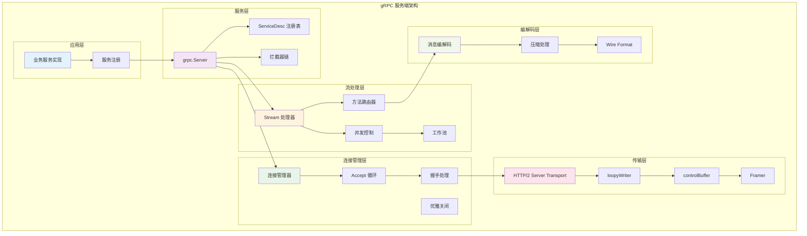
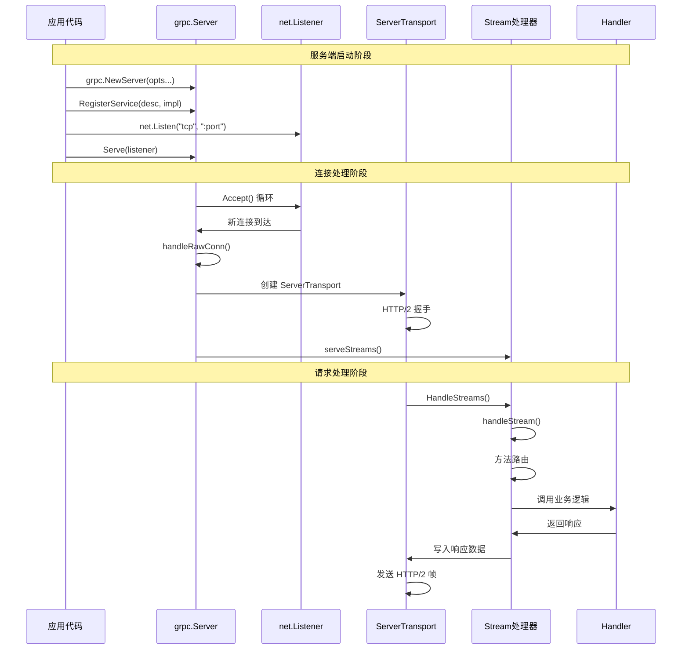

# gRPC-Go 服务端模块深度剖析

## 目录

1. [服务端模块架构](#服务端模块架构)
2. [核心 API 分析](#核心-api-分析)
3. [连接处理机制](#连接处理机制)
4. [流处理与方法路由](#流处理与方法路由)
5. [拦截器机制](#拦截器机制)
6. [并发控制与资源管理](#并发控制与资源管理)
7. [关键结构体关系](#关键结构体关系)
8. [实战经验总结](#实战经验总结)

## 服务端模块架构

### 整体架构图



### 核心组件时序图



## 核心 API 分析

### 1. grpc.NewServer - 服务器创建

**API 签名**：
```go
func NewServer(opt ...ServerOption) *Server
```

**入口函数实现**：
```go
// 位置：server.go:802
func NewServer(opt ...ServerOption) *Server {
    // 应用默认选项
    opts := defaultServerOptions
    for _, o := range globalServerOptions {
        o.apply(&opts)
    }
    for _, o := range opt {
        o.apply(&opts)
    }
    
    // 创建服务器实例
    s := &Server{
        lis:      make(map[net.Listener]bool),
        conns:    make(map[string]map[transport.ServerTransport]bool),
        services: make(map[string]*serviceInfo),
        quit:     grpcsync.NewEvent(),
        done:     grpcsync.NewEvent(),
        channelz: channelz.RegisterServer(""),
    }
    
    // 初始化条件变量用于优雅关闭
    s.cv = sync.NewCond(&s.mu)
    
    // 如果启用了服务器工作池，初始化工作池
    if s.opts.numServerWorkers > 0 {
        s.initServerWorkers()
    }
    
    return s
}

// 初始化服务器工作池
func (s *Server) initServerWorkers() {
    s.serverWorkerChannels = make([]chan *serverWorkerData, s.opts.numServerWorkers)
    for i := uint32(0); i < s.opts.numServerWorkers; i++ {
        s.serverWorkerChannels[i] = make(chan *serverWorkerData, runtime.GOMAXPROCS(0))
        go s.serverWorker(s.serverWorkerChannels[i])
    }
}

// 服务器工作协程
func (s *Server) serverWorker(ch chan *serverWorkerData) {
    for data := range ch {
        s.handleStream(data.st, data.stream)
        data.wg.Done()
    }
}
```

**Server 结构体定义**：
```go
// Server 是 gRPC 服务器
type Server struct {
    opts serverOptions
    
    mu       sync.Mutex // 保护以下字段
    lis      map[net.Listener]bool
    conns    map[string]map[transport.ServerTransport]bool
    serve    bool
    drain    bool
    cv       *sync.Cond // 用于等待连接关闭
    
    services map[string]*serviceInfo // 注册的服务
    events   trace.EventLog
    
    quit     *grpcsync.Event
    done     *grpcsync.Event
    channelz *channelz.Server
    
    // 服务器工作池相关
    serverWorkerChannels []chan *serverWorkerData
    serverWorkerChannel  chan *serverWorkerData
    
    // 统计信息
    czData *channelzData
    callsStarted         int64
    callsSucceeded       int64
    callsFailed          int64
    lastCallStartedTime  time.Time
}
```

### 2. Server.RegisterService - 服务注册

**API 签名**：
```go
func (s *Server) RegisterService(sd *ServiceDesc, ss any)
```

**实现分析**：
```go
// 位置：server.go:1060
func (s *Server) RegisterService(sd *ServiceDesc, ss any) {
    // 验证服务实现是否满足接口要求
    if ss != nil {
        ht := reflect.TypeOf(sd.HandlerType).Elem()
        st := reflect.TypeOf(ss)
        if !st.Implements(ht) {
            logger.Fatalf("grpc: Server.RegisterService found the handler of type %v that does not satisfy %v", st, ht)
        }
    }
    s.register(sd, ss)
}

// 内部注册函数
func (s *Server) register(sd *ServiceDesc, ss any) {
    s.mu.Lock()
    defer s.mu.Unlock()
    s.printf("RegisterService(%q)", sd.ServiceName)
    
    // 检查是否已经开始服务
    if s.serve {
        logger.Fatalf("grpc: Server.RegisterService after Server.Serve for %q", sd.ServiceName)
    }
    
    // 检查服务是否已注册
    if _, ok := s.services[sd.ServiceName]; ok {
        logger.Fatalf("grpc: Server.RegisterService found duplicate service registration for %q", sd.ServiceName)
    }
    
    // 创建服务信息
    info := &serviceInfo{
        serviceImpl: ss,
        methods:     make(map[string]*MethodDesc),
        streams:     make(map[string]*StreamDesc),
        mdata:       sd.Metadata,
    }
    
    // 注册一元方法
    for i := range sd.Methods {
        d := &sd.Methods[i]
        info.methods[d.MethodName] = d
    }
    
    // 注册流式方法
    for i := range sd.Streams {
        d := &sd.Streams[i]
        info.streams[d.StreamName] = d
    }
    
    s.services[sd.ServiceName] = info
}
```

**ServiceDesc 和相关结构**：
```go
// ServiceDesc 表示 gRPC 服务的描述
type ServiceDesc struct {
    ServiceName string        // 服务名称
    HandlerType any          // 处理器类型
    Methods     []MethodDesc // 一元方法列表
    Streams     []StreamDesc // 流式方法列表
    Metadata    any          // 元数据
}

// MethodDesc 表示一元方法的描述
type MethodDesc struct {
    MethodName string
    Handler    MethodHandler
}

// StreamDesc 表示流式方法的描述
type StreamDesc struct {
    StreamName    string
    Handler       StreamHandler
    ServerStreams bool // 服务端是否可以发送流
    ClientStreams bool // 客户端是否可以发送流
}

// serviceInfo 包含服务的运行时信息
type serviceInfo struct {
    serviceImpl any                    // 服务实现
    methods     map[string]*MethodDesc // 一元方法映射
    streams     map[string]*StreamDesc // 流式方法映射
    mdata       any                    // 元数据
}
```

### 3. Server.Serve - 开始服务

**API 签名**：
```go
func (s *Server) Serve(lis net.Listener) error
```

**实现分析**：
```go
// 位置：server.go:1123
func (s *Server) Serve(lis net.Listener) error {
    s.mu.Lock()
    s.printf("serving")
    s.serve = true
    if s.lis == nil {
        // 服务器已关闭
        s.mu.Unlock()
        lis.Close()
        return ErrServerStopped
    }
    
    s.addListener(lis)
    s.mu.Unlock()
    
    defer func() {
        s.mu.Lock()
        if s.lis != nil && s.lis[lis] {
            lis.Close()
            delete(s.lis, lis)
        }
        s.mu.Unlock()
    }()
    
    var tempDelay time.Duration // 指数退避延迟
    for {
        rawConn, err := lis.Accept()
        if err != nil {
            if ne, ok := err.(net.Error); ok && ne.Temporary() {
                // 临时错误，使用指数退避重试
                if tempDelay == 0 {
                    tempDelay = 5 * time.Millisecond
                } else {
                    tempDelay *= 2
                }
                if max := 1 * time.Second; tempDelay > max {
                    tempDelay = max
                }
                s.printf("Accept error: %v; retrying in %v", err, tempDelay)
                timer := time.NewTimer(tempDelay)
                select {
                case <-timer.C:
                case <-s.quit.Done():
                    timer.Stop()
                    return nil
                }
                continue
            }
            s.printf("done serving; Accept = %v", err)
            
            if s.quit.HasFired() {
                return nil
            }
            return err
        }
        tempDelay = 0
        s.serveWG.Add(1)
        go func() {
            s.handleRawConn(lis.Addr().String(), rawConn)
            s.serveWG.Done()
        }()
    }
}
```

## 连接处理机制

### handleRawConn 连接处理

```go
// 位置：server.go:1205
func (s *Server) handleRawConn(lisAddr string, rawConn net.Conn) {
    // 检查服务器是否正在关闭
    if s.quit.HasFired() {
        rawConn.Close()
        return
    }
    
    // 设置连接超时
    rawConn.SetDeadline(time.Now().Add(s.opts.connectionTimeout))
    
    // 创建服务器传输
    st, err := transport.NewServerTransport(rawConn, s.opts.transportOptions)
    if err != nil {
        s.printf("NewServerTransport(%q) failed: %v", rawConn.RemoteAddr(), err)
        rawConn.Close()
        return
    }
    
    // 清除连接超时
    rawConn.SetDeadline(time.Time{})
    
    // 添加连接到管理器
    if !s.addConn(lisAddr, st) {
        return
    }
    
    // 启动流处理
    go func() {
        s.serveStreams(context.Background(), st, rawConn)
        s.removeConn(lisAddr, st)
    }()
}

// 添加连接到管理器
func (s *Server) addConn(addr string, st transport.ServerTransport) bool {
    s.mu.Lock()
    defer s.mu.Unlock()
    
    if s.conns == nil {
        st.Close(errors.New("Server.Serve called Stop or GracefulStop"))
        return false
    }
    
    if s.drain {
        // 服务器正在排空，拒绝新连接
        st.Drain("server is draining")
    }
    
    if s.conns[addr] == nil {
        s.conns[addr] = make(map[transport.ServerTransport]bool)
    }
    s.conns[addr][st] = true
    return true
}

// 从管理器移除连接
func (s *Server) removeConn(addr string, st transport.ServerTransport) {
    s.mu.Lock()
    defer s.mu.Unlock()
    
    conns := s.conns[addr]
    if conns != nil {
        delete(conns, st)
        if len(conns) == 0 {
            delete(s.conns, addr)
        }
        s.cv.Broadcast()
    }
}
```

### serveStreams 流服务

```go
// 位置：server.go:1036
func (s *Server) serveStreams(ctx context.Context, st transport.ServerTransport, rawConn net.Conn) {
    // 设置连接上下文
    ctx = transport.SetConnection(ctx, rawConn)
    ctx = peer.NewContext(ctx, st.Peer())
    
    // 处理统计信息
    for _, sh := range s.opts.statsHandlers {
        ctx = sh.TagConn(ctx, &stats.ConnTagInfo{
            RemoteAddr: st.Peer().Addr,
            LocalAddr:  st.Peer().LocalAddr,
        })
        sh.HandleConn(ctx, &stats.ConnBegin{})
    }

    defer func() {
        st.Close(errors.New("finished serving streams for the server transport"))
        for _, sh := range s.opts.statsHandlers {
            sh.HandleConn(ctx, &stats.ConnEnd{})
        }
    }()

    // 创建流配额管理器
    streamQuota := newHandlerQuota(s.opts.maxConcurrentStreams)
    
    // 处理传入的流
    st.HandleStreams(ctx, func(stream *transport.ServerStream) {
        s.handlersWG.Add(1)
        streamQuota.acquire()
        
        f := func() {
            defer streamQuota.release()
            defer s.handlersWG.Done()
            s.handleStream(st, stream)
        }

        // 如果启用了工作池，尝试使用工作池
        if s.opts.numServerWorkers > 0 {
            select {
            case s.serverWorkerChannel <- f:
                return
            default:
                // 工作池忙，回退到默认路径
            }
        }
        go f()
    })
}
```

## 流处理与方法路由

### handleStream 流处理

```go
// 位置：server.go:1775
func (s *Server) handleStream(t transport.ServerTransport, stream *transport.ServerStream) {
    ctx := stream.Context()
    ctx = contextWithServer(ctx, s)
    
    // 设置追踪信息
    var ti *traceInfo
    if EnableTracing {
        tr := newTrace("grpc.Recv."+methodFamily(stream.Method()), stream.Method())
        ctx = newTraceContext(ctx, tr)
        ti = &traceInfo{
            tr: tr,
            firstLine: firstLine{
                client:     false,
                remoteAddr: t.Peer().Addr,
            },
        }
        if dl, ok := ctx.Deadline(); ok {
            ti.firstLine.deadline = time.Until(dl)
        }
    }

    // 解析方法名
    sm := stream.Method()
    if sm != "" && sm[0] == '/' {
        sm = sm[1:]
    }
    pos := strings.LastIndex(sm, "/")
    if pos == -1 {
        // 方法名格式错误
        if ti != nil {
            ti.tr.LazyLog(&fmtStringer{"Malformed method name %q", []any{sm}}, true)
            ti.tr.SetError()
        }
        errDesc := fmt.Sprintf("malformed method name: %q", stream.Method())
        if err := stream.WriteStatus(status.New(codes.Unimplemented, errDesc)); err != nil {
            if ti != nil {
                ti.tr.LazyLog(&fmtStringer{"%v", []any{err}}, true)
                ti.tr.SetError()
            }
            channelz.Warningf(logger, s.channelz, "grpc: Server.handleStream failed to write status: %v", err)
        }
        if ti != nil {
            ti.tr.Finish()
        }
        return
    }
    
    service := sm[:pos]
    method := sm[pos+1:]

    // 处理统计信息
    if len(s.opts.statsHandlers) > 0 {
        md, _ := metadata.FromIncomingContext(ctx)
        for _, sh := range s.opts.statsHandlers {
            ctx = sh.TagRPC(ctx, &stats.RPCTagInfo{FullMethodName: stream.Method()})
            sh.HandleRPC(ctx, &stats.InHeader{
                FullMethod:  stream.Method(),
                RemoteAddr:  t.Peer().Addr,
                LocalAddr:   t.Peer().LocalAddr,
                Compression: stream.RecvCompress(),
                WireLength:  stream.HeaderWireLength(),
                Header:      md,
            })
        }
    }
    
    stream.SetContext(ctx)

    // 查找服务和方法
    srv, knownService := s.services[service]
    if knownService {
        // 处理一元方法
        if md, ok := srv.methods[method]; ok {
            s.processUnaryRPC(ctx, stream, srv, md, ti)
            return
        }
        // 处理流式方法
        if sd, ok := srv.streams[method]; ok {
            s.processStreamingRPC(ctx, stream, srv, sd, ti)
            return
        }
    }
    
    // 未知服务或方法
    var errDesc string
    if !knownService {
        errDesc = fmt.Sprintf("unknown service %v", service)
    } else {
        errDesc = fmt.Sprintf("unknown method %v for service %v", method, service)
    }
    
    if ti != nil {
        ti.tr.LazyLog(&fmtStringer{errDesc, nil}, true)
        ti.tr.SetError()
    }
    
    if err := stream.WriteStatus(status.New(codes.Unimplemented, errDesc)); err != nil {
        if ti != nil {
            ti.tr.LazyLog(&fmtStringer{"%v", []any{err}}, true)
            ti.tr.SetError()
        }
        channelz.Warningf(logger, s.channelz, "grpc: Server.handleStream failed to write status: %v", err)
    }
    
    if ti != nil {
        ti.tr.Finish()
    }
}
```

### processUnaryRPC 一元 RPC 处理

```go
// 位置：server.go:1400
func (s *Server) processUnaryRPC(ctx context.Context, stream *transport.ServerStream, info *serviceInfo, md *MethodDesc, trInfo *traceInfo) (err error) {
    // 统计调用开始
    if channelz.IsOn() {
        s.incrCallsStarted()
    }
    
    shs := s.opts.statsHandlers
    var statsBegin *stats.Begin
    if len(shs) != 0 {
        beginTime := time.Now()
        statsBegin = &stats.Begin{
            BeginTime:      beginTime,
            IsClientStream: false,
            IsServerStream: false,
        }
        for _, sh := range shs {
            sh.HandleRPC(ctx, statsBegin)
        }
    }
    
    defer func() {
        // 处理统计和追踪信息
        if trInfo != nil {
            if err != nil && err != io.EOF {
                trInfo.tr.LazyLog(&fmtStringer{"%v", []any{err}}, true)
                trInfo.tr.SetError()
            }
            trInfo.tr.Finish()
        }

        if len(shs) != 0 {
            end := &stats.End{
                BeginTime: statsBegin.BeginTime,
                EndTime:   time.Now(),
            }
            if err != nil && err != io.EOF {
                end.Error = toRPCErr(err)
            }
            for _, sh := range shs {
                sh.HandleRPC(ctx, end)
            }
        }

        if channelz.IsOn() {
            if err != nil && err != io.EOF {
                s.incrCallsFailed()
            } else {
                s.incrCallsSucceeded()
            }
        }
    }()

    // 设置二进制日志
    binlogs := binarylog.GetMethodLogger(stream.Method())
    if binlogs != nil {
        ctx = binarylog.NewContextWithMethodLogger(ctx, binlogs)
    }

    // 选择压缩器
    var comp encoding.Compressor
    var decomp encoding.Compressor
    var sendCompressorName string
    
    if rc := stream.RecvCompress(); rc != "" && rc != encoding.Identity {
        decomp = encoding.GetCompressor(rc)
        if decomp == nil {
            st := status.Newf(codes.Unimplemented, "grpc: Decompressor is not installed for grpc-encoding %q", rc)
            if err := stream.WriteStatus(st); err != nil {
                channelz.Warningf(logger, s.channelz, "grpc: Server.processUnaryRPC failed to write status %v", err)
            }
            return st.Err()
        }
    }

    if s.opts.cp != nil {
        comp = s.opts.cp
        sendCompressorName = comp.Name()
    } else if rc := stream.RecvCompress(); rc != "" && rc != encoding.Identity {
        comp = encoding.GetCompressor(rc)
        if comp != nil {
            sendCompressorName = comp.Name()
        }
    }

    if sendCompressorName != "" {
        if err := stream.SetSendCompress(sendCompressorName); err != nil {
            return status.Errorf(codes.Internal, "grpc: failed to set send compressor: %v", err)
        }
    }

    // 接收和解压消息
    p := &parser{r: stream, bufferPool: s.opts.bufferPool}
    pf, req, err := p.recvMsg(s.opts.maxReceiveMessageSize)
    if err == io.EOF {
        // 客户端半关闭连接
        return err
    }
    if err != nil {
        if st, ok := status.FromError(err); ok {
            if e := stream.WriteStatus(st); e != nil {
                channelz.Warningf(logger, s.channelz, "grpc: Server.processUnaryRPC failed to write status %v", e)
            }
        }
        return err
    }

    if channelz.IsOn() {
        s.incrCallsStarted()
    }

    // 解压缩消息
    if pf == compressionMade {
        var err error
        req, err = decomp.Decompress(bytes.NewReader(req))
        if err != nil {
            return status.Errorf(codes.Internal, "grpc: failed to decompress the received message %v", err)
        }
    }

    // 创建解码函数
    df := func(v any) error {
        if err := s.getCodec(stream.ContentSubtype()).Unmarshal(req, v); err != nil {
            return status.Errorf(codes.Internal, "grpc: error unmarshalling request: %v", err)
        }
        return nil
    }

    ctx = newContextWithRPCInfo(ctx, true, s.getCodec(stream.ContentSubtype()), comp, comp)

    if trInfo != nil {
        trInfo.tr.LazyLog(&trInfo.firstLine, false)
    }

    // 调用业务方法
    var appErr error
    var server any
    if info != nil {
        server = info.serviceImpl
    }
    
    if s.opts.unaryInt == nil {
        appErr = md.Handler(server, ctx, df, s.opts.unaryInt)
    } else {
        info := &UnaryServerInfo{
            Server:     server,
            FullMethod: stream.Method(),
        }
        handler := func(ctx context.Context, req any) (any, error) {
            return md.Handler(server, ctx, df, nil)
        }
        appErr = s.opts.unaryInt(ctx, req, info, handler)
    }

    // 处理应用错误
    if appErr != nil {
        appStatus, ok := status.FromError(appErr)
        if !ok {
            appStatus = status.FromContextError(appErr)
            appErr = appStatus.Err()
        }
        if trInfo != nil {
            trInfo.tr.LazyLog(stringer(appStatus.Message()), true)
            trInfo.tr.SetError()
        }
        if binlogs != nil {
            binlogs.Log(ctx, &binarylog.ServerTrailer{
                Trailer: stream.Trailer(),
                Err:     appErr,
            })
        }
        stream.WriteStatus(appStatus)
        return appErr
    }

    // 发送响应
    opts := &transport.Options{Last: true}
    if err := s.sendResponse(stream, reply, comp, opts, comp); err != nil {
        if err == io.EOF {
            return err
        }
        if sts, ok := status.FromError(err); ok {
            if e := stream.WriteStatus(sts); e != nil {
                channelz.Warningf(logger, s.channelz, "grpc: Server.processUnaryRPC failed to write status: %v", e)
            }
        } else {
            switch st := err.(type) {
            case transport.ConnectionError:
                // 连接错误，不需要发送状态
            default:
                panic(fmt.Sprintf("grpc: Unexpected error (%T) from sendResponse: %v", st, st))
            }
        }
        return err
    }

    if trInfo != nil {
        trInfo.tr.LazyLog(stringer("OK"), false)
    }
    if binlogs != nil {
        binlogs.Log(ctx, &binarylog.ServerTrailer{
            Trailer: stream.Trailer(),
            Err:     nil,
        })
    }
    return stream.WriteStatus(statusOK)
}
```

### processStreamingRPC 流式 RPC 处理

```go
// 位置：server.go:1578
func (s *Server) processStreamingRPC(ctx context.Context, stream *transport.ServerStream, info *serviceInfo, sd *StreamDesc, trInfo *traceInfo) (err error) {
    // 统计调用开始
    if channelz.IsOn() {
        s.incrCallsStarted()
    }
    
    shs := s.opts.statsHandlers
    var statsBegin *stats.Begin
    if len(shs) != 0 {
        beginTime := time.Now()
        statsBegin = &stats.Begin{
            BeginTime:      beginTime,
            IsClientStream: sd.ClientStreams,
            IsServerStream: sd.ServerStreams,
        }
        for _, sh := range shs {
            sh.HandleRPC(ctx, statsBegin)
        }
    }
    
    // 创建服务器流
    ctx = NewContextWithServerTransportStream(ctx, stream)
    ss := &serverStream{
        ctx:                   ctx,
        s:                     stream,
        p:                     &parser{r: stream, bufferPool: s.opts.bufferPool},
        codec:                 s.getCodec(stream.ContentSubtype()),
        desc:                  sd,
        maxReceiveMessageSize: s.opts.maxReceiveMessageSize,
        maxSendMessageSize:    s.opts.maxSendMessageSize,
        trInfo:                trInfo,
        statsHandler:          shs,
    }

    defer func() {
        // 处理统计和追踪信息
        if trInfo != nil {
            ss.mu.Lock()
            if err != nil && err != io.EOF {
                ss.trInfo.tr.LazyLog(&fmtStringer{"%v", []any{err}}, true)
                ss.trInfo.tr.SetError()
            }
            ss.trInfo.tr.Finish()
            ss.trInfo.tr = nil
            ss.mu.Unlock()
        }

        if len(shs) != 0 {
            end := &stats.End{
                BeginTime: statsBegin.BeginTime,
                EndTime:   time.Now(),
            }
            if err != nil && err != io.EOF {
                end.Error = toRPCErr(err)
            }
            for _, sh := range shs {
                sh.HandleRPC(ctx, end)
            }
        }

        if channelz.IsOn() {
            if err != nil && err != io.EOF {
                s.incrCallsFailed()
            } else {
                s.incrCallsSucceeded()
            }
        }
    }()

    // 设置二进制日志
    if ml := binarylog.GetMethodLogger(stream.Method()); ml != nil {
        ss.binlogs = append(ss.binlogs, ml)
    }
    if s.opts.binaryLogger != nil {
        if ml := s.opts.binaryLogger.GetMethodLogger(stream.Method()); ml != nil {
            ss.binlogs = append(ss.binlogs, ml)
        }
    }

    // 处理压缩
    if rc := stream.RecvCompress(); rc != "" && rc != encoding.Identity {
        ss.decomp = encoding.GetCompressor(rc)
        if ss.decomp == nil {
            st := status.Newf(codes.Unimplemented, "grpc: Decompressor is not installed for grpc-encoding %q", rc)
            ss.s.WriteStatus(st)
            return st.Err()
        }
    }

    // 设置发送压缩器
    if s.opts.cp != nil {
        ss.compressorV1 = s.opts.cp
        ss.sendCompressorName = s.opts.cp.Name()
    } else if rc := stream.RecvCompress(); rc != "" && rc != encoding.Identity {
        if ss.compressorV1 = encoding.GetCompressor(rc); ss.compressorV1 != nil {
            ss.sendCompressorName = rc
        }
    }

    if ss.sendCompressorName != "" {
        if err := stream.SetSendCompress(ss.sendCompressorName); err != nil {
            return status.Errorf(codes.Internal, "grpc: failed to set send compressor: %v", err)
        }
    }

    ss.ctx = newContextWithRPCInfo(ss.ctx, false, ss.codec, ss.compressorV0, ss.compressorV1)

    if trInfo != nil {
        trInfo.tr.LazyLog(&trInfo.firstLine, false)
    }
    
    // 调用流式处理器
    var appErr error
    var server any
    if info != nil {
        server = info.serviceImpl
    }
    
    if s.opts.streamInt == nil {
        appErr = sd.Handler(server, ss)
    } else {
        info := &StreamServerInfo{
            FullMethod:     stream.Method(),
            IsClientStream: sd.ClientStreams,
            IsServerStream: sd.ServerStreams,
        }
        appErr = s.opts.streamInt(server, ss, info, sd.Handler)
    }
    
    // 处理应用错误
    if appErr != nil {
        appStatus, ok := status.FromError(appErr)
        if !ok {
            appStatus = status.FromContextError(appErr)
            appErr = appStatus.Err()
        }
        if trInfo != nil {
            ss.mu.Lock()
            ss.trInfo.tr.LazyLog(stringer(appStatus.Message()), true)
            ss.trInfo.tr.SetError()
            ss.mu.Unlock()
        }
        if len(ss.binlogs) != 0 {
            st := &binarylog.ServerTrailer{
                Trailer: ss.s.Trailer(),
                Err:     appErr,
            }
            for _, binlog := range ss.binlogs {
                binlog.Log(ctx, st)
            }
        }
        ss.s.WriteStatus(appStatus)
        return appErr
    }
    
    if trInfo != nil {
        ss.mu.Lock()
        ss.trInfo.tr.LazyLog(stringer("OK"), false)
        ss.mu.Unlock()
    }
    if len(ss.binlogs) != 0 {
        st := &binarylog.ServerTrailer{
            Trailer: ss.s.Trailer(),
            Err:     appErr,
        }
        for _, binlog := range ss.binlogs {
            binlog.Log(ctx, st)
        }
    }
    return ss.s.WriteStatus(statusOK)
}
```

## 拦截器机制

### 拦截器类型定义

```go
// 一元服务器拦截器
type UnaryServerInterceptor func(ctx context.Context, req any, info *UnaryServerInfo, handler UnaryHandler) (resp any, err error)

// 流式服务器拦截器
type StreamServerInterceptor func(srv any, ss ServerStream, info *StreamServerInfo, handler StreamHandler) error

// 一元服务器信息
type UnaryServerInfo struct {
    Server     any    // 服务实现
    FullMethod string // 完整方法名
}

// 流式服务器信息
type StreamServerInfo struct {
    FullMethod     string // 完整方法名
    IsClientStream bool   // 是否为客户端流
    IsServerStream bool   // 是否为服务端流
}
```

### 拦截器链实现

```go
// 链式一元拦截器
func chainUnaryServerInterceptors(s *Server) {
    interceptors := s.opts.chainUnaryInts
    if s.opts.unaryInt != nil {
        interceptors = append([]UnaryServerInterceptor{s.opts.unaryInt}, s.opts.chainUnaryInts...)
    }
    
    var chainedInt UnaryServerInterceptor
    if len(interceptors) == 0 {
        chainedInt = nil
    } else if len(interceptors) == 1 {
        chainedInt = interceptors[0]
    } else {
        chainedInt = func(ctx context.Context, req any, info *UnaryServerInfo, handler UnaryHandler) (any, error) {
            return interceptors[0](ctx, req, info, getChainUnaryHandler(interceptors, 0, info, handler))
        }
    }
    s.opts.unaryInt = chainedInt
}

// 获取链式一元处理器
func getChainUnaryHandler(interceptors []UnaryServerInterceptor, curr int, info *UnaryServerInfo, finalHandler UnaryHandler) UnaryHandler {
    if curr == len(interceptors)-1 {
        return finalHandler
    }
    return func(ctx context.Context, req any) (any, error) {
        return interceptors[curr+1](ctx, req, info, getChainUnaryHandler(interceptors, curr+1, info, finalHandler))
    }
}

// 链式流式拦截器
func chainStreamServerInterceptors(s *Server) {
    interceptors := s.opts.chainStreamInts
    if s.opts.streamInt != nil {
        interceptors = append([]StreamServerInterceptor{s.opts.streamInt}, s.opts.chainStreamInts...)
    }
    
    var chainedInt StreamServerInterceptor
    if len(interceptors) == 0 {
        chainedInt = nil
    } else if len(interceptors) == 1 {
        chainedInt = interceptors[0]
    } else {
        chainedInt = func(srv any, ss ServerStream, info *StreamServerInfo, handler StreamHandler) error {
            return interceptors[0](srv, ss, info, getChainStreamHandler(interceptors, 0, info, handler))
        }
    }
    s.opts.streamInt = chainedInt
}
```

## 并发控制与资源管理

### 流配额管理

```go
// handlerQuota 管理并发流的配额
type handlerQuota struct {
    quota   uint32
    ch      chan struct{}
    done    <-chan struct{}
    mu      sync.Mutex
    pending uint32
}

// 创建新的处理器配额
func newHandlerQuota(maxConcurrentStreams uint32) *handlerQuota {
    hq := &handlerQuota{
        quota: maxConcurrentStreams,
    }
    if maxConcurrentStreams != math.MaxUint32 {
        hq.ch = make(chan struct{}, maxConcurrentStreams)
        for i := uint32(0); i < maxConcurrentStreams; i++ {
            hq.ch <- struct{}{}
        }
    }
    return hq
}

// 获取配额
func (hq *handlerQuota) acquire() {
    if hq.ch == nil {
        return
    }
    select {
    case <-hq.ch:
    case <-hq.done:
    }
}

// 释放配额
func (hq *handlerQuota) release() {
    if hq.ch == nil {
        return
    }
    select {
    case hq.ch <- struct{}{}:
    default:
        panic("BUG: handlerQuota.release() called without acquire()")
    }
}
```

### 优雅关闭机制

```go
// GracefulStop 优雅停止服务器
func (s *Server) GracefulStop() {
    s.quit.Fire()
    defer s.done.Fire()

    s.channelzRemoveOnce.Do(func() { channelz.RemoveEntry(s.channelz.ID) })

    s.mu.Lock()
    if s.conns == nil {
        s.mu.Unlock()
        return
    }

    for lis := range s.lis {
        lis.Close()
    }
    s.lis = nil
    if !s.drain {
        for _, conns := range s.conns {
            for st := range conns {
                st.Drain("graceful_stop")
            }
        }
        s.drain = true
    }

    // 等待所有连接关闭
    for len(s.conns) != 0 {
        s.cv.Wait()
    }
    s.conns = nil
    s.mu.Unlock()

    // 等待所有处理器完成
    s.handlersWG.Wait()
}

// Stop 立即停止服务器
func (s *Server) Stop() {
    s.quit.Fire()
    defer s.done.Fire()

    s.channelzRemoveOnce.Do(func() { channelz.RemoveEntry(s.channelz.ID) })

    s.mu.Lock()
    listeners := s.lis
    s.lis = nil
    conns := s.conns
    s.conns = nil
    s.mu.Unlock()

    for lis := range listeners {
        lis.Close()
    }
    for _, cs := range conns {
        for st := range cs {
            st.Close(errors.New("Server.Stop called"))
        }
    }

    s.handlersWG.Wait()
}
```

## 关键结构体关系

### 类图关系

```mermaid
classDiagram
    class Server {
        +opts serverOptions
        +lis map[net.Listener]bool
        +conns map[string]map[ServerTransport]bool
        +services map[string]*serviceInfo
        +serve bool
        +drain bool
        +cv *sync.Cond
        +quit *grpcsync.Event
        +done *grpcsync.Event
        +channelz *channelz.Server
        +serverWorkerChannels []chan *serverWorkerData
        
        +NewServer(opts) *Server
        +RegisterService(sd, ss)
        +Serve(lis) error
        +GracefulStop()
        +Stop()
        +handleRawConn(addr, conn)
        +serveStreams(ctx, st, conn)
        +handleStream(st, stream)
        +processUnaryRPC(ctx, stream, info, md, trInfo)
        +processStreamingRPC(ctx, stream, info, sd, trInfo)
    }
    
    class serviceInfo {
        +serviceImpl any
        +methods map[string]*MethodDesc
        +streams map[string]*StreamDesc
        +mdata any
    }
    
    class MethodDesc {
        +MethodName string
        +Handler MethodHandler
    }
    
    class StreamDesc {
        +StreamName string
        +Handler StreamHandler
        +ServerStreams bool
        +ClientStreams bool
    }
    
    class ServerTransport {
        <<interface>>
        +HandleStreams(streamHandler, ctxHandler)
        +WriteHeader(stream, md) error
        +Write(stream, hdr, data, opts) error
        +WriteStatus(stream, st) error
        +Close() error
        +Drain(reason string)
        +Peer() *peer.Peer
    }
    
    class serverStream {
        +ctx context.Context
        +s *transport.ServerStream
        +p *parser
        +codec baseCodec
        +desc *StreamDesc
        +maxReceiveMessageSize int
        +maxSendMessageSize int
        +trInfo *traceInfo
        +statsHandler []stats.Handler
        +binlogs []binarylog.MethodLogger
        +compressorV0 encoding.Compressor
        +compressorV1 encoding.Compressor
        +sendCompressorName string
        
        +SendMsg(m any) error
        +RecvMsg(m any) error
        +SetHeader(md metadata.MD) error
        +SendHeader(md metadata.MD) error
        +SetTrailer(md metadata.MD)
        +Context() context.Context
    }
    
    class handlerQuota {
        +quota uint32
        +ch chan struct{}
        +done <-chan struct{}
        +mu sync.Mutex
        +pending uint32
        
        +acquire()
        +release()
    }
    
    Server --> serviceInfo : contains
    serviceInfo --> MethodDesc : contains
    serviceInfo --> StreamDesc : contains
    Server --> ServerTransport : manages
    Server --> handlerQuota : uses
    Server --> serverStream : creates
```

## 实战经验总结

### 1. 服务器配置最佳实践

**基础配置**：
```go
func NewProductionServer() *grpc.Server {
    return grpc.NewServer(
        // 消息大小限制
        grpc.MaxRecvMsgSize(4*1024*1024), // 4MB
        grpc.MaxSendMsgSize(4*1024*1024), // 4MB
        
        // 连接参数
        grpc.KeepaliveParams(keepalive.ServerParameters{
            MaxConnectionIdle:     15 * time.Second,  // 连接空闲超时
            MaxConnectionAge:      30 * time.Second,  // 连接最大存活时间
            MaxConnectionAgeGrace: 5 * time.Second,   // 优雅关闭等待时间
            Time:                  5 * time.Second,   // keepalive ping 间隔
            Timeout:               1 * time.Second,   // keepalive ping 超时
        }),
        
        // 强制 keepalive 策略
        grpc.KeepaliveEnforcementPolicy(keepalive.EnforcementPolicy{
            MinTime:             5 * time.Second, // 最小 keepalive 间隔
            PermitWithoutStream: false,           // 不允许无流时发送 keepalive
        }),
        
        // 并发控制
        grpc.MaxConcurrentStreams(1000),
        
        // 连接超时
        grpc.ConnectionTimeout(120 * time.Second),
        
        // 拦截器链
        grpc.ChainUnaryInterceptor(
            recoveryInterceptor,
            loggingInterceptor,
            authInterceptor,
            metricsInterceptor,
        ),
        grpc.ChainStreamInterceptor(
            streamRecoveryInterceptor,
            streamLoggingInterceptor,
            streamAuthInterceptor,
            streamMetricsInterceptor,
        ),
    )
}
```

### 2. 拦截器实现模式

**恢复拦截器**：
```go
func recoveryInterceptor(ctx context.Context, req interface{}, info *grpc.UnaryServerInfo, handler grpc.UnaryHandler) (resp interface{}, err error) {
    defer func() {
        if r := recover(); r != nil {
            // 记录 panic 信息
            stack := debug.Stack()
            log.Printf("panic recovered in %s: %v\n%s", info.FullMethod, r, stack)
            
            // 返回内部错误
            err = status.Error(codes.Internal, "internal server error")
            
            // 发送告警
            sendAlert("gRPC Panic", fmt.Sprintf("Method: %s, Error: %v", info.FullMethod, r))
        }
    }()
    
    return handler(ctx, req)
}
```

**认证拦截器**：
```go
func authInterceptor(ctx context.Context, req interface{}, info *grpc.UnaryServerInfo, handler grpc.UnaryHandler) (interface{}, error) {
    // 跳过不需要认证的方法
    if isPublicMethod(info.FullMethod) {
        return handler(ctx, req)
    }
    
    // 从元数据中提取认证信息
    md, ok := metadata.FromIncomingContext(ctx)
    if !ok {
        return nil, status.Error(codes.Unauthenticated, "missing metadata")
    }
    
    // 验证 JWT 令牌
    tokens := md.Get("authorization")
    if len(tokens) == 0 {
        return nil, status.Error(codes.Unauthenticated, "missing authorization token")
    }
    
    token := strings.TrimPrefix(tokens[0], "Bearer ")
    claims, err := validateJWT(token)
    if err != nil {
        return nil, status.Error(codes.Unauthenticated, "invalid token")
    }
    
    // 将用户信息添加到上下文
    ctx = context.WithValue(ctx, "user", claims)
    
    return handler(ctx, req)
}
```

**指标拦截器**：
```go
func metricsInterceptor(ctx context.Context, req interface{}, info *grpc.UnaryServerInfo, handler grpc.UnaryHandler) (interface{}, error) {
    start := time.Now()
    
    // 增加请求计数
    requestsTotal.WithLabelValues(info.FullMethod).Inc()
    
    // 调用处理器
    resp, err := handler(ctx, req)
    
    // 记录延迟
    duration := time.Since(start)
    requestDuration.WithLabelValues(info.FullMethod).Observe(duration.Seconds())
    
    // 记录错误
    if err != nil {
        st, _ := status.FromError(err)
        errorsTotal.WithLabelValues(info.FullMethod, st.Code().String()).Inc()
    }
    
    return resp, err
}
```

### 3. 性能优化技巧

**工作池配置**：
```go
// 根据 CPU 核心数配置工作池
func NewOptimizedServer() *grpc.Server {
    numWorkers := runtime.GOMAXPROCS(0) * 2 // CPU 核心数的 2 倍
    
    return grpc.NewServer(
        grpc.NumStreamWorkers(uint32(numWorkers)),
        // 其他配置...
    )
}
```

**内存池优化**：
```go
// 使用对象池减少内存分配
var (
    requestPool = sync.Pool{
        New: func() interface{} {
            return &pb.Request{}
        },
    }
    responsePool = sync.Pool{
        New: func() interface{} {
            return &pb.Response{}
        },
    }
)

func (s *server) ProcessRequest(ctx context.Context, req *pb.Request) (*pb.Response, error) {
    // 从池中获取响应对象
    resp := responsePool.Get().(*pb.Response)
    defer func() {
        resp.Reset()
        responsePool.Put(resp)
    }()
    
    // 处理业务逻辑
    // ...
    
    return resp, nil
}
```

### 4. 错误处理策略

**结构化错误处理**：
```go
func handleBusinessError(err error) error {
    switch {
    case errors.Is(err, ErrNotFound):
        return status.Error(codes.NotFound, "resource not found")
    case errors.Is(err, ErrInvalidInput):
        return status.Error(codes.InvalidArgument, err.Error())
    case errors.Is(err, ErrPermissionDenied):
        return status.Error(codes.PermissionDenied, "access denied")
    case errors.Is(err, ErrRateLimited):
        return status.Error(codes.ResourceExhausted, "rate limit exceeded")
    default:
        // 记录未知错误
        log.Printf("Unknown error: %v", err)
        return status.Error(codes.Internal, "internal server error")
    }
}
```

**错误详情传递**：
```go
func returnDetailedError(err error) error {
    st := status.New(codes.InvalidArgument, "validation failed")
    
    // 添加错误详情
    details := &errdetails.BadRequest{
        FieldViolations: []*errdetails.BadRequest_FieldViolation{
            {
                Field:       "email",
                Description: "invalid email format",
            },
        },
    }
    
    st, _ = st.WithDetails(details)
    return st.Err()
}
```

### 5. 监控和调试

**健康检查实现**：
```go
import "google.golang.org/grpc/health/grpc_health_v1"

type healthServer struct {
    grpc_health_v1.UnimplementedHealthServer
    mu       sync.RWMutex
    statusMap map[string]grpc_health_v1.HealthCheckResponse_ServingStatus
}

func (h *healthServer) Check(ctx context.Context, req *grpc_health_v1.HealthCheckRequest) (*grpc_health_v1.HealthCheckResponse, error) {
    h.mu.RLock()
    defer h.mu.RUnlock()
    
    status, exists := h.statusMap[req.Service]
    if !exists {
        return nil, status.Error(codes.NotFound, "service not found")
    }
    
    return &grpc_health_v1.HealthCheckResponse{
        Status: status,
    }, nil
}

func (h *healthServer) Watch(req *grpc_health_v1.HealthCheckRequest, stream grpc_health_v1.Health_WatchServer) error {
    // 实现健康状态变化通知
    // ...
}
```

**集成 Prometheus 监控**：
```go
import (
    "github.com/prometheus/client_golang/prometheus"
    "github.com/prometheus/client_golang/prometheus/promhttp"
)

var (
    requestsTotal = prometheus.NewCounterVec(
        prometheus.CounterOpts{
            Name: "grpc_requests_total",
            Help: "Total number of gRPC requests",
        },
        []string{"method"},
    )
    
    requestDuration = prometheus.NewHistogramVec(
        prometheus.HistogramOpts{
            Name: "grpc_request_duration_seconds",
            Help: "Duration of gRPC requests",
        },
        []string{"method"},
    )
)

func init() {
    prometheus.MustRegister(requestsTotal, requestDuration)
}

// 启动指标服务
func startMetricsServer() {
    http.Handle("/metrics", promhttp.Handler())
    go http.ListenAndServe(":8080", nil)
}
```

### 6. 生产部署建议

**容器化配置**：
```dockerfile
FROM golang:1.21-alpine AS builder
WORKDIR /app
COPY . .
RUN go build -o server ./cmd/server

FROM alpine:latest
RUN apk --no-cache add ca-certificates
WORKDIR /root/
COPY --from=builder /app/server .
EXPOSE 50051 8080
CMD ["./server"]
```

**Kubernetes 部署**：
```yaml
apiVersion: apps/v1
kind: Deployment
metadata:
  name: grpc-server
spec:
  replicas: 3
  selector:
    matchLabels:
      app: grpc-server
  template:
    metadata:
      labels:
        app: grpc-server
    spec:
      containers:
      - name: server
        image: grpc-server:latest
        ports:
        - containerPort: 50051
          name: grpc
        - containerPort: 8080
          name: metrics
        resources:
          requests:
            memory: "256Mi"
            cpu: "250m"
          limits:
            memory: "512Mi"
            cpu: "500m"
        livenessProbe:
          exec:
            command: ["/bin/grpc_health_probe", "-addr=:50051"]
          initialDelaySeconds: 10
          periodSeconds: 10
        readinessProbe:
          exec:
            command: ["/bin/grpc_health_probe", "-addr=:50051"]
          initialDelaySeconds: 5
          periodSeconds: 5
---
apiVersion: v1
kind: Service
metadata:
  name: grpc-server-service
spec:
  selector:
    app: grpc-server
  ports:
  - name: grpc
    port: 50051
    targetPort: 50051
  - name: metrics
    port: 8080
    targetPort: 8080
```

这个服务端模块文档详细分析了 gRPC-Go 服务端的核心架构、API 实现、连接处理、流处理、拦截器机制等关键组件，并提供了丰富的实战经验和最佳实践。通过深入的源码分析和完整的时序图，帮助开发者全面理解服务端的工作原理。
