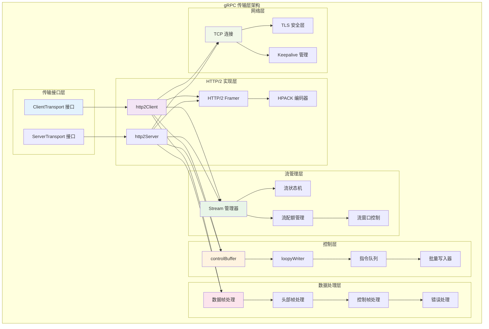
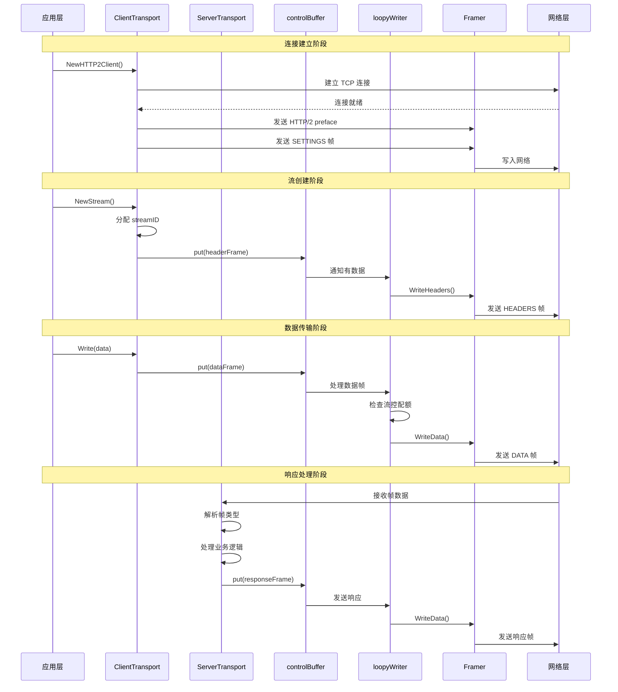
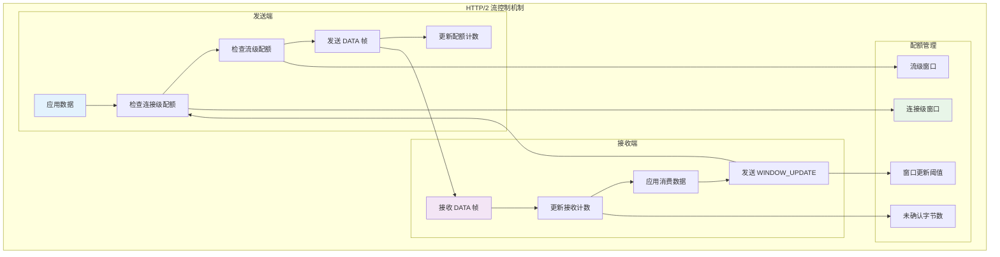
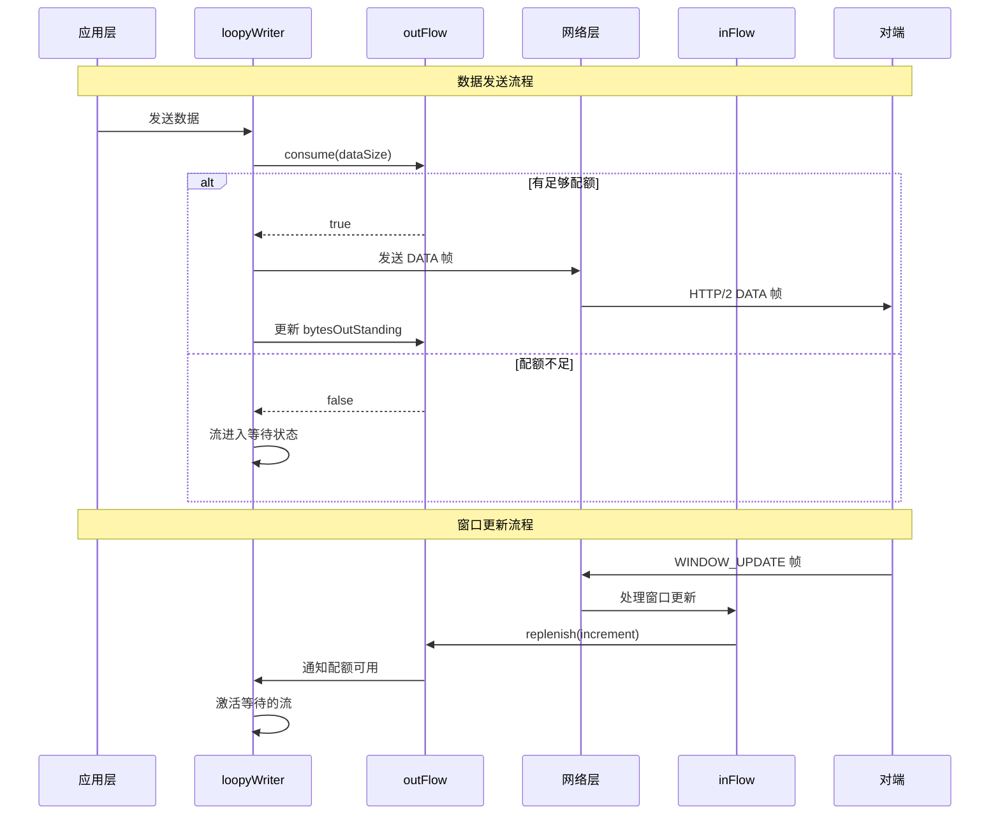

# gRPC-Go 传输层模块深度剖析

## 目录

1. [传输层模块架构](#传输层模块架构)
2. [HTTP/2 传输实现](#http2-传输实现)
3. [流控制机制](#流控制机制)
4. [帧处理与编解码](#帧处理与编解码)
5. [连接管理](#连接管理)
6. [控制缓冲区机制](#控制缓冲区机制)
7. [关键结构体关系](#关键结构体关系)
8. [实战经验总结](#实战经验总结)

## 传输层模块架构

### 整体架构图



### 传输层时序图



## HTTP/2 传输实现

### 1. ClientTransport 接口定义

```go
// 位置：internal/transport/transport.go
type ClientTransport interface {
    // Write 发送数据到指定流
    Write(s *Stream, hdr []byte, data mem.BufferSlice, opts *Options) error
    
    // NewStream 创建新的流
    NewStream(ctx context.Context, callHdr *CallHdr) (*Stream, error)
    
    // CloseStream 关闭指定流
    CloseStream(stream *Stream, err error) error
    
    // Error 返回错误通道
    Error() <-chan struct{}
    
    // GoAway 返回 GoAway 通道
    GoAway() <-chan struct{}
    
    // GetGoAwayReason 获取 GoAway 原因
    GetGoAwayReason() GoAwayReason
    
    // RemoteAddr 返回远程地址
    RemoteAddr() net.Addr
    
    // LocalAddr 返回本地地址
    LocalAddr() net.Addr
    
    // WaitForHandshake 等待握手完成
    WaitForHandshake() error
}
```

### 2. http2Client 实现

```go
// 位置：internal/transport/http2_client.go
type http2Client struct {
    ctx        context.Context
    ctxDone    <-chan struct{}
    cancel     context.CancelFunc
    userAgent  string
    
    // 连接相关
    conn       net.Conn
    localAddr  net.Addr
    remoteAddr net.Addr
    
    // HTTP/2 相关
    framer     *framer
    hBuf       *bytes.Buffer
    hEnc       *hpack.Encoder
    
    // 控制相关
    controlBuf *controlBuffer
    fc         *trInFlow
    
    // 流管理
    mu                     sync.Mutex
    activeStreams          map[uint32]*Stream
    nextID                 uint32
    maxConcurrentStreams   uint32
    streamQuota            int64
    streamsQuotaAvailable  chan struct{}
    waitingStreams         uint32
    
    // 状态管理
    state                  transportState
    goAway                 chan struct{}
    awakenKeepalive        chan struct{}
    
    // 统计信息
    czData                 *channelzData
    onClose                func(GoAwayReason)
    
    // 配置参数
    keepaliveEnabled       bool
    keepaliveParams        keepalive.ClientParameters
    initialWindowSize      int32
    bdpEst                 *bdpEstimator
}

// NewHTTP2Client 创建新的 HTTP/2 客户端传输
func NewHTTP2Client(connectCtx, ctx context.Context, addr resolver.Address, opts ConnectOptions, onClose func(GoAwayReason)) (_ ClientTransport, err error) {
    scheme := "http"
    ctx, cancel := context.WithCancel(ctx)
    defer func() {
        if err != nil {
            cancel()
        }
    }()

    conn, authInfo, err := newHTTP2Conn(connectCtx, addr, opts)
    if err != nil {
        return nil, connectionErrorf(isTemporary(err), err, "transport: error while dialing: %v", err)
    }

    // 发送连接 preface
    if err := conn.Write(clientPreface); err != nil {
        conn.Close()
        return nil, connectionErrorf(true, err, "transport: failed to write client preface: %v", err)
    }

    // 创建 framer
    framer := newFramer(conn, writeBufferSize, readBufferSize, opts.MaxHeaderListSize)
    
    // 创建 http2Client 实例
    t := &http2Client{
        ctx:                   ctx,
        ctxDone:               ctx.Done(),
        cancel:                cancel,
        userAgent:             opts.UserAgent,
        conn:                  conn,
        localAddr:             conn.LocalAddr(),
        remoteAddr:            conn.RemoteAddr(),
        authInfo:              authInfo,
        framer:                framer,
        fc:                    &trInFlow{limit: uint32(icwz)},
        sendQuotaPool:         newQuotaPool(defaultWindowSize),
        localSendQuota:        newQuotaPool(defaultWindowSize),
        scheme:                scheme,
        activeStreams:         make(map[uint32]*Stream),
        creds:                 opts.TransportCredentials,
        maxConcurrentStreams:  defaultMaxStreamsClient,
        streamQuota:           defaultMaxStreamsClient,
        streamsQuotaAvailable: make(chan struct{}, 1),
        czData:                new(channelzData),
        onClose:               onClose,
        nextID:                1,
        maxSendHeaderListSize: opts.MaxHeaderListSize,
        keepaliveEnabled:      keepaliveEnabled,
        keepaliveParams:       kp,
        initialWindowSize:     initialWindowSize,
        goAway:                make(chan struct{}),
        awakenKeepalive:       make(chan struct{}, 1),
        bdpEst:                bdpEst,
    }

    // 创建控制缓冲区
    t.controlBuf = newControlBuffer(t.ctxDone)

    // 发送初始设置
    if err := t.writeSettings(); err != nil {
        t.Close(err)
        return nil, err
    }

    // 更新窗口大小
    if delta := uint32(icwz - defaultWindowSize); delta > 0 {
        if err := t.framer.fr.WriteWindowUpdate(0, delta); err != nil {
            t.Close(err)
            return nil, err
        }
    }

    // 启动 reader 和 loopyWriter
    go t.reader()
    go t.loopy.run()
    
    if t.keepaliveEnabled {
        go t.keepalive()
    }

    return t, nil
}
```

### 3. http2Server 实现

```go
// 位置：internal/transport/http2_server.go
type http2Server struct {
    ctx               context.Context
    done              *grpcsync.Event
    conn              net.Conn
    loopy             *loopyWriter
    readerDone        chan struct{}
    loopyWriterDone   chan struct{}
    
    // HTTP/2 相关
    framer            *framer
    hBuf              *bytes.Buffer
    hEnc              *hpack.Encoder
    
    // 流管理
    mu                sync.Mutex
    activeStreams     map[uint32]*ServerStream
    streamSendQuota   uint32
    
    // 控制相关
    controlBuf        *controlBuffer
    fc                *trInFlow
    sendQuotaPool     *quotaPool
    localSendQuota    *quotaPool
    
    // 配置参数
    maxStreams        uint32
    maxStreamMsgSize  int
    initialWindowSize int32
    keepaliveParams   keepalive.ServerParameters
    
    // 统计信息
    czData            *channelzData
    bufferPool        mem.BufferPool
    
    // 回调函数
    stats             []stats.Handler
    inTapHandle       tap.ServerInHandle
}

// NewServerTransport 创建新的服务器传输
func NewServerTransport(conn net.Conn, config *ServerConfig) (_ ServerTransport, err error) {
    writeBufSize := config.WriteBufferSize
    readBufSize := config.ReadBufferSize
    maxHeaderListSize := defaultServerMaxHeaderListSize
    if config.MaxHeaderListSize != nil {
        maxHeaderListSize = *config.MaxHeaderListSize
    }

    framer := newFramer(conn, writeBufSize, readBufSize, maxHeaderListSize)
    
    // 发送服务器设置
    var settings []http2.Setting
    if config.MaxStreams != math.MaxUint32 {
        settings = append(settings, http2.Setting{
            ID:  http2.SettingMaxConcurrentStreams,
            Val: config.MaxStreams,
        })
    }
    
    // 其他设置...
    if err := framer.fr.WriteSettings(settings...); err != nil {
        return nil, connectionErrorf(false, err, "transport: %v", err)
    }

    // 创建 http2Server 实例
    t := &http2Server{
        ctx:               context.Background(),
        done:              grpcsync.NewEvent(),
        conn:              conn,
        framer:            framer,
        hBuf:              &bytes.Buffer{},
        hEnc:              hpack.NewEncoder(&bytes.Buffer{}),
        maxStreams:        maxStreams,
        inTapHandle:       config.InTapHandle,
        fc:                &trInFlow{limit: uint32(icwz)},
        sendQuotaPool:     newQuotaPool(defaultWindowSize),
        localSendQuota:    newQuotaPool(defaultWindowSize),
        activeStreams:     make(map[uint32]*ServerStream),
        streamSendQuota:   defaultWindowSize,
        stats:             config.StatsHandlers,
        keepaliveParams:   kp,
        maxStreamMsgSize:  config.MaxReceiveMessageSize,
        initialWindowSize: iwz,
        czData:            new(channelzData),
        bufferPool:        config.BufferPool,
    }

    t.controlBuf = newControlBuffer(t.done)
    
    // 启动 loopy writer
    t.loopy = newLoopyWriter(serverSide, t.framer, t.controlBuf, t.bdpEst, t.conn, t.logger, t.outgoingGoAwayHandler, t.keepaliveParams)
    go t.loopy.run()
    
    // 启动 keepalive
    t.kep.Start(t)
    
    return t, nil
}
```

## 流控制机制

### 1. 流控制原理

HTTP/2 流控制基于信用机制，包含两个层级：
- **连接级流控制**：控制整个连接的数据发送速率
- **流级流控制**：控制单个流的数据发送速率



### 2. inFlow 接收流控制

```go
// 位置：internal/transport/flowcontrol.go
type inFlow struct {
    mu sync.Mutex
    
    // 窗口大小限制
    limit uint32
    
    // 未确认的字节数（已接收但未发送 WINDOW_UPDATE）
    unacked uint32
    
    // 有效窗口大小
    effectiveWindowSize uint32
}

// onData 处理接收到的数据
func (f *inFlow) onData(n uint32) error {
    f.mu.Lock()
    defer f.mu.Unlock()
    
    f.unacked += n
    if f.unacked >= f.limit {
        return fmt.Errorf("received %d-bytes data exceeding the limit %d bytes", f.unacked, f.limit)
    }
    return nil
}

// onRead 处理应用读取数据
func (f *inFlow) onRead(n uint32) uint32 {
    f.mu.Lock()
    defer f.mu.Unlock()
    
    if f.unacked < n {
        n = f.unacked
    }
    f.unacked -= n
    
    // 如果未确认字节数超过阈值，返回需要更新的窗口大小
    if f.unacked >= f.limit/4 {
        wu := f.unacked
        f.unacked = 0
        return wu
    }
    return 0
}

// reset 重置流控制状态
func (f *inFlow) reset() uint32 {
    f.mu.Lock()
    defer f.mu.Unlock()
    
    wu := f.unacked
    f.unacked = 0
    return wu
}
```

### 3. outFlow 发送流控制

```go
// outFlow 发送流控制
type outFlow struct {
    mu sync.Mutex
    
    // 发送配额
    sendQuota uint32
    
    // 已发送但未确认的字节数
    bytesOutStanding uint32
    
    // 初始窗口大小
    initialWindowSize uint32
}

// add 增加发送配额
func (f *outFlow) add(n uint32) {
    f.mu.Lock()
    defer f.mu.Unlock()
    
    f.sendQuota += n
}

// consume 消费发送配额
func (f *outFlow) consume(n uint32) bool {
    f.mu.Lock()
    defer f.mu.Unlock()
    
    if f.sendQuota < n {
        return false
    }
    
    f.sendQuota -= n
    f.bytesOutStanding += n
    return true
}

// replenish 补充配额（收到 WINDOW_UPDATE）
func (f *outFlow) replenish(n uint32) {
    f.mu.Lock()
    defer f.mu.Unlock()
    
    if f.bytesOutStanding < n {
        n = f.bytesOutStanding
    }
    f.bytesOutStanding -= n
}
```

### 4. 流控制处理时序



## 帧处理与编解码

### 1. Framer 帧处理器

```go
// 位置：internal/transport/http2_client.go
type framer struct {
    fr *http2.Framer
    
    // 写入相关
    wmu       sync.Mutex
    wbuf      []byte
    
    // 读取相关
    rmu       sync.Mutex
    rbuf      []byte
}

// newFramer 创建新的帧处理器
func newFramer(conn net.Conn, writeBufferSize, readBufferSize int, maxHeaderListSize uint32) *framer {
    if writeBufferSize < 0 {
        writeBufferSize = 0
    }
    if readBufferSize <= 0 {
        readBufferSize = defaultReadBufferSize
    }
    
    r := bufio.NewReaderSize(conn, readBufferSize)
    w := bufio.NewWriterSize(conn, writeBufferSize)
    f := &framer{
        fr: http2.NewFramer(w, r),
    }
    
    f.fr.SetMaxReadFrameSize(http2MaxFrameLen)
    if maxHeaderListSize != 0 {
        f.fr.SetMaxHeaderListSize(maxHeaderListSize)
    }
    f.fr.ReadMetaHeaders = hpack.NewDecoder(http2InitHeaderTableSize, nil)
    
    return f
}
```

### 2. 帧类型处理

**HEADERS 帧处理**：
```go
// 位置：internal/transport/http2_server.go
func (t *http2Server) operateHeaders(ctx context.Context, frame *http2.MetaHeadersFrame, handle func(*ServerStream)) error {
    streamID := frame.Header().StreamID
    
    // 验证流 ID
    if streamID%2 != 1 || streamID <= t.maxStreamID {
        return status.Errorf(codes.Internal, "transport: invalid stream id: %d", streamID)
    }
    t.maxStreamID = streamID
    
    // 检查并发流限制
    t.mu.Lock()
    if t.state != reachable {
        t.mu.Unlock()
        return ErrConnClosing
    }
    if uint32(len(t.activeStreams))+1 > t.maxStreams {
        t.mu.Unlock()
        t.controlBuf.put(&cleanupStream{
            streamID: streamID,
            rst:      true,
            rstCode:  http2.ErrCodeRefusedStream,
            onWrite:  func() {},
        })
        return nil
    }
    t.mu.Unlock()

    // 解析头部
    var (
        method      string
        path        string
        authority   string
        contentType string
        timeoutStr  string
        encoding    string
    )
    
    for _, hf := range frame.Fields {
        switch hf.Name {
        case ":method":
            method = hf.Value
        case ":path":
            path = hf.Value
        case ":authority":
            authority = hf.Value
        case "content-type":
            contentType = hf.Value
        case "grpc-timeout":
            timeoutStr = hf.Value
        case "grpc-encoding":
            encoding = hf.Value
        }
    }

    // 验证必需的头部
    if method != "POST" {
        return status.Errorf(codes.Internal, "transport: invalid method %q", method)
    }
    if path == "" {
        return status.Errorf(codes.Internal, "transport: missing :path header")
    }

    // 解析超时
    var timeout time.Duration
    if timeoutStr != "" {
        var err error
        if timeout, err = decodeTimeout(timeoutStr); err != nil {
            return status.Errorf(codes.Internal, "transport: malformed grpc-timeout: %v", err)
        }
    }

    // 创建服务器流
    s := &ServerStream{
        id:             streamID,
        st:             t,
        buf:            newRecvBuffer(),
        fc:             &inFlow{limit: uint32(t.initialWindowSize)},
        recvCompress:   encoding,
        method:         path,
        contentSubtype: contentSubtype(contentType),
    }

    if timeout != 0 {
        s.ctx, s.cancel = context.WithTimeout(ctx, timeout)
    } else {
        s.ctx, s.cancel = context.WithCancel(ctx)
    }

    // 注册流
    t.mu.Lock()
    if t.state != reachable {
        t.mu.Unlock()
        s.cancel()
        return ErrConnClosing
    }
    if t.activeStreams == nil {
        t.activeStreams = make(map[uint32]*ServerStream)
    }
    t.activeStreams[streamID] = s
    if len(t.activeStreams) == 1 {
        t.idle = time.Time{}
    }
    t.mu.Unlock()

    // 处理流
    if frame.StreamEnded() {
        s.compareAndSwapState(streamActive, streamReadDone)
    }
    
    handle(s)
    return nil
}
```

**DATA 帧处理**：
```go
// 位置：internal/transport/http2_server.go
func (t *http2Server) handleData(f *http2.DataFrame) {
    size := f.Header().Length
    var sendBDPPing bool
    if t.bdpEst != nil {
        sendBDPPing = t.bdpEst.add(size)
    }
    
    // 解耦连接级流控制和应用读取
    // 连接级流控制的更新不应依赖于用户应用是否读取了数据
    if w := t.fc.onData(size); w > 0 {
        t.controlBuf.put(&outgoingWindowUpdate{
            streamID:  0,
            increment: w,
        })
    }
    
    if sendBDPPing {
        // 避免过度 ping 检测（例如在 L7 代理中）
        // 通过在 BDP ping 之前发送窗口更新来实现
        if w := t.fc.reset(); w > 0 {
            t.controlBuf.put(&outgoingWindowUpdate{
                streamID:  0,
                increment: w,
            })
        }
        t.controlBuf.put(bdpPing)
    }
    
    // 选择正确的流进行分发
    s, ok := t.getStream(f)
    if !ok {
        return
    }
    if s.getState() == streamReadDone {
        t.closeStream(s, true, http2.ErrCodeStreamClosed, false)
        return
    }
    
    if size > 0 {
        if err := s.fc.onData(size); err != nil {
            t.closeStream(s, true, http2.ErrCodeFlowControl, false)
            return
        }
        if f.Header().Flags.Has(http2.FlagDataPadded) {
            if w := s.fc.onRead(size - uint32(len(f.Data()))); w > 0 {
                t.controlBuf.put(&outgoingWindowUpdate{s.id, w})
            }
        }
        
        // 复制数据到流缓冲区
        if len(f.Data()) > 0 {
            pool := t.bufferPool
            if pool == nil {
                pool = mem.DefaultBufferPool()
            }
            s.write(recvMsg{buffer: mem.Copy(f.Data(), pool)})
        }
    }
    
    if f.StreamEnded() {
        // 从客户端接收到流结束
        s.compareAndSwapState(streamActive, streamReadDone)
        s.write(recvMsg{err: io.EOF})
    }
}
```

## 连接管理

### 1. 连接状态管理

```go
// 传输状态枚举
type transportState int

const (
    reachable transportState = iota
    closing
    draining
)

// 连接状态转换
func (t *http2Client) updateState(s transportState) {
    t.mu.Lock()
    defer t.mu.Unlock()
    
    if t.state == s {
        return
    }
    
    t.state = s
    switch s {
    case closing:
        // 开始关闭过程
        t.closeAllStreams()
    case draining:
        // 开始排空过程
        t.startDraining()
    }
}
```

### 2. Keepalive 机制

```go
// 位置：internal/transport/http2_client.go
func (t *http2Client) keepalive() {
    p := &ping{data: [8]byte{}}
    // 填充随机数据
    binary.LittleEndian.PutUint64(p.data[:], uint64(time.Now().UnixNano()))
    
    timer := time.NewTimer(t.keepaliveParams.Time)
    for {
        select {
        case <-timer.C:
            if atomic.CompareAndSwapUint32(&t.activity, 1, 0) {
                timer.Reset(t.keepaliveParams.Time)
                continue
            }
            // 发送 keepalive ping
            t.controlBuf.put(p)
            timer.Reset(t.keepaliveParams.Timeout)
        case <-t.awakenKeepalive:
            if !timer.Stop() {
                <-timer.C
            }
            timer.Reset(t.keepaliveParams.Time)
        case <-t.ctx.Done():
            if !timer.Stop() {
                <-timer.C
            }
            return
        }
    }
}
```

### 3. 优雅关闭机制

```go
// 位置：internal/transport/http2_server.go
func (t *http2Server) drain(code http2.ErrCode, debugData []byte) {
    t.mu.Lock()
    defer t.mu.Unlock()
    if t.drainEvent != nil {
        return
    }
    t.drainEvent = grpcsync.NewEvent()
    t.controlBuf.put(&goAway{code: code, debugData: debugData, headsUp: true})
}

func (t *http2Server) Close(err error) {
    t.mu.Lock()
    if t.state == closing {
        t.mu.Unlock()
        return
    }
    t.state = closing
    streams := t.activeStreams
    t.activeStreams = nil
    t.mu.Unlock()
    
    t.controlBuf.finish()
    
    // 关闭所有活跃流
    for _, s := range streams {
        s.cancel()
    }
    
    if err != ErrConnClosing {
        // 通知所有等待的 goroutine
        t.conn.Close()
    }
}
```

## 控制缓冲区机制

### 1. controlBuffer 结构

```go
// 位置：internal/transport/controlbuf.go
type controlBuffer struct {
    ch   chan struct{}
    done <-chan struct{}
    mu   sync.Mutex
    
    consumerWaiting bool
    list            *itemList
    err             error
    
    // 限流相关
    throttle func()
}

// 控制缓冲区项目接口
type cbItem interface {
    isTransportResponseFrame() bool
}

// 数据帧
type dataFrame struct {
    streamID    uint32
    endStream   bool
    h           []byte
    data        mem.BufferSlice
    processing  bool
    onEachWrite func()
}

// 头部帧
type headerFrame struct {
    streamID  uint32
    hf        []hpack.HeaderField
    endStream bool
    initStream func(uint32)
    onOrphaned func(error)
    onWrite    func()
    cleanup    *cleanupStream
}

// 窗口更新帧
type outgoingWindowUpdate struct {
    streamID  uint32
    increment uint32
}
```

### 2. loopyWriter 写入循环

```go
// 位置：internal/transport/controlbuf.go
type loopyWriter struct {
    side            side
    cbuf            *controlBuffer
    sendQuota       uint32
    oiws            uint32
    estdStreams     map[uint32]*outStream
    activeStreams   *outStreamList
    framer          *framer
    hBuf            *bytes.Buffer
    hEnc            *hpack.Encoder
    bdpEst          *bdpEstimator
    draining        bool
    conn            net.Conn
    logger          *grpclog.PrefixLogger
    
    // 流状态管理
    streamQuota     int64
    maxFrameSize    uint32
}

// run 主循环
func (l *loopyWriter) run() (err error) {
    defer func() {
        if err == ErrConnClosing {
            err = nil
        }
    }()
    
    for {
        it, err := l.cbuf.get(true)
        if err != nil {
            return err
        }
        if err = l.handle(it); err != nil {
            return err
        }
        if _, err = l.processData(); err != nil {
            return err
        }
        gosched := true
    hasData:
        for {
            it, err := l.cbuf.get(false)
            if err != nil {
                return err
            }
            if it != nil {
                if err = l.handle(it); err != nil {
                    return err
                }
                if _, err = l.processData(); err != nil {
                    return err
                }
                continue hasData
            }
            isEmpty, err := l.processData()
            if err != nil {
                return err
            }
            if !isEmpty {
                continue hasData
            }
            if gosched {
                gosched = false
                if l.framer.writer.offset < minBatchSize {
                    runtime.Gosched()
                    continue hasData
                }
            }
            l.framer.writer.Flush()
            break hasData
        }
    }
}

// processData 处理数据帧
func (l *loopyWriter) processData() (bool, error) {
    if l.sendQuota == 0 {
        return true, nil
    }
    str := l.activeStreams.dequeue() // 移除第一个流
    if str == nil {
        return true, nil
    }
    
    reader := str.reader
    dataItem := str.itl.peek().(*dataFrame) // 查看第一个数据项
    if !dataItem.processing {
        dataItem.processing = true
        str.reader.Reset(dataItem.data)
        dataItem.data.Free()
    }

    if len(dataItem.h) == 0 && reader.Remaining() == 0 { // 空数据帧
        // 客户端发送带有 endStream = true 的空数据帧
        if err := l.framer.fr.WriteData(dataItem.streamID, dataItem.endStream, nil); err != nil {
            return false, err
        }
        str.itl.dequeue() // 从流中移除空数据项
        _ = reader.Close()
        if str.itl.isEmpty() {
            str.state = empty
        } else if trailer, ok := str.itl.peek().(*headerFrame); ok { // 下一项是 trailers
            if err := l.writeHeader(trailer.streamID, trailer.endStream, trailer.hf, trailer.onWrite); err != nil {
                return false, err
            }
            if err := l.cleanupStreamHandler(trailer.cleanup); err != nil {
                return false, err
            }
        } else {
            l.activeStreams.enqueue(str)
        }
        return false, nil
    }

    // 计算最大发送大小
    maxSize := http2MaxFrameLen
    if strQuota := int(l.oiws) - str.bytesOutStanding; strQuota <= 0 { // 流级流控制
        str.state = waitingOnStreamQuota
        return false, nil
    } else if maxSize > strQuota {
        maxSize = strQuota
    }
    if maxSize > int(l.sendQuota) { // 连接级流控制
        maxSize = int(l.sendQuota)
    }
    
    // 计算头部和数据在配额和最大帧长度内可以发送多少
    hSize := min(maxSize, len(dataItem.h))
    dSize := min(maxSize-hSize, reader.Remaining())
    if hSize != 0 {
        if dSize == 0 {
            endStream := reader.Remaining() == 0 && dataItem.endStream
            if err := l.framer.fr.WriteData(dataItem.streamID, endStream, dataItem.h[:hSize]); err != nil {
                return false, err
            }
        } else {
            // 将头部和数据合并到一个帧中
            buf := make([]byte, hSize+dSize)
            copy(buf, dataItem.h[:hSize])
            reader.Read(buf[hSize:])
            endStream := reader.Remaining() == 0 && dataItem.endStream
            if err := l.framer.fr.WriteData(dataItem.streamID, endStream, buf); err != nil {
                return false, err
            }
        }
        dataItem.h = dataItem.h[hSize:]
    } else if dSize > 0 {
        buf := make([]byte, dSize)
        reader.Read(buf)
        endStream := reader.Remaining() == 0 && dataItem.endStream
        if err := l.framer.fr.WriteData(dataItem.streamID, endStream, buf); err != nil {
            return false, err
        }
    }
    
    // 更新配额
    size := hSize + dSize
    str.bytesOutStanding += size
    l.sendQuota -= uint32(size)
    
    if dataItem.onEachWrite != nil {
        dataItem.onEachWrite()
    }
    
    if reader.Remaining() == 0 && len(dataItem.h) == 0 {
        // 数据帧处理完成
        str.itl.dequeue()
        _ = reader.Close()
        if str.itl.isEmpty() {
            str.state = empty
        } else if trailer, ok := str.itl.peek().(*headerFrame); ok {
            if err := l.writeHeader(trailer.streamID, trailer.endStream, trailer.hf, trailer.onWrite); err != nil {
                return false, err
            }
            if err := l.cleanupStreamHandler(trailer.cleanup); err != nil {
                return false, err
            }
        } else {
            l.activeStreams.enqueue(str)
        }
    } else {
        l.activeStreams.enqueue(str)
    }
    return false, nil
}
```

## 关键结构体关系

### 类图关系

```mermaid
classDiagram
    class ClientTransport {
        <<interface>>
        +Write(s, hdr, data, opts) error
        +NewStream(ctx, callHdr) (*Stream, error)
        +CloseStream(stream, err) error
        +Error() <-chan struct{}
        +GoAway() <-chan struct{}
        +GetGoAwayReason() GoAwayReason
        +RemoteAddr() net.Addr
        +LocalAddr() net.Addr
        +WaitForHandshake() error
    }
    
    class ServerTransport {
        <<interface>>
        +HandleStreams(streamHandler, ctxHandler)
        +WriteHeader(stream, md) error
        +Write(stream, hdr, data, opts) error
        +WriteStatus(stream, st) error
        +Close() error
        +Drain(reason string)
        +Peer() *peer.Peer
    }
    
    class http2Client {
        +ctx context.Context
        +conn net.Conn
        +framer *framer
        +controlBuf *controlBuffer
        +fc *trInFlow
        +activeStreams map[uint32]*Stream
        +nextID uint32
        +maxConcurrentStreams uint32
        +streamQuota int64
        +state transportState
        +goAway chan struct{}
        +keepaliveEnabled bool
        +initialWindowSize int32
        
        +NewStream(ctx, callHdr) (*Stream, error)
        +Write(s, hdr, data, opts) error
        +CloseStream(stream, err) error
        +reader()
        +keepalive()
        +handleData(f) error
        +handleHeaders(f) error
        +handleSettings(f) error
        +handleWindowUpdate(f) error
    }
    
    class http2Server {
        +ctx context.Context
        +conn net.Conn
        +framer *framer
        +controlBuf *controlBuffer
        +fc *trInFlow
        +activeStreams map[uint32]*ServerStream
        +maxStreams uint32
        +initialWindowSize int32
        +keepaliveParams keepalive.ServerParameters
        
        +HandleStreams(streamHandler, ctxHandler)
        +WriteHeader(stream, md) error
        +Write(stream, hdr, data, opts) error
        +WriteStatus(stream, st) error
        +operateHeaders(ctx, frame, handle) error
        +handleData(f) error
        +handleSettings(f) error
        +handleWindowUpdate(f) error
    }
    
    class controlBuffer {
        +ch chan struct{}
        +done <-chan struct{}
        +mu sync.Mutex
        +consumerWaiting bool
        +list *itemList
        +err error
        
        +put(item cbItem) error
        +get(block bool) (cbItem, error)
        +finish()
        +throttle()
    }
    
    class loopyWriter {
        +side side
        +cbuf *controlBuffer
        +sendQuota uint32
        +oiws uint32
        +estdStreams map[uint32]*outStream
        +activeStreams *outStreamList
        +framer *framer
        +hBuf *bytes.Buffer
        +hEnc *hpack.Encoder
        +draining bool
        
        +run() error
        +handle(item cbItem) error
        +processData() (bool, error)
        +writeHeader(streamID, endStream, hf, onWrite) error
        +incomingWindowUpdateHandler(wu) error
        +outgoingWindowUpdateHandler(wu) error
    }
    
    class framer {
        +fr *http2.Framer
        +wmu sync.Mutex
        +wbuf []byte
        +rmu sync.Mutex
        +rbuf []byte
        
        +writeHeaders(streamID, endStream, hf) error
        +writeData(streamID, endStream, data) error
        +writeSettings(settings) error
        +writePing(ack, data) error
        +writeWindowUpdate(streamID, increment) error
    }
    
    class inFlow {
        +mu sync.Mutex
        +limit uint32
        +unacked uint32
        +effectiveWindowSize uint32
        
        +onData(n uint32) error
        +onRead(n uint32) uint32
        +reset() uint32
    }
    
    ClientTransport <|.. http2Client : implements
    ServerTransport <|.. http2Server : implements
    http2Client --> controlBuffer : has
    http2Server --> controlBuffer : has
    controlBuffer --> loopyWriter : uses
    http2Client --> framer : has
    http2Server --> framer : has
    http2Client --> inFlow : has
    http2Server --> inFlow : has
    loopyWriter --> framer : uses
```

## 实战经验总结

### 1. 传输层配置优化

**窗口大小调优**：
```go
// 根据网络环境调整窗口大小
func OptimizeWindowSize(rtt time.Duration, bandwidth int64) (connWindow, streamWindow uint32) {
    // 计算带宽时延积 (BDP)
    bdp := uint32(bandwidth * int64(rtt) / int64(time.Second) / 8)
    
    // 连接窗口设为 BDP 的 2-4 倍
    connWindow = bdp * 3
    if connWindow < 64*1024 {
        connWindow = 64 * 1024 // 最小 64KB
    }
    if connWindow > 16*1024*1024 {
        connWindow = 16 * 1024 * 1024 // 最大 16MB
    }
    
    // 流窗口通常设为连接窗口的 1/4 到 1/2
    streamWindow = connWindow / 4
    if streamWindow < 32*1024 {
        streamWindow = 32 * 1024 // 最小 32KB
    }
    
    return connWindow, streamWindow
}

// 应用窗口配置
func NewOptimizedClient(target string, rtt time.Duration, bandwidth int64) (*grpc.ClientConn, error) {
    connWindow, streamWindow := OptimizeWindowSize(rtt, bandwidth)
    
    return grpc.NewClient(target,
        grpc.WithInitialConnWindowSize(int32(connWindow)),
        grpc.WithInitialWindowSize(int32(streamWindow)),
        grpc.WithWriteBufferSize(int(connWindow/4)),
        grpc.WithReadBufferSize(int(connWindow/4)),
    )
}
```

### 2. 流控制监控

**流控制状态监控**：
```go
type FlowControlMonitor struct {
    connSendQuota   *prometheus.GaugeVec
    streamSendQuota *prometheus.GaugeVec
    windowUpdates   *prometheus.CounterVec
}

func NewFlowControlMonitor() *FlowControlMonitor {
    return &FlowControlMonitor{
        connSendQuota: prometheus.NewGaugeVec(
            prometheus.GaugeOpts{
                Name: "grpc_connection_send_quota_bytes",
                Help: "Current connection-level send quota",
            },
            []string{"transport"},
        ),
        streamSendQuota: prometheus.NewGaugeVec(
            prometheus.GaugeOpts{
                Name: "grpc_stream_send_quota_bytes",
                Help: "Current stream-level send quota",
            },
            []string{"transport", "stream_id"},
        ),
        windowUpdates: prometheus.NewCounterVec(
            prometheus.CounterOpts{
                Name: "grpc_window_updates_total",
                Help: "Total number of window updates sent/received",
            },
            []string{"transport", "direction", "level"},
        ),
    }
}

func (m *FlowControlMonitor) RecordConnectionQuota(transport string, quota uint32) {
    m.connSendQuota.WithLabelValues(transport).Set(float64(quota))
}

func (m *FlowControlMonitor) RecordStreamQuota(transport, streamID string, quota uint32) {
    m.streamSendQuota.WithLabelValues(transport, streamID).Set(float64(quota))
}

func (m *FlowControlMonitor) RecordWindowUpdate(transport, direction, level string) {
    m.windowUpdates.WithLabelValues(transport, direction, level).Inc()
}
```

### 3. 帧处理优化

**批量帧处理**：
```go
type BatchFrameProcessor struct {
    frames    []http2.Frame
    maxBatch  int
    flushTime time.Duration
    timer     *time.Timer
}

func NewBatchFrameProcessor(maxBatch int, flushTime time.Duration) *BatchFrameProcessor {
    return &BatchFrameProcessor{
        frames:    make([]http2.Frame, 0, maxBatch),
        maxBatch:  maxBatch,
        flushTime: flushTime,
        timer:     time.NewTimer(flushTime),
    }
}

func (p *BatchFrameProcessor) AddFrame(frame http2.Frame) {
    p.frames = append(p.frames, frame)
    
    if len(p.frames) >= p.maxBatch {
        p.flush()
    } else if len(p.frames) == 1 {
        // 第一个帧，启动定时器
        p.timer.Reset(p.flushTime)
    }
}

func (p *BatchFrameProcessor) flush() {
    if len(p.frames) == 0 {
        return
    }
    
    // 批量处理帧
    p.processBatch(p.frames)
    
    // 重置状态
    p.frames = p.frames[:0]
    p.timer.Stop()
}

func (p *BatchFrameProcessor) processBatch(frames []http2.Frame) {
    // 按类型分组处理
    dataFrames := make([]*http2.DataFrame, 0)
    headerFrames := make([]*http2.MetaHeadersFrame, 0)
    
    for _, frame := range frames {
        switch f := frame.(type) {
        case *http2.DataFrame:
            dataFrames = append(dataFrames, f)
        case *http2.MetaHeadersFrame:
            headerFrames = append(headerFrames, f)
        }
    }
    
    // 批量处理数据帧
    if len(dataFrames) > 0 {
        p.processDataFrames(dataFrames)
    }
    
    // 批量处理头部帧
    if len(headerFrames) > 0 {
        p.processHeaderFrames(headerFrames)
    }
}
```

### 4. 连接池管理

**智能连接池**：
```go
type ConnectionPool struct {
    mu          sync.RWMutex
    connections map[string]*PooledConnection
    maxConns    int
    maxIdle     time.Duration
    
    // 统计信息
    totalConns  int64
    activeConns int64
    idleConns   int64
}

type PooledConnection struct {
    conn        *grpc.ClientConn
    lastUsed    time.Time
    useCount    int64
    target      string
    
    // 健康状态
    healthy     bool
    lastCheck   time.Time
}

func NewConnectionPool(maxConns int, maxIdle time.Duration) *ConnectionPool {
    pool := &ConnectionPool{
        connections: make(map[string]*PooledConnection),
        maxConns:    maxConns,
        maxIdle:     maxIdle,
    }
    
    // 启动清理 goroutine
    go pool.cleanup()
    
    return pool
}

func (p *ConnectionPool) Get(target string) (*grpc.ClientConn, error) {
    p.mu.Lock()
    defer p.mu.Unlock()
    
    if pc, exists := p.connections[target]; exists {
        if pc.healthy && time.Since(pc.lastUsed) < p.maxIdle {
            pc.lastUsed = time.Now()
            atomic.AddInt64(&pc.useCount, 1)
            return pc.conn, nil
        }
        // 连接不健康或过期，移除
        delete(p.connections, target)
        pc.conn.Close()
        atomic.AddInt64(&p.totalConns, -1)
    }
    
    // 检查连接数限制
    if len(p.connections) >= p.maxConns {
        return nil, fmt.Errorf("connection pool full")
    }
    
    // 创建新连接
    conn, err := grpc.NewClient(target,
        grpc.WithTransportCredentials(insecure.NewCredentials()),
        // 其他配置...
    )
    if err != nil {
        return nil, err
    }
    
    pc := &PooledConnection{
        conn:      conn,
        lastUsed:  time.Now(),
        useCount:  1,
        target:    target,
        healthy:   true,
        lastCheck: time.Now(),
    }
    
    p.connections[target] = pc
    atomic.AddInt64(&p.totalConns, 1)
    
    return conn, nil
}

func (p *ConnectionPool) cleanup() {
    ticker := time.NewTicker(time.Minute)
    defer ticker.Stop()
    
    for range ticker.C {
        p.mu.Lock()
        now := time.Now()
        
        for target, pc := range p.connections {
            if now.Sub(pc.lastUsed) > p.maxIdle {
                delete(p.connections, target)
                pc.conn.Close()
                atomic.AddInt64(&p.totalConns, -1)
            }
        }
        
        p.mu.Unlock()
    }
}
```

### 5. 错误处理与重连

**智能重连策略**：
```go
type SmartReconnector struct {
    target      string
    options     []grpc.DialOption
    
    // 重连参数
    baseDelay   time.Duration
    maxDelay    time.Duration
    multiplier  float64
    jitter      float64
    
    // 状态管理
    mu          sync.Mutex
    conn        *grpc.ClientConn
    attempts    int
    lastError   error
    
    // 回调
    onReconnect func(*grpc.ClientConn)
    onError     func(error)
}

func NewSmartReconnector(target string, opts ...grpc.DialOption) *SmartReconnector {
    return &SmartReconnector{
        target:      target,
        options:     opts,
        baseDelay:   100 * time.Millisecond,
        maxDelay:    30 * time.Second,
        multiplier:  1.6,
        jitter:      0.2,
    }
}

func (r *SmartReconnector) Connect() (*grpc.ClientConn, error) {
    r.mu.Lock()
    defer r.mu.Unlock()
    
    if r.conn != nil {
        state := r.conn.GetState()
        if state == connectivity.Ready || state == connectivity.Idle {
            return r.conn, nil
        }
    }
    
    return r.reconnect()
}

func (r *SmartReconnector) reconnect() (*grpc.ClientConn, error) {
    for {
        conn, err := grpc.NewClient(r.target, r.options...)
        if err == nil {
            r.conn = conn
            r.attempts = 0
            if r.onReconnect != nil {
                r.onReconnect(conn)
            }
            return conn, nil
        }
        
        r.lastError = err
        r.attempts++
        
        if r.onError != nil {
            r.onError(err)
        }
        
        // 计算退避时间
        delay := r.calculateBackoff()
        time.Sleep(delay)
    }
}

func (r *SmartReconnector) calculateBackoff() time.Duration {
    delay := float64(r.baseDelay) * math.Pow(r.multiplier, float64(r.attempts))
    if delay > float64(r.maxDelay) {
        delay = float64(r.maxDelay)
    }
    
    // 添加抖动
    jitter := delay * r.jitter * (rand.Float64()*2 - 1)
    delay += jitter
    
    return time.Duration(delay)
}
```

### 6. 性能调优建议

**传输层性能优化清单**：

1. **窗口大小调优**：
   - 根据网络 BDP 调整连接和流窗口大小
   - 监控窗口更新频率，避免过度更新
   - 考虑应用层消费速度调整窗口策略

2. **缓冲区优化**：
   - 设置合适的读写缓冲区大小
   - 使用内存池减少分配开销
   - 批量处理减少系统调用

3. **连接管理**：
   - 实现连接池复用连接
   - 配置合适的 keepalive 参数
   - 监控连接状态及时处理异常

4. **流控制优化**：
   - 避免流控制死锁
   - 及时发送窗口更新
   - 监控配额使用情况

5. **错误处理**：
   - 实现智能重连机制
   - 区分临时和永久错误
   - 设置合适的超时参数

这个传输层模块文档详细分析了 gRPC-Go 传输层的核心架构、HTTP/2 实现、流控制机制、帧处理等关键组件，并提供了丰富的实战经验和性能优化建议。通过深入的源码分析和完整的时序图，帮助开发者全面理解传输层的工作原理。
