## 概述

Istio是当今最流行的开源服务网格解决方案，它为微服务架构提供了统一的连接、安全、监控和策略管理能力。聚焦Istio的整体架构设计，重点剖析控制平面与数据平面的协同机制，以及关键组件的源码实现原理。

<!--more-->

## 1. Istio整体架构

### 1.1 核心设计理念

Istio采用了**控制平面与数据平面分离**的架构模式，这种设计带来了以下优势：

- **职责分离**：控制平面负责策略制定，数据平面负责流量处理
- **可扩展性**：控制平面和数据平面可以独立扩缩容
- **高可用性**：数据平面即使在控制平面不可用时也能继续工作
- **升级友好**：控制平面和数据平面可以独立升级

### 1.2 整体架构图

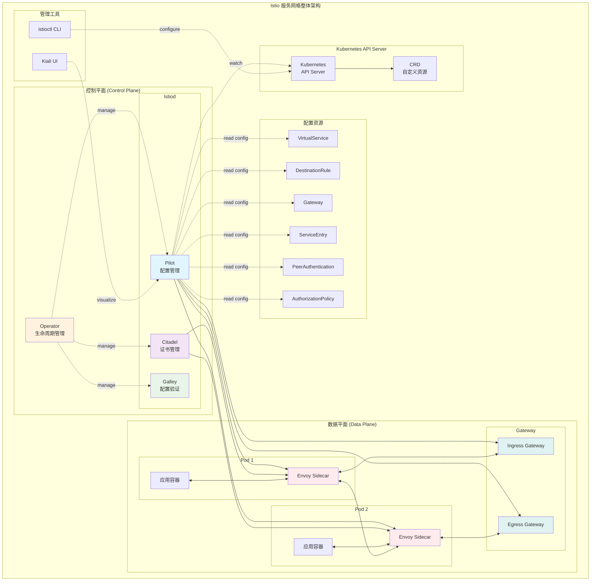

### 1.3 核心组件概述

| 组件 | 职责 | 部署位置 | 关键功能 |
|------|------|----------|----------|
| **Istiod** | 控制平面核心 | 集群级 | 配置分发、证书管理、服务发现 |
| **Envoy Proxy** | 数据平面代理 | 每个Pod | 流量拦截、负载均衡、安全策略 |
| **Operator** | 生命周期管理 | 集群级 | 安装、升级、配置管理 |
| **istioctl** | CLI工具 | 管理端 | 配置验证、问题诊断、运维操作 |

## 2. 控制平面架构深度解析

### 2.1 Istiod统一控制平面

Istiod是Istio 1.5+版本引入的统一控制平面，它将原来的多个组件（Pilot、Citadel、Galley）集成到一个二进制中：

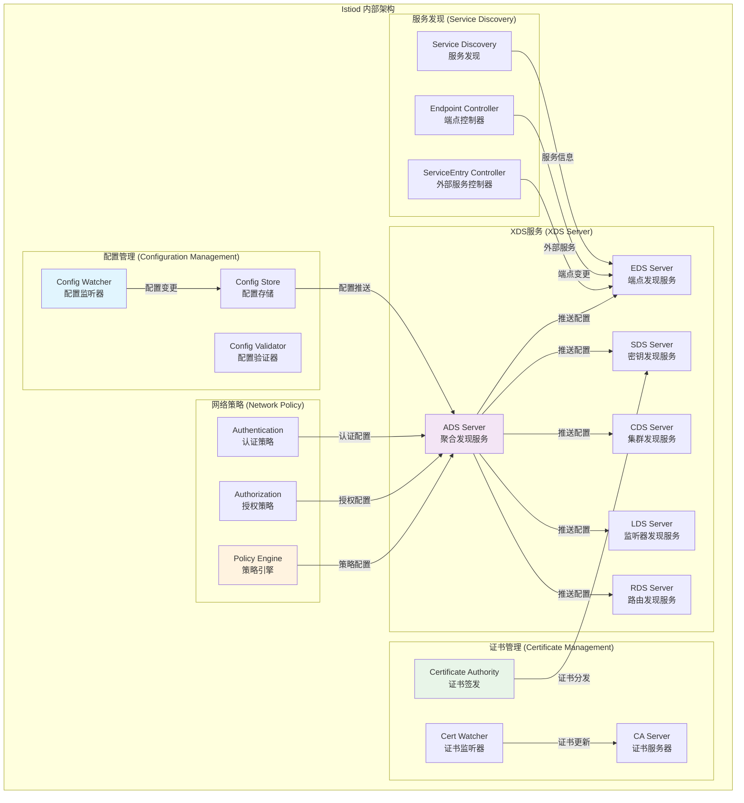

### 2.2 配置处理流水线

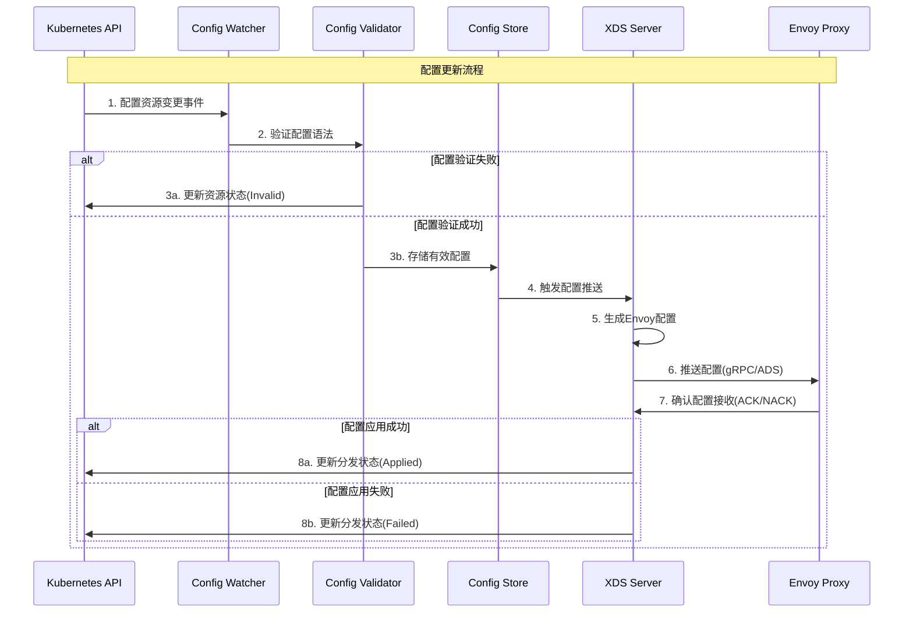

## 3. 数据平面架构深度解析

### 3.1 Envoy代理架构

Envoy是Istio数据平面的核心，每个应用Pod都会注入一个Envoy sidecar容器：

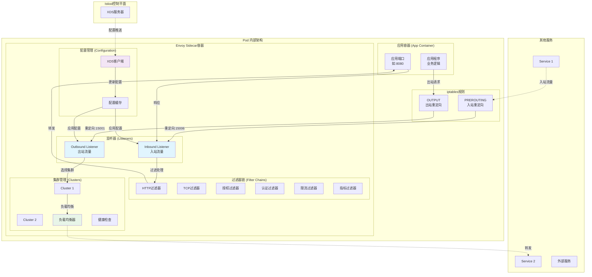

### 3.2 流量拦截机制深度解析

#### 3.2.1 iptables流量劫持原理

Istio通过init容器在Pod启动时设置iptables规则，实现对应用流量的透明拦截。这个过程涉及多个关键步骤：

**1. Init容器执行流程**

```bash
# istio-init容器执行的关键脚本
/usr/local/bin/istio-iptables.sh \
  -p 15001 \         # Envoy出站流量端口
  -z 15006 \         # Envoy入站流量端口  
  -u 1337 \          # Envoy用户ID
  -m REDIRECT \      # 流量重定向模式
  -i '*' \           # 拦截所有入站接口
  -x "" \            # 排除的CIDR范围
  -b '*' \           # 拦截所有入站端口
  -d 15090,15021,15020  # 排除的出站端口
```

**2. 详细的iptables规则分析**

```bash
# === NAT表 PREROUTING链 - 处理入站流量 ===
# 将所有入站TCP流量重定向到15006端口（Envoy入站监听器）
-A PREROUTING -p tcp -j REDIRECT --to-ports 15006

# === NAT表 OUTPUT链 - 处理出站流量 ===
# 排除Envoy进程的出站流量（避免死循环）
-A OUTPUT -m owner --uid-owner 1337 -j RETURN

# 排除回环地址流量
-A OUTPUT -d 127.0.0.0/8 -j RETURN

# 排除Istio控制平面端口
-A OUTPUT -p tcp --dport 15090 -j RETURN  # Envoy admin
-A OUTPUT -p tcp --dport 15021 -j RETURN  # 健康检查
-A OUTPUT -p tcp --dport 15020 -j RETURN  # 合并指标

# 将应用出站流量重定向到15001端口（Envoy出站监听器）
-A OUTPUT -p tcp -j REDIRECT --to-ports 15001
```

**3. 流量处理路径详解**

流量处理遵循以下路径：

```
应用发起请求 
    ↓
iptables规则拦截(OUTPUT链)
    ↓  
Envoy出站监听器(0.0.0.0:15001)
    ↓
负载均衡算法选择端点
    ↓
建立到目标Pod的mTLS连接  
    ↓
目标Pod iptables拦截(PREROUTING链)
    ↓
Envoy入站监听器(0.0.0.0:15006)
    ↓
应用安全策略和路由规则
    ↓
转发到目标应用容器
```

#### 3.2.2 Envoy监听器配置机制

Envoy的监听器配置生成遵循以下逻辑：

**出站监听器配置生成**：
```go
// pilot/pkg/networking/core/v1alpha3/listener.go
func (configgen *ConfigGeneratorImpl) buildSidecarOutboundListeners(
    node *model.Proxy, push *model.PushContext) []*listener.Listener {
    
    var listeners []*listener.Listener
    
    // 创建虚拟出站监听器(0.0.0.0:15001) 
    virtualOutboundListener := &listener.Listener{
        Name: VirtualOutboundListenerName,
        Address: util.BuildAddress("0.0.0.0", uint32(15001)),
        FilterChains: configgen.buildVirtualOutboundFilterChains(node, push),
        ListenerFilters: buildListenerFilters(),  // 包含original_dst过滤器
        UseOriginalDst: proto.BoolTrue,           // 启用原始目标地址检测
        TrafficDirection: core.TrafficDirection_OUTBOUND,
    }
    
    listeners = append(listeners, virtualOutboundListener)
    return listeners
}
```

**入站监听器配置生成**：
```go
// pilot/pkg/networking/core/v1alpha3/listener.go  
func (configgen *ConfigGeneratorImpl) buildSidecarInboundListeners(
    node *model.Proxy, push *model.PushContext) []*listener.Listener {
    
    var listeners []*listener.Listener
    
    // 创建虚拟入站监听器(0.0.0.0:15006)
    virtualInboundListener := &listener.Listener{
        Name: VirtualInboundListenerName, 
        Address: util.BuildAddress("0.0.0.0", uint32(15006)),
        FilterChains: configgen.buildVirtualInboundFilterChains(node, push),
        ListenerFilters: buildListenerFilters(),
        UseOriginalDst: proto.BoolTrue,
        TrafficDirection: core.TrafficDirection_INBOUND,
    }
    
    listeners = append(listeners, virtualInboundListener)
    return listeners
}
```

这种透明代理的实现方式确保了应用程序无需修改任何代码，就能够享受到服务网格提供的所有功能。

## 4. 关键工作流程

### 4.1 服务间通信流程

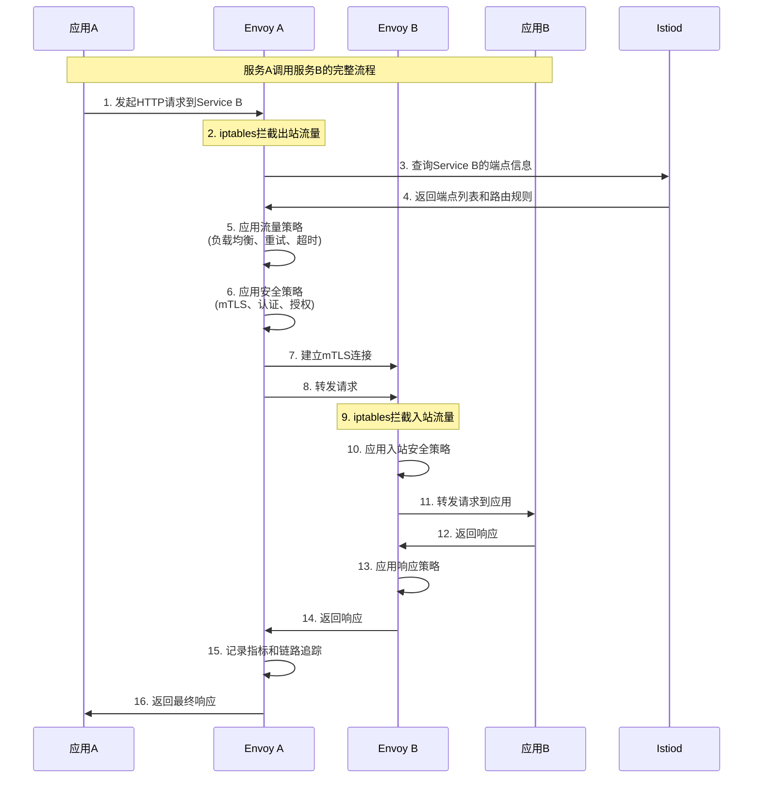

### 4.2配置分发流程

参见前文“2.2 配置处理流水线”与上文“补充模块视图”，此处不再重复流程图，仅保留差异要点：

- 配置进入Push Context后，会按订阅粒度选择性推送（支持debounce与合并）。
- Envoy侧按TypeUrl订阅资源，采用ACK/NACK与version/nonce机制确认收敛。
- EDS对EndpointSlice事件敏感，采用增量生成与按需推送以降低抖动。

模块视图：

- Istiod处理流程：Config Watcher → Config Validator → Config Translator → Push Context(Cache)
- XDS协议：ADS/CDS/LDS/RDS/EDS
- Envoy代理：XDS Client → Config Cache → Runtime

### 4.3 ADS流ACK/NACK交互时序

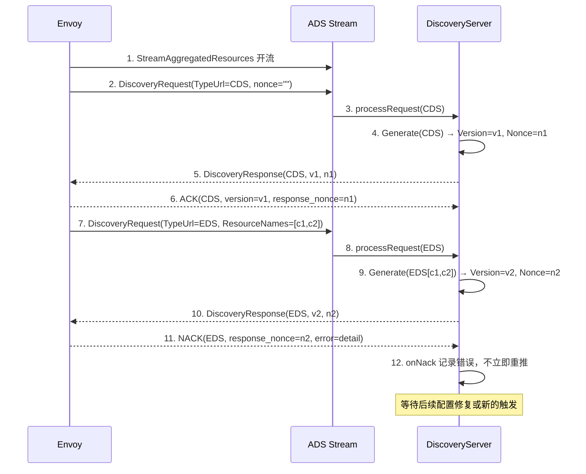

### 4.4 EndpointSlice→EDS更新时序

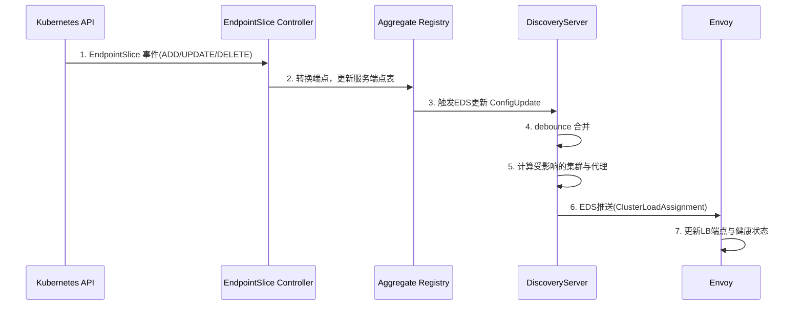

### 4.5 模块关键函数调用路径速览

- 控制平面｜配置推送主路径：
  - `Server.configHandler` -> `XDSServer.ConfigUpdate` -> `handleUpdates`(debounce) -> `Push` -> `AdsPushAll` -> `pushXds` -> `findGenerator` -> `Generate(CDS/LDS/RDS/EDS)` -> `xds.Send`

- ADS流｜请求与ACK/NACK处理：
  - `DiscoveryServer.StreamAggregatedResources` -> `handleRequest` -> `onAck`/`onNack` -> `pushXds`(首次订阅或订阅变更)

- 服务发现｜EndpointSlice变更到EDS：
  - `kube.Controller.onEndpointSliceEvent` -> `ConvertEndpointSlice` -> `XDSUpdater.EDSUpdate` -> `XDSServer.ConfigUpdate` -> `handleUpdates` -> `Push` -> `pushXds(EDS)`

- 配置变更｜VirtualService生效链路：
  - `crdclient.handleEvent` -> `convertToConfig` -> `validation.ValidateConfig` -> `Server.configHandler` -> `XDSServer.ConfigUpdate` -> `handleUpdates` -> `Push` -> `pushXds(RDS/CDS)`

- 监听器生成（LDS）：
  - `ConfigGeneratorImpl.BuildListeners` -> `buildSidecarInboundListeners` / `buildSidecarOutboundListeners` -> `buildVirtualInboundFilterChains` / `buildVirtualOutboundFilterChains`

- 集群生成（CDS）：
  - `ConfigGeneratorImpl.BuildClusters` -> `buildOutboundClusters` / `buildInboundClusters`

- 路由生成（RDS）：
  - `ConfigGeneratorImpl.BuildHTTPRoutes` -> `buildSidecarOutboundHTTPRouteConfig`

- 端点生成（EDS）：
  - `EndpointBuilder.BuildClusterLoadAssignment`

- Sidecar注入（Webhook）：
  - `Webhook.inject` -> `shouldInject` -> `doInject` -> `renderTemplate` -> `jsonpatch.CreatePatch`

- 证书与SDS下发：
  - `Envoy → SDS(StreamSecrets)` -> `SecretCache.GenerateSecret` -> `Istiod CA.Sign` -> `SDS → Envoy`(推送证书/验证上下文)

## 5. 核心特性实现

### 5.1 Envoy可编程代理架构深度解析

Envoy作为Istio数据平面的核心，采用了高度可编程的架构设计：

#### 5.1.1 Envoy架构核心特点

**1. 模块化可扩展设计**
```go
// Envoy过滤器链架构示例
type FilterChain struct {
    // HTTP连接管理器过滤器
    HttpConnectionManager *http_connection_manager.HttpConnectionManager
    
    // 自定义过滤器链
    CustomFilters []HttpFilter
    
    // 路由配置
    RouteConfig *route.RouteConfiguration
}

// 过滤器接口定义
type HttpFilter interface {
    // 处理请求头
    OnRequestHeaders(headers HeaderMap) FilterHeadersStatus
    
    // 处理请求体
    OnRequestData(data Buffer) FilterDataStatus
    
    // 处理响应头
    OnResponseHeaders(headers HeaderMap) FilterHeadersStatus
    
    // 处理响应体
    OnResponseData(data Buffer) FilterDataStatus
}
```

**2. 事件驱动的高性能模型**
- **异步I/O处理**: 通过...实现的高效事件循环
- **非阻塞架构**: 所有网络操作都是非阻塞的
- **内存池管理**: 智能的内存分配和回收机制
- **连接复用**: HTTP/2连接池和TCP连接复用

#### 5.1.2 关键组件工作机制

**监听器（Listeners）管理**:
```cpp
// Envoy监听器核心实现逻辑（C++伪代码展示概念）
class ListenerManager {
    // 监听器配置映射
    std::map<std::string, ListenerImpl*> listeners_;
    
    // 动态添加监听器
    void addListener(const envoy::config::listener::v3::Listener& config) {
        auto listener = std::make_unique<ListenerImpl>(config);
        listener->initialize();
        listeners_[config.name()] = std::move(listener);
    }
    
    // 热重载监听器配置
    void updateListener(const std::string& name, 
                       const envoy::config::listener::v3::Listener& config) {
        if (auto it = listeners_.find(name); it != listeners_.end()) {
            it->second->drain();                    // 优雅排空现有连接
            auto new_listener = std::make_unique<ListenerImpl>(config);
            new_listener->initialize();
            listeners_[name] = std::move(new_listener);
        }
    }
}
```

**集群（Clusters）管理**:
```cpp
// 集群管理器实现
class ClusterManager {
    // 集群配置缓存
    std::map<std::string, ClusterImpl*> clusters_;
    
    // 健康检查管理器
    HealthCheckerManager health_checker_manager_;
    
    // 负载均衡器工厂
    LoadBalancerFactory lb_factory_;
    
    // 动态更新集群配置
    void updateCluster(const envoy::config::cluster::v3::Cluster& config) {
        auto cluster = clusters_[config.name()];
        
        // 更新端点配置
        cluster->updateEndpoints(config.load_assignment());
        
        // 更新负载均衡策略
        auto lb = lb_factory_.create(config.lb_policy());
        cluster->setLoadBalancer(std::move(lb));
        
        // 更新健康检查配置
        if (config.has_health_checks()) {
            health_checker_manager_.updateHealthChecker(config.name(), config.health_checks());
        }
    }
}
```

### 5.2 流量管理核心特性

基于生产环境实践总结的流量管理特性详解：

| 特性 | 实现组件 | 配置资源 | 关键功能 | 生产级配置示例 |
|------|----------|----------|----------|----------------|
| **负载均衡** | Envoy Cluster | DestinationRule | 轮询、随机、最少连接、一致性哈希 | `LEAST_CONN`适用于长连接服务 |
| **流量分割** | Envoy Route | VirtualService | 基于权重、Header、Cookie的流量分割 | 金丝雀发布：90%-10%权重分配 |
| **熔断** | Envoy Circuit Breaker | DestinationRule | 连接池、请求超时、重试策略 | `maxConnections: 100, connectTimeout: 30s` |
| **故障注入** | Envoy Fault Filter | VirtualService | 延迟注入、错误注入 | 混沌工程：0.1%错误率注入 |
| **超时重试** | Envoy Retry Policy | VirtualService | 重试次数、重试条件、退避策略 | `retries: 3, perTryTimeout: 5s` |

#### 5.2.1 生产级负载均衡配置

```yaml
# 基于生产环境经验的DestinationRule配置
apiVersion: networking.istio.io/v1beta1
kind: DestinationRule
metadata:
  name: productpage-destination
spec:
  host: productpage
  trafficPolicy:
    # 负载均衡策略 - 根据服务特性选择
    loadBalancer:
      simple: LEAST_CONN          # 适用于长连接服务的策略
      # consistentHash:            # 会话保持场景
      #   httpHeaderName: "user-id"
    
    # 连接池配置 - 防止资源耗尽
    connectionPool:
      tcp:
        maxConnections: 100        # 最大连接数
        connectTimeout: 30s        # 连接超时
        keepAlive:
          time: 7200s             # TCP keepalive
          interval: 75s           # keepalive间隔
      http:
        http1MaxPendingRequests: 100   # HTTP/1.1排队请求
        http2MaxRequests: 1000         # HTTP/2并发请求
        maxRequestsPerConnection: 2    # 连接最大请求数
        maxRetries: 3                  # 最大重试次数
        idleTimeout: 60s               # 空闲超时
        h2UpgradePolicy: UPGRADE       # HTTP/2升级策略
    
    # 熔断配置 - 故障隔离
    outlierDetection:
      consecutiveGatewayErrors: 5      # 连续网关错误
      consecutive5xxErrors: 5          # 连续5xx错误
      interval: 30s                    # 检测间隔
      baseEjectionTime: 30s           # 基础驱逐时间
      maxEjectionPercent: 50          # 最大驱逐百分比
      minHealthPercent: 50            # 最小健康百分比
```

#### 5.2.2 智能重试策略配置

```yaml
# 生产级VirtualService重试配置
apiVersion: networking.istio.io/v1beta1
kind: VirtualService
metadata:
  name: reviews-retry-policy
spec:
  hosts:
  - reviews
  http:
  - match:
    - uri:
        prefix: "/api/"
    route:
    - destination:
        host: reviews
        subset: v1
    # 智能重试配置
    retries:
      attempts: 3                      # 重试次数
      perTryTimeout: 5s               # 单次重试超时
      retryOn: 5xx,gateway-error,connect-failure,refused-stream  # 重试条件
      retryRemoteLocalities: true     # 跨区域重试
    # 超时配置
    timeout: 15s                      # 总体超时
    # 故障注入（仅测试环境）
    fault:
      delay:
        percentage:
          value: 0.001                # 0.1%延迟注入
        fixedDelay: 100ms
```

### 5.2 安全架构

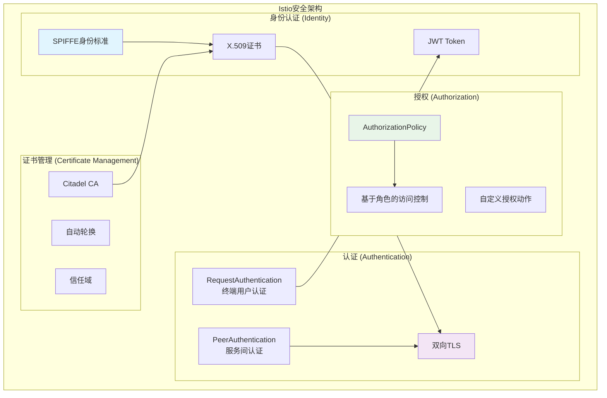

### 5.3 可观测性

| 维度 | 实现方式 | 数据采集 | 存储分析 |
|------|----------|----------|----------|
| **指标监控** | Prometheus格式 | Envoy统计信息 | Prometheus + Grafana |
| **分布式追踪** | OpenTelemetry | Envoy追踪头 | Jaeger/Zipkin |
| **访问日志** | 结构化日志 | Envoy访问日志 | ELK Stack |
| **服务拓扑** | 服务图谱 | 调用关系分析 | Kiali可视化 |

### 5.4 发布策略：流量镜像与灰度发布

在大规模生产环境中，常见发布节奏为“影子流量 → 小流量灰度 → 渐进放量 → 全量”，并以SLO与错误预算作为闸门：

1. 流量镜像（不影响线上响应）
   ```yaml
   apiVersion: networking.istio.io/v1beta1
   kind: VirtualService
   metadata:
     name: reviews
   spec:
     hosts: ["reviews"]
     http:
     - route:
       - destination: { host: reviews, subset: v1 }
         weight: 100
       mirror: { host: reviews, subset: v2 }
       mirrorPercent: 10
   ```

2. 小流量灰度与策略保护
   ```yaml
   http:
   - route:
     - destination: { host: reviews, subset: v1 }
       weight: 90
     - destination: { host: reviews, subset: v2 }
       weight: 10
     retries:
       attempts: 2
       perTryTimeout: 3s
     timeout: 10s
     fault:
       abort: { percentage: { value: 0.0 }, httpStatus: 503 } # 混沌演练可按需开启
   ```

3. 目标用户定向（Header/Cookie）与会话保持
   - 使用`match.headers`或`consistentHash`（Cookie/HTTPHeader）保障可控与稳定性；
   - 配合`outlierDetection`自动驱逐异常实例。

4. 自动回滚与指标闸门
   - 以成功率、P99延迟、5xx/熔断率为阈值，失败即回滚到上一稳定权重；
   - 建议通过GitOps/调度器结合Prometheus规则自动执行回退。

## 6. 部署架构选项

### 6.1 Sidecar模式 vs Ambient模式

| 特性 | Sidecar模式 | Ambient模式 |
|------|-------------|-------------|
| **部署复杂度** | 每Pod一个代理 | 节点级代理 |
| **资源消耗** | Pod级消耗 | 节点级共享 |
| **隔离性** | 强隔离 | 节点级隔离 |
| **升级影响** | Pod级重启 | 节点级影响 |
| **功能完整性** | 全功能 | 渐进增强 |

### 6.2 多集群部署模式

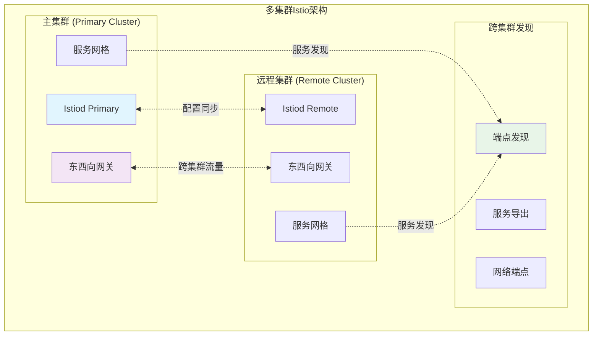

### 6.3 DNS捕获与透明代理差异（Sidecar vs Ambient）

在生产环境中，DNS解析对路由与策略生效影响显著，总结如下：

- **Sidecar模式的DNS捕获与代理**：
  - 通过在Envoy引导配置中开启`dnsProxy`，将Pod内应用的DNS查询（通常发往`kube-dns/CoreDNS`）转发到Envoy内置DNS代理，再依据RDS/EDS结果解析服务域名。
  - 典型配置（概念片段）：
    ```yaml
    static_resources:
      listeners:
      - name: dns_proxy
        address: { socket_address: { address: 127.0.0.1, port_value: 15053 } }
        filter_chains:
        - filters:
          - name: envoy.filters.udp_listener.dns_proxy
            typed_config:
              '@type': type.googleapis.com/envoy.extensions.udp.dns_filter.v3.DnsFilterConfig
              stat_prefix: "dns"
              server_config: { inline_dns_table: {} }
    layered_runtime:
      runtime_layers: [ { name: enable_dns_proxy, static_layer: { envoy.restart_features.use_dns_filter: true } } ]
    ```
  - iptables常配合将53/UDP流量重定向至15053（或由应用直连127.0.0.1:15053）。

- **Ambient模式（ztunnel/waypoint）**：
  - L4层由`ztunnel`提供透明加密与路由；若启用L7策略，由`waypoint`处理HTTP路由与策略。
  - DNS通常不经L7代理过滤链，域名到服务的映射依赖`ztunnel`与控制平面提供的端点/策略视图；避免将DNS代理与L7策略耦合，降低开销。

- **策略匹配注意事项**：
  - 使用`VirtualService`基于主机名规则时，应确认DNS解析与服务FQDN一致（例如`*.svc.cluster.local`）。
  - 启用`Sidecar`资源（命名空间级优化）时，留意外部服务域名是否已在`ServiceEntry`中声明，以确保RDS生成匹配正确。

- **IPv6/双栈配置**：
  - IPv6/双栈集群下，iptables与DNS代理应同时覆盖`UDP/53`及系统解析器行为（如`getaddrinfo`），建议开启Envoy双栈监听。

## 7. 性能优化策略

### 7.1 控制平面优化

1. **配置推送优化**：
   - 方案：“三段式去抖 + 粒度下沉”。在`debounceAfter/Max`之外，按“资源类型→代理分群→连接热度”三段队列合并，结合按TypeUrl粒度的`ConfigsUpdated`过滤，降低无效推送比例。
   - 方案：“订阅驱动Push”。基于代理订阅视图（`WatchedResource.ResourceNames`）裁剪PushContext生成范围，仅对存在订阅差异的代理推送，配合“慢代理熔断”降低尾延迟。
   - 方案：“变更批量阈值”。设置“最小批量尺寸/最大等待时延”自适应阈值，低峰合并、峰值放行，稳定P95收敛时间。

2. **资源管理优化**：
   - 方案：“冷热Cache分层”。将`XdsCache`拆为热点直读层（固定容量、锁分段）与冷数据层（压缩存储、LRU驱逐），配合PushVersion分片，降低GC停顿。
   - 方案：“生成器对象池化”。为CDS/LDS/RDS/EDS生成中高频结构（如Route/Cluster片段）引入`sync.Pool`，并在版本切换后定点清池，避免跨版本泄漏。
   - 方案：“队列背压+优先级”。推送队列按代理重要度（网关>业务核心>边缘）分级，结合`RequestRateLimit`对新连入代理限速，抑制雷群效应。

### 7.2 数据平面优化

1. **Envoy配置优化**：
   - 方案：“监听器最小化”。将无流量端口合并到虚拟入/出站监听器，按需下发FilterChain，配合`UseOriginalDst`降低热路径匹配成本。
   - 方案：“WASM按需加载”。遥测/鉴权类WASM扩展按命名空间Sidecar剪裁，仅在命中策略的工作负载启用，降低全网格开销。
   - 方案：“指标稀疏采样”。对高基数标签启用分层聚合与采样阈值（如按调用量自适应），降低Prometheus抓取放大效应。

2. **网络优化**：
   - 连接复用和池化
   - TCP参数调优
   - 缓存策略优化

## 附录A：关键函数与结构


### A.1 关键函数核心代码

```go
// 接收配置更新事件 → 入队去抖动
// 功能：将配置变更封装为 PushRequest，进入推送流程
func (s *DiscoveryServer) ConfigUpdate(req *model.PushRequest) {
    // 统计与断言（省略）
    s.pushChannel <- req // 进入去抖动通道
}

// 去抖动与合并 → 回调 Push
// 功能：合并高频配置事件，按时间窗口触发一次推送
func debounce(ch chan *model.PushRequest, stop <-chan struct{},
    opts DebounceOptions, pushFn func(*model.PushRequest)) {
    var merged *model.PushRequest
    var timer <-chan time.Time
    for {
        select {
        case r := <-ch:
            if merged == nil { merged = r } else { merged = merged.Merge(r) }
            if timer == nil { timer = time.After(opts.debounceAfter) }
        case <-timer:
            if merged != nil { pushFn(merged); merged, timer = nil, nil }
        case <-stop:
            return
        }
    }
}

// 按订阅与类型生成并发送 xDS 资源
// 功能：选择生成器、生成资源、封装 DiscoveryResponse 并发送
func (s *DiscoveryServer) pushXds(con *Connection, w *model.WatchedResource,
    req *model.PushRequest) error {
    if w == nil { return nil }
    gen := s.findGenerator(w.TypeUrl, con)
    if gen == nil { return nil }
    resources, _, err := gen.Generate(con.proxy, w, req)
    if err != nil || resources == nil { return err }
    resp := &discovery.DiscoveryResponse{ TypeUrl: w.TypeUrl, Resources: xds.ResourcesToAny(resources) }
    return xds.Send(con, resp)
}

// ADS 双向流入口
// 功能：处理首订/订阅变更、ACK/NACK，并按需推送
func (s *DiscoveryServer) StreamAggregatedResources(stream discovery.AggregatedDiscoveryService_StreamAggregatedResourcesServer) error {
    con := newConnection(/* 省略鉴权与元数据 */)
    for {
        req, err := stream.Recv()
        if err != nil { return err }
        if req.ErrorDetail != nil && req.ResponseNonce != "" { s.onNack(con, req.TypeUrl, req.ResponseNonce, req.ErrorDetail); continue }
        if req.ResponseNonce != "" { s.onAck(con, req.TypeUrl, req.VersionInfo, req.ResponseNonce); continue }
        con.UpdateWatched(req.TypeUrl, &model.WatchedResource{ TypeUrl: req.TypeUrl, ResourceNames: req.ResourceNames })
        _ = s.pushXds(con, con.Watched(req.TypeUrl), &model.PushRequest{ Full: false, Push: s.currentPushContext() })
    }
}
```

### A.2 关键函数调用链

- 配置事件主链（统一表述）：
  - `ConfigStore.handleEvent` → `Server.configHandler` → `XDSServer.ConfigUpdate` → `debounce(...)` → `Push` → `pushXds` → `xds.Send`
- ADS 交互主链：
  - `DiscoveryServer.StreamAggregatedResources` → `onAck/onNack | UpdateWatched` → `pushXds`
- 服务发现主链（EndpointSlice）：
  - `kube.Controller.onEndpointSliceEvent` → `XDSUpdater.EDSUpdate` → `XDSServer.ConfigUpdate` → `debounce` → `Push(EDS)`

注：上述调用链与前文“4.5 模块关键函数调用路径速览”一致，此处为合并版索引。

### A.3 关键函数交互时序

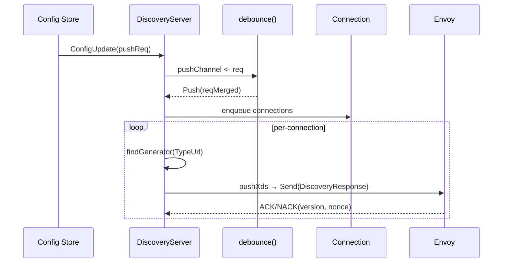

### A.4 关键函数交互时序

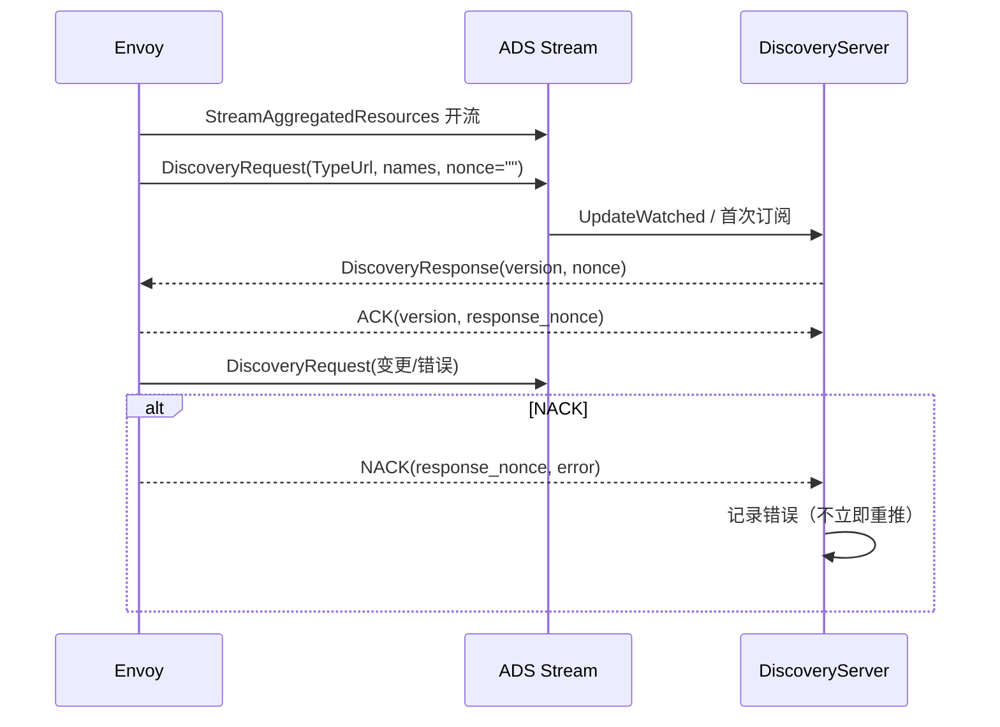

### A.5 关键结构体关系（类结构图）

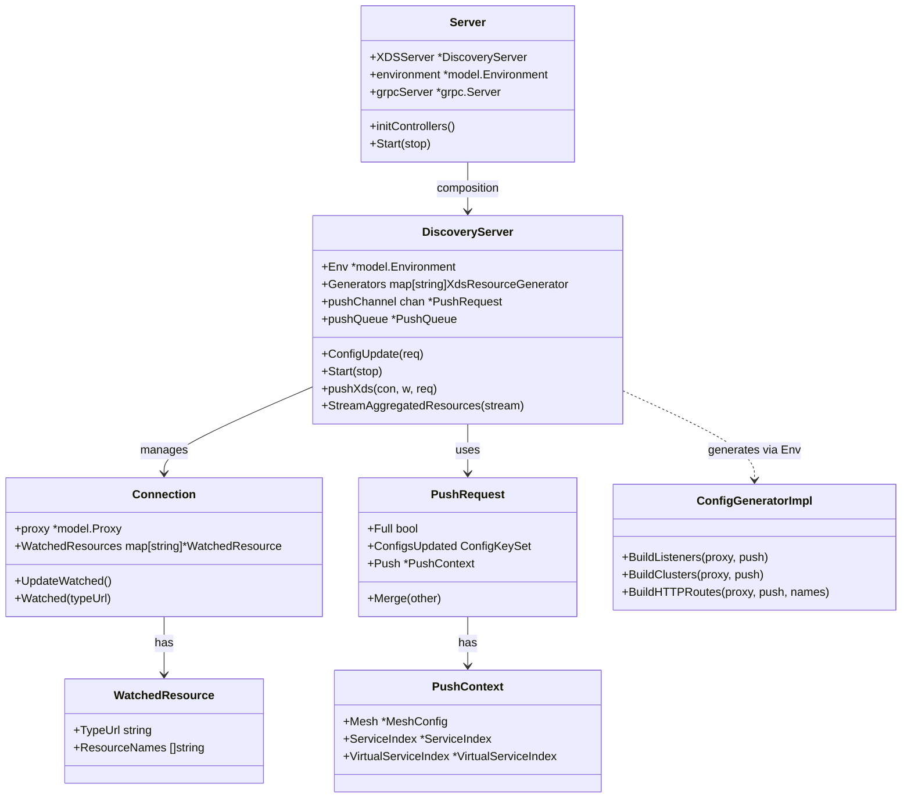

## 8. 总结

Istio服务网格架构体现了以下设计精髓：

### 8.1 架构优势

- **统一抽象**：为微服务提供统一的连接、安全、监控能力
- **渐进采用**：支持从单体到微服务的渐进式演进
- **平台无关**：可运行在任何支持Kubernetes的平台
- **扩展性强**：支持自定义过滤器、插件和策略

### 8.2 最佳实践

1. **生产部署准备**
   - 充分的性能测试和容量规划
   - 完整的监控告警体系
   - 故障处理和恢复预案

2. **配置管理策略**
   - 采用GitOps进行配置管理
   - 实施配置变更审批流程
   - 建立配置回滚机制

3. **安全最佳实践**
   - 启用自动mTLS
   - 实施最小权限原则
   - 定期轮换证书和密钥

方法论：
- “三段式去抖 + 粒度下沉”的Push管控策略，显著降低无效推送与尾延迟；
- 订阅驱动的按需生成与推送（WatchedResource反向裁剪），在大规模网格中保持收敛稳定；
- 热冷分层的XDS缓存与生成器对象池化，降低GC与CPU尖峰；
- Sidecar剪裁与WASM按需加载的组合，使可观测与策略的边际成本可控；
- 基于SLO与错误预算的金丝雀与自动回滚闭环，确保“先观测、再晋级”。

这些方案与实现路径，与上文时序和调用链相结合，可用于Istio生产网格的实施与优化。


