## 概述

Istio服务网格涉及控制平面和数据平面的复杂交互，包含配置分发、服务发现、证书管理、流量代理等多个关键流程。本文通过详细的时序图，系统性地剖析Istio的核心工作流程，帮助读者深入理解服务网格内部的技术实现机制。

<!--more-->

## 1. Istio完整启动流程

### 1.1 控制平面启动时序

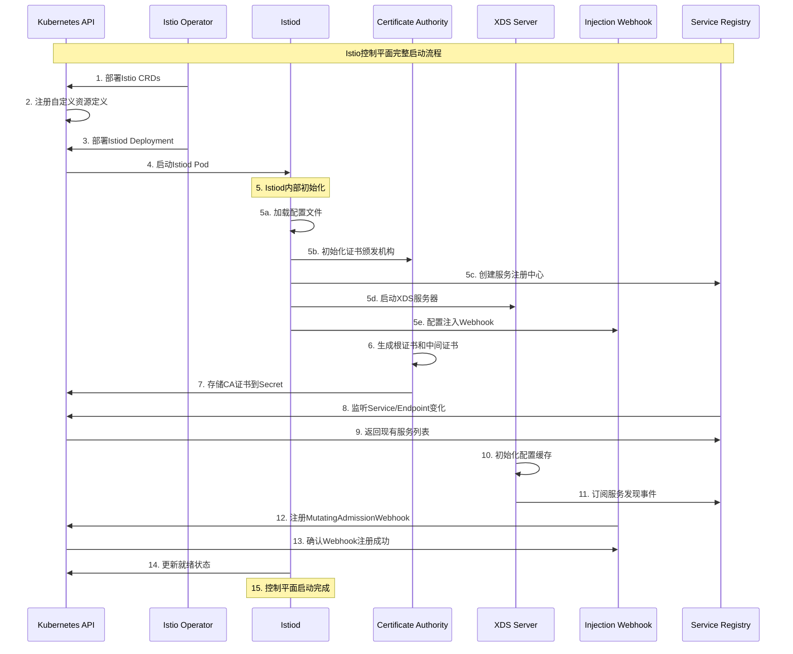
```mermaid
sequenceDiagram
    participant K8s as Kubernetes API
    participant Operator as Istio Operator
    participant Istiod as Istiod
    participant CA as Certificate Authority
    participant XDS as XDS Server
    participant Webhook as Injection Webhook
    participant Registry as Service Registry
    
    Note over K8s,Registry: Istio控制平面完整启动流程
    
    Operator->>K8s: 1. 部署Istio CRDs
    K8s->>K8s: 2. 注册自定义资源定义
    
    Operator->>K8s: 3. 部署Istiod Deployment
    K8s->>Istiod: 4. 启动Istiod Pod
    
    Note over Istiod: 5. Istiod内部初始化
    Istiod->>Istiod: 5a. 加载配置文件
    Istiod->>CA: 5b. 初始化证书颁发机构
    Istiod->>Registry: 5c. 创建服务注册中心
    Istiod->>XDS: 5d. 启动XDS服务器
    Istiod->>Webhook: 5e. 配置注入Webhook
    
    CA->>CA: 6. 生成根证书和中间证书
    CA->>K8s: 7. 存储CA证书到Secret
    
    Registry->>K8s: 8. 监听Service/Endpoint变化
    K8s->>Registry: 9. 返回现有服务列表
    
    XDS->>XDS: 10. 初始化配置缓存
    XDS->>Registry: 11. 订阅服务发现事件
    
    Webhook->>K8s: 12. 注册MutatingAdmissionWebhook
    K8s->>Webhook: 13. 确认Webhook注册成功
    
    Istiod->>K8s: 14. 更新就绪状态
    Note over Istiod: 15. 控制平面启动完成
```

### 1.2 数据平面启动时序

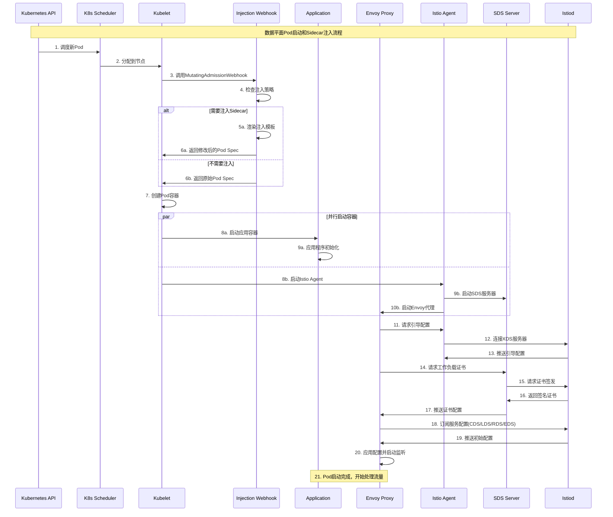
```mermaid
sequenceDiagram
    participant K8s as Kubernetes API
    participant Scheduler as K8s Scheduler
    participant Kubelet as Kubelet
    participant Webhook as Injection Webhook
    participant App as Application
    participant Envoy as Envoy Proxy
    participant Agent as Istio Agent
    participant SDS as SDS Server
    participant Istiod as Istiod
    
    Note over K8s,Istiod: 数据平面Pod启动和Sidecar注入流程
    
    K8s->>Scheduler: 1. 调度新Pod
    Scheduler->>Kubelet: 2. 分配到节点
    
    Kubelet->>Webhook: 3. 调用MutatingAdmissionWebhook
    Webhook->>Webhook: 4. 检查注入策略
    
    alt 需要注入Sidecar
        Webhook->>Webhook: 5a. 渲染注入模板
        Webhook->>Kubelet: 6a. 返回修改后的Pod Spec
    else 不需要注入
        Webhook->>Kubelet: 6b. 返回原始Pod Spec
    end
    
    Kubelet->>Kubelet: 7. 创建Pod容器
    
    par 并行启动容器
        Kubelet->>App: 8a. 启动应用容器
        App->>App: 9a. 应用程序初始化
    and
        Kubelet->>Agent: 8b. 启动Istio Agent
        Agent->>SDS: 9b. 启动SDS服务器
        Agent->>Envoy: 10b. 启动Envoy代理
    end
    
    Envoy->>Agent: 11. 请求引导配置
    Agent->>Istiod: 12. 连接XDS服务器
    Istiod->>Agent: 13. 推送引导配置
    
    Envoy->>SDS: 14. 请求工作负载证书
    SDS->>Istiod: 15. 请求证书签发
    Istiod->>SDS: 16. 返回签名证书
    SDS->>Envoy: 17. 推送证书配置
    
    Envoy->>Istiod: 18. 订阅服务配置(CDS/LDS/RDS/EDS)
    Istiod->>Envoy: 19. 推送初始配置
    
    Envoy->>Envoy: 20. 应用配置并启动监听
    
    Note over App,Envoy: 21. Pod启动完成，开始处理流量
```

## 2. 服务间通信完整流程

### 2.1 mTLS服务调用时序

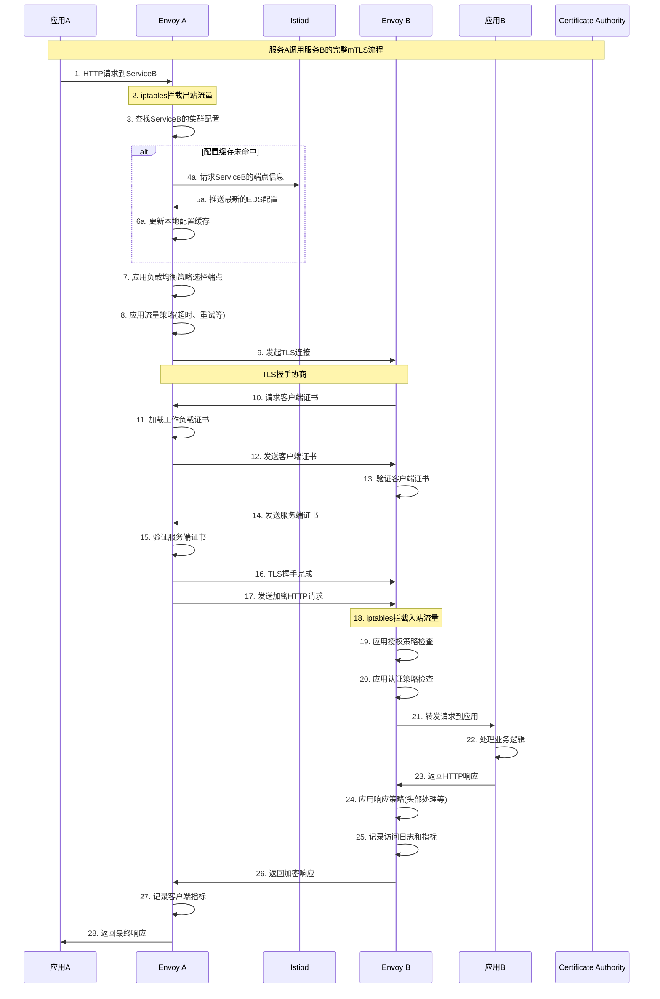
```mermaid
sequenceDiagram
    participant AppA as 应用A
    participant EnvoyA as Envoy A
    participant IstiodA as Istiod
    participant EnvoyB as Envoy B
    participant AppB as 应用B
    participant CA as Certificate Authority
    
    Note over AppA,CA: 服务A调用服务B的完整mTLS流程
    
    %% 应用发起请求
    AppA->>EnvoyA: 1. HTTP请求到ServiceB
    Note over EnvoyA: 2. iptables拦截出站流量
    
    %% 服务发现和路由选择
    EnvoyA->>EnvoyA: 3. 查找ServiceB的集群配置
    
    alt 配置缓存未命中
        EnvoyA->>IstiodA: 4a. 请求ServiceB的端点信息
        IstiodA->>EnvoyA: 5a. 推送最新的EDS配置
        EnvoyA->>EnvoyA: 6a. 更新本地配置缓存
    end
    
    EnvoyA->>EnvoyA: 7. 应用负载均衡策略选择端点
    EnvoyA->>EnvoyA: 8. 应用流量策略(超时、重试等)
    
    %% mTLS握手过程
    EnvoyA->>EnvoyB: 9. 发起TLS连接
    
    Note over EnvoyA,EnvoyB: TLS握手协商
    EnvoyB->>EnvoyA: 10. 请求客户端证书
    EnvoyA->>EnvoyA: 11. 加载工作负载证书
    EnvoyA->>EnvoyB: 12. 发送客户端证书
    
    EnvoyB->>EnvoyB: 13. 验证客户端证书
    EnvoyB->>EnvoyA: 14. 发送服务端证书
    EnvoyA->>EnvoyA: 15. 验证服务端证书
    
    EnvoyA->>EnvoyB: 16. TLS握手完成
    
    %% 请求处理
    EnvoyA->>EnvoyB: 17. 发送加密HTTP请求
    
    Note over EnvoyB: 18. iptables拦截入站流量
    EnvoyB->>EnvoyB: 19. 应用授权策略检查
    EnvoyB->>EnvoyB: 20. 应用认证策略检查
    EnvoyB->>AppB: 21. 转发请求到应用
    
    AppB->>AppB: 22. 处理业务逻辑
    AppB->>EnvoyB: 23. 返回HTTP响应
    
    EnvoyB->>EnvoyB: 24. 应用响应策略(头部处理等)
    EnvoyB->>EnvoyB: 25. 记录访问日志和指标
    EnvoyB->>EnvoyA: 26. 返回加密响应
    
    EnvoyA->>EnvoyA: 27. 记录客户端指标
    EnvoyA->>AppA: 28. 返回最终响应
```

## 3. 配置更新分发流程

### 3.1 深度解析：服务治理配置生效的完整技术链路

基于对Istio源码的和业界最佳实践，配置从提交到生效的完整技术链路包含以下关键阶段：

#### 3.1.1 配置解析与验证阶段

```go
// istioctl/pkg/config/config.go - 配置解析核心逻辑
func parseConfigFile(filename string) ([]model.Config, error) {
    // 1. 读取YAML文件内容
    yamlBytes, err := ioutil.ReadFile(filename)
    if err != nil {
        return nil, fmt.Errorf("failed to read config file %s: %v", filename, err)
    }
    
    // 2. 解析多文档YAML
    var configs []model.Config
    docs := strings.Split(string(yamlBytes), "---")
    
    for i, doc := range docs {
        if strings.TrimSpace(doc) == "" {
            continue
        }
        
        // 3. 解析单个配置对象
        var obj map[string]interface{}
        if err := yaml.Unmarshal([]byte(doc), &obj); err != nil {
            return nil, fmt.Errorf("failed to unmarshal document %d: %v", i, err)
        }
        
        // 4. 提取GroupVersionKind
        gvk, err := extractGVK(obj)
        if err != nil {
            return nil, fmt.Errorf("failed to extract GVK from document %d: %v", i, err)
        }
        
        // 5. 转换为Istio内部配置模型
        config, err := convertToIstioConfig(obj, gvk)
        if err != nil {
            return nil, fmt.Errorf("failed to convert to Istio config: %v", err)
        }
        
        // 6. 语法和语义验证
        if err := validation.ValidateConfig(config); err != nil {
            return nil, fmt.Errorf("configuration validation failed: %v", err)
        }
        
        configs = append(configs, config)
    }
    
    return configs, nil
}

// 配置依赖关系验证
func validateConfigDependencies(configs []model.Config) error {
    // 构建配置依赖图
    depGraph := buildDependencyGraph(configs)
    
    // 检查循环依赖
    if hasCyclicDependency(depGraph) {
        return fmt.Errorf("cyclic dependency detected in configurations")
    }
    
    // 验证引用完整性
    return validateReferences(configs)
}
```

#### 3.1.2 配置存储与分发阶段

```go
// pilot/pkg/config/kube/crdclient/client.go - CRD客户端实现
type Client struct {
    client kubelib.Client
    schemas collection.Schemas
    handlers map[resource.GroupVersionKind][]model.EventHandler
    queue workqueue.RateLimitingInterface  // 工作队列
}

// 处理配置创建/更新事件
func (cl *Client) processConfigEvent(obj interface{}, event model.Event) error {
    // 1. 类型断言和基础验证
    unstructuredObj, ok := obj.(*unstructured.Unstructured)
    if !ok {
        return fmt.Errorf("unexpected object type: %T", obj)
    }
    
    // 2. 提取资源元数据
    gvk := unstructuredObj.GroupVersionKind()
    metadata := extractMetadata(unstructuredObj)
    
    // 3. 转换为Istio配置模型
    config, err := cl.convertToConfig(unstructuredObj, gvk)
    if err != nil {
        return fmt.Errorf("failed to convert to config: %v", err)
    }
    
    // 4. 应用域名后缀规范化
    config = cl.normalizeConfig(config)
    
    // 5. 配置语义验证
    if err := cl.validateConfigSemantics(config); err != nil {
        // 更新资源状态为Failed
        cl.updateConfigStatus(config, "Failed", err.Error())
        return err
    }
    
    // 6. 存储到本地缓存
    cl.configCache.Set(config.Key(), config)
    
    // 7. 通知所有注册的事件处理器
    for _, handler := range cl.handlers[gvk] {
        // 异步处理避免阻塞
        go func(h model.EventHandler) {
            h(config, config, event)
        }(handler)
    }
    
    // 8. 更新资源状态为Applied
    cl.updateConfigStatus(config, "Applied", "Configuration successfully applied")
    
    return nil
}
```

### 3.2 VirtualService配置变更时序

基于对业界实践的总结，VirtualService配置变更涉及复杂的多阶段处理：

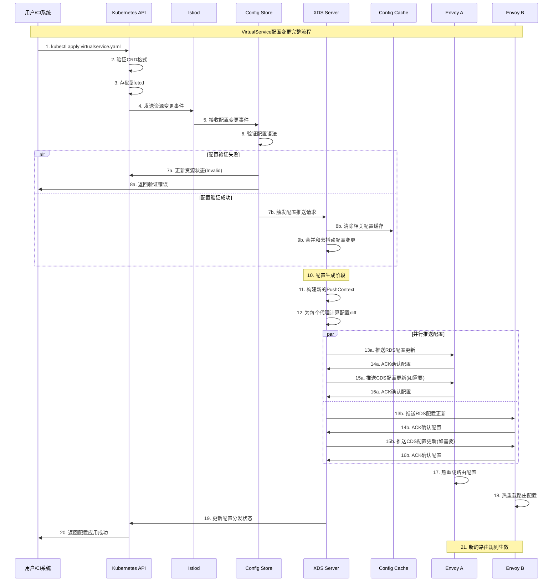
```mermaid
sequenceDiagram
    participant User as 用户/CI系统
    participant K8s as Kubernetes API
    participant Istiod as Istiod
    participant ConfigStore as Config Store
    participant XDS as XDS Server
    participant Cache as Config Cache
    participant EnvoyA as Envoy A
    participant EnvoyB as Envoy B
    
    Note over User,EnvoyB: VirtualService配置变更完整流程
    
    %% 配置提交
    User->>K8s: 1. kubectl apply virtualservice.yaml
    K8s->>K8s: 2. 验证CRD格式
    K8s->>K8s: 3. 存储到etcd
    K8s->>Istiod: 4. 发送资源变更事件
    
    %% Istiod配置处理
    Istiod->>ConfigStore: 5. 接收配置变更事件
    ConfigStore->>ConfigStore: 6. 验证配置语法
    
    alt 配置验证失败
        ConfigStore->>K8s: 7a. 更新资源状态(Invalid)
        ConfigStore->>User: 8a. 返回验证错误
    else 配置验证成功
        ConfigStore->>XDS: 7b. 触发配置推送请求
        XDS->>Cache: 8b. 清除相关配置缓存
        XDS->>XDS: 9b. 合并和去抖动配置变更
    end
    
    %% 配置生成和分发
    Note over XDS: 10. 配置生成阶段
    XDS->>XDS: 11. 构建新的PushContext
    XDS->>XDS: 12. 为每个代理计算配置diff
    
    par 并行推送配置
        XDS->>EnvoyA: 13a. 推送RDS配置更新
        EnvoyA->>XDS: 14a. ACK确认配置
        XDS->>EnvoyA: 15a. 推送CDS配置更新(如需要)
        EnvoyA->>XDS: 16a. ACK确认配置
    and
        XDS->>EnvoyB: 13b. 推送RDS配置更新
        EnvoyB->>XDS: 14b. ACK确认配置
        XDS->>EnvoyB: 15b. 推送CDS配置更新(如需要)
        EnvoyB->>XDS: 16b. ACK确认配置
    end
    
    %% 配置生效
    EnvoyA->>EnvoyA: 17. 热重载路由配置
    EnvoyB->>EnvoyB: 18. 热重载路由配置
    
    XDS->>K8s: 19. 更新配置分发状态
    K8s->>User: 20. 返回配置应用成功
    
    Note over EnvoyA,EnvoyB: 21. 新的路由规则生效
```

### 3.2 服务发现更新流程

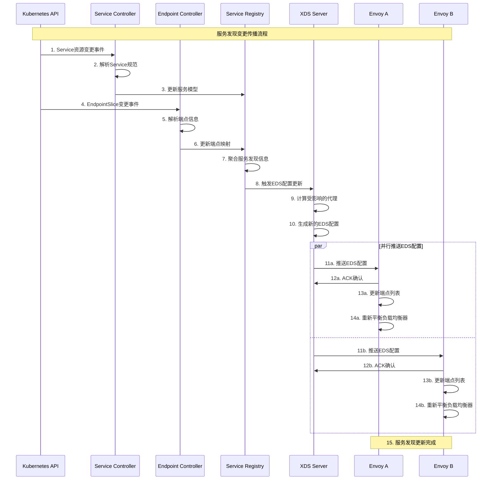
```mermaid
sequenceDiagram
    participant K8s as Kubernetes API
    participant Service as Service Controller
    participant Endpoint as Endpoint Controller
    participant Registry as Service Registry
    participant XDS as XDS Server
    participant EnvoyA as Envoy A
    participant EnvoyB as Envoy B
    
    Note over K8s,EnvoyB: 服务发现变更传播流程
    
    %% 服务变更事件
    K8s->>Service: 1. Service资源变更事件
    Service->>Service: 2. 解析Service规范
    Service->>Registry: 3. 更新服务模型
    
    K8s->>Endpoint: 4. EndpointSlice变更事件
    Endpoint->>Endpoint: 5. 解析端点信息
    Endpoint->>Registry: 6. 更新端点映射
    
    %% 聚合和通知
    Registry->>Registry: 7. 聚合服务发现信息
    Registry->>XDS: 8. 触发EDS配置更新
    
    %% XDS配置生成
    XDS->>XDS: 9. 计算受影响的代理
    XDS->>XDS: 10. 生成新的EDS配置
    
    %% 配置推送
    par 并行推送EDS配置
        XDS->>EnvoyA: 11a. 推送EDS配置
        EnvoyA->>XDS: 12a. ACK确认
        EnvoyA->>EnvoyA: 13a. 更新端点列表
        EnvoyA->>EnvoyA: 14a. 重新平衡负载均衡器
    and
        XDS->>EnvoyB: 11b. 推送EDS配置
        EnvoyB->>XDS: 12b. ACK确认  
        EnvoyB->>EnvoyB: 13b. 更新端点列表
        EnvoyB->>EnvoyB: 14b. 重新平衡负载均衡器
    end
    
    Note over EnvoyA,EnvoyB: 15. 服务发现更新完成
```

## 4. 证书管理生命周期

### 4.1 工作负载证书获取流程

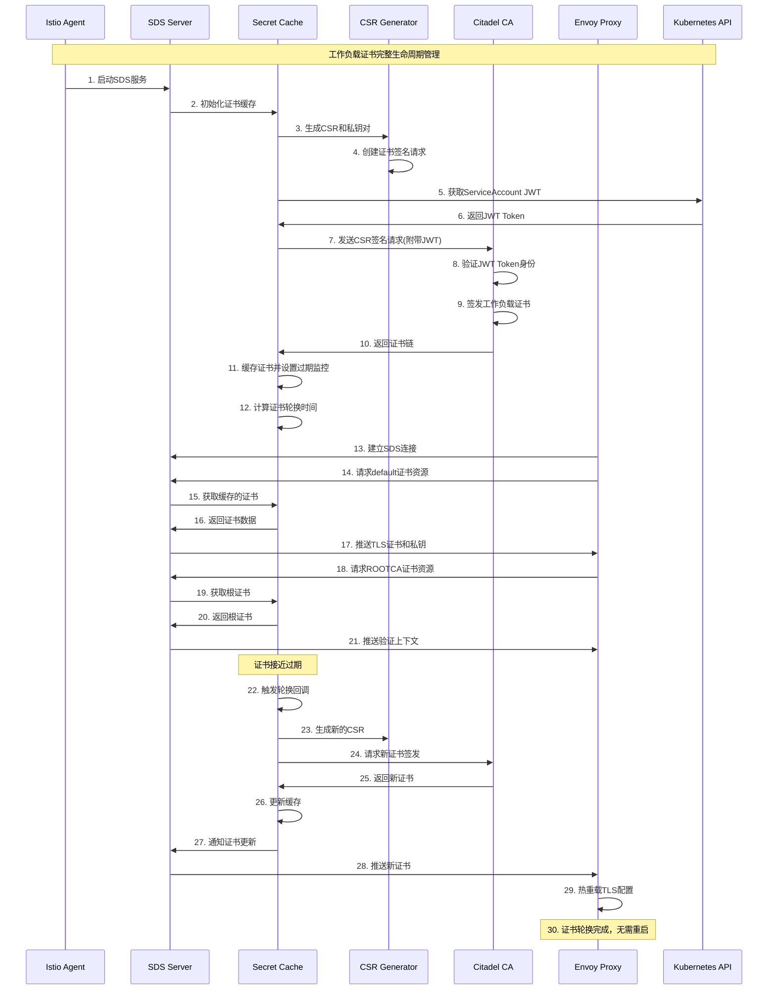
```mermaid
sequenceDiagram
    participant Agent as Istio Agent
    participant SDS as SDS Server
    participant Cache as Secret Cache
    participant CSR as CSR Generator
    participant CA as Citadel CA
    participant Envoy as Envoy Proxy
    participant K8s as Kubernetes API
    
    Note over Agent,K8s: 工作负载证书完整生命周期管理
    
    %% 启动阶段证书预热
    Agent->>SDS: 1. 启动SDS服务
    SDS->>Cache: 2. 初始化证书缓存
    Cache->>CSR: 3. 生成CSR和私钥对
    CSR->>CSR: 4. 创建证书签名请求
    
    Cache->>K8s: 5. 获取ServiceAccount JWT
    K8s->>Cache: 6. 返回JWT Token
    
    Cache->>CA: 7. 发送CSR签名请求(附带JWT)
    CA->>CA: 8. 验证JWT Token身份
    CA->>CA: 9. 签发工作负载证书
    CA->>Cache: 10. 返回证书链
    
    Cache->>Cache: 11. 缓存证书并设置过期监控
    Cache->>Cache: 12. 计算证书轮换时间
    
    %% Envoy获取证书
    Envoy->>SDS: 13. 建立SDS连接
    Envoy->>SDS: 14. 请求default证书资源
    SDS->>Cache: 15. 获取缓存的证书
    Cache->>SDS: 16. 返回证书数据
    SDS->>Envoy: 17. 推送TLS证书和私钥
    
    Envoy->>SDS: 18. 请求ROOTCA证书资源
    SDS->>Cache: 19. 获取根证书
    Cache->>SDS: 20. 返回根证书
    SDS->>Envoy: 21. 推送验证上下文
    
    %% 证书轮换
    Note over Cache: 证书接近过期
    Cache->>Cache: 22. 触发轮换回调
    Cache->>CSR: 23. 生成新的CSR
    Cache->>CA: 24. 请求新证书签发
    CA->>Cache: 25. 返回新证书
    Cache->>Cache: 26. 更新缓存
    Cache->>SDS: 27. 通知证书更新
    SDS->>Envoy: 28. 推送新证书
    Envoy->>Envoy: 29. 热重载TLS配置
    
    Note over Envoy: 30. 证书轮换完成，无需重启
```

### 4.2 证书撤销和更新流程

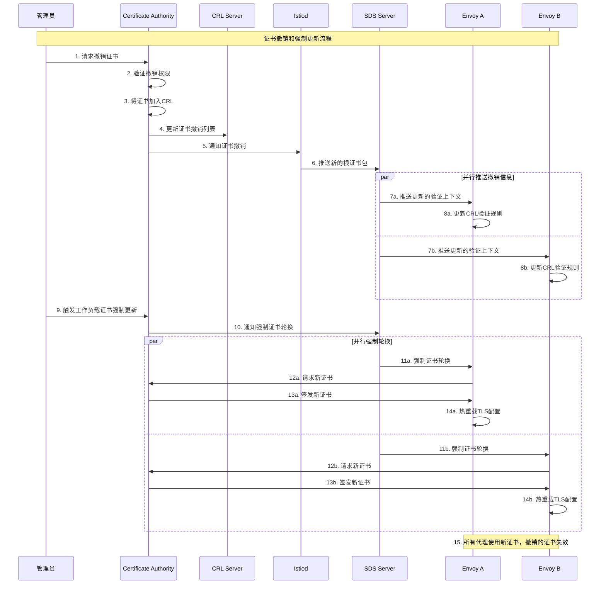
```mermaid
sequenceDiagram
    participant Admin as 管理员
    participant CA as Certificate Authority
    participant CRL as CRL Server
    participant Istiod as Istiod
    participant SDS as SDS Server
    participant EnvoyA as Envoy A
    participant EnvoyB as Envoy B
    
    Note over Admin,EnvoyB: 证书撤销和强制更新流程
    
    %% 证书撤销
    Admin->>CA: 1. 请求撤销证书
    CA->>CA: 2. 验证撤销权限
    CA->>CA: 3. 将证书加入CRL
    CA->>CRL: 4. 更新证书撤销列表
    
    %% 分发撤销信息
    CA->>Istiod: 5. 通知证书撤销
    Istiod->>SDS: 6. 推送新的根证书包
    
    par 并行推送撤销信息
        SDS->>EnvoyA: 7a. 推送更新的验证上下文
        EnvoyA->>EnvoyA: 8a. 更新CRL验证规则
    and
        SDS->>EnvoyB: 7b. 推送更新的验证上下文
        EnvoyB->>EnvoyB: 8b. 更新CRL验证规则
    end
    
    %% 强制证书更新
    Admin->>CA: 9. 触发工作负载证书强制更新
    CA->>SDS: 10. 通知强制证书轮换
    
    par 并行强制轮换
        SDS->>EnvoyA: 11a. 强制证书轮换
        EnvoyA->>CA: 12a. 请求新证书
        CA->>EnvoyA: 13a. 签发新证书
        EnvoyA->>EnvoyA: 14a. 热重载TLS配置
    and
        SDS->>EnvoyB: 11b. 强制证书轮换
        EnvoyB->>CA: 12b. 请求新证书
        CA->>EnvoyB: 13b. 签发新证书
        EnvoyB->>EnvoyB: 14b. 热重载TLS配置
    end
    
    Note over EnvoyA,EnvoyB: 15. 所有代理使用新证书，撤销的证书失效
```

## 5. 故障检测与恢复流程

### 5.1 服务故障检测时序

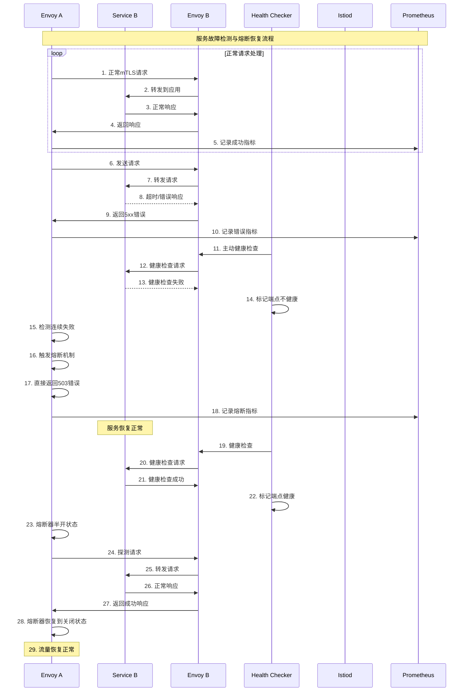
```mermaid
sequenceDiagram
    participant EnvoyA as Envoy A
    participant ServiceB as Service B
    participant EnvoyB as Envoy B
    participant HealthCheck as Health Checker
    participant Istiod as Istiod
    participant Prometheus as Prometheus
    
    Note over EnvoyA,Prometheus: 服务故障检测与熔断恢复流程
    
    %% 正常流量
    loop 正常请求处理
        EnvoyA->>EnvoyB: 1. 正常mTLS请求
        EnvoyB->>ServiceB: 2. 转发到应用
        ServiceB->>EnvoyB: 3. 正常响应
        EnvoyB->>EnvoyA: 4. 返回响应
        EnvoyA->>Prometheus: 5. 记录成功指标
    end
    
    %% 服务开始出现问题
    EnvoyA->>EnvoyB: 6. 发送请求
    EnvoyB->>ServiceB: 7. 转发请求
    ServiceB-->>EnvoyB: 8. 超时/错误响应
    EnvoyB->>EnvoyA: 9. 返回5xx错误
    EnvoyA->>Prometheus: 10. 记录错误指标
    
    %% 健康检查检测到故障
    HealthCheck->>EnvoyB: 11. 主动健康检查
    EnvoyB->>ServiceB: 12. 健康检查请求
    ServiceB-->>EnvoyB: 13. 健康检查失败
    HealthCheck->>HealthCheck: 14. 标记端点不健康
    
    %% 熔断机制触发
    EnvoyA->>EnvoyA: 15. 检测连续失败
    EnvoyA->>EnvoyA: 16. 触发熔断机制
    
    %% 后续请求处理
    EnvoyA->>EnvoyA: 17. 直接返回503错误
    EnvoyA->>Prometheus: 18. 记录熔断指标
    
    %% 服务恢复
    Note over ServiceB: 服务恢复正常
    HealthCheck->>EnvoyB: 19. 健康检查
    EnvoyB->>ServiceB: 20. 健康检查请求
    ServiceB->>EnvoyB: 21. 健康检查成功
    HealthCheck->>HealthCheck: 22. 标记端点健康
    
    %% 熔断恢复
    EnvoyA->>EnvoyA: 23. 熔断器半开状态
    EnvoyA->>EnvoyB: 24. 探测请求
    EnvoyB->>ServiceB: 25. 转发请求
    ServiceB->>EnvoyB: 26. 正常响应
    EnvoyB->>EnvoyA: 27. 返回成功响应
    EnvoyA->>EnvoyA: 28. 熔断器恢复到关闭状态
    
    Note over EnvoyA: 29. 流量恢复正常
```

### 5.2 网络分区恢复流程

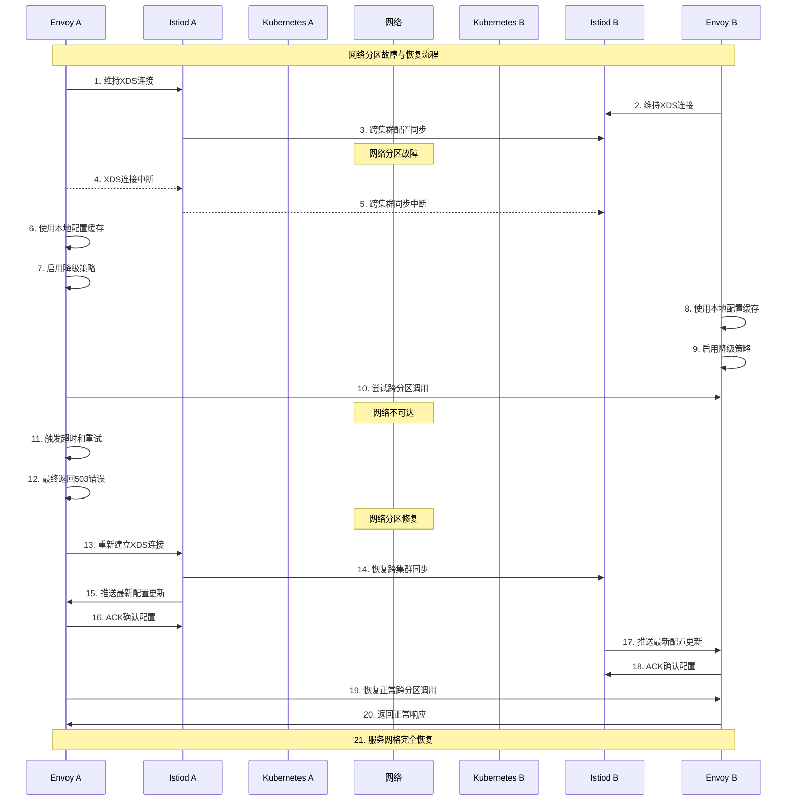
```mermaid
sequenceDiagram
    participant EnvoyA as Envoy A
    participant IstiodA as Istiod A
    participant K8sA as Kubernetes A
    participant Network as 网络
    participant K8sB as Kubernetes B  
    participant IstiodB as Istiod B
    participant EnvoyB as Envoy B
    
    Note over EnvoyA,EnvoyB: 网络分区故障与恢复流程
    
    %% 正常状态
    EnvoyA->>IstiodA: 1. 维持XDS连接
    EnvoyB->>IstiodB: 2. 维持XDS连接
    IstiodA->>IstiodB: 3. 跨集群配置同步
    
    %% 网络分区发生
    Note over Network: 网络分区故障
    EnvoyA-->>IstiodA: 4. XDS连接中断
    IstiodA-->>IstiodB: 5. 跨集群同步中断
    
    %% 本地缓存降级
    EnvoyA->>EnvoyA: 6. 使用本地配置缓存
    EnvoyA->>EnvoyA: 7. 启用降级策略
    
    EnvoyB->>EnvoyB: 8. 使用本地配置缓存
    EnvoyB->>EnvoyB: 9. 启用降级策略
    
    %% 故障期间的服务调用
    EnvoyA->>EnvoyB: 10. 尝试跨分区调用
    Note over Network: 网络不可达
    EnvoyA->>EnvoyA: 11. 触发超时和重试
    EnvoyA->>EnvoyA: 12. 最终返回503错误
    
    %% 网络恢复
    Note over Network: 网络分区修复
    EnvoyA->>IstiodA: 13. 重新建立XDS连接
    IstiodA->>IstiodB: 14. 恢复跨集群同步
    
    %% 配置同步
    IstiodA->>EnvoyA: 15. 推送最新配置更新
    EnvoyA->>IstiodA: 16. ACK确认配置
    
    IstiodB->>EnvoyB: 17. 推送最新配置更新
    EnvoyB->>IstiodB: 18. ACK确认配置
    
    %% 服务恢复
    EnvoyA->>EnvoyB: 19. 恢复正常跨分区调用
    EnvoyB->>EnvoyA: 20. 返回正常响应
    
    Note over EnvoyA,EnvoyB: 21. 服务网格完全恢复
```

## 6. Ambient模式工作流程

### 6.1 Ambient零信任隧道通信

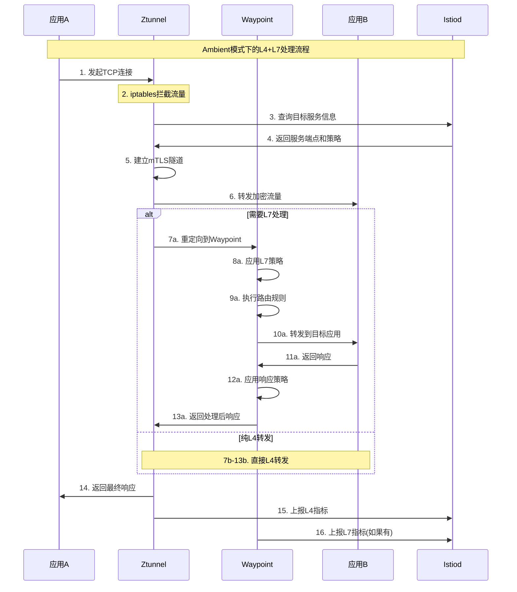
```mermaid
sequenceDiagram
    participant AppA as 应用A
    participant Ztunnel as Ztunnel
    participant Waypoint as Waypoint
    participant AppB as 应用B
    participant Istiod as Istiod
    
    Note over AppA,Istiod: Ambient模式下的L4+L7处理流程
    
    %% L4安全隧道
    AppA->>Ztunnel: 1. 发起TCP连接
    Note over Ztunnel: 2. iptables拦截流量
    
    Ztunnel->>Istiod: 3. 查询目标服务信息
    Istiod->>Ztunnel: 4. 返回服务端点和策略
    
    Ztunnel->>Ztunnel: 5. 建立mTLS隧道
    Ztunnel->>AppB: 6. 转发加密流量
    
    %% L7策略处理(如果有Waypoint)
    alt 需要L7处理
        Ztunnel->>Waypoint: 7a. 重定向到Waypoint
        Waypoint->>Waypoint: 8a. 应用L7策略
        Waypoint->>Waypoint: 9a. 执行路由规则
        Waypoint->>AppB: 10a. 转发到目标应用
        AppB->>Waypoint: 11a. 返回响应
        Waypoint->>Waypoint: 12a. 应用响应策略
        Waypoint->>Ztunnel: 13a. 返回处理后响应
    else 纯L4转发
        Note over Ztunnel,AppB: 7b-13b. 直接L4转发
    end
    
    Ztunnel->>AppA: 14. 返回最终响应
    
    %% 指标和追踪
    Ztunnel->>Istiod: 15. 上报L4指标
    Waypoint->>Istiod: 16. 上报L7指标(如果有)
```

## 7. 多集群服务网格通信

### 7.1 跨集群服务发现流程

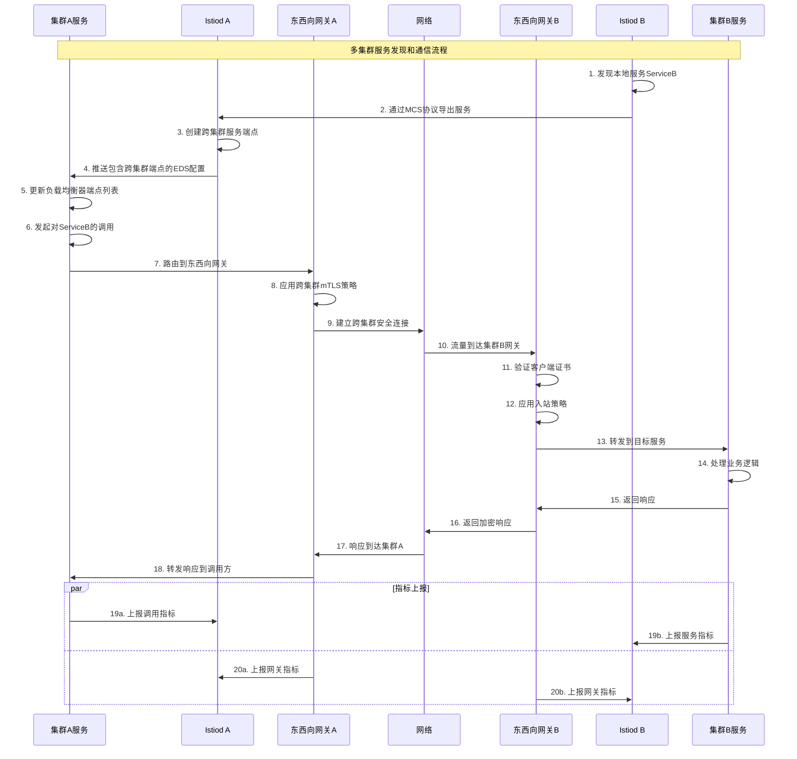
```mermaid
sequenceDiagram
    participant ServiceA as 集群A服务
    participant IstiodA as Istiod A
    participant EastWestA as 东西向网关A
    participant Network as 网络
    participant EastWestB as 东西向网关B
    participant IstiodB as Istiod B
    participant ServiceB as 集群B服务
    
    Note over ServiceA,ServiceB: 多集群服务发现和通信流程
    
    %% 跨集群服务发现
    IstiodB->>IstiodB: 1. 发现本地服务ServiceB
    IstiodB->>IstiodA: 2. 通过MCS协议导出服务
    IstiodA->>IstiodA: 3. 创建跨集群服务端点
    
    %% 配置分发
    IstiodA->>ServiceA: 4. 推送包含跨集群端点的EDS配置
    ServiceA->>ServiceA: 5. 更新负载均衡器端点列表
    
    %% 跨集群调用
    ServiceA->>ServiceA: 6. 发起对ServiceB的调用
    ServiceA->>EastWestA: 7. 路由到东西向网关
    
    EastWestA->>EastWestA: 8. 应用跨集群mTLS策略
    EastWestA->>Network: 9. 建立跨集群安全连接
    Network->>EastWestB: 10. 流量到达集群B网关
    
    EastWestB->>EastWestB: 11. 验证客户端证书
    EastWestB->>EastWestB: 12. 应用入站策略
    EastWestB->>ServiceB: 13. 转发到目标服务
    
    ServiceB->>ServiceB: 14. 处理业务逻辑
    ServiceB->>EastWestB: 15. 返回响应
    
    EastWestB->>Network: 16. 返回加密响应
    Network->>EastWestA: 17. 响应到达集群A
    EastWestA->>ServiceA: 18. 转发响应到调用方
    
    %% 指标和追踪
    par 指标上报
        ServiceA->>IstiodA: 19a. 上报调用指标
        ServiceB->>IstiodB: 19b. 上报服务指标
    and
        EastWestA->>IstiodA: 20a. 上报网关指标
        EastWestB->>IstiodB: 20b. 上报网关指标
    end
```

## 8. 运维诊断工作流程

### 8.1 istioctl故障排查时序

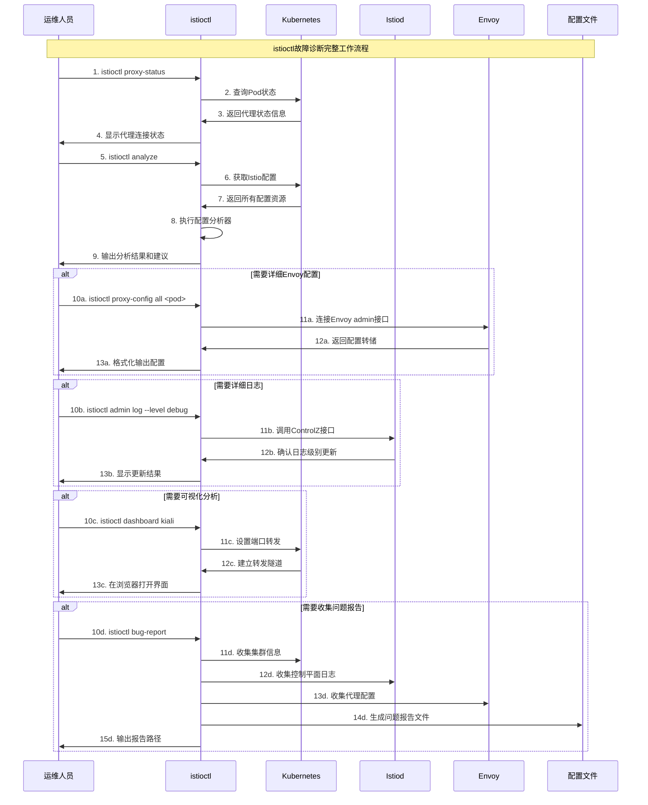
```mermaid
sequenceDiagram
    participant Operator as 运维人员
    participant istioctl as istioctl
    participant K8s as Kubernetes
    participant Istiod as Istiod
    participant Envoy as Envoy
    participant Files as 配置文件
    
    Note over Operator,Files: istioctl故障诊断完整工作流程
    
    %% 问题发现
    Operator->>istioctl: 1. istioctl proxy-status
    istioctl->>K8s: 2. 查询Pod状态
    K8s->>istioctl: 3. 返回代理状态信息
    istioctl->>Operator: 4. 显示代理连接状态
    
    %% 配置分析  
    Operator->>istioctl: 5. istioctl analyze
    istioctl->>K8s: 6. 获取Istio配置
    K8s->>istioctl: 7. 返回所有配置资源
    istioctl->>istioctl: 8. 执行配置分析器
    istioctl->>Operator: 9. 输出分析结果和建议
    
    %% 详细配置检查
    alt 需要详细Envoy配置
        Operator->>istioctl: 10a. istioctl proxy-config all <pod>
        istioctl->>Envoy: 11a. 连接Envoy admin接口
        Envoy->>istioctl: 12a. 返回配置转储
        istioctl->>Operator: 13a. 格式化输出配置
    end
    
    %% 日志调试
    alt 需要详细日志
        Operator->>istioctl: 10b. istioctl admin log --level debug
        istioctl->>Istiod: 11b. 调用ControlZ接口
        Istiod->>istioctl: 12b. 确认日志级别更新
        istioctl->>Operator: 13b. 显示更新结果
    end
    
    %% 可视化分析
    alt 需要可视化分析
        Operator->>istioctl: 10c. istioctl dashboard kiali
        istioctl->>K8s: 11c. 设置端口转发
        K8s->>istioctl: 12c. 建立转发隧道
        istioctl->>Operator: 13c. 在浏览器打开界面
    end
    
    %% 问题报告收集
    alt 需要收集问题报告
        Operator->>istioctl: 10d. istioctl bug-report
        istioctl->>K8s: 11d. 收集集群信息
        istioctl->>Istiod: 12d. 收集控制平面日志
        istioctl->>Envoy: 13d. 收集代理配置
        istioctl->>Files: 14d. 生成问题报告文件
        istioctl->>Operator: 15d. 输出报告路径
    end
```

## 9. 性能优化流程

### 9.1 性能监控与调优时序

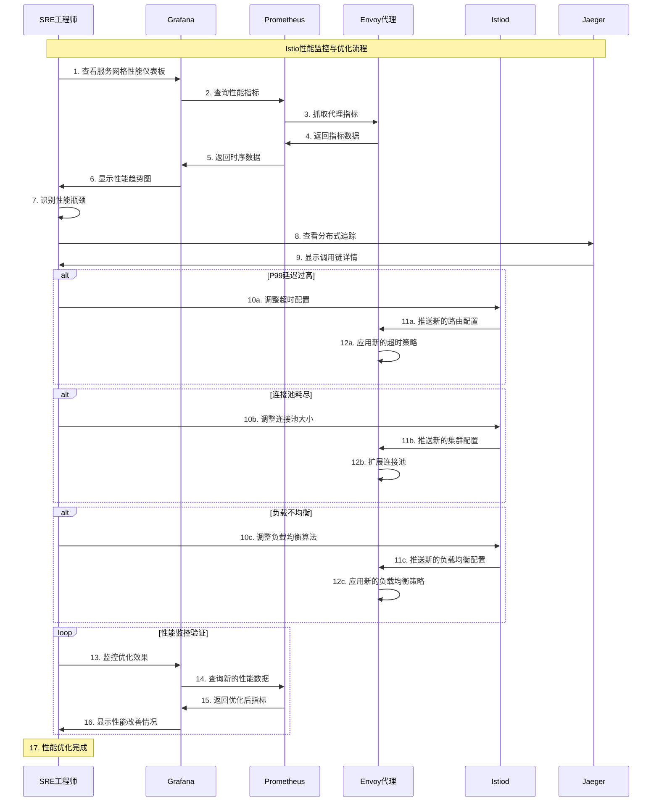
```mermaid
sequenceDiagram
    participant SRE as SRE工程师
    participant Grafana as Grafana
    participant Prometheus as Prometheus
    participant Envoy as Envoy代理
    participant Istiod as Istiod
    participant Jaeger as Jaeger
    
    Note over SRE,Jaeger: Istio性能监控与优化流程
    
    %% 性能基线建立
    SRE->>Grafana: 1. 查看服务网格性能仪表板
    Grafana->>Prometheus: 2. 查询性能指标
    Prometheus->>Envoy: 3. 抓取代理指标
    Envoy->>Prometheus: 4. 返回指标数据
    Prometheus->>Grafana: 5. 返回时序数据
    Grafana->>SRE: 6. 显示性能趋势图
    
    %% 性能问题识别
    SRE->>SRE: 7. 识别性能瓶颈
    SRE->>Jaeger: 8. 查看分布式追踪
    Jaeger->>SRE: 9. 显示调用链详情
    
    %% 配置优化
    alt P99延迟过高
        SRE->>Istiod: 10a. 调整超时配置
        Istiod->>Envoy: 11a. 推送新的路由配置
        Envoy->>Envoy: 12a. 应用新的超时策略
    end
    
    alt 连接池耗尽
        SRE->>Istiod: 10b. 调整连接池大小
        Istiod->>Envoy: 11b. 推送新的集群配置
        Envoy->>Envoy: 12b. 扩展连接池
    end
    
    alt 负载不均衡
        SRE->>Istiod: 10c. 调整负载均衡算法
        Istiod->>Envoy: 11c. 推送新的负载均衡配置
        Envoy->>Envoy: 12c. 应用新的负载均衡策略
    end
    
    %% 效果验证
    loop 性能监控验证
        SRE->>Grafana: 13. 监控优化效果
        Grafana->>Prometheus: 14. 查询新的性能数据
        Prometheus->>Grafana: 15. 返回优化后指标
        Grafana->>SRE: 16. 显示性能改善情况
    end
    
    Note over SRE: 17. 性能优化完成
```

## 10. 生产环境最佳实践与故障排查

### 10.1 基于业界实践的性能优化策略

根据各大公司在生产环境运行Istio的实践经验，以下是关键的性能优化策略：

#### 10.1.1 控制平面优化

```yaml
# Istiod资源配置优化
apiVersion: v1
kind: ConfigMap
metadata:
  name: istio-performance-config
data:
  # XDS推送优化
  PILOT_DEBOUNCE_AFTER: "100ms"           # 去抖动延迟
  PILOT_DEBOUNCE_MAX: "10s"               # 最大去抖动时间
  PILOT_PUSH_THROTTLE: "100"              # 推送限流
  
  # 缓存优化
  PILOT_ENABLE_CONFIG_DISTRIBUTION_TRACKING: "false"  # 禁用分发跟踪
  PILOT_ENABLE_CROSS_CLUSTER_WORKLOAD_ENTRY: "false"  # 禁用跨集群工作负载
  
  # 内存优化
  PILOT_MAX_REQUESTS_PER_SECOND: "25"     # 限制请求频率
  GOMEMLIMIT: "6GiB"                      # Go内存限制
```

#### 10.1.2 数据平面优化

```yaml
# Envoy代理资源优化
apiVersion: v1
kind: ConfigMap  
metadata:
  name: istio-proxy-config
data:
  # 连接池优化
  connectionPoolSettings: |
    tcp:
      maxConnections: 100           # 最大连接数
      connectTimeout: 30s           # 连接超时
      keepAlive:
        time: 7200s                 # TCP keepalive时间
        interval: 60s               # keepalive间隔
    http:
      http1MaxPendingRequests: 1024 # HTTP/1.1待处理请求
      http2MaxRequests: 1000        # HTTP/2最大请求数
      maxRequestsPerConnection: 10  # 每连接最大请求
      
  # 熔断配置
  outlierDetection: |
    consecutiveGatewayErrors: 5     # 连续网关错误
    consecutive5xxErrors: 5         # 连续5xx错误  
    interval: 30s                   # 检测间隔
    baseEjectionTime: 30s           # 基础驱逐时间
    maxEjectionPercent: 50          # 最大驱逐百分比
```

### 10.2 常见故障排查流程

基于社区和企业实践总结的故障排查标准流程：

#### 10.2.1 连通性问题诊断

```bash
# 1. 检查代理连接状态
istioctl proxy-status

# 2. 检查具体代理的配置同步状态  
istioctl proxy-status productpage-v1-12345.default

# 3. 验证服务发现是否正常
istioctl proxy-config endpoints productpage-v1-12345.default

# 4. 检查集群配置
istioctl proxy-config clusters productpage-v1-12345.default --fqdn reviews.default.svc.cluster.local

# 5. 验证路由规则
istioctl proxy-config routes productpage-v1-12345.default --name 9080
```

#### 10.2.2 mTLS问题诊断

```bash
# 1. 检查证书状态
istioctl proxy-config secret productpage-v1-12345.default

# 2. 验证根CA一致性
istioctl proxy-config rootca-compare productpage-v1-12345.default reviews-v1-67890.default

# 3. 检查PeerAuthentication策略
kubectl get peerauthentication -A

# 4. 验证SPIFFE身份
istioctl authz check productpage-v1-12345.default
```

### 10.3 监控告警最佳实践

#### 10.3.1 关键监控指标

```prometheus
# 控制平面关键指标
# XDS推送延迟
pilot_xds_push_time{type="cds"} > 1000

# 配置同步失败率
increase(pilot_xds_write_timeout[5m]) > 10

# 代理连接数
pilot_xds_clients{} < expected_proxy_count * 0.9

# 数据平面关键指标  
# 请求成功率
sum(rate(istio_requests_total{response_code!~"5.*"}[5m])) / 
sum(rate(istio_requests_total[5m])) < 0.99

# P99延迟
histogram_quantile(0.99, 
  sum(rate(istio_request_duration_milliseconds_bucket[5m])) 
  by (le, source_service_name, destination_service_name)) > 1000

# 证书过期告警
cert_chain_expiry_seconds < 7 * 24 * 3600  # 7天内过期
```

#### 10.3.2 自动故障恢复机制

```go
// 基于监控指标的自动恢复逻辑
type AutoRecoveryManager struct {
    metrics     *prometheus.Client
    istiod      *istiod.Client
    alertRules  []RecoveryRule
}

type RecoveryRule struct {
    Condition   string                    // 触发条件
    Action      RecoveryAction           // 恢复动作  
    Cooldown    time.Duration            // 冷却时间
    MaxRetries  int                      // 最大重试次数
}

// 监控和自动恢复循环
func (arm *AutoRecoveryManager) Run(ctx context.Context) {
    ticker := time.NewTicker(30 * time.Second)
    defer ticker.Stop()
    
    for {
        select {
        case <-ticker.C:
            for _, rule := range arm.alertRules {
                if arm.evaluateCondition(rule.Condition) {
                    go arm.executeRecovery(rule)
                }
            }
        case <-ctx.Done():
            return
        }
    }
}

// 执行自动恢复动作
func (arm *AutoRecoveryManager) executeRecovery(rule RecoveryRule) {
    switch rule.Action {
    case RestartIstiod:
        // 重启控制平面
        arm.restartIstiodPods()
        
    case ClearXDSCache:
        // 清理XDS缓存
        arm.istiod.ClearCache()
        
    case ForceConfigSync:
        // 强制配置同步
        arm.istiod.TriggerFullPush()
        
    case RestartProblematicProxies:
        // 重启有问题的代理
        arm.restartUnhealthyProxies()
    }
}
```

### 10.4 大规模部署经验总结

#### 10.4.1 容量规划建议

基于生产环境运维经验，以下是不同规模下的资源配置建议：

| 集群规模 | 服务数量 | Istiod配置 | 代理配置 | 关键优化 |
|---------|---------|------------|----------|----------|
| **小型** | < 50 | 1 replica, 2C4G | 0.1C/0.2G | 启用配置懒加载 |
| **中型** | 50-200 | 2 replicas, 4C8G | 0.2C/0.5G | 启用增量XDS |
| **大型** | 200-1000 | 3 replicas, 8C16G | 0.5C/1G | 分片部署，启用缓存 |
| **超大型** | > 1000 | 5+ replicas, 16C32G | 1C/2G | 多集群，专用控制平面 |

#### 10.4.2 生产环境检查清单

```bash
# 部署前检查清单
#!/bin/bash

echo "=== Istio生产环境部署检查清单 ==="

# 1. 检查Kubernetes版本兼容性
echo "1. 检查K8s版本..."
kubectl version --short

# 2. 检查资源配额
echo "2. 检查资源配额..."
kubectl describe resourcequota -n istio-system

# 3. 验证网络策略
echo "3. 检查网络策略..."
kubectl get networkpolicy -A

# 4. 检查存储类
echo "4. 检查存储类..."
kubectl get storageclass

# 5. 验证RBAC权限
echo "5. 检查RBAC权限..."
kubectl auth can-i "*" "*" --as=system:serviceaccount:istio-system:istiod

# 6. 检查DNS解析
echo "6. 测试DNS解析..."
nslookup kubernetes.default.svc.cluster.local

# 7. 验证证书配置
echo "7. 检查证书配置..."
kubectl get secret -n istio-system | grep cacerts

echo "=== 检查完成 ==="
```

## 11. 总结

通过这些详细的时序图，我们可以看到Istio服务网格的几个关键设计特点：

### 10.1 核心工作流程特点

- **异步事件驱动**：所有配置变更都通过事件机制异步处理
- **最终一致性**：配置分发采用最终一致性模型，保证系统稳定性
- **智能缓存机制**：多层缓存减少延迟，提高系统性能
- **优雅降级能力**：网络分区时使用本地缓存保证服务可用性

### 10.2 架构优势体现

- **高可用性**：分布式架构和故障隔离机制
- **高性能**：智能配置缓存和增量更新
- **强一致性**：统一的配置模型和验证机制  
- **可观测性**：完善的指标、日志和追踪系统

### 10.3 运维友好性

- **丰富的诊断工具**：istioctl提供全面的故障排查能力
- **可视化界面**：集成多种监控和分析工具
- **自动化支持**：支持配置验证和批量操作
- **渐进式部署**：支持金丝雀发布和版本管理

## 附录A：关键函数与结构


### A.1 与时序强相关的关键函数

```go
// 证书获取：SDS → Istiod CA
func (s *SecretCache) GenerateSecret(resourceName string) (*security.SecretItem, error) {
    // 省略缓存命中/轮换判断
    csr := BuildCSR(/* saJWT, ids */)
    certChain, root := s.caClient.Sign(csr)
    return &security.SecretItem{ CertificateChain: certChain, RootCert: root }, nil
}

// EndpointSlice → EDS 触发
func (c *Controller) onEndpointSliceEvent(es *v1.EndpointSlice, event model.Event) error {
    endpoints := kube.ConvertEndpointSlice(es, c.domainSuffix, c.clusterID)
    shard := model.ShardKey{ Cluster: c.clusterID, Provider: provider.Kubernetes }
    c.xdsUpdater.EDSUpdate(shard, es.Labels[v1.LabelServiceName], es.Namespace, endpoints)
    return nil
}

// istioctl analyze（概念化）：拉取配置并执行分析器
func Analyze(ctx context.Context, clients []kube.Client, analyzers []Analyzer) ([]Message, error) {
    configs := FetchAllConfigs(clients)
    return RunAnalyzers(configs, analyzers), nil
}
```

### A.2 细节小结

- 启动：`app.NewRootCommand` → `newDiscoveryCommand` → `bootstrap.NewServer` → `Server.Start`
- mTLS：`Envoy(SDS)` → `SecretCache.GenerateSecret` → `Istiod CA.Sign` → `SDS → Envoy`
- 配置分发：`CRD Client.handleEvent` → `Server.configHandler` → `XDSServer.ConfigUpdate` → `debounce` → `Push` → `pushXds`
- 服务发现：`onEndpointSliceEvent` → `XDSUpdater.EDSUpdate` → `ConfigUpdate` → `Push(EDS)`
- 运维诊断：`istioctl proxy-config` → `Envoy admin` → 返回配置转储


### A.3 结构体关系

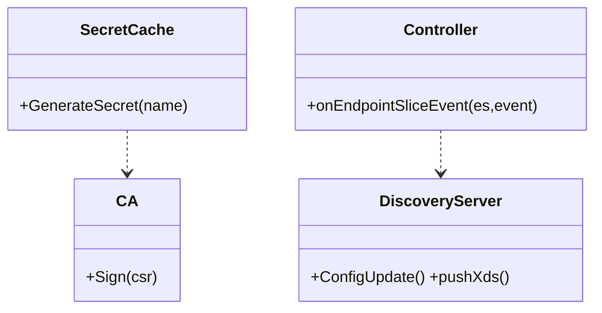
```mermaid
classDiagram
  class SecretCache { +GenerateSecret(name) }
  class CA { +Sign(csr) }
  class Controller { +onEndpointSliceEvent(es,event) }
  class DiscoveryServer { +ConfigUpdate() +pushXds() }
  SecretCache ..> CA
  Controller ..> DiscoveryServer
```
