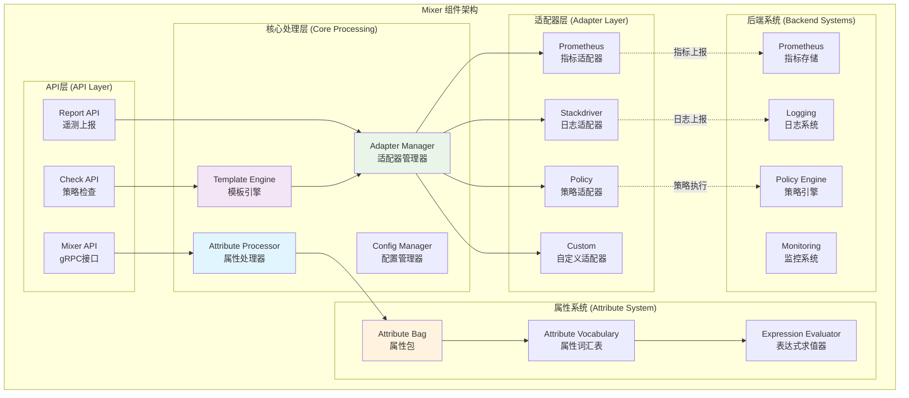
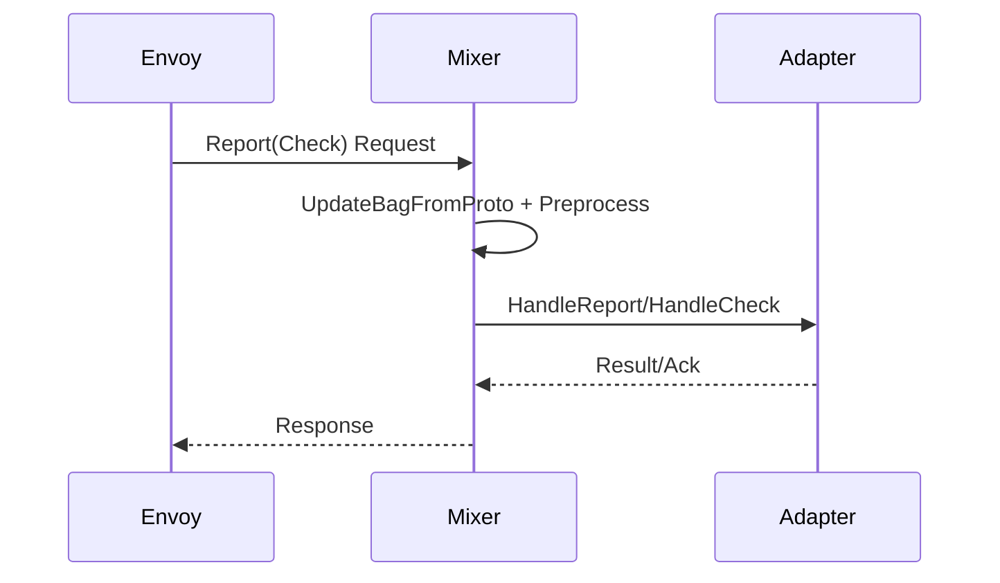
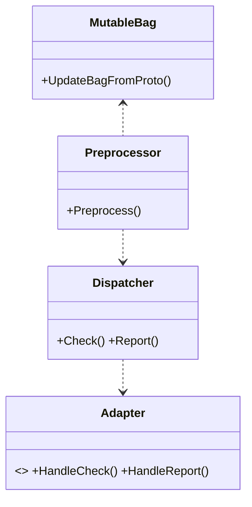

## 概述

Mixer是Istio早期版本中的重要组件，负责策略执行和遥测数据收集。虽然在新版本中其功能已经集成到Envoy和Istiod中，但其设计理念和实现机制仍然具有重要的Mixer的核心源码实现，重点剖析属性处理、策略执行、适配器机制等关键技术。
> 提示：自Istio 1.5起，社区逐步引入Telemetry v2（基于Envoy原生遥测、WASM扩展与控制平面直连），替代Mixer的数据路径。本文旨在保留架构演进脉络，并给出从Mixer迁移到Telemetry v2的实践要点：

- 遥测采集：优先使用Envoy原生统计与`stats`/`otel`过滤器，必要时通过WASM扩展指标与日志；
- 策略执行：迁移到`AuthorizationPolicy`/`PeerAuthentication`等原生CRD与Envoy RBAC/ExtAuthz集成；
- 适配器：以OpenTelemetry出口（OTLP）为主，避免自定义Mixer适配器；
- 兼容与回滚：分阶段灰度，双写指标（Mixer→OTel）对比一致性再切流。

<!--more-->

## 1. Mixer架构总览

### 1.1 核心组件架构



### 1.2 Mixer职责与特性

| 功能域 | 核心职责 | 关键特性 | 技术实现 |
|-------|----------|----------|----------|
| **策略执行** | 访问控制、配额管理 | 实时策略检查、动态配额分配 | Check API + Policy适配器 |
| **遥测收集** | 指标采集、日志记录 | 多维度指标、结构化日志 | Report API + 遥测适配器 |
| **属性管理** | 属性转换、表达式求值 | 强类型属性、高效求值 | Attribute Bag + 词汇表 |
| **扩展机制** | 适配器框架、自定义后端 | 插件化架构、热插拔 | 适配器接口 + 配置管理 |

## 2. 属性处理系统深度解析

### 2.1 属性词汇表与数据转换

属性处理是Mixer的核心能力：

```go
// mixer/pkg/attribute/mutableBag.go - 核心属性处理逻辑
type MutableBag struct {
    // 父属性包 - 支持属性继承
    parent Bag
    
    // 字符串属性映射
    strings map[string]string
    
    // 整数属性映射
    int64s map[string]int64
    
    // 浮点数属性映射
    float64s map[string]float64
    
    // 布尔属性映射
    bools map[string]bool
    
    // 时间属性映射
    times map[string]time.Time
    
    // 字节数组属性映射
    bytes map[string][]uint8
    
    // 字符串映射属性
    stringMaps map[string]map[string]string
    
    // 互斥锁保护并发访问
    lock sync.RWMutex
}

// UpdateBagFromProto - 从Protobuf消息更新属性包
// 这是Mixer属性处理的核心函数，负责将压缩的属性转换为标准词汇
func (mb *MutableBag) UpdateBagFromProto(attrs *mixerpb.CompressedAttributes, globalWordList []string) error {
    // 1. 获取消息词汇表
    messageWordList := attrs.Words
    
    // 2. 构建完整的词汇查找表
    // globalWordList是全局共享的词汇表，messageWordList是消息特定的词汇表
    totalWords := len(globalWordList) + len(messageWordList)
    wordList := make([]string, totalWords)
    copy(wordList[:len(globalWordList)], globalWordList)
    copy(wordList[len(globalWordList):], messageWordList)
    
    var e error
    
    // 3. 处理字符串属性
    for k, v := range attrs.Strings {
        // 查找属性名和值对应的词汇
        name, nameErr := lookup(k, globalWordList, messageWordList)
        value, valueErr := lookup(v, globalWordList, messageWordList)
        
        if nameErr != nil || valueErr != nil {
            e = multierror.Append(e, fmt.Errorf("string attribute lookup failed: name=%v, value=%v", nameErr, valueErr))
            continue
        }
        
        // 插入到属性包中
        if err := mb.insertProtoAttr(name, value, attributeTypeString); err != nil {
            e = multierror.Append(e, err)
        }
    }
    
    // 4. 处理整数属性
    for k, v := range attrs.Int64s {
        name, nameErr := lookup(k, globalWordList, messageWordList)
        if nameErr != nil {
            e = multierror.Append(e, fmt.Errorf("int64 attribute name lookup failed: %v", nameErr))
            continue
        }
        
        if err := mb.insertProtoAttr(name, v, attributeTypeInt64); err != nil {
            e = multierror.Append(e, err)
        }
    }
    
    // 5. 处理浮点数属性
    for k, v := range attrs.Float64s {
        name, nameErr := lookup(k, globalWordList, messageWordList)
        if nameErr != nil {
            e = multierror.Append(e, fmt.Errorf("float64 attribute name lookup failed: %v", nameErr))
            continue
        }
        
        if err := mb.insertProtoAttr(name, v, attributeTypeFloat64); err != nil {
            e = multierror.Append(e, err)
        }
    }
    
    // 6. 处理布尔属性
    for k, v := range attrs.Bools {
        name, nameErr := lookup(k, globalWordList, messageWordList)
        if nameErr != nil {
            e = multierror.Append(e, fmt.Errorf("bool attribute name lookup failed: %v", nameErr))
            continue
        }
        
        if err := mb.insertProtoAttr(name, v, attributeTypeBool); err != nil {
            e = multierror.Append(e, err)
        }
    }
    
    // 7. 处理时间戳属性
    for k, v := range attrs.Timestamps {
        name, nameErr := lookup(k, globalWordList, messageWordList)
        if nameErr != nil {
            e = multierror.Append(e, fmt.Errorf("timestamp attribute name lookup failed: %v", nameErr))
            continue
        }
        
        // 转换Protobuf时间戳为Go时间
        t := time.Unix(v.Seconds, int64(v.Nanos))
        if err := mb.insertProtoAttr(name, t, attributeTypeTime); err != nil {
            e = multierror.Append(e, err)
        }
    }
    
    // 8. 处理字节数组属性
    for k, v := range attrs.Bytes {
        name, nameErr := lookup(k, globalWordList, messageWordList)
        if nameErr != nil {
            e = multierror.Append(e, fmt.Errorf("bytes attribute name lookup failed: %v", nameErr))
            continue
        }
        
        if err := mb.insertProtoAttr(name, v, attributeTypeBytes); err != nil {
            e = multierror.Append(e, err)
        }
    }
    
    // 9. 处理字符串映射属性
    for k, v := range attrs.StringMaps {
        name, nameErr := lookup(k, globalWordList, messageWordList)
        if nameErr != nil {
            e = multierror.Append(e, fmt.Errorf("stringMap attribute name lookup failed: %v", nameErr))
            continue
        }
        
        // 转换值映射
        valueMap := make(map[string]string)
        for vk, vv := range v.Entries {
            valueKey, vkErr := lookup(vk, globalWordList, messageWordList)
            valueVal, vvErr := lookup(vv, globalWordList, messageWordList)
            
            if vkErr != nil || vvErr != nil {
                e = multierror.Append(e, fmt.Errorf("stringMap value lookup failed: key=%v, val=%v", vkErr, vvErr))
                continue
            }
            
            valueMap[valueKey] = valueVal
        }
        
        if err := mb.insertProtoAttr(name, valueMap, attributeTypeStringMap); err != nil {
            e = multierror.Append(e, err)
        }
    }
    
    return e
}

// 词汇查找核心函数
func lookup(index int32, globalList, messageList []string) (string, error) {
    if index < 0 {
        return "", fmt.Errorf("negative index %d", index)
    }
    
    // 先查找全局词汇表
    if index < int32(len(globalList)) {
        return globalList[index], nil
    }
    
    // 再查找消息词汇表
    messageIndex := index - int32(len(globalList))
    if messageIndex < int32(len(messageList)) {
        return messageList[messageIndex], nil
    }
    
    return "", fmt.Errorf("index %d out of range (global: %d, message: %d)",
                        index, len(globalList), len(messageList))
}
```

### 2.2 属性预处理机制

```go
// mixer/template/template.gen.go - 属性预处理实现
func Preprocess(ctx context.Context, attrs attribute.Bag, mapper expr.AttributeDescriptorFinder) (*Instance, error) {
    // 1. 创建实例模板
    instance := &Instance{}
    
    // 2. 在Kubernetes环境下追加特定属性
    if isKubernetesEnvironment(ctx) {
        // 追加目标服务的标签信息
        if destinationLabels, found := attrs.Get("destination.labels"); found {
            if labelsMap, ok := destinationLabels.(map[string]string); ok {
                instance.DestinationLabels = labelsMap
            }
        }
        
        // 追加目标服务的命名空间
        if destinationNamespace, found := attrs.Get("destination.namespace"); found {
            if ns, ok := destinationNamespace.(string); ok {
                instance.DestinationNamespace = ns
            }
        }
        
        // 追加源服务的标签信息
        if sourceLabels, found := attrs.Get("source.labels"); found {
            if labelsMap, ok := sourceLabels.(map[string]string); ok {
                instance.SourceLabels = labelsMap
            }
        }
        
        // 追加源服务的命名空间
        if sourceNamespace, found := attrs.Get("source.namespace"); found {
            if ns, ok := sourceNamespace.(string); ok {
                instance.SourceNamespace = ns
            }
        }
        
        // 追加请求ID（用于链路追踪）
        if requestID, found := attrs.Get("request.id"); found {
            if id, ok := requestID.(string); ok {
                instance.RequestID = id
            }
        }
        
        // 追加用户身份信息
        if userPrincipal, found := attrs.Get("request.auth.principal"); found {
            if principal, ok := userPrincipal.(string); ok {
                instance.UserPrincipal = principal
            }
        }
    }
    
    // 3. 计算派生属性
    instance.RequestTotalSize = calculateRequestSize(attrs)
    instance.ResponseTotalSize = calculateResponseSize(attrs)
    instance.RequestDuration = calculateDuration(attrs)
    
    // 4. 应用表达式求值
    if err := evaluateExpressions(instance, attrs, mapper); err != nil {
        return nil, fmt.Errorf("expression evaluation failed: %v", err)
    }
    
    return instance, nil
}

// 计算请求大小
func calculateRequestSize(attrs attribute.Bag) int64 {
    var totalSize int64
    
    // 请求头大小
    if requestHeaders, found := attrs.Get("request.headers"); found {
        if headers, ok := requestHeaders.(map[string]string); ok {
            for k, v := range headers {
                totalSize += int64(len(k) + len(v) + 4) // key: value\r\n
            }
        }
    }
    
    // 请求体大小
    if requestSize, found := attrs.Get("request.size"); found {
        if size, ok := requestSize.(int64); ok {
            totalSize += size
        }
    }
    
    return totalSize
}

// 表达式求值器
func evaluateExpressions(instance *Instance, attrs attribute.Bag, mapper expr.AttributeDescriptorFinder) error {
    // 创建求值上下文
    evalCtx := &expr.EvalContext{
        Attrs:  attrs,
        Mapper: mapper,
    }
    
    // 求值预定义表达式
    expressions := []struct {
        field *string
        expr  string
    }{
        {&instance.ServiceName, `destination.service.name | "unknown"`},
        {&instance.ServiceVersion, `destination.service.version | "unknown"`},
        {&instance.RequestProtocol, `request.protocol | "unknown"`},
        {&instance.ResponseCode, `response.code | 0`},
    }
    
    for _, e := range expressions {
        result, err := expr.Eval(e.expr, evalCtx)
        if err != nil {
            return fmt.Errorf("failed to evaluate expression %s: %v", e.expr, err)
        }
        
        if strResult, ok := result.(string); ok {
            *e.field = strResult
        }
    }
    
    return nil
}
```

## 3. 策略执行与检查机制

### 3.1 Check API核心实现

```go
// mixer/pkg/api/grpcServer.go - Check API实现
func (s *grpcServer) Check(ctx context.Context, req *mixerpb.CheckRequest) (*mixerpb.CheckResponse, error) {
    // 1. 记录请求指标
    s.monitoring.ChecksTotal.Increment()
    
    // 2. 属性包处理
    protoBag := attribute.GetMutableBag(nil)
    defer protoBag.Done()
    
    // 3. 从请求中提取和转换属性
    if err := protoBag.UpdateBagFromProto(&req.Attributes, s.globalWordList); err != nil {
        s.monitoring.CheckErrors.Increment()
        return nil, status.Errorf(codes.InvalidArgument, "failed to update attribute bag: %v", err)
    }
    
    // 4. 执行属性预处理
    if err := s.preprocessor.Preprocess(ctx, protoBag); err != nil {
        s.monitoring.CheckErrors.Increment()
        return nil, status.Errorf(codes.Internal, "preprocessing failed: %v", err)
    }
    
    // 5. 策略检查调度
    checkResult, err := s.dispatcher.Check(ctx, protoBag)
    if err != nil {
        s.monitoring.CheckErrors.Increment()
        return nil, status.Errorf(codes.Internal, "check dispatch failed: %v", err)
    }
    
    // 6. 构建响应
    response := &mixerpb.CheckResponse{
        Status: checkResult.Status,
        ValidDuration: checkResult.ValidDuration,
        ValidUseCount: checkResult.ValidUseCount,
    }
    
    // 7. 记录成功指标
    s.monitoring.ChecksSuccessful.Increment()
    
    return response, nil
}

// 策略检查调度器
type Dispatcher struct {
    // 模板到适配器的映射
    routes map[string][]AdapterRoute
    
    // 表达式求值器缓存
    evaluatorCache *lru.Cache
    
    // 并发控制
    checkSemaphore chan struct{}
}

// 执行策略检查
func (d *Dispatcher) Check(ctx context.Context, bag attribute.Bag) (*CheckResult, error) {
    // 1. 并发控制
    select {
    case d.checkSemaphore <- struct{}{}:
        defer func() { <-d.checkSemaphore }()
    case <-ctx.Done():
        return nil, ctx.Err()
    }
    
    // 2. 遍历所有路由规则
    var results []*CheckResult
    
    for template, routes := range d.routes {
        for _, route := range routes {
            // 3. 检查条件匹配
            if !d.evaluateCondition(route.Condition, bag) {
                continue
            }
            
            // 4. 创建模板实例
            instance, err := d.createTemplateInstance(template, bag)
            if err != nil {
                return nil, fmt.Errorf("failed to create template instance: %v", err)
            }
            
            // 5. 调用适配器执行检查
            result, err := route.Adapter.Check(ctx, instance)
            if err != nil {
                return nil, fmt.Errorf("adapter check failed: %v", err)
            }
            
            results = append(results, result)
            
            // 6. 如果有拒绝结果，立即返回
            if result.Status.Code != int32(codes.OK) {
                return result, nil
            }
        }
    }
    
    // 7. 合并所有检查结果
    return d.mergeCheckResults(results), nil
}
```

### 3.2 Report API遥测处理

```go
// mixer/pkg/api/grpcServer.go - Report API实现
func (s *grpcServer) Report(ctx context.Context, req *mixerpb.ReportRequest) (*mixerpb.ReportResponse, error) {
    // 1. 记录遥测请求指标
    s.monitoring.ReportsTotal.Increment()
    
    // 2. 批量处理遥测数据
    var reportInstances []*ReportInstance
    
    for i, attrs := range req.Attributes {
        // 3. 创建属性包
        protoBag := attribute.GetMutableBag(nil)
        
        // 4. 从Protobuf更新属性
        if err := protoBag.UpdateBagFromProto(attrs, s.globalWordList); err != nil {
            log.Errorf("Failed to update bag from proto for report %d: %v", i, err)
            continue
        }
        
        // 5. 属性预处理 - 追加Kubernetes环境特定属性
        if err := s.preprocessor.Preprocess(ctx, protoBag); err != nil {
            log.Errorf("Preprocessing failed for report %d: %v", i, err)
            protoBag.Done()
            continue
        }
        
        // 6. 创建报告实例
        instance := &ReportInstance{
            Bag:       protoBag,
            Timestamp: time.Now(),
            RequestID: extractRequestID(protoBag),
        }
        
        reportInstances = append(reportInstances, instance)
    }
    
    // 7. 异步分发遥测数据
    go func() {
        if err := s.dispatcher.Report(ctx, reportInstances); err != nil {
            log.Errorf("Report dispatch failed: %v", err)
            s.monitoring.ReportErrors.Increment()
        } else {
            s.monitoring.ReportsSuccessful.Increment()
        }
        
        // 8. 清理资源
        for _, instance := range reportInstances {
            instance.Bag.Done()
        }
    }()
    
    return &mixerpb.ReportResponse{}, nil
}

// 遥测数据预处理器
type Preprocessor struct {
    // Kubernetes API客户端
    kubeClient kubernetes.Interface
    
    // 服务缓存
    serviceCache *ServiceCache
    
    // Pod标签缓存
    podLabelCache *PodLabelCache
}

// Kubernetes环境下的属性预处理
func (p *Preprocessor) Preprocess(ctx context.Context, bag attribute.MutableBag) error {
    // 1. 获取目标服务信息
    if destinationUID, found := bag.Get("destination.uid"); found {
        if uid, ok := destinationUID.(string); ok {
            service, err := p.serviceCache.GetServiceByUID(uid)
            if err == nil && service != nil {
                // 追加目标服务标签
                bag.Set("destination.labels", service.Labels)
                bag.Set("destination.namespace", service.Namespace)
                bag.Set("destination.service.name", service.Name)
                bag.Set("destination.service.version", service.Labels["version"])
            }
        }
    }
    
    // 2. 获取源服务信息
    if sourceUID, found := bag.Get("source.uid"); found {
        if uid, ok := sourceUID.(string); ok {
            pod, err := p.podLabelCache.GetPodByUID(uid)
            if err == nil && pod != nil {
                // 追加源服务标签
                bag.Set("source.labels", pod.Labels)
                bag.Set("source.namespace", pod.Namespace)
                bag.Set("source.workload.name", pod.Labels["app"])
                bag.Set("source.workload.namespace", pod.Namespace)
            }
        }
    }
    
    // 3. 计算派生属性
    if err := p.computeDerivedAttributes(bag); err != nil {
        return fmt.Errorf("failed to compute derived attributes: %v", err)
    }
    
    return nil
}
```

## 4. 适配器框架深度解析

### 4.1 适配器接口设计

```go
// mixer/pkg/adapter/adapter.go - 适配器接口定义
type Handler interface {
    // Close关闭适配器并清理资源
    Close() error
}

// 策略检查适配器接口
type CheckHandler interface {
    Handler
    
    // HandleCheck执行策略检查
    HandleCheck(ctx context.Context, instance interface{}) (CheckResult, error)
}

// 遥测报告适配器接口
type ReportHandler interface {
    Handler
    
    // HandleReport处理遥测数据
    HandleReport(ctx context.Context, instances []interface{}) error
}

// 配额管理适配器接口
type QuotaHandler interface {
    Handler
    
    // HandleQuota处理配额请求
    HandleQuota(ctx context.Context, instance interface{}, args QuotaArgs) (QuotaResult, error)
}

// 适配器构建器接口
type Builder interface {
    // Build根据配置创建适配器实例
    Build(ctx context.Context, env Env) (Handler, error)
    
    // SetAdapterConfig设置适配器特定配置
    SetAdapterConfig(cfg adapter.Config)
    
    // Validate验证配置有效性
    Validate() *config.Error
}
```

### 4.2 Prometheus适配器实现示例

```go
// mixer/adapter/prometheus/prometheus.go - Prometheus适配器实现
type builder struct {
    adapterConfig *config.Params    // 适配器配置参数
    metricTypes   []MetricType      // 支持的指标类型
}

func (b *builder) Build(ctx context.Context, env adapter.Env) (adapter.Handler, error) {
    // 1. 创建Prometheus注册器
    registry := prometheus.NewRegistry()
    
    // 2. 创建适配器实例
    adapter := &prometheusAdapter{
        env:      env,
        registry: registry,
        metrics:  make(map[string]prometheus.Collector),
        config:   b.adapterConfig,
    }
    
    // 3. 注册预定义指标
    for _, metricType := range b.metricTypes {
        if err := adapter.registerMetric(metricType); err != nil {
            return nil, fmt.Errorf("failed to register metric %s: %v", metricType.Name, err)
        }
    }
    
    // 4. 启动HTTP服务器暴露指标
    if err := adapter.startMetricsServer(); err != nil {
        return nil, fmt.Errorf("failed to start metrics server: %v", err)
    }
    
    return adapter, nil
}

type prometheusAdapter struct {
    env      adapter.Env
    registry *prometheus.Registry
    metrics  map[string]prometheus.Collector
    config   *config.Params
    server   *http.Server
}

// 处理遥测报告
func (p *prometheusAdapter) HandleReport(ctx context.Context, instances []interface{}) error {
    for _, instance := range instances {
        metricInstance, ok := instance.(*metric.Instance)
        if !ok {
            continue
        }
        
        // 1. 查找对应的Prometheus指标
        collector, exists := p.metrics[metricInstance.Name]
        if !exists {
            log.Warnf("Unknown metric: %s", metricInstance.Name)
            continue
        }
        
        // 2. 构建标签
        labels := make(prometheus.Labels)
        for k, v := range metricInstance.Dimensions {
            if strVal, ok := v.(string); ok {
                labels[k] = strVal
            }
        }
        
        // 3. 根据指标类型更新值
        switch c := collector.(type) {
        case *prometheus.CounterVec:
            counter, err := c.GetMetricWith(labels)
            if err != nil {
                log.Errorf("Failed to get counter metric: %v", err)
                continue
            }
            counter.Add(metricInstance.Value)
            
        case *prometheus.GaugeVec:
            gauge, err := c.GetMetricWith(labels)
            if err != nil {
                log.Errorf("Failed to get gauge metric: %v", err)
                continue
            }
            gauge.Set(metricInstance.Value)
            
        case *prometheus.HistogramVec:
            histogram, err := c.GetMetricWith(labels)
            if err != nil {
                log.Errorf("Failed to get histogram metric: %v", err)
                continue
            }
            histogram.Observe(metricInstance.Value)
        }
    }
    
    return nil
}

// 启动指标服务器
func (p *prometheusAdapter) startMetricsServer() error {
    mux := http.NewServeMux()
    mux.Handle("/metrics", promhttp.HandlerFor(p.registry, promhttp.HandlerOpts{}))
    
    p.server = &http.Server{
        Addr:    fmt.Sprintf(":%d", p.config.MetricsPort),
        Handler: mux,
    }
    
    go func() {
        if err := p.server.ListenAndServe(); err != nil && err != http.ErrServerClosed {
            log.Errorf("Prometheus metrics server error: %v", err)
        }
    }()
    
    return nil
}
```

## 5. 性能优化与最佳实践

### 5.1 属性处理性能优化

基于生产环境的实践经验，以下是关键的性能优化策略：

#### 5.1.1 属性词汇表优化

```go
// 全局词汇表管理优化
type OptimizedWordList struct {
    // 全局词汇表
    globalWords []string
    
    // 词汇到索引的映射（优化查找性能）
    wordToIndex map[string]int32
    
    // 使用频率统计
    usageFreq map[string]int64
    
    // 读写锁保护
    rwMutex sync.RWMutex
}

// 智能词汇表更新
func (owl *OptimizedWordList) updateWordList() {
    owl.rwMutex.Lock()
    defer owl.rwMutex.Unlock()
    
    // 1. 按使用频率排序
    type wordFreq struct {
        word string
        freq int64
    }
    
    var wordFreqs []wordFreq
    for word, freq := range owl.usageFreq {
        wordFreqs = append(wordFreqs, wordFreq{word: word, freq: freq})
    }
    
    sort.Slice(wordFreqs, func(i, j int) bool {
        return wordFreqs[i].freq > wordFreqs[j].freq
    })
    
    // 2. 重建全局词汇表（高频词汇在前，提高查找性能）
    newGlobalWords := make([]string, len(wordFreqs))
    newWordToIndex := make(map[string]int32)
    
    for i, wf := range wordFreqs {
        newGlobalWords[i] = wf.word
        newWordToIndex[wf.word] = int32(i)
    }
    
    owl.globalWords = newGlobalWords
    owl.wordToIndex = newWordToIndex
}

// 优化的查找函数
func (owl *OptimizedWordList) fastLookup(index int32) (string, error) {
    owl.rwMutex.RLock()
    defer owl.rwMutex.RUnlock()
    
    if index < 0 || index >= int32(len(owl.globalWords)) {
        return "", fmt.Errorf("index %d out of range", index)
    }
    
    // 更新使用频率
    word := owl.globalWords[index]
    atomic.AddInt64(&owl.usageFreq[word], 1)
    
    return word, nil
}
```

#### 5.1.2 批量处理优化

```go
// 批量属性处理优化
type BatchAttributeProcessor struct {
    // 批处理配置
    batchSize    int
    flushTimeout time.Duration
    
    // 处理队列
    queue chan *AttributeBatch
    
    // 工作池
    workerPool *WorkerPool
}

type AttributeBatch struct {
    Attributes []*mixerpb.CompressedAttributes
    Callback   func(results []ProcessResult)
    Timestamp  time.Time
}

// 批量处理工作器
func (bap *BatchAttributeProcessor) batchWorker(ctx context.Context) {
    timer := time.NewTimer(bap.flushTimeout)
    defer timer.Stop()
    
    var currentBatch []*AttributeBatch
    
    for {
        select {
        case batch := <-bap.queue:
            currentBatch = append(currentBatch, batch)
            
            // 检查是否达到批次大小
            if len(currentBatch) >= bap.batchSize {
                bap.processBatch(currentBatch)
                currentBatch = nil
                timer.Reset(bap.flushTimeout)
            }
            
        case <-timer.C:
            // 超时刷新
            if len(currentBatch) > 0 {
                bap.processBatch(currentBatch)
                currentBatch = nil
            }
            timer.Reset(bap.flushTimeout)
            
        case <-ctx.Done():
            // 处理剩余批次
            if len(currentBatch) > 0 {
                bap.processBatch(currentBatch)
            }
            return
        }
    }
}

// 处理单个批次
func (bap *BatchAttributeProcessor) processBatch(batches []*AttributeBatch) {
    // 1. 合并所有属性
    var allAttributes []*mixerpb.CompressedAttributes
    var callbacks []func(results []ProcessResult)
    
    for _, batch := range batches {
        allAttributes = append(allAttributes, batch.Attributes...)
        callbacks = append(callbacks, batch.Callback)
    }
    
    // 2. 并行处理属性
    results := make([]ProcessResult, len(allAttributes))
    
    // 使用工作池并行处理
    bap.workerPool.Process(allAttributes, func(i int, attr *mixerpb.CompressedAttributes) {
        bag := attribute.GetMutableBag(nil)
        defer bag.Done()
        
        if err := bag.UpdateBagFromProto(attr, bap.globalWordList); err != nil {
            results[i] = ProcessResult{Error: err}
            return
        }
        
        results[i] = ProcessResult{Bag: bag}
    })
    
    // 3. 调用回调函数
    for _, callback := range callbacks {
        if callback != nil {
            callback(results)
        }
    }
}
```

## 6. 配置管理与模板系统

### 6.1 模板引擎实现

```go
// mixer/pkg/template/template.go - 模板引擎核心
type Repository struct {
    // 模板定义映射
    templates map[string]*Template
    
    // 表达式编译器
    compiler expr.Compiler
    
    // 类型检查器
    typeChecker expr.TypeChecker
}

type Template struct {
    // 模板名称
    Name string
    
    // 模板版本
    Version string
    
    // 属性描述符
    AttributeDescriptors map[string]*AttributeDescriptor
    
    // 实例创建函数
    InstanceBuilder InstanceBuilderFunc
    
    // 验证函数
    Validator ValidatorFunc
}

// 模板实例构建
func (t *Template) BuildInstance(bag attribute.Bag, mapper expr.AttributeDescriptorFinder) (interface{}, error) {
    // 1. 创建实例对象
    instance := t.InstanceBuilder()
    
    // 2. 填充实例字段
    instanceValue := reflect.ValueOf(instance).Elem()
    instanceType := instanceValue.Type()
    
    for i := 0; i < instanceType.NumField(); i++ {
        field := instanceType.Field(i)
        fieldValue := instanceValue.Field(i)
        
        // 3. 获取字段的表达式
        expr, exists := field.Tag.Lookup("expr")
        if !exists {
            continue
        }
        
        // 4. 求值表达式
        result, err := t.evaluateExpression(expr, bag, mapper)
        if err != nil {
            return nil, fmt.Errorf("failed to evaluate expression %s for field %s: %v",
                                  expr, field.Name, err)
        }
        
        // 5. 设置字段值
        if err := t.setFieldValue(fieldValue, result); err != nil {
            return nil, fmt.Errorf("failed to set field %s: %v", field.Name, err)
        }
    }
    
    // 6. 验证实例完整性
    if err := t.Validator(instance); err != nil {
        return nil, fmt.Errorf("instance validation failed: %v", err)
    }
    
    return instance, nil
}

// 表达式求值
func (t *Template) evaluateExpression(exprStr string, bag attribute.Bag, mapper expr.AttributeDescriptorFinder) (interface{}, error) {
    // 1. 编译表达式
    compiledExpr, err := t.compiler.Compile(exprStr)
    if err != nil {
        return nil, fmt.Errorf("expression compilation failed: %v", err)
    }
    
    // 2. 创建求值上下文
    evalCtx := &expr.EvalContext{
        Attrs:  bag,
        Mapper: mapper,
    }
    
    // 3. 执行求值
    result, err := compiledExpr.Evaluate(evalCtx)
    if err != nil {
        return nil, fmt.Errorf("expression evaluation failed: %v", err)
    }
    
    return result, nil
}
```

### 6.2 配置管理系统

```go
// mixer/pkg/config/config.go - 配置管理实现
type Manager struct {
    // 配置存储
    store Store
    
    // 适配器配置映射
    adapterConfigs map[string]*AdapterConfig
    
    // 规则配置映射
    ruleConfigs map[string]*RuleConfig
    
    // 配置变更通知通道
    changeNotifier chan ConfigChange
    
    // 配置验证器
    validator *ConfigValidator
}

// 配置变更处理
func (m *Manager) handleConfigChange(change ConfigChange) error {
    switch change.Type {
    case ConfigAdded, ConfigUpdated:
        // 1. 验证新配置
        if err := m.validator.Validate(change.Config); err != nil {
            return fmt.Errorf("config validation failed: %v", err)
        }
        
        // 2. 更新内部配置
        if err := m.updateConfig(change.Config); err != nil {
            return fmt.Errorf("config update failed: %v", err)
        }
        
        // 3. 重新构建路由表
        if err := m.rebuildRoutes(); err != nil {
            return fmt.Errorf("route rebuild failed: %v", err)
        }
        
    case ConfigDeleted:
        // 删除配置并重建路由
        m.deleteConfig(change.Config.Key())
        if err := m.rebuildRoutes(); err != nil {
            return fmt.Errorf("route rebuild after deletion failed: %v", err)
        }
    }
    
    return nil
}

// 路由表重建
func (m *Manager) rebuildRoutes() error {
    // 1. 清空现有路由
    m.routes = make(map[string][]Route)
    
    // 2. 遍历所有规则配置
    for _, ruleConfig := range m.ruleConfigs {
        for _, rule := range ruleConfig.Rules {
            // 3. 为每个action创建路由
            for _, action := range rule.Actions {
                route := Route{
                    Condition:    rule.Match,
                    TemplateName: action.Handler,
                    InstanceName: action.Name,
                    Config:       action.Params,
                }
                
                // 4. 编译匹配条件
                if err := route.compileCondition(); err != nil {
                    return fmt.Errorf("failed to compile condition: %v", err)
                }
                
                m.routes[action.Handler] = append(m.routes[action.Handler], route)
            }
        }
    }
    
    return nil
}
```

## 7. 总结

虽然Mixer在新版本的Istio中已被替换，但其设计理念和技术实现仍然具有重要价值：

### 7.1 架构设计精髓

- **插件化架构**：适配器机制提供了优秀的扩展性设计参考
- **属性系统**：强类型的属性处理为现代遥测系统奠定了基础
- **表达式引擎**：灵活的表达式求值机制支持复杂的策略定义
- **批量处理**：高效的批量处理机制最大化了系统吞吐量

### 7.2 现代遥测系统的启示

- **事件驱动设计**：异步事件处理提高了系统响应性
- **分层缓存策略**：多级缓存机制优化了数据访问性能
- **配置热更新**：动态配置更新能力支持了运行时调整
- **可观测性内建**：完善的监控指标帮助运维和调优

Mixer的设计思想在现代Istio架构中得到了传承和发展，为理解服务网格的演进历程提供了宝贵的技术参考。

本文档展示了早期Istio组件的设计智慧和技术价值

## 附录A：关键函数与结构

### A.1 关键函数核心代码（Mixer 特有）

```go
// 属性包更新（正文 2.1 已详细展示）
func (mb *MutableBag) UpdateBagFromProto(attrs *mixerpb.CompressedAttributes, globalWordList []string) error {
    // 组装词汇表 → 逐类型解压 → 插入属性
    // 省略若干错误处理与细节
    return nil
}

// Check API（正文 3.1 已详细展示）
func (s *grpcServer) Check(ctx context.Context, req *mixerpb.CheckRequest) (*mixerpb.CheckResponse, error) {
    bag := attribute.GetMutableBag(nil)
    _ = bag.UpdateBagFromProto(&req.Attributes, s.globalWordList)
    _ = s.preprocessor.Preprocess(ctx, bag)
    res, err := s.dispatcher.Check(ctx, bag)
    if err != nil { return nil, status.Errorf(codes.Internal, "check failed: %v", err) }
    return &mixerpb.CheckResponse{ Status: res.Status }, nil
}

// Report API（正文 3.2 已详细展示）
func (s *grpcServer) Report(ctx context.Context, req *mixerpb.ReportRequest) (*mixerpb.ReportResponse, error) {
    // 批量构建属性包 → 异步分发 → 清理
    return &mixerpb.ReportResponse{}, nil
}
```

### A.2 调用链（Mixer）

- 遥测：`Envoy → Report` → `UpdateBagFromProto` → `Preprocess` → `Dispatcher.Report` → `适配器.HandleReport`
- 策略检查：`Envoy → Check` → `UpdateBagFromProto` → `Preprocess` → `Dispatcher.Check` → `适配器.HandleCheck`

### A.3 时序



### A.4 结构体关系（Mixer）



。
