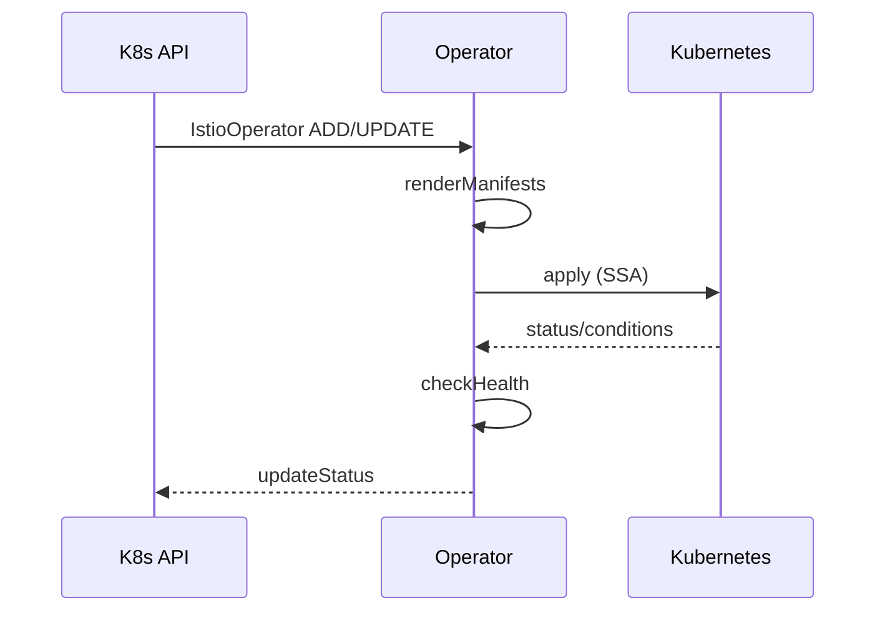
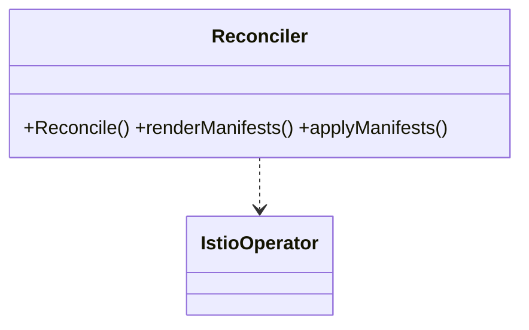

## 概述

Istio Operator通过Kubernetes声明式控制循环管理Istio安装、配置与升级。本文从CRD、控制循环（Reconcile）、多修订版本与金丝雀升级等角度进行源码级与实践级剖析。

## 1. CRDs与资源模型

- `IstioOperator`（安装主CRD）：描述控制平面各组件启用、镜像、资源、网格配置等；
- `Revision`（通过...实现按命名空间/工作负载渐进迁移；
- 关键字段：`spec.revision`、`spec.values`（Helm values语义）、`spec.meshConfig`、`spec.components`。

## 2. 控制循环（Reconcile）

```go
// 概念化控制循环：对齐期望与实际状态
func (r *Reconciler) Reconcile(ctx context.Context, req ctrl.Request) (ctrl.Result, error) {
    // 1) 拉取IstioOperator对象
    iop, err := r.getIop(ctx, req.NamespacedName)
    if err != nil { return ctrl.Result{}, client.IgnoreNotFound(err) }

    // 2) 计算期望渲染（Helm/Manifest生成）
    manifests, err := r.renderManifests(iop)
    if err != nil { return r.failStatus(ctx, iop, err) }

    // 3) 对比实际状态并应用变更（Create/Update/Delete）
    if err := r.applyManifests(ctx, manifests); err != nil { return r.failStatus(ctx, iop, err) }

    // 4) 校验健康与就绪，更新Status
    ready := r.checkHealth(ctx, iop)
    return r.updateStatus(ctx, iop, ready)
}
```

要点：
- 以声明式渲染（Helm/Overlay）统一生成K8s清单；
- 幂等Apply，结合Server-Side Apply与所有权字段减少冲突；
- 健康检查基于`Deployment/Pod`就绪、`istiod`探针与指标；
- 失败回退：状态标记+事件+重试（指数退避）。

## 3. 多修订版本与金丝雀升级

### 3.1 Revision并存
- 使用`istioctl install --revision <rev>`创建新修订控制平面；
- 通过命名空间标签`istio.io/rev=<rev>`将工作负载指向对应修订的注入器与控制面；
- 允许旧/新控制面共存，保障安全回退。

### 3.2 渐进迁移策略
1. 少量命名空间切换`rev`标签 → 验证XDS/证书/策略；
2. 放量切换并观察SLO（成功率、P99、5xx）；
3. 达标后将剩余命名空间迁移，最终移除旧修订。

### 3.3 网关与多集群
- 网关优先灰度，确保边缘流量稳定；
- 多集群场景保持`eastwest`网关双向兼容，待覆盖率到达阈值再替换旧版本。

## 4. 配置来源与覆盖

- 优先级：`IstioOperator.spec` > 环境变量 > 缺省值；
- 建议将`IstioOperator`作为单一事实源，配合GitOps；
- 常用覆盖：`meshConfig`（全局mTLS、访问日志）、`values.global.proxy`（内存、日志、核心参数）。

## 5. 实践建议

- 启用修订化安装（revision），避免就地升级风险；
- 分层管理：基础平台层（Operator）、团队层（命名空间Sidecar/策略）、应用层（VS/DR）；
- 强化可观测：为Operator控制循环与渲染阶段接入指标/日志/事件；
- 回滚设计：保留上一个修订，预置自动回退条件（基于Prometheus规则）。

## 附录A：关键函数与结构

### A.1 关键函数核心代码（Reconcile 概念片段）

```go
// Reconcile：对齐期望与实际（正文 2. 控制循环 已给出）
func (r *Reconciler) Reconcile(ctx context.Context, req ctrl.Request) (ctrl.Result, error) {
    iop, err := r.getIop(ctx, req.NamespacedName)
    if err != nil { return ctrl.Result{}, client.IgnoreNotFound(err) }
    manifests, err := r.renderManifests(iop)
    if err != nil { return r.failStatus(ctx, iop, err) }
    if err := r.applyManifests(ctx, manifests); err != nil { return r.failStatus(ctx, iop, err) }
    ready := r.checkHealth(ctx, iop)
    return r.updateStatus(ctx, iop, ready)
}
```

### A.2 调用链（Operator）

- 安装/变更：`watch IstioOperator` → `Reconcile` → `renderManifests` → `applyManifests` → `checkHealth` → `updateStatus`
- 修订升级：`install --revision` → `命名空间 rev 标签` → `注入器/控制面切换` → `观测达标后迁移`

### A.3 时序（Reconcile 概念）



### A.4 结构体关系


