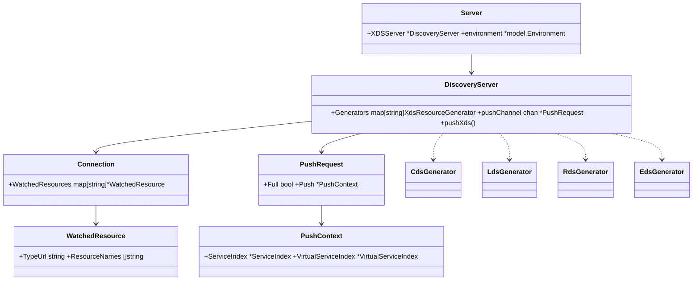

# Istio Pilot完整指南：控制平面架构与xDS配置分发机制深度解析

> Pilot是Istio控制平面的核心组件，负责将高级的路由规则和流量策略转换为Envoy代理能够理解的配置，并通过xDS协议动态分发给数据平面。本文将全面剖析Pilot的架构设计、源码实现、配置管理、xDS生成器、性能优化和调试方法。

---

# 第一部分：Pilot架构概览与核心组件

## 1.1 核心组件架构


## 1.2 关键数据结构

### Server结构体核心字段解析

```go
// pilot/pkg/bootstrap/server.go
type Server struct {
    // XDS服务器 - 负责配置分发的核心组件
    XDSServer *xds.DiscoveryServer
    
    // 集群标识符
    clusterID cluster.ID
    
    // 环境上下文 - 包含网格配置、服务发现等
    environment *model.Environment
    
    // Kubernetes客户端
    kubeClient kubelib.Client
    
    // 多集群控制器
    multiclusterController *multicluster.Controller
    
    // 配置存储控制器
    configController model.ConfigStoreController
    ConfigStores     []model.ConfigStoreController
    
    // 外部服务入口控制器  
    serviceEntryController *serviceentry.Controller
    
    // HTTP服务器 - 调试、监控和就绪检查
    httpServer  *http.Server
    httpAddr    string
    
    // HTTPS服务器 - webhook处理
    httpsServer *http.Server  
    httpsAddr   string
    
    // gRPC服务器 - XDS协议通信
    grpcServer        *grpc.Server
    grpcAddress       string
    secureGrpcServer  *grpc.Server
    secureGrpcAddress string
    
    // 证书管理相关
    CA                      *ca.IstioCA
    RA                      ra.RegistrationAuthority
    caServer                *caserver.Server
    workloadTrustBundle     *tb.TrustBundle
    istiodCertBundleWatcher *keycertbundle.Watcher
    
    // 文件监听器 - 监控配置文件变化
    fileWatcher filewatcher.FileWatcher
    
    // 就绪状态探针
    readinessProbes map[string]readinessProbe
    readinessFlags  *readinessFlags
    
    // 优雅关闭持续时间
    shutdownDuration time.Duration
    
    // 内部停止信号通道
    internalStop chan struct{}
    
    // webhook信息
    webhookInfo *webhookInfo
    
    // 状态管理器
    statusManager *status.Manager
    
    // 读写配置存储
    RWConfigStore model.ConfigStoreController
}
```

---

# 第二部分：启动流程与服务器初始化

## 2.1 主程序入口分析

```go
// pilot/cmd/pilot-discovery/main.go
func main() {
    // 启用Klog与Cobra的集成，统一日志管理
    log.EnableKlogWithCobra()
    
    // 创建根命令，包含所有子命令和配置选项
    rootCmd := app.NewRootCommand()
    
    // 执行命令并处理错误
    if err := rootCmd.Execute(); err != nil {
        log.Error(err)
        os.Exit(-1)
    }
}
```

**核心功能**：

- **日志系统初始化**：集成Kubernetes的klog与Cobra CLI框架
- **命令构建**：构造包含discovery子命令的完整CLI结构
- **错误处理**：统一的错误处理和退出机制

## 2.2 命令行处理架构

```go
// pilot/cmd/pilot-discovery/app/cmd.go
func NewRootCommand() *cobra.Command {
    rootCmd := &cobra.Command{
        Use:          "pilot-discovery",
        Short:        "Istio Pilot.",
        Long:         "Istio Pilot provides mesh-wide traffic management, security and policy capabilities in the Istio Service Mesh.",
        SilenceUsage: true,
        FParseErrWhitelist: cobra.FParseErrWhitelist{
            // 允许未知标志，保持向后兼容性
            UnknownFlags: true,
        },
        PreRunE: func(c *cobra.Command, args []string) error {
            cmd.AddFlags(c)
            return nil
        },
    }

    // 创建discovery子命令 - 这是主要的服务发现命令
    discoveryCmd := newDiscoveryCommand()
    addFlags(discoveryCmd)
    rootCmd.AddCommand(discoveryCmd)
    
    // 添加版本信息命令
    rootCmd.AddCommand(version.CobraCommand())
    
    // 添加文档生成命令
    rootCmd.AddCommand(collateral.CobraCommand(rootCmd, collateral.Metadata{
        Title:   "Istio Pilot Discovery",
        Section: "pilot-discovery CLI",
        Manual:  "Istio Pilot Discovery",
    }))
    
    // 添加请求处理命令
    rootCmd.AddCommand(requestCmd)

    return rootCmd
}
```

## 2.3 Discovery服务启动流程

```go
func newDiscoveryCommand() *cobra.Command {
    return &cobra.Command{
        Use:   "discovery",
        Short: "Start Istio proxy discovery service.",
        Args:  cobra.ExactArgs(0),
        PreRunE: func(c *cobra.Command, args []string) error {
            // 1. 配置日志系统
            if err := log.Configure(loggingOptions); err != nil {
                return err
            }
            
            // 2. 验证命令行参数
            if err := validateFlags(serverArgs); err != nil {
                return err
            }
            
            // 3. 完成参数处理和默认值设置
            if err := serverArgs.Complete(); err != nil {
                return err
            }
            return nil
        },
        RunE: func(c *cobra.Command, args []string) error {
            cmd.PrintFlags(c.Flags())

            // 创建全局停止信号通道
            stop := make(chan struct{})

            // 创建发现服务器实例
            discoveryServer, err := bootstrap.NewServer(serverArgs)
            if err != nil {
                return fmt.Errorf("failed to create discovery service: %v", err)
            }

            // 启动服务器
            if err := discoveryServer.Start(stop); err != nil {
                return fmt.Errorf("failed to start discovery service: %v", err)
            }

            // 等待退出信号
            cmd.WaitSignal(stop)
            
            // 等待优雅关闭完成
            discoveryServer.WaitUntilCompletion()
            return nil
        },
    }
}
```

## 2.4 服务器创建与初始化

### NewServer函数详细解析

```go
// pilot/pkg/bootstrap/server.go
func NewServer(args *PilotArgs, initFuncs ...func(*Server)) (*Server, error) {
    // 1. 创建环境对象，包含网格配置和域名后缀
    e := model.NewEnvironment()
    e.DomainSuffix = args.RegistryOptions.KubeOptions.DomainSuffix

    // 2. 创建聚合服务发现控制器
    ac := aggregate.NewController(aggregate.Options{
        MeshHolder:      e,
        ConfigClusterID: getClusterID(args),
    })
    e.ServiceDiscovery = ac

    // 3. 注册Prometheus监控导出器
    exporter, err := monitoring.RegisterPrometheusExporter(nil, nil)
    if err != nil {
        return nil, fmt.Errorf("could not set up prometheus exporter: %v", err)
    }
    
    // 4. 创建Server结构体实例并初始化核心字段
    s := &Server{
        clusterID:               getClusterID(args),
        environment:             e,
        fileWatcher:             filewatcher.NewWatcher(),
        httpMux:                 http.NewServeMux(),
        monitoringMux:           http.NewServeMux(),
        readinessProbes:         make(map[string]readinessProbe),
        readinessFlags:          &readinessFlags{},
        server:                  server.New(),
        shutdownDuration:        args.ShutdownDuration,
        internalStop:            make(chan struct{}),
        istiodCertBundleWatcher: keycertbundle.NewWatcher(),
        webhookInfo:             &webhookInfo{},
        metricsExporter:         exporter,
        krtDebugger:             args.KrtDebugger,
    }

    // 5. 应用自定义初始化函数
    for _, fn := range initFuncs {
        fn(s)
    }
    
    // 6. 创建XDS服务器 - 这是配置分发的核心
    s.XDSServer = xds.NewDiscoveryServer(e, args.RegistryOptions.KubeOptions.ClusterAliases, args.KrtDebugger)
    configGen := core.NewConfigGenerator(s.XDSServer.Cache)

    // 7. 启用gRPC性能监控
    grpcprom.EnableHandlingTimeHistogram()

    // 8. 初始化各个组件
    s.initReadinessProbes()
    s.initServers(args)
    
    if err := s.initIstiodAdminServer(args, s.webhookInfo.GetTemplates); err != nil {
        return nil, fmt.Errorf("error initializing debug server: %v", err)
    }
    
    if err := s.serveHTTP(); err != nil {
        return nil, fmt.Errorf("error serving http: %v", err)
    }

    // 9. 初始化Kubernetes客户端
    if err := s.initKubeClient(args); err != nil {
        return nil, fmt.Errorf("error initializing kube client: %v", err)
    }

    // 10. 初始化网格配置管理
    s.initMeshConfiguration(args, s.fileWatcher)
    
    // 11. 设置Kubernetes资源过滤器
    if s.kubeClient != nil {
        namespaces := kclient.New[*corev1.Namespace](s.kubeClient)
        filter := namespace.NewDiscoveryNamespacesFilter(namespaces, s.environment.Watcher, s.internalStop)
        s.kubeClient = kubelib.SetObjectFilter(s.kubeClient, filter)
    }

    // 12. 初始化网格网络配置
    s.initMeshNetworks(args, s.fileWatcher)
    s.initMeshHandlers(configGen.MeshConfigChanged)
    
    // 13. 初始化环境和网络管理器
    s.environment.Init()
    if err := s.environment.InitNetworksManager(s.XDSServer); err != nil {
        return nil, err
    }

    // 14. 多根网格支持（可选）
    if features.MultiRootMesh {
        s.workloadTrustBundle = tb.NewTrustBundle(nil, e.Watcher)
        e.TrustBundle = s.workloadTrustBundle
    }

    // 15. 证书管理选项配置
    caOpts := &caOptions{
        TrustDomain:      s.environment.Mesh().TrustDomain,
        Namespace:        args.Namespace,
        ExternalCAType:   ra.CaExternalType(externalCaType),
        CertSignerDomain: features.CertSignerDomain,
    }

    // 16. 创建CA证书（如果需要）
    if err := s.maybeCreateCA(caOpts); err != nil {
        return nil, err
    }

    // 17. 初始化各种控制器
    if err := s.initControllers(args); err != nil {
        return nil, err
    }

    // 18. 初始化XDS生成器
    InitGenerators(s.XDSServer, configGen, args.Namespace, s.clusterID, s.internalDebugMux)

    // 19. 初始化工作负载信任包
    if err := s.initWorkloadTrustBundle(args); err != nil {
        return nil, err
    }

    return s, nil
}
```

---

# 第三部分：XDS服务器深度分析

## 3.1 DiscoveryServer结构体

```go
// pilot/pkg/xds/discovery.go
type DiscoveryServer struct {
    // 环境模型 - 包含网格配置和服务发现
    Env *model.Environment

    // 生成器映射 - 支持自定义配置生成逻辑
    // Key为生成器类型，与客户端元数据匹配选择生成器
    Generators map[string]model.XdsResourceGenerator

    // 代理推送需求判断函数 - 决定是否需要推送配置
    ProxyNeedsPush func(proxy *model.Proxy, req *model.PushRequest) (*model.PushRequest, bool)

    // 并发推送限制信号量 - 控制XDS推送的并发数量
    concurrentPushLimit chan struct{}
    
    // 请求速率限制器 - 防止新XDS请求的雷群效应
    RequestRateLimit *rate.Limiter

    // 入站更新计数器 - 收到的配置更新数量
    InboundUpdates *atomic.Int64
    
    // 已提交更新计数器 - 已处理并存储在推送上下文中的配置更新数量  
    CommittedUpdates *atomic.Int64

    // 推送通道 - 用于去抖动的缓冲区
    pushChannel chan *model.PushRequest

    // 推送队列 - 去抖动后、真正XDS推送前的缓冲区
    pushQueue *PushQueue

    // 调试处理器列表
    debugHandlers map[string]string

    // 启动时间
    DiscoveryStartTime time.Time

    // 工作负载入口控制器
    WorkloadEntryController *autoregistration.Controller

    // 配置缓存
    Cache model.XdsCache

    // 去抖动选项
    DebounceOptions DebounceOptions
    
    // 服务器就绪状态
    serverReady atomic.Bool
    
    // 认证器列表
    Authenticators []security.Authenticator
}
```

## 3.2 XDS服务器启动流程

```go
// pilot/pkg/xds/discovery.go
func (s *DiscoveryServer) Start(stopCh <-chan struct{}) {
    // 1. 启动工作负载入口控制器 - 管理动态工作负载注册
    go s.WorkloadEntryController.Run(stopCh)
    
    // 2. 启动更新处理协程 - 处理配置更新的去抖动逻辑
    go s.handleUpdates(stopCh)
    
    // 3. 启动指标刷新协程 - 定期更新推送状态指标  
    go s.periodicRefreshMetrics(stopCh)
    
    // 4. 启动推送处理协程 - 执行实际的配置推送
    go s.sendPushes(stopCh)
    
    // 5. 启动配置缓存 - 管理生成的配置缓存
    go s.Cache.Run(stopCh)
}
```

## 3.3 配置更新处理机制

```go
// ConfigUpdate实现ConfigUpdater接口，用于请求配置推送
func (s *DiscoveryServer) ConfigUpdate(req *model.PushRequest) {
    // 1. 安全断言检查 - 确保Service类型不会设置在ConfigKey中
    if features.EnableUnsafeAssertions {
        if model.HasConfigsOfKind(req.ConfigsUpdated, kind.Service) {
            panic("assertion failed kind.Service can not be set in ConfigKey")
        }
    }
    
    // 2. 地址类型特殊处理 - 清除所有缓存因为Address类型是动态获取的
    if model.HasConfigsOfKind(req.ConfigsUpdated, kind.Address) {
        s.Cache.ClearAll()
    }
    
    // 3. 更新统计指标
    inboundConfigUpdates.Increment()
    s.InboundUpdates.Inc()
    
    // 4. 全量推送调试日志
    if req.Full && fullPushLog.DebugEnabled() {
        configs := slices.Sort(slices.Map(req.ConfigsUpdated.UnsortedList(), model.ConfigKey.String))
        reasons := maps.Keys(req.Reason)
        fullPushLog.Debugf("full push triggered configs=%v reasons=%v", configs, reasons)
    }
    
    // 5. 将请求发送到推送通道，触发去抖动处理
    s.pushChannel <- req
}
```

## 3.4 去抖动与推送队列机制

```go  
// handleUpdates在独立线程中处理pushChannel的事件
// 确保在最后一个事件后至少经过minQuiet时间才处理
// 同时确保接收事件和处理事件之间最多间隔maxDelay时间
func (s *DiscoveryServer) handleUpdates(stopCh <-chan struct{}) {
    debounce(s.pushChannel, stopCh, s.DebounceOptions, s.Push, s.CommittedUpdates)
}

// 去抖动辅助函数实现
func debounce(ch chan *model.PushRequest, stopCh <-chan struct{}, opts DebounceOptions, pushFn func(req *model.PushRequest), updateSent *atomic.Int64) {
    var timeChan <-chan time.Time
    var startDebounce time.Time
    var lastConfigUpdateTime time.Time

    pushCounter := 0
    debouncedEvents := 0

    // 跟踪推送请求。如果更新被去抖动，它们会被合并
    var req *model.PushRequest

    free := true
    freeCh := make(chan struct{}, 1)

    push := func(req *model.PushRequest, debouncedEvents int, startDebounce time.Time) {
        pushFn(req)
        updateSent.Add(int64(debouncedEvents))
        debounceTime.Record(time.Since(startDebounce).Seconds())
        freeCh <- struct{}{}
    }

    pushWorker := func(req *model.PushRequest, debouncedEvents int, startDebounce time.Time) {
        go push(req, debouncedEvents, startDebounce)
    }

    for {
        select {
        case <-freeCh:
            free = true
            pushCounter++
        case r := <-ch:
            // 合并配置更新请求
            if req == nil {
                req = r
            } else {
                req = req.Merge(r)
            }
            lastConfigUpdateTime = time.Now()
            
            if debouncedEvents == 0 {
                startDebounce = lastConfigUpdateTime
                timeChan = time.After(opts.debounceAfter)
            }
            debouncedEvents++

        case <-timeChan:
            if free {
                free = false
                pushWorker(req, debouncedEvents, startDebounce)
                
                req = nil
                debouncedEvents = 0
                timeChan = nil
            } else {
                // 如果推送正在进行中，短时间后重试
                timeChan = time.After(opts.debounceAfter / 10)
            }
        case <-stopCh:
            return
        }
    }
}
```

## 3.5 ADS服务入口：StreamAggregatedResources 关键路径（逐段注释）

```go
// pilot/pkg/xds/ads.go （概念化精简，便于阅读与排错）
// StreamAggregatedResources 实现 ADS gRPC 双向流
func (s *DiscoveryServer) StreamAggregatedResources(stream discovery.AggregatedDiscoveryService_StreamAggregatedResourcesServer) error {
    // 1) 鉴权与连接建立：提取对端身份，创建 Connection
    peerInfo, err := authenticatePeer(stream.Context(), s.Authenticators)
    if err != nil { return status.Error(codes.PermissionDenied, err.Error()) }

    con := newConnection(peerInfo)              // 构建与代理交互的连接上下文
    defer s.closeConnection(con)                // 退出时清理状态

    // 2) 主循环：持续接收 DiscoveryRequest 并处理
    for {
        req, err := stream.Recv()               // 阻塞接收客户端请求
        if err == io.EOF { return nil }         // 客户端正常关闭
        if err != nil { return err }            // 流错误

        // 3) 处理 ACK/NACK：依据 nonce/version 与 ErrorDetail
        if req.ErrorDetail != nil && req.ResponseNonce != "" {
            // NACK：记录错误并标记最近一次推送失败（不立即重推）
            s.onNack(con, req.TypeUrl, req.ResponseNonce, req.ErrorDetail)
            continue
        }
        if req.ResponseNonce != "" && req.ErrorDetail == nil {
            // ACK：记录客户端已接受的版本
            s.onAck(con, req.TypeUrl, req.VersionInfo, req.ResponseNonce)
            continue
        }

        // 4) 首次订阅或订阅变更：登记 WatchedResource
        con.UpdateWatched(req.TypeUrl, &model.WatchedResource{
            TypeUrl:       req.TypeUrl,
            ResourceNames: req.ResourceNames,
        })

        // 5) 按需推送：分派生成器并发送对应 TypeUrl 的资源
        watched := con.Watched(req.TypeUrl)
        pr := &model.PushRequest{ Full: false, Push: s.currentPushContext() }
        if err := s.pushXds(con, watched, pr); err != nil {
            return err
        }
    }
}
```

---

# 第四部分：xDS生成器与资源构建

## 4.1 生成器相关关键数据结构

```go
// 统一生成器接口：CDS/LDS/RDS/EDS 等实现按 TypeUrl 分派
type XdsResourceGenerator interface {
    Generate(proxy *model.Proxy, w *model.WatchedResource, req *model.PushRequest) (
        model.Resources, model.XdsLogDetails, error,
    )
}

// 客户端对某类资源的订阅视图（RDS/EDS 高频）
type WatchedResource struct {
    TypeUrl       string      // v3.ClusterType/v3.ListenerType/v3.RouteType/v3.EndpointType
    ResourceNames []string    // 订阅的路由名/集群名等
}

// 与单个 Envoy 会话的连接上下文
type Connection struct {
    proxy            *model.Proxy
    WatchedResources map[string]*model.WatchedResource
    ConID            string      // 便于日志/排错的连接标识
}

// 一次推送请求的元数据
type PushRequest struct {
    Full           bool
    Delta          model.Delta           // 增量订阅/退订详情
    ConfigsUpdated model.ConfigKeySet    // 本次受影响的配置集合
    Push           *model.PushContext    // 只读快照：生成器核心输入
    Reason         model.ReasonStats
}

// 推送快照（高频读取）：服务/路由/策略索引，已做预计算
type PushContext struct {
    Mesh                    *meshconfig.MeshConfig
    Env                     *model.Environment
    ServiceIndex            *ServiceIndex
    VirtualServiceIndex     *VirtualServiceIndex
    DestinationRuleIndex    *DestinationRuleIndex
    SidecarScopeByNamespace map[string]*SidecarScope
}

// 代理抽象：裁剪规模与版本兼容的重要依据
type Proxy struct {
    ID           string
    IPAddresses  []string
    IstioVersion *model.IstioVersion
    Metadata     *NodeMetadata
    SidecarScope *SidecarScope
}

// Sidecar 作用域 - 决定可见的服务/主机/监听
type SidecarScope struct {
    Namespace         string
    Services          []*model.Service
    EgressHosts       []host.Name
    InboundListeners  []*ListenerConfig
    OutboundListeners []*ListenerConfig
}

// EDS 端点构建器 - 按 locality/priority/健康度 组装
type EndpointBuilder struct {
    ClusterName string
    Proxy       *model.Proxy
    Push        *model.PushContext
}

// 生成日志标记：判断增量/过滤是否生效
type XdsLogDetails struct {
    Incremental    bool
    AdditionalInfo string
}
```

## 4.2 核心推送函数：pushXds

```go
// pilot/pkg/xds/xdsgen.go
// pushXds 将特定 TypeUrl 的资源推送给一个连接
func (s *DiscoveryServer) pushXds(con *Connection, w *model.WatchedResource, req *model.PushRequest) error {
    if w == nil { // 连接未订阅该类型，直接返回
        return nil
    }

    // 1) 选择生成器：按 TypeUrl + 连接元数据
    gen := s.findGenerator(w.TypeUrl, con)
    if gen == nil { // 未找到生成器，跳过
            return nil
    }

    // 2) 增量订阅过滤：仅保留新增订阅资源名
    if !req.Delta.IsEmpty() && !con.proxy.IsProxylessGrpc() {
        w = &model.WatchedResource{TypeUrl: w.TypeUrl, ResourceNames: req.Delta.Subscribed}
    }

    // 3) 生成资源：读取 Proxy/PushContext/订阅名
    resources, logdata, err := gen.Generate(con.proxy, w, req)
    if err != nil || resources == nil { // 生成失败或无资源
            return err
    }

    // 4) 构造响应：携带版本与 nonce，便于 ACK/NACK 追踪
    resp := &discovery.DiscoveryResponse{
        ControlPlane: ControlPlane(w.TypeUrl),
        TypeUrl:      w.TypeUrl,
        VersionInfo:  req.Push.PushVersion,
        Nonce:        nonce(req.Push.PushVersion),
        Resources:    xds.ResourcesToAny(resources),
    }

    // 5) 发送：gRPC 流写入，失败计数 + 记录原因
    if err := xds.Send(con, resp); err != nil {
        return err
    }
    _ = logdata // 可选：附加日志（增量/过滤信息）
        return nil
}
```

## 4.3 各xDS生成器实现

### CDS（Cluster Discovery Service）

```go
// 以 CDS 为例：构建出站/入站集群（多数为 EDS 类型）
type CdsGenerator struct{}

func (g CdsGenerator) Generate(proxy *model.Proxy, w *model.WatchedResource, req *model.PushRequest) (model.Resources, model.XdsLogDetails, error) {
    cg := core.NewConfigGenerator(nil)
    clusters := cg.BuildClusters(proxy, req.Push) // 读取 SidecarScope/DR 等索引
    return model.ResourcesFromClusters(clusters), model.DefaultXdsLogDetails(), nil
}

// pilot/pkg/networking/core/v1alpha3/cluster.go
func (cg *ConfigGeneratorImpl) BuildClusters(node *model.Proxy, push *model.PushContext) []*cluster.Cluster {
    out := make([]*cluster.Cluster, 0, 256)
    out = append(out, cg.buildOutboundClusters(node, push)...)
    out = append(out, cg.buildInboundClusters(node, push)...)
    return out
}
```

### LDS（Listener Discovery Service）

```go
// LDS：拼装入站/出站监听器与过滤器链（含 Authn/Authz/Telemetry）
type LdsGenerator struct{}

func (g LdsGenerator) Generate(proxy *model.Proxy, w *model.WatchedResource, req *model.PushRequest) (model.Resources, model.XdsLogDetails, error) {
    listeners := req.Push.Env.ConfigGenerator().BuildListeners(proxy, req.Push)
    return model.ResourcesFromListeners(listeners), model.DefaultXdsLogDetails(), nil
}

// pilot/pkg/networking/core/v1alpha3/listener.go
func (cg *ConfigGeneratorImpl) BuildListeners(node *model.Proxy, push *model.PushContext) []*listener.Listener {
    var out []*listener.Listener
    out = append(out, cg.buildSidecarInboundListeners(node, push)...)
    out = append(out, cg.buildSidecarOutboundListeners(node, push)...)
    return out
}
```

### RDS（Route Discovery Service）

```go
// RDS：按订阅的 route name 定向生成 RouteConfiguration
type RdsGenerator struct{}

func (g RdsGenerator) Generate(proxy *model.Proxy, w *model.WatchedResource, req *model.PushRequest) (model.Resources, model.XdsLogDetails, error) {
    routes := req.Push.Env.ConfigGenerator().BuildHTTPRoutes(proxy, req.Push, w.ResourceNames)
    return model.ResourcesFromRoutes(routes), model.DefaultXdsLogDetails(), nil
}

// pilot/pkg/networking/core/v1alpha3/route/route.go
func (cg *ConfigGeneratorImpl) BuildHTTPRoutes(node *model.Proxy, push *model.PushContext, routeNames []string) []*route.RouteConfiguration {
    var out []*route.RouteConfiguration
    for _, name := range routeNames {
        if rc := cg.buildSidecarOutboundHTTPRouteConfig(node, push, name); rc != nil {
            out = append(out, rc)
        }
    }
    return out
}
```

### EDS（Endpoint Discovery Service）

```go
// EDS：仅对订阅的 cluster 生成 CLA；按 locality/priority 聚合
type EdsGenerator struct{}

func (g EdsGenerator) Generate(proxy *model.Proxy, w *model.WatchedResource, req *model.PushRequest) (model.Resources, model.XdsLogDetails, error) {
    out := make([]*endpoint.ClusterLoadAssignment, 0, len(w.ResourceNames))
    for _, cluster := range w.ResourceNames {
        cla := v1alpha3.NewEndpointBuilder(req.Push, proxy, cluster).BuildClusterLoadAssignment()
        if cla != nil { out = append(out, cla) }
    }
    return model.ResourcesFromCLAs(out), model.DefaultXdsLogDetails(), nil
}
```

## 4.4 XDS ACK/NACK与Nonce处理

Envoy通过ADS流与Pilot进行配置交互，每次下发附带`version_info`与`nonce`；客户端以ACK/NACK响应，Pilot据此做版本与错误跟踪：

```go
// pilot/pkg/xds/ads.go （概念化示例）
func (s *DiscoveryServer) handleRequest(con *Connection, req *discovery.DiscoveryRequest) error {
    // 1. 记录客户端已知的version_info与response_nonce
    typeURL := req.TypeUrl
    nonce := req.ResponseNonce
    version := req.VersionInfo

    // 2. 处理NACK：当ErrorDetail非空且nonce匹配，标记上次推送失败
    if req.ErrorDetail != nil && nonce != "" {
        nackErrors.With(typeTag.Value(typeURL)).Increment()
        s.onNack(con, typeURL, nonce, req.ErrorDetail)
        return nil // NACK不触发立即重推，由后续变更或重试驱动
    }

    // 3. 处理ACK：记录客户端接受的最新版本
    if nonce != "" && req.ErrorDetail == nil {
        s.onAck(con, typeURL, version, nonce)
        return nil
    }

    // 4. 首次订阅/资源变更：生成并发送资源
    watched := con.Watched(typeURL)
    return s.pushXds(con, watched, &model.PushRequest{Full: false})
}
```

要点：

- 使用`nonce`实现幂等与重试去重；
- NACK仅作为诊断与回退信号，不应形成无限重推；
- 结合`Delta XDS`可降低资源冗余（仅推送订阅差异）。

---

# 第五部分：服务发现机制深度剖析

## 5.1 聚合服务发现控制器

```go
// pilot/pkg/serviceregistry/aggregate/controller.go
type Controller struct {
    // 网格持有者 - 提供网格配置
    meshHolder mesh.Holder
    
    // 注册的服务发现实例列表
    registries []serviceregistry.Instance
    
    // 服务处理器列表
    serviceHandlers []model.ServiceHandler
    
    // 工作负载处理器列表  
    workloadHandlers []func(*model.WorkloadInstance, model.Event)
    
    // 网络网关处理器
    model.NetworkGatewaysHandler
    
    // 读写锁保护并发访问
    storeLock sync.RWMutex
}

// 添加服务发现注册表
func (c *Controller) AddRegistry(registry serviceregistry.Instance) {
    c.storeLock.Lock()
    defer c.storeLock.Unlock()
    
    c.registries = append(c.registries, registry)
    
    // 为新注册表注册已有的服务处理器
    for _, h := range c.serviceHandlers {
        registry.AppendServiceHandler(h)
    }
    
    // 为新注册表注册已有的工作负载处理器
    for _, h := range c.workloadHandlers {
        registry.AppendWorkloadHandler(h)
    }
}

// 获取所有服务的聚合视图
func (c *Controller) Services() []*model.Service {
    // 去重和合并逻辑
    services := map[host.Name]*model.Service{}
    
    c.storeLock.RLock()
    defer c.storeLock.RUnlock()
    
    for _, r := range c.registries {
        for _, s := range r.Services() {
            sp, f := services[s.Hostname]
            if !f {
                services[s.Hostname] = s
                continue
            }
            // 如果服务已存在，需要合并端口信息
            sp.Ports = model.MergeServicePorts(sp.Ports, s.Ports, sp.Hostname)
        }
    }
    
    out := make([]*model.Service, 0, len(services))
    for _, service := range services {
        out = append(out, service)
    }
    return out
}
```

## 5.2 Kubernetes服务注册中心

```go
// pilot/pkg/serviceregistry/kube/controller/controller.go
type Controller struct {
    // Kubernetes客户端
    client kubelib.Client
    
    // 域名后缀  
    domainSuffix string
    
    // 集群ID
    clusterID cluster.ID
    
    // XDS更新器
    xdsUpdater model.XDSUpdater
    
    // 网络ID
    networkID network.ID
    
    // 服务处理器列表
    serviceHandlers []model.ServiceHandler
    
    // 工作负载处理器列表
    workloadHandlers []func(*model.WorkloadInstance, model.Event)
    
    // Pod到工作负载的映射
    pods *krt.Collection[*v1.Pod]
    
    // 服务到模型服务的映射  
    services *krt.Collection[*v1.Service]
    
    // 端点切片集合
    endpointSlices *krt.Collection[*v1.EndpointSlice]
    
    // 网格配置监听器
    meshWatcher mesh.Watcher
    
    // 命名空间控制器
    namespaceController namespace.Controller
    
    // 停止信号
    stop <-chan struct{}
}

// 服务事件处理器
func (c *Controller) onServiceEvent(svc *v1.Service, event model.Event) error {
    log.Debugf("Handle service %s in namespace %s", svc.Name, svc.Namespace)
    
    // 转换Kubernetes Service到Istio模型
    svcConv := kube.ConvertService(*svc, c.domainSuffix, c.clusterID)
    
    switch event {
    case model.EventAdd:
        log.Infof("Service %s/%s added", svc.Namespace, svc.Name)
        
    case model.EventUpdate:
        log.Debugf("Service %s/%s updated", svc.Namespace, svc.Name)
        
    case model.EventDelete:
        log.Infof("Service %s/%s deleted", svc.Namespace, svc.Name)
    }
    
    // 通知所有服务处理器
    for _, handler := range c.serviceHandlers {
        handler(svcConv, nil, event)
    }
    
    return nil
}

// 端点切片事件处理器  
func (c *Controller) onEndpointSliceEvent(es *v1.EndpointSlice, event model.Event) error {
    serviceName := es.Labels[v1.LabelServiceName]
    if serviceName == "" {
        log.Warnf("EndpointSlice %s/%s missing service name label", es.Namespace, es.Name)
        return nil
    }
    
    log.Debugf("Handle endpoint slice %s in namespace %s for service %s", es.Name, es.Namespace, serviceName)
    
    // 转换端点切片到Istio端点
    endpoints := kube.ConvertEndpointSlice(es, c.domainSuffix, c.clusterID)
    
    // 通过XDS更新器推送端点变更
    if c.xdsUpdater != nil {
        shard := model.ShardKey{
            Cluster: c.clusterID,
            Provider: provider.Kubernetes,
        }
        
        c.xdsUpdater.EDSUpdate(shard, serviceName, es.Namespace, endpoints)
    }
    
    return nil
}
```

---

# 第六部分：配置管理与分发

## 6.1 配置变更到配置生效的完整链路

### 配置接收与验证阶段

```go
// pilot/pkg/config/kube/crdclient/client.go
// handleEvent 处理Kubernetes资源变更事件
func (cl *Client) handleEvent(gvk config.GroupVersionKind, obj interface{}, event model.Event) {
    // 1. 资源类型检查
    if !cl.schemas.Contains(gvk) {
        return
    }
    
    // 2. 转换为Istio配置模型
    cfg, err := convertToConfig(obj, gvk, cl.domainSuffix)
    if err != nil {
        log.Warnf("Failed to convert object to config: %v", err)
        return
    }
    
    // 3. 配置验证
    if err := validation.ValidateConfig(cfg); err != nil {
        log.Errorf("Configuration validation failed: %v", err)
        // 更新资源状态为Invalid
        cl.updateConfigStatus(cfg, "Invalid", err.Error())
        return
    }
    
    // 4. 触发配置更新事件
    for _, handler := range cl.handlers[gvk] {
        handler(cfg, cfg, event)
    }
}
```

### 配置转换与聚合阶段

```go
// pilot/pkg/bootstrap/configcontroller.go
// 配置控制器的事件处理逻辑
func (s *Server) configHandler(old, new config.Config, event model.Event) {
    // 1. 确定受影响的代理范围
    affectedProxies := s.getAffectedProxies(new)
    
    // 2. 构造推送请求
    pushReq := &model.PushRequest{
        Full: true,  // 全量推送
        ConfigsUpdated: sets.New(model.ConfigKey{
            Kind:      new.GroupVersionKind.Kind,
            Name:      new.Name,
            Namespace: new.Namespace,
        }),
        Reason: model.NewReasonStats(model.ConfigUpdate),
    }
    
    // 3. 触发XDS配置推送
    s.XDSServer.ConfigUpdate(pushReq)
}

// 判断配置变更影响的代理范围
func (s *Server) getAffectedProxies(cfg config.Config) []*model.Proxy {
    var affected []*model.Proxy
    
    switch cfg.GroupVersionKind.Kind {
    case "VirtualService":
        vs := cfg.Spec.(*networking.VirtualService)
        // VirtualService影响所有相关的Gateway和Sidecar代理
        for _, host := range vs.Hosts {
            affected = append(affected, s.getProxiesForHost(host)...)
        }
        
    case "DestinationRule":
        dr := cfg.Spec.(*networking.DestinationRule)
        // DestinationRule影响所有访问该服务的代理
        affected = append(affected, s.getProxiesForService(dr.Host)...)
        
    case "ServiceEntry":
        se := cfg.Spec.(*networking.ServiceEntry)
        // ServiceEntry影响所有可能访问外部服务的代理
        for _, host := range se.Hosts {
            affected = append(affected, s.getProxiesForHost(host)...)
        }
    }
    
    return affected
}
```

## 6.2 配置存储控制器

```go
// pilot/pkg/config/kube/crdclient/client.go  
type Client struct {
    // Kubernetes客户端
    client kubelib.Client
    
    // 版本标识
    revision string
    
    // 域名后缀
    domainSuffix string
    
    // 模式集合 - 支持的CRD类型
    schemas collection.Schemas
    
    // 事件处理器映射
    handlers map[resource.GroupVersionKind][]model.EventHandler
    
    // KRT调试器
    krtDebugger *krt.DebugHandler
    
    // 配置控制器映射 - 每个CRD类型一个控制器
    controllers map[resource.GroupVersionKind]*crdController
    
    // 启动标志
    started bool
    
    // 停止通道  
    stopCh <-chan struct{}
}

// 配置更新处理器
type crdController struct {
    // 配置类型的KRT集合
    configCollection *krt.Collection[model.Config]
    
    // 事件处理器列表
    handlers []model.EventHandler
}

// 注册事件处理器
func (cl *Client) RegisterEventHandler(kind resource.GroupVersionKind, handler model.EventHandler) {
    cl.handlers[kind] = append(cl.handlers[kind], handler)
    
    if controller, exists := cl.controllers[kind]; exists {
        controller.handlers = append(controller.handlers, handler)
    }
}

// 处理配置变更事件
func (c *crdController) onConfigChange(old model.Config, new model.Config, event model.Event) {
    // 通知所有注册的处理器
    for _, handler := range c.handlers {
        handler(old, new, event)
    }
}
```

---

# 第七部分：gRPC服务器与连接管理

## 7.1 gRPC服务器初始化

```go
// pilot/pkg/bootstrap/server.go
func (s *Server) initGrpcServer(args *PilotArgs) {
    // 1. 创建gRPC拦截器链
    interceptors := []grpc.UnaryServerInterceptor{
        // 设置服务器prometheus监控（作为拦截器链中的最终拦截器）
        grpcprom.UnaryServerInterceptor,
    }
    
    // 2. 构建服务器选项
    opts := istiogrpc.ServerOptions(args.KeepaliveOptions, xdspkg.RecordRecvSize, interceptors...)
    
    // 3. 创建gRPC服务器实例
    s.grpcServer = grpc.NewServer(opts...)
    
    // 4. 注册XDS服务到gRPC服务器
    s.XDSServer.Register(s.grpcServer)
    
    // 5. 注册gRPC反射服务（用于调试）
    reflection.Register(s.grpcServer)
    
    // 6. 设置监听地址
    s.grpcAddress = args.ServerOptions.GRPCAddr
    
    // 7. 添加到启动函数列表
    s.addStartFunc("grpc server", func(stop <-chan struct{}) error {
        go func() {
            <-stop
            s.grpcServer.GracefulStop()
        }()
        return nil
    })
}
```

## 7.2 安全gRPC服务器初始化

```go
// pilot/pkg/bootstrap/server.go  
func (s *Server) initSecureDiscoveryService(args *PilotArgs, trustDomain string) error {
    if args.ServerOptions.SecureGRPCAddr == "" {
        log.Info("The secure discovery port is disabled, multiplexing on httpAddr ")
        return nil
    }

    // 1. 创建对等证书验证器
    peerCertVerifier, err := s.createPeerCertVerifier(args.ServerOptions.TLSOptions, trustDomain)
    if err != nil {
        return err
    }
    if peerCertVerifier == nil {
        log.Warnf("The secure discovery service is disabled")
        return nil
    }
    
    log.Info("initializing secure discovery service")

    // 2. 配置TLS
    cfg := &tls.Config{
        GetCertificate: s.getIstiodCertificate,
        ClientAuth:     tls.VerifyClientCertIfGiven,
        ClientCAs:      peerCertVerifier.GetGeneralCertPool(),
        VerifyPeerCertificate: func(rawCerts [][]byte, verifiedChains [][]*x509.Certificate) error {
            err := peerCertVerifier.VerifyPeerCert(rawCerts, verifiedChains)
            if err != nil {
                log.Infof("Could not verify certificate: %v", err)
            }
            return err
        },
        MinVersion:   tls.VersionTLS12,
        CipherSuites: args.ServerOptions.TLSOptions.CipherSuites,
    }
    
    // 3. 应用Go合规性设置
    sec_model.EnforceGoCompliance(cfg)

    // 4. 创建TLS凭据
    tlsCreds := credentials.NewTLS(cfg)
    s.secureGrpcAddress = args.ServerOptions.SecureGRPCAddr

    // 5. 配置拦截器
    interceptors := []grpc.UnaryServerInterceptor{
        grpcprom.UnaryServerInterceptor,
    }
    
    opts := istiogrpc.ServerOptions(args.KeepaliveOptions, xdspkg.RecordRecvSize, interceptors...)
    opts = append(opts, grpc.Creds(tlsCreds))

    // 6. 创建安全gRPC服务器
    s.secureGrpcServer = grpc.NewServer(opts...)
    s.XDSServer.Register(s.secureGrpcServer)
    reflection.Register(s.secureGrpcServer)

    // 7. 添加启动函数
    s.addStartFunc("secure gRPC", func(stop <-chan struct{}) error {
        go func() {
            <-stop
            s.secureGrpcServer.Stop()
        }()
        return nil
    })

    return nil
}
```

---

# 第八部分：核心工作流程时序图

## 8.1 服务器启动时序


## 8.2 配置变更处理时序


## 8.3 ADS流详细交互（version/nonce/ACK/NACK）


## 8.4 去抖动与推送队列（debounce/pushQueue）时序


## 8.5 EndpointSlice → EDS → 负载均衡(Dela/ Sotw) 时序


---

# 第九部分：调试与排错实战指南

## 9.1 istioctl调试命令清单

```bash
# 代理状态与断面
istioctl proxy-status

# 查看集群/监听/路由/端点（必要时 -o json）
istioctl proxy-config clusters  <pod> -n <ns>
istioctl proxy-config listeners <pod> -n <ns>
istioctl proxy-config routes    <pod> -n <ns>
istioctl proxy-config endpoints <pod> -n <ns>

# 证书/密钥
istioctl proxy-config secret    <pod> -n <ns>

# 生成/下发过程日志（Pilot）
kubectl -n istio-system logs deploy/istiod -f | rg -i "PUSH|NACK|ACK|xds|nonce"
```

## 9.2 常见NACK场景与处置

- **路由名未订阅/拼写不一致（RDS）**：确认 `WatchedResource.ResourceNames`
- **过滤器链非法/顺序不当（LDS）**：检查 HTTP/TCP/Authn/Authz/Telemetry 装配次序
- **引用未知集群（RDS→CDS）**：确认 `VirtualService` 的 `route.destination` 对应集群已生成
- **资源过大（任意）**：裁剪作用域，或拆分网关与业务 Sidecar
- **证书/信任域不匹配（SDS/MTLS）**：核对 `trustDomain` 与根证书包

**定位技巧**：

- 看到 NACK 时，第一时间比对 `TypeUrl`、`ResourceNames` 与生成侧日志；
- 使用 `-o json` 检查资源尺寸与关键字段（如 cluster type、filter chain）；
- 若 listener/route 数量异常暴涨，核查命名空间是否缺少 `Sidecar` 剪裁与 `ServiceEntry` 范围。

## 9.3 性能监控与诊断

### 关键指标监控

```bash
# Pilot推送相关指标
pilot_k8s_cfg_events{type="VirtualService"}
pilot_xds_pushes{type="cds"}
pilot_xds_push_time
pilot_proxy_convergence_time

# 服务发现指标
pilot_services
pilot_xds_eds_instances
pilot_total_xds_rejects
```

### 日志级别调整

```bash
# 临时调整Pilot日志级别
istioctl admin log --level xds:debug,ads:debug

# 持久化调整（通过ConfigMap）
kubectl -n istio-system edit configmap istio
```

---

# 第十部分：性能优化与最佳实践

## 10.1 配置推送优化策略

1. **去抖动机制优化**：

   ```go
   type DebounceOptions struct {
       // 去抖动延迟 - 最后一次更新后等待时间
       debounceAfter time.Duration
       
       // 最大延迟 - 接收到更新后的最大等待时间
       debounceMax time.Duration
   }
```

2. **缓存策略优化**：
   - 配置生成结果缓存
   - 增量更新支持
   - 缓存失效策略

3. **并发控制优化**：
   - 推送并发限制
   - 请求速率限制
   - 连接池管理

## 10.2 内存管理优化

1. **对象池化**：

   ```go
   // 重用配置对象避免频繁GC
   var configPool = sync.Pool{
       New: func() interface{} {
           return &model.Config{}
       },
   }
```

2. **智能缓存清理**：

   ```go
   func (s *DiscoveryServer) dropCacheForRequest(req *model.PushRequest) {
       if req.Forced {
           s.Cache.ClearAll()
       } else {
           s.Cache.Clear(req.ConfigsUpdated)
       }
   }
```

## 10.3 规模化最佳实践

- **去抖动**：合理设置 `PILOT_DEBOUNCE_AFTER`/`PILOT_DEBOUNCE_MAX`，合并抖动事件
- **缓存**：启用生成结果缓存；增量订阅仅计算新增集合
- **并发**：限制并发推送与请求速率，避免雷群效应
- **剪裁**：为大命名空间编写 `Sidecar`；跨域访问用显式 `ServiceEntry` 与 `exportTo`
- **安全**：ACK/NACK 仅作诊断，不做无限重推；结合重试与幂等

---

## 小结

Pilot控制平面作为Istio服务网格的大脑，通过精巧的架构设计实现了：

* **模块化设计**：清晰的职责分离，便于维护和扩展
* **事件驱动**：基于Kubernetes事件的响应式架构
* **高性能**：去抖动、缓存、并发控制等优化机制
* **可扩展性**：插件化的生成器和处理器机制

**关键技术特点**：

- **统一配置模型**：抽象化的配置接口支持多种数据源
- **智能推送策略**：增量更新和缓存机制最小化开销
- **强一致性保证**：确保配置的最终一致性
- **完善的监控**：丰富的指标和调试接口

Pilot的源码实现体现了云原生应用控制平面的设计精髓，为大规模微服务架构提供了生产级的配置管理和分发能力。

---

## 附录A：关键函数与结构

### A.1 关键函数核心代码

```go
// 服务器创建（已在正文 2.4 展示详细版本）
func NewServer(args *PilotArgs, initFuncs ...func(*Server)) (*Server, error) {
    e := model.NewEnvironment()
    s := &Server{ environment: e, /* 省略 */ }
    s.XDSServer = xds.NewDiscoveryServer(e, args.RegistryOptions.KubeOptions.ClusterAliases, args.KrtDebugger)
    s.initServers(args)
    s.initKubeClient(args)
    s.initControllers(args)
    InitGenerators(s.XDSServer, core.NewConfigGenerator(s.XDSServer.Cache), args.Namespace, s.clusterID, s.internalDebugMux)
    return s, nil
}

// 配置更新入口（公共逻辑，详见总览附录A）
func (s *DiscoveryServer) ConfigUpdate(req *model.PushRequest) { s.pushChannel <- req }

// 去抖动处理（公共逻辑，详见总览附录A）
func debounce(ch chan *model.PushRequest, stop <-chan struct{}, opts DebounceOptions, pushFn func(*model.PushRequest)) { /* 合并/定时 */ }

// xDS 资源推送（公共逻辑，详见总览附录A）
func (s *DiscoveryServer) pushXds(con *Connection, w *model.WatchedResource, req *model.PushRequest) error { /* 选择生成器并发送 */ return nil }

// ADS 流处理（公共逻辑，详见总览附录A）
func (s *DiscoveryServer) StreamAggregatedResources(stream discovery.AggregatedDiscoveryService_StreamAggregatedResourcesServer) error { /* ACK/NACK/首订 */ return nil }

// 生成器示例（正文 4.3 已给出详细实现）
type CdsGenerator struct{}
func (g CdsGenerator) Generate(proxy *model.Proxy, w *model.WatchedResource, req *model.PushRequest) (model.Resources, model.XdsLogDetails, error) {
    clusters := core.NewConfigGenerator(nil).BuildClusters(proxy, req.Push)
    return model.ResourcesFromClusters(clusters), model.DefaultXdsLogDetails(), nil
}
```

### A.2 调用链

- 配置事件：`ConfigStore.handleEvent` → `Server.configHandler` → `XDSServer.ConfigUpdate` → `debounce` → `Push` → `pushXds` → `xds.Send`
- ADS交互：`DiscoveryServer.StreamAggregatedResources` → `onAck/onNack | UpdateWatched` → `pushXds`
- 服务发现：`kube.Controller.onEndpointSliceEvent` → `XDSUpdater.EDSUpdate` → `XDSServer.ConfigUpdate` → `debounce` → `Push(EDS)`

### A.3 关键结构体关系（类结构图）


