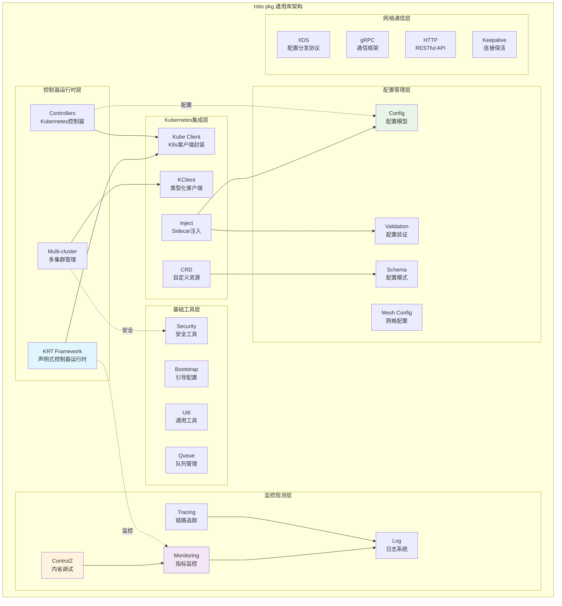
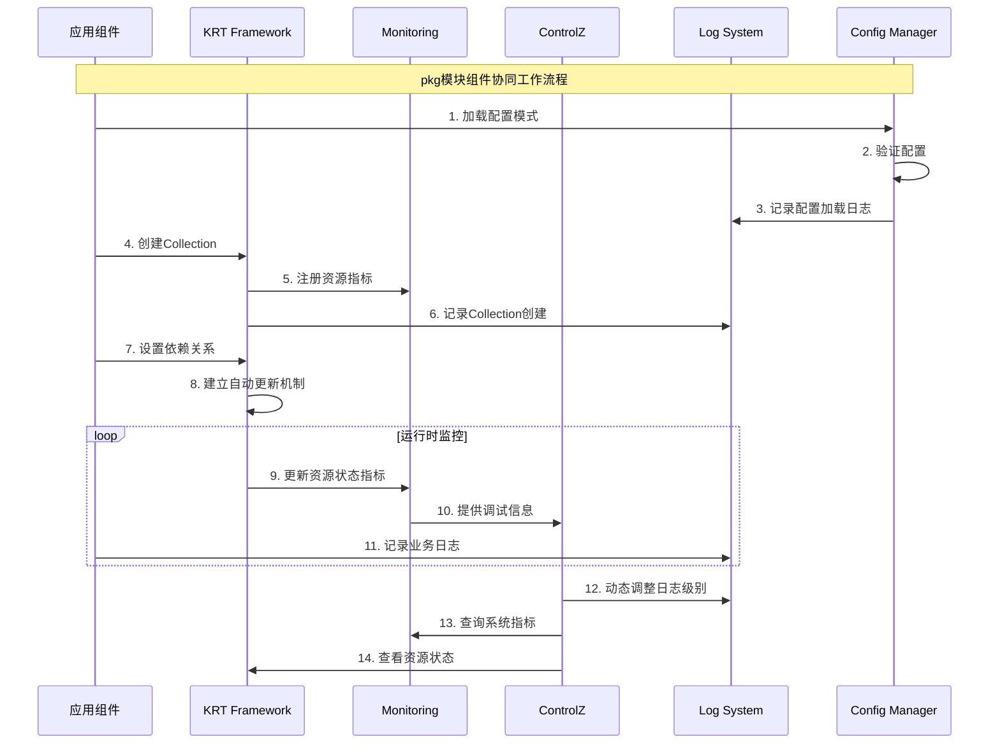
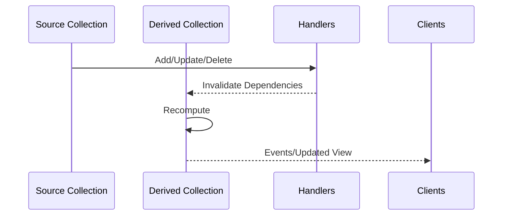
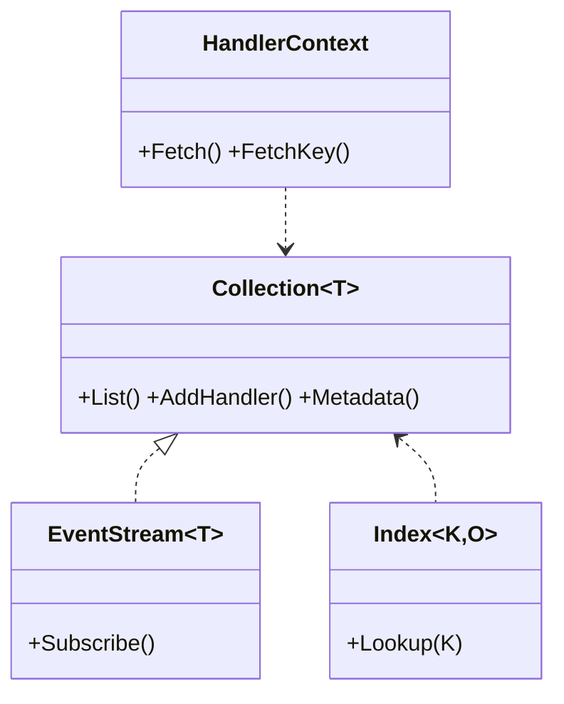

## 概述

Istio的pkg模块是整个项目的基础设施层，提供了丰富的通用库和工具链，支撑着控制平面和数据平面的核心功能。深入剖析pkg模块的关键组件，重点分析KRT（Kubernetes Resource Table）声明式控制器框架、监控系统、配置管理、日志框架等核心基础设施的设计理念与实现细节。

<!--more-->

## 1. pkg模块总体架构

### 1.1 核心组件分层架构



### 1.2 核心组件职责矩阵

| 组件类别 | 核心组件 | 主要职责 | 关键特性 |
|----------|----------|----------|----------|
| **控制器运行时** | KRT Framework | 声明式控制器框架 | 类型安全、依赖管理、自动更新 |
| | Multi-cluster | 多集群资源管理 | 集群发现、资源同步、故障隔离 |
| **Kubernetes集成** | Kube Client | K8s API客户端 | 连接池、重试、缓存 |
| | Inject | Sidecar自动注入 | Webhook、模板渲染、策略匹配 |
| **配置管理** | Config | 统一配置模型 | 类型化、版本化、验证 |
| | Schema | 配置模式定义 | CRD生成、验证规则、文档 |
| **监控观测** | Monitoring | 指标监控系统 | OpenTelemetry、Prometheus集成 |
| | ControlZ | 内省调试工具 | Web UI、REST API、实时状态 |
| **基础工具** | Log | 统一日志框架 | 结构化、分级、动态配置 |
| | Bootstrap | 组件引导 | 配置加载、依赖初始化、生命周期 |

## 2. KRT声明式控制器框架深度解析

### 2.1 KRT框架设计理念

KRT（Kubernetes Declarative Controller Runtime）是Istio专门设计的声明式控制器框架，解决了传统Kubernetes Informer的诸多限制：

```go
// pkg/kube/krt/core.go
// Collection是KRT的核心资源类型，表示对象的集合
// 类似于Informer，但不绑定到Kubernetes
type Collection[T any] interface {
    // GetKey根据键返回对象，如果存在的话。否则返回nil
    GetKey(k string) *T

    // List返回集合中的所有对象
    // 列表的顺序未定义
    List() []T

    // EventStream为集合提供事件处理能力，允许客户端订阅变化
    // 并在添加、修改或删除对象时接收通知
    EventStream[T]

    // Metadata返回与此集合关联的元数据
    // 这可以用于存储和检索任意的键值对
    // 为集合提供额外的上下文或配置
    Metadata() Metadata
}

// EventStream提供底层集合与其客户端之间的链接
// EventStream不会为重触发操作发布事件
// 其中T类型的结果对象等于集合中的现有对象
type EventStream[T any] interface {
    // Subscribe注册一个处理器以接收事件通知
    Subscribe(handler func(obj T, event Event)) Syncer
    
    // AddHandler添加一个类型化的事件处理器
    AddHandler(handler Handler[T]) Syncer
    
    // RegisterBatch批量注册处理器，提高性能
    RegisterBatch(handler func(events []Event[T]), runExistingState bool) Syncer
}
```

### 2.2 Collection构建方式

KRT支持三种主要的Collection构建方式：

#### 2.2.1 从Informer构建

```go
// 从Kubernetes Informer包装成Collection
func WrapClient[T controllers.ComparableObject](c kclient.Client[T], opts ...CollectionOption) Collection[T] {
    return &clientCollection[T]{
        client: c,
        opts:   applyCollectionOptions(opts...),
    }
}

// 创建新的Informer Collection
func NewInformer[T controllers.ComparableObject](c kclient.Untyped, gvr schema.GroupVersionResource, 
    opts ...CollectionOption) Collection[T] {
    client := kclient.NewFiltered[T](c, kclient.Filter{
        ObjectFilter: opts.objectFilter,
    })
    
    return WrapClient(client, opts...)
}
```

#### 2.2.2 静态Collection

```go
// pkg/kube/krt/static.go
type StaticCollection[T any] struct {
    mu    sync.RWMutex
    items map[string]T
    opts  collectionOptions
    
    // 事件处理器列表
    handlers []Handler[T]
}

// 创建静态配置的Collection
func NewStatic[T any](items []T, opts ...CollectionOption) *StaticCollection[T] {
    res := &StaticCollection[T]{
        items: make(map[string]T),
        opts:  applyCollectionOptions(opts...),
    }
    
    // 填充初始项目
    for _, item := range items {
        key := GetKey(item)
        res.items[key] = item
    }
    
    return res
}

// 更新静态Collection的内容
func (sc *StaticCollection[T]) UpdateObject(obj T) {
    sc.mu.Lock()
    defer sc.mu.Unlock()
    
    key := GetKey(obj)
    old, exists := sc.items[key]
    sc.items[key] = obj
    
    // 发送适当的事件
    event := EventAdd
    if exists {
        if Equal(old, obj) {
            return // 对象未变化，不发送事件
        }
        event = EventUpdate
    }
    
    sc.triggerHandlers(obj, event)
}
```

#### 2.2.3 派生Collection

派生Collection是KRT框架的核心特性，支持声明式的数据转换：

```go
// 一对一映射转换
func NewCollection[I, O any](c Collection[I], 
    f func(ctx HandlerContext, i I) *O, 
    opts ...CollectionOption) Collection[O] {
    
    return newDerivedCollection[I, O](c, func(ctx HandlerContext, i I) []O {
        if res := f(ctx, i); res != nil {
            return []O{*res}
        }
        return nil
    }, opts...)
}

// 一对多映射转换
func NewManyCollection[I, O any](c Collection[I], 
    f func(ctx HandlerContext, i I) []O, 
    opts ...CollectionOption) Collection[O] {
    
    return newDerivedCollection[I, O](c, f, opts...)
}

// 单例Collection - 全局状态管理
func NewSingleton[O any](f func(ctx HandlerContext) *O, 
    opts ...CollectionOption) Collection[O] {
    
    // 创建一个虚拟的输入Collection来触发计算
    trigger := NewRecomputeTrigger()
    return NewCollection(trigger, func(ctx HandlerContext, _ RecomputeTrigger) *O {
        return f(ctx)
    }, opts...)
}
```

### 2.3 依赖管理和自动更新

KRT的强大之处在于自动的依赖管理：

```go
// HandlerContext提供对其他Collection的访问能力
type HandlerContext interface {
    // Fetch从另一个Collection获取数据
    // 如果Fetch操作的结果改变，Collection将自动重新计算
    Fetch[T any](c Collection[T]) []T
    
    // FetchKey从Collection获取特定的对象
    FetchKey[T any](c Collection[T], key string) *T
    
    // Logger返回结构化的日志记录器
    Logger() *istiolog.Scope
}

// 实际的HandlerContext实现
type handlerContext struct {
    dependencies []Collection[any]  // 依赖的Collection列表
    augmentations []Augmentation   // 增强器列表
    logger       *istiolog.Scope   // 日志记录器
}

func (h *handlerContext) Fetch[T any](c Collection[T]) []T {
    // 记录依赖关系
    h.dependencies = append(h.dependencies, collectionAsAny(c))
    
    // 返回当前数据
    return c.List()
}

// 示例：依赖管理的实际应用
func createServiceDependentCollection() Collection[EnhancedService] {
    return NewCollection(Services, func(ctx HandlerContext, svc *v1.Service) *EnhancedService {
        // 获取相关的Endpoints
        endpoints := ctx.FetchKey(Endpoints, types.NamespacedName{
            Namespace: svc.Namespace,
            Name:      svc.Name,
        }.String())
        
        // 获取相关的Pods
        allPods := ctx.Fetch(Pods)
        relatedPods := slices.FilterMatch(allPods, func(pod *v1.Pod) bool {
            return pod.Namespace == svc.Namespace && 
                   matchesSelector(pod.Labels, svc.Spec.Selector)
        })
        
        return &EnhancedService{
            Service:   svc,
            Endpoints: endpoints,
            Pods:      relatedPods,
        }
    })
    // 当Services、Endpoints或Pods发生变化时，这个Collection会自动更新
}
```

### 2.4 索引和查询优化

KRT提供了强大的索引机制来优化查询性能：

```go
// pkg/kube/krt/index.go
type Index[K comparable, O any] interface {
    // Lookup根据键查找对象
    Lookup(k K) []O
    
    // AsCollection将索引转换为Collection
    AsCollection(opts ...CollectionOption) Collection[IndexObject[K, O]]
    
    objectHasKey(obj O, k K) bool
    extractKeys(o O) []K
    id() collectionUID
}

// 创建命名空间索引的便利函数
func NewNamespaceIndex[O Namespacer](c Collection[O]) Index[string, O] {
    return NewIndex(c, cache.NamespaceIndex, func(o O) []string {
        return []string{o.GetNamespace()}
    })
}

// 通用索引创建
func NewIndex[K comparable, O any](
    c Collection[O],
    name string,
    extract func(o O) []K,
    opts ...CollectionOption,
) Index[K, O] {
    
    idx := &index[K, O]{
        name:         name,
        extract:      extract,
        parent:       c,
        objects:      make(map[string]O),
        byIndex:      make(map[K]sets.String),
    }
    
    // 设置事件处理器来维护索引
    c.AddHandler(func(obj O, event Event) {
        switch event {
        case EventAdd:
            idx.handleAdd(obj)
        case EventUpdate:
            idx.handleUpdate(obj)
        case EventDelete:
            idx.handleDelete(obj)
        }
    })
    
    return idx
}

// 使用示例：按标签索引Pods
func createPodByAppIndex() Index[string, *v1.Pod] {
    return NewIndex(Pods, "app", func(pod *v1.Pod) []string {
        if app := pod.Labels["app"]; app != "" {
            return []string{app}
        }
        return nil
    })
}
```

## 3. 监控系统架构深度解析

### 3.1 基于OpenTelemetry的监控框架

```go
// pkg/monitoring/monitoring.go
var (
    // 获取全局的Meter实例
    meter = func() api.Meter {
        return otel.GetMeterProvider().Meter("istio")
    }

    monitoringLogger = log.RegisterScope("monitoring", "metrics monitoring")
)

// 注册Prometheus导出器
func RegisterPrometheusExporter(reg prometheus.Registerer, gatherer prometheus.Gatherer) (http.Handler, error) {
    if reg == nil {
        reg = prometheus.DefaultRegisterer
    }
    if gatherer == nil {
        gatherer = prometheus.DefaultGatherer
    }
    
    // 配置Prometheus导出器选项
    promOpts := []otelprom.Option{
        otelprom.WithoutScopeInfo(),      // 不包含scope信息
        otelprom.WithoutTargetInfo(),     // 不包含target信息
        otelprom.WithoutUnits(),          // 不包含单位信息
        otelprom.WithRegisterer(reg),     // 使用指定的注册器
        otelprom.WithoutCounterSuffixes(), // 不添加counter后缀
    }

    prom, err := otelprom.New(promOpts...)
    if err != nil {
        return nil, err
    }

    // 创建MeterProvider
    opts := []metric.Option{metric.WithReader(prom)}
    opts = append(opts, knownMetrics.toHistogramViews()...)
    mp := metric.NewMeterProvider(opts...)
    otel.SetMeterProvider(mp)
    
    // 返回HTTP处理器
    handler := promhttp.HandlerFor(gatherer, promhttp.HandlerOpts{})
    return handler, nil
}
```

### 3.2 指标类型和接口设计

```go
// Metric接口定义了所有指标类型的通用行为
type Metric interface {
    // Increment记录值为1。对于Sum类型，相当于当前值+1
    // 对于Gauge类型，相当于设置值为1
    // 对于Distribution类型，相当于观察值1
    Increment()

    // Decrement记录值为-1
    Decrement()

    // Name返回指标的名称
    Name() string

    // Record记录提供的值
    Record(value float64)

    // RecordInt记录整数值
    RecordInt(value int64)

    // With创建带有指定标签值的新Metric实例
    With(labelValues ...LabelValue) Metric
}

// 具体的指标类型实现
type counter struct {
    baseMetric
    c api.Int64Counter
}

func (f *counter) Increment() {
    f.RecordInt(1)
}

func (f *counter) RecordInt(value int64) {
    f.c.Add(context.Background(), value, api.WithAttributes(f.attrs...))
}

type gauge struct {
    baseMetric
    // Gauge使用回调函数实现
    // 当Prometheus抓取时，会调用这个函数获取当前值
    setValue func(v float64)
    getValue func() float64
}

func (f *gauge) Record(value float64) {
    f.setValue(value)
}

// 直方图类型用于记录数值分布
type histogram struct {
    baseMetric
    h api.Float64Histogram
}

func (f *histogram) Record(value float64) {
    f.h.Record(context.Background(), value, api.WithAttributes(f.attrs...))
}
```

### 3.3 指标注册和管理

```go
// 指标构建器模式
type MetricBuilder struct {
    name        string
    unit        Unit
    description string
}

func NewSum(name, description string) MetricBuilder {
    return MetricBuilder{
        name:        name,
        description: description,
        unit:        None,
    }
}

func NewGauge(name, description string) MetricBuilder {
    return MetricBuilder{
        name:        name, 
        description: description,
        unit:        None,
    }
}

func NewHistogram(name, description string) MetricBuilder {
    return MetricBuilder{
        name:        name,
        description: description,
        unit:        None,
    }
}

// 使用标签创建指标
func (m MetricBuilder) With(labels ...Label) Metric {
    switch m.metricType {
    case metricTypeCounter:
        return newCounter(m, labels)
    case metricTypeGauge:
        return newGauge(m, labels)
    case metricTypeHistogram:
        return newHistogram(m, labels)
    default:
        panic("unknown metric type")
    }
}

// 实际使用示例
var (
    // 请求总数计数器
    requestTotal = NewSum(
        "requests_total",
        "The total number of requests",
    ).With(
        ResponseCodeLabel.Value("200"), 
        MethodLabel.Value("GET"),
    )
    
    // 响应时间直方图
    responseTime = NewHistogram(
        "response_duration_milliseconds",
        "Response time in milliseconds",
    ).With(
        ServiceLabel.Value("pilot"),
    )
    
    // 当前连接数量表
    currentConnections = NewGauge(
        "current_connections",
        "Current number of connections",
    )
)
```

## 4. ControlZ内省调试系统

### 4.1 ControlZ架构设计

```go
// pkg/ctrlz/ctrlz.go
// ControlZ是Istio的内省工具。当组件集成ControlZ时，
// 它们自动获得一个IP端口，允许操作员可视化和控制进程的各个方面，
// 包括控制日志级别、查看命令行选项、内存使用等
// 该端口还实现了REST API，允许访问和控制相同的状态

// 核心主题列表 - 代表UI的不同部分
var coreTopics = []fw.Topic{
    topics.ScopeTopic(),      // 日志作用域管理
    topics.MemTopic(),        // 内存使用情况  
    topics.EnvTopic(),        // 环境变量
    topics.ProcTopic(),       // 进程信息
    topics.ArgsTopic(),       // 命令行参数
    topics.VersionTopic(),    // 版本信息
    topics.SignalsTopic(),    // 信号处理
}

// Server表示正在运行的ControlZ实例
type Server struct {
    listener   net.Listener      // 网络监听器
    shutdown   sync.WaitGroup    // 优雅关闭同步
    httpServer http.Server       // HTTP服务器
}

// 运行ControlZ服务器
func Run(o *Options, customTopics []fw.Topic) (*Server, error) {
    if o == nil {
        o = DefaultOptions()
    }

    // 合并核心主题和自定义主题
    topics := append(coreTopics, customTopics...)
    
    // 创建路由器
    router := mux.NewRouter()
    
    // 注册主题路由
    for _, topic := range topics {
        registerTopic(router, topic)
    }
    
    // 注册静态资源
    registerStatic(router)
    
    // 注册pprof端点（性能分析）
    registerPprof(router)
    
    // 启动HTTP服务器
    server := &http.Server{
        Handler: router,
        Addr:    o.Address,
    }
    
    return &Server{
        httpServer: *server,
    }, nil
}
```

### 4.2 主题系统实现

```go
// pkg/ctrlz/fw/topic.go
// Topic接口定义了ControlZ主题的行为
type Topic interface {
    // Title返回主题的标题
    Title() string
    
    // Prefix返回URL前缀
    Prefix() string
    
    // Activate激活主题，返回HTML模板数据
    Activate(context Context) string
    
    // GetRequest处理GET请求
    GetRequest(context Context) (string, error)
    
    // PostRequest处理POST请求  
    PostRequest(context Context) (string, error)
}

// 上下文接口提供请求处理所需的信息
type Context interface {
    // Request返回HTTP请求对象
    Request() *http.Request
    
    // ResponseWriter返回HTTP响应写入器
    ResponseWriter() http.ResponseWriter
    
    // Vars返回路径变量
    Vars() map[string]string
    
    // Query返回查询参数
    Query() url.Values
}

// 内存主题实现示例
type memTopic struct{}

func (m memTopic) Title() string {
    return "Memory Usage"
}

func (m memTopic) Prefix() string {
    return "mem"
}

func (m memTopic) Activate(context Context) string {
    // 收集内存统计信息
    var memStats runtime.MemStats
    runtime.ReadMemStats(&memStats)
    
    data := struct {
        Alloc        uint64
        TotalAlloc   uint64
        Sys          uint64
        Lookups      uint64
        Mallocs      uint64
        Frees        uint64
        HeapAlloc    uint64
        HeapSys      uint64
        HeapIdle     uint64
        HeapInuse    uint64
        HeapReleased uint64
        HeapObjects  uint64
        StackInuse   uint64
        StackSys     uint64
        MSpanInuse   uint64
        MSpanSys     uint64
        MCacheInuse  uint64
        MCacheSys    uint64
        GCSys        uint64
        NextGC       uint64
        LastGC       time.Time
        PauseTotalNs uint64
        NumGC        uint32
        NumForcedGC  uint32
    }{
        Alloc:        memStats.Alloc,
        TotalAlloc:   memStats.TotalAlloc,
        Sys:          memStats.Sys,
        // ... 更多字段
    }
    
    return renderTemplate("memory.html", data)
}

// 日志作用域主题 - 允许动态调整日志级别
type scopeTopic struct{}

func (s scopeTopic) PostRequest(context Context) (string, error) {
    request := context.Request()
    
    // 解析POST参数
    if err := request.ParseForm(); err != nil {
        return "", err
    }
    
    scopeName := request.FormValue("scope")
    levelStr := request.FormValue("level")
    
    // 查找日志作用域
    scope := log.FindScope(scopeName)
    if scope == nil {
        return "", fmt.Errorf("unknown scope: %s", scopeName)
    }
    
    // 解析日志级别
    level, err := log.StringToLevel(levelStr)
    if err != nil {
        return "", err
    }
    
    // 设置新的日志级别
    scope.SetOutputLevel(level)
    
    return fmt.Sprintf("Set %s to %v", scopeName, level), nil
}
```

## 5. 配置管理系统

### 5.1 统一配置模型

```go
// pkg/config/config.go
// Config是Istio配置的统一表示
type Config struct {
    // Meta包含所有配置的通用元数据
    Meta Meta
    
    // Spec是配置的规范，类型由Meta.Schema确定
    Spec proto.Message
    
    // Status是配置的状态信息
    Status proto.Message
}

// Meta包含配置元数据
type Meta struct {
    // GroupVersionKind标识配置的类型
    GroupVersionKind schema.GroupVersionKind
    
    // Name是配置对象的名称
    Name string
    
    // Namespace是配置对象的命名空间
    Namespace string
    
    // Domain是集群域名后缀
    Domain string
    
    // Labels是标签映射
    Labels map[string]string
    
    // Annotations是注释映射
    Annotations map[string]string
    
    // ResourceVersion用于乐观并发控制
    ResourceVersion string
    
    // CreationTimestamp是创建时间戳
    CreationTimestamp time.Time
    
    // UID是唯一标识符
    UID string
}

// Key返回配置的唯一键
func (m Meta) Key() string {
    return KeyFunc(m.GroupVersionKind.Kind, m.Name, m.Namespace)
}

// KeyFunc生成配置键的标准函数
func KeyFunc(typ, name, namespace string) string {
    return fmt.Sprintf("%s/%s/%s", typ, namespace, name)
}
```

### 5.2 配置模式定义

```go
// pkg/config/schema/collection/collections.go
// Resource描述配置资源的模式
type Resource struct {
    // Group是API组
    Group string
    
    // Version是API版本
    Version string
    
    // Kind是资源类型
    Kind string
    
    // Plural是复数形式的名称
    Plural string
    
    // ClusterScoped表示是否为集群级资源
    ClusterScoped bool
    
    // Proto是protobuf消息类型
    Proto proto.Message
    
    // ProtoPackage是proto包名
    ProtoPackage string
    
    // ValidateProto是验证函数
    ValidateProto validation.ValidateFunc
}

// Schema表示配置模式集合
type Schema struct {
    resources []Resource
    byKind    map[string]Resource
}

// 创建新的Schema
func NewSchemasBuilder() *Builder {
    return &Builder{
        resources: make([]Resource, 0),
    }
}

func (b *Builder) Add(r Resource) *Builder {
    b.resources = append(b.resources, r)
    return b
}

func (b *Builder) Build() Schema {
    byKind := make(map[string]Resource)
    for _, r := range b.resources {
        byKind[r.Kind] = r
    }
    
    return Schema{
        resources: b.resources,
        byKind:    byKind,
    }
}

// Istio核心配置资源定义
var (
    VirtualService = Resource{
        Group:         "networking.istio.io",
        Version:       "v1beta1",
        Kind:          "VirtualService",
        Plural:        "virtualservices",
        ClusterScoped: false,
        Proto:         &networking.VirtualService{},
        ValidateProto: validation.ValidateVirtualService,
    }
    
    DestinationRule = Resource{
        Group:         "networking.istio.io",
        Version:       "v1beta1", 
        Kind:          "DestinationRule",
        Plural:        "destinationrules",
        ClusterScoped: false,
        Proto:         &networking.DestinationRule{},
        ValidateProto: validation.ValidateDestinationRule,
    }
    
    Gateway = Resource{
        Group:         "networking.istio.io",
        Version:       "v1beta1",
        Kind:          "Gateway", 
        Plural:        "gateways",
        ClusterScoped: false,
        Proto:         &networking.Gateway{},
        ValidateProto: validation.ValidateGateway,
    }
)

// 构建完整的Pilot配置模式
func PilotSchema() Schema {
    return NewSchemasBuilder().
        Add(VirtualService).
        Add(DestinationRule).
        Add(Gateway).
        Add(ServiceEntry).
        Add(Sidecar).
        Add(WorkloadEntry).
        Add(WorkloadGroup).
        Add(PeerAuthentication).
        Add(RequestAuthentication).
        Add(AuthorizationPolicy).
        Add(Telemetry).
        Add(ProxyConfig).
        Build()
}
```

### 5.3 配置验证框架

```go
// pkg/config/validation/validation.go
// ValidateFunc定义验证函数类型
type ValidateFunc func(config proto.Message) error

// Warning表示验证警告
type Warning struct {
    Message string
}

// Error表示验证错误
type Error struct {
    Field   string
    Message string
}

// ValidationResult包含验证结果
type ValidationResult struct {
    Errors   []Error
    Warnings []Warning
}

func (v ValidationResult) IsValid() bool {
    return len(v.Errors) == 0
}

// VirtualService验证实现示例
func ValidateVirtualService(cfg proto.Message) error {
    vs, ok := cfg.(*networking.VirtualService)
    if !ok {
        return fmt.Errorf("expected VirtualService, got %T", cfg)
    }
    
    var result ValidationResult
    
    // 验证主机名
    if len(vs.Hosts) == 0 {
        result.Errors = append(result.Errors, Error{
            Field:   "hosts",
            Message: "hosts field is required",
        })
    }
    
    for i, host := range vs.Hosts {
        if err := ValidateHost(host); err != nil {
            result.Errors = append(result.Errors, Error{
                Field:   fmt.Sprintf("hosts[%d]", i),
                Message: err.Error(),
            })
        }
    }
    
    // 验证HTTP路由规则
    for i, route := range vs.Http {
        if err := validateHTTPRoute(route); err != nil {
            result.Errors = append(result.Errors, Error{
                Field:   fmt.Sprintf("http[%d]", i),
                Message: err.Error(),
            })
        }
    }
    
    if !result.IsValid() {
        return fmt.Errorf("validation failed: %v", result.Errors)
    }
    
    return nil
}

// 主机名验证
func ValidateHost(host string) error {
    if len(host) == 0 {
        return fmt.Errorf("host cannot be empty")
    }
    
    // 检查通配符主机名
    if strings.HasPrefix(host, "*") {
        if len(host) == 1 || host[1] != '.' {
            return fmt.Errorf("wildcard host %s is not valid", host)
        }
    }
    
    // 检查FQDN格式
    if !isValidDNSName(host) {
        return fmt.Errorf("host %s is not a valid DNS name", host)
    }
    
    return nil
}
```

## 6. 日志系统架构

### 6.1 结构化日志框架

```go
// pkg/log/config.go
// Options包含日志系统的配置选项
type Options struct {
    // OutputPaths是日志输出路径列表
    OutputPaths []string
    
    // ErrorOutputPaths是错误日志输出路径列表  
    ErrorOutputPaths []string
    
    // RotateOutputPath是日志轮转输出路径
    RotateOutputPath string
    
    // RotationMaxSize是单个日志文件的最大大小（MB）
    RotationMaxSize int
    
    // RotationMaxAge是日志文件保留的最大天数
    RotationMaxAge int
    
    // RotationMaxBackups是保留的旧日志文件最大数量
    RotationMaxBackups int
    
    // JSONEncoding控制是否使用JSON格式编码
    JSONEncoding bool
    
    // LogGrpc启用gRPC日志记录
    LogGrpc bool
    
    // Level设置日志级别
    Level string
    
    // StackTraceLevel设置堆栈跟踪的最小级别
    StackTraceLevel string
}

// Scope表示日志作用域，提供分层的日志控制
type Scope struct {
    // name是作用域的名称
    name string
    
    // nameToEmit是实际发出的名称（可能被截断）
    nameToEmit string
    
    // description是作用域的描述
    description string
    
    // callerSkip是调用栈跳过的层数
    callerSkip int
    
    // logger是底层的zap.Logger
    logger *zap.SugaredLogger
    
    // level是当前的日志级别（原子操作）
    level *zap.AtomicLevel
}

// RegisterScope注册一个新的日志作用域
func RegisterScope(name, description string, callerSkip ...int) *Scope {
    skip := 0
    if len(callerSkip) > 0 {
        skip = callerSkip[0]
    }
    
    s := &Scope{
        name:        name,
        nameToEmit:  name,
        description: description,
        callerSkip:  skip,
        level:       zap.NewAtomicLevel(),
    }
    
    // 注册到全局作用域映射
    registerScope(s)
    
    return s
}

// 日志方法实现
func (s *Scope) Info(msg string) {
    s.logger.Info(msg)
}

func (s *Scope) Infof(template string, args ...interface{}) {
    s.logger.Infof(template, args...)
}

func (s *Scope) Infow(msg string, keysAndValues ...interface{}) {
    s.logger.Infow(msg, keysAndValues...)
}

func (s *Scope) Error(msg string) {
    s.logger.Error(msg)
}

func (s *Scope) Errorf(template string, args ...interface{}) {
    s.logger.Errorf(template, args...)
}

func (s *Scope) Errorw(msg string, keysAndValues ...interface{}) {
    s.logger.Errorw(msg, keysAndValues...)
}

// WithLabels创建带有结构化标签的新作用域
func (s *Scope) WithLabels(keysAndValues ...interface{}) *Scope {
    newLogger := s.logger.With(keysAndValues...)
    return &Scope{
        name:       s.name,
        nameToEmit: s.nameToEmit,
        logger:     newLogger,
        level:      s.level,
    }
}
```

### 6.2 动态日志级别控制

```go
// 支持运行时动态调整日志级别
func (s *Scope) SetOutputLevel(level Level) {
    s.level.SetLevel(levelToZap(level))
}

func (s *Scope) GetOutputLevel() Level {
    return zapToLevel(s.level.Level())
}

// FindScope查找指定名称的作用域
func FindScope(name string) *Scope {
    mu.Lock()
    defer mu.Unlock()
    return scopes[name]
}

// Scopes返回所有注册的作用域
func Scopes() map[string]*Scope {
    mu.Lock()
    defer mu.Unlock()
    
    out := make(map[string]*Scope)
    for k, v := range scopes {
        out[k] = v
    }
    return out
}

// 使用示例
var (
    // 不同组件使用各自的日志作用域
    pilotLog = RegisterScope("pilot", "Pilot discovery service")
    xdsLog   = RegisterScope("xds", "XDS server")
    adsLog   = RegisterScope("ads", "ADS server") 
    krtLog   = RegisterScope("krt", "Kubernetes Resource Table")
)

// 在业务代码中使用
func processConfigUpdate(config *networking.VirtualService) {
    pilotLog.Infof("Processing VirtualService: %s/%s", config.Namespace, config.Name)
    
    if err := validateConfig(config); err != nil {
        pilotLog.Errorw("Configuration validation failed", 
            "error", err,
            "config", config.Name,
            "namespace", config.Namespace)
        return
    }
    
    pilotLog.Debug("Configuration validation succeeded")
}
```

## 7. Sidecar注入系统

### 7.1 Webhook注入架构

```go
// pkg/kube/inject/webhook.go
// Webhook实现自动代理注入的变更webhook
type Webhook struct {
    mu           sync.RWMutex
    Config       *Config                                           // 注入配置
    meshConfig   *meshconfig.MeshConfig                           // 网格配置
    valuesConfig ValuesConfig                                     // 值配置
    namespaces   *multicluster.KclientComponent[*corev1.Namespace] // 命名空间客户端
    nodes        *multicluster.KclientComponent[*corev1.Node]      // 节点客户端

    watcher   Watcher          // 配置监听器
    MultiCast *WatcherMulticast // 多播监听器

    env      *model.Environment // 环境配置
    revision string             // 修订版本
}

// Config包含注入所需的所有配置
type Config struct {
    // Policy控制注入策略
    Policy InjectionPolicy
    
    // Template是注入模板
    Template string
    
    // Aliases是容器和init容器的别名映射
    Aliases map[string]string
    
    // NeverInjectSelector选择器匹配时永不注入
    NeverInjectSelector []metav1.LabelSelector
    
    // AlwaysInjectSelector选择器匹配时总是注入
    AlwaysInjectSelector []metav1.LabelSelector
    
    // InjectedAnnotations是注入后添加的注释
    InjectedAnnotations map[string]string
}

// InjectionPolicy定义注入策略
type InjectionPolicy string

const (
    InjectionPolicyDisabled InjectionPolicy = "disabled" // 禁用注入
    InjectionPolicyEnabled  InjectionPolicy = "enabled"  // 启用注入
)
```

### 7.2 注入逻辑实现

```go
// injectPod执行实际的Pod注入逻辑
func (wh *Webhook) inject(req *admissionv1.AdmissionRequest) (*admissionv1.AdmissionResponse, error) {
    var pod corev1.Pod
    if err := json.Unmarshal(req.Object.Raw, &pod); err != nil {
        return nil, err
    }

    // 1. 检查是否应该注入
    inject, err := wh.shouldInject(&pod, req.Namespace)
    if err != nil {
        return nil, err
    }
    
    if !inject {
        return &admissionv1.AdmissionResponse{
            Allowed: true,
        }, nil
    }

    // 2. 执行注入逻辑
    patchBytes, err := wh.doInject(&pod, req.Namespace)
    if err != nil {
        return nil, err
    }

    // 3. 返回补丁响应
    patchType := admissionv1.PatchTypeJSONPatch
    return &admissionv1.AdmissionResponse{
        Allowed: true,
        Patch:   patchBytes,
        PatchType: &patchType,
    }, nil
}

// shouldInject确定是否应该注入sidecar
func (wh *Webhook) shouldInject(pod *corev1.Pod, namespace string) (bool, error) {
    // 1. 检查Pod注解
    if annotation, exists := pod.Annotations[annotation.SidecarInject.Name]; exists {
        switch annotation {
        case "true":
            return true, nil
        case "false":
            return false, nil
        }
    }

    // 2. 检查命名空间标签
    ns := wh.namespaces.Get(namespace, "")
    if ns != nil {
        if label, exists := ns.Labels[label.SidecarInject.Name]; exists {
            return label == "enabled", nil
        }
    }

    // 3. 检查全局策略
    switch wh.Config.Policy {
    case InjectionPolicyEnabled:
        // 检查NeverInject选择器
        for _, selector := range wh.Config.NeverInjectSelector {
            if selectorMatches(selector, pod.Labels) {
                return false, nil
            }
        }
        return true, nil
        
    case InjectionPolicyDisabled:
        // 检查AlwaysInject选择器
        for _, selector := range wh.Config.AlwaysInjectSelector {
            if selectorMatches(selector, pod.Labels) {
                return true, nil
            }
        }
        return false, nil
        
    default:
        return false, nil
    }
}

// doInject执行实际的注入操作
func (wh *Webhook) doInject(pod *corev1.Pod, namespace string) ([]byte, error) {
    // 1. 创建注入上下文
    ctx := &InjectionContext{
        Pod:       pod,
        Namespace: namespace,
        Mesh:      wh.meshConfig,
        Values:    wh.valuesConfig,
    }

    // 2. 渲染注入模板
    rendered, err := wh.renderTemplate(ctx)
    if err != nil {
        return nil, err
    }

    // 3. 解析渲染结果
    var injected corev1.Pod
    if err := yaml.Unmarshal([]byte(rendered), &injected); err != nil {
        return nil, err
    }

    // 4. 生成JSON补丁
    original, err := json.Marshal(pod)
    if err != nil {
        return nil, err
    }

    modified, err := json.Marshal(&injected)
    if err != nil {
        return nil, err
    }

    patch, err := jsonpatch.CreatePatch(original, modified)
    if err != nil {
        return nil, err
    }

    return json.Marshal(patch)
}
```

## 8. 系统集成与最佳实践

### 8.1 组件协同工作流程



### 8.2 性能优化最佳实践

1. **KRT Collection优化**：
   ```go
   // 使用索引优化查询
   podsByNamespace := NewNamespaceIndex(Pods)
   
   // 使用过滤器减少不必要的计算
   filteredPods := NewCollection(Pods, func(ctx HandlerContext, pod *v1.Pod) *v1.Pod {
       if pod.Namespace == "istio-system" {
           return pod
       }
       return nil
   }, WithName("system-pods"))
   
   // 合理使用依赖，避免过度计算
   enhancedServices := NewCollection(Services, func(ctx HandlerContext, svc *v1.Service) *EnhancedService {
       // 只获取真正需要的依赖数据
       endpoints := ctx.FetchKey(Endpoints, serviceKey(svc))
       return &EnhancedService{Service: svc, Endpoints: endpoints}
   })
   ```

2. **监控指标优化**：
   ```go
   // 使用适当的指标类型
   var (
       // 计数器用于累积值
       requestCount = NewSum("requests_total", "Total requests").
           With(StatusCodeLabel, MethodLabel)
       
       // 直方图用于分布统计
       requestDuration = NewHistogram("request_duration_ms", "Request duration").
           With(ServiceLabel)
           
       // 仪表盘用于当前值
       activeConnections = NewGauge("active_connections", "Active connections")
   )
   
   // 使用标签时要注意基数控制
   func recordRequest(method, status string, duration time.Duration) {
       requestCount.With(
           MethodLabel.Value(method),
           StatusCodeLabel.Value(status),
       ).Increment()
       
       requestDuration.With(
           ServiceLabel.Value("pilot"),
       ).Record(float64(duration.Milliseconds()))
   }
   ```

3. **日志系统优化**：
   ```go
   // 使用结构化日志
   log.Infow("Configuration updated",
       "type", "VirtualService",
       "name", vs.Name,
       "namespace", vs.Namespace,
       "generation", vs.Generation)
   
   // 使用适当的日志级别
   log.Debug("Detailed processing information")  // 开发调试
   log.Info("Important business events")         // 业务信息
   log.Warn("Recoverable errors")                // 可恢复错误
   log.Error("Serious errors")                   // 严重错误
   
   // 使用WithLabels创建上下文日志
   contextLog := log.WithLabels("requestId", requestID, "user", userID)
   contextLog.Info("Processing request")
   ```

## 9. 总结

Istio的pkg模块体现了现代云原生基础设施库的设计精髓：

### 9.1 架构优势

- **声明式编程模型**：KRT框架提供了优雅的声明式控制器编程范式
- **全面的可观测性**：集成的监控、日志、调试系统提供完整的运维能力
- **类型安全设计**：大量使用Go泛型确保编译时类型安全
- **模块化架构**：清晰的分层和职责分离，便于测试和维护

### 9.2 关键技术特点

- **自动依赖管理**：KRT框架的自动依赖追踪和更新机制
- **高性能索引**：基于需求的智能索引和查询优化
- **动态配置**：支持运行时的配置变更和生效
- **企业级监控**：基于OpenTelemetry的现代监控体系

## 附录A：关键函数与结构

### A.1 关键函数核心代码（KRT 与监控）

```go
// KRT：从 Informer 构建类型化 Collection（正文 2.2.1 已详述）
func NewInformer[T controllers.ComparableObject](c kclient.Untyped, gvr schema.GroupVersionResource, opts ...CollectionOption) Collection[T] {
    client := kclient.NewFiltered[T](c, kclient.Filter{ ObjectFilter: opts.objectFilter })
    return WrapClient(client, opts...)
}

// KRT：派生 Collection（正文 2.2.3 已详述）
func NewCollection[I, O any](c Collection[I], f func(ctx HandlerContext, i I) *O, opts ...CollectionOption) Collection[O] {
    return newDerivedCollection[I, O](c, func(ctx HandlerContext, i I) []O { if res := f(ctx, i); res != nil { return []O{*res} }; return nil }, opts...)
}

// KRT：索引（正文 2.4 已详述）
func NewIndex[K comparable, O any](c Collection[O], name string, extract func(o O) []K, opts ...CollectionOption) Index[K, O] {
    idx := &index[K, O]{ name: name, extract: extract, parent: c, objects: make(map[string]O), byIndex: make(map[K]sets.String) }
    c.AddHandler(func(obj O, event Event) { switch event { case EventAdd: idx.handleAdd(obj); case EventUpdate: idx.handleUpdate(obj); case EventDelete: idx.handleDelete(obj) } })
    return idx
}

// 监控：注册 Prometheus 导出器（正文 3.1 已详述）
func RegisterPrometheusExporter(reg prometheus.Registerer, gatherer prometheus.Gatherer) (http.Handler, error) {
    prom, err := otelprom.New(/* 选项省略 */)
    if err != nil { return nil, err }
    mp := metric.NewMeterProvider([]metric.Option{ metric.WithReader(prom) }...)
    otel.SetMeterProvider(mp)
    return promhttp.HandlerFor(gatherer, promhttp.HandlerOpts{}), nil
}
```

### A.2 调用链（pkg 侧常见）

- KRT：`NewInformer/WrapClient` → `Collection.AddHandler` → `EventStream` →（依赖跟踪）→ `Derived Collection 重计算`
- 索引：`NewIndex` → `parent Collection.AddHandler` → `handleAdd/Update/Delete` → `ByKey Lookup`
- 监控：`RegisterPrometheusExporter` → `SetMeterProvider` → `Meter/Metric` 建立 → `Prometheus scrape`

### A.3 时序（KRT 衍生计算）



### A.4 结构体关系（KRT 核心）


