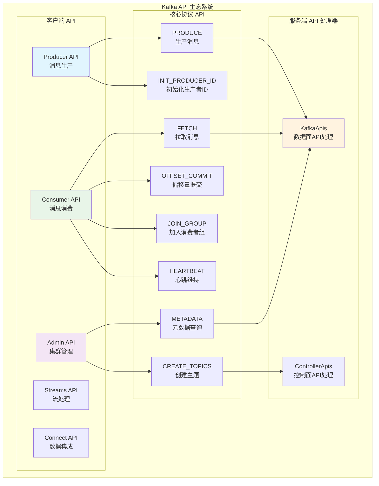
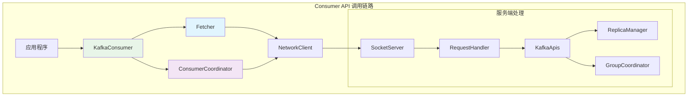
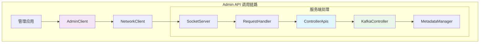
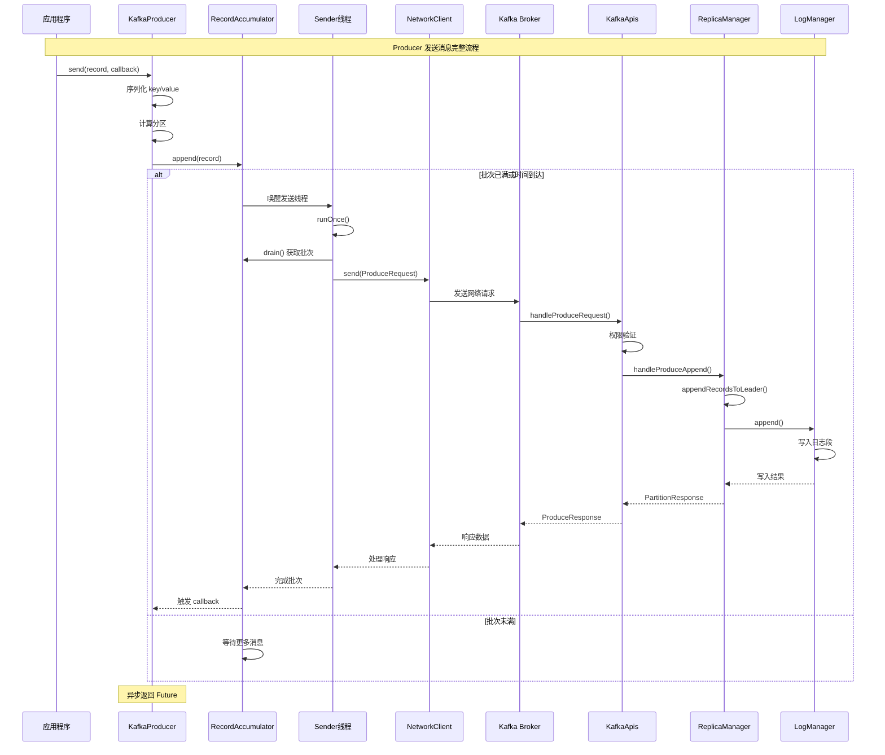
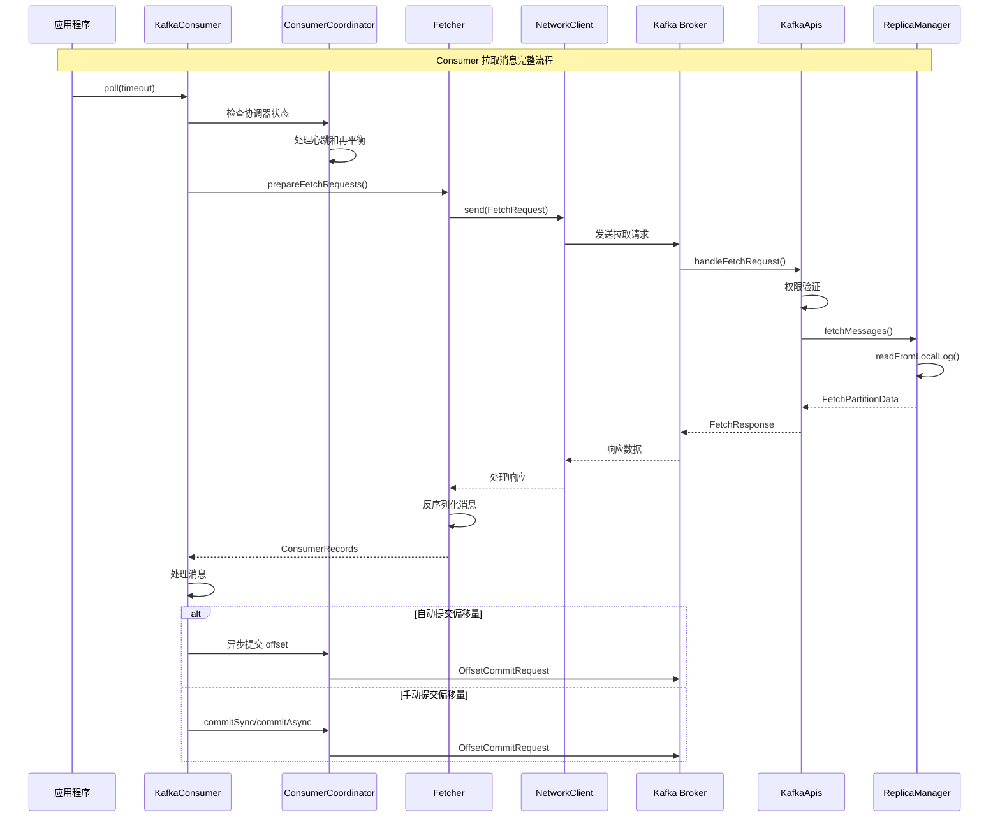

## 概述

Apache Kafka 作为分布式流处理平台，对外提供了丰富的 API 接口。本文将深入分析 Kafka 的核心 API，从客户端入口函数到服务端处理逻辑，完整展示调用链路和关键函数实现。

<!--more-->

## 1. Kafka API 总览

### 1.1 API 分类架构图



### 1.2 核心 API 枚举

根据源码分析，Kafka 定义了以下核心 API：

```java
/**
 * Kafka 核心 API 标识符
 * 位置：clients/src/main/java/org/apache/kafka/common/protocol/ApiKeys.java
 */
public enum ApiKeys {
    // 数据面 API
    PRODUCE(0),                    // 生产消息
    FETCH(1),                      // 拉取消息
    LIST_OFFSETS(2),              // 查询偏移量
    METADATA(3),                   // 查询元数据
    
    // 消费者协调 API
    OFFSET_COMMIT(8),             // 提交偏移量
    OFFSET_FETCH(9),              // 获取偏移量
    FIND_COORDINATOR(10),         // 查找协调器
    JOIN_GROUP(11),               // 加入消费者组
    HEARTBEAT(12),                // 发送心跳
    LEAVE_GROUP(13),              // 离开消费者组
    SYNC_GROUP(14),               // 同步组状态
    
    // 管理面 API
    CREATE_TOPICS(19),            // 创建主题
    DELETE_TOPICS(20),            // 删除主题
    DELETE_RECORDS(21),           // 删除记录
    
    // 事务 API
    INIT_PRODUCER_ID(22),         // 初始化生产者ID
    ADD_PARTITIONS_TO_TXN(24),    // 添加分区到事务
    ADD_OFFSETS_TO_TXN(25),       // 添加偏移量到事务
    END_TXN(26),                  // 结束事务
    
    // 权限和配置 API
    DESCRIBE_ACLS(29),            // 描述ACL
    CREATE_ACLS(30),              // 创建ACL
    DELETE_ACLS(31),              // 删除ACL
    DESCRIBE_CONFIGS(32),         // 描述配置
    ALTER_CONFIGS(33),            // 修改配置
}
```

## 2. Producer API 深度解析

### 2.1 Producer API 架构图

```mermaid
graph TB
    subgraph "Producer API 调用链路"
        APP[应用程序]
        PRODUCER[KafkaProducer]
        RECORD_ACC[RecordAccumulator]
        SENDER[Sender线程]
        NET_CLIENT[NetworkClient]
        
        subgraph "服务端处理"
            SOCKET_SERVER[SocketServer]
            REQ_HANDLER[RequestHandler]
            KAFKA_APIS[KafkaApis]
            REPLICA_MGR[ReplicaManager]
            LOG_MGR[LogManager]
        end
        
        APP --> PRODUCER
        PRODUCER --> RECORD_ACC
        RECORD_ACC --> SENDER
        SENDER --> NET_CLIENT
        NET_CLIENT --> SOCKET_SERVER
        SOCKET_SERVER --> REQ_HANDLER
        REQ_HANDLER --> KAFKA_APIS
        KAFKA_APIS --> REPLICA_MGR
        REPLICA_MGR --> LOG_MGR
    end
    
    style PRODUCER fill:#e1f5fe
    style SENDER fill:#e8f5e8
    style KAFKA_APIS fill:#f3e5f5
```



### 2.2 Producer.send() 核心实现

#### 客户端入口函数

```java
/**
 * KafkaProducer 异步发送消息的核心实现
 * 位置：clients/src/main/java/org/apache/kafka/clients/producer/KafkaProducer.java
 */
@Override
public Future<RecordMetadata> send(ProducerRecord<K, V> record, Callback callback) {
    // 拦截器预处理
    ProducerRecord<K, V> interceptedRecord = this.interceptors.onSend(record);
    return doSend(interceptedRecord, callback);
}

/**
 * 发送消息的具体实现逻辑
 */
private Future<RecordMetadata> doSend(ProducerRecord<K, V> record, Callback callback) {
    // 1. 创建回调包装器
    AppendCallbacks appendCallbacks = new AppendCallbacks(callback, this.interceptors, record);

    try {
        // 2. 检查生产者状态
        throwIfProducerClosed();
        throwIfInPreparedState();

        // 3. 等待元数据更新
        long nowMs = time.milliseconds();
        ClusterAndWaitTime clusterAndWaitTime;
        try {
            clusterAndWaitTime = waitOnMetadata(record.topic(), record.partition(), nowMs, maxBlockTimeMs);
        } catch (KafkaException e) {
            if (metadata.isClosed())
                throw new KafkaException("Producer closed while send in progress", e);
            throw e;
        }
        
        nowMs += clusterAndWaitTime.waitedOnMetadataMs;
        long remainingWaitMs = Math.max(0, maxBlockTimeMs - clusterAndWaitTime.waitedOnMetadataMs);
        Cluster cluster = clusterAndWaitTime.cluster;
        
        // 4. 序列化键值对
        byte[] serializedKey;
        try {
            serializedKey = keySerializerPlugin.get().serialize(record.topic(), record.headers(), record.key());
        } catch (ClassCastException cce) {
            throw new SerializationException("Can't convert key of class " + record.key().getClass().getName() +
                    " to class " + producerConfig.getClass(ProducerConfig.KEY_SERIALIZER_CLASS_CONFIG).getName() +
                    " specified in key.serializer", cce);
        }
        
        byte[] serializedValue;
        try {
            serializedValue = valueSerializerPlugin.get().serialize(record.topic(), record.headers(), record.value());
        } catch (ClassCastException cce) {
            throw new SerializationException("Can't convert value of class " + record.value().getClass().getName() +
                    " to class " + producerConfig.getClass(ProducerConfig.VALUE_SERIALIZER_CLASS_CONFIG).getName() +
                    " specified in value.serializer", cce);
        }

        // 5. 计算分区
        int partition = partition(record, serializedKey, serializedValue, cluster);
        TopicPartition tp = new TopicPartition(record.topic(), partition);
        
        setReadOnly(record.headers());
        Header[] headers = record.headers().toArray();

        int serializedSize = AbstractRecords.estimateSizeInBytesUpperBound(apiVersions.maxUsableProduceMagic(),
                compressionType, serializedKey, serializedValue, headers);
        ensureValidRecordSize(serializedSize);
        
        long timestamp = record.timestamp() == null ? nowMs : record.timestamp();
        
        // 6. 添加到累加器进行批处理
        RecordAccumulator.RecordAppendResult result = accumulator.append(record.topic(), partition, timestamp, serializedKey,
                serializedValue, headers, appendCallbacks, remainingWaitMs, true, nowMs, cluster);

        // 7. 如果批次已满或创建了新批次，唤醒发送线程
        if (result.batchIsFull || result.newBatchCreated) {
            log.trace("Waking up the sender since topic {} partition {} is either full or getting a new batch", record.topic(), partition);
            this.sender.wakeup();
        }
        
        return result.future;
        
    } catch (ApiException e) {
        log.debug("Exception occurred during message send:", e);
        if (callback != null) {
            TopicPartition tp = new TopicPartition(record.topic(), record.partition());
            RecordMetadata nullMetadata = new RecordMetadata(tp, -1, -1, RecordBatch.NO_TIMESTAMP, -1, -1);
            callback.onCompletion(nullMetadata, e);
        }
        this.errors.record();
        this.interceptors.onSendError(record, tp, e);
        if (transactionManager != null) {
            transactionManager.maybeTransitionToErrorState(e);
        }
        return new FutureFailure(e);
    } catch (InterruptedException e) {
        this.errors.record();
        this.interceptors.onSendError(record, tp, e);
        throw new InterruptException(e);
    } catch (KafkaException e) {
        this.errors.record();
        this.interceptors.onSendError(record, tp, e);
        throw e;
    } catch (Exception e) {
        this.interceptors.onSendError(record, tp, e);
        throw e;
    }
}
```

#### Sender 发送线程核心循环

```java
/**
 * Sender 线程的主循环实现
 * 位置：clients/src/main/java/org/apache/kafka/clients/producer/internals/Sender.java
 */
void runOnce() {
    // 1. 处理事务相关逻辑
    if (transactionManager != null) {
        try {
            transactionManager.maybeResolveSequences();

            RuntimeException lastError = transactionManager.lastError();

            // 检查事务管理器是否处于失败状态
            if (transactionManager.hasFatalError()) {
                if (lastError != null)
                    maybeAbortBatches(lastError);
                client.poll(retryBackoffMs, time.milliseconds());
                return;
            }

            if (transactionManager.hasAbortableError() && shouldHandleAuthorizationError(lastError)) {
                return;
            }

            // 检查是否需要新的 producerId
            transactionManager.bumpIdempotentEpochAndResetIdIfNeeded();

            if (maybeSendAndPollTransactionalRequest()) {
                return;
            }
        } catch (AuthenticationException e) {
            log.trace("Authentication exception while processing transactional request", e);
            transactionManager.authenticationFailed(e);
        }
    }

    // 2. 发送生产者数据
    long currentTimeMs = time.milliseconds();
    long pollTimeout = sendProducerData(currentTimeMs);
    
    // 3. 处理网络 I/O
    client.poll(pollTimeout, currentTimeMs);
}

/**
 * 发送生产者数据的核心逻辑
 */
private long sendProducerData(long now) {
    Cluster cluster = metadata.fetch();
    
    // 1. 获取准备发送的批次
    RecordAccumulator.ReadyCheckResult result = this.accumulator.ready(cluster, now);

    // 2. 如果有未知的 leader，请求元数据更新
    if (!result.unknownLeaderTopics.isEmpty()) {
        for (String topic : result.unknownLeaderTopics)
            this.metadata.add(topic, now);

        log.debug("Requesting metadata update due to unknown leader topics from the batched records: {}",
            result.unknownLeaderTopics);
        this.metadata.requestUpdate();
    }

    // 3. 移除未准备好的节点
    Iterator<Node> iter = result.readyNodes.iterator();
    long notReadyTimeout = Long.MAX_VALUE;
    while (iter.hasNext()) {
        Node node = iter.next();
        if (!this.client.ready(node, now)) {
            iter.remove();
            notReadyTimeout = Math.min(notReadyTimeout, this.client.pollDelayMs(node, now));
        }
    }

    // 4. 创建生产请求
    Map<Integer, List<ProducerBatch>> batches = this.accumulator.drain(cluster,
                                                                       result.readyNodes,
                                                                       this.maxRequestSize,
                                                                       now);
    addToInflightBatches(batches);
    
    if (guaranteeMessageOrder) {
        // 如果需要保证消息顺序，标记节点为不可用
        for (List<ProducerBatch> batchList : batches.values()) {
            for (ProducerBatch batch : batchList)
                this.accumulator.mutePartition(batch.topicPartition);
        }
    }

    // 5. 处理过期的批次
    accumulator.resetNextBatchExpiryTime();
    List<ProducerBatch> expiredInflightBatches = getExpiredInflightBatches(now);
    List<ProducerBatch> expiredBatches = this.accumulator.expiredBatches(now);
    expiredBatches.addAll(expiredInflightBatches);

    if (!expiredBatches.isEmpty())
        log.trace("Expired {} batches in accumulator", expiredBatches.size());
    for (ProducerBatch expiredBatch : expiredBatches) {
        String errorMessage = "Expiring " + expiredBatch.recordCount + " record(s) for " + expiredBatch.topicPartition
            + ":" + (now - expiredBatch.createdMs) + " ms has passed since batch creation";
        failBatch(expiredBatch, new TimeoutException(errorMessage), false);
        if (transactionManager != null && expiredBatch.inRetry()) {
            transactionManager.markSequenceUnresolved(expiredBatch);
        }
    }
    sensors.updateProduceRequestMetrics(batches);

    // 6. 发送请求到各个节点
    long pollTimeout = Math.min(result.nextReadyCheckDelayMs, notReadyTimeout);
    pollTimeout = Math.min(pollTimeout, this.accumulator.nextExpiryTimeMs() - now);
    pollTimeout = Math.max(pollTimeout, 0);
    if (!result.readyNodes.isEmpty()) {
        log.trace("Nodes with data ready to send: {}", result.readyNodes);
        pollTimeout = 0;
    }
    sendProduceRequests(batches, now);
    return pollTimeout;
}
```

### 2.3 服务端 PRODUCE API 处理

#### KafkaApis 处理入口

```java
/**
 * KafkaApis 处理 PRODUCE 请求的入口
 * 位置：core/src/main/scala/kafka/server/KafkaApis.scala
 */
def handleProduceRequest(request: RequestChannel.Request, requestLocal: RequestLocal): Unit = {
    val produceRequest = request.body[ProduceRequest]

    // 1. 事务权限检查
    if (RequestUtils.hasTransactionalRecords(produceRequest)) {
        val isAuthorizedTransactional = produceRequest.transactionalId != null &&
            authHelper.authorize(request.context, WRITE, TRANSACTIONAL_ID, produceRequest.transactionalId)
        if (!isAuthorizedTransactional) {
            requestHelper.sendErrorResponseMaybeThrottle(request, Errors.TRANSACTIONAL_ID_AUTHORIZATION_FAILED.exception)
            return
        }
    }

    // 2. 初始化响应映射
    val unauthorizedTopicResponses = mutable.Map[TopicIdPartition, PartitionResponse]()
    val nonExistingTopicResponses = mutable.Map[TopicIdPartition, PartitionResponse]()
    val invalidRequestResponses = mutable.Map[TopicIdPartition, PartitionResponse]()
    val authorizedRequestInfo = mutable.Map[TopicIdPartition, MemoryRecords]()
    val topicIdToPartitionData = new mutable.ArrayBuffer[(TopicIdPartition, ProduceRequestData.PartitionProduceData)]

    // 3. 解析和验证请求数据
    produceRequest.data.topicData.forEach { topic =>
        topic.partitionData.forEach { partition =>
            val (topicName, topicId) = if (topic.topicId().equals(Uuid.ZERO_UUID)) {
                (topic.name(), metadataCache.getTopicId(topic.name()))
            } else {
                (metadataCache.getTopicName(topic.topicId).orElse(topic.name), topic.topicId())
            }

            val topicPartition = new TopicPartition(topicName, partition.index())
            if (topicName.isEmpty && request.header.apiVersion > 12)
                nonExistingTopicResponses += new TopicIdPartition(topicId, topicPartition) -> 
                    new PartitionResponse(Errors.UNKNOWN_TOPIC_ID)
            else
                topicIdToPartitionData += new TopicIdPartition(topicId, topicPartition) -> partition
        }
    }

    // 4. 权限验证
    val authorizedTopics = authHelper.filterByAuthorized(request.context, WRITE, TOPIC,
        topicIdToPartitionData.map(_._1.topicPartition().topic()).toSet)(identity)

    topicIdToPartitionData.foreach { case (topicIdPartition, partitionData) =>
        if (!authorizedTopics.contains(topicIdPartition.topicPartition().topic()))
            unauthorizedTopicResponses += topicIdPartition -> new PartitionResponse(Errors.TOPIC_AUTHORIZATION_FAILED)
        else if (!metadataCache.contains(topicIdPartition.topicPartition()))
            nonExistingTopicResponses += topicIdPartition -> new PartitionResponse(Errors.UNKNOWN_TOPIC_OR_PARTITION)
        else
            try {
                val memoryRecords = partitionData.records.asInstanceOf[MemoryRecords]
                authorizedRequestInfo += topicIdPartition -> memoryRecords
            } catch {
                case e: ClassCastException =>
                    invalidRequestResponses += topicIdPartition -> new PartitionResponse(Errors.INVALID_REQUEST)
            }
    }

    // 5. 构建响应回调
    def sendResponseCallback(responseStatus: Map[TopicIdPartition, PartitionResponse]): Unit = {
        val mergedResponseStatus = responseStatus ++ unauthorizedTopicResponses ++ nonExistingTopicResponses ++ invalidRequestResponses
        var errorInResponse = false

        mergedResponseStatus.forKeyValue { (topicIdPartition, status) =>
            if (status.error != Errors.NONE) {
                errorInResponse = true
                debug("Produce request with correlation id %d from client %s on partition %s failed due to %s".format(
                    request.header.correlationId,
                    request.header.clientId,
                    topicIdPartition,
                    status.error.exceptionName))
            }
        }

        // 6. 发送响应
        val maxThrottleTimeMs = quotas.produce.maybeRecordAndGetThrottleTimeMs(request, responseStatus.size, time.milliseconds())
        if (maxThrottleTimeMs > 0) {
            request.apiThrottleTimeMs = maxThrottleTimeMs
            if (brokerTopicStats != null) {
                brokerTopicStats.allTopicsStats.produceThrottleTime.mark(maxThrottleTimeMs)
            }
        }

        val nodeEndpoints = metadataCache.getAliveEndpoints
        if (request.header.apiVersion >= 10) {
            requestChannel.sendResponse(request, new ProduceResponse(mergedResponseStatus.asJava, maxThrottleTimeMs, nodeEndpoints.values.toList.asJava), None)
        } else {
            requestChannel.sendResponse(request, new ProduceResponse(mergedResponseStatus.asJava, maxThrottleTimeMs, List.empty.asJava), None)
        }
    }

    // 7. 处理统计回调
    def processingStatsCallback(processingStats: ProduceResponseStats): Unit = {
        processingStats.foreachEntry { (topicIdPartition, info) =>
            updateRecordConversionStats(request, topicIdPartition.topicPartition(), info)
        }
    }

    // 8. 如果没有授权的请求，直接返回
    if (authorizedRequestInfo.isEmpty)
        sendResponseCallback(Map.empty)
    else {
        val internalTopicsAllowed = request.header.clientId == "__admin_client"
        val transactionSupportedOperation = AddPartitionsToTxnManager.produceRequestVersionToTransactionSupportedOperation(request.header.apiVersion())
        
        // 9. 调用副本管理器处理追加操作
        replicaManager.handleProduceAppend(
            timeout = produceRequest.timeout.toLong,
            requiredAcks = produceRequest.acks,
            internalTopicsAllowed = internalTopicsAllowed,
            transactionalId = produceRequest.transactionalId,
            entriesPerPartition = authorizedRequestInfo,
            responseCallback = sendResponseCallback,
            recordValidationStatsCallback = processingStatsCallback,
            requestLocal = requestLocal,
            transactionSupportedOperation = transactionSupportedOperation)

        // 清理请求数据以便 GC
        produceRequest.clearPartitionRecords()
    }
}
```

#### ReplicaManager 处理逻辑

```java
/**
 * ReplicaManager 处理生产追加请求
 * 位置：core/src/main/scala/kafka/server/ReplicaManager.scala
 */
def handleProduceAppend(timeout: Long,
                        requiredAcks: Short,
                        internalTopicsAllowed: Boolean,
                        transactionalId: String,
                        entriesPerPartition: Map[TopicIdPartition, MemoryRecords],
                        responseCallback: Map[TopicIdPartition, PartitionResponse] => Unit,
                        recordValidationStatsCallback: Map[TopicIdPartition, RecordValidationStats] => Unit = _ => (),
                        requestLocal: RequestLocal = RequestLocal.noCaching,
                        transactionSupportedOperation: TransactionSupportedOperation): Unit = {

    // 1. 收集事务生产者信息
    val transactionalProducerInfo = mutable.HashSet[(Long, Short)]()
    val topicPartitionBatchInfo = mutable.Map[TopicPartition, Int]()
    val topicIds = entriesPerPartition.keys.map(tp => tp.topic() -> tp.topicId()).toMap
    
    entriesPerPartition.foreachEntry { (topicIdPartition, records) =>
        val transactionalBatches = records.batches.asScala.filter(batch => batch.hasProducerId && batch.isTransactional)
        transactionalBatches.foreach(batch => transactionalProducerInfo.add(batch.producerId, batch.producerEpoch))
        if (transactionalBatches.nonEmpty) 
            topicPartitionBatchInfo.put(topicIdPartition.topicPartition(), records.firstBatch.baseSequence)
    }
    
    if (transactionalProducerInfo.size > 1) {
        throw new InvalidPidMappingException("Transactional records contained more than one producer ID")
    }

    // 2. 事务验证后回调
    def postVerificationCallback(newRequestLocal: RequestLocal,
                                results: (Map[TopicPartition, Errors], Map[TopicPartition, VerificationGuard])): Unit = {
        val (preAppendErrors, verificationGuards) = results
        
        // 过滤出验证失败的分区
        val filteredRequestInfo = entriesPerPartition.filter { case (topicIdPartition, _) =>
            !preAppendErrors.contains(topicIdPartition.topicPartition())
        }

        // 如果所有分区都验证失败，直接返回错误
        if (filteredRequestInfo.isEmpty) {
            val responseStatus = preAppendErrors.map { case (tp, error) =>
                val topicId = topicIds.getOrElse(tp.topic, Uuid.ZERO_UUID)
                new TopicIdPartition(topicId, tp) -> new PartitionResponse(error)
            }
            responseCallback(responseStatus)
        } else {
            // 3. 调用标准的 appendRecords 方法
            appendRecords(
                timeout = timeout,
                requiredAcks = requiredAcks,
                internalTopicsAllowed = internalTopicsAllowed,
                origin = AppendOrigin.Client,
                entriesPerPartition = filteredRequestInfo,
                responseCallback = responseCallback,
                recordValidationStatsCallback = recordValidationStatsCallback,
                requestLocal = newRequestLocal,
                verificationGuards = verificationGuards
            )
        }
    }

    // 4. 如果需要事务验证
    if (transactionalProducerInfo.nonEmpty && transactionSupportedOperation.isTransactionVerificationEnabled) {
        val transactionalProducer = transactionalProducerInfo.head
        val producerId = transactionalProducer._1
        val producerEpoch = transactionalProducer._2

        addPartitionsToTxnManager.verifyTransaction(
            transactionalId,
            producerId,
            producerEpoch,
            topicPartitionBatchInfo.toMap,
            requestLocal,
            postVerificationCallback
        )
    } else {
        // 5. 直接处理（无需事务验证）
        postVerificationCallback(requestLocal, (Map.empty, Map.empty))
    }
}

/**
 * 标准的记录追加方法
 */
def appendRecords(timeout: Long,
                  requiredAcks: Short,
                  internalTopicsAllowed: Boolean,
                  origin: AppendOrigin,
                  entriesPerPartition: Map[TopicIdPartition, MemoryRecords],
                  responseCallback: Map[TopicIdPartition, PartitionResponse] => Unit,
                  recordValidationStatsCallback: Map[TopicIdPartition, RecordValidationStats] => Unit = _ => (),
                  requestLocal: RequestLocal = RequestLocal.noCaching,
                  verificationGuards: Map[TopicPartition, VerificationGuard] = Map.empty): Unit = {
    
    // 1. 验证 acks 参数
    if (!isValidRequiredAcks(requiredAcks)) {
        sendInvalidRequiredAcksResponse(entriesPerPartition, responseCallback)
        return
    }

    // 2. 追加记录到领导者副本
    val localProduceResults = appendRecordsToLeader(
        requiredAcks,
        internalTopicsAllowed,
        origin,
        entriesPerPartition,
        requestLocal,
        defaultActionQueue,
        verificationGuards
    )

    // 3. 构建生产状态
    val produceStatus = buildProducePartitionStatus(localProduceResults)

    // 4. 记录验证统计回调
    recordValidationStatsCallback(localProduceResults.map { case (k, v) =>
        k -> v.info.recordValidationStats
    })

    // 5. 可能添加延迟生产操作（等待副本同步）
    maybeAddDelayedProduce(
        requiredAcks,
        timeout,
        entriesPerPartition,
        localProduceResults,
        produceStatus,
        responseCallback
    )
}
```

## 3. Consumer API 深度解析

### 3.1 Consumer API 架构图



### 3.2 Consumer.poll() 核心实现

#### 客户端入口函数

```java
/**
 * KafkaConsumer 轮询消息的核心实现
 * 位置：clients/src/main/java/org/apache/kafka/clients/consumer/KafkaConsumer.java
 */
@Override
public ConsumerRecords<K, V> poll(Duration timeout) {
    return poll(time.timer(timeout), true);
}

private ConsumerRecords<K, V> poll(final Timer timer, final boolean includeMetadataInTimeout) {
    acquireAndEnsureOpen();
    try {
        kafkaConsumerMetrics.recordPollStart(timer.currentTimeMs());

        // 1. 检查订阅状态
        if (this.subscriptions.hasNoSubscriptionOrUserAssignment()) {
            throw new IllegalStateException("Consumer is not subscribed to any topics or assigned any partitions");
        }

        do {
            client.maybeTriggerWakeup();

            // 2. 更新分配元数据
            if (includeMetadataInTimeout) {
                updateAssignmentMetadataIfNeeded(timer, false);
            } else {
                while (!updateAssignmentMetadataIfNeeded(time.timer(Long.MAX_VALUE), true)) {
                    log.warn("Still waiting for metadata");
                }
            }

            // 3. 执行拉取操作
            final Fetch<K, V> fetch = pollForFetches(timer);
            if (!fetch.isEmpty()) {
                // 如果有待发送的拉取请求或挂起的请求，发送它们
                if (sendFetches() > 0 || client.hasPendingRequests()) {
                    client.transmitSends();
                }

                // 4. 通过拦截器处理并返回记录
                return this.interceptors.onConsume(new ConsumerRecords<>(fetch.records(), fetch.nextOffsets()));
            }
        } while (timer.notExpired());

        return ConsumerRecords.empty();

    } finally {
        release();
        kafkaConsumerMetrics.recordPollEnd(timer.currentTimeMs());
    }
}

/**
 * 执行拉取操作的核心逻辑
 */
private Fetch<K, V> pollForFetches(Timer timer) {
    long pollTimeout = coordinator == null ? timer.remainingMs() :
            Math.min(coordinator.timeToNextPoll(timer.currentTimeMs()), timer.remainingMs());

    // 1. 如果数据已准备好，立即返回
    final Fetch<K, V> fetch = fetcher.collectFetch();
    if (!fetch.isEmpty()) {
        return fetch;
    }

    // 2. 发送拉取请求
    sendFetches();

    // 3. 轮询网络 I/O
    client.poll(pollTimeout, timer.currentTimeMs());
    timer.update();

    // 4. 处理协调器操作
    if (coordinator != null) {
        coordinator.poll(timer.currentTimeMs());
    }

    // 5. 收集拉取结果
    return fetcher.collectFetch();
}

/**
 * 发送拉取请求
 */
private int sendFetches() {
    // 1. 创建拉取请求
    Map<Node, FetchSessionHandler.FetchRequestData> fetchRequestMap = fetcher.prepareFetchRequests();
    
    // 2. 发送到各个节点
    for (Map.Entry<Node, FetchSessionHandler.FetchRequestData> entry : fetchRequestMap.entrySet()) {
        final Node fetchTarget = entry.getKey();
        final FetchSessionHandler.FetchRequestData data = entry.getValue();
        
        final FetchRequest.Builder requestBuilder = FetchRequest.Builder
            .forConsumer(this.fetchMaxWaitMs, this.fetchMinBytes, data.toSend())
            .isolationLevel(isolationLevel)
            .setMaxBytes(this.fetchMaxBytes)
            .metadata(data.metadata())
            .removed(data.toForget())
            .replaced(data.toReplace());

        if (log.isDebugEnabled()) {
            log.debug("Sending {} {} to broker {}", isolationLevel, requestBuilder, fetchTarget);
        }
        
        // 3. 异步发送请求
        RequestFuture<ClientResponse> future = client.send(fetchTarget, requestBuilder);
        future.addListener(new RequestFutureListener<ClientResponse>() {
            @Override
            public void onSuccess(ClientResponse resp) {
                synchronized (Fetcher.this) {
                    try {
                        FetchResponse response = (FetchResponse) resp.responseBody();
                        FetchSessionHandler handler = sessionHandler(fetchTarget.id());
                        if (handler == null) {
                            log.error("Unable to find FetchSessionHandler for node {}. Ignoring fetch response.",
                                fetchTarget.id());
                            return;
                        }
                        if (!handler.handleResponse(response, resp.requestHeader().apiVersion())) {
                            if (response.error() == Errors.FETCH_SESSION_ID_NOT_FOUND) {
                                handler.handleError(fetchTarget, response.error());
                            }
                        } else {
                            Set<TopicPartition> partitions = new HashSet<>(response.responseData().keySet());
                            FetchResponseMetricAggregator metricAggregator = new FetchResponseMetricAggregator(sensors, partitions);
                            
                            // 4. 处理拉取响应
                            for (Map.Entry<TopicIdPartition, FetchResponseData.PartitionData> entry : response.responseData().entrySet()) {
                                TopicIdPartition partition = entry.getKey();
                                FetchResponseData.PartitionData partitionData = entry.getValue();
                                
                                Iterator<? extends RecordBatch> batches = partitionData.records().batches().iterator();
                                short apiVersion = resp.requestHeader().apiVersion();
                                
                                handleFetchResponse(fetchTarget, partition, partitionData, batches, metricAggregator, apiVersion);
                            }
                            
                            sensors.fetchLatency.record(resp.requestLatencyMs());
                            metricAggregator.record();
                        }
                    } catch (RuntimeException e) {
                        log.error("Fetch request to {} failed", fetchTarget, e);
                    }
                }
            }

            @Override
            public void onFailure(RuntimeException e) {
                synchronized (Fetcher.this) {
                    try {
                        FetchSessionHandler handler = sessionHandler(fetchTarget.id());
                        if (handler != null) {
                            handler.handleError(fetchTarget, e);
                        }
                    } catch (RuntimeException re) {
                        log.error("Fetch request to {} failed", fetchTarget, re);
                    }
                }
            }
        });
    }
    
    return fetchRequestMap.size();
}
```

### 3.3 服务端 FETCH API 处理

#### KafkaApis 处理入口

```java
/**
 * KafkaApis 处理 FETCH 请求的入口
 * 位置：core/src/main/scala/kafka/server/KafkaApis.scala
 */
def handleFetchRequest(request: RequestChannel.Request): Unit = {
    val versionId = request.header.apiVersion
    val clientId = request.header.clientId
    val fetchRequest = request.body[FetchRequest]
    
    // 1. 权限检查
    val fetchContext = fetchManager.newContext(
        fetchRequest.metadata,
        fetchRequest.fetchData,
        fetchRequest.toForget,
        fetchRequest.isFromFollower
    )

    def sendResponseCallback(responsePartitionData: Seq[(TopicIdPartition, FetchPartitionData)]): Unit = {
        // 2. 构建响应
        val fetchResponse = FetchResponse.of(Errors.NONE, 0, INVALID_SESSION_ID, responsePartitionData.asJava)
        val response = if (fetchRequest.isFromFollower) {
            // 来自副本的请求
            new FetchResponse(fetchResponse.data, fetchRequest.replicaId)
        } else {
            // 来自消费者的请求
            fetchResponse
        }
        
        // 3. 发送响应
        requestHelper.sendResponseMaybeThrottle(request, requestThrottleMs => {
            if (requestThrottleMs > 0) {
                response.maybeSetThrottleTimeMs(requestThrottleMs)
            }
            response
        })
    }

    // 4. 检查会话和权限
    if (fetchRequest.isFromFollower) {
        // 处理来自副本的拉取请求
        handleReplicaFetchRequest(request, fetchRequest, sendResponseCallback)
    } else {
        // 处理来自消费者的拉取请求
        handleConsumerFetchRequest(request, fetchRequest, fetchContext, sendResponseCallback)
    }
}

/**
 * 处理消费者拉取请求
 */
def handleConsumerFetchRequest(request: RequestChannel.Request,
                              fetchRequest: FetchRequest,
                              fetchContext: FetchContext,
                              sendResponseCallback: Seq[(TopicIdPartition, FetchPartitionData)] => Unit): Unit = {
    
    // 1. 权限验证
    val authorizedTopics = authHelper.filterByAuthorized(request.context, READ, TOPIC,
        fetchContext.foreachPartition { (topicIdPartition, _) =>
            topicIdPartition.topicPartition().topic()
        })(identity)

    // 2. 过滤未授权的分区
    val authorizedPartitions = mutable.Map[TopicIdPartition, FetchRequest.PartitionData]()
    val unauthorizedPartitions = mutable.Map[TopicIdPartition, FetchPartitionData]()

    fetchContext.foreachPartition { (topicIdPartition, partitionData) =>
        if (authorizedTopics.contains(topicIdPartition.topicPartition().topic())) {
            authorizedPartitions += topicIdPartition -> partitionData
        } else {
            unauthorizedPartitions += topicIdPartition -> FetchPartitionData.error(topicIdPartition.topicPartition(), Errors.TOPIC_AUTHORIZATION_FAILED)
        }
    }

    // 3. 调用副本管理器读取数据
    val responseCallback = (responsePartitionData: Seq[(TopicIdPartition, FetchPartitionData)]) => {
        val allPartitionData = responsePartitionData ++ unauthorizedPartitions.toSeq
        sendResponseCallback(allPartitionData)
    }

    if (authorizedPartitions.nonEmpty) {
        replicaManager.fetchMessages(
            timeout = fetchRequest.maxWait.toLong,
            replicaId = fetchRequest.replicaId,
            fetchMinBytes = fetchRequest.minBytes,
            fetchMaxBytes = fetchRequest.maxBytes,
            hardMaxBytesLimit = versionId >= 3,
            fetchInfos = authorizedPartitions.toSeq,
            quota = quotas.fetch,
            responseCallback = responseCallback,
            isolationLevel = fetchRequest.isolationLevel,
            clientMetadata = Some(ClientMetadata(clientId, request.context.clientAddress.toString))
        )
    } else {
        // 如果没有授权的分区，直接返回
        responseCallback(Seq.empty)
    }
}
```

## 4. Admin API 深度解析

### 4.1 Admin API 架构图



### 4.2 CreateTopics API 实现

#### 客户端实现

```java
/**
 * AdminClient 创建主题的实现
 * 位置：clients/src/main/java/org/apache/kafka/clients/admin/KafkaAdminClient.java
 */
@Override
public CreateTopicsResult createTopics(Collection<NewTopic> newTopics, CreateTopicsOptions options) {
    final Map<String, KafkaFutureImpl<TopicMetadataAndConfig>> topicFutures = new HashMap<>();
    final CreatableTopicCollection topics = new CreatableTopicCollection();
    
    // 1. 构建请求数据
    for (NewTopic newTopic : newTopics) {
        if (topicNameIsUnrepresentable(newTopic.name())) {
            KafkaFutureImpl<TopicMetadataAndConfig> future = new KafkaFutureImpl<>();
            future.completeExceptionally(new InvalidTopicException("The given topic name '" + 
                newTopic.name() + "' cannot be represented in a request."));
            topicFutures.put(newTopic.name(), future);
        } else if (!topicFutures.containsKey(newTopic.name())) {
            topicFutures.put(newTopic.name(), new KafkaFutureImpl<>());
            
            CreatableTopic topic = new CreatableTopic()
                .setName(newTopic.name())
                .setNumPartitions(newTopic.numPartitions())
                .setReplicationFactor(newTopic.replicationFactor());
                
            if (newTopic.configs() != null) {
                for (Map.Entry<String, String> entry : newTopic.configs().entrySet()) {
                    topic.configs().add(new CreateableTopicConfig()
                        .setName(entry.getKey())
                        .setValue(entry.getValue()));
                }
            }
            
            if (newTopic.replicasAssignments() != null) {
                for (Map.Entry<Integer, List<Integer>> entry : newTopic.replicasAssignments().entrySet()) {
                    topic.assignments().add(new CreatableReplicaAssignment()
                        .setPartitionIndex(entry.getKey())
                        .setBrokerIds(entry.getValue()));
                }
            }
            
            topics.add(topic);
        }
    }

    if (!topics.isEmpty()) {
        // 2. 创建请求
        final CreateTopicsRequest.Builder requestBuilder = new CreateTopicsRequest.Builder(
            new CreateTopicsRequestData()
                .setTopics(topics)
                .setTimeoutMs(options.timeoutMs())
                .setValidateOnly(options.shouldValidateOnly()));

        // 3. 发送请求
        final long now = time.milliseconds();
        runnable.call(new Call("createTopics", calcDeadlineMs(now, options.timeoutMs()),
            new ControllerNodeProvider()) {

            @Override
            CreateTopicsRequest.Builder createRequest(int timeoutMs) {
                return requestBuilder.setTimeoutMs(timeoutMs);
            }

            @Override
            void handleResponse(AbstractResponse abstractResponse) {
                // 4. 处理响应
                CreateTopicsResponse response = (CreateTopicsResponse) abstractResponse;
                
                for (CreatableTopicResult result : response.data().topics()) {
                    KafkaFutureImpl<TopicMetadataAndConfig> future = topicFutures.get(result.name());
                    if (future == null) {
                        log.warn("Server response mentioned unknown topic {}", result.name());
                    } else {
                        ApiError error = new ApiError(result.errorCode(), result.errorMessage());
                        if (error.isFailure()) {
                            future.completeExceptionally(error.exception());
                        } else {
                            TopicMetadataAndConfig topicMetadataAndConfig;
                            if (result.topicConfigErrorCode() != Errors.NONE.code()) {
                                topicMetadataAndConfig = new TopicMetadataAndConfig(
                                    Errors.forCode(result.topicConfigErrorCode()).exception());
                            } else if (result.numPartitions() == CreateTopicsResult.UNKNOWN ||
                                       result.replicationFactor() == CreateTopicsResult.UNKNOWN) {
                                topicMetadataAndConfig = new TopicMetadataAndConfig(new UnsupportedVersionException(
                                    "Topic metadata and configs in CreateTopics response not supported"));
                            } else {
                                List<CreatableTopicConfigs> configs = result.configs();
                                Config topicConfig = new Config(configs.stream().map(
                                    config -> new ConfigEntry(config.name(), config.value())
                                ).collect(Collectors.toSet()));
                                topicMetadataAndConfig = new TopicMetadataAndConfig(result.topicId(), result.numPartitions(),
                                    result.replicationFactor(), topicConfig);
                            }
                            future.complete(topicMetadataAndConfig);
                        }
                    }
                }
            }

            @Override
            void handleFailure(Throwable throwable) {
                completeAllExceptionally(topicFutures.values(), throwable);
            }
        }, now);
    }

    return new CreateTopicsResult(new HashMap<>(topicFutures));
}
```

#### 服务端处理

```java
/**
 * ControllerApis 处理创建主题请求
 * 位置：core/src/main/scala/kafka/server/ControllerApis.scala
 */
def handleCreateTopics(request: RequestChannel.Request): CompletableFuture[Unit] = {
    val createTopicsRequest = request.body[CreateTopicsRequest]
    
    // 1. 权限检查
    authHelper.authorizeClusterOperation(request, CREATE)
    
    // 2. 构建控制器请求上下文
    val context = new ControllerRequestContext(request.context.header.data, request.context.principal,
        OptionalLong.empty())

    // 3. 调用控制器创建主题
    controller.createTopics(context, createTopicsRequest.data).handle[Unit] { (reply, e) =>
        def createResponseCallback(requestThrottleMs: Int,
                                 reply: CreateTopicsReply,
                                 e: Throwable): CreateTopicsResponse = {
            if (e != null) {
                // 处理异常情况
                createTopicsRequest.getErrorResponse(requestThrottleMs, e)
            } else {
                // 构建成功响应
                new CreateTopicsResponse(reply.setThrottleTimeMs(requestThrottleMs))
            }
        }
        
        // 4. 发送响应
        requestHelper.sendResponseMaybeThrottle(request,
            requestThrottleMs => createResponseCallback(requestThrottleMs, reply, e))
    }
}
```

## 5. 关键调用链路时序图

### 5.1 Producer 发送消息完整时序



### 5.2 Consumer 拉取消息完整时序



## 6. 核心函数代码详解

### 6.1 关键数据结构

#### ProducerRecord

```java
/**
 * 生产者记录 - 发送到 Kafka 的消息单元
 */
public class ProducerRecord<K, V> {
    private final String topic;           // 主题名称
    private final Integer partition;      // 分区号（可选）
    private final Headers headers;        // 消息头
    private final K key;                  // 消息键
    private final V value;                // 消息值
    private final Long timestamp;         // 时间戳（可选）

    public ProducerRecord(String topic, Integer partition, Long timestamp, K key, V value, Iterable<Header> headers) {
        if (topic == null)
            throw new IllegalArgumentException("Topic cannot be null");
        if (timestamp != null && timestamp < 0)
            throw new IllegalArgumentException("Invalid timestamp: " + timestamp);
        if (partition != null && partition < 0)
            throw new IllegalArgumentException("Invalid partition: " + partition);
        
        this.topic = topic;
        this.partition = partition;
        this.timestamp = timestamp;
        this.key = key;
        this.value = value;
        this.headers = new RecordHeaders(headers);
    }
}
```

#### ConsumerRecord

```java
/**
 * 消费者记录 - 从 Kafka 接收的消息单元
 */
public class ConsumerRecord<K, V> {
    public static final long NO_TIMESTAMP = RecordBatch.NO_TIMESTAMP;
    public static final int NULL_SIZE = -1;
    public static final int NULL_CHECKSUM = -1;

    private final String topic;              // 主题名称
    private final int partition;             // 分区号
    private final long offset;               // 偏移量
    private final long timestamp;            // 时间戳
    private final TimestampType timestampType; // 时间戳类型
    private final int serializedKeySize;     // 序列化键大小
    private final int serializedValueSize;   // 序列化值大小
    private final Headers headers;           // 消息头
    private final K key;                     // 消息键
    private final V value;                   // 消息值
    private final Optional<Integer> leaderEpoch; // Leader 纪元

    public ConsumerRecord(String topic,
                         int partition,
                         long offset,
                         long timestamp,
                         TimestampType timestampType,
                         int serializedKeySize,
                         int serializedValueSize,
                         K key,
                         V value,
                         Headers headers,
                         Optional<Integer> leaderEpoch) {
        if (topic == null)
            throw new IllegalArgumentException("Topic cannot be null");
        
        this.topic = topic;
        this.partition = partition;
        this.offset = offset;
        this.timestamp = timestamp;
        this.timestampType = timestampType;
        this.serializedKeySize = serializedKeySize;
        this.serializedValueSize = serializedValueSize;
        this.key = key;
        this.value = value;
        this.headers = headers;
        this.leaderEpoch = leaderEpoch;
    }
}
```

### 6.2 关键处理函数

#### 分区计算逻辑

```java
/**
 * 默认分区器实现
 * 位置：clients/src/main/java/org/apache/kafka/clients/producer/internals/DefaultPartitioner.java
 */
public class DefaultPartitioner implements Partitioner {
    
    private final StickyPartitionCache stickyPartitionCache = new StickyPartitionCache();

    public int partition(String topic, Object key, byte[] keyBytes, Object value, byte[] valueBytes, Cluster cluster) {
        if (keyBytes == null) {
            // 无键消息使用粘性分区策略
            return stickyPartitionCache.partition(topic, cluster);
        }
        
        // 有键消息使用哈希分区策略
        List<PartitionInfo> partitions = cluster.partitionsForTopic(topic);
        int numPartitions = partitions.size();
        
        // 只考虑可用分区
        List<PartitionInfo> availablePartitions = cluster.availablePartitionsForTopic(topic);
        if (!availablePartitions.isEmpty()) {
            return Utils.toPositive(Utils.murmur2(keyBytes)) % availablePartitions.size();
        } else {
            // 如果没有可用分区，使用所有分区
            return Utils.toPositive(Utils.murmur2(keyBytes)) % numPartitions;
        }
    }
}

/**
 * 粘性分区缓存 - 提高无键消息的批处理效率
 */
public class StickyPartitionCache {
    private final ConcurrentMap<String, Integer> indexCache;

    public int partition(String topic, Cluster cluster) {
        Integer part = indexCache.get(topic);
        if (part == null) {
            return nextPartition(topic, cluster, -1);
        }
        return part;
    }

    public int nextPartition(String topic, Cluster cluster, int prevPartition) {
        List<PartitionInfo> partitions = cluster.partitionsForTopic(topic);
        Integer oldPart = indexCache.get(topic);
        Integer newPart = oldPart;
        
        // 检查分区是否仍然可用
        if (oldPart == null || oldPart == prevPartition) {
            List<PartitionInfo> availablePartitions = cluster.availablePartitionsForTopic(topic);
            if (availablePartitions.size() < 1) {
                Integer random = Utils.toPositive(ThreadLocalRandom.current().nextInt());
                newPart = random % partitions.size();
            } else if (availablePartitions.size() == 1) {
                newPart = availablePartitions.get(0).partition();
            } else {
                while (newPart == null || newPart.equals(oldPart)) {
                    int random = Utils.toPositive(ThreadLocalRandom.current().nextInt());
                    newPart = availablePartitions.get(random % availablePartitions.size()).partition();
                }
            }
            
            // 原子更新缓存
            if (oldPart == null) {
                indexCache.putIfAbsent(topic, newPart);
            } else {
                indexCache.replace(topic, prevPartition, newPart);
            }
            
            return indexCache.get(topic);
        }
        return indexCache.get(topic);
    }
}
```

## 7. 总结

通过深入分析 Kafka 的核心 API，我们可以看到：

### 7.1 设计优势

- **异步处理**：Producer 和 Consumer 都采用异步设计，提供优异性能
- **批量优化**：通过 RecordAccumulator 实现智能批处理
- **分层架构**：清晰的客户端-服务端分层，职责明确
- **协议统一**：所有 API 都基于统一的二进制协议

### 7.2 关键特性

- **幂等性保证**：Producer 支持精确一次语义
- **事务支持**：跨分区原子性操作
- **流控机制**：配额管理和背压控制
- **容错处理**：完善的重试和错误处理机制

### 7.3 性能优化

- **零拷贝**：服务端使用 sendfile 系统调用
- **批量处理**：减少网络往返次数
- **压缩支持**：多种压缩算法降低网络开销
- **连接复用**：长连接和连接池管理

通过理解这些 API 的实现原理，开发者能够更好地使用 Kafka，并根据业务需求进行针对性优化。
