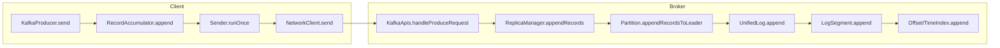
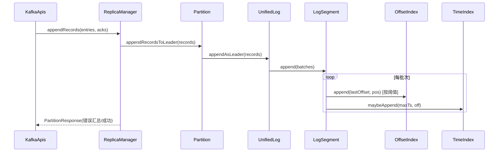
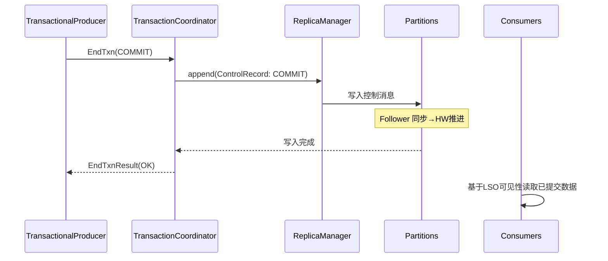
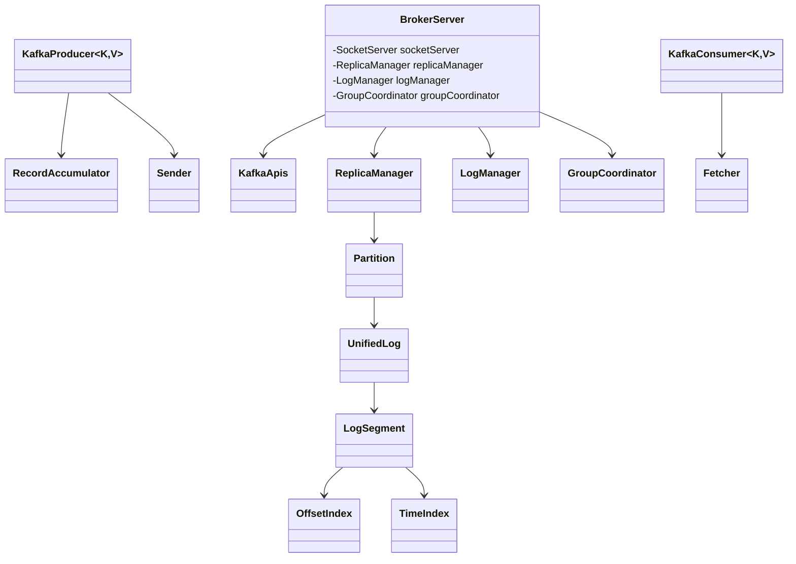
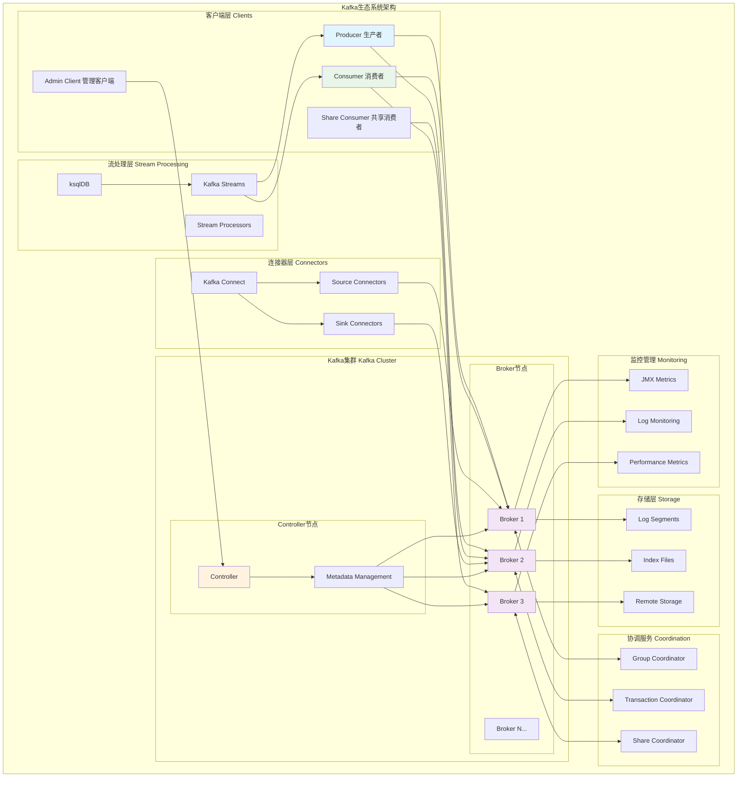
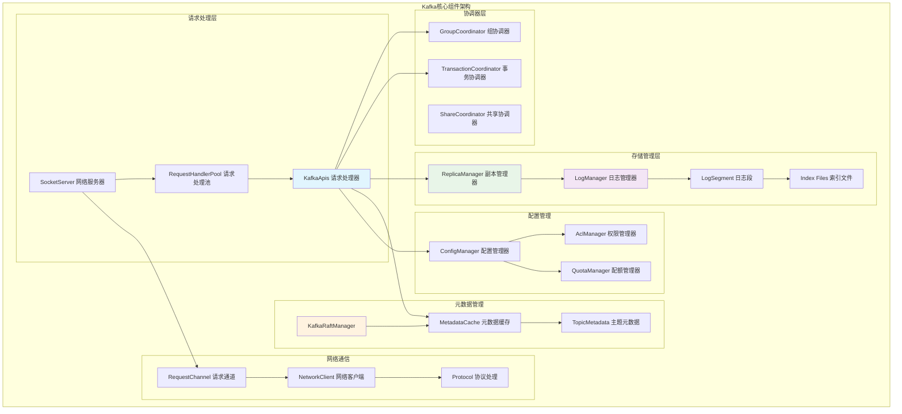
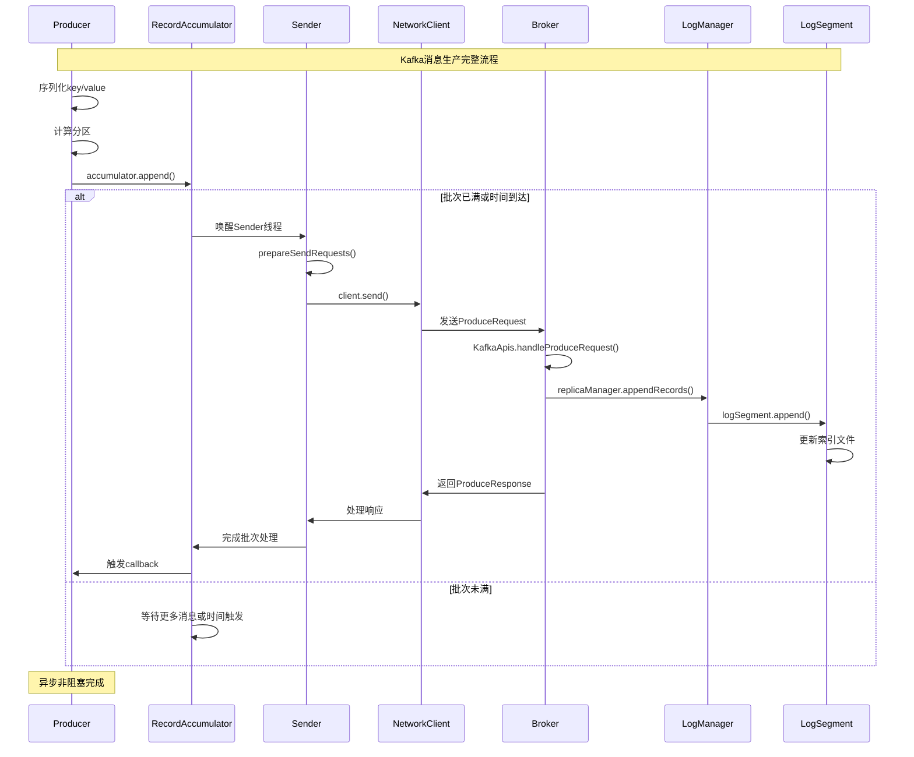
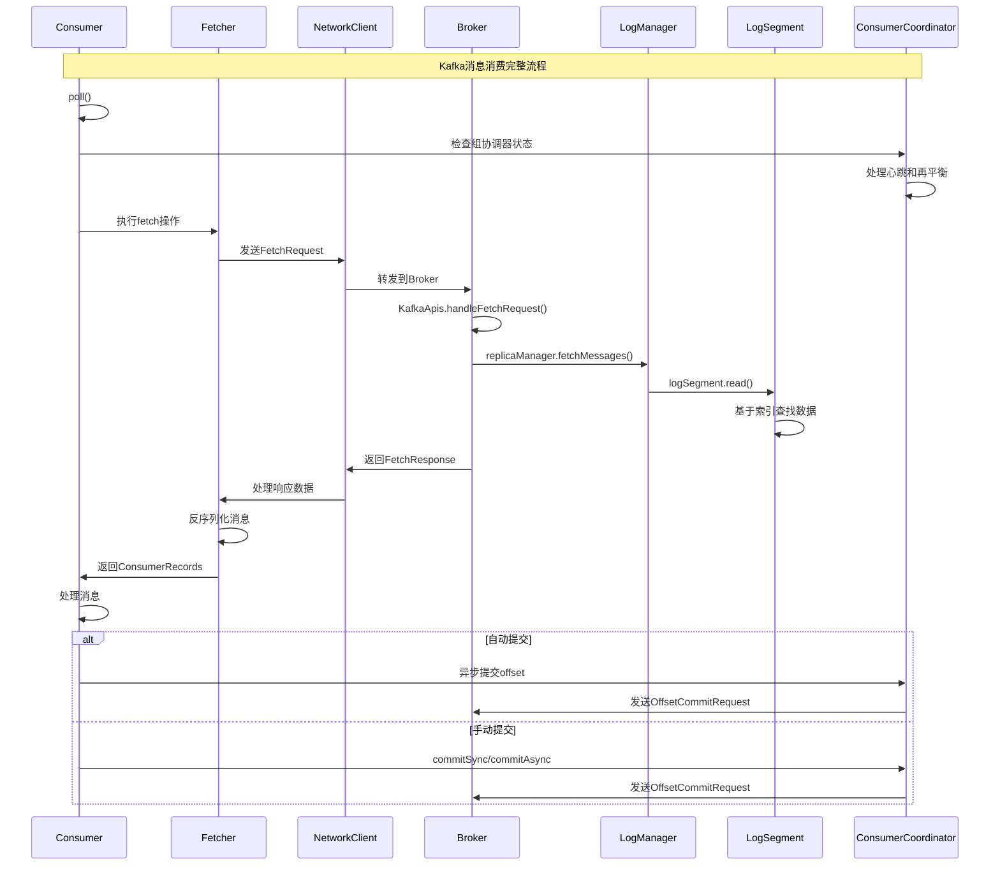
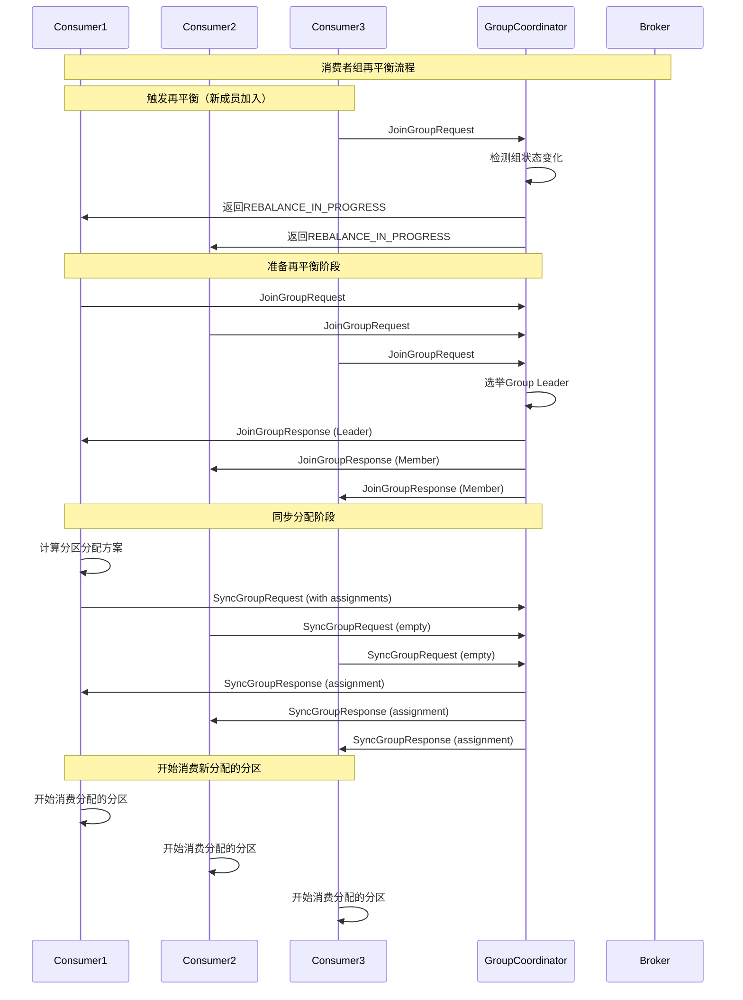

## 8. 关键函数核心代码与说明（精要）

- 说明：以下列出跨生产、消费、协调与存储路径中常用且影响性能/一致性的关键函数，给出核心代码片段（非完整实现）、输入/输出与边界条件，便于定位与追踪。

### 8.1 服务器端写入路径

```scala
// 入口：路由至具体处理
def handle(request: RequestChannel.Request, requestLocal: RequestLocal): Unit = {
  request.header.apiKey match {
    case ApiKeys.PRODUCE => handleProduceRequest(request, requestLocal)
    case ApiKeys.FETCH   => handleFetchRequest(request)
    case _               => requestHelper.handleError(request, new IllegalStateException("Unsupported"))
  }
}

// Produce 核心：校验→汇总分区→委托副本管理器
def handleProduceRequest(request: RequestChannel.Request, requestLocal: RequestLocal): Unit = {
  val produce = request.body[ProduceRequest]
  val entries: mutable.Map[TopicIdPartition, MemoryRecords] = collectAuthorizedAndValidBatches(produce)
  def responseCb(res: Map[TopicIdPartition, PartitionResponse]): Unit =
    requestChannel.sendResponse(request, new ProduceResponse(res.asJava, 0, List.empty.asJava), None)
  if (entries.isEmpty) responseCb(Map.empty)
  else replicaManager.appendRecords(
    timeout = produce.timeout.toLong,
    requiredAcks = produce.acks,
    internalTopicsAllowed = false,
    origin = AppendOrigin.Client,
    entriesPerPartition = entries.toMap,
    responseCallback = responseCb,
    requestLocal = requestLocal
  )
}
```

- 功能：完成 Produce 请求的权限/格式校验并委托 `ReplicaManager.appendRecords`。
- 输入/输出：输入为 `ProduceRequest`；输出通过 `RequestChannel` 异步返回 `ProduceResponse`。
- 边界：`acks` 合法性、内部主题写入保护、单分区异常不影响其他分区的合并响应。

```scala
// 副本管理器：写入领导者副本 + 可能挂起等待 ISR 达标
def appendRecords(
  timeout: Long,
  requiredAcks: Short,
  internalTopicsAllowed: Boolean,
  origin: AppendOrigin,
  entriesPerPartition: Map[TopicIdPartition, MemoryRecords],
  responseCallback: Map[TopicIdPartition, PartitionResponse] => Unit,
  requestLocal: RequestLocal
): Unit = {
  val localResults = appendRecordsToLeader(requiredAcks, internalTopicsAllowed, origin, entriesPerPartition, requestLocal)
  val status = buildProducePartitionStatus(localResults)
  maybeAddDelayedProduce(requiredAcks, timeout, entriesPerPartition, localResults, status, responseCallback)
}
```

- 功能：对每个分区执行领导者本地写入，构造成功/错误状态，并在 `acks=all` 时等待 ISR 达标再响应。
- 关键边界：记录大小与格式、`NotLeaderOrFollower`、`RecordTooLarge`、存储异常与重试。

```scala
// 分区：写入领导者本地日志
def appendRecordsToLeader(records: MemoryRecords,
                          origin: AppendOrigin,
                          requiredAcks: Short,
                          requestLocal: RequestLocal,
                          verification: VerificationGuard): LogAppendInfo = {
  val unifiedLog = getOrCreateLog()
  unifiedLog.appendAsLeader(records, leaderEpoch, origin, requiredAcks, requestLocal, verification)
}
```

- 功能：将批次转换为日志写入操作，返回首/末偏移量、消息数、时间戳等统计。
- 边界：幂等与事务批次的校验、LEO/HW 推进的时序保证。

```java
// 存储：日志段追加 + 索引更新（缩减版）
public void append(long largestOffset, MemoryRecords records) throws IOException {
    int pos = log.sizeInBytes();
    ensureOffsetInRange(largestOffset);
    long appended = log.append(records);
    for (RecordBatch batch : records.batches()) {
        long t = batch.maxTimestamp();
        long off = batch.lastOffset();
        if (t > maxTimestampSoFar()) maxTimestampAndOffsetSoFar = new TimestampOffset(t, off);
        if (bytesSinceLastIndexEntry > indexIntervalBytes) {
            offsetIndex().append(off, pos);
            timeIndex().maybeAppend(maxTimestampSoFar(), shallowOffsetOfMaxTimestampSoFar());
            bytesSinceLastIndexEntry = 0;
        }
        int sz = batch.sizeInBytes();
        pos += sz; bytesSinceLastIndexEntry += sz;
    }
}
```

- 功能：顺序写入段文件，并按阈值维护稀疏偏移索引与时间索引。
- 边界：索引容量、滚动条件（大小/时间/索引满）、批次时间戳单调性。

### 8.2 客户端关键路径

```java
// 发送主循环（摘要）
void runOnce() {
    if (transactionManager != null && transactionManager.hasInFlightRequest()) {
        client.poll(retryBackoffMs, time.milliseconds());
        return;
    }
    long now = time.milliseconds();
    long pollTimeout = sendProducerData(now);
    client.poll(pollTimeout, now);
}
```

- 功能：从 `RecordAccumulator` 获取就绪批次、发送 ProduceRequest、处理过期与回调。
- 边界：未知 leader 触发元数据更新、批次过期、可重试错误的退避。

```java
// Consumer 轮询主路径（摘要）
private ConsumerRecords<K, V> poll(final Timer timer, final boolean includeMetadataInTimeout) {
    acquireAndEnsureOpen();
    do {
        client.maybeTriggerWakeup();
        if (includeMetadataInTimeout) updateAssignmentMetadataIfNeeded(timer, false);
        final Fetch<K, V> fetch = pollForFetches(timer);
        if (!fetch.isEmpty()) {
            if (sendFetches() > 0 || client.hasPendingRequests()) client.transmitSends();
            return this.interceptors.onConsume(new ConsumerRecords<>(fetch.records(), fetch.nextOffsets()));
        }
    } while (timer.notExpired());
    return ConsumerRecords.empty();
}
```

- 功能：协调器轮询、发送 Fetch、收集数据并通过拦截器链返回。
- 边界：位移初始化/重置、会话与心跳时序、最大轮询间隔约束。

### 8.3 协调与事务关键路径

```java
// 事务结束（摘要）：两阶段提交/中止控制消息
public EndTxnResult handleEndTxn(String transactionalId, long producerId, short producerEpoch, TransactionResult result) {
    TransactionMetadata md = transactionMetadataMap.get(transactionalId);
    if (md == null) return new EndTxnResult(Errors.UNKNOWN_PRODUCER_ID);
    synchronized (md) {
        if (md.state != TransactionState.ONGOING) return new EndTxnResult(Errors.INVALID_TXN_STATE);
        return result == TransactionResult.COMMIT ? handleCommitTransaction(md) : handleAbortTransaction(md);
    }
}
```

- 功能：写入控制消息到参与分区，提交后推进 LSO（最后稳定偏移量）。
- 边界：并发事务、Fenced、超时与补偿中止。

## 9. 关键函数调用链（跨层）




```mermaid
flowchart LR
  TP[Producer应用] --> TM1[InitProducerId]
  TM1 --> TM2[AddPartitionsToTxn]
  TM2 --> TM3[EndTxn\n(Commit/Abort)]
  TM3 --> CM[写入控制消息]
  CM --> LSO[更新LSO/可见性]
```

## 10. 关键函数时序图（补充）

### 10.1 写入路径：段与索引更新



### 10.2 事务提交路径（两阶段）



## 11. 关键结构体类图与继承关系（简化）



## 概述

Apache Kafka 是一个开源的分布式事件流平台，由LinkedIn开发并贡献给Apache软件基金会。Kafka结合了高吞吐量的发布-订阅消息传递、分布式存储和流处理能力，为构建实时数据管道和流应用提供了统一的高性能平台。

<!--more-->

## 1. Kafka整体架构概览

### 1.1 Kafka的核心使命

Kafka作为分布式事件流平台，致力于解决以下核心问题：

- **高吞吐量消息传递**：支持每秒数百万条消息的处理能力
- **分布式存储**：可靠地存储事件流数据
- **实时流处理**：对事件流进行实时分析和处理
- **系统集成**：连接各种数据源和数据汇

### 1.2 Kafka生态系统架构图



### 1.3 Kafka核心组件关系图



## 2. 核心模块深度解析

### 2.1 Broker服务器核心架构

Kafka Broker是集群中的核心组件，负责处理生产者和消费者的请求。

```java
/**
 * Kafka Broker的核心实现 - BrokerServer类
 * 管理所有服务端组件的生命周期和协调工作
 */
public class BrokerServer implements KafkaBroker {
    // 核心组件引用
    private final SharedServer sharedServer;           // 共享服务器组件
    private final BrokerLifecycleManager lifecycleManager;  // 生命周期管理器
    private final AssignmentsManager assignmentsManager;    // 分配管理器
    
    // 网络和请求处理组件
    private volatile SocketServer socketServer;             // 网络服务器
    private volatile KafkaApis dataPlaneRequestProcessor;   // API请求处理器
    private KafkaRequestHandlerPool dataPlaneRequestHandlerPool; // 请求处理池
    
    // 存储和副本管理
    private LogManager logManager;                          // 日志管理器
    private volatile ReplicaManager replicaManager;         // 副本管理器
    private Optional<RemoteLogManager> remoteLogManagerOpt; // 远程日志管理器
    
    // 协调器组件
    private volatile GroupCoordinator groupCoordinator;     // 组协调器
    private TransactionCoordinator transactionCoordinator; // 事务协调器
    
    // 权限和配额管理
    private DelegationTokenManager tokenManager;           // 令牌管理器
    private Map<ConfigType, ConfigHandler> dynamicConfigHandlers; // 动态配置处理器
}
```

### 2.2 客户端架构设计

Kafka客户端包括Producer和Consumer，采用异步非阻塞的设计模式。

#### 2.2.1 Producer生产者架构

```java
/**
 * Kafka生产者 - 负责向Kafka集群发布消息记录
 * 采用批量发送和异步处理机制提高吞吐量
 */
public class KafkaProducer<K, V> implements Producer<K, V> {
    
    // 核心组件
    private final ProducerMetadata metadata;        // 元数据管理
    private final RecordAccumulator accumulator;    // 记录累加器（批处理）
    private final Sender sender;                    // 发送器
    private final Sender.SenderThread ioThread;     // I/O线程
    
    // 序列化和分区
    private final Plugin<Serializer<K>> keySerializerPlugin;     // 键序列化器
    private final Plugin<Serializer<V>> valueSerializerPlugin;   // 值序列化器
    private final Plugin<Partitioner> partitionerPlugin;        // 分区器
    
    // 事务和拦截器
    private final TransactionManager transactionManager;        // 事务管理器
    private final ProducerInterceptors<K, V> interceptors;     // 拦截器链
    
    // 配置和监控
    private final ProducerConfig producerConfig;    // 配置管理
    private final Metrics metrics;                  // 监控指标
    
    /**
     * 异步发送消息记录
     * 
     * @param record 要发送的消息记录
     * @param callback 发送完成后的回调函数
     * @return Future对象，可用于获取发送结果
     */
    @Override
    public Future<RecordMetadata> send(ProducerRecord<K, V> record, Callback callback) {
        // 验证生产者状态
        throwIfProducerClosed();
        
        try {
            // 序列化键值对
            serializedKey = keySerializer.serialize(record.topic(), record.key());
            serializedValue = valueSerializer.serialize(record.topic(), record.value());
            
            // 计算分区
            int partition = partition(record, serializedKey, serializedValue, cluster);
            
            // 添加到累加器进行批处理
            RecordAccumulator.RecordAppendResult result = accumulator.append(
                record.topic(), partition, timestamp, serializedKey, serializedValue, 
                headers, callback, maxTimeToBlock, false);
            
            // 如果批次已满或达到时间阈值，唤醒发送线程
            if (result.batchIsFull || result.newBatchCreated) {
                this.sender.wakeup();
            }
            
            return result.future;
            
        } catch (Exception e) {
            // 异常处理和监控统计
            errors.record();
            throw new KafkaException("Failed to send record", e);
        }
    }
}
```

#### 2.2.2 Consumer消费者架构

```java
/**
 * Kafka消费者 - 负责从Kafka集群拉取消息记录
 * 支持组消费和手动分区分配两种模式
 */
public class KafkaConsumer<K, V> implements Consumer<K, V> {
    
    // 核心组件
    private final ConsumerMetadata metadata;            // 元数据管理
    private final SubscriptionState subscriptions;     // 订阅状态管理
    private final Fetcher<K, V> fetcher;               // 数据拉取器
    private final ConsumerCoordinator coordinator;     // 消费者协调器
    
    // 反序列化器
    private final Plugin<Deserializer<K>> keyDeserializerPlugin;   // 键反序列化器
    private final Plugin<Deserializer<V>> valueDeserializerPlugin; // 值反序列化器
    
    // 网络和配置
    private final ConsumerNetworkClient client;        // 网络客户端
    private final ConsumerConfig config;               // 配置管理
    
    /**
     * 拉取消息记录
     * 
     * @param timeout 最大等待时间
     * @return 拉取到的消息记录集合
     */
    @Override
    public ConsumerRecords<K, V> poll(Duration timeout) {
        return poll(time.timer(timeout), true);
    }
    
    private ConsumerRecords<K, V> poll(final Timer timer, final boolean includeMetadataInTimeout) {
        acquireAndEnsureOpen();
        try {
            kafkaConsumerMetrics.recordPollStart(timer.currentTimeMs());
            
            if (this.subscriptions.hasNoSubscriptionOrUserAssignment()) {
                throw new IllegalStateException("Consumer is not subscribed to any topics or assigned any partitions");
            }
            
            do {
                // 更新元数据信息
                client.maybeTriggerWakeup();
                
                if (includeMetadataInTimeout) {
                    updateAssignmentMetadataIfNeeded(timer, false);
                } else {
                    while (!updateAssignmentMetadataIfNeeded(time.timer(Long.MAX_VALUE), true)) {
                        log.warn("Still waiting for metadata");
                    }
                }
                
                // 执行拉取操作
                final Fetch<K, V> fetch = pollForFetches(timer);
                if (!fetch.isEmpty()) {
                    return this.interceptors.onConsume(new ConsumerRecords<>(fetch.records()));
                }
                
            } while (timer.notExpired());
            
            return ConsumerRecords.empty();
            
        } finally {
            release();
            kafkaConsumerMetrics.recordPollEnd(timer.currentTimeMs());
        }
    }
}
```

### 2.3 协调器模块架构

协调器负责管理消费者组、事务和共享消费等功能。

#### 2.3.1 组协调器架构

```java
/**
 * 组协调器 - 管理消费者组的成员关系和分区分配
 * 支持传统消费者组、现代消费者组和流组
 */
public interface GroupCoordinator {
    
    /**
     * 消费者组心跳处理
     * 维持消费者与协调器之间的连接，处理组成员变更
     */
    CompletableFuture<ConsumerGroupHeartbeatResponseData> consumerGroupHeartbeat(
        AuthorizableRequestContext context,
        ConsumerGroupHeartbeatRequestData request
    );
    
    /**
     * 流组心跳处理
     * 专门处理Kafka Streams应用的协调需求
     */
    CompletableFuture<StreamsGroupHeartbeatResult> streamsGroupHeartbeat(
        AuthorizableRequestContext context,
        StreamsGroupHeartbeatRequestData request
    );
    
    /**
     * 共享组心跳处理
     * 支持共享消费模式的组管理
     */
    CompletableFuture<ShareGroupHeartbeatResponseData> shareGroupHeartbeat(
        AuthorizableRequestContext context,
        ShareGroupHeartbeatRequestData request
    );
    
    /**
     * 传统组加入处理
     * 处理传统消费者的组加入请求
     */
    CompletableFuture<JoinGroupResponseData> joinGroup(
        AuthorizableRequestContext context,
        JoinGroupRequestData request,
        BufferSupplier bufferSupplier
    );
}

/**
 * 组协调器分片实现
 * 每个分片管理一部分组的元数据和状态
 */
public class GroupCoordinatorShard implements CoordinatorShard<CoordinatorRecord> {
    
    // 组状态管理
    private final TimelineHashMap<String, ClassicGroup> classicGroups;      // 传统组
    private final TimelineHashMap<String, ConsumerGroup> consumerGroups;    // 现代消费者组
    private final TimelineHashMap<String, StreamsGroup> streamsGroups;      // 流组
    private final TimelineHashMap<String, ShareGroup> shareGroups;          // 共享组
    
    // 分区分配器
    private final Map<String, ConsumerGroupPartitionAssignor> assignors;
    
    /**
     * 处理消费者组心跳请求
     * 实现组成员管理、分区分配和再平衡逻辑
     */
    public CoordinatorResult<ConsumerGroupHeartbeatResponseData, CoordinatorRecord> consumerGroupHeartbeat(
        AuthorizableRequestContext context,
        ConsumerGroupHeartbeatRequestData request
    ) throws ApiException {
        
        String groupId = request.groupId();
        String memberId = request.memberId();
        int memberEpoch = request.memberEpoch();
        
        // 获取或创建消费者组
        ConsumerGroup group = getOrMaybeCreateConsumerGroup(groupId, request.groupInstanceId() != null);
        
        // 验证组状态和成员权限
        validateConsumerGroupHeartbeat(group, memberId, memberEpoch);
        
        // 处理心跳逻辑
        if (memberEpoch == 0) {
            // 新成员加入
            return handleConsumerGroupJoin(context, request, group);
        } else {
            // 现有成员心跳
            return handleConsumerGroupHeartbeat(context, request, group);
        }
    }
    
    /**
     * 执行组再平衡
     * 当组成员发生变化时重新分配分区
     */
    private void maybeRebalanceGroup(ConsumerGroup group) {
        if (group.state() != ConsumerGroupState.STABLE) {
            return;
        }
        
        // 检查是否需要再平衡
        if (group.hasMetadataExpired() || group.hasTargetAssignmentChanged()) {
            // 计算新的分区分配
            Map<String, Assignment> newAssignment = computeTargetAssignment(group);
            
            // 更新目标分配
            group.setTargetAssignment(newAssignment);
            
            // 通知成员进行再平衡
            group.transitionTo(ConsumerGroupState.PREPARING_REBALANCE);
        }
    }
}
```

### 2.4 存储模块架构

Kafka的存储层采用分段日志的设计，提供高效的顺序读写性能。

#### 2.4.1 日志段管理

```java
/**
 * 日志段 - Kafka存储的基本单位
 * 每个日志段包含消息数据文件和多种索引文件
 */
public class LogSegment implements Closeable {
    
    // 核心文件组件
    private final FileRecords log;                      // 消息数据文件
    private final LazyIndex<OffsetIndex> lazyOffsetIndex;   // 偏移量索引（延迟加载）
    private final LazyIndex<TimeIndex> lazyTimeIndex;       // 时间索引（延迟加载）
    private final TransactionIndex txnIndex;               // 事务索引
    
    // 段元数据
    private final long baseOffset;              // 段的基础偏移量
    private final int indexIntervalBytes;      // 索引间隔字节数
    private final long rollJitterMs;           // 滚动抖动时间
    
    // 状态信息
    private volatile TimestampOffset maxTimestampAndOffsetSoFar; // 最大时间戳和偏移量
    private volatile long rollingBasedTimestamp;                // 基于时间的滚动时间戳
    private int bytesSinceLastIndexEntry = 0;                   // 距离上次索引条目的字节数
    
    /**
     * 向日志段追加消息记录
     * 同时维护偏移量索引和时间索引
     * 
     * @param largestOffset 消息集中的最大偏移量
     * @param records       要追加的消息记录集
     */
    public void append(long largestOffset, MemoryRecords records) throws IOException {
        if (records.sizeInBytes() > 0) {
            log.trace("在结束偏移量{}位置{}插入{}字节", largestOffset, log.sizeInBytes(), records.sizeInBytes());
            
            // 记录当前物理位置
            int physicalPosition = log.sizeInBytes();
            
            // 确保偏移量在有效范围内
            ensureOffsetInRange(largestOffset);
            
            // 追加消息到日志文件
            long appendedBytes = log.append(records);
            log.trace("向{}追加了{}字节，结束偏移量{}", log.file(), appendedBytes, largestOffset);
            
            // 处理每个批次，更新索引和时间戳信息
            for (RecordBatch batch : records.batches()) {
                long batchMaxTimestamp = batch.maxTimestamp();
                long batchLastOffset = batch.lastOffset();
                
                // 更新最大时间戳信息
                if (batchMaxTimestamp > maxTimestampSoFar()) {
                    maxTimestampAndOffsetSoFar = new TimestampOffset(batchMaxTimestamp, batchLastOffset);
                }
                
                // 根据字节间隔决定是否添加索引条目
                if (bytesSinceLastIndexEntry > indexIntervalBytes) {
                    offsetIndex().append(batchLastOffset, physicalPosition);
                    timeIndex().maybeAppend(maxTimestampSoFar(), shallowOffsetOfMaxTimestampSoFar());
                    bytesSinceLastIndexEntry = 0;
                }
                
                // 更新位置和字节计数
                int sizeInBytes = batch.sizeInBytes();
                physicalPosition += sizeInBytes;
                bytesSinceLastIndexEntry += sizeInBytes;
            }
        }
    }
    
    /**
     * 从日志段读取消息记录
     * 
     * @param startOffset    起始偏移量
     * @param maxSize        最大读取字节数
     * @param maxPosition    最大物理位置（可选）
     * @param minOneMessage  是否至少返回一条消息
     * @return 读取到的消息记录集合
     */
    public FetchDataInfo read(long startOffset, int maxSize, Optional<Long> maxPosition, boolean minOneMessage) throws IOException {
        if (maxSize <= 0) {
            throw new IllegalArgumentException("最大读取字节数必须大于0，当前为：" + maxSize);
        }
        
        // 查找起始偏移量对应的物理位置
        OffsetPosition offsetPosition = offsetIndex().lookup(startOffset);
        
        // 从物理位置读取数据
        FileRecords.LogOffsetMetadata logOffsetMetadata = 
            new FileRecords.LogOffsetMetadata(startOffset, offsetPosition.position, 0);
            
        return log.read(logOffsetMetadata.position, maxSize, maxPosition, minOneMessage);
    }
    
    /**
     * 根据时间戳查找偏移量
     * 
     * @param timestamp 目标时间戳
     * @param startingOffset 起始搜索偏移量
     * @return 时间戳对应的偏移量信息
     */
    public Optional<TimestampAndOffset> findOffsetByTimestamp(long timestamp, long startingOffset) throws IOException {
        // 使用时间索引进行快速查找
        TimestampOffset timestampOffset = timeIndex().lookup(timestamp);
        
        // 从索引位置开始顺序搜索精确匹配
        long startingOffsetToSearch = Math.max(timestampOffset.offset, startingOffset);
        return findOffsetByTimestampInLog(timestamp, startingOffsetToSearch);
    }
    
    /**
     * 检查是否应该滚动到新的日志段
     * 基于大小、时间或索引大小等条件判断
     */
    public boolean shouldRoll(RollParams rollParams) {
        // 基于大小的滚动检查
        if (rollParams.maxSegmentBytes > 0 && size() > rollParams.maxSegmentBytes - rollParams.messageSizeInBytes) {
            log.trace("段{}应该滚动因为大小{} > maxSegmentBytes - messageSizeInBytes {}", 
                baseOffset, size(), rollParams.maxSegmentBytes - rollParams.messageSizeInBytes);
            return true;
        }
        
        // 基于时间的滚动检查
        boolean reachedRollingTime = timeWaitedForRoll(rollParams.now, rollParams.maxTimestampInMessages) 
            > rollParams.maxSegmentMs - rollJitterMs;
        if (reachedRollingTime) {
            log.trace("段{}应该滚动因为时间条件满足", baseOffset);
            return true;
        }
        
        // 基于索引大小的滚动检查
        if (offsetIndex().isFull() || timeIndex().isFull() || !offsetIndex().canAppendOffset(rollParams.maxOffsetInMessages)) {
            log.trace("段{}应该滚动因为索引已满", baseOffset);
            return true;
        }
        
        return false;
    }
}
```

#### 2.4.2 索引文件实现

```java
/**
 * 偏移量索引 - 维护偏移量到物理位置的映射
 * 使用稀疏索引提高查找效率，减少存储开销
 */
public final class OffsetIndex extends AbstractIndex {
    
    /** 索引条目大小：4字节相对偏移量 + 4字节物理位置 */
    public static final int OFFSET_INDEX_ENTRY_SIZE = 8;
    
    /**
     * 向索引追加新的偏移量映射
     * 
     * @param offset 逻辑偏移量
     * @param position 对应的物理文件位置
     */
    public void append(long offset, int position) {
        lock();
        try {
            if (size() > 0 && offset <= lastOffset()) {
                throw new InvalidOffsetException("尝试追加偏移量 " + offset + 
                    " 但最后偏移量是 " + lastOffset() + " 且索引大小是 " + size());
            }
            if (position > Integer.MAX_VALUE || position < 0) {
                throw new InvalidOffsetException("无效的位置值: " + position);
            }
            
            debug("向偏移量索引追加偏移量 {} 位置 {}", offset, position);
            
            // 写入相对偏移量和位置
            mmap().putInt(relativeOffset(offset));
            mmap().putInt(position);
            incrementEntries();
            
        } finally {
            unlock();
        }
    }
    
    /**
     * 查找小于或等于目标偏移量的最大偏移量条目
     * 
     * @param targetOffset 目标偏移量
     * @return 偏移量和对应的物理位置
     */
    public OffsetPosition lookup(long targetOffset) {
        lock();
        try {
            MappedByteBuffer idx = mmap().duplicate();
            int slot = largestLowerBoundSlotFor(idx, targetOffset, OFFSET_INDEX_ENTRY_SIZE);
            
            if (slot == -1) {
                // 没找到，返回基础偏移量和位置0
                return new OffsetPosition(baseOffset(), 0);
            } else {
                // 解析找到的条目
                int position = idx.position();
                idx.position(slot);
                int relativeOffset = idx.getInt();
                int physicalPosition = idx.getInt();
                idx.position(position);
                
                return new OffsetPosition(baseOffset() + relativeOffset, physicalPosition);
            }
        } finally {
            unlock();
        }
    }
    
    /**
     * 使用二分查找算法寻找目标偏移量的插槽位置
     */
    private int largestLowerBoundSlotFor(ByteBuffer idx, long targetOffset, int entrySize) {
        // 转换为相对偏移量进行比较
        int targetRelativeOffset = relativeOffset(targetOffset);
        
        // 边界检查
        if (entries() == 0) return -1;
        
        // 检查第一个条目
        int firstRelativeOffset = idx.getInt(0);
        if (targetRelativeOffset < firstRelativeOffset) return -1;
        
        // 检查最后一个条目
        int lastSlot = (entries() - 1) * entrySize;
        int lastRelativeOffset = idx.getInt(lastSlot);
        if (targetRelativeOffset >= lastRelativeOffset) return lastSlot;
        
        // 二分查找
        int low = 0;
        int high = entries() - 1;
        
        while (low < high) {
            int mid = (low + high + 1) / 2;
            int midRelativeOffset = idx.getInt(mid * entrySize);
            
            if (midRelativeOffset <= targetRelativeOffset) {
                low = mid;
            } else {
                high = mid - 1;
            }
        }
        
        return low * entrySize;
    }
    
    /**
     * 将绝对偏移量转换为相对于基础偏移量的相对值
     */
    private int relativeOffset(long offset) {
        long relativeOffset = offset - baseOffset();
        if (relativeOffset > Integer.MAX_VALUE || relativeOffset < 0) {
            throw new IndexOffsetOverflowException("相对偏移量溢出: " + relativeOffset);
        }
        return (int) relativeOffset;
    }
}

/**
 * 时间索引 - 维护时间戳到偏移量的映射
 * 支持基于时间的消息查找和清理策略
 */
public final class TimeIndex extends AbstractIndex {
    
    /** 索引条目大小：8字节时间戳 + 4字节相对偏移量 */
    public static final int TIME_INDEX_ENTRY_SIZE = 12;
    
    /**
     * 可能向时间索引追加条目
     * 只有当时间戳严格递增时才会追加
     * 
     * @param timestamp 时间戳
     * @param offset 对应的偏移量
     */
    public void maybeAppend(long timestamp, long offset) {
        lock();
        try {
            if (size() == 0 || timestamp > lastTimestamp()) {
                debug("向时间索引追加时间戳 {} 偏移量 {}", timestamp, offset);
                
                mmap().putLong(timestamp);
                mmap().putInt(relativeOffset(offset));
                incrementEntries();
            }
        } finally {
            unlock();
        }
    }
    
    /**
     * 查找小于或等于目标时间戳的最大时间戳条目
     * 
     * @param targetTimestamp 目标时间戳
     * @return 时间戳和对应的偏移量
     */
    public TimestampOffset lookup(long targetTimestamp) {
        lock();
        try {
            MappedByteBuffer idx = mmap().duplicate();
            int slot = largestLowerBoundSlotFor(idx, targetTimestamp, TIME_INDEX_ENTRY_SIZE);
            
            if (slot == -1) {
                // 没找到，返回基础信息
                return new TimestampOffset(RecordBatch.NO_TIMESTAMP, baseOffset());
            } else {
                // 解析找到的条目
                idx.position(slot);
                long timestamp = idx.getLong();
                int relativeOffset = idx.getInt();
                
                return new TimestampOffset(timestamp, baseOffset() + relativeOffset);
            }
        } finally {
            unlock();
        }
    }
}
```

### 2.5 网络通信架构

Kafka采用基于NIO的高性能网络架构，支持大量并发连接。

```java
/**
 * Socket服务器 - 处理客户端网络连接和请求
 * 采用Reactor模式实现高并发网络I/O
 */
public class SocketServer implements Closeable {
    
    // 网络处理器映射 - 每个端口对应一组处理器
    private final Map<ListenerName, List<Acceptor>> acceptors = new HashMap<>();
    private final Map<ListenerName, List<Processor>> processors = new HashMap<>();
    
    // 请求通道 - 连接网络层和应用层
    private final RequestChannel requestChannel;
    
    // 配置和监控
    private final KafkaConfig config;
    private final Metrics metrics;
    private final Time time;
    
    /**
     * 启动Socket服务器
     * 为每个配置的监听器创建接受器和处理器
     */
    public void startup(boolean startProcessingRequests, Map<String, Object> securityConfigs) {
        info("启动SocketServer，启动处理器线程: {}", startProcessingRequests);
        
        // 创建请求通道
        this.requestChannel = new RequestChannel(config, metrics, time);
        
        // 为每个监听器配置创建接受器和处理器
        config.listeners().forEach(listenerConfig -> {
            ListenerName listenerName = new ListenerName(listenerConfig.name());
            EndPoint endPoint = listenerConfig.toEndPoint();
            
            // 创建接受器线程
            Acceptor acceptor = createAcceptor(endPoint, listenerName);
            acceptors.computeIfAbsent(listenerName, k -> new ArrayList<>()).add(acceptor);
            
            // 创建处理器线程池
            List<Processor> listenerProcessors = new ArrayList<>();
            for (int i = 0; i < config.numNetworkThreads(); i++) {
                Processor processor = createProcessor(i, requestChannel, listenerName, endPoint);
                listenerProcessors.add(processor);
            }
            processors.put(listenerName, listenerProcessors);
            
            // 启动线程
            acceptor.start();
            listenerProcessors.forEach(Processor::start);
        });
        
        info("Socket服务器启动完成");
    }
    
    /**
     * 创建接受器 - 负责接受新的客户端连接
     */
    private Acceptor createAcceptor(EndPoint endPoint, ListenerName listenerName) {
        return new Acceptor(
            endPoint, 
            requestChannel, 
            processors.get(listenerName),
            config.socketSendBufferBytes(),
            config.socketReceiveBufferBytes(),
            config.socketRequestMaxBytes()
        );
    }
    
    /**
     * 创建处理器 - 负责处理客户端I/O操作
     */
    private Processor createProcessor(int id, RequestChannel requestChannel, 
                                    ListenerName listenerName, EndPoint endPoint) {
        return new Processor(
            id,
            requestChannel,
            config.socketRequestMaxBytes(),
            listenerName,
            endPoint.securityProtocol(),
            config,
            metrics,
            time
        );
    }
}

/**
 * 请求通道 - 网络处理器和请求处理器之间的通信桥梁
 * 使用队列实现解耦和缓冲
 */
public class RequestChannel implements Closeable {
    
    // 请求队列 - 存储从网络接收的请求
    private final ArrayBlockingQueue<RequestChannel.Request> requestQueue;
    
    // 响应队列映射 - 每个处理器对应一个响应队列
    private final Map<Integer, BlockingQueue<RequestChannel.Response>> responseQueues;
    
    // 配置和监控
    private final int queueSize;
    private final Metrics metrics;
    private final Time time;
    
    /**
     * 发送请求到处理队列
     * 由网络处理器调用
     */
    public void sendRequest(RequestChannel.Request request) {
        try {
            boolean success = requestQueue.offer(request, 300, TimeUnit.MILLISECONDS);
            if (!success) {
                throw new TimeoutException("请求队列已满，无法处理新请求");
            }
        } catch (InterruptedException e) {
            Thread.currentThread().interrupt();
            throw new RuntimeException("发送请求被中断", e);
        }
    }
    
    /**
     * 接收请求进行处理
     * 由请求处理器调用
     */
    public RequestChannel.Request receiveRequest(long timeoutMs) throws InterruptedException {
        return requestQueue.poll(timeoutMs, TimeUnit.MILLISECONDS);
    }
    
    /**
     * 发送响应到网络处理器
     * 由请求处理器调用
     */
    public void sendResponse(RequestChannel.Response response) {
        int processorId = response.processorId();
        BlockingQueue<RequestChannel.Response> responseQueue = responseQueues.get(processorId);
        
        if (responseQueue != null) {
            try {
                boolean success = responseQueue.offer(response, 300, TimeUnit.MILLISECONDS);
                if (!success) {
                    warn("处理器{}的响应队列已满", processorId);
                }
            } catch (Exception e) {
                error("向处理器{}发送响应失败", processorId, e);
            }
        }
    }
    
    /**
     * 请求封装类 - 包含请求数据和上下文信息
     */
    public static class Request {
        private final int processorId;              // 处理器ID
        private final RequestContext context;       // 请求上下文
        private final long startTimeNanos;         // 开始时间
        private final MemoryPool memoryPool;       // 内存池
        private final RequestHeader header;        // 请求头
        private final AbstractRequest body;        // 请求体
        private final ConnectionQuotas connectionQuotas; // 连接配额
        
        /**
         * 构建响应
         */
        public RequestChannel.Response buildResponse(AbstractResponse response) {
            return new RequestChannel.Response(
                processorId, 
                context, 
                response, 
                startTimeNanos
            );
        }
        
        /**
         * 构建错误响应
         */
        public RequestChannel.Response buildErrorResponse(Errors error) {
            AbstractResponse errorResponse = body.getErrorResponse(error);
            return buildResponse(errorResponse);
        }
    }
    
    /**
     * 响应封装类 - 包含响应数据和处理信息
     */
    public static class Response {
        private final int processorId;
        private final RequestContext context;
        private final AbstractResponse response;
        private final long startTimeNanos;
        
        public Response(int processorId, RequestContext context, 
                       AbstractResponse response, long startTimeNanos) {
            this.processorId = processorId;
            this.context = context;
            this.response = response;
            this.startTimeNanos = startTimeNanos;
        }
        
        /**
         * 计算请求处理时间
         */
        public long requestProcessingTimeMs() {
            return TimeUnit.NANOSECONDS.toMillis(System.nanoTime() - startTimeNanos);
        }
    }
}
```

## 3. 核心处理流程时序图

### 3.1 消息生产流程



### 3.2 消息消费流程



### 3.3 组协调器再平衡流程



## 4. 关键技术特性

### 4.1 高性能架构设计

- **顺序I/O优化**：消息以append-only方式写入，充分利用磁盘顺序读写性能
  - 磁盘顺序写入速度可达600MB/s，远超随机写入的100KB/s
  - 避免磁盘寻道时间，发挥机械硬盘的最佳性能
  
- **批量处理**：生产者和消费者都支持批量操作，提高网络传输效率
  - Producer端RecordAccumulator实现智能批处理，默认16KB批次大小
  - Consumer端批量拉取，单次可获取多个分区的数据
  
- **零拷贝传输**：使用FileChannel.transferTo()实现零拷贝数据传输
  - 传统路径：磁盘→内核缓冲区→用户空间→Socket缓冲区→网卡（4次拷贝）
  - 零拷贝路径：磁盘→内核缓冲区→Socket缓冲区→网卡（2次拷贝）
  - 性能提升可达2-3倍，特别在大消息传输场景下
  
- **页缓存利用**：充分利用操作系统页缓存，减少内存拷贝
  - 写入数据先进入页缓存，由操作系统异步刷盘
  - 读取数据优先从页缓存获取，避免磁盘I/O
  - 合理配置JVM堆内存（25-50%系统内存），为页缓存留出空间

### 4.2 分布式一致性保障

- **ISR机制**：In-Sync Replicas确保数据一致性和高可用性
  - LEO（Log End Offset）：每个副本的日志结束偏移量
  - HW（High Watermark）：ISR中所有副本都已确认的最大偏移量
  - 消费者只能看到HW之前的消息，保证数据一致性
  - 动态ISR管理：自动检测副本同步状态，实时调整ISR集合
  
- **Leader选举**：通过...实现分区Leader选举
  - Preferred Leader Election：优先选举配置的首选副本为Leader
  - Unclean Leader Election：在数据丢失和可用性间权衡
  - Controller负责集中管理所有分区的Leader选举
  
- **幂等性保证**：Producer幂等性防止消息重复
  - ProducerId + ProducerEpoch + SequenceNumber三元组唯一标识消息
  - 服务端检测重复序列号，自动去重
  - 支持网络重试场景下的精确一次语义
  
- **事务支持**：跨分区事务保证ACID特性
  - 两阶段提交协议确保事务原子性
  - TransactionCoordinator管理事务状态和协调
  - 控制消息标记事务边界，支持读已提交隔离级别

### 4.3 扩展性和容错性

- **水平扩展**：通过增加Broker节点实现容量扩展
- **分区机制**：Topic分区支持并行处理和负载分散
- **副本冗余**：多副本机制保证数据容错
- **滚动升级**：支持不停服务的滚动升级

## 5. 模块文档索引

本文档系列将每个核心模块的实现细节：

1. **[Kafka Broker核心模块详解](/posts/kafka-broker-core/)** - BrokerServer、KafkaApis、ReplicaManager等核心组件
2. **[Kafka客户端实现解析](/posts/kafka-client-implementation/)** - Producer和Consumer的详细实现机制
3. **[协调器模块深度分析](/posts/kafka-coordinator-modules/)** - Group、Transaction、Share协调器实现
4. **[存储引擎技术解析](/posts/kafka-storage-engine/)** - 日志段管理、索引机制、远程存储
5. **[网络通信架构详解](/posts/kafka-network-architecture/)** - SocketServer、RequestChannel、协议处理
6. **[KRaft一致性算法实现](/posts/kafka-kraft-consensus/)** - RaftManager、元数据管理、一致性保证
7. **[Kafka Streams流处理引擎](/posts/kafka-streams-engine/)** - 拓扑构建、状态管理、处理器API
8. **[Kafka Connect连接器框架](/posts/kafka-connect-framework/)** - Source/Sink连接器、分布式执行

## 6. 总结

Apache Kafka通过精心设计的分布式架构，成功解决了大规模数据流处理的核心挑战。其关键成功要素包括：

### 6.1 架构优势

- **高度模块化**：各组件职责清晰，便于维护和扩展
- **异步处理**：全链路异步设计，提供优异的性能表现
- **可观测性**：丰富的监控指标和日志，便于运维管理
- **API友好**：统一的协议规范和多语言客户端支持

通过深入理解Kafka的架构设计和实现原理，我们能够更好地运用这一强大的流处理平台，构建高效可靠的实时数据系统。

## 7. 常见问题与排错（FAQ）

- 板载页缓存与JVM内存的权衡
  - 现象：高GC或磁盘I/O抖动，消费/生产延迟上升。
  - 建议：将JVM堆设置为物理内存的25%-50%，为页缓存留足空间；监控`page cache`命中与刷盘时延。
- 零拷贝未生效或吞吐不达标
  - 现象：`transferTo()`吞吐不稳定或回退到普通I/O。
  - 建议：核查内核/文件系统限制；确认业务侧未使用小碎片batch；提升批量与Socket缓冲；观察`sendfile`统计。
- ISR频繁抖动
  - 现象：分区频繁shrinks/expands ISR，HW推进缓慢，延迟升高。
  - 建议：排查慢盘/网络瓶颈；调整`replica.lag.time.max.ms`与`replica.fetch.max.bytes`；定位落后的Follower与其磁盘、网卡队列。
- 控制器频繁切换/元数据不稳定
  - 现象：控制面延迟升高、topic创建/分配卡顿。
  - 建议：确保控制器节点CPU/IO充足；独立控制面监听；核查`controller.quorum`与Raft日志落后情况。
- 磁盘空间风险与段回收
  - 现象：日志目录接近满；清理/压缩不及时。
  - 建议：设置合理`retention.ms/bytes`；监控段数、清理周期与`LogCleaner`积压；评估远程存储分层策略。
