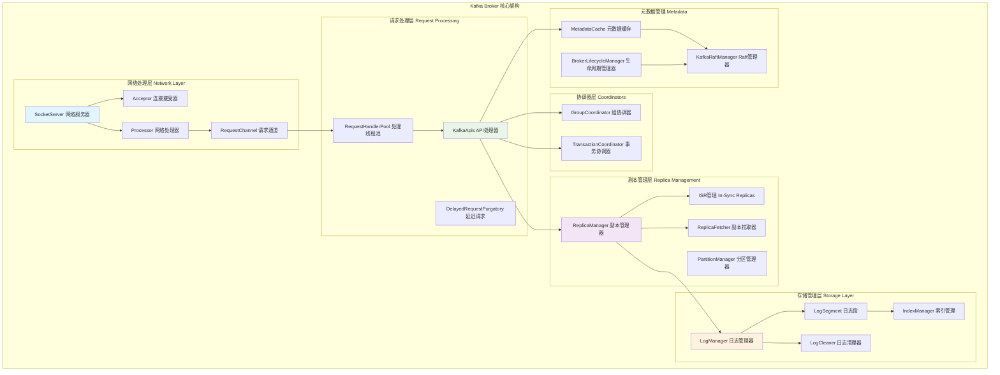
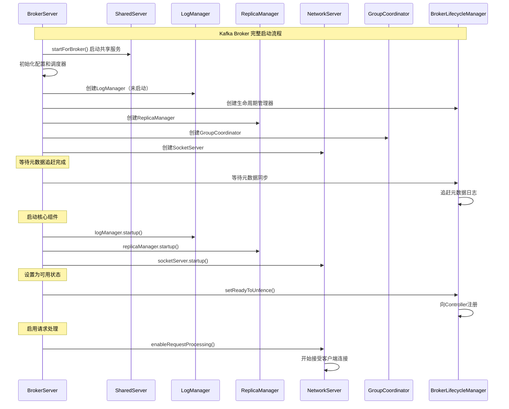
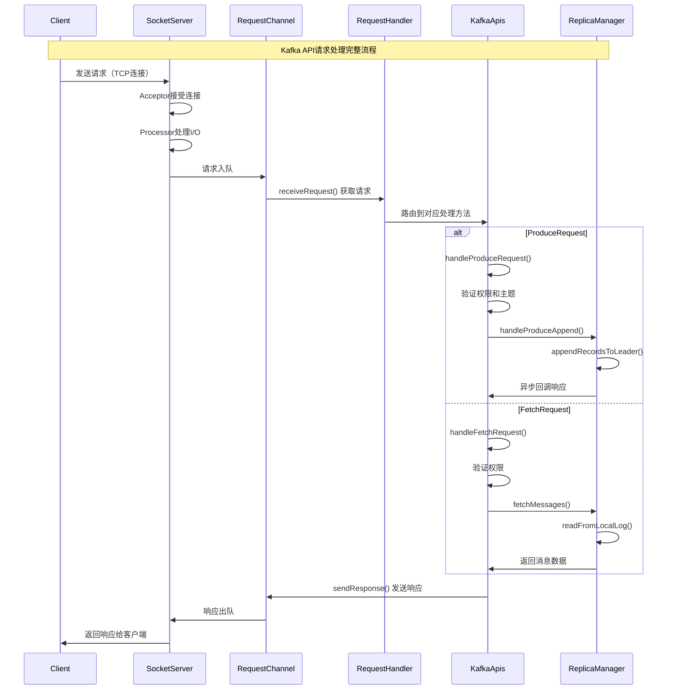
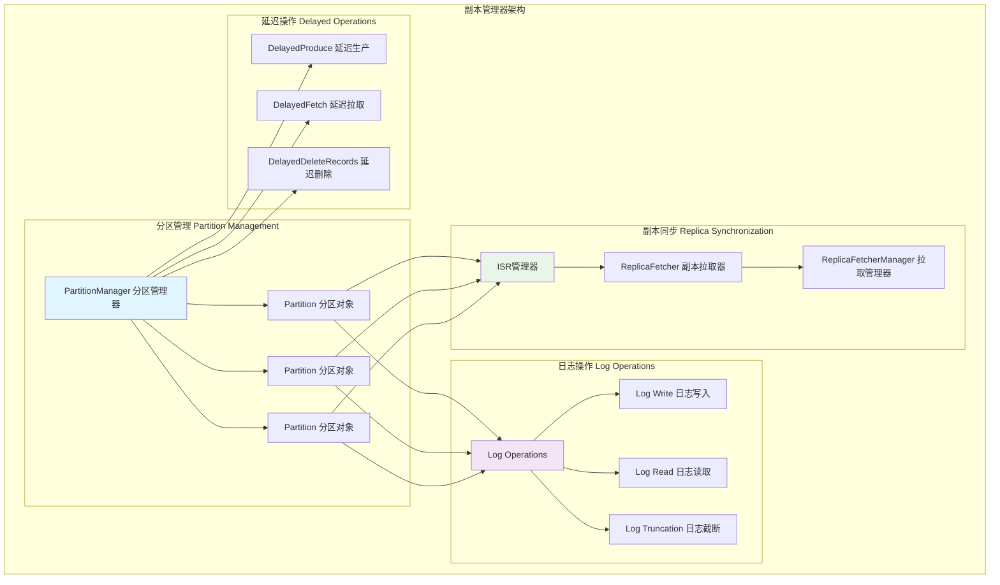
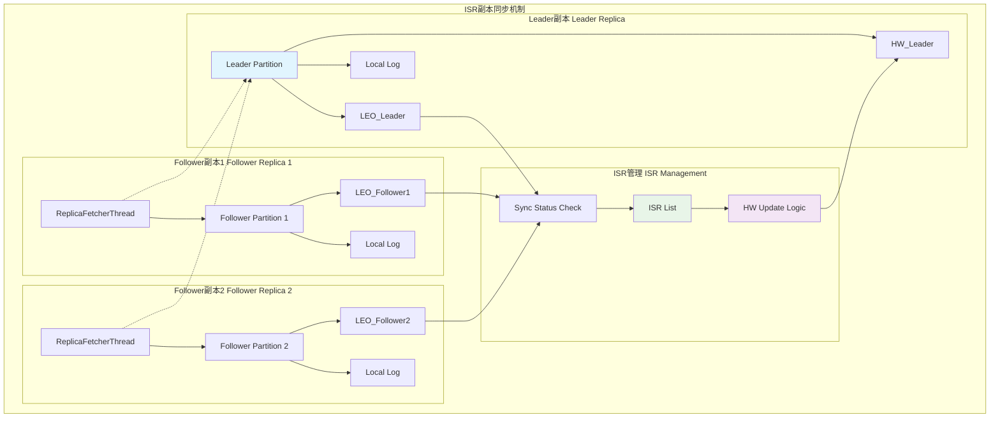
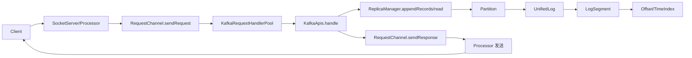
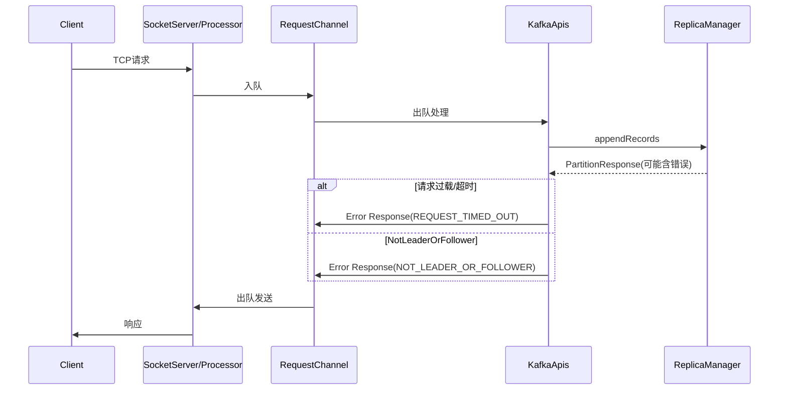
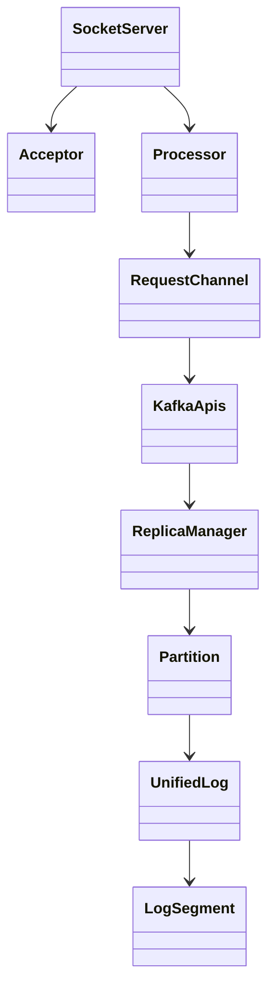

## 概述

Kafka Broker是Kafka集群中的核心服务节点，负责处理生产者和消费者的请求、管理分区副本、维护日志存储等关键功能。本文Broker的内部架构和核心实现机制，揭示其高性能和高可用性的技术内幕。

<!--more-->

## 1. Broker架构总览

### 1.1 Broker核心组件架构图



## 2. Broker启动流程解析

### 2.1 BrokerServer启动时序图



### 2.2 启动流程核心代码

```scala
/**
 * BrokerServer的启动方法 - 按特定顺序初始化各个组件
 * 确保组件间的依赖关系正确建立
 */
override def startup(): Unit = {
  if (!maybeChangeStatus(SHUTDOWN, STARTING)) return
  val startupDeadline = Deadline.fromDelay(time, config.serverMaxStartupTimeMs, TimeUnit.MILLISECONDS)
  
  try {
    // 1. 启动共享服务器组件
    sharedServer.startForBroker()
    info("启动Broker")

    // 2. 初始化配置和调度器
    config.dynamicConfig.initialize()
    quotaManagers = QuotaFactory.instantiate(config, metrics, time, s"broker-${config.nodeId}-", ProcessRole.BrokerRole.toString)
    
    kafkaScheduler = new KafkaScheduler(config.backgroundThreads)
    kafkaScheduler.startup()

    // 3. 初始化监控和元数据缓存
    brokerTopicStats = new BrokerTopicStats(config.remoteLogManagerConfig.isRemoteStorageSystemEnabled())
    logDirFailureChannel = new LogDirFailureChannel(config.logDirs.size)
    metadataCache = new KRaftMetadataCache(config.nodeId, () => raftManager.client.kraftVersion())

    // 4. 创建日志管理器（但不启动，等待元数据追赶）
    logManager = LogManager(config,
      sharedServer.metaPropsEnsemble.errorLogDirs().asScala.toSeq,
      metadataCache,
      kafkaScheduler,
      time,
      brokerTopicStats,
      logDirFailureChannel)

    // 5. 创建生命周期管理器
    lifecycleManager = new BrokerLifecycleManager(config,
      time,
      s"broker-${config.nodeId}-",
      logDirs = logManager.directoryIdsSet,
      () => new Thread(() => shutdown(), "kafka-shutdown-thread").start())

    // 6. 创建副本管理器
    this._replicaManager = new ReplicaManager(
      config = config,
      metrics = metrics,
      time = time,
      scheduler = kafkaScheduler,
      logManager = logManager,
      remoteLogManager = remoteLogManagerOpt,
      quotaManagers = quotaManagers,
      metadataCache = metadataCache,
      logDirFailureChannel = logDirFailureChannel,
      // ... 其他参数
    )

    // 7. 创建网络服务器和请求处理组件
    socketServer = new SocketServer(config, metrics, time, credentialProvider, apiVersionManager)
    dataPlaneRequestHandlerPool = new KafkaRequestHandlerPool(config.nodeId, socketServer.dataPlaneRequestChannel, dataPlaneRequestProcessor, time, config.numIoThreads, s"data-plane-kafka-request-handler", ListenerName.normalised("data-plane"))

    // 8. 等待元数据追赶完成
    info("等待元数据追赶完成")
    FutureUtils.waitWithLogging(logger.underlying, logIdent,
      "元数据追赶完成", lifecycleManager.metadataListener.highWatermark(), startupDeadline, time)

    // 9. 启动核心组件
    logManager.startup()
    replicaManager.startup()
    
    // 10. 设置为可用状态
    FutureUtils.waitWithLogging(logger.underlying, logIdent,
      "broker准备解除隔离", lifecycleManager.setReadyToUnfence(), startupDeadline, time)

    // 11. 启用网络请求处理
    socketServer.enableRequestProcessing(authorizerFutures)

    maybeChangeStatus(STARTING, STARTED)
  } catch {
    case e: Throwable =>
      fatal("Broker启动过程中发生致命错误，准备关闭", e)
      shutdown()
      throw if (e.isInstanceOf[ExecutionException]) e.getCause else e
  }
}
```

## 3. API请求处理机制

### 3.1 请求处理流程时序图



### 3.2 KafkaApis请求路由机制

```scala
/**
 * KafkaApis - Kafka API请求的核心处理器
 * 根据请求类型分发到相应的处理方法
 */
class KafkaApis(
  val requestChannel: RequestChannel,
  val replicaManager: ReplicaManager,
  val groupCoordinator: GroupCoordinator,
  val txnCoordinator: TransactionCoordinator,
  // ... 其他依赖组件
) extends ApiRequestHandler with Logging {

  /**
   * 请求分发的核心方法
   * 根据API Key路由到对应的处理方法
   */
  def handle(request: RequestChannel.Request, requestLocal: RequestLocal): Unit = {
    try {
      trace(s"处理 ${request.header.apiKey} 请求从 ${request.context.clientAddress}")
      
      // 根据API类型分发请求
      request.header.apiKey match {
        case ApiKeys.PRODUCE => 
          handleProduceRequest(request, requestLocal)
        case ApiKeys.FETCH => 
          handleFetchRequest(request)
        case ApiKeys.LIST_OFFSETS => 
          handleListOffsetRequest(request)
        case ApiKeys.METADATA => 
          handleTopicMetadataRequest(request)
        case ApiKeys.OFFSET_COMMIT => 
          handleOffsetCommitRequest(request, requestLocal).exceptionally(handleError)
        case ApiKeys.OFFSET_FETCH => 
          handleOffsetFetchRequest(request).exceptionally(handleError)
        case ApiKeys.FIND_COORDINATOR => 
          handleFindCoordinatorRequest(request)
        case ApiKeys.JOIN_GROUP => 
          handleJoinGroupRequest(request, requestLocal).exceptionally(handleError)
        case ApiKeys.HEARTBEAT => 
          handleHeartbeatRequest(request).exceptionally(handleError)
        case ApiKeys.LEAVE_GROUP => 
          handleLeaveGroupRequest(request).exceptionally(handleError)
        case ApiKeys.SYNC_GROUP => 
          handleSyncGroupRequest(request, requestLocal).exceptionally(handleError)
        case ApiKeys.CREATE_TOPICS => 
          forwardToController(request) // 转发给Controller
        case ApiKeys.DELETE_TOPICS => 
          forwardToController(request)
        case ApiKeys.INIT_PRODUCER_ID => 
          handleInitProducerIdRequest(request, requestLocal)
        case ApiKeys.ADD_PARTITIONS_TO_TXN => 
          handleAddPartitionsToTxnRequest(request, requestLocal)
        case ApiKeys.END_TXN => 
          handleEndTxnRequest(request, requestLocal)
        case _ => 
          throw new IllegalStateException(s"未知的API Key: ${request.header.apiKey}")
      }
    } catch {
      case e: FatalExitError => 
        throw e
      case e: Throwable => 
        error(s"处理请求时发生未捕获的异常", e)
        requestHelper.handleError(request, e)
    }
  }
}
```

### 3.3 Produce请求处理详解

```scala
/**
 * 处理Producer发送的Produce请求
 * 包括权限验证、记录验证和写入副本等步骤
 */
def handleProduceRequest(request: RequestChannel.Request, requestLocal: RequestLocal): Unit = {
  val produceRequest = request.body[ProduceRequest]

  // 1. 事务权限验证
  if (RequestUtils.hasTransactionalRecords(produceRequest)) {
    val isAuthorizedTransactional = produceRequest.transactionalId != null &&
      authHelper.authorize(request.context, WRITE, TRANSACTIONAL_ID, produceRequest.transactionalId)
    if (!isAuthorizedTransactional) {
      requestHelper.sendErrorResponseMaybeThrottle(request, Errors.TRANSACTIONAL_ID_AUTHORIZATION_FAILED.exception)
      return
    }
  }

  // 2. 收集和验证分区数据
  val unauthorizedTopicResponses = mutable.Map[TopicIdPartition, PartitionResponse]()
  val nonExistingTopicResponses = mutable.Map[TopicIdPartition, PartitionResponse]()
  val invalidRequestResponses = mutable.Map[TopicIdPartition, PartitionResponse]()
  val authorizedRequestInfo = mutable.Map[TopicIdPartition, MemoryRecords]()

  // 解析请求数据
  produceRequest.data.topicData.forEach { topic =>
    topic.partitionData.forEach { partition =>
      val (topicName, topicId) = if (topic.topicId().equals(Uuid.ZERO_UUID)) {
        (topic.name(), metadataCache.getTopicId(topic.name()))
      } else {
        (metadataCache.getTopicName(topic.topicId).orElse(topic.name), topic.topicId())
      }

      val topicIdPartition = new TopicIdPartition(topicId, new TopicPartition(topicName, partition.index()))
      val memoryRecords = partition.records.asInstanceOf[MemoryRecords]

      // 权限检查
      if (!authorizedTopics.contains(topicName)) {
        unauthorizedTopicResponses += topicIdPartition -> new PartitionResponse(Errors.TOPIC_AUTHORIZATION_FAILED)
      } else if (!metadataCache.contains(topicIdPartition.topicPartition)) {
        nonExistingTopicResponses += topicIdPartition -> new PartitionResponse(Errors.UNKNOWN_TOPIC_OR_PARTITION)
      } else {
        try {
          // 验证记录格式
          ProduceRequest.validateRecords(request.header.apiVersion, memoryRecords)
          authorizedRequestInfo += (topicIdPartition -> memoryRecords)
        } catch {
          case e: ApiException =>
            invalidRequestResponses += topicIdPartition -> new PartitionResponse(Errors.forException(e))
        }
      }
    }
  }

  // 3. 定义响应回调函数
  def sendResponseCallback(responseStatus: Map[TopicIdPartition, PartitionResponse]): Unit = {
    val mergedResponseStatus = unauthorizedTopicResponses ++ nonExistingTopicResponses ++ 
                              invalidRequestResponses ++ responseStatus
    var errorInResponse = false

    mergedResponseStatus.forKeyValue { (topicIdPartition, status) =>
      if (status.error != Errors.NONE) {
        errorInResponse = true
        debug(s"生产请求到主题 ${topicIdPartition.topic} 分区 ${topicIdPartition.partition} 失败，错误: ${status.error}")
      }
    }

    // 发送响应
    requestChannel.sendResponse(request, 
      new ProduceResponse(mergedResponseStatus.asJava, maxThrottleTimeMs, nodeEndpoints.values.toList.asJava), None)
  }

  // 4. 委托给ReplicaManager处理实际的消息写入
  if (authorizedRequestInfo.isEmpty) {
    sendResponseCallback(Map.empty)
  } else {
    replicaManager.handleProduceAppend(
      timeout = produceRequest.timeout.toLong,
      requiredAcks = produceRequest.acks,
      internalTopicsAllowed = request.header.clientId == "__admin_client",
      transactionalId = produceRequest.transactionalId,
      entriesPerPartition = authorizedRequestInfo,
      responseCallback = sendResponseCallback,
      recordValidationStatsCallback = processingStatsCallback,
      requestLocal = requestLocal,
      transactionSupportedOperation = transactionSupportedOperation
    )

    // 清理请求数据以释放内存
    produceRequest.clearPartitionRecords()
  }
}
```

## 4. ReplicaManager副本管理

### 4.1 副本管理架构图



### 4.2 副本写入处理机制

```scala
/**
 * ReplicaManager - 副本管理器的核心实现
 * 负责管理分区副本、处理读写请求和维护副本一致性
 */
class ReplicaManager(
  val config: KafkaConfig,
  metrics: Metrics,
  time: Time,
  scheduler: Scheduler,
  val logManager: LogManager,
  // ... 其他参数
) extends Logging with KafkaMetricsGroup {

  /**
   * 处理Producer的append请求
   * 将消息写入Leader副本并等待ISR副本确认
   */
  def handleProduceAppend(
    timeout: Long,
    requiredAcks: Short,
    internalTopicsAllowed: Boolean,
    transactionalId: String,
    entriesPerPartition: Map[TopicIdPartition, MemoryRecords],
    responseCallback: Map[TopicIdPartition, PartitionResponse] => Unit,
    recordValidationStatsCallback: Map[TopicIdPartition, RecordValidationStats] => Unit = _ => (),
    requestLocal: RequestLocal = RequestLocal.noCaching,
    transactionSupportedOperation: TransactionSupportedOperation
  ): Unit = {

    // 1. 处理事务验证（如果需要）
    val transactionalProducerInfo = mutable.HashSet[(Long, Short)]()
    val topicPartitionBatchInfo = mutable.Map[TopicPartition, Int]()
    
    entriesPerPartition.foreachEntry { (topicIdPartition, records) =>
      val transactionalBatches = records.batches.asScala.filter(batch => 
        batch.hasProducerId && batch.isTransactional)
      transactionalBatches.foreach(batch => 
        transactionalProducerInfo.add(batch.producerId, batch.producerEpoch))
      if (transactionalBatches.nonEmpty) {
        topicPartitionBatchInfo.put(topicIdPartition.topicPartition(), records.firstBatch.baseSequence)
      }
    }

    // 2. 定义验证后的回调处理
    def postVerificationCallback(
      newRequestLocal: RequestLocal,
      results: (Map[TopicPartition, Errors], Map[TopicPartition, VerificationGuard])
    ): Unit = {
      val (preAppendErrors, verificationGuards) = results
      
      // 构建最终的entry映射，排除有错误的分区
      val filteredEntriesPerPartition = entriesPerPartition.filter { case (topicIdPartition, _) =>
        !preAppendErrors.contains(topicIdPartition.topicPartition()) ||
        preAppendErrors(topicIdPartition.topicPartition()) == Errors.NONE
      }

      // 如果有有效的分区数据，继续处理
      if (filteredEntriesPerPartition.nonEmpty) {
        appendRecords(
          timeout = timeout,
          requiredAcks = requiredAcks,
          internalTopicsAllowed = internalTopicsAllowed,
          origin = AppendOrigin.Client,
          entriesPerPartition = filteredEntriesPerPartition,
          responseCallback = (results: Map[TopicIdPartition, PartitionResponse]) => {
            // 合并预验证错误和append结果
            val mergedResults = preAppendErrors.map { case (tp, error) =>
              new TopicIdPartition(entriesPerPartition.collectFirst {
                case (tip, _) if tip.topicPartition() == tp => tip.topicId()
              }.getOrElse(Uuid.ZERO_UUID), tp) -> new PartitionResponse(error)
            } ++ results
            responseCallback(mergedResults)
          },
          recordValidationStatsCallback = recordValidationStatsCallback,
          requestLocal = newRequestLocal,
          verificationGuards = verificationGuards
        )
      } else {
        // 如果没有有效数据，直接返回错误响应
        val errorResults = preAppendErrors.map { case (tp, error) =>
          new TopicIdPartition(entriesPerPartition.collectFirst {
            case (tip, _) if tip.topicPartition() == tp => tip.topicId()
          }.getOrElse(Uuid.ZERO_UUID), tp) -> new PartitionResponse(error)
        }
        responseCallback(errorResults)
      }
    }

    // 3. 如果有事务数据，执行验证；否则直接处理
    if (transactionalProducerInfo.nonEmpty && transactionSupportedOperation.isTransactionVerificationRequired()) {
      // 执行事务验证
      txnCoordinator.verifyTransaction(
        transactionalId,
        transactionalProducerInfo.head._1, // producerId
        transactionalProducerInfo.head._2, // producerEpoch
        topicPartitionBatchInfo.toMap,
        requestLocal,
        postVerificationCallback
      )
    } else {
      // 无需验证，直接处理
      postVerificationCallback(requestLocal, (Map.empty, Map.empty))
    }
  }

  /**
   * 将消息记录追加到Leader副本
   * 这是实际执行写入操作的核心方法
   */
  def appendRecords(
    timeout: Long,
    requiredAcks: Short,
    internalTopicsAllowed: Boolean,
    origin: AppendOrigin,
    entriesPerPartition: Map[TopicIdPartition, MemoryRecords],
    responseCallback: Map[TopicIdPartition, PartitionResponse] => Unit,
    recordValidationStatsCallback: Map[TopicIdPartition, RecordValidationStats] => Unit = _ => (),
    requestLocal: RequestLocal = RequestLocal.noCaching,
    verificationGuards: Map[TopicPartition, VerificationGuard] = Map.empty
  ): Unit = {
    
    // 1. 验证ACK参数
    if (!isValidRequiredAcks(requiredAcks)) {
      sendInvalidRequiredAcksResponse(entriesPerPartition, responseCallback)
      return
    }

    // 2. 写入本地日志
    val localProduceResults = appendRecordsToLeader(
      requiredAcks,
      internalTopicsAllowed,
      origin,
      entriesPerPartition,
      requestLocal,
      defaultActionQueue,
      verificationGuards
    )

    // 3. 构建生产状态
    val produceStatus = buildProducePartitionStatus(localProduceResults)

    // 4. 记录验证统计信息
    recordValidationStatsCallback(localProduceResults.map { case (k, v) =>
      k -> v.info.recordValidationStats
    })

    // 5. 处理延迟生产（等待ISR确认）
    maybeAddDelayedProduce(
      requiredAcks,
      timeout,
      entriesPerPartition,
      localProduceResults,
      produceStatus,
      responseCallback
    )
  }

  /**
   * 将记录写入到Leader副本的本地日志
   */
  private def appendToLocalLog(
    internalTopicsAllowed: Boolean,
    origin: AppendOrigin,
    entriesPerPartition: Map[TopicIdPartition, MemoryRecords],
    requiredAcks: Short,
    requestLocal: RequestLocal,
    verificationGuards: Map[TopicPartition, VerificationGuard]
  ): Map[TopicIdPartition, LogAppendResult] = {
    
    trace(s"追加记录 [$entriesPerPartition] 到本地日志")

    entriesPerPartition.map { case (topicIdPartition, records) =>
      // 更新监控指标
      brokerTopicStats.topicStats(topicIdPartition.topic).totalProduceRequestRate.mark()
      brokerTopicStats.allTopicsStats.totalProduceRequestRate.mark()

      // 拒绝向内部主题写入（如果不允许）
      if (Topic.isInternal(topicIdPartition.topic) && !internalTopicsAllowed) {
        (topicIdPartition, LogAppendResult(
          LogAppendInfo.UNKNOWN_LOG_APPEND_INFO,
          Some(new InvalidTopicException(s"不能向内部主题写入 ${topicIdPartition.topic}")),
          hasCustomErrorMessage = false))
      } else {
        try {
          // 获取分区对象并执行写入
          val partition = getPartitionOrException(topicIdPartition)
          val info = partition.appendRecordsToLeader(records, origin, requiredAcks, requestLocal,
            verificationGuards.getOrElse(topicIdPartition.topicPartition(), VerificationGuard.SENTINEL))
          
          val numAppendedMessages = info.numMessages

          // 更新成功写入的统计信息
          brokerTopicStats.topicStats(topicIdPartition.topic).bytesInRate.mark(records.sizeInBytes)
          brokerTopicStats.allTopicsStats.bytesInRate.mark(records.sizeInBytes)
          brokerTopicStats.topicStats(topicIdPartition.topic).messagesInRate.mark(numAppendedMessages)
          brokerTopicStats.allTopicsStats.messagesInRate.mark(numAppendedMessages)

          if (traceEnabled) {
            trace(s"${records.sizeInBytes} 字节写入日志 $topicIdPartition " +
              s"起始偏移量 ${info.firstOffset} 结束偏移量 ${info.lastOffset}")
          }

          (topicIdPartition, LogAppendResult(info, exception = None, hasCustomErrorMessage = false))

        } catch {
          case e @ (_: UnknownTopicOrPartitionException |
                   _: NotLeaderOrFollowerException |
                   _: RecordTooLargeException |
                   _: RecordBatchTooLargeException |
                   _: CorruptRecordException |
                   _: KafkaStorageException) =>
            (topicIdPartition, LogAppendResult(LogAppendInfo.UNKNOWN_LOG_APPEND_INFO, Some(e), hasCustomErrorMessage = false))

          case rve: RecordValidationException =>
            val logAppendInfo = LogAppendInfo.UNKNOWN_LOG_APPEND_INFO
            (topicIdPartition, LogAppendResult(logAppendInfo, Some(rve.invalidException), hasCustomErrorMessage = false))

          case e: Throwable =>
            // 对于未知错误，增加失败计数
            brokerTopicStats.topicStats(topicIdPartition.topic).failedProduceRequestRate.mark()
            brokerTopicStats.allTopicsStats.failedProduceRequestRate.mark()
            (topicIdPartition, LogAppendResult(LogAppendInfo.UNKNOWN_LOG_APPEND_INFO, Some(e), hasCustomErrorMessage = false))
        }
      }
    }
  }
}
```

## 5. 网络服务器架构

### 5.1 SocketServer网络处理模型

```scala
/**
 * SocketServer - 基于NIO的高性能网络服务器
 * 采用Reactor模式处理大量并发连接
 */
class SocketServer(val config: KafkaConfig,
                  val metrics: Metrics,
                  val time: Time,
                  val credentialProvider: CredentialProvider,
                  val apiVersionManager: ApiVersionManager) extends Closeable with Logging {

  // 网络处理器映射 - 每个监听器对应一组处理器
  private val acceptors = mutable.Map[EndPoint, Acceptor]()
  private val processors = mutable.Map[Int, Processor]()
  
  // 请求通道 - 连接网络层和应用层
  private var requestChannel: RequestChannel = _
  private var dataPlaneRequestChannel: RequestChannel = _
  private var controlPlaneRequestChannel: RequestChannel = _

  /**
   * 启动网络服务器
   * 为每个配置的监听器创建Acceptor和Processor
   */
  def startup(
    startProcessingRequests: Boolean = true,
    controlPlaneListener: Option[EndPoint] = None,
    config: KafkaConfig = this.config
  ): Unit = {
    this.synchronized {
      connectionQuotas = new ConnectionQuotas(config, time, metrics)
      
      // 创建请求通道
      createDataPlaneRequestChannel()
      createControlPlaneRequestChannel(controlPlaneListener)

      // 为每个监听器创建Acceptor和Processor
      val sendBufferSize = config.socketSendBufferBytes
      val recvBufferSize = config.socketReceiveBufferBytes
      val maxRequestSize = config.socketRequestMaxBytes

      config.dataPlaneListeners.foreach { endPoint =>
        val listenerName = endPoint.listenerName
        val securityProtocol = endPoint.securityProtocol
        
        // 创建处理器线程池
        val processors = new ArrayBuffer[Processor]()
        for (i <- 0 until config.numNetworkThreads) {
          val processor = new Processor(
            id = nextProcessorId(),
            requestChannel = dataPlaneRequestChannel,
            maxRequestSize = maxRequestSize,
            requestChannelMetrics = dataPlaneRequestChannelMetrics,
            listenerName = listenerName,
            securityProtocol = securityProtocol,
            config = config,
            metrics = metrics,
            time = time,
            credentialProvider = credentialProvider,
            memoryPool = memoryPool,
            logContext = logContext,
            connectionQuotas = connectionQuotas,
            apiVersionManager = apiVersionManager
          )
          processors += processor
          this.processors.put(processor.id, processor)
        }

        // 创建Acceptor
        val acceptor = new Acceptor(
          endPoint = endPoint,
          requestChannel = dataPlaneRequestChannel,
          sendBufferSize = sendBufferSize,
          recvBufferSize = recvBufferSize,
          maxRequestSize = maxRequestSize,
          processors = processors.toBuffer,
          connectionQuotas = connectionQuotas,
          time = time,
          logContext = logContext
        )
        
        acceptors.put(endPoint, acceptor)
        Utils.newThread(s"kafka-socket-acceptor-${listenerName.value}-${endPoint.port}", acceptor, false).start()
        acceptor.awaitStartup()

        // 启动处理器线程
        processors.foreach { processor =>
          Utils.newThread(s"kafka-network-thread-${config.brokerId}-${listenerName.value}-${processor.id}", 
                         processor, false).start()
          processor.awaitStartup()
        }
      }

      info(s"已启动 ${dataPlaneAcceptors.size} 个Acceptor线程，每个都有 ${config.numNetworkThreads} 个处理器线程")
    }
  }

  /**
   * 创建数据平面请求通道
   */
  private def createDataPlaneRequestChannel(): Unit = {
    dataPlaneRequestChannel = new RequestChannel(
      queueSize = config.queuedMaxRequests, 
      numNetworkThreads = config.numNetworkThreads,
      metricNamePrefix = DataPlaneMetricPrefix,
      time = time,
      apiVersionManager = apiVersionManager
    )
  }
}

/**
 * Acceptor - 接受新的客户端连接
 * 运行在独立线程中，将连接分发给Processor处理
 */
private[network] class Acceptor(
  val endPoint: EndPoint,
  val requestChannel: RequestChannel,
  val sendBufferSize: Int,
  val recvBufferSize: Int,
  val maxRequestSize: Int,
  processors: Buffer[Processor],
  connectionQuotas: ConnectionQuotas,
  time: Time,
  logContext: LogContext
) extends AbstractServerThread(connectionQuotas) with KafkaMetricsGroup {

  // NIO Selector和ServerSocketChannel
  private val nioSelector = NSelector.open()
  private val serverChannel = openServerSocket(endPoint.host, endPoint.port)
  
  // 处理器分发器 - 轮询分配连接给处理器
  private val processors = mutable.Set[Processor]() ++= processors
  private val processorsIterator = processors.iterator

  /**
   * Acceptor的主循环
   * 接受新连接并分发给处理器
   */
  def run(): Unit = {
    // 注册ServerSocketChannel到Selector
    serverChannel.register(nioSelector, SelectionKey.OP_ACCEPT)
    startupComplete()
    
    try {
      while (isRunning) {
        try {
          val ready = nioSelector.select(500) // 500ms超时
          if (ready > 0) {
            val keys = nioSelector.selectedKeys()
            val iter = keys.iterator()
            
            while (iter.hasNext && isRunning) {
              try {
                val key = iter.next()
                iter.remove()

                if (key.isAcceptable) {
                  // 接受新连接
                  accept(key).foreach { socketChannel =>
                    // 轮询分配给处理器
                    val processor = synchronized {
                      // 轮询选择处理器
                      currentProcessorIndex = (currentProcessorIndex + 1) % processors.size
                      processors.toSeq(currentProcessorIndex)
                    }
                    
                    // 将新连接分配给处理器
                    processor.accept(socketChannel, maybeBlockingMode = true, maybeBlocked = false)
                  }
                } else {
                  throw new IllegalStateException("未识别的SelectionKey类型")
                }
              } catch {
                case e: Throwable => 
                  error("接受新连接时发生错误", e)
              }
            }
          }
        } catch {
          case e: ControlThrowable => 
            throw e
          case e: Throwable => 
            error("Acceptor线程中发生未预期的错误", e)
        }
      }
    } finally {
      debug("关闭服务器socket和selector")
      CoreUtils.swallow(serverChannel.close(), this, Level.ERROR)
      CoreUtils.swallow(nioSelector.close(), this, Level.ERROR)
      shutdownComplete()
    }
  }

  /**
   * 接受新的客户端连接
   */
  private def accept(key: SelectionKey): Option[SocketChannel] = {
    val serverSocketChannel = key.channel().asInstanceOf[ServerSocketChannel]
    val socketChannel = serverSocketChannel.accept()
    
    try {
      // 增加连接计数
      connectionQuotas.inc(socketChannel.socket().getInetAddress)
      
      // 配置socket选项
      socketChannel.configureBlocking(false)
      socketChannel.socket().setTcpNoDelay(true)
      socketChannel.socket().setKeepAlive(true)
      if (sendBufferSize != Selectable.USE_DEFAULT_BUFFER_SIZE) {
        socketChannel.socket().setSendBufferSize(sendBufferSize)
      }
      if (recvBufferSize != Selectable.USE_DEFAULT_BUFFER_SIZE) {
        socketChannel.socket().setReceiveBufferSize(recvBufferSize)
      }
      
      Some(socketChannel)
    } catch {
      case e: TooManyConnectionsException =>
        info(s"拒绝连接来自 ${socketChannel.socket.getRemoteSocketAddress}：${e.getMessage}")
        close(socketChannel)
        None
      case e: Throwable =>
        error(s"配置接受的socket失败，来自 ${socketChannel.socket.getRemoteSocketAddress}", e)
        close(socketChannel)
        None
    }
  }
}
```

## 6. 延迟操作机制

### 6.1 延迟操作设计模式

```scala
/**
 * DelayedProduce - 延迟生产操作
 * 等待ISR副本确认写入后才完成响应
 */
class DelayedProduce(
  timeout: Long,
  produceMetadata: ProduceMetadata,
  replicaManager: ReplicaManager,
  responseCallback: Map[TopicIdPartition, PartitionResponse] => Unit,
  lockOpt: Option[Lock] = None
) extends DelayedOperation(timeout, lockOpt) {

  /**
   * 尝试完成延迟操作
   * 检查所有分区是否都满足了ACK要求
   */
  override def tryComplete(): Boolean = {
    // 检查每个分区的ACK状态
    val (isDone, hasError) = produceMetadata.produceStatus.foldLeft((true, false)) {
      case ((allDone, hasError), (topicIdPartition, status)) =>
        val (isDone, error) = status.acksPending match {
          case 0 => (true, false) // 所有ACK已收到
          case _ => 
            // 检查分区当前状态
            replicaManager.getPartition(topicIdPartition) match {
              case Some(partition) =>
                val (isDone, error) = partition.checkEnoughReplicasReachOffset(status.requiredOffset)
                (isDone, error.isDefined)
              case None =>
                (true, true) // 分区不存在，标记为错误
            }
        }
        (allDone && isDone, hasError || error)
    }

    if (isDone || hasError) {
      // 构建最终响应
      val responseStatus = produceMetadata.produceStatus.map { case (topicIdPartition, status) =>
        if (status.responseStatus.error != Errors.NONE) {
          // 如果已有错误，直接使用
          topicIdPartition -> status.responseStatus
        } else {
          // 检查当前状态
          replicaManager.getPartition(topicIdPartition) match {
            case Some(partition) =>
              val (_, error) = partition.checkEnoughReplicasReachOffset(status.requiredOffset)
              topicIdPartition -> new PartitionResponse(error.getOrElse(Errors.NONE))
            case None =>
              topicIdPartition -> new PartitionResponse(Errors.UNKNOWN_TOPIC_OR_PARTITION)
          }
        }
      }

      // 执行回调
      responseCallback(responseStatus)
      true // 操作完成
    } else {
      false // 操作未完成，继续等待
    }
  }

  /**
   * 操作超时时的处理
   */
  override def onTimeout(): Unit = {
    // 构建超时响应
    val timeoutStatus = produceMetadata.produceStatus.map { case (topicIdPartition, status) =>
      if (status.responseStatus.error != Errors.NONE) {
        topicIdPartition -> status.responseStatus
      } else {
        topicIdPartition -> new PartitionResponse(Errors.REQUEST_TIMED_OUT)
      }
    }

    responseCallback(timeoutStatus)
  }

  /**
   * 当ISR副本状态发生变化时触发完成检查
   */
  override def onExpiration(): Unit = {
    replicaManager.tryCompleteDelayedProduce(new DelayedProduceKey(this.produceMetadata.produceStatus.keys))
  }
}

/**
 * DelayedOperationPurgatory - 延迟操作炼狱
 * 管理所有延迟操作的调度和完成
 */
class DelayedOperationPurgatory[T <: DelayedOperation](
  purgatoryName: String,
  timeWheel: Timer,
  brokerId: Int = 0,
  purgeInterval: Int = 1000,
  reaperEnabled: Boolean = true,
  timerEnabled: Boolean = true
) extends Logging with KafkaMetricsGroup {

  // 监控指标
  private val expirationReaper = new ExpiredOperationReaper(purgatoryName)
  
  // 延迟操作监视器 - 按key组织的延迟操作
  private val watchersForKey = new ConcurrentHashMap[Any, Watchers]()
  
  // 定时器 - 管理操作超时
  private val timeWheelTimer = timeWheel

  /**
   * 检查并完成可以完成的延迟操作
   */
  def checkAndComplete(key: Any): Int = {
    val watchers = inReadLock(removeWatchersLock) { watchersForKey.get(key) }
    val numCompleted = if (watchers == null) {
      0
    } else {
      watchers.tryCompleteWatched()
    }
    debug(s"请求key $key: 完成了 $numCompleted 个延迟操作")
    numCompleted
  }

  /**
   * 尝试完成指定的延迟操作
   */
  def tryCompleteElseWatch(operation: T, watchKeys: Seq[Any]): Boolean = {
    assert(watchKeys.nonEmpty, "至少需要一个watch key")
    
    var isCompletedByMe = operation synchronized operation.tryComplete()
    
    if (isCompletedByMe) {
      isCompletedByMe
    } else {
      // 操作未完成，添加到watch列表
      var watchCreated = false
      for (key <- watchKeys) {
        // 如果操作在此期间被其他线程完成，则停止watch
        if (operation.isCompleted) {
          return false
        }
        watchForOperation(key, operation)
        
        if (!watchCreated) {
          watchCreated = true
          // 添加到时间轮进行超时管理
          timeWheelTimer.add(operation)
        }
      }
      isCompletedByMe
    }
  }

  /**
   * 为指定key添加延迟操作监视
   */
  private def watchForOperation(key: Any, operation: T): Unit = {
    inWriteLock(removeWatchersLock) {
      val watcher = watchersForKey.get(key)
      if (watcher == null) {
        val watchers = new Watchers(key)
        watchers.watch(operation)
        watchersForKey.put(key, watchers)
      } else {
        watcher.watch(operation)
      }
    }
  }

  /**
   * 清理已完成或过期的延迟操作
   */
  def advanceClock(timeout: Long): Unit = {
    timeWheelTimer.advanceClock(timeout)
    
    // 定期清理已完成的操作
    if (reaperEnabled) {
      expirationReaper.advanceClock(timeout)
    }
  }
}
```

## 7. 性能优化与监控

### 7.1 关键性能指标

```scala
/**
 * BrokerTopicStats - Broker级别的主题统计信息
 * 用于监控生产和消费的性能指标
 */
class BrokerTopicStats(isRemoteStorageEnabled: Boolean = false) extends KafkaMetricsGroup {
  
  // 全局统计指标
  val allTopicsStats = new TopicStats()
  
  // 每个主题的统计指标
  private val topicStatsMap = new ConcurrentHashMap[String, TopicStats]()

  /**
   * 获取或创建主题的统计信息
   */
  def topicStats(topic: String): TopicStats = {
    topicStatsMap.computeIfAbsent(topic, _ => new TopicStats())
  }

  /**
   * TopicStats - 单个主题的详细统计信息
   */
  class TopicStats extends KafkaMetricsGroup {
    // 消息流量统计
    val messagesInRate = newMeter("MessagesInPerSec", "messages", TimeUnit.SECONDS)
    val bytesInRate = newMeter("BytesInPerSec", "bytes", TimeUnit.SECONDS)
    val bytesOutRate = newMeter("BytesOutPerSec", "bytes", TimeUnit.SECONDS)
    
    // 请求统计
    val totalProduceRequestRate = newMeter("TotalProduceRequestsPerSec", "requests", TimeUnit.SECONDS)
    val totalFetchRequestRate = newMeter("TotalFetchRequestsPerSec", "requests", TimeUnit.SECONDS)
    val failedProduceRequestRate = newMeter("FailedProduceRequestsPerSec", "requests", TimeUnit.SECONDS)
    val failedFetchRequestRate = newMeter("FailedFetchRequestsPerSec", "requests", TimeUnit.SECONDS)
    
    // 远程存储统计（如果启用）
    val remoteReadRequestRate = if (isRemoteStorageEnabled) {
      Some(newMeter("RemoteReadRequestsPerSec", "requests", TimeUnit.SECONDS))
    } else None
    
    val remoteWriteRequestRate = if (isRemoteStorageEnabled) {
      Some(newMeter("RemoteWriteRequestsPerSec", "requests", TimeUnit.SECONDS))
    } else None
    
    // 延迟统计
    val produceMessageConversionsTimeHistogram = newHistogram("ProduceMessageConversionsTimeMs")
    val fetchMessageConversionsTimeHistogram = newHistogram("FetchMessageConversionsTimeMs")
  }

  /**
   * 更新记录转换统计信息
   */
  def updateRecordConversionStats(request: RequestChannel.Request,
                                 tp: TopicPartition,
                                 conversionStats: RecordValidationStats): Unit = {
    if (conversionStats.numRecordsConverted > 0) {
      topicStats(tp.topic).produceMessageConversionsTimeHistogram.update(
        conversionStats.conversionTimeNanos / 1000000)
      allTopicsStats.produceMessageConversionsTimeHistogram.update(
        conversionStats.conversionTimeNanos / 1000000)
    }
  }
}

/**
 * KafkaRequestHandlerPool - 请求处理线程池
 * 负责处理来自网络层的API请求
 */
class KafkaRequestHandlerPool(
  val brokerId: Int,
  val requestChannel: RequestChannel,
  val apis: KafkaApis,
  time: Time,
  numThreads: Int,
  requestHandlerAvgIdleMetricName: String,
  logAndThreadNamePrefix: String
) extends Logging with KafkaMetricsGroup {

  private val runnables = new mutable.ArrayBuffer[KafkaRequestHandler](numThreads)
  private val threads = new mutable.ArrayBuffer[Thread](numThreads)
  
  // 处理器线程监控指标
  private val aggregateIdleMeter = newMeter(requestHandlerAvgIdleMetricName, "percent", TimeUnit.NANOSECONDS)

  /**
   * 启动请求处理线程池
   */
  def createRequestHandlers(): Unit = {
    for (i <- 0 until numThreads) {
      val handler = new KafkaRequestHandler(
        id = i,
        brokerId = brokerId,
        aggregateIdleMeter = aggregateIdleMeter,
        totalHandlerThreads = numThreads,
        requestChannel = requestChannel,
        apis = apis,
        time = time
      )
      
      runnables += handler
      
      val thread = Utils.newThread(s"$logAndThreadNamePrefix-$i", handler, false)
      threads += thread
      thread.start()
    }
  }

  /**
   * 关闭请求处理线程池
   */
  def shutdown(): Unit = {
    info("正在关闭请求处理器线程池")
    for (handler <- runnables) {
      handler.initiateShutdown()
    }
    for (thread <- threads) {
      thread.interrupt()
    }
    for (thread <- threads) {
      thread.join()
    }
    info("请求处理器线程池已关闭")
  }
}

/**
 * KafkaRequestHandler - 单个请求处理线程
 * 从RequestChannel获取请求并调用KafkaApis处理
 */
class KafkaRequestHandler(
  id: Int,
  brokerId: Int,
  val aggregateIdleMeter: Meter,
  val totalHandlerThreads: Int,
  val requestChannel: RequestChannel,
  apis: KafkaApis,
  time: Time
) extends Runnable with Logging {

  private val shutdownComplete = new CountDownLatch(1)
  @volatile private var stopped = false

  /**
   * 请求处理主循环
   */
  def run(): Unit = {
    val startSelectTime = time.nanoseconds
    
    while (!stopped) {
      // We use a single meter for aggregate idle percentage for the thread pool.
      // Since meter is calculated as total_recorded_value / time_window and
      // time_window is independent of the number of threads, each recorded idle
      // time should be discounted by # threads.
      val endSelectTime = time.nanoseconds
      val idleTime = endSelectTime - startSelectTime
      aggregateIdleMeter.mark(idleTime / totalHandlerThreads)
      
      // 从请求通道获取请求
      val req = requestChannel.receiveRequest(300)
      val startProcessTime = time.nanoseconds
      
      if (req != null) {
        try {
          req.requestDequeueTimeNanos = startProcessTime
          trace(s"Kafka请求处理器 $id 处理请求 ${req.header.apiKey}")
          
          // 调用KafkaApis处理请求
          apis.handle(req, RequestLocal.withThreadConfinedCaching)
        } catch {
          case e: FatalExitError =>
            shutdownComplete.countDown()
            Exit.exit(e.statusCode)
          case e: Throwable => 
            error(s"处理请求时发生异常", e)
        } finally {
          req.releaseBuffer()
        }
      }
      
      val startSelectTime = time.nanoseconds
    }
    shutdownComplete.countDown()
    info(s"Kafka请求处理器 $id 已停止")
  }

  /**
   * 初始化关闭过程
   */
  def initiateShutdown(): Unit = {
    stopped = true
  }

  /**
   * 等待关闭完成
   */
  def awaitShutdown(): Unit = {
    shutdownComplete.await()
  }
}
```

## 8. ISR与LEO/HW机制深度解析

### 8.1 ISR机制架构图



### 8.2 关键偏移量概念解析

```scala
/**
 * Kafka中的关键偏移量概念深度解析
 * 
 * LEO (Log End Offset): 日志结束偏移量
 * - 表示日志中下一条消息将被分配的偏移量
 * - 每当有新消息写入时LEO会递增
 * - 每个副本都有自己的LEO
 * 
 * HW (High Watermark): 高水位偏移量  
 * - 表示消费者可以看到的消息的最大偏移量
 * - 只有当消息被ISR中的所有副本确认后，HW才会前移
 * - 保证了数据的一致性和可见性
 * 
 * LSO (Log Start Offset): 日志起始偏移量
 * - 表示日志中最早消息的偏移量
 * - 随着日志清理和压缩会发生变化
 * 
 * Last Stable Offset: 最后稳定偏移量
 * - 用于事务隔离，表示最后一个已提交事务的偏移量
 */

/**
 * Partition - 分区管理的核心实现
 * 负责维护分区的LEO、HW和ISR状态
 */
class Partition(val topicPartition: TopicPartition,
               val replicaLagTimeMaxMs: Long,
               val localBrokerId: Int,
               time: Time,
               replicaManager: ReplicaManager) extends Logging {

  // 关键偏移量管理
  @volatile private var _logStartOffset: Long = UnifiedLog.UNKNOWN_OFFSET
  @volatile private var _logEndOffset: LogOffsetMetadata = LogOffsetMetadata.UNKNOWN_OFFSET_METADATA
  @volatile private var _highWatermark: LogOffsetMetadata = LogOffsetMetadata.UNKNOWN_OFFSET_METADATA
  @volatile private var _lastStableOffset: Long = 0L
  
  // 副本集合管理
  private val assignedReplicaMap = mutable.Map.empty[Int, Replica]
  @volatile private var _inSyncReplicaIds: Set[Int] = Set.empty[Int]
  
  // 并发控制
  private val leaderIsrUpdateLock = new ReentrantReadWriteLock()

  /**
   * 更新Follower副本的日志读取结果
   * 这是副本同步的核心方法，处理LEO更新和HW推进
   */
  def updateReplicaLogReadResult(replica: Replica, 
                                logReadResult: LogReadResult): Boolean = {
    
    val replicaId = replica.brokerId
    val readInfo = logReadResult.info
    val fetchOffsetMetadata = readInfo.fetchOffsetMetadata
    
    debug(s"副本 $replicaId 更新读取结果：fetchOffset=${fetchOffsetMetadata.messageOffset}")
    
    // 更新副本的最后拉取时间和LEO
    replica.updateLogReadResult(logReadResult)
    
    val currentTimeMs = time.milliseconds()
    
    // 检查并更新高水位
    val highWatermarkUpdated = maybeIncrementHighWatermark(replica, currentTimeMs)
    
    // 检查ISR成员资格
    maybeUpdateIsrAndVersion(replicaId, currentTimeMs)
    
    highWatermarkUpdated
  }

  /**
   * 尝试推进高水位
   * 当ISR中所有副本都已同步到新位置时，推进HW
   */
  private def maybeIncrementHighWatermark(followerReplica: Replica, 
                                        currentTimeMs: Long): Boolean = {
    inReadLock(leaderIsrUpdateLock) {
      // 获取Leader副本
      leaderReplicaIfLocal match {
        case Some(leaderReplica) =>
          val leaderEndOffset = leaderReplica.logEndOffset
          
          // 计算ISR中所有副本的最小LEO
          val minIsr = inSyncReplicaIds.map { replicaId =>
            if (replicaId == localBrokerId) {
              leaderEndOffset.messageOffset
            } else {
              assignedReplicaMap.get(replicaId) match {
                case Some(replica) => replica.logEndOffset.messageOffset
                case None => Long.MaxValue
              }
            }
          }.min
          
          val oldHighWatermark = _highWatermark
          
          // 高水位只能向前推进
          if (minIsr > oldHighWatermark.messageOffset) {
            log match {
              case Some(unifiedLog) =>
                val newHighWatermarkMetadata = unifiedLog.convertToOffsetMetadataOrThrow(minIsr)
                _highWatermark = newHighWatermarkMetadata
                
                debug(s"分区 $topicPartition 高水位从 ${oldHighWatermark.messageOffset} " +
                     s"推进到 ${newHighWatermarkMetadata.messageOffset}")
                
                // 通知延迟操作检查完成条件
                replicaManager.tryCompleteDelayedFetch(new DelayedOperationKey(this, topicPartition))
                
                true
              case None => false
            }
          } else {
            false
          }
        case None => false
      }
    }
  }
}
```

## 9. 运维建议与常见问题（Broker）

### 9.1 生产热点与队列积压

- 现象：单分区写入压力集中、队列积压、批次增长导致抖动。
- 排查：观察`BrokerTopicStats.*bytesIn/messagesIn`、请求队列长度、partition leader负载；确认分区与键散列是否均衡。
- 优化：提升分区数、启用黏滞分区器（Sticky Partitioner）；调整`batch.size/linger.ms`与`socket.*buffer.bytes`。

### 9.2 ISR抖动与HW推进缓慢

- 现象：Follower频繁出入ISR，客户端端到端延迟升高。
- 排查：定位慢盘/慢网卡的Follower；查看`replica.fetcher`相关metrics、磁盘iowait；检查`replica.lag.time.max.ms`配置。
- 优化：提升`replica.fetch.max.bytes/fetch.wait.max.ms`；为慢节点更换盘或隔离负载；必要时临时提高`min.insync.replicas`冗余度。

### 9.3 清理/压缩积压

- 现象：LogCleaner backlog 增大，段数大量累积，磁盘接近占满。
- 排查：查看`LogCleaner`运行队列、topic的`cleanup.policy`与`min.cleanable.dirty.ratio`。
- 优化：增加cleaner线程、提高带宽；对冷热分层（Remote Storage）并设定合理retention策略。

### 9.4 控制面抖动（KRaft 或 ZooKeeper 迁移期）

- 现象：创建/删除topic、分配变化延迟大；controller选举频繁。
- 排查：controller节点CPU/磁盘/网络饱和；Raft日志落后；跨可用区网络抖动。
- 优化：为控制面单独监听与隔离资源；调大`controller.quorum.request.timeout.ms`；确认磁盘与网络冗余。

## 11. 总结

Kafka Broker作为分布式流平台的核心组件，通过精心设计的架构实现了高性能、高可用和强一致性：

### 8.1 关键设计特色

- **分层架构**：网络层、请求处理层、副本管理层和存储层清晰分离
- **异步处理**：从网络I/O到日志写入全链路异步化
- **延迟操作**：通过purgatory机制优雅处理需要等待的操作
- **副本一致性**：ISR机制保证数据一致性和高可用性

### 8.2 性能优化亮点

- **NIO网络模型**：支持大量并发连接
- **批量处理**：减少系统调用和网络传输开销
- **顺序写入**：充分利用磁盘顺序I/O性能
- **丰富监控**：全方位性能指标监控

通过深入理解Broker的内部实现，我们能更好地配置、调优和运维Kafka集群，充分发挥其在大规模数据流处理中的威力。

## 12. 关键函数与调用链（补充）

- 说明：以下聚焦Broker端处理闭环的关键函数，补充函数级调用链与最小代码片段（非完整实现），便于跨层追踪与排障。

### 12.1 关键函数核心代码与说明（精要）

```scala
// 请求分发入口（摘要）
def handle(request: RequestChannel.Request, requestLocal: RequestLocal): Unit = {
  request.header.apiKey match {
    case ApiKeys.PRODUCE => handleProduceRequest(request, requestLocal)
    case ApiKeys.FETCH   => handleFetchRequest(request)
    case _               => requestHelper.handleError(request, new IllegalStateException("Unsupported"))
  }
}
```

- 功能：按 API Key 路由到对应处理函数；异常统一走错误响应封装。

```scala
// 领导者本地写入（摘要）
def appendRecords(
  timeout: Long,
  requiredAcks: Short,
  internalTopicsAllowed: Boolean,
  origin: AppendOrigin,
  entriesPerPartition: Map[TopicIdPartition, MemoryRecords],
  responseCallback: Map[TopicIdPartition, PartitionResponse] => Unit,
  requestLocal: RequestLocal
): Unit = {
  val local = appendRecordsToLeader(requiredAcks, internalTopicsAllowed, origin, entriesPerPartition, requestLocal)
  val status = buildProducePartitionStatus(local)
  maybeAddDelayedProduce(requiredAcks, timeout, entriesPerPartition, local, status, responseCallback)
}
```

- 功能：执行领导者本地写入并在需要时挂入延迟等待 ISR 达标。

```scala
// Processor I/O主循环（摘要）
override def run(): Unit = {
  while (isRunning) {
    configureNewConnections()
    processNewResponses()
    poll()
    processCompletedReceives()
    processCompletedSends()
    processDisconnected()
  }
}
```

- 功能：NIO 单线程事件循环，贯通连接、收发、出错与清理路径。

### 12.2 Broker端关键调用链



### 12.3 补充时序图（错误与重试路径）



### 12.4 类结构图与继承关系（简化）



