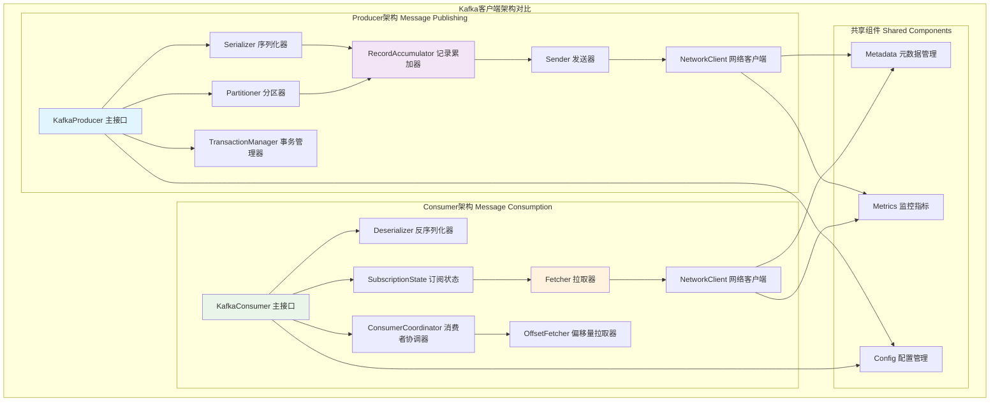
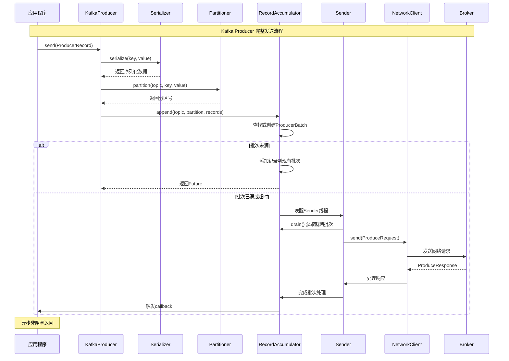
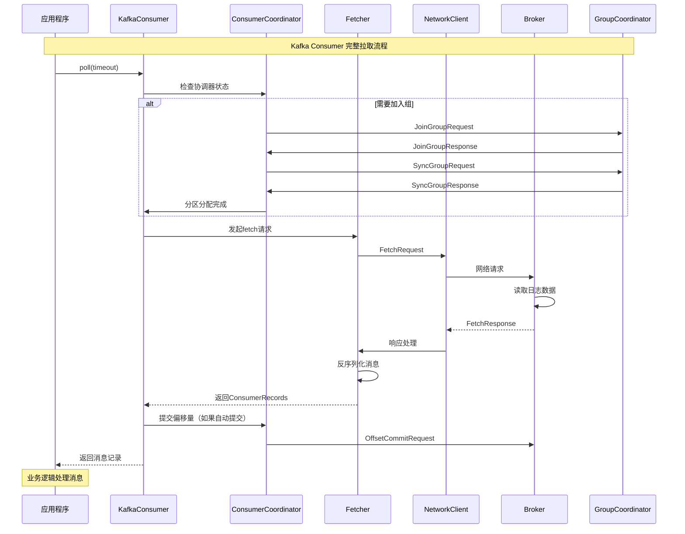
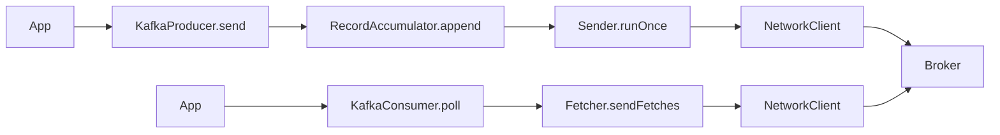
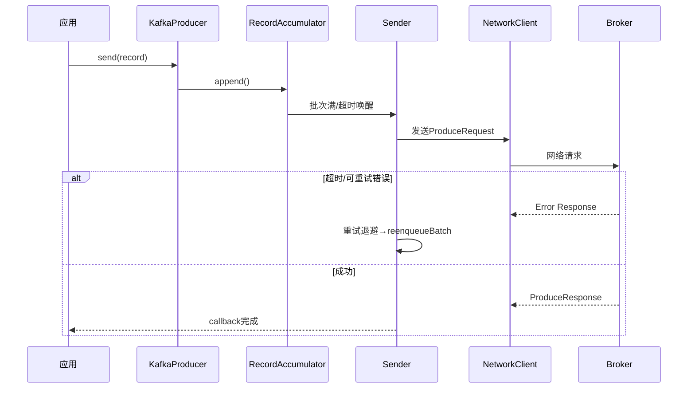
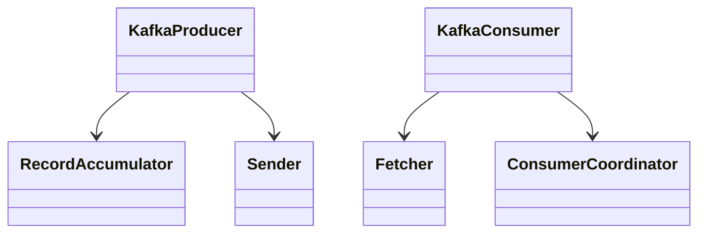

## 概述

Kafka客户端是应用程序与Kafka集群交互的关键接口。Producer负责高效地将消息发送到Kafka，Consumer负责从Kafka拉取和消费消息。本文客户端的内部实现机制，揭示其高性能和高可靠性的技术原理。

<!--more-->

## 1. 客户端整体架构

### 1.1 Producer和Consumer架构对比图



## 2. Producer深度解析

### 2.1 Producer发送流程时序图



### 2.2 KafkaProducer核心实现

```java
/**
 * KafkaProducer - Kafka生产者的主要实现类
 * 提供线程安全的异步消息发送功能
 */
public class KafkaProducer<K, V> implements Producer<K, V> {
    
    // 核心组件
    private final ProducerMetadata metadata;           // 元数据管理
    private final RecordAccumulator accumulator;       // 记录累加器
    private final Sender sender;                       // 发送器
    private final Sender.SenderThread ioThread;        // I/O线程
    private final TransactionManager transactionManager; // 事务管理器
    
    // 序列化和分区
    private final Plugin<Serializer<K>> keySerializerPlugin;     // 键序列化器
    private final Plugin<Serializer<V>> valueSerializerPlugin;   // 值序列化器
    private final Plugin<Partitioner> partitionerPlugin;        // 分区器
    
    /**
     * 异步发送消息记录的核心实现
     * 
     * @param record 要发送的消息记录
     * @param callback 发送完成后的回调函数
     * @return 包含消息元数据的Future对象
     */
    @Override
    public Future<RecordMetadata> send(ProducerRecord<K, V> record, Callback callback) {
        // 1. 拦截器预处理
        ProducerRecord<K, V> interceptedRecord = this.interceptors.onSend(record);
        
        // 2. 实际发送处理
        return doSend(interceptedRecord, callback);
    }

    /**
     * 执行实际的发送逻辑
     */
    private Future<RecordMetadata> doSend(ProducerRecord<K, V> record, Callback callback) {
        // 1. 验证生产者状态
        throwIfProducerClosed();
        
        // 2. 回调包装器，用于拦截器后处理
        Callback interceptCallback = new InterceptorCallback<>(callback, this.interceptors, record);

        try {
            // 3. 等待元数据更新（如果需要）
            long nowMs = time.milliseconds();
            ClusterAndWaitTime clusterAndWaitTime;
            try {
                clusterAndWaitTime = waitOnMetadata(record.topic(), record.partition(), 
                                                   nowMs, maxBlockTimeMs);
            } catch (KafkaException e) {
                if (metadata.isClosed())
                    throw new KafkaException("Producer closed while send in progress", e);
                throw e;
            }
            
            nowMs += clusterAndWaitTime.waitedOnMetadataMs;
            long remainingWaitMs = Math.max(0, maxBlockTimeMs - clusterAndWaitTime.waitedOnMetadataMs);
            Cluster cluster = clusterAndWaitTime.cluster;
            
            // 4. 序列化键值对
            byte[] serializedKey;
            try {
                serializedKey = keySerializer.serialize(record.topic(), record.key());
            } catch (ClassCastException cce) {
                throw new SerializationException("无法序列化键", cce);
            }
            
            byte[] serializedValue;
            try {
                serializedValue = valueSerializer.serialize(record.topic(), record.value());
            } catch (ClassCastException cce) {
                throw new SerializationException("无法序列化值", cce);
            }
            
            // 5. 计算分区
            int partition = partition(record, serializedKey, serializedValue, cluster);
            setReadOnly(record.headers());
            Header[] headers = record.headers().toArray();

            int serializedSize = AbstractRecords.estimateSizeInBytesUpperBound(
                RecordBatch.CURRENT_MAGIC_VALUE, compression.type(), 
                serializedKey, serializedValue, headers);
            
            // 6. 确保记录大小不超过限制
            ensureValidRecordSize(serializedSize);

            // 7. 构建时间戳
            long timestamp = record.timestamp() == null ? nowMs : record.timestamp();

            // 8. 添加到累加器进行批处理
            RecordAccumulator.RecordAppendResult result = accumulator.append(
                record.topic(), 
                partition, 
                timestamp, 
                serializedKey, 
                serializedValue, 
                headers,
                interceptCallback, 
                remainingWaitMs, 
                true, 
                nowMs, 
                cluster
            );

            // 9. 如果批次已满或新创建批次，唤醒sender线程
            if (result.batchIsFull || result.newBatchCreated) {
                log.trace("唤醒sender，因为批次已满或新创建批次");
                this.sender.wakeup();
            }

            return result.future;
        } catch (ApiException e) {
            log.debug("发送记录时发生API异常", e);
            if (callback != null) {
                callback.onCompletion(null, e);
            }
            this.errors.record();
            if (this.interceptors != null) {
                this.interceptors.onSendError(record, null, e);
            }
            return new FutureFailure(e);
        } catch (InterruptedException e) {
            this.errors.record();
            if (this.interceptors != null) {
                this.interceptors.onSendError(record, null, e);
            }
            throw new InterruptException(e);
        } catch (KafkaException e) {
            this.errors.record();
            if (this.interceptors != null) {
                this.interceptors.onSendError(record, null, e);
            }
            throw e;
        }
    }

    /**
     * 计算消息应该发送到的分区
     */
    private int partition(ProducerRecord<K, V> record, byte[] serializedKey, 
                         byte[] serializedValue, Cluster cluster) {
        if (record.partition() != null) {
            return record.partition();
        }
        return partitioner.partition(
            record.topic(), record.key(), serializedKey, record.value(), serializedValue, cluster);
    }
}
```

### 2.3 RecordAccumulator批处理机制

```java
/**
 * RecordAccumulator - 记录累加器
 * 实现消息的批处理和内存管理，提高发送效率
 */
public class RecordAccumulator {
    
    // 批处理配置
    private final int batchSize;                           // 批次大小
    private final Compression compression;                 // 压缩算法
    private final int lingerMs;                           // 延迟发送时间
    private final ExponentialBackoff retryBackoff;        // 重试退避策略
    
    // 内存管理
    private final BufferPool free;                        // 内存池
    
    // 批次管理
    private final ConcurrentMap<String, TopicInfo> topicInfoMap = new CopyOnWriteMap<>();
    private final IncompleteBatches incomplete;           // 未完成批次追踪
    
    /**
     * 向累加器添加消息记录
     * 实现批处理逻辑的核心方法
     */
    public RecordAppendResult append(String topic,
                                   int partition,
                                   long timestamp,
                                   byte[] key,
                                   byte[] value,
                                   Header[] headers,
                                   AppendCallbacks callbacks,
                                   long maxTimeToBlock,
                                   long nowMs,
                                   Cluster cluster) throws InterruptedException {
        
        // 1. 获取或创建主题信息
        TopicInfo topicInfo = topicInfoMap.computeIfAbsent(topic, 
            k -> new TopicInfo(createBuiltInPartitioner(logContext, k, batchSize)));

        // 2. 跟踪正在进行的append操作
        appendsInProgress.incrementAndGet();
        ByteBuffer buffer = null;
        if (headers == null) headers = Record.EMPTY_HEADERS;
        
        try {
            // 3. 分区选择逻辑
            while (true) {
                // 选择有效分区
                int effectivePartition = partition == RecordMetadata.UNKNOWN_PARTITION 
                    ? topicInfo.builtInPartitioner.partition(topic, key, value, cluster)
                    : partition;

                // 4. 获取分区对应的批次队列
                Deque<ProducerBatch> dq = topicInfo.batches.computeIfAbsent(
                    effectivePartition, k -> new ArrayDeque<>());
                
                synchronized (dq) {
                    // 5. 尝试添加到现有批次
                    RecordAppendResult appendResult = tryAppend(timestamp, key, value, 
                                                              headers, callbacks, dq, nowMs);
                    if (appendResult != null) {
                        // 成功添加到现有批次
                        boolean enableSwitch = allBatchesFull(dq);
                        topicInfo.builtInPartitioner.updatePartitionInfo(
                            partitionInfo, appendResult.appendedBytes, cluster, enableSwitch);
                        return appendResult;
                    }
                }

                // 6. 需要创建新批次，先分配内存
                if (buffer == null) {
                    int size = Math.max(this.batchSize, 
                        AbstractRecords.estimateSizeInBytesUpperBound(
                            RecordBatch.CURRENT_MAGIC_VALUE, compression.type(), 
                            key, value, headers));
                    
                    log.trace("为主题 {} 分区 {} 分配新的 {} 字节消息缓冲区，剩余超时 {}ms", 
                        topic, effectivePartition, size, maxTimeToBlock);
                    
                    // 这个调用可能会阻塞，如果缓冲池空间不足
                    buffer = free.allocate(size, maxTimeToBlock);
                    nowMs = time.milliseconds();
                }

                synchronized (dq) {
                    // 7. 创建新批次
                    RecordAppendResult appendResult = appendNewBatch(topic, effectivePartition, 
                        dq, timestamp, key, value, headers, callbacks, buffer, nowMs);
                    
                    // 如果成功创建新批次，buffer将被使用，设为null避免释放
                    if (appendResult.newBatchCreated) {
                        buffer = null;
                    }
                    
                    boolean enableSwitch = allBatchesFull(dq);
                    topicInfo.builtInPartitioner.updatePartitionInfo(
                        partitionInfo, appendResult.appendedBytes, cluster, enableSwitch);
                    return appendResult;
                }
            }
        } finally {
            // 8. 清理资源
            free.deallocate(buffer);
            appendsInProgress.decrementAndGet();
        }
    }

    /**
     * 尝试将记录添加到现有批次中
     */
    private RecordAppendResult tryAppend(long timestamp, byte[] key, byte[] value, 
                                       Header[] headers, AppendCallbacks callbacks, 
                                       Deque<ProducerBatch> deque, long nowMs) {
        if (closed) {
            throw new KafkaException("Producer已关闭，发送过程中被中断");
        }
        
        ProducerBatch last = deque.peekLast();
        if (last != null) {
            int initialBytes = last.estimatedSizeInBytes();
            FutureRecordMetadata future = last.tryAppend(timestamp, key, value, headers, 
                                                        callbacks, nowMs);
            if (future == null) {
                // 批次已满，关闭以供发送
                last.closeForRecordAppends();
            } else {
                int appendedBytes = last.estimatedSizeInBytes() - initialBytes;
                return new RecordAppendResult(future, deque.size() > 1 || last.isFull(), 
                                            false, appendedBytes);
            }
        }
        return null;
    }

    /**
     * 创建新的生产者批次
     */
    private RecordAppendResult appendNewBatch(String topic, int partition,
                                            Deque<ProducerBatch> dq,
                                            long timestamp, byte[] key, byte[] value,
                                            Header[] headers, AppendCallbacks callbacks,
                                            ByteBuffer buffer, long nowMs) {
        assert partition != RecordMetadata.UNKNOWN_PARTITION;

        // 再次尝试现有批次（可能在等待锁期间有其他线程创建了批次）
        RecordAppendResult appendResult = tryAppend(timestamp, key, value, 
                                                  headers, callbacks, dq, nowMs);
        if (appendResult != null) {
            return appendResult;
        }

        // 创建新批次
        MemoryRecordsBuilder recordsBuilder = recordsBuilder(buffer);
        ProducerBatch batch = new ProducerBatch(new TopicPartition(topic, partition), 
                                               recordsBuilder, nowMs);
        FutureRecordMetadata future = Objects.requireNonNull(
            batch.tryAppend(timestamp, key, value, headers, callbacks, nowMs));

        // 添加到队列和未完成批次追踪
        dq.addLast(batch);
        incomplete.add(batch);

        return new RecordAppendResult(future, dq.size() > 1 || batch.isFull(), 
                                    true, batch.estimatedSizeInBytes());
    }

    /**
     * 获取准备发送的批次
     * 由Sender线程调用以获取就绪的批次进行网络发送
     */
    public ReadyCheckResult ready(Cluster cluster, long nowMs) {
        Set<Node> readyNodes = new HashSet<>();
        long nextReadyCheckDelayMs = Long.MAX_VALUE;
        Set<String> unknownLeaderTopics = new HashSet<>();

        boolean exhausted = this.free.queued() > 0;
        
        for (Map.Entry<String, TopicInfo> topicInfoEntry : this.topicInfoMap.entrySet()) {
            String topic = topicInfoEntry.getKey();
            TopicInfo topicInfo = topicInfoEntry.getValue();

            for (Map.Entry<Integer, Deque<ProducerBatch>> entry : topicInfo.batches.entrySet()) {
                int partition = entry.getKey();
                Deque<ProducerBatch> deque = entry.getValue();

                Node leader = cluster.leaderFor(new TopicPartition(topic, partition));
                synchronized (deque) {
                    if (leader == null) {
                        unknownLeaderTopics.add(topic);
                    } else if (!readyNodes.contains(leader) && !isMuted(leader)) {
                        ProducerBatch batch = deque.peekFirst();
                        if (batch != null) {
                            long timeSinceCreationMs = max(0, nowMs - batch.createdMs);
                            boolean full = deque.size() > 1 || batch.isFull();
                            boolean expired = timeSinceCreationMs >= lingerMs;
                            boolean transactionCompleting = transactionManager != null 
                                && transactionManager.isCompleting();

                            boolean sendable = full 
                                || expired 
                                || exhausted 
                                || closed 
                                || flushInProgress() 
                                || transactionCompleting;

                            if (sendable && !batch.inRetry()) {
                                readyNodes.add(leader);
                            } else {
                                long timeLeftMs = max(lingerMs - timeSinceCreationMs, 0);
                                nextReadyCheckDelayMs = min(nextReadyCheckDelayMs, timeLeftMs);
                            }
                        }
                    }
                }
            }
        }

        return new ReadyCheckResult(readyNodes, nextReadyCheckDelayMs, unknownLeaderTopics);
    }
}
```

### 2.4 Sender异步发送机制

```java
/**
 * Sender - 后台线程，负责将批次发送到Kafka集群
 * 实现异步网络I/O和重试机制
 */
public class Sender implements Runnable {
    
    private final KafkaClient client;              // 网络客户端
    private final RecordAccumulator accumulator;   // 记录累加器
    private final ProducerMetadata metadata;       // 元数据管理
    private final TransactionManager transactionManager; // 事务管理器
    
    // 配置参数
    private final int maxRequestSize;              // 最大请求大小
    private final short acks;                      // ACK配置
    private final int retries;                     // 重试次数
    private final long retryBackoffMs;             // 重试间隔

    /**
     * Sender线程的主循环
     * 持续检查并发送就绪的批次
     */
    @Override
    public void run() {
        log.debug("启动Kafka生产者I/O线程");

        while (running) {
            try {
                // 执行一轮发送循环
                runOnce();
            } catch (Exception e) {
                log.error("发送过程中发生未捕获的异常", e);
            }
        }

        log.debug("开始关闭Kafka生产者I/O线程，首先处理待处理的事务状态");
        
        // 关闭处理
        while (!forceClose && transactionManager != null && transactionManager.hasOngoingTransaction()) {
            try {
                runOnce();
            } catch (Exception e) {
                log.error("关闭过程中发生未捕获的异常", e);
            }
        }
        
        if (forceClose) {
            log.debug("强制关闭，放弃所有待处理请求");
        }
        
        // 最后清理
        this.accumulator.abortIncompleteBatches();
        this.client.close();
        log.debug("Kafka生产者I/O线程已完全关闭");
    }

    /**
     * 执行一轮发送循环
     */
    void runOnce() {
        // 1. 处理事务状态（如果启用事务）
        if (transactionManager != null) {
            if (!transactionManager.isTransactional()) {
                maybeWaitForProducerId();
            } else if (transactionManager.hasInFlightRequest() || hasPendingTransactionalRequests()) {
                client.poll(retryBackoffMs, time.milliseconds());
                return;
            } else if (transactionManager.hasAbortableError()) {
                accumulator.abortUndrainedBatches(transactionManager.lastError());
                transactionManager.close();
                return;
            } else if (transactionManager.isAborting()) {
                handleAbortableError(transactionManager.lastError());
                return;
            }
        }

        long currentTimeMs = time.milliseconds();
        long pollTimeout = sendProducerData(currentTimeMs);
        client.poll(pollTimeout, currentTimeMs);
    }

    /**
     * 发送生产者数据的核心方法
     */
    private long sendProducerData(long currentTimeMs) {
        Cluster cluster = metadata.fetch();
        
        // 1. 获取就绪的批次
        RecordAccumulator.ReadyCheckResult result = this.accumulator.ready(cluster, currentTimeMs);
        
        // 2. 如果有未知Leader的主题，请求元数据更新
        if (!result.unknownLeaderTopics.isEmpty()) {
            for (String topic : result.unknownLeaderTopics)
                this.metadata.add(topic, currentTimeMs);

            log.debug("请求更新以下主题的元数据：{}", result.unknownLeaderTopics);
            this.metadata.requestUpdate();
        }

        // 3. 过滤掉未准备好的节点
        Iterator<Node> iter = result.readyNodes.iterator();
        long notReadyTimeout = Long.MAX_VALUE;
        while (iter.hasNext()) {
            Node node = iter.next();
            if (!this.client.ready(node, currentTimeMs)) {
                iter.remove();
                notReadyTimeout = Math.min(notReadyTimeout, this.client.pollDelayMs(node, currentTimeMs));
            }
        }

        // 4. 为每个准备好的节点创建生产请求
        Map<Integer, List<ProducerBatch>> batches = this.accumulator.drain(cluster,
                                                                           result.readyNodes,
                                                                           this.maxRequestSize,
                                                                           currentTimeMs);
        
        // 5. 处理超时的批次
        List<ProducerBatch> expiredInflightBatches = getExpiredInflightBatches(currentTimeMs);
        List<ProducerBatch> expiredBatches = this.accumulator.expiredBatches(currentTimeMs);
        expiredBatches.addAll(expiredInflightBatches);

        if (!expiredBatches.isEmpty()) {
            log.trace("过期 {} 个批次", expiredBatches.size());
        }
        for (ProducerBatch expiredBatch : expiredBatches) {
            String errorMessage = "由于delivery.timeout.ms已过期，批次在发送前已过期";
            failBatch(expiredBatch, new TimeoutException(errorMessage), false);
        }

        // 6. 发送请求
        sendProduceRequests(batches, currentTimeMs);
        
        return Math.min(result.nextReadyCheckDelayMs, notReadyTimeout);
    }

    /**
     * 发送生产请求到各个节点
     */
    private void sendProduceRequests(Map<Integer, List<ProducerBatch>> collated, long now) {
        for (Map.Entry<Integer, List<ProducerBatch>> entry : collated.entrySet()) {
            sendProduceRequest(now, entry.getKey(), entry.getValue());
        }
    }

    /**
     * 向指定节点发送生产请求
     */
    private void sendProduceRequest(long now, int destination, List<ProducerBatch> batches) {
        if (batches.isEmpty()) return;

        final Map<TopicPartition, MemoryRecords> produceRecordsByPartition = new HashMap<>(batches.size());
        final Map<TopicPartition, ProducerBatch> recordsByPartition = new HashMap<>(batches.size());

        // 准备请求数据
        for (ProducerBatch batch : batches) {
            TopicPartition tp = batch.topicPartition;
            MemoryRecords records = batch.records();

            produceRecordsByPartition.put(tp, records);
            recordsByPartition.put(tp, batch);
        }

        String transactionalId = null;
        if (transactionManager != null && transactionManager.isTransactional()) {
            transactionalId = transactionManager.transactionalId();
        }

        // 构建生产请求
        ProduceRequest.Builder requestBuilder = ProduceRequest.forMagic(RecordBatch.CURRENT_MAGIC_VALUE,
                (short) acks, requestTimeoutMs, produceRecordsByPartition, transactionalId);
        RequestCompletionHandler callback = new RequestCompletionHandler() {
            @Override
            public void onComplete(ClientResponse response) {
                handleProduceResponse(response, recordsByPartition, time.milliseconds());
            }
        };

        String nodeId = Integer.toString(destination);
        ClientRequest clientRequest = client.newClientRequest(nodeId, requestBuilder, now, acks != 0, 
                                                             requestTimeoutMs, callback);
        client.send(clientRequest, now);
        log.trace("发送生产请求到 {}: {}", nodeId, requestBuilder);
    }

    /**
     * 处理生产响应
     */
    private void handleProduceResponse(ClientResponse response, Map<TopicPartition, ProducerBatch> batches, 
                                     long now) {
        RequestHeader requestHeader = response.requestHeader();
        int correlationId = requestHeader.correlationId();
        
        if (response.wasDisconnected()) {
            log.trace("取消发送到节点 {} 的请求 {}，因为连接断开", response.destination(), correlationId);
            for (ProducerBatch batch : batches.values())
                completeBatch(batch, new ProduceResponse.PartitionResponse(Errors.NETWORK_EXCEPTION), correlationId, now);
        } else if (response.versionMismatch() != null) {
            log.warn("收到不支持的版本错误：{}", response.versionMismatch());
            for (ProducerBatch batch : batches.values())
                completeBatch(batch, new ProduceResponse.PartitionResponse(Errors.UNSUPPORTED_VERSION), correlationId, now);
        } else {
            log.trace("收到来自节点 {} 相关ID {} 的生产响应", response.destination(), correlationId);
            
            // 解析响应
            ProduceResponse produceResponse = (ProduceResponse) response.responseBody();
            for (Map.Entry<TopicPartition, ProduceResponse.PartitionResponse> entry : produceResponse.responses().entrySet()) {
                TopicPartition tp = entry.getKey();
                ProduceResponse.PartitionResponse partResp = entry.getValue();
                ProducerBatch batch = batches.get(tp);
                completeBatch(batch, partResp, correlationId, now);
            }
            this.sensors.recordLatency(response.destination(), response.requestLatencyMs());
        }
    }

    /**
     * 完成批次处理，触发回调
     */
    private void completeBatch(ProducerBatch batch, ProduceResponse.PartitionResponse response, 
                             long correlationId, long now) {
        Errors error = response.error;
        
        if (error == Errors.NONE) {
            if (batch.done(response.baseOffset, response.logAppendTime, null)) {
                log.trace("生产者批次已成功发送：correlationId={}, topic={}, partition={}, offset={}", 
                         correlationId, batch.topicPartition.topic(), batch.topicPartition.partition(), response.baseOffset);
            }
        } else if (canRetry(batch, response, now)) {
            log.trace("生产者批次可重试：correlationId={}, topic={}, partition={}, error={}", 
                     correlationId, batch.topicPartition.topic(), batch.topicPartition.partition(), error);
            reenqueueBatch(batch, now);
        } else if (error == Errors.DUPLICATE_SEQUENCE_NUMBER) {
            // 幂等性producer的重复序列号，视为成功
            if (batch.done(response.baseOffset, response.logAppendTime, null)) {
                log.debug("生产者批次重复序列号，视为成功：correlationId={}, topic={}, partition={}", 
                         correlationId, batch.topicPartition.topic(), batch.topicPartition.partition());
            }
        } else {
            final RuntimeException exception;
            if (error == Errors.TOPIC_AUTHORIZATION_FAILED) {
                exception = new TopicAuthorizationException(Collections.singleton(batch.topicPartition.topic()));
            } else if (error == Errors.CLUSTER_AUTHORIZATION_FAILED) {
                exception = new ClusterAuthorizationException("集群未授权");
            } else {
                exception = error.exception();
            }
            
            batch.done(RecordMetadata.UNKNOWN_OFFSET, RecordMetadata.NO_TIMESTAMP, exception);
        }
    }
}
```

## 3. Consumer深度解析

### 3.1 Consumer拉取流程时序图



### 3.2 KafkaConsumer核心实现

```java
/**
 * KafkaConsumer - Kafka消费者的主要实现类
 * 提供消息拉取、偏移量管理和组协调功能
 */
public class KafkaConsumer<K, V> implements Consumer<K, V> {
    
    // 核心组件
    private final ConsumerMetadata metadata;               // 元数据管理
    private final SubscriptionState subscriptions;        // 订阅状态
    private final Fetcher<K, V> fetcher;                 // 消息拉取器
    private final ConsumerCoordinator coordinator;        // 消费者协调器
    private final OffsetFetcher offsetFetcher;            // 偏移量拉取器
    
    // 反序列化器
    private final Plugin<Deserializer<K>> keyDeserializerPlugin;
    private final Plugin<Deserializer<V>> valueDeserializerPlugin;
    
    // 配置和网络
    private final ConsumerNetworkClient client;           // 网络客户端
    private final ConsumerConfig config;                  // 配置管理

    /**
     * 拉取消息记录的核心实现
     * 
     * @param timeout 最大等待时间
     * @return 拉取到的消息记录集合
     */
    @Override
    public ConsumerRecords<K, V> poll(final Duration timeout) {
        return poll(time.timer(timeout), true);
    }

    /**
     * poll方法的内部实现
     */
    private ConsumerRecords<K, V> poll(final Timer timer, final boolean includeMetadataInTimeout) {
        acquireAndEnsureOpen();
        try {
            kafkaConsumerMetrics.recordPollStart(timer.currentTimeMs());

            if (this.subscriptions.hasNoSubscriptionOrUserAssignment()) {
                throw new IllegalStateException("Consumer未订阅任何主题或分配任何分区");
            }

            do {
                client.maybeTriggerWakeup();

                // 1. 更新分配元数据（如果需要）
                if (includeMetadataInTimeout) {
                    updateAssignmentMetadataIfNeeded(timer, false);
                } else {
                    while (!updateAssignmentMetadataIfNeeded(time.timer(Long.MAX_VALUE), true)) {
                        log.warn("仍在等待元数据");
                    }
                }

                // 2. 执行实际的拉取操作
                final Fetch<K, V> fetch = pollForFetches(timer);
                if (!fetch.isEmpty()) {
                    // 在返回获取的记录之前，可以发送下一轮拉取
                    // 避免在用户处理获取记录时阻塞等待响应，实现流水线处理
                    if (sendFetches() > 0 || client.hasPendingRequests()) {
                        client.transmitSends();
                    }

                    if (fetch.records().isEmpty()) {
                        log.trace("从poll()返回空记录，因为consumer的位置至少为一个分区前进了");
                    }

                    return this.interceptors.onConsume(new ConsumerRecords<>(fetch.records(), fetch.nextOffsets()));
                }
            } while (timer.notExpired());

            return ConsumerRecords.empty();
        } finally {
            release();
            kafkaConsumerMetrics.recordPollEnd(timer.currentTimeMs());
        }
    }

    /**
     * 更新分配元数据
     */
    private boolean updateAssignmentMetadataIfNeeded(Timer timer, boolean waitForJoinGroup) {
        if (coordinator != null && !coordinator.poll(timer, waitForJoinGroup)) {
            return false;
        }
        return updateFetchPositions(timer);
    }

    /**
     * 更新拉取位置
     */
    private boolean updateFetchPositions(Timer timer) {
        cachedSubscriptionHasAllFetchPositions = subscriptions.hasAllFetchPositions();
        if (cachedSubscriptionHasAllFetchPositions) {
            return true;
        }

        // 如果我们还没有获取偏移量，需要获取它们
        if (!coordinator.refreshCommittedOffsetsIfNeeded(timer)) {
            return false;
        }

        // 如果仍有分区需要偏移量，获取它们
        subscriptions.resetInitializingPositions();
        if (!subscriptions.hasAllFetchPositions()) {
            offsetFetcher.resetPositionsIfNeeded();
        }

        cachedSubscriptionHasAllFetchPositions = subscriptions.hasAllFetchPositions();
        return cachedSubscriptionHasAllFetchPositions;
    }

    /**
     * 执行拉取操作
     */
    private Fetch<K, V> pollForFetches(Timer timer) {
        long pollTimeout = Math.min(coordinator.timeToNextPoll(timer.currentTimeMs()), timer.remainingMs());

        // 如果数据已经可用，立即返回
        final Fetch<K, V> fetch = collectFetch();
        if (!fetch.isEmpty()) {
            return fetch;
        }

        // 发送新的拉取请求（不会重发待处理的拉取请求）
        sendFetches();

        // 我们不希望因为缺少某些位置而被阻塞在poll中
        // 因为偏移量查找在失败后可能正在退避
        if (!cachedSubscriptionHasAllFetchPositions && pollTimeout > retryBackoffMs) {
            pollTimeout = retryBackoffMs;
        }

        log.trace("以超时时间 {} 轮询拉取", pollTimeout);

        Timer pollTimer = time.timer(pollTimeout);

        // 等待一段时间让拉取的数据到达，因为可能没有立即可用的数据
        // 使用专用pollTimer
        // 这样调用方法(poll)将正确处理整体超时
        try {
            client.poll(pollTimer);
        } catch (InterruptException e) {
            log.trace("拉取过程中发生中断", e);
            throw e;
        } finally {
            timer.update(pollTimer.currentTimeMs());
        }

        return collectFetch();
    }

    /**
     * 收集拉取的数据
     */
    private Fetch<K, V> collectFetch() {
        final Fetch<K, V> fetch = fetcher.collectFetch();
        return fetch;
    }

    /**
     * 发送拉取请求
     */
    private int sendFetches() {
        return fetcher.sendFetches();
    }
}
```

### 3.3 Fetcher消息拉取机制

```java
/**
 * Fetcher - 消息拉取器
 * 负责从Kafka broker拉取消息数据并进行反序列化处理
 */
public class Fetcher<K, V> {
    
    private final ConsumerNetworkClient client;            // 网络客户端
    private final SubscriptionState subscriptions;        // 订阅状态
    private final ConsumerMetadata metadata;              // 元数据
    private final FetchBuffer fetchBuffer;                // 拉取缓冲区
    
    // 反序列化器
    private final Deserializer<K> keyDeserializer;
    private final Deserializer<V> valueDeserializer;
    
    // 配置参数
    private final int minBytes;                           // 最小拉取字节数
    private final int maxBytes;                           // 最大拉取字节数
    private final int maxWaitMs;                          // 最大等待时间
    private final int fetchSize;                          // 拉取大小
    private final int maxPollRecords;                     // 每次poll最大记录数

    /**
     * 发送拉取请求
     * 为所有有数据可拉取的分区创建拉取请求
     */
    public synchronized int sendFetches() {
        // 更新拉取位置
        updateFetchPositions();
        
        Map<Node, FetchSessionHandler.FetchRequestData> fetchRequestMap = prepareFetchRequests();
        for (Map.Entry<Node, FetchSessionHandler.FetchRequestData> entry : fetchRequestMap.entrySet()) {
            final Node fetchTarget = entry.getKey();
            final FetchSessionHandler.FetchRequestData data = entry.getValue();
            
            // 构建拉取请求
            final FetchRequest.Builder request = FetchRequest.Builder
                .forConsumer(this.maxWaitMs, this.minBytes, data.toSend())
                .isolationLevel(isolationLevel)
                .setMaxBytes(this.maxBytes)
                .metadata(data.metadata())
                .removed(data.toForget())
                .replaced(data.toReplace())
                .rackId(clientRackId);

            if (log.isDebugEnabled()) {
                log.debug("发送 {} 到broker {}", request, fetchTarget);
            }

            RequestFuture<ClientResponse> future = client.send(fetchTarget, request);
            
            // 添加监听器处理响应
            future.addListener(new RequestFutureListener<ClientResponse>() {
                @Override
                public void onSuccess(ClientResponse resp) {
                    handleFetchResponse(resp, data);
                }

                @Override
                public void onFailure(RuntimeException e) {
                    handleFetchResponse(fetchTarget, data, e);
                }
            });
        }
        return fetchRequestMap.size();
    }

    /**
     * 准备拉取请求
     * 为每个节点收集需要拉取的分区信息
     */
    private Map<Node, FetchSessionHandler.FetchRequestData> prepareFetchRequests() {
        Cluster cluster = metadata.fetch();
        Map<Node, FetchSessionHandler.Builder> fetchable = new LinkedHashMap<>();
        long currentTimeMs = time.milliseconds();

        for (TopicPartition partition : fetchablePartitions()) {
            Node node = cluster.leaderFor(partition);
            if (node == null) {
                metadata.requestUpdate();
            } else if (client.isUnavailable(node)) {
                client.maybeThrowAuthFailure(node);
            } else if (client.hasPendingRequests(node)) {
                // 如果该节点有待处理的请求，跳过以避免连接饱和
                log.trace("跳过向节点 {} 发送拉取请求，因为已有待处理请求", node);
            } else {
                // 获取该分区的拉取状态
                FetchPosition position = this.subscriptions.position(partition);
                if (position == null) {
                    throw new IllegalStateException("缺少分区 " + partition + " 的位置");
                }

                Map<TopicPartition, Integer> partitionBytes = fetchable
                    .computeIfAbsent(node, k -> new FetchSessionHandler.Builder())
                    .partitionsToSizes();

                long fetchOffset = position.offset;
                int fetchSize = Math.min(maxPartitionFetchBytes, 
                    partitionBytes.getOrDefault(partition, this.fetchSize));

                log.trace("准备从分区 {} 偏移量 {} 拉取 {} 字节数据", partition, fetchOffset, fetchSize);
                
                fetchable.get(node).add(partition, 
                    new FetchRequest.PartitionData(
                        fetchOffset,
                        FetchRequest.INVALID_LOG_START_OFFSET,
                        fetchSize,
                        Optional.of(position.currentLeader.epoch)));
            }
        }

        Map<Node, FetchSessionHandler.FetchRequestData> reqs = new LinkedHashMap<>();
        for (Map.Entry<Node, FetchSessionHandler.Builder> entry : fetchable.entrySet()) {
            reqs.put(entry.getKey(), entry.getValue().build());
        }
        return reqs;
    }

    /**
     * 处理拉取响应
     */
    private void handleFetchResponse(ClientResponse resp, FetchSessionHandler.FetchRequestData requestData) {
        if (resp.requestHeader().apiKey() != ApiKeys.FETCH) {
            throw new IllegalStateException("预期FETCH响应，但收到 " + resp.requestHeader().apiKey());
        }

        FetchResponse response = (FetchResponse) resp.responseBody();
        FetchSessionHandler handler = sessionHandler(resp.destination());
        Set<TopicPartition> partitions = new HashSet<>(response.responseData().keySet());
        
        FetchResponseMetricAggregator metricAggregator = new FetchResponseMetricAggregator(sensors, partitions);

        for (Map.Entry<TopicPartition, FetchResponse.PartitionData> entry : response.responseData().entrySet()) {
            TopicPartition partition = entry.getKey();
            FetchResponse.PartitionData partitionData = entry.getValue();

            log.debug("分区 {} 的拉取响应：偏移量 {}, 高水位 {}, 错误 {}", 
                partition, partitionData.fetchOffset, partitionData.highWatermark, partitionData.error);

            completedFetches.add(new CompletedFetch(partition, partitionData, 
                metricAggregator, resp.requestLatencyMs(), apiVersions.latestUsableVersion(ApiKeys.FETCH)));
        }

        sensors.fetchLatency.record(resp.requestLatencyMs());
    }

    /**
     * 收集拉取到的数据
     */
    public Fetch<K, V> collectFetch() {
        final Fetch<K, V> fetch = fetchBuffer.nextInLineFetch();
        if (fetch == null || fetch.isEmpty()) {
            return Fetch.empty();
        }

        return fetch;
    }

    /**
     * 解析拉取的记录
     */
    private List<ConsumerRecord<K, V>> parseRecord(TopicPartition partition,
                                                  RecordBatch batch,
                                                  Record record) {
        try {
            long offset = record.offset();
            long timestamp = record.timestamp();
            Optional<Integer> leaderEpoch = maybeLeaderEpoch(batch.partitionLeaderEpoch());
            TimestampType timestampType = batch.timestampType();

            Headers headers = new RecordHeaders(record.headers());

            ByteBuffer keyBytes = record.key();
            byte[] keyByteArray = keyBytes != null ? Utils.toArray(keyBytes) : null;
            K key = keyBytes == null ? null : this.keyDeserializer.deserialize(partition.topic(), keyByteArray);

            ByteBuffer valueBytes = record.value();
            byte[] valueByteArray = valueBytes != null ? Utils.toArray(valueBytes) : null;
            V value = valueBytes == null ? null : this.valueDeserializer.deserialize(partition.topic(), valueByteArray);

            return Collections.singletonList(new ConsumerRecord<>(partition.topic(), partition.partition(), offset,
                                                                 timestamp, timestampType, keyByteArray == null ? ConsumerRecord.NULL_SIZE : keyByteArray.length,
                                                                 valueByteArray == null ? ConsumerRecord.NULL_SIZE : valueByteArray.length,
                                                                 key, value, headers, leaderEpoch));
        } catch (RuntimeException e) {
            throw new SerializationException("反序列化分区 " + partition + 
                " 偏移量 " + record.offset() + " 的键/值时出错。如果需要，可考虑配置 " +
                ConsumerConfig.KEY_DESERIALIZER_CLASS_CONFIG + " 或 " +
                ConsumerConfig.VALUE_DESERIALIZER_CLASS_CONFIG + " 来处理反序列化错误", e);
        }
    }

    /**
     * 获取可拉取的分区列表
     */
    private List<TopicPartition> fetchablePartitions() {
        Set<TopicPartition> exclude = new HashSet<>();
        
        // 排除暂停的分区
        for (TopicPartition tp : subscriptions.pausedPartitions()) {
            exclude.add(tp);
        }

        List<TopicPartition> fetchable = subscriptions.fetchablePartitions(tp -> !exclude.contains(tp));
        if (nextInLineFetch != null && !fetchable.contains(nextInLineFetch.partition)) {
            fetchable.add(nextInLineFetch.partition);
        }
        return fetchable;
    }

    /**
     * 更新拉取位置
     * 确保所有分配的分区都有有效的拉取位置
     */
    private void updateFetchPositions() {
        // 检查是否有分区需要验证其拉取位置
        validatePositionsOnMetadataChange();

        // 检查是否有分区需要重置其拉取位置
        resetPositionsIfNeeded();
    }

    /**
     * 验证元数据变化时的位置
     */
    private void validatePositionsOnMetadataChange() {
        Map<TopicPartition, FetchPosition> initialPositions = subscriptions.initializingPositions();
        if (!initialPositions.isEmpty()) {
            validateOffsetsAsync(initialPositions);
        }
    }

    /**
     * 如果需要，重置拉取位置
     */
    private void resetPositionsIfNeeded() {
        // 收集需要重置的分区
        Map<TopicPartition, Long> offsetResetTimestamps = new HashMap<>();
        for (TopicPartition tp : subscriptions.assignedPartitions()) {
            if (subscriptions.isOffsetResetNeeded(tp)) {
                offsetResetTimestamps.put(tp, offsetResetStrategy.timestamp(tp));
            }
        }

        if (offsetResetTimestamps.isEmpty()) {
            return;
        }

        // 异步查找偏移量
        resetOffsetsAsync(offsetResetTimestamps);
    }
}
```

## 4. 客户端配置与监控

### 4.1 Producer关键配置

```java
/**
 * ProducerConfig - Producer配置参数
 * 涵盖性能、可靠性和行为控制的各个方面
 */
public class ProducerConfig extends AbstractConfig {
    
    // 核心配置
    public static final String BOOTSTRAP_SERVERS_CONFIG = "bootstrap.servers";
    public static final String ACKS_CONFIG = "acks";
    public static final String RETRIES_CONFIG = "retries";
    public static final String BATCH_SIZE_CONFIG = "batch.size";
    public static final String LINGER_MS_CONFIG = "linger.ms";
    public static final String BUFFER_MEMORY_CONFIG = "buffer.memory";
    
    // 序列化配置
    public static final String KEY_SERIALIZER_CLASS_CONFIG = "key.serializer";
    public static final String VALUE_SERIALIZER_CLASS_CONFIG = "value.serializer";
    
    // 分区和压缩配置
    public static final String PARTITIONER_CLASS_CONFIG = "partitioner.class";
    public static final String COMPRESSION_TYPE_CONFIG = "compression.type";
    
    // 幂等性和事务配置
    public static final String ENABLE_IDEMPOTENCE_CONFIG = "enable.idempotence";
    public static final String TRANSACTIONAL_ID_CONFIG = "transactional.id";
    
    /**
     * Producer配置的详细说明和默认值
     */
    private static final ConfigDef CONFIG = new ConfigDef()
        .define(BOOTSTRAP_SERVERS_CONFIG, Type.LIST, Importance.HIGH, 
                "Kafka集群的地址列表，用于建立初始连接")
        .define(ACKS_CONFIG, Type.STRING, "all", ValidString.in("all", "-1", "0", "1"), 
                Importance.HIGH, "Producer要求leader在确认请求完成之前收到的确认数")
        .define(RETRIES_CONFIG, Type.INT, Integer.MAX_VALUE, atLeast(0), 
                Importance.HIGH, "发生可重试错误时的重试次数")
        .define(BATCH_SIZE_CONFIG, Type.INT, 16384, atLeast(0), 
                Importance.MEDIUM, "发送到同一分区的多个记录将被批处理的字节数")
        .define(LINGER_MS_CONFIG, Type.LONG, 0, atLeast(0L), 
                Importance.MEDIUM, "Producer将等待额外记录到达的时间，以便进行批处理")
        .define(BUFFER_MEMORY_CONFIG, Type.LONG, 33554432L, atLeast(0L), 
                Importance.HIGH, "Producer可以用于缓冲等待发送到服务器的记录的总内存字节数");

    /**
     * 获取配置的便捷方法
     */
    public List<String> getBootstrapServers() {
        return getList(BOOTSTRAP_SERVERS_CONFIG);
    }

    public String getAcks() {
        return getString(ACKS_CONFIG);
    }

    public int getBatchSize() {
        return getInt(BATCH_SIZE_CONFIG);
    }

    public long getLingerMs() {
        return getLong(LINGER_MS_CONFIG);
    }

    public long getBufferMemory() {
        return getLong(BUFFER_MEMORY_CONFIG);
    }

    public boolean getEnableIdempotence() {
        return getBoolean(ENABLE_IDEMPOTENCE_CONFIG);
    }
}
```

### 4.2 Consumer关键配置

```java
/**
 * ConsumerConfig - Consumer配置参数
 * 控制消费行为、偏移量管理和组协调等方面
 */
public class ConsumerConfig extends AbstractConfig {
    
    // 核心配置
    public static final String BOOTSTRAP_SERVERS_CONFIG = "bootstrap.servers";
    public static final String GROUP_ID_CONFIG = "group.id";
    public static final String AUTO_OFFSET_RESET_CONFIG = "auto.offset.reset";
    public static final String ENABLE_AUTO_COMMIT_CONFIG = "enable.auto.commit";
    public static final String AUTO_COMMIT_INTERVAL_MS_CONFIG = "auto.commit.interval.ms";
    
    // 拉取配置
    public static final String FETCH_MIN_BYTES_CONFIG = "fetch.min.bytes";
    public static final String FETCH_MAX_BYTES_CONFIG = "fetch.max.bytes";
    public static final String FETCH_MAX_WAIT_MS_CONFIG = "fetch.max.wait.ms";
    public static final String MAX_PARTITION_FETCH_BYTES_CONFIG = "max.partition.fetch.bytes";
    public static final String MAX_POLL_RECORDS_CONFIG = "max.poll.records";
    
    // 会话和心跳配置
    public static final String SESSION_TIMEOUT_MS_CONFIG = "session.timeout.ms";
    public static final String HEARTBEAT_INTERVAL_MS_CONFIG = "heartbeat.interval.ms";
    public static final String MAX_POLL_INTERVAL_MS_CONFIG = "max.poll.interval.ms";
    
    // 反序列化配置
    public static final String KEY_DESERIALIZER_CLASS_CONFIG = "key.deserializer";
    public static final String VALUE_DESERIALIZER_CLASS_CONFIG = "value.deserializer";

    private static final ConfigDef CONFIG = new ConfigDef()
        .define(BOOTSTRAP_SERVERS_CONFIG, Type.LIST, Importance.HIGH, 
                "Kafka集群的地址列表")
        .define(GROUP_ID_CONFIG, Type.STRING, null, Importance.HIGH, 
                "标识此Consumer所属的消费者组的唯一字符串")
        .define(AUTO_OFFSET_RESET_CONFIG, Type.STRING, "latest", 
                ValidString.in("latest", "earliest", "none"), Importance.MEDIUM, 
                "当Kafka中没有初始偏移量或服务器上不再存在当前偏移量时的处理方式")
        .define(ENABLE_AUTO_COMMIT_CONFIG, Type.BOOLEAN, true, Importance.MEDIUM, 
                "如果为true，Consumer的偏移量将在后台定期提交")
        .define(FETCH_MIN_BYTES_CONFIG, Type.INT, 1, atLeast(0), Importance.HIGH, 
                "服务器为拉取请求返回的最小数据量")
        .define(MAX_POLL_RECORDS_CONFIG, Type.INT, 500, atLeast(1), Importance.MEDIUM, 
                "单次poll()调用中返回的最大记录数");
}
```

### 4.3 客户端监控指标

```java
/**
 * ProducerMetrics - Producer监控指标
 * 提供详细的性能和行为监控数据
 */
public class ProducerMetrics {
    
    // 发送相关指标
    private final Sensor recordSendRate;          // 记录发送速率
    private final Sensor recordSizeMax;           // 记录大小最大值
    private final Sensor recordSizeAvg;           // 记录大小平均值
    private final Sensor batchSizeMax;            // 批次大小最大值
    private final Sensor batchSizeAvg;            // 批次大小平均值
    
    // 缓冲和内存指标
    private final Sensor bufferTotalBytes;        // 缓冲池总字节数
    private final Sensor bufferAvailableBytes;    // 缓冲池可用字节数
    private final Sensor bufferExhaustedRate;     // 缓冲池耗尽速率
    
    // 网络指标
    private final Sensor requestLatencyAvg;       // 请求延迟平均值
    private final Sensor requestLatencyMax;       // 请求延迟最大值
    private final Sensor requestRate;             // 请求速率
    private final Sensor responseRate;            // 响应速率
    
    // 错误指标
    private final Sensor recordErrorRate;         // 记录错误速率
    private final Sensor recordRetryRate;         // 记录重试速率

    public ProducerMetrics(Metrics metrics) {
        MetricName metricName;
        String groupName = "producer-metrics";

        // 记录发送速率
        metricName = metrics.metricName("record-send-rate", groupName, 
                                      "每秒发送的记录数");
        recordSendRate = metrics.sensor("record-send-rate");
        recordSendRate.add(metricName, new Rate(TimeUnit.SECONDS));

        // 批次大小统计
        metricName = metrics.metricName("batch-size-avg", groupName, 
                                      "每个请求的平均批次字节数");
        batchSizeAvg = metrics.sensor("batch-size");
        batchSizeAvg.add(metricName, new Avg());

        metricName = metrics.metricName("batch-size-max", groupName, 
                                      "每个请求的最大批次字节数");
        batchSizeMax = batchSizeAvg;
        batchSizeMax.add(metricName, new Max());

        // 缓冲池指标
        metricName = metrics.metricName("buffer-total-bytes", groupName, 
                                      "缓冲池的总字节数");
        bufferTotalBytes = metrics.sensor("buffer-total-bytes");
        bufferTotalBytes.add(metricName, new Value());

        metricName = metrics.metricName("buffer-available-bytes", groupName, 
                                      "缓冲池中未分配的总字节数");
        bufferAvailableBytes = metrics.sensor("buffer-available-bytes");
        bufferAvailableBytes.add(metricName, new Value());
    }

    /**
     * 记录发送指标
     */
    public void recordSend(int bytes) {
        recordSendRate.record();
        batchSizeAvg.record(bytes);
    }

    /**
     * 记录缓冲池使用情况
     */
    public void recordBufferUsage(long totalBytes, long availableBytes) {
        bufferTotalBytes.record(totalBytes);
        bufferAvailableBytes.record(availableBytes);
    }
}

/**
 * ConsumerMetrics - Consumer监控指标
 */
public class ConsumerMetrics {
    
    // 拉取相关指标
    private final Sensor fetchSizeMax;            // 拉取大小最大值
    private final Sensor fetchSizeAvg;            // 拉取大小平均值  
    private final Sensor recordsPerRequestMax;    // 每次请求最大记录数
    private final Sensor recordsPerRequestAvg;    // 每次请求平均记录数
    
    // 延迟指标
    private final Sensor fetchLatencyMax;         // 拉取延迟最大值
    private final Sensor fetchLatencyAvg;         // 拉取延迟平均值
    private final Sensor fetchThrottleTimeMax;    // 拉取限流时间最大值
    private final Sensor fetchThrottleTimeAvg;    // 拉取限流时间平均值
    
    // 偏移量指标
    private final Sensor recordsLagMax;           // 记录滞后最大值
    private final Sensor recordsLag;              // 记录滞后数

    public ConsumerMetrics(Metrics metrics) {
        String groupName = "consumer-metrics";

        // 拉取大小指标
        MetricName metricName = metrics.metricName("fetch-size-avg", groupName, 
                                                 "拉取请求的平均字节数");
        fetchSizeAvg = metrics.sensor("fetch-size");
        fetchSizeAvg.add(metricName, new Avg());

        // 记录延迟指标  
        metricName = metrics.metricName("records-lag-max", groupName, 
                                      "分区中consumer滞后的最大记录数");
        recordsLagMax = metrics.sensor("records-lag-max");
        recordsLagMax.add(metricName, new Max());
    }

    /**
     * 记录拉取指标
     */
    public void recordFetch(int fetchSizeBytes, int numRecords, long fetchLatencyMs) {
        fetchSizeAvg.record(fetchSizeBytes);
        recordsPerRequestAvg.record(numRecords);
        fetchLatencyAvg.record(fetchLatencyMs);
    }

    /**
     * 记录滞后指标
     */
    public void recordLag(TopicPartition tp, long lag) {
        recordsLag.record(lag);
        recordsLagMax.record(lag);
    }
}
```

## 5. 性能优化最佳实践

### 5.1 Producer性能优化

```java
/**
 * Producer性能优化配置示例
 */
public class ProducerOptimizationExample {
    
    public static KafkaProducer<String, String> createOptimizedProducer() {
        Properties props = new Properties();
        
        // 1. 基础连接配置
        props.put(ProducerConfig.BOOTSTRAP_SERVERS_CONFIG, "kafka1:9092,kafka2:9092,kafka3:9092");
        props.put(ProducerConfig.KEY_SERIALIZER_CLASS_CONFIG, StringSerializer.class.getName());
        props.put(ProducerConfig.VALUE_SERIALIZER_CLASS_CONFIG, StringSerializer.class.getName());
        
        // 2. 性能优化配置
        // 批处理优化
        props.put(ProducerConfig.BATCH_SIZE_CONFIG, 32768);  // 32KB批次大小
        props.put(ProducerConfig.LINGER_MS_CONFIG, 10);      // 10ms延迟发送，增加批处理机会
        
        // 内存配置
        props.put(ProducerConfig.BUFFER_MEMORY_CONFIG, 67108864L); // 64MB缓冲区
        
        // 压缩配置
        props.put(ProducerConfig.COMPRESSION_TYPE_CONFIG, "lz4"); // LZ4压缩，平衡压缩比和CPU使用
        
        // 3. 可靠性配置
        props.put(ProducerConfig.ACKS_CONFIG, "1");          // Leader确认即可，平衡性能和可靠性
        props.put(ProducerConfig.RETRIES_CONFIG, 10);        // 适度重试
        props.put(ProducerConfig.ENABLE_IDEMPOTENCE_CONFIG, true); // 启用幂等性
        
        // 4. 网络优化
        props.put(ProducerConfig.REQUEST_TIMEOUT_MS_CONFIG, 30000);
        props.put(ProducerConfig.DELIVERY_TIMEOUT_MS_CONFIG, 120000);
        props.put(ProducerConfig.RETRY_BACKOFF_MS_CONFIG, 1000);
        
        return new KafkaProducer<>(props);
    }
    
    /**
     * 异步发送最佳实践
     */
    public static void asyncSendExample(KafkaProducer<String, String> producer) {
        // 使用回调处理结果，避免阻塞
        producer.send(new ProducerRecord<>("topic", "key", "value"), 
            (metadata, exception) -> {
                if (exception != null) {
                    log.error("发送失败", exception);
                    // 实现重试或死信队列逻辑
                } else {
                    log.debug("发送成功：offset={}, partition={}", 
                             metadata.offset(), metadata.partition());
                }
            });
    }
    
    /**
     * 批量发送模式
     */
    public static void batchSendExample(KafkaProducer<String, String> producer, 
                                       List<String> messages) {
        List<Future<RecordMetadata>> futures = new ArrayList<>();
        
        // 连续发送多条消息，利用批处理
        for (String message : messages) {
            Future<RecordMetadata> future = producer.send(
                new ProducerRecord<>("topic", message));
            futures.add(future);
        }
        
        // 可选：等待所有消息发送完成
        for (Future<RecordMetadata> future : futures) {
            try {
                future.get(5, TimeUnit.SECONDS);
            } catch (Exception e) {
                log.error("批量发送中的消息失败", e);
            }
        }
    }
}
```

### 5.2 Consumer性能优化

```java
/**
 * Consumer性能优化配置示例
 */
public class ConsumerOptimizationExample {
    
    public static KafkaConsumer<String, String> createOptimizedConsumer(String groupId) {
        Properties props = new Properties();
        
        // 1. 基础配置
        props.put(ConsumerConfig.BOOTSTRAP_SERVERS_CONFIG, "kafka1:9092,kafka2:9092,kafka3:9092");
        props.put(ConsumerConfig.GROUP_ID_CONFIG, groupId);
        props.put(ConsumerConfig.KEY_DESERIALIZER_CLASS_CONFIG, StringDeserializer.class.getName());
        props.put(ConsumerConfig.VALUE_DESERIALIZER_CLASS_CONFIG, StringDeserializer.class.getName());
        
        // 2. 性能优化配置
        // 拉取优化
        props.put(ConsumerConfig.FETCH_MIN_BYTES_CONFIG, 50000);        // 50KB最小拉取
        props.put(ConsumerConfig.FETCH_MAX_WAIT_MS_CONFIG, 500);        // 500ms最大等待
        props.put(ConsumerConfig.MAX_PARTITION_FETCH_BYTES_CONFIG, 2097152); // 2MB单分区最大拉取
        props.put(ConsumerConfig.MAX_POLL_RECORDS_CONFIG, 1000);        // 每次poll最多1000条记录
        
        // 3. 偏移量管理
        props.put(ConsumerConfig.ENABLE_AUTO_COMMIT_CONFIG, false);     // 手动提交偏移量，更好控制
        props.put(ConsumerConfig.AUTO_OFFSET_RESET_CONFIG, "latest");
        
        // 4. 会话管理
        props.put(ConsumerConfig.SESSION_TIMEOUT_MS_CONFIG, 10000);     // 10秒会话超时
        props.put(ConsumerConfig.HEARTBEAT_INTERVAL_MS_CONFIG, 3000);   // 3秒心跳间隔
        props.put(ConsumerConfig.MAX_POLL_INTERVAL_MS_CONFIG, 300000);  // 5分钟最大poll间隔
        
        return new KafkaConsumer<>(props);
    }
    
    /**
     * 高效消费模式示例
     */
    public static void efficientConsumptionExample(KafkaConsumer<String, String> consumer, 
                                                  String topic) {
        consumer.subscribe(Arrays.asList(topic));
        
        try {
            while (true) {
                ConsumerRecords<String, String> records = consumer.poll(Duration.ofMillis(1000));
                
                if (!records.isEmpty()) {
                    // 批量处理消息
                    processRecordsBatch(records);
                    
                    // 手动提交偏移量
                    consumer.commitSync();
                    
                    log.debug("处理了 {} 条记录", records.count());
                }
            }
        } catch (Exception e) {
            log.error("消费过程中发生异常", e);
        } finally {
            consumer.close();
        }
    }
    
    /**
     * 批量处理记录以提高效率
     */
    private static void processRecordsBatch(ConsumerRecords<String, String> records) {
        // 按分区分组处理，保持顺序
        for (TopicPartition partition : records.partitions()) {
            List<ConsumerRecord<String, String>> partitionRecords = records.records(partition);
            
            // 批量处理该分区的消息
            List<String> batch = new ArrayList<>();
            for (ConsumerRecord<String, String> record : partitionRecords) {
                batch.add(record.value());
                
                // 每100条处理一次或到达分区末尾
                if (batch.size() >= 100 || record.equals(partitionRecords.get(partitionRecords.size() - 1))) {
                    processBatch(batch);
                    batch.clear();
                }
            }
        }
    }
    
    private static void processBatch(List<String> batch) {
        // 批量业务处理逻辑
        log.debug("批量处理 {} 条消息", batch.size());
    }
    
    /**
     * 多线程消费示例
     */
    public static void multiThreadConsumptionExample(String topic, String groupId) {
        int numThreads = Runtime.getRuntime().availableProcessors();
        ExecutorService executor = Executors.newFixedThreadPool(numThreads);
        
        for (int i = 0; i < numThreads; i++) {
            executor.submit(() -> {
                KafkaConsumer<String, String> consumer = createOptimizedConsumer(groupId);
                efficientConsumptionExample(consumer, topic);
            });
        }
        
        // 优雅关闭
        Runtime.getRuntime().addShutdownHook(new Thread(() -> {
            executor.shutdown();
            try {
                if (!executor.awaitTermination(60, TimeUnit.SECONDS)) {
                    executor.shutdownNow();
                }
            } catch (InterruptedException e) {
                executor.shutdownNow();
            }
        }));
    }
}
```

## 6. 总结

Kafka客户端通过精心设计的架构实现了高性能和高可靠性的消息传递：

### 6.1 核心设计优势

- **异步非阻塞**：Producer和Consumer都采用异步模式，提供优异的吞吐量
- **智能批处理**：通过RecordAccumulator实现高效的消息批处理
- **内存管理**：BufferPool提供高效的内存分配和回收机制
- **容错重试**：完善的错误处理和重试机制保证消息投递可靠性

### 6.2 性能优化要点

- **合理配置批处理参数**：batch.size和linger.ms的平衡调优
- **内存缓冲区调优**：根据吞吐量需求配置buffer.memory
- **压缩算法选择**：在压缩比和CPU使用率间找到平衡点
- **网络参数优化**：调整fetch参数和心跳配置

通过深入理解客户端的实现原理和配置参数，我们能够构建高效、可靠的Kafka应用程序，充分发挥分布式消息系统的优势。

## 7. 性能调优清单（Producer/Consumer）

### 7.1 Producer调优要点

- 批处理：`batch.size`（32KB~64KB），`linger.ms`（5~20ms）提升吞吐
- 压缩：`compression.type=lz4` 或 `zstd`（吞吐与CPU折中）
- 幂等/重试：`enable.idempotence=true`，`retries`适度提高，`acks=all`保障一致性
- 内存：`buffer.memory`与Broker端`socket.request.max.bytes`配合；监控`BufferExhausted`
- 分区器：黏滞分区器减少小批次；热点key需自定义分区策略

### 7.2 Consumer调优要点

- 拉取：`fetch.min.bytes`（>32KB）、`fetch.max.wait.ms`（200~800ms）提升批量效率
- 每分区拉取：`max.partition.fetch.bytes`（1~4MB）按消息大小配置
- 心跳与会话：`heartbeat.interval.ms`与`session.timeout.ms`配比（1:3）
- 位移提交：禁用自动提交，批量业务处理后`commitSync`/`commitAsync`结合
- 线程模型：多线程消费注意分区有序性与反压，必要时引入本地队列

## 8. 常见问题与排错（Client）

- 批次过小、QPS不稳：检查`linger.ms/batch.size`与拦截器耗时；确认网络Nagle与缓冲配置
- `TimeoutException`频发：Broker压力或网络拥塞；增大`request.timeout.ms/delivery.timeout.ms`与重试退避
- 反序列化失败：补充错误处理反序列化器；隔离坏消息（DLQ）
- 再平衡频繁：检查消费时间> `max.poll.interval.ms`；优化业务批处理与并发；使用协作粘性分配器

## 8. 关键函数与调用链（补充）

- 说明：集中补充Producer/Consumer端关键函数的最小代码段、调用链与时序补充，便于与服务端对齐排障。

### 8.1 Producer关键函数（精要）

```java
// 发送主入口
public Future<RecordMetadata> send(ProducerRecord<K,V> record, Callback cb) {
  ProducerRecord<K,V> intercepted = interceptors.onSend(record);
  return doSend(intercepted, cb);
}

// 发送核心：等待元数据→序列化→分区→加入累加器→唤醒sender
private Future<RecordMetadata> doSend(ProducerRecord<K,V> record, Callback cb) {
  throwIfProducerClosed();
  ClusterAndWaitTime cwt = waitOnMetadata(record.topic(), record.partition(), nowMs, maxBlockTimeMs);
  byte[] sk = keySerializer.serialize(record.topic(), record.key());
  byte[] sv = valueSerializer.serialize(record.topic(), record.value());
  int partition = partition(record, sk, sv, cwt.cluster);
  RecordAccumulator.RecordAppendResult res = accumulator.append(
    record.topic(), partition, ts, sk, sv, headers, interceptCb, remainingWaitMs, true, nowMs, cwt.cluster);
  if (res.batchIsFull || res.newBatchCreated) sender.wakeup();
  return res.future;
}
```

- 功能：在客户端侧完成元数据等待、序列化、分区选择与批次装配。

```java
// Sender 单轮发送
void runOnce() {
  if (transactionManager != null && (transactionManager.hasInFlightRequest() || hasPendingTransactionalRequests())) {
    client.poll(retryBackoffMs, time.milliseconds());
    return;
  }
  long now = time.milliseconds();
  long timeout = sendProducerData(now); // ready + drain + send + 处理过期
  client.poll(timeout, now);
}
```

### 8.2 Consumer关键函数（精要）

```java
// 消费主循环
private ConsumerRecords<K,V> poll(final Timer timer, final boolean includeMetadataInTimeout) {
  acquireAndEnsureOpen();
  do {
    client.maybeTriggerWakeup();
    if (includeMetadataInTimeout) updateAssignmentMetadataIfNeeded(timer, false);
    final Fetch<K,V> fetch = pollForFetches(timer);
    if (!fetch.isEmpty()) {
      if (sendFetches() > 0 || client.hasPendingRequests()) client.transmitSends();
      return interceptors.onConsume(new ConsumerRecords<>(fetch.records(), fetch.nextOffsets()));
    }
  } while (timer.notExpired());
  return ConsumerRecords.empty();
}
```

- 功能：协调器轮询、位移准备、发送/收集Fetch并通过拦截器返回。

### 8.3 客户端调用链



### 8.4 补充时序图（过期与重试）



### 8.5 类结构图（简化）


