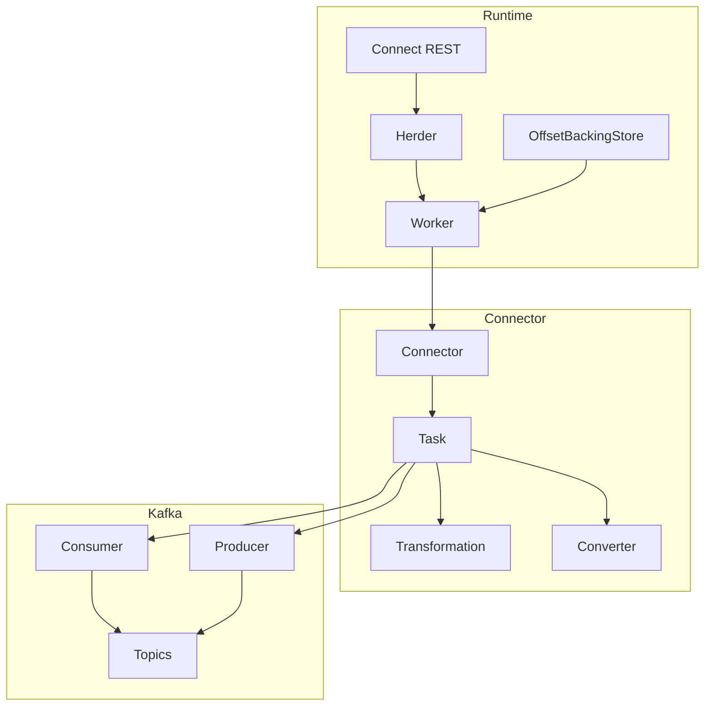
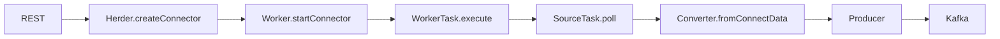
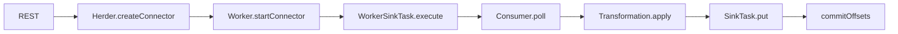
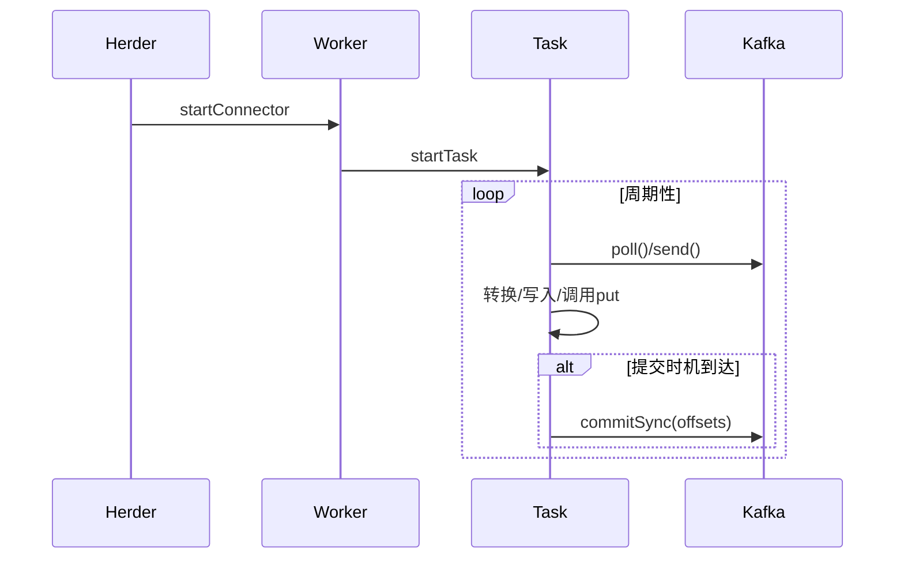
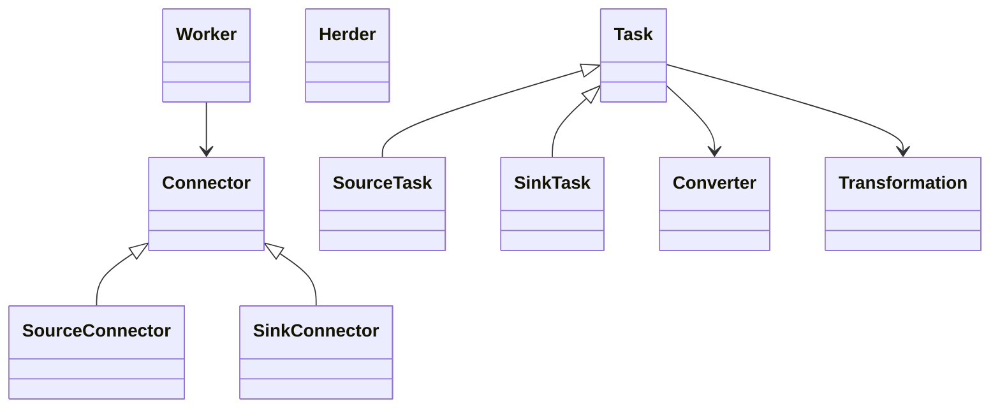

## 概述

Kafka Connect 提供可扩展的数据集成框架，支持 Source 与 Sink 连接器的分布式运行。本文补充关键函数核心代码、调用链、时序与类结构图，并合并与其它文档的相似内容，保持中性描述。

<!--more-->

## 1. 运行时组件架构



## 2. 关键函数核心代码与说明（精要）

```java
// WorkerTask 拉取与投递（Sink 任务摘要）
public void execute() {
  while (active.get()) {
    List<SinkRecord> batch = consumer.poll(batchSize, pollTimeoutMs);
    if (!batch.isEmpty()) {
      List<SinkRecord> transformed = applyTransformations(batch);
      connectorTask.put(transformed);
      commitOffsetsIfNeeded();
    }
  }
}
```

- 功能：按批拉取数据，应用变换并交给 `SinkTask.put`，按策略提交偏移量。

```java
// Source 任务轮询（摘要）
public void execute() {
  while (active.get()) {
    List<SourceRecord> records = connectorTask.poll();
    if (records != null && !records.isEmpty()) {
      List<ProducerRecord<byte[], byte[]>> serialized = convert(records);
      producer.send(serialized);
      commitSourceOffsets(records);
    }
  }
}
```

- 功能：从外部系统拉取生成 `SourceRecord`，经转换后写入 Kafka 并记录 Source 偏移。

```java
// Converter 序列化（摘要）
public byte[] fromConnectData(String topic, Schema schema, Object value) {
  if (schema == null) return serializeNull(value);
  return serializer.serialize(topic, dataConverter.convert(schema, value));
}

public Object toConnectData(String topic, byte[] value) {
  if (value == null) return null;
  return dataConverter.toConnectValue(topic, value);
}
```

- 功能：在 Connect 内部数据模型与字节表示之间转换，常见实现有 JSON/Avro/Protobuf。

```java
// 偏移存储（摘要）
public void put(ConnectorTaskId taskId, Map<ByteBuffer, ByteBuffer> offsets) {
  KafkaBasedLog log = topicLog(taskId);
  offsets.forEach((k,v) -> log.send(k, v));
}
```

- 功能：将任务偏移写入 `__consumer_offsets` 或专用偏移主题（分布式模式）。

## 3. 调用链（Source 与 Sink）





## 4. 时序图（批处理与提交）



## 5. 类结构图与继承关系（简化）



