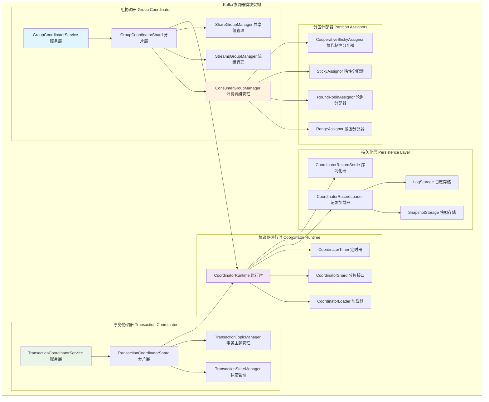
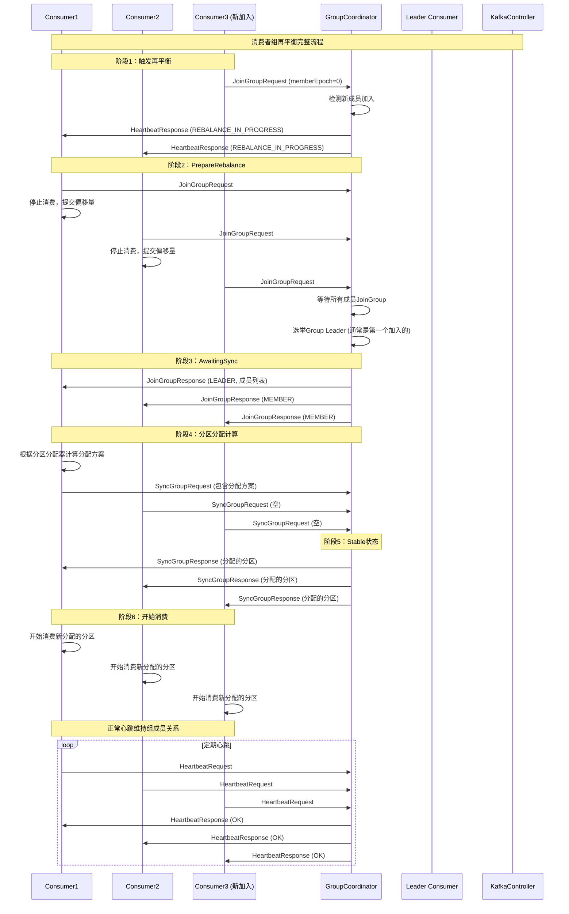
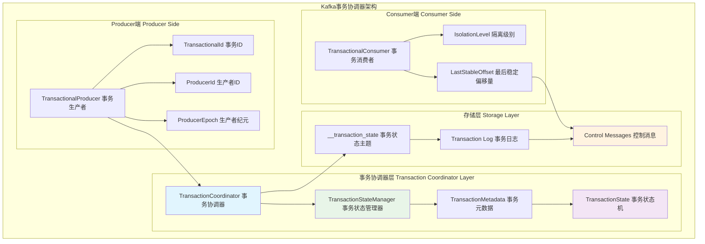
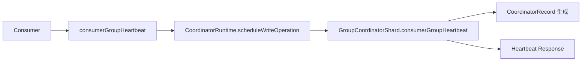
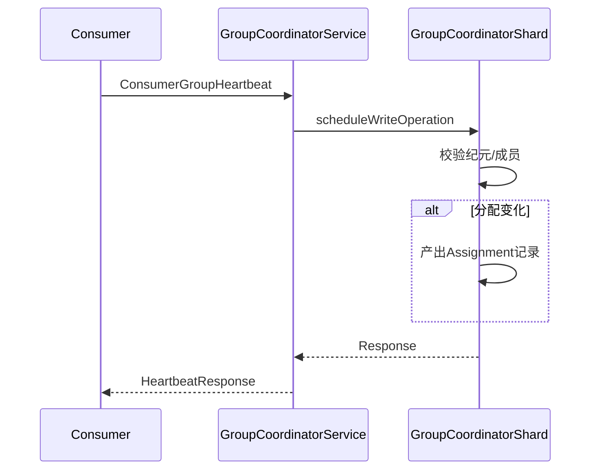
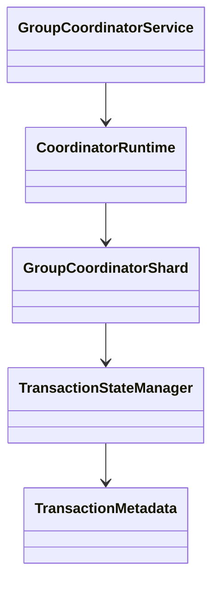

## 概述

Kafka协调器模块是实现分布式协调功能的核心组件。GroupCoordinator负责管理消费者组的成员关系和分区分配，TransactionCoordinator负责事务的协调和管理。本文协调器的内部实现，揭示其在分布式环境下保证一致性和可用性的技术机制。

<!--more-->

## 1. 协调器架构总览

### 1.1 协调器模块整体架构图



## 2. GroupCoordinator组协调器深度解析

### 2.1 消费者组再平衡完整流程



### 2.2 GroupCoordinator核心实现

```java
/**
 * GroupCoordinatorService - 组协调器服务实现
 * 管理消费者组的完整生命周期
 */
public class GroupCoordinatorService implements GroupCoordinator {
    
    private final GroupCoordinatorConfig config;                    // 配置
    private final CoordinatorRuntime<GroupCoordinatorShard, CoordinatorRecord> runtime; // 运行时
    private final GroupCoordinatorMetrics groupCoordinatorMetrics;  // 监控指标
    private final Timer timer;                                      // 定时器
    
    // 分区分配器映射
    private final Set<String> consumerGroupAssignors;              // 支持的分配器列表
    
    /**
     * 处理消费者组心跳请求
     * 实现组成员管理和再平衡触发逻辑
     */
    @Override
    public CompletableFuture<ConsumerGroupHeartbeatResponseData> consumerGroupHeartbeat(
        AuthorizableRequestContext context,
        ConsumerGroupHeartbeatRequestData request) {
        
        String groupId = request.groupId();
        String memberId = request.memberId();
        int memberEpoch = request.memberEpoch();
        
        debug("处理消费者组心跳：groupId={}, memberId={}, memberEpoch={}", 
             groupId, memberId, memberEpoch);
        
        // 验证请求参数
        throwIfConsumerGroupHeartbeatRequestIsInvalid(request, context.apiVersion());
        
        // 路由到对应的协调器分片
        return runtime.scheduleWriteOperation(
            "consumer-group-heartbeat",
            topicPartitionFor(groupId),
            coordinator -> coordinator.consumerGroupHeartbeat(context, request)
        ).thenApply(result -> {
            // 处理调度的写操作结果
            ConsumerGroupHeartbeatResponseData response = result.response();
            
            // 如果有新的定时任务，添加到定时器
            result.records().forEach(record -> {
                if (record instanceof TimerRecord) {
                    TimerRecord timerRecord = (TimerRecord) record;
                    timer.add(timerRecord);
                }
            });
            
            return response;
        }).exceptionally(throwable -> {
            error("处理消费者组心跳时发生异常", throwable);
            
            // 构建错误响应
            return new ConsumerGroupHeartbeatResponseData()
                .setErrorCode(Errors.UNKNOWN_SERVER_ERROR.code())
                .setErrorMessage("服务器内部错误");
        });
    }
    
    /**
     * 处理组加入请求（传统协议）
     * 支持旧版本消费者的组加入流程
     */
    @Override
    public CompletableFuture<JoinGroupResponseData> joinGroup(
        AuthorizableRequestContext context,
        JoinGroupRequestData request,
        BufferSupplier bufferSupplier) {
        
        String groupId = request.groupId();
        String memberId = request.memberId();
        String protocolType = request.protocolType();
        
        info("处理组加入请求：groupId={}, memberId={}, protocolType={}", 
            groupId, memberId, protocolType);
        
        return runtime.scheduleWriteOperation(
            "join-group",
            topicPartitionFor(groupId),
            coordinator -> coordinator.classicGroupJoin(context, request, bufferSupplier)
        ).thenApply(result -> {
            JoinGroupResponseData response = result.response();
            
            // 记录组加入指标
            groupCoordinatorMetrics.recordGroupJoin();
            
            return response;
        });
    }
    
    /**
     * 处理同步组请求
     * Leader消费者提交分区分配方案
     */
    @Override
    public CompletableFuture<SyncGroupResponseData> syncGroup(
        AuthorizableRequestContext context,
        SyncGroupRequestData request,
        BufferSupplier bufferSupplier) {
        
        String groupId = request.groupId();
        String memberId = request.memberId();
        int generationId = request.generationId();
        
        debug("处理同步组请求：groupId={}, memberId={}, generationId={}", 
             groupId, memberId, generationId);
        
        return runtime.scheduleWriteOperation(
            "sync-group", 
            topicPartitionFor(groupId),
            coordinator -> coordinator.classicGroupSync(context, request, bufferSupplier)
        ).thenApply(result -> {
            SyncGroupResponseData response = result.response();
            
            // 如果同步成功，组进入Stable状态
            if (response.errorCode() == Errors.NONE.code()) {
                info("组 {} 同步完成，进入Stable状态", groupId);
                groupCoordinatorMetrics.recordGroupSync();
            }
            
            return response;
        });
    }
}

/**
 * GroupCoordinatorShard - 组协调器分片实现
 * 每个分片管理一部分组的状态和元数据
 */
public class GroupCoordinatorShard implements CoordinatorShard<CoordinatorRecord> {
    
    // 组状态存储
    private final TimelineHashMap<String, ClassicGroup> classicGroups;      // 传统消费者组
    private final TimelineHashMap<String, ConsumerGroup> consumerGroups;    // 现代消费者组
    private final TimelineHashMap<String, StreamsGroup> streamsGroups;      // 流组
    private final TimelineHashMap<String, ShareGroup> shareGroups;          // 共享组
    
    // 分区分配器
    private final Map<String, ConsumerGroupPartitionAssignor> assignors;
    
    // 配置和监控
    private final GroupCoordinatorConfig config;
    private final GroupCoordinatorMetrics metrics;
    private final SnapshotRegistry snapshotRegistry;                        // 快照注册表

    /**
     * 处理消费者组心跳
     * 现代消费者协议的心跳处理逻辑
     */
    public CoordinatorResult<ConsumerGroupHeartbeatResponseData, CoordinatorRecord> consumerGroupHeartbeat(
        AuthorizableRequestContext context,
        ConsumerGroupHeartbeatRequestData request) throws ApiException {
        
        String groupId = request.groupId();
        String memberId = request.memberId();
        int memberEpoch = request.memberEpoch();
        
        // 获取或创建消费者组
        ConsumerGroup group = getOrMaybeCreateConsumerGroup(groupId, 
            request.groupInstanceId() != null);
        
        List<CoordinatorRecord> records = new ArrayList<>();
        ConsumerGroupHeartbeatResponseData response;
        
        try {
            if (memberEpoch == 0) {
                // 新成员加入流程
                response = handleConsumerGroupMemberJoin(context, request, group, records);
            } else {
                // 现有成员心跳流程
                response = handleConsumerGroupMemberHeartbeat(context, request, group, records);
            }
            
            // 检查是否需要触发再平衡
            maybeScheduleConsumerGroupRebalance(group, records);
            
            return new CoordinatorResult<>(records, response);
            
        } catch (Exception e) {
            error("处理消费者组心跳时发生异常：groupId={}, memberId={}", groupId, memberId, e);
            
            ConsumerGroupHeartbeatResponseData errorResponse = new ConsumerGroupHeartbeatResponseData()
                .setErrorCode(Errors.forException(e).code())
                .setErrorMessage(e.getMessage());
            
            return new CoordinatorResult<>(Collections.emptyList(), errorResponse);
        }
    }
    
    /**
     * 处理新成员加入
     * 实现成员注册和初始分区分配
     */
    private ConsumerGroupHeartbeatResponseData handleConsumerGroupMemberJoin(
        AuthorizableRequestContext context,
        ConsumerGroupHeartbeatRequestData request,
        ConsumerGroup group,
        List<CoordinatorRecord> records) {
        
        String groupId = request.groupId();
        String memberId = request.memberId();
        
        // 生成新的成员ID（如果需要）
        if (memberId == null || memberId.isEmpty()) {
            memberId = generateMemberId(context);
        }
        
        // 创建新的组成员
        ConsumerGroupMember newMember = new ConsumerGroupMember.Builder()
            .setMemberId(memberId)
            .setGroupInstanceId(request.groupInstanceId())
            .setRackId(request.rackId())
            .setClientId(context.clientId())
            .setClientHost(context.clientAddress().toString())
            .setSubscribedTopicNames(request.subscribedTopicNames())
            .setServerAssignor(request.serverAssignor())
            .setRebalanceTimeoutMs(request.rebalanceTimeoutMs())
            .build();
        
        // 将成员添加到组中
        group.addMember(newMember);
        
        // 生成成员加入记录
        ConsumerGroupMemberMetadataValue memberRecord = new ConsumerGroupMemberMetadataValue()
            .setMemberId(memberId)
            .setGroupInstanceId(request.groupInstanceId())
            .setClientId(context.clientId())
            .setClientHost(context.clientAddress().toString())
            .setSubscribedTopicNames(request.subscribedTopicNames())
            .setAssignedPartitions(Collections.emptyList()); // 初始无分配
        
        records.add(new CoordinatorRecord(
            new ConsumerGroupMemberMetadataKey(groupId, memberId),
            memberRecord
        ));
        
        // 触发再平衡
        group.requestRebalance("新成员加入");
        
        // 构建响应
        return new ConsumerGroupHeartbeatResponseData()
            .setMemberId(memberId)
            .setMemberEpoch(1) // 新成员从epoch 1开始
            .setHeartbeatIntervalMs(config.consumerGroupHeartbeatIntervalMs())
            .setAssignment(new ConsumerGroupHeartbeatResponseData.Assignment()
                .setAssignedPartitions(Collections.emptyList()));
    }
    
    /**
     * 处理现有成员心跳
     * 维护成员活跃状态，处理分区分配变更
     */
    private ConsumerGroupHeartbeatResponseData handleConsumerGroupMemberHeartbeat(
        AuthorizableRequestContext context,
        ConsumerGroupHeartbeatRequestData request,
        ConsumerGroup group,
        List<CoordinatorRecord> records) {
        
        String groupId = request.groupId();
        String memberId = request.memberId();
        int memberEpoch = request.memberEpoch();
        
        // 获取现有成员
        ConsumerGroupMember member = group.member(memberId);
        if (member == null) {
            throw new UnknownMemberIdException("未知的成员ID: " + memberId);
        }
        
        // 验证成员纪元
        if (memberEpoch < member.memberEpoch()) {
            throw new FencedMemberEpochException("成员纪元已过期");
        } else if (memberEpoch > member.memberEpoch()) {
            throw new UnknownMemberIdException("成员纪元超前");
        }
        
        // 更新成员最后心跳时间
        member.updateLastHeartbeat(time.milliseconds());
        
        // 检查分区分配是否有变化
        List<TopicPartition> currentAssignment = member.assignedPartitions();
        List<TopicPartition> targetAssignment = group.targetAssignment(memberId);
        
        ConsumerGroupHeartbeatResponseData response = new ConsumerGroupHeartbeatResponseData()
            .setMemberId(memberId)
            .setMemberEpoch(member.memberEpoch())
            .setHeartbeatIntervalMs(config.consumerGroupHeartbeatIntervalMs());
        
        if (!currentAssignment.equals(targetAssignment)) {
            // 分区分配有变化，更新成员分配
            member.updateAssignment(targetAssignment);
            
            // 生成分区分配更新记录
            ConsumerGroupPartitionAssignmentValue assignmentRecord = 
                new ConsumerGroupPartitionAssignmentValue()
                    .setMemberId(memberId)
                    .setAssignedPartitions(targetAssignment.stream()
                        .map(tp -> new ConsumerGroupPartitionAssignmentValue.Partition()
                            .setTopicId(getTopicId(tp.topic()))
                            .setPartitionId(tp.partition()))
                        .collect(Collectors.toList()));
            
            records.add(new CoordinatorRecord(
                new ConsumerGroupPartitionAssignmentKey(groupId, memberId),
                assignmentRecord
            ));
            
            // 设置新的分区分配
            response.setAssignment(new ConsumerGroupHeartbeatResponseData.Assignment()
                .setAssignedPartitions(targetAssignment.stream()
                    .map(tp -> new ConsumerGroupHeartbeatResponseData.Assignment.TopicPartition()
                        .setTopicId(getTopicId(tp.topic()))
                        .setPartitions(Collections.singletonList(tp.partition())))
                    .collect(Collectors.toList())));
            
            info("更新成员 {} 的分区分配：{} -> {}", memberId, currentAssignment, targetAssignment);
        }
        
        return response;
    }
    
    /**
     * 执行分区分配计算
     * 使用配置的分区分配器计算新的分区分配方案
     */
    private Map<String, List<TopicPartition>> computePartitionAssignment(
        ConsumerGroup group, 
        String assignorName) {
        
        ConsumerGroupPartitionAssignor assignor = assignors.get(assignorName);
        if (assignor == null) {
            throw new UnsupportedAssignorException("不支持的分配器: " + assignorName);
        }
        
        // 准备分配输入
        Set<String> subscribedTopics = group.subscribedTopicNames();
        Map<String, ConsumerGroupMemberSubscription> memberSubscriptions = new HashMap<>();
        
        group.members().forEach((memberId, member) -> {
            memberSubscriptions.put(memberId, new ConsumerGroupMemberSubscription()
                .setTopics(member.subscribedTopicNames())
                .setRackId(member.rackId()));
        });
        
        // 获取主题元数据
        Map<String, TopicMetadata> topicMetadata = new HashMap<>();
        subscribedTopics.forEach(topic -> {
            TopicMetadata metadata = getTopicMetadata(topic);
            if (metadata != null) {
                topicMetadata.put(topic, metadata);
            }
        });
        
        // 执行分配计算
        debug("执行分区分配计算：assignor={}, members={}, topics={}", 
             assignorName, memberSubscriptions.keySet(), subscribedTopics);
        
        ConsumerGroupPartitionAssignorContext assignmentContext = 
            new ConsumerGroupPartitionAssignorContext(
                group.groupId(),
                memberSubscriptions,
                topicMetadata
            );
        
        Map<String, ConsumerGroupMemberAssignment> memberAssignments = 
            assignor.assign(assignmentContext);
        
        // 转换为TopicPartition列表
        Map<String, List<TopicPartition>> result = new HashMap<>();
        memberAssignments.forEach((memberId, assignment) -> {
            List<TopicPartition> partitions = assignment.partitions().stream()
                .map(tp -> new TopicPartition(tp.topicId(), tp.partitionId()))
                .collect(Collectors.toList());
            result.put(memberId, partitions);
        });
        
        info("分区分配计算完成：{}", result);
        return result;
    }
    
    /**
     * 检查并调度再平衡
     * 当组状态或成员订阅发生变化时触发再平衡
     */
    private void maybeScheduleConsumerGroupRebalance(ConsumerGroup group, 
                                                   List<CoordinatorRecord> records) {
        if (group.state() != ConsumerGroupState.STABLE) {
            return; // 组不在稳定状态，无需调度再平衡
        }
        
        boolean needsRebalance = false;
        String rebalanceReason = "";
        
        // 检查各种再平衡触发条件
        if (group.hasMetadataChanged()) {
            needsRebalance = true;
            rebalanceReason = "主题元数据变更";
        } else if (group.hasMemberSubscriptionChanged()) {
            needsRebalance = true;
            rebalanceReason = "成员订阅变更";
        } else if (group.hasInactiveMembers()) {
            needsRebalance = true;
            rebalanceReason = "检测到不活跃成员";
        }
        
        if (needsRebalance) {
            info("调度组 {} 的再平衡，原因: {}", group.groupId(), rebalanceReason);
            
            // 将组状态转换为PrepareRebalance
            group.transitionTo(ConsumerGroupState.PREPARING_REBALANCE);
            
            // 生成状态变更记录
            ConsumerGroupMetadataValue groupRecord = new ConsumerGroupMetadataValue()
                .setGroupId(group.groupId())
                .setGroupState(ConsumerGroupState.PREPARING_REBALANCE.toString())
                .setStateTimestamp(time.milliseconds());
            
            records.add(new CoordinatorRecord(
                new ConsumerGroupMetadataKey(group.groupId()),
                groupRecord
            ));
            
            // 调度再平衡超时任务
            scheduleRebalanceTimeout(group, records);
        }
    }
    
    /**
     * 调度再平衡超时任务
     * 如果在指定时间内没有完成再平衡，强制完成
     */
    private void scheduleRebalanceTimeout(ConsumerGroup group, 
                                        List<CoordinatorRecord> records) {
        long timeoutMs = config.consumerGroupSessionTimeoutMs();
        long deadlineMs = time.milliseconds() + timeoutMs;
        
        // 创建定时任务记录
        ConsumerGroupRebalanceTimeoutKey timerKey = 
            new ConsumerGroupRebalanceTimeoutKey(group.groupId());
        
        TimerRecord timerRecord = new TimerRecord(
            timerKey,
            deadlineMs,
            "consumer-group-rebalance-timeout"
        );
        
        records.add(timerRecord);
        
        debug("调度组 {} 的再平衡超时任务，截止时间: {}", group.groupId(), new Date(deadlineMs));
    }
}
```

## 3. TransactionCoordinator事务协调器

### 3.1 事务协调机制架构图



### 3.2 事务状态机实现

```java
/**
 * TransactionStateManager - 事务状态管理器
 * 管理事务的完整生命周期和状态转换
 */
public class TransactionStateManager {
    
    // 事务状态枚举
    public enum TransactionState {
        EMPTY,                    // 空状态，事务尚未开始
        ONGOING,                  // 进行中，事务已开始但未结束
        PREPARE_COMMIT,           // 准备提交，开始两阶段提交的第一阶段
        PREPARE_ABORT,            // 准备中止，开始两阶段中止的第一阶段
        COMPLETE_COMMIT,          // 完成提交，事务成功提交
        COMPLETE_ABORT,           // 完成中止，事务已中止
        DEAD                      // 死亡状态，事务超时或出错
    }
    
    // 事务元数据存储
    private final ConcurrentHashMap<String, TransactionMetadata> transactionMetadataMap;
    
    // 事务状态主题分区映射
    private final int transactionTopicPartitionCount;
    private final short transactionTopicReplicationFactor;
    
    /**
     * 处理InitProducerId请求
     * 为生产者分配或更新ProducerId和ProducerEpoch
     */
    public InitProducerIdResult handleInitProducerId(String transactionalId,
                                                    int transactionTimeoutMs,
                                                    Optional<ProducerIdAndEpoch> expectedProducerIdAndEpoch) {
        
        if (transactionalId == null || transactionalId.isEmpty()) {
            // 非事务生产者，直接分配新的ProducerId
            ProducerIdAndEpoch newProducerIdAndEpoch = producerIdManager.generateProducerId();
            
            return new InitProducerIdResult(
                newProducerIdAndEpoch.producerId,
                newProducerIdAndEpoch.epoch,
                Errors.NONE
            );
        }
        
        // 事务生产者处理
        return transactionMetadataMap.compute(transactionalId, (txnId, existingMetadata) -> {
            if (existingMetadata == null) {
                // 新的事务ID，创建元数据
                ProducerIdAndEpoch newProducerIdAndEpoch = producerIdManager.generateProducerId();
                
                TransactionMetadata newMetadata = new TransactionMetadata(
                    transactionalId = txnId,
                    producerId = newProducerIdAndEpoch.producerId,
                    producerEpoch = newProducerIdAndEpoch.epoch,
                    transactionTimeoutMs = transactionTimeoutMs,
                    state = TransactionState.EMPTY,
                    partitions = new HashSet<>(),
                    txnStartTimestamp = time.milliseconds(),
                    txnLastUpdateTimestamp = time.milliseconds()
                );
                
                // 持久化事务元数据
                persistTransactionMetadata(txnId, newMetadata);
                
                info("为新事务ID {} 分配ProducerId: {}, Epoch: {}", 
                    txnId, newProducerIdAndEpoch.producerId, newProducerIdAndEpoch.epoch);
                
                return new InitProducerIdResult(
                    newProducerIdAndEpoch.producerId,
                    newProducerIdAndEpoch.epoch,
                    Errors.NONE
                );
                
            } else {
                // 现有事务ID，检查状态
                if (existingMetadata.state == TransactionState.PREPARE_COMMIT ||
                    existingMetadata.state == TransactionState.PREPARE_ABORT) {
                    // 事务正在进行两阶段提交/中止，返回错误
                    return new InitProducerIdResult(
                        RecordBatch.NO_PRODUCER_ID,
                        RecordBatch.NO_PRODUCER_EPOCH,
                        Errors.CONCURRENT_TRANSACTIONS
                    );
                }
                
                // 检查Producer纪元
                if (expectedProducerIdAndEpoch.isPresent()) {
                    ProducerIdAndEpoch expected = expectedProducerIdAndEpoch.get();
                    if (expected.producerId != existingMetadata.producerId ||
                        expected.epoch != existingMetadata.producerEpoch) {
                        // Producer信息不匹配，可能是网络分区后的重试
                        return new InitProducerIdResult(
                            RecordBatch.NO_PRODUCER_ID,
                            RecordBatch.NO_PRODUCER_EPOCH,
                            Errors.PRODUCER_FENCED
                        );
                    }
                }
                
                // 更新或递增Producer纪元
                short newEpoch = (short) (existingMetadata.producerEpoch + 1);
                if (newEpoch > Short.MAX_VALUE) {
                    // 纪元溢出，分配新的ProducerId
                    ProducerIdAndEpoch newProducerIdAndEpoch = producerIdManager.generateProducerId();
                    newEpoch = newProducerIdAndEpoch.epoch;
                    existingMetadata.producerId = newProducerIdAndEpoch.producerId;
                }
                
                existingMetadata.producerEpoch = newEpoch;
                existingMetadata.transactionTimeoutMs = transactionTimeoutMs;
                existingMetadata.state = TransactionState.EMPTY;
                existingMetadata.partitions.clear();
                existingMetadata.txnStartTimestamp = time.milliseconds();
                existingMetadata.txnLastUpdateTimestamp = time.milliseconds();
                
                // 持久化更新的元数据
                persistTransactionMetadata(txnId, existingMetadata);
                
                info("更新事务ID {} 的ProducerEpoch: {} -> {}", 
                    txnId, existingMetadata.producerEpoch - 1, newEpoch);
                
                return new InitProducerIdResult(
                    existingMetadata.producerId,
                    newEpoch,
                    Errors.NONE
                );
            }
        });
    }
    
    /**
     * 处理AddPartitionsToTxn请求
     * 将分区添加到活跃事务中
     */
    public AddPartitionsToTxnResult handleAddPartitionsToTxn(String transactionalId,
                                                            long producerId,
                                                            short producerEpoch,
                                                            Set<TopicPartition> partitions) {
        
        TransactionMetadata metadata = transactionMetadataMap.get(transactionalId);
        if (metadata == null) {
            return new AddPartitionsToTxnResult(Errors.UNKNOWN_PRODUCER_ID);
        }
        
        // 验证Producer信息
        if (metadata.producerId != producerId || metadata.producerEpoch != producerEpoch) {
            return new AddPartitionsToTxnResult(Errors.PRODUCER_FENCED);
        }
        
        synchronized (metadata) {
            // 检查事务状态
            if (metadata.state != TransactionState.EMPTY && 
                metadata.state != TransactionState.ONGOING) {
                return new AddPartitionsToTxnResult(Errors.INVALID_TXN_STATE);
            }
            
            // 转换到ONGOING状态（如果还不是）
            if (metadata.state == TransactionState.EMPTY) {
                metadata.transitionTo(TransactionState.ONGOING);
                metadata.txnStartTimestamp = time.milliseconds();
            }
            
            // 添加分区到事务
            Set<TopicPartition> newPartitions = new HashSet<>(partitions);
            newPartitions.removeAll(metadata.partitions); // 移除已存在的分区
            
            if (!newPartitions.isEmpty()) {
                metadata.partitions.addAll(newPartitions);
                metadata.txnLastUpdateTimestamp = time.milliseconds();
                
                // 持久化事务元数据
                persistTransactionMetadata(transactionalId, metadata);
                
                info("向事务 {} 添加分区：{}", transactionalId, newPartitions);
            }
            
            return new AddPartitionsToTxnResult(Errors.NONE);
        }
    }
    
    /**
     * 处理EndTxn请求
     * 实现两阶段提交协议完成事务
     */
    public EndTxnResult handleEndTxn(String transactionalId,
                                   long producerId,
                                   short producerEpoch,
                                   TransactionResult result) {
        
        TransactionMetadata metadata = transactionMetadataMap.get(transactionalId);
        if (metadata == null) {
            return new EndTxnResult(Errors.UNKNOWN_PRODUCER_ID);
        }
        
        // 验证Producer信息
        if (metadata.producerId != producerId || metadata.producerEpoch != producerEpoch) {
            return new EndTxnResult(Errors.PRODUCER_FENCED);
        }
        
        synchronized (metadata) {
            // 检查事务状态
            if (metadata.state != TransactionState.ONGOING) {
                return new EndTxnResult(Errors.INVALID_TXN_STATE);
            }
            
            try {
                if (result == TransactionResult.COMMIT) {
                    // 开始两阶段提交
                    return handleCommitTransaction(metadata);
                } else {
                    // 开始两阶段中止
                    return handleAbortTransaction(metadata);
                }
            } catch (Exception e) {
                error("处理事务结束时发生异常：transactionalId={}", transactionalId, e);
                return new EndTxnResult(Errors.UNKNOWN_SERVER_ERROR);
            }
        }
    }
    
    /**
     * 处理事务提交
     * 实现两阶段提交协议的提交阶段
     */
    private EndTxnResult handleCommitTransaction(TransactionMetadata metadata) {
        String transactionalId = metadata.transactionalId;
        
        info("开始提交事务：{}, 涉及分区：{}", transactionalId, metadata.partitions);
        
        // 第一阶段：准备提交
        metadata.transitionTo(TransactionState.PREPARE_COMMIT);
        metadata.txnLastUpdateTimestamp = time.milliseconds();
        
        // 持久化准备提交状态
        persistTransactionMetadata(transactionalId, metadata);
        
        // 第二阶段：写入控制消息到各个分区
        List<CompletableFuture<Void>> writeFutures = new ArrayList<>();
        
        for (TopicPartition partition : metadata.partitions) {
            CompletableFuture<Void> future = writeTransactionControlMessage(
                partition, 
                metadata.producerId, 
                metadata.producerEpoch,
                ControlRecordType.COMMIT
            );
            writeFutures.add(future);
        }
        
        // 等待所有控制消息写入完成
        CompletableFuture<Void> allWrites = CompletableFuture.allOf(
            writeFutures.toArray(new CompletableFuture[0]));
        
        allWrites.whenComplete((result, exception) -> {
            synchronized (metadata) {
                if (exception == null) {
                    // 所有分区写入成功，完成提交
                    metadata.transitionTo(TransactionState.COMPLETE_COMMIT);
                    info("事务 {} 提交成功", transactionalId);
                } else {
                    // 写入失败，事务进入错误状态
                    error("事务 {} 提交失败", transactionalId, exception);
                    metadata.transitionTo(TransactionState.DEAD);
                }
                
                metadata.txnLastUpdateTimestamp = time.milliseconds();
                persistTransactionMetadata(transactionalId, metadata);
            }
        });
        
        return new EndTxnResult(Errors.NONE);
    }
    
    /**
     * 写入事务控制消息
     * 向指定分区写入COMMIT或ABORT控制消息
     */
    private CompletableFuture<Void> writeTransactionControlMessage(TopicPartition partition,
                                                                  long producerId,
                                                                  short producerEpoch,
                                                                  ControlRecordType controlType) {
        
        return CompletableFuture.runAsync(() -> {
            try {
                // 构建控制消息
                ByteBuffer controlMessageKey = ControlRecordType.serialize(controlType);
                ByteBuffer controlMessageValue = ByteBuffer.allocate(0); // 控制消息值为空
                
                MemoryRecords controlRecords = MemoryRecords.withControlRecords(
                    producerId,
                    producerEpoch,
                    controlMessageKey,
                    controlMessageValue
                );
                
                // 写入到分区
                replicaManager.appendRecords(
                    timeout = config.requestTimeoutMs(),
                    requiredAcks = -1, // 需要所有ISR确认
                    internalTopicsAllowed = true,
                    origin = AppendOrigin.Coordinator,
                    entriesPerPartition = Map.of(partition -> controlRecords),
                    responseCallback = (responses) -> {
                        PartitionResponse response = responses.get(partition);
                        if (response.error != Errors.NONE) {
                            throw new RuntimeException("写入控制消息失败: " + response.error);
                        }
                        
                        debug("成功写入 {} 控制消息到分区 {}", controlType, partition);
                    }
                );
                
            } catch (Exception e) {
                error("写入控制消息失败：partition={}, controlType={}", partition, controlType, e);
                throw new RuntimeException(e);
            }
        }, transactionExecutor);
    }
    
    /**
     * 事务超时处理
     * 定期检查并处理超时的事务
     */
    public void handleTransactionTimeout() {
        long currentTimeMs = time.milliseconds();
        
        List<String> expiredTransactions = new ArrayList<>();
        
        transactionMetadataMap.forEach((transactionalId, metadata) -> {
            synchronized (metadata) {
                long transactionDurationMs = currentTimeMs - metadata.txnStartTimestamp;
                
                if (transactionDurationMs > metadata.transactionTimeoutMs) {
                    expiredTransactions.add(transactionalId);
                    
                    warn("事务 {} 超时，持续时间: {} ms，超时阈值: {} ms", 
                        transactionalId, transactionDurationMs, metadata.transactionTimeoutMs);
                }
            }
        });
        
        // 中止过期的事务
        for (String transactionalId : expiredTransactions) {
            try {
                forceAbortTransaction(transactionalId, "事务超时");
            } catch (Exception e) {
                error("强制中止超时事务失败：{}", transactionalId, e);
            }
        }
        
        if (!expiredTransactions.isEmpty()) {
            info("处理了 {} 个超时事务", expiredTransactions.size());
        }
    }
    
    /**
     * 强制中止事务
     * 由于超时或其他异常情况强制中止事务
     */
    private void forceAbortTransaction(String transactionalId, String reason) {
        TransactionMetadata metadata = transactionMetadataMap.get(transactionalId);
        if (metadata == null) {
            return;
        }
        
        synchronized (metadata) {
            info("强制中止事务 {}，原因: {}", transactionalId, reason);
            
            // 转换到准备中止状态
            metadata.transitionTo(TransactionState.PREPARE_ABORT);
            metadata.txnLastUpdateTimestamp = time.milliseconds();
            
            // 持久化状态变更
            persistTransactionMetadata(transactionalId, metadata);
            
            // 写入中止控制消息到所有分区
            List<CompletableFuture<Void>> abortFutures = new ArrayList<>();
            
            for (TopicPartition partition : metadata.partitions) {
                CompletableFuture<Void> future = writeTransactionControlMessage(
                    partition,
                    metadata.producerId,
                    metadata.producerEpoch,
                    ControlRecordType.ABORT
                );
                abortFutures.add(future);
            }
            
            // 等待所有中止消息写入完成
            CompletableFuture.allOf(abortFutures.toArray(new CompletableFuture[0]))
                .whenComplete((result, exception) -> {
                    synchronized (metadata) {
                        metadata.transitionTo(TransactionState.COMPLETE_ABORT);
                        metadata.txnLastUpdateTimestamp = time.milliseconds();
                        persistTransactionMetadata(transactionalId, metadata);
                        
                        info("事务 {} 强制中止完成", transactionalId);
                    }
                });
        }
    }
    
    /**
     * 持久化事务元数据
     * 将事务状态写入__transaction_state主题
     */
    private void persistTransactionMetadata(String transactionalId, TransactionMetadata metadata) {
        try {
            // 序列化事务元数据
            ByteBuffer key = TransactionMetadataKey.serialize(transactionalId);
            ByteBuffer value = TransactionMetadataValue.serialize(metadata);
            
            MemoryRecords record = MemoryRecords.withRecords(
                CompressionType.NONE,
                new SimpleRecord(key.array(), value.array())
            );
            
            // 计算事务状态主题的分区
            int partition = Utils.abs(transactionalId.hashCode()) % transactionTopicPartitionCount;
            TopicPartition txnTopicPartition = new TopicPartition(
                Topic.TRANSACTION_STATE_TOPIC_NAME, partition);
            
            // 写入事务状态主题
            replicaManager.appendRecords(
                timeout = config.requestTimeoutMs(),
                requiredAcks = -1, // 需要所有ISR确认
                internalTopicsAllowed = true,
                origin = AppendOrigin.Coordinator,
                entriesPerPartition = Map.of(txnTopicPartition -> record),
                responseCallback = (responses) -> {
                    PartitionResponse response = responses.get(txnTopicPartition);
                    if (response.error != Errors.NONE) {
                        throw new RuntimeException("持久化事务元数据失败: " + response.error);
                    }
                    
                    debug("成功持久化事务元数据：transactionalId={}", transactionalId);
                }
            );
            
        } catch (Exception e) {
            error("持久化事务元数据失败：transactionalId={}", transactionalId, e);
            throw new RuntimeException(e);
        }
    }
}

/**
 * TransactionMetadata - 事务元数据
 * 维护单个事务的完整状态信息
 */
public class TransactionMetadata {
    
    public final String transactionalId;           // 事务ID
    public volatile long producerId;               // 生产者ID
    public volatile short producerEpoch;           // 生产者纪元
    public volatile int transactionTimeoutMs;      // 事务超时时间
    public volatile TransactionState state;        // 事务状态
    public final Set<TopicPartition> partitions;   // 参与事务的分区
    public volatile long txnStartTimestamp;        // 事务开始时间
    public volatile long txnLastUpdateTimestamp;   // 最后更新时间
    
    // 状态转换锁
    private final ReentrantLock stateLock = new ReentrantLock();
    
    /**
     * 事务状态转换
     * 确保状态转换的合法性和一致性
     */
    public void transitionTo(TransactionState newState) {
        stateLock.lock();
        try {
            TransactionState currentState = this.state;
            
            // 验证状态转换的合法性
            if (!isValidStateTransition(currentState, newState)) {
                throw new IllegalStateException(
                    String.format("非法的事务状态转换：%s -> %s", currentState, newState));
            }
            
            debug("事务 {} 状态转换：{} -> {}", transactionalId, currentState, newState);
            
            this.state = newState;
            this.txnLastUpdateTimestamp = System.currentTimeMillis();
            
        } finally {
            stateLock.unlock();
        }
    }
    
    /**
     * 验证状态转换的合法性
     */
    private boolean isValidStateTransition(TransactionState from, TransactionState to) {
        switch (from) {
            case EMPTY:
                return to == TransactionState.ONGOING;
            case ONGOING:
                return to == TransactionState.PREPARE_COMMIT || 
                       to == TransactionState.PREPARE_ABORT ||
                       to == TransactionState.DEAD;
            case PREPARE_COMMIT:
                return to == TransactionState.COMPLETE_COMMIT ||
                       to == TransactionState.DEAD;
            case PREPARE_ABORT:
                return to == TransactionState.COMPLETE_ABORT ||
                       to == TransactionState.DEAD;
            case COMPLETE_COMMIT:
            case COMPLETE_ABORT:
                return to == TransactionState.EMPTY ||
                       to == TransactionState.DEAD;
            case DEAD:
                return to == TransactionState.EMPTY;
            default:
                return false;
        }
    }
    
    /**
     * 检查事务是否可以提交
     */
    public boolean canCommit() {
        stateLock.lock();
        try {
            return state == TransactionState.ONGOING && !partitions.isEmpty();
        } finally {
            stateLock.unlock();
        }
    }
    
    /**
     * 检查事务是否已超时
     */
    public boolean isExpired(long currentTimeMs) {
        return currentTimeMs - txnStartTimestamp > transactionTimeoutMs;
    }
}
```

## 4. 分区分配器深度实现

### 4.1 分区分配算法对比

```java
/**
 * 分区分配器实现对比分析
 * 展示不同分配算法的特点和适用场景
 */
public class PartitionAssignors {
    
    /**
     * RangeAssignor - 范围分配器
     * 按主题分别进行范围分配，可能导致分配不均
     */
    public static class RangeAssignor implements ConsumerGroupPartitionAssignor {
        
        @Override
        public String name() {
            return "range";
        }
        
        @Override
        public Map<String, ConsumerGroupMemberAssignment> assign(
            ConsumerGroupPartitionAssignorContext context) {
            
            Map<String, List<String>> topicToMembers = new HashMap<>();
            Map<String, ConsumerGroupMemberAssignment> assignments = new HashMap<>();
            
            // 按主题分组成员
            context.memberSubscriptions().forEach((memberId, subscription) -> {
                subscription.topics().forEach(topic -> {
                    topicToMembers.computeIfAbsent(topic, k -> new ArrayList<>()).add(memberId);
                });
                
                // 初始化分配结果
                assignments.put(memberId, new ConsumerGroupMemberAssignment()
                    .setPartitions(new ArrayList<>()));
            });
            
            // 为每个主题执行范围分配
            topicToMembers.forEach((topic, members) -> {
                // 获取主题的分区信息
                TopicMetadata topicMetadata = context.topicMetadata().get(topic);
                if (topicMetadata == null) {
                    return;
                }
                
                int partitionCount = topicMetadata.numPartitions();
                int memberCount = members.size();
                
                // 排序成员以保证一致性
                List<String> sortedMembers = members.stream().sorted().collect(Collectors.toList());
                
                // 计算每个成员应分配的分区数
                int partitionsPerMember = partitionCount / memberCount;
                int extraPartitions = partitionCount % memberCount;
                
                debug("主题 {} 范围分配：{} 个分区分配给 {} 个成员", 
                     topic, partitionCount, memberCount);
                
                int currentPartition = 0;
                for (int i = 0; i < sortedMembers.size(); i++) {
                    String memberId = sortedMembers.get(i);
                    
                    // 前几个成员多分配一个分区（如果有余数）
                    int numPartitionsForMember = partitionsPerMember + (i < extraPartitions ? 1 : 0);
                    
                    // 分配连续的分区范围
                    for (int j = 0; j < numPartitionsForMember; j++) {
                        assignments.get(memberId).partitions().add(
                            new ConsumerGroupMemberAssignment.TopicPartition()
                                .setTopicId(topicMetadata.topicId())
                                .setPartitions(Collections.singletonList(currentPartition))
                        );
                        currentPartition++;
                    }
                    
                    debug("成员 {} 分配到主题 {} 的分区 {} - {}", 
                         memberId, topic, 
                         currentPartition - numPartitionsForMember, 
                         currentPartition - 1);
                }
            });
            
            return assignments;
        }
    }
    
    /**
     * StickyAssignor - 粘性分配器
     * 在再平衡时尽量保持现有分配，减少数据迁移
     */
    public static class StickyAssignor implements ConsumerGroupPartitionAssignor {
        
        @Override
        public String name() {
            return "sticky";
        }
        
        @Override
        public Map<String, ConsumerGroupMemberAssignment> assign(
            ConsumerGroupPartitionAssignorContext context) {
            
            Map<String, List<TopicPartition>> currentAssignments = getCurrentAssignments(context);
            Map<String, Set<String>> memberSubscriptions = getMemberSubscriptions(context);
            Set<TopicPartition> allPartitions = getAllPartitions(context);
            
            debug("粘性分配开始：当前分配={}, 成员订阅={}, 总分区={}", 
                 currentAssignments.size(), memberSubscriptions.size(), allPartitions.size());
            
            // 第一步：保留有效的现有分配
            Map<String, List<TopicPartition>> newAssignments = new HashMap<>();
            Set<TopicPartition> unassignedPartitions = new HashSet<>(allPartitions);
            
            currentAssignments.forEach((memberId, partitions) -> {
                if (memberSubscriptions.containsKey(memberId)) {
                    List<TopicPartition> validPartitions = partitions.stream()
                        .filter(tp -> memberSubscriptions.get(memberId).contains(tp.topic()))
                        .collect(Collectors.toList());
                    
                    newAssignments.put(memberId, validPartitions);
                    unassignedPartitions.removeAll(validPartitions);
                    
                    debug("成员 {} 保留 {} 个现有分区分配", memberId, validPartitions.size());
                }
            });
            
            // 第二步：分配未分配的分区
            List<String> sortedMembers = memberSubscriptions.keySet().stream()
                .sorted().collect(Collectors.toList());
            
            for (TopicPartition partition : unassignedPartitions) {
                // 找到订阅了该主题且分区数最少的成员
                String targetMember = sortedMembers.stream()
                    .filter(memberId -> memberSubscriptions.get(memberId).contains(partition.topic()))
                    .min(Comparator.comparingInt(memberId -> 
                        newAssignments.getOrDefault(memberId, Collections.emptyList()).size()))
                    .orElse(null);
                
                if (targetMember != null) {
                    newAssignments.computeIfAbsent(targetMember, k -> new ArrayList<>())
                        .add(partition);
                    
                    debug("将未分配分区 {} 分配给成员 {}", partition, targetMember);
                }
            }
            
            // 第三步：平衡分配（如果需要）
            balanceAssignments(newAssignments, memberSubscriptions, context);
            
            // 转换为协调器期望的格式
            return convertToMemberAssignments(newAssignments, context);
        }
        
        /**
         * 平衡分区分配
         * 确保分配尽可能均匀
         */
        private void balanceAssignments(Map<String, List<TopicPartition>> assignments,
                                      Map<String, Set<String>> subscriptions,
                                      ConsumerGroupPartitionAssignorContext context) {
            
            boolean changed = true;
            int iterations = 0;
            int maxIterations = assignments.size() * 10; // 防止无限循环
            
            while (changed && iterations < maxIterations) {
                changed = false;
                iterations++;
                
                // 计算理想的平均分配数
                int totalPartitions = assignments.values().stream()
                    .mapToInt(List::size).sum();
                double avgPartitionsPerMember = (double) totalPartitions / assignments.size();
                
                // 找出分配过多和过少的成员
                List<String> overloadedMembers = new ArrayList<>();
                List<String> underloadedMembers = new ArrayList<>();
                
                assignments.forEach((memberId, partitions) -> {
                    int memberPartitionCount = partitions.size();
                    if (memberPartitionCount > Math.ceil(avgPartitionsPerMember)) {
                        overloadedMembers.add(memberId);
                    } else if (memberPartitionCount < Math.floor(avgPartitionsPerMember)) {
                        underloadedMembers.add(memberId);
                    }
                });
                
                // 从过载成员向不足成员转移分区
                for (String overloadedMember : overloadedMembers) {
                    if (underloadedMembers.isEmpty()) {
                        break;
                    }
                    
                    List<TopicPartition> partitions = assignments.get(overloadedMember);
                    if (partitions.size() <= Math.ceil(avgPartitionsPerMember)) {
                        continue;
                    }
                    
                    // 选择一个可转移的分区
                    TopicPartition partitionToTransfer = partitions.get(partitions.size() - 1);
                    
                    // 找到可以接收该分区的不足成员
                    String targetMember = underloadedMembers.stream()
                        .filter(memberId -> subscriptions.get(memberId).contains(partitionToTransfer.topic()))
                        .findFirst()
                        .orElse(null);
                    
                    if (targetMember != null) {
                        // 执行转移
                        partitions.remove(partitionToTransfer);
                        assignments.get(targetMember).add(partitionToTransfer);
                        
                        changed = true;
                        
                        debug("将分区 {} 从成员 {} 转移到成员 {}", 
                             partitionToTransfer, overloadedMember, targetMember);
                        
                        // 检查目标成员是否仍需要更多分区
                        if (assignments.get(targetMember).size() >= Math.floor(avgPartitionsPerMember)) {
                            underloadedMembers.remove(targetMember);
                        }
                    }
                }
            }
            
            debug("分区平衡完成，执行了 {} 次迭代", iterations);
        }
    }
    
    /**
     * CooperativeStickyAssignor - 协作粘性分配器
     * 支持增量再平衡，减少分区迁移的影响
     */
    public static class CooperativeStickyAssignor extends StickyAssignor {
        
        @Override
        public String name() {
            return "cooperative-sticky";
        }
        
        /**
         * 执行协作再平衡
         * 分多轮进行，每轮只迁移部分分区
         */
        @Override
        public Map<String, ConsumerGroupMemberAssignment> assign(
            ConsumerGroupPartitionAssignorContext context) {
            
            Map<String, List<TopicPartition>> currentAssignments = getCurrentAssignments(context);
            Map<String, List<TopicPartition>> idealAssignments = super.assign(context);
            
            // 计算需要迁移的分区
            Map<String, Set<TopicPartition>> partitionsToRevoke = new HashMap<>();
            Map<String, Set<TopicPartition>> partitionsToAssign = new HashMap<>();
            
            // 分析分配变化
            currentAssignments.forEach((memberId, currentPartitions) -> {
                List<TopicPartition> idealPartitions = idealAssignments.getOrDefault(memberId, Collections.emptyList());
                
                // 需要撤销的分区
                Set<TopicPartition> toRevoke = new HashSet<>(currentPartitions);
                toRevoke.removeAll(idealPartitions);
                if (!toRevoke.isEmpty()) {
                    partitionsToRevoke.put(memberId, toRevoke);
                }
                
                // 需要新分配的分区
                Set<TopicPartition> toAssign = new HashSet<>(idealPartitions);
                toAssign.removeAll(currentPartitions);
                if (!toAssign.isEmpty()) {
                    partitionsToAssign.put(memberId, toAssign);
                }
            });
            
            // 如果变化较大，分批次进行
            int totalChanges = partitionsToRevoke.values().stream().mapToInt(Set::size).sum() +
                              partitionsToAssign.values().stream().mapToInt(Set::size).sum();
            
            if (totalChanges > context.memberSubscriptions().size()) {
                // 变化较大，采用渐进式再平衡
                return performIncrementalRebalance(currentAssignments, idealAssignments, context);
            } else {
                // 变化较小，直接应用新分配
                return convertToMemberAssignments(idealAssignments, context);
            }
        }
        
        /**
         * 执行渐进式再平衡
         * 将大的分配变更分解为多个小步骤
         */
        private Map<String, ConsumerGroupMemberAssignment> performIncrementalRebalance(
            Map<String, List<TopicPartition>> current,
            Map<String, List<TopicPartition>> target,
            ConsumerGroupPartitionAssignorContext context) {
            
            Map<String, List<TopicPartition>> incrementalAssignments = new HashMap<>(current);
            
            // 计算本轮可以迁移的分区数（限制为总变更的1/3）
            int maxChangesThisRound = Math.max(1, 
                (int) (context.memberSubscriptions().size() * 0.33));
            
            int changesApplied = 0;
            
            // 优先处理分区撤销（为新分配腾出空间）
            for (Map.Entry<String, List<TopicPartition>> entry : target.entrySet()) {
                String memberId = entry.getKey();
                List<TopicPartition> targetPartitions = entry.getValue();
                List<TopicPartition> currentPartitions = incrementalAssignments.getOrDefault(
                    memberId, Collections.emptyList());
                
                // 计算需要撤销的分区
                List<TopicPartition> toRevoke = currentPartitions.stream()
                    .filter(tp -> !targetPartitions.contains(tp))
                    .limit(maxChangesThisRound - changesApplied)
                    .collect(Collectors.toList());
                
                if (!toRevoke.isEmpty()) {
                    List<TopicPartition> newAssignment = new ArrayList<>(currentPartitions);
                    newAssignment.removeAll(toRevoke);
                    incrementalAssignments.put(memberId, newAssignment);
                    
                    changesApplied += toRevoke.size();
                    
                    info("渐进式再平衡：从成员 {} 撤销分区 {}", memberId, toRevoke);
                    
                    if (changesApplied >= maxChangesThisRound) {
                        break;
                    }
                }
            }
            
            info("渐进式再平衡本轮完成，应用了 {} 个变更", changesApplied);
            
            return convertToMemberAssignments(incrementalAssignments, context);
        }
    }
}
```

## 5. 监控与故障恢复

### 5.1 协调器监控指标

```java
/**
 * GroupCoordinatorMetrics - 组协调器监控指标
 * 提供详细的组管理和再平衡性能监控
 */
public class GroupCoordinatorMetrics extends KafkaMetricsGroup {
    
    // 组管理指标
    private final Sensor groupCreationRate;           // 组创建速率
    private final Sensor groupDeletionRate;           // 组删除速率
    private final Sensor activeGroupCount;            // 活跃组数量
    private final Sensor memberJoinRate;              // 成员加入速率
    private final Sensor memberLeaveRate;             // 成员离开速率
    
    // 再平衡指标
    private final Sensor rebalanceRate;               // 再平衡速率
    private final Histogram rebalanceDuration;        // 再平衡持续时间
    private final Sensor rebalanceFailureRate;        // 再平衡失败率
    
    // 心跳指标
    private final Sensor heartbeatRate;               // 心跳速率
    private final Histogram heartbeatLatency;         // 心跳延迟
    
    // 分区分配指标
    private final Histogram assignmentComputeTime;    // 分配计算时间
    private final Sensor assignmentChangeRate;        // 分配变更率

    public GroupCoordinatorMetrics(Metrics metrics) {
        String groupName = "group-coordinator-metrics";
        
        // 初始化组管理指标
        MetricName creationRateMetricName = metrics.metricName("group-creation-rate", groupName, 
            "每秒创建的消费者组数");
        groupCreationRate = metrics.sensor("group-creation-rate");
        groupCreationRate.add(creationRateMetricName, new Rate());
        
        MetricName activeGroupCountMetricName = metrics.metricName("active-group-count", groupName, 
            "当前活跃的消费者组数量");
        activeGroupCount = metrics.sensor("active-group-count");
        activeGroupCount.add(activeGroupCountMetricName, new Value());
        
        // 初始化再平衡指标
        MetricName rebalanceRateMetricName = metrics.metricName("rebalance-rate", groupName, 
            "每秒再平衡次数");
        rebalanceRate = metrics.sensor("rebalance-rate");
        rebalanceRate.add(rebalanceRateMetricName, new Rate());
        
        MetricName rebalanceDurationMetricName = metrics.metricName("rebalance-duration-avg", groupName, 
            "再平衡平均持续时间（毫秒）");
        rebalanceDuration = metrics.histogram("rebalance-duration");
        rebalanceDuration.add(rebalanceDurationMetricName, new Avg());
    }
    
    /**
     * 记录再平衡事件
     */
    public void recordRebalance(long durationMs, boolean success) {
        rebalanceRate.record();
        rebalanceDuration.record(durationMs);
        
        if (!success) {
            rebalanceFailureRate.record();
        }
    }
    
    /**
     * 记录组创建事件
     */
    public void recordGroupCreation() {
        groupCreationRate.record();
    }
    
    /**
     * 更新活跃组数量
     */
    public void updateActiveGroupCount(int count) {
        activeGroupCount.record(count);
    }
}

/**
 * 协调器故障恢复机制
 */
public class CoordinatorFailureRecovery {
    
    /**
     * 协调器故障转移处理
     * 当协调器所在Broker失效时的处理逻辑
     */
    public static class CoordinatorFailover {
        
        /**
         * 处理协调器迁移
         * 将组协调器从失效的Broker迁移到新的Broker
         */
        public void handleCoordinatorMigration(List<String> affectedGroups, 
                                             int newCoordinatorBrokerId) {
            
            info("开始协调器迁移，受影响的组数量: {}, 新协调器: {}", 
                affectedGroups.size(), newCoordinatorBrokerId);
            
            for (String groupId : affectedGroups) {
                try {
                    // 从__consumer_offsets主题恢复组状态
                    ConsumerGroupMetadata groupMetadata = loadGroupMetadataFromLog(groupId);
                    
                    if (groupMetadata != null) {
                        // 重建组状态
                        rebuildGroupState(groupId, groupMetadata, newCoordinatorBrokerId);
                        
                        // 通知所有成员重新发现协调器
                        notifyMembersOfCoordinatorChange(groupId, newCoordinatorBrokerId);
                        
                        debug("成功迁移组 {} 到新协调器 {}", groupId, newCoordinatorBrokerId);
                    }
                    
                } catch (Exception e) {
                    error("迁移组 {} 失败", groupId, e);
                }
            }
            
            info("协调器迁移完成");
        }
        
        /**
         * 从日志恢复组元数据
         */
        private ConsumerGroupMetadata loadGroupMetadataFromLog(String groupId) {
            try {
                // 计算组对应的__consumer_offsets分区
                int partition = Utils.abs(groupId.hashCode()) % config.offsetsTopicNumPartitions();
                TopicPartition offsetsPartition = new TopicPartition(
                    Topic.GROUP_METADATA_TOPIC_NAME, partition);
                
                // 读取分区中的所有记录
                UnifiedLog offsetsLog = logManager.getLog(offsetsPartition);
                if (offsetsLog == null) {
                    warn("__consumer_offsets分区 {} 不存在", partition);
                    return null;
                }
                
                // 扫描日志找到组相关的记录
                ConsumerGroupMetadata.Builder metadataBuilder = new ConsumerGroupMetadata.Builder()
                    .setGroupId(groupId);
                
                long startOffset = offsetsLog.logStartOffset();
                long endOffset = offsetsLog.logEndOffset();
                
                for (long offset = startOffset; offset < endOffset; offset += 1000) {
                    FetchDataInfo fetchInfo = offsetsLog.read(offset, 64 * 1024, 
                        FetchIsolation.FETCH_LOG_END, false);
                    
                    for (RecordBatch batch : fetchInfo.records.batches()) {
                        for (Record record : batch) {
                            // 解析组元数据记录
                            if (isGroupMetadataRecord(record, groupId)) {
                                updateGroupMetadataFromRecord(metadataBuilder, record);
                            }
                        }
                    }
                }
                
                return metadataBuilder.build();
                
            } catch (Exception e) {
                error("从日志恢复组 {} 的元数据失败", groupId, e);
                return null;
            }
        }
        
        /**
         * 重建组状态
         * 在新的协调器上重建组的完整状态
         */
        private void rebuildGroupState(String groupId, 
                                     ConsumerGroupMetadata metadata, 
                                     int coordinatorBrokerId) {
            
            // 创建新的组对象
            ConsumerGroup rebuiltGroup = new ConsumerGroup(
                groupId = groupId,
                state = metadata.state(),
                members = metadata.members(),
                assignmentStrategy = metadata.assignmentStrategy(),
                generation = metadata.generation()
            );
            
            // 注册到新的协调器
            GroupCoordinatorShard coordinatorShard = getCoordinatorShard(coordinatorBrokerId);
            coordinatorShard.addGroup(rebuiltGroup);
            
            // 如果组处于再平衡状态，继续再平衡流程
            if (rebuiltGroup.state() == ConsumerGroupState.PREPARING_REBALANCE) {
                scheduleRebalanceCompletion(rebuiltGroup);
            }
            
            info("在协调器 {} 上重建组 {} 状态完成", coordinatorBrokerId, groupId);
        }
    }
}
```

## 6. 总结

Kafka协调器模块通过精心设计的分布式协调机制，实现了可靠的组管理和事务支持：

### 6.1 核心设计优势

- **分片化管理**：通过分片将协调器负载分散到多个Broker
- **状态机设计**：清晰的状态转换保证操作的一致性和可预测性
- **持久化存储**：使用内部主题持久化协调器状态，支持故障恢复
- **增量再平衡**：协作式分配器减少再平衡对消费的影响

### 6.2 事务协调亮点

- **两阶段提交**：确保跨分区事务的ACID特性
- **Producer隔离**：通过ProducerId和Epoch实现Producer隔离
- **超时管理**：自动检测和处理超时事务
- **控制消息**：使用特殊控制消息标记事务边界

### 6.3 性能优化特性

- **批量操作**：减少协调器操作的网络开销
- **智能分配**：多种分配算法适应不同场景需求
- **故障快速恢复**：协调器迁移机制保证高可用性

通过深入理解协调器的实现原理，我们能够更好地设计分布式应用，合理配置消费者组，充分利用Kafka的协调功能。

## 7. 关键函数与调用链（补充）

- 说明：聚焦组与事务两条关键路径的函数级代码、调用链与时序补充，便于与Broker/Client两侧联动排障。

### 7.1 关键函数核心代码与说明（精要）

```java
// 组心跳入口（服务层摘要）
public CompletableFuture<ConsumerGroupHeartbeatResponseData> consumerGroupHeartbeat(
    AuthorizableRequestContext context,
    ConsumerGroupHeartbeatRequestData request) {
  return runtime.scheduleWriteOperation(
    "consumer-group-heartbeat", topicPartitionFor(request.groupId()),
    coord -> coord.consumerGroupHeartbeat(context, request)
  ).thenApply(CoordinatorResult::response);
}
```

- 功能：将心跳写操作调度到对应分片，返回协调后的应答。

```java
// 分片：现有成员心跳（摘要）
private ConsumerGroupHeartbeatResponseData handleConsumerGroupMemberHeartbeat(
  AuthorizableRequestContext ctx,
  ConsumerGroupHeartbeatRequestData req,
  ConsumerGroup group,
  List<CoordinatorRecord> records) {
  ConsumerGroupMember member = group.member(req.memberId());
  if (member == null) throw new UnknownMemberIdException("unknown member");
  if (req.memberEpoch() < member.memberEpoch()) throw new FencedMemberEpochException("fenced");
  member.updateLastHeartbeat(time.milliseconds());
  List<TopicPartition> target = group.targetAssignment(req.memberId());
  if (!member.assignedPartitions().equals(target)) {
    member.updateAssignment(target);
    records.add(buildAssignmentRecord(group.groupId(), req.memberId(), target));
  }
  return new ConsumerGroupHeartbeatResponseData()
    .setMemberId(req.memberId())
    .setMemberEpoch(member.memberEpoch())
    .setHeartbeatIntervalMs(config.consumerGroupHeartbeatIntervalMs());
}
```

- 功能：校验纪元与成员有效性、按目标分配更新成员并产出变更记录。

```java
// 事务结束（摘要）
public EndTxnResult handleEndTxn(String transactionalId, long producerId, short producerEpoch, TransactionResult result) {
  TransactionMetadata md = transactionMetadataMap.get(transactionalId);
  if (md == null) return new EndTxnResult(Errors.UNKNOWN_PRODUCER_ID);
  synchronized (md) {
    if (md.state != TransactionState.ONGOING) return new EndTxnResult(Errors.INVALID_TXN_STATE);
    return result == TransactionResult.COMMIT ? handleCommitTransaction(md) : handleAbortTransaction(md);
  }
}
```

- 功能：提交/中止写入控制消息，最终推进 LSO。

### 7.2 调用链（组与事务）



```mermaid
flowchart LR
  P[Transactional Producer] --> ET[handleEndTxn]
  ET --> COM[handleCommitTransaction]
  COM --> RM[ReplicaManager.appendRecords(Control)]
  RM --> Partitions
  Partitions --> LSO[推进LSO]
```

### 7.3 补充时序图（心跳与分配更新）



### 7.4 类结构图（简化）



本文档了Kafka协调器模块的核心实现机制，为分布式协调和事务处理提供了详实的技术指导。

