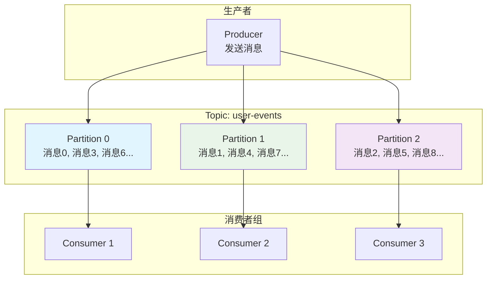

## 概述

Apache Kafka 是一个开源的分布式事件流平台，广泛用于构建实时数据管道和流应用。本手册将帮助您从零开始掌握 Kafka 的使用，包括环境搭建、基本操作、高级特性和生产环境最佳实践。

<!--more-->

## 1. 快速入门指南

### 1.1 环境准备

#### 系统要求
- **Java**: JDK 8+ (推荐 JDK 11 或更高版本)
- **内存**: 最少 4GB RAM (生产环境推荐 16GB+)
- **磁盘**: SSD 存储，至少 100GB 可用空间
- **网络**: 稳定的网络连接，低延迟

#### 下载和安装

```bash
# 1. 下载 Kafka
wget https://downloads.apache.org/kafka/2.8.0/kafka_2.13-2.8.0.tgz
tar -xzf kafka_2.13-2.8.0.tgz
cd kafka_2.13-2.8.0

# 2. 设置环境变量
export KAFKA_HOME=/path/to/kafka_2.13-2.8.0
export PATH=$PATH:$KAFKA_HOME/bin
```

### 1.2 启动 Kafka 集群

#### 使用 KRaft 模式（推荐）

```bash
# 1. 生成集群 UUID
KAFKA_CLUSTER_ID="$(bin/kafka-storage.sh random-uuid)"

# 2. 格式化日志目录
bin/kafka-storage.sh format -t $KAFKA_CLUSTER_ID -c config/kraft/server.properties

# 3. 启动 Kafka 服务器
bin/kafka-server-start.sh config/kraft/server.properties
```

#### 使用 ZooKeeper 模式（传统模式）

```bash
# 1. 启动 ZooKeeper
bin/zookeeper-server-start.sh config/zookeeper.properties

# 2. 启动 Kafka Broker
bin/kafka-server-start.sh config/server.properties
```

### 1.3 基本操作示例

#### 创建主题

```bash
# 创建一个名为 "quickstart-events" 的主题
bin/kafka-topics.sh --create \
    --topic quickstart-events \
    --bootstrap-server localhost:9092 \
    --partitions 3 \
    --replication-factor 1
```

#### 生产消息

```bash
# 启动生产者控制台
bin/kafka-console-producer.sh \
    --topic quickstart-events \
    --bootstrap-server localhost:9092

# 输入消息（每行一条消息）
Hello Kafka
This is my first message
Welcome to event streaming
```

#### 消费消息

```bash
# 启动消费者控制台
bin/kafka-console-consumer.sh \
    --topic quickstart-events \
    --from-beginning \
    --bootstrap-server localhost:9092
```

## 2. 核心概念详解

### 2.1 主题和分区



### 2.2 生产者和消费者模型

#### 生产者特性
- **异步发送**: 提高吞吐量
- **批量处理**: 减少网络开销
- **分区策略**: 控制消息分布
- **幂等性**: 防止消息重复
- **事务支持**: 保证原子性

#### 消费者特性
- **消费者组**: 实现负载均衡
- **偏移量管理**: 跟踪消费进度
- **再平衡**: 动态分区分配
- **多种消费模式**: 自动提交、手动提交

## 3. 配置指南

### 3.1 Broker 核心配置

#### 基础配置 (server.properties)

```properties
# 服务器基本信息
broker.id=0
listeners=PLAINTEXT://localhost:9092
advertised.listeners=PLAINTEXT://localhost:9092

# 日志配置
log.dirs=/var/kafka-logs
num.network.threads=8
num.io.threads=8
socket.send.buffer.bytes=102400
socket.receive.buffer.bytes=102400
socket.request.max.bytes=104857600

# 日志保留策略
log.retention.hours=168
log.retention.bytes=1073741824
log.segment.bytes=1073741824
log.retention.check.interval.ms=300000

# 副本配置
default.replication.factor=3
min.insync.replicas=2
unclean.leader.election.enable=false

# 压缩配置
compression.type=producer
log.cleanup.policy=delete
```

#### 性能调优配置

```properties
# 网络优化
num.network.threads=16
num.io.threads=16
queued.max.requests=500
socket.send.buffer.bytes=1048576
socket.receive.buffer.bytes=1048576

# 日志优化
log.flush.interval.messages=10000
log.flush.interval.ms=1000
log.segment.bytes=536870912
log.index.interval.bytes=4096

# 副本优化
replica.fetch.max.bytes=1048576
replica.fetch.wait.max.ms=500
replica.high.watermark.checkpoint.interval.ms=5000

# JVM 优化
export KAFKA_HEAP_OPTS="-Xmx6g -Xms6g"
export KAFKA_JVM_PERFORMANCE_OPTS="-server -XX:+UseG1GC -XX:MaxGCPauseMillis=20 -XX:InitiatingHeapOccupancyPercent=35"
```

### 3.2 生产者配置

#### Java 生产者配置

```java
Properties props = new Properties();

// 基础配置
props.put(ProducerConfig.BOOTSTRAP_SERVERS_CONFIG, "localhost:9092");
props.put(ProducerConfig.KEY_SERIALIZER_CLASS_CONFIG, StringSerializer.class.getName());
props.put(ProducerConfig.VALUE_SERIALIZER_CLASS_CONFIG, StringSerializer.class.getName());

// 性能配置
props.put(ProducerConfig.BATCH_SIZE_CONFIG, 16384);          // 批次大小
props.put(ProducerConfig.LINGER_MS_CONFIG, 5);               // 等待时间
props.put(ProducerConfig.BUFFER_MEMORY_CONFIG, 33554432);    // 缓冲区大小
props.put(ProducerConfig.COMPRESSION_TYPE_CONFIG, "snappy"); // 压缩类型

// 可靠性配置
props.put(ProducerConfig.ACKS_CONFIG, "all");                // 确认级别
props.put(ProducerConfig.RETRIES_CONFIG, Integer.MAX_VALUE); // 重试次数
props.put(ProducerConfig.ENABLE_IDEMPOTENCE_CONFIG, true);   // 幂等性

// 事务配置（如果需要）
props.put(ProducerConfig.TRANSACTIONAL_ID_CONFIG, "my-transactional-id");

KafkaProducer<String, String> producer = new KafkaProducer<>(props);
```

### 3.3 消费者配置

#### Java 消费者配置

```java
Properties props = new Properties();

// 基础配置
props.put(ConsumerConfig.BOOTSTRAP_SERVERS_CONFIG, "localhost:9092");
props.put(ConsumerConfig.GROUP_ID_CONFIG, "my-consumer-group");
props.put(ConsumerConfig.KEY_DESERIALIZER_CLASS_CONFIG, StringDeserializer.class.getName());
props.put(ConsumerConfig.VALUE_DESERIALIZER_CLASS_CONFIG, StringDeserializer.class.getName());

// 消费策略
props.put(ConsumerConfig.AUTO_OFFSET_RESET_CONFIG, "earliest");
props.put(ConsumerConfig.ENABLE_AUTO_COMMIT_CONFIG, false);  // 手动提交
props.put(ConsumerConfig.AUTO_COMMIT_INTERVAL_MS_CONFIG, 1000);

// 性能配置
props.put(ConsumerConfig.FETCH_MIN_BYTES_CONFIG, 1024);
props.put(ConsumerConfig.FETCH_MAX_WAIT_MS_CONFIG, 500);
props.put(ConsumerConfig.MAX_PARTITION_FETCH_BYTES_CONFIG, 1048576);
props.put(ConsumerConfig.MAX_POLL_RECORDS_CONFIG, 500);

// 会话配置
props.put(ConsumerConfig.SESSION_TIMEOUT_MS_CONFIG, 30000);
props.put(ConsumerConfig.HEARTBEAT_INTERVAL_MS_CONFIG, 3000);
props.put(ConsumerConfig.MAX_POLL_INTERVAL_MS_CONFIG, 300000);

// 事务隔离级别
props.put(ConsumerConfig.ISOLATION_LEVEL_CONFIG, "read_committed");

KafkaConsumer<String, String> consumer = new KafkaConsumer<>(props);
```

## 4. API 使用指南

### 4.1 生产者 API

#### 基本使用

```java
public class SimpleProducer {
    public static void main(String[] args) {
        Properties props = new Properties();
        props.put(ProducerConfig.BOOTSTRAP_SERVERS_CONFIG, "localhost:9092");
        props.put(ProducerConfig.KEY_SERIALIZER_CLASS_CONFIG, StringSerializer.class);
        props.put(ProducerConfig.VALUE_SERIALIZER_CLASS_CONFIG, StringSerializer.class);
        
        try (KafkaProducer<String, String> producer = new KafkaProducer<>(props)) {
            for (int i = 0; i < 100; i++) {
                ProducerRecord<String, String> record = new ProducerRecord<>(
                    "my-topic", 
                    "key-" + i, 
                    "value-" + i
                );
                
                // 异步发送
                producer.send(record, (metadata, exception) -> {
                    if (exception != null) {
                        System.err.println("发送失败: " + exception.getMessage());
                    } else {
                        System.out.printf("发送成功: topic=%s, partition=%d, offset=%d%n",
                            metadata.topic(), metadata.partition(), metadata.offset());
                    }
                });
            }
            
            // 确保所有消息发送完成
            producer.flush();
        }
    }
}
```

#### 事务生产者

```java
public class TransactionalProducer {
    public static void main(String[] args) {
        Properties props = new Properties();
        props.put(ProducerConfig.BOOTSTRAP_SERVERS_CONFIG, "localhost:9092");
        props.put(ProducerConfig.KEY_SERIALIZER_CLASS_CONFIG, StringSerializer.class);
        props.put(ProducerConfig.VALUE_SERIALIZER_CLASS_CONFIG, StringSerializer.class);
        props.put(ProducerConfig.TRANSACTIONAL_ID_CONFIG, "my-transactional-id");
        props.put(ProducerConfig.ENABLE_IDEMPOTENCE_CONFIG, true);
        
        try (KafkaProducer<String, String> producer = new KafkaProducer<>(props)) {
            // 初始化事务
            producer.initTransactions();
            
            try {
                // 开始事务
                producer.beginTransaction();
                
                // 发送消息
                for (int i = 0; i < 100; i++) {
                    ProducerRecord<String, String> record = new ProducerRecord<>(
                        "my-topic", "key-" + i, "value-" + i);
                    producer.send(record);
                }
                
                // 提交事务
                producer.commitTransaction();
                System.out.println("事务提交成功");
                
            } catch (Exception e) {
                // 中止事务
                producer.abortTransaction();
                System.err.println("事务中止: " + e.getMessage());
            }
        }
    }
}
```

### 4.2 消费者 API

#### 基本使用

```java
public class SimpleConsumer {
    public static void main(String[] args) {
        Properties props = new Properties();
        props.put(ConsumerConfig.BOOTSTRAP_SERVERS_CONFIG, "localhost:9092");
        props.put(ConsumerConfig.GROUP_ID_CONFIG, "my-consumer-group");
        props.put(ConsumerConfig.KEY_DESERIALIZER_CLASS_CONFIG, StringDeserializer.class);
        props.put(ConsumerConfig.VALUE_DESERIALIZER_CLASS_CONFIG, StringDeserializer.class);
        props.put(ConsumerConfig.AUTO_OFFSET_RESET_CONFIG, "earliest");
        
        try (KafkaConsumer<String, String> consumer = new KafkaConsumer<>(props)) {
            // 订阅主题
            consumer.subscribe(Arrays.asList("my-topic"));
            
            while (true) {
                ConsumerRecords<String, String> records = consumer.poll(Duration.ofMillis(100));
                
                for (ConsumerRecord<String, String> record : records) {
                    System.out.printf("消费消息: topic=%s, partition=%d, offset=%d, key=%s, value=%s%n",
                        record.topic(), record.partition(), record.offset(), 
                        record.key(), record.value());
                }
                
                // 手动提交偏移量
                consumer.commitSync();
            }
        }
    }
}
```

#### 手动分区分配

```java
public class ManualAssignmentConsumer {
    public static void main(String[] args) {
        Properties props = new Properties();
        props.put(ConsumerConfig.BOOTSTRAP_SERVERS_CONFIG, "localhost:9092");
        props.put(ConsumerConfig.KEY_DESERIALIZER_CLASS_CONFIG, StringDeserializer.class);
        props.put(ConsumerConfig.VALUE_DESERIALIZER_CLASS_CONFIG, StringDeserializer.class);
        
        try (KafkaConsumer<String, String> consumer = new KafkaConsumer<>(props)) {
            // 手动分配分区
            TopicPartition partition0 = new TopicPartition("my-topic", 0);
            TopicPartition partition1 = new TopicPartition("my-topic", 1);
            consumer.assign(Arrays.asList(partition0, partition1));
            
            // 从特定偏移量开始消费
            consumer.seek(partition0, 100);
            consumer.seek(partition1, 200);
            
            while (true) {
                ConsumerRecords<String, String> records = consumer.poll(Duration.ofMillis(100));
                
                for (ConsumerRecord<String, String> record : records) {
                    System.out.printf("消费消息: partition=%d, offset=%d, value=%s%n",
                        record.partition(), record.offset(), record.value());
                }
            }
        }
    }
}
```

### 4.3 管理员 API

#### 主题管理

```java
public class TopicManager {
    public static void main(String[] args) {
        Properties props = new Properties();
        props.put(AdminClientConfig.BOOTSTRAP_SERVERS_CONFIG, "localhost:9092");
        
        try (AdminClient admin = AdminClient.create(props)) {
            // 创建主题
            NewTopic newTopic = new NewTopic("my-new-topic", 3, (short) 1);
            Map<String, String> configs = new HashMap<>();
            configs.put(TopicConfig.CLEANUP_POLICY_CONFIG, TopicConfig.CLEANUP_POLICY_COMPACT);
            configs.put(TopicConfig.RETENTION_MS_CONFIG, "86400000"); // 1天
            newTopic.configs(configs);
            
            CreateTopicsResult createResult = admin.createTopics(Collections.singleton(newTopic));
            createResult.all().get(); // 等待创建完成
            System.out.println("主题创建成功");
            
            // 列出所有主题
            ListTopicsResult listResult = admin.listTopics();
            Set<String> topics = listResult.names().get();
            System.out.println("现有主题: " + topics);
            
            // 描述主题
            DescribeTopicsResult describeResult = admin.describeTopics(Collections.singleton("my-new-topic"));
            TopicDescription description = describeResult.values().get("my-new-topic").get();
            System.out.println("主题描述: " + description);
            
            // 删除主题
            DeleteTopicsResult deleteResult = admin.deleteTopics(Collections.singleton("my-new-topic"));
            deleteResult.all().get();
            System.out.println("主题删除成功");
            
        } catch (Exception e) {
            System.err.println("操作失败: " + e.getMessage());
        }
    }
}
```

#### 消费者组管理

```java
public class ConsumerGroupManager {
    public static void main(String[] args) {
        Properties props = new Properties();
        props.put(AdminClientConfig.BOOTSTRAP_SERVERS_CONFIG, "localhost:9092");
        
        try (AdminClient admin = AdminClient.create(props)) {
            // 列出消费者组
            ListConsumerGroupsResult listResult = admin.listConsumerGroups();
            Collection<ConsumerGroupListing> groups = listResult.all().get();
            
            for (ConsumerGroupListing group : groups) {
                System.out.println("消费者组: " + group.groupId() + ", 状态: " + group.state());
            }
            
            // 描述消费者组
            String groupId = "my-consumer-group";
            DescribeConsumerGroupsResult describeResult = admin.describeConsumerGroups(
                Collections.singleton(groupId));
            ConsumerGroupDescription groupDesc = describeResult.describedGroups().get(groupId).get();
            
            System.out.println("组状态: " + groupDesc.state());
            System.out.println("协调器: " + groupDesc.coordinator());
            System.out.println("成员数量: " + groupDesc.members().size());
            
            // 查看消费者组偏移量
            ListConsumerGroupOffsetsResult offsetsResult = admin.listConsumerGroupOffsets(groupId);
            Map<TopicPartition, OffsetAndMetadata> offsets = offsetsResult.partitionsToOffsetAndMetadata().get();
            
            for (Map.Entry<TopicPartition, OffsetAndMetadata> entry : offsets.entrySet()) {
                System.out.printf("分区: %s, 偏移量: %d%n", 
                    entry.getKey(), entry.getValue().offset());
            }
            
        } catch (Exception e) {
            System.err.println("操作失败: " + e.getMessage());
        }
    }
}
```

## 5. 高级特性

### 5.1 Kafka Streams

#### 基本流处理

```java
public class WordCountStream {
    public static void main(String[] args) {
        Properties props = new Properties();
        props.put(StreamsConfig.APPLICATION_ID_CONFIG, "word-count-app");
        props.put(StreamsConfig.BOOTSTRAP_SERVERS_CONFIG, "localhost:9092");
        props.put(StreamsConfig.DEFAULT_KEY_SERDE_CLASS_CONFIG, Serdes.String().getClass());
        props.put(StreamsConfig.DEFAULT_VALUE_SERDE_CLASS_CONFIG, Serdes.String().getClass());
        
        StreamsBuilder builder = new StreamsBuilder();
        
        // 构建流处理拓扑
        KStream<String, String> textLines = builder.stream("text-input");
        
        KTable<String, Long> wordCounts = textLines
            .flatMapValues(textLine -> Arrays.asList(textLine.toLowerCase().split("\\W+")))
            .groupBy((key, word) -> word)
            .count(Materialized.as("counts-store"));
        
        wordCounts.toStream().to("word-count-output", Produced.with(Serdes.String(), Serdes.Long()));
        
        KafkaStreams streams = new KafkaStreams(builder.build(), props);
        
        // 启动流处理应用
        streams.start();
        
        // 优雅关闭
        Runtime.getRuntime().addShutdownHook(new Thread(streams::close));
    }
}
```

### 5.2 Kafka Connect

#### Source Connector 配置

```json
{
  "name": "file-source-connector",
  "config": {
    "connector.class": "org.apache.kafka.connect.file.FileStreamSourceConnector",
    "tasks.max": "1",
    "file": "/tmp/input.txt",
    "topic": "file-input",
    "key.converter": "org.apache.kafka.connect.storage.StringConverter",
    "value.converter": "org.apache.kafka.connect.storage.StringConverter"
  }
}
```

#### Sink Connector 配置

```json
{
  "name": "file-sink-connector",
  "config": {
    "connector.class": "org.apache.kafka.connect.file.FileStreamSinkConnector",
    "tasks.max": "1",
    "file": "/tmp/output.txt",
    "topics": "file-input",
    "key.converter": "org.apache.kafka.connect.storage.StringConverter",
    "value.converter": "org.apache.kafka.connect.storage.StringConverter"
  }
}
```

## 6. 监控和运维

### 6.1 JMX 监控指标

#### 关键指标

```bash
# Broker 指标
kafka.server:type=BrokerTopicMetrics,name=MessagesInPerSec
kafka.server:type=BrokerTopicMetrics,name=BytesInPerSec
kafka.server:type=BrokerTopicMetrics,name=BytesOutPerSec

# 生产者指标
kafka.producer:type=producer-metrics,client-id=*
kafka.producer:type=producer-topic-metrics,client-id=*,topic=*

# 消费者指标
kafka.consumer:type=consumer-metrics,client-id=*
kafka.consumer:type=consumer-coordinator-metrics,client-id=*
```

#### Prometheus 监控配置

```yaml
# prometheus.yml
global:
  scrape_interval: 15s

scrape_configs:
  - job_name: 'kafka'
    static_configs:
      - targets: ['localhost:9308']
    metrics_path: /metrics
    scrape_interval: 5s
```

### 6.2 日志配置

#### Log4j 配置 (log4j.properties)

```properties
# Root logger
log4j.rootLogger=INFO, stdout, kafkaAppender

# Console appender
log4j.appender.stdout=org.apache.log4j.ConsoleAppender
log4j.appender.stdout.layout=org.apache.log4j.PatternLayout
log4j.appender.stdout.layout.ConversionPattern=[%d] %p %m (%c)%n

# Kafka appender
log4j.appender.kafkaAppender=org.apache.log4j.RollingFileAppender
log4j.appender.kafkaAppender.File=${kafka.logs.dir}/server.log
log4j.appender.kafkaAppender.MaxFileSize=100MB
log4j.appender.kafkaAppender.MaxBackupIndex=10
log4j.appender.kafkaAppender.layout=org.apache.log4j.PatternLayout
log4j.appender.kafkaAppender.layout.ConversionPattern=[%d] %p %m (%c)%n

# Specific loggers
log4j.logger.kafka=INFO
log4j.logger.org.apache.kafka=INFO
log4j.logger.kafka.controller=TRACE
log4j.logger.kafka.log.LogCleaner=INFO
log4j.logger.state.change.logger=TRACE
log4j.logger.kafka.authorizer.logger=WARN
```

## 7. 性能调优

### 7.1 操作系统调优

#### 内核参数优化

```bash
# /etc/sysctl.conf
# 网络优化
net.core.rmem_default = 262144
net.core.rmem_max = 16777216
net.core.wmem_default = 262144
net.core.wmem_max = 16777216
net.ipv4.tcp_rmem = 4096 65536 16777216
net.ipv4.tcp_wmem = 4096 65536 16777216

# 文件系统优化
vm.dirty_ratio = 80
vm.dirty_background_ratio = 5
vm.swappiness = 1

# 应用生效
sysctl -p
```

#### 文件系统优化

```bash
# 挂载选项优化
/dev/sdb1 /var/kafka-logs ext4 defaults,noatime,nodiratime 0 2

# 磁盘调度器优化
echo deadline > /sys/block/sdb/queue/scheduler
```

### 7.2 JVM 调优

#### 生产环境 JVM 参数

```bash
# kafka-server-start.sh 中的 JVM 参数
export KAFKA_HEAP_OPTS="-Xmx6g -Xms6g"
export KAFKA_JVM_PERFORMANCE_OPTS="-server -XX:+UseG1GC -XX:MaxGCPauseMillis=20 -XX:InitiatingHeapOccupancyPercent=35 -XX:+ExplicitGCInvokesConcurrent -XX:MaxInlineLevel=15 -Djava.awt.headless=true"

# GC 日志
export KAFKA_GC_LOG_OPTS="-Xloggc:/var/log/kafka/kafkaServer-gc.log -verbose:gc -XX:+PrintGCDetails -XX:+PrintGCDateStamps -XX:+PrintGCTimeStamps -XX:+UseGCLogFileRotation -XX:NumberOfGCLogFiles=10 -XX:GCLogFileSize=100M"

# JMX 监控
export KAFKA_JMX_OPTS="-Dcom.sun.management.jmxremote -Dcom.sun.management.jmxremote.authenticate=false -Dcom.sun.management.jmxremote.ssl=false -Dcom.sun.management.jmxremote.port=9999"
```

### 7.3 Kafka 参数调优

#### 高吞吐量配置

```properties
# 网络线程数（通常设置为 CPU 核数）
num.network.threads=16
num.io.threads=16

# 批处理优化
batch.size=65536
linger.ms=5
compression.type=lz4

# 缓冲区优化
socket.send.buffer.bytes=1048576
socket.receive.buffer.bytes=1048576
replica.socket.receive.buffer.bytes=1048576

# 日志段大小
log.segment.bytes=1073741824

# 副本获取优化
replica.fetch.max.bytes=1048576
replica.fetch.wait.max.ms=500
```

#### 低延迟配置

```properties
# 减少批处理等待时间
linger.ms=0
batch.size=16384

# 减少网络缓冲
socket.send.buffer.bytes=131072
socket.receive.buffer.bytes=131072

# 快速副本同步
replica.fetch.wait.max.ms=50
replica.fetch.min.bytes=1

# 减少日志刷新间隔
log.flush.interval.messages=1
log.flush.interval.ms=50
```

## 8. 安全配置

### 8.1 SSL/TLS 加密

#### 生成证书

```bash
# 1. 创建 CA
openssl req -new -x509 -keyout ca-key -out ca-cert -days 365

# 2. 创建服务器证书
keytool -keystore kafka.server.keystore.jks -alias localhost -validity 365 -genkey -keyalg RSA

# 3. 创建证书签名请求
keytool -keystore kafka.server.keystore.jks -alias localhost -certreq -file cert-file

# 4. 用 CA 签名
openssl x509 -req -CA ca-cert -CAkey ca-key -in cert-file -out cert-signed -days 365 -CAcreateserial

# 5. 导入证书
keytool -keystore kafka.server.keystore.jks -alias CARoot -import -file ca-cert
keytool -keystore kafka.server.keystore.jks -alias localhost -import -file cert-signed
```

#### SSL 配置

```properties
# server.properties
listeners=SSL://localhost:9093
ssl.keystore.location=/path/to/kafka.server.keystore.jks
ssl.keystore.password=password
ssl.key.password=password
ssl.truststore.location=/path/to/kafka.server.truststore.jks
ssl.truststore.password=password
ssl.client.auth=required
ssl.enabled.protocols=TLSv1.2,TLSv1.3
ssl.keystore.type=JKS
ssl.truststore.type=JKS
```

### 8.2 SASL 认证

#### SASL/PLAIN 配置

```properties
# server.properties
listeners=SASL_PLAINTEXT://localhost:9092
security.inter.broker.protocol=SASL_PLAINTEXT
sasl.mechanism.inter.broker.protocol=PLAIN
sasl.enabled.mechanisms=PLAIN

# JAAS 配置文件
# kafka_server_jaas.conf
KafkaServer {
    org.apache.kafka.common.security.plain.PlainLoginModule required
    username="admin"
    password="admin-secret"
    user_admin="admin-secret"
    user_alice="alice-secret";
};
```

### 8.3 ACL 权限控制

#### 启用 ACL

```properties
# server.properties
authorizer.class.name=kafka.security.authorizer.AclAuthorizer
super.users=User:admin
```

#### 设置 ACL 规则

```bash
# 给用户 alice 授予主题 test 的读写权限
bin/kafka-acls.sh --authorizer-properties zookeeper.connect=localhost:2181 \
    --add --allow-principal User:alice \
    --operation Read --operation Write \
    --topic test

# 给用户 bob 授予消费者组 my-group 的权限
bin/kafka-acls.sh --authorizer-properties zookeeper.connect=localhost:2181 \
    --add --allow-principal User:bob \
    --operation Read \
    --group my-group
```

## 9. 故障排查

### 9.1 常见问题诊断

#### 连接问题

```bash
# 检查端口是否开放
telnet localhost 9092

# 检查防火墙
iptables -L -n | grep 9092

# 检查 DNS 解析
nslookup kafka-broker-1
```

#### 性能问题

```bash
# 检查磁盘 I/O
iostat -x 1

# 检查网络带宽
iftop -i eth0

# 检查 JVM 内存使用
jstat -gc <kafka-pid>

# 检查 GC 日志
tail -f /var/log/kafka/kafkaServer-gc.log
```

#### 日志分析

```bash
# 查看 Kafka 日志
tail -f /var/log/kafka/server.log

# 搜索错误信息
grep -i error /var/log/kafka/server.log

# 查看控制器日志
grep -i controller /var/log/kafka/server.log
```

### 9.2 监控告警

#### 关键监控指标

```yaml
# Grafana 仪表板配置示例
- alert: KafkaDown
  expr: up{job="kafka"} == 0
  for: 1m
  labels:
    severity: critical
  annotations:
    summary: "Kafka broker is down"

- alert: HighProducerLatency
  expr: kafka_producer_request_latency_avg > 100
  for: 5m
  labels:
    severity: warning
  annotations:
    summary: "High producer latency detected"

- alert: ConsumerLag
  expr: kafka_consumer_lag_sum > 1000
  for: 5m
  labels:
    severity: warning
  annotations:
    summary: "Consumer lag is high"
```

## 10. 最佳实践

### 10.1 设计原则

#### 主题设计
- **分区数量**: 根据预期吞吐量设计，通常每个分区 10-30MB/s
- **副本因子**: 生产环境建议设置为 3
- **命名规范**: 使用有意义的命名，如 `业务域.事件类型.版本`
- **数据格式**: 使用 Avro、JSON Schema 等结构化格式

#### 生产者最佳实践
- **批处理**: 合理设置 `batch.size` 和 `linger.ms`
- **压缩**: 使用 `lz4` 或 `snappy` 压缩
- **幂等性**: 启用 `enable.idempotence=true`
- **错误处理**: 实现重试和死信队列机制

#### 消费者最佳实践
- **消费者组**: 合理设计消费者组和分区分配
- **偏移量管理**: 根据业务需求选择自动或手动提交
- **异常处理**: 实现消费失败的重试和跳过机制
- **背压控制**: 避免消费者处理速度过慢导致的积压

### 10.2 运维最佳实践

#### 容量规划
- **存储**: 根据数据保留期和吞吐量计算存储需求
- **网络**: 考虑副本同步和客户端流量的网络带宽
- **内存**: Broker 内存主要用于页缓存，不要设置过大的堆内存

#### 部署架构
- **机架感知**: 配置 `broker.rack` 实现跨机架部署
- **专用硬件**: 使用 SSD 存储和高速网络
- **隔离部署**: 避免与其他高 I/O 应用共享资源

#### 备份和恢复
- **MirrorMaker**: 使用 MirrorMaker 2.0 进行跨集群复制
- **快照备份**: 定期备份重要的内部主题
- **灾难恢复**: 制定完整的灾难恢复计划

## 11. 总结

Apache Kafka 作为现代数据架构的核心组件，提供了强大的事件流处理能力。通过本手册的学习，您应该能够：

1. **快速上手**: 搭建 Kafka 环境并进行基本操作
2. **深入理解**: 掌握 Kafka 的核心概念和工作原理
3. **实际应用**: 使用各种 API 构建生产级应用
4. **性能优化**: 根据业务需求进行性能调优
5. **运维管理**: 实施监控、安全和故障处理

### 持续学习建议

- **官方文档**: 定期查看 Apache Kafka 官方文档的更新
- **社区参与**: 参与 Kafka 社区讨论和贡献
- **实践项目**: 通过实际项目加深对 Kafka 的理解
- **监控分析**: 建立完善的监控体系，持续优化性能

通过遵循本手册的指导和最佳实践，您将能够充分发挥 Kafka 的强大功能，构建高效、可靠的事件驱动架构。
